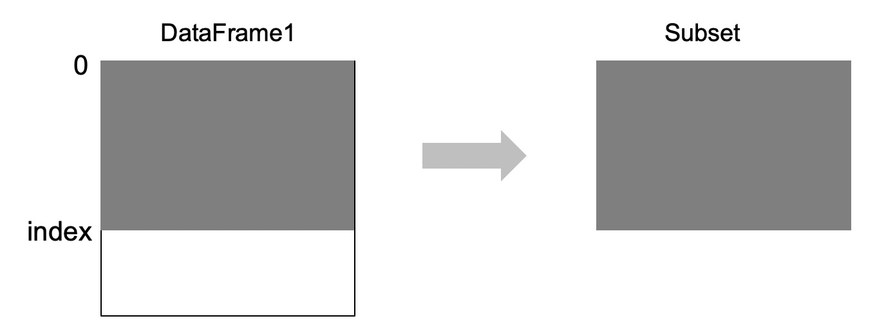

### 1. Subset by rows

```python
df[0:index]
```


<center><b>Fig 1. Pandas DataFrame.</b></center>

### 1. Subset by rows

```python
df[0:index]
```


<center><b>Fig 1. Pandas DataFrame.</b></center>


```python

```
