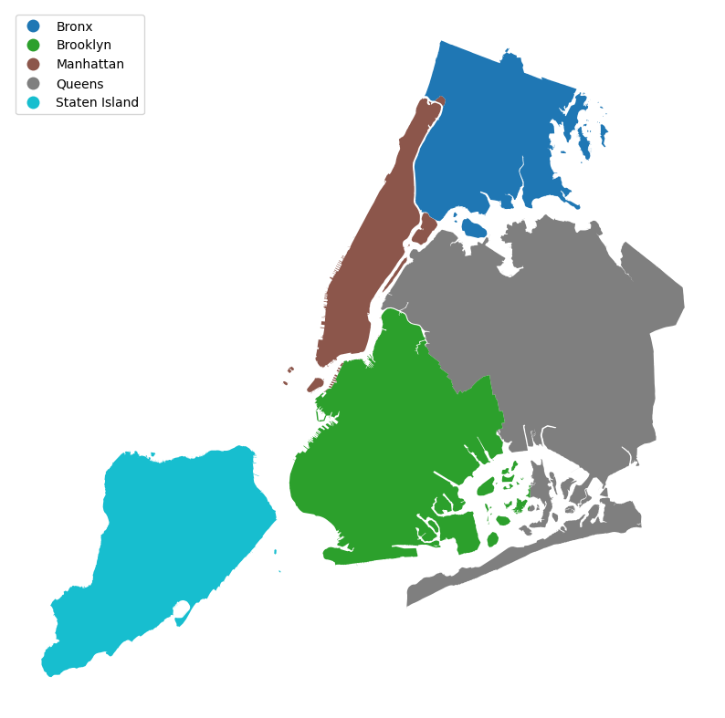
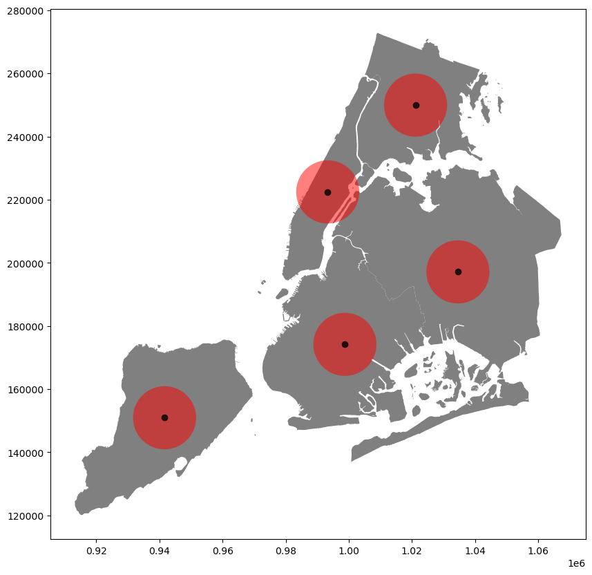
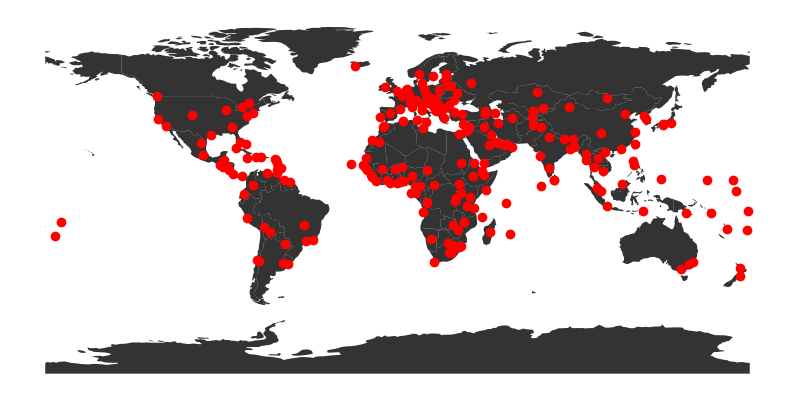
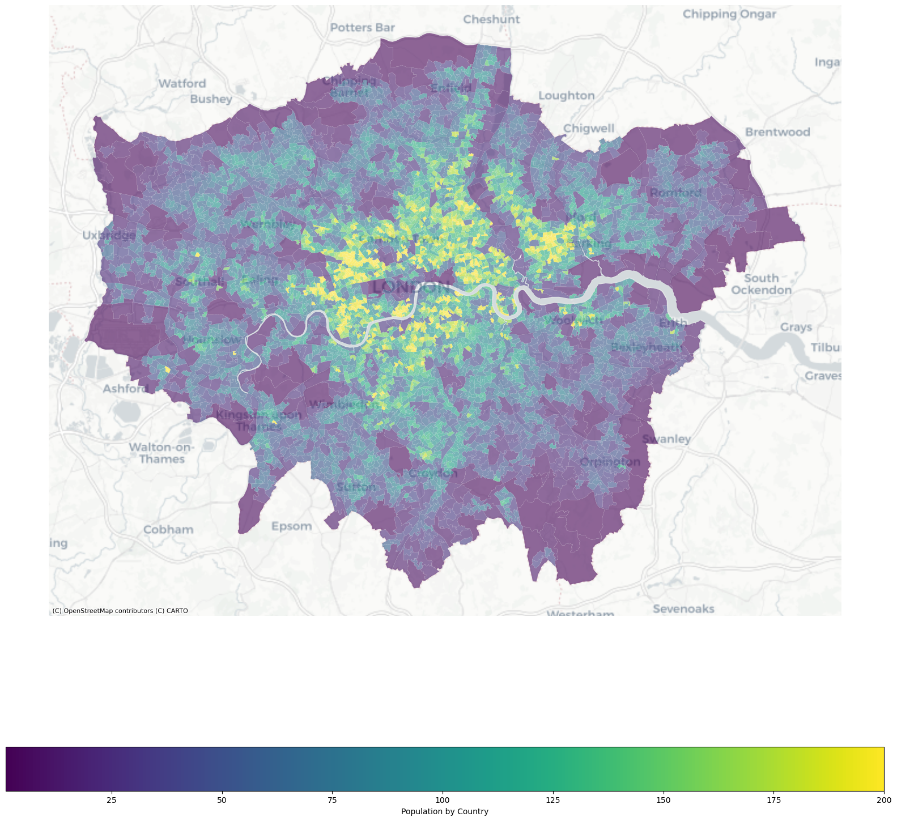
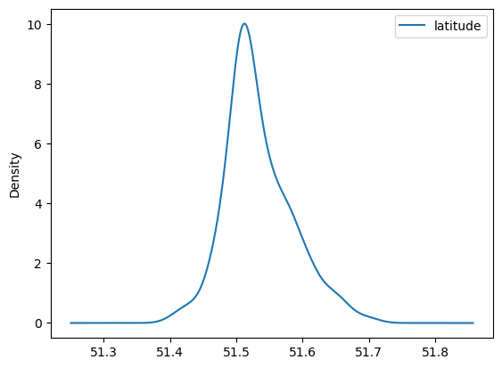
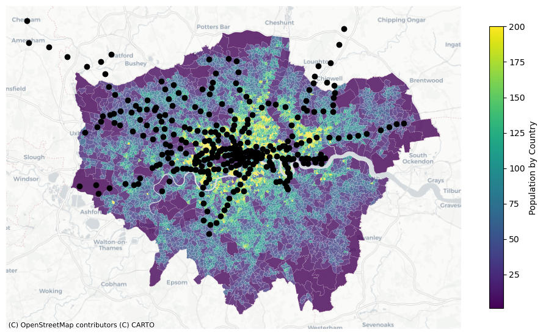

Mining Social and Geographic Datasets
-----------------------------------

GEOG0051 Computer Lab 3.2: GeoPandas for visualisation
-------------------------------

Note: Notebook might contain scripts and instructions adapted from GEOG0115, GEOG0051. 
Contributors: Stephen Law, Mateo Neira, Nikki Tanu, Thomas Keel, Gong Jie, Jason Tang and Demin Hu.

Overview of Content in this Jupyter Notebook
===============
> ### Lab Notebook 3.2: Introduction to GeoPandas

In this short notebook, we will be reviewing/introducing two mapping libraries in Python. The first is `GeoPandas` and the other is `Folium` library which creates maps for interactions using the `leaflet` library under the hood. 


Introduction to GeoPandas
----------------------

`GeoPandas` is an open source project to make working with geospatial data in python easier. `GeoPandas` extends the datatypes used by `Pandas` to allow spatial operations on geometric types, and is in turn dependent on other Python packages like `shapely` for geometric operations and `fiona` for file access and descartes and `matplotlib` for plotting. [Click here for documentation](https://geopandas.org/index.html).

The core data structure in `GeoPandas` is the `geopandas.GeoDataFrame` that builds on the `pandas.DataFrame` with the addition of the `geometry` for spatial operations. 

 

<center><b>Pandas DataFrame.</b></center>

If you need to install geopandas, you can use the `conda` command or the `pip` command. Please note that the "!"  is used to perform an installation command inside the notebook. 

```python
!pip install geopandas
import geopandas as gpd
```

#### Reference
This short guide follows the official tutorial from the `geopandas` website [link](https://geopandas.org/en/stable/getting_started/introduction.html) for more information please follow the guidance in the link. 


```python
# lets import all the libraries used for this notebook. 
import numpy as np
import pandas as pd
import geopandas as gpd
import contextily as ctx
import matplotlib.pyplot as plt
```

the dataset we will work with is an in-built dataset from the geopandas library called "nybb" that contains the five main boroughs of New York City namely ['Manhattan','Brooklyn','Queens','Bronx','Staten Island']. We would load the dataset from the geodatasets library. But first, we need to install the geodatasets library.
```
!pip install geodatasets
```


```python
!pip install geodatasets
import geodatasets
```

    Requirement already satisfied: geodatasets in /Users/deminhu/anaconda3/envs/envGEOG0051/lib/python3.11/site-packages (2024.8.0)
    Requirement already satisfied: pooch in /Users/deminhu/anaconda3/envs/envGEOG0051/lib/python3.11/site-packages (from geodatasets) (1.8.2)
    Requirement already satisfied: platformdirs>=2.5.0 in /Users/deminhu/anaconda3/envs/envGEOG0051/lib/python3.11/site-packages (from pooch->geodatasets) (4.3.6)
    Requirement already satisfied: packaging>=20.0 in /Users/deminhu/anaconda3/envs/envGEOG0051/lib/python3.11/site-packages (from pooch->geodatasets) (24.2)
    Requirement already satisfied: requests>=2.19.0 in /Users/deminhu/anaconda3/envs/envGEOG0051/lib/python3.11/site-packages (from pooch->geodatasets) (2.32.3)
    Requirement already satisfied: charset_normalizer<4,>=2 in /Users/deminhu/anaconda3/envs/envGEOG0051/lib/python3.11/site-packages (from requests>=2.19.0->pooch->geodatasets) (3.4.1)
    Requirement already satisfied: idna<4,>=2.5 in /Users/deminhu/anaconda3/envs/envGEOG0051/lib/python3.11/site-packages (from requests>=2.19.0->pooch->geodatasets) (3.10)
    Requirement already satisfied: urllib3<3,>=1.21.1 in /Users/deminhu/anaconda3/envs/envGEOG0051/lib/python3.11/site-packages (from requests>=2.19.0->pooch->geodatasets) (2.3.0)
    Requirement already satisfied: certifi>=2017.4.17 in /Users/deminhu/anaconda3/envs/envGEOG0051/lib/python3.11/site-packages (from requests>=2.19.0->pooch->geodatasets) (2024.12.14)


```python
   path_to_file = geodatasets.get_path('nybb')
   gdf = gpd.read_file(path_to_file)
   gdf

```


<div>
<style scoped>
    .dataframe tbody tr th:only-of-type {
        vertical-align: middle;
    }

    .dataframe tbody tr th {
        vertical-align: top;
    }

    .dataframe thead th {
        text-align: right;
    }
</style>
<table border="1" class="dataframe">
  <thead>
    <tr style="text-align: right;">
      <th></th>
      <th>BoroCode</th>
      <th>BoroName</th>
      <th>Shape_Leng</th>
      <th>Shape_Area</th>
      <th>geometry</th>
    </tr>
  </thead>
  <tbody>
    <tr>
      <th>0</th>
      <td>5</td>
      <td>Staten Island</td>
      <td>330470.010332</td>
      <td>1.623820e+09</td>
      <td>MULTIPOLYGON (((970217.022 145643.332, 970227....</td>
    </tr>
    <tr>
      <th>1</th>
      <td>4</td>
      <td>Queens</td>
      <td>896344.047763</td>
      <td>3.045213e+09</td>
      <td>MULTIPOLYGON (((1029606.077 156073.814, 102957...</td>
    </tr>
    <tr>
      <th>2</th>
      <td>3</td>
      <td>Brooklyn</td>
      <td>741080.523166</td>
      <td>1.937479e+09</td>
      <td>MULTIPOLYGON (((1021176.479 151374.797, 102100...</td>
    </tr>
    <tr>
      <th>3</th>
      <td>1</td>
      <td>Manhattan</td>
      <td>359299.096471</td>
      <td>6.364715e+08</td>
      <td>MULTIPOLYGON (((981219.056 188655.316, 980940....</td>
    </tr>
    <tr>
      <th>4</th>
      <td>2</td>
      <td>Bronx</td>
      <td>464392.991824</td>
      <td>1.186925e+09</td>
      <td>MULTIPOLYGON (((1012821.806 229228.265, 101278...</td>
    </tr>
  </tbody>
</table>
</div>


in geopandas you can quickly visualise the data geographically by using the `plot` function. You can also include a `column` you want to visualise. In this case, we visualise each `BoroName` as a different category. 


```python
gdf.plot('BoroName',legend=True,legend_kwds={'loc': 'upper left'},figsize=(10,10))
plt.axis('off')
```


    (905464.7390380859, 1075092.8783935546, 112485.76063504723, 280480.4142594267)


    

    


to access the coordinate reference system of the geometry, ones can call the `crs` method. This particular dataset uses `EPSG:2263` which is a common projected coordinate system for the US. 


```python
gdf.crs
```


    <Projected CRS: EPSG:2263>
    Name: NAD83 / New York Long Island (ftUS)
    Axis Info [cartesian]:
    - X[east]: Easting (US survey foot)
    - Y[north]: Northing (US survey foot)
    Area of Use:
    - name: United States (USA) - New York - counties of Bronx; Kings; Nassau; New York; Queens; Richmond; Suffolk.
    - bounds: (-74.26, 40.47, -71.8, 41.3)
    Coordinate Operation:
    - name: SPCS83 New York Long Island zone (US survey foot)
    - method: Lambert Conic Conformal (2SP)
    Datum: North American Datum 1983
    - Ellipsoid: GRS 1980
    - Prime Meridian: Greenwich


you can easily change the projection system by `to_crs(epsg={projection})`. 


```python
gdf.to_crs(epsg='4326').crs

```


    <Geographic 2D CRS: EPSG:4326>
    Name: WGS 84
    Axis Info [ellipsoidal]:
    - Lat[north]: Geodetic latitude (degree)
    - Lon[east]: Geodetic longitude (degree)
    Area of Use:
    - name: World.
    - bounds: (-180.0, -90.0, 180.0, 90.0)
    Datum: World Geodetic System 1984 ensemble
    - Ellipsoid: WGS 84
    - Prime Meridian: Greenwich


you can create centroids and buffer from the geometry column easily by calling the `centroid` method and `buffer` method.


```python
# creating a centroid from the geometry
gdf['centroid'] = gdf.centroid

# buffering the centroid geometry by 10 000 feet 
gdf["buffered_centroid"] = gdf["centroid"].buffer(10000)
```

#### 🤨 TASK
what if we want to overlay the boroughs, the centroid and the centroid buffer, one on top another legibly?

*Replace the `???` with your answer...*


```python
???
```

    Object `?` not found.


```python
# remove in questions
fig,ax=plt.subplots(figsize=(10,10))
gdf.plot(color='grey',ax=ax)
gdf['buffered_centroid'].plot(ax=ax,color='red',alpha=0.5)
gdf['centroid'].plot(ax=ax,color='black',alpha=0.8)
```


    <Axes: >


    

    


let's now practice some spatial operations using two datasets that consists of the polygons of countries and the points of major cities in `GeoPandas`


```python
countries = gpd.read_file('data/graph_shapefile/ne_110m_admin_0_countries.shp')
cities = gpd.read_file('data/graph_shapefile/ne_110m_populated_places.shp')
```

`GeoPandas` has an `explore` function that allows you to visualise the data dynamically using the `folium` library which we will describe in the second half of the notebook.


```python
cities.explore()
```


<div style="width:100%;"><div style="position:relative;width:100%;height:0;padding-bottom:60%;"><span style="color:#565656">Make this Notebook Trusted to load map: File -> Trust Notebook</span><iframe srcdoc="&lt;!DOCTYPE html&gt;
&lt;html&gt;
&lt;head&gt;

    &lt;meta http-equiv=&quot;content-type&quot; content=&quot;text/html; charset=UTF-8&quot; /&gt;

        &lt;script&gt;
            L_NO_TOUCH = false;
            L_DISABLE_3D = false;
        &lt;/script&gt;

    &lt;style&gt;html, body {width: 100%;height: 100%;margin: 0;padding: 0;}&lt;/style&gt;
    &lt;style&gt;#map {position:absolute;top:0;bottom:0;right:0;left:0;}&lt;/style&gt;
    &lt;script src=&quot;https://cdn.jsdelivr.net/npm/leaflet@1.9.3/dist/leaflet.js&quot;&gt;&lt;/script&gt;
    &lt;script src=&quot;https://code.jquery.com/jquery-3.7.1.min.js&quot;&gt;&lt;/script&gt;
    &lt;script src=&quot;https://cdn.jsdelivr.net/npm/bootstrap@5.2.2/dist/js/bootstrap.bundle.min.js&quot;&gt;&lt;/script&gt;
    &lt;script src=&quot;https://cdnjs.cloudflare.com/ajax/libs/Leaflet.awesome-markers/2.0.2/leaflet.awesome-markers.js&quot;&gt;&lt;/script&gt;
    &lt;link rel=&quot;stylesheet&quot; href=&quot;https://cdn.jsdelivr.net/npm/leaflet@1.9.3/dist/leaflet.css&quot;/&gt;
    &lt;link rel=&quot;stylesheet&quot; href=&quot;https://cdn.jsdelivr.net/npm/bootstrap@5.2.2/dist/css/bootstrap.min.css&quot;/&gt;
    &lt;link rel=&quot;stylesheet&quot; href=&quot;https://netdna.bootstrapcdn.com/bootstrap/3.0.0/css/bootstrap-glyphicons.css&quot;/&gt;
    &lt;link rel=&quot;stylesheet&quot; href=&quot;https://cdn.jsdelivr.net/npm/@fortawesome/fontawesome-free@6.2.0/css/all.min.css&quot;/&gt;
    &lt;link rel=&quot;stylesheet&quot; href=&quot;https://cdnjs.cloudflare.com/ajax/libs/Leaflet.awesome-markers/2.0.2/leaflet.awesome-markers.css&quot;/&gt;
    &lt;link rel=&quot;stylesheet&quot; href=&quot;https://cdn.jsdelivr.net/gh/python-visualization/folium/folium/templates/leaflet.awesome.rotate.min.css&quot;/&gt;

            &lt;meta name=&quot;viewport&quot; content=&quot;width=device-width,
                initial-scale=1.0, maximum-scale=1.0, user-scalable=no&quot; /&gt;
            &lt;style&gt;
                #map_ac986c17b3356d25756a292d59c3d261 {
                    position: relative;
                    width: 100.0%;
                    height: 100.0%;
                    left: 0.0%;
                    top: 0.0%;
                }
                .leaflet-container { font-size: 1rem; }
            &lt;/style&gt;


                    &lt;style&gt;
                        .foliumtooltip {

                        }
                       .foliumtooltip table{
                            margin: auto;
                        }
                        .foliumtooltip tr{
                            text-align: left;
                        }
                        .foliumtooltip th{
                            padding: 2px; padding-right: 8px;
                        }
                    &lt;/style&gt;

&lt;/head&gt;
&lt;body&gt;


            &lt;div class=&quot;folium-map&quot; id=&quot;map_ac986c17b3356d25756a292d59c3d261&quot; &gt;&lt;/div&gt;

&lt;/body&gt;
&lt;script&gt;


            var map_ac986c17b3356d25756a292d59c3d261 = L.map(
                &quot;map_ac986c17b3356d25756a292d59c3d261&quot;,
                {
                    center: [11.425695735427617, 1.998041299999997],
                    crs: L.CRS.EPSG3857,
                    ...{
  &quot;zoom&quot;: 10,
  &quot;zoomControl&quot;: true,
  &quot;preferCanvas&quot;: false,
}

                }
            );
            L.control.scale().addTo(map_ac986c17b3356d25756a292d59c3d261);


            var tile_layer_a679bbcd3b8140bd47bb75ce2b6550cd = L.tileLayer(
                &quot;https://tile.openstreetmap.org/{z}/{x}/{y}.png&quot;,
                {
  &quot;minZoom&quot;: 0,
  &quot;maxZoom&quot;: 19,
  &quot;maxNativeZoom&quot;: 19,
  &quot;noWrap&quot;: false,
  &quot;attribution&quot;: &quot;\u0026copy; \u003ca href=\&quot;https://www.openstreetmap.org/copyright\&quot;\u003eOpenStreetMap\u003c/a\u003e contributors&quot;,
  &quot;subdomains&quot;: &quot;abc&quot;,
  &quot;detectRetina&quot;: false,
  &quot;tms&quot;: false,
  &quot;opacity&quot;: 1,
}

            );


            tile_layer_a679bbcd3b8140bd47bb75ce2b6550cd.addTo(map_ac986c17b3356d25756a292d59c3d261);


            map_ac986c17b3356d25756a292d59c3d261.fitBounds(
                [[-41.2920679923151, -175.2205645], [64.14345946317033, 179.2166471]],
                {}
            );


        function geo_json_ac6e49308e22e07e5ec53aa21dacd15d_styler(feature) {
            switch(feature.id) {
                default:
                    return {&quot;fillOpacity&quot;: 0.5, &quot;weight&quot;: 2};
            }
        }
        function geo_json_ac6e49308e22e07e5ec53aa21dacd15d_highlighter(feature) {
            switch(feature.id) {
                default:
                    return {&quot;fillOpacity&quot;: 0.75};
            }
        }
        function geo_json_ac6e49308e22e07e5ec53aa21dacd15d_pointToLayer(feature, latlng) {
            var opts = {&quot;bubblingMouseEvents&quot;: true, &quot;color&quot;: &quot;#3388ff&quot;, &quot;dashArray&quot;: null, &quot;dashOffset&quot;: null, &quot;fill&quot;: true, &quot;fillColor&quot;: &quot;#3388ff&quot;, &quot;fillOpacity&quot;: 0.2, &quot;fillRule&quot;: &quot;evenodd&quot;, &quot;lineCap&quot;: &quot;round&quot;, &quot;lineJoin&quot;: &quot;round&quot;, &quot;opacity&quot;: 1.0, &quot;radius&quot;: 2, &quot;stroke&quot;: true, &quot;weight&quot;: 3};

            let style = geo_json_ac6e49308e22e07e5ec53aa21dacd15d_styler(feature)
            Object.assign(opts, style)

            return new L.CircleMarker(latlng, opts)
        }

        function geo_json_ac6e49308e22e07e5ec53aa21dacd15d_onEachFeature(feature, layer) {
            layer.on({
                mouseout: function(e) {
                    if(typeof e.target.setStyle === &quot;function&quot;){
                            geo_json_ac6e49308e22e07e5ec53aa21dacd15d.resetStyle(e.target);
                    }
                },
                mouseover: function(e) {
                    if(typeof e.target.setStyle === &quot;function&quot;){
                        const highlightStyle = geo_json_ac6e49308e22e07e5ec53aa21dacd15d_highlighter(e.target.feature)
                        e.target.setStyle(highlightStyle);
                    }
                },
            });
        };
        var geo_json_ac6e49308e22e07e5ec53aa21dacd15d = L.geoJson(null, {
                onEachFeature: geo_json_ac6e49308e22e07e5ec53aa21dacd15d_onEachFeature,

                style: geo_json_ac6e49308e22e07e5ec53aa21dacd15d_styler,
                pointToLayer: geo_json_ac6e49308e22e07e5ec53aa21dacd15d_pointToLayer,
            ...{
}
        });

        function geo_json_ac6e49308e22e07e5ec53aa21dacd15d_add (data) {
            geo_json_ac6e49308e22e07e5ec53aa21dacd15d
                .addData(data);
        }
            geo_json_ac6e49308e22e07e5ec53aa21dacd15d_add({&quot;bbox&quot;: [-175.2205645, -41.2920679923151, 179.2166471, 64.14345946317033], &quot;features&quot;: [{&quot;bbox&quot;: [12.4533865, 41.9032822, 12.4533865, 41.9032822], &quot;geometry&quot;: {&quot;coordinates&quot;: [12.4533865, 41.9032822], &quot;type&quot;: &quot;Point&quot;}, &quot;id&quot;: &quot;0&quot;, &quot;properties&quot;: {&quot;ADM0CAP&quot;: 1, &quot;ADM0NAME&quot;: &quot;Vatican&quot;, &quot;ADM0_A3&quot;: &quot;VAT&quot;, &quot;ADM1NAME&quot;: &quot;Lazio&quot;, &quot;CAPALT&quot;: 0, &quot;CAPIN&quot;: null, &quot;FCLASS_AR&quot;: null, &quot;FCLASS_BD&quot;: null, &quot;FCLASS_BR&quot;: null, &quot;FCLASS_CN&quot;: null, &quot;FCLASS_DE&quot;: null, &quot;FCLASS_EG&quot;: null, &quot;FCLASS_ES&quot;: null, &quot;FCLASS_FR&quot;: null, &quot;FCLASS_GB&quot;: null, &quot;FCLASS_GR&quot;: null, &quot;FCLASS_ID&quot;: null, &quot;FCLASS_IL&quot;: null, &quot;FCLASS_IN&quot;: null, &quot;FCLASS_ISO&quot;: null, &quot;FCLASS_IT&quot;: null, &quot;FCLASS_JP&quot;: null, &quot;FCLASS_KO&quot;: null, &quot;FCLASS_MA&quot;: null, &quot;FCLASS_NL&quot;: null, &quot;FCLASS_NP&quot;: null, &quot;FCLASS_PK&quot;: null, &quot;FCLASS_PL&quot;: null, &quot;FCLASS_PS&quot;: null, &quot;FCLASS_PT&quot;: null, &quot;FCLASS_RU&quot;: null, &quot;FCLASS_SA&quot;: null, &quot;FCLASS_SE&quot;: null, &quot;FCLASS_TLC&quot;: null, &quot;FCLASS_TR&quot;: null, &quot;FCLASS_TW&quot;: null, &quot;FCLASS_UA&quot;: null, &quot;FCLASS_US&quot;: null, &quot;FCLASS_VN&quot;: null, &quot;FEATURECLA&quot;: &quot;Admin-0 capital&quot;, &quot;GEONAMESID&quot;: 6691831, &quot;ISO_A2&quot;: &quot;VA&quot;, &quot;LABEL&quot;: null, &quot;LABELRANK&quot;: 3, &quot;LATITUDE&quot;: 41.903282, &quot;LONGITUDE&quot;: 12.453387, &quot;LS_NAME&quot;: &quot;Vatican City&quot;, &quot;MAX_AREAKM&quot;: 177, &quot;MAX_AREAMI&quot;: 68, &quot;MAX_BBXMAX&quot;: 12.481009, &quot;MAX_BBXMIN&quot;: 12.333333, &quot;MAX_BBYMAX&quot;: 42.05, &quot;MAX_BBYMIN&quot;: 41.766667, &quot;MAX_NATSCA&quot;: 20, &quot;MAX_PERKM&quot;: 160, &quot;MAX_PERMI&quot;: 99, &quot;MAX_POP10&quot;: 636762, &quot;MAX_POP20&quot;: 636762, &quot;MAX_POP300&quot;: 0, &quot;MAX_POP310&quot;: 0, &quot;MAX_POP50&quot;: 0, &quot;MEAN_BBXC&quot;: 12.419907, &quot;MEAN_BBYC&quot;: 41.903477, &quot;MEGACITY&quot;: 0, &quot;MEGANAME&quot;: null, &quot;MIN_AREAKM&quot;: 177, &quot;MIN_AREAMI&quot;: 68, &quot;MIN_BBXMAX&quot;: 12.481009, &quot;MIN_BBXMIN&quot;: 12.333333, &quot;MIN_BBYMAX&quot;: 42.05, &quot;MIN_BBYMIN&quot;: 41.766667, &quot;MIN_PERKM&quot;: 160, &quot;MIN_PERMI&quot;: 99, &quot;MIN_ZOOM&quot;: 7.0, &quot;NAME&quot;: &quot;Vatican City&quot;, &quot;NAMEALT&quot;: null, &quot;NAMEASCII&quot;: &quot;Vatican City&quot;, &quot;NAMEPAR&quot;: null, &quot;NAME_AR&quot;: &quot;\u0627\u0644\u0641\u0627\u062a\u064a\u0643\u0627\u0646&quot;, &quot;NAME_BN&quot;: &quot;\u09ad\u09cd\u09af\u09be\u099f\u09bf\u0995\u09be\u09a8 \u09b8\u09bf\u099f\u09bf&quot;, &quot;NAME_DE&quot;: &quot;Vatikanstadt&quot;, &quot;NAME_EL&quot;: &quot;\u0392\u03b1\u03c4\u03b9\u03ba\u03b1\u03bd\u03cc&quot;, &quot;NAME_EN&quot;: &quot;Vatican City&quot;, &quot;NAME_ES&quot;: &quot;Ciudad del Vaticano&quot;, &quot;NAME_FA&quot;: &quot;\u0648\u0627\u062a\u06cc\u06a9\u0627\u0646&quot;, &quot;NAME_FR&quot;: &quot;Cit\u00e9 du Vatican&quot;, &quot;NAME_HE&quot;: &quot;\u05e7\u05e8\u05d9\u05d9\u05ea \u05d4\u05d5\u05d5\u05ea\u05d9\u05e7\u05df&quot;, &quot;NAME_HI&quot;: &quot;\u0935\u0948\u091f\u093f\u0915\u0928 \u0928\u0917\u0930&quot;, &quot;NAME_HU&quot;: &quot;Vatik\u00e1n&quot;, &quot;NAME_ID&quot;: &quot;Vatikan&quot;, &quot;NAME_IT&quot;: &quot;Citt\u00e0 del Vaticano&quot;, &quot;NAME_JA&quot;: &quot;\u30d0\u30c1\u30ab\u30f3&quot;, &quot;NAME_KO&quot;: &quot;\ubc14\ud2f0\uce78 \uc2dc\uad6d&quot;, &quot;NAME_NL&quot;: &quot;Vaticaanstad&quot;, &quot;NAME_PL&quot;: &quot;Watykan&quot;, &quot;NAME_PT&quot;: &quot;Vaticano&quot;, &quot;NAME_RU&quot;: &quot;\u0412\u0430\u0442\u0438\u043a\u0430\u043d&quot;, &quot;NAME_SV&quot;: &quot;Vatikanstaten&quot;, &quot;NAME_TR&quot;: &quot;Vatikan&quot;, &quot;NAME_UK&quot;: &quot;\u0412\u0430\u0442\u0438\u043a\u0430\u043d&quot;, &quot;NAME_UR&quot;: &quot;\u0648\u06cc\u0679\u06cc\u06a9\u0646 \u0633\u0679\u06cc&quot;, &quot;NAME_VI&quot;: &quot;Th\u00e0nh Vatican&quot;, &quot;NAME_ZH&quot;: &quot;\u68b5\u8482\u5188&quot;, &quot;NAME_ZHT&quot;: &quot;\u68b5\u8482\u5ca1&quot;, &quot;NATSCALE&quot;: 10, &quot;NE_ID&quot;: 1159127243, &quot;NOTE&quot;: null, &quot;POP1950&quot;: 0, &quot;POP1955&quot;: 0, &quot;POP1960&quot;: 0, &quot;POP1965&quot;: 0, &quot;POP1970&quot;: 0, &quot;POP1975&quot;: 0, &quot;POP1980&quot;: 0, &quot;POP1985&quot;: 0, &quot;POP1990&quot;: 0, &quot;POP1995&quot;: 0, &quot;POP2000&quot;: 0, &quot;POP2005&quot;: 0, &quot;POP2010&quot;: 0, &quot;POP2015&quot;: 0, &quot;POP2020&quot;: 0, &quot;POP2025&quot;: 0, &quot;POP2050&quot;: 0, &quot;POP_MAX&quot;: 832, &quot;POP_MIN&quot;: 832, &quot;POP_OTHER&quot;: 562430, &quot;RANK_MAX&quot;: 2, &quot;RANK_MIN&quot;: 2, &quot;SCALERANK&quot;: 8, &quot;SOV0NAME&quot;: &quot;Vatican&quot;, &quot;SOV_A3&quot;: &quot;VAT&quot;, &quot;TIMEZONE&quot;: &quot;Europe/Vatican&quot;, &quot;UN_FID&quot;: 0, &quot;WIKIDATAID&quot;: &quot;Q237&quot;, &quot;WOF_ID&quot;: 101914185, &quot;WORLDCITY&quot;: 1}, &quot;type&quot;: &quot;Feature&quot;}, {&quot;bbox&quot;: [12.4417702, 43.9360958, 12.4417702, 43.9360958], &quot;geometry&quot;: {&quot;coordinates&quot;: [12.4417702, 43.9360958], &quot;type&quot;: &quot;Point&quot;}, &quot;id&quot;: &quot;1&quot;, &quot;properties&quot;: {&quot;ADM0CAP&quot;: 1, &quot;ADM0NAME&quot;: &quot;San Marino&quot;, &quot;ADM0_A3&quot;: &quot;SMR&quot;, &quot;ADM1NAME&quot;: null, &quot;CAPALT&quot;: 0, &quot;CAPIN&quot;: null, &quot;FCLASS_AR&quot;: null, &quot;FCLASS_BD&quot;: null, &quot;FCLASS_BR&quot;: null, &quot;FCLASS_CN&quot;: null, &quot;FCLASS_DE&quot;: null, &quot;FCLASS_EG&quot;: null, &quot;FCLASS_ES&quot;: null, &quot;FCLASS_FR&quot;: null, &quot;FCLASS_GB&quot;: null, &quot;FCLASS_GR&quot;: null, &quot;FCLASS_ID&quot;: null, &quot;FCLASS_IL&quot;: null, &quot;FCLASS_IN&quot;: null, &quot;FCLASS_ISO&quot;: null, &quot;FCLASS_IT&quot;: null, &quot;FCLASS_JP&quot;: null, &quot;FCLASS_KO&quot;: null, &quot;FCLASS_MA&quot;: null, &quot;FCLASS_NL&quot;: null, &quot;FCLASS_NP&quot;: null, &quot;FCLASS_PK&quot;: null, &quot;FCLASS_PL&quot;: null, &quot;FCLASS_PS&quot;: null, &quot;FCLASS_PT&quot;: null, &quot;FCLASS_RU&quot;: null, &quot;FCLASS_SA&quot;: null, &quot;FCLASS_SE&quot;: null, &quot;FCLASS_TLC&quot;: null, &quot;FCLASS_TR&quot;: null, &quot;FCLASS_TW&quot;: null, &quot;FCLASS_UA&quot;: null, &quot;FCLASS_US&quot;: null, &quot;FCLASS_VN&quot;: null, &quot;FEATURECLA&quot;: &quot;Admin-0 capital&quot;, &quot;GEONAMESID&quot;: 3168070, &quot;ISO_A2&quot;: &quot;SM&quot;, &quot;LABEL&quot;: null, &quot;LABELRANK&quot;: 0, &quot;LATITUDE&quot;: 43.936096, &quot;LONGITUDE&quot;: 12.44177, &quot;LS_NAME&quot;: &quot;San Marino&quot;, &quot;MAX_AREAKM&quot;: 30, &quot;MAX_AREAMI&quot;: 11, &quot;MAX_BBXMAX&quot;: 12.541667, &quot;MAX_BBXMIN&quot;: 12.391667, &quot;MAX_BBYMAX&quot;: 44.0, &quot;MAX_BBYMIN&quot;: 43.9, &quot;MAX_NATSCA&quot;: 20, &quot;MAX_PERKM&quot;: 63, &quot;MAX_PERMI&quot;: 39, &quot;MAX_POP10&quot;: 29088, &quot;MAX_POP20&quot;: 29579, &quot;MAX_POP300&quot;: 0, &quot;MAX_POP310&quot;: 0, &quot;MAX_POP50&quot;: 0, &quot;MEAN_BBXC&quot;: 12.462153, &quot;MEAN_BBYC&quot;: 43.953472, &quot;MEGACITY&quot;: 0, &quot;MEGANAME&quot;: null, &quot;MIN_AREAKM&quot;: 30, &quot;MIN_AREAMI&quot;: 11, &quot;MIN_BBXMAX&quot;: 12.541667, &quot;MIN_BBXMIN&quot;: 12.391667, &quot;MIN_BBYMAX&quot;: 44.0, &quot;MIN_BBYMIN&quot;: 43.9, &quot;MIN_PERKM&quot;: 63, &quot;MIN_PERMI&quot;: 39, &quot;MIN_ZOOM&quot;: 6.1, &quot;NAME&quot;: &quot;San Marino&quot;, &quot;NAMEALT&quot;: null, &quot;NAMEASCII&quot;: &quot;San Marino&quot;, &quot;NAMEPAR&quot;: null, &quot;NAME_AR&quot;: &quot;\u0645\u062f\u064a\u0646\u0629 \u0633\u0627\u0646 \u0645\u0627\u0631\u064a\u0646\u0648&quot;, &quot;NAME_BN&quot;: &quot;\u09b8\u09be\u09a8 \u09ae\u09be\u09b0\u09bf\u09a8\u09cb&quot;, &quot;NAME_DE&quot;: &quot;San Marino&quot;, &quot;NAME_EL&quot;: &quot;\u0386\u03b3\u03b9\u03bf\u03c2 \u039c\u03b1\u03c1\u03af\u03bd\u03bf\u03c2&quot;, &quot;NAME_EN&quot;: &quot;San Marino&quot;, &quot;NAME_ES&quot;: &quot;San Marino&quot;, &quot;NAME_FA&quot;: &quot;\u0633\u0646 \u0645\u0627\u0631\u06cc\u0646\u0648&quot;, &quot;NAME_FR&quot;: &quot;Saint-Marin&quot;, &quot;NAME_HE&quot;: &quot;\u05e1\u05df \u05de\u05e8\u05d9\u05e0\u05d5&quot;, &quot;NAME_HI&quot;: &quot;\u0938\u0948\u0928 \u092e\u093e\u0930\u093f\u0928\u094b \u0928\u0917\u0930&quot;, &quot;NAME_HU&quot;: &quot;San Marino&quot;, &quot;NAME_ID&quot;: &quot;San Marino&quot;, &quot;NAME_IT&quot;: &quot;Citt\u00e0 di San Marino&quot;, &quot;NAME_JA&quot;: &quot;\u30b5\u30f3\u30de\u30ea\u30ce\u5e02&quot;, &quot;NAME_KO&quot;: &quot;\uc0b0\ub9c8\ub9ac\ub178&quot;, &quot;NAME_NL&quot;: &quot;San Marino&quot;, &quot;NAME_PL&quot;: &quot;San Marino&quot;, &quot;NAME_PT&quot;: &quot;San Marino&quot;, &quot;NAME_RU&quot;: &quot;\u0421\u0430\u043d-\u041c\u0430\u0440\u0438\u043d\u043e&quot;, &quot;NAME_SV&quot;: &quot;San Marino&quot;, &quot;NAME_TR&quot;: &quot;San Marino&quot;, &quot;NAME_UK&quot;: &quot;\u0421\u0430\u043d-\u041c\u0430\u0440\u0438\u043d\u043e&quot;, &quot;NAME_UR&quot;: &quot;\u0633\u0627\u0646 \u0645\u0627\u0631\u06cc\u0646\u0648 \u0634\u06c1\u0631&quot;, &quot;NAME_VI&quot;: &quot;Th\u00e0nh ph\u1ed1 San Marino&quot;, &quot;NAME_ZH&quot;: &quot;\u5723\u9a6c\u529b\u8bfa&quot;, &quot;NAME_ZHT&quot;: &quot;\u8056\u99ac\u529b\u8afe&quot;, &quot;NATSCALE&quot;: 20, &quot;NE_ID&quot;: 1159146051, &quot;NOTE&quot;: null, &quot;POP1950&quot;: 0, &quot;POP1955&quot;: 0, &quot;POP1960&quot;: 0, &quot;POP1965&quot;: 0, &quot;POP1970&quot;: 0, &quot;POP1975&quot;: 0, &quot;POP1980&quot;: 0, &quot;POP1985&quot;: 0, &quot;POP1990&quot;: 0, &quot;POP1995&quot;: 0, &quot;POP2000&quot;: 0, &quot;POP2005&quot;: 0, &quot;POP2010&quot;: 0, &quot;POP2015&quot;: 0, &quot;POP2020&quot;: 0, &quot;POP2025&quot;: 0, &quot;POP2050&quot;: 0, &quot;POP_MAX&quot;: 29579, &quot;POP_MIN&quot;: 29000, &quot;POP_OTHER&quot;: 0, &quot;RANK_MAX&quot;: 7, &quot;RANK_MIN&quot;: 7, &quot;SCALERANK&quot;: 7, &quot;SOV0NAME&quot;: &quot;San Marino&quot;, &quot;SOV_A3&quot;: &quot;SMR&quot;, &quot;TIMEZONE&quot;: &quot;Europe/San_Marino&quot;, &quot;UN_FID&quot;: 0, &quot;WIKIDATAID&quot;: &quot;Q1848&quot;, &quot;WOF_ID&quot;: 101837381, &quot;WORLDCITY&quot;: 0}, &quot;type&quot;: &quot;Feature&quot;}, {&quot;bbox&quot;: [9.5166695, 47.1337238, 9.5166695, 47.1337238], &quot;geometry&quot;: {&quot;coordinates&quot;: [9.5166695, 47.1337238], &quot;type&quot;: &quot;Point&quot;}, &quot;id&quot;: &quot;2&quot;, &quot;properties&quot;: {&quot;ADM0CAP&quot;: 1, &quot;ADM0NAME&quot;: &quot;Liechtenstein&quot;, &quot;ADM0_A3&quot;: &quot;LIE&quot;, &quot;ADM1NAME&quot;: null, &quot;CAPALT&quot;: 0, &quot;CAPIN&quot;: null, &quot;FCLASS_AR&quot;: null, &quot;FCLASS_BD&quot;: null, &quot;FCLASS_BR&quot;: null, &quot;FCLASS_CN&quot;: null, &quot;FCLASS_DE&quot;: null, &quot;FCLASS_EG&quot;: null, &quot;FCLASS_ES&quot;: null, &quot;FCLASS_FR&quot;: null, &quot;FCLASS_GB&quot;: null, &quot;FCLASS_GR&quot;: null, &quot;FCLASS_ID&quot;: null, &quot;FCLASS_IL&quot;: null, &quot;FCLASS_IN&quot;: null, &quot;FCLASS_ISO&quot;: null, &quot;FCLASS_IT&quot;: null, &quot;FCLASS_JP&quot;: null, &quot;FCLASS_KO&quot;: null, &quot;FCLASS_MA&quot;: null, &quot;FCLASS_NL&quot;: null, &quot;FCLASS_NP&quot;: null, &quot;FCLASS_PK&quot;: null, &quot;FCLASS_PL&quot;: null, &quot;FCLASS_PS&quot;: null, &quot;FCLASS_PT&quot;: null, &quot;FCLASS_RU&quot;: null, &quot;FCLASS_SA&quot;: null, &quot;FCLASS_SE&quot;: null, &quot;FCLASS_TLC&quot;: null, &quot;FCLASS_TR&quot;: null, &quot;FCLASS_TW&quot;: null, &quot;FCLASS_UA&quot;: null, &quot;FCLASS_US&quot;: null, &quot;FCLASS_VN&quot;: null, &quot;FEATURECLA&quot;: &quot;Admin-0 capital&quot;, &quot;GEONAMESID&quot;: 3042030, &quot;ISO_A2&quot;: &quot;LI&quot;, &quot;LABEL&quot;: null, &quot;LABELRANK&quot;: 0, &quot;LATITUDE&quot;: 47.133724, &quot;LONGITUDE&quot;: 9.51667, &quot;LS_NAME&quot;: &quot;Vaduz&quot;, &quot;MAX_AREAKM&quot;: 45, &quot;MAX_AREAMI&quot;: 17, &quot;MAX_BBXMAX&quot;: 9.558333, &quot;MAX_BBXMIN&quot;: 9.433333, &quot;MAX_BBYMAX&quot;: 47.233333, &quot;MAX_BBYMIN&quot;: 47.091667, &quot;MAX_NATSCA&quot;: 20, &quot;MAX_PERKM&quot;: 90, &quot;MAX_PERMI&quot;: 56, &quot;MAX_POP10&quot;: 45442, &quot;MAX_POP20&quot;: 45442, &quot;MAX_POP300&quot;: 0, &quot;MAX_POP310&quot;: 0, &quot;MAX_POP50&quot;: 0, &quot;MEAN_BBXC&quot;: 9.503734, &quot;MEAN_BBYC&quot;: 47.167478, &quot;MEGACITY&quot;: 0, &quot;MEGANAME&quot;: null, &quot;MIN_AREAKM&quot;: 45, &quot;MIN_AREAMI&quot;: 17, &quot;MIN_BBXMAX&quot;: 9.558333, &quot;MIN_BBXMIN&quot;: 9.433333, &quot;MIN_BBYMAX&quot;: 47.233333, &quot;MIN_BBYMIN&quot;: 47.091667, &quot;MIN_PERKM&quot;: 90, &quot;MIN_PERMI&quot;: 56, &quot;MIN_ZOOM&quot;: 6.7, &quot;NAME&quot;: &quot;Vaduz&quot;, &quot;NAMEALT&quot;: null, &quot;NAMEASCII&quot;: &quot;Vaduz&quot;, &quot;NAMEPAR&quot;: null, &quot;NAME_AR&quot;: &quot;\u0641\u0627\u062f\u0648\u062a\u0633&quot;, &quot;NAME_BN&quot;: &quot;\u09ab\u09be\u09a1\u09c1\u09ce\u09b8&quot;, &quot;NAME_DE&quot;: &quot;Vaduz&quot;, &quot;NAME_EL&quot;: &quot;\u0392\u03b1\u03bd\u03c4\u03bf\u03cd\u03b6&quot;, &quot;NAME_EN&quot;: &quot;Vaduz&quot;, &quot;NAME_ES&quot;: &quot;Vaduz&quot;, &quot;NAME_FA&quot;: &quot;\u0641\u0627\u062f\u0648\u062a\u0633&quot;, &quot;NAME_FR&quot;: &quot;Vaduz&quot;, &quot;NAME_HE&quot;: &quot;\u05d5\u05d0\u05d3\u05d5\u05e5&quot;, &quot;NAME_HI&quot;: &quot;\u0935\u093e\u0926\u0941\u091c\u093c&quot;, &quot;NAME_HU&quot;: &quot;Vaduz&quot;, &quot;NAME_ID&quot;: &quot;Vaduz&quot;, &quot;NAME_IT&quot;: &quot;Vaduz&quot;, &quot;NAME_JA&quot;: &quot;\u30d5\u30a1\u30c9\u30a5\u30fc\u30c4&quot;, &quot;NAME_KO&quot;: &quot;\ud30c\ub450\uce20&quot;, &quot;NAME_NL&quot;: &quot;Vaduz&quot;, &quot;NAME_PL&quot;: &quot;Vaduz&quot;, &quot;NAME_PT&quot;: &quot;Vaduz&quot;, &quot;NAME_RU&quot;: &quot;\u0412\u0430\u0434\u0443\u0446&quot;, &quot;NAME_SV&quot;: &quot;Vaduz&quot;, &quot;NAME_TR&quot;: &quot;Vaduz&quot;, &quot;NAME_UK&quot;: &quot;\u0412\u0430\u0434\u0443\u0446&quot;, &quot;NAME_UR&quot;: &quot;\u0648\u0627\u0688\u0648\u0632&quot;, &quot;NAME_VI&quot;: &quot;Vaduz&quot;, &quot;NAME_ZH&quot;: &quot;\u74e6\u90fd\u5179&quot;, &quot;NAME_ZHT&quot;: &quot;\u83ef\u675c\u8332&quot;, &quot;NATSCALE&quot;: 20, &quot;NE_ID&quot;: 1159146061, &quot;NOTE&quot;: null, &quot;POP1950&quot;: 0, &quot;POP1955&quot;: 0, &quot;POP1960&quot;: 0, &quot;POP1965&quot;: 0, &quot;POP1970&quot;: 0, &quot;POP1975&quot;: 0, &quot;POP1980&quot;: 0, &quot;POP1985&quot;: 0, &quot;POP1990&quot;: 0, &quot;POP1995&quot;: 0, &quot;POP2000&quot;: 0, &quot;POP2005&quot;: 0, &quot;POP2010&quot;: 0, &quot;POP2015&quot;: 0, &quot;POP2020&quot;: 0, &quot;POP2025&quot;: 0, &quot;POP2050&quot;: 0, &quot;POP_MAX&quot;: 36281, &quot;POP_MIN&quot;: 5342, &quot;POP_OTHER&quot;: 33009, &quot;RANK_MAX&quot;: 7, &quot;RANK_MIN&quot;: 5, &quot;SCALERANK&quot;: 7, &quot;SOV0NAME&quot;: &quot;Liechtenstein&quot;, &quot;SOV_A3&quot;: &quot;LIE&quot;, &quot;TIMEZONE&quot;: &quot;Europe/Vaduz&quot;, &quot;UN_FID&quot;: 0, &quot;WIKIDATAID&quot;: &quot;Q1844&quot;, &quot;WOF_ID&quot;: 101828603, &quot;WORLDCITY&quot;: 0}, &quot;type&quot;: &quot;Feature&quot;}, {&quot;bbox&quot;: [31.1999971, -26.4666675, 31.1999971, -26.4666675], &quot;geometry&quot;: {&quot;coordinates&quot;: [31.1999971, -26.4666675], &quot;type&quot;: &quot;Point&quot;}, &quot;id&quot;: &quot;3&quot;, &quot;properties&quot;: {&quot;ADM0CAP&quot;: 0, &quot;ADM0NAME&quot;: &quot;eSwatini&quot;, &quot;ADM0_A3&quot;: &quot;SWZ&quot;, &quot;ADM1NAME&quot;: &quot;Manzini&quot;, &quot;CAPALT&quot;: 1, &quot;CAPIN&quot;: &quot;Legislative and&quot;, &quot;FCLASS_AR&quot;: null, &quot;FCLASS_BD&quot;: null, &quot;FCLASS_BR&quot;: null, &quot;FCLASS_CN&quot;: null, &quot;FCLASS_DE&quot;: null, &quot;FCLASS_EG&quot;: null, &quot;FCLASS_ES&quot;: null, &quot;FCLASS_FR&quot;: null, &quot;FCLASS_GB&quot;: null, &quot;FCLASS_GR&quot;: null, &quot;FCLASS_ID&quot;: null, &quot;FCLASS_IL&quot;: null, &quot;FCLASS_IN&quot;: null, &quot;FCLASS_ISO&quot;: null, &quot;FCLASS_IT&quot;: null, &quot;FCLASS_JP&quot;: null, &quot;FCLASS_KO&quot;: null, &quot;FCLASS_MA&quot;: null, &quot;FCLASS_NL&quot;: null, &quot;FCLASS_NP&quot;: null, &quot;FCLASS_PK&quot;: null, &quot;FCLASS_PL&quot;: null, &quot;FCLASS_PS&quot;: null, &quot;FCLASS_PT&quot;: null, &quot;FCLASS_RU&quot;: null, &quot;FCLASS_SA&quot;: null, &quot;FCLASS_SE&quot;: null, &quot;FCLASS_TLC&quot;: null, &quot;FCLASS_TR&quot;: null, &quot;FCLASS_TW&quot;: null, &quot;FCLASS_UA&quot;: null, &quot;FCLASS_US&quot;: null, &quot;FCLASS_VN&quot;: null, &quot;FEATURECLA&quot;: &quot;Admin-0 capital alt&quot;, &quot;GEONAMESID&quot;: 935048, &quot;ISO_A2&quot;: &quot;SZ&quot;, &quot;LABEL&quot;: null, &quot;LABELRANK&quot;: 8, &quot;LATITUDE&quot;: -26.466668, &quot;LONGITUDE&quot;: 31.199997, &quot;LS_NAME&quot;: &quot;Lobamba&quot;, &quot;MAX_AREAKM&quot;: 18, &quot;MAX_AREAMI&quot;: 7, &quot;MAX_BBXMAX&quot;: 31.233333, &quot;MAX_BBXMIN&quot;: 31.183333, &quot;MAX_BBYMAX&quot;: -26.391667, &quot;MAX_BBYMIN&quot;: -26.458333, &quot;MAX_NATSCA&quot;: 50, &quot;MAX_PERKM&quot;: 32, &quot;MAX_PERMI&quot;: 20, &quot;MAX_POP10&quot;: 9782, &quot;MAX_POP20&quot;: 9782, &quot;MAX_POP300&quot;: 0, &quot;MAX_POP310&quot;: 0, &quot;MAX_POP50&quot;: 9782, &quot;MEAN_BBXC&quot;: 31.201993, &quot;MEAN_BBYC&quot;: -26.430254, &quot;MEGACITY&quot;: 0, &quot;MEGANAME&quot;: null, &quot;MIN_AREAKM&quot;: 18, &quot;MIN_AREAMI&quot;: 7, &quot;MIN_BBXMAX&quot;: 31.233333, &quot;MIN_BBXMIN&quot;: 31.183333, &quot;MIN_BBYMAX&quot;: -26.391667, &quot;MIN_BBYMIN&quot;: -26.458333, &quot;MIN_PERKM&quot;: 32, &quot;MIN_PERMI&quot;: 20, &quot;MIN_ZOOM&quot;: 6.0, &quot;NAME&quot;: &quot;Lobamba&quot;, &quot;NAMEALT&quot;: null, &quot;NAMEASCII&quot;: &quot;Lobamba&quot;, &quot;NAMEPAR&quot;: null, &quot;NAME_AR&quot;: &quot;\u0644\u0648\u0628\u0627\u0645\u0628\u0627&quot;, &quot;NAME_BN&quot;: &quot;\u09b2\u09cb\u09ac\u09be\u09ae\u09cd\u09ac\u09be&quot;, &quot;NAME_DE&quot;: &quot;Lobamba&quot;, &quot;NAME_EL&quot;: &quot;\u039b\u03bf\u03bc\u03c0\u03ac\u03bc\u03c0\u03b1&quot;, &quot;NAME_EN&quot;: &quot;Lobamba&quot;, &quot;NAME_ES&quot;: &quot;Lobamba&quot;, &quot;NAME_FA&quot;: &quot;\u0644\u0648\u0628\u0627\u0645\u0628\u0627&quot;, &quot;NAME_FR&quot;: &quot;Lobamba&quot;, &quot;NAME_HE&quot;: &quot;\u05dc\u05d5\u05d1\u05de\u05d1\u05d4&quot;, &quot;NAME_HI&quot;: &quot;\u0932\u094b\u092c\u092e\u094d\u092c\u093e&quot;, &quot;NAME_HU&quot;: &quot;Lobamba&quot;, &quot;NAME_ID&quot;: &quot;Lobamba&quot;, &quot;NAME_IT&quot;: &quot;Lobamba&quot;, &quot;NAME_JA&quot;: &quot;\u30ed\u30d0\u30f3\u30d0&quot;, &quot;NAME_KO&quot;: &quot;\ub85c\ubc24\ubc14&quot;, &quot;NAME_NL&quot;: &quot;Lobamba&quot;, &quot;NAME_PL&quot;: &quot;Lobamba&quot;, &quot;NAME_PT&quot;: &quot;Lobamba&quot;, &quot;NAME_RU&quot;: &quot;\u041b\u043e\u0431\u0430\u043c\u0431\u0430&quot;, &quot;NAME_SV&quot;: &quot;Lobamba&quot;, &quot;NAME_TR&quot;: &quot;Lobamba&quot;, &quot;NAME_UK&quot;: &quot;\u041b\u043e\u0431\u0430\u043c\u0431\u0430&quot;, &quot;NAME_UR&quot;: &quot;\u0644\u0648\u0628\u0627\u0645\u0628\u0627&quot;, &quot;NAME_VI&quot;: &quot;Lobamba&quot;, &quot;NAME_ZH&quot;: &quot;\u6d1b\u73ed\u5df4&quot;, &quot;NAME_ZHT&quot;: &quot;\u6d1b\u73ed\u5df4&quot;, &quot;NATSCALE&quot;: 30, &quot;NE_ID&quot;: 1159146343, &quot;NOTE&quot;: null, &quot;POP1950&quot;: 0, &quot;POP1955&quot;: 0, &quot;POP1960&quot;: 0, &quot;POP1965&quot;: 0, &quot;POP1970&quot;: 0, &quot;POP1975&quot;: 0, &quot;POP1980&quot;: 0, &quot;POP1985&quot;: 0, &quot;POP1990&quot;: 0, &quot;POP1995&quot;: 0, &quot;POP2000&quot;: 0, &quot;POP2005&quot;: 0, &quot;POP2010&quot;: 0, &quot;POP2015&quot;: 0, &quot;POP2020&quot;: 0, &quot;POP2025&quot;: 0, &quot;POP2050&quot;: 0, &quot;POP_MAX&quot;: 9782, &quot;POP_MIN&quot;: 4557, &quot;POP_OTHER&quot;: 0, &quot;RANK_MAX&quot;: 5, &quot;RANK_MIN&quot;: 4, &quot;SCALERANK&quot;: 6, &quot;SOV0NAME&quot;: &quot;eSwatini&quot;, &quot;SOV_A3&quot;: &quot;SWZ&quot;, &quot;TIMEZONE&quot;: &quot;Africa/Mbabane&quot;, &quot;UN_FID&quot;: 0, &quot;WIKIDATAID&quot;: &quot;Q101418&quot;, &quot;WOF_ID&quot;: 421199783, &quot;WORLDCITY&quot;: 0}, &quot;type&quot;: &quot;Feature&quot;}, {&quot;bbox&quot;: [6.1300028, 49.6116604, 6.1300028, 49.6116604], &quot;geometry&quot;: {&quot;coordinates&quot;: [6.1300028, 49.6116604], &quot;type&quot;: &quot;Point&quot;}, &quot;id&quot;: &quot;4&quot;, &quot;properties&quot;: {&quot;ADM0CAP&quot;: 1, &quot;ADM0NAME&quot;: &quot;Luxembourg&quot;, &quot;ADM0_A3&quot;: &quot;LUX&quot;, &quot;ADM1NAME&quot;: &quot;Luxembourg&quot;, &quot;CAPALT&quot;: 0, &quot;CAPIN&quot;: null, &quot;FCLASS_AR&quot;: null, &quot;FCLASS_BD&quot;: null, &quot;FCLASS_BR&quot;: null, &quot;FCLASS_CN&quot;: null, &quot;FCLASS_DE&quot;: null, &quot;FCLASS_EG&quot;: null, &quot;FCLASS_ES&quot;: null, &quot;FCLASS_FR&quot;: null, &quot;FCLASS_GB&quot;: null, &quot;FCLASS_GR&quot;: null, &quot;FCLASS_ID&quot;: null, &quot;FCLASS_IL&quot;: null, &quot;FCLASS_IN&quot;: null, &quot;FCLASS_ISO&quot;: null, &quot;FCLASS_IT&quot;: null, &quot;FCLASS_JP&quot;: null, &quot;FCLASS_KO&quot;: null, &quot;FCLASS_MA&quot;: null, &quot;FCLASS_NL&quot;: null, &quot;FCLASS_NP&quot;: null, &quot;FCLASS_PK&quot;: null, &quot;FCLASS_PL&quot;: null, &quot;FCLASS_PS&quot;: null, &quot;FCLASS_PT&quot;: null, &quot;FCLASS_RU&quot;: null, &quot;FCLASS_SA&quot;: null, &quot;FCLASS_SE&quot;: null, &quot;FCLASS_TLC&quot;: null, &quot;FCLASS_TR&quot;: null, &quot;FCLASS_TW&quot;: null, &quot;FCLASS_UA&quot;: null, &quot;FCLASS_US&quot;: null, &quot;FCLASS_VN&quot;: null, &quot;FEATURECLA&quot;: &quot;Admin-0 capital&quot;, &quot;GEONAMESID&quot;: 2960316, &quot;ISO_A2&quot;: &quot;LU&quot;, &quot;LABEL&quot;: null, &quot;LABELRANK&quot;: 8, &quot;LATITUDE&quot;: 49.61166, &quot;LONGITUDE&quot;: 6.130003, &quot;LS_NAME&quot;: &quot;Luxembourg&quot;, &quot;MAX_AREAKM&quot;: 60, &quot;MAX_AREAMI&quot;: 23, &quot;MAX_BBXMAX&quot;: 6.183333, &quot;MAX_BBXMIN&quot;: 6.041667, &quot;MAX_BBYMAX&quot;: 49.708333, &quot;MAX_BBYMIN&quot;: 49.558333, &quot;MAX_NATSCA&quot;: 50, &quot;MAX_PERKM&quot;: 71, &quot;MAX_PERMI&quot;: 44, &quot;MAX_POP10&quot;: 107260, &quot;MAX_POP20&quot;: 107260, &quot;MAX_POP300&quot;: 0, &quot;MAX_POP310&quot;: 0, &quot;MAX_POP50&quot;: 107260, &quot;MEAN_BBXC&quot;: 6.125273, &quot;MEAN_BBYC&quot;: 49.620833, &quot;MEGACITY&quot;: 0, &quot;MEGANAME&quot;: null, &quot;MIN_AREAKM&quot;: 60, &quot;MIN_AREAMI&quot;: 23, &quot;MIN_BBXMAX&quot;: 6.183333, &quot;MIN_BBXMIN&quot;: 6.041667, &quot;MIN_BBYMAX&quot;: 49.708333, &quot;MIN_BBYMIN&quot;: 49.558333, &quot;MIN_PERKM&quot;: 71, &quot;MIN_PERMI&quot;: 44, &quot;MIN_ZOOM&quot;: 6.0, &quot;NAME&quot;: &quot;Luxembourg&quot;, &quot;NAMEALT&quot;: null, &quot;NAMEASCII&quot;: &quot;Luxembourg&quot;, &quot;NAMEPAR&quot;: null, &quot;NAME_AR&quot;: &quot;\u0645\u062f\u064a\u0646\u0629 \u0644\u0648\u0643\u0633\u0645\u0628\u0648\u0631\u063a&quot;, &quot;NAME_BN&quot;: &quot;\u09b2\u09c1\u0995\u09cd\u09b8\u09c7\u09ae\u09ac\u09c1\u09b0\u09cd\u0997 \u09b6\u09b9\u09b0&quot;, &quot;NAME_DE&quot;: &quot;Luxemburg&quot;, &quot;NAME_EL&quot;: &quot;\u039b\u03bf\u03c5\u03be\u03b5\u03bc\u03b2\u03bf\u03cd\u03c1\u03b3\u03bf&quot;, &quot;NAME_EN&quot;: &quot;Luxembourg&quot;, &quot;NAME_ES&quot;: &quot;Luxemburgo&quot;, &quot;NAME_FA&quot;: &quot;\u0644\u0648\u06a9\u0632\u0627\u0645\u0628\u0648\u0631\u06af&quot;, &quot;NAME_FR&quot;: &quot;Luxembourg&quot;, &quot;NAME_HE&quot;: &quot;\u05dc\u05d5\u05e7\u05e1\u05de\u05d1\u05d5\u05e8\u05d2&quot;, &quot;NAME_HI&quot;: &quot;\u0932\u0915\u094d\u091c\u093c\u092e\u092c\u0930\u094d\u0917 \u0928\u0917\u0930&quot;, &quot;NAME_HU&quot;: &quot;Luxembourg&quot;, &quot;NAME_ID&quot;: &quot;Luksemburg&quot;, &quot;NAME_IT&quot;: &quot;Lussemburgo&quot;, &quot;NAME_JA&quot;: &quot;\u30eb\u30af\u30bb\u30f3\u30d6\u30eb\u30af\u5e02&quot;, &quot;NAME_KO&quot;: &quot;\ub8e9\uc148\ubd80\ub974\ud06c&quot;, &quot;NAME_NL&quot;: &quot;Luxemburg&quot;, &quot;NAME_PL&quot;: &quot;Luksemburg&quot;, &quot;NAME_PT&quot;: &quot;Luxemburgo&quot;, &quot;NAME_RU&quot;: &quot;\u041b\u044e\u043a\u0441\u0435\u043c\u0431\u0443\u0440\u0433&quot;, &quot;NAME_SV&quot;: &quot;Luxemburg&quot;, &quot;NAME_TR&quot;: &quot;L\u00fcksemburg&quot;, &quot;NAME_UK&quot;: &quot;\u041b\u044e\u043a\u0441\u0435\u043c\u0431\u0443\u0440\u0433&quot;, &quot;NAME_UR&quot;: &quot;\u0644\u06a9\u0633\u0645\u0628\u0631\u06af&quot;, &quot;NAME_VI&quot;: &quot;Luxembourg&quot;, &quot;NAME_ZH&quot;: &quot;\u5362\u68ee\u5821&quot;, &quot;NAME_ZHT&quot;: &quot;\u76e7\u68ee\u5821\u5e02&quot;, &quot;NATSCALE&quot;: 30, &quot;NE_ID&quot;: 1159146437, &quot;NOTE&quot;: null, &quot;POP1950&quot;: 0, &quot;POP1955&quot;: 0, &quot;POP1960&quot;: 0, &quot;POP1965&quot;: 0, &quot;POP1970&quot;: 0, &quot;POP1975&quot;: 0, &quot;POP1980&quot;: 0, &quot;POP1985&quot;: 0, &quot;POP1990&quot;: 0, &quot;POP1995&quot;: 0, &quot;POP2000&quot;: 0, &quot;POP2005&quot;: 0, &quot;POP2010&quot;: 0, &quot;POP2015&quot;: 0, &quot;POP2020&quot;: 0, &quot;POP2025&quot;: 0, &quot;POP2050&quot;: 0, &quot;POP_MAX&quot;: 107260, &quot;POP_MIN&quot;: 76684, &quot;POP_OTHER&quot;: 106219, &quot;RANK_MAX&quot;: 9, &quot;RANK_MIN&quot;: 8, &quot;SCALERANK&quot;: 6, &quot;SOV0NAME&quot;: &quot;Luxembourg&quot;, &quot;SOV_A3&quot;: &quot;LUX&quot;, &quot;TIMEZONE&quot;: &quot;Europe/Luxembourg&quot;, &quot;UN_FID&quot;: 0, &quot;WIKIDATAID&quot;: &quot;Q1842&quot;, &quot;WOF_ID&quot;: 101751765, &quot;WORLDCITY&quot;: 0}, &quot;type&quot;: &quot;Feature&quot;}, {&quot;bbox&quot;: [158.1499743, 6.9166437, 158.1499743, 6.9166437], &quot;geometry&quot;: {&quot;coordinates&quot;: [158.1499743, 6.9166437], &quot;type&quot;: &quot;Point&quot;}, &quot;id&quot;: &quot;5&quot;, &quot;properties&quot;: {&quot;ADM0CAP&quot;: 1, &quot;ADM0NAME&quot;: &quot;Federated States of Micronesia&quot;, &quot;ADM0_A3&quot;: &quot;FSM&quot;, &quot;ADM1NAME&quot;: null, &quot;CAPALT&quot;: 0, &quot;CAPIN&quot;: null, &quot;FCLASS_AR&quot;: null, &quot;FCLASS_BD&quot;: null, &quot;FCLASS_BR&quot;: null, &quot;FCLASS_CN&quot;: null, &quot;FCLASS_DE&quot;: null, &quot;FCLASS_EG&quot;: null, &quot;FCLASS_ES&quot;: null, &quot;FCLASS_FR&quot;: null, &quot;FCLASS_GB&quot;: null, &quot;FCLASS_GR&quot;: null, &quot;FCLASS_ID&quot;: null, &quot;FCLASS_IL&quot;: null, &quot;FCLASS_IN&quot;: null, &quot;FCLASS_ISO&quot;: null, &quot;FCLASS_IT&quot;: null, &quot;FCLASS_JP&quot;: null, &quot;FCLASS_KO&quot;: null, &quot;FCLASS_MA&quot;: null, &quot;FCLASS_NL&quot;: null, &quot;FCLASS_NP&quot;: null, &quot;FCLASS_PK&quot;: null, &quot;FCLASS_PL&quot;: null, &quot;FCLASS_PS&quot;: null, &quot;FCLASS_PT&quot;: null, &quot;FCLASS_RU&quot;: null, &quot;FCLASS_SA&quot;: null, &quot;FCLASS_SE&quot;: null, &quot;FCLASS_TLC&quot;: null, &quot;FCLASS_TR&quot;: null, &quot;FCLASS_TW&quot;: null, &quot;FCLASS_UA&quot;: null, &quot;FCLASS_US&quot;: null, &quot;FCLASS_VN&quot;: null, &quot;FEATURECLA&quot;: &quot;Admin-0 capital&quot;, &quot;GEONAMESID&quot;: 2081986, &quot;ISO_A2&quot;: &quot;FM&quot;, &quot;LABEL&quot;: null, &quot;LABELRANK&quot;: 0, &quot;LATITUDE&quot;: 6.916644, &quot;LONGITUDE&quot;: 158.149974, &quot;LS_NAME&quot;: &quot;Palikir&quot;, &quot;MAX_AREAKM&quot;: 1, &quot;MAX_AREAMI&quot;: 0, &quot;MAX_BBXMAX&quot;: 158.166667, &quot;MAX_BBXMIN&quot;: 158.158333, &quot;MAX_BBYMAX&quot;: 6.916667, &quot;MAX_BBYMIN&quot;: 6.908333, &quot;MAX_NATSCA&quot;: 100, &quot;MAX_PERKM&quot;: 4, &quot;MAX_PERMI&quot;: 2, &quot;MAX_POP10&quot;: 412, &quot;MAX_POP20&quot;: 412, &quot;MAX_POP300&quot;: 412, &quot;MAX_POP310&quot;: 0, &quot;MAX_POP50&quot;: 412, &quot;MEAN_BBXC&quot;: 158.1625, &quot;MEAN_BBYC&quot;: 6.9125, &quot;MEGACITY&quot;: 0, &quot;MEGANAME&quot;: null, &quot;MIN_AREAKM&quot;: 1, &quot;MIN_AREAMI&quot;: 0, &quot;MIN_BBXMAX&quot;: 158.166667, &quot;MIN_BBXMIN&quot;: 158.158333, &quot;MIN_BBYMAX&quot;: 6.916667, &quot;MIN_BBYMIN&quot;: 6.908333, &quot;MIN_PERKM&quot;: 4, &quot;MIN_PERMI&quot;: 2, &quot;MIN_ZOOM&quot;: 6.0, &quot;NAME&quot;: &quot;Palikir&quot;, &quot;NAMEALT&quot;: null, &quot;NAMEASCII&quot;: &quot;Palikir&quot;, &quot;NAMEPAR&quot;: null, &quot;NAME_AR&quot;: &quot;\u0628\u0627\u0644\u064a\u0643\u064a\u0631&quot;, &quot;NAME_BN&quot;: &quot;\u09aa\u09be\u09b2\u09bf\u0995\u09bf\u09b0&quot;, &quot;NAME_DE&quot;: &quot;Palikir&quot;, &quot;NAME_EL&quot;: &quot;\u03a0\u03b1\u03bb\u03b9\u03ba\u03af\u03c1&quot;, &quot;NAME_EN&quot;: &quot;Palikir&quot;, &quot;NAME_ES&quot;: &quot;Palikir&quot;, &quot;NAME_FA&quot;: &quot;\u067e\u0627\u0644\u06cc\u06a9\u06cc\u0631&quot;, &quot;NAME_FR&quot;: &quot;Palikir&quot;, &quot;NAME_HE&quot;: &quot;\u05e4\u05dc\u05d9\u05e7\u05d9\u05e8&quot;, &quot;NAME_HI&quot;: &quot;\u092a\u0947\u0932\u093f\u0915\u093f\u092f\u0930&quot;, &quot;NAME_HU&quot;: &quot;Palikir&quot;, &quot;NAME_ID&quot;: &quot;Palikir&quot;, &quot;NAME_IT&quot;: &quot;Palikir&quot;, &quot;NAME_JA&quot;: &quot;\u30d1\u30ea\u30ad\u30fc\u30eb&quot;, &quot;NAME_KO&quot;: &quot;\ud314\ub9ac\ud0a4\ub974&quot;, &quot;NAME_NL&quot;: &quot;Palikir&quot;, &quot;NAME_PL&quot;: &quot;Palikir&quot;, &quot;NAME_PT&quot;: &quot;Palikir&quot;, &quot;NAME_RU&quot;: &quot;\u041f\u0430\u043b\u0438\u043a\u0438\u0440&quot;, &quot;NAME_SV&quot;: &quot;Palikir&quot;, &quot;NAME_TR&quot;: &quot;Palikir&quot;, &quot;NAME_UK&quot;: &quot;\u041f\u0430\u043b\u0456\u043a\u0456\u0440&quot;, &quot;NAME_UR&quot;: &quot;\u067e\u0627\u0644\u06cc\u06a9\u06cc\u0631&quot;, &quot;NAME_VI&quot;: &quot;Palikir&quot;, &quot;NAME_ZH&quot;: &quot;\u5e15\u5229\u57fa\u5c14&quot;, &quot;NAME_ZHT&quot;: &quot;\u5e15\u5229\u57fa\u5c14&quot;, &quot;NATSCALE&quot;: 30, &quot;NE_ID&quot;: 1159149061, &quot;NOTE&quot;: null, &quot;POP1950&quot;: 0, &quot;POP1955&quot;: 0, &quot;POP1960&quot;: 0, &quot;POP1965&quot;: 0, &quot;POP1970&quot;: 0, &quot;POP1975&quot;: 0, &quot;POP1980&quot;: 0, &quot;POP1985&quot;: 0, &quot;POP1990&quot;: 0, &quot;POP1995&quot;: 0, &quot;POP2000&quot;: 0, &quot;POP2005&quot;: 0, &quot;POP2010&quot;: 0, &quot;POP2015&quot;: 0, &quot;POP2020&quot;: 0, &quot;POP2025&quot;: 0, &quot;POP2050&quot;: 0, &quot;POP_MAX&quot;: 4645, &quot;POP_MIN&quot;: 4645, &quot;POP_OTHER&quot;: 0, &quot;RANK_MAX&quot;: 4, &quot;RANK_MIN&quot;: 4, &quot;SCALERANK&quot;: 6, &quot;SOV0NAME&quot;: &quot;Federated States of Micronesia&quot;, &quot;SOV_A3&quot;: &quot;FSM&quot;, &quot;TIMEZONE&quot;: &quot;Pacific/Ponape&quot;, &quot;UN_FID&quot;: 0, &quot;WIKIDATAID&quot;: &quot;Q42751&quot;, &quot;WOF_ID&quot;: 1141909141, &quot;WORLDCITY&quot;: 0}, &quot;type&quot;: &quot;Feature&quot;}, {&quot;bbox&quot;: [171.3800002, 7.1030043, 171.3800002, 7.1030043], &quot;geometry&quot;: {&quot;coordinates&quot;: [171.3800002, 7.1030043], &quot;type&quot;: &quot;Point&quot;}, &quot;id&quot;: &quot;6&quot;, &quot;properties&quot;: {&quot;ADM0CAP&quot;: 1, &quot;ADM0NAME&quot;: &quot;Marshall Islands&quot;, &quot;ADM0_A3&quot;: &quot;MHL&quot;, &quot;ADM1NAME&quot;: null, &quot;CAPALT&quot;: 0, &quot;CAPIN&quot;: null, &quot;FCLASS_AR&quot;: null, &quot;FCLASS_BD&quot;: null, &quot;FCLASS_BR&quot;: null, &quot;FCLASS_CN&quot;: null, &quot;FCLASS_DE&quot;: null, &quot;FCLASS_EG&quot;: null, &quot;FCLASS_ES&quot;: null, &quot;FCLASS_FR&quot;: null, &quot;FCLASS_GB&quot;: null, &quot;FCLASS_GR&quot;: null, &quot;FCLASS_ID&quot;: null, &quot;FCLASS_IL&quot;: null, &quot;FCLASS_IN&quot;: null, &quot;FCLASS_ISO&quot;: null, &quot;FCLASS_IT&quot;: null, &quot;FCLASS_JP&quot;: null, &quot;FCLASS_KO&quot;: null, &quot;FCLASS_MA&quot;: null, &quot;FCLASS_NL&quot;: null, &quot;FCLASS_NP&quot;: null, &quot;FCLASS_PK&quot;: null, &quot;FCLASS_PL&quot;: null, &quot;FCLASS_PS&quot;: null, &quot;FCLASS_PT&quot;: null, &quot;FCLASS_RU&quot;: null, &quot;FCLASS_SA&quot;: null, &quot;FCLASS_SE&quot;: null, &quot;FCLASS_TLC&quot;: null, &quot;FCLASS_TR&quot;: null, &quot;FCLASS_TW&quot;: null, &quot;FCLASS_UA&quot;: null, &quot;FCLASS_US&quot;: null, &quot;FCLASS_VN&quot;: null, &quot;FEATURECLA&quot;: &quot;Admin-0 capital&quot;, &quot;GEONAMESID&quot;: 2113779, &quot;ISO_A2&quot;: &quot;MH&quot;, &quot;LABEL&quot;: null, &quot;LABELRANK&quot;: 0, &quot;LATITUDE&quot;: 7.103004, &quot;LONGITUDE&quot;: 171.38, &quot;LS_NAME&quot;: &quot;Majuro&quot;, &quot;MAX_AREAKM&quot;: 3, &quot;MAX_AREAMI&quot;: 1, &quot;MAX_BBXMAX&quot;: 171.375, &quot;MAX_BBXMIN&quot;: 171.366667, &quot;MAX_BBYMAX&quot;: 7.116667, &quot;MAX_BBYMIN&quot;: 7.091667, &quot;MAX_NATSCA&quot;: 100, &quot;MAX_PERKM&quot;: 7, &quot;MAX_PERMI&quot;: 5, &quot;MAX_POP10&quot;: 2084, &quot;MAX_POP20&quot;: 2084, &quot;MAX_POP300&quot;: 2084, &quot;MAX_POP310&quot;: 0, &quot;MAX_POP50&quot;: 2084, &quot;MEAN_BBXC&quot;: 171.370833, &quot;MEAN_BBYC&quot;: 7.104167, &quot;MEGACITY&quot;: 0, &quot;MEGANAME&quot;: null, &quot;MIN_AREAKM&quot;: 3, &quot;MIN_AREAMI&quot;: 1, &quot;MIN_BBXMAX&quot;: 171.375, &quot;MIN_BBXMIN&quot;: 171.366667, &quot;MIN_BBYMAX&quot;: 7.116667, &quot;MIN_BBYMIN&quot;: 7.091667, &quot;MIN_PERKM&quot;: 7, &quot;MIN_PERMI&quot;: 5, &quot;MIN_ZOOM&quot;: 6.0, &quot;NAME&quot;: &quot;Majuro&quot;, &quot;NAMEALT&quot;: null, &quot;NAMEASCII&quot;: &quot;Majuro&quot;, &quot;NAMEPAR&quot;: null, &quot;NAME_AR&quot;: &quot;\u0645\u0627\u062c\u0648\u0631\u0648&quot;, &quot;NAME_BN&quot;: &quot;\u09ae\u09be\u099c\u09c1\u09b0\u09cb&quot;, &quot;NAME_DE&quot;: &quot;Majuro&quot;, &quot;NAME_EL&quot;: &quot;\u039c\u03b1\u03c4\u03b6\u03bf\u03cd\u03c1\u03bf&quot;, &quot;NAME_EN&quot;: &quot;Majuro&quot;, &quot;NAME_ES&quot;: &quot;Majuro&quot;, &quot;NAME_FA&quot;: &quot;\u0645\u0627\u062c\u0648\u0631\u0648&quot;, &quot;NAME_FR&quot;: &quot;Majuro&quot;, &quot;NAME_HE&quot;: &quot;\u05de\u05d2\u0027\u05d5\u05e8\u05d5&quot;, &quot;NAME_HI&quot;: &quot;\u092e\u093e\u091c\u0941\u0930\u094b&quot;, &quot;NAME_HU&quot;: &quot;Majuro&quot;, &quot;NAME_ID&quot;: &quot;Majuro&quot;, &quot;NAME_IT&quot;: &quot;Majuro&quot;, &quot;NAME_JA&quot;: &quot;\u30de\u30b8\u30e5\u30ed&quot;, &quot;NAME_KO&quot;: &quot;\ub9c8\uc8fc\ub85c&quot;, &quot;NAME_NL&quot;: &quot;Majuro&quot;, &quot;NAME_PL&quot;: &quot;Majuro&quot;, &quot;NAME_PT&quot;: &quot;Majuro&quot;, &quot;NAME_RU&quot;: &quot;\u041c\u0430\u0434\u0436\u0443\u0440\u043e&quot;, &quot;NAME_SV&quot;: &quot;Majuro&quot;, &quot;NAME_TR&quot;: &quot;Majuro&quot;, &quot;NAME_UK&quot;: &quot;\u041c\u0430\u0434\u0436\u0443\u0440\u043e&quot;, &quot;NAME_UR&quot;: &quot;\u0645\u0627\u062c\u0648\u0631\u0648&quot;, &quot;NAME_VI&quot;: &quot;Majuro&quot;, &quot;NAME_ZH&quot;: &quot;\u9a6c\u6731\u7f57&quot;, &quot;NAME_ZHT&quot;: &quot;\u99ac\u4e45\u7f85&quot;, &quot;NATSCALE&quot;: 30, &quot;NE_ID&quot;: 1159149063, &quot;NOTE&quot;: null, &quot;POP1950&quot;: 0, &quot;POP1955&quot;: 0, &quot;POP1960&quot;: 0, &quot;POP1965&quot;: 0, &quot;POP1970&quot;: 0, &quot;POP1975&quot;: 0, &quot;POP1980&quot;: 0, &quot;POP1985&quot;: 0, &quot;POP1990&quot;: 0, &quot;POP1995&quot;: 0, &quot;POP2000&quot;: 0, &quot;POP2005&quot;: 0, &quot;POP2010&quot;: 0, &quot;POP2015&quot;: 0, &quot;POP2020&quot;: 0, &quot;POP2025&quot;: 0, &quot;POP2050&quot;: 0, &quot;POP_MAX&quot;: 25400, &quot;POP_MIN&quot;: 20500, &quot;POP_OTHER&quot;: 0, &quot;RANK_MAX&quot;: 7, &quot;RANK_MIN&quot;: 7, &quot;SCALERANK&quot;: 6, &quot;SOV0NAME&quot;: &quot;Marshall Islands&quot;, &quot;SOV_A3&quot;: &quot;MHL&quot;, &quot;TIMEZONE&quot;: &quot;Pacific/Majuro&quot;, &quot;UN_FID&quot;: 0, &quot;WIKIDATAID&quot;: &quot;Q12919&quot;, &quot;WOF_ID&quot;: 890451463, &quot;WORLDCITY&quot;: 0}, &quot;type&quot;: &quot;Feature&quot;}, {&quot;bbox&quot;: [179.2166471, -8.516652, 179.2166471, -8.516652], &quot;geometry&quot;: {&quot;coordinates&quot;: [179.2166471, -8.516652], &quot;type&quot;: &quot;Point&quot;}, &quot;id&quot;: &quot;7&quot;, &quot;properties&quot;: {&quot;ADM0CAP&quot;: 1, &quot;ADM0NAME&quot;: &quot;Tuvalu&quot;, &quot;ADM0_A3&quot;: &quot;TUV&quot;, &quot;ADM1NAME&quot;: null, &quot;CAPALT&quot;: 0, &quot;CAPIN&quot;: null, &quot;FCLASS_AR&quot;: null, &quot;FCLASS_BD&quot;: null, &quot;FCLASS_BR&quot;: null, &quot;FCLASS_CN&quot;: null, &quot;FCLASS_DE&quot;: null, &quot;FCLASS_EG&quot;: null, &quot;FCLASS_ES&quot;: null, &quot;FCLASS_FR&quot;: null, &quot;FCLASS_GB&quot;: null, &quot;FCLASS_GR&quot;: null, &quot;FCLASS_ID&quot;: null, &quot;FCLASS_IL&quot;: null, &quot;FCLASS_IN&quot;: null, &quot;FCLASS_ISO&quot;: null, &quot;FCLASS_IT&quot;: null, &quot;FCLASS_JP&quot;: null, &quot;FCLASS_KO&quot;: null, &quot;FCLASS_MA&quot;: null, &quot;FCLASS_NL&quot;: null, &quot;FCLASS_NP&quot;: null, &quot;FCLASS_PK&quot;: null, &quot;FCLASS_PL&quot;: null, &quot;FCLASS_PS&quot;: null, &quot;FCLASS_PT&quot;: null, &quot;FCLASS_RU&quot;: null, &quot;FCLASS_SA&quot;: null, &quot;FCLASS_SE&quot;: null, &quot;FCLASS_TLC&quot;: null, &quot;FCLASS_TR&quot;: null, &quot;FCLASS_TW&quot;: null, &quot;FCLASS_UA&quot;: null, &quot;FCLASS_US&quot;: null, &quot;FCLASS_VN&quot;: null, &quot;FEATURECLA&quot;: &quot;Admin-0 capital&quot;, &quot;GEONAMESID&quot;: 2110394, &quot;ISO_A2&quot;: &quot;TV&quot;, &quot;LABEL&quot;: null, &quot;LABELRANK&quot;: 0, &quot;LATITUDE&quot;: -8.516652, &quot;LONGITUDE&quot;: 179.216647, &quot;LS_NAME&quot;: &quot;Funafuti&quot;, &quot;MAX_AREAKM&quot;: 0, &quot;MAX_AREAMI&quot;: 0, &quot;MAX_BBXMAX&quot;: 0.0, &quot;MAX_BBXMIN&quot;: 0.0, &quot;MAX_BBYMAX&quot;: 0.0, &quot;MAX_BBYMIN&quot;: 0.0, &quot;MAX_NATSCA&quot;: 0, &quot;MAX_PERKM&quot;: 0, &quot;MAX_PERMI&quot;: 0, &quot;MAX_POP10&quot;: 0, &quot;MAX_POP20&quot;: 0, &quot;MAX_POP300&quot;: 0, &quot;MAX_POP310&quot;: 0, &quot;MAX_POP50&quot;: 0, &quot;MEAN_BBXC&quot;: 0.0, &quot;MEAN_BBYC&quot;: 0.0, &quot;MEGACITY&quot;: 0, &quot;MEGANAME&quot;: null, &quot;MIN_AREAKM&quot;: 0, &quot;MIN_AREAMI&quot;: 0, &quot;MIN_BBXMAX&quot;: 0.0, &quot;MIN_BBXMIN&quot;: 0.0, &quot;MIN_BBYMAX&quot;: 0.0, &quot;MIN_BBYMIN&quot;: 0.0, &quot;MIN_PERKM&quot;: 0, &quot;MIN_PERMI&quot;: 0, &quot;MIN_ZOOM&quot;: 6.0, &quot;NAME&quot;: &quot;Funafuti&quot;, &quot;NAMEALT&quot;: null, &quot;NAMEASCII&quot;: &quot;Funafuti&quot;, &quot;NAMEPAR&quot;: null, &quot;NAME_AR&quot;: &quot;\u0641\u0648\u0646\u0627\u0641\u0648\u062a\u064a&quot;, &quot;NAME_BN&quot;: &quot;\u09ab\u09c1\u09a8\u09be\u09ab\u09c1\u09a4\u09bf&quot;, &quot;NAME_DE&quot;: &quot;Funafuti&quot;, &quot;NAME_EL&quot;: &quot;\u03a6\u03bf\u03c5\u03bd\u03b1\u03c6\u03bf\u03cd\u03c4\u03b9&quot;, &quot;NAME_EN&quot;: &quot;Funafuti&quot;, &quot;NAME_ES&quot;: &quot;Funafuti&quot;, &quot;NAME_FA&quot;: &quot;\u0641\u0648\u0646\u0627\u0641\u0648\u062a\u06cc&quot;, &quot;NAME_FR&quot;: &quot;Funafuti&quot;, &quot;NAME_HE&quot;: &quot;\u05e4\u05e0\u05d0\u05e4\u05d5\u05d8\u05d9&quot;, &quot;NAME_HI&quot;: &quot;\u092b\u0941\u0928\u093e\u092b\u0941\u0924\u093f&quot;, &quot;NAME_HU&quot;: &quot;Funafuti&quot;, &quot;NAME_ID&quot;: &quot;Funafuti&quot;, &quot;NAME_IT&quot;: &quot;Funafuti&quot;, &quot;NAME_JA&quot;: &quot;\u30d5\u30ca\u30d5\u30c6\u30a3\u5cf6&quot;, &quot;NAME_KO&quot;: &quot;\ud478\ub098\ud478\ud2f0&quot;, &quot;NAME_NL&quot;: &quot;Funafuti&quot;, &quot;NAME_PL&quot;: &quot;Funafuti&quot;, &quot;NAME_PT&quot;: &quot;Funafuti&quot;, &quot;NAME_RU&quot;: &quot;\u0424\u0443\u043d\u0430\u0444\u0443\u0442\u0438&quot;, &quot;NAME_SV&quot;: &quot;Funafuti&quot;, &quot;NAME_TR&quot;: &quot;Funafuti&quot;, &quot;NAME_UK&quot;: &quot;\u0424\u0443\u043d\u0430\u0444\u0443\u0442\u0456&quot;, &quot;NAME_UR&quot;: &quot;\u0641\u0648\u0646\u0627\u0641\u0648\u062a\u06cc&quot;, &quot;NAME_VI&quot;: &quot;Funafuti&quot;, &quot;NAME_ZH&quot;: &quot;\u5bcc\u7eb3\u5bcc\u63d0&quot;, &quot;NAME_ZHT&quot;: &quot;\u5bcc\u7eb3\u5bcc\u63d0&quot;, &quot;NATSCALE&quot;: 30, &quot;NE_ID&quot;: 1159149071, &quot;NOTE&quot;: null, &quot;POP1950&quot;: 0, &quot;POP1955&quot;: 0, &quot;POP1960&quot;: 0, &quot;POP1965&quot;: 0, &quot;POP1970&quot;: 0, &quot;POP1975&quot;: 0, &quot;POP1980&quot;: 0, &quot;POP1985&quot;: 0, &quot;POP1990&quot;: 0, &quot;POP1995&quot;: 0, &quot;POP2000&quot;: 0, &quot;POP2005&quot;: 0, &quot;POP2010&quot;: 0, &quot;POP2015&quot;: 0, &quot;POP2020&quot;: 0, &quot;POP2025&quot;: 0, &quot;POP2050&quot;: 0, &quot;POP_MAX&quot;: 4749, &quot;POP_MIN&quot;: 4749, &quot;POP_OTHER&quot;: 0, &quot;RANK_MAX&quot;: 4, &quot;RANK_MIN&quot;: 4, &quot;SCALERANK&quot;: 6, &quot;SOV0NAME&quot;: &quot;Tuvalu&quot;, &quot;SOV_A3&quot;: &quot;TUV&quot;, &quot;TIMEZONE&quot;: &quot;Pacific/Funafuti&quot;, &quot;UN_FID&quot;: 0, &quot;WIKIDATAID&quot;: &quot;Q34126&quot;, &quot;WOF_ID&quot;: 1141909143, &quot;WORLDCITY&quot;: 0}, &quot;type&quot;: &quot;Feature&quot;}, {&quot;bbox&quot;: [134.6265485, 7.4873962, 134.6265485, 7.4873962], &quot;geometry&quot;: {&quot;coordinates&quot;: [134.6265485, 7.4873962], &quot;type&quot;: &quot;Point&quot;}, &quot;id&quot;: &quot;8&quot;, &quot;properties&quot;: {&quot;ADM0CAP&quot;: 1, &quot;ADM0NAME&quot;: &quot;Palau&quot;, &quot;ADM0_A3&quot;: &quot;PLW&quot;, &quot;ADM1NAME&quot;: null, &quot;CAPALT&quot;: 0, &quot;CAPIN&quot;: null, &quot;FCLASS_AR&quot;: null, &quot;FCLASS_BD&quot;: null, &quot;FCLASS_BR&quot;: null, &quot;FCLASS_CN&quot;: null, &quot;FCLASS_DE&quot;: null, &quot;FCLASS_EG&quot;: null, &quot;FCLASS_ES&quot;: null, &quot;FCLASS_FR&quot;: null, &quot;FCLASS_GB&quot;: null, &quot;FCLASS_GR&quot;: null, &quot;FCLASS_ID&quot;: null, &quot;FCLASS_IL&quot;: null, &quot;FCLASS_IN&quot;: null, &quot;FCLASS_ISO&quot;: null, &quot;FCLASS_IT&quot;: null, &quot;FCLASS_JP&quot;: null, &quot;FCLASS_KO&quot;: null, &quot;FCLASS_MA&quot;: null, &quot;FCLASS_NL&quot;: null, &quot;FCLASS_NP&quot;: null, &quot;FCLASS_PK&quot;: null, &quot;FCLASS_PL&quot;: null, &quot;FCLASS_PS&quot;: null, &quot;FCLASS_PT&quot;: null, &quot;FCLASS_RU&quot;: null, &quot;FCLASS_SA&quot;: null, &quot;FCLASS_SE&quot;: null, &quot;FCLASS_TLC&quot;: null, &quot;FCLASS_TR&quot;: null, &quot;FCLASS_TW&quot;: null, &quot;FCLASS_UA&quot;: null, &quot;FCLASS_US&quot;: null, &quot;FCLASS_VN&quot;: null, &quot;FEATURECLA&quot;: &quot;Admin-0 capital&quot;, &quot;GEONAMESID&quot;: 1559804, &quot;ISO_A2&quot;: &quot;PW&quot;, &quot;LABEL&quot;: null, &quot;LABELRANK&quot;: 0, &quot;LATITUDE&quot;: 7.487396, &quot;LONGITUDE&quot;: 134.626549, &quot;LS_NAME&quot;: &quot;Melekeok&quot;, &quot;MAX_AREAKM&quot;: 6, &quot;MAX_AREAMI&quot;: 2, &quot;MAX_BBXMAX&quot;: 134.5, &quot;MAX_BBXMIN&quot;: 134.466667, &quot;MAX_BBYMAX&quot;: 7.35, &quot;MAX_BBYMIN&quot;: 7.325, &quot;MAX_NATSCA&quot;: 100, &quot;MAX_PERKM&quot;: 15, &quot;MAX_PERMI&quot;: 9, &quot;MAX_POP10&quot;: 0, &quot;MAX_POP20&quot;: 0, &quot;MAX_POP300&quot;: 7026, &quot;MAX_POP310&quot;: 0, &quot;MAX_POP50&quot;: 0, &quot;MEAN_BBXC&quot;: 134.481548, &quot;MEAN_BBYC&quot;: 7.339881, &quot;MEGACITY&quot;: 0, &quot;MEGANAME&quot;: null, &quot;MIN_AREAKM&quot;: 6, &quot;MIN_AREAMI&quot;: 2, &quot;MIN_BBXMAX&quot;: 134.5, &quot;MIN_BBXMIN&quot;: 134.466667, &quot;MIN_BBYMAX&quot;: 7.35, &quot;MIN_BBYMIN&quot;: 7.325, &quot;MIN_PERKM&quot;: 15, &quot;MIN_PERMI&quot;: 9, &quot;MIN_ZOOM&quot;: 6.0, &quot;NAME&quot;: &quot;Melekeok&quot;, &quot;NAMEALT&quot;: null, &quot;NAMEASCII&quot;: &quot;Melekeok&quot;, &quot;NAMEPAR&quot;: null, &quot;NAME_AR&quot;: &quot;\u0645\u064a\u0644\u0643\u064a\u0648\u0643&quot;, &quot;NAME_BN&quot;: &quot;\u09ae\u09c7\u09b2\u09c7\u0995\u09c7\u0993\u0995&quot;, &quot;NAME_DE&quot;: &quot;Melekeok&quot;, &quot;NAME_EL&quot;: &quot;\u039c\u03b5\u03bb\u03b5\u03ba\u03ad\u03bf\u03ba&quot;, &quot;NAME_EN&quot;: &quot;Melekeok&quot;, &quot;NAME_ES&quot;: &quot;Melekeok&quot;, &quot;NAME_FA&quot;: &quot;\u0645\u0644\u06a9\u0626\u0648\u06a9&quot;, &quot;NAME_FR&quot;: &quot;Melekeok&quot;, &quot;NAME_HE&quot;: &quot;\u05de\u05dc\u05e7\u05d0\u05d5\u05e7&quot;, &quot;NAME_HI&quot;: &quot;\u092e\u0947\u0932\u0947\u0915\u093f\u092f\u094b\u0915&quot;, &quot;NAME_HU&quot;: &quot;Melekeok&quot;, &quot;NAME_ID&quot;: &quot;Melekeok&quot;, &quot;NAME_IT&quot;: &quot;Melekeok&quot;, &quot;NAME_JA&quot;: &quot;\u30de\u30eb\u30ad\u30e7\u30af\u5dde&quot;, &quot;NAME_KO&quot;: &quot;\uba5c\ub808\ucf00\uc624\ud06c&quot;, &quot;NAME_NL&quot;: &quot;Melekeok&quot;, &quot;NAME_PL&quot;: &quot;Melekeok&quot;, &quot;NAME_PT&quot;: &quot;Melequeoque&quot;, &quot;NAME_RU&quot;: &quot;\u041c\u0435\u043b\u0435\u043a\u0435\u043e\u043a&quot;, &quot;NAME_SV&quot;: &quot;Melekeok&quot;, &quot;NAME_TR&quot;: &quot;Melekeok&quot;, &quot;NAME_UK&quot;: &quot;\u041c\u0435\u043b\u0435\u043a\u0435\u043e\u043a&quot;, &quot;NAME_UR&quot;: &quot;\u0645\u06cc\u0644\u06cc\u06a9\u0648\u06a9&quot;, &quot;NAME_VI&quot;: &quot;Melekeok&quot;, &quot;NAME_ZH&quot;: &quot;\u6885\u83b1\u51ef\u5965\u514b&quot;, &quot;NAME_ZHT&quot;: &quot;\u6885\u840a\u51f1\u5967\u514b&quot;, &quot;NATSCALE&quot;: 30, &quot;NE_ID&quot;: 1159149073, &quot;NOTE&quot;: null, &quot;POP1950&quot;: 0, &quot;POP1955&quot;: 0, &quot;POP1960&quot;: 0, &quot;POP1965&quot;: 0, &quot;POP1970&quot;: 0, &quot;POP1975&quot;: 0, &quot;POP1980&quot;: 0, &quot;POP1985&quot;: 0, &quot;POP1990&quot;: 0, &quot;POP1995&quot;: 0, &quot;POP2000&quot;: 0, &quot;POP2005&quot;: 0, &quot;POP2010&quot;: 0, &quot;POP2015&quot;: 0, &quot;POP2020&quot;: 0, &quot;POP2025&quot;: 0, &quot;POP2050&quot;: 0, &quot;POP_MAX&quot;: 7026, &quot;POP_MIN&quot;: 7026, &quot;POP_OTHER&quot;: 0, &quot;RANK_MAX&quot;: 5, &quot;RANK_MIN&quot;: 5, &quot;SCALERANK&quot;: 6, &quot;SOV0NAME&quot;: &quot;Palau&quot;, &quot;SOV_A3&quot;: &quot;PLW&quot;, &quot;TIMEZONE&quot;: &quot;Pacific/Palau&quot;, &quot;UN_FID&quot;: 0, &quot;WIKIDATAID&quot;: &quot;Q154002&quot;, &quot;WOF_ID&quot;: 890443883, &quot;WORLDCITY&quot;: 0}, &quot;type&quot;: &quot;Feature&quot;}, {&quot;bbox&quot;: [-9.6525222, 26.1191667, -9.6525222, 26.1191667], &quot;geometry&quot;: {&quot;coordinates&quot;: [-9.6525222, 26.1191667], &quot;type&quot;: &quot;Point&quot;}, &quot;id&quot;: &quot;9&quot;, &quot;properties&quot;: {&quot;ADM0CAP&quot;: 0, &quot;ADM0NAME&quot;: &quot;Western Sahara&quot;, &quot;ADM0_A3&quot;: &quot;SAH&quot;, &quot;ADM1NAME&quot;: null, &quot;CAPALT&quot;: 1, &quot;CAPIN&quot;: &quot;Claimed as inte&quot;, &quot;FCLASS_AR&quot;: null, &quot;FCLASS_BD&quot;: null, &quot;FCLASS_BR&quot;: null, &quot;FCLASS_CN&quot;: null, &quot;FCLASS_DE&quot;: null, &quot;FCLASS_EG&quot;: null, &quot;FCLASS_ES&quot;: null, &quot;FCLASS_FR&quot;: &quot;Populated place&quot;, &quot;FCLASS_GB&quot;: null, &quot;FCLASS_GR&quot;: null, &quot;FCLASS_ID&quot;: &quot;Populated place&quot;, &quot;FCLASS_IL&quot;: null, &quot;FCLASS_IN&quot;: &quot;Populated place&quot;, &quot;FCLASS_ISO&quot;: null, &quot;FCLASS_IT&quot;: null, &quot;FCLASS_JP&quot;: null, &quot;FCLASS_KO&quot;: null, &quot;FCLASS_MA&quot;: &quot;Populated place&quot;, &quot;FCLASS_NL&quot;: &quot;Populated place&quot;, &quot;FCLASS_NP&quot;: null, &quot;FCLASS_PK&quot;: null, &quot;FCLASS_PL&quot;: &quot;Populated place&quot;, &quot;FCLASS_PS&quot;: &quot;Populated place&quot;, &quot;FCLASS_PT&quot;: null, &quot;FCLASS_RU&quot;: &quot;Populated place&quot;, &quot;FCLASS_SA&quot;: &quot;Populated place&quot;, &quot;FCLASS_SE&quot;: null, &quot;FCLASS_TLC&quot;: null, &quot;FCLASS_TR&quot;: &quot;Populated place&quot;, &quot;FCLASS_TW&quot;: null, &quot;FCLASS_UA&quot;: null, &quot;FCLASS_US&quot;: null, &quot;FCLASS_VN&quot;: null, &quot;FEATURECLA&quot;: &quot;Admin-0 capital alt&quot;, &quot;GEONAMESID&quot;: -1, &quot;ISO_A2&quot;: &quot;EH&quot;, &quot;LABEL&quot;: null, &quot;LABELRANK&quot;: 0, &quot;LATITUDE&quot;: 26.119167, &quot;LONGITUDE&quot;: -9.652522, &quot;LS_NAME&quot;: null, &quot;MAX_AREAKM&quot;: 0, &quot;MAX_AREAMI&quot;: 0, &quot;MAX_BBXMAX&quot;: 0.0, &quot;MAX_BBXMIN&quot;: 0.0, &quot;MAX_BBYMAX&quot;: 0.0, &quot;MAX_BBYMIN&quot;: 0.0, &quot;MAX_NATSCA&quot;: 0, &quot;MAX_PERKM&quot;: 0, &quot;MAX_PERMI&quot;: 0, &quot;MAX_POP10&quot;: 0, &quot;MAX_POP20&quot;: 0, &quot;MAX_POP300&quot;: 0, &quot;MAX_POP310&quot;: 0, &quot;MAX_POP50&quot;: 0, &quot;MEAN_BBXC&quot;: 0.0, &quot;MEAN_BBYC&quot;: 0.0, &quot;MEGACITY&quot;: 0, &quot;MEGANAME&quot;: null, &quot;MIN_AREAKM&quot;: 0, &quot;MIN_AREAMI&quot;: 0, &quot;MIN_BBXMAX&quot;: 0.0, &quot;MIN_BBXMIN&quot;: 0.0, &quot;MIN_BBYMAX&quot;: 0.0, &quot;MIN_BBYMIN&quot;: 0.0, &quot;MIN_PERKM&quot;: 0, &quot;MIN_PERMI&quot;: 0, &quot;MIN_ZOOM&quot;: 6.0, &quot;NAME&quot;: &quot;Bir Lehlou&quot;, &quot;NAMEALT&quot;: null, &quot;NAMEASCII&quot;: &quot;Bir Lehlou&quot;, &quot;NAMEPAR&quot;: null, &quot;NAME_AR&quot;: &quot;\u0628\u0626\u0631 \u0644\u062d\u0644\u0648&quot;, &quot;NAME_BN&quot;: &quot;\u09ac\u09bf\u09b0 \u09b2\u09c7\u09b9\u09b2\u09cb\u0989&quot;, &quot;NAME_DE&quot;: &quot;Bir Lehlu&quot;, &quot;NAME_EL&quot;: &quot;\u039c\u03c0\u03b9\u03c1 \u039b\u03b5\u03bb\u03bf\u03cd&quot;, &quot;NAME_EN&quot;: &quot;Bir Lehlou&quot;, &quot;NAME_ES&quot;: &quot;Bir Lehlu&quot;, &quot;NAME_FA&quot;: &quot;\u0628\u0626\u0631 \u0644\u062d\u0644\u0648&quot;, &quot;NAME_FR&quot;: &quot;Bir Lehlou&quot;, &quot;NAME_HE&quot;: &quot;\u05d1\u05d9\u05e8 \u05dc\u05d4\u05dc\u05d5&quot;, &quot;NAME_HI&quot;: &quot;\u092c\u0940\u0930 \u0932\u0939\u0932\u0942&quot;, &quot;NAME_HU&quot;: &quot;Bir Lehlou&quot;, &quot;NAME_ID&quot;: &quot;Bir Lehlou&quot;, &quot;NAME_IT&quot;: &quot;Bir Lehlu&quot;, &quot;NAME_JA&quot;: &quot;\u30d3\u30eb\u30fb\u30e9\u30eb\u30d5\u30fc&quot;, &quot;NAME_KO&quot;: &quot;\ube44\ub974\ub808\ud758\ub8e8&quot;, &quot;NAME_NL&quot;: &quot;Bir Lehlou&quot;, &quot;NAME_PL&quot;: &quot;Al-Bir al-Hilw&quot;, &quot;NAME_PT&quot;: &quot;Bir Lehlou&quot;, &quot;NAME_RU&quot;: &quot;\u0411\u0438\u0440-\u041b\u0435\u043b\u0443&quot;, &quot;NAME_SV&quot;: &quot;Bir Lehlou&quot;, &quot;NAME_TR&quot;: &quot;Bir Lehlu&quot;, &quot;NAME_UK&quot;: &quot;\u0411\u0456\u0440-\u041b\u0435\u043b\u0443&quot;, &quot;NAME_UR&quot;: &quot;\u0628\u0631 \u0644\u06cc\u06c1\u0644\u0648&quot;, &quot;NAME_VI&quot;: &quot;Bir Lehlou&quot;, &quot;NAME_ZH&quot;: &quot;\u6bd4\u9102-\u96f7\u697c&quot;, &quot;NAME_ZHT&quot;: &quot;\u6bd4\u9102-\u96f7\u697c&quot;, &quot;NATSCALE&quot;: 30, &quot;NE_ID&quot;: 1159149075, &quot;NOTE&quot;: null, &quot;POP1950&quot;: 0, &quot;POP1955&quot;: 0, &quot;POP1960&quot;: 0, &quot;POP1965&quot;: 0, &quot;POP1970&quot;: 0, &quot;POP1975&quot;: 0, &quot;POP1980&quot;: 0, &quot;POP1985&quot;: 0, &quot;POP1990&quot;: 0, &quot;POP1995&quot;: 0, &quot;POP2000&quot;: 0, &quot;POP2005&quot;: 0, &quot;POP2010&quot;: 0, &quot;POP2015&quot;: 0, &quot;POP2020&quot;: 0, &quot;POP2025&quot;: 0, &quot;POP2050&quot;: 0, &quot;POP_MAX&quot;: 500, &quot;POP_MIN&quot;: 200, &quot;POP_OTHER&quot;: 0, &quot;RANK_MAX&quot;: 2, &quot;RANK_MIN&quot;: 1, &quot;SCALERANK&quot;: 6, &quot;SOV0NAME&quot;: &quot;Western Sahara&quot;, &quot;SOV_A3&quot;: &quot;SAH&quot;, &quot;TIMEZONE&quot;: null, &quot;UN_FID&quot;: 0, &quot;WIKIDATAID&quot;: &quot;Q614754&quot;, &quot;WOF_ID&quot;: 1141909145, &quot;WORLDCITY&quot;: 0}, &quot;type&quot;: &quot;Feature&quot;}, {&quot;bbox&quot;: [7.4069132, 43.7396457, 7.4069132, 43.7396457], &quot;geometry&quot;: {&quot;coordinates&quot;: [7.4069132, 43.7396457], &quot;type&quot;: &quot;Point&quot;}, &quot;id&quot;: &quot;10&quot;, &quot;properties&quot;: {&quot;ADM0CAP&quot;: 1, &quot;ADM0NAME&quot;: &quot;Monaco&quot;, &quot;ADM0_A3&quot;: &quot;MCO&quot;, &quot;ADM1NAME&quot;: null, &quot;CAPALT&quot;: 0, &quot;CAPIN&quot;: null, &quot;FCLASS_AR&quot;: null, &quot;FCLASS_BD&quot;: null, &quot;FCLASS_BR&quot;: null, &quot;FCLASS_CN&quot;: null, &quot;FCLASS_DE&quot;: null, &quot;FCLASS_EG&quot;: null, &quot;FCLASS_ES&quot;: null, &quot;FCLASS_FR&quot;: null, &quot;FCLASS_GB&quot;: null, &quot;FCLASS_GR&quot;: null, &quot;FCLASS_ID&quot;: null, &quot;FCLASS_IL&quot;: null, &quot;FCLASS_IN&quot;: null, &quot;FCLASS_ISO&quot;: null, &quot;FCLASS_IT&quot;: null, &quot;FCLASS_JP&quot;: null, &quot;FCLASS_KO&quot;: null, &quot;FCLASS_MA&quot;: null, &quot;FCLASS_NL&quot;: null, &quot;FCLASS_NP&quot;: null, &quot;FCLASS_PK&quot;: null, &quot;FCLASS_PL&quot;: null, &quot;FCLASS_PS&quot;: null, &quot;FCLASS_PT&quot;: null, &quot;FCLASS_RU&quot;: null, &quot;FCLASS_SA&quot;: null, &quot;FCLASS_SE&quot;: null, &quot;FCLASS_TLC&quot;: null, &quot;FCLASS_TR&quot;: null, &quot;FCLASS_TW&quot;: null, &quot;FCLASS_UA&quot;: null, &quot;FCLASS_US&quot;: null, &quot;FCLASS_VN&quot;: null, &quot;FEATURECLA&quot;: &quot;Admin-0 capital&quot;, &quot;GEONAMESID&quot;: 2993458, &quot;ISO_A2&quot;: &quot;MC&quot;, &quot;LABEL&quot;: null, &quot;LABELRANK&quot;: 0, &quot;LATITUDE&quot;: 43.739646, &quot;LONGITUDE&quot;: 7.406913, &quot;LS_NAME&quot;: &quot;Monaco&quot;, &quot;MAX_AREAKM&quot;: 36, &quot;MAX_AREAMI&quot;: 14, &quot;MAX_BBXMAX&quot;: 7.533333, &quot;MAX_BBXMIN&quot;: 7.35, &quot;MAX_BBYMAX&quot;: 43.8, &quot;MAX_BBYMIN&quot;: 43.716667, &quot;MAX_NATSCA&quot;: 50, &quot;MAX_PERKM&quot;: 57, &quot;MAX_PERMI&quot;: 35, &quot;MAX_POP10&quot;: 108543, &quot;MAX_POP20&quot;: 108543, &quot;MAX_POP300&quot;: 0, &quot;MAX_POP310&quot;: 0, &quot;MAX_POP50&quot;: 108543, &quot;MEAN_BBXC&quot;: 7.442529, &quot;MEAN_BBYC&quot;: 43.754167, &quot;MEGACITY&quot;: 0, &quot;MEGANAME&quot;: null, &quot;MIN_AREAKM&quot;: 36, &quot;MIN_AREAMI&quot;: 14, &quot;MIN_BBXMAX&quot;: 7.533333, &quot;MIN_BBXMIN&quot;: 7.35, &quot;MIN_BBYMAX&quot;: 43.8, &quot;MIN_BBYMIN&quot;: 43.716667, &quot;MIN_PERKM&quot;: 57, &quot;MIN_PERMI&quot;: 35, &quot;MIN_ZOOM&quot;: 5.1, &quot;NAME&quot;: &quot;Monaco&quot;, &quot;NAMEALT&quot;: null, &quot;NAMEASCII&quot;: &quot;Monaco&quot;, &quot;NAMEPAR&quot;: null, &quot;NAME_AR&quot;: &quot;\u0645\u0648\u0646\u0627\u0643\u0648&quot;, &quot;NAME_BN&quot;: &quot;\u09ae\u09cb\u09a8\u09be\u0995\u09cb&quot;, &quot;NAME_DE&quot;: &quot;Monaco&quot;, &quot;NAME_EL&quot;: &quot;\u039c\u03bf\u03bd\u03b1\u03ba\u03cc&quot;, &quot;NAME_EN&quot;: &quot;Monaco&quot;, &quot;NAME_ES&quot;: &quot;M\u00f3naco&quot;, &quot;NAME_FA&quot;: &quot;\u0645\u0648\u0646\u0627\u06a9\u0648&quot;, &quot;NAME_FR&quot;: &quot;Monaco&quot;, &quot;NAME_HE&quot;: &quot;\u05de\u05d5\u05e0\u05e7\u05d5&quot;, &quot;NAME_HI&quot;: &quot;\u092e\u094b\u0928\u0948\u0915\u094b&quot;, &quot;NAME_HU&quot;: &quot;Monaco&quot;, &quot;NAME_ID&quot;: &quot;Monako&quot;, &quot;NAME_IT&quot;: &quot;Principato di Monaco&quot;, &quot;NAME_JA&quot;: &quot;\u30e2\u30ca\u30b3&quot;, &quot;NAME_KO&quot;: &quot;\ubaa8\ub098\ucf54&quot;, &quot;NAME_NL&quot;: &quot;Monaco&quot;, &quot;NAME_PL&quot;: &quot;Monako&quot;, &quot;NAME_PT&quot;: &quot;M\u00f3naco&quot;, &quot;NAME_RU&quot;: &quot;\u041c\u043e\u043d\u0430\u043a\u043e&quot;, &quot;NAME_SV&quot;: &quot;Monaco&quot;, &quot;NAME_TR&quot;: &quot;Monako&quot;, &quot;NAME_UK&quot;: &quot;\u041c\u043e\u043d\u0430\u043a\u043e&quot;, &quot;NAME_UR&quot;: &quot;\u0645\u0648\u0646\u0627\u06a9\u0648&quot;, &quot;NAME_VI&quot;: &quot;Monaco&quot;, &quot;NAME_ZH&quot;: &quot;\u6469\u7eb3\u54e5&quot;, &quot;NAME_ZHT&quot;: &quot;\u6469\u7d0d\u54e5&quot;, &quot;NATSCALE&quot;: 30, &quot;NE_ID&quot;: 1159149077, &quot;NOTE&quot;: null, &quot;POP1950&quot;: 0, &quot;POP1955&quot;: 0, &quot;POP1960&quot;: 0, &quot;POP1965&quot;: 0, &quot;POP1970&quot;: 0, &quot;POP1975&quot;: 0, &quot;POP1980&quot;: 0, &quot;POP1985&quot;: 0, &quot;POP1990&quot;: 0, &quot;POP1995&quot;: 0, &quot;POP2000&quot;: 0, &quot;POP2005&quot;: 0, &quot;POP2010&quot;: 0, &quot;POP2015&quot;: 0, &quot;POP2020&quot;: 0, &quot;POP2025&quot;: 0, &quot;POP2050&quot;: 0, &quot;POP_MAX&quot;: 36371, &quot;POP_MIN&quot;: 36371, &quot;POP_OTHER&quot;: 102371, &quot;RANK_MAX&quot;: 7, &quot;RANK_MIN&quot;: 7, &quot;SCALERANK&quot;: 6, &quot;SOV0NAME&quot;: &quot;Monaco&quot;, &quot;SOV_A3&quot;: &quot;MCO&quot;, &quot;TIMEZONE&quot;: &quot;Europe/Monaco&quot;, &quot;UN_FID&quot;: 0, &quot;WIKIDATAID&quot;: &quot;Q235&quot;, &quot;WOF_ID&quot;: 101831917, &quot;WORLDCITY&quot;: 0}, &quot;type&quot;: &quot;Feature&quot;}, {&quot;bbox&quot;: [173.0175708, 1.3381875, 173.0175708, 1.3381875], &quot;geometry&quot;: {&quot;coordinates&quot;: [173.0175708, 1.3381875], &quot;type&quot;: &quot;Point&quot;}, &quot;id&quot;: &quot;11&quot;, &quot;properties&quot;: {&quot;ADM0CAP&quot;: 1, &quot;ADM0NAME&quot;: &quot;Kiribati&quot;, &quot;ADM0_A3&quot;: &quot;KIR&quot;, &quot;ADM1NAME&quot;: null, &quot;CAPALT&quot;: 0, &quot;CAPIN&quot;: null, &quot;FCLASS_AR&quot;: null, &quot;FCLASS_BD&quot;: null, &quot;FCLASS_BR&quot;: null, &quot;FCLASS_CN&quot;: null, &quot;FCLASS_DE&quot;: null, &quot;FCLASS_EG&quot;: null, &quot;FCLASS_ES&quot;: null, &quot;FCLASS_FR&quot;: null, &quot;FCLASS_GB&quot;: null, &quot;FCLASS_GR&quot;: null, &quot;FCLASS_ID&quot;: null, &quot;FCLASS_IL&quot;: null, &quot;FCLASS_IN&quot;: null, &quot;FCLASS_ISO&quot;: null, &quot;FCLASS_IT&quot;: null, &quot;FCLASS_JP&quot;: null, &quot;FCLASS_KO&quot;: null, &quot;FCLASS_MA&quot;: null, &quot;FCLASS_NL&quot;: null, &quot;FCLASS_NP&quot;: null, &quot;FCLASS_PK&quot;: null, &quot;FCLASS_PL&quot;: null, &quot;FCLASS_PS&quot;: null, &quot;FCLASS_PT&quot;: null, &quot;FCLASS_RU&quot;: null, &quot;FCLASS_SA&quot;: null, &quot;FCLASS_SE&quot;: null, &quot;FCLASS_TLC&quot;: null, &quot;FCLASS_TR&quot;: null, &quot;FCLASS_TW&quot;: null, &quot;FCLASS_UA&quot;: null, &quot;FCLASS_US&quot;: null, &quot;FCLASS_VN&quot;: null, &quot;FEATURECLA&quot;: &quot;Admin-0 capital&quot;, &quot;GEONAMESID&quot;: 2110079, &quot;ISO_A2&quot;: &quot;KI&quot;, &quot;LABEL&quot;: null, &quot;LABELRANK&quot;: 0, &quot;LATITUDE&quot;: 1.338188, &quot;LONGITUDE&quot;: 173.017571, &quot;LS_NAME&quot;: &quot;Tarawa&quot;, &quot;MAX_AREAKM&quot;: 12, &quot;MAX_AREAMI&quot;: 5, &quot;MAX_BBXMAX&quot;: 173.058333, &quot;MAX_BBXMIN&quot;: 172.966667, &quot;MAX_BBYMAX&quot;: 1.358333, &quot;MAX_BBYMIN&quot;: 1.325, &quot;MAX_NATSCA&quot;: 100, &quot;MAX_PERKM&quot;: 28, &quot;MAX_PERMI&quot;: 17, &quot;MAX_POP10&quot;: 22534, &quot;MAX_POP20&quot;: 22534, &quot;MAX_POP300&quot;: 22534, &quot;MAX_POP310&quot;: 0, &quot;MAX_POP50&quot;: 22534, &quot;MEAN_BBXC&quot;: 173.015476, &quot;MEAN_BBYC&quot;: 1.33869, &quot;MEGACITY&quot;: 0, &quot;MEGANAME&quot;: null, &quot;MIN_AREAKM&quot;: 12, &quot;MIN_AREAMI&quot;: 5, &quot;MIN_BBXMAX&quot;: 173.058333, &quot;MIN_BBXMIN&quot;: 172.966667, &quot;MIN_BBYMAX&quot;: 1.358333, &quot;MIN_BBYMIN&quot;: 1.325, &quot;MIN_PERKM&quot;: 28, &quot;MIN_PERMI&quot;: 17, &quot;MIN_ZOOM&quot;: 6.0, &quot;NAME&quot;: &quot;Tarawa&quot;, &quot;NAMEALT&quot;: null, &quot;NAMEASCII&quot;: &quot;Tarawa&quot;, &quot;NAMEPAR&quot;: null, &quot;NAME_AR&quot;: &quot;\u062c\u0646\u0648\u0628 \u062a\u0627\u0631\u0627\u0648\u0627&quot;, &quot;NAME_BN&quot;: &quot;\u09a6\u0995\u09cd\u09b7\u09bf\u09a3 \u09a4\u09be\u09b0\u09be\u0993\u09af\u09bc\u09be&quot;, &quot;NAME_DE&quot;: &quot;South Tarawa&quot;, &quot;NAME_EL&quot;: &quot;\u03a4\u03b1\u03c1\u03ac\u03b3\u03bf\u03c5\u03b1&quot;, &quot;NAME_EN&quot;: &quot;South Tarawa&quot;, &quot;NAME_ES&quot;: &quot;Tarawa Sur&quot;, &quot;NAME_FA&quot;: &quot;\u062a\u0627\u0631\u0627\u0648\u0627\u06cc \u062c\u0646\u0648\u0628\u06cc&quot;, &quot;NAME_FR&quot;: &quot;Tarawa-Sud&quot;, &quot;NAME_HE&quot;: &quot;\u05d3\u05e8\u05d5\u05dd \u05d8\u05d0\u05e8\u05d0\u05d5\u05d5\u05d4&quot;, &quot;NAME_HI&quot;: &quot;\u0926\u0915\u094d\u0937\u093f\u0923 \u0924\u0930\u093e\u0935\u093e&quot;, &quot;NAME_HU&quot;: &quot;South Tarawa&quot;, &quot;NAME_ID&quot;: &quot;Tarawa Selatan&quot;, &quot;NAME_IT&quot;: &quot;Tarawa Sud&quot;, &quot;NAME_JA&quot;: &quot;\u30b5\u30a6\u30b9\u30fb\u30bf\u30e9\u30ef&quot;, &quot;NAME_KO&quot;: &quot;\uc0ac\uc6b0\uc2a4\ud0c0\ub77c\uc640&quot;, &quot;NAME_NL&quot;: &quot;Zuid-Tarawa&quot;, &quot;NAME_PL&quot;: &quot;South Tarawa&quot;, &quot;NAME_PT&quot;: &quot;Tarawa do Sul&quot;, &quot;NAME_RU&quot;: &quot;\u042e\u0436\u043d\u0430\u044f \u0422\u0430\u0440\u0430\u0432\u0430&quot;, &quot;NAME_SV&quot;: &quot;South Tarawa&quot;, &quot;NAME_TR&quot;: &quot;G\u00fcney Tarava&quot;, &quot;NAME_UK&quot;: &quot;\u041f\u0456\u0432\u0434\u0435\u043d\u043d\u0430 \u0422\u0430\u0440\u0430\u0432\u0430&quot;, &quot;NAME_UR&quot;: &quot;\u0679\u0627\u0631\u0627\u0648\u0627&quot;, &quot;NAME_VI&quot;: &quot;Nam Tarawa&quot;, &quot;NAME_ZH&quot;: &quot;\u5357\u5854\u62c9\u74e6&quot;, &quot;NAME_ZHT&quot;: &quot;\u5357\u5854\u62c9\u74e6&quot;, &quot;NATSCALE&quot;: 30, &quot;NE_ID&quot;: 1159149079, &quot;NOTE&quot;: null, &quot;POP1950&quot;: 0, &quot;POP1955&quot;: 0, &quot;POP1960&quot;: 0, &quot;POP1965&quot;: 0, &quot;POP1970&quot;: 0, &quot;POP1975&quot;: 0, &quot;POP1980&quot;: 0, &quot;POP1985&quot;: 0, &quot;POP1990&quot;: 0, &quot;POP1995&quot;: 0, &quot;POP2000&quot;: 0, &quot;POP2005&quot;: 0, &quot;POP2010&quot;: 0, &quot;POP2015&quot;: 0, &quot;POP2020&quot;: 0, &quot;POP2025&quot;: 0, &quot;POP2050&quot;: 0, &quot;POP_MAX&quot;: 28802, &quot;POP_MIN&quot;: 22534, &quot;POP_OTHER&quot;: 0, &quot;RANK_MAX&quot;: 7, &quot;RANK_MIN&quot;: 7, &quot;SCALERANK&quot;: 6, &quot;SOV0NAME&quot;: &quot;Kiribati&quot;, &quot;SOV_A3&quot;: &quot;KIR&quot;, &quot;TIMEZONE&quot;: &quot;Pacific/Tarawa&quot;, &quot;UN_FID&quot;: 0, &quot;WIKIDATAID&quot;: &quot;Q131233&quot;, &quot;WOF_ID&quot;: 1141909147, &quot;WORLDCITY&quot;: 0}, &quot;type&quot;: &quot;Feature&quot;}, {&quot;bbox&quot;: [43.2402441, -11.7041577, 43.2402441, -11.7041577], &quot;geometry&quot;: {&quot;coordinates&quot;: [43.2402441, -11.7041577], &quot;type&quot;: &quot;Point&quot;}, &quot;id&quot;: &quot;12&quot;, &quot;properties&quot;: {&quot;ADM0CAP&quot;: 1, &quot;ADM0NAME&quot;: &quot;Comoros&quot;, &quot;ADM0_A3&quot;: &quot;COM&quot;, &quot;ADM1NAME&quot;: null, &quot;CAPALT&quot;: 0, &quot;CAPIN&quot;: null, &quot;FCLASS_AR&quot;: null, &quot;FCLASS_BD&quot;: null, &quot;FCLASS_BR&quot;: null, &quot;FCLASS_CN&quot;: null, &quot;FCLASS_DE&quot;: null, &quot;FCLASS_EG&quot;: null, &quot;FCLASS_ES&quot;: null, &quot;FCLASS_FR&quot;: null, &quot;FCLASS_GB&quot;: null, &quot;FCLASS_GR&quot;: null, &quot;FCLASS_ID&quot;: null, &quot;FCLASS_IL&quot;: null, &quot;FCLASS_IN&quot;: null, &quot;FCLASS_ISO&quot;: null, &quot;FCLASS_IT&quot;: null, &quot;FCLASS_JP&quot;: null, &quot;FCLASS_KO&quot;: null, &quot;FCLASS_MA&quot;: null, &quot;FCLASS_NL&quot;: null, &quot;FCLASS_NP&quot;: null, &quot;FCLASS_PK&quot;: null, &quot;FCLASS_PL&quot;: null, &quot;FCLASS_PS&quot;: null, &quot;FCLASS_PT&quot;: null, &quot;FCLASS_RU&quot;: null, &quot;FCLASS_SA&quot;: null, &quot;FCLASS_SE&quot;: null, &quot;FCLASS_TLC&quot;: null, &quot;FCLASS_TR&quot;: null, &quot;FCLASS_TW&quot;: null, &quot;FCLASS_UA&quot;: null, &quot;FCLASS_US&quot;: null, &quot;FCLASS_VN&quot;: null, &quot;FEATURECLA&quot;: &quot;Admin-0 capital&quot;, &quot;GEONAMESID&quot;: 921772, &quot;ISO_A2&quot;: &quot;KM&quot;, &quot;LABEL&quot;: null, &quot;LABELRANK&quot;: 0, &quot;LATITUDE&quot;: -11.704158, &quot;LONGITUDE&quot;: 43.240244, &quot;LS_NAME&quot;: &quot;Moroni&quot;, &quot;MAX_AREAKM&quot;: 60, &quot;MAX_AREAMI&quot;: 23, &quot;MAX_BBXMAX&quot;: 43.291667, &quot;MAX_BBXMIN&quot;: 43.225, &quot;MAX_BBYMAX&quot;: -11.475, &quot;MAX_BBYMIN&quot;: -11.758333, &quot;MAX_NATSCA&quot;: 100, &quot;MAX_PERKM&quot;: 98, &quot;MAX_PERMI&quot;: 61, &quot;MAX_POP10&quot;: 128698, &quot;MAX_POP20&quot;: 128698, &quot;MAX_POP300&quot;: 128698, &quot;MAX_POP310&quot;: 0, &quot;MAX_POP50&quot;: 128698, &quot;MEAN_BBXC&quot;: 43.264352, &quot;MEAN_BBYC&quot;: -11.639931, &quot;MEGACITY&quot;: 0, &quot;MEGANAME&quot;: null, &quot;MIN_AREAKM&quot;: 60, &quot;MIN_AREAMI&quot;: 23, &quot;MIN_BBXMAX&quot;: 43.291667, &quot;MIN_BBXMIN&quot;: 43.225, &quot;MIN_BBYMAX&quot;: -11.475, &quot;MIN_BBYMIN&quot;: -11.758333, &quot;MIN_PERKM&quot;: 98, &quot;MIN_PERMI&quot;: 61, &quot;MIN_ZOOM&quot;: 6.0, &quot;NAME&quot;: &quot;Moroni&quot;, &quot;NAMEALT&quot;: null, &quot;NAMEASCII&quot;: &quot;Moroni&quot;, &quot;NAMEPAR&quot;: null, &quot;NAME_AR&quot;: &quot;\u0645\u0648\u0631\u0648\u0646\u064a&quot;, &quot;NAME_BN&quot;: &quot;\u09ae\u09cb\u09b0\u09cb\u09a8\u09bf&quot;, &quot;NAME_DE&quot;: &quot;Moroni&quot;, &quot;NAME_EL&quot;: &quot;\u039c\u03bf\u03c1\u03bf\u03bd\u03af&quot;, &quot;NAME_EN&quot;: &quot;Moroni&quot;, &quot;NAME_ES&quot;: &quot;Moroni&quot;, &quot;NAME_FA&quot;: &quot;\u0645\u0648\u0631\u0648\u0646\u06cc&quot;, &quot;NAME_FR&quot;: &quot;Moroni&quot;, &quot;NAME_HE&quot;: &quot;\u05de\u05d5\u05e8\u05d5\u05e0\u05d9&quot;, &quot;NAME_HI&quot;: &quot;\u092e\u094b\u0930\u094b\u0928\u0940&quot;, &quot;NAME_HU&quot;: &quot;Moroni&quot;, &quot;NAME_ID&quot;: &quot;Moroni&quot;, &quot;NAME_IT&quot;: &quot;Moroni&quot;, &quot;NAME_JA&quot;: &quot;\u30e2\u30ed\u30cb&quot;, &quot;NAME_KO&quot;: &quot;\ubaa8\ub85c\ub2c8&quot;, &quot;NAME_NL&quot;: &quot;Moroni&quot;, &quot;NAME_PL&quot;: &quot;Moroni&quot;, &quot;NAME_PT&quot;: &quot;Moroni&quot;, &quot;NAME_RU&quot;: &quot;\u041c\u043e\u0440\u043e\u043d\u0438&quot;, &quot;NAME_SV&quot;: &quot;Moroni&quot;, &quot;NAME_TR&quot;: &quot;Moroni&quot;, &quot;NAME_UK&quot;: &quot;\u041c\u043e\u0440\u043e\u043d\u0456&quot;, &quot;NAME_UR&quot;: &quot;\u0645\u0648\u0631\u0648\u0646\u06cc&quot;, &quot;NAME_VI&quot;: &quot;Moroni&quot;, &quot;NAME_ZH&quot;: &quot;\u83ab\u6d1b\u5c3c&quot;, &quot;NAME_ZHT&quot;: &quot;\u83ab\u6d1b\u5c3c&quot;, &quot;NATSCALE&quot;: 30, &quot;NE_ID&quot;: 1159149083, &quot;NOTE&quot;: null, &quot;POP1950&quot;: 0, &quot;POP1955&quot;: 0, &quot;POP1960&quot;: 0, &quot;POP1965&quot;: 0, &quot;POP1970&quot;: 0, &quot;POP1975&quot;: 0, &quot;POP1980&quot;: 0, &quot;POP1985&quot;: 0, &quot;POP1990&quot;: 0, &quot;POP1995&quot;: 0, &quot;POP2000&quot;: 0, &quot;POP2005&quot;: 0, &quot;POP2010&quot;: 0, &quot;POP2015&quot;: 0, &quot;POP2020&quot;: 0, &quot;POP2025&quot;: 0, &quot;POP2050&quot;: 0, &quot;POP_MAX&quot;: 128698, &quot;POP_MIN&quot;: 42872, &quot;POP_OTHER&quot;: 0, &quot;RANK_MAX&quot;: 9, &quot;RANK_MIN&quot;: 7, &quot;SCALERANK&quot;: 6, &quot;SOV0NAME&quot;: &quot;Comoros&quot;, &quot;SOV_A3&quot;: &quot;COM&quot;, &quot;TIMEZONE&quot;: &quot;Indian/Comoro&quot;, &quot;UN_FID&quot;: 0, &quot;WIKIDATAID&quot;: &quot;Q3901&quot;, &quot;WOF_ID&quot;: 421195687, &quot;WORLDCITY&quot;: 0}, &quot;type&quot;: &quot;Feature&quot;}, {&quot;bbox&quot;: [1.5265942551654812, 42.5107534941671, 1.5265942551654812, 42.5107534941671], &quot;geometry&quot;: {&quot;coordinates&quot;: [1.5265942551654812, 42.5107534941671], &quot;type&quot;: &quot;Point&quot;}, &quot;id&quot;: &quot;13&quot;, &quot;properties&quot;: {&quot;ADM0CAP&quot;: 1, &quot;ADM0NAME&quot;: &quot;Andorra&quot;, &quot;ADM0_A3&quot;: &quot;AND&quot;, &quot;ADM1NAME&quot;: null, &quot;CAPALT&quot;: 0, &quot;CAPIN&quot;: null, &quot;FCLASS_AR&quot;: null, &quot;FCLASS_BD&quot;: null, &quot;FCLASS_BR&quot;: null, &quot;FCLASS_CN&quot;: null, &quot;FCLASS_DE&quot;: null, &quot;FCLASS_EG&quot;: null, &quot;FCLASS_ES&quot;: null, &quot;FCLASS_FR&quot;: null, &quot;FCLASS_GB&quot;: null, &quot;FCLASS_GR&quot;: null, &quot;FCLASS_ID&quot;: null, &quot;FCLASS_IL&quot;: null, &quot;FCLASS_IN&quot;: null, &quot;FCLASS_ISO&quot;: null, &quot;FCLASS_IT&quot;: null, &quot;FCLASS_JP&quot;: null, &quot;FCLASS_KO&quot;: null, &quot;FCLASS_MA&quot;: null, &quot;FCLASS_NL&quot;: null, &quot;FCLASS_NP&quot;: null, &quot;FCLASS_PK&quot;: null, &quot;FCLASS_PL&quot;: null, &quot;FCLASS_PS&quot;: null, &quot;FCLASS_PT&quot;: null, &quot;FCLASS_RU&quot;: null, &quot;FCLASS_SA&quot;: null, &quot;FCLASS_SE&quot;: null, &quot;FCLASS_TLC&quot;: null, &quot;FCLASS_TR&quot;: null, &quot;FCLASS_TW&quot;: null, &quot;FCLASS_UA&quot;: null, &quot;FCLASS_US&quot;: null, &quot;FCLASS_VN&quot;: null, &quot;FEATURECLA&quot;: &quot;Admin-0 capital&quot;, &quot;GEONAMESID&quot;: 3130067, &quot;ISO_A2&quot;: &quot;AD&quot;, &quot;LABEL&quot;: null, &quot;LABELRANK&quot;: 0, &quot;LATITUDE&quot;: 42.500001, &quot;LONGITUDE&quot;: 1.516486, &quot;LS_NAME&quot;: &quot;Andorra&quot;, &quot;MAX_AREAKM&quot;: 23, &quot;MAX_AREAMI&quot;: 9, &quot;MAX_BBXMAX&quot;: 1.591667, &quot;MAX_BBXMIN&quot;: 1.483333, &quot;MAX_BBYMAX&quot;: 42.55, &quot;MAX_BBYMIN&quot;: 42.483333, &quot;MAX_NATSCA&quot;: 50, &quot;MAX_PERKM&quot;: 49, &quot;MAX_PERMI&quot;: 31, &quot;MAX_POP10&quot;: 53998, &quot;MAX_POP20&quot;: 53998, &quot;MAX_POP300&quot;: 0, &quot;MAX_POP310&quot;: 0, &quot;MAX_POP50&quot;: 53998, &quot;MEAN_BBXC&quot;: 1.535473, &quot;MEAN_BBYC&quot;: 42.518131, &quot;MEGACITY&quot;: 0, &quot;MEGANAME&quot;: null, &quot;MIN_AREAKM&quot;: 23, &quot;MIN_AREAMI&quot;: 9, &quot;MIN_BBXMAX&quot;: 1.591667, &quot;MIN_BBXMIN&quot;: 1.483333, &quot;MIN_BBYMAX&quot;: 42.55, &quot;MIN_BBYMIN&quot;: 42.483333, &quot;MIN_PERKM&quot;: 49, &quot;MIN_PERMI&quot;: 31, &quot;MIN_ZOOM&quot;: 6.0, &quot;NAME&quot;: &quot;Andorra&quot;, &quot;NAMEALT&quot;: null, &quot;NAMEASCII&quot;: &quot;Andorra&quot;, &quot;NAMEPAR&quot;: null, &quot;NAME_AR&quot;: &quot;\u0623\u0646\u062f\u0648\u0631\u0627 \u0644\u0627 \u0641\u064a\u0644\u0627&quot;, &quot;NAME_BN&quot;: &quot;\u0986\u09a8\u09cd\u09a6\u09b0\u09be \u09b2\u09be \u09ad\u09c7\u09b2\u09bf\u09af\u09bc\u09be&quot;, &quot;NAME_DE&quot;: &quot;Andorra la Vella&quot;, &quot;NAME_EL&quot;: &quot;\u0391\u03bd\u03b4\u03cc\u03c1\u03c1\u03b1 \u03bb\u03b1 \u0392\u03ad\u03bb\u03b9\u03b1&quot;, &quot;NAME_EN&quot;: &quot;Andorra la Vella&quot;, &quot;NAME_ES&quot;: &quot;Andorra la Vieja&quot;, &quot;NAME_FA&quot;: &quot;\u0622\u0646\u062f\u0648\u0631\u0627 \u0644\u0627\u0648\u0644\u0627&quot;, &quot;NAME_FR&quot;: &quot;Andorre-la-Vieille&quot;, &quot;NAME_HE&quot;: &quot;\u05d0\u05e0\u05d3\u05d5\u05e8\u05d4 \u05dc\u05d4 \u05d5\u05dc\u05d4&quot;, &quot;NAME_HI&quot;: &quot;\u0905\u0923\u094d\u0921\u094b\u0930\u093e \u0932\u093e \u0935\u0947\u0932\u093e&quot;, &quot;NAME_HU&quot;: &quot;Andorra la Vella&quot;, &quot;NAME_ID&quot;: &quot;Andorra la Vella&quot;, &quot;NAME_IT&quot;: &quot;Andorra la Vella&quot;, &quot;NAME_JA&quot;: &quot;\u30a2\u30f3\u30c9\u30e9\u30fb\u30e9\u30fb\u30d9\u30ea\u30e3&quot;, &quot;NAME_KO&quot;: &quot;\uc548\ub3c4\ub77c\ub77c\ubca0\uc57c&quot;, &quot;NAME_NL&quot;: &quot;Andorra la Vella&quot;, &quot;NAME_PL&quot;: &quot;Andora&quot;, &quot;NAME_PT&quot;: &quot;Andorra-a-Velha&quot;, &quot;NAME_RU&quot;: &quot;\u0410\u043d\u0434\u043e\u0440\u0440\u0430-\u043b\u0430-\u0412\u0435\u043b\u044c\u044f&quot;, &quot;NAME_SV&quot;: &quot;Andorra la Vella&quot;, &quot;NAME_TR&quot;: &quot;Andorra la Vella&quot;, &quot;NAME_UK&quot;: &quot;\u0410\u043d\u0434\u043e\u0440\u0440\u0430-\u043b\u0430-\u0412\u0435\u043b\u044c\u044f&quot;, &quot;NAME_UR&quot;: &quot;\u0627\u0646\u0688\u0648\u0631\u0627 \u0644\u0627 \u0648\u06cc\u0644\u0627&quot;, &quot;NAME_VI&quot;: &quot;Andorra la Vella&quot;, &quot;NAME_ZH&quot;: &quot;\u5b89\u9053\u5c14\u57ce&quot;, &quot;NAME_ZHT&quot;: &quot;\u8001\u5b89\u9053\u723e&quot;, &quot;NATSCALE&quot;: 30, &quot;NE_ID&quot;: 1159149089, &quot;NOTE&quot;: null, &quot;POP1950&quot;: 0, &quot;POP1955&quot;: 0, &quot;POP1960&quot;: 0, &quot;POP1965&quot;: 0, &quot;POP1970&quot;: 0, &quot;POP1975&quot;: 0, &quot;POP1980&quot;: 0, &quot;POP1985&quot;: 0, &quot;POP1990&quot;: 0, &quot;POP1995&quot;: 0, &quot;POP2000&quot;: 0, &quot;POP2005&quot;: 0, &quot;POP2010&quot;: 0, &quot;POP2015&quot;: 0, &quot;POP2020&quot;: 0, &quot;POP2025&quot;: 0, &quot;POP2050&quot;: 0, &quot;POP_MAX&quot;: 53998, &quot;POP_MIN&quot;: 22256, &quot;POP_OTHER&quot;: 53371, &quot;RANK_MAX&quot;: 8, &quot;RANK_MIN&quot;: 7, &quot;SCALERANK&quot;: 6, &quot;SOV0NAME&quot;: &quot;Andorra&quot;, &quot;SOV_A3&quot;: &quot;AND&quot;, &quot;TIMEZONE&quot;: &quot;Europe/Madrid&quot;, &quot;UN_FID&quot;: 0, &quot;WIKIDATAID&quot;: &quot;Q1863&quot;, &quot;WOF_ID&quot;: 101775449, &quot;WORLDCITY&quot;: 0}, &quot;type&quot;: &quot;Feature&quot;}, {&quot;bbox&quot;: [-61.5170309, 10.6519971, -61.5170309, 10.6519971], &quot;geometry&quot;: {&quot;coordinates&quot;: [-61.5170309, 10.6519971], &quot;type&quot;: &quot;Point&quot;}, &quot;id&quot;: &quot;14&quot;, &quot;properties&quot;: {&quot;ADM0CAP&quot;: 1, &quot;ADM0NAME&quot;: &quot;Trinidad and Tobago&quot;, &quot;ADM0_A3&quot;: &quot;TTO&quot;, &quot;ADM1NAME&quot;: &quot;Port of Spain&quot;, &quot;CAPALT&quot;: 0, &quot;CAPIN&quot;: null, &quot;FCLASS_AR&quot;: null, &quot;FCLASS_BD&quot;: null, &quot;FCLASS_BR&quot;: null, &quot;FCLASS_CN&quot;: null, &quot;FCLASS_DE&quot;: null, &quot;FCLASS_EG&quot;: null, &quot;FCLASS_ES&quot;: null, &quot;FCLASS_FR&quot;: null, &quot;FCLASS_GB&quot;: null, &quot;FCLASS_GR&quot;: null, &quot;FCLASS_ID&quot;: null, &quot;FCLASS_IL&quot;: null, &quot;FCLASS_IN&quot;: null, &quot;FCLASS_ISO&quot;: null, &quot;FCLASS_IT&quot;: null, &quot;FCLASS_JP&quot;: null, &quot;FCLASS_KO&quot;: null, &quot;FCLASS_MA&quot;: null, &quot;FCLASS_NL&quot;: null, &quot;FCLASS_NP&quot;: null, &quot;FCLASS_PK&quot;: null, &quot;FCLASS_PL&quot;: null, &quot;FCLASS_PS&quot;: null, &quot;FCLASS_PT&quot;: null, &quot;FCLASS_RU&quot;: null, &quot;FCLASS_SA&quot;: null, &quot;FCLASS_SE&quot;: null, &quot;FCLASS_TLC&quot;: null, &quot;FCLASS_TR&quot;: null, &quot;FCLASS_TW&quot;: null, &quot;FCLASS_UA&quot;: null, &quot;FCLASS_US&quot;: null, &quot;FCLASS_VN&quot;: null, &quot;FEATURECLA&quot;: &quot;Admin-0 capital&quot;, &quot;GEONAMESID&quot;: 3573890, &quot;ISO_A2&quot;: &quot;TT&quot;, &quot;LABEL&quot;: null, &quot;LABELRANK&quot;: 8, &quot;LATITUDE&quot;: 10.651997, &quot;LONGITUDE&quot;: -61.517031, &quot;LS_NAME&quot;: &quot;Port-of-Spain&quot;, &quot;MAX_AREAKM&quot;: 112, &quot;MAX_AREAMI&quot;: 43, &quot;MAX_BBXMAX&quot;: -61.25, &quot;MAX_BBXMIN&quot;: -61.533333, &quot;MAX_BBYMAX&quot;: 10.666667, &quot;MAX_BBYMIN&quot;: 10.583333, &quot;MAX_NATSCA&quot;: 100, &quot;MAX_PERKM&quot;: 109, &quot;MAX_PERMI&quot;: 67, &quot;MAX_POP10&quot;: 294934, &quot;MAX_POP20&quot;: 294934, &quot;MAX_POP300&quot;: 294934, &quot;MAX_POP310&quot;: 0, &quot;MAX_POP50&quot;: 294934, &quot;MEAN_BBXC&quot;: -61.383365, &quot;MEAN_BBYC&quot;: 10.638816, &quot;MEGACITY&quot;: 0, &quot;MEGANAME&quot;: null, &quot;MIN_AREAKM&quot;: 112, &quot;MIN_AREAMI&quot;: 43, &quot;MIN_BBXMAX&quot;: -61.25, &quot;MIN_BBXMIN&quot;: -61.533333, &quot;MIN_BBYMAX&quot;: 10.666667, &quot;MIN_BBYMIN&quot;: 10.583333, &quot;MIN_PERKM&quot;: 109, &quot;MIN_PERMI&quot;: 67, &quot;MIN_ZOOM&quot;: 5.1, &quot;NAME&quot;: &quot;Port-of-Spain&quot;, &quot;NAMEALT&quot;: null, &quot;NAMEASCII&quot;: &quot;Port-of-Spain&quot;, &quot;NAMEPAR&quot;: null, &quot;NAME_AR&quot;: &quot;\u0628\u0648\u0631\u062a \u0623\u0648\u0641 \u0633\u0628\u064a\u0646&quot;, &quot;NAME_BN&quot;: &quot;\u09aa\u09cb\u09b0\u09cd\u099f \u0985\u09ac \u09b8\u09cd\u09aa\u09c7\u09a8&quot;, &quot;NAME_DE&quot;: &quot;Port of Spain&quot;, &quot;NAME_EL&quot;: &quot;\u03a0\u03bf\u03c1\u03c4-\u03bf\u03c6-\u03a3\u03c0\u03ad\u03b9\u03bd&quot;, &quot;NAME_EN&quot;: &quot;Port of Spain&quot;, &quot;NAME_ES&quot;: &quot;Puerto Espa\u00f1a&quot;, &quot;NAME_FA&quot;: &quot;\u067e\u0631\u062a \u0622\u0648 \u0627\u0633\u067e\u0627\u06cc\u0646&quot;, &quot;NAME_FR&quot;: &quot;Port-d\u0027Espagne&quot;, &quot;NAME_HE&quot;: &quot;\u05e4\u05d5\u05e8\u05d8 \u05d0\u05d5\u05e3 \u05e1\u05e4\u05d9\u05d9\u05df&quot;, &quot;NAME_HI&quot;: &quot;\u092a\u094b\u0930\u094d\u091f \u0911\u092b \u0938\u094d\u092a\u0947\u0928&quot;, &quot;NAME_HU&quot;: &quot;Port of Spain&quot;, &quot;NAME_ID&quot;: &quot;Port of Spain&quot;, &quot;NAME_IT&quot;: &quot;Port of Spain&quot;, &quot;NAME_JA&quot;: &quot;\u30dd\u30fc\u30c8\u30aa\u30d6\u30b9\u30da\u30a4\u30f3&quot;, &quot;NAME_KO&quot;: &quot;\ud3ec\ud2b8\uc624\ube0c\uc2a4\ud398\uc778&quot;, &quot;NAME_NL&quot;: &quot;Port of Spain&quot;, &quot;NAME_PL&quot;: &quot;Port of Spain&quot;, &quot;NAME_PT&quot;: &quot;Port of Spain&quot;, &quot;NAME_RU&quot;: &quot;\u041f\u043e\u0440\u0442-\u043e\u0444-\u0421\u043f\u0435\u0439\u043d&quot;, &quot;NAME_SV&quot;: &quot;Port of Spain&quot;, &quot;NAME_TR&quot;: &quot;Port of Spain&quot;, &quot;NAME_UK&quot;: &quot;\u041f\u043e\u0440\u0442-\u043e\u0444-\u0421\u043f\u0435\u0439\u043d&quot;, &quot;NAME_UR&quot;: &quot;\u067e\u0648\u0631\u0679 \u0622\u0641 \u0627\u0633\u067e\u06cc\u0646&quot;, &quot;NAME_VI&quot;: &quot;Port of Spain&quot;, &quot;NAME_ZH&quot;: &quot;\u897f\u73ed\u7259\u6e2f&quot;, &quot;NAME_ZHT&quot;: &quot;\u897f\u73ed\u7259\u6e2f&quot;, &quot;NATSCALE&quot;: 50, &quot;NE_ID&quot;: 1159149307, &quot;NOTE&quot;: null, &quot;POP1950&quot;: 0, &quot;POP1955&quot;: 0, &quot;POP1960&quot;: 0, &quot;POP1965&quot;: 0, &quot;POP1970&quot;: 0, &quot;POP1975&quot;: 0, &quot;POP1980&quot;: 0, &quot;POP1985&quot;: 0, &quot;POP1990&quot;: 0, &quot;POP1995&quot;: 0, &quot;POP2000&quot;: 0, &quot;POP2005&quot;: 0, &quot;POP2010&quot;: 0, &quot;POP2015&quot;: 0, &quot;POP2020&quot;: 0, &quot;POP2025&quot;: 0, &quot;POP2050&quot;: 0, &quot;POP_MAX&quot;: 294934, &quot;POP_MIN&quot;: 49031, &quot;POP_OTHER&quot;: 419082, &quot;RANK_MAX&quot;: 10, &quot;RANK_MIN&quot;: 7, &quot;SCALERANK&quot;: 4, &quot;SOV0NAME&quot;: &quot;Trinidad and Tobago&quot;, &quot;SOV_A3&quot;: &quot;TTO&quot;, &quot;TIMEZONE&quot;: &quot;America/Port_of_Spain&quot;, &quot;UN_FID&quot;: 0, &quot;WIKIDATAID&quot;: &quot;Q39178&quot;, &quot;WOF_ID&quot;: 1141909165, &quot;WORLDCITY&quot;: 0}, &quot;type&quot;: &quot;Feature&quot;}, {&quot;bbox&quot;: [30.0585859, -1.9516442, 30.0585859, -1.9516442], &quot;geometry&quot;: {&quot;coordinates&quot;: [30.0585859, -1.9516442], &quot;type&quot;: &quot;Point&quot;}, &quot;id&quot;: &quot;15&quot;, &quot;properties&quot;: {&quot;ADM0CAP&quot;: 1, &quot;ADM0NAME&quot;: &quot;Rwanda&quot;, &quot;ADM0_A3&quot;: &quot;RWA&quot;, &quot;ADM1NAME&quot;: &quot;Kigali City&quot;, &quot;CAPALT&quot;: 0, &quot;CAPIN&quot;: null, &quot;FCLASS_AR&quot;: null, &quot;FCLASS_BD&quot;: null, &quot;FCLASS_BR&quot;: null, &quot;FCLASS_CN&quot;: null, &quot;FCLASS_DE&quot;: null, &quot;FCLASS_EG&quot;: null, &quot;FCLASS_ES&quot;: null, &quot;FCLASS_FR&quot;: null, &quot;FCLASS_GB&quot;: null, &quot;FCLASS_GR&quot;: null, &quot;FCLASS_ID&quot;: null, &quot;FCLASS_IL&quot;: null, &quot;FCLASS_IN&quot;: null, &quot;FCLASS_ISO&quot;: null, &quot;FCLASS_IT&quot;: null, &quot;FCLASS_JP&quot;: null, &quot;FCLASS_KO&quot;: null, &quot;FCLASS_MA&quot;: null, &quot;FCLASS_NL&quot;: null, &quot;FCLASS_NP&quot;: null, &quot;FCLASS_PK&quot;: null, &quot;FCLASS_PL&quot;: null, &quot;FCLASS_PS&quot;: null, &quot;FCLASS_PT&quot;: null, &quot;FCLASS_RU&quot;: null, &quot;FCLASS_SA&quot;: null, &quot;FCLASS_SE&quot;: null, &quot;FCLASS_TLC&quot;: null, &quot;FCLASS_TR&quot;: null, &quot;FCLASS_TW&quot;: null, &quot;FCLASS_UA&quot;: null, &quot;FCLASS_US&quot;: null, &quot;FCLASS_VN&quot;: null, &quot;FEATURECLA&quot;: &quot;Admin-0 capital&quot;, &quot;GEONAMESID&quot;: 202061, &quot;ISO_A2&quot;: &quot;RW&quot;, &quot;LABEL&quot;: null, &quot;LABELRANK&quot;: 0, &quot;LATITUDE&quot;: -1.951644, &quot;LONGITUDE&quot;: 30.058586, &quot;LS_NAME&quot;: &quot;Kigali&quot;, &quot;MAX_AREAKM&quot;: 8753, &quot;MAX_AREAMI&quot;: 3380, &quot;MAX_BBXMAX&quot;: 30.475, &quot;MAX_BBXMIN&quot;: 29.833333, &quot;MAX_BBYMAX&quot;: -1.075, &quot;MAX_BBYMIN&quot;: -2.075, &quot;MAX_NATSCA&quot;: 100, &quot;MAX_PERKM&quot;: 9184, &quot;MAX_PERMI&quot;: 5707, &quot;MAX_POP10&quot;: 1046787, &quot;MAX_POP20&quot;: 2263899, &quot;MAX_POP300&quot;: 7102391, &quot;MAX_POP310&quot;: 0, &quot;MAX_POP50&quot;: 5065653, &quot;MEAN_BBXC&quot;: 29.913775, &quot;MEAN_BBYC&quot;: -2.034427, &quot;MEGACITY&quot;: 1, &quot;MEGANAME&quot;: &quot;Kigali&quot;, &quot;MIN_AREAKM&quot;: 601, &quot;MIN_AREAMI&quot;: 232, &quot;MIN_BBXMAX&quot;: 30.233333, &quot;MIN_BBXMIN&quot;: 29.166667, &quot;MIN_BBYMAX&quot;: -1.76663, &quot;MIN_BBYMIN&quot;: -2.991667, &quot;MIN_PERKM&quot;: 735, &quot;MIN_PERMI&quot;: 457, &quot;MIN_ZOOM&quot;: 5.1, &quot;NAME&quot;: &quot;Kigali&quot;, &quot;NAMEALT&quot;: null, &quot;NAMEASCII&quot;: &quot;Kigali&quot;, &quot;NAMEPAR&quot;: null, &quot;NAME_AR&quot;: &quot;\u0643\u064a\u063a\u0627\u0644\u064a&quot;, &quot;NAME_BN&quot;: &quot;\u0995\u09bf\u0997\u09be\u09b2\u09bf&quot;, &quot;NAME_DE&quot;: &quot;Kigali&quot;, &quot;NAME_EL&quot;: &quot;\u039a\u03b9\u03b3\u03ba\u03ac\u03bb\u03b9&quot;, &quot;NAME_EN&quot;: &quot;Kigali&quot;, &quot;NAME_ES&quot;: &quot;Kigali&quot;, &quot;NAME_FA&quot;: &quot;\u06a9\u06cc\u06af\u0627\u0644\u06cc&quot;, &quot;NAME_FR&quot;: &quot;Kigali&quot;, &quot;NAME_HE&quot;: &quot;\u05e7\u05d9\u05d2\u05d0\u05dc\u05d9&quot;, &quot;NAME_HI&quot;: &quot;\u0915\u093f\u0917\u093e\u0932\u0940&quot;, &quot;NAME_HU&quot;: &quot;Kigali&quot;, &quot;NAME_ID&quot;: &quot;Kigali&quot;, &quot;NAME_IT&quot;: &quot;Kigali&quot;, &quot;NAME_JA&quot;: &quot;\u30ad\u30ac\u30ea&quot;, &quot;NAME_KO&quot;: &quot;\ud0a4\uac08\ub9ac&quot;, &quot;NAME_NL&quot;: &quot;Kigali&quot;, &quot;NAME_PL&quot;: &quot;Kigali&quot;, &quot;NAME_PT&quot;: &quot;Kigali&quot;, &quot;NAME_RU&quot;: &quot;\u041a\u0438\u0433\u0430\u043b\u0438&quot;, &quot;NAME_SV&quot;: &quot;Kigali&quot;, &quot;NAME_TR&quot;: &quot;Kigali&quot;, &quot;NAME_UK&quot;: &quot;\u041a\u0456\u0433\u0430\u043b\u0456&quot;, &quot;NAME_UR&quot;: &quot;\u06a9\u06cc\u06af\u0627\u0644\u06cc&quot;, &quot;NAME_VI&quot;: &quot;Kigali&quot;, &quot;NAME_ZH&quot;: &quot;\u5409\u4f73\u5229&quot;, &quot;NAME_ZHT&quot;: &quot;\u5409\u4f73\u5229&quot;, &quot;NATSCALE&quot;: 50, &quot;NE_ID&quot;: 1159149385, &quot;NOTE&quot;: null, &quot;POP1950&quot;: 18, &quot;POP1955&quot;: 25, &quot;POP1960&quot;: 34, &quot;POP1965&quot;: 45, &quot;POP1970&quot;: 59, &quot;POP1975&quot;: 90, &quot;POP1980&quot;: 128, &quot;POP1985&quot;: 168, &quot;POP1990&quot;: 219, &quot;POP1995&quot;: 289, &quot;POP2000&quot;: 497, &quot;POP2005&quot;: 775, &quot;POP2010&quot;: 860, &quot;POP2015&quot;: 947, &quot;POP2020&quot;: 1152, &quot;POP2025&quot;: 1413, &quot;POP2050&quot;: 1715, &quot;POP_MAX&quot;: 860000, &quot;POP_MIN&quot;: 745261, &quot;POP_OTHER&quot;: 1152904, &quot;RANK_MAX&quot;: 11, &quot;RANK_MIN&quot;: 11, &quot;SCALERANK&quot;: 4, &quot;SOV0NAME&quot;: &quot;Rwanda&quot;, &quot;SOV_A3&quot;: &quot;RWA&quot;, &quot;TIMEZONE&quot;: &quot;Africa/Kigali&quot;, &quot;UN_FID&quot;: 439, &quot;WIKIDATAID&quot;: &quot;Q3859&quot;, &quot;WOF_ID&quot;: 421171291, &quot;WORLDCITY&quot;: 0}, &quot;type&quot;: &quot;Feature&quot;}, {&quot;bbox&quot;: [31.1333345, -26.3166508, 31.1333345, -26.3166508], &quot;geometry&quot;: {&quot;coordinates&quot;: [31.1333345, -26.3166508], &quot;type&quot;: &quot;Point&quot;}, &quot;id&quot;: &quot;16&quot;, &quot;properties&quot;: {&quot;ADM0CAP&quot;: 1, &quot;ADM0NAME&quot;: &quot;eSwatini&quot;, &quot;ADM0_A3&quot;: &quot;SWZ&quot;, &quot;ADM1NAME&quot;: &quot;Hhohho&quot;, &quot;CAPALT&quot;: 0, &quot;CAPIN&quot;: &quot;Administrative&quot;, &quot;FCLASS_AR&quot;: null, &quot;FCLASS_BD&quot;: null, &quot;FCLASS_BR&quot;: null, &quot;FCLASS_CN&quot;: null, &quot;FCLASS_DE&quot;: null, &quot;FCLASS_EG&quot;: null, &quot;FCLASS_ES&quot;: null, &quot;FCLASS_FR&quot;: null, &quot;FCLASS_GB&quot;: null, &quot;FCLASS_GR&quot;: null, &quot;FCLASS_ID&quot;: null, &quot;FCLASS_IL&quot;: null, &quot;FCLASS_IN&quot;: null, &quot;FCLASS_ISO&quot;: null, &quot;FCLASS_IT&quot;: null, &quot;FCLASS_JP&quot;: null, &quot;FCLASS_KO&quot;: null, &quot;FCLASS_MA&quot;: null, &quot;FCLASS_NL&quot;: null, &quot;FCLASS_NP&quot;: null, &quot;FCLASS_PK&quot;: null, &quot;FCLASS_PL&quot;: null, &quot;FCLASS_PS&quot;: null, &quot;FCLASS_PT&quot;: null, &quot;FCLASS_RU&quot;: null, &quot;FCLASS_SA&quot;: null, &quot;FCLASS_SE&quot;: null, &quot;FCLASS_TLC&quot;: null, &quot;FCLASS_TR&quot;: null, &quot;FCLASS_TW&quot;: null, &quot;FCLASS_UA&quot;: null, &quot;FCLASS_US&quot;: null, &quot;FCLASS_VN&quot;: null, &quot;FEATURECLA&quot;: &quot;Admin-0 capital&quot;, &quot;GEONAMESID&quot;: 934985, &quot;ISO_A2&quot;: &quot;SZ&quot;, &quot;LABEL&quot;: null, &quot;LABELRANK&quot;: 8, &quot;LATITUDE&quot;: -26.316651, &quot;LONGITUDE&quot;: 31.133335, &quot;LS_NAME&quot;: &quot;Mbabane&quot;, &quot;MAX_AREAKM&quot;: 28, &quot;MAX_AREAMI&quot;: 11, &quot;MAX_BBXMAX&quot;: 31.158333, &quot;MAX_BBXMIN&quot;: 31.1, &quot;MAX_BBYMAX&quot;: -26.283333, &quot;MAX_BBYMIN&quot;: -26.35, &quot;MAX_NATSCA&quot;: 100, &quot;MAX_PERKM&quot;: 37, &quot;MAX_PERMI&quot;: 23, &quot;MAX_POP10&quot;: 90138, &quot;MAX_POP20&quot;: 90138, &quot;MAX_POP300&quot;: 90138, &quot;MAX_POP310&quot;: 0, &quot;MAX_POP50&quot;: 90138, &quot;MEAN_BBXC&quot;: 31.129842, &quot;MEAN_BBYC&quot;: -26.315428, &quot;MEGACITY&quot;: 0, &quot;MEGANAME&quot;: null, &quot;MIN_AREAKM&quot;: 28, &quot;MIN_AREAMI&quot;: 11, &quot;MIN_BBXMAX&quot;: 31.158333, &quot;MIN_BBXMIN&quot;: 31.1, &quot;MIN_BBYMAX&quot;: -26.283333, &quot;MIN_BBYMIN&quot;: -26.35, &quot;MIN_PERKM&quot;: 37, &quot;MIN_PERMI&quot;: 23, &quot;MIN_ZOOM&quot;: 5.6, &quot;NAME&quot;: &quot;Mbabane&quot;, &quot;NAMEALT&quot;: null, &quot;NAMEASCII&quot;: &quot;Mbabane&quot;, &quot;NAMEPAR&quot;: null, &quot;NAME_AR&quot;: &quot;\u0645\u0628\u0627\u0628\u0627\u0646&quot;, &quot;NAME_BN&quot;: &quot;\u0985\u09ae\u09cd\u09ac\u09be\u09ac\u09be\u09a8\u09c7&quot;, &quot;NAME_DE&quot;: &quot;Mbabane&quot;, &quot;NAME_EL&quot;: &quot;\u039c\u03c0\u03b1\u03bc\u03c0\u03ac\u03bd\u03b5&quot;, &quot;NAME_EN&quot;: &quot;Mbabane&quot;, &quot;NAME_ES&quot;: &quot;Mbabane&quot;, &quot;NAME_FA&quot;: &quot;\u0645\u0628\u0627\u0628\u0627\u0646\u0647&quot;, &quot;NAME_FR&quot;: &quot;Mbabane&quot;, &quot;NAME_HE&quot;: &quot;\u05de\u05d1\u05d1\u05e0\u05d4&quot;, &quot;NAME_HI&quot;: &quot;\u092c\u093e\u092c\u093e\u0928\u0947&quot;, &quot;NAME_HU&quot;: &quot;Mbabane&quot;, &quot;NAME_ID&quot;: &quot;Mbabane&quot;, &quot;NAME_IT&quot;: &quot;Mbabane&quot;, &quot;NAME_JA&quot;: &quot;\u30e0\u30d0\u30d0\u30fc\u30cd&quot;, &quot;NAME_KO&quot;: &quot;\uc74c\ubc14\ubc14\ub124&quot;, &quot;NAME_NL&quot;: &quot;Mbabane&quot;, &quot;NAME_PL&quot;: &quot;Mbabane&quot;, &quot;NAME_PT&quot;: &quot;Mebabane&quot;, &quot;NAME_RU&quot;: &quot;\u041c\u0431\u0430\u0431\u0430\u043d\u0435&quot;, &quot;NAME_SV&quot;: &quot;Mbabane&quot;, &quot;NAME_TR&quot;: &quot;Mbabane&quot;, &quot;NAME_UK&quot;: &quot;\u041c\u0431\u0430\u0431\u0430\u043d\u0435&quot;, &quot;NAME_UR&quot;: &quot;\u0645\u0628\u0627\u0628\u0646\u06d2&quot;, &quot;NAME_VI&quot;: &quot;Mbabane&quot;, &quot;NAME_ZH&quot;: &quot;\u58a8\u5df4\u672c&quot;, &quot;NAME_ZHT&quot;: &quot;\u58a8\u5df4\u672c&quot;, &quot;NATSCALE&quot;: 50, &quot;NE_ID&quot;: 1159149413, &quot;NOTE&quot;: null, &quot;POP1950&quot;: 0, &quot;POP1955&quot;: 0, &quot;POP1960&quot;: 0, &quot;POP1965&quot;: 0, &quot;POP1970&quot;: 0, &quot;POP1975&quot;: 0, &quot;POP1980&quot;: 0, &quot;POP1985&quot;: 0, &quot;POP1990&quot;: 0, &quot;POP1995&quot;: 0, &quot;POP2000&quot;: 0, &quot;POP2005&quot;: 0, &quot;POP2010&quot;: 0, &quot;POP2015&quot;: 0, &quot;POP2020&quot;: 0, &quot;POP2025&quot;: 0, &quot;POP2050&quot;: 0, &quot;POP_MAX&quot;: 90138, &quot;POP_MIN&quot;: 76218, &quot;POP_OTHER&quot;: 89979, &quot;RANK_MAX&quot;: 8, &quot;RANK_MIN&quot;: 8, &quot;SCALERANK&quot;: 4, &quot;SOV0NAME&quot;: &quot;eSwatini&quot;, &quot;SOV_A3&quot;: &quot;SWZ&quot;, &quot;TIMEZONE&quot;: &quot;Africa/Mbabane&quot;, &quot;UN_FID&quot;: 0, &quot;WIKIDATAID&quot;: &quot;Q3904&quot;, &quot;WOF_ID&quot;: 421203091, &quot;WORLDCITY&quot;: 0}, &quot;type&quot;: &quot;Feature&quot;}, {&quot;bbox&quot;: [31.5800256, 4.8299752, 31.5800256, 4.8299752], &quot;geometry&quot;: {&quot;coordinates&quot;: [31.5800256, 4.8299752], &quot;type&quot;: &quot;Point&quot;}, &quot;id&quot;: &quot;17&quot;, &quot;properties&quot;: {&quot;ADM0CAP&quot;: 0, &quot;ADM0NAME&quot;: &quot;South Sudan&quot;, &quot;ADM0_A3&quot;: &quot;SSD&quot;, &quot;ADM1NAME&quot;: &quot;Central Equatoria&quot;, &quot;CAPALT&quot;: 0, &quot;CAPIN&quot;: null, &quot;FCLASS_AR&quot;: null, &quot;FCLASS_BD&quot;: null, &quot;FCLASS_BR&quot;: null, &quot;FCLASS_CN&quot;: null, &quot;FCLASS_DE&quot;: null, &quot;FCLASS_EG&quot;: null, &quot;FCLASS_ES&quot;: null, &quot;FCLASS_FR&quot;: null, &quot;FCLASS_GB&quot;: null, &quot;FCLASS_GR&quot;: null, &quot;FCLASS_ID&quot;: null, &quot;FCLASS_IL&quot;: null, &quot;FCLASS_IN&quot;: null, &quot;FCLASS_ISO&quot;: null, &quot;FCLASS_IT&quot;: null, &quot;FCLASS_JP&quot;: null, &quot;FCLASS_KO&quot;: null, &quot;FCLASS_MA&quot;: null, &quot;FCLASS_NL&quot;: null, &quot;FCLASS_NP&quot;: null, &quot;FCLASS_PK&quot;: null, &quot;FCLASS_PL&quot;: null, &quot;FCLASS_PS&quot;: null, &quot;FCLASS_PT&quot;: null, &quot;FCLASS_RU&quot;: null, &quot;FCLASS_SA&quot;: null, &quot;FCLASS_SE&quot;: null, &quot;FCLASS_TLC&quot;: null, &quot;FCLASS_TR&quot;: null, &quot;FCLASS_TW&quot;: null, &quot;FCLASS_UA&quot;: null, &quot;FCLASS_US&quot;: null, &quot;FCLASS_VN&quot;: null, &quot;FEATURECLA&quot;: &quot;Admin-0 capital&quot;, &quot;GEONAMESID&quot;: 373303, &quot;ISO_A2&quot;: &quot;SS&quot;, &quot;LABEL&quot;: null, &quot;LABELRANK&quot;: 5, &quot;LATITUDE&quot;: 4.829975, &quot;LONGITUDE&quot;: 31.580026, &quot;LS_NAME&quot;: &quot;Juba&quot;, &quot;MAX_AREAKM&quot;: 21, &quot;MAX_AREAMI&quot;: 8, &quot;MAX_BBXMAX&quot;: 31.625, &quot;MAX_BBXMIN&quot;: 31.575, &quot;MAX_BBYMAX&quot;: 4.883333, &quot;MAX_BBYMIN&quot;: 4.816667, &quot;MAX_NATSCA&quot;: 50, &quot;MAX_PERKM&quot;: 30, &quot;MAX_PERMI&quot;: 18, &quot;MAX_POP10&quot;: 111975, &quot;MAX_POP20&quot;: 111975, &quot;MAX_POP300&quot;: 0, &quot;MAX_POP310&quot;: 0, &quot;MAX_POP50&quot;: 111975, &quot;MEAN_BBXC&quot;: 31.6015, &quot;MEAN_BBYC&quot;: 4.845167, &quot;MEGACITY&quot;: 0, &quot;MEGANAME&quot;: null, &quot;MIN_AREAKM&quot;: 21, &quot;MIN_AREAMI&quot;: 8, &quot;MIN_BBXMAX&quot;: 31.625, &quot;MIN_BBXMIN&quot;: 31.575, &quot;MIN_BBYMAX&quot;: 4.883333, &quot;MIN_BBYMIN&quot;: 4.816667, &quot;MIN_PERKM&quot;: 30, &quot;MIN_PERMI&quot;: 18, &quot;MIN_ZOOM&quot;: 5.1, &quot;NAME&quot;: &quot;Juba&quot;, &quot;NAMEALT&quot;: null, &quot;NAMEASCII&quot;: &quot;Juba&quot;, &quot;NAMEPAR&quot;: null, &quot;NAME_AR&quot;: &quot;\u062c\u0648\u0628\u0627&quot;, &quot;NAME_BN&quot;: &quot;\u099c\u09c1\u09ac\u09be&quot;, &quot;NAME_DE&quot;: &quot;Juba&quot;, &quot;NAME_EL&quot;: &quot;\u03a4\u03b6\u03bf\u03cd\u03bc\u03c0\u03b1&quot;, &quot;NAME_EN&quot;: &quot;Juba&quot;, &quot;NAME_ES&quot;: &quot;Yuba&quot;, &quot;NAME_FA&quot;: &quot;\u062c\u0648\u0628\u0627&quot;, &quot;NAME_FR&quot;: &quot;Djouba&quot;, &quot;NAME_HE&quot;: &quot;\u05d2\u0027\u05d5\u05d1\u05d4&quot;, &quot;NAME_HI&quot;: &quot;\u091c\u0941\u092c\u093e&quot;, &quot;NAME_HU&quot;: &quot;Juba&quot;, &quot;NAME_ID&quot;: &quot;Juba&quot;, &quot;NAME_IT&quot;: &quot;Giuba&quot;, &quot;NAME_JA&quot;: &quot;\u30b8\u30e5\u30d0&quot;, &quot;NAME_KO&quot;: &quot;\uc8fc\ubc14&quot;, &quot;NAME_NL&quot;: &quot;Djoeba&quot;, &quot;NAME_PL&quot;: &quot;D\u017cuba&quot;, &quot;NAME_PT&quot;: &quot;Juba&quot;, &quot;NAME_RU&quot;: &quot;\u0414\u0436\u0443\u0431\u0430&quot;, &quot;NAME_SV&quot;: &quot;Juba&quot;, &quot;NAME_TR&quot;: &quot;Cuba&quot;, &quot;NAME_UK&quot;: &quot;\u0414\u0436\u0443\u0431\u0430&quot;, &quot;NAME_UR&quot;: &quot;\u062c\u0648\u0628\u0627&quot;, &quot;NAME_VI&quot;: &quot;Juba&quot;, &quot;NAME_ZH&quot;: &quot;\u6731\u5df4&quot;, &quot;NAME_ZHT&quot;: &quot;\u6731\u5df4&quot;, &quot;NATSCALE&quot;: 50, &quot;NE_ID&quot;: 1159149449, &quot;NOTE&quot;: null, &quot;POP1950&quot;: 0, &quot;POP1955&quot;: 0, &quot;POP1960&quot;: 0, &quot;POP1965&quot;: 0, &quot;POP1970&quot;: 0, &quot;POP1975&quot;: 0, &quot;POP1980&quot;: 0, &quot;POP1985&quot;: 0, &quot;POP1990&quot;: 0, &quot;POP1995&quot;: 0, &quot;POP2000&quot;: 0, &quot;POP2005&quot;: 0, &quot;POP2010&quot;: 0, &quot;POP2015&quot;: 0, &quot;POP2020&quot;: 0, &quot;POP2025&quot;: 0, &quot;POP2050&quot;: 0, &quot;POP_MAX&quot;: 111975, &quot;POP_MIN&quot;: 111975, &quot;POP_OTHER&quot;: 111975, &quot;RANK_MAX&quot;: 9, &quot;RANK_MIN&quot;: 9, &quot;SCALERANK&quot;: 4, &quot;SOV0NAME&quot;: &quot;South Sudan&quot;, &quot;SOV_A3&quot;: &quot;SSD&quot;, &quot;TIMEZONE&quot;: &quot;Africa/Khartoum&quot;, &quot;UN_FID&quot;: 0, &quot;WIKIDATAID&quot;: &quot;Q1947&quot;, &quot;WOF_ID&quot;: 421179961, &quot;WORLDCITY&quot;: 0}, &quot;type&quot;: &quot;Feature&quot;}, {&quot;bbox&quot;: [4.2699613, 52.0800368, 4.2699613, 52.0800368], &quot;geometry&quot;: {&quot;coordinates&quot;: [4.2699613, 52.0800368], &quot;type&quot;: &quot;Point&quot;}, &quot;id&quot;: &quot;18&quot;, &quot;properties&quot;: {&quot;ADM0CAP&quot;: 0, &quot;ADM0NAME&quot;: &quot;Netherlands&quot;, &quot;ADM0_A3&quot;: &quot;NLD&quot;, &quot;ADM1NAME&quot;: &quot;Zuid-Holland&quot;, &quot;CAPALT&quot;: 1, &quot;CAPIN&quot;: &quot;Official, legis&quot;, &quot;FCLASS_AR&quot;: null, &quot;FCLASS_BD&quot;: null, &quot;FCLASS_BR&quot;: null, &quot;FCLASS_CN&quot;: null, &quot;FCLASS_DE&quot;: null, &quot;FCLASS_EG&quot;: null, &quot;FCLASS_ES&quot;: null, &quot;FCLASS_FR&quot;: null, &quot;FCLASS_GB&quot;: null, &quot;FCLASS_GR&quot;: null, &quot;FCLASS_ID&quot;: null, &quot;FCLASS_IL&quot;: null, &quot;FCLASS_IN&quot;: null, &quot;FCLASS_ISO&quot;: null, &quot;FCLASS_IT&quot;: null, &quot;FCLASS_JP&quot;: null, &quot;FCLASS_KO&quot;: null, &quot;FCLASS_MA&quot;: null, &quot;FCLASS_NL&quot;: null, &quot;FCLASS_NP&quot;: null, &quot;FCLASS_PK&quot;: null, &quot;FCLASS_PL&quot;: null, &quot;FCLASS_PS&quot;: null, &quot;FCLASS_PT&quot;: null, &quot;FCLASS_RU&quot;: null, &quot;FCLASS_SA&quot;: null, &quot;FCLASS_SE&quot;: null, &quot;FCLASS_TLC&quot;: null, &quot;FCLASS_TR&quot;: null, &quot;FCLASS_TW&quot;: null, &quot;FCLASS_UA&quot;: null, &quot;FCLASS_US&quot;: null, &quot;FCLASS_VN&quot;: null, &quot;FEATURECLA&quot;: &quot;Admin-0 capital alt&quot;, &quot;GEONAMESID&quot;: 2747373, &quot;ISO_A2&quot;: &quot;NL&quot;, &quot;LABEL&quot;: null, &quot;LABELRANK&quot;: 8, &quot;LATITUDE&quot;: 52.080037, &quot;LONGITUDE&quot;: 4.269961, &quot;LS_NAME&quot;: &quot;The Hague&quot;, &quot;MAX_AREAKM&quot;: 710, &quot;MAX_AREAMI&quot;: 274, &quot;MAX_BBXMAX&quot;: 4.749141, &quot;MAX_BBXMIN&quot;: 4.15, &quot;MAX_BBYMAX&quot;: 52.158333, &quot;MAX_BBYMIN&quot;: 51.958333, &quot;MAX_NATSCA&quot;: 50, &quot;MAX_PERKM&quot;: 764, &quot;MAX_PERMI&quot;: 475, &quot;MAX_POP10&quot;: 708489, &quot;MAX_POP20&quot;: 708489, &quot;MAX_POP300&quot;: 0, &quot;MAX_POP310&quot;: 0, &quot;MAX_POP50&quot;: 2312867, &quot;MEAN_BBXC&quot;: 4.355912, &quot;MEAN_BBYC&quot;: 52.021475, &quot;MEGACITY&quot;: 0, &quot;MEGANAME&quot;: null, &quot;MIN_AREAKM&quot;: 195, &quot;MIN_AREAMI&quot;: 75, &quot;MIN_BBXMAX&quot;: 4.45, &quot;MIN_BBXMIN&quot;: 4.15, &quot;MIN_BBYMAX&quot;: 52.158333, &quot;MIN_BBYMIN&quot;: 51.766667, &quot;MIN_PERKM&quot;: 217, &quot;MIN_PERMI&quot;: 135, &quot;MIN_ZOOM&quot;: 5.6, &quot;NAME&quot;: &quot;The Hague&quot;, &quot;NAMEALT&quot;: null, &quot;NAMEASCII&quot;: &quot;The Hague&quot;, &quot;NAMEPAR&quot;: null, &quot;NAME_AR&quot;: &quot;\u0644\u0627\u0647\u0627\u064a&quot;, &quot;NAME_BN&quot;: &quot;\u09b9\u09c7\u0997&quot;, &quot;NAME_DE&quot;: &quot;Den Haag&quot;, &quot;NAME_EL&quot;: &quot;\u03a7\u03ac\u03b3\u03b7&quot;, &quot;NAME_EN&quot;: &quot;The Hague&quot;, &quot;NAME_ES&quot;: &quot;La Haya&quot;, &quot;NAME_FA&quot;: &quot;\u0644\u0627\u0647\u0647&quot;, &quot;NAME_FR&quot;: &quot;La Haye&quot;, &quot;NAME_HE&quot;: &quot;\u05d4\u05d0\u05d2&quot;, &quot;NAME_HI&quot;: &quot;\u0939\u0947\u0917&quot;, &quot;NAME_HU&quot;: &quot;H\u00e1ga&quot;, &quot;NAME_ID&quot;: &quot;Den Haag&quot;, &quot;NAME_IT&quot;: &quot;L\u0027Aia&quot;, &quot;NAME_JA&quot;: &quot;\u30cf\u30fc\u30b0&quot;, &quot;NAME_KO&quot;: &quot;\ud5e4\uc774\uadf8&quot;, &quot;NAME_NL&quot;: &quot;Den Haag&quot;, &quot;NAME_PL&quot;: &quot;Haga&quot;, &quot;NAME_PT&quot;: &quot;Haia&quot;, &quot;NAME_RU&quot;: &quot;\u0413\u0430\u0430\u0433\u0430&quot;, &quot;NAME_SV&quot;: &quot;Haag&quot;, &quot;NAME_TR&quot;: &quot;Lahey&quot;, &quot;NAME_UK&quot;: &quot;\u0413\u0430\u0430\u0433\u0430&quot;, &quot;NAME_UR&quot;: &quot;\u06c1\u06cc\u06af&quot;, &quot;NAME_VI&quot;: &quot;Den Haag&quot;, &quot;NAME_ZH&quot;: &quot;\u6d77\u7259&quot;, &quot;NAME_ZHT&quot;: &quot;\u6d77\u7259&quot;, &quot;NATSCALE&quot;: 50, &quot;NE_ID&quot;: 1159149457, &quot;NOTE&quot;: null, &quot;POP1950&quot;: 0, &quot;POP1955&quot;: 0, &quot;POP1960&quot;: 0, &quot;POP1965&quot;: 0, &quot;POP1970&quot;: 0, &quot;POP1975&quot;: 0, &quot;POP1980&quot;: 0, &quot;POP1985&quot;: 0, &quot;POP1990&quot;: 0, &quot;POP1995&quot;: 0, &quot;POP2000&quot;: 0, &quot;POP2005&quot;: 0, &quot;POP2010&quot;: 0, &quot;POP2015&quot;: 0, &quot;POP2020&quot;: 0, &quot;POP2025&quot;: 0, &quot;POP2050&quot;: 0, &quot;POP_MAX&quot;: 1406000, &quot;POP_MIN&quot;: 501725, &quot;POP_OTHER&quot;: 688599, &quot;RANK_MAX&quot;: 12, &quot;RANK_MIN&quot;: 11, &quot;SCALERANK&quot;: 4, &quot;SOV0NAME&quot;: &quot;Kingdom of the Netherlands&quot;, &quot;SOV_A3&quot;: &quot;NLD&quot;, &quot;TIMEZONE&quot;: &quot;Europe/Amsterdam&quot;, &quot;UN_FID&quot;: 0, &quot;WIKIDATAID&quot;: &quot;Q36600&quot;, &quot;WOF_ID&quot;: 101752763, &quot;WORLDCITY&quot;: 0}, &quot;type&quot;: &quot;Feature&quot;}, {&quot;bbox&quot;: [14.514969, 46.0552883, 14.514969, 46.0552883], &quot;geometry&quot;: {&quot;coordinates&quot;: [14.514969, 46.0552883], &quot;type&quot;: &quot;Point&quot;}, &quot;id&quot;: &quot;19&quot;, &quot;properties&quot;: {&quot;ADM0CAP&quot;: 1, &quot;ADM0NAME&quot;: &quot;Slovenia&quot;, &quot;ADM0_A3&quot;: &quot;SVN&quot;, &quot;ADM1NAME&quot;: &quot;Osrednjeslovenska&quot;, &quot;CAPALT&quot;: 0, &quot;CAPIN&quot;: null, &quot;FCLASS_AR&quot;: null, &quot;FCLASS_BD&quot;: null, &quot;FCLASS_BR&quot;: null, &quot;FCLASS_CN&quot;: null, &quot;FCLASS_DE&quot;: null, &quot;FCLASS_EG&quot;: null, &quot;FCLASS_ES&quot;: null, &quot;FCLASS_FR&quot;: null, &quot;FCLASS_GB&quot;: null, &quot;FCLASS_GR&quot;: null, &quot;FCLASS_ID&quot;: null, &quot;FCLASS_IL&quot;: null, &quot;FCLASS_IN&quot;: null, &quot;FCLASS_ISO&quot;: null, &quot;FCLASS_IT&quot;: null, &quot;FCLASS_JP&quot;: null, &quot;FCLASS_KO&quot;: null, &quot;FCLASS_MA&quot;: null, &quot;FCLASS_NL&quot;: null, &quot;FCLASS_NP&quot;: null, &quot;FCLASS_PK&quot;: null, &quot;FCLASS_PL&quot;: null, &quot;FCLASS_PS&quot;: null, &quot;FCLASS_PT&quot;: null, &quot;FCLASS_RU&quot;: null, &quot;FCLASS_SA&quot;: null, &quot;FCLASS_SE&quot;: null, &quot;FCLASS_TLC&quot;: null, &quot;FCLASS_TR&quot;: null, &quot;FCLASS_TW&quot;: null, &quot;FCLASS_UA&quot;: null, &quot;FCLASS_US&quot;: null, &quot;FCLASS_VN&quot;: null, &quot;FEATURECLA&quot;: &quot;Admin-0 capital&quot;, &quot;GEONAMESID&quot;: 3196359, &quot;ISO_A2&quot;: &quot;SI&quot;, &quot;LABEL&quot;: null, &quot;LABELRANK&quot;: 8, &quot;LATITUDE&quot;: 46.055288, &quot;LONGITUDE&quot;: 14.514969, &quot;LS_NAME&quot;: &quot;Ljubljana&quot;, &quot;MAX_AREAKM&quot;: 145, &quot;MAX_AREAMI&quot;: 56, &quot;MAX_BBXMAX&quot;: 14.633333, &quot;MAX_BBXMIN&quot;: 14.433333, &quot;MAX_BBYMAX&quot;: 46.241667, &quot;MAX_BBYMIN&quot;: 46.0, &quot;MAX_NATSCA&quot;: 100, &quot;MAX_PERKM&quot;: 208, &quot;MAX_PERMI&quot;: 129, &quot;MAX_POP10&quot;: 314807, &quot;MAX_POP20&quot;: 314807, &quot;MAX_POP300&quot;: 314807, &quot;MAX_POP310&quot;: 0, &quot;MAX_POP50&quot;: 314807, &quot;MEAN_BBXC&quot;: 14.541032, &quot;MEAN_BBYC&quot;: 46.091958, &quot;MEGACITY&quot;: 0, &quot;MEGANAME&quot;: null, &quot;MIN_AREAKM&quot;: 145, &quot;MIN_AREAMI&quot;: 56, &quot;MIN_BBXMAX&quot;: 14.633333, &quot;MIN_BBXMIN&quot;: 14.433333, &quot;MIN_BBYMAX&quot;: 46.241667, &quot;MIN_BBYMIN&quot;: 46.0, &quot;MIN_PERKM&quot;: 208, &quot;MIN_PERMI&quot;: 129, &quot;MIN_ZOOM&quot;: 5.6, &quot;NAME&quot;: &quot;Ljubljana&quot;, &quot;NAMEALT&quot;: null, &quot;NAMEASCII&quot;: &quot;Ljubljana&quot;, &quot;NAMEPAR&quot;: null, &quot;NAME_AR&quot;: &quot;\u0644\u064a\u0648\u0628\u0644\u064a\u0627\u0646\u0627&quot;, &quot;NAME_BN&quot;: &quot;\u09b2\u09bf\u0989\u09ac\u09cd\u09b2\u09bf\u09af\u09bc\u09be\u09a8\u09be&quot;, &quot;NAME_DE&quot;: &quot;Ljubljana&quot;, &quot;NAME_EL&quot;: &quot;\u039b\u03b9\u03bf\u03c5\u03bc\u03c0\u03bb\u03b9\u03ac\u03bd\u03b1&quot;, &quot;NAME_EN&quot;: &quot;Ljubljana&quot;, &quot;NAME_ES&quot;: &quot;Liubliana&quot;, &quot;NAME_FA&quot;: &quot;\u0644\u06cc\u0648\u0628\u0644\u06cc\u0627\u0646\u0627&quot;, &quot;NAME_FR&quot;: &quot;Ljubljana&quot;, &quot;NAME_HE&quot;: &quot;\u05dc\u05d9\u05d5\u05d1\u05dc\u05d9\u05d0\u05e0\u05d4&quot;, &quot;NAME_HI&quot;: &quot;\u0932\u0941\u092c\u094d\u0932\u093f\u092f\u093e\u0928\u093e&quot;, &quot;NAME_HU&quot;: &quot;Ljubljana&quot;, &quot;NAME_ID&quot;: &quot;Ljubljana&quot;, &quot;NAME_IT&quot;: &quot;Lubiana&quot;, &quot;NAME_JA&quot;: &quot;\u30ea\u30e5\u30d6\u30ea\u30e3\u30ca&quot;, &quot;NAME_KO&quot;: &quot;\ub958\ube14\ub7b4\ub098&quot;, &quot;NAME_NL&quot;: &quot;Ljubljana&quot;, &quot;NAME_PL&quot;: &quot;Lublana&quot;, &quot;NAME_PT&quot;: &quot;Liubliana&quot;, &quot;NAME_RU&quot;: &quot;\u041b\u044e\u0431\u043b\u044f\u043d\u0430&quot;, &quot;NAME_SV&quot;: &quot;Ljubljana&quot;, &quot;NAME_TR&quot;: &quot;Ljubljana&quot;, &quot;NAME_UK&quot;: &quot;\u041b\u044e\u0431\u043b\u044f\u043d\u0430&quot;, &quot;NAME_UR&quot;: &quot;\u0644\u06cc\u0648\u0628\u0644\u06cc\u0627\u0646\u0627&quot;, &quot;NAME_VI&quot;: &quot;Ljubljana&quot;, &quot;NAME_ZH&quot;: &quot;\u5362\u5e03\u5c14\u96c5\u90a3&quot;, &quot;NAME_ZHT&quot;: &quot;\u76e7\u6bd4\u5b89\u7d0d&quot;, &quot;NATSCALE&quot;: 50, &quot;NE_ID&quot;: 1159149461, &quot;NOTE&quot;: null, &quot;POP1950&quot;: 0, &quot;POP1955&quot;: 0, &quot;POP1960&quot;: 0, &quot;POP1965&quot;: 0, &quot;POP1970&quot;: 0, &quot;POP1975&quot;: 0, &quot;POP1980&quot;: 0, &quot;POP1985&quot;: 0, &quot;POP1990&quot;: 0, &quot;POP1995&quot;: 0, &quot;POP2000&quot;: 0, &quot;POP2005&quot;: 0, &quot;POP2010&quot;: 0, &quot;POP2015&quot;: 0, &quot;POP2020&quot;: 0, &quot;POP2025&quot;: 0, &quot;POP2050&quot;: 0, &quot;POP_MAX&quot;: 314807, &quot;POP_MIN&quot;: 255115, &quot;POP_OTHER&quot;: 256316, &quot;RANK_MAX&quot;: 10, &quot;RANK_MIN&quot;: 10, &quot;SCALERANK&quot;: 4, &quot;SOV0NAME&quot;: &quot;Slovenia&quot;, &quot;SOV_A3&quot;: &quot;SVN&quot;, &quot;TIMEZONE&quot;: &quot;Europe/Ljubljana&quot;, &quot;UN_FID&quot;: 0, &quot;WIKIDATAID&quot;: &quot;Q437&quot;, &quot;WOF_ID&quot;: 101752073, &quot;WORLDCITY&quot;: 0}, &quot;type&quot;: &quot;Feature&quot;}, {&quot;bbox&quot;: [17.1169808, 48.1500183, 17.1169808, 48.1500183], &quot;geometry&quot;: {&quot;coordinates&quot;: [17.1169808, 48.1500183], &quot;type&quot;: &quot;Point&quot;}, &quot;id&quot;: &quot;20&quot;, &quot;properties&quot;: {&quot;ADM0CAP&quot;: 1, &quot;ADM0NAME&quot;: &quot;Slovakia&quot;, &quot;ADM0_A3&quot;: &quot;SVK&quot;, &quot;ADM1NAME&quot;: &quot;Bratislavsk\u00fd&quot;, &quot;CAPALT&quot;: 0, &quot;CAPIN&quot;: null, &quot;FCLASS_AR&quot;: null, &quot;FCLASS_BD&quot;: null, &quot;FCLASS_BR&quot;: null, &quot;FCLASS_CN&quot;: null, &quot;FCLASS_DE&quot;: null, &quot;FCLASS_EG&quot;: null, &quot;FCLASS_ES&quot;: null, &quot;FCLASS_FR&quot;: null, &quot;FCLASS_GB&quot;: null, &quot;FCLASS_GR&quot;: null, &quot;FCLASS_ID&quot;: null, &quot;FCLASS_IL&quot;: null, &quot;FCLASS_IN&quot;: null, &quot;FCLASS_ISO&quot;: null, &quot;FCLASS_IT&quot;: null, &quot;FCLASS_JP&quot;: null, &quot;FCLASS_KO&quot;: null, &quot;FCLASS_MA&quot;: null, &quot;FCLASS_NL&quot;: null, &quot;FCLASS_NP&quot;: null, &quot;FCLASS_PK&quot;: null, &quot;FCLASS_PL&quot;: null, &quot;FCLASS_PS&quot;: null, &quot;FCLASS_PT&quot;: null, &quot;FCLASS_RU&quot;: null, &quot;FCLASS_SA&quot;: null, &quot;FCLASS_SE&quot;: null, &quot;FCLASS_TLC&quot;: null, &quot;FCLASS_TR&quot;: null, &quot;FCLASS_TW&quot;: null, &quot;FCLASS_UA&quot;: null, &quot;FCLASS_US&quot;: null, &quot;FCLASS_VN&quot;: null, &quot;FEATURECLA&quot;: &quot;Admin-0 capital&quot;, &quot;GEONAMESID&quot;: 3060972, &quot;ISO_A2&quot;: &quot;SK&quot;, &quot;LABEL&quot;: null, &quot;LABELRANK&quot;: 7, &quot;LATITUDE&quot;: 48.150018, &quot;LONGITUDE&quot;: 17.116981, &quot;LS_NAME&quot;: &quot;Bratislava&quot;, &quot;MAX_AREAKM&quot;: 113, &quot;MAX_AREAMI&quot;: 43, &quot;MAX_BBXMAX&quot;: 17.233333, &quot;MAX_BBXMIN&quot;: 17.016667, &quot;MAX_BBYMAX&quot;: 48.225, &quot;MAX_BBYMIN&quot;: 48.091667, &quot;MAX_NATSCA&quot;: 100, &quot;MAX_PERKM&quot;: 121, &quot;MAX_PERMI&quot;: 75, &quot;MAX_POP10&quot;: 373687, &quot;MAX_POP20&quot;: 373687, &quot;MAX_POP300&quot;: 373687, &quot;MAX_POP310&quot;: 0, &quot;MAX_POP50&quot;: 373687, &quot;MEAN_BBXC&quot;: 17.131335, &quot;MEAN_BBYC&quot;: 48.159311, &quot;MEGACITY&quot;: 0, &quot;MEGANAME&quot;: null, &quot;MIN_AREAKM&quot;: 113, &quot;MIN_AREAMI&quot;: 43, &quot;MIN_BBXMAX&quot;: 17.233333, &quot;MIN_BBXMIN&quot;: 17.016667, &quot;MIN_BBYMAX&quot;: 48.225, &quot;MIN_BBYMIN&quot;: 48.091667, &quot;MIN_PERKM&quot;: 121, &quot;MIN_PERMI&quot;: 75, &quot;MIN_ZOOM&quot;: 5.1, &quot;NAME&quot;: &quot;Bratislava&quot;, &quot;NAMEALT&quot;: null, &quot;NAMEASCII&quot;: &quot;Bratislava&quot;, &quot;NAMEPAR&quot;: null, &quot;NAME_AR&quot;: &quot;\u0628\u0631\u0627\u062a\u064a\u0633\u0644\u0627\u0641\u0627&quot;, &quot;NAME_BN&quot;: &quot;\u09ac\u09cd\u09b0\u09be\u09a4\u09bf\u09b8\u09cd\u09b2\u09be\u09ad\u09be&quot;, &quot;NAME_DE&quot;: &quot;Bratislava&quot;, &quot;NAME_EL&quot;: &quot;\u039c\u03c0\u03c1\u03b1\u03c4\u03b9\u03c3\u03bb\u03ac\u03b2\u03b1&quot;, &quot;NAME_EN&quot;: &quot;Bratislava&quot;, &quot;NAME_ES&quot;: &quot;Bratislava&quot;, &quot;NAME_FA&quot;: &quot;\u0628\u0631\u0627\u062a\u06cc\u0633\u0644\u0627\u0648\u0627&quot;, &quot;NAME_FR&quot;: &quot;Bratislava&quot;, &quot;NAME_HE&quot;: &quot;\u05d1\u05e8\u05d8\u05d9\u05e1\u05dc\u05d0\u05d1\u05d4&quot;, &quot;NAME_HI&quot;: &quot;\u092c\u094d\u0930\u093e\u0924\u093f\u0938\u094d\u0932\u093e\u0935\u093e&quot;, &quot;NAME_HU&quot;: &quot;Pozsony&quot;, &quot;NAME_ID&quot;: &quot;Bratislava&quot;, &quot;NAME_IT&quot;: &quot;Bratislava&quot;, &quot;NAME_JA&quot;: &quot;\u30d6\u30e9\u30c1\u30b9\u30e9\u30f4\u30a1&quot;, &quot;NAME_KO&quot;: &quot;\ube0c\ub77c\ud2f0\uc2ac\ub77c\ubc14&quot;, &quot;NAME_NL&quot;: &quot;Bratislava&quot;, &quot;NAME_PL&quot;: &quot;Bratys\u0142awa&quot;, &quot;NAME_PT&quot;: &quot;Bratislava&quot;, &quot;NAME_RU&quot;: &quot;\u0411\u0440\u0430\u0442\u0438\u0441\u043b\u0430\u0432\u0430&quot;, &quot;NAME_SV&quot;: &quot;Bratislava&quot;, &quot;NAME_TR&quot;: &quot;Bratislava&quot;, &quot;NAME_UK&quot;: &quot;\u0411\u0440\u0430\u0442\u0438\u0441\u043b\u0430\u0432\u0430&quot;, &quot;NAME_UR&quot;: &quot;\u0628\u0631\u0627\u0679\u06cc\u0633\u0644\u0627\u0648\u0627&quot;, &quot;NAME_VI&quot;: &quot;Bratislava&quot;, &quot;NAME_ZH&quot;: &quot;\u5e03\u62c9\u8fea\u65af\u62c9\u53d1&quot;, &quot;NAME_ZHT&quot;: &quot;\u5e03\u62c9\u63d0\u65af\u62c9\u74e6&quot;, &quot;NATSCALE&quot;: 50, &quot;NE_ID&quot;: 1159149463, &quot;NOTE&quot;: null, &quot;POP1950&quot;: 0, &quot;POP1955&quot;: 0, &quot;POP1960&quot;: 0, &quot;POP1965&quot;: 0, &quot;POP1970&quot;: 0, &quot;POP1975&quot;: 0, &quot;POP1980&quot;: 0, &quot;POP1985&quot;: 0, &quot;POP1990&quot;: 0, &quot;POP1995&quot;: 0, &quot;POP2000&quot;: 0, &quot;POP2005&quot;: 0, &quot;POP2010&quot;: 0, &quot;POP2015&quot;: 0, &quot;POP2020&quot;: 0, &quot;POP2025&quot;: 0, &quot;POP2050&quot;: 0, &quot;POP_MAX&quot;: 423737, &quot;POP_MIN&quot;: 373687, &quot;POP_OTHER&quot;: 361489, &quot;RANK_MAX&quot;: 10, &quot;RANK_MIN&quot;: 10, &quot;SCALERANK&quot;: 4, &quot;SOV0NAME&quot;: &quot;Slovakia&quot;, &quot;SOV_A3&quot;: &quot;SVK&quot;, &quot;TIMEZONE&quot;: &quot;Europe/Bratislava&quot;, &quot;UN_FID&quot;: 0, &quot;WIKIDATAID&quot;: &quot;Q1780&quot;, &quot;WOF_ID&quot;: 101913495, &quot;WORLDCITY&quot;: 0}, &quot;type&quot;: &quot;Feature&quot;}, {&quot;bbox&quot;: [51.5329679, 25.286556, 51.5329679, 25.286556], &quot;geometry&quot;: {&quot;coordinates&quot;: [51.5329679, 25.286556], &quot;type&quot;: &quot;Point&quot;}, &quot;id&quot;: &quot;21&quot;, &quot;properties&quot;: {&quot;ADM0CAP&quot;: 1, &quot;ADM0NAME&quot;: &quot;Qatar&quot;, &quot;ADM0_A3&quot;: &quot;QAT&quot;, &quot;ADM1NAME&quot;: &quot;Ad Dawhah&quot;, &quot;CAPALT&quot;: 0, &quot;CAPIN&quot;: null, &quot;FCLASS_AR&quot;: null, &quot;FCLASS_BD&quot;: null, &quot;FCLASS_BR&quot;: null, &quot;FCLASS_CN&quot;: null, &quot;FCLASS_DE&quot;: null, &quot;FCLASS_EG&quot;: null, &quot;FCLASS_ES&quot;: null, &quot;FCLASS_FR&quot;: null, &quot;FCLASS_GB&quot;: null, &quot;FCLASS_GR&quot;: null, &quot;FCLASS_ID&quot;: null, &quot;FCLASS_IL&quot;: null, &quot;FCLASS_IN&quot;: null, &quot;FCLASS_ISO&quot;: null, &quot;FCLASS_IT&quot;: null, &quot;FCLASS_JP&quot;: null, &quot;FCLASS_KO&quot;: null, &quot;FCLASS_MA&quot;: null, &quot;FCLASS_NL&quot;: null, &quot;FCLASS_NP&quot;: null, &quot;FCLASS_PK&quot;: null, &quot;FCLASS_PL&quot;: null, &quot;FCLASS_PS&quot;: null, &quot;FCLASS_PT&quot;: null, &quot;FCLASS_RU&quot;: null, &quot;FCLASS_SA&quot;: null, &quot;FCLASS_SE&quot;: null, &quot;FCLASS_TLC&quot;: null, &quot;FCLASS_TR&quot;: null, &quot;FCLASS_TW&quot;: null, &quot;FCLASS_UA&quot;: null, &quot;FCLASS_US&quot;: null, &quot;FCLASS_VN&quot;: null, &quot;FEATURECLA&quot;: &quot;Admin-0 capital&quot;, &quot;GEONAMESID&quot;: 290030, &quot;ISO_A2&quot;: &quot;QA&quot;, &quot;LABEL&quot;: null, &quot;LABELRANK&quot;: 8, &quot;LATITUDE&quot;: 25.286556, &quot;LONGITUDE&quot;: 51.532968, &quot;LS_NAME&quot;: &quot;Doha&quot;, &quot;MAX_AREAKM&quot;: 270, &quot;MAX_AREAMI&quot;: 104, &quot;MAX_BBXMAX&quot;: 51.583333, &quot;MAX_BBXMIN&quot;: 51.358333, &quot;MAX_BBYMAX&quot;: 25.408333, &quot;MAX_BBYMIN&quot;: 25.158333, &quot;MAX_NATSCA&quot;: 100, &quot;MAX_PERKM&quot;: 205, &quot;MAX_PERMI&quot;: 127, &quot;MAX_POP10&quot;: 731310, &quot;MAX_POP20&quot;: 731310, &quot;MAX_POP300&quot;: 731310, &quot;MAX_POP310&quot;: 0, &quot;MAX_POP50&quot;: 731310, &quot;MEAN_BBXC&quot;: 51.468439, &quot;MEAN_BBYC&quot;: 25.281154, &quot;MEGACITY&quot;: 0, &quot;MEGANAME&quot;: null, &quot;MIN_AREAKM&quot;: 270, &quot;MIN_AREAMI&quot;: 104, &quot;MIN_BBXMAX&quot;: 51.583333, &quot;MIN_BBXMIN&quot;: 51.358333, &quot;MIN_BBYMAX&quot;: 25.408333, &quot;MIN_BBYMIN&quot;: 25.158333, &quot;MIN_PERKM&quot;: 205, &quot;MIN_PERMI&quot;: 127, &quot;MIN_ZOOM&quot;: 5.6, &quot;NAME&quot;: &quot;Doha&quot;, &quot;NAMEALT&quot;: null, &quot;NAMEASCII&quot;: &quot;Doha&quot;, &quot;NAMEPAR&quot;: null, &quot;NAME_AR&quot;: &quot;\u0627\u0644\u062f\u0648\u062d\u0629&quot;, &quot;NAME_BN&quot;: &quot;\u09a6\u09cb\u09b9\u09be&quot;, &quot;NAME_DE&quot;: &quot;Doha&quot;, &quot;NAME_EL&quot;: &quot;\u039d\u03c4\u03cc\u03c7\u03b1&quot;, &quot;NAME_EN&quot;: &quot;Doha&quot;, &quot;NAME_ES&quot;: &quot;Doha&quot;, &quot;NAME_FA&quot;: &quot;\u062f\u0648\u062d\u0647&quot;, &quot;NAME_FR&quot;: &quot;Doha&quot;, &quot;NAME_HE&quot;: &quot;\u05d3\u05d5\u05d7\u05d4&quot;, &quot;NAME_HI&quot;: &quot;\u0926\u094b\u0939\u093e&quot;, &quot;NAME_HU&quot;: &quot;Doha&quot;, &quot;NAME_ID&quot;: &quot;Doha&quot;, &quot;NAME_IT&quot;: &quot;Doha&quot;, &quot;NAME_JA&quot;: &quot;\u30c9\u30fc\u30cf&quot;, &quot;NAME_KO&quot;: &quot;\ub3c4\ud558&quot;, &quot;NAME_NL&quot;: &quot;Doha&quot;, &quot;NAME_PL&quot;: &quot;Doha&quot;, &quot;NAME_PT&quot;: &quot;Doha&quot;, &quot;NAME_RU&quot;: &quot;\u0414\u043e\u0445\u0430&quot;, &quot;NAME_SV&quot;: &quot;Doha&quot;, &quot;NAME_TR&quot;: &quot;Doha&quot;, &quot;NAME_UK&quot;: &quot;\u0414\u043e\u0445\u0430&quot;, &quot;NAME_UR&quot;: &quot;\u062f\u0648\u062d\u06c1&quot;, &quot;NAME_VI&quot;: &quot;Doha&quot;, &quot;NAME_ZH&quot;: &quot;\u591a\u54c8&quot;, &quot;NAME_ZHT&quot;: &quot;\u675c\u54c8&quot;, &quot;NATSCALE&quot;: 50, &quot;NE_ID&quot;: 1159149469, &quot;NOTE&quot;: null, &quot;POP1950&quot;: 0, &quot;POP1955&quot;: 0, &quot;POP1960&quot;: 0, &quot;POP1965&quot;: 0, &quot;POP1970&quot;: 0, &quot;POP1975&quot;: 0, &quot;POP1980&quot;: 0, &quot;POP1985&quot;: 0, &quot;POP1990&quot;: 0, &quot;POP1995&quot;: 0, &quot;POP2000&quot;: 0, &quot;POP2005&quot;: 0, &quot;POP2010&quot;: 0, &quot;POP2015&quot;: 0, &quot;POP2020&quot;: 0, &quot;POP2025&quot;: 0, &quot;POP2050&quot;: 0, &quot;POP_MAX&quot;: 1450000, &quot;POP_MIN&quot;: 731310, &quot;POP_OTHER&quot;: 0, &quot;RANK_MAX&quot;: 12, &quot;RANK_MIN&quot;: 11, &quot;SCALERANK&quot;: 4, &quot;SOV0NAME&quot;: &quot;Qatar&quot;, &quot;SOV_A3&quot;: &quot;QAT&quot;, &quot;TIMEZONE&quot;: &quot;Asia/Qatar&quot;, &quot;UN_FID&quot;: 0, &quot;WIKIDATAID&quot;: &quot;Q3861&quot;, &quot;WOF_ID&quot;: 890441607, &quot;WORLDCITY&quot;: 0}, &quot;type&quot;: &quot;Feature&quot;}, {&quot;bbox&quot;: [19.2663069, 42.4659725, 19.2663069, 42.4659725], &quot;geometry&quot;: {&quot;coordinates&quot;: [19.2663069, 42.4659725], &quot;type&quot;: &quot;Point&quot;}, &quot;id&quot;: &quot;22&quot;, &quot;properties&quot;: {&quot;ADM0CAP&quot;: 1, &quot;ADM0NAME&quot;: &quot;Montenegro&quot;, &quot;ADM0_A3&quot;: &quot;MNE&quot;, &quot;ADM1NAME&quot;: &quot;Podgorica&quot;, &quot;CAPALT&quot;: 0, &quot;CAPIN&quot;: null, &quot;FCLASS_AR&quot;: null, &quot;FCLASS_BD&quot;: null, &quot;FCLASS_BR&quot;: null, &quot;FCLASS_CN&quot;: null, &quot;FCLASS_DE&quot;: null, &quot;FCLASS_EG&quot;: null, &quot;FCLASS_ES&quot;: null, &quot;FCLASS_FR&quot;: null, &quot;FCLASS_GB&quot;: null, &quot;FCLASS_GR&quot;: null, &quot;FCLASS_ID&quot;: null, &quot;FCLASS_IL&quot;: null, &quot;FCLASS_IN&quot;: null, &quot;FCLASS_ISO&quot;: null, &quot;FCLASS_IT&quot;: null, &quot;FCLASS_JP&quot;: null, &quot;FCLASS_KO&quot;: null, &quot;FCLASS_MA&quot;: null, &quot;FCLASS_NL&quot;: null, &quot;FCLASS_NP&quot;: null, &quot;FCLASS_PK&quot;: null, &quot;FCLASS_PL&quot;: null, &quot;FCLASS_PS&quot;: null, &quot;FCLASS_PT&quot;: null, &quot;FCLASS_RU&quot;: null, &quot;FCLASS_SA&quot;: null, &quot;FCLASS_SE&quot;: null, &quot;FCLASS_TLC&quot;: null, &quot;FCLASS_TR&quot;: null, &quot;FCLASS_TW&quot;: null, &quot;FCLASS_UA&quot;: null, &quot;FCLASS_US&quot;: null, &quot;FCLASS_VN&quot;: null, &quot;FEATURECLA&quot;: &quot;Admin-0 capital&quot;, &quot;GEONAMESID&quot;: 3193044, &quot;ISO_A2&quot;: &quot;ME&quot;, &quot;LABEL&quot;: null, &quot;LABELRANK&quot;: 8, &quot;LATITUDE&quot;: 42.465973, &quot;LONGITUDE&quot;: 19.266307, &quot;LS_NAME&quot;: &quot;Podgorica&quot;, &quot;MAX_AREAKM&quot;: 41, &quot;MAX_AREAMI&quot;: 16, &quot;MAX_BBXMAX&quot;: 19.316667, &quot;MAX_BBXMIN&quot;: 19.208333, &quot;MAX_BBYMAX&quot;: 42.475, &quot;MAX_BBYMIN&quot;: 42.408333, &quot;MAX_NATSCA&quot;: 100, &quot;MAX_PERKM&quot;: 44, &quot;MAX_PERMI&quot;: 27, &quot;MAX_POP10&quot;: 145850, &quot;MAX_POP20&quot;: 145850, &quot;MAX_POP300&quot;: 145850, &quot;MAX_POP310&quot;: 0, &quot;MAX_POP50&quot;: 145850, &quot;MEAN_BBXC&quot;: 19.263397, &quot;MEAN_BBYC&quot;: 42.442115, &quot;MEGACITY&quot;: 0, &quot;MEGANAME&quot;: null, &quot;MIN_AREAKM&quot;: 41, &quot;MIN_AREAMI&quot;: 16, &quot;MIN_BBXMAX&quot;: 19.316667, &quot;MIN_BBXMIN&quot;: 19.208333, &quot;MIN_BBYMAX&quot;: 42.475, &quot;MIN_BBYMIN&quot;: 42.408333, &quot;MIN_PERKM&quot;: 44, &quot;MIN_PERMI&quot;: 27, &quot;MIN_ZOOM&quot;: 5.6, &quot;NAME&quot;: &quot;Podgorica&quot;, &quot;NAMEALT&quot;: null, &quot;NAMEASCII&quot;: &quot;Podgorica&quot;, &quot;NAMEPAR&quot;: null, &quot;NAME_AR&quot;: &quot;\u0628\u0648\u062f\u063a\u0648\u0631\u064a\u062a\u0633\u0627&quot;, &quot;NAME_BN&quot;: &quot;\u09aa\u09cb\u09a1\u0997\u09cb\u09b0\u09bf\u0995\u09be&quot;, &quot;NAME_DE&quot;: &quot;Podgorica&quot;, &quot;NAME_EL&quot;: &quot;\u03a0\u03bf\u03bd\u03c4\u03b3\u03ba\u03cc\u03c1\u03b9\u03c4\u03c3\u03b1&quot;, &quot;NAME_EN&quot;: &quot;Podgorica&quot;, &quot;NAME_ES&quot;: &quot;Podgorica&quot;, &quot;NAME_FA&quot;: &quot;\u067e\u0648\u062f\u06af\u0648\u0631\u06cc\u062a\u0633\u0627&quot;, &quot;NAME_FR&quot;: &quot;Podgorica&quot;, &quot;NAME_HE&quot;: &quot;\u05e4\u05d5\u05d3\u05d2\u05d5\u05e8\u05d9\u05e6\u05d4&quot;, &quot;NAME_HI&quot;: &quot;\u092a\u0949\u0921\u0917\u093f\u0930\u093f\u091f\u094d\u0938\u093e&quot;, &quot;NAME_HU&quot;: &quot;Podgorica&quot;, &quot;NAME_ID&quot;: &quot;Podgorica&quot;, &quot;NAME_IT&quot;: &quot;Podgorica&quot;, &quot;NAME_JA&quot;: &quot;\u30dd\u30c9\u30b4\u30ea\u30c4\u30a1&quot;, &quot;NAME_KO&quot;: &quot;\ud3ec\ub4dc\uace0\ub9ac\ucc28&quot;, &quot;NAME_NL&quot;: &quot;Podgorica&quot;, &quot;NAME_PL&quot;: &quot;Podgorica&quot;, &quot;NAME_PT&quot;: &quot;Podgorica&quot;, &quot;NAME_RU&quot;: &quot;\u041f\u043e\u0434\u0433\u043e\u0440\u0438\u0446\u0430&quot;, &quot;NAME_SV&quot;: &quot;Podgorica&quot;, &quot;NAME_TR&quot;: &quot;Podgorica&quot;, &quot;NAME_UK&quot;: &quot;\u041f\u043e\u0434\u0433\u043e\u0440\u0438\u0446\u044f&quot;, &quot;NAME_UR&quot;: &quot;\u067e\u0648\u0688\u06af\u0648\u0631\u06cc\u06a9\u0627&quot;, &quot;NAME_VI&quot;: &quot;Podgorica&quot;, &quot;NAME_ZH&quot;: &quot;\u6ce2\u5fb7\u6208\u91cc\u5bdf&quot;, &quot;NAME_ZHT&quot;: &quot;\u6ce2\u5fb7\u91cc\u67e5&quot;, &quot;NATSCALE&quot;: 50, &quot;NE_ID&quot;: 1159149511, &quot;NOTE&quot;: null, &quot;POP1950&quot;: 0, &quot;POP1955&quot;: 0, &quot;POP1960&quot;: 0, &quot;POP1965&quot;: 0, &quot;POP1970&quot;: 0, &quot;POP1975&quot;: 0, &quot;POP1980&quot;: 0, &quot;POP1985&quot;: 0, &quot;POP1990&quot;: 0, &quot;POP1995&quot;: 0, &quot;POP2000&quot;: 0, &quot;POP2005&quot;: 0, &quot;POP2010&quot;: 0, &quot;POP2015&quot;: 0, &quot;POP2020&quot;: 0, &quot;POP2025&quot;: 0, &quot;POP2050&quot;: 0, &quot;POP_MAX&quot;: 145850, &quot;POP_MIN&quot;: 136473, &quot;POP_OTHER&quot;: 0, &quot;RANK_MAX&quot;: 9, &quot;RANK_MIN&quot;: 9, &quot;SCALERANK&quot;: 4, &quot;SOV0NAME&quot;: &quot;Montenegro&quot;, &quot;SOV_A3&quot;: &quot;MNE&quot;, &quot;TIMEZONE&quot;: &quot;Europe/Podgorica&quot;, &quot;UN_FID&quot;: 0, &quot;WIKIDATAID&quot;: &quot;Q23564&quot;, &quot;WOF_ID&quot;: 1141909195, &quot;WORLDCITY&quot;: 0}, &quot;type&quot;: &quot;Feature&quot;}, {&quot;bbox&quot;: [79.949993, 6.9000039, 79.949993, 6.9000039], &quot;geometry&quot;: {&quot;coordinates&quot;: [79.949993, 6.9000039], &quot;type&quot;: &quot;Point&quot;}, &quot;id&quot;: &quot;23&quot;, &quot;properties&quot;: {&quot;ADM0CAP&quot;: 0, &quot;ADM0NAME&quot;: &quot;Sri Lanka&quot;, &quot;ADM0_A3&quot;: &quot;LKA&quot;, &quot;ADM1NAME&quot;: &quot;Colombo&quot;, &quot;CAPALT&quot;: 1, &quot;CAPIN&quot;: &quot;Legislative cap&quot;, &quot;FCLASS_AR&quot;: null, &quot;FCLASS_BD&quot;: null, &quot;FCLASS_BR&quot;: null, &quot;FCLASS_CN&quot;: null, &quot;FCLASS_DE&quot;: null, &quot;FCLASS_EG&quot;: null, &quot;FCLASS_ES&quot;: null, &quot;FCLASS_FR&quot;: null, &quot;FCLASS_GB&quot;: null, &quot;FCLASS_GR&quot;: null, &quot;FCLASS_ID&quot;: null, &quot;FCLASS_IL&quot;: null, &quot;FCLASS_IN&quot;: null, &quot;FCLASS_ISO&quot;: null, &quot;FCLASS_IT&quot;: null, &quot;FCLASS_JP&quot;: null, &quot;FCLASS_KO&quot;: null, &quot;FCLASS_MA&quot;: null, &quot;FCLASS_NL&quot;: null, &quot;FCLASS_NP&quot;: null, &quot;FCLASS_PK&quot;: null, &quot;FCLASS_PL&quot;: null, &quot;FCLASS_PS&quot;: null, &quot;FCLASS_PT&quot;: null, &quot;FCLASS_RU&quot;: null, &quot;FCLASS_SA&quot;: null, &quot;FCLASS_SE&quot;: null, &quot;FCLASS_TLC&quot;: null, &quot;FCLASS_TR&quot;: null, &quot;FCLASS_TW&quot;: null, &quot;FCLASS_UA&quot;: null, &quot;FCLASS_US&quot;: null, &quot;FCLASS_VN&quot;: null, &quot;FEATURECLA&quot;: &quot;Admin-0 capital alt&quot;, &quot;GEONAMESID&quot;: 1238992, &quot;ISO_A2&quot;: &quot;LK&quot;, &quot;LABEL&quot;: null, &quot;LABELRANK&quot;: 6, &quot;LATITUDE&quot;: 6.900004, &quot;LONGITUDE&quot;: 79.949993, &quot;LS_NAME&quot;: &quot;Kotte&quot;, &quot;MAX_AREAKM&quot;: 2843, &quot;MAX_AREAMI&quot;: 1098, &quot;MAX_BBXMAX&quot;: 80.733333, &quot;MAX_BBXMIN&quot;: 79.883827, &quot;MAX_BBYMAX&quot;: 7.34579, &quot;MAX_BBYMIN&quot;: 6.708333, &quot;MAX_NATSCA&quot;: 50, &quot;MAX_PERKM&quot;: 2388, &quot;MAX_PERMI&quot;: 1484, &quot;MAX_POP10&quot;: 2189383, &quot;MAX_POP20&quot;: 3439184, &quot;MAX_POP300&quot;: 0, &quot;MAX_POP310&quot;: 0, &quot;MAX_POP50&quot;: 4689795, &quot;MEAN_BBXC&quot;: 80.0976, &quot;MEAN_BBYC&quot;: 6.842005, &quot;MEGACITY&quot;: 0, &quot;MEGANAME&quot;: null, &quot;MIN_AREAKM&quot;: 1265, &quot;MIN_AREAMI&quot;: 488, &quot;MIN_BBXMAX&quot;: 80.366283, &quot;MIN_BBXMIN&quot;: 79.866667, &quot;MIN_BBYMAX&quot;: 7.34579, &quot;MIN_BBYMIN&quot;: 5.916667, &quot;MIN_PERKM&quot;: 1148, &quot;MIN_PERMI&quot;: 713, &quot;MIN_ZOOM&quot;: 5.6, &quot;NAME&quot;: &quot;Sri Jayawardenepura Kotte&quot;, &quot;NAMEALT&quot;: null, &quot;NAMEASCII&quot;: &quot;Sri Jawewardenepura Kotte&quot;, &quot;NAMEPAR&quot;: null, &quot;NAME_AR&quot;: &quot;\u0633\u0631\u064a \u062c\u0627\u064a\u0627\u0648\u0627\u0631\u062f\u0646\u0627\u0628\u0648\u0631\u0627 \u0643\u0648\u062a\u064a&quot;, &quot;NAME_BN&quot;: &quot;\u09b6\u09cd\u09b0\u09c0 \u099c\u09af\u09bc\u09be\u09ac\u09b0\u09cd\u09a7\u09c7\u09a8\u09c7\u09aa\u09c1\u09b0\u09be \u0995\u09cb\u099f\u09cd\u099f\u09c7&quot;, &quot;NAME_DE&quot;: &quot;Sri Jayewardenepura Kotte&quot;, &quot;NAME_EL&quot;: &quot;\u039a\u03cc\u03c4\u03b5&quot;, &quot;NAME_EN&quot;: &quot;Sri Jayawardenepura Kotte&quot;, &quot;NAME_ES&quot;: &quot;Sri Jayawardenapura Kotte&quot;, &quot;NAME_FA&quot;: &quot;\u0633\u0631\u06cc \u062c\u0627\u06cc\u0627\u0648\u0627\u0631\u062f\u0646\u067e\u0648\u0631\u0627 \u06a9\u0648\u062a\u0647&quot;, &quot;NAME_FR&quot;: &quot;Sri Jayawardenapura&quot;, &quot;NAME_HE&quot;: &quot;\u05e1\u05e8\u05d9 \u05d2\u0027\u05d9\u05d9\u05d5\u05d5\u05e8\u05d3\u05e0\u05e4\u05d5\u05e8\u05d4-\u05e7\u05d5\u05d8\u05d4&quot;, &quot;NAME_HI&quot;: &quot;\u0936\u094d\u0930\u0940 \u091c\u092f\u0935\u0930\u094d\u0927\u0928\u0947\u092a\u0941\u0930\u093e \u0915\u094b\u091f\u094d\u091f\u0940&quot;, &quot;NAME_HU&quot;: &quot;Szr\u00ed Dzsajavardhanapura K\u00f3tt\u00e9&quot;, &quot;NAME_ID&quot;: &quot;Sri Jayawardenapura Kotte&quot;, &quot;NAME_IT&quot;: &quot;Sri Jayawardenapura Kotte&quot;, &quot;NAME_JA&quot;: &quot;\u30b9\u30ea\u30b8\u30e3\u30e4\u30ef\u30eb\u30c0\u30ca\u30d7\u30e9\u30b3\u30c3\u30c6&quot;, &quot;NAME_KO&quot;: &quot;\uc2a4\ub9ac\uc790\uc57c\uc640\ub974\ub370\ub124\ud478\ub77c\ucf54\ud14c&quot;, &quot;NAME_NL&quot;: &quot;Sri Jayewardenapura Kotte&quot;, &quot;NAME_PL&quot;: &quot;Sri D\u017aajawardanapura Kotte&quot;, &quot;NAME_PT&quot;: &quot;Kotte&quot;, &quot;NAME_RU&quot;: &quot;\u0428\u0440\u0438-\u0414\u0436\u0430\u044f\u0432\u0430\u0440\u0434\u0435\u043d\u0435\u043f\u0443\u0440\u0430-\u041a\u043e\u0442\u0442\u0435&quot;, &quot;NAME_SV&quot;: &quot;Sri Jayawardenapura&quot;, &quot;NAME_TR&quot;: &quot;Sri Jayawardenapura-Kotte&quot;, &quot;NAME_UK&quot;: &quot;\u0428\u0440\u0456-\u0414\u0436\u0430\u044f\u0432\u0430\u0440\u0434\u0435\u043d\u0435\u043f\u0443\u0440\u0430-\u041a\u043e\u0442\u0442\u0435&quot;, &quot;NAME_UR&quot;: &quot;\u0633\u0631\u06cc \u062c\u06d2 \u0648\u0631\u062f\u06be\u0646\u06d2 \u067e\u0648\u0631\u0627 \u06a9\u0648\u0679\u06d2&quot;, &quot;NAME_VI&quot;: &quot;Sri Jayawardenepura Kotte&quot;, &quot;NAME_ZH&quot;: &quot;\u65af\u91cc\u8d3e\u4e9a\u74e6\u5fb7\u7eb3\u666e\u62c9\u79d1\u7279&quot;, &quot;NAME_ZHT&quot;: &quot;\u65af\u91cc\u8cc8\u4e9e\u74e6\u5fb7\u7d0d\u666e\u62c9\u79d1\u7279&quot;, &quot;NATSCALE&quot;: 50, &quot;NE_ID&quot;: 1159149593, &quot;NOTE&quot;: null, &quot;POP1950&quot;: 0, &quot;POP1955&quot;: 0, &quot;POP1960&quot;: 0, &quot;POP1965&quot;: 0, &quot;POP1970&quot;: 0, &quot;POP1975&quot;: 0, &quot;POP1980&quot;: 0, &quot;POP1985&quot;: 0, &quot;POP1990&quot;: 0, &quot;POP1995&quot;: 0, &quot;POP2000&quot;: 0, &quot;POP2005&quot;: 0, &quot;POP2010&quot;: 0, &quot;POP2015&quot;: 0, &quot;POP2020&quot;: 0, &quot;POP2025&quot;: 0, &quot;POP2050&quot;: 0, &quot;POP_MAX&quot;: 115826, &quot;POP_MIN&quot;: 115826, &quot;POP_OTHER&quot;: 2456292, &quot;RANK_MAX&quot;: 9, &quot;RANK_MIN&quot;: 9, &quot;SCALERANK&quot;: 4, &quot;SOV0NAME&quot;: &quot;Sri Lanka&quot;, &quot;SOV_A3&quot;: &quot;LKA&quot;, &quot;TIMEZONE&quot;: &quot;Asia/Colombo&quot;, &quot;UN_FID&quot;: 0, &quot;WIKIDATAID&quot;: &quot;Q41963&quot;, &quot;WOF_ID&quot;: 421182301, &quot;WORLDCITY&quot;: 0}, &quot;type&quot;: &quot;Feature&quot;}, {&quot;bbox&quot;: [120.5699426, 16.4299907, 120.5699426, 16.4299907], &quot;geometry&quot;: {&quot;coordinates&quot;: [120.5699426, 16.4299907], &quot;type&quot;: &quot;Point&quot;}, &quot;id&quot;: &quot;24&quot;, &quot;properties&quot;: {&quot;ADM0CAP&quot;: 0, &quot;ADM0NAME&quot;: &quot;Philippines&quot;, &quot;ADM0_A3&quot;: &quot;PHL&quot;, &quot;ADM1NAME&quot;: &quot;Benguet&quot;, &quot;CAPALT&quot;: 1, &quot;CAPIN&quot;: null, &quot;FCLASS_AR&quot;: null, &quot;FCLASS_BD&quot;: null, &quot;FCLASS_BR&quot;: null, &quot;FCLASS_CN&quot;: null, &quot;FCLASS_DE&quot;: null, &quot;FCLASS_EG&quot;: null, &quot;FCLASS_ES&quot;: null, &quot;FCLASS_FR&quot;: null, &quot;FCLASS_GB&quot;: null, &quot;FCLASS_GR&quot;: null, &quot;FCLASS_ID&quot;: null, &quot;FCLASS_IL&quot;: null, &quot;FCLASS_IN&quot;: null, &quot;FCLASS_ISO&quot;: null, &quot;FCLASS_IT&quot;: null, &quot;FCLASS_JP&quot;: null, &quot;FCLASS_KO&quot;: null, &quot;FCLASS_MA&quot;: null, &quot;FCLASS_NL&quot;: null, &quot;FCLASS_NP&quot;: null, &quot;FCLASS_PK&quot;: null, &quot;FCLASS_PL&quot;: null, &quot;FCLASS_PS&quot;: null, &quot;FCLASS_PT&quot;: null, &quot;FCLASS_RU&quot;: null, &quot;FCLASS_SA&quot;: null, &quot;FCLASS_SE&quot;: null, &quot;FCLASS_TLC&quot;: null, &quot;FCLASS_TR&quot;: null, &quot;FCLASS_TW&quot;: null, &quot;FCLASS_UA&quot;: null, &quot;FCLASS_US&quot;: null, &quot;FCLASS_VN&quot;: null, &quot;FEATURECLA&quot;: &quot;Admin-0 capital alt&quot;, &quot;GEONAMESID&quot;: 1728930, &quot;ISO_A2&quot;: &quot;PH&quot;, &quot;LABEL&quot;: null, &quot;LABELRANK&quot;: 5, &quot;LATITUDE&quot;: 16.429991, &quot;LONGITUDE&quot;: 120.569943, &quot;LS_NAME&quot;: &quot;Baguio City&quot;, &quot;MAX_AREAKM&quot;: 89, &quot;MAX_AREAMI&quot;: 34, &quot;MAX_BBXMAX&quot;: 120.65, &quot;MAX_BBXMIN&quot;: 120.541667, &quot;MAX_BBYMAX&quot;: 16.483333, &quot;MAX_BBYMIN&quot;: 16.358333, &quot;MAX_NATSCA&quot;: 100, &quot;MAX_PERKM&quot;: 78, &quot;MAX_PERMI&quot;: 48, &quot;MAX_POP10&quot;: 447824, &quot;MAX_POP20&quot;: 447824, &quot;MAX_POP300&quot;: 447824, &quot;MAX_POP310&quot;: 0, &quot;MAX_POP50&quot;: 447824, &quot;MEAN_BBXC&quot;: 120.598765, &quot;MEAN_BBYC&quot;: 16.421065, &quot;MEGACITY&quot;: 0, &quot;MEGANAME&quot;: null, &quot;MIN_AREAKM&quot;: 89, &quot;MIN_AREAMI&quot;: 34, &quot;MIN_BBXMAX&quot;: 120.65, &quot;MIN_BBXMIN&quot;: 120.541667, &quot;MIN_BBYMAX&quot;: 16.483333, &quot;MIN_BBYMIN&quot;: 16.358333, &quot;MIN_PERKM&quot;: 78, &quot;MIN_PERMI&quot;: 48, &quot;MIN_ZOOM&quot;: 5.6, &quot;NAME&quot;: &quot;Baguio&quot;, &quot;NAMEALT&quot;: null, &quot;NAMEASCII&quot;: &quot;Baguio City&quot;, &quot;NAMEPAR&quot;: null, &quot;NAME_AR&quot;: &quot;\u0628\u0627\u063a\u0648\u064a\u0648&quot;, &quot;NAME_BN&quot;: &quot;\u09ac\u09be\u0997\u09c7\u09cb\u0987\u0989&quot;, &quot;NAME_DE&quot;: &quot;Baguio City&quot;, &quot;NAME_EL&quot;: &quot;\u039c\u03c0\u03b1\u03b3\u03ba\u03bf\u03cd\u03b9\u03bf&quot;, &quot;NAME_EN&quot;: &quot;Baguio&quot;, &quot;NAME_ES&quot;: &quot;Bagui\u00f3&quot;, &quot;NAME_FA&quot;: &quot;\u0628\u0627\u06af\u06cc\u0648&quot;, &quot;NAME_FR&quot;: &quot;Baguio&quot;, &quot;NAME_HE&quot;: &quot;\u05d1\u05d0\u05d2\u05d5\u05d9\u05d5 \u05e1\u05d9\u05d8\u05d9&quot;, &quot;NAME_HI&quot;: &quot;\u092c\u093e\u0917\u093f\u092f\u094b&quot;, &quot;NAME_HU&quot;: &quot;Baguio&quot;, &quot;NAME_ID&quot;: &quot;Baguio&quot;, &quot;NAME_IT&quot;: &quot;Baguio&quot;, &quot;NAME_JA&quot;: &quot;\u30d0\u30ae\u30aa&quot;, &quot;NAME_KO&quot;: &quot;\ubc14\uae30\uc624&quot;, &quot;NAME_NL&quot;: &quot;Baguio&quot;, &quot;NAME_PL&quot;: &quot;Baguio&quot;, &quot;NAME_PT&quot;: &quot;Baguio&quot;, &quot;NAME_RU&quot;: &quot;\u0411\u0430\u0433\u0438\u043e&quot;, &quot;NAME_SV&quot;: &quot;Baguio City&quot;, &quot;NAME_TR&quot;: &quot;Baguio&quot;, &quot;NAME_UK&quot;: &quot;\u0411\u0430\u0491\u0439\u043e&quot;, &quot;NAME_UR&quot;: &quot;\u0628\u0627\u06af\u06cc\u0624&quot;, &quot;NAME_VI&quot;: &quot;Baguio&quot;, &quot;NAME_ZH&quot;: &quot;\u78a7\u7476&quot;, &quot;NAME_ZHT&quot;: &quot;\u78a7\u7464\u5e02&quot;, &quot;NATSCALE&quot;: 50, &quot;NE_ID&quot;: 1159149605, &quot;NOTE&quot;: null, &quot;POP1950&quot;: 0, &quot;POP1955&quot;: 0, &quot;POP1960&quot;: 0, &quot;POP1965&quot;: 0, &quot;POP1970&quot;: 0, &quot;POP1975&quot;: 0, &quot;POP1980&quot;: 0, &quot;POP1985&quot;: 0, &quot;POP1990&quot;: 0, &quot;POP1995&quot;: 0, &quot;POP2000&quot;: 0, &quot;POP2005&quot;: 0, &quot;POP2010&quot;: 0, &quot;POP2015&quot;: 0, &quot;POP2020&quot;: 0, &quot;POP2025&quot;: 0, &quot;POP2050&quot;: 0, &quot;POP_MAX&quot;: 447824, &quot;POP_MIN&quot;: 272714, &quot;POP_OTHER&quot;: 164877, &quot;RANK_MAX&quot;: 10, &quot;RANK_MIN&quot;: 10, &quot;SCALERANK&quot;: 4, &quot;SOV0NAME&quot;: &quot;Philippines&quot;, &quot;SOV_A3&quot;: &quot;PHL&quot;, &quot;TIMEZONE&quot;: &quot;Asia/Manila&quot;, &quot;UN_FID&quot;: 0, &quot;WIKIDATAID&quot;: &quot;Q1822&quot;, &quot;WOF_ID&quot;: 421192581, &quot;WORLDCITY&quot;: 0}, &quot;type&quot;: &quot;Feature&quot;}, {&quot;bbox&quot;: [35.7500036, -6.1833061, 35.7500036, -6.1833061], &quot;geometry&quot;: {&quot;coordinates&quot;: [35.7500036, -6.1833061], &quot;type&quot;: &quot;Point&quot;}, &quot;id&quot;: &quot;25&quot;, &quot;properties&quot;: {&quot;ADM0CAP&quot;: 0, &quot;ADM0NAME&quot;: &quot;Tanzania&quot;, &quot;ADM0_A3&quot;: &quot;TZA&quot;, &quot;ADM1NAME&quot;: &quot;Dodoma&quot;, &quot;CAPALT&quot;: 1, &quot;CAPIN&quot;: &quot;Offical capital&quot;, &quot;FCLASS_AR&quot;: null, &quot;FCLASS_BD&quot;: null, &quot;FCLASS_BR&quot;: null, &quot;FCLASS_CN&quot;: null, &quot;FCLASS_DE&quot;: null, &quot;FCLASS_EG&quot;: null, &quot;FCLASS_ES&quot;: null, &quot;FCLASS_FR&quot;: null, &quot;FCLASS_GB&quot;: null, &quot;FCLASS_GR&quot;: null, &quot;FCLASS_ID&quot;: null, &quot;FCLASS_IL&quot;: null, &quot;FCLASS_IN&quot;: null, &quot;FCLASS_ISO&quot;: null, &quot;FCLASS_IT&quot;: null, &quot;FCLASS_JP&quot;: null, &quot;FCLASS_KO&quot;: null, &quot;FCLASS_MA&quot;: null, &quot;FCLASS_NL&quot;: null, &quot;FCLASS_NP&quot;: null, &quot;FCLASS_PK&quot;: null, &quot;FCLASS_PL&quot;: null, &quot;FCLASS_PS&quot;: null, &quot;FCLASS_PT&quot;: null, &quot;FCLASS_RU&quot;: null, &quot;FCLASS_SA&quot;: null, &quot;FCLASS_SE&quot;: null, &quot;FCLASS_TLC&quot;: null, &quot;FCLASS_TR&quot;: null, &quot;FCLASS_TW&quot;: null, &quot;FCLASS_UA&quot;: null, &quot;FCLASS_US&quot;: null, &quot;FCLASS_VN&quot;: null, &quot;FEATURECLA&quot;: &quot;Admin-0 capital alt&quot;, &quot;GEONAMESID&quot;: 160196, &quot;ISO_A2&quot;: &quot;TZ&quot;, &quot;LABEL&quot;: null, &quot;LABELRANK&quot;: 5, &quot;LATITUDE&quot;: -6.183306, &quot;LONGITUDE&quot;: 35.750004, &quot;LS_NAME&quot;: &quot;Dodoma&quot;, &quot;MAX_AREAKM&quot;: 55, &quot;MAX_AREAMI&quot;: 21, &quot;MAX_BBXMAX&quot;: 35.808333, &quot;MAX_BBXMIN&quot;: 35.691667, &quot;MAX_BBYMAX&quot;: -6.116667, &quot;MAX_BBYMIN&quot;: -6.208333, &quot;MAX_NATSCA&quot;: 50, &quot;MAX_PERKM&quot;: 61, &quot;MAX_PERMI&quot;: 38, &quot;MAX_POP10&quot;: 218269, &quot;MAX_POP20&quot;: 218269, &quot;MAX_POP300&quot;: 0, &quot;MAX_POP310&quot;: 0, &quot;MAX_POP50&quot;: 218269, &quot;MEAN_BBXC&quot;: 35.7475, &quot;MEAN_BBYC&quot;: -6.162244, &quot;MEGACITY&quot;: 0, &quot;MEGANAME&quot;: null, &quot;MIN_AREAKM&quot;: 55, &quot;MIN_AREAMI&quot;: 21, &quot;MIN_BBXMAX&quot;: 35.808333, &quot;MIN_BBXMIN&quot;: 35.691667, &quot;MIN_BBYMAX&quot;: -6.116667, &quot;MIN_BBYMIN&quot;: -6.208333, &quot;MIN_PERKM&quot;: 61, &quot;MIN_PERMI&quot;: 38, &quot;MIN_ZOOM&quot;: 5.6, &quot;NAME&quot;: &quot;Dodoma&quot;, &quot;NAMEALT&quot;: null, &quot;NAMEASCII&quot;: &quot;Dodoma&quot;, &quot;NAMEPAR&quot;: null, &quot;NAME_AR&quot;: &quot;\u062f\u0648\u062f\u0648\u0645\u0627&quot;, &quot;NAME_BN&quot;: &quot;\u09a6\u09cb\u09a6\u09cb\u09ae\u09be&quot;, &quot;NAME_DE&quot;: &quot;Dodoma&quot;, &quot;NAME_EL&quot;: &quot;\u039d\u03c4\u03bf\u03bd\u03c4\u03cc\u03bc\u03b1&quot;, &quot;NAME_EN&quot;: &quot;Dodoma&quot;, &quot;NAME_ES&quot;: &quot;Dodoma&quot;, &quot;NAME_FA&quot;: &quot;\u062f\u0648\u062f\u0648\u0645\u0627&quot;, &quot;NAME_FR&quot;: &quot;Dodoma&quot;, &quot;NAME_HE&quot;: &quot;\u05d3\u05d5\u05d3\u05d5\u05de\u05d4&quot;, &quot;NAME_HI&quot;: &quot;\u0926\u094b\u0926\u094b\u092e\u093e&quot;, &quot;NAME_HU&quot;: &quot;Dodoma&quot;, &quot;NAME_ID&quot;: &quot;Dodoma&quot;, &quot;NAME_IT&quot;: &quot;Dodoma&quot;, &quot;NAME_JA&quot;: &quot;\u30c9\u30c9\u30de&quot;, &quot;NAME_KO&quot;: &quot;\ub3c4\ub3c4\ub9c8&quot;, &quot;NAME_NL&quot;: &quot;Dodoma&quot;, &quot;NAME_PL&quot;: &quot;Dodoma&quot;, &quot;NAME_PT&quot;: &quot;Dodoma&quot;, &quot;NAME_RU&quot;: &quot;\u0414\u043e\u0434\u043e\u043c\u0430&quot;, &quot;NAME_SV&quot;: &quot;Dodoma&quot;, &quot;NAME_TR&quot;: &quot;Dodoma&quot;, &quot;NAME_UK&quot;: &quot;\u0414\u043e\u0434\u043e\u043c\u0430&quot;, &quot;NAME_UR&quot;: &quot;\u0688\u0648\u0688\u0648\u0645\u0627&quot;, &quot;NAME_VI&quot;: &quot;Dodoma&quot;, &quot;NAME_ZH&quot;: &quot;\u591a\u591a\u9a6c&quot;, &quot;NAME_ZHT&quot;: &quot;\u591a\u591a\u9a6c&quot;, &quot;NATSCALE&quot;: 50, &quot;NE_ID&quot;: 1159149731, &quot;NOTE&quot;: null, &quot;POP1950&quot;: 0, &quot;POP1955&quot;: 0, &quot;POP1960&quot;: 0, &quot;POP1965&quot;: 0, &quot;POP1970&quot;: 0, &quot;POP1975&quot;: 0, &quot;POP1980&quot;: 0, &quot;POP1985&quot;: 0, &quot;POP1990&quot;: 0, &quot;POP1995&quot;: 0, &quot;POP2000&quot;: 0, &quot;POP2005&quot;: 0, &quot;POP2010&quot;: 0, &quot;POP2015&quot;: 0, &quot;POP2020&quot;: 0, &quot;POP2025&quot;: 0, &quot;POP2050&quot;: 0, &quot;POP_MAX&quot;: 218269, &quot;POP_MIN&quot;: 180541, &quot;POP_OTHER&quot;: 0, &quot;RANK_MAX&quot;: 10, &quot;RANK_MIN&quot;: 9, &quot;SCALERANK&quot;: 4, &quot;SOV0NAME&quot;: &quot;United Republic of Tanzania&quot;, &quot;SOV_A3&quot;: &quot;TZA&quot;, &quot;TIMEZONE&quot;: &quot;Africa/Dar_es_Salaam&quot;, &quot;UN_FID&quot;: 0, &quot;WIKIDATAID&quot;: &quot;Q3866&quot;, &quot;WOF_ID&quot;: 421192689, &quot;WORLDCITY&quot;: 0}, &quot;type&quot;: &quot;Feature&quot;}, {&quot;bbox&quot;: [7.4669755, 46.9166828, 7.4669755, 46.9166828], &quot;geometry&quot;: {&quot;coordinates&quot;: [7.4669755, 46.9166828], &quot;type&quot;: &quot;Point&quot;}, &quot;id&quot;: &quot;26&quot;, &quot;properties&quot;: {&quot;ADM0CAP&quot;: 1, &quot;ADM0NAME&quot;: &quot;Switzerland&quot;, &quot;ADM0_A3&quot;: &quot;CHE&quot;, &quot;ADM1NAME&quot;: &quot;Bern&quot;, &quot;CAPALT&quot;: 0, &quot;CAPIN&quot;: null, &quot;FCLASS_AR&quot;: null, &quot;FCLASS_BD&quot;: null, &quot;FCLASS_BR&quot;: null, &quot;FCLASS_CN&quot;: null, &quot;FCLASS_DE&quot;: null, &quot;FCLASS_EG&quot;: null, &quot;FCLASS_ES&quot;: null, &quot;FCLASS_FR&quot;: null, &quot;FCLASS_GB&quot;: null, &quot;FCLASS_GR&quot;: null, &quot;FCLASS_ID&quot;: null, &quot;FCLASS_IL&quot;: null, &quot;FCLASS_IN&quot;: null, &quot;FCLASS_ISO&quot;: null, &quot;FCLASS_IT&quot;: null, &quot;FCLASS_JP&quot;: null, &quot;FCLASS_KO&quot;: null, &quot;FCLASS_MA&quot;: null, &quot;FCLASS_NL&quot;: null, &quot;FCLASS_NP&quot;: null, &quot;FCLASS_PK&quot;: null, &quot;FCLASS_PL&quot;: null, &quot;FCLASS_PS&quot;: null, &quot;FCLASS_PT&quot;: null, &quot;FCLASS_RU&quot;: null, &quot;FCLASS_SA&quot;: null, &quot;FCLASS_SE&quot;: null, &quot;FCLASS_TLC&quot;: null, &quot;FCLASS_TR&quot;: null, &quot;FCLASS_TW&quot;: null, &quot;FCLASS_UA&quot;: null, &quot;FCLASS_US&quot;: null, &quot;FCLASS_VN&quot;: null, &quot;FEATURECLA&quot;: &quot;Admin-0 capital&quot;, &quot;GEONAMESID&quot;: 2661552, &quot;ISO_A2&quot;: &quot;CH&quot;, &quot;LABEL&quot;: null, &quot;LABELRANK&quot;: 7, &quot;LATITUDE&quot;: 46.916683, &quot;LONGITUDE&quot;: 7.466976, &quot;LS_NAME&quot;: &quot;Bern&quot;, &quot;MAX_AREAKM&quot;: 78, &quot;MAX_AREAMI&quot;: 30, &quot;MAX_BBXMAX&quot;: 7.533333, &quot;MAX_BBXMIN&quot;: 7.375, &quot;MAX_BBYMAX&quot;: 47.041667, &quot;MAX_BBYMIN&quot;: 46.9, &quot;MAX_NATSCA&quot;: 100, &quot;MAX_PERKM&quot;: 85, &quot;MAX_PERMI&quot;: 53, &quot;MAX_POP10&quot;: 275329, &quot;MAX_POP20&quot;: 275329, &quot;MAX_POP300&quot;: 275329, &quot;MAX_POP310&quot;: 0, &quot;MAX_POP50&quot;: 275329, &quot;MEAN_BBXC&quot;: 7.453227, &quot;MEAN_BBYC&quot;: 46.958239, &quot;MEGACITY&quot;: 0, &quot;MEGANAME&quot;: null, &quot;MIN_AREAKM&quot;: 78, &quot;MIN_AREAMI&quot;: 30, &quot;MIN_BBXMAX&quot;: 7.533333, &quot;MIN_BBXMIN&quot;: 7.375, &quot;MIN_BBYMAX&quot;: 47.041667, &quot;MIN_BBYMIN&quot;: 46.9, &quot;MIN_PERKM&quot;: 85, &quot;MIN_PERMI&quot;: 53, &quot;MIN_ZOOM&quot;: 5.6, &quot;NAME&quot;: &quot;Bern&quot;, &quot;NAMEALT&quot;: null, &quot;NAMEASCII&quot;: &quot;Bern&quot;, &quot;NAMEPAR&quot;: null, &quot;NAME_AR&quot;: &quot;\u0628\u0631\u0646&quot;, &quot;NAME_BN&quot;: &quot;\u09ac\u09c7\u09b0\u09cd\u09a8&quot;, &quot;NAME_DE&quot;: &quot;Bern&quot;, &quot;NAME_EL&quot;: &quot;\u0392\u03ad\u03c1\u03bd\u03b7&quot;, &quot;NAME_EN&quot;: &quot;Bern&quot;, &quot;NAME_ES&quot;: &quot;Berna&quot;, &quot;NAME_FA&quot;: &quot;\u0628\u0631\u0646&quot;, &quot;NAME_FR&quot;: &quot;Berne&quot;, &quot;NAME_HE&quot;: &quot;\u05d1\u05e8\u05df&quot;, &quot;NAME_HI&quot;: &quot;\u092c\u0930\u094d\u0928&quot;, &quot;NAME_HU&quot;: &quot;Bern&quot;, &quot;NAME_ID&quot;: &quot;Bern&quot;, &quot;NAME_IT&quot;: &quot;Berna&quot;, &quot;NAME_JA&quot;: &quot;\u30d9\u30eb\u30f3&quot;, &quot;NAME_KO&quot;: &quot;\ubca0\ub978&quot;, &quot;NAME_NL&quot;: &quot;Bern&quot;, &quot;NAME_PL&quot;: &quot;Berno&quot;, &quot;NAME_PT&quot;: &quot;Berna&quot;, &quot;NAME_RU&quot;: &quot;\u0411\u0435\u0440\u043d&quot;, &quot;NAME_SV&quot;: &quot;Bern&quot;, &quot;NAME_TR&quot;: &quot;Bern&quot;, &quot;NAME_UK&quot;: &quot;\u0411\u0435\u0440\u043d&quot;, &quot;NAME_UR&quot;: &quot;\u0628\u0631\u0646&quot;, &quot;NAME_VI&quot;: &quot;Bern&quot;, &quot;NAME_ZH&quot;: &quot;\u4f2f\u5c14\u5c3c&quot;, &quot;NAME_ZHT&quot;: &quot;\u4f2f\u6069&quot;, &quot;NATSCALE&quot;: 50, &quot;NE_ID&quot;: 1159149737, &quot;NOTE&quot;: null, &quot;POP1950&quot;: 0, &quot;POP1955&quot;: 0, &quot;POP1960&quot;: 0, &quot;POP1965&quot;: 0, &quot;POP1970&quot;: 0, &quot;POP1975&quot;: 0, &quot;POP1980&quot;: 0, &quot;POP1985&quot;: 0, &quot;POP1990&quot;: 0, &quot;POP1995&quot;: 0, &quot;POP2000&quot;: 0, &quot;POP2005&quot;: 0, &quot;POP2010&quot;: 0, &quot;POP2015&quot;: 0, &quot;POP2020&quot;: 0, &quot;POP2025&quot;: 0, &quot;POP2050&quot;: 0, &quot;POP_MAX&quot;: 275329, &quot;POP_MIN&quot;: 121631, &quot;POP_OTHER&quot;: 267814, &quot;RANK_MAX&quot;: 10, &quot;RANK_MIN&quot;: 9, &quot;SCALERANK&quot;: 4, &quot;SOV0NAME&quot;: &quot;Switzerland&quot;, &quot;SOV_A3&quot;: &quot;CHE&quot;, &quot;TIMEZONE&quot;: &quot;Europe/Zurich&quot;, &quot;UN_FID&quot;: 0, &quot;WIKIDATAID&quot;: &quot;Q70&quot;, &quot;WOF_ID&quot;: 101748453, &quot;WORLDCITY&quot;: 0}, &quot;type&quot;: &quot;Feature&quot;}, {&quot;bbox&quot;: [-13.2000059, 27.1499823, -13.2000059, 27.1499823], &quot;geometry&quot;: {&quot;coordinates&quot;: [-13.2000059, 27.1499823], &quot;type&quot;: &quot;Point&quot;}, &quot;id&quot;: &quot;27&quot;, &quot;properties&quot;: {&quot;ADM0CAP&quot;: 0, &quot;ADM0NAME&quot;: &quot;Morocco&quot;, &quot;ADM0_A3&quot;: &quot;MAR&quot;, &quot;ADM1NAME&quot;: &quot;La\u00e2youne - Boujdour - Sakia El Hamra&quot;, &quot;CAPALT&quot;: 1, &quot;CAPIN&quot;: &quot;Claimed as capi&quot;, &quot;FCLASS_AR&quot;: null, &quot;FCLASS_BD&quot;: null, &quot;FCLASS_BR&quot;: null, &quot;FCLASS_CN&quot;: null, &quot;FCLASS_DE&quot;: null, &quot;FCLASS_EG&quot;: null, &quot;FCLASS_ES&quot;: null, &quot;FCLASS_FR&quot;: &quot;Admin-1 capital&quot;, &quot;FCLASS_GB&quot;: null, &quot;FCLASS_GR&quot;: null, &quot;FCLASS_ID&quot;: &quot;Admin-1 capital&quot;, &quot;FCLASS_IL&quot;: null, &quot;FCLASS_IN&quot;: &quot;Admin-1 capital&quot;, &quot;FCLASS_ISO&quot;: null, &quot;FCLASS_IT&quot;: null, &quot;FCLASS_JP&quot;: null, &quot;FCLASS_KO&quot;: null, &quot;FCLASS_MA&quot;: &quot;Admin-1 capital&quot;, &quot;FCLASS_NL&quot;: &quot;Admin-1 capital&quot;, &quot;FCLASS_NP&quot;: null, &quot;FCLASS_PK&quot;: null, &quot;FCLASS_PL&quot;: &quot;Admin-1 capital&quot;, &quot;FCLASS_PS&quot;: &quot;Admin-1 capital&quot;, &quot;FCLASS_PT&quot;: null, &quot;FCLASS_RU&quot;: &quot;Admin-1 capital&quot;, &quot;FCLASS_SA&quot;: &quot;Admin-1 capital&quot;, &quot;FCLASS_SE&quot;: null, &quot;FCLASS_TLC&quot;: null, &quot;FCLASS_TR&quot;: &quot;Admin-1 capital&quot;, &quot;FCLASS_TW&quot;: null, &quot;FCLASS_UA&quot;: null, &quot;FCLASS_US&quot;: null, &quot;FCLASS_VN&quot;: null, &quot;FEATURECLA&quot;: &quot;Admin-0 capital alt&quot;, &quot;GEONAMESID&quot;: 2462881, &quot;ISO_A2&quot;: &quot;MA&quot;, &quot;LABEL&quot;: null, &quot;LABELRANK&quot;: 5, &quot;LATITUDE&quot;: 27.149982, &quot;LONGITUDE&quot;: -13.200006, &quot;LS_NAME&quot;: &quot;Laayoune&quot;, &quot;MAX_AREAKM&quot;: 21, &quot;MAX_AREAMI&quot;: 8, &quot;MAX_BBXMAX&quot;: -13.158333, &quot;MAX_BBXMIN&quot;: -13.225, &quot;MAX_BBYMAX&quot;: 27.175, &quot;MAX_BBYMIN&quot;: 27.125, &quot;MAX_NATSCA&quot;: 50, &quot;MAX_PERKM&quot;: 26, &quot;MAX_PERMI&quot;: 16, &quot;MAX_POP10&quot;: 176365, &quot;MAX_POP20&quot;: 176365, &quot;MAX_POP300&quot;: 0, &quot;MAX_POP310&quot;: 0, &quot;MAX_POP50&quot;: 176365, &quot;MEAN_BBXC&quot;: -13.194643, &quot;MEAN_BBYC&quot;: 27.146131, &quot;MEGACITY&quot;: 0, &quot;MEGANAME&quot;: null, &quot;MIN_AREAKM&quot;: 21, &quot;MIN_AREAMI&quot;: 8, &quot;MIN_BBXMAX&quot;: -13.158333, &quot;MIN_BBXMIN&quot;: -13.225, &quot;MIN_BBYMAX&quot;: 27.175, &quot;MIN_BBYMIN&quot;: 27.125, &quot;MIN_PERKM&quot;: 26, &quot;MIN_PERMI&quot;: 16, &quot;MIN_ZOOM&quot;: 5.6, &quot;NAME&quot;: &quot;Laayoune&quot;, &quot;NAMEALT&quot;: null, &quot;NAMEASCII&quot;: &quot;Laayoune&quot;, &quot;NAMEPAR&quot;: null, &quot;NAME_AR&quot;: &quot;\u0627\u0644\u0639\u064a\u0648\u0646&quot;, &quot;NAME_BN&quot;: &quot;\u09b2\u09be\u0987\u0989\u09a8&quot;, &quot;NAME_DE&quot;: &quot;El Aai\u00fan&quot;, &quot;NAME_EL&quot;: &quot;\u039b\u03b1\u03b1\u03b3\u03b9\u03bf\u03cd\u03bd&quot;, &quot;NAME_EN&quot;: &quot;Laayoune&quot;, &quot;NAME_ES&quot;: &quot;El Aai\u00fan&quot;, &quot;NAME_FA&quot;: &quot;\u0627\u0644\u0639\u06cc\u0648\u0646&quot;, &quot;NAME_FR&quot;: &quot;La\u00e2youne&quot;, &quot;NAME_HE&quot;: &quot;\u05dc\u05e2\u05d9\u05d5\u05df&quot;, &quot;NAME_HI&quot;: &quot;\u0932\u093e\u092f\u0942\u0902&quot;, &quot;NAME_HU&quot;: &quot;La\u00e2youne&quot;, &quot;NAME_ID&quot;: &quot;El Aai\u00fan&quot;, &quot;NAME_IT&quot;: &quot;El Ayun&quot;, &quot;NAME_JA&quot;: &quot;\u30a2\u30a4\u30a6\u30f3&quot;, &quot;NAME_KO&quot;: &quot;\uc5d8\uc544\uc724&quot;, &quot;NAME_NL&quot;: &quot;al-Ajoen&quot;, &quot;NAME_PL&quot;: &quot;Al-Ujun&quot;, &quot;NAME_PT&quot;: &quot;El Aai\u00fan&quot;, &quot;NAME_RU&quot;: &quot;\u042d\u043b\u044c-\u0410\u044e\u043d&quot;, &quot;NAME_SV&quot;: &quot;al-Ayun&quot;, &quot;NAME_TR&quot;: &quot;Layun&quot;, &quot;NAME_UK&quot;: &quot;\u0415\u043b\u044c-\u0410\u044e\u043d&quot;, &quot;NAME_UR&quot;: &quot;\u0627\u0644\u0639\u06cc\u0648\u0646&quot;, &quot;NAME_VI&quot;: &quot;El Aai\u00fan&quot;, &quot;NAME_ZH&quot;: &quot;\u963f\u5c24\u6069&quot;, &quot;NAME_ZHT&quot;: &quot;\u963f\u5c24\u6069&quot;, &quot;NATSCALE&quot;: 50, &quot;NE_ID&quot;: 1159149741, &quot;NOTE&quot;: null, &quot;POP1950&quot;: 0, &quot;POP1955&quot;: 0, &quot;POP1960&quot;: 0, &quot;POP1965&quot;: 0, &quot;POP1970&quot;: 0, &quot;POP1975&quot;: 0, &quot;POP1980&quot;: 0, &quot;POP1985&quot;: 0, &quot;POP1990&quot;: 0, &quot;POP1995&quot;: 0, &quot;POP2000&quot;: 0, &quot;POP2005&quot;: 0, &quot;POP2010&quot;: 0, &quot;POP2015&quot;: 0, &quot;POP2020&quot;: 0, &quot;POP2025&quot;: 0, &quot;POP2050&quot;: 0, &quot;POP_MAX&quot;: 188084, &quot;POP_MIN&quot;: 176365, &quot;POP_OTHER&quot;: 176365, &quot;RANK_MAX&quot;: 9, &quot;RANK_MIN&quot;: 9, &quot;SCALERANK&quot;: 4, &quot;SOV0NAME&quot;: &quot;Morocco&quot;, &quot;SOV_A3&quot;: &quot;MAR&quot;, &quot;TIMEZONE&quot;: &quot;Africa/El_Aaiun&quot;, &quot;UN_FID&quot;: 0, &quot;WIKIDATAID&quot;: &quot;Q47837&quot;, &quot;WOF_ID&quot;: 890453183, &quot;WORLDCITY&quot;: 0}, &quot;type&quot;: &quot;Feature&quot;}, {&quot;bbox&quot;: [21.1659843, 42.6667096, 21.1659843, 42.6667096], &quot;geometry&quot;: {&quot;coordinates&quot;: [21.1659843, 42.6667096], &quot;type&quot;: &quot;Point&quot;}, &quot;id&quot;: &quot;28&quot;, &quot;properties&quot;: {&quot;ADM0CAP&quot;: 1, &quot;ADM0NAME&quot;: &quot;Kosovo&quot;, &quot;ADM0_A3&quot;: &quot;KOS&quot;, &quot;ADM1NAME&quot;: &quot;Pristina&quot;, &quot;CAPALT&quot;: 0, &quot;CAPIN&quot;: null, &quot;FCLASS_AR&quot;: &quot;Admin-1 capital&quot;, &quot;FCLASS_BD&quot;: &quot;Admin-0 capital&quot;, &quot;FCLASS_BR&quot;: &quot;Admin-1 capital&quot;, &quot;FCLASS_CN&quot;: &quot;Admin-1 capital&quot;, &quot;FCLASS_DE&quot;: &quot;Admin-0 capital&quot;, &quot;FCLASS_EG&quot;: &quot;Admin-0 capital&quot;, &quot;FCLASS_ES&quot;: &quot;Admin-1 capital&quot;, &quot;FCLASS_FR&quot;: &quot;Admin-0 capital&quot;, &quot;FCLASS_GB&quot;: &quot;Admin-0 capital&quot;, &quot;FCLASS_GR&quot;: &quot;Admin-1 capital&quot;, &quot;FCLASS_ID&quot;: &quot;Admin-1 capital&quot;, &quot;FCLASS_IL&quot;: &quot;Admin-0 capital&quot;, &quot;FCLASS_IN&quot;: &quot;Admin-1 capital&quot;, &quot;FCLASS_ISO&quot;: &quot;Admin-1 capital&quot;, &quot;FCLASS_IT&quot;: &quot;Admin-0 capital&quot;, &quot;FCLASS_JP&quot;: &quot;Admin-0 capital&quot;, &quot;FCLASS_KO&quot;: &quot;Admin-0 capital&quot;, &quot;FCLASS_MA&quot;: &quot;Admin-1 capital&quot;, &quot;FCLASS_NL&quot;: &quot;Admin-0 capital&quot;, &quot;FCLASS_NP&quot;: &quot;Admin-1 capital&quot;, &quot;FCLASS_PK&quot;: &quot;Admin-0 capital&quot;, &quot;FCLASS_PL&quot;: &quot;Admin-0 capital&quot;, &quot;FCLASS_PS&quot;: &quot;Admin-1 capital&quot;, &quot;FCLASS_PT&quot;: &quot;Admin-0 capital&quot;, &quot;FCLASS_RU&quot;: &quot;Admin-1 capital&quot;, &quot;FCLASS_SA&quot;: &quot;Admin-0 capital&quot;, &quot;FCLASS_SE&quot;: &quot;Admin-0 capital&quot;, &quot;FCLASS_TLC&quot;: &quot;Admin-0 capital&quot;, &quot;FCLASS_TR&quot;: &quot;Admin-0 capital&quot;, &quot;FCLASS_TW&quot;: &quot;Admin-0 capital&quot;, &quot;FCLASS_UA&quot;: &quot;Admin-1 capital&quot;, &quot;FCLASS_US&quot;: &quot;Admin-0 capital&quot;, &quot;FCLASS_VN&quot;: &quot;Admin-1 capital&quot;, &quot;FEATURECLA&quot;: &quot;Admin-0 capital&quot;, &quot;GEONAMESID&quot;: 786714, &quot;ISO_A2&quot;: &quot;-99&quot;, &quot;LABEL&quot;: null, &quot;LABELRANK&quot;: 8, &quot;LATITUDE&quot;: 42.66671, &quot;LONGITUDE&quot;: 21.165984, &quot;LS_NAME&quot;: &quot;Pristina&quot;, &quot;MAX_AREAKM&quot;: 41, &quot;MAX_AREAMI&quot;: 16, &quot;MAX_BBXMAX&quot;: 21.208333, &quot;MAX_BBXMIN&quot;: 21.066667, &quot;MAX_BBYMAX&quot;: 42.733333, &quot;MAX_BBYMIN&quot;: 42.625, &quot;MAX_NATSCA&quot;: 100, &quot;MAX_PERKM&quot;: 69, &quot;MAX_PERMI&quot;: 43, &quot;MAX_POP10&quot;: 265361, &quot;MAX_POP20&quot;: 265361, &quot;MAX_POP300&quot;: 265361, &quot;MAX_POP310&quot;: 0, &quot;MAX_POP50&quot;: 265361, &quot;MEAN_BBXC&quot;: 21.146346, &quot;MEAN_BBYC&quot;: 42.666218, &quot;MEGACITY&quot;: 0, &quot;MEGANAME&quot;: null, &quot;MIN_AREAKM&quot;: 41, &quot;MIN_AREAMI&quot;: 16, &quot;MIN_BBXMAX&quot;: 21.208333, &quot;MIN_BBXMIN&quot;: 21.066667, &quot;MIN_BBYMAX&quot;: 42.733333, &quot;MIN_BBYMIN&quot;: 42.625, &quot;MIN_PERKM&quot;: 69, &quot;MIN_PERMI&quot;: 43, &quot;MIN_ZOOM&quot;: 5.6, &quot;NAME&quot;: &quot;Pristina&quot;, &quot;NAMEALT&quot;: null, &quot;NAMEASCII&quot;: &quot;Pristina&quot;, &quot;NAMEPAR&quot;: null, &quot;NAME_AR&quot;: &quot;\u0628\u0631\u064a\u0634\u062a\u064a\u0646\u0627&quot;, &quot;NAME_BN&quot;: &quot;\u09aa\u09cd\u09b0\u09bf\u09b8\u09cd\u099f\u09bf\u09a8\u09be&quot;, &quot;NAME_DE&quot;: &quot;Pristina&quot;, &quot;NAME_EL&quot;: &quot;\u03a0\u03c1\u03af\u03c3\u03c4\u03b9\u03bd\u03b1&quot;, &quot;NAME_EN&quot;: &quot;Pristina&quot;, &quot;NAME_ES&quot;: &quot;Pristina&quot;, &quot;NAME_FA&quot;: &quot;\u067e\u0631\u06cc\u0634\u062a\u06cc\u0646\u0627&quot;, &quot;NAME_FR&quot;: &quot;Pristina&quot;, &quot;NAME_HE&quot;: &quot;\u05e4\u05e8\u05d9\u05e9\u05d8\u05d9\u05e0\u05d4&quot;, &quot;NAME_HI&quot;: &quot;\u092a\u094d\u0930\u093f\u0938\u094d\u091f\u093f\u0928\u093e&quot;, &quot;NAME_HU&quot;: &quot;Pristina&quot;, &quot;NAME_ID&quot;: &quot;Pristina&quot;, &quot;NAME_IT&quot;: &quot;Pristina&quot;, &quot;NAME_JA&quot;: &quot;\u30d7\u30ea\u30b7\u30e5\u30c6\u30a3\u30ca&quot;, &quot;NAME_KO&quot;: &quot;\ud504\ub9ac\uc288\ud2f0\ub098&quot;, &quot;NAME_NL&quot;: &quot;Pristina&quot;, &quot;NAME_PL&quot;: &quot;Prisztina&quot;, &quot;NAME_PT&quot;: &quot;Pristina&quot;, &quot;NAME_RU&quot;: &quot;\u041f\u0440\u0438\u0448\u0442\u0438\u043d\u0430&quot;, &quot;NAME_SV&quot;: &quot;Pristina&quot;, &quot;NAME_TR&quot;: &quot;Pri\u015ftine&quot;, &quot;NAME_UK&quot;: &quot;\u041f\u0440\u0438\u0448\u0442\u0438\u043d\u0430&quot;, &quot;NAME_UR&quot;: &quot;\u067e\u0631\u06cc\u0633\u0679\u06cc\u0646\u06c1&quot;, &quot;NAME_VI&quot;: &quot;Pri\u0161tina&quot;, &quot;NAME_ZH&quot;: &quot;\u666e\u91cc\u4ec0\u8482\u7eb3&quot;, &quot;NAME_ZHT&quot;: &quot;\u666e\u91cc\u65af\u63d0\u7d0d&quot;, &quot;NATSCALE&quot;: 50, &quot;NE_ID&quot;: 1159149757, &quot;NOTE&quot;: null, &quot;POP1950&quot;: 0, &quot;POP1955&quot;: 0, &quot;POP1960&quot;: 0, &quot;POP1965&quot;: 0, &quot;POP1970&quot;: 0, &quot;POP1975&quot;: 0, &quot;POP1980&quot;: 0, &quot;POP1985&quot;: 0, &quot;POP1990&quot;: 0, &quot;POP1995&quot;: 0, &quot;POP2000&quot;: 0, &quot;POP2005&quot;: 0, &quot;POP2010&quot;: 0, &quot;POP2015&quot;: 0, &quot;POP2020&quot;: 0, &quot;POP2025&quot;: 0, &quot;POP2050&quot;: 0, &quot;POP_MAX&quot;: 465186, &quot;POP_MIN&quot;: 198214, &quot;POP_OTHER&quot;: 261783, &quot;RANK_MAX&quot;: 10, &quot;RANK_MIN&quot;: 9, &quot;SCALERANK&quot;: 4, &quot;SOV0NAME&quot;: &quot;Kosovo&quot;, &quot;SOV_A3&quot;: &quot;KOS&quot;, &quot;TIMEZONE&quot;: &quot;Europe/Belgrade&quot;, &quot;UN_FID&quot;: 0, &quot;WIKIDATAID&quot;: &quot;Q25270&quot;, &quot;WOF_ID&quot;: 890492875, &quot;WORLDCITY&quot;: 0}, &quot;type&quot;: &quot;Feature&quot;}, {&quot;bbox&quot;: [-61.387013, 15.3010156, -61.387013, 15.3010156], &quot;geometry&quot;: {&quot;coordinates&quot;: [-61.387013, 15.3010156], &quot;type&quot;: &quot;Point&quot;}, &quot;id&quot;: &quot;29&quot;, &quot;properties&quot;: {&quot;ADM0CAP&quot;: 1, &quot;ADM0NAME&quot;: &quot;Dominica&quot;, &quot;ADM0_A3&quot;: &quot;DMA&quot;, &quot;ADM1NAME&quot;: &quot;Saint George&quot;, &quot;CAPALT&quot;: 0, &quot;CAPIN&quot;: null, &quot;FCLASS_AR&quot;: null, &quot;FCLASS_BD&quot;: null, &quot;FCLASS_BR&quot;: null, &quot;FCLASS_CN&quot;: null, &quot;FCLASS_DE&quot;: null, &quot;FCLASS_EG&quot;: null, &quot;FCLASS_ES&quot;: null, &quot;FCLASS_FR&quot;: null, &quot;FCLASS_GB&quot;: null, &quot;FCLASS_GR&quot;: null, &quot;FCLASS_ID&quot;: null, &quot;FCLASS_IL&quot;: null, &quot;FCLASS_IN&quot;: null, &quot;FCLASS_ISO&quot;: null, &quot;FCLASS_IT&quot;: null, &quot;FCLASS_JP&quot;: null, &quot;FCLASS_KO&quot;: null, &quot;FCLASS_MA&quot;: null, &quot;FCLASS_NL&quot;: null, &quot;FCLASS_NP&quot;: null, &quot;FCLASS_PK&quot;: null, &quot;FCLASS_PL&quot;: null, &quot;FCLASS_PS&quot;: null, &quot;FCLASS_PT&quot;: null, &quot;FCLASS_RU&quot;: null, &quot;FCLASS_SA&quot;: null, &quot;FCLASS_SE&quot;: null, &quot;FCLASS_TLC&quot;: null, &quot;FCLASS_TR&quot;: null, &quot;FCLASS_TW&quot;: null, &quot;FCLASS_UA&quot;: null, &quot;FCLASS_US&quot;: null, &quot;FCLASS_VN&quot;: null, &quot;FEATURECLA&quot;: &quot;Admin-0 capital&quot;, &quot;GEONAMESID&quot;: 3575635, &quot;ISO_A2&quot;: &quot;DM&quot;, &quot;LABEL&quot;: null, &quot;LABELRANK&quot;: 8, &quot;LATITUDE&quot;: 15.301016, &quot;LONGITUDE&quot;: -61.387013, &quot;LS_NAME&quot;: &quot;Roseau&quot;, &quot;MAX_AREAKM&quot;: 12, &quot;MAX_AREAMI&quot;: 5, &quot;MAX_BBXMAX&quot;: -61.35, &quot;MAX_BBXMIN&quot;: -61.4, &quot;MAX_BBYMAX&quot;: 15.325, &quot;MAX_BBYMIN&quot;: 15.266667, &quot;MAX_NATSCA&quot;: 100, &quot;MAX_PERKM&quot;: 25, &quot;MAX_PERMI&quot;: 16, &quot;MAX_POP10&quot;: 23336, &quot;MAX_POP20&quot;: 23336, &quot;MAX_POP300&quot;: 23336, &quot;MAX_POP310&quot;: 0, &quot;MAX_POP50&quot;: 23336, &quot;MEAN_BBXC&quot;: -61.3775, &quot;MEAN_BBYC&quot;: 15.298056, &quot;MEGACITY&quot;: 0, &quot;MEGANAME&quot;: null, &quot;MIN_AREAKM&quot;: 12, &quot;MIN_AREAMI&quot;: 5, &quot;MIN_BBXMAX&quot;: -61.35, &quot;MIN_BBXMIN&quot;: -61.4, &quot;MIN_BBYMAX&quot;: 15.325, &quot;MIN_BBYMIN&quot;: 15.266667, &quot;MIN_PERKM&quot;: 25, &quot;MIN_PERMI&quot;: 16, &quot;MIN_ZOOM&quot;: 5.1, &quot;NAME&quot;: &quot;Roseau&quot;, &quot;NAMEALT&quot;: null, &quot;NAMEASCII&quot;: &quot;Roseau&quot;, &quot;NAMEPAR&quot;: null, &quot;NAME_AR&quot;: &quot;\u0631\u0648\u0633\u0648&quot;, &quot;NAME_BN&quot;: &quot;\u09b0\u09cb\u09b8\u09c7\u0989&quot;, &quot;NAME_DE&quot;: &quot;Roseau&quot;, &quot;NAME_EL&quot;: &quot;\u03a1\u03bf\u03b6\u03cc&quot;, &quot;NAME_EN&quot;: &quot;Roseau&quot;, &quot;NAME_ES&quot;: &quot;Roseau&quot;, &quot;NAME_FA&quot;: &quot;\u0631\u0648\u0633\u0648&quot;, &quot;NAME_FR&quot;: &quot;Roseau&quot;, &quot;NAME_HE&quot;: &quot;\u05e8\u05d5\u05d6\u05d5&quot;, &quot;NAME_HI&quot;: &quot;\u0930\u094b\u0938\u0940\u092f\u0942&quot;, &quot;NAME_HU&quot;: &quot;Roseau&quot;, &quot;NAME_ID&quot;: &quot;Roseau&quot;, &quot;NAME_IT&quot;: &quot;Roseau&quot;, &quot;NAME_JA&quot;: &quot;\u30ed\u30be\u30fc&quot;, &quot;NAME_KO&quot;: &quot;\ub85c\uc870&quot;, &quot;NAME_NL&quot;: &quot;Roseau&quot;, &quot;NAME_PL&quot;: &quot;Roseau&quot;, &quot;NAME_PT&quot;: &quot;Roseau&quot;, &quot;NAME_RU&quot;: &quot;\u0420\u043e\u0437\u043e&quot;, &quot;NAME_SV&quot;: &quot;Roseau&quot;, &quot;NAME_TR&quot;: &quot;Roseau&quot;, &quot;NAME_UK&quot;: &quot;\u0420\u043e\u0437\u043e&quot;, &quot;NAME_UR&quot;: &quot;\u0631\u0648\u0633\u0648&quot;, &quot;NAME_VI&quot;: &quot;Roseau&quot;, &quot;NAME_ZH&quot;: &quot;\u7f57\u7d22&quot;, &quot;NAME_ZHT&quot;: &quot;\u7f85\u68ad&quot;, &quot;NATSCALE&quot;: 50, &quot;NE_ID&quot;: 1159149847, &quot;NOTE&quot;: null, &quot;POP1950&quot;: 0, &quot;POP1955&quot;: 0, &quot;POP1960&quot;: 0, &quot;POP1965&quot;: 0, &quot;POP1970&quot;: 0, &quot;POP1975&quot;: 0, &quot;POP1980&quot;: 0, &quot;POP1985&quot;: 0, &quot;POP1990&quot;: 0, &quot;POP1995&quot;: 0, &quot;POP2000&quot;: 0, &quot;POP2005&quot;: 0, &quot;POP2010&quot;: 0, &quot;POP2015&quot;: 0, &quot;POP2020&quot;: 0, &quot;POP2025&quot;: 0, &quot;POP2050&quot;: 0, &quot;POP_MAX&quot;: 23336, &quot;POP_MIN&quot;: 16571, &quot;POP_OTHER&quot;: 23336, &quot;RANK_MAX&quot;: 7, &quot;RANK_MIN&quot;: 6, &quot;SCALERANK&quot;: 4, &quot;SOV0NAME&quot;: &quot;Dominica&quot;, &quot;SOV_A3&quot;: &quot;DMA&quot;, &quot;TIMEZONE&quot;: &quot;America/Dominica&quot;, &quot;UN_FID&quot;: 0, &quot;WIKIDATAID&quot;: &quot;Q36281&quot;, &quot;WOF_ID&quot;: 890442101, &quot;WORLDCITY&quot;: 0}, &quot;type&quot;: &quot;Feature&quot;}, {&quot;bbox&quot;: [43.1480017, 11.5950145, 43.1480017, 11.5950145], &quot;geometry&quot;: {&quot;coordinates&quot;: [43.1480017, 11.5950145], &quot;type&quot;: &quot;Point&quot;}, &quot;id&quot;: &quot;30&quot;, &quot;properties&quot;: {&quot;ADM0CAP&quot;: 1, &quot;ADM0NAME&quot;: &quot;Djibouti&quot;, &quot;ADM0_A3&quot;: &quot;DJI&quot;, &quot;ADM1NAME&quot;: &quot;Djibouti&quot;, &quot;CAPALT&quot;: 0, &quot;CAPIN&quot;: null, &quot;FCLASS_AR&quot;: null, &quot;FCLASS_BD&quot;: null, &quot;FCLASS_BR&quot;: null, &quot;FCLASS_CN&quot;: null, &quot;FCLASS_DE&quot;: null, &quot;FCLASS_EG&quot;: null, &quot;FCLASS_ES&quot;: null, &quot;FCLASS_FR&quot;: null, &quot;FCLASS_GB&quot;: null, &quot;FCLASS_GR&quot;: null, &quot;FCLASS_ID&quot;: null, &quot;FCLASS_IL&quot;: null, &quot;FCLASS_IN&quot;: null, &quot;FCLASS_ISO&quot;: null, &quot;FCLASS_IT&quot;: null, &quot;FCLASS_JP&quot;: null, &quot;FCLASS_KO&quot;: null, &quot;FCLASS_MA&quot;: null, &quot;FCLASS_NL&quot;: null, &quot;FCLASS_NP&quot;: null, &quot;FCLASS_PK&quot;: null, &quot;FCLASS_PL&quot;: null, &quot;FCLASS_PS&quot;: null, &quot;FCLASS_PT&quot;: null, &quot;FCLASS_RU&quot;: null, &quot;FCLASS_SA&quot;: null, &quot;FCLASS_SE&quot;: null, &quot;FCLASS_TLC&quot;: null, &quot;FCLASS_TR&quot;: null, &quot;FCLASS_TW&quot;: null, &quot;FCLASS_UA&quot;: null, &quot;FCLASS_US&quot;: null, &quot;FCLASS_VN&quot;: null, &quot;FEATURECLA&quot;: &quot;Admin-0 capital&quot;, &quot;GEONAMESID&quot;: 223817, &quot;ISO_A2&quot;: &quot;DJ&quot;, &quot;LABEL&quot;: null, &quot;LABELRANK&quot;: 8, &quot;LATITUDE&quot;: 11.595015, &quot;LONGITUDE&quot;: 43.148002, &quot;LS_NAME&quot;: &quot;Djibouti&quot;, &quot;MAX_AREAKM&quot;: 42, &quot;MAX_AREAMI&quot;: 16, &quot;MAX_BBXMAX&quot;: 43.166667, &quot;MAX_BBXMIN&quot;: 43.066667, &quot;MAX_BBYMAX&quot;: 11.625, &quot;MAX_BBYMIN&quot;: 11.533333, &quot;MAX_NATSCA&quot;: 100, &quot;MAX_PERKM&quot;: 44, &quot;MAX_PERMI&quot;: 27, &quot;MAX_POP10&quot;: 335001, &quot;MAX_POP20&quot;: 335001, &quot;MAX_POP300&quot;: 335001, &quot;MAX_POP310&quot;: 0, &quot;MAX_POP50&quot;: 335001, &quot;MEAN_BBXC&quot;: 43.129167, &quot;MEAN_BBYC&quot;: 11.5715, &quot;MEGACITY&quot;: 0, &quot;MEGANAME&quot;: null, &quot;MIN_AREAKM&quot;: 42, &quot;MIN_AREAMI&quot;: 16, &quot;MIN_BBXMAX&quot;: 43.166667, &quot;MIN_BBXMIN&quot;: 43.066667, &quot;MIN_BBYMAX&quot;: 11.625, &quot;MIN_BBYMIN&quot;: 11.533333, &quot;MIN_PERKM&quot;: 44, &quot;MIN_PERMI&quot;: 27, &quot;MIN_ZOOM&quot;: 5.6, &quot;NAME&quot;: &quot;Djibouti&quot;, &quot;NAMEALT&quot;: null, &quot;NAMEASCII&quot;: &quot;Djibouti&quot;, &quot;NAMEPAR&quot;: null, &quot;NAME_AR&quot;: &quot;\u062c\u064a\u0628\u0648\u062a\u064a&quot;, &quot;NAME_BN&quot;: &quot;\u099c\u09bf\u09ac\u09c1\u09a4\u09bf&quot;, &quot;NAME_DE&quot;: &quot;Dschibuti&quot;, &quot;NAME_EL&quot;: &quot;\u03a4\u03b6\u03b9\u03bc\u03c0\u03bf\u03c5\u03c4\u03af&quot;, &quot;NAME_EN&quot;: &quot;Djibouti&quot;, &quot;NAME_ES&quot;: &quot;Yibuti&quot;, &quot;NAME_FA&quot;: &quot;\u062c\u06cc\u0628\u0648\u062a\u06cc&quot;, &quot;NAME_FR&quot;: &quot;Djibouti&quot;, &quot;NAME_HE&quot;: &quot;\u05d2\u0027\u05d9\u05d1\u05d5\u05d8\u05d9&quot;, &quot;NAME_HI&quot;: &quot;\u091c\u093f\u092c\u0942\u091f\u0940&quot;, &quot;NAME_HU&quot;: &quot;Dzsibuti&quot;, &quot;NAME_ID&quot;: &quot;Djibouti&quot;, &quot;NAME_IT&quot;: &quot;Gibuti&quot;, &quot;NAME_JA&quot;: &quot;\u30b8\u30d6\u30c1\u5e02&quot;, &quot;NAME_KO&quot;: &quot;\uc9c0\ubd80\ud2f0&quot;, &quot;NAME_NL&quot;: &quot;Djibouti&quot;, &quot;NAME_PL&quot;: &quot;D\u017cibuti&quot;, &quot;NAME_PT&quot;: &quot;Djibouti&quot;, &quot;NAME_RU&quot;: &quot;\u0414\u0436\u0438\u0431\u0443\u0442\u0438&quot;, &quot;NAME_SV&quot;: &quot;Djibouti&quot;, &quot;NAME_TR&quot;: &quot;Cibuti&quot;, &quot;NAME_UK&quot;: &quot;\u0414\u0436\u0438\u0431\u0443\u0442\u0456&quot;, &quot;NAME_UR&quot;: &quot;\u062c\u0628\u0648\u062a\u06cc&quot;, &quot;NAME_VI&quot;: &quot;Djibouti&quot;, &quot;NAME_ZH&quot;: &quot;\u5409\u5e03\u5730&quot;, &quot;NAME_ZHT&quot;: &quot;\u5409\u5e03\u5730\u5e02&quot;, &quot;NATSCALE&quot;: 50, &quot;NE_ID&quot;: 1159149869, &quot;NOTE&quot;: null, &quot;POP1950&quot;: 0, &quot;POP1955&quot;: 0, &quot;POP1960&quot;: 0, &quot;POP1965&quot;: 0, &quot;POP1970&quot;: 0, &quot;POP1975&quot;: 0, &quot;POP1980&quot;: 0, &quot;POP1985&quot;: 0, &quot;POP1990&quot;: 0, &quot;POP1995&quot;: 0, &quot;POP2000&quot;: 0, &quot;POP2005&quot;: 0, &quot;POP2010&quot;: 0, &quot;POP2015&quot;: 0, &quot;POP2020&quot;: 0, &quot;POP2025&quot;: 0, &quot;POP2050&quot;: 0, &quot;POP_MAX&quot;: 923000, &quot;POP_MIN&quot;: 604013, &quot;POP_OTHER&quot;: 335001, &quot;RANK_MAX&quot;: 11, &quot;RANK_MIN&quot;: 11, &quot;SCALERANK&quot;: 4, &quot;SOV0NAME&quot;: &quot;Djibouti&quot;, &quot;SOV_A3&quot;: &quot;DJI&quot;, &quot;TIMEZONE&quot;: &quot;Africa/Djibouti&quot;, &quot;UN_FID&quot;: 0, &quot;WIKIDATAID&quot;: &quot;Q3604&quot;, &quot;WOF_ID&quot;: 421204195, &quot;WORLDCITY&quot;: 0}, &quot;type&quot;: &quot;Feature&quot;}, {&quot;bbox&quot;: [101.6950374044619, 2.9325152122667406, 101.6950374044619, 2.9325152122667406], &quot;geometry&quot;: {&quot;coordinates&quot;: [101.6950374044619, 2.9325152122667406], &quot;type&quot;: &quot;Point&quot;}, &quot;id&quot;: &quot;31&quot;, &quot;properties&quot;: {&quot;ADM0CAP&quot;: 0, &quot;ADM0NAME&quot;: &quot;Malaysia&quot;, &quot;ADM0_A3&quot;: &quot;MYS&quot;, &quot;ADM1NAME&quot;: &quot;Selangor&quot;, &quot;CAPALT&quot;: 1, &quot;CAPIN&quot;: &quot;Administrative&quot;, &quot;FCLASS_AR&quot;: null, &quot;FCLASS_BD&quot;: null, &quot;FCLASS_BR&quot;: null, &quot;FCLASS_CN&quot;: null, &quot;FCLASS_DE&quot;: null, &quot;FCLASS_EG&quot;: null, &quot;FCLASS_ES&quot;: null, &quot;FCLASS_FR&quot;: null, &quot;FCLASS_GB&quot;: null, &quot;FCLASS_GR&quot;: null, &quot;FCLASS_ID&quot;: null, &quot;FCLASS_IL&quot;: null, &quot;FCLASS_IN&quot;: null, &quot;FCLASS_ISO&quot;: null, &quot;FCLASS_IT&quot;: null, &quot;FCLASS_JP&quot;: null, &quot;FCLASS_KO&quot;: null, &quot;FCLASS_MA&quot;: null, &quot;FCLASS_NL&quot;: null, &quot;FCLASS_NP&quot;: null, &quot;FCLASS_PK&quot;: null, &quot;FCLASS_PL&quot;: null, &quot;FCLASS_PS&quot;: null, &quot;FCLASS_PT&quot;: null, &quot;FCLASS_RU&quot;: null, &quot;FCLASS_SA&quot;: null, &quot;FCLASS_SE&quot;: null, &quot;FCLASS_TLC&quot;: null, &quot;FCLASS_TR&quot;: null, &quot;FCLASS_TW&quot;: null, &quot;FCLASS_UA&quot;: null, &quot;FCLASS_US&quot;: null, &quot;FCLASS_VN&quot;: null, &quot;FEATURECLA&quot;: &quot;Admin-0 capital alt&quot;, &quot;GEONAMESID&quot;: 6697380, &quot;ISO_A2&quot;: &quot;MY&quot;, &quot;LABEL&quot;: null, &quot;LABELRANK&quot;: 6, &quot;LATITUDE&quot;: 2.91402, &quot;LONGITUDE&quot;: 101.701947, &quot;LS_NAME&quot;: &quot;Putrajaya&quot;, &quot;MAX_AREAKM&quot;: 805, &quot;MAX_AREAMI&quot;: 311, &quot;MAX_BBXMAX&quot;: 101.891667, &quot;MAX_BBXMIN&quot;: 101.575, &quot;MAX_BBYMAX&quot;: 3.041194, &quot;MAX_BBYMIN&quot;: 2.708333, &quot;MAX_NATSCA&quot;: 50, &quot;MAX_PERKM&quot;: 737, &quot;MAX_PERMI&quot;: 458, &quot;MAX_POP10&quot;: 955607, &quot;MAX_POP20&quot;: 964830, &quot;MAX_POP300&quot;: 0, &quot;MAX_POP310&quot;: 0, &quot;MAX_POP50&quot;: 1651113, &quot;MEAN_BBXC&quot;: 101.716617, &quot;MEAN_BBYC&quot;: 2.915909, &quot;MEGACITY&quot;: 0, &quot;MEGANAME&quot;: null, &quot;MIN_AREAKM&quot;: 486, &quot;MIN_AREAMI&quot;: 188, &quot;MIN_BBXMAX&quot;: 101.891667, &quot;MIN_BBXMIN&quot;: 101.358333, &quot;MIN_BBYMAX&quot;: 3.041194, &quot;MIN_BBYMIN&quot;: 2.7, &quot;MIN_PERKM&quot;: 467, &quot;MIN_PERMI&quot;: 290, &quot;MIN_ZOOM&quot;: 5.6, &quot;NAME&quot;: &quot;Putrajaya&quot;, &quot;NAMEALT&quot;: null, &quot;NAMEASCII&quot;: &quot;Putrajaya&quot;, &quot;NAMEPAR&quot;: null, &quot;NAME_AR&quot;: &quot;\u0628\u0648\u062a\u0631\u0627\u062c\u0627\u064a&quot;, &quot;NAME_BN&quot;: &quot;\u09aa\u09c1\u09a4\u09cd\u09b0\u099c\u09be\u09af\u09bc\u09be&quot;, &quot;NAME_DE&quot;: &quot;Putrajaya&quot;, &quot;NAME_EL&quot;: &quot;\u03a0\u03bf\u03c5\u03c4\u03c1\u03b1\u03c4\u03b6\u03ac\u03b3\u03b9\u03b1&quot;, &quot;NAME_EN&quot;: &quot;Putrajaya&quot;, &quot;NAME_ES&quot;: &quot;Putrajaya&quot;, &quot;NAME_FA&quot;: &quot;\u067e\u0648\u062a\u0631\u0627\u062c\u0627\u06cc\u0627&quot;, &quot;NAME_FR&quot;: &quot;Putrajaya&quot;, &quot;NAME_HE&quot;: &quot;\u05e4\u05d5\u05d8\u05e8\u05d2\u0027\u05d0\u05d9\u05d4&quot;, &quot;NAME_HI&quot;: &quot;\u092a\u0941\u0924\u094d\u0930\u091c\u092f&quot;, &quot;NAME_HU&quot;: &quot;Putrajaya&quot;, &quot;NAME_ID&quot;: &quot;Putrajaya&quot;, &quot;NAME_IT&quot;: &quot;Putrajaya&quot;, &quot;NAME_JA&quot;: &quot;\u30d7\u30c8\u30e9\u30b8\u30e3\u30e4&quot;, &quot;NAME_KO&quot;: &quot;\ud478\ud2b8\ub77c\uc790\uc57c&quot;, &quot;NAME_NL&quot;: &quot;Putrajaya&quot;, &quot;NAME_PL&quot;: &quot;Putrajaya&quot;, &quot;NAME_PT&quot;: &quot;Putrajaya&quot;, &quot;NAME_RU&quot;: &quot;\u041f\u0443\u0442\u0440\u0430\u0434\u0436\u0430\u044f&quot;, &quot;NAME_SV&quot;: &quot;Putrajaya&quot;, &quot;NAME_TR&quot;: &quot;Putrajaya&quot;, &quot;NAME_UK&quot;: &quot;\u041f\u0443\u0442\u0440\u0430\u0434\u0436\u0430\u044f&quot;, &quot;NAME_UR&quot;: &quot;\u067e\u062a\u0631\u0627\u062c\u0627\u06cc\u0627&quot;, &quot;NAME_VI&quot;: &quot;Putrajaya&quot;, &quot;NAME_ZH&quot;: &quot;\u5e03\u57ce&quot;, &quot;NAME_ZHT&quot;: &quot;\u5e03\u57ce&quot;, &quot;NATSCALE&quot;: 50, &quot;NE_ID&quot;: 1159149883, &quot;NOTE&quot;: null, &quot;POP1950&quot;: 0, &quot;POP1955&quot;: 0, &quot;POP1960&quot;: 0, &quot;POP1965&quot;: 0, &quot;POP1970&quot;: 0, &quot;POP1975&quot;: 0, &quot;POP1980&quot;: 0, &quot;POP1985&quot;: 0, &quot;POP1990&quot;: 0, &quot;POP1995&quot;: 0, &quot;POP2000&quot;: 0, &quot;POP2005&quot;: 0, &quot;POP2010&quot;: 0, &quot;POP2015&quot;: 0, &quot;POP2020&quot;: 0, &quot;POP2025&quot;: 0, &quot;POP2050&quot;: 0, &quot;POP_MAX&quot;: 67964, &quot;POP_MIN&quot;: 50000, &quot;POP_OTHER&quot;: 956431, &quot;RANK_MAX&quot;: 8, &quot;RANK_MIN&quot;: 7, &quot;SCALERANK&quot;: 4, &quot;SOV0NAME&quot;: &quot;Malaysia&quot;, &quot;SOV_A3&quot;: &quot;MYS&quot;, &quot;TIMEZONE&quot;: &quot;Asia/Kuala_Lumpur&quot;, &quot;UN_FID&quot;: 0, &quot;WIKIDATAID&quot;: &quot;Q182378&quot;, &quot;WOF_ID&quot;: 102023943, &quot;WORLDCITY&quot;: 0}, &quot;type&quot;: &quot;Feature&quot;}, {&quot;bbox&quot;: [135.7480521, 35.0319381, 135.7480521, 35.0319381], &quot;geometry&quot;: {&quot;coordinates&quot;: [135.7480521, 35.0319381], &quot;type&quot;: &quot;Point&quot;}, &quot;id&quot;: &quot;32&quot;, &quot;properties&quot;: {&quot;ADM0CAP&quot;: 0, &quot;ADM0NAME&quot;: &quot;Japan&quot;, &quot;ADM0_A3&quot;: &quot;JPN&quot;, &quot;ADM1NAME&quot;: &quot;Kyoto&quot;, &quot;CAPALT&quot;: 1, &quot;CAPIN&quot;: &quot;Official capita&quot;, &quot;FCLASS_AR&quot;: &quot;Admin-1 capital&quot;, &quot;FCLASS_BD&quot;: &quot;Admin-1 capital&quot;, &quot;FCLASS_BR&quot;: &quot;Admin-1 capital&quot;, &quot;FCLASS_CN&quot;: &quot;Admin-1 capital&quot;, &quot;FCLASS_DE&quot;: &quot;Admin-1 capital&quot;, &quot;FCLASS_EG&quot;: &quot;Admin-1 capital&quot;, &quot;FCLASS_ES&quot;: &quot;Admin-1 capital&quot;, &quot;FCLASS_FR&quot;: &quot;Admin-1 capital&quot;, &quot;FCLASS_GB&quot;: &quot;Admin-1 capital&quot;, &quot;FCLASS_GR&quot;: &quot;Admin-1 capital&quot;, &quot;FCLASS_ID&quot;: &quot;Admin-1 capital&quot;, &quot;FCLASS_IL&quot;: &quot;Admin-1 capital&quot;, &quot;FCLASS_IN&quot;: &quot;Admin-1 capital&quot;, &quot;FCLASS_ISO&quot;: &quot;Admin-1 capital&quot;, &quot;FCLASS_IT&quot;: &quot;Admin-1 capital&quot;, &quot;FCLASS_JP&quot;: &quot;Admin-1 capital&quot;, &quot;FCLASS_KO&quot;: &quot;Admin-1 capital&quot;, &quot;FCLASS_MA&quot;: &quot;Admin-1 capital&quot;, &quot;FCLASS_NL&quot;: &quot;Admin-1 capital&quot;, &quot;FCLASS_NP&quot;: &quot;Admin-1 capital&quot;, &quot;FCLASS_PK&quot;: &quot;Admin-1 capital&quot;, &quot;FCLASS_PL&quot;: &quot;Admin-1 capital&quot;, &quot;FCLASS_PS&quot;: &quot;Admin-1 capital&quot;, &quot;FCLASS_PT&quot;: &quot;Admin-1 capital&quot;, &quot;FCLASS_RU&quot;: &quot;Admin-1 capital&quot;, &quot;FCLASS_SA&quot;: &quot;Admin-1 capital&quot;, &quot;FCLASS_SE&quot;: &quot;Admin-1 capital&quot;, &quot;FCLASS_TLC&quot;: &quot;Admin-1 capital&quot;, &quot;FCLASS_TR&quot;: &quot;Admin-1 capital&quot;, &quot;FCLASS_TW&quot;: &quot;Admin-1 capital&quot;, &quot;FCLASS_UA&quot;: &quot;Admin-1 capital&quot;, &quot;FCLASS_US&quot;: &quot;Admin-1 capital&quot;, &quot;FCLASS_VN&quot;: &quot;Admin-1 capital&quot;, &quot;FEATURECLA&quot;: &quot;Admin-0 capital alt&quot;, &quot;GEONAMESID&quot;: 1857910, &quot;ISO_A2&quot;: &quot;JP&quot;, &quot;LABEL&quot;: null, &quot;LABELRANK&quot;: 2, &quot;LATITUDE&quot;: 35.031938, &quot;LONGITUDE&quot;: 135.748052, &quot;LS_NAME&quot;: &quot;Kyoto&quot;, &quot;MAX_AREAKM&quot;: 486, &quot;MAX_AREAMI&quot;: 188, &quot;MAX_BBXMAX&quot;: 135.858333, &quot;MAX_BBXMIN&quot;: 135.611529, &quot;MAX_BBYMAX&quot;: 35.1, &quot;MAX_BBYMIN&quot;: 34.783333, &quot;MAX_NATSCA&quot;: 50, &quot;MAX_PERKM&quot;: 218, &quot;MAX_PERMI&quot;: 135, &quot;MAX_POP10&quot;: 1946052, &quot;MAX_POP20&quot;: 2520813, &quot;MAX_POP300&quot;: 0, &quot;MAX_POP310&quot;: 0, &quot;MAX_POP50&quot;: 2520813, &quot;MEAN_BBXC&quot;: 135.743212, &quot;MEAN_BBYC&quot;: 34.913171, &quot;MEGACITY&quot;: 1, &quot;MEGANAME&quot;: &quot;Kyoto&quot;, &quot;MIN_AREAKM&quot;: 340, &quot;MIN_AREAMI&quot;: 131, &quot;MIN_BBXMAX&quot;: 135.808333, &quot;MIN_BBXMIN&quot;: 135.611529, &quot;MIN_BBYMAX&quot;: 35.1, &quot;MIN_BBYMIN&quot;: 34.645061, &quot;MIN_PERKM&quot;: 130, &quot;MIN_PERMI&quot;: 81, &quot;MIN_ZOOM&quot;: 5.1, &quot;NAME&quot;: &quot;Kyoto&quot;, &quot;NAMEALT&quot;: null, &quot;NAMEASCII&quot;: &quot;Kyoto&quot;, &quot;NAMEPAR&quot;: null, &quot;NAME_AR&quot;: &quot;\u0643\u064a\u0648\u062a\u0648&quot;, &quot;NAME_BN&quot;: &quot;\u0995\u09bf\u09af\u09bc\u09cb\u099f\u09cb&quot;, &quot;NAME_DE&quot;: &quot;Ky\u014dto&quot;, &quot;NAME_EL&quot;: &quot;\u039a\u03b9\u03cc\u03c4\u03bf&quot;, &quot;NAME_EN&quot;: &quot;Kyoto&quot;, &quot;NAME_ES&quot;: &quot;Kioto&quot;, &quot;NAME_FA&quot;: &quot;\u06a9\u06cc\u0648\u062a\u0648&quot;, &quot;NAME_FR&quot;: &quot;Kyoto&quot;, &quot;NAME_HE&quot;: &quot;\u05e7\u05d9\u05d5\u05d8\u05d5&quot;, &quot;NAME_HI&quot;: &quot;\u0915\u094d\u092f\u094b\u0924\u094b&quot;, &quot;NAME_HU&quot;: &quot;Kiot\u00f3&quot;, &quot;NAME_ID&quot;: &quot;Kyoto&quot;, &quot;NAME_IT&quot;: &quot;Kyoto&quot;, &quot;NAME_JA&quot;: &quot;\u4eac\u90fd\u5e02&quot;, &quot;NAME_KO&quot;: &quot;\uad50\ud1a0\uc2dc&quot;, &quot;NAME_NL&quot;: &quot;Kioto&quot;, &quot;NAME_PL&quot;: &quot;Kioto&quot;, &quot;NAME_PT&quot;: &quot;Quioto&quot;, &quot;NAME_RU&quot;: &quot;\u041a\u0438\u043e\u0442\u043e&quot;, &quot;NAME_SV&quot;: &quot;Kyoto&quot;, &quot;NAME_TR&quot;: &quot;Kyoto&quot;, &quot;NAME_UK&quot;: &quot;\u041a\u0456\u043e\u0442\u043e&quot;, &quot;NAME_UR&quot;: &quot;\u06a9\u06cc\u0648\u0679\u0648&quot;, &quot;NAME_VI&quot;: &quot;Th\u00e0nh ph\u1ed1 Ky\u014dto&quot;, &quot;NAME_ZH&quot;: &quot;\u4eac\u90fd&quot;, &quot;NAME_ZHT&quot;: &quot;\u4eac\u90fd\u5e02&quot;, &quot;NATSCALE&quot;: 50, &quot;NE_ID&quot;: 1159149967, &quot;NOTE&quot;: null, &quot;POP1950&quot;: 1002, &quot;POP1955&quot;: 1091, &quot;POP1960&quot;: 1165, &quot;POP1965&quot;: 1229, &quot;POP1970&quot;: 1298, &quot;POP1975&quot;: 1622, &quot;POP1980&quot;: 1701, &quot;POP1985&quot;: 1714, &quot;POP1990&quot;: 1760, &quot;POP1995&quot;: 1804, &quot;POP2000&quot;: 1806, &quot;POP2005&quot;: 1805, &quot;POP2010&quot;: 1805, &quot;POP2015&quot;: 1804, &quot;POP2020&quot;: 1804, &quot;POP2025&quot;: 1804, &quot;POP2050&quot;: 1804, &quot;POP_MAX&quot;: 1805000, &quot;POP_MIN&quot;: 1459640, &quot;POP_OTHER&quot;: 1827367, &quot;RANK_MAX&quot;: 12, &quot;RANK_MIN&quot;: 12, &quot;SCALERANK&quot;: 4, &quot;SOV0NAME&quot;: &quot;Japan&quot;, &quot;SOV_A3&quot;: &quot;JPN&quot;, &quot;TIMEZONE&quot;: &quot;Asia/Tokyo&quot;, &quot;UN_FID&quot;: 313, &quot;WIKIDATAID&quot;: &quot;Q34600&quot;, &quot;WOF_ID&quot;: 102031567, &quot;WORLDCITY&quot;: 0}, &quot;type&quot;: &quot;Feature&quot;}, {&quot;bbox&quot;: [-16.5917015, 13.4538765, -16.5917015, 13.4538765], &quot;geometry&quot;: {&quot;coordinates&quot;: [-16.5917015, 13.4538765], &quot;type&quot;: &quot;Point&quot;}, &quot;id&quot;: &quot;33&quot;, &quot;properties&quot;: {&quot;ADM0CAP&quot;: 1, &quot;ADM0NAME&quot;: &quot;The Gambia&quot;, &quot;ADM0_A3&quot;: &quot;GMB&quot;, &quot;ADM1NAME&quot;: &quot;Banjul&quot;, &quot;CAPALT&quot;: 0, &quot;CAPIN&quot;: null, &quot;FCLASS_AR&quot;: null, &quot;FCLASS_BD&quot;: null, &quot;FCLASS_BR&quot;: null, &quot;FCLASS_CN&quot;: null, &quot;FCLASS_DE&quot;: null, &quot;FCLASS_EG&quot;: null, &quot;FCLASS_ES&quot;: null, &quot;FCLASS_FR&quot;: null, &quot;FCLASS_GB&quot;: null, &quot;FCLASS_GR&quot;: null, &quot;FCLASS_ID&quot;: null, &quot;FCLASS_IL&quot;: null, &quot;FCLASS_IN&quot;: null, &quot;FCLASS_ISO&quot;: null, &quot;FCLASS_IT&quot;: null, &quot;FCLASS_JP&quot;: null, &quot;FCLASS_KO&quot;: null, &quot;FCLASS_MA&quot;: null, &quot;FCLASS_NL&quot;: null, &quot;FCLASS_NP&quot;: null, &quot;FCLASS_PK&quot;: null, &quot;FCLASS_PL&quot;: null, &quot;FCLASS_PS&quot;: null, &quot;FCLASS_PT&quot;: null, &quot;FCLASS_RU&quot;: null, &quot;FCLASS_SA&quot;: null, &quot;FCLASS_SE&quot;: null, &quot;FCLASS_TLC&quot;: null, &quot;FCLASS_TR&quot;: null, &quot;FCLASS_TW&quot;: null, &quot;FCLASS_UA&quot;: null, &quot;FCLASS_US&quot;: null, &quot;FCLASS_VN&quot;: null, &quot;FEATURECLA&quot;: &quot;Admin-0 capital&quot;, &quot;GEONAMESID&quot;: 2413876, &quot;ISO_A2&quot;: &quot;GM&quot;, &quot;LABEL&quot;: null, &quot;LABELRANK&quot;: 8, &quot;LATITUDE&quot;: 13.453877, &quot;LONGITUDE&quot;: -16.591702, &quot;LS_NAME&quot;: &quot;Banjul&quot;, &quot;MAX_AREAKM&quot;: 7, &quot;MAX_AREAMI&quot;: 3, &quot;MAX_BBXMAX&quot;: -16.566667, &quot;MAX_BBXMIN&quot;: -16.6, &quot;MAX_BBYMAX&quot;: 13.466667, &quot;MAX_BBYMIN&quot;: 13.441667, &quot;MAX_NATSCA&quot;: 100, &quot;MAX_PERKM&quot;: 13, &quot;MAX_PERMI&quot;: 8, &quot;MAX_POP10&quot;: 43094, &quot;MAX_POP20&quot;: 43094, &quot;MAX_POP300&quot;: 43094, &quot;MAX_POP310&quot;: 0, &quot;MAX_POP50&quot;: 43094, &quot;MEAN_BBXC&quot;: -16.58125, &quot;MEAN_BBYC&quot;: 13.455208, &quot;MEGACITY&quot;: 0, &quot;MEGANAME&quot;: null, &quot;MIN_AREAKM&quot;: 7, &quot;MIN_AREAMI&quot;: 3, &quot;MIN_BBXMAX&quot;: -16.566667, &quot;MIN_BBXMIN&quot;: -16.6, &quot;MIN_BBYMAX&quot;: 13.466667, &quot;MIN_BBYMIN&quot;: 13.441667, &quot;MIN_PERKM&quot;: 13, &quot;MIN_PERMI&quot;: 8, &quot;MIN_ZOOM&quot;: 5.6, &quot;NAME&quot;: &quot;Banjul&quot;, &quot;NAMEALT&quot;: null, &quot;NAMEASCII&quot;: &quot;Banjul&quot;, &quot;NAMEPAR&quot;: null, &quot;NAME_AR&quot;: &quot;\u0628\u0627\u0646\u062c\u0648\u0644&quot;, &quot;NAME_BN&quot;: &quot;\u09ac\u09be\u099e\u09cd\u099c\u09c1\u09b2&quot;, &quot;NAME_DE&quot;: &quot;Banjul&quot;, &quot;NAME_EL&quot;: &quot;\u039c\u03c0\u03b1\u03bd\u03b6\u03bf\u03cd\u03bb&quot;, &quot;NAME_EN&quot;: &quot;Banjul&quot;, &quot;NAME_ES&quot;: &quot;Banjul&quot;, &quot;NAME_FA&quot;: &quot;\u0628\u0627\u0646\u062c\u0648\u0644&quot;, &quot;NAME_FR&quot;: &quot;Banjul&quot;, &quot;NAME_HE&quot;: &quot;\u05d1\u05e0\u05d2\u0027\u05d5\u05dc&quot;, &quot;NAME_HI&quot;: &quot;\u092c\u093e\u091e\u094d\u091c\u0941\u0932&quot;, &quot;NAME_HU&quot;: &quot;Banjul&quot;, &quot;NAME_ID&quot;: &quot;Banjul&quot;, &quot;NAME_IT&quot;: &quot;Banjul&quot;, &quot;NAME_JA&quot;: &quot;\u30d0\u30f3\u30b8\u30e5\u30fc\u30eb&quot;, &quot;NAME_KO&quot;: &quot;\ubc18\uc904&quot;, &quot;NAME_NL&quot;: &quot;Banjul&quot;, &quot;NAME_PL&quot;: &quot;Band\u017cul&quot;, &quot;NAME_PT&quot;: &quot;Banjul&quot;, &quot;NAME_RU&quot;: &quot;\u0411\u0430\u043d\u0436\u0443\u043b&quot;, &quot;NAME_SV&quot;: &quot;Banjul&quot;, &quot;NAME_TR&quot;: &quot;Banjul&quot;, &quot;NAME_UK&quot;: &quot;\u0411\u0430\u043d\u0436\u0443\u043b&quot;, &quot;NAME_UR&quot;: &quot;\u0628\u0627\u0646\u062c\u0648\u0644&quot;, &quot;NAME_VI&quot;: &quot;Banjul&quot;, &quot;NAME_ZH&quot;: &quot;\u73ed\u7af9&quot;, &quot;NAME_ZHT&quot;: &quot;\u73ed\u7af9&quot;, &quot;NATSCALE&quot;: 50, &quot;NE_ID&quot;: 1159149997, &quot;NOTE&quot;: null, &quot;POP1950&quot;: 0, &quot;POP1955&quot;: 0, &quot;POP1960&quot;: 0, &quot;POP1965&quot;: 0, &quot;POP1970&quot;: 0, &quot;POP1975&quot;: 0, &quot;POP1980&quot;: 0, &quot;POP1985&quot;: 0, &quot;POP1990&quot;: 0, &quot;POP1995&quot;: 0, &quot;POP2000&quot;: 0, &quot;POP2005&quot;: 0, &quot;POP2010&quot;: 0, &quot;POP2015&quot;: 0, &quot;POP2020&quot;: 0, &quot;POP2025&quot;: 0, &quot;POP2050&quot;: 0, &quot;POP_MAX&quot;: 43094, &quot;POP_MIN&quot;: 34589, &quot;POP_OTHER&quot;: 581300, &quot;RANK_MAX&quot;: 7, &quot;RANK_MIN&quot;: 7, &quot;SCALERANK&quot;: 4, &quot;SOV0NAME&quot;: &quot;Gambia, The&quot;, &quot;SOV_A3&quot;: &quot;GMB&quot;, &quot;TIMEZONE&quot;: &quot;Africa/Banjul&quot;, &quot;UN_FID&quot;: 0, &quot;WIKIDATAID&quot;: &quot;Q3726&quot;, &quot;WOF_ID&quot;: 421167921, &quot;WORLDCITY&quot;: 0}, &quot;type&quot;: &quot;Feature&quot;}, {&quot;bbox&quot;: [21.4334615, 42.0000061, 21.4334615, 42.0000061], &quot;geometry&quot;: {&quot;coordinates&quot;: [21.4334615, 42.0000061], &quot;type&quot;: &quot;Point&quot;}, &quot;id&quot;: &quot;34&quot;, &quot;properties&quot;: {&quot;ADM0CAP&quot;: 1, &quot;ADM0NAME&quot;: &quot;North Macedonia&quot;, &quot;ADM0_A3&quot;: &quot;MKD&quot;, &quot;ADM1NAME&quot;: &quot;Centar&quot;, &quot;CAPALT&quot;: 0, &quot;CAPIN&quot;: null, &quot;FCLASS_AR&quot;: null, &quot;FCLASS_BD&quot;: null, &quot;FCLASS_BR&quot;: null, &quot;FCLASS_CN&quot;: null, &quot;FCLASS_DE&quot;: null, &quot;FCLASS_EG&quot;: null, &quot;FCLASS_ES&quot;: null, &quot;FCLASS_FR&quot;: null, &quot;FCLASS_GB&quot;: null, &quot;FCLASS_GR&quot;: null, &quot;FCLASS_ID&quot;: null, &quot;FCLASS_IL&quot;: null, &quot;FCLASS_IN&quot;: null, &quot;FCLASS_ISO&quot;: null, &quot;FCLASS_IT&quot;: null, &quot;FCLASS_JP&quot;: null, &quot;FCLASS_KO&quot;: null, &quot;FCLASS_MA&quot;: null, &quot;FCLASS_NL&quot;: null, &quot;FCLASS_NP&quot;: null, &quot;FCLASS_PK&quot;: null, &quot;FCLASS_PL&quot;: null, &quot;FCLASS_PS&quot;: null, &quot;FCLASS_PT&quot;: null, &quot;FCLASS_RU&quot;: null, &quot;FCLASS_SA&quot;: null, &quot;FCLASS_SE&quot;: null, &quot;FCLASS_TLC&quot;: null, &quot;FCLASS_TR&quot;: null, &quot;FCLASS_TW&quot;: null, &quot;FCLASS_UA&quot;: null, &quot;FCLASS_US&quot;: null, &quot;FCLASS_VN&quot;: null, &quot;FEATURECLA&quot;: &quot;Admin-0 capital&quot;, &quot;GEONAMESID&quot;: 785842, &quot;ISO_A2&quot;: &quot;MK&quot;, &quot;LABEL&quot;: null, &quot;LABELRANK&quot;: 8, &quot;LATITUDE&quot;: 42.000006, &quot;LONGITUDE&quot;: 21.433462, &quot;LS_NAME&quot;: &quot;Skopje&quot;, &quot;MAX_AREAKM&quot;: 114, &quot;MAX_AREAMI&quot;: 44, &quot;MAX_BBXMAX&quot;: 21.533333, &quot;MAX_BBXMIN&quot;: 21.3, &quot;MAX_BBYMAX&quot;: 42.066667, &quot;MAX_BBYMIN&quot;: 41.95, &quot;MAX_NATSCA&quot;: 100, &quot;MAX_PERKM&quot;: 98, &quot;MAX_PERMI&quot;: 61, &quot;MAX_POP10&quot;: 494087, &quot;MAX_POP20&quot;: 494087, &quot;MAX_POP300&quot;: 494087, &quot;MAX_POP310&quot;: 0, &quot;MAX_POP50&quot;: 494087, &quot;MEAN_BBXC&quot;: 21.430243, &quot;MEAN_BBYC&quot;: 42.007257, &quot;MEGACITY&quot;: 0, &quot;MEGANAME&quot;: null, &quot;MIN_AREAKM&quot;: 114, &quot;MIN_AREAMI&quot;: 44, &quot;MIN_BBXMAX&quot;: 21.533333, &quot;MIN_BBXMIN&quot;: 21.3, &quot;MIN_BBYMAX&quot;: 42.066667, &quot;MIN_BBYMIN&quot;: 41.95, &quot;MIN_PERKM&quot;: 98, &quot;MIN_PERMI&quot;: 61, &quot;MIN_ZOOM&quot;: 5.6, &quot;NAME&quot;: &quot;Skopje&quot;, &quot;NAMEALT&quot;: null, &quot;NAMEASCII&quot;: &quot;Skopje&quot;, &quot;NAMEPAR&quot;: null, &quot;NAME_AR&quot;: &quot;\u0625\u0633\u0643\u0648\u0628\u064a\u0629&quot;, &quot;NAME_BN&quot;: &quot;\u09b8\u09cd\u0995\u09aa\u09bf\u09af\u09bc\u09c7&quot;, &quot;NAME_DE&quot;: &quot;Skopje&quot;, &quot;NAME_EL&quot;: &quot;\u03a3\u03ba\u03cc\u03c0\u03b9\u03b1&quot;, &quot;NAME_EN&quot;: &quot;Skopje&quot;, &quot;NAME_ES&quot;: &quot;Skopie&quot;, &quot;NAME_FA&quot;: &quot;\u0627\u0633\u06a9\u0648\u067e\u06cc\u0647&quot;, &quot;NAME_FR&quot;: &quot;Skopje&quot;, &quot;NAME_HE&quot;: &quot;\u05e1\u05e7\u05d5\u05e4\u05d9\u05d4&quot;, &quot;NAME_HI&quot;: &quot;\u0938\u094d\u0915\u094b\u092a\u093f\u092f\u0947&quot;, &quot;NAME_HU&quot;: &quot;Szkopje&quot;, &quot;NAME_ID&quot;: &quot;Skopje&quot;, &quot;NAME_IT&quot;: &quot;Skopje&quot;, &quot;NAME_JA&quot;: &quot;\u30b9\u30b3\u30d4\u30a8&quot;, &quot;NAME_KO&quot;: &quot;\uc2a4\ucf54\ud398&quot;, &quot;NAME_NL&quot;: &quot;Skopje&quot;, &quot;NAME_PL&quot;: &quot;Skopje&quot;, &quot;NAME_PT&quot;: &quot;Skopje&quot;, &quot;NAME_RU&quot;: &quot;\u0421\u043a\u043e\u043f\u044c\u0435&quot;, &quot;NAME_SV&quot;: &quot;Skopje&quot;, &quot;NAME_TR&quot;: &quot;\u00dcsk\u00fcp&quot;, &quot;NAME_UK&quot;: &quot;\u0421\u043a\u043e\u043f\u0027\u0454&quot;, &quot;NAME_UR&quot;: &quot;\u0627\u0633\u06a9\u0648\u067e\u06cc\u06c1&quot;, &quot;NAME_VI&quot;: &quot;Skopje&quot;, &quot;NAME_ZH&quot;: &quot;\u65af\u79d1\u666e\u91cc&quot;, &quot;NAME_ZHT&quot;: &quot;\u53f2\u9ad8\u6bd4\u8036&quot;, &quot;NATSCALE&quot;: 50, &quot;NE_ID&quot;: 1159150073, &quot;NOTE&quot;: null, &quot;POP1950&quot;: 0, &quot;POP1955&quot;: 0, &quot;POP1960&quot;: 0, &quot;POP1965&quot;: 0, &quot;POP1970&quot;: 0, &quot;POP1975&quot;: 0, &quot;POP1980&quot;: 0, &quot;POP1985&quot;: 0, &quot;POP1990&quot;: 0, &quot;POP1995&quot;: 0, &quot;POP2000&quot;: 0, &quot;POP2005&quot;: 0, &quot;POP2010&quot;: 0, &quot;POP2015&quot;: 0, &quot;POP2020&quot;: 0, &quot;POP2025&quot;: 0, &quot;POP2050&quot;: 0, &quot;POP_MAX&quot;: 494087, &quot;POP_MIN&quot;: 474889, &quot;POP_OTHER&quot;: 491890, &quot;RANK_MAX&quot;: 10, &quot;RANK_MIN&quot;: 10, &quot;SCALERANK&quot;: 4, &quot;SOV0NAME&quot;: &quot;North Macedonia&quot;, &quot;SOV_A3&quot;: &quot;MKD&quot;, &quot;TIMEZONE&quot;: &quot;Europe/Skopje&quot;, &quot;UN_FID&quot;: 0, &quot;WIKIDATAID&quot;: &quot;Q384&quot;, &quot;WOF_ID&quot;: 890491957, &quot;WORLDCITY&quot;: 0}, &quot;type&quot;: &quot;Feature&quot;}, {&quot;bbox&quot;: [-59.6165267, 13.1020026, -59.6165267, 13.1020026], &quot;geometry&quot;: {&quot;coordinates&quot;: [-59.6165267, 13.1020026], &quot;type&quot;: &quot;Point&quot;}, &quot;id&quot;: &quot;35&quot;, &quot;properties&quot;: {&quot;ADM0CAP&quot;: 1, &quot;ADM0NAME&quot;: &quot;Barbados&quot;, &quot;ADM0_A3&quot;: &quot;BRB&quot;, &quot;ADM1NAME&quot;: &quot;Saint Michael&quot;, &quot;CAPALT&quot;: 0, &quot;CAPIN&quot;: null, &quot;FCLASS_AR&quot;: null, &quot;FCLASS_BD&quot;: null, &quot;FCLASS_BR&quot;: null, &quot;FCLASS_CN&quot;: null, &quot;FCLASS_DE&quot;: null, &quot;FCLASS_EG&quot;: null, &quot;FCLASS_ES&quot;: null, &quot;FCLASS_FR&quot;: null, &quot;FCLASS_GB&quot;: null, &quot;FCLASS_GR&quot;: null, &quot;FCLASS_ID&quot;: null, &quot;FCLASS_IL&quot;: null, &quot;FCLASS_IN&quot;: null, &quot;FCLASS_ISO&quot;: null, &quot;FCLASS_IT&quot;: null, &quot;FCLASS_JP&quot;: null, &quot;FCLASS_KO&quot;: null, &quot;FCLASS_MA&quot;: null, &quot;FCLASS_NL&quot;: null, &quot;FCLASS_NP&quot;: null, &quot;FCLASS_PK&quot;: null, &quot;FCLASS_PL&quot;: null, &quot;FCLASS_PS&quot;: null, &quot;FCLASS_PT&quot;: null, &quot;FCLASS_RU&quot;: null, &quot;FCLASS_SA&quot;: null, &quot;FCLASS_SE&quot;: null, &quot;FCLASS_TLC&quot;: null, &quot;FCLASS_TR&quot;: null, &quot;FCLASS_TW&quot;: null, &quot;FCLASS_UA&quot;: null, &quot;FCLASS_US&quot;: null, &quot;FCLASS_VN&quot;: null, &quot;FEATURECLA&quot;: &quot;Admin-0 capital&quot;, &quot;GEONAMESID&quot;: 2075807, &quot;ISO_A2&quot;: &quot;BB&quot;, &quot;LABEL&quot;: null, &quot;LABELRANK&quot;: 8, &quot;LATITUDE&quot;: 13.102003, &quot;LONGITUDE&quot;: -59.616527, &quot;LS_NAME&quot;: &quot;Bridgetown&quot;, &quot;MAX_AREAKM&quot;: 106, &quot;MAX_AREAMI&quot;: 41, &quot;MAX_BBXMAX&quot;: -59.5, &quot;MAX_BBXMIN&quot;: -59.641667, &quot;MAX_BBYMAX&quot;: 13.266667, &quot;MAX_BBYMIN&quot;: 13.05, &quot;MAX_NATSCA&quot;: 100, &quot;MAX_PERKM&quot;: 131, &quot;MAX_PERMI&quot;: 82, &quot;MAX_POP10&quot;: 191152, &quot;MAX_POP20&quot;: 191152, &quot;MAX_POP300&quot;: 191152, &quot;MAX_POP310&quot;: 0, &quot;MAX_POP50&quot;: 191152, &quot;MEAN_BBXC&quot;: -59.589731, &quot;MEAN_BBYC&quot;: 13.128773, &quot;MEGACITY&quot;: 0, &quot;MEGANAME&quot;: null, &quot;MIN_AREAKM&quot;: 106, &quot;MIN_AREAMI&quot;: 41, &quot;MIN_BBXMAX&quot;: -59.5, &quot;MIN_BBXMIN&quot;: -59.641667, &quot;MIN_BBYMAX&quot;: 13.266667, &quot;MIN_BBYMIN&quot;: 13.05, &quot;MIN_PERKM&quot;: 131, &quot;MIN_PERMI&quot;: 82, &quot;MIN_ZOOM&quot;: 5.6, &quot;NAME&quot;: &quot;Bridgetown&quot;, &quot;NAMEALT&quot;: null, &quot;NAMEASCII&quot;: &quot;Bridgetown&quot;, &quot;NAMEPAR&quot;: null, &quot;NAME_AR&quot;: &quot;\u0628\u0631\u064a\u062f\u062c \u062a\u0627\u0648\u0646&quot;, &quot;NAME_BN&quot;: &quot;\u09ac\u09cd\u09b0\u09bf\u099c\u099f\u09be\u0989\u09a8&quot;, &quot;NAME_DE&quot;: &quot;Bridgetown&quot;, &quot;NAME_EL&quot;: &quot;\u039c\u03c0\u03c1\u03b9\u03c4\u03b6\u03c4\u03ac\u03bf\u03c5\u03bd&quot;, &quot;NAME_EN&quot;: &quot;Bridgetown&quot;, &quot;NAME_ES&quot;: &quot;Bridgetown&quot;, &quot;NAME_FA&quot;: &quot;\u0628\u0631\u06cc\u062c\u062a\u0627\u0648\u0646&quot;, &quot;NAME_FR&quot;: &quot;Bridgetown&quot;, &quot;NAME_HE&quot;: &quot;\u05d1\u05e8\u05d9\u05d3\u05d2\u0027\u05d8\u05d0\u05d5\u05df&quot;, &quot;NAME_HI&quot;: &quot;\u092c\u094d\u0930\u093f\u091c\u091f\u093e\u0909\u0928&quot;, &quot;NAME_HU&quot;: &quot;Bridgetown&quot;, &quot;NAME_ID&quot;: &quot;Bridgetown&quot;, &quot;NAME_IT&quot;: &quot;Bridgetown&quot;, &quot;NAME_JA&quot;: &quot;\u30d6\u30ea\u30c3\u30b8\u30bf\u30a6\u30f3&quot;, &quot;NAME_KO&quot;: &quot;\ube0c\ub9ac\uc9c0\ud0c0\uc6b4&quot;, &quot;NAME_NL&quot;: &quot;Bridgetown&quot;, &quot;NAME_PL&quot;: &quot;Bridgetown&quot;, &quot;NAME_PT&quot;: &quot;Bridgetown&quot;, &quot;NAME_RU&quot;: &quot;\u0411\u0440\u0438\u0434\u0436\u0442\u0430\u0443\u043d&quot;, &quot;NAME_SV&quot;: &quot;Bridgetown&quot;, &quot;NAME_TR&quot;: &quot;Bridgetown&quot;, &quot;NAME_UK&quot;: &quot;\u0411\u0440\u0438\u0434\u0436\u0442\u0430\u0443\u043d&quot;, &quot;NAME_UR&quot;: &quot;\u0628\u0631\u062c \u0679\u0627\u0624\u0646&quot;, &quot;NAME_VI&quot;: &quot;Bridgetown&quot;, &quot;NAME_ZH&quot;: &quot;\u5e03\u91cc\u5947\u987f&quot;, &quot;NAME_ZHT&quot;: &quot;\u5e03\u91cc\u5947\u987f&quot;, &quot;NATSCALE&quot;: 50, &quot;NE_ID&quot;: 1159150339, &quot;NOTE&quot;: null, &quot;POP1950&quot;: 0, &quot;POP1955&quot;: 0, &quot;POP1960&quot;: 0, &quot;POP1965&quot;: 0, &quot;POP1970&quot;: 0, &quot;POP1975&quot;: 0, &quot;POP1980&quot;: 0, &quot;POP1985&quot;: 0, &quot;POP1990&quot;: 0, &quot;POP1995&quot;: 0, &quot;POP2000&quot;: 0, &quot;POP2005&quot;: 0, &quot;POP2010&quot;: 0, &quot;POP2015&quot;: 0, &quot;POP2020&quot;: 0, &quot;POP2025&quot;: 0, &quot;POP2050&quot;: 0, &quot;POP_MAX&quot;: 191152, &quot;POP_MIN&quot;: 96578, &quot;POP_OTHER&quot;: 191814, &quot;RANK_MAX&quot;: 9, &quot;RANK_MIN&quot;: 8, &quot;SCALERANK&quot;: 4, &quot;SOV0NAME&quot;: &quot;Barbados&quot;, &quot;SOV_A3&quot;: &quot;BRB&quot;, &quot;TIMEZONE&quot;: &quot;Australia/Perth&quot;, &quot;UN_FID&quot;: 0, &quot;WIKIDATAID&quot;: &quot;Q36168&quot;, &quot;WOF_ID&quot;: 101936933, &quot;WORLDCITY&quot;: 0}, &quot;type&quot;: &quot;Feature&quot;}, {&quot;bbox&quot;: [2.6166255, 6.483311, 2.6166255, 6.483311], &quot;geometry&quot;: {&quot;coordinates&quot;: [2.6166255, 6.483311], &quot;type&quot;: &quot;Point&quot;}, &quot;id&quot;: &quot;36&quot;, &quot;properties&quot;: {&quot;ADM0CAP&quot;: 0, &quot;ADM0NAME&quot;: &quot;Benin&quot;, &quot;ADM0_A3&quot;: &quot;BEN&quot;, &quot;ADM1NAME&quot;: &quot;Ou\u00e9m\u00e9&quot;, &quot;CAPALT&quot;: 1, &quot;CAPIN&quot;: &quot;Official capita&quot;, &quot;FCLASS_AR&quot;: null, &quot;FCLASS_BD&quot;: null, &quot;FCLASS_BR&quot;: null, &quot;FCLASS_CN&quot;: null, &quot;FCLASS_DE&quot;: null, &quot;FCLASS_EG&quot;: null, &quot;FCLASS_ES&quot;: null, &quot;FCLASS_FR&quot;: null, &quot;FCLASS_GB&quot;: null, &quot;FCLASS_GR&quot;: null, &quot;FCLASS_ID&quot;: null, &quot;FCLASS_IL&quot;: null, &quot;FCLASS_IN&quot;: null, &quot;FCLASS_ISO&quot;: null, &quot;FCLASS_IT&quot;: null, &quot;FCLASS_JP&quot;: null, &quot;FCLASS_KO&quot;: null, &quot;FCLASS_MA&quot;: null, &quot;FCLASS_NL&quot;: null, &quot;FCLASS_NP&quot;: null, &quot;FCLASS_PK&quot;: null, &quot;FCLASS_PL&quot;: null, &quot;FCLASS_PS&quot;: null, &quot;FCLASS_PT&quot;: null, &quot;FCLASS_RU&quot;: null, &quot;FCLASS_SA&quot;: null, &quot;FCLASS_SE&quot;: null, &quot;FCLASS_TLC&quot;: null, &quot;FCLASS_TR&quot;: null, &quot;FCLASS_TW&quot;: null, &quot;FCLASS_UA&quot;: null, &quot;FCLASS_US&quot;: null, &quot;FCLASS_VN&quot;: null, &quot;FEATURECLA&quot;: &quot;Admin-0 capital alt&quot;, &quot;GEONAMESID&quot;: 2392087, &quot;ISO_A2&quot;: &quot;BJ&quot;, &quot;LABEL&quot;: null, &quot;LABELRANK&quot;: 8, &quot;LATITUDE&quot;: 6.483311, &quot;LONGITUDE&quot;: 2.616626, &quot;LS_NAME&quot;: &quot;Porto-Novo&quot;, &quot;MAX_AREAKM&quot;: 319, &quot;MAX_AREAMI&quot;: 123, &quot;MAX_BBXMAX&quot;: 2.883333, &quot;MAX_BBXMIN&quot;: 2.558333, &quot;MAX_BBYMAX&quot;: 6.733333, &quot;MAX_BBYMIN&quot;: 6.45, &quot;MAX_NATSCA&quot;: 50, &quot;MAX_PERKM&quot;: 312, &quot;MAX_PERMI&quot;: 194, &quot;MAX_POP10&quot;: 517453, &quot;MAX_POP20&quot;: 457770, &quot;MAX_POP300&quot;: 0, &quot;MAX_POP310&quot;: 0, &quot;MAX_POP50&quot;: 457770, &quot;MEAN_BBXC&quot;: 2.708025, &quot;MEAN_BBYC&quot;: 6.520662, &quot;MEGACITY&quot;: 0, &quot;MEGANAME&quot;: null, &quot;MIN_AREAKM&quot;: 278, &quot;MIN_AREAMI&quot;: 107, &quot;MIN_BBXMAX&quot;: 2.883333, &quot;MIN_BBXMIN&quot;: 2.558333, &quot;MIN_BBYMAX&quot;: 6.65, &quot;MIN_BBYMIN&quot;: 6.45, &quot;MIN_PERKM&quot;: 251, &quot;MIN_PERMI&quot;: 156, &quot;MIN_ZOOM&quot;: 5.6, &quot;NAME&quot;: &quot;Porto-Novo&quot;, &quot;NAMEALT&quot;: null, &quot;NAMEASCII&quot;: &quot;Porto-Novo&quot;, &quot;NAMEPAR&quot;: null, &quot;NAME_AR&quot;: &quot;\u0628\u0648\u0631\u062a\u0648 \u0646\u0648\u0641\u0648&quot;, &quot;NAME_BN&quot;: &quot;\u09aa\u09cb\u09b0\u09cd\u09a4\u09cb \u09a8\u09ad\u09cb&quot;, &quot;NAME_DE&quot;: &quot;Porto-Novo&quot;, &quot;NAME_EL&quot;: &quot;\u03a0\u03cc\u03c1\u03c4\u03bf-\u039d\u03cc\u03b2\u03bf&quot;, &quot;NAME_EN&quot;: &quot;Porto-Novo&quot;, &quot;NAME_ES&quot;: &quot;Porto Novo&quot;, &quot;NAME_FA&quot;: &quot;\u067e\u0648\u0631\u062a\u0648 \u0646\u0648\u0648\u0648&quot;, &quot;NAME_FR&quot;: &quot;Porto-Novo&quot;, &quot;NAME_HE&quot;: &quot;\u05e4\u05d5\u05e8\u05d8\u05d5 \u05e0\u05d5\u05d1\u05d5&quot;, &quot;NAME_HI&quot;: &quot;\u092a\u094b\u0930\u094d\u091f\u094b-\u0928\u094b\u0935\u094b&quot;, &quot;NAME_HU&quot;: &quot;Porto Novo&quot;, &quot;NAME_ID&quot;: &quot;Porto-Novo&quot;, &quot;NAME_IT&quot;: &quot;Porto-Novo&quot;, &quot;NAME_JA&quot;: &quot;\u30dd\u30eb\u30c8\u30ce\u30dc&quot;, &quot;NAME_KO&quot;: &quot;\ud3ec\ub974\ud1a0\ub178\ubcf4&quot;, &quot;NAME_NL&quot;: &quot;Porto-Novo&quot;, &quot;NAME_PL&quot;: &quot;Porto-Novo&quot;, &quot;NAME_PT&quot;: &quot;Porto-Novo&quot;, &quot;NAME_RU&quot;: &quot;\u041f\u043e\u0440\u0442\u043e-\u041d\u043e\u0432\u043e&quot;, &quot;NAME_SV&quot;: &quot;Porto-Novo&quot;, &quot;NAME_TR&quot;: &quot;Porto-Novo&quot;, &quot;NAME_UK&quot;: &quot;\u041f\u043e\u0440\u0442\u043e-\u041d\u043e\u0432\u043e&quot;, &quot;NAME_UR&quot;: &quot;\u067e\u0648\u0631\u0679\u0648 \u0646\u0648\u0648\u0648&quot;, &quot;NAME_VI&quot;: &quot;Porto-Novo&quot;, &quot;NAME_ZH&quot;: &quot;\u6ce2\u591a\u8bfa\u4f0f&quot;, &quot;NAME_ZHT&quot;: &quot;\u6ce2\u591a\u8bfa\u4f0f&quot;, &quot;NATSCALE&quot;: 50, &quot;NE_ID&quot;: 1159150345, &quot;NOTE&quot;: null, &quot;POP1950&quot;: 0, &quot;POP1955&quot;: 0, &quot;POP1960&quot;: 0, &quot;POP1965&quot;: 0, &quot;POP1970&quot;: 0, &quot;POP1975&quot;: 0, &quot;POP1980&quot;: 0, &quot;POP1985&quot;: 0, &quot;POP1990&quot;: 0, &quot;POP1995&quot;: 0, &quot;POP2000&quot;: 0, &quot;POP2005&quot;: 0, &quot;POP2010&quot;: 0, &quot;POP2015&quot;: 0, &quot;POP2020&quot;: 0, &quot;POP2025&quot;: 0, &quot;POP2050&quot;: 0, &quot;POP_MAX&quot;: 300000, &quot;POP_MIN&quot;: 234168, &quot;POP_OTHER&quot;: 806945, &quot;RANK_MAX&quot;: 10, &quot;RANK_MIN&quot;: 10, &quot;SCALERANK&quot;: 4, &quot;SOV0NAME&quot;: &quot;Benin&quot;, &quot;SOV_A3&quot;: &quot;BEN&quot;, &quot;TIMEZONE&quot;: &quot;Africa/Porto-Novo&quot;, &quot;UN_FID&quot;: 0, &quot;WIKIDATAID&quot;: &quot;Q3799&quot;, &quot;WOF_ID&quot;: 421168997, &quot;WORLDCITY&quot;: 0}, &quot;type&quot;: &quot;Feature&quot;}, {&quot;bbox&quot;: [29.3600061, -3.3760872, 29.3600061, -3.3760872], &quot;geometry&quot;: {&quot;coordinates&quot;: [29.3600061, -3.3760872], &quot;type&quot;: &quot;Point&quot;}, &quot;id&quot;: &quot;37&quot;, &quot;properties&quot;: {&quot;ADM0CAP&quot;: 1, &quot;ADM0NAME&quot;: &quot;Burundi&quot;, &quot;ADM0_A3&quot;: &quot;BDI&quot;, &quot;ADM1NAME&quot;: &quot;Bujumbura Mairie&quot;, &quot;CAPALT&quot;: 0, &quot;CAPIN&quot;: null, &quot;FCLASS_AR&quot;: null, &quot;FCLASS_BD&quot;: null, &quot;FCLASS_BR&quot;: null, &quot;FCLASS_CN&quot;: null, &quot;FCLASS_DE&quot;: null, &quot;FCLASS_EG&quot;: null, &quot;FCLASS_ES&quot;: null, &quot;FCLASS_FR&quot;: null, &quot;FCLASS_GB&quot;: null, &quot;FCLASS_GR&quot;: null, &quot;FCLASS_ID&quot;: null, &quot;FCLASS_IL&quot;: null, &quot;FCLASS_IN&quot;: null, &quot;FCLASS_ISO&quot;: null, &quot;FCLASS_IT&quot;: null, &quot;FCLASS_JP&quot;: null, &quot;FCLASS_KO&quot;: null, &quot;FCLASS_MA&quot;: null, &quot;FCLASS_NL&quot;: null, &quot;FCLASS_NP&quot;: null, &quot;FCLASS_PK&quot;: null, &quot;FCLASS_PL&quot;: null, &quot;FCLASS_PS&quot;: null, &quot;FCLASS_PT&quot;: null, &quot;FCLASS_RU&quot;: null, &quot;FCLASS_SA&quot;: null, &quot;FCLASS_SE&quot;: null, &quot;FCLASS_TLC&quot;: null, &quot;FCLASS_TR&quot;: null, &quot;FCLASS_TW&quot;: null, &quot;FCLASS_UA&quot;: null, &quot;FCLASS_US&quot;: null, &quot;FCLASS_VN&quot;: null, &quot;FEATURECLA&quot;: &quot;Admin-0 capital&quot;, &quot;GEONAMESID&quot;: 425378, &quot;ISO_A2&quot;: &quot;BI&quot;, &quot;LABEL&quot;: null, &quot;LABELRANK&quot;: 8, &quot;LATITUDE&quot;: -3.376087, &quot;LONGITUDE&quot;: 29.360006, &quot;LS_NAME&quot;: &quot;Bujumbura&quot;, &quot;MAX_AREAKM&quot;: 5563, &quot;MAX_AREAMI&quot;: 2148, &quot;MAX_BBXMAX&quot;: 30.272423, &quot;MAX_BBXMIN&quot;: 29.258333, &quot;MAX_BBYMAX&quot;: -2.544862, &quot;MAX_BBYMIN&quot;: -3.675, &quot;MAX_NATSCA&quot;: 100, &quot;MAX_PERKM&quot;: 5081, &quot;MAX_PERMI&quot;: 3157, &quot;MAX_POP10&quot;: 1123733, &quot;MAX_POP20&quot;: 2140496, &quot;MAX_POP300&quot;: 3539151, &quot;MAX_POP310&quot;: 0, &quot;MAX_POP50&quot;: 3536914, &quot;MEAN_BBXC&quot;: 29.649864, &quot;MEAN_BBYC&quot;: -3.227847, &quot;MEGACITY&quot;: 0, &quot;MEGANAME&quot;: null, &quot;MIN_AREAKM&quot;: 1093, &quot;MIN_AREAMI&quot;: 422, &quot;MIN_BBXMAX&quot;: 29.64063, &quot;MIN_BBXMIN&quot;: 29.254336, &quot;MIN_BBYMAX&quot;: -2.95, &quot;MIN_BBYMIN&quot;: -3.841667, &quot;MIN_PERKM&quot;: 1180, &quot;MIN_PERMI&quot;: 733, &quot;MIN_ZOOM&quot;: 5.6, &quot;NAME&quot;: &quot;Bujumbura&quot;, &quot;NAMEALT&quot;: null, &quot;NAMEASCII&quot;: &quot;Bujumbura&quot;, &quot;NAMEPAR&quot;: null, &quot;NAME_AR&quot;: &quot;\u0628\u0648\u062c\u0648\u0645\u0628\u0648\u0631\u0627&quot;, &quot;NAME_BN&quot;: &quot;\u09ac\u09c1\u09c1\u099c\u09c1\u09ae\u09cd\u09ac\u09c1\u09b0\u09be&quot;, &quot;NAME_DE&quot;: &quot;Bujumbura&quot;, &quot;NAME_EL&quot;: &quot;\u039c\u03c0\u03bf\u03c5\u03b6\u03bf\u03c5\u03bc\u03c0\u03bf\u03cd\u03c1\u03b1&quot;, &quot;NAME_EN&quot;: &quot;Bujumbura&quot;, &quot;NAME_ES&quot;: &quot;Buyumbura&quot;, &quot;NAME_FA&quot;: &quot;\u0628\u0648\u062c\u0648\u0645\u0628\u0648\u0631\u0627&quot;, &quot;NAME_FR&quot;: &quot;Bujumbura&quot;, &quot;NAME_HE&quot;: &quot;\u05d1\u05d5\u05d2\u0027\u05d5\u05de\u05d1\u05d5\u05e8\u05d4&quot;, &quot;NAME_HI&quot;: &quot;\u092c\u0941\u091c\u0941\u092e\u094d\u092c\u0941\u0930\u093e&quot;, &quot;NAME_HU&quot;: &quot;Bujumbura&quot;, &quot;NAME_ID&quot;: &quot;Bujumbura&quot;, &quot;NAME_IT&quot;: &quot;Bujumbura&quot;, &quot;NAME_JA&quot;: &quot;\u30d6\u30b8\u30e5\u30f3\u30d6\u30e9&quot;, &quot;NAME_KO&quot;: &quot;\ubd80\uc90c\ubd80\ub77c&quot;, &quot;NAME_NL&quot;: &quot;Bujumbura&quot;, &quot;NAME_PL&quot;: &quot;Bu\u017cumbura&quot;, &quot;NAME_PT&quot;: &quot;Bujumbura&quot;, &quot;NAME_RU&quot;: &quot;\u0411\u0443\u0436\u0443\u043c\u0431\u0443\u0440\u0430&quot;, &quot;NAME_SV&quot;: &quot;Bujumbura&quot;, &quot;NAME_TR&quot;: &quot;Bujumbura&quot;, &quot;NAME_UK&quot;: &quot;\u0411\u0443\u0436\u0443\u043c\u0431\u0443\u0440\u0430&quot;, &quot;NAME_UR&quot;: &quot;\u0628\u0648\u062c\u0648\u0645\u0628\u0631\u0627&quot;, &quot;NAME_VI&quot;: &quot;Bujumbura&quot;, &quot;NAME_ZH&quot;: &quot;\u5e03\u743c\u5e03\u62c9&quot;, &quot;NAME_ZHT&quot;: &quot;\u5e03\u743c\u5e03\u62c9&quot;, &quot;NATSCALE&quot;: 50, &quot;NE_ID&quot;: 1159150427, &quot;NOTE&quot;: null, &quot;POP1950&quot;: 0, &quot;POP1955&quot;: 0, &quot;POP1960&quot;: 0, &quot;POP1965&quot;: 0, &quot;POP1970&quot;: 0, &quot;POP1975&quot;: 0, &quot;POP1980&quot;: 0, &quot;POP1985&quot;: 0, &quot;POP1990&quot;: 0, &quot;POP1995&quot;: 0, &quot;POP2000&quot;: 0, &quot;POP2005&quot;: 0, &quot;POP2010&quot;: 0, &quot;POP2015&quot;: 0, &quot;POP2020&quot;: 0, &quot;POP2025&quot;: 0, &quot;POP2050&quot;: 0, &quot;POP_MAX&quot;: 331700, &quot;POP_MIN&quot;: 331700, &quot;POP_OTHER&quot;: 1208361, &quot;RANK_MAX&quot;: 10, &quot;RANK_MIN&quot;: 10, &quot;SCALERANK&quot;: 4, &quot;SOV0NAME&quot;: &quot;Burundi&quot;, &quot;SOV_A3&quot;: &quot;BDI&quot;, &quot;TIMEZONE&quot;: &quot;Africa/Bujumbura&quot;, &quot;UN_FID&quot;: 0, &quot;WIKIDATAID&quot;: &quot;Q3854&quot;, &quot;WOF_ID&quot;: 421204487, &quot;WORLDCITY&quot;: 0}, &quot;type&quot;: &quot;Feature&quot;}, {&quot;bbox&quot;: [-61.220236420747256, 13.155756013621149, -61.220236420747256, 13.155756013621149], &quot;geometry&quot;: {&quot;coordinates&quot;: [-61.220236420747256, 13.155756013621149], &quot;type&quot;: &quot;Point&quot;}, &quot;id&quot;: &quot;38&quot;, &quot;properties&quot;: {&quot;ADM0CAP&quot;: 1, &quot;ADM0NAME&quot;: &quot;Saint Vincent and the Grenadines&quot;, &quot;ADM0_A3&quot;: &quot;VCT&quot;, &quot;ADM1NAME&quot;: null, &quot;CAPALT&quot;: 0, &quot;CAPIN&quot;: null, &quot;FCLASS_AR&quot;: null, &quot;FCLASS_BD&quot;: null, &quot;FCLASS_BR&quot;: null, &quot;FCLASS_CN&quot;: null, &quot;FCLASS_DE&quot;: null, &quot;FCLASS_EG&quot;: null, &quot;FCLASS_ES&quot;: null, &quot;FCLASS_FR&quot;: null, &quot;FCLASS_GB&quot;: null, &quot;FCLASS_GR&quot;: null, &quot;FCLASS_ID&quot;: null, &quot;FCLASS_IL&quot;: null, &quot;FCLASS_IN&quot;: null, &quot;FCLASS_ISO&quot;: null, &quot;FCLASS_IT&quot;: null, &quot;FCLASS_JP&quot;: null, &quot;FCLASS_KO&quot;: null, &quot;FCLASS_MA&quot;: null, &quot;FCLASS_NL&quot;: null, &quot;FCLASS_NP&quot;: null, &quot;FCLASS_PK&quot;: null, &quot;FCLASS_PL&quot;: null, &quot;FCLASS_PS&quot;: null, &quot;FCLASS_PT&quot;: null, &quot;FCLASS_RU&quot;: null, &quot;FCLASS_SA&quot;: null, &quot;FCLASS_SE&quot;: null, &quot;FCLASS_TLC&quot;: null, &quot;FCLASS_TR&quot;: null, &quot;FCLASS_TW&quot;: null, &quot;FCLASS_UA&quot;: null, &quot;FCLASS_US&quot;: null, &quot;FCLASS_VN&quot;: null, &quot;FEATURECLA&quot;: &quot;Admin-0 capital&quot;, &quot;GEONAMESID&quot;: 4359981, &quot;ISO_A2&quot;: &quot;VC&quot;, &quot;LABEL&quot;: null, &quot;LABELRANK&quot;: 0, &quot;LATITUDE&quot;: 13.148279, &quot;LONGITUDE&quot;: -61.212062, &quot;LS_NAME&quot;: &quot;Kingstown&quot;, &quot;MAX_AREAKM&quot;: 17, &quot;MAX_AREAMI&quot;: 7, &quot;MAX_BBXMAX&quot;: -61.158333, &quot;MAX_BBXMIN&quot;: -61.241667, &quot;MAX_BBYMAX&quot;: 13.175, &quot;MAX_BBYMIN&quot;: 13.125, &quot;MAX_NATSCA&quot;: 100, &quot;MAX_PERKM&quot;: 31, &quot;MAX_PERMI&quot;: 19, &quot;MAX_POP10&quot;: 49485, &quot;MAX_POP20&quot;: 49485, &quot;MAX_POP300&quot;: 49485, &quot;MAX_POP310&quot;: 0, &quot;MAX_POP50&quot;: 49485, &quot;MEAN_BBXC&quot;: -61.202183, &quot;MEAN_BBYC&quot;: 13.145833, &quot;MEGACITY&quot;: 0, &quot;MEGANAME&quot;: null, &quot;MIN_AREAKM&quot;: 17, &quot;MIN_AREAMI&quot;: 7, &quot;MIN_BBXMAX&quot;: -61.158333, &quot;MIN_BBXMIN&quot;: -61.241667, &quot;MIN_BBYMAX&quot;: 13.175, &quot;MIN_BBYMIN&quot;: 13.125, &quot;MIN_PERKM&quot;: 31, &quot;MIN_PERMI&quot;: 19, &quot;MIN_ZOOM&quot;: 5.1, &quot;NAME&quot;: &quot;Kingstown&quot;, &quot;NAMEALT&quot;: null, &quot;NAMEASCII&quot;: &quot;Kingstown&quot;, &quot;NAMEPAR&quot;: null, &quot;NAME_AR&quot;: &quot;\u0643\u064a\u0646\u063a\u0633\u062a\u0627\u0648\u0646&quot;, &quot;NAME_BN&quot;: &quot;\u0995\u09bf\u0982\u09b8\u099f\u09be\u0989\u09a8&quot;, &quot;NAME_DE&quot;: &quot;Kingstown&quot;, &quot;NAME_EL&quot;: &quot;\u039a\u03af\u03bd\u03b3\u03ba\u03c3\u03c4\u03b1\u03bf\u03c5\u03bd&quot;, &quot;NAME_EN&quot;: &quot;Kingstown&quot;, &quot;NAME_ES&quot;: &quot;Kingstown&quot;, &quot;NAME_FA&quot;: &quot;\u06a9\u06cc\u0646\u06af\u0632\u062a\u0627\u0648\u0646&quot;, &quot;NAME_FR&quot;: &quot;Kingstown&quot;, &quot;NAME_HE&quot;: &quot;\u05e7\u05d9\u05e0\u05d2\u05e1\u05d8\u05d0\u05d5\u05df&quot;, &quot;NAME_HI&quot;: &quot;\u0915\u093f\u0902\u0917\u094d\u0938\u091f\u093e\u0909\u0928&quot;, &quot;NAME_HU&quot;: &quot;Kingstown&quot;, &quot;NAME_ID&quot;: &quot;Kingstown&quot;, &quot;NAME_IT&quot;: &quot;Kingstown&quot;, &quot;NAME_JA&quot;: &quot;\u30ad\u30f3\u30b0\u30b9\u30bf\u30a6\u30f3&quot;, &quot;NAME_KO&quot;: &quot;\ud0b9\uc2a4\ud0c0\uc6b4&quot;, &quot;NAME_NL&quot;: &quot;Kingstown&quot;, &quot;NAME_PL&quot;: &quot;Kingstown&quot;, &quot;NAME_PT&quot;: &quot;Kingstown&quot;, &quot;NAME_RU&quot;: &quot;\u041a\u0438\u043d\u0433\u0441\u0442\u0430\u0443\u043d&quot;, &quot;NAME_SV&quot;: &quot;Kingstown&quot;, &quot;NAME_TR&quot;: &quot;Kingstown&quot;, &quot;NAME_UK&quot;: &quot;\u041a\u0456\u043d\u0433\u0441\u0442\u0430\u0443\u043d&quot;, &quot;NAME_UR&quot;: &quot;\u06a9\u0646\u06af\u0632 \u0679\u0627\u0624\u0646&quot;, &quot;NAME_VI&quot;: &quot;Kingstown&quot;, &quot;NAME_ZH&quot;: &quot;\u91d1\u65af\u6566&quot;, &quot;NAME_ZHT&quot;: &quot;\u91d1\u65af\u6566&quot;, &quot;NATSCALE&quot;: 50, &quot;NE_ID&quot;: 1159150431, &quot;NOTE&quot;: null, &quot;POP1950&quot;: 0, &quot;POP1955&quot;: 0, &quot;POP1960&quot;: 0, &quot;POP1965&quot;: 0, &quot;POP1970&quot;: 0, &quot;POP1975&quot;: 0, &quot;POP1980&quot;: 0, &quot;POP1985&quot;: 0, &quot;POP1990&quot;: 0, &quot;POP1995&quot;: 0, &quot;POP2000&quot;: 0, &quot;POP2005&quot;: 0, &quot;POP2010&quot;: 0, &quot;POP2015&quot;: 0, &quot;POP2020&quot;: 0, &quot;POP2025&quot;: 0, &quot;POP2050&quot;: 0, &quot;POP_MAX&quot;: 49485, &quot;POP_MIN&quot;: 24518, &quot;POP_OTHER&quot;: 0, &quot;RANK_MAX&quot;: 7, &quot;RANK_MIN&quot;: 7, &quot;SCALERANK&quot;: 4, &quot;SOV0NAME&quot;: &quot;Saint Vincent and the Grenadines&quot;, &quot;SOV_A3&quot;: &quot;VCT&quot;, &quot;TIMEZONE&quot;: &quot;America/New_York&quot;, &quot;UN_FID&quot;: 0, &quot;WIKIDATAID&quot;: &quot;Q41474&quot;, &quot;WOF_ID&quot;: 85949683, &quot;WORLDCITY&quot;: 0}, &quot;type&quot;: &quot;Feature&quot;}, {&quot;bbox&quot;: [-60.99287543435381, 14.007874585883364, -60.99287543435381, 14.007874585883364], &quot;geometry&quot;: {&quot;coordinates&quot;: [-60.99287543435381, 14.007874585883364], &quot;type&quot;: &quot;Point&quot;}, &quot;id&quot;: &quot;39&quot;, &quot;properties&quot;: {&quot;ADM0CAP&quot;: 1, &quot;ADM0NAME&quot;: &quot;Saint Lucia&quot;, &quot;ADM0_A3&quot;: &quot;LCA&quot;, &quot;ADM1NAME&quot;: null, &quot;CAPALT&quot;: 0, &quot;CAPIN&quot;: null, &quot;FCLASS_AR&quot;: null, &quot;FCLASS_BD&quot;: null, &quot;FCLASS_BR&quot;: null, &quot;FCLASS_CN&quot;: null, &quot;FCLASS_DE&quot;: null, &quot;FCLASS_EG&quot;: null, &quot;FCLASS_ES&quot;: null, &quot;FCLASS_FR&quot;: null, &quot;FCLASS_GB&quot;: null, &quot;FCLASS_GR&quot;: null, &quot;FCLASS_ID&quot;: null, &quot;FCLASS_IL&quot;: null, &quot;FCLASS_IN&quot;: null, &quot;FCLASS_ISO&quot;: null, &quot;FCLASS_IT&quot;: null, &quot;FCLASS_JP&quot;: null, &quot;FCLASS_KO&quot;: null, &quot;FCLASS_MA&quot;: null, &quot;FCLASS_NL&quot;: null, &quot;FCLASS_NP&quot;: null, &quot;FCLASS_PK&quot;: null, &quot;FCLASS_PL&quot;: null, &quot;FCLASS_PS&quot;: null, &quot;FCLASS_PT&quot;: null, &quot;FCLASS_RU&quot;: null, &quot;FCLASS_SA&quot;: null, &quot;FCLASS_SE&quot;: null, &quot;FCLASS_TLC&quot;: null, &quot;FCLASS_TR&quot;: null, &quot;FCLASS_TW&quot;: null, &quot;FCLASS_UA&quot;: null, &quot;FCLASS_US&quot;: null, &quot;FCLASS_VN&quot;: null, &quot;FEATURECLA&quot;: &quot;Admin-0 capital&quot;, &quot;GEONAMESID&quot;: 3028258, &quot;ISO_A2&quot;: &quot;LC&quot;, &quot;LABEL&quot;: null, &quot;LABELRANK&quot;: 0, &quot;LATITUDE&quot;: 14.001974, &quot;LONGITUDE&quot;: -61.000008, &quot;LS_NAME&quot;: &quot;Castries&quot;, &quot;MAX_AREAKM&quot;: 16, &quot;MAX_AREAMI&quot;: 6, &quot;MAX_BBXMAX&quot;: -60.966667, &quot;MAX_BBXMIN&quot;: -61.008333, &quot;MAX_BBYMAX&quot;: 14.025, &quot;MAX_BBYMIN&quot;: 13.975, &quot;MAX_NATSCA&quot;: 100, &quot;MAX_PERKM&quot;: 22, &quot;MAX_PERMI&quot;: 14, &quot;MAX_POP10&quot;: 64343, &quot;MAX_POP20&quot;: 64343, &quot;MAX_POP300&quot;: 64343, &quot;MAX_POP310&quot;: 0, &quot;MAX_POP50&quot;: 64343, &quot;MEAN_BBXC&quot;: -60.988377, &quot;MEAN_BBYC&quot;: 14.005921, &quot;MEGACITY&quot;: 0, &quot;MEGANAME&quot;: null, &quot;MIN_AREAKM&quot;: 16, &quot;MIN_AREAMI&quot;: 6, &quot;MIN_BBXMAX&quot;: -60.966667, &quot;MIN_BBXMIN&quot;: -61.008333, &quot;MIN_BBYMAX&quot;: 14.025, &quot;MIN_BBYMIN&quot;: 13.975, &quot;MIN_PERKM&quot;: 22, &quot;MIN_PERMI&quot;: 14, &quot;MIN_ZOOM&quot;: 5.6, &quot;NAME&quot;: &quot;Castries&quot;, &quot;NAMEALT&quot;: null, &quot;NAMEASCII&quot;: &quot;Castries&quot;, &quot;NAMEPAR&quot;: null, &quot;NAME_AR&quot;: &quot;\u0643\u0627\u0633\u062a\u0631\u064a\u0633&quot;, &quot;NAME_BN&quot;: &quot;\u0995\u09be\u09b8\u09cd\u09a4\u09c7\u09b0\u09bf\u09b8&quot;, &quot;NAME_DE&quot;: &quot;Castries&quot;, &quot;NAME_EL&quot;: &quot;\u039a\u03ac\u03c3\u03c4\u03c1\u03b9\u03c2&quot;, &quot;NAME_EN&quot;: &quot;Castries&quot;, &quot;NAME_ES&quot;: &quot;Castries&quot;, &quot;NAME_FA&quot;: &quot;\u06a9\u0627\u0633\u062a\u0631\u06cc\u0633&quot;, &quot;NAME_FR&quot;: &quot;Castries&quot;, &quot;NAME_HE&quot;: &quot;\u05e7\u05e1\u05d8\u05e8\u05d9\u05d6&quot;, &quot;NAME_HI&quot;: &quot;\u0915\u0948\u0938\u094d\u091f\u094d\u0930\u0940\u091c&quot;, &quot;NAME_HU&quot;: &quot;Castries&quot;, &quot;NAME_ID&quot;: &quot;Castries&quot;, &quot;NAME_IT&quot;: &quot;Castries&quot;, &quot;NAME_JA&quot;: &quot;\u30ab\u30b9\u30c8\u30ea\u30fc\u30ba&quot;, &quot;NAME_KO&quot;: &quot;\uce90\uc2a4\ud2b8\ub9ac\uc2a4&quot;, &quot;NAME_NL&quot;: &quot;Castries&quot;, &quot;NAME_PL&quot;: &quot;Castries&quot;, &quot;NAME_PT&quot;: &quot;Castries&quot;, &quot;NAME_RU&quot;: &quot;\u041a\u0430\u0441\u0442\u0440\u0438&quot;, &quot;NAME_SV&quot;: &quot;Castries&quot;, &quot;NAME_TR&quot;: &quot;Castries&quot;, &quot;NAME_UK&quot;: &quot;\u041a\u0430\u0441\u0442\u0440\u0456&quot;, &quot;NAME_UR&quot;: &quot;\u06a9\u0627\u0633\u062a\u0631\u06cc\u0633&quot;, &quot;NAME_VI&quot;: &quot;Castries&quot;, &quot;NAME_ZH&quot;: &quot;\u5361\u65af\u7279\u91cc&quot;, &quot;NAME_ZHT&quot;: &quot;\u5361\u65af\u7279\u91cc&quot;, &quot;NATSCALE&quot;: 50, &quot;NE_ID&quot;: 1159150433, &quot;NOTE&quot;: null, &quot;POP1950&quot;: 0, &quot;POP1955&quot;: 0, &quot;POP1960&quot;: 0, &quot;POP1965&quot;: 0, &quot;POP1970&quot;: 0, &quot;POP1975&quot;: 0, &quot;POP1980&quot;: 0, &quot;POP1985&quot;: 0, &quot;POP1990&quot;: 0, &quot;POP1995&quot;: 0, &quot;POP2000&quot;: 0, &quot;POP2005&quot;: 0, &quot;POP2010&quot;: 0, &quot;POP2015&quot;: 0, &quot;POP2020&quot;: 0, &quot;POP2025&quot;: 0, &quot;POP2050&quot;: 0, &quot;POP_MAX&quot;: 37963, &quot;POP_MIN&quot;: 10634, &quot;POP_OTHER&quot;: 0, &quot;RANK_MAX&quot;: 7, &quot;RANK_MIN&quot;: 6, &quot;SCALERANK&quot;: 4, &quot;SOV0NAME&quot;: &quot;Saint Lucia&quot;, &quot;SOV_A3&quot;: &quot;LCA&quot;, &quot;TIMEZONE&quot;: &quot;Europe/Paris&quot;, &quot;UN_FID&quot;: 0, &quot;WIKIDATAID&quot;: &quot;Q41699&quot;, &quot;WOF_ID&quot;: 101773871, &quot;WORLDCITY&quot;: 0}, &quot;type&quot;: &quot;Feature&quot;}, {&quot;bbox&quot;: [-62.7170093, 17.3020305, -62.7170093, 17.3020305], &quot;geometry&quot;: {&quot;coordinates&quot;: [-62.7170093, 17.3020305], &quot;type&quot;: &quot;Point&quot;}, &quot;id&quot;: &quot;40&quot;, &quot;properties&quot;: {&quot;ADM0CAP&quot;: 1, &quot;ADM0NAME&quot;: &quot;Saint Kitts and Nevis&quot;, &quot;ADM0_A3&quot;: &quot;KNA&quot;, &quot;ADM1NAME&quot;: null, &quot;CAPALT&quot;: 0, &quot;CAPIN&quot;: null, &quot;FCLASS_AR&quot;: null, &quot;FCLASS_BD&quot;: null, &quot;FCLASS_BR&quot;: null, &quot;FCLASS_CN&quot;: null, &quot;FCLASS_DE&quot;: null, &quot;FCLASS_EG&quot;: null, &quot;FCLASS_ES&quot;: null, &quot;FCLASS_FR&quot;: null, &quot;FCLASS_GB&quot;: null, &quot;FCLASS_GR&quot;: null, &quot;FCLASS_ID&quot;: null, &quot;FCLASS_IL&quot;: null, &quot;FCLASS_IN&quot;: null, &quot;FCLASS_ISO&quot;: null, &quot;FCLASS_IT&quot;: null, &quot;FCLASS_JP&quot;: null, &quot;FCLASS_KO&quot;: null, &quot;FCLASS_MA&quot;: null, &quot;FCLASS_NL&quot;: null, &quot;FCLASS_NP&quot;: null, &quot;FCLASS_PK&quot;: null, &quot;FCLASS_PL&quot;: null, &quot;FCLASS_PS&quot;: null, &quot;FCLASS_PT&quot;: null, &quot;FCLASS_RU&quot;: null, &quot;FCLASS_SA&quot;: null, &quot;FCLASS_SE&quot;: null, &quot;FCLASS_TLC&quot;: null, &quot;FCLASS_TR&quot;: null, &quot;FCLASS_TW&quot;: null, &quot;FCLASS_UA&quot;: null, &quot;FCLASS_US&quot;: null, &quot;FCLASS_VN&quot;: null, &quot;FEATURECLA&quot;: &quot;Admin-0 capital&quot;, &quot;GEONAMESID&quot;: 3575551, &quot;ISO_A2&quot;: &quot;KN&quot;, &quot;LABEL&quot;: null, &quot;LABELRANK&quot;: 0, &quot;LATITUDE&quot;: 17.302031, &quot;LONGITUDE&quot;: -62.717009, &quot;LS_NAME&quot;: &quot;Basseterre&quot;, &quot;MAX_AREAKM&quot;: 7, &quot;MAX_AREAMI&quot;: 3, &quot;MAX_BBXMAX&quot;: -62.708333, &quot;MAX_BBXMIN&quot;: -62.741667, &quot;MAX_BBYMAX&quot;: 17.333333, &quot;MAX_BBYMIN&quot;: 17.291667, &quot;MAX_NATSCA&quot;: 100, &quot;MAX_PERKM&quot;: 16, &quot;MAX_PERMI&quot;: 10, &quot;MAX_POP10&quot;: 21887, &quot;MAX_POP20&quot;: 21887, &quot;MAX_POP300&quot;: 21887, &quot;MAX_POP310&quot;: 0, &quot;MAX_POP50&quot;: 21887, &quot;MEAN_BBXC&quot;: -62.726389, &quot;MEAN_BBYC&quot;: 17.306019, &quot;MEGACITY&quot;: 0, &quot;MEGANAME&quot;: null, &quot;MIN_AREAKM&quot;: 7, &quot;MIN_AREAMI&quot;: 3, &quot;MIN_BBXMAX&quot;: -62.708333, &quot;MIN_BBXMIN&quot;: -62.741667, &quot;MIN_BBYMAX&quot;: 17.333333, &quot;MIN_BBYMIN&quot;: 17.291667, &quot;MIN_PERKM&quot;: 16, &quot;MIN_PERMI&quot;: 10, &quot;MIN_ZOOM&quot;: 5.6, &quot;NAME&quot;: &quot;Basseterre&quot;, &quot;NAMEALT&quot;: null, &quot;NAMEASCII&quot;: &quot;Basseterre&quot;, &quot;NAMEPAR&quot;: null, &quot;NAME_AR&quot;: &quot;\u0628\u0627\u0633\u062a\u064a\u0631&quot;, &quot;NAME_BN&quot;: &quot;\u09b8\u09c7\u09a8\u09cd\u099f \u0995\u09bf\u099f\u09b8 \u0985\u09cd\u09af\u09be\u09a8\u09cd\u09a1 \u09a8\u09c7\u09ad\u09bf\u09b8&quot;, &quot;NAME_DE&quot;: &quot;Basseterre&quot;, &quot;NAME_EL&quot;: &quot;\u039c\u03c0\u03b1\u03c3\u03c4\u03ad\u03c1&quot;, &quot;NAME_EN&quot;: &quot;Basseterre&quot;, &quot;NAME_ES&quot;: &quot;Basseterre&quot;, &quot;NAME_FA&quot;: &quot;\u0628\u0627\u0633\u0647\u062a\u0631&quot;, &quot;NAME_FR&quot;: &quot;Basseterre&quot;, &quot;NAME_HE&quot;: &quot;\u05d1\u05d0\u05e1\u05d8\u05e8&quot;, &quot;NAME_HI&quot;: &quot;\u092c\u093e\u0938\u0947\u091f\u0947\u092f\u0930&quot;, &quot;NAME_HU&quot;: &quot;Basseterre&quot;, &quot;NAME_ID&quot;: &quot;Basseterre&quot;, &quot;NAME_IT&quot;: &quot;Basseterre&quot;, &quot;NAME_JA&quot;: &quot;\u30d0\u30bb\u30c6\u30fc\u30eb&quot;, &quot;NAME_KO&quot;: &quot;\ubc14\uc2a4\ud14c\ub974&quot;, &quot;NAME_NL&quot;: &quot;Basseterre&quot;, &quot;NAME_PL&quot;: &quot;Basseterre&quot;, &quot;NAME_PT&quot;: &quot;Basseterre&quot;, &quot;NAME_RU&quot;: &quot;\u0411\u0430\u0441\u0442\u0435\u0440&quot;, &quot;NAME_SV&quot;: &quot;Basseterre&quot;, &quot;NAME_TR&quot;: &quot;Basseterre&quot;, &quot;NAME_UK&quot;: &quot;\u0411\u0430\u0441\u0442\u0435\u0440&quot;, &quot;NAME_UR&quot;: &quot;\u0628\u0627\u0633\u06cc\u062a\u06cc\u0631&quot;, &quot;NAME_VI&quot;: &quot;Basseterre&quot;, &quot;NAME_ZH&quot;: &quot;\u5df4\u65af\u7279\u5c14&quot;, &quot;NAME_ZHT&quot;: &quot;\u5df4\u65af\u7279\u5c14&quot;, &quot;NATSCALE&quot;: 50, &quot;NE_ID&quot;: 1159150435, &quot;NOTE&quot;: null, &quot;POP1950&quot;: 0, &quot;POP1955&quot;: 0, &quot;POP1960&quot;: 0, &quot;POP1965&quot;: 0, &quot;POP1970&quot;: 0, &quot;POP1975&quot;: 0, &quot;POP1980&quot;: 0, &quot;POP1985&quot;: 0, &quot;POP1990&quot;: 0, &quot;POP1995&quot;: 0, &quot;POP2000&quot;: 0, &quot;POP2005&quot;: 0, &quot;POP2010&quot;: 0, &quot;POP2015&quot;: 0, &quot;POP2020&quot;: 0, &quot;POP2025&quot;: 0, &quot;POP2050&quot;: 0, &quot;POP_MAX&quot;: 21887, &quot;POP_MIN&quot;: 15500, &quot;POP_OTHER&quot;: 21887, &quot;RANK_MAX&quot;: 7, &quot;RANK_MIN&quot;: 6, &quot;SCALERANK&quot;: 4, &quot;SOV0NAME&quot;: &quot;Saint Kitts and Nevis&quot;, &quot;SOV_A3&quot;: &quot;KNA&quot;, &quot;TIMEZONE&quot;: &quot;America/St_Kitts&quot;, &quot;UN_FID&quot;: 0, &quot;WIKIDATAID&quot;: &quot;Q41295&quot;, &quot;WOF_ID&quot;: 890440079, &quot;WORLDCITY&quot;: 0}, &quot;type&quot;: &quot;Feature&quot;}, {&quot;bbox&quot;: [57.4999939, -20.1666386, 57.4999939, -20.1666386], &quot;geometry&quot;: {&quot;coordinates&quot;: [57.4999939, -20.1666386], &quot;type&quot;: &quot;Point&quot;}, &quot;id&quot;: &quot;41&quot;, &quot;properties&quot;: {&quot;ADM0CAP&quot;: 1, &quot;ADM0NAME&quot;: &quot;Mauritius&quot;, &quot;ADM0_A3&quot;: &quot;MUS&quot;, &quot;ADM1NAME&quot;: null, &quot;CAPALT&quot;: 0, &quot;CAPIN&quot;: null, &quot;FCLASS_AR&quot;: null, &quot;FCLASS_BD&quot;: null, &quot;FCLASS_BR&quot;: null, &quot;FCLASS_CN&quot;: null, &quot;FCLASS_DE&quot;: null, &quot;FCLASS_EG&quot;: null, &quot;FCLASS_ES&quot;: null, &quot;FCLASS_FR&quot;: null, &quot;FCLASS_GB&quot;: null, &quot;FCLASS_GR&quot;: null, &quot;FCLASS_ID&quot;: null, &quot;FCLASS_IL&quot;: null, &quot;FCLASS_IN&quot;: null, &quot;FCLASS_ISO&quot;: null, &quot;FCLASS_IT&quot;: null, &quot;FCLASS_JP&quot;: null, &quot;FCLASS_KO&quot;: null, &quot;FCLASS_MA&quot;: null, &quot;FCLASS_NL&quot;: null, &quot;FCLASS_NP&quot;: null, &quot;FCLASS_PK&quot;: null, &quot;FCLASS_PL&quot;: null, &quot;FCLASS_PS&quot;: null, &quot;FCLASS_PT&quot;: null, &quot;FCLASS_RU&quot;: null, &quot;FCLASS_SA&quot;: null, &quot;FCLASS_SE&quot;: null, &quot;FCLASS_TLC&quot;: null, &quot;FCLASS_TR&quot;: null, &quot;FCLASS_TW&quot;: null, &quot;FCLASS_UA&quot;: null, &quot;FCLASS_US&quot;: null, &quot;FCLASS_VN&quot;: null, &quot;FEATURECLA&quot;: &quot;Admin-0 capital&quot;, &quot;GEONAMESID&quot;: 934154, &quot;ISO_A2&quot;: &quot;MU&quot;, &quot;LABEL&quot;: null, &quot;LABELRANK&quot;: 0, &quot;LATITUDE&quot;: -20.166639, &quot;LONGITUDE&quot;: 57.499994, &quot;LS_NAME&quot;: &quot;Port Louis&quot;, &quot;MAX_AREAKM&quot;: 152, &quot;MAX_AREAMI&quot;: 59, &quot;MAX_BBXMAX&quot;: 57.575, &quot;MAX_BBXMIN&quot;: 57.425, &quot;MAX_BBYMAX&quot;: -20.108333, &quot;MAX_BBYMIN&quot;: -20.248073, &quot;MAX_NATSCA&quot;: 100, &quot;MAX_PERKM&quot;: 154, &quot;MAX_PERMI&quot;: 96, &quot;MAX_POP10&quot;: 291837, &quot;MAX_POP20&quot;: 595491, &quot;MAX_POP300&quot;: 595491, &quot;MAX_POP310&quot;: 0, &quot;MAX_POP50&quot;: 595491, &quot;MEAN_BBXC&quot;: 57.491611, &quot;MEAN_BBYC&quot;: -20.221833, &quot;MEGACITY&quot;: 0, &quot;MEGANAME&quot;: null, &quot;MIN_AREAKM&quot;: 70, &quot;MIN_AREAMI&quot;: 27, &quot;MIN_BBXMAX&quot;: 57.541667, &quot;MIN_BBXMIN&quot;: 57.425, &quot;MIN_BBYMAX&quot;: -20.108333, &quot;MIN_BBYMIN&quot;: -20.333333, &quot;MIN_PERKM&quot;: 85, &quot;MIN_PERMI&quot;: 53, &quot;MIN_ZOOM&quot;: 5.6, &quot;NAME&quot;: &quot;Port Louis&quot;, &quot;NAMEALT&quot;: null, &quot;NAMEASCII&quot;: &quot;Port Louis&quot;, &quot;NAMEPAR&quot;: null, &quot;NAME_AR&quot;: &quot;\u0628\u0648\u0631\u062a \u0644\u0648\u064a\u0633&quot;, &quot;NAME_BN&quot;: &quot;\u09aa\u09cb\u09b0\u09cd\u099f \u09b2\u09c1\u0987\u09b8&quot;, &quot;NAME_DE&quot;: &quot;Port Louis&quot;, &quot;NAME_EL&quot;: &quot;\u03a0\u03bf\u03c1-\u039b\u03bf\u03c5\u03af&quot;, &quot;NAME_EN&quot;: &quot;Port Louis&quot;, &quot;NAME_ES&quot;: &quot;Port Louis&quot;, &quot;NAME_FA&quot;: &quot;\u067e\u0648\u0631\u062a\u0644\u0648\u0626\u06cc\u0633&quot;, &quot;NAME_FR&quot;: &quot;Port-Louis&quot;, &quot;NAME_HE&quot;: &quot;\u05e4\u05d5\u05e8 \u05dc\u05d5\u05d0\u05d9&quot;, &quot;NAME_HI&quot;: &quot;\u092a\u094b\u0930\u094d\u091f \u0932\u0941\u0908&quot;, &quot;NAME_HU&quot;: &quot;Port Louis&quot;, &quot;NAME_ID&quot;: &quot;Port Louis&quot;, &quot;NAME_IT&quot;: &quot;Port Louis&quot;, &quot;NAME_JA&quot;: &quot;\u30dd\u30fc\u30c8\u30eb\u30a4\u30b9&quot;, &quot;NAME_KO&quot;: &quot;\ud3ec\ud2b8\ub8e8\uc774\uc2a4&quot;, &quot;NAME_NL&quot;: &quot;Port Louis&quot;, &quot;NAME_PL&quot;: &quot;Port Louis&quot;, &quot;NAME_PT&quot;: &quot;Port Louis&quot;, &quot;NAME_RU&quot;: &quot;\u041f\u043e\u0440\u0442-\u041b\u0443\u0438&quot;, &quot;NAME_SV&quot;: &quot;Port Louis&quot;, &quot;NAME_TR&quot;: &quot;Port Louis&quot;, &quot;NAME_UK&quot;: &quot;\u041f\u043e\u0440\u0442-\u041b\u0443\u0457&quot;, &quot;NAME_UR&quot;: &quot;\u067e\u0648\u0631\u0679 \u0644\u0648\u0626\u0633&quot;, &quot;NAME_VI&quot;: &quot;Port Louis&quot;, &quot;NAME_ZH&quot;: &quot;\u8def\u6613\u6e2f&quot;, &quot;NAME_ZHT&quot;: &quot;\u8def\u6613\u6e2f&quot;, &quot;NATSCALE&quot;: 50, &quot;NE_ID&quot;: 1159150443, &quot;NOTE&quot;: null, &quot;POP1950&quot;: 0, &quot;POP1955&quot;: 0, &quot;POP1960&quot;: 0, &quot;POP1965&quot;: 0, &quot;POP1970&quot;: 0, &quot;POP1975&quot;: 0, &quot;POP1980&quot;: 0, &quot;POP1985&quot;: 0, &quot;POP1990&quot;: 0, &quot;POP1995&quot;: 0, &quot;POP2000&quot;: 0, &quot;POP2005&quot;: 0, &quot;POP2010&quot;: 0, &quot;POP2015&quot;: 0, &quot;POP2020&quot;: 0, &quot;POP2025&quot;: 0, &quot;POP2050&quot;: 0, &quot;POP_MAX&quot;: 595491, &quot;POP_MIN&quot;: 148416, &quot;POP_OTHER&quot;: 304613, &quot;RANK_MAX&quot;: 11, &quot;RANK_MIN&quot;: 9, &quot;SCALERANK&quot;: 4, &quot;SOV0NAME&quot;: &quot;Mauritius&quot;, &quot;SOV_A3&quot;: &quot;MUS&quot;, &quot;TIMEZONE&quot;: &quot;Indian/Mauritius&quot;, &quot;UN_FID&quot;: 0, &quot;WIKIDATAID&quot;: &quot;Q3929&quot;, &quot;WOF_ID&quot;: 85674971, &quot;WORLDCITY&quot;: 0}, &quot;type&quot;: &quot;Feature&quot;}, {&quot;bbox&quot;: [-61.7416432, 12.0526334, -61.7416432, 12.0526334], &quot;geometry&quot;: {&quot;coordinates&quot;: [-61.7416432, 12.0526334], &quot;type&quot;: &quot;Point&quot;}, &quot;id&quot;: &quot;42&quot;, &quot;properties&quot;: {&quot;ADM0CAP&quot;: 1, &quot;ADM0NAME&quot;: &quot;Grenada&quot;, &quot;ADM0_A3&quot;: &quot;GRD&quot;, &quot;ADM1NAME&quot;: null, &quot;CAPALT&quot;: 0, &quot;CAPIN&quot;: null, &quot;FCLASS_AR&quot;: null, &quot;FCLASS_BD&quot;: null, &quot;FCLASS_BR&quot;: null, &quot;FCLASS_CN&quot;: null, &quot;FCLASS_DE&quot;: null, &quot;FCLASS_EG&quot;: null, &quot;FCLASS_ES&quot;: null, &quot;FCLASS_FR&quot;: null, &quot;FCLASS_GB&quot;: null, &quot;FCLASS_GR&quot;: null, &quot;FCLASS_ID&quot;: null, &quot;FCLASS_IL&quot;: null, &quot;FCLASS_IN&quot;: null, &quot;FCLASS_ISO&quot;: null, &quot;FCLASS_IT&quot;: null, &quot;FCLASS_JP&quot;: null, &quot;FCLASS_KO&quot;: null, &quot;FCLASS_MA&quot;: null, &quot;FCLASS_NL&quot;: null, &quot;FCLASS_NP&quot;: null, &quot;FCLASS_PK&quot;: null, &quot;FCLASS_PL&quot;: null, &quot;FCLASS_PS&quot;: null, &quot;FCLASS_PT&quot;: null, &quot;FCLASS_RU&quot;: null, &quot;FCLASS_SA&quot;: null, &quot;FCLASS_SE&quot;: null, &quot;FCLASS_TLC&quot;: null, &quot;FCLASS_TR&quot;: null, &quot;FCLASS_TW&quot;: null, &quot;FCLASS_UA&quot;: null, &quot;FCLASS_US&quot;: null, &quot;FCLASS_VN&quot;: null, &quot;FEATURECLA&quot;: &quot;Admin-0 capital&quot;, &quot;GEONAMESID&quot;: 3579925, &quot;ISO_A2&quot;: &quot;GD&quot;, &quot;LABEL&quot;: null, &quot;LABELRANK&quot;: 0, &quot;LATITUDE&quot;: 12.052633, &quot;LONGITUDE&quot;: -61.741643, &quot;LS_NAME&quot;: &quot;Saint Georgee\u06eas&quot;, &quot;MAX_AREAKM&quot;: 10, &quot;MAX_AREAMI&quot;: 4, &quot;MAX_BBXMAX&quot;: -61.725, &quot;MAX_BBXMIN&quot;: -61.758333, &quot;MAX_BBYMAX&quot;: 12.066667, &quot;MAX_BBYMIN&quot;: 12.025, &quot;MAX_NATSCA&quot;: 100, &quot;MAX_PERKM&quot;: 18, &quot;MAX_PERMI&quot;: 11, &quot;MAX_POP10&quot;: 27343, &quot;MAX_POP20&quot;: 27343, &quot;MAX_POP300&quot;: 27343, &quot;MAX_POP310&quot;: 0, &quot;MAX_POP50&quot;: 27343, &quot;MEAN_BBXC&quot;: -61.745833, &quot;MEAN_BBYC&quot;: 12.046528, &quot;MEGACITY&quot;: 0, &quot;MEGANAME&quot;: null, &quot;MIN_AREAKM&quot;: 10, &quot;MIN_AREAMI&quot;: 4, &quot;MIN_BBXMAX&quot;: -61.725, &quot;MIN_BBXMIN&quot;: -61.758333, &quot;MIN_BBYMAX&quot;: 12.066667, &quot;MIN_BBYMIN&quot;: 12.025, &quot;MIN_PERKM&quot;: 18, &quot;MIN_PERMI&quot;: 11, &quot;MIN_ZOOM&quot;: 5.1, &quot;NAME&quot;: &quot;Saint George\u0027s&quot;, &quot;NAMEALT&quot;: null, &quot;NAMEASCII&quot;: &quot;Saint George\u0027s&quot;, &quot;NAMEPAR&quot;: null, &quot;NAME_AR&quot;: &quot;\u0633\u0627\u0646\u062a \u062c\u0648\u0631\u062c\u0632&quot;, &quot;NAME_BN&quot;: &quot;\u09b8\u09c7\u09a8\u09cd\u099f \u099c\u09b0\u09cd\u099c\u09c7\u09b8&quot;, &quot;NAME_DE&quot;: &quot;St. George\u2019s&quot;, &quot;NAME_EL&quot;: &quot;\u03a3\u03b1\u03b9\u03bd\u03c4 \u03a4\u03b6\u03cc\u03c1\u03c4\u03b6\u03b9\u03c2&quot;, &quot;NAME_EN&quot;: &quot;St. George\u0027s&quot;, &quot;NAME_ES&quot;: &quot;Saint George&quot;, &quot;NAME_FA&quot;: &quot;\u0633\u06cc\u0646\u062a\u062c\u0648\u0631\u062c\u0633&quot;, &quot;NAME_FR&quot;: &quot;Saint-Georges&quot;, &quot;NAME_HE&quot;: &quot;\u05e1\u05e0\u05d8 \u05d2\u0027\u05d5\u05e8\u05d2\u0027&quot;, &quot;NAME_HI&quot;: &quot;\u0938\u0947\u0902\u091f \u091c\u0949\u0930\u094d\u091c&quot;, &quot;NAME_HU&quot;: &quot;St. George\u2019s&quot;, &quot;NAME_ID&quot;: &quot;St. George\u0027s&quot;, &quot;NAME_IT&quot;: &quot;Saint George\u0027s&quot;, &quot;NAME_JA&quot;: &quot;\u30bb\u30f3\u30c8\u30b8\u30e7\u30fc\u30b8\u30ba&quot;, &quot;NAME_KO&quot;: &quot;\uc138\uc778\ud2b8\uc870\uc9c0\uc2a4&quot;, &quot;NAME_NL&quot;: &quot;Saint George\u0027s&quot;, &quot;NAME_PL&quot;: &quot;Saint George\u0027s&quot;, &quot;NAME_PT&quot;: &quot;Saint George\u0027s&quot;, &quot;NAME_RU&quot;: &quot;\u0421\u0435\u043d\u0442-\u0414\u0436\u043e\u0440\u0434\u0436\u0435\u0441&quot;, &quot;NAME_SV&quot;: &quot;Saint George\u0027s&quot;, &quot;NAME_TR&quot;: &quot;Saint George\u0027s&quot;, &quot;NAME_UK&quot;: &quot;\u0421\u0435\u043d\u0442-\u0414\u0436\u043e\u0440\u0434\u0436\u0435\u0441&quot;, &quot;NAME_UR&quot;: &quot;\u0633\u06cc\u0646\u0679 \u062c\u0627\u0631\u062c\u0632&quot;, &quot;NAME_VI&quot;: &quot;St. George\u0027s&quot;, &quot;NAME_ZH&quot;: &quot;\u5723\u4e54\u6cbb&quot;, &quot;NAME_ZHT&quot;: &quot;\u5723\u4e54\u6cbb&quot;, &quot;NATSCALE&quot;: 50, &quot;NE_ID&quot;: 1159150447, &quot;NOTE&quot;: null, &quot;POP1950&quot;: 0, &quot;POP1955&quot;: 0, &quot;POP1960&quot;: 0, &quot;POP1965&quot;: 0, &quot;POP1970&quot;: 0, &quot;POP1975&quot;: 0, &quot;POP1980&quot;: 0, &quot;POP1985&quot;: 0, &quot;POP1990&quot;: 0, &quot;POP1995&quot;: 0, &quot;POP2000&quot;: 0, &quot;POP2005&quot;: 0, &quot;POP2010&quot;: 0, &quot;POP2015&quot;: 0, &quot;POP2020&quot;: 0, &quot;POP2025&quot;: 0, &quot;POP2050&quot;: 0, &quot;POP_MAX&quot;: 33734, &quot;POP_MIN&quot;: 27343, &quot;POP_OTHER&quot;: 27343, &quot;RANK_MAX&quot;: 7, &quot;RANK_MIN&quot;: 7, &quot;SCALERANK&quot;: 4, &quot;SOV0NAME&quot;: &quot;Grenada&quot;, &quot;SOV_A3&quot;: &quot;GRD&quot;, &quot;TIMEZONE&quot;: &quot;America/Grenada&quot;, &quot;UN_FID&quot;: 0, &quot;WIKIDATAID&quot;: &quot;Q41547&quot;, &quot;WOF_ID&quot;: 890451719, &quot;WORLDCITY&quot;: 0}, &quot;type&quot;: &quot;Feature&quot;}, {&quot;bbox&quot;: [50.5830517, 26.2361363, 50.5830517, 26.2361363], &quot;geometry&quot;: {&quot;coordinates&quot;: [50.5830517, 26.2361363], &quot;type&quot;: &quot;Point&quot;}, &quot;id&quot;: &quot;43&quot;, &quot;properties&quot;: {&quot;ADM0CAP&quot;: 1, &quot;ADM0NAME&quot;: &quot;Bahrain&quot;, &quot;ADM0_A3&quot;: &quot;BHR&quot;, &quot;ADM1NAME&quot;: null, &quot;CAPALT&quot;: 0, &quot;CAPIN&quot;: null, &quot;FCLASS_AR&quot;: null, &quot;FCLASS_BD&quot;: null, &quot;FCLASS_BR&quot;: null, &quot;FCLASS_CN&quot;: null, &quot;FCLASS_DE&quot;: null, &quot;FCLASS_EG&quot;: null, &quot;FCLASS_ES&quot;: null, &quot;FCLASS_FR&quot;: null, &quot;FCLASS_GB&quot;: null, &quot;FCLASS_GR&quot;: null, &quot;FCLASS_ID&quot;: null, &quot;FCLASS_IL&quot;: null, &quot;FCLASS_IN&quot;: null, &quot;FCLASS_ISO&quot;: null, &quot;FCLASS_IT&quot;: null, &quot;FCLASS_JP&quot;: null, &quot;FCLASS_KO&quot;: null, &quot;FCLASS_MA&quot;: null, &quot;FCLASS_NL&quot;: null, &quot;FCLASS_NP&quot;: null, &quot;FCLASS_PK&quot;: null, &quot;FCLASS_PL&quot;: null, &quot;FCLASS_PS&quot;: null, &quot;FCLASS_PT&quot;: null, &quot;FCLASS_RU&quot;: null, &quot;FCLASS_SA&quot;: null, &quot;FCLASS_SE&quot;: null, &quot;FCLASS_TLC&quot;: null, &quot;FCLASS_TR&quot;: null, &quot;FCLASS_TW&quot;: null, &quot;FCLASS_UA&quot;: null, &quot;FCLASS_US&quot;: null, &quot;FCLASS_VN&quot;: null, &quot;FEATURECLA&quot;: &quot;Admin-0 capital&quot;, &quot;GEONAMESID&quot;: 290340, &quot;ISO_A2&quot;: &quot;BH&quot;, &quot;LABEL&quot;: null, &quot;LABELRANK&quot;: 0, &quot;LATITUDE&quot;: 26.236136, &quot;LONGITUDE&quot;: 50.583052, &quot;LS_NAME&quot;: &quot;Manama&quot;, &quot;MAX_AREAKM&quot;: 178, &quot;MAX_AREAMI&quot;: 69, &quot;MAX_BBXMAX&quot;: 50.633333, &quot;MAX_BBXMIN&quot;: 50.441667, &quot;MAX_BBYMAX&quot;: 26.25, &quot;MAX_BBYMIN&quot;: 26.05, &quot;MAX_NATSCA&quot;: 100, &quot;MAX_PERKM&quot;: 184, &quot;MAX_PERMI&quot;: 115, &quot;MAX_POP10&quot;: 563920, &quot;MAX_POP20&quot;: 563920, &quot;MAX_POP300&quot;: 563920, &quot;MAX_POP310&quot;: 0, &quot;MAX_POP50&quot;: 563920, &quot;MEAN_BBXC&quot;: 50.542529, &quot;MEAN_BBYC&quot;: 26.164763, &quot;MEGACITY&quot;: 0, &quot;MEGANAME&quot;: null, &quot;MIN_AREAKM&quot;: 178, &quot;MIN_AREAMI&quot;: 69, &quot;MIN_BBXMAX&quot;: 50.633333, &quot;MIN_BBXMIN&quot;: 50.441667, &quot;MIN_BBYMAX&quot;: 26.25, &quot;MIN_BBYMIN&quot;: 26.05, &quot;MIN_PERKM&quot;: 184, &quot;MIN_PERMI&quot;: 115, &quot;MIN_ZOOM&quot;: 5.6, &quot;NAME&quot;: &quot;Manama&quot;, &quot;NAMEALT&quot;: null, &quot;NAMEASCII&quot;: &quot;Manama&quot;, &quot;NAMEPAR&quot;: null, &quot;NAME_AR&quot;: &quot;\u0627\u0644\u0645\u0646\u0627\u0645\u0629&quot;, &quot;NAME_BN&quot;: &quot;\u09ae\u09be\u09a8\u09be\u09ae\u09be&quot;, &quot;NAME_DE&quot;: &quot;Manama&quot;, &quot;NAME_EL&quot;: &quot;\u039c\u03b1\u03bd\u03ac\u03bc\u03b1&quot;, &quot;NAME_EN&quot;: &quot;Manama&quot;, &quot;NAME_ES&quot;: &quot;Manama&quot;, &quot;NAME_FA&quot;: &quot;\u0645\u0646\u0627\u0645\u0647&quot;, &quot;NAME_FR&quot;: &quot;Manama&quot;, &quot;NAME_HE&quot;: &quot;\u05de\u05e0\u05d0\u05de\u05d4&quot;, &quot;NAME_HI&quot;: &quot;\u092e\u0928\u093e\u092e\u093e&quot;, &quot;NAME_HU&quot;: &quot;Man\u00e1ma&quot;, &quot;NAME_ID&quot;: &quot;Al-Manamah&quot;, &quot;NAME_IT&quot;: &quot;Manama&quot;, &quot;NAME_JA&quot;: &quot;\u30de\u30ca\u30fc\u30de&quot;, &quot;NAME_KO&quot;: &quot;\ub9c8\ub098\ub9c8&quot;, &quot;NAME_NL&quot;: &quot;Manama&quot;, &quot;NAME_PL&quot;: &quot;Manama&quot;, &quot;NAME_PT&quot;: &quot;Manama&quot;, &quot;NAME_RU&quot;: &quot;\u041c\u0430\u043d\u0430\u043c\u0430&quot;, &quot;NAME_SV&quot;: &quot;Manama&quot;, &quot;NAME_TR&quot;: &quot;Manama&quot;, &quot;NAME_UK&quot;: &quot;\u041c\u0430\u043d\u0430\u043c\u0430&quot;, &quot;NAME_UR&quot;: &quot;\u0645\u0646\u0627\u0645\u06c1&quot;, &quot;NAME_VI&quot;: &quot;Manama&quot;, &quot;NAME_ZH&quot;: &quot;\u9ea6\u7eb3\u9ea6&quot;, &quot;NAME_ZHT&quot;: &quot;\u9ea6\u7eb3\u9ea6&quot;, &quot;NATSCALE&quot;: 50, &quot;NE_ID&quot;: 1159150451, &quot;NOTE&quot;: null, &quot;POP1950&quot;: 0, &quot;POP1955&quot;: 0, &quot;POP1960&quot;: 0, &quot;POP1965&quot;: 0, &quot;POP1970&quot;: 0, &quot;POP1975&quot;: 0, &quot;POP1980&quot;: 0, &quot;POP1985&quot;: 0, &quot;POP1990&quot;: 0, &quot;POP1995&quot;: 0, &quot;POP2000&quot;: 0, &quot;POP2005&quot;: 0, &quot;POP2010&quot;: 0, &quot;POP2015&quot;: 0, &quot;POP2020&quot;: 0, &quot;POP2025&quot;: 0, &quot;POP2050&quot;: 0, &quot;POP_MAX&quot;: 563920, &quot;POP_MIN&quot;: 157474, &quot;POP_OTHER&quot;: 563666, &quot;RANK_MAX&quot;: 11, &quot;RANK_MIN&quot;: 9, &quot;SCALERANK&quot;: 4, &quot;SOV0NAME&quot;: &quot;Bahrain&quot;, &quot;SOV_A3&quot;: &quot;BHR&quot;, &quot;TIMEZONE&quot;: &quot;Asia/Bahrain&quot;, &quot;UN_FID&quot;: 0, &quot;WIKIDATAID&quot;: &quot;Q3882&quot;, &quot;WOF_ID&quot;: 890440103, &quot;WORLDCITY&quot;: 0}, &quot;type&quot;: &quot;Feature&quot;}, {&quot;bbox&quot;: [-61.8500338, 17.1180365, -61.8500338, 17.1180365], &quot;geometry&quot;: {&quot;coordinates&quot;: [-61.8500338, 17.1180365], &quot;type&quot;: &quot;Point&quot;}, &quot;id&quot;: &quot;44&quot;, &quot;properties&quot;: {&quot;ADM0CAP&quot;: 1, &quot;ADM0NAME&quot;: &quot;Antigua and Barbuda&quot;, &quot;ADM0_A3&quot;: &quot;ATG&quot;, &quot;ADM1NAME&quot;: null, &quot;CAPALT&quot;: 0, &quot;CAPIN&quot;: null, &quot;FCLASS_AR&quot;: null, &quot;FCLASS_BD&quot;: null, &quot;FCLASS_BR&quot;: null, &quot;FCLASS_CN&quot;: null, &quot;FCLASS_DE&quot;: null, &quot;FCLASS_EG&quot;: null, &quot;FCLASS_ES&quot;: null, &quot;FCLASS_FR&quot;: null, &quot;FCLASS_GB&quot;: null, &quot;FCLASS_GR&quot;: null, &quot;FCLASS_ID&quot;: null, &quot;FCLASS_IL&quot;: null, &quot;FCLASS_IN&quot;: null, &quot;FCLASS_ISO&quot;: null, &quot;FCLASS_IT&quot;: null, &quot;FCLASS_JP&quot;: null, &quot;FCLASS_KO&quot;: null, &quot;FCLASS_MA&quot;: null, &quot;FCLASS_NL&quot;: null, &quot;FCLASS_NP&quot;: null, &quot;FCLASS_PK&quot;: null, &quot;FCLASS_PL&quot;: null, &quot;FCLASS_PS&quot;: null, &quot;FCLASS_PT&quot;: null, &quot;FCLASS_RU&quot;: null, &quot;FCLASS_SA&quot;: null, &quot;FCLASS_SE&quot;: null, &quot;FCLASS_TLC&quot;: null, &quot;FCLASS_TR&quot;: null, &quot;FCLASS_TW&quot;: null, &quot;FCLASS_UA&quot;: null, &quot;FCLASS_US&quot;: null, &quot;FCLASS_VN&quot;: null, &quot;FEATURECLA&quot;: &quot;Admin-0 capital&quot;, &quot;GEONAMESID&quot;: 3576022, &quot;ISO_A2&quot;: &quot;AG&quot;, &quot;LABEL&quot;: null, &quot;LABELRANK&quot;: 0, &quot;LATITUDE&quot;: 17.118037, &quot;LONGITUDE&quot;: -61.850034, &quot;LS_NAME&quot;: &quot;Saint John\u0027s&quot;, &quot;MAX_AREAKM&quot;: 25, &quot;MAX_AREAMI&quot;: 10, &quot;MAX_BBXMAX&quot;: -61.783333, &quot;MAX_BBXMIN&quot;: -61.858333, &quot;MAX_BBYMAX&quot;: 17.141667, &quot;MAX_BBYMIN&quot;: 17.091667, &quot;MAX_NATSCA&quot;: 100, &quot;MAX_PERKM&quot;: 38, &quot;MAX_PERMI&quot;: 24, &quot;MAX_POP10&quot;: 35499, &quot;MAX_POP20&quot;: 35499, &quot;MAX_POP300&quot;: 35499, &quot;MAX_POP310&quot;: 0, &quot;MAX_POP50&quot;: 35499, &quot;MEAN_BBXC&quot;: -61.824059, &quot;MEAN_BBYC&quot;: 17.120565, &quot;MEGACITY&quot;: 0, &quot;MEGANAME&quot;: null, &quot;MIN_AREAKM&quot;: 25, &quot;MIN_AREAMI&quot;: 10, &quot;MIN_BBXMAX&quot;: -61.783333, &quot;MIN_BBXMIN&quot;: -61.858333, &quot;MIN_BBYMAX&quot;: 17.141667, &quot;MIN_BBYMIN&quot;: 17.091667, &quot;MIN_PERKM&quot;: 38, &quot;MIN_PERMI&quot;: 24, &quot;MIN_ZOOM&quot;: 5.1, &quot;NAME&quot;: &quot;Saint John\u0027s&quot;, &quot;NAMEALT&quot;: null, &quot;NAMEASCII&quot;: &quot;Saint John\u0027s&quot;, &quot;NAMEPAR&quot;: null, &quot;NAME_AR&quot;: &quot;\u0633\u0627\u0646\u062a \u062c\u0648\u0646\u0632&quot;, &quot;NAME_BN&quot;: &quot;\u09b8\u09c7\u09a8\u09cd\u099f\u099c\u09cb\u09a8\u09cd\u09b8&quot;, &quot;NAME_DE&quot;: &quot;Saint John\u2019s&quot;, &quot;NAME_EL&quot;: &quot;\u03a3\u03b1\u03b9\u03bd\u03c4 \u03a4\u03b6\u03bf\u03bd\u03c2&quot;, &quot;NAME_EN&quot;: &quot;Saint John\u0027s&quot;, &quot;NAME_ES&quot;: &quot;Saint John&quot;, &quot;NAME_FA&quot;: &quot;\u0633\u06cc\u0646\u062a \u062c\u0627\u0646\u0632&quot;, &quot;NAME_FR&quot;: &quot;Saint John\u0027s&quot;, &quot;NAME_HE&quot;: &quot;\u05e1\u05e0\u05d8 \u05d2\u0027\u05d5\u05e0\u05e1&quot;, &quot;NAME_HI&quot;: &quot;\u0938\u0947\u0902\u091f\u091c\u0949\u0928\u094d\u0938&quot;, &quot;NAME_HU&quot;: &quot;St. John\u2019s&quot;, &quot;NAME_ID&quot;: &quot;St. John\u0027s&quot;, &quot;NAME_IT&quot;: &quot;Saint John\u0027s&quot;, &quot;NAME_JA&quot;: &quot;\u30bb\u30f3\u30c8\u30b8\u30e7\u30f3\u30ba&quot;, &quot;NAME_KO&quot;: &quot;\uc138\uc778\ud2b8\uc874\uc2a4&quot;, &quot;NAME_NL&quot;: &quot;Saint John\u0027s&quot;, &quot;NAME_PL&quot;: &quot;Saint John\u0027s&quot;, &quot;NAME_PT&quot;: &quot;Saint John\u0027s&quot;, &quot;NAME_RU&quot;: &quot;\u0421\u0435\u043d\u0442-\u0414\u0436\u043e\u043d\u0441&quot;, &quot;NAME_SV&quot;: &quot;Saint John\u0027s&quot;, &quot;NAME_TR&quot;: &quot;St. John\u0027s&quot;, &quot;NAME_UK&quot;: &quot;\u0421\u0435\u043d\u0442-\u0414\u0436\u043e\u043d\u0441&quot;, &quot;NAME_UR&quot;: &quot;\u0633\u06cc\u0646\u0679 \u062c\u0648\u0646\u0632&quot;, &quot;NAME_VI&quot;: &quot;St. John\u0027s&quot;, &quot;NAME_ZH&quot;: &quot;\u5723\u7ea6\u7ff0&quot;, &quot;NAME_ZHT&quot;: &quot;\u8056\u7d04\u7ff0&quot;, &quot;NATSCALE&quot;: 50, &quot;NE_ID&quot;: 1159150457, &quot;NOTE&quot;: null, &quot;POP1950&quot;: 0, &quot;POP1955&quot;: 0, &quot;POP1960&quot;: 0, &quot;POP1965&quot;: 0, &quot;POP1970&quot;: 0, &quot;POP1975&quot;: 0, &quot;POP1980&quot;: 0, &quot;POP1985&quot;: 0, &quot;POP1990&quot;: 0, &quot;POP1995&quot;: 0, &quot;POP2000&quot;: 0, &quot;POP2005&quot;: 0, &quot;POP2010&quot;: 0, &quot;POP2015&quot;: 0, &quot;POP2020&quot;: 0, &quot;POP2025&quot;: 0, &quot;POP2050&quot;: 0, &quot;POP_MAX&quot;: 35499, &quot;POP_MIN&quot;: 24226, &quot;POP_OTHER&quot;: 0, &quot;RANK_MAX&quot;: 7, &quot;RANK_MIN&quot;: 7, &quot;SCALERANK&quot;: 4, &quot;SOV0NAME&quot;: &quot;Antigua and Barbuda&quot;, &quot;SOV_A3&quot;: &quot;ATG&quot;, &quot;TIMEZONE&quot;: &quot;America/Antigua&quot;, &quot;UN_FID&quot;: 0, &quot;WIKIDATAID&quot;: &quot;Q36262&quot;, &quot;WOF_ID&quot;: 890442103, &quot;WORLDCITY&quot;: 0}, &quot;type&quot;: &quot;Feature&quot;}, {&quot;bbox&quot;: [-56.18682337831074, -34.90537638970807, -56.18682337831074, -34.90537638970807], &quot;geometry&quot;: {&quot;coordinates&quot;: [-56.18682337831074, -34.90537638970807], &quot;type&quot;: &quot;Point&quot;}, &quot;id&quot;: &quot;45&quot;, &quot;properties&quot;: {&quot;ADM0CAP&quot;: 1, &quot;ADM0NAME&quot;: &quot;Uruguay&quot;, &quot;ADM0_A3&quot;: &quot;URY&quot;, &quot;ADM1NAME&quot;: &quot;Montevideo&quot;, &quot;CAPALT&quot;: 0, &quot;CAPIN&quot;: null, &quot;FCLASS_AR&quot;: null, &quot;FCLASS_BD&quot;: null, &quot;FCLASS_BR&quot;: null, &quot;FCLASS_CN&quot;: null, &quot;FCLASS_DE&quot;: null, &quot;FCLASS_EG&quot;: null, &quot;FCLASS_ES&quot;: null, &quot;FCLASS_FR&quot;: null, &quot;FCLASS_GB&quot;: null, &quot;FCLASS_GR&quot;: null, &quot;FCLASS_ID&quot;: null, &quot;FCLASS_IL&quot;: null, &quot;FCLASS_IN&quot;: null, &quot;FCLASS_ISO&quot;: null, &quot;FCLASS_IT&quot;: null, &quot;FCLASS_JP&quot;: null, &quot;FCLASS_KO&quot;: null, &quot;FCLASS_MA&quot;: null, &quot;FCLASS_NL&quot;: null, &quot;FCLASS_NP&quot;: null, &quot;FCLASS_PK&quot;: null, &quot;FCLASS_PL&quot;: null, &quot;FCLASS_PS&quot;: null, &quot;FCLASS_PT&quot;: null, &quot;FCLASS_RU&quot;: null, &quot;FCLASS_SA&quot;: null, &quot;FCLASS_SE&quot;: null, &quot;FCLASS_TLC&quot;: null, &quot;FCLASS_TR&quot;: null, &quot;FCLASS_TW&quot;: null, &quot;FCLASS_UA&quot;: null, &quot;FCLASS_US&quot;: null, &quot;FCLASS_VN&quot;: null, &quot;FEATURECLA&quot;: &quot;Admin-0 capital&quot;, &quot;GEONAMESID&quot;: 5038018, &quot;ISO_A2&quot;: &quot;UY&quot;, &quot;LABEL&quot;: null, &quot;LABELRANK&quot;: 8, &quot;LATITUDE&quot;: -34.856096, &quot;LONGITUDE&quot;: -56.172998, &quot;LS_NAME&quot;: &quot;Montevideo&quot;, &quot;MAX_AREAKM&quot;: 347, &quot;MAX_AREAMI&quot;: 134, &quot;MAX_BBXMAX&quot;: -55.8, &quot;MAX_BBXMIN&quot;: -56.291667, &quot;MAX_BBYMAX&quot;: -34.65, &quot;MAX_BBYMIN&quot;: -34.933333, &quot;MAX_NATSCA&quot;: 100, &quot;MAX_PERKM&quot;: 266, &quot;MAX_PERMI&quot;: 165, &quot;MAX_POP10&quot;: 1381747, &quot;MAX_POP20&quot;: 1381747, &quot;MAX_POP300&quot;: 1381747, &quot;MAX_POP310&quot;: 0, &quot;MAX_POP50&quot;: 1381747, &quot;MEAN_BBXC&quot;: -56.12273, &quot;MEAN_BBYC&quot;: -34.828337, &quot;MEGACITY&quot;: 1, &quot;MEGANAME&quot;: &quot;Montevideo&quot;, &quot;MIN_AREAKM&quot;: 347, &quot;MIN_AREAMI&quot;: 134, &quot;MIN_BBXMAX&quot;: -55.8, &quot;MIN_BBXMIN&quot;: -56.291667, &quot;MIN_BBYMAX&quot;: -34.65, &quot;MIN_BBYMIN&quot;: -34.933333, &quot;MIN_PERKM&quot;: 266, &quot;MIN_PERMI&quot;: 165, &quot;MIN_ZOOM&quot;: 4.0, &quot;NAME&quot;: &quot;Montevideo&quot;, &quot;NAMEALT&quot;: null, &quot;NAMEASCII&quot;: &quot;Montevideo&quot;, &quot;NAMEPAR&quot;: null, &quot;NAME_AR&quot;: &quot;\u0645\u0648\u0646\u062a\u0641\u064a\u062f\u0648&quot;, &quot;NAME_BN&quot;: &quot;\u09ae\u09cb\u09a8\u09cd\u09a4\u09c7\u09ac\u09bf\u09a6\u09c7\u0993&quot;, &quot;NAME_DE&quot;: &quot;Montevideo&quot;, &quot;NAME_EL&quot;: &quot;\u039c\u03bf\u03bd\u03c4\u03b5\u03b2\u03b9\u03b4\u03ad\u03bf&quot;, &quot;NAME_EN&quot;: &quot;Montevideo&quot;, &quot;NAME_ES&quot;: &quot;Montevideo&quot;, &quot;NAME_FA&quot;: &quot;\u0645\u0648\u0646\u062a\u0647\u0648\u06cc\u062f\u0626\u0648&quot;, &quot;NAME_FR&quot;: &quot;Montevideo&quot;, &quot;NAME_HE&quot;: &quot;\u05de\u05d5\u05e0\u05d8\u05d5\u05d5\u05d9\u05d3\u05d0\u05d5&quot;, &quot;NAME_HI&quot;: &quot;\u092e\u094b\u0923\u094d\u091f\u0947\u0935\u0940\u0921\u093f\u092f\u094b&quot;, &quot;NAME_HU&quot;: &quot;Montevideo&quot;, &quot;NAME_ID&quot;: &quot;Montevideo&quot;, &quot;NAME_IT&quot;: &quot;Montevideo&quot;, &quot;NAME_JA&quot;: &quot;\u30e2\u30f3\u30c6\u30d3\u30c7\u30aa&quot;, &quot;NAME_KO&quot;: &quot;\ubaac\ud14c\ube44\ub370\uc624&quot;, &quot;NAME_NL&quot;: &quot;Montevideo&quot;, &quot;NAME_PL&quot;: &quot;Montevideo&quot;, &quot;NAME_PT&quot;: &quot;Montevid\u00e9u&quot;, &quot;NAME_RU&quot;: &quot;\u041c\u043e\u043d\u0442\u0435\u0432\u0438\u0434\u0435\u043e&quot;, &quot;NAME_SV&quot;: &quot;Montevideo&quot;, &quot;NAME_TR&quot;: &quot;Montevideo&quot;, &quot;NAME_UK&quot;: &quot;\u041c\u043e\u043d\u0442\u0435\u0432\u0456\u0434\u0435\u043e&quot;, &quot;NAME_UR&quot;: &quot;\u0645\u0648\u0646\u0679\u06cc\u0648\u06cc\u0688\u06cc\u0648&quot;, &quot;NAME_VI&quot;: &quot;Montevideo&quot;, &quot;NAME_ZH&quot;: &quot;\u8499\u5f97\u7ef4\u7684\u4e9a&quot;, &quot;NAME_ZHT&quot;: &quot;\u8499\u7279\u7dad\u591a&quot;, &quot;NATSCALE&quot;: 110, &quot;NE_ID&quot;: 1159150469, &quot;NOTE&quot;: null, &quot;POP1950&quot;: 1212, &quot;POP1955&quot;: 1248, &quot;POP1960&quot;: 1285, &quot;POP1965&quot;: 1323, &quot;POP1970&quot;: 1362, &quot;POP1975&quot;: 1403, &quot;POP1980&quot;: 1454, &quot;POP1985&quot;: 1508, &quot;POP1990&quot;: 1546, &quot;POP1995&quot;: 1584, &quot;POP2000&quot;: 1561, &quot;POP2005&quot;: 1525, &quot;POP2010&quot;: 1513, &quot;POP2015&quot;: 1504, &quot;POP2020&quot;: 1506, &quot;POP2025&quot;: 1515, &quot;POP2050&quot;: 1520, &quot;POP_MAX&quot;: 1513000, &quot;POP_MIN&quot;: 5324, &quot;POP_OTHER&quot;: 1276128, &quot;RANK_MAX&quot;: 12, &quot;RANK_MIN&quot;: 5, &quot;SCALERANK&quot;: 3, &quot;SOV0NAME&quot;: &quot;Uruguay&quot;, &quot;SOV_A3&quot;: &quot;URY&quot;, &quot;TIMEZONE&quot;: &quot;America/Chicago&quot;, &quot;UN_FID&quot;: 579, &quot;WIKIDATAID&quot;: &quot;Q1335&quot;, &quot;WOF_ID&quot;: 890437681, &quot;WORLDCITY&quot;: 0}, &quot;type&quot;: &quot;Feature&quot;}, {&quot;bbox&quot;: [1.2208113, 6.1338829, 1.2208113, 6.1338829], &quot;geometry&quot;: {&quot;coordinates&quot;: [1.2208113, 6.1338829], &quot;type&quot;: &quot;Point&quot;}, &quot;id&quot;: &quot;46&quot;, &quot;properties&quot;: {&quot;ADM0CAP&quot;: 1, &quot;ADM0NAME&quot;: &quot;Togo&quot;, &quot;ADM0_A3&quot;: &quot;TGO&quot;, &quot;ADM1NAME&quot;: &quot;Maritime&quot;, &quot;CAPALT&quot;: 0, &quot;CAPIN&quot;: null, &quot;FCLASS_AR&quot;: null, &quot;FCLASS_BD&quot;: null, &quot;FCLASS_BR&quot;: null, &quot;FCLASS_CN&quot;: null, &quot;FCLASS_DE&quot;: null, &quot;FCLASS_EG&quot;: null, &quot;FCLASS_ES&quot;: null, &quot;FCLASS_FR&quot;: null, &quot;FCLASS_GB&quot;: null, &quot;FCLASS_GR&quot;: null, &quot;FCLASS_ID&quot;: null, &quot;FCLASS_IL&quot;: null, &quot;FCLASS_IN&quot;: null, &quot;FCLASS_ISO&quot;: null, &quot;FCLASS_IT&quot;: null, &quot;FCLASS_JP&quot;: null, &quot;FCLASS_KO&quot;: null, &quot;FCLASS_MA&quot;: null, &quot;FCLASS_NL&quot;: null, &quot;FCLASS_NP&quot;: null, &quot;FCLASS_PK&quot;: null, &quot;FCLASS_PL&quot;: null, &quot;FCLASS_PS&quot;: null, &quot;FCLASS_PT&quot;: null, &quot;FCLASS_RU&quot;: null, &quot;FCLASS_SA&quot;: null, &quot;FCLASS_SE&quot;: null, &quot;FCLASS_TLC&quot;: null, &quot;FCLASS_TR&quot;: null, &quot;FCLASS_TW&quot;: null, &quot;FCLASS_UA&quot;: null, &quot;FCLASS_US&quot;: null, &quot;FCLASS_VN&quot;: null, &quot;FEATURECLA&quot;: &quot;Admin-0 capital&quot;, &quot;GEONAMESID&quot;: 2365267, &quot;ISO_A2&quot;: &quot;TG&quot;, &quot;LABEL&quot;: null, &quot;LABELRANK&quot;: 8, &quot;LATITUDE&quot;: 6.133883, &quot;LONGITUDE&quot;: 1.220811, &quot;LS_NAME&quot;: &quot;Lome&quot;, &quot;MAX_AREAKM&quot;: 364, &quot;MAX_AREAMI&quot;: 140, &quot;MAX_BBXMAX&quot;: 1.483333, &quot;MAX_BBXMIN&quot;: 0.95, &quot;MAX_BBYMAX&quot;: 6.283333, &quot;MAX_BBYMIN&quot;: 6.025, &quot;MAX_NATSCA&quot;: 100, &quot;MAX_PERKM&quot;: 360, &quot;MAX_PERMI&quot;: 224, &quot;MAX_POP10&quot;: 954448, &quot;MAX_POP20&quot;: 953569, &quot;MAX_POP300&quot;: 953569, &quot;MAX_POP310&quot;: 0, &quot;MAX_POP50&quot;: 954013, &quot;MEAN_BBXC&quot;: 1.190359, &quot;MEAN_BBYC&quot;: 6.153924, &quot;MEGACITY&quot;: 1, &quot;MEGANAME&quot;: &quot;Lomi&quot;, &quot;MIN_AREAKM&quot;: 343, &quot;MIN_AREAMI&quot;: 133, &quot;MIN_BBXMAX&quot;: 1.483333, &quot;MIN_BBXMIN&quot;: 0.95, &quot;MIN_BBYMAX&quot;: 6.283333, &quot;MIN_BBYMIN&quot;: 6.025, &quot;MIN_PERKM&quot;: 353, &quot;MIN_PERMI&quot;: 219, &quot;MIN_ZOOM&quot;: 5.0, &quot;NAME&quot;: &quot;Lom\u00e9&quot;, &quot;NAMEALT&quot;: &quot;Lome&quot;, &quot;NAMEASCII&quot;: &quot;Lome&quot;, &quot;NAMEPAR&quot;: null, &quot;NAME_AR&quot;: &quot;\u0644\u0648\u0645\u064a&quot;, &quot;NAME_BN&quot;: &quot;\u09b2\u09cb\u09ae\u09c7&quot;, &quot;NAME_DE&quot;: &quot;Lom\u00e9&quot;, &quot;NAME_EL&quot;: &quot;\u039b\u03bf\u03bc\u03ad&quot;, &quot;NAME_EN&quot;: &quot;Lom\u00e9&quot;, &quot;NAME_ES&quot;: &quot;Lom\u00e9&quot;, &quot;NAME_FA&quot;: &quot;\u0644\u0648\u0645\u0647&quot;, &quot;NAME_FR&quot;: &quot;Lom\u00e9&quot;, &quot;NAME_HE&quot;: &quot;\u05dc\u05d5\u05de\u05d4&quot;, &quot;NAME_HI&quot;: &quot;\u0932\u094b\u092e\u0947&quot;, &quot;NAME_HU&quot;: &quot;Lom\u00e9&quot;, &quot;NAME_ID&quot;: &quot;Lom\u00e9&quot;, &quot;NAME_IT&quot;: &quot;Lom\u00e9&quot;, &quot;NAME_JA&quot;: &quot;\u30ed\u30e1&quot;, &quot;NAME_KO&quot;: &quot;\ub85c\uba54&quot;, &quot;NAME_NL&quot;: &quot;Lom\u00e9&quot;, &quot;NAME_PL&quot;: &quot;Lom\u00e9&quot;, &quot;NAME_PT&quot;: &quot;Lom\u00e9&quot;, &quot;NAME_RU&quot;: &quot;\u041b\u043e\u043c\u0435&quot;, &quot;NAME_SV&quot;: &quot;Lom\u00e9&quot;, &quot;NAME_TR&quot;: &quot;Lom\u00e9&quot;, &quot;NAME_UK&quot;: &quot;\u041b\u043e\u043c\u0435&quot;, &quot;NAME_UR&quot;: &quot;\u0644\u0648\u0645\u06d2&quot;, &quot;NAME_VI&quot;: &quot;Lom\u00e9&quot;, &quot;NAME_ZH&quot;: &quot;\u6d1b\u7f8e&quot;, &quot;NAME_ZHT&quot;: &quot;\u6d1b\u7f8e&quot;, &quot;NATSCALE&quot;: 110, &quot;NE_ID&quot;: 1159150535, &quot;NOTE&quot;: null, &quot;POP1950&quot;: 33, &quot;POP1955&quot;: 56, &quot;POP1960&quot;: 95, &quot;POP1965&quot;: 138, &quot;POP1970&quot;: 192, &quot;POP1975&quot;: 257, &quot;POP1980&quot;: 344, &quot;POP1985&quot;: 466, &quot;POP1990&quot;: 619, &quot;POP1995&quot;: 796, &quot;POP2000&quot;: 1023, &quot;POP2005&quot;: 1315, &quot;POP2010&quot;: 1452, &quot;POP2015&quot;: 1669, &quot;POP2020&quot;: 2038, &quot;POP2025&quot;: 2410, &quot;POP2050&quot;: 2791, &quot;POP_MAX&quot;: 1452000, &quot;POP_MIN&quot;: 749700, &quot;POP_OTHER&quot;: 1256715, &quot;RANK_MAX&quot;: 12, &quot;RANK_MIN&quot;: 11, &quot;SCALERANK&quot;: 3, &quot;SOV0NAME&quot;: &quot;Togo&quot;, &quot;SOV_A3&quot;: &quot;TGO&quot;, &quot;TIMEZONE&quot;: &quot;Africa/Lome&quot;, &quot;UN_FID&quot;: 497, &quot;WIKIDATAID&quot;: &quot;Q3792&quot;, &quot;WOF_ID&quot;: 421199773, &quot;WORLDCITY&quot;: 0}, &quot;type&quot;: &quot;Feature&quot;}, {&quot;bbox&quot;: [10.1796781, 36.8027781, 10.1796781, 36.8027781], &quot;geometry&quot;: {&quot;coordinates&quot;: [10.1796781, 36.8027781], &quot;type&quot;: &quot;Point&quot;}, &quot;id&quot;: &quot;47&quot;, &quot;properties&quot;: {&quot;ADM0CAP&quot;: 1, &quot;ADM0NAME&quot;: &quot;Tunisia&quot;, &quot;ADM0_A3&quot;: &quot;TUN&quot;, &quot;ADM1NAME&quot;: &quot;Tunis&quot;, &quot;CAPALT&quot;: 0, &quot;CAPIN&quot;: null, &quot;FCLASS_AR&quot;: null, &quot;FCLASS_BD&quot;: null, &quot;FCLASS_BR&quot;: null, &quot;FCLASS_CN&quot;: null, &quot;FCLASS_DE&quot;: null, &quot;FCLASS_EG&quot;: null, &quot;FCLASS_ES&quot;: null, &quot;FCLASS_FR&quot;: null, &quot;FCLASS_GB&quot;: null, &quot;FCLASS_GR&quot;: null, &quot;FCLASS_ID&quot;: null, &quot;FCLASS_IL&quot;: null, &quot;FCLASS_IN&quot;: null, &quot;FCLASS_ISO&quot;: null, &quot;FCLASS_IT&quot;: null, &quot;FCLASS_JP&quot;: null, &quot;FCLASS_KO&quot;: null, &quot;FCLASS_MA&quot;: null, &quot;FCLASS_NL&quot;: null, &quot;FCLASS_NP&quot;: null, &quot;FCLASS_PK&quot;: null, &quot;FCLASS_PL&quot;: null, &quot;FCLASS_PS&quot;: null, &quot;FCLASS_PT&quot;: null, &quot;FCLASS_RU&quot;: null, &quot;FCLASS_SA&quot;: null, &quot;FCLASS_SE&quot;: null, &quot;FCLASS_TLC&quot;: null, &quot;FCLASS_TR&quot;: null, &quot;FCLASS_TW&quot;: null, &quot;FCLASS_UA&quot;: null, &quot;FCLASS_US&quot;: null, &quot;FCLASS_VN&quot;: null, &quot;FEATURECLA&quot;: &quot;Admin-0 capital&quot;, &quot;GEONAMESID&quot;: 2464470, &quot;ISO_A2&quot;: &quot;TN&quot;, &quot;LABEL&quot;: null, &quot;LABELRANK&quot;: 7, &quot;LATITUDE&quot;: 36.802778, &quot;LONGITUDE&quot;: 10.179678, &quot;LS_NAME&quot;: &quot;Tunis&quot;, &quot;MAX_AREAKM&quot;: 502, &quot;MAX_AREAMI&quot;: 194, &quot;MAX_BBXMAX&quot;: 10.575, &quot;MAX_BBXMIN&quot;: 9.95, &quot;MAX_BBYMAX&quot;: 36.966667, &quot;MAX_BBYMIN&quot;: 36.633333, &quot;MAX_NATSCA&quot;: 100, &quot;MAX_PERKM&quot;: 524, &quot;MAX_PERMI&quot;: 326, &quot;MAX_POP10&quot;: 1831176, &quot;MAX_POP20&quot;: 1831176, &quot;MAX_POP300&quot;: 1838972, &quot;MAX_POP310&quot;: 0, &quot;MAX_POP50&quot;: 1838972, &quot;MEAN_BBXC&quot;: 10.202041, &quot;MEAN_BBYC&quot;: 36.802974, &quot;MEGACITY&quot;: 0, &quot;MEGANAME&quot;: null, &quot;MIN_AREAKM&quot;: 480, &quot;MIN_AREAMI&quot;: 185, &quot;MIN_BBXMAX&quot;: 10.497585, &quot;MIN_BBXMIN&quot;: 9.95, &quot;MIN_BBYMAX&quot;: 36.966667, &quot;MIN_BBYMIN&quot;: 36.633333, &quot;MIN_PERKM&quot;: 485, &quot;MIN_PERMI&quot;: 302, &quot;MIN_ZOOM&quot;: 5.0, &quot;NAME&quot;: &quot;Tunis&quot;, &quot;NAMEALT&quot;: null, &quot;NAMEASCII&quot;: &quot;Tunis&quot;, &quot;NAMEPAR&quot;: null, &quot;NAME_AR&quot;: &quot;\u062a\u0648\u0646\u0633 \u0627\u0644\u0639\u0627\u0635\u0645\u0629&quot;, &quot;NAME_BN&quot;: &quot;\u09a4\u09bf\u0989\u09a8\u09bf\u09b8&quot;, &quot;NAME_DE&quot;: &quot;Tunis&quot;, &quot;NAME_EL&quot;: &quot;\u03a4\u03cd\u03bd\u03b9\u03b4\u03b1&quot;, &quot;NAME_EN&quot;: &quot;Tunis&quot;, &quot;NAME_ES&quot;: &quot;T\u00fanez&quot;, &quot;NAME_FA&quot;: &quot;\u062a\u0648\u0646\u0633&quot;, &quot;NAME_FR&quot;: &quot;Tunis&quot;, &quot;NAME_HE&quot;: &quot;\u05ea\u05d5\u05e0\u05d9\u05e1&quot;, &quot;NAME_HI&quot;: &quot;\u0924\u0942\u0928\u093f\u0938&quot;, &quot;NAME_HU&quot;: &quot;Tunisz&quot;, &quot;NAME_ID&quot;: &quot;Tunis&quot;, &quot;NAME_IT&quot;: &quot;Tunisi&quot;, &quot;NAME_JA&quot;: &quot;\u30c1\u30e5\u30cb\u30b9&quot;, &quot;NAME_KO&quot;: &quot;\ud280\ub2c8\uc2a4&quot;, &quot;NAME_NL&quot;: &quot;Tunis&quot;, &quot;NAME_PL&quot;: &quot;Tunis&quot;, &quot;NAME_PT&quot;: &quot;Tunes&quot;, &quot;NAME_RU&quot;: &quot;\u0422\u0443\u043d\u0438\u0441&quot;, &quot;NAME_SV&quot;: &quot;Tunis&quot;, &quot;NAME_TR&quot;: &quot;Tunus&quot;, &quot;NAME_UK&quot;: &quot;\u0422\u0443\u043d\u0456\u0441&quot;, &quot;NAME_UR&quot;: &quot;\u062a\u0648\u0646\u0633 \u0634\u06c1\u0631&quot;, &quot;NAME_VI&quot;: &quot;Tunis&quot;, &quot;NAME_ZH&quot;: &quot;\u7a81\u5c3c\u65af&quot;, &quot;NAME_ZHT&quot;: &quot;\u7a81\u5c3c\u65af\u5e02&quot;, &quot;NATSCALE&quot;: 110, &quot;NE_ID&quot;: 1159150537, &quot;NOTE&quot;: null, &quot;POP1950&quot;: 0, &quot;POP1955&quot;: 0, &quot;POP1960&quot;: 0, &quot;POP1965&quot;: 0, &quot;POP1970&quot;: 0, &quot;POP1975&quot;: 0, &quot;POP1980&quot;: 0, &quot;POP1985&quot;: 0, &quot;POP1990&quot;: 0, &quot;POP1995&quot;: 0, &quot;POP2000&quot;: 0, &quot;POP2005&quot;: 0, &quot;POP2010&quot;: 0, &quot;POP2015&quot;: 0, &quot;POP2020&quot;: 0, &quot;POP2025&quot;: 0, &quot;POP2050&quot;: 0, &quot;POP_MAX&quot;: 2412500, &quot;POP_MIN&quot;: 728453, &quot;POP_OTHER&quot;: 1675117, &quot;RANK_MAX&quot;: 12, &quot;RANK_MIN&quot;: 11, &quot;SCALERANK&quot;: 3, &quot;SOV0NAME&quot;: &quot;Tunisia&quot;, &quot;SOV_A3&quot;: &quot;TUN&quot;, &quot;TIMEZONE&quot;: &quot;Africa/Tunis&quot;, &quot;UN_FID&quot;: 0, &quot;WIKIDATAID&quot;: &quot;Q3572&quot;, &quot;WOF_ID&quot;: 421195703, &quot;WORLDCITY&quot;: 0}, &quot;type&quot;: &quot;Feature&quot;}, {&quot;bbox&quot;: [54.3665934, 24.4666836, 54.3665934, 24.4666836], &quot;geometry&quot;: {&quot;coordinates&quot;: [54.3665934, 24.4666836], &quot;type&quot;: &quot;Point&quot;}, &quot;id&quot;: &quot;48&quot;, &quot;properties&quot;: {&quot;ADM0CAP&quot;: 1, &quot;ADM0NAME&quot;: &quot;United Arab Emirates&quot;, &quot;ADM0_A3&quot;: &quot;ARE&quot;, &quot;ADM1NAME&quot;: &quot;Abu Dhabi&quot;, &quot;CAPALT&quot;: 0, &quot;CAPIN&quot;: null, &quot;FCLASS_AR&quot;: null, &quot;FCLASS_BD&quot;: null, &quot;FCLASS_BR&quot;: null, &quot;FCLASS_CN&quot;: null, &quot;FCLASS_DE&quot;: null, &quot;FCLASS_EG&quot;: null, &quot;FCLASS_ES&quot;: null, &quot;FCLASS_FR&quot;: null, &quot;FCLASS_GB&quot;: null, &quot;FCLASS_GR&quot;: null, &quot;FCLASS_ID&quot;: null, &quot;FCLASS_IL&quot;: null, &quot;FCLASS_IN&quot;: null, &quot;FCLASS_ISO&quot;: null, &quot;FCLASS_IT&quot;: null, &quot;FCLASS_JP&quot;: null, &quot;FCLASS_KO&quot;: null, &quot;FCLASS_MA&quot;: null, &quot;FCLASS_NL&quot;: null, &quot;FCLASS_NP&quot;: null, &quot;FCLASS_PK&quot;: null, &quot;FCLASS_PL&quot;: null, &quot;FCLASS_PS&quot;: null, &quot;FCLASS_PT&quot;: null, &quot;FCLASS_RU&quot;: null, &quot;FCLASS_SA&quot;: null, &quot;FCLASS_SE&quot;: null, &quot;FCLASS_TLC&quot;: null, &quot;FCLASS_TR&quot;: null, &quot;FCLASS_TW&quot;: null, &quot;FCLASS_UA&quot;: null, &quot;FCLASS_US&quot;: null, &quot;FCLASS_VN&quot;: null, &quot;FEATURECLA&quot;: &quot;Admin-0 capital&quot;, &quot;GEONAMESID&quot;: 292968, &quot;ISO_A2&quot;: &quot;AE&quot;, &quot;LABEL&quot;: null, &quot;LABELRANK&quot;: 8, &quot;LATITUDE&quot;: 24.466684, &quot;LONGITUDE&quot;: 54.366593, &quot;LS_NAME&quot;: &quot;Abu Dhabi&quot;, &quot;MAX_AREAKM&quot;: 96, &quot;MAX_AREAMI&quot;: 37, &quot;MAX_BBXMAX&quot;: 54.525, &quot;MAX_BBXMIN&quot;: 54.316667, &quot;MAX_BBYMAX&quot;: 24.525, &quot;MAX_BBYMIN&quot;: 24.391667, &quot;MAX_NATSCA&quot;: 100, &quot;MAX_PERKM&quot;: 87, &quot;MAX_PERMI&quot;: 54, &quot;MAX_POP10&quot;: 560230, &quot;MAX_POP20&quot;: 560230, &quot;MAX_POP300&quot;: 560230, &quot;MAX_POP310&quot;: 0, &quot;MAX_POP50&quot;: 560230, &quot;MEAN_BBXC&quot;: 54.410671, &quot;MEAN_BBYC&quot;: 24.444343, &quot;MEGACITY&quot;: 0, &quot;MEGANAME&quot;: null, &quot;MIN_AREAKM&quot;: 96, &quot;MIN_AREAMI&quot;: 37, &quot;MIN_BBXMAX&quot;: 54.525, &quot;MIN_BBXMIN&quot;: 54.316667, &quot;MIN_BBYMAX&quot;: 24.525, &quot;MIN_BBYMIN&quot;: 24.391667, &quot;MIN_PERKM&quot;: 87, &quot;MIN_PERMI&quot;: 54, &quot;MIN_ZOOM&quot;: 5.0, &quot;NAME&quot;: &quot;Abu Dhabi&quot;, &quot;NAMEALT&quot;: null, &quot;NAMEASCII&quot;: &quot;Abu Dhabi&quot;, &quot;NAMEPAR&quot;: null, &quot;NAME_AR&quot;: &quot;\u0623\u0628\u0648 \u0638\u0628\u064a&quot;, &quot;NAME_BN&quot;: &quot;\u0986\u09ac\u09c1\u09a7\u09be\u09ac\u09bf&quot;, &quot;NAME_DE&quot;: &quot;Abu Dhabi&quot;, &quot;NAME_EL&quot;: &quot;\u0386\u03bc\u03c0\u03bf\u03c5 \u039d\u03c4\u03ac\u03bc\u03c0\u03b9&quot;, &quot;NAME_EN&quot;: &quot;Abu Dhabi&quot;, &quot;NAME_ES&quot;: &quot;Abu Dhabi&quot;, &quot;NAME_FA&quot;: &quot;\u0627\u0628\u0648\u0638\u0628\u06cc&quot;, &quot;NAME_FR&quot;: &quot;Abou Dabi&quot;, &quot;NAME_HE&quot;: &quot;\u05d0\u05d1\u05d5 \u05d3\u05d0\u05d1\u05d9&quot;, &quot;NAME_HI&quot;: &quot;\u0905\u092c\u0942 \u0927\u093e\u092c\u0940&quot;, &quot;NAME_HU&quot;: &quot;Abu-Dzabi&quot;, &quot;NAME_ID&quot;: &quot;Abu Dhabi&quot;, &quot;NAME_IT&quot;: &quot;Abu Dhabi&quot;, &quot;NAME_JA&quot;: &quot;\u30a2\u30d6\u30c0\u30d3&quot;, &quot;NAME_KO&quot;: &quot;\uc544\ubd80\ub2e4\ube44&quot;, &quot;NAME_NL&quot;: &quot;Abu Dhabi&quot;, &quot;NAME_PL&quot;: &quot;Abu Zabi&quot;, &quot;NAME_PT&quot;: &quot;Abu Dhabi&quot;, &quot;NAME_RU&quot;: &quot;\u0410\u0431\u0443-\u0414\u0430\u0431\u0438&quot;, &quot;NAME_SV&quot;: &quot;Abu Dhabi&quot;, &quot;NAME_TR&quot;: &quot;Abu Dabi&quot;, &quot;NAME_UK&quot;: &quot;\u0410\u0431\u0443-\u0414\u0430\u0431\u0456&quot;, &quot;NAME_UR&quot;: &quot;\u0627\u0628\u0648\u0638\u06c1\u0628\u06cc&quot;, &quot;NAME_VI&quot;: &quot;Abu Dhabi&quot;, &quot;NAME_ZH&quot;: &quot;\u963f\u5e03\u624e\u6bd4&quot;, &quot;NAME_ZHT&quot;: &quot;\u963f\u5e03\u9054\u6bd4&quot;, &quot;NATSCALE&quot;: 110, &quot;NE_ID&quot;: 1159150565, &quot;NOTE&quot;: null, &quot;POP1950&quot;: 0, &quot;POP1955&quot;: 0, &quot;POP1960&quot;: 0, &quot;POP1965&quot;: 0, &quot;POP1970&quot;: 0, &quot;POP1975&quot;: 0, &quot;POP1980&quot;: 0, &quot;POP1985&quot;: 0, &quot;POP1990&quot;: 0, &quot;POP1995&quot;: 0, &quot;POP2000&quot;: 0, &quot;POP2005&quot;: 0, &quot;POP2010&quot;: 0, &quot;POP2015&quot;: 0, &quot;POP2020&quot;: 0, &quot;POP2025&quot;: 0, &quot;POP2050&quot;: 0, &quot;POP_MAX&quot;: 603492, &quot;POP_MIN&quot;: 560230, &quot;POP_OTHER&quot;: 560230, &quot;RANK_MAX&quot;: 11, &quot;RANK_MIN&quot;: 11, &quot;SCALERANK&quot;: 3, &quot;SOV0NAME&quot;: &quot;United Arab Emirates&quot;, &quot;SOV_A3&quot;: &quot;ARE&quot;, &quot;TIMEZONE&quot;: &quot;Asia/Dubai&quot;, &quot;UN_FID&quot;: 0, &quot;WIKIDATAID&quot;: &quot;Q1519&quot;, &quot;WOF_ID&quot;: 421179641, &quot;WORLDCITY&quot;: 0}, &quot;type&quot;: &quot;Feature&quot;}, {&quot;bbox&quot;: [58.3832991, 37.9499949, 58.3832991, 37.9499949], &quot;geometry&quot;: {&quot;coordinates&quot;: [58.3832991, 37.9499949], &quot;type&quot;: &quot;Point&quot;}, &quot;id&quot;: &quot;49&quot;, &quot;properties&quot;: {&quot;ADM0CAP&quot;: 1, &quot;ADM0NAME&quot;: &quot;Turkmenistan&quot;, &quot;ADM0_A3&quot;: &quot;TKM&quot;, &quot;ADM1NAME&quot;: &quot;Ahal&quot;, &quot;CAPALT&quot;: 0, &quot;CAPIN&quot;: null, &quot;FCLASS_AR&quot;: null, &quot;FCLASS_BD&quot;: null, &quot;FCLASS_BR&quot;: null, &quot;FCLASS_CN&quot;: null, &quot;FCLASS_DE&quot;: null, &quot;FCLASS_EG&quot;: null, &quot;FCLASS_ES&quot;: null, &quot;FCLASS_FR&quot;: null, &quot;FCLASS_GB&quot;: null, &quot;FCLASS_GR&quot;: null, &quot;FCLASS_ID&quot;: null, &quot;FCLASS_IL&quot;: null, &quot;FCLASS_IN&quot;: null, &quot;FCLASS_ISO&quot;: null, &quot;FCLASS_IT&quot;: null, &quot;FCLASS_JP&quot;: null, &quot;FCLASS_KO&quot;: null, &quot;FCLASS_MA&quot;: null, &quot;FCLASS_NL&quot;: null, &quot;FCLASS_NP&quot;: null, &quot;FCLASS_PK&quot;: null, &quot;FCLASS_PL&quot;: null, &quot;FCLASS_PS&quot;: null, &quot;FCLASS_PT&quot;: null, &quot;FCLASS_RU&quot;: null, &quot;FCLASS_SA&quot;: null, &quot;FCLASS_SE&quot;: null, &quot;FCLASS_TLC&quot;: null, &quot;FCLASS_TR&quot;: null, &quot;FCLASS_TW&quot;: null, &quot;FCLASS_UA&quot;: null, &quot;FCLASS_US&quot;: null, &quot;FCLASS_VN&quot;: null, &quot;FEATURECLA&quot;: &quot;Admin-0 capital&quot;, &quot;GEONAMESID&quot;: 162183, &quot;ISO_A2&quot;: &quot;TM&quot;, &quot;LABEL&quot;: null, &quot;LABELRANK&quot;: 8, &quot;LATITUDE&quot;: 37.949995, &quot;LONGITUDE&quot;: 58.383299, &quot;LS_NAME&quot;: &quot;Ashgabat&quot;, &quot;MAX_AREAKM&quot;: 128, &quot;MAX_AREAMI&quot;: 49, &quot;MAX_BBXMAX&quot;: 58.483333, &quot;MAX_BBXMIN&quot;: 58.28637, &quot;MAX_BBYMAX&quot;: 38.016667, &quot;MAX_BBYMIN&quot;: 37.866667, &quot;MAX_NATSCA&quot;: 100, &quot;MAX_PERKM&quot;: 144, &quot;MAX_PERMI&quot;: 90, &quot;MAX_POP10&quot;: 577982, &quot;MAX_POP20&quot;: 589324, &quot;MAX_POP300&quot;: 589324, &quot;MAX_POP310&quot;: 0, &quot;MAX_POP50&quot;: 589324, &quot;MEAN_BBXC&quot;: 58.371343, &quot;MEAN_BBYC&quot;: 37.94619, &quot;MEGACITY&quot;: 0, &quot;MEGANAME&quot;: null, &quot;MIN_AREAKM&quot;: 108, &quot;MIN_AREAMI&quot;: 42, &quot;MIN_BBXMAX&quot;: 58.483333, &quot;MIN_BBXMIN&quot;: 58.2, &quot;MIN_BBYMAX&quot;: 38.016667, &quot;MIN_BBYMIN&quot;: 37.866667, &quot;MIN_PERKM&quot;: 109, &quot;MIN_PERMI&quot;: 68, &quot;MIN_ZOOM&quot;: 5.0, &quot;NAME&quot;: &quot;Ashgabat&quot;, &quot;NAMEALT&quot;: null, &quot;NAMEASCII&quot;: &quot;Ashgabat&quot;, &quot;NAMEPAR&quot;: null, &quot;NAME_AR&quot;: &quot;\u0639\u0634\u0642 \u0622\u0628\u0627\u062f&quot;, &quot;NAME_BN&quot;: &quot;\u0986\u09b6\u0996\u09be\u09ac\u09be\u09a6&quot;, &quot;NAME_DE&quot;: &quot;A\u015fgabat&quot;, &quot;NAME_EL&quot;: &quot;\u0391\u03c3\u03b3\u03ba\u03b1\u03bc\u03c0\u03ac\u03c4&quot;, &quot;NAME_EN&quot;: &quot;Ashgabat&quot;, &quot;NAME_ES&quot;: &quot;Asjabad&quot;, &quot;NAME_FA&quot;: &quot;\u0639\u0634\u0642\u0622\u0628\u0627\u062f&quot;, &quot;NAME_FR&quot;: &quot;Achgabat&quot;, &quot;NAME_HE&quot;: &quot;\u05d0\u05e9\u05d2\u05d1\u05d0\u05d8&quot;, &quot;NAME_HI&quot;: &quot;\u0905\u0936\u094d\u0915\u093c\u093e\u092c\u093e\u0926&quot;, &quot;NAME_HU&quot;: &quot;A\u015fgabat&quot;, &quot;NAME_ID&quot;: &quot;Ashgabat&quot;, &quot;NAME_IT&quot;: &quot;A\u015fgabat&quot;, &quot;NAME_JA&quot;: &quot;\u30a2\u30b7\u30ac\u30d0\u30fc\u30c8&quot;, &quot;NAME_KO&quot;: &quot;\uc544\uc2dc\uac00\ubc14\ud2b8&quot;, &quot;NAME_NL&quot;: &quot;Asjchabad&quot;, &quot;NAME_PL&quot;: &quot;Aszchabad&quot;, &quot;NAME_PT&quot;: &quot;Asgabate&quot;, &quot;NAME_RU&quot;: &quot;\u0410\u0448\u0445\u0430\u0431\u0430\u0434&quot;, &quot;NAME_SV&quot;: &quot;Asjchabad&quot;, &quot;NAME_TR&quot;: &quot;A\u015fkabat&quot;, &quot;NAME_UK&quot;: &quot;\u0410\u0448\u0433\u0430\u0431\u0430\u0442&quot;, &quot;NAME_UR&quot;: &quot;\u0627\u0634\u06a9 \u0622\u0628\u0627\u062f&quot;, &quot;NAME_VI&quot;: &quot;Ashgabat&quot;, &quot;NAME_ZH&quot;: &quot;\u963f\u4ec0\u54c8\u5df4\u5fb7&quot;, &quot;NAME_ZHT&quot;: &quot;\u963f\u4ec0\u54c8\u5df4\u7279&quot;, &quot;NATSCALE&quot;: 110, &quot;NE_ID&quot;: 1159150567, &quot;NOTE&quot;: null, &quot;POP1950&quot;: 0, &quot;POP1955&quot;: 0, &quot;POP1960&quot;: 0, &quot;POP1965&quot;: 0, &quot;POP1970&quot;: 0, &quot;POP1975&quot;: 0, &quot;POP1980&quot;: 0, &quot;POP1985&quot;: 0, &quot;POP1990&quot;: 0, &quot;POP1995&quot;: 0, &quot;POP2000&quot;: 0, &quot;POP2005&quot;: 0, &quot;POP2010&quot;: 0, &quot;POP2015&quot;: 0, &quot;POP2020&quot;: 0, &quot;POP2025&quot;: 0, &quot;POP2050&quot;: 0, &quot;POP_MAX&quot;: 727700, &quot;POP_MIN&quot;: 577982, &quot;POP_OTHER&quot;: 556048, &quot;RANK_MAX&quot;: 11, &quot;RANK_MIN&quot;: 11, &quot;SCALERANK&quot;: 3, &quot;SOV0NAME&quot;: &quot;Turkmenistan&quot;, &quot;SOV_A3&quot;: &quot;TKM&quot;, &quot;TIMEZONE&quot;: &quot;Asia/Ashgabat&quot;, &quot;UN_FID&quot;: 0, &quot;WIKIDATAID&quot;: &quot;Q23438&quot;, &quot;WOF_ID&quot;: 421167889, &quot;WORLDCITY&quot;: 0}, &quot;type&quot;: &quot;Feature&quot;}, {&quot;bbox&quot;: [28.2813817, -15.4146984, 28.2813817, -15.4146984], &quot;geometry&quot;: {&quot;coordinates&quot;: [28.2813817, -15.4146984], &quot;type&quot;: &quot;Point&quot;}, &quot;id&quot;: &quot;50&quot;, &quot;properties&quot;: {&quot;ADM0CAP&quot;: 1, &quot;ADM0NAME&quot;: &quot;Zambia&quot;, &quot;ADM0_A3&quot;: &quot;ZMB&quot;, &quot;ADM1NAME&quot;: &quot;Lusaka&quot;, &quot;CAPALT&quot;: 0, &quot;CAPIN&quot;: null, &quot;FCLASS_AR&quot;: null, &quot;FCLASS_BD&quot;: null, &quot;FCLASS_BR&quot;: null, &quot;FCLASS_CN&quot;: null, &quot;FCLASS_DE&quot;: null, &quot;FCLASS_EG&quot;: null, &quot;FCLASS_ES&quot;: null, &quot;FCLASS_FR&quot;: null, &quot;FCLASS_GB&quot;: null, &quot;FCLASS_GR&quot;: null, &quot;FCLASS_ID&quot;: null, &quot;FCLASS_IL&quot;: null, &quot;FCLASS_IN&quot;: null, &quot;FCLASS_ISO&quot;: null, &quot;FCLASS_IT&quot;: null, &quot;FCLASS_JP&quot;: null, &quot;FCLASS_KO&quot;: null, &quot;FCLASS_MA&quot;: null, &quot;FCLASS_NL&quot;: null, &quot;FCLASS_NP&quot;: null, &quot;FCLASS_PK&quot;: null, &quot;FCLASS_PL&quot;: null, &quot;FCLASS_PS&quot;: null, &quot;FCLASS_PT&quot;: null, &quot;FCLASS_RU&quot;: null, &quot;FCLASS_SA&quot;: null, &quot;FCLASS_SE&quot;: null, &quot;FCLASS_TLC&quot;: null, &quot;FCLASS_TR&quot;: null, &quot;FCLASS_TW&quot;: null, &quot;FCLASS_UA&quot;: null, &quot;FCLASS_US&quot;: null, &quot;FCLASS_VN&quot;: null, &quot;FEATURECLA&quot;: &quot;Admin-0 capital&quot;, &quot;GEONAMESID&quot;: 909137, &quot;ISO_A2&quot;: &quot;ZM&quot;, &quot;LABEL&quot;: null, &quot;LABELRANK&quot;: 6, &quot;LATITUDE&quot;: -15.414698, &quot;LONGITUDE&quot;: 28.281382, &quot;LS_NAME&quot;: &quot;Lusaka&quot;, &quot;MAX_AREAKM&quot;: 183, &quot;MAX_AREAMI&quot;: 71, &quot;MAX_BBXMAX&quot;: 28.416667, &quot;MAX_BBXMIN&quot;: 28.225, &quot;MAX_BBYMAX&quot;: -15.333333, &quot;MAX_BBYMIN&quot;: -15.483333, &quot;MAX_NATSCA&quot;: 100, &quot;MAX_PERKM&quot;: 122, &quot;MAX_PERMI&quot;: 76, &quot;MAX_POP10&quot;: 1289566, &quot;MAX_POP20&quot;: 1289566, &quot;MAX_POP300&quot;: 1289566, &quot;MAX_POP310&quot;: 0, &quot;MAX_POP50&quot;: 1289566, &quot;MEAN_BBXC&quot;: 28.308596, &quot;MEAN_BBYC&quot;: -15.403941, &quot;MEGACITY&quot;: 1, &quot;MEGANAME&quot;: &quot;Lusaka&quot;, &quot;MIN_AREAKM&quot;: 183, &quot;MIN_AREAMI&quot;: 71, &quot;MIN_BBXMAX&quot;: 28.416667, &quot;MIN_BBXMIN&quot;: 28.225, &quot;MIN_BBYMAX&quot;: -15.333333, &quot;MIN_BBYMIN&quot;: -15.483333, &quot;MIN_PERKM&quot;: 122, &quot;MIN_PERMI&quot;: 76, &quot;MIN_ZOOM&quot;: 4.0, &quot;NAME&quot;: &quot;Lusaka&quot;, &quot;NAMEALT&quot;: null, &quot;NAMEASCII&quot;: &quot;Lusaka&quot;, &quot;NAMEPAR&quot;: null, &quot;NAME_AR&quot;: &quot;\u0644\u0648\u0633\u0627\u0643\u0627&quot;, &quot;NAME_BN&quot;: &quot;\u09b2\u09c1\u09b8\u09be\u0995\u09be&quot;, &quot;NAME_DE&quot;: &quot;Lusaka&quot;, &quot;NAME_EL&quot;: &quot;\u039b\u03bf\u03c5\u03c3\u03ac\u03ba\u03b1&quot;, &quot;NAME_EN&quot;: &quot;Lusaka&quot;, &quot;NAME_ES&quot;: &quot;Lusaka&quot;, &quot;NAME_FA&quot;: &quot;\u0644\u0648\u0633\u0627\u06a9\u0627&quot;, &quot;NAME_FR&quot;: &quot;Lusaka&quot;, &quot;NAME_HE&quot;: &quot;\u05dc\u05d5\u05e1\u05e7\u05d4&quot;, &quot;NAME_HI&quot;: &quot;\u0932\u0941\u0938\u093e\u0915\u093e&quot;, &quot;NAME_HU&quot;: &quot;Lusaka&quot;, &quot;NAME_ID&quot;: &quot;Lusaka&quot;, &quot;NAME_IT&quot;: &quot;Lusaka&quot;, &quot;NAME_JA&quot;: &quot;\u30eb\u30b5\u30ab&quot;, &quot;NAME_KO&quot;: &quot;\ub8e8\uc0ac\uce74&quot;, &quot;NAME_NL&quot;: &quot;Lusaka&quot;, &quot;NAME_PL&quot;: &quot;Lusaka&quot;, &quot;NAME_PT&quot;: &quot;Lusaca&quot;, &quot;NAME_RU&quot;: &quot;\u041b\u0443\u0441\u0430\u043a\u0430&quot;, &quot;NAME_SV&quot;: &quot;Lusaka&quot;, &quot;NAME_TR&quot;: &quot;Lusaka&quot;, &quot;NAME_UK&quot;: &quot;\u041b\u0443\u0441\u0430\u043a\u0430&quot;, &quot;NAME_UR&quot;: &quot;\u0644\u0648\u0633\u0627\u06a9\u0627&quot;, &quot;NAME_VI&quot;: &quot;Lusaka&quot;, &quot;NAME_ZH&quot;: &quot;\u5362\u8428\u5361&quot;, &quot;NAME_ZHT&quot;: &quot;\u8def\u6c99\u5361&quot;, &quot;NATSCALE&quot;: 110, &quot;NE_ID&quot;: 1159150571, &quot;NOTE&quot;: null, &quot;POP1950&quot;: 31, &quot;POP1955&quot;: 53, &quot;POP1960&quot;: 91, &quot;POP1965&quot;: 160, &quot;POP1970&quot;: 278, &quot;POP1975&quot;: 385, &quot;POP1980&quot;: 533, &quot;POP1985&quot;: 636, &quot;POP1990&quot;: 757, &quot;POP1995&quot;: 902, &quot;POP2000&quot;: 1073, &quot;POP2005&quot;: 1261, &quot;POP2010&quot;: 1328, &quot;POP2015&quot;: 1421, &quot;POP2020&quot;: 1587, &quot;POP2025&quot;: 1797, &quot;POP2050&quot;: 2047, &quot;POP_MAX&quot;: 1328000, &quot;POP_MIN&quot;: 1267440, &quot;POP_OTHER&quot;: 1240558, &quot;RANK_MAX&quot;: 12, &quot;RANK_MIN&quot;: 12, &quot;SCALERANK&quot;: 3, &quot;SOV0NAME&quot;: &quot;Zambia&quot;, &quot;SOV_A3&quot;: &quot;ZMB&quot;, &quot;TIMEZONE&quot;: &quot;Africa/Lusaka&quot;, &quot;UN_FID&quot;: 589, &quot;WIKIDATAID&quot;: &quot;Q3881&quot;, &quot;WOF_ID&quot;: 421178937, &quot;WORLDCITY&quot;: 0}, &quot;type&quot;: &quot;Feature&quot;}, {&quot;bbox&quot;: [31.0427636, -17.8158438, 31.0427636, -17.8158438], &quot;geometry&quot;: {&quot;coordinates&quot;: [31.0427636, -17.8158438], &quot;type&quot;: &quot;Point&quot;}, &quot;id&quot;: &quot;51&quot;, &quot;properties&quot;: {&quot;ADM0CAP&quot;: 1, &quot;ADM0NAME&quot;: &quot;Zimbabwe&quot;, &quot;ADM0_A3&quot;: &quot;ZWE&quot;, &quot;ADM1NAME&quot;: &quot;Harare&quot;, &quot;CAPALT&quot;: 0, &quot;CAPIN&quot;: null, &quot;FCLASS_AR&quot;: null, &quot;FCLASS_BD&quot;: null, &quot;FCLASS_BR&quot;: null, &quot;FCLASS_CN&quot;: null, &quot;FCLASS_DE&quot;: null, &quot;FCLASS_EG&quot;: null, &quot;FCLASS_ES&quot;: null, &quot;FCLASS_FR&quot;: null, &quot;FCLASS_GB&quot;: null, &quot;FCLASS_GR&quot;: null, &quot;FCLASS_ID&quot;: null, &quot;FCLASS_IL&quot;: null, &quot;FCLASS_IN&quot;: null, &quot;FCLASS_ISO&quot;: null, &quot;FCLASS_IT&quot;: null, &quot;FCLASS_JP&quot;: null, &quot;FCLASS_KO&quot;: null, &quot;FCLASS_MA&quot;: null, &quot;FCLASS_NL&quot;: null, &quot;FCLASS_NP&quot;: null, &quot;FCLASS_PK&quot;: null, &quot;FCLASS_PL&quot;: null, &quot;FCLASS_PS&quot;: null, &quot;FCLASS_PT&quot;: null, &quot;FCLASS_RU&quot;: null, &quot;FCLASS_SA&quot;: null, &quot;FCLASS_SE&quot;: null, &quot;FCLASS_TLC&quot;: null, &quot;FCLASS_TR&quot;: null, &quot;FCLASS_TW&quot;: null, &quot;FCLASS_UA&quot;: null, &quot;FCLASS_US&quot;: null, &quot;FCLASS_VN&quot;: null, &quot;FEATURECLA&quot;: &quot;Admin-0 capital&quot;, &quot;GEONAMESID&quot;: 890299, &quot;ISO_A2&quot;: &quot;ZW&quot;, &quot;LABEL&quot;: null, &quot;LABELRANK&quot;: 6, &quot;LATITUDE&quot;: -17.815844, &quot;LONGITUDE&quot;: 31.042764, &quot;LS_NAME&quot;: &quot;Harare&quot;, &quot;MAX_AREAKM&quot;: 326, &quot;MAX_AREAMI&quot;: 126, &quot;MAX_BBXMAX&quot;: 31.191667, &quot;MAX_BBXMIN&quot;: 30.908333, &quot;MAX_BBYMAX&quot;: -17.725, &quot;MAX_BBYMIN&quot;: -17.925, &quot;MAX_NATSCA&quot;: 100, &quot;MAX_PERKM&quot;: 210, &quot;MAX_PERMI&quot;: 130, &quot;MAX_POP10&quot;: 1833439, &quot;MAX_POP20&quot;: 1833439, &quot;MAX_POP300&quot;: 1839463, &quot;MAX_POP310&quot;: 0, &quot;MAX_POP50&quot;: 1833439, &quot;MEAN_BBXC&quot;: 31.045288, &quot;MEAN_BBYC&quot;: -17.832399, &quot;MEGACITY&quot;: 1, &quot;MEGANAME&quot;: &quot;Harare&quot;, &quot;MIN_AREAKM&quot;: 310, &quot;MIN_AREAMI&quot;: 120, &quot;MIN_BBXMAX&quot;: 31.175, &quot;MIN_BBXMIN&quot;: 30.908333, &quot;MIN_BBYMAX&quot;: -17.725, &quot;MIN_BBYMIN&quot;: -17.925, &quot;MIN_PERKM&quot;: 186, &quot;MIN_PERMI&quot;: 115, &quot;MIN_ZOOM&quot;: 4.0, &quot;NAME&quot;: &quot;Harare&quot;, &quot;NAMEALT&quot;: null, &quot;NAMEASCII&quot;: &quot;Harare&quot;, &quot;NAMEPAR&quot;: null, &quot;NAME_AR&quot;: &quot;\u0647\u0631\u0627\u0631\u064a&quot;, &quot;NAME_BN&quot;: &quot;\u09b9\u09be\u09b0\u09be\u09b0\u09c7&quot;, &quot;NAME_DE&quot;: &quot;Harare&quot;, &quot;NAME_EL&quot;: &quot;\u03a7\u03b1\u03c1\u03ac\u03c1\u03b5&quot;, &quot;NAME_EN&quot;: &quot;Harare&quot;, &quot;NAME_ES&quot;: &quot;Harare&quot;, &quot;NAME_FA&quot;: &quot;\u0647\u0631\u0627\u0631\u0647&quot;, &quot;NAME_FR&quot;: &quot;Harare&quot;, &quot;NAME_HE&quot;: &quot;\u05d4\u05d0\u05e8\u05d0\u05e8\u05d4&quot;, &quot;NAME_HI&quot;: &quot;\u0939\u0930\u093e\u0930\u0947&quot;, &quot;NAME_HU&quot;: &quot;Harare&quot;, &quot;NAME_ID&quot;: &quot;Harare&quot;, &quot;NAME_IT&quot;: &quot;Harare&quot;, &quot;NAME_JA&quot;: &quot;\u30cf\u30e9\u30ec&quot;, &quot;NAME_KO&quot;: &quot;\ud558\ub77c\ub808&quot;, &quot;NAME_NL&quot;: &quot;Harare&quot;, &quot;NAME_PL&quot;: &quot;Harare&quot;, &quot;NAME_PT&quot;: &quot;Harare&quot;, &quot;NAME_RU&quot;: &quot;\u0425\u0430\u0440\u0430\u0440\u0435&quot;, &quot;NAME_SV&quot;: &quot;Harare&quot;, &quot;NAME_TR&quot;: &quot;Harare&quot;, &quot;NAME_UK&quot;: &quot;\u0425\u0430\u0440\u0430\u0440\u0435&quot;, &quot;NAME_UR&quot;: &quot;\u06c1\u0631\u0627\u0631\u06d2&quot;, &quot;NAME_VI&quot;: &quot;Harare&quot;, &quot;NAME_ZH&quot;: &quot;\u54c8\u62c9\u96f7&quot;, &quot;NAME_ZHT&quot;: &quot;\u54c8\u62c9\u96f7&quot;, &quot;NATSCALE&quot;: 110, &quot;NE_ID&quot;: 1159150573, &quot;NOTE&quot;: null, &quot;POP1950&quot;: 143, &quot;POP1955&quot;: 192, &quot;POP1960&quot;: 248, &quot;POP1965&quot;: 319, &quot;POP1970&quot;: 417, &quot;POP1975&quot;: 532, &quot;POP1980&quot;: 616, &quot;POP1985&quot;: 778, &quot;POP1990&quot;: 1047, &quot;POP1995&quot;: 1255, &quot;POP2000&quot;: 1379, &quot;POP2005&quot;: 1515, &quot;POP2010&quot;: 1572, &quot;POP2015&quot;: 1663, &quot;POP2020&quot;: 1839, &quot;POP2025&quot;: 2037, &quot;POP2050&quot;: 2247, &quot;POP_MAX&quot;: 1572000, &quot;POP_MIN&quot;: 1542813, &quot;POP_OTHER&quot;: 1831877, &quot;RANK_MAX&quot;: 12, &quot;RANK_MIN&quot;: 12, &quot;SCALERANK&quot;: 3, &quot;SOV0NAME&quot;: &quot;Zimbabwe&quot;, &quot;SOV_A3&quot;: &quot;ZWE&quot;, &quot;TIMEZONE&quot;: &quot;Africa/Harare&quot;, &quot;UN_FID&quot;: 462, &quot;WIKIDATAID&quot;: &quot;Q3921&quot;, &quot;WOF_ID&quot;: 421201479, &quot;WORLDCITY&quot;: 0}, &quot;type&quot;: &quot;Feature&quot;}, {&quot;bbox&quot;: [125.5794559, -8.5593884, 125.5794559, -8.5593884], &quot;geometry&quot;: {&quot;coordinates&quot;: [125.5794559, -8.5593884], &quot;type&quot;: &quot;Point&quot;}, &quot;id&quot;: &quot;52&quot;, &quot;properties&quot;: {&quot;ADM0CAP&quot;: 1, &quot;ADM0NAME&quot;: &quot;East Timor&quot;, &quot;ADM0_A3&quot;: &quot;TLS&quot;, &quot;ADM1NAME&quot;: &quot;Dili&quot;, &quot;CAPALT&quot;: 0, &quot;CAPIN&quot;: null, &quot;FCLASS_AR&quot;: null, &quot;FCLASS_BD&quot;: null, &quot;FCLASS_BR&quot;: null, &quot;FCLASS_CN&quot;: null, &quot;FCLASS_DE&quot;: null, &quot;FCLASS_EG&quot;: null, &quot;FCLASS_ES&quot;: null, &quot;FCLASS_FR&quot;: null, &quot;FCLASS_GB&quot;: null, &quot;FCLASS_GR&quot;: null, &quot;FCLASS_ID&quot;: null, &quot;FCLASS_IL&quot;: null, &quot;FCLASS_IN&quot;: null, &quot;FCLASS_ISO&quot;: null, &quot;FCLASS_IT&quot;: null, &quot;FCLASS_JP&quot;: null, &quot;FCLASS_KO&quot;: null, &quot;FCLASS_MA&quot;: null, &quot;FCLASS_NL&quot;: null, &quot;FCLASS_NP&quot;: null, &quot;FCLASS_PK&quot;: null, &quot;FCLASS_PL&quot;: null, &quot;FCLASS_PS&quot;: null, &quot;FCLASS_PT&quot;: null, &quot;FCLASS_RU&quot;: null, &quot;FCLASS_SA&quot;: null, &quot;FCLASS_SE&quot;: null, &quot;FCLASS_TLC&quot;: null, &quot;FCLASS_TR&quot;: null, &quot;FCLASS_TW&quot;: null, &quot;FCLASS_UA&quot;: null, &quot;FCLASS_US&quot;: null, &quot;FCLASS_VN&quot;: null, &quot;FEATURECLA&quot;: &quot;Admin-0 capital&quot;, &quot;GEONAMESID&quot;: 1645457, &quot;ISO_A2&quot;: &quot;TL&quot;, &quot;LABEL&quot;: null, &quot;LABELRANK&quot;: 8, &quot;LATITUDE&quot;: -8.559388, &quot;LONGITUDE&quot;: 125.579456, &quot;LS_NAME&quot;: &quot;Dili&quot;, &quot;MAX_AREAKM&quot;: 27, &quot;MAX_AREAMI&quot;: 10, &quot;MAX_BBXMAX&quot;: 125.608333, &quot;MAX_BBXMIN&quot;: 125.516667, &quot;MAX_BBYMAX&quot;: -8.541667, &quot;MAX_BBYMIN&quot;: -8.583333, &quot;MAX_NATSCA&quot;: 100, &quot;MAX_PERKM&quot;: 31, &quot;MAX_PERMI&quot;: 19, &quot;MAX_POP10&quot;: 55154, &quot;MAX_POP20&quot;: 55154, &quot;MAX_POP300&quot;: 55154, &quot;MAX_POP310&quot;: 0, &quot;MAX_POP50&quot;: 55154, &quot;MEAN_BBXC&quot;: 125.565104, &quot;MEAN_BBYC&quot;: -8.559115, &quot;MEGACITY&quot;: 0, &quot;MEGANAME&quot;: null, &quot;MIN_AREAKM&quot;: 27, &quot;MIN_AREAMI&quot;: 10, &quot;MIN_BBXMAX&quot;: 125.608333, &quot;MIN_BBXMIN&quot;: 125.516667, &quot;MIN_BBYMAX&quot;: -8.541667, &quot;MIN_BBYMIN&quot;: -8.583333, &quot;MIN_PERKM&quot;: 31, &quot;MIN_PERMI&quot;: 19, &quot;MIN_ZOOM&quot;: 5.0, &quot;NAME&quot;: &quot;Dili&quot;, &quot;NAMEALT&quot;: null, &quot;NAMEASCII&quot;: &quot;Dili&quot;, &quot;NAMEPAR&quot;: null, &quot;NAME_AR&quot;: &quot;\u062f\u064a\u0644\u064a&quot;, &quot;NAME_BN&quot;: &quot;\u09a6\u09bf\u09b2\u09bf&quot;, &quot;NAME_DE&quot;: &quot;Dili&quot;, &quot;NAME_EL&quot;: &quot;\u039d\u03c4\u03af\u03bb\u03b9&quot;, &quot;NAME_EN&quot;: &quot;Dili&quot;, &quot;NAME_ES&quot;: &quot;Dili&quot;, &quot;NAME_FA&quot;: &quot;\u062f\u06cc\u0644\u06cc&quot;, &quot;NAME_FR&quot;: &quot;Dili&quot;, &quot;NAME_HE&quot;: &quot;\u05d3\u05d9\u05dc\u05d9&quot;, &quot;NAME_HI&quot;: &quot;\u0926\u093f\u0932\u0940&quot;, &quot;NAME_HU&quot;: &quot;Dili&quot;, &quot;NAME_ID&quot;: &quot;Dili&quot;, &quot;NAME_IT&quot;: &quot;Dili&quot;, &quot;NAME_JA&quot;: &quot;\u30c7\u30a3\u30ea&quot;, &quot;NAME_KO&quot;: &quot;\ub51c\ub9ac&quot;, &quot;NAME_NL&quot;: &quot;Dili&quot;, &quot;NAME_PL&quot;: &quot;Dili&quot;, &quot;NAME_PT&quot;: &quot;D\u00edli&quot;, &quot;NAME_RU&quot;: &quot;\u0414\u0438\u043b\u0438&quot;, &quot;NAME_SV&quot;: &quot;Dili&quot;, &quot;NAME_TR&quot;: &quot;Dili&quot;, &quot;NAME_UK&quot;: &quot;\u0414\u0456\u043b\u0456&quot;, &quot;NAME_UR&quot;: &quot;\u062f\u06cc\u0644\u06cc&quot;, &quot;NAME_VI&quot;: &quot;Dili&quot;, &quot;NAME_ZH&quot;: &quot;\u5e1d\u529b&quot;, &quot;NAME_ZHT&quot;: &quot;\u5e1d\u529b&quot;, &quot;NATSCALE&quot;: 110, &quot;NE_ID&quot;: 1159150577, &quot;NOTE&quot;: null, &quot;POP1950&quot;: 0, &quot;POP1955&quot;: 0, &quot;POP1960&quot;: 0, &quot;POP1965&quot;: 0, &quot;POP1970&quot;: 0, &quot;POP1975&quot;: 0, &quot;POP1980&quot;: 0, &quot;POP1985&quot;: 0, &quot;POP1990&quot;: 0, &quot;POP1995&quot;: 0, &quot;POP2000&quot;: 0, &quot;POP2005&quot;: 0, &quot;POP2010&quot;: 0, &quot;POP2015&quot;: 0, &quot;POP2020&quot;: 0, &quot;POP2025&quot;: 0, &quot;POP2050&quot;: 0, &quot;POP_MAX&quot;: 234331, &quot;POP_MIN&quot;: 193563, &quot;POP_OTHER&quot;: 55154, &quot;RANK_MAX&quot;: 10, &quot;RANK_MIN&quot;: 9, &quot;SCALERANK&quot;: 3, &quot;SOV0NAME&quot;: &quot;East Timor&quot;, &quot;SOV_A3&quot;: &quot;TLS&quot;, &quot;TIMEZONE&quot;: &quot;Asia/Dili&quot;, &quot;UN_FID&quot;: 0, &quot;WIKIDATAID&quot;: &quot;Q9310&quot;, &quot;WOF_ID&quot;: 421196557, &quot;WORLDCITY&quot;: 0}, &quot;type&quot;: &quot;Feature&quot;}, {&quot;bbox&quot;: [168.3166406, -17.7333504, 168.3166406, -17.7333504], &quot;geometry&quot;: {&quot;coordinates&quot;: [168.3166406, -17.7333504], &quot;type&quot;: &quot;Point&quot;}, &quot;id&quot;: &quot;53&quot;, &quot;properties&quot;: {&quot;ADM0CAP&quot;: 1, &quot;ADM0NAME&quot;: &quot;Vanuatu&quot;, &quot;ADM0_A3&quot;: &quot;VUT&quot;, &quot;ADM1NAME&quot;: &quot;Shefa&quot;, &quot;CAPALT&quot;: 0, &quot;CAPIN&quot;: null, &quot;FCLASS_AR&quot;: null, &quot;FCLASS_BD&quot;: null, &quot;FCLASS_BR&quot;: null, &quot;FCLASS_CN&quot;: null, &quot;FCLASS_DE&quot;: null, &quot;FCLASS_EG&quot;: null, &quot;FCLASS_ES&quot;: null, &quot;FCLASS_FR&quot;: null, &quot;FCLASS_GB&quot;: null, &quot;FCLASS_GR&quot;: null, &quot;FCLASS_ID&quot;: null, &quot;FCLASS_IL&quot;: null, &quot;FCLASS_IN&quot;: null, &quot;FCLASS_ISO&quot;: null, &quot;FCLASS_IT&quot;: null, &quot;FCLASS_JP&quot;: null, &quot;FCLASS_KO&quot;: null, &quot;FCLASS_MA&quot;: null, &quot;FCLASS_NL&quot;: null, &quot;FCLASS_NP&quot;: null, &quot;FCLASS_PK&quot;: null, &quot;FCLASS_PL&quot;: null, &quot;FCLASS_PS&quot;: null, &quot;FCLASS_PT&quot;: null, &quot;FCLASS_RU&quot;: null, &quot;FCLASS_SA&quot;: null, &quot;FCLASS_SE&quot;: null, &quot;FCLASS_TLC&quot;: null, &quot;FCLASS_TR&quot;: null, &quot;FCLASS_TW&quot;: null, &quot;FCLASS_UA&quot;: null, &quot;FCLASS_US&quot;: null, &quot;FCLASS_VN&quot;: null, &quot;FEATURECLA&quot;: &quot;Admin-0 capital&quot;, &quot;GEONAMESID&quot;: 2135171, &quot;ISO_A2&quot;: &quot;VU&quot;, &quot;LABEL&quot;: null, &quot;LABELRANK&quot;: 8, &quot;LATITUDE&quot;: -17.73335, &quot;LONGITUDE&quot;: 168.316641, &quot;LS_NAME&quot;: &quot;Port-Vila&quot;, &quot;MAX_AREAKM&quot;: 7, &quot;MAX_AREAMI&quot;: 3, &quot;MAX_BBXMAX&quot;: 168.325, &quot;MAX_BBXMIN&quot;: 168.3, &quot;MAX_BBYMAX&quot;: -17.708333, &quot;MAX_BBYMIN&quot;: -17.758333, &quot;MAX_NATSCA&quot;: 100, &quot;MAX_PERKM&quot;: 16, &quot;MAX_PERMI&quot;: 10, &quot;MAX_POP10&quot;: 7702, &quot;MAX_POP20&quot;: 7702, &quot;MAX_POP300&quot;: 7702, &quot;MAX_POP310&quot;: 0, &quot;MAX_POP50&quot;: 7702, &quot;MEAN_BBXC&quot;: 168.3125, &quot;MEAN_BBYC&quot;: -17.728125, &quot;MEGACITY&quot;: 0, &quot;MEGANAME&quot;: null, &quot;MIN_AREAKM&quot;: 7, &quot;MIN_AREAMI&quot;: 3, &quot;MIN_BBXMAX&quot;: 168.325, &quot;MIN_BBXMIN&quot;: 168.3, &quot;MIN_BBYMAX&quot;: -17.708333, &quot;MIN_BBYMIN&quot;: -17.758333, &quot;MIN_PERKM&quot;: 16, &quot;MIN_PERMI&quot;: 10, &quot;MIN_ZOOM&quot;: 4.0, &quot;NAME&quot;: &quot;Port Vila&quot;, &quot;NAMEALT&quot;: null, &quot;NAMEASCII&quot;: &quot;Port Vila&quot;, &quot;NAMEPAR&quot;: null, &quot;NAME_AR&quot;: &quot;\u0628\u0648\u0631\u062a \u0641\u064a\u0644\u0627&quot;, &quot;NAME_BN&quot;: &quot;\u09aa\u09cb\u09b0\u09cd\u099f \u09ad\u09bf\u09b2\u09be&quot;, &quot;NAME_DE&quot;: &quot;Port Vila&quot;, &quot;NAME_EL&quot;: &quot;\u03a0\u03bf\u03c1\u03c4 \u0392\u03af\u03bb\u03b1&quot;, &quot;NAME_EN&quot;: &quot;Port Vila&quot;, &quot;NAME_ES&quot;: &quot;Port Vila&quot;, &quot;NAME_FA&quot;: &quot;\u067e\u0648\u0631\u062a \u0648\u06cc\u0644\u0627&quot;, &quot;NAME_FR&quot;: &quot;Port-Vila&quot;, &quot;NAME_HE&quot;: &quot;\u05e4\u05d5\u05e8\u05d8 \u05d5\u05d9\u05dc\u05d4&quot;, &quot;NAME_HI&quot;: &quot;\u092a\u094b\u0930\u094d\u091f \u0935\u093f\u0932\u093e&quot;, &quot;NAME_HU&quot;: &quot;Port Vila&quot;, &quot;NAME_ID&quot;: &quot;Port Vila&quot;, &quot;NAME_IT&quot;: &quot;Port Vila&quot;, &quot;NAME_JA&quot;: &quot;\u30dd\u30fc\u30c8\u30d3\u30e9&quot;, &quot;NAME_KO&quot;: &quot;\ud3ec\ud2b8\ube4c\ub77c&quot;, &quot;NAME_NL&quot;: &quot;Port Vila&quot;, &quot;NAME_PL&quot;: &quot;Port Vila&quot;, &quot;NAME_PT&quot;: &quot;Port Vila&quot;, &quot;NAME_RU&quot;: &quot;\u041f\u043e\u0440\u0442-\u0412\u0438\u043b\u0430&quot;, &quot;NAME_SV&quot;: &quot;Port Vila&quot;, &quot;NAME_TR&quot;: &quot;Port Vila&quot;, &quot;NAME_UK&quot;: &quot;\u041f\u043e\u0440\u0442-\u0412\u0456\u043b\u0430&quot;, &quot;NAME_UR&quot;: &quot;\u067e\u0648\u0631\u0679 \u0648\u0644\u0627&quot;, &quot;NAME_VI&quot;: &quot;Port Vila&quot;, &quot;NAME_ZH&quot;: &quot;\u7ef4\u62c9\u6e2f&quot;, &quot;NAME_ZHT&quot;: &quot;\u7dad\u62c9\u6e2f&quot;, &quot;NATSCALE&quot;: 110, &quot;NE_ID&quot;: 1159150579, &quot;NOTE&quot;: null, &quot;POP1950&quot;: 0, &quot;POP1955&quot;: 0, &quot;POP1960&quot;: 0, &quot;POP1965&quot;: 0, &quot;POP1970&quot;: 0, &quot;POP1975&quot;: 0, &quot;POP1980&quot;: 0, &quot;POP1985&quot;: 0, &quot;POP1990&quot;: 0, &quot;POP1995&quot;: 0, &quot;POP2000&quot;: 0, &quot;POP2005&quot;: 0, &quot;POP2010&quot;: 0, &quot;POP2015&quot;: 0, &quot;POP2020&quot;: 0, &quot;POP2025&quot;: 0, &quot;POP2050&quot;: 0, &quot;POP_MAX&quot;: 44040, &quot;POP_MIN&quot;: 35901, &quot;POP_OTHER&quot;: 7702, &quot;RANK_MAX&quot;: 7, &quot;RANK_MIN&quot;: 7, &quot;SCALERANK&quot;: 3, &quot;SOV0NAME&quot;: &quot;Vanuatu&quot;, &quot;SOV_A3&quot;: &quot;VUT&quot;, &quot;TIMEZONE&quot;: &quot;Pacific/Efate&quot;, &quot;UN_FID&quot;: 0, &quot;WIKIDATAID&quot;: &quot;Q37806&quot;, &quot;WOF_ID&quot;: 890416453, &quot;WORLDCITY&quot;: 0}, &quot;type&quot;: &quot;Feature&quot;}, {&quot;bbox&quot;: [-87.2194752, 14.1039908, -87.2194752, 14.1039908], &quot;geometry&quot;: {&quot;coordinates&quot;: [-87.2194752, 14.1039908], &quot;type&quot;: &quot;Point&quot;}, &quot;id&quot;: &quot;54&quot;, &quot;properties&quot;: {&quot;ADM0CAP&quot;: 1, &quot;ADM0NAME&quot;: &quot;Honduras&quot;, &quot;ADM0_A3&quot;: &quot;HND&quot;, &quot;ADM1NAME&quot;: &quot;Francisco Moraz\u00e1n&quot;, &quot;CAPALT&quot;: 0, &quot;CAPIN&quot;: null, &quot;FCLASS_AR&quot;: null, &quot;FCLASS_BD&quot;: null, &quot;FCLASS_BR&quot;: null, &quot;FCLASS_CN&quot;: null, &quot;FCLASS_DE&quot;: null, &quot;FCLASS_EG&quot;: null, &quot;FCLASS_ES&quot;: null, &quot;FCLASS_FR&quot;: null, &quot;FCLASS_GB&quot;: null, &quot;FCLASS_GR&quot;: null, &quot;FCLASS_ID&quot;: null, &quot;FCLASS_IL&quot;: null, &quot;FCLASS_IN&quot;: null, &quot;FCLASS_ISO&quot;: null, &quot;FCLASS_IT&quot;: null, &quot;FCLASS_JP&quot;: null, &quot;FCLASS_KO&quot;: null, &quot;FCLASS_MA&quot;: null, &quot;FCLASS_NL&quot;: null, &quot;FCLASS_NP&quot;: null, &quot;FCLASS_PK&quot;: null, &quot;FCLASS_PL&quot;: null, &quot;FCLASS_PS&quot;: null, &quot;FCLASS_PT&quot;: null, &quot;FCLASS_RU&quot;: null, &quot;FCLASS_SA&quot;: null, &quot;FCLASS_SE&quot;: null, &quot;FCLASS_TLC&quot;: null, &quot;FCLASS_TR&quot;: null, &quot;FCLASS_TW&quot;: null, &quot;FCLASS_UA&quot;: null, &quot;FCLASS_US&quot;: null, &quot;FCLASS_VN&quot;: null, &quot;FEATURECLA&quot;: &quot;Admin-0 capital&quot;, &quot;GEONAMESID&quot;: 3600949, &quot;ISO_A2&quot;: &quot;HN&quot;, &quot;LABEL&quot;: null, &quot;LABELRANK&quot;: 8, &quot;LATITUDE&quot;: 14.103991, &quot;LONGITUDE&quot;: -87.219475, &quot;LS_NAME&quot;: &quot;Tegucigalpa&quot;, &quot;MAX_AREAKM&quot;: 97, &quot;MAX_AREAMI&quot;: 37, &quot;MAX_BBXMAX&quot;: -87.141667, &quot;MAX_BBXMIN&quot;: -87.266667, &quot;MAX_BBYMAX&quot;: 14.133333, &quot;MAX_BBYMIN&quot;: 14.033333, &quot;MAX_NATSCA&quot;: 100, &quot;MAX_PERKM&quot;: 66, &quot;MAX_PERMI&quot;: 41, &quot;MAX_POP10&quot;: 1014546, &quot;MAX_POP20&quot;: 1014546, &quot;MAX_POP300&quot;: 1014546, &quot;MAX_POP310&quot;: 0, &quot;MAX_POP50&quot;: 1014546, &quot;MEAN_BBXC&quot;: -87.19911, &quot;MEAN_BBYC&quot;: 14.083298, &quot;MEGACITY&quot;: 1, &quot;MEGANAME&quot;: &quot;Tegucigalpa&quot;, &quot;MIN_AREAKM&quot;: 97, &quot;MIN_AREAMI&quot;: 37, &quot;MIN_BBXMAX&quot;: -87.141667, &quot;MIN_BBXMIN&quot;: -87.266667, &quot;MIN_BBYMAX&quot;: 14.133333, &quot;MIN_BBYMIN&quot;: 14.033333, &quot;MIN_PERKM&quot;: 66, &quot;MIN_PERMI&quot;: 41, &quot;MIN_ZOOM&quot;: 5.0, &quot;NAME&quot;: &quot;Tegucigalpa&quot;, &quot;NAMEALT&quot;: null, &quot;NAMEASCII&quot;: &quot;Tegucigalpa&quot;, &quot;NAMEPAR&quot;: null, &quot;NAME_AR&quot;: &quot;\u062a\u064a\u063a\u0648\u0633\u064a\u063a\u0627\u0644\u0628\u0627&quot;, &quot;NAME_BN&quot;: &quot;\u09a4\u09c7\u0997\u09c1\u09b8\u09bf\u0997\u09be\u09b2\u09aa\u09be&quot;, &quot;NAME_DE&quot;: &quot;Tegucigalpa&quot;, &quot;NAME_EL&quot;: &quot;\u03a4\u03b5\u03b3\u03ba\u03bf\u03c5\u03c3\u03b9\u03b3\u03ba\u03ac\u03bb\u03c0\u03b1&quot;, &quot;NAME_EN&quot;: &quot;Tegucigalpa&quot;, &quot;NAME_ES&quot;: &quot;Tegucigalpa&quot;, &quot;NAME_FA&quot;: &quot;\u062a\u06af\u0648\u0633\u06cc\u06af\u0627\u0644\u067e\u0627&quot;, &quot;NAME_FR&quot;: &quot;Tegucigalpa&quot;, &quot;NAME_HE&quot;: &quot;\u05d8\u05d2\u05d5\u05e1\u05d9\u05d2\u05dc\u05e4\u05d4&quot;, &quot;NAME_HI&quot;: &quot;\u091f\u0947\u0917\u0941\u0938\u093f\u0917\u093e\u0932\u094d\u092a\u093e&quot;, &quot;NAME_HU&quot;: &quot;Tegucigalpa&quot;, &quot;NAME_ID&quot;: &quot;Tegucigalpa&quot;, &quot;NAME_IT&quot;: &quot;Tegucigalpa&quot;, &quot;NAME_JA&quot;: &quot;\u30c6\u30b0\u30b7\u30ac\u30eb\u30d1&quot;, &quot;NAME_KO&quot;: &quot;\ud14c\uad6c\uc2dc\uac08\ud30c&quot;, &quot;NAME_NL&quot;: &quot;Tegucigalpa&quot;, &quot;NAME_PL&quot;: &quot;Tegucigalpa&quot;, &quot;NAME_PT&quot;: &quot;Tegucigalpa&quot;, &quot;NAME_RU&quot;: &quot;\u0422\u0435\u0433\u0443\u0441\u0438\u0433\u0430\u043b\u044c\u043f\u0430&quot;, &quot;NAME_SV&quot;: &quot;Tegucigalpa&quot;, &quot;NAME_TR&quot;: &quot;Tegucigalpa&quot;, &quot;NAME_UK&quot;: &quot;\u0422\u0435\u0433\u0443\u0441\u0456\u0433\u0430\u043b\u044c\u043f\u0430&quot;, &quot;NAME_UR&quot;: &quot;\u0679\u06cc\u06af\u0648\u0633\u06cc\u06af\u0644\u067e\u0627&quot;, &quot;NAME_VI&quot;: &quot;Tegucigalpa&quot;, &quot;NAME_ZH&quot;: &quot;\u7279\u53e4\u897f\u52a0\u5c14\u5df4&quot;, &quot;NAME_ZHT&quot;: &quot;\u5fb7\u53e4\u897f\u52a0\u5df4&quot;, &quot;NATSCALE&quot;: 110, &quot;NE_ID&quot;: 1159150583, &quot;NOTE&quot;: null, &quot;POP1950&quot;: 73, &quot;POP1955&quot;: 96, &quot;POP1960&quot;: 128, &quot;POP1965&quot;: 169, &quot;POP1970&quot;: 223, &quot;POP1975&quot;: 292, &quot;POP1980&quot;: 371, &quot;POP1985&quot;: 471, &quot;POP1990&quot;: 578, &quot;POP1995&quot;: 677, &quot;POP2000&quot;: 793, &quot;POP2005&quot;: 901, &quot;POP2010&quot;: 946, &quot;POP2015&quot;: 1022, &quot;POP2020&quot;: 1165, &quot;POP2025&quot;: 1317, &quot;POP2050&quot;: 1472, &quot;POP_MAX&quot;: 946000, &quot;POP_MIN&quot;: 850848, &quot;POP_OTHER&quot;: 1014546, &quot;RANK_MAX&quot;: 11, &quot;RANK_MIN&quot;: 11, &quot;SCALERANK&quot;: 3, &quot;SOV0NAME&quot;: &quot;Honduras&quot;, &quot;SOV_A3&quot;: &quot;HND&quot;, &quot;TIMEZONE&quot;: &quot;America/Tegucigalpa&quot;, &quot;UN_FID&quot;: 209, &quot;WIKIDATAID&quot;: &quot;Q3238&quot;, &quot;WOF_ID&quot;: 421173057, &quot;WORLDCITY&quot;: 0}, &quot;type&quot;: &quot;Feature&quot;}, {&quot;bbox&quot;: [-58.1670286, 6.8019737, -58.1670286, 6.8019737], &quot;geometry&quot;: {&quot;coordinates&quot;: [-58.1670286, 6.8019737], &quot;type&quot;: &quot;Point&quot;}, &quot;id&quot;: &quot;55&quot;, &quot;properties&quot;: {&quot;ADM0CAP&quot;: 1, &quot;ADM0NAME&quot;: &quot;Guyana&quot;, &quot;ADM0_A3&quot;: &quot;GUY&quot;, &quot;ADM1NAME&quot;: &quot;East Berbice-Corentyne&quot;, &quot;CAPALT&quot;: 0, &quot;CAPIN&quot;: null, &quot;FCLASS_AR&quot;: null, &quot;FCLASS_BD&quot;: null, &quot;FCLASS_BR&quot;: null, &quot;FCLASS_CN&quot;: null, &quot;FCLASS_DE&quot;: null, &quot;FCLASS_EG&quot;: null, &quot;FCLASS_ES&quot;: null, &quot;FCLASS_FR&quot;: null, &quot;FCLASS_GB&quot;: null, &quot;FCLASS_GR&quot;: null, &quot;FCLASS_ID&quot;: null, &quot;FCLASS_IL&quot;: null, &quot;FCLASS_IN&quot;: null, &quot;FCLASS_ISO&quot;: null, &quot;FCLASS_IT&quot;: null, &quot;FCLASS_JP&quot;: null, &quot;FCLASS_KO&quot;: null, &quot;FCLASS_MA&quot;: null, &quot;FCLASS_NL&quot;: null, &quot;FCLASS_NP&quot;: null, &quot;FCLASS_PK&quot;: null, &quot;FCLASS_PL&quot;: null, &quot;FCLASS_PS&quot;: null, &quot;FCLASS_PT&quot;: null, &quot;FCLASS_RU&quot;: null, &quot;FCLASS_SA&quot;: null, &quot;FCLASS_SE&quot;: null, &quot;FCLASS_TLC&quot;: null, &quot;FCLASS_TR&quot;: null, &quot;FCLASS_TW&quot;: null, &quot;FCLASS_UA&quot;: null, &quot;FCLASS_US&quot;: null, &quot;FCLASS_VN&quot;: null, &quot;FEATURECLA&quot;: &quot;Admin-0 capital&quot;, &quot;GEONAMESID&quot;: 3378644, &quot;ISO_A2&quot;: &quot;GY&quot;, &quot;LABEL&quot;: null, &quot;LABELRANK&quot;: 8, &quot;LATITUDE&quot;: 6.801974, &quot;LONGITUDE&quot;: -58.167029, &quot;LS_NAME&quot;: &quot;Georgetown1&quot;, &quot;MAX_AREAKM&quot;: 37, &quot;MAX_AREAMI&quot;: 14, &quot;MAX_BBXMAX&quot;: -58.116667, &quot;MAX_BBXMIN&quot;: -58.2, &quot;MAX_BBYMAX&quot;: 6.833333, &quot;MAX_BBYMIN&quot;: 6.75, &quot;MAX_NATSCA&quot;: 100, &quot;MAX_PERKM&quot;: 44, &quot;MAX_PERMI&quot;: 27, &quot;MAX_POP10&quot;: 264350, &quot;MAX_POP20&quot;: 264350, &quot;MAX_POP300&quot;: 264350, &quot;MAX_POP310&quot;: 0, &quot;MAX_POP50&quot;: 264350, &quot;MEAN_BBXC&quot;: -58.153788, &quot;MEAN_BBYC&quot;: 6.797348, &quot;MEGACITY&quot;: 0, &quot;MEGANAME&quot;: null, &quot;MIN_AREAKM&quot;: 37, &quot;MIN_AREAMI&quot;: 14, &quot;MIN_BBXMAX&quot;: -58.116667, &quot;MIN_BBXMIN&quot;: -58.2, &quot;MIN_BBYMAX&quot;: 6.833333, &quot;MIN_BBYMIN&quot;: 6.75, &quot;MIN_PERKM&quot;: 44, &quot;MIN_PERMI&quot;: 27, &quot;MIN_ZOOM&quot;: 4.0, &quot;NAME&quot;: &quot;Georgetown&quot;, &quot;NAMEALT&quot;: null, &quot;NAMEASCII&quot;: &quot;Georgetown&quot;, &quot;NAMEPAR&quot;: null, &quot;NAME_AR&quot;: &quot;\u062c\u0648\u0631\u062c \u062a\u0627\u0648\u0646&quot;, &quot;NAME_BN&quot;: &quot;\u099c\u09b0\u09cd\u099c\u099f\u09be\u0989\u09a8&quot;, &quot;NAME_DE&quot;: &quot;Georgetown&quot;, &quot;NAME_EL&quot;: &quot;\u03a4\u03b6\u03ce\u03c1\u03c4\u03b6\u03c4\u03b1\u03bf\u03c5\u03bd&quot;, &quot;NAME_EN&quot;: &quot;Georgetown&quot;, &quot;NAME_ES&quot;: &quot;Georgetown&quot;, &quot;NAME_FA&quot;: &quot;\u062c\u0648\u0631\u062c \u062a\u0627\u0648\u0646&quot;, &quot;NAME_FR&quot;: &quot;Georgetown&quot;, &quot;NAME_HE&quot;: &quot;\u05d2\u0027\u05d5\u05e8\u05d2\u0027\u05d8\u05d0\u05d5\u05df&quot;, &quot;NAME_HI&quot;: &quot;\u091c\u0949\u0930\u094d\u091c\u091f\u093e\u0909\u0928&quot;, &quot;NAME_HU&quot;: &quot;Georgetown&quot;, &quot;NAME_ID&quot;: &quot;Georgetown&quot;, &quot;NAME_IT&quot;: &quot;Georgetown&quot;, &quot;NAME_JA&quot;: &quot;\u30b8\u30e7\u30fc\u30b8\u30bf\u30a6\u30f3&quot;, &quot;NAME_KO&quot;: &quot;\uc870\uc9c0\ud0c0\uc6b4&quot;, &quot;NAME_NL&quot;: &quot;Georgetown&quot;, &quot;NAME_PL&quot;: &quot;Georgetown&quot;, &quot;NAME_PT&quot;: &quot;Georgetown&quot;, &quot;NAME_RU&quot;: &quot;\u0414\u0436\u043e\u0440\u0434\u0436\u0442\u0430\u0443\u043d&quot;, &quot;NAME_SV&quot;: &quot;Georgetown&quot;, &quot;NAME_TR&quot;: &quot;Georgetown&quot;, &quot;NAME_UK&quot;: &quot;\u0414\u0436\u043e\u0440\u0434\u0436\u0442\u0430\u0443\u043d&quot;, &quot;NAME_UR&quot;: &quot;\u062c\u0627\u0631\u062c \u0679\u0627\u0624\u0646&quot;, &quot;NAME_VI&quot;: &quot;Georgetown&quot;, &quot;NAME_ZH&quot;: &quot;\u4e54\u6cbb\u6566&quot;, &quot;NAME_ZHT&quot;: &quot;\u4e54\u6cbb\u6566&quot;, &quot;NATSCALE&quot;: 110, &quot;NE_ID&quot;: 1159150585, &quot;NOTE&quot;: null, &quot;POP1950&quot;: 0, &quot;POP1955&quot;: 0, &quot;POP1960&quot;: 0, &quot;POP1965&quot;: 0, &quot;POP1970&quot;: 0, &quot;POP1975&quot;: 0, &quot;POP1980&quot;: 0, &quot;POP1985&quot;: 0, &quot;POP1990&quot;: 0, &quot;POP1995&quot;: 0, &quot;POP2000&quot;: 0, &quot;POP2005&quot;: 0, &quot;POP2010&quot;: 0, &quot;POP2015&quot;: 0, &quot;POP2020&quot;: 0, &quot;POP2025&quot;: 0, &quot;POP2050&quot;: 0, &quot;POP_MAX&quot;: 264350, &quot;POP_MIN&quot;: 235017, &quot;POP_OTHER&quot;: 264350, &quot;RANK_MAX&quot;: 10, &quot;RANK_MIN&quot;: 10, &quot;SCALERANK&quot;: 3, &quot;SOV0NAME&quot;: &quot;Guyana&quot;, &quot;SOV_A3&quot;: &quot;GUY&quot;, &quot;TIMEZONE&quot;: &quot;America/Guyana&quot;, &quot;UN_FID&quot;: 0, &quot;WIKIDATAID&quot;: &quot;Q10717&quot;, &quot;WOF_ID&quot;: 890444585, &quot;WORLDCITY&quot;: 0}, &quot;type&quot;: &quot;Feature&quot;}, {&quot;bbox&quot;: [-21.936546009025054, 64.14345946317033, -21.936546009025054, 64.14345946317033], &quot;geometry&quot;: {&quot;coordinates&quot;: [-21.936546009025054, 64.14345946317033], &quot;type&quot;: &quot;Point&quot;}, &quot;id&quot;: &quot;56&quot;, &quot;properties&quot;: {&quot;ADM0CAP&quot;: 1, &quot;ADM0NAME&quot;: &quot;Iceland&quot;, &quot;ADM0_A3&quot;: &quot;ISL&quot;, &quot;ADM1NAME&quot;: &quot;Su\u00f0urnes&quot;, &quot;CAPALT&quot;: 0, &quot;CAPIN&quot;: null, &quot;FCLASS_AR&quot;: null, &quot;FCLASS_BD&quot;: null, &quot;FCLASS_BR&quot;: null, &quot;FCLASS_CN&quot;: null, &quot;FCLASS_DE&quot;: null, &quot;FCLASS_EG&quot;: null, &quot;FCLASS_ES&quot;: null, &quot;FCLASS_FR&quot;: null, &quot;FCLASS_GB&quot;: null, &quot;FCLASS_GR&quot;: null, &quot;FCLASS_ID&quot;: null, &quot;FCLASS_IL&quot;: null, &quot;FCLASS_IN&quot;: null, &quot;FCLASS_ISO&quot;: null, &quot;FCLASS_IT&quot;: null, &quot;FCLASS_JP&quot;: null, &quot;FCLASS_KO&quot;: null, &quot;FCLASS_MA&quot;: null, &quot;FCLASS_NL&quot;: null, &quot;FCLASS_NP&quot;: null, &quot;FCLASS_PK&quot;: null, &quot;FCLASS_PL&quot;: null, &quot;FCLASS_PS&quot;: null, &quot;FCLASS_PT&quot;: null, &quot;FCLASS_RU&quot;: null, &quot;FCLASS_SA&quot;: null, &quot;FCLASS_SE&quot;: null, &quot;FCLASS_TLC&quot;: null, &quot;FCLASS_TR&quot;: null, &quot;FCLASS_TW&quot;: null, &quot;FCLASS_UA&quot;: null, &quot;FCLASS_US&quot;: null, &quot;FCLASS_VN&quot;: null, &quot;FEATURECLA&quot;: &quot;Admin-0 capital&quot;, &quot;GEONAMESID&quot;: 3413829, &quot;ISO_A2&quot;: &quot;IS&quot;, &quot;LABEL&quot;: null, &quot;LABELRANK&quot;: 8, &quot;LATITUDE&quot;: 64.150024, &quot;LONGITUDE&quot;: -21.950015, &quot;LS_NAME&quot;: &quot;Reykjavik&quot;, &quot;MAX_AREAKM&quot;: 75, &quot;MAX_AREAMI&quot;: 29, &quot;MAX_BBXMAX&quot;: -21.75, &quot;MAX_BBXMIN&quot;: -22.008333, &quot;MAX_BBYMAX&quot;: 64.166667, &quot;MAX_BBYMIN&quot;: 64.05, &quot;MAX_NATSCA&quot;: 100, &quot;MAX_PERKM&quot;: 119, &quot;MAX_PERMI&quot;: 74, &quot;MAX_POP10&quot;: 166212, &quot;MAX_POP20&quot;: 166212, &quot;MAX_POP300&quot;: 166212, &quot;MAX_POP310&quot;: 0, &quot;MAX_POP50&quot;: 166212, &quot;MEAN_BBXC&quot;: -21.8825, &quot;MEAN_BBYC&quot;: 64.116125, &quot;MEGACITY&quot;: 0, &quot;MEGANAME&quot;: null, &quot;MIN_AREAKM&quot;: 75, &quot;MIN_AREAMI&quot;: 29, &quot;MIN_BBXMAX&quot;: -21.75, &quot;MIN_BBXMIN&quot;: -22.008333, &quot;MIN_BBYMAX&quot;: 64.166667, &quot;MIN_BBYMIN&quot;: 64.05, &quot;MIN_PERKM&quot;: 119, &quot;MIN_PERMI&quot;: 74, &quot;MIN_ZOOM&quot;: 3.7, &quot;NAME&quot;: &quot;Reykjav\u00edk&quot;, &quot;NAMEALT&quot;: null, &quot;NAMEASCII&quot;: &quot;Reykjavik&quot;, &quot;NAMEPAR&quot;: null, &quot;NAME_AR&quot;: &quot;\u0631\u064a\u0643\u064a\u0627\u0641\u064a\u0643&quot;, &quot;NAME_BN&quot;: &quot;\u09b0\u09c7\u0987\u0995\u09bf\u09af\u09bc\u09be\u09ad\u09bf\u0995&quot;, &quot;NAME_DE&quot;: &quot;Reykjav\u00edk&quot;, &quot;NAME_EL&quot;: &quot;\u03a1\u03ad\u03c5\u03ba\u03b9\u03b1\u03b2\u03b9\u03ba&quot;, &quot;NAME_EN&quot;: &quot;Reykjav\u00edk&quot;, &quot;NAME_ES&quot;: &quot;Reikiavik&quot;, &quot;NAME_FA&quot;: &quot;\u0631\u06cc\u06a9\u06cc\u0627\u0648\u06cc\u06a9&quot;, &quot;NAME_FR&quot;: &quot;Reykjavik&quot;, &quot;NAME_HE&quot;: &quot;\u05e8\u05d9\u05d9\u05e7\u05d9\u05d0\u05d5\u05d5\u05d9\u05e7&quot;, &quot;NAME_HI&quot;: &quot;\u0930\u0947\u0915\u094d\u091c\u093e\u0935\u093f\u0915&quot;, &quot;NAME_HU&quot;: &quot;Reykjav\u00edk&quot;, &quot;NAME_ID&quot;: &quot;Reykjav\u00edk&quot;, &quot;NAME_IT&quot;: &quot;Reykjav\u00edk&quot;, &quot;NAME_JA&quot;: &quot;\u30ec\u30a4\u30ad\u30e3\u30f4\u30a3\u30fc\u30af&quot;, &quot;NAME_KO&quot;: &quot;\ub808\uc774\uceac\ube44\ud06c&quot;, &quot;NAME_NL&quot;: &quot;Reykjavik&quot;, &quot;NAME_PL&quot;: &quot;Reykjav\u00edk&quot;, &quot;NAME_PT&quot;: &quot;Reykjav\u00edk&quot;, &quot;NAME_RU&quot;: &quot;\u0420\u0435\u0439\u043a\u044c\u044f\u0432\u0438\u043a&quot;, &quot;NAME_SV&quot;: &quot;Reykjav\u00edk&quot;, &quot;NAME_TR&quot;: &quot;Reykjav\u00edk&quot;, &quot;NAME_UK&quot;: &quot;\u0420\u0435\u0439\u043a\u0027\u044f\u0432\u0456\u043a&quot;, &quot;NAME_UR&quot;: &quot;\u0631\u06cc\u06a9\u06cc\u0627\u0648\u06a9&quot;, &quot;NAME_VI&quot;: &quot;Reykjav\u00edk&quot;, &quot;NAME_ZH&quot;: &quot;\u96f7\u514b\u96c5\u672a\u514b&quot;, &quot;NAME_ZHT&quot;: &quot;\u96f7\u514b\u96c5\u672a\u514b&quot;, &quot;NATSCALE&quot;: 110, &quot;NE_ID&quot;: 1159150587, &quot;NOTE&quot;: null, &quot;POP1950&quot;: 0, &quot;POP1955&quot;: 0, &quot;POP1960&quot;: 0, &quot;POP1965&quot;: 0, &quot;POP1970&quot;: 0, &quot;POP1975&quot;: 0, &quot;POP1980&quot;: 0, &quot;POP1985&quot;: 0, &quot;POP1990&quot;: 0, &quot;POP1995&quot;: 0, &quot;POP2000&quot;: 0, &quot;POP2005&quot;: 0, &quot;POP2010&quot;: 0, &quot;POP2015&quot;: 0, &quot;POP2020&quot;: 0, &quot;POP2025&quot;: 0, &quot;POP2050&quot;: 0, &quot;POP_MAX&quot;: 166212, &quot;POP_MIN&quot;: 113906, &quot;POP_OTHER&quot;: 160116, &quot;RANK_MAX&quot;: 9, &quot;RANK_MIN&quot;: 9, &quot;SCALERANK&quot;: 3, &quot;SOV0NAME&quot;: &quot;Iceland&quot;, &quot;SOV_A3&quot;: &quot;ISL&quot;, &quot;TIMEZONE&quot;: &quot;Atlantic/Reykjavik&quot;, &quot;UN_FID&quot;: 0, &quot;WIKIDATAID&quot;: &quot;Q1764&quot;, &quot;WOF_ID&quot;: 101751753, &quot;WORLDCITY&quot;: 0}, &quot;type&quot;: &quot;Feature&quot;}, {&quot;bbox&quot;: [-72.3379804, 18.5429705, -72.3379804, 18.5429705], &quot;geometry&quot;: {&quot;coordinates&quot;: [-72.3379804, 18.5429705], &quot;type&quot;: &quot;Point&quot;}, &quot;id&quot;: &quot;57&quot;, &quot;properties&quot;: {&quot;ADM0CAP&quot;: 1, &quot;ADM0NAME&quot;: &quot;Haiti&quot;, &quot;ADM0_A3&quot;: &quot;HTI&quot;, &quot;ADM1NAME&quot;: &quot;Ouest&quot;, &quot;CAPALT&quot;: 0, &quot;CAPIN&quot;: null, &quot;FCLASS_AR&quot;: null, &quot;FCLASS_BD&quot;: null, &quot;FCLASS_BR&quot;: null, &quot;FCLASS_CN&quot;: null, &quot;FCLASS_DE&quot;: null, &quot;FCLASS_EG&quot;: null, &quot;FCLASS_ES&quot;: null, &quot;FCLASS_FR&quot;: null, &quot;FCLASS_GB&quot;: null, &quot;FCLASS_GR&quot;: null, &quot;FCLASS_ID&quot;: null, &quot;FCLASS_IL&quot;: null, &quot;FCLASS_IN&quot;: null, &quot;FCLASS_ISO&quot;: null, &quot;FCLASS_IT&quot;: null, &quot;FCLASS_JP&quot;: null, &quot;FCLASS_KO&quot;: null, &quot;FCLASS_MA&quot;: null, &quot;FCLASS_NL&quot;: null, &quot;FCLASS_NP&quot;: null, &quot;FCLASS_PK&quot;: null, &quot;FCLASS_PL&quot;: null, &quot;FCLASS_PS&quot;: null, &quot;FCLASS_PT&quot;: null, &quot;FCLASS_RU&quot;: null, &quot;FCLASS_SA&quot;: null, &quot;FCLASS_SE&quot;: null, &quot;FCLASS_TLC&quot;: null, &quot;FCLASS_TR&quot;: null, &quot;FCLASS_TW&quot;: null, &quot;FCLASS_UA&quot;: null, &quot;FCLASS_US&quot;: null, &quot;FCLASS_VN&quot;: null, &quot;FEATURECLA&quot;: &quot;Admin-0 capital&quot;, &quot;GEONAMESID&quot;: 3718426, &quot;ISO_A2&quot;: &quot;HT&quot;, &quot;LABEL&quot;: null, &quot;LABELRANK&quot;: 8, &quot;LATITUDE&quot;: 18.542971, &quot;LONGITUDE&quot;: -72.33798, &quot;LS_NAME&quot;: &quot;Port-au-Prince&quot;, &quot;MAX_AREAKM&quot;: 374, &quot;MAX_AREAMI&quot;: 144, &quot;MAX_BBXMAX&quot;: -72.033333, &quot;MAX_BBXMIN&quot;: -72.441667, &quot;MAX_BBYMAX&quot;: 18.666667, &quot;MAX_BBYMIN&quot;: 18.491667, &quot;MAX_NATSCA&quot;: 100, &quot;MAX_PERKM&quot;: 287, &quot;MAX_PERMI&quot;: 179, &quot;MAX_POP10&quot;: 2445384, &quot;MAX_POP20&quot;: 2445384, &quot;MAX_POP300&quot;: 2445384, &quot;MAX_POP310&quot;: 0, &quot;MAX_POP50&quot;: 2445384, &quot;MEAN_BBXC&quot;: -72.222424, &quot;MEAN_BBYC&quot;: 18.56946, &quot;MEGACITY&quot;: 1, &quot;MEGANAME&quot;: &quot;Port-au-Prince&quot;, &quot;MIN_AREAKM&quot;: 374, &quot;MIN_AREAMI&quot;: 144, &quot;MIN_BBXMAX&quot;: -72.033333, &quot;MIN_BBXMIN&quot;: -72.441667, &quot;MIN_BBYMAX&quot;: 18.666667, &quot;MIN_BBYMIN&quot;: 18.491667, &quot;MIN_PERKM&quot;: 287, &quot;MIN_PERMI&quot;: 179, &quot;MIN_ZOOM&quot;: 5.0, &quot;NAME&quot;: &quot;Port-au-Prince&quot;, &quot;NAMEALT&quot;: null, &quot;NAMEASCII&quot;: &quot;Port-au-Prince&quot;, &quot;NAMEPAR&quot;: null, &quot;NAME_AR&quot;: &quot;\u0628\u0648\u0631\u062a \u0623\u0648 \u0628\u0631\u0627\u0646\u0633&quot;, &quot;NAME_BN&quot;: &quot;\u09aa\u09b0\u09cd\u09a4\u09cb\u09aa\u09cd\u09b0\u09be\u0981\u09b8&quot;, &quot;NAME_DE&quot;: &quot;Port-au-Prince&quot;, &quot;NAME_EL&quot;: &quot;\u03a0\u03bf\u03c1-\u03c9-\u03a0\u03c1\u03b5\u03bd\u03c2&quot;, &quot;NAME_EN&quot;: &quot;Port-au-Prince&quot;, &quot;NAME_ES&quot;: &quot;Puerto Pr\u00edncipe&quot;, &quot;NAME_FA&quot;: &quot;\u067e\u0648\u0631\u062a\u0648 \u067e\u0631\u0646\u0633&quot;, &quot;NAME_FR&quot;: &quot;Port-au-Prince&quot;, &quot;NAME_HE&quot;: &quot;\u05e4\u05d5\u05e8\u05d8-\u05d0\u05d5-\u05e4\u05e8\u05e0\u05e1&quot;, &quot;NAME_HI&quot;: &quot;\u092a\u094b\u0930\u094d\u091f-\u0911-\u092a\u094d\u0930\u093f\u0902\u0938&quot;, &quot;NAME_HU&quot;: &quot;Port-au-Prince&quot;, &quot;NAME_ID&quot;: &quot;Port-au-Prince&quot;, &quot;NAME_IT&quot;: &quot;Port-au-Prince&quot;, &quot;NAME_JA&quot;: &quot;\u30dd\u30eb\u30c8\u30fc\u30d7\u30e9\u30f3\u30b9&quot;, &quot;NAME_KO&quot;: &quot;\ud3ec\ub974\ud1a0\ud504\ub7ad\uc2a4&quot;, &quot;NAME_NL&quot;: &quot;Port-au-Prince&quot;, &quot;NAME_PL&quot;: &quot;Port-au-Prince&quot;, &quot;NAME_PT&quot;: &quot;Porto Pr\u00edncipe&quot;, &quot;NAME_RU&quot;: &quot;\u041f\u043e\u0440\u0442-\u043e-\u041f\u0440\u0435\u043d\u0441&quot;, &quot;NAME_SV&quot;: &quot;Port-au-Prince&quot;, &quot;NAME_TR&quot;: &quot;Port-au-Prince&quot;, &quot;NAME_UK&quot;: &quot;\u041f\u043e\u0440\u0442-\u043e-\u041f\u0440\u0435\u043d\u0441&quot;, &quot;NAME_UR&quot;: &quot;\u067e\u0648\u0631\u0679 \u0627\u0648 \u067e\u0631\u0646\u0633&quot;, &quot;NAME_VI&quot;: &quot;Port-au-Prince&quot;, &quot;NAME_ZH&quot;: &quot;\u592a\u5b50\u6e2f&quot;, &quot;NAME_ZHT&quot;: &quot;\u592a\u5b50\u6e2f&quot;, &quot;NATSCALE&quot;: 110, &quot;NE_ID&quot;: 1159150589, &quot;NOTE&quot;: null, &quot;POP1950&quot;: 133, &quot;POP1955&quot;: 182, &quot;POP1960&quot;: 247, &quot;POP1965&quot;: 337, &quot;POP1970&quot;: 460, &quot;POP1975&quot;: 575, &quot;POP1980&quot;: 701, &quot;POP1985&quot;: 881, &quot;POP1990&quot;: 1134, &quot;POP1995&quot;: 1427, &quot;POP2000&quot;: 1653, &quot;POP2005&quot;: 1885, &quot;POP2010&quot;: 1998, &quot;POP2015&quot;: 2209, &quot;POP2020&quot;: 2621, &quot;POP2025&quot;: 3012, &quot;POP2050&quot;: 3346, &quot;POP_MAX&quot;: 1998000, &quot;POP_MIN&quot;: 1234742, &quot;POP_OTHER&quot;: 2385397, &quot;RANK_MAX&quot;: 12, &quot;RANK_MIN&quot;: 12, &quot;SCALERANK&quot;: 3, &quot;SOV0NAME&quot;: &quot;Haiti&quot;, &quot;SOV_A3&quot;: &quot;HTI&quot;, &quot;TIMEZONE&quot;: &quot;America/Port-au-Prince&quot;, &quot;UN_FID&quot;: 208, &quot;WIKIDATAID&quot;: &quot;Q34261&quot;, &quot;WOF_ID&quot;: 421176527, &quot;WORLDCITY&quot;: 0}, &quot;type&quot;: &quot;Feature&quot;}, {&quot;bbox&quot;: [32.5813777, 0.3186048, 32.5813777, 0.3186048], &quot;geometry&quot;: {&quot;coordinates&quot;: [32.5813777, 0.3186048], &quot;type&quot;: &quot;Point&quot;}, &quot;id&quot;: &quot;58&quot;, &quot;properties&quot;: {&quot;ADM0CAP&quot;: 1, &quot;ADM0NAME&quot;: &quot;Uganda&quot;, &quot;ADM0_A3&quot;: &quot;UGA&quot;, &quot;ADM1NAME&quot;: &quot;Kampala&quot;, &quot;CAPALT&quot;: 0, &quot;CAPIN&quot;: null, &quot;FCLASS_AR&quot;: null, &quot;FCLASS_BD&quot;: null, &quot;FCLASS_BR&quot;: null, &quot;FCLASS_CN&quot;: null, &quot;FCLASS_DE&quot;: null, &quot;FCLASS_EG&quot;: null, &quot;FCLASS_ES&quot;: null, &quot;FCLASS_FR&quot;: null, &quot;FCLASS_GB&quot;: null, &quot;FCLASS_GR&quot;: null, &quot;FCLASS_ID&quot;: null, &quot;FCLASS_IL&quot;: null, &quot;FCLASS_IN&quot;: null, &quot;FCLASS_ISO&quot;: null, &quot;FCLASS_IT&quot;: null, &quot;FCLASS_JP&quot;: null, &quot;FCLASS_KO&quot;: null, &quot;FCLASS_MA&quot;: null, &quot;FCLASS_NL&quot;: null, &quot;FCLASS_NP&quot;: null, &quot;FCLASS_PK&quot;: null, &quot;FCLASS_PL&quot;: null, &quot;FCLASS_PS&quot;: null, &quot;FCLASS_PT&quot;: null, &quot;FCLASS_RU&quot;: null, &quot;FCLASS_SA&quot;: null, &quot;FCLASS_SE&quot;: null, &quot;FCLASS_TLC&quot;: null, &quot;FCLASS_TR&quot;: null, &quot;FCLASS_TW&quot;: null, &quot;FCLASS_UA&quot;: null, &quot;FCLASS_US&quot;: null, &quot;FCLASS_VN&quot;: null, &quot;FEATURECLA&quot;: &quot;Admin-0 capital&quot;, &quot;GEONAMESID&quot;: 232422, &quot;ISO_A2&quot;: &quot;UG&quot;, &quot;LABEL&quot;: null, &quot;LABELRANK&quot;: 5, &quot;LATITUDE&quot;: 0.318605, &quot;LONGITUDE&quot;: 32.581378, &quot;LS_NAME&quot;: &quot;Kampala&quot;, &quot;MAX_AREAKM&quot;: 465, &quot;MAX_AREAMI&quot;: 180, &quot;MAX_BBXMAX&quot;: 32.8, &quot;MAX_BBXMIN&quot;: 32.5, &quot;MAX_BBYMAX&quot;: 0.475, &quot;MAX_BBYMIN&quot;: 0.166719, &quot;MAX_NATSCA&quot;: 100, &quot;MAX_PERKM&quot;: 470, &quot;MAX_PERMI&quot;: 292, &quot;MAX_POP10&quot;: 2155592, &quot;MAX_POP20&quot;: 2153391, &quot;MAX_POP300&quot;: 2322955, &quot;MAX_POP310&quot;: 0, &quot;MAX_POP50&quot;: 2322955, &quot;MEAN_BBXC&quot;: 32.614686, &quot;MEAN_BBYC&quot;: 0.323809, &quot;MEGACITY&quot;: 1, &quot;MEGANAME&quot;: &quot;Kampala&quot;, &quot;MIN_AREAKM&quot;: 405, &quot;MIN_AREAMI&quot;: 156, &quot;MIN_BBXMAX&quot;: 32.8, &quot;MIN_BBXMIN&quot;: 32.45, &quot;MIN_BBYMAX&quot;: 0.475, &quot;MIN_BBYMIN&quot;: 0.033333, &quot;MIN_PERKM&quot;: 391, &quot;MIN_PERMI&quot;: 243, &quot;MIN_ZOOM&quot;: 5.0, &quot;NAME&quot;: &quot;Kampala&quot;, &quot;NAMEALT&quot;: null, &quot;NAMEASCII&quot;: &quot;Kampala&quot;, &quot;NAMEPAR&quot;: null, &quot;NAME_AR&quot;: &quot;\u0643\u0627\u0645\u0628\u0627\u0644\u0627&quot;, &quot;NAME_BN&quot;: &quot;\u0995\u09be\u09ae\u09cd\u09aa\u09be\u09b2\u09be&quot;, &quot;NAME_DE&quot;: &quot;Kampala&quot;, &quot;NAME_EL&quot;: &quot;\u039a\u03b1\u03bc\u03c0\u03ac\u03bb\u03b1&quot;, &quot;NAME_EN&quot;: &quot;Kampala&quot;, &quot;NAME_ES&quot;: &quot;Kampala&quot;, &quot;NAME_FA&quot;: &quot;\u06a9\u0627\u0645\u067e\u0627\u0644\u0627&quot;, &quot;NAME_FR&quot;: &quot;Kampala&quot;, &quot;NAME_HE&quot;: &quot;\u05e7\u05de\u05e4\u05dc\u05d4&quot;, &quot;NAME_HI&quot;: &quot;\u0915\u092e\u094d\u092a\u093e\u0932\u093e&quot;, &quot;NAME_HU&quot;: &quot;Kampala&quot;, &quot;NAME_ID&quot;: &quot;Kampala&quot;, &quot;NAME_IT&quot;: &quot;Kampala&quot;, &quot;NAME_JA&quot;: &quot;\u30ab\u30f3\u30d1\u30e9&quot;, &quot;NAME_KO&quot;: &quot;\uce84\ud314\ub77c&quot;, &quot;NAME_NL&quot;: &quot;Kampala&quot;, &quot;NAME_PL&quot;: &quot;Kampala&quot;, &quot;NAME_PT&quot;: &quot;Kampala&quot;, &quot;NAME_RU&quot;: &quot;\u041a\u0430\u043c\u043f\u0430\u043b\u0430&quot;, &quot;NAME_SV&quot;: &quot;Kampala&quot;, &quot;NAME_TR&quot;: &quot;Kampala&quot;, &quot;NAME_UK&quot;: &quot;\u041a\u0430\u043c\u043f\u0430\u043b\u0430&quot;, &quot;NAME_UR&quot;: &quot;\u06a9\u0645\u067e\u0627\u0644\u0627&quot;, &quot;NAME_VI&quot;: &quot;Kampala&quot;, &quot;NAME_ZH&quot;: &quot;\u574e\u5e15\u62c9&quot;, &quot;NAME_ZHT&quot;: &quot;\u5eb7\u57f9\u62c9&quot;, &quot;NATSCALE&quot;: 110, &quot;NE_ID&quot;: 1159150593, &quot;NOTE&quot;: null, &quot;POP1950&quot;: 95, &quot;POP1955&quot;: 110, &quot;POP1960&quot;: 137, &quot;POP1965&quot;: 222, &quot;POP1970&quot;: 340, &quot;POP1975&quot;: 398, &quot;POP1980&quot;: 469, &quot;POP1985&quot;: 595, &quot;POP1990&quot;: 755, &quot;POP1995&quot;: 912, &quot;POP2000&quot;: 1097, &quot;POP2005&quot;: 1318, &quot;POP2010&quot;: 1420, &quot;POP2015&quot;: 1597, &quot;POP2020&quot;: 1979, &quot;POP2025&quot;: 2506, &quot;POP2050&quot;: 3198, &quot;POP_MAX&quot;: 1420000, &quot;POP_MIN&quot;: 1353189, &quot;POP_OTHER&quot;: 2153702, &quot;RANK_MAX&quot;: 12, &quot;RANK_MIN&quot;: 12, &quot;SCALERANK&quot;: 3, &quot;SOV0NAME&quot;: &quot;Uganda&quot;, &quot;SOV_A3&quot;: &quot;UGA&quot;, &quot;TIMEZONE&quot;: &quot;Africa/Kampala&quot;, &quot;UN_FID&quot;: 507, &quot;WIKIDATAID&quot;: &quot;Q3894&quot;, &quot;WOF_ID&quot;: 421173185, &quot;WORLDCITY&quot;: 0}, &quot;type&quot;: &quot;Feature&quot;}, {&quot;bbox&quot;: [-55.1670309, 5.8350301, -55.1670309, 5.8350301], &quot;geometry&quot;: {&quot;coordinates&quot;: [-55.1670309, 5.8350301], &quot;type&quot;: &quot;Point&quot;}, &quot;id&quot;: &quot;59&quot;, &quot;properties&quot;: {&quot;ADM0CAP&quot;: 1, &quot;ADM0NAME&quot;: &quot;Suriname&quot;, &quot;ADM0_A3&quot;: &quot;SUR&quot;, &quot;ADM1NAME&quot;: &quot;Paramaribo&quot;, &quot;CAPALT&quot;: 0, &quot;CAPIN&quot;: null, &quot;FCLASS_AR&quot;: null, &quot;FCLASS_BD&quot;: null, &quot;FCLASS_BR&quot;: null, &quot;FCLASS_CN&quot;: null, &quot;FCLASS_DE&quot;: null, &quot;FCLASS_EG&quot;: null, &quot;FCLASS_ES&quot;: null, &quot;FCLASS_FR&quot;: null, &quot;FCLASS_GB&quot;: null, &quot;FCLASS_GR&quot;: null, &quot;FCLASS_ID&quot;: null, &quot;FCLASS_IL&quot;: null, &quot;FCLASS_IN&quot;: null, &quot;FCLASS_ISO&quot;: null, &quot;FCLASS_IT&quot;: null, &quot;FCLASS_JP&quot;: null, &quot;FCLASS_KO&quot;: null, &quot;FCLASS_MA&quot;: null, &quot;FCLASS_NL&quot;: null, &quot;FCLASS_NP&quot;: null, &quot;FCLASS_PK&quot;: null, &quot;FCLASS_PL&quot;: null, &quot;FCLASS_PS&quot;: null, &quot;FCLASS_PT&quot;: null, &quot;FCLASS_RU&quot;: null, &quot;FCLASS_SA&quot;: null, &quot;FCLASS_SE&quot;: null, &quot;FCLASS_TLC&quot;: null, &quot;FCLASS_TR&quot;: null, &quot;FCLASS_TW&quot;: null, &quot;FCLASS_UA&quot;: null, &quot;FCLASS_US&quot;: null, &quot;FCLASS_VN&quot;: null, &quot;FEATURECLA&quot;: &quot;Admin-0 capital&quot;, &quot;GEONAMESID&quot;: 3383330, &quot;ISO_A2&quot;: &quot;SR&quot;, &quot;LABEL&quot;: null, &quot;LABELRANK&quot;: 8, &quot;LATITUDE&quot;: 5.83503, &quot;LONGITUDE&quot;: -55.167031, &quot;LS_NAME&quot;: &quot;Paramaribo&quot;, &quot;MAX_AREAKM&quot;: 105, &quot;MAX_AREAMI&quot;: 40, &quot;MAX_BBXMAX&quot;: -55.1, &quot;MAX_BBXMIN&quot;: -55.283333, &quot;MAX_BBYMAX&quot;: 5.866667, &quot;MAX_BBYMIN&quot;: 5.766667, &quot;MAX_NATSCA&quot;: 100, &quot;MAX_PERKM&quot;: 85, &quot;MAX_PERMI&quot;: 53, &quot;MAX_POP10&quot;: 254169, &quot;MAX_POP20&quot;: 254169, &quot;MAX_POP300&quot;: 254169, &quot;MAX_POP310&quot;: 0, &quot;MAX_POP50&quot;: 254169, &quot;MEAN_BBXC&quot;: -55.188737, &quot;MEAN_BBYC&quot;: 5.826428, &quot;MEGACITY&quot;: 0, &quot;MEGANAME&quot;: null, &quot;MIN_AREAKM&quot;: 104, &quot;MIN_AREAMI&quot;: 40, &quot;MIN_BBXMAX&quot;: -55.107566, &quot;MIN_BBXMIN&quot;: -55.283333, &quot;MIN_BBYMAX&quot;: 5.866667, &quot;MIN_BBYMIN&quot;: 5.766667, &quot;MIN_PERKM&quot;: 83, &quot;MIN_PERMI&quot;: 51, &quot;MIN_ZOOM&quot;: 5.0, &quot;NAME&quot;: &quot;Paramaribo&quot;, &quot;NAMEALT&quot;: null, &quot;NAMEASCII&quot;: &quot;Paramaribo&quot;, &quot;NAMEPAR&quot;: null, &quot;NAME_AR&quot;: &quot;\u0628\u0627\u0631\u0627\u0645\u0627\u0631\u064a\u0628\u0648&quot;, &quot;NAME_BN&quot;: &quot;\u09aa\u09cd\u09af\u09be\u09b0\u09be\u09ae\u09be\u09b0\u09bf\u09ac\u09cb&quot;, &quot;NAME_DE&quot;: &quot;Paramaribo&quot;, &quot;NAME_EL&quot;: &quot;\u03a0\u03b1\u03c1\u03b1\u03bc\u03b1\u03c1\u03af\u03bc\u03c0\u03bf&quot;, &quot;NAME_EN&quot;: &quot;Paramaribo&quot;, &quot;NAME_ES&quot;: &quot;Paramaribo&quot;, &quot;NAME_FA&quot;: &quot;\u067e\u0627\u0631\u0627\u0645\u0627\u0631\u06cc\u0628\u0648&quot;, &quot;NAME_FR&quot;: &quot;Paramaribo&quot;, &quot;NAME_HE&quot;: &quot;\u05e4\u05e8\u05de\u05e8\u05d9\u05d1\u05d5&quot;, &quot;NAME_HI&quot;: &quot;\u092a\u093e\u0930\u093e\u092e\u0930\u093f\u092c\u094b&quot;, &quot;NAME_HU&quot;: &quot;Paramaribo&quot;, &quot;NAME_ID&quot;: &quot;Paramaribo&quot;, &quot;NAME_IT&quot;: &quot;Paramaribo&quot;, &quot;NAME_JA&quot;: &quot;\u30d1\u30e9\u30de\u30ea\u30dc&quot;, &quot;NAME_KO&quot;: &quot;\ud30c\ub77c\ub9c8\ub9ac\ubcf4&quot;, &quot;NAME_NL&quot;: &quot;Paramaribo&quot;, &quot;NAME_PL&quot;: &quot;Paramaribo&quot;, &quot;NAME_PT&quot;: &quot;Paramaribo&quot;, &quot;NAME_RU&quot;: &quot;\u041f\u0430\u0440\u0430\u043c\u0430\u0440\u0438\u0431\u043e&quot;, &quot;NAME_SV&quot;: &quot;Paramaribo&quot;, &quot;NAME_TR&quot;: &quot;Paramaribo&quot;, &quot;NAME_UK&quot;: &quot;\u041f\u0430\u0440\u0430\u043c\u0430\u0440\u0438\u0431\u043e&quot;, &quot;NAME_UR&quot;: &quot;\u067e\u0627\u0631\u0627\u0645\u0627\u0631\u06cc\u0628\u0648&quot;, &quot;NAME_VI&quot;: &quot;Paramaribo&quot;, &quot;NAME_ZH&quot;: &quot;\u5e15\u62c9\u9a6c\u91cc\u535a&quot;, &quot;NAME_ZHT&quot;: &quot;\u5df4\u62c9\u99ac\u5229\u6ce2&quot;, &quot;NATSCALE&quot;: 110, &quot;NE_ID&quot;: 1159150597, &quot;NOTE&quot;: null, &quot;POP1950&quot;: 0, &quot;POP1955&quot;: 0, &quot;POP1960&quot;: 0, &quot;POP1965&quot;: 0, &quot;POP1970&quot;: 0, &quot;POP1975&quot;: 0, &quot;POP1980&quot;: 0, &quot;POP1985&quot;: 0, &quot;POP1990&quot;: 0, &quot;POP1995&quot;: 0, &quot;POP2000&quot;: 0, &quot;POP2005&quot;: 0, &quot;POP2010&quot;: 0, &quot;POP2015&quot;: 0, &quot;POP2020&quot;: 0, &quot;POP2025&quot;: 0, &quot;POP2050&quot;: 0, &quot;POP_MAX&quot;: 254169, &quot;POP_MIN&quot;: 223757, &quot;POP_OTHER&quot;: 248161, &quot;RANK_MAX&quot;: 10, &quot;RANK_MIN&quot;: 10, &quot;SCALERANK&quot;: 3, &quot;SOV0NAME&quot;: &quot;Suriname&quot;, &quot;SOV_A3&quot;: &quot;SUR&quot;, &quot;TIMEZONE&quot;: &quot;America/Paramaribo&quot;, &quot;UN_FID&quot;: 0, &quot;WIKIDATAID&quot;: &quot;Q3001&quot;, &quot;WOF_ID&quot;: 890444597, &quot;WORLDCITY&quot;: 0}, &quot;type&quot;: &quot;Feature&quot;}, {&quot;bbox&quot;: [2.1147102, 13.5186518, 2.1147102, 13.5186518], &quot;geometry&quot;: {&quot;coordinates&quot;: [2.1147102, 13.5186518], &quot;type&quot;: &quot;Point&quot;}, &quot;id&quot;: &quot;60&quot;, &quot;properties&quot;: {&quot;ADM0CAP&quot;: 1, &quot;ADM0NAME&quot;: &quot;Niger&quot;, &quot;ADM0_A3&quot;: &quot;NER&quot;, &quot;ADM1NAME&quot;: &quot;Niamey&quot;, &quot;CAPALT&quot;: 0, &quot;CAPIN&quot;: null, &quot;FCLASS_AR&quot;: null, &quot;FCLASS_BD&quot;: null, &quot;FCLASS_BR&quot;: null, &quot;FCLASS_CN&quot;: null, &quot;FCLASS_DE&quot;: null, &quot;FCLASS_EG&quot;: null, &quot;FCLASS_ES&quot;: null, &quot;FCLASS_FR&quot;: null, &quot;FCLASS_GB&quot;: null, &quot;FCLASS_GR&quot;: null, &quot;FCLASS_ID&quot;: null, &quot;FCLASS_IL&quot;: null, &quot;FCLASS_IN&quot;: null, &quot;FCLASS_ISO&quot;: null, &quot;FCLASS_IT&quot;: null, &quot;FCLASS_JP&quot;: null, &quot;FCLASS_KO&quot;: null, &quot;FCLASS_MA&quot;: null, &quot;FCLASS_NL&quot;: null, &quot;FCLASS_NP&quot;: null, &quot;FCLASS_PK&quot;: null, &quot;FCLASS_PL&quot;: null, &quot;FCLASS_PS&quot;: null, &quot;FCLASS_PT&quot;: null, &quot;FCLASS_RU&quot;: null, &quot;FCLASS_SA&quot;: null, &quot;FCLASS_SE&quot;: null, &quot;FCLASS_TLC&quot;: null, &quot;FCLASS_TR&quot;: null, &quot;FCLASS_TW&quot;: null, &quot;FCLASS_UA&quot;: null, &quot;FCLASS_US&quot;: null, &quot;FCLASS_VN&quot;: null, &quot;FEATURECLA&quot;: &quot;Admin-0 capital&quot;, &quot;GEONAMESID&quot;: 2440485, &quot;ISO_A2&quot;: &quot;NE&quot;, &quot;LABEL&quot;: null, &quot;LABELRANK&quot;: 6, &quot;LATITUDE&quot;: 13.518652, &quot;LONGITUDE&quot;: 2.11471, &quot;LS_NAME&quot;: &quot;Niamey&quot;, &quot;MAX_AREAKM&quot;: 122, &quot;MAX_AREAMI&quot;: 47, &quot;MAX_BBXMAX&quot;: 2.216667, &quot;MAX_BBXMIN&quot;: 2.033333, &quot;MAX_BBYMAX&quot;: 13.6, &quot;MAX_BBYMIN&quot;: 13.466667, &quot;MAX_NATSCA&quot;: 100, &quot;MAX_PERKM&quot;: 102, &quot;MAX_PERMI&quot;: 64, &quot;MAX_POP10&quot;: 742791, &quot;MAX_POP20&quot;: 742791, &quot;MAX_POP300&quot;: 742791, &quot;MAX_POP310&quot;: 0, &quot;MAX_POP50&quot;: 742791, &quot;MEAN_BBXC&quot;: 2.125595, &quot;MEAN_BBYC&quot;: 13.522591, &quot;MEGACITY&quot;: 1, &quot;MEGANAME&quot;: &quot;Niamey&quot;, &quot;MIN_AREAKM&quot;: 122, &quot;MIN_AREAMI&quot;: 47, &quot;MIN_BBXMAX&quot;: 2.216667, &quot;MIN_BBXMIN&quot;: 2.033333, &quot;MIN_BBYMAX&quot;: 13.6, &quot;MIN_BBYMIN&quot;: 13.466667, &quot;MIN_PERKM&quot;: 102, &quot;MIN_PERMI&quot;: 64, &quot;MIN_ZOOM&quot;: 5.0, &quot;NAME&quot;: &quot;Niamey&quot;, &quot;NAMEALT&quot;: null, &quot;NAMEASCII&quot;: &quot;Niamey&quot;, &quot;NAMEPAR&quot;: null, &quot;NAME_AR&quot;: &quot;\u0646\u064a\u0627\u0645\u064a&quot;, &quot;NAME_BN&quot;: &quot;\u09a8\u09bf\u09af\u09bc\u09be\u09ae\u09c7&quot;, &quot;NAME_DE&quot;: &quot;Niamey&quot;, &quot;NAME_EL&quot;: &quot;\u039d\u03b9\u03b1\u03bc\u03ad\u03c5&quot;, &quot;NAME_EN&quot;: &quot;Niamey&quot;, &quot;NAME_ES&quot;: &quot;Niamey&quot;, &quot;NAME_FA&quot;: &quot;\u0646\u06cc\u0627\u0645\u06cc&quot;, &quot;NAME_FR&quot;: &quot;Niamey&quot;, &quot;NAME_HE&quot;: &quot;\u05e0\u05d9\u05d0\u05de\u05d9\u05d9&quot;, &quot;NAME_HI&quot;: &quot;\u0928\u093f\u092f\u093e\u092e\u0940&quot;, &quot;NAME_HU&quot;: &quot;Niamey&quot;, &quot;NAME_ID&quot;: &quot;Niamey&quot;, &quot;NAME_IT&quot;: &quot;Niamey&quot;, &quot;NAME_JA&quot;: &quot;\u30cb\u30a2\u30e1&quot;, &quot;NAME_KO&quot;: &quot;\ub2c8\uc544\uba54&quot;, &quot;NAME_NL&quot;: &quot;Niamey&quot;, &quot;NAME_PL&quot;: &quot;Niamey&quot;, &quot;NAME_PT&quot;: &quot;Niamey&quot;, &quot;NAME_RU&quot;: &quot;\u041d\u0438\u0430\u043c\u0435\u0439&quot;, &quot;NAME_SV&quot;: &quot;Niamey&quot;, &quot;NAME_TR&quot;: &quot;Niamey&quot;, &quot;NAME_UK&quot;: &quot;\u041d\u0456\u0430\u043c\u0435\u0439&quot;, &quot;NAME_UR&quot;: &quot;\u0646\u06cc\u0627\u0645\u06cc&quot;, &quot;NAME_VI&quot;: &quot;Niamey&quot;, &quot;NAME_ZH&quot;: &quot;\u5c3c\u4e9a\u7f8e&quot;, &quot;NAME_ZHT&quot;: &quot;\u5c3c\u963f\u7f8e&quot;, &quot;NATSCALE&quot;: 110, &quot;NE_ID&quot;: 1159150605, &quot;NOTE&quot;: null, &quot;POP1950&quot;: 24, &quot;POP1955&quot;: 37, &quot;POP1960&quot;: 58, &quot;POP1965&quot;: 85, &quot;POP1970&quot;: 129, &quot;POP1975&quot;: 198, &quot;POP1980&quot;: 274, &quot;POP1985&quot;: 344, &quot;POP1990&quot;: 432, &quot;POP1995&quot;: 542, &quot;POP2000&quot;: 680, &quot;POP2005&quot;: 846, &quot;POP2010&quot;: 915, &quot;POP2015&quot;: 1027, &quot;POP2020&quot;: 1258, &quot;POP2025&quot;: 1580, &quot;POP2050&quot;: 2028, &quot;POP_MAX&quot;: 915000, &quot;POP_MIN&quot;: 742791, &quot;POP_OTHER&quot;: 715325, &quot;RANK_MAX&quot;: 11, &quot;RANK_MIN&quot;: 11, &quot;SCALERANK&quot;: 3, &quot;SOV0NAME&quot;: &quot;Niger&quot;, &quot;SOV_A3&quot;: &quot;NER&quot;, &quot;TIMEZONE&quot;: &quot;Africa/Niamey&quot;, &quot;UN_FID&quot;: 385, &quot;WIKIDATAID&quot;: &quot;Q3674&quot;, &quot;WOF_ID&quot;: 421197251, &quot;WORLDCITY&quot;: 0}, &quot;type&quot;: &quot;Feature&quot;}, {&quot;bbox&quot;: [68.7738794, 38.5600352, 68.7738794, 38.5600352], &quot;geometry&quot;: {&quot;coordinates&quot;: [68.7738794, 38.5600352], &quot;type&quot;: &quot;Point&quot;}, &quot;id&quot;: &quot;61&quot;, &quot;properties&quot;: {&quot;ADM0CAP&quot;: 1, &quot;ADM0NAME&quot;: &quot;Tajikistan&quot;, &quot;ADM0_A3&quot;: &quot;TJK&quot;, &quot;ADM1NAME&quot;: &quot;Tadzhikistan Territories&quot;, &quot;CAPALT&quot;: 0, &quot;CAPIN&quot;: null, &quot;FCLASS_AR&quot;: null, &quot;FCLASS_BD&quot;: null, &quot;FCLASS_BR&quot;: null, &quot;FCLASS_CN&quot;: null, &quot;FCLASS_DE&quot;: null, &quot;FCLASS_EG&quot;: null, &quot;FCLASS_ES&quot;: null, &quot;FCLASS_FR&quot;: null, &quot;FCLASS_GB&quot;: null, &quot;FCLASS_GR&quot;: null, &quot;FCLASS_ID&quot;: null, &quot;FCLASS_IL&quot;: null, &quot;FCLASS_IN&quot;: null, &quot;FCLASS_ISO&quot;: null, &quot;FCLASS_IT&quot;: null, &quot;FCLASS_JP&quot;: null, &quot;FCLASS_KO&quot;: null, &quot;FCLASS_MA&quot;: null, &quot;FCLASS_NL&quot;: null, &quot;FCLASS_NP&quot;: null, &quot;FCLASS_PK&quot;: null, &quot;FCLASS_PL&quot;: null, &quot;FCLASS_PS&quot;: null, &quot;FCLASS_PT&quot;: null, &quot;FCLASS_RU&quot;: null, &quot;FCLASS_SA&quot;: null, &quot;FCLASS_SE&quot;: null, &quot;FCLASS_TLC&quot;: null, &quot;FCLASS_TR&quot;: null, &quot;FCLASS_TW&quot;: null, &quot;FCLASS_UA&quot;: null, &quot;FCLASS_US&quot;: null, &quot;FCLASS_VN&quot;: null, &quot;FEATURECLA&quot;: &quot;Admin-0 capital&quot;, &quot;GEONAMESID&quot;: 1221874, &quot;ISO_A2&quot;: &quot;TJ&quot;, &quot;LABEL&quot;: null, &quot;LABELRANK&quot;: 8, &quot;LATITUDE&quot;: 38.560035, &quot;LONGITUDE&quot;: 68.773879, &quot;LS_NAME&quot;: &quot;Dushanbe&quot;, &quot;MAX_AREAKM&quot;: 415, &quot;MAX_AREAMI&quot;: 160, &quot;MAX_BBXMAX&quot;: 69.15, &quot;MAX_BBXMIN&quot;: 68.641667, &quot;MAX_BBYMAX&quot;: 38.675, &quot;MAX_BBYMIN&quot;: 38.416667, &quot;MAX_NATSCA&quot;: 100, &quot;MAX_PERKM&quot;: 411, &quot;MAX_PERMI&quot;: 255, &quot;MAX_POP10&quot;: 1086244, &quot;MAX_POP20&quot;: 1086244, &quot;MAX_POP300&quot;: 1086244, &quot;MAX_POP310&quot;: 0, &quot;MAX_POP50&quot;: 1086244, &quot;MEAN_BBXC&quot;: 68.864837, &quot;MEAN_BBYC&quot;: 38.542754, &quot;MEGACITY&quot;: 0, &quot;MEGANAME&quot;: null, &quot;MIN_AREAKM&quot;: 415, &quot;MIN_AREAMI&quot;: 160, &quot;MIN_BBXMAX&quot;: 69.15, &quot;MIN_BBXMIN&quot;: 68.641667, &quot;MIN_BBYMAX&quot;: 38.675, &quot;MIN_BBYMIN&quot;: 38.416667, &quot;MIN_PERKM&quot;: 411, &quot;MIN_PERMI&quot;: 255, &quot;MIN_ZOOM&quot;: 5.0, &quot;NAME&quot;: &quot;Dushanbe&quot;, &quot;NAMEALT&quot;: null, &quot;NAMEASCII&quot;: &quot;Dushanbe&quot;, &quot;NAMEPAR&quot;: null, &quot;NAME_AR&quot;: &quot;\u062f\u0648\u0634\u0646\u0628\u0647&quot;, &quot;NAME_BN&quot;: &quot;\u09a6\u09c1\u09b6\u09be\u09a8\u09cd\u09ac\u09c7&quot;, &quot;NAME_DE&quot;: &quot;Duschanbe&quot;, &quot;NAME_EL&quot;: &quot;\u039d\u03c4\u03bf\u03c5\u03c3\u03b1\u03bc\u03c0\u03ad&quot;, &quot;NAME_EN&quot;: &quot;Dushanbe&quot;, &quot;NAME_ES&quot;: &quot;Dusamb\u00e9&quot;, &quot;NAME_FA&quot;: &quot;\u062f\u0648\u0634\u0646\u0628\u0647&quot;, &quot;NAME_FR&quot;: &quot;Douchanb\u00e9&quot;, &quot;NAME_HE&quot;: &quot;\u05d3\u05d5\u05e9\u05e0\u05d1\u05d4&quot;, &quot;NAME_HI&quot;: &quot;\u0926\u0941\u0936\u093e\u0928\u094d\u092c\u0947&quot;, &quot;NAME_HU&quot;: &quot;Dusanbe&quot;, &quot;NAME_ID&quot;: &quot;Dushanbe&quot;, &quot;NAME_IT&quot;: &quot;Du\u0161anbe&quot;, &quot;NAME_JA&quot;: &quot;\u30c9\u30a5\u30b7\u30e3\u30f3\u30d9&quot;, &quot;NAME_KO&quot;: &quot;\ub450\uc0e8\ubca0&quot;, &quot;NAME_NL&quot;: &quot;Doesjanbe&quot;, &quot;NAME_PL&quot;: &quot;Duszanbe&quot;, &quot;NAME_PT&quot;: &quot;Duchambe&quot;, &quot;NAME_RU&quot;: &quot;\u0414\u0443\u0448\u0430\u043d\u0431\u0435&quot;, &quot;NAME_SV&quot;: &quot;Dusjanbe&quot;, &quot;NAME_TR&quot;: &quot;Du\u015fanbe&quot;, &quot;NAME_UK&quot;: &quot;\u0414\u0443\u0448\u0430\u043d\u0431\u0435&quot;, &quot;NAME_UR&quot;: &quot;\u062f\u0648\u0634\u0646\u0628\u06c1&quot;, &quot;NAME_VI&quot;: &quot;Dushanbe&quot;, &quot;NAME_ZH&quot;: &quot;\u675c\u5c1a\u522b&quot;, &quot;NAME_ZHT&quot;: &quot;\u675c\u5c1a\u8c9d&quot;, &quot;NATSCALE&quot;: 110, &quot;NE_ID&quot;: 1159150609, &quot;NOTE&quot;: null, &quot;POP1950&quot;: 0, &quot;POP1955&quot;: 0, &quot;POP1960&quot;: 0, &quot;POP1965&quot;: 0, &quot;POP1970&quot;: 0, &quot;POP1975&quot;: 0, &quot;POP1980&quot;: 0, &quot;POP1985&quot;: 0, &quot;POP1990&quot;: 0, &quot;POP1995&quot;: 0, &quot;POP2000&quot;: 0, &quot;POP2005&quot;: 0, &quot;POP2010&quot;: 0, &quot;POP2015&quot;: 0, &quot;POP2020&quot;: 0, &quot;POP2025&quot;: 0, &quot;POP2050&quot;: 0, &quot;POP_MAX&quot;: 1086244, &quot;POP_MIN&quot;: 679400, &quot;POP_OTHER&quot;: 1081361, &quot;RANK_MAX&quot;: 12, &quot;RANK_MIN&quot;: 11, &quot;SCALERANK&quot;: 3, &quot;SOV0NAME&quot;: &quot;Tajikistan&quot;, &quot;SOV_A3&quot;: &quot;TJK&quot;, &quot;TIMEZONE&quot;: &quot;Asia/Dushanbe&quot;, &quot;UN_FID&quot;: 0, &quot;WIKIDATAID&quot;: &quot;Q9365&quot;, &quot;WOF_ID&quot;: 421187321, &quot;WORLDCITY&quot;: 0}, &quot;type&quot;: &quot;Feature&quot;}, {&quot;bbox&quot;: [-57.62583375528301, -25.29067083610963, -57.62583375528301, -25.29067083610963], &quot;geometry&quot;: {&quot;coordinates&quot;: [-57.62583375528301, -25.29067083610963], &quot;type&quot;: &quot;Point&quot;}, &quot;id&quot;: &quot;62&quot;, &quot;properties&quot;: {&quot;ADM0CAP&quot;: 1, &quot;ADM0NAME&quot;: &quot;Paraguay&quot;, &quot;ADM0_A3&quot;: &quot;PRY&quot;, &quot;ADM1NAME&quot;: &quot;Asunci\u00f3n&quot;, &quot;CAPALT&quot;: 0, &quot;CAPIN&quot;: null, &quot;FCLASS_AR&quot;: null, &quot;FCLASS_BD&quot;: null, &quot;FCLASS_BR&quot;: null, &quot;FCLASS_CN&quot;: null, &quot;FCLASS_DE&quot;: null, &quot;FCLASS_EG&quot;: null, &quot;FCLASS_ES&quot;: null, &quot;FCLASS_FR&quot;: null, &quot;FCLASS_GB&quot;: null, &quot;FCLASS_GR&quot;: null, &quot;FCLASS_ID&quot;: null, &quot;FCLASS_IL&quot;: null, &quot;FCLASS_IN&quot;: null, &quot;FCLASS_ISO&quot;: null, &quot;FCLASS_IT&quot;: null, &quot;FCLASS_JP&quot;: null, &quot;FCLASS_KO&quot;: null, &quot;FCLASS_MA&quot;: null, &quot;FCLASS_NL&quot;: null, &quot;FCLASS_NP&quot;: null, &quot;FCLASS_PK&quot;: null, &quot;FCLASS_PL&quot;: null, &quot;FCLASS_PS&quot;: null, &quot;FCLASS_PT&quot;: null, &quot;FCLASS_RU&quot;: null, &quot;FCLASS_SA&quot;: null, &quot;FCLASS_SE&quot;: null, &quot;FCLASS_TLC&quot;: null, &quot;FCLASS_TR&quot;: null, &quot;FCLASS_TW&quot;: null, &quot;FCLASS_UA&quot;: null, &quot;FCLASS_US&quot;: null, &quot;FCLASS_VN&quot;: null, &quot;FEATURECLA&quot;: &quot;Admin-0 capital&quot;, &quot;GEONAMESID&quot;: 1730025, &quot;ISO_A2&quot;: &quot;PY&quot;, &quot;LABEL&quot;: null, &quot;LABELRANK&quot;: 7, &quot;LATITUDE&quot;: -25.294457, &quot;LONGITUDE&quot;: -57.643451, &quot;LS_NAME&quot;: &quot;Asuncion&quot;, &quot;MAX_AREAKM&quot;: 651, &quot;MAX_AREAMI&quot;: 251, &quot;MAX_BBXMAX&quot;: -57.316667, &quot;MAX_BBXMIN&quot;: -57.675, &quot;MAX_BBYMAX&quot;: -25.1, &quot;MAX_BBYMIN&quot;: -25.391667, &quot;MAX_NATSCA&quot;: 100, &quot;MAX_PERKM&quot;: 331, &quot;MAX_PERMI&quot;: 206, &quot;MAX_POP10&quot;: 745924, &quot;MAX_POP20&quot;: 1829910, &quot;MAX_POP300&quot;: 2141255, &quot;MAX_POP310&quot;: 0, &quot;MAX_POP50&quot;: 2141255, &quot;MEAN_BBXC&quot;: -57.535385, &quot;MEAN_BBYC&quot;: -25.307462, &quot;MEGACITY&quot;: 1, &quot;MEGANAME&quot;: &quot;Asuncian&quot;, &quot;MIN_AREAKM&quot;: 105, &quot;MIN_AREAMI&quot;: 41, &quot;MIN_BBXMAX&quot;: -57.543999, &quot;MIN_BBXMIN&quot;: -57.675, &quot;MIN_BBYMAX&quot;: -25.208333, &quot;MIN_BBYMIN&quot;: -25.491667, &quot;MIN_PERKM&quot;: 63, &quot;MIN_PERMI&quot;: 39, &quot;MIN_ZOOM&quot;: 4.0, &quot;NAME&quot;: &quot;Asunci\u00f3n&quot;, &quot;NAMEALT&quot;: &quot;Asuncion&quot;, &quot;NAMEASCII&quot;: &quot;Asuncion&quot;, &quot;NAMEPAR&quot;: null, &quot;NAME_AR&quot;: &quot;\u0623\u0633\u0648\u0646\u0633\u064a\u0648\u0646&quot;, &quot;NAME_BN&quot;: &quot;\u0986\u09b8\u09c1\u09a8\u09b8\u09bf\u0993\u09a8&quot;, &quot;NAME_DE&quot;: &quot;Asunci\u00f3n&quot;, &quot;NAME_EL&quot;: &quot;\u0391\u03c3\u03bf\u03c5\u03bd\u03c3\u03b9\u03cc\u03bd&quot;, &quot;NAME_EN&quot;: &quot;Asunci\u00f3n&quot;, &quot;NAME_ES&quot;: &quot;Asunci\u00f3n&quot;, &quot;NAME_FA&quot;: &quot;\u0622\u0633\u0648\u0646\u0633\u06cc\u0648\u0646&quot;, &quot;NAME_FR&quot;: &quot;Asuncion&quot;, &quot;NAME_HE&quot;: &quot;\u05d0\u05e1\u05d5\u05e0\u05e1\u05d9\u05d5\u05df&quot;, &quot;NAME_HI&quot;: &quot;\u0905\u0938\u0941\u0928\u094d\u0938\u093f\u092f\u094b\u0928&quot;, &quot;NAME_HU&quot;: &quot;Asunci\u00f3n&quot;, &quot;NAME_ID&quot;: &quot;Asunci\u00f3n&quot;, &quot;NAME_IT&quot;: &quot;Asunci\u00f3n&quot;, &quot;NAME_JA&quot;: &quot;\u30a2\u30b9\u30f3\u30b7\u30aa\u30f3&quot;, &quot;NAME_KO&quot;: &quot;\uc544\uc21c\uc2dc\uc628&quot;, &quot;NAME_NL&quot;: &quot;Asunci\u00f3n&quot;, &quot;NAME_PL&quot;: &quot;Asunci\u00f3n&quot;, &quot;NAME_PT&quot;: &quot;Assun\u00e7\u00e3o&quot;, &quot;NAME_RU&quot;: &quot;\u0410\u0441\u0443\u043d\u0441\u044c\u043e\u043d&quot;, &quot;NAME_SV&quot;: &quot;Asunci\u00f3n&quot;, &quot;NAME_TR&quot;: &quot;Asunci\u00f3n&quot;, &quot;NAME_UK&quot;: &quot;\u0410\u0441\u0443\u043d\u0441\u044c\u0439\u043e\u043d&quot;, &quot;NAME_UR&quot;: &quot;\u0627\u0633\u0648\u0646\u0633\u06cc\u0648\u0646&quot;, &quot;NAME_VI&quot;: &quot;Asunci\u00f3n&quot;, &quot;NAME_ZH&quot;: &quot;\u4e9a\u677e\u68ee&quot;, &quot;NAME_ZHT&quot;: &quot;\u4e9e\u677e\u68ee&quot;, &quot;NATSCALE&quot;: 110, &quot;NE_ID&quot;: 1159150621, &quot;NOTE&quot;: null, &quot;POP1950&quot;: 258, &quot;POP1955&quot;: 314, &quot;POP1960&quot;: 382, &quot;POP1965&quot;: 461, &quot;POP1970&quot;: 552, &quot;POP1975&quot;: 654, &quot;POP1980&quot;: 770, &quot;POP1985&quot;: 914, &quot;POP1990&quot;: 1091, &quot;POP1995&quot;: 1287, &quot;POP2000&quot;: 1507, &quot;POP2005&quot;: 1762, &quot;POP2010&quot;: 1870, &quot;POP2015&quot;: 2030, &quot;POP2020&quot;: 2277, &quot;POP2025&quot;: 2506, &quot;POP2050&quot;: 2715, &quot;POP_MAX&quot;: 1870000, &quot;POP_MIN&quot;: 11693, &quot;POP_OTHER&quot;: 636771, &quot;RANK_MAX&quot;: 12, &quot;RANK_MIN&quot;: 6, &quot;SCALERANK&quot;: 3, &quot;SOV0NAME&quot;: &quot;Paraguay&quot;, &quot;SOV_A3&quot;: &quot;PRY&quot;, &quot;TIMEZONE&quot;: &quot;Asia/Manila&quot;, &quot;UN_FID&quot;: 409, &quot;WIKIDATAID&quot;: &quot;Q2933&quot;, &quot;WOF_ID&quot;: 1125905513, &quot;WORLDCITY&quot;: 0}, &quot;type&quot;: &quot;Feature&quot;}, {&quot;bbox&quot;: [-86.2704375, 12.1549624, -86.2704375, 12.1549624], &quot;geometry&quot;: {&quot;coordinates&quot;: [-86.2704375, 12.1549624], &quot;type&quot;: &quot;Point&quot;}, &quot;id&quot;: &quot;63&quot;, &quot;properties&quot;: {&quot;ADM0CAP&quot;: 1, &quot;ADM0NAME&quot;: &quot;Nicaragua&quot;, &quot;ADM0_A3&quot;: &quot;NIC&quot;, &quot;ADM1NAME&quot;: &quot;Managua&quot;, &quot;CAPALT&quot;: 0, &quot;CAPIN&quot;: null, &quot;FCLASS_AR&quot;: null, &quot;FCLASS_BD&quot;: null, &quot;FCLASS_BR&quot;: null, &quot;FCLASS_CN&quot;: null, &quot;FCLASS_DE&quot;: null, &quot;FCLASS_EG&quot;: null, &quot;FCLASS_ES&quot;: null, &quot;FCLASS_FR&quot;: null, &quot;FCLASS_GB&quot;: null, &quot;FCLASS_GR&quot;: null, &quot;FCLASS_ID&quot;: null, &quot;FCLASS_IL&quot;: null, &quot;FCLASS_IN&quot;: null, &quot;FCLASS_ISO&quot;: null, &quot;FCLASS_IT&quot;: null, &quot;FCLASS_JP&quot;: null, &quot;FCLASS_KO&quot;: null, &quot;FCLASS_MA&quot;: null, &quot;FCLASS_NL&quot;: null, &quot;FCLASS_NP&quot;: null, &quot;FCLASS_PK&quot;: null, &quot;FCLASS_PL&quot;: null, &quot;FCLASS_PS&quot;: null, &quot;FCLASS_PT&quot;: null, &quot;FCLASS_RU&quot;: null, &quot;FCLASS_SA&quot;: null, &quot;FCLASS_SE&quot;: null, &quot;FCLASS_TLC&quot;: null, &quot;FCLASS_TR&quot;: null, &quot;FCLASS_TW&quot;: null, &quot;FCLASS_UA&quot;: null, &quot;FCLASS_US&quot;: null, &quot;FCLASS_VN&quot;: null, &quot;FEATURECLA&quot;: &quot;Admin-0 capital&quot;, &quot;GEONAMESID&quot;: 3617763, &quot;ISO_A2&quot;: &quot;NI&quot;, &quot;LABEL&quot;: null, &quot;LABELRANK&quot;: 8, &quot;LATITUDE&quot;: 12.154962, &quot;LONGITUDE&quot;: -86.270438, &quot;LS_NAME&quot;: &quot;Managua&quot;, &quot;MAX_AREAKM&quot;: 131, &quot;MAX_AREAMI&quot;: 51, &quot;MAX_BBXMAX&quot;: -86.158333, &quot;MAX_BBXMIN&quot;: -86.383333, &quot;MAX_BBYMAX&quot;: 12.175, &quot;MAX_BBYMIN&quot;: 12.075, &quot;MAX_NATSCA&quot;: 100, &quot;MAX_PERKM&quot;: 97, &quot;MAX_PERMI&quot;: 60, &quot;MAX_POP10&quot;: 1105973, &quot;MAX_POP20&quot;: 1105973, &quot;MAX_POP300&quot;: 1105973, &quot;MAX_POP310&quot;: 0, &quot;MAX_POP50&quot;: 1105973, &quot;MEAN_BBXC&quot;: -86.263402, &quot;MEAN_BBYC&quot;: 12.13336, &quot;MEGACITY&quot;: 1, &quot;MEGANAME&quot;: &quot;Managua&quot;, &quot;MIN_AREAKM&quot;: 131, &quot;MIN_AREAMI&quot;: 51, &quot;MIN_BBXMAX&quot;: -86.158333, &quot;MIN_BBXMIN&quot;: -86.383333, &quot;MIN_BBYMAX&quot;: 12.175, &quot;MIN_BBYMIN&quot;: 12.075, &quot;MIN_PERKM&quot;: 97, &quot;MIN_PERMI&quot;: 60, &quot;MIN_ZOOM&quot;: 5.0, &quot;NAME&quot;: &quot;Managua&quot;, &quot;NAMEALT&quot;: null, &quot;NAMEASCII&quot;: &quot;Managua&quot;, &quot;NAMEPAR&quot;: null, &quot;NAME_AR&quot;: &quot;\u0645\u0627\u0646\u0627\u063a\u0648\u0627&quot;, &quot;NAME_BN&quot;: &quot;\u09ae\u09be\u09a8\u09be\u0997\u09c1\u09af\u09bc\u09be&quot;, &quot;NAME_DE&quot;: &quot;Managua&quot;, &quot;NAME_EL&quot;: &quot;\u039c\u03b1\u03bd\u03ac\u03b3\u03ba\u03bf\u03c5\u03b1&quot;, &quot;NAME_EN&quot;: &quot;Managua&quot;, &quot;NAME_ES&quot;: &quot;Managua&quot;, &quot;NAME_FA&quot;: &quot;\u0645\u0627\u0646\u0627\u06af\u0648\u0622&quot;, &quot;NAME_FR&quot;: &quot;Managua&quot;, &quot;NAME_HE&quot;: &quot;\u05de\u05e0\u05d2\u05d5\u05d0\u05d4&quot;, &quot;NAME_HI&quot;: &quot;\u092e\u0928\u093e\u0917\u0941\u0906&quot;, &quot;NAME_HU&quot;: &quot;Managua&quot;, &quot;NAME_ID&quot;: &quot;Managua&quot;, &quot;NAME_IT&quot;: &quot;Managua&quot;, &quot;NAME_JA&quot;: &quot;\u30de\u30ca\u30b0\u30a2&quot;, &quot;NAME_KO&quot;: &quot;\ub9c8\ub098\uacfc&quot;, &quot;NAME_NL&quot;: &quot;Managua&quot;, &quot;NAME_PL&quot;: &quot;Managua&quot;, &quot;NAME_PT&quot;: &quot;Man\u00e1gua&quot;, &quot;NAME_RU&quot;: &quot;\u041c\u0430\u043d\u0430\u0433\u0443\u0430&quot;, &quot;NAME_SV&quot;: &quot;Managua&quot;, &quot;NAME_TR&quot;: &quot;Managua&quot;, &quot;NAME_UK&quot;: &quot;\u041c\u0430\u043d\u0430\u0433\u0443\u0430&quot;, &quot;NAME_UR&quot;: &quot;\u0645\u0627\u0646\u0627\u06af\u0648\u0627&quot;, &quot;NAME_VI&quot;: &quot;Managua&quot;, &quot;NAME_ZH&quot;: &quot;\u99ac\u62ff\u74dc&quot;, &quot;NAME_ZHT&quot;: &quot;\u99ac\u62ff\u74dc&quot;, &quot;NATSCALE&quot;: 110, &quot;NE_ID&quot;: 1159150623, &quot;NOTE&quot;: null, &quot;POP1950&quot;: 110, &quot;POP1955&quot;: 148, &quot;POP1960&quot;: 199, &quot;POP1965&quot;: 269, &quot;POP1970&quot;: 366, &quot;POP1975&quot;: 443, &quot;POP1980&quot;: 525, &quot;POP1985&quot;: 621, &quot;POP1990&quot;: 735, &quot;POP1995&quot;: 865, &quot;POP2000&quot;: 887, &quot;POP2005&quot;: 909, &quot;POP2010&quot;: 920, &quot;POP2015&quot;: 944, &quot;POP2020&quot;: 1015, &quot;POP2025&quot;: 1104, &quot;POP2050&quot;: 1193, &quot;POP_MAX&quot;: 920000, &quot;POP_MIN&quot;: 920000, &quot;POP_OTHER&quot;: 1088194, &quot;RANK_MAX&quot;: 11, &quot;RANK_MIN&quot;: 11, &quot;SCALERANK&quot;: 3, &quot;SOV0NAME&quot;: &quot;Nicaragua&quot;, &quot;SOV_A3&quot;: &quot;NIC&quot;, &quot;TIMEZONE&quot;: &quot;America/Managua&quot;, &quot;UN_FID&quot;: 382, &quot;WIKIDATAID&quot;: &quot;Q3274&quot;, &quot;WOF_ID&quot;: 890451731, &quot;WORLDCITY&quot;: 0}, &quot;type&quot;: &quot;Feature&quot;}, {&quot;bbox&quot;: [-13.2361616, 8.4719573, -13.2361616, 8.4719573], &quot;geometry&quot;: {&quot;coordinates&quot;: [-13.2361616, 8.4719573], &quot;type&quot;: &quot;Point&quot;}, &quot;id&quot;: &quot;64&quot;, &quot;properties&quot;: {&quot;ADM0CAP&quot;: 1, &quot;ADM0NAME&quot;: &quot;Sierra Leone&quot;, &quot;ADM0_A3&quot;: &quot;SLE&quot;, &quot;ADM1NAME&quot;: &quot;Western&quot;, &quot;CAPALT&quot;: 0, &quot;CAPIN&quot;: null, &quot;FCLASS_AR&quot;: null, &quot;FCLASS_BD&quot;: null, &quot;FCLASS_BR&quot;: null, &quot;FCLASS_CN&quot;: null, &quot;FCLASS_DE&quot;: null, &quot;FCLASS_EG&quot;: null, &quot;FCLASS_ES&quot;: null, &quot;FCLASS_FR&quot;: null, &quot;FCLASS_GB&quot;: null, &quot;FCLASS_GR&quot;: null, &quot;FCLASS_ID&quot;: null, &quot;FCLASS_IL&quot;: null, &quot;FCLASS_IN&quot;: null, &quot;FCLASS_ISO&quot;: null, &quot;FCLASS_IT&quot;: null, &quot;FCLASS_JP&quot;: null, &quot;FCLASS_KO&quot;: null, &quot;FCLASS_MA&quot;: null, &quot;FCLASS_NL&quot;: null, &quot;FCLASS_NP&quot;: null, &quot;FCLASS_PK&quot;: null, &quot;FCLASS_PL&quot;: null, &quot;FCLASS_PS&quot;: null, &quot;FCLASS_PT&quot;: null, &quot;FCLASS_RU&quot;: null, &quot;FCLASS_SA&quot;: null, &quot;FCLASS_SE&quot;: null, &quot;FCLASS_TLC&quot;: null, &quot;FCLASS_TR&quot;: null, &quot;FCLASS_TW&quot;: null, &quot;FCLASS_UA&quot;: null, &quot;FCLASS_US&quot;: null, &quot;FCLASS_VN&quot;: null, &quot;FEATURECLA&quot;: &quot;Admin-0 capital&quot;, &quot;GEONAMESID&quot;: 2408770, &quot;ISO_A2&quot;: &quot;SL&quot;, &quot;LABEL&quot;: null, &quot;LABELRANK&quot;: 8, &quot;LATITUDE&quot;: 8.471957, &quot;LONGITUDE&quot;: -13.236162, &quot;LS_NAME&quot;: &quot;Freetown&quot;, &quot;MAX_AREAKM&quot;: 77, &quot;MAX_AREAMI&quot;: 30, &quot;MAX_BBXMAX&quot;: -13.15, &quot;MAX_BBXMIN&quot;: -13.3, &quot;MAX_BBYMAX&quot;: 8.5, &quot;MAX_BBYMIN&quot;: 8.408333, &quot;MAX_NATSCA&quot;: 100, &quot;MAX_PERKM&quot;: 81, &quot;MAX_PERMI&quot;: 50, &quot;MAX_POP10&quot;: 1074311, &quot;MAX_POP20&quot;: 1074311, &quot;MAX_POP300&quot;: 1074311, &quot;MAX_POP310&quot;: 0, &quot;MAX_POP50&quot;: 1074311, &quot;MEAN_BBXC&quot;: -13.230082, &quot;MEAN_BBYC&quot;: 8.462592, &quot;MEGACITY&quot;: 1, &quot;MEGANAME&quot;: &quot;Freetown&quot;, &quot;MIN_AREAKM&quot;: 77, &quot;MIN_AREAMI&quot;: 30, &quot;MIN_BBXMAX&quot;: -13.15, &quot;MIN_BBXMIN&quot;: -13.3, &quot;MIN_BBYMAX&quot;: 8.5, &quot;MIN_BBYMIN&quot;: 8.408333, &quot;MIN_PERKM&quot;: 81, &quot;MIN_PERMI&quot;: 50, &quot;MIN_ZOOM&quot;: 5.0, &quot;NAME&quot;: &quot;Freetown&quot;, &quot;NAMEALT&quot;: null, &quot;NAMEASCII&quot;: &quot;Freetown&quot;, &quot;NAMEPAR&quot;: null, &quot;NAME_AR&quot;: &quot;\u0641\u0631\u064a\u062a\u0627\u0648\u0646&quot;, &quot;NAME_BN&quot;: &quot;\u09ab\u09cd\u09b0\u09bf\u099f\u09be\u0989\u09a8&quot;, &quot;NAME_DE&quot;: &quot;Freetown&quot;, &quot;NAME_EL&quot;: &quot;\u03a6\u03c1\u03af\u03c4\u03b1\u03bf\u03c5\u03bd&quot;, &quot;NAME_EN&quot;: &quot;Freetown&quot;, &quot;NAME_ES&quot;: &quot;Freetown&quot;, &quot;NAME_FA&quot;: &quot;\u0641\u0631\u06cc\u062a\u0627\u0648\u0646&quot;, &quot;NAME_FR&quot;: &quot;Freetown&quot;, &quot;NAME_HE&quot;: &quot;\u05e4\u05e8\u05d9\u05d8\u05d0\u05d5\u05df&quot;, &quot;NAME_HI&quot;: &quot;\u092b\u093c\u094d\u0930\u0940\u091f\u093e\u0909\u0928&quot;, &quot;NAME_HU&quot;: &quot;Freetown&quot;, &quot;NAME_ID&quot;: &quot;Freetown&quot;, &quot;NAME_IT&quot;: &quot;Freetown&quot;, &quot;NAME_JA&quot;: &quot;\u30d5\u30ea\u30fc\u30bf\u30a6\u30f3&quot;, &quot;NAME_KO&quot;: &quot;\ud504\ub9ac\ud0c0\uc6b4&quot;, &quot;NAME_NL&quot;: &quot;Freetown&quot;, &quot;NAME_PL&quot;: &quot;Freetown&quot;, &quot;NAME_PT&quot;: &quot;Freetown&quot;, &quot;NAME_RU&quot;: &quot;\u0424\u0440\u0438\u0442\u0430\u0443\u043d&quot;, &quot;NAME_SV&quot;: &quot;Freetown&quot;, &quot;NAME_TR&quot;: &quot;Freetown&quot;, &quot;NAME_UK&quot;: &quot;\u0424\u0440\u0456\u0442\u0430\u0443\u043d&quot;, &quot;NAME_UR&quot;: &quot;\u0641\u0631\u06cc \u0679\u0627\u0624\u0646&quot;, &quot;NAME_VI&quot;: &quot;Freetown&quot;, &quot;NAME_ZH&quot;: &quot;\u5f17\u91cc\u6566&quot;, &quot;NAME_ZHT&quot;: &quot;\u81ea\u7531\u57ce&quot;, &quot;NATSCALE&quot;: 110, &quot;NE_ID&quot;: 1159150625, &quot;NOTE&quot;: null, &quot;POP1950&quot;: 92, &quot;POP1955&quot;: 104, &quot;POP1960&quot;: 119, &quot;POP1965&quot;: 148, &quot;POP1970&quot;: 206, &quot;POP1975&quot;: 284, &quot;POP1980&quot;: 361, &quot;POP1985&quot;: 460, &quot;POP1990&quot;: 529, &quot;POP1995&quot;: 603, &quot;POP2000&quot;: 688, &quot;POP2005&quot;: 785, &quot;POP2010&quot;: 827, &quot;POP2015&quot;: 894, &quot;POP2020&quot;: 1029, &quot;POP2025&quot;: 1200, &quot;POP2050&quot;: 1406, &quot;POP_MAX&quot;: 827000, &quot;POP_MIN&quot;: 13768, &quot;POP_OTHER&quot;: 1074640, &quot;RANK_MAX&quot;: 11, &quot;RANK_MIN&quot;: 6, &quot;SCALERANK&quot;: 3, &quot;SOV0NAME&quot;: &quot;Sierra Leone&quot;, &quot;SOV_A3&quot;: &quot;SLE&quot;, &quot;TIMEZONE&quot;: &quot;Africa/Freetown&quot;, &quot;UN_FID&quot;: 449, &quot;WIKIDATAID&quot;: &quot;Q3780&quot;, &quot;WOF_ID&quot;: 421176817, &quot;WORLDCITY&quot;: 0}, &quot;type&quot;: &quot;Feature&quot;}, {&quot;bbox&quot;: [73.08063017764825, 33.689368483707085, 73.08063017764825, 33.689368483707085], &quot;geometry&quot;: {&quot;coordinates&quot;: [73.08063017764825, 33.689368483707085], &quot;type&quot;: &quot;Point&quot;}, &quot;id&quot;: &quot;65&quot;, &quot;properties&quot;: {&quot;ADM0CAP&quot;: 1, &quot;ADM0NAME&quot;: &quot;Pakistan&quot;, &quot;ADM0_A3&quot;: &quot;PAK&quot;, &quot;ADM1NAME&quot;: &quot;F.C.T.&quot;, &quot;CAPALT&quot;: 0, &quot;CAPIN&quot;: null, &quot;FCLASS_AR&quot;: null, &quot;FCLASS_BD&quot;: null, &quot;FCLASS_BR&quot;: null, &quot;FCLASS_CN&quot;: null, &quot;FCLASS_DE&quot;: null, &quot;FCLASS_EG&quot;: null, &quot;FCLASS_ES&quot;: null, &quot;FCLASS_FR&quot;: null, &quot;FCLASS_GB&quot;: null, &quot;FCLASS_GR&quot;: null, &quot;FCLASS_ID&quot;: null, &quot;FCLASS_IL&quot;: null, &quot;FCLASS_IN&quot;: null, &quot;FCLASS_ISO&quot;: null, &quot;FCLASS_IT&quot;: null, &quot;FCLASS_JP&quot;: null, &quot;FCLASS_KO&quot;: null, &quot;FCLASS_MA&quot;: null, &quot;FCLASS_NL&quot;: null, &quot;FCLASS_NP&quot;: null, &quot;FCLASS_PK&quot;: null, &quot;FCLASS_PL&quot;: null, &quot;FCLASS_PS&quot;: null, &quot;FCLASS_PT&quot;: null, &quot;FCLASS_RU&quot;: null, &quot;FCLASS_SA&quot;: null, &quot;FCLASS_SE&quot;: null, &quot;FCLASS_TLC&quot;: null, &quot;FCLASS_TR&quot;: null, &quot;FCLASS_TW&quot;: null, &quot;FCLASS_UA&quot;: null, &quot;FCLASS_US&quot;: null, &quot;FCLASS_VN&quot;: null, &quot;FEATURECLA&quot;: &quot;Admin-0 capital&quot;, &quot;GEONAMESID&quot;: 1176615, &quot;ISO_A2&quot;: &quot;PK&quot;, &quot;LABEL&quot;: null, &quot;LABELRANK&quot;: 2, &quot;LATITUDE&quot;: 33.701942, &quot;LONGITUDE&quot;: 73.164689, &quot;LS_NAME&quot;: &quot;Islamabad&quot;, &quot;MAX_AREAKM&quot;: 5463, &quot;MAX_AREAMI&quot;: 2109, &quot;MAX_BBXMAX&quot;: 73.816667, &quot;MAX_BBXMIN&quot;: 73.033333, &quot;MAX_BBYMAX&quot;: 34.533333, &quot;MAX_BBYMIN&quot;: 33.258333, &quot;MAX_NATSCA&quot;: 100, &quot;MAX_PERKM&quot;: 4154, &quot;MAX_PERMI&quot;: 2581, &quot;MAX_POP10&quot;: 742356, &quot;MAX_POP20&quot;: 742356, &quot;MAX_POP300&quot;: 7482969, &quot;MAX_POP310&quot;: 0, &quot;MAX_POP50&quot;: 7482035, &quot;MEAN_BBXC&quot;: 73.182617, &quot;MEAN_BBYC&quot;: 33.557939, &quot;MEGACITY&quot;: 1, &quot;MEGANAME&quot;: &quot;Islamabad&quot;, &quot;MIN_AREAKM&quot;: 772, &quot;MIN_AREAMI&quot;: 298, &quot;MIN_BBXMAX&quot;: 73.516667, &quot;MIN_BBXMIN&quot;: 72.286464, &quot;MIN_BBYMAX&quot;: 33.766667, &quot;MIN_BBYMIN&quot;: 32.7, &quot;MIN_PERKM&quot;: 545, &quot;MIN_PERMI&quot;: 339, &quot;MIN_ZOOM&quot;: 5.0, &quot;NAME&quot;: &quot;Islamabad&quot;, &quot;NAMEALT&quot;: null, &quot;NAMEASCII&quot;: &quot;Islamabad&quot;, &quot;NAMEPAR&quot;: null, &quot;NAME_AR&quot;: &quot;\u0625\u0633\u0644\u0627\u0645 \u0622\u0628\u0627\u062f&quot;, &quot;NAME_BN&quot;: &quot;\u0987\u09b8\u09b2\u09be\u09ae\u09be\u09ac\u09be\u09a6&quot;, &quot;NAME_DE&quot;: &quot;Islamabad&quot;, &quot;NAME_EL&quot;: &quot;\u0399\u03c3\u03bb\u03b1\u03bc\u03b1\u03bc\u03c0\u03ac\u03bd\u03c4&quot;, &quot;NAME_EN&quot;: &quot;Islamabad&quot;, &quot;NAME_ES&quot;: &quot;Islamabad&quot;, &quot;NAME_FA&quot;: &quot;\u0627\u0633\u0644\u0627\u0645\u0622\u0628\u0627\u062f&quot;, &quot;NAME_FR&quot;: &quot;Islamabad&quot;, &quot;NAME_HE&quot;: &quot;\u05d0\u05e1\u05dc\u05d0\u05de\u05d0\u05d1\u05d0\u05d3&quot;, &quot;NAME_HI&quot;: &quot;\u0907\u0938\u094d\u0932\u093e\u092e\u093e\u092c\u093e\u0926&quot;, &quot;NAME_HU&quot;: &quot;Iszl\u00e1m\u00e1b\u00e1d&quot;, &quot;NAME_ID&quot;: &quot;Islamabad&quot;, &quot;NAME_IT&quot;: &quot;Islamabad&quot;, &quot;NAME_JA&quot;: &quot;\u30a4\u30b9\u30e9\u30de\u30d0\u30fc\u30c9&quot;, &quot;NAME_KO&quot;: &quot;\uc774\uc2ac\ub77c\ub9c8\ubc14\ub4dc&quot;, &quot;NAME_NL&quot;: &quot;Islamabad&quot;, &quot;NAME_PL&quot;: &quot;Islamabad&quot;, &quot;NAME_PT&quot;: &quot;Islamabad&quot;, &quot;NAME_RU&quot;: &quot;\u0418\u0441\u043b\u0430\u043c\u0430\u0431\u0430\u0434&quot;, &quot;NAME_SV&quot;: &quot;Islamabad&quot;, &quot;NAME_TR&quot;: &quot;\u0130slamabad&quot;, &quot;NAME_UK&quot;: &quot;\u0406\u0441\u043b\u0430\u043c\u0430\u0431\u0430\u0434&quot;, &quot;NAME_UR&quot;: &quot;\u0627\u0633\u0644\u0627\u0645 \u0622\u0628\u0627\u062f&quot;, &quot;NAME_VI&quot;: &quot;Islamabad&quot;, &quot;NAME_ZH&quot;: &quot;\u4f0a\u65af\u5170\u5821&quot;, &quot;NAME_ZHT&quot;: &quot;\u4f0a\u65af\u862d\u746a\u5df4\u5fb7&quot;, &quot;NATSCALE&quot;: 110, &quot;NE_ID&quot;: 1159150645, &quot;NOTE&quot;: null, &quot;POP1950&quot;: 36, &quot;POP1955&quot;: 41, &quot;POP1960&quot;: 45, &quot;POP1965&quot;: 56, &quot;POP1970&quot;: 70, &quot;POP1975&quot;: 107, &quot;POP1980&quot;: 189, &quot;POP1985&quot;: 260, &quot;POP1990&quot;: 343, &quot;POP1995&quot;: 452, &quot;POP2000&quot;: 594, &quot;POP2005&quot;: 732, &quot;POP2010&quot;: 780, &quot;POP2015&quot;: 851, &quot;POP2020&quot;: 988, &quot;POP2025&quot;: 1148, &quot;POP2050&quot;: 1320, &quot;POP_MAX&quot;: 780000, &quot;POP_MIN&quot;: 601600, &quot;POP_OTHER&quot;: 893673, &quot;RANK_MAX&quot;: 11, &quot;RANK_MIN&quot;: 11, &quot;SCALERANK&quot;: 3, &quot;SOV0NAME&quot;: &quot;Pakistan&quot;, &quot;SOV_A3&quot;: &quot;PAK&quot;, &quot;TIMEZONE&quot;: &quot;Asia/Karachi&quot;, &quot;UN_FID&quot;: 401, &quot;WIKIDATAID&quot;: &quot;Q1362&quot;, &quot;WOF_ID&quot;: 421168811, &quot;WORLDCITY&quot;: 0}, &quot;type&quot;: &quot;Feature&quot;}, {&quot;bbox&quot;: [85.3146964, 27.7186378, 85.3146964, 27.7186378], &quot;geometry&quot;: {&quot;coordinates&quot;: [85.3146964, 27.7186378], &quot;type&quot;: &quot;Point&quot;}, &quot;id&quot;: &quot;66&quot;, &quot;properties&quot;: {&quot;ADM0CAP&quot;: 1, &quot;ADM0NAME&quot;: &quot;Nepal&quot;, &quot;ADM0_A3&quot;: &quot;NPL&quot;, &quot;ADM1NAME&quot;: &quot;Bhaktapur&quot;, &quot;CAPALT&quot;: 0, &quot;CAPIN&quot;: null, &quot;FCLASS_AR&quot;: null, &quot;FCLASS_BD&quot;: null, &quot;FCLASS_BR&quot;: null, &quot;FCLASS_CN&quot;: null, &quot;FCLASS_DE&quot;: null, &quot;FCLASS_EG&quot;: null, &quot;FCLASS_ES&quot;: null, &quot;FCLASS_FR&quot;: null, &quot;FCLASS_GB&quot;: null, &quot;FCLASS_GR&quot;: null, &quot;FCLASS_ID&quot;: null, &quot;FCLASS_IL&quot;: null, &quot;FCLASS_IN&quot;: null, &quot;FCLASS_ISO&quot;: null, &quot;FCLASS_IT&quot;: null, &quot;FCLASS_JP&quot;: null, &quot;FCLASS_KO&quot;: null, &quot;FCLASS_MA&quot;: null, &quot;FCLASS_NL&quot;: null, &quot;FCLASS_NP&quot;: null, &quot;FCLASS_PK&quot;: null, &quot;FCLASS_PL&quot;: null, &quot;FCLASS_PS&quot;: null, &quot;FCLASS_PT&quot;: null, &quot;FCLASS_RU&quot;: null, &quot;FCLASS_SA&quot;: null, &quot;FCLASS_SE&quot;: null, &quot;FCLASS_TLC&quot;: null, &quot;FCLASS_TR&quot;: null, &quot;FCLASS_TW&quot;: null, &quot;FCLASS_UA&quot;: null, &quot;FCLASS_US&quot;: null, &quot;FCLASS_VN&quot;: null, &quot;FEATURECLA&quot;: &quot;Admin-0 capital&quot;, &quot;GEONAMESID&quot;: 1283240, &quot;ISO_A2&quot;: &quot;NP&quot;, &quot;LABEL&quot;: null, &quot;LABELRANK&quot;: 6, &quot;LATITUDE&quot;: 27.718638, &quot;LONGITUDE&quot;: 85.314696, &quot;LS_NAME&quot;: &quot;Kathmandu&quot;, &quot;MAX_AREAKM&quot;: 580, &quot;MAX_AREAMI&quot;: 224, &quot;MAX_BBXMAX&quot;: 85.675, &quot;MAX_BBXMIN&quot;: 85.108333, &quot;MAX_BBYMAX&quot;: 27.85, &quot;MAX_BBYMIN&quot;: 27.669456, &quot;MAX_NATSCA&quot;: 100, &quot;MAX_PERKM&quot;: 511, &quot;MAX_PERMI&quot;: 318, &quot;MAX_POP10&quot;: 1154222, &quot;MAX_POP20&quot;: 2297630, &quot;MAX_POP300&quot;: 2297630, &quot;MAX_POP310&quot;: 0, &quot;MAX_POP50&quot;: 2297630, &quot;MEAN_BBXC&quot;: 85.356097, &quot;MEAN_BBYC&quot;: 27.697735, &quot;MEGACITY&quot;: 1, &quot;MEGANAME&quot;: &quot;Kathmandu&quot;, &quot;MIN_AREAKM&quot;: 233, &quot;MIN_AREAMI&quot;: 90, &quot;MIN_BBXMAX&quot;: 85.450066, &quot;MIN_BBXMIN&quot;: 85.108333, &quot;MIN_BBYMAX&quot;: 27.85, &quot;MIN_BBYMIN&quot;: 27.541667, &quot;MIN_PERKM&quot;: 228, &quot;MIN_PERMI&quot;: 142, &quot;MIN_ZOOM&quot;: 5.0, &quot;NAME&quot;: &quot;Kathmandu&quot;, &quot;NAMEALT&quot;: null, &quot;NAMEASCII&quot;: &quot;Kathmandu&quot;, &quot;NAMEPAR&quot;: null, &quot;NAME_AR&quot;: &quot;\u0643\u0627\u062a\u0645\u0627\u0646\u062f\u0648&quot;, &quot;NAME_BN&quot;: &quot;\u0995\u09be\u09a0\u09ae\u09be\u09a8\u09cd\u09a1\u09c1&quot;, &quot;NAME_DE&quot;: &quot;Kathmandu&quot;, &quot;NAME_EL&quot;: &quot;\u039a\u03b1\u03c4\u03bc\u03b1\u03bd\u03c4\u03bf\u03cd&quot;, &quot;NAME_EN&quot;: &quot;Kathmandu&quot;, &quot;NAME_ES&quot;: &quot;Katmand\u00fa&quot;, &quot;NAME_FA&quot;: &quot;\u06a9\u0627\u062a\u0645\u0627\u0646\u062f\u0648&quot;, &quot;NAME_FR&quot;: &quot;Katmandou&quot;, &quot;NAME_HE&quot;: &quot;\u05e7\u05d8\u05de\u05e0\u05d3\u05d5&quot;, &quot;NAME_HI&quot;: &quot;\u0915\u093e\u0920\u092e\u093e\u0902\u0921\u0942&quot;, &quot;NAME_HU&quot;: &quot;Katmandu&quot;, &quot;NAME_ID&quot;: &quot;Kathmandu&quot;, &quot;NAME_IT&quot;: &quot;Katmandu&quot;, &quot;NAME_JA&quot;: &quot;\u30ab\u30c8\u30de\u30f3\u30ba&quot;, &quot;NAME_KO&quot;: &quot;\uce74\ud2b8\ub9cc\ub450&quot;, &quot;NAME_NL&quot;: &quot;Kathmandu&quot;, &quot;NAME_PL&quot;: &quot;Katmandu&quot;, &quot;NAME_PT&quot;: &quot;Catmandu&quot;, &quot;NAME_RU&quot;: &quot;\u041a\u0430\u0442\u043c\u0430\u043d\u0434\u0443&quot;, &quot;NAME_SV&quot;: &quot;Katmandu&quot;, &quot;NAME_TR&quot;: &quot;Katmandu&quot;, &quot;NAME_UK&quot;: &quot;\u041a\u0430\u0442\u043c\u0430\u043d\u0434\u0443&quot;, &quot;NAME_UR&quot;: &quot;\u06a9\u06be\u0679\u0645\u0646\u0688\u0648&quot;, &quot;NAME_VI&quot;: &quot;Kathmandu&quot;, &quot;NAME_ZH&quot;: &quot;\u52a0\u5fb7\u6ee1\u90fd&quot;, &quot;NAME_ZHT&quot;: &quot;\u52a0\u5fb7\u6eff\u90fd&quot;, &quot;NATSCALE&quot;: 110, &quot;NE_ID&quot;: 1159150655, &quot;NOTE&quot;: null, &quot;POP1950&quot;: 104, &quot;POP1955&quot;: 110, &quot;POP1960&quot;: 119, &quot;POP1965&quot;: 132, &quot;POP1970&quot;: 147, &quot;POP1975&quot;: 180, &quot;POP1980&quot;: 225, &quot;POP1985&quot;: 297, &quot;POP1990&quot;: 398, &quot;POP1995&quot;: 509, &quot;POP2000&quot;: 644, &quot;POP2005&quot;: 815, &quot;POP2010&quot;: 895, &quot;POP2015&quot;: 1029, &quot;POP2020&quot;: 1284, &quot;POP2025&quot;: 1578, &quot;POP2050&quot;: 1907, &quot;POP_MAX&quot;: 895000, &quot;POP_MIN&quot;: 895000, &quot;POP_OTHER&quot;: 1099610, &quot;RANK_MAX&quot;: 11, &quot;RANK_MIN&quot;: 11, &quot;SCALERANK&quot;: 3, &quot;SOV0NAME&quot;: &quot;Nepal&quot;, &quot;SOV_A3&quot;: &quot;NPL&quot;, &quot;TIMEZONE&quot;: &quot;Asia/Kathmandu&quot;, &quot;UN_FID&quot;: 378, &quot;WIKIDATAID&quot;: &quot;Q3037&quot;, &quot;WOF_ID&quot;: 421168831, &quot;WORLDCITY&quot;: 0}, &quot;type&quot;: &quot;Feature&quot;}, {&quot;bbox&quot;: [26.2299129, -29.1199939, 26.2299129, -29.1199939], &quot;geometry&quot;: {&quot;coordinates&quot;: [26.2299129, -29.1199939], &quot;type&quot;: &quot;Point&quot;}, &quot;id&quot;: &quot;67&quot;, &quot;properties&quot;: {&quot;ADM0CAP&quot;: 1, &quot;ADM0NAME&quot;: &quot;South Africa&quot;, &quot;ADM0_A3&quot;: &quot;ZAF&quot;, &quot;ADM1NAME&quot;: &quot;Orange Free State&quot;, &quot;CAPALT&quot;: 0, &quot;CAPIN&quot;: &quot;Judicial capita&quot;, &quot;FCLASS_AR&quot;: null, &quot;FCLASS_BD&quot;: null, &quot;FCLASS_BR&quot;: null, &quot;FCLASS_CN&quot;: null, &quot;FCLASS_DE&quot;: null, &quot;FCLASS_EG&quot;: null, &quot;FCLASS_ES&quot;: null, &quot;FCLASS_FR&quot;: null, &quot;FCLASS_GB&quot;: null, &quot;FCLASS_GR&quot;: null, &quot;FCLASS_ID&quot;: null, &quot;FCLASS_IL&quot;: null, &quot;FCLASS_IN&quot;: null, &quot;FCLASS_ISO&quot;: null, &quot;FCLASS_IT&quot;: null, &quot;FCLASS_JP&quot;: null, &quot;FCLASS_KO&quot;: null, &quot;FCLASS_MA&quot;: null, &quot;FCLASS_NL&quot;: null, &quot;FCLASS_NP&quot;: null, &quot;FCLASS_PK&quot;: null, &quot;FCLASS_PL&quot;: null, &quot;FCLASS_PS&quot;: null, &quot;FCLASS_PT&quot;: null, &quot;FCLASS_RU&quot;: null, &quot;FCLASS_SA&quot;: null, &quot;FCLASS_SE&quot;: null, &quot;FCLASS_TLC&quot;: null, &quot;FCLASS_TR&quot;: null, &quot;FCLASS_TW&quot;: null, &quot;FCLASS_UA&quot;: null, &quot;FCLASS_US&quot;: null, &quot;FCLASS_VN&quot;: null, &quot;FEATURECLA&quot;: &quot;Admin-0 capital&quot;, &quot;GEONAMESID&quot;: 1018725, &quot;ISO_A2&quot;: &quot;ZA&quot;, &quot;LABEL&quot;: null, &quot;LABELRANK&quot;: 3, &quot;LATITUDE&quot;: -29.119994, &quot;LONGITUDE&quot;: 26.229913, &quot;LS_NAME&quot;: &quot;Bloemfontein&quot;, &quot;MAX_AREAKM&quot;: 105, &quot;MAX_AREAMI&quot;: 40, &quot;MAX_BBXMAX&quot;: 26.3, &quot;MAX_BBXMIN&quot;: 26.166667, &quot;MAX_BBYMAX&quot;: -29.058333, &quot;MAX_BBYMIN&quot;: -29.2, &quot;MAX_NATSCA&quot;: 50, &quot;MAX_PERKM&quot;: 78, &quot;MAX_PERMI&quot;: 48, &quot;MAX_POP10&quot;: 456669, &quot;MAX_POP20&quot;: 456669, &quot;MAX_POP300&quot;: 0, &quot;MAX_POP310&quot;: 0, &quot;MAX_POP50&quot;: 456669, &quot;MEAN_BBXC&quot;: 26.225714, &quot;MEAN_BBYC&quot;: -29.128155, &quot;MEGACITY&quot;: 0, &quot;MEGANAME&quot;: null, &quot;MIN_AREAKM&quot;: 105, &quot;MIN_AREAMI&quot;: 40, &quot;MIN_BBXMAX&quot;: 26.3, &quot;MIN_BBXMIN&quot;: 26.166667, &quot;MIN_BBYMAX&quot;: -29.058333, &quot;MIN_BBYMIN&quot;: -29.2, &quot;MIN_PERKM&quot;: 78, &quot;MIN_PERMI&quot;: 48, &quot;MIN_ZOOM&quot;: 5.0, &quot;NAME&quot;: &quot;Bloemfontein&quot;, &quot;NAMEALT&quot;: null, &quot;NAMEASCII&quot;: &quot;Bloemfontein&quot;, &quot;NAMEPAR&quot;: null, &quot;NAME_AR&quot;: &quot;\u0628\u0644\u0648\u0645\u0641\u0648\u0646\u062a\u064a\u0646&quot;, &quot;NAME_BN&quot;: &quot;\u09ac\u09cd\u09b2\u09c1\u09ae\u09ab\u09a8\u09cd\u099f\u09c7\u0987\u09a8&quot;, &quot;NAME_DE&quot;: &quot;Bloemfontein&quot;, &quot;NAME_EL&quot;: &quot;\u039c\u03c0\u03bb\u03bf\u03c5\u03bc\u03c6\u03bf\u03bd\u03c4\u03ad\u03b9\u03bd&quot;, &quot;NAME_EN&quot;: &quot;Bloemfontein&quot;, &quot;NAME_ES&quot;: &quot;Bloemfontein&quot;, &quot;NAME_FA&quot;: &quot;\u0628\u0644\u0648\u0645\u0641\u0648\u0646\u062a\u0646&quot;, &quot;NAME_FR&quot;: &quot;Bloemfontein&quot;, &quot;NAME_HE&quot;: &quot;\u05d1\u05dc\u05d5\u05de\u05e4\u05d5\u05e0\u05d8\u05d9\u05d9\u05df&quot;, &quot;NAME_HI&quot;: &quot;\u092c\u094d\u0932\u0942\u092e\u092b\u093c\u094b\u0928\u091f\u0947\u0928&quot;, &quot;NAME_HU&quot;: &quot;Bloemfontein&quot;, &quot;NAME_ID&quot;: &quot;Bloemfontein&quot;, &quot;NAME_IT&quot;: &quot;Bloemfontein&quot;, &quot;NAME_JA&quot;: &quot;\u30d6\u30eb\u30fc\u30e0\u30d5\u30a9\u30f3\u30c6\u30fc\u30f3&quot;, &quot;NAME_KO&quot;: &quot;\ube14\ub8f8\ud3f0\ud14c\uc778&quot;, &quot;NAME_NL&quot;: &quot;Bloemfontein&quot;, &quot;NAME_PL&quot;: &quot;Bloemfontein&quot;, &quot;NAME_PT&quot;: &quot;Bloemfontein&quot;, &quot;NAME_RU&quot;: &quot;\u0411\u043b\u0443\u043c\u0444\u043e\u043d\u0442\u0435\u0439\u043d&quot;, &quot;NAME_SV&quot;: &quot;Bloemfontein&quot;, &quot;NAME_TR&quot;: &quot;Bloemfontein&quot;, &quot;NAME_UK&quot;: &quot;\u0411\u043b\u0443\u043c\u0444\u043e\u043d\u0442\u0435\u0439\u043d&quot;, &quot;NAME_UR&quot;: &quot;\u0628\u0644\u0648\u0645\u0641\u0648\u0646\u0679\u06cc\u0646&quot;, &quot;NAME_VI&quot;: &quot;Bloemfontein&quot;, &quot;NAME_ZH&quot;: &quot;\u5e03\u9686\u65b9\u4e39&quot;, &quot;NAME_ZHT&quot;: &quot;\u5e03\u9686\u65b9\u4e39&quot;, &quot;NATSCALE&quot;: 110, &quot;NE_ID&quot;: 1159150659, &quot;NOTE&quot;: null, &quot;POP1950&quot;: 0, &quot;POP1955&quot;: 0, &quot;POP1960&quot;: 0, &quot;POP1965&quot;: 0, &quot;POP1970&quot;: 0, &quot;POP1975&quot;: 0, &quot;POP1980&quot;: 0, &quot;POP1985&quot;: 0, &quot;POP1990&quot;: 0, &quot;POP1995&quot;: 0, &quot;POP2000&quot;: 0, &quot;POP2005&quot;: 0, &quot;POP2010&quot;: 0, &quot;POP2015&quot;: 0, &quot;POP2020&quot;: 0, &quot;POP2025&quot;: 0, &quot;POP2050&quot;: 0, &quot;POP_MAX&quot;: 463064, &quot;POP_MIN&quot;: 456669, &quot;POP_OTHER&quot;: 456513, &quot;RANK_MAX&quot;: 10, &quot;RANK_MIN&quot;: 10, &quot;SCALERANK&quot;: 3, &quot;SOV0NAME&quot;: &quot;South Africa&quot;, &quot;SOV_A3&quot;: &quot;ZAF&quot;, &quot;TIMEZONE&quot;: &quot;Africa/Johannesburg&quot;, &quot;UN_FID&quot;: 0, &quot;WIKIDATAID&quot;: &quot;Q37701&quot;, &quot;WOF_ID&quot;: 1141909357, &quot;WORLDCITY&quot;: 0}, &quot;type&quot;: &quot;Feature&quot;}, {&quot;bbox&quot;: [28.2274832, -25.7049747, 28.2274832, -25.7049747], &quot;geometry&quot;: {&quot;coordinates&quot;: [28.2274832, -25.7049747], &quot;type&quot;: &quot;Point&quot;}, &quot;id&quot;: &quot;68&quot;, &quot;properties&quot;: {&quot;ADM0CAP&quot;: 1, &quot;ADM0NAME&quot;: &quot;South Africa&quot;, &quot;ADM0_A3&quot;: &quot;ZAF&quot;, &quot;ADM1NAME&quot;: &quot;Gauteng&quot;, &quot;CAPALT&quot;: 0, &quot;CAPIN&quot;: &quot;Administrative&quot;, &quot;FCLASS_AR&quot;: null, &quot;FCLASS_BD&quot;: null, &quot;FCLASS_BR&quot;: null, &quot;FCLASS_CN&quot;: null, &quot;FCLASS_DE&quot;: null, &quot;FCLASS_EG&quot;: null, &quot;FCLASS_ES&quot;: null, &quot;FCLASS_FR&quot;: null, &quot;FCLASS_GB&quot;: null, &quot;FCLASS_GR&quot;: null, &quot;FCLASS_ID&quot;: null, &quot;FCLASS_IL&quot;: null, &quot;FCLASS_IN&quot;: null, &quot;FCLASS_ISO&quot;: null, &quot;FCLASS_IT&quot;: null, &quot;FCLASS_JP&quot;: null, &quot;FCLASS_KO&quot;: null, &quot;FCLASS_MA&quot;: null, &quot;FCLASS_NL&quot;: null, &quot;FCLASS_NP&quot;: null, &quot;FCLASS_PK&quot;: null, &quot;FCLASS_PL&quot;: null, &quot;FCLASS_PS&quot;: null, &quot;FCLASS_PT&quot;: null, &quot;FCLASS_RU&quot;: null, &quot;FCLASS_SA&quot;: null, &quot;FCLASS_SE&quot;: null, &quot;FCLASS_TLC&quot;: null, &quot;FCLASS_TR&quot;: null, &quot;FCLASS_TW&quot;: null, &quot;FCLASS_UA&quot;: null, &quot;FCLASS_US&quot;: null, &quot;FCLASS_VN&quot;: null, &quot;FEATURECLA&quot;: &quot;Admin-0 capital&quot;, &quot;GEONAMESID&quot;: 964137, &quot;ISO_A2&quot;: &quot;ZA&quot;, &quot;LABEL&quot;: null, &quot;LABELRANK&quot;: 3, &quot;LATITUDE&quot;: -25.704975, &quot;LONGITUDE&quot;: 28.227483, &quot;LS_NAME&quot;: &quot;Pretoria&quot;, &quot;MAX_AREAKM&quot;: 502, &quot;MAX_AREAMI&quot;: 194, &quot;MAX_BBXMAX&quot;: 28.4, &quot;MAX_BBXMIN&quot;: 28.041667, &quot;MAX_BBYMAX&quot;: -25.641667, &quot;MAX_BBYMIN&quot;: -25.891667, &quot;MAX_NATSCA&quot;: 100, &quot;MAX_PERKM&quot;: 256, &quot;MAX_PERMI&quot;: 159, &quot;MAX_POP10&quot;: 1444949, &quot;MAX_POP20&quot;: 1444949, &quot;MAX_POP300&quot;: 1444949, &quot;MAX_POP310&quot;: 0, &quot;MAX_POP50&quot;: 1444949, &quot;MEAN_BBXC&quot;: 28.214676, &quot;MEAN_BBYC&quot;: -25.755716, &quot;MEGACITY&quot;: 1, &quot;MEGANAME&quot;: &quot;Pretoria&quot;, &quot;MIN_AREAKM&quot;: 502, &quot;MIN_AREAMI&quot;: 194, &quot;MIN_BBXMAX&quot;: 28.4, &quot;MIN_BBXMIN&quot;: 28.041667, &quot;MIN_BBYMAX&quot;: -25.641667, &quot;MIN_BBYMIN&quot;: -25.891667, &quot;MIN_PERKM&quot;: 256, &quot;MIN_PERMI&quot;: 159, &quot;MIN_ZOOM&quot;: 5.0, &quot;NAME&quot;: &quot;Pretoria&quot;, &quot;NAMEALT&quot;: null, &quot;NAMEASCII&quot;: &quot;Pretoria&quot;, &quot;NAMEPAR&quot;: null, &quot;NAME_AR&quot;: &quot;\u0628\u0631\u064a\u062a\u0648\u0631\u064a\u0627&quot;, &quot;NAME_BN&quot;: &quot;\u09aa\u09cd\u09b0\u09bf\u099f\u09cb\u09b0\u09bf\u09af\u09bc\u09be&quot;, &quot;NAME_DE&quot;: &quot;Pretoria&quot;, &quot;NAME_EL&quot;: &quot;\u03a0\u03c1\u03b5\u03c4\u03cc\u03c1\u03b9\u03b1&quot;, &quot;NAME_EN&quot;: &quot;Pretoria&quot;, &quot;NAME_ES&quot;: &quot;Pretoria&quot;, &quot;NAME_FA&quot;: &quot;\u067e\u0631\u062a\u0648\u0631\u06cc\u0627&quot;, &quot;NAME_FR&quot;: &quot;Pretoria&quot;, &quot;NAME_HE&quot;: &quot;\u05e4\u05e8\u05d8\u05d5\u05e8\u05d9\u05d4&quot;, &quot;NAME_HI&quot;: &quot;\u092a\u094d\u0930\u093f\u091f\u094b\u0930\u093f\u092f\u093e&quot;, &quot;NAME_HU&quot;: &quot;Pretoria&quot;, &quot;NAME_ID&quot;: &quot;Pretoria&quot;, &quot;NAME_IT&quot;: &quot;Pretoria&quot;, &quot;NAME_JA&quot;: &quot;\u30d7\u30ec\u30c8\u30ea\u30a2&quot;, &quot;NAME_KO&quot;: &quot;\ud504\ub9ac\ud1a0\ub9ac\uc544&quot;, &quot;NAME_NL&quot;: &quot;Pretoria&quot;, &quot;NAME_PL&quot;: &quot;Pretoria&quot;, &quot;NAME_PT&quot;: &quot;Pret\u00f3ria&quot;, &quot;NAME_RU&quot;: &quot;\u041f\u0440\u0435\u0442\u043e\u0440\u0438\u044f&quot;, &quot;NAME_SV&quot;: &quot;Pretoria&quot;, &quot;NAME_TR&quot;: &quot;Pretoria&quot;, &quot;NAME_UK&quot;: &quot;\u041f\u0440\u0435\u0442\u043e\u0440\u0456\u044f&quot;, &quot;NAME_UR&quot;: &quot;\u067e\u0631\u06cc\u0679\u0648\u0631\u06cc\u0627&quot;, &quot;NAME_VI&quot;: &quot;Pretoria&quot;, &quot;NAME_ZH&quot;: &quot;\u6bd4\u52d2\u9640\u5229\u4e9a&quot;, &quot;NAME_ZHT&quot;: &quot;\u666e\u5229\u6258\u5229\u4e9e&quot;, &quot;NATSCALE&quot;: 110, &quot;NE_ID&quot;: 1159150661, &quot;NOTE&quot;: null, &quot;POP1950&quot;: 275, &quot;POP1955&quot;: 340, &quot;POP1960&quot;: 419, &quot;POP1965&quot;: 488, &quot;POP1970&quot;: 565, &quot;POP1975&quot;: 624, &quot;POP1980&quot;: 688, &quot;POP1985&quot;: 763, &quot;POP1990&quot;: 911, &quot;POP1995&quot;: 951, &quot;POP2000&quot;: 1084, &quot;POP2005&quot;: 1273, &quot;POP2010&quot;: 1338, &quot;POP2015&quot;: 1409, &quot;POP2020&quot;: 1482, &quot;POP2025&quot;: 1544, &quot;POP2050&quot;: 1604, &quot;POP_MAX&quot;: 1338000, &quot;POP_MIN&quot;: 1338000, &quot;POP_OTHER&quot;: 1443084, &quot;RANK_MAX&quot;: 12, &quot;RANK_MIN&quot;: 12, &quot;SCALERANK&quot;: 3, &quot;SOV0NAME&quot;: &quot;South Africa&quot;, &quot;SOV_A3&quot;: &quot;ZAF&quot;, &quot;TIMEZONE&quot;: &quot;Africa/Johannesburg&quot;, &quot;UN_FID&quot;: 460, &quot;WIKIDATAID&quot;: &quot;Q3926&quot;, &quot;WOF_ID&quot;: 101925471, &quot;WORLDCITY&quot;: 0}, &quot;type&quot;: &quot;Feature&quot;}, {&quot;bbox&quot;: [147.1925036, -9.4647078, 147.1925036, -9.4647078], &quot;geometry&quot;: {&quot;coordinates&quot;: [147.1925036, -9.4647078], &quot;type&quot;: &quot;Point&quot;}, &quot;id&quot;: &quot;69&quot;, &quot;properties&quot;: {&quot;ADM0CAP&quot;: 1, &quot;ADM0NAME&quot;: &quot;Papua New Guinea&quot;, &quot;ADM0_A3&quot;: &quot;PNG&quot;, &quot;ADM1NAME&quot;: &quot;Central&quot;, &quot;CAPALT&quot;: 0, &quot;CAPIN&quot;: null, &quot;FCLASS_AR&quot;: null, &quot;FCLASS_BD&quot;: null, &quot;FCLASS_BR&quot;: null, &quot;FCLASS_CN&quot;: null, &quot;FCLASS_DE&quot;: null, &quot;FCLASS_EG&quot;: null, &quot;FCLASS_ES&quot;: null, &quot;FCLASS_FR&quot;: null, &quot;FCLASS_GB&quot;: null, &quot;FCLASS_GR&quot;: null, &quot;FCLASS_ID&quot;: null, &quot;FCLASS_IL&quot;: null, &quot;FCLASS_IN&quot;: null, &quot;FCLASS_ISO&quot;: null, &quot;FCLASS_IT&quot;: null, &quot;FCLASS_JP&quot;: null, &quot;FCLASS_KO&quot;: null, &quot;FCLASS_MA&quot;: null, &quot;FCLASS_NL&quot;: null, &quot;FCLASS_NP&quot;: null, &quot;FCLASS_PK&quot;: null, &quot;FCLASS_PL&quot;: null, &quot;FCLASS_PS&quot;: null, &quot;FCLASS_PT&quot;: null, &quot;FCLASS_RU&quot;: null, &quot;FCLASS_SA&quot;: null, &quot;FCLASS_SE&quot;: null, &quot;FCLASS_TLC&quot;: null, &quot;FCLASS_TR&quot;: null, &quot;FCLASS_TW&quot;: null, &quot;FCLASS_UA&quot;: null, &quot;FCLASS_US&quot;: null, &quot;FCLASS_VN&quot;: null, &quot;FEATURECLA&quot;: &quot;Admin-0 capital&quot;, &quot;GEONAMESID&quot;: 2088122, &quot;ISO_A2&quot;: &quot;PG&quot;, &quot;LABEL&quot;: null, &quot;LABELRANK&quot;: 8, &quot;LATITUDE&quot;: -9.464708, &quot;LONGITUDE&quot;: 147.192504, &quot;LS_NAME&quot;: &quot;Port Moresby&quot;, &quot;MAX_AREAKM&quot;: 89, &quot;MAX_AREAMI&quot;: 35, &quot;MAX_BBXMAX&quot;: 147.241667, &quot;MAX_BBXMIN&quot;: 147.141667, &quot;MAX_BBYMAX&quot;: -9.358333, &quot;MAX_BBYMIN&quot;: -9.508333, &quot;MAX_NATSCA&quot;: 100, &quot;MAX_PERKM&quot;: 92, &quot;MAX_PERMI&quot;: 57, &quot;MAX_POP10&quot;: 251136, &quot;MAX_POP20&quot;: 251136, &quot;MAX_POP300&quot;: 251136, &quot;MAX_POP310&quot;: 0, &quot;MAX_POP50&quot;: 251136, &quot;MEAN_BBXC&quot;: 147.185377, &quot;MEAN_BBYC&quot;: -9.433491, &quot;MEGACITY&quot;: 0, &quot;MEGANAME&quot;: null, &quot;MIN_AREAKM&quot;: 89, &quot;MIN_AREAMI&quot;: 35, &quot;MIN_BBXMAX&quot;: 147.241667, &quot;MIN_BBXMIN&quot;: 147.141667, &quot;MIN_BBYMAX&quot;: -9.358333, &quot;MIN_BBYMIN&quot;: -9.508333, &quot;MIN_PERKM&quot;: 92, &quot;MIN_PERMI&quot;: 57, &quot;MIN_ZOOM&quot;: 4.0, &quot;NAME&quot;: &quot;Port Moresby&quot;, &quot;NAMEALT&quot;: null, &quot;NAMEASCII&quot;: &quot;Port Moresby&quot;, &quot;NAMEPAR&quot;: null, &quot;NAME_AR&quot;: &quot;\u0628\u0648\u0631\u062a \u0645\u0648\u0631\u0633\u0628\u064a&quot;, &quot;NAME_BN&quot;: &quot;\u09aa\u09cb\u09b0\u09cd\u099f \u09ae\u09cb\u09b0\u09cd\u09b8\u09ac\u09bf&quot;, &quot;NAME_DE&quot;: &quot;Port Moresby&quot;, &quot;NAME_EL&quot;: &quot;\u03a0\u03bf\u03c1\u03c4 \u039c\u03cc\u03c1\u03b5\u03c3\u03bc\u03c0\u03b9&quot;, &quot;NAME_EN&quot;: &quot;Port Moresby&quot;, &quot;NAME_ES&quot;: &quot;Puerto Moresby&quot;, &quot;NAME_FA&quot;: &quot;\u067e\u0648\u0631\u062a \u0645\u0648\u0631\u0633\u0628\u06cc&quot;, &quot;NAME_FR&quot;: &quot;Port Moresby&quot;, &quot;NAME_HE&quot;: &quot;\u05e4\u05d5\u05e8\u05d8 \u05de\u05d5\u05e8\u05e1\u05d1\u05d9&quot;, &quot;NAME_HI&quot;: &quot;\u092a\u094b\u0930\u094d\u091f \u092e\u094b\u0930\u0947\u0938\u094d\u092c\u0940&quot;, &quot;NAME_HU&quot;: &quot;Port Moresby&quot;, &quot;NAME_ID&quot;: &quot;Port Moresby&quot;, &quot;NAME_IT&quot;: &quot;Port Moresby&quot;, &quot;NAME_JA&quot;: &quot;\u30dd\u30fc\u30c8\u30e2\u30ec\u30b9\u30d3\u30fc&quot;, &quot;NAME_KO&quot;: &quot;\ud3ec\ud2b8\ubaa8\ub974\uc988\ube44&quot;, &quot;NAME_NL&quot;: &quot;Port Moresby&quot;, &quot;NAME_PL&quot;: &quot;Port Moresby&quot;, &quot;NAME_PT&quot;: &quot;Port Moresby&quot;, &quot;NAME_RU&quot;: &quot;\u041f\u043e\u0440\u0442-\u041c\u043e\u0440\u0441\u0431\u0438&quot;, &quot;NAME_SV&quot;: &quot;Port Moresby&quot;, &quot;NAME_TR&quot;: &quot;Port Moresby&quot;, &quot;NAME_UK&quot;: &quot;\u041f\u043e\u0440\u0442-\u041c\u043e\u0440\u0441\u0431\u0456&quot;, &quot;NAME_UR&quot;: &quot;\u067e\u0648\u0631\u0679 \u0645\u0648\u0631\u0633\u0628\u06cc&quot;, &quot;NAME_VI&quot;: &quot;Port Moresby&quot;, &quot;NAME_ZH&quot;: &quot;\u83ab\u5c14\u5179\u6bd4\u6e2f&quot;, &quot;NAME_ZHT&quot;: &quot;\u83ab\u58eb\u6bd4\u6e2f&quot;, &quot;NATSCALE&quot;: 110, &quot;NE_ID&quot;: 1159150663, &quot;NOTE&quot;: null, &quot;POP1950&quot;: 0, &quot;POP1955&quot;: 0, &quot;POP1960&quot;: 0, &quot;POP1965&quot;: 0, &quot;POP1970&quot;: 0, &quot;POP1975&quot;: 0, &quot;POP1980&quot;: 0, &quot;POP1985&quot;: 0, &quot;POP1990&quot;: 0, &quot;POP1995&quot;: 0, &quot;POP2000&quot;: 0, &quot;POP2005&quot;: 0, &quot;POP2010&quot;: 0, &quot;POP2015&quot;: 0, &quot;POP2020&quot;: 0, &quot;POP2025&quot;: 0, &quot;POP2050&quot;: 0, &quot;POP_MAX&quot;: 283733, &quot;POP_MIN&quot;: 251136, &quot;POP_OTHER&quot;: 251304, &quot;RANK_MAX&quot;: 10, &quot;RANK_MIN&quot;: 10, &quot;SCALERANK&quot;: 3, &quot;SOV0NAME&quot;: &quot;Papua New Guinea&quot;, &quot;SOV_A3&quot;: &quot;PNG&quot;, &quot;TIMEZONE&quot;: &quot;Pacific/Port_Moresby&quot;, &quot;UN_FID&quot;: 0, &quot;WIKIDATAID&quot;: &quot;Q36526&quot;, &quot;WOF_ID&quot;: 890444183, &quot;WORLDCITY&quot;: 0}, &quot;type&quot;: &quot;Feature&quot;}, {&quot;bbox&quot;: [159.9497657, -9.4379943, 159.9497657, -9.4379943], &quot;geometry&quot;: {&quot;coordinates&quot;: [159.9497657, -9.4379943], &quot;type&quot;: &quot;Point&quot;}, &quot;id&quot;: &quot;70&quot;, &quot;properties&quot;: {&quot;ADM0CAP&quot;: 1, &quot;ADM0NAME&quot;: &quot;Solomon Islands&quot;, &quot;ADM0_A3&quot;: &quot;SLB&quot;, &quot;ADM1NAME&quot;: &quot;Guadalcanal&quot;, &quot;CAPALT&quot;: 0, &quot;CAPIN&quot;: null, &quot;FCLASS_AR&quot;: null, &quot;FCLASS_BD&quot;: null, &quot;FCLASS_BR&quot;: null, &quot;FCLASS_CN&quot;: null, &quot;FCLASS_DE&quot;: null, &quot;FCLASS_EG&quot;: null, &quot;FCLASS_ES&quot;: null, &quot;FCLASS_FR&quot;: null, &quot;FCLASS_GB&quot;: null, &quot;FCLASS_GR&quot;: null, &quot;FCLASS_ID&quot;: null, &quot;FCLASS_IL&quot;: null, &quot;FCLASS_IN&quot;: null, &quot;FCLASS_ISO&quot;: null, &quot;FCLASS_IT&quot;: null, &quot;FCLASS_JP&quot;: null, &quot;FCLASS_KO&quot;: null, &quot;FCLASS_MA&quot;: null, &quot;FCLASS_NL&quot;: null, &quot;FCLASS_NP&quot;: null, &quot;FCLASS_PK&quot;: null, &quot;FCLASS_PL&quot;: null, &quot;FCLASS_PS&quot;: null, &quot;FCLASS_PT&quot;: null, &quot;FCLASS_RU&quot;: null, &quot;FCLASS_SA&quot;: null, &quot;FCLASS_SE&quot;: null, &quot;FCLASS_TLC&quot;: null, &quot;FCLASS_TR&quot;: null, &quot;FCLASS_TW&quot;: null, &quot;FCLASS_UA&quot;: null, &quot;FCLASS_US&quot;: null, &quot;FCLASS_VN&quot;: null, &quot;FEATURECLA&quot;: &quot;Admin-0 capital&quot;, &quot;GEONAMESID&quot;: 2108502, &quot;ISO_A2&quot;: &quot;SB&quot;, &quot;LABEL&quot;: null, &quot;LABELRANK&quot;: 8, &quot;LATITUDE&quot;: -9.437994, &quot;LONGITUDE&quot;: 159.949766, &quot;LS_NAME&quot;: &quot;Honiara&quot;, &quot;MAX_AREAKM&quot;: 18, &quot;MAX_AREAMI&quot;: 7, &quot;MAX_BBXMAX&quot;: 160.016667, &quot;MAX_BBXMIN&quot;: 159.916667, &quot;MAX_BBYMAX&quot;: -9.408333, &quot;MAX_BBYMIN&quot;: -9.441667, &quot;MAX_NATSCA&quot;: 100, &quot;MAX_PERKM&quot;: 33, &quot;MAX_PERMI&quot;: 21, &quot;MAX_POP10&quot;: 76328, &quot;MAX_POP20&quot;: 76328, &quot;MAX_POP300&quot;: 76328, &quot;MAX_POP310&quot;: 0, &quot;MAX_POP50&quot;: 76328, &quot;MEAN_BBXC&quot;: 159.966865, &quot;MEAN_BBYC&quot;: -9.42996, &quot;MEGACITY&quot;: 0, &quot;MEGANAME&quot;: null, &quot;MIN_AREAKM&quot;: 18, &quot;MIN_AREAMI&quot;: 7, &quot;MIN_BBXMAX&quot;: 160.016667, &quot;MIN_BBXMIN&quot;: 159.916667, &quot;MIN_BBYMAX&quot;: -9.408333, &quot;MIN_BBYMIN&quot;: -9.441667, &quot;MIN_PERKM&quot;: 33, &quot;MIN_PERMI&quot;: 21, &quot;MIN_ZOOM&quot;: 5.0, &quot;NAME&quot;: &quot;Honiara&quot;, &quot;NAMEALT&quot;: null, &quot;NAMEASCII&quot;: &quot;Honiara&quot;, &quot;NAMEPAR&quot;: null, &quot;NAME_AR&quot;: &quot;\u0647\u0648\u0646\u064a\u0627\u0631\u0627&quot;, &quot;NAME_BN&quot;: &quot;\u09b9\u09cb\u09a8\u09bf\u09af\u09bc\u09be\u09b0\u09be&quot;, &quot;NAME_DE&quot;: &quot;Honiara&quot;, &quot;NAME_EL&quot;: &quot;\u039f\u03bd\u03b9\u03ac\u03c1\u03b1&quot;, &quot;NAME_EN&quot;: &quot;Honiara&quot;, &quot;NAME_ES&quot;: &quot;Honiara&quot;, &quot;NAME_FA&quot;: &quot;\u0647\u0648\u0646\u06cc\u0627\u0631\u0627&quot;, &quot;NAME_FR&quot;: &quot;Honiara&quot;, &quot;NAME_HE&quot;: &quot;\u05d4\u05d5\u05e0\u05d9\u05d0\u05e8\u05d4&quot;, &quot;NAME_HI&quot;: &quot;\u0939\u094b\u0928\u093f\u0905\u0930\u093e&quot;, &quot;NAME_HU&quot;: &quot;Honiara&quot;, &quot;NAME_ID&quot;: &quot;Honiara&quot;, &quot;NAME_IT&quot;: &quot;Honiara&quot;, &quot;NAME_JA&quot;: &quot;\u30db\u30cb\u30a2\u30e9&quot;, &quot;NAME_KO&quot;: &quot;\ud638\ub2c8\uc544\ub77c&quot;, &quot;NAME_NL&quot;: &quot;Honiara&quot;, &quot;NAME_PL&quot;: &quot;Honiara&quot;, &quot;NAME_PT&quot;: &quot;Honiara&quot;, &quot;NAME_RU&quot;: &quot;\u0425\u043e\u043d\u0438\u0430\u0440\u0430&quot;, &quot;NAME_SV&quot;: &quot;Honiara&quot;, &quot;NAME_TR&quot;: &quot;Honiara&quot;, &quot;NAME_UK&quot;: &quot;\u0425\u043e\u043d\u0456\u0430\u0440\u0430&quot;, &quot;NAME_UR&quot;: &quot;\u06c1\u0648\u0646\u06cc\u0627\u0631\u0627&quot;, &quot;NAME_VI&quot;: &quot;Honiara&quot;, &quot;NAME_ZH&quot;: &quot;\u970d\u5c3c\u4e9a\u62c9&quot;, &quot;NAME_ZHT&quot;: &quot;\u8377\u5c3c\u963f\u62c9&quot;, &quot;NATSCALE&quot;: 110, &quot;NE_ID&quot;: 1159150665, &quot;NOTE&quot;: null, &quot;POP1950&quot;: 0, &quot;POP1955&quot;: 0, &quot;POP1960&quot;: 0, &quot;POP1965&quot;: 0, &quot;POP1970&quot;: 0, &quot;POP1975&quot;: 0, &quot;POP1980&quot;: 0, &quot;POP1985&quot;: 0, &quot;POP1990&quot;: 0, &quot;POP1995&quot;: 0, &quot;POP2000&quot;: 0, &quot;POP2005&quot;: 0, &quot;POP2010&quot;: 0, &quot;POP2015&quot;: 0, &quot;POP2020&quot;: 0, &quot;POP2025&quot;: 0, &quot;POP2050&quot;: 0, &quot;POP_MAX&quot;: 76328, &quot;POP_MIN&quot;: 56298, &quot;POP_OTHER&quot;: 76328, &quot;RANK_MAX&quot;: 8, &quot;RANK_MIN&quot;: 8, &quot;SCALERANK&quot;: 3, &quot;SOV0NAME&quot;: &quot;Solomon Islands&quot;, &quot;SOV_A3&quot;: &quot;SLB&quot;, &quot;TIMEZONE&quot;: &quot;Pacific/Guadalcanal&quot;, &quot;UN_FID&quot;: 0, &quot;WIKIDATAID&quot;: &quot;Q40921&quot;, &quot;WOF_ID&quot;: 890444217, &quot;WORLDCITY&quot;: 0}, &quot;type&quot;: &quot;Feature&quot;}, {&quot;bbox&quot;: [-79.534983, 8.969963, -79.534983, 8.969963], &quot;geometry&quot;: {&quot;coordinates&quot;: [-79.534983, 8.969963], &quot;type&quot;: &quot;Point&quot;}, &quot;id&quot;: &quot;71&quot;, &quot;properties&quot;: {&quot;ADM0CAP&quot;: 1, &quot;ADM0NAME&quot;: &quot;Panama&quot;, &quot;ADM0_A3&quot;: &quot;PAN&quot;, &quot;ADM1NAME&quot;: &quot;Panama&quot;, &quot;CAPALT&quot;: 0, &quot;CAPIN&quot;: null, &quot;FCLASS_AR&quot;: null, &quot;FCLASS_BD&quot;: null, &quot;FCLASS_BR&quot;: null, &quot;FCLASS_CN&quot;: null, &quot;FCLASS_DE&quot;: null, &quot;FCLASS_EG&quot;: null, &quot;FCLASS_ES&quot;: null, &quot;FCLASS_FR&quot;: null, &quot;FCLASS_GB&quot;: null, &quot;FCLASS_GR&quot;: null, &quot;FCLASS_ID&quot;: null, &quot;FCLASS_IL&quot;: null, &quot;FCLASS_IN&quot;: null, &quot;FCLASS_ISO&quot;: null, &quot;FCLASS_IT&quot;: null, &quot;FCLASS_JP&quot;: null, &quot;FCLASS_KO&quot;: null, &quot;FCLASS_MA&quot;: null, &quot;FCLASS_NL&quot;: null, &quot;FCLASS_NP&quot;: null, &quot;FCLASS_PK&quot;: null, &quot;FCLASS_PL&quot;: null, &quot;FCLASS_PS&quot;: null, &quot;FCLASS_PT&quot;: null, &quot;FCLASS_RU&quot;: null, &quot;FCLASS_SA&quot;: null, &quot;FCLASS_SE&quot;: null, &quot;FCLASS_TLC&quot;: null, &quot;FCLASS_TR&quot;: null, &quot;FCLASS_TW&quot;: null, &quot;FCLASS_UA&quot;: null, &quot;FCLASS_US&quot;: null, &quot;FCLASS_VN&quot;: null, &quot;FEATURECLA&quot;: &quot;Admin-0 capital&quot;, &quot;GEONAMESID&quot;: 3703443, &quot;ISO_A2&quot;: &quot;PA&quot;, &quot;LABEL&quot;: null, &quot;LABELRANK&quot;: 8, &quot;LATITUDE&quot;: 8.969963, &quot;LONGITUDE&quot;: -79.534983, &quot;LS_NAME&quot;: &quot;Panama City1&quot;, &quot;MAX_AREAKM&quot;: 157, &quot;MAX_AREAMI&quot;: 61, &quot;MAX_BBXMAX&quot;: -79.4, &quot;MAX_BBXMIN&quot;: -79.576315, &quot;MAX_BBYMAX&quot;: 9.1, &quot;MAX_BBYMIN&quot;: 8.943752, &quot;MAX_NATSCA&quot;: 100, &quot;MAX_PERKM&quot;: 107, &quot;MAX_PERMI&quot;: 66, &quot;MAX_POP10&quot;: 958016, &quot;MAX_POP20&quot;: 958016, &quot;MAX_POP300&quot;: 989053, &quot;MAX_POP310&quot;: 0, &quot;MAX_POP50&quot;: 989053, &quot;MEAN_BBXC&quot;: -79.494919, &quot;MEAN_BBYC&quot;: 9.035936, &quot;MEGACITY&quot;: 1, &quot;MEGANAME&quot;: &quot;Ciudad de Panam&quot;, &quot;MIN_AREAKM&quot;: 141, &quot;MIN_AREAMI&quot;: 54, &quot;MIN_BBXMAX&quot;: -79.4, &quot;MIN_BBXMIN&quot;: -79.591667, &quot;MIN_BBYMAX&quot;: 9.1, &quot;MIN_BBYMIN&quot;: 8.933333, &quot;MIN_PERKM&quot;: 98, &quot;MIN_PERMI&quot;: 61, &quot;MIN_ZOOM&quot;: 5.0, &quot;NAME&quot;: &quot;Panama City&quot;, &quot;NAMEALT&quot;: &quot;Ciudad de Panam|Panama&quot;, &quot;NAMEASCII&quot;: &quot;Panama City&quot;, &quot;NAMEPAR&quot;: null, &quot;NAME_AR&quot;: &quot;\u0645\u062f\u064a\u0646\u0629 \u0628\u0646\u0645\u0627&quot;, &quot;NAME_BN&quot;: &quot;\u09aa\u09be\u09a8\u09be\u09ae\u09be \u09b8\u09bf\u099f\u09bf&quot;, &quot;NAME_DE&quot;: &quot;Panama-Stadt&quot;, &quot;NAME_EL&quot;: &quot;\u03a0\u03cc\u03bb\u03b7 \u03c4\u03bf\u03c5 \u03a0\u03b1\u03bd\u03b1\u03bc\u03ac&quot;, &quot;NAME_EN&quot;: &quot;Panama City&quot;, &quot;NAME_ES&quot;: &quot;Ciudad de Panam\u00e1&quot;, &quot;NAME_FA&quot;: &quot;\u067e\u0627\u0646\u0627\u0645\u0627\u0633\u06cc\u062a\u06cc&quot;, &quot;NAME_FR&quot;: &quot;Panama&quot;, &quot;NAME_HE&quot;: &quot;\u05e4\u05e0\u05de\u05d4 \u05e1\u05d9\u05d8\u05d9&quot;, &quot;NAME_HI&quot;: &quot;\u092a\u0928\u093e\u092e\u093e \u0938\u093f\u091f\u0940&quot;, &quot;NAME_HU&quot;: &quot;Panamav\u00e1ros&quot;, &quot;NAME_ID&quot;: &quot;Kota Panama&quot;, &quot;NAME_IT&quot;: &quot;Panama&quot;, &quot;NAME_JA&quot;: &quot;\u30d1\u30ca\u30de\u5e02&quot;, &quot;NAME_KO&quot;: &quot;\ud30c\ub098\ub9c8\uc2dc\ud2f0&quot;, &quot;NAME_NL&quot;: &quot;Panama-Stad&quot;, &quot;NAME_PL&quot;: &quot;Panama&quot;, &quot;NAME_PT&quot;: &quot;Cidade do Panam\u00e1&quot;, &quot;NAME_RU&quot;: &quot;\u041f\u0430\u043d\u0430\u043c\u0430&quot;, &quot;NAME_SV&quot;: &quot;Panama City&quot;, &quot;NAME_TR&quot;: &quot;Panama&quot;, &quot;NAME_UK&quot;: &quot;\u041f\u0430\u043d\u0430\u043c\u0430&quot;, &quot;NAME_UR&quot;: &quot;\u067e\u0627\u0646\u0627\u0645\u0627 \u0634\u06c1\u0631&quot;, &quot;NAME_VI&quot;: &quot;Th\u00e0nh ph\u1ed1 Panama&quot;, &quot;NAME_ZH&quot;: &quot;\u5df4\u62ff\u9a6c\u57ce&quot;, &quot;NAME_ZHT&quot;: &quot;\u5df4\u62ff\u99ac\u57ce&quot;, &quot;NATSCALE&quot;: 110, &quot;NE_ID&quot;: 1159150667, &quot;NOTE&quot;: null, &quot;POP1950&quot;: 171, &quot;POP1955&quot;: 220, &quot;POP1960&quot;: 283, &quot;POP1965&quot;: 360, &quot;POP1970&quot;: 455, &quot;POP1975&quot;: 528, &quot;POP1980&quot;: 613, &quot;POP1985&quot;: 721, &quot;POP1990&quot;: 847, &quot;POP1995&quot;: 953, &quot;POP2000&quot;: 1072, &quot;POP2005&quot;: 1216, &quot;POP2010&quot;: 1281, &quot;POP2015&quot;: 1379, &quot;POP2020&quot;: 1527, &quot;POP2025&quot;: 1653, &quot;POP2050&quot;: 1759, &quot;POP_MAX&quot;: 1281000, &quot;POP_MIN&quot;: 408168, &quot;POP_OTHER&quot;: 939725, &quot;RANK_MAX&quot;: 12, &quot;RANK_MIN&quot;: 10, &quot;SCALERANK&quot;: 3, &quot;SOV0NAME&quot;: &quot;Panama&quot;, &quot;SOV_A3&quot;: &quot;PAN&quot;, &quot;TIMEZONE&quot;: &quot;America/Panama&quot;, &quot;UN_FID&quot;: 408, &quot;WIKIDATAID&quot;: &quot;Q3306&quot;, &quot;WOF_ID&quot;: 890445081, &quot;WORLDCITY&quot;: 0}, &quot;type&quot;: &quot;Feature&quot;}, {&quot;bbox&quot;: [-6.8364082, 34.0253073, -6.8364082, 34.0253073], &quot;geometry&quot;: {&quot;coordinates&quot;: [-6.8364082, 34.0253073], &quot;type&quot;: &quot;Point&quot;}, &quot;id&quot;: &quot;72&quot;, &quot;properties&quot;: {&quot;ADM0CAP&quot;: 1, &quot;ADM0NAME&quot;: &quot;Morocco&quot;, &quot;ADM0_A3&quot;: &quot;MAR&quot;, &quot;ADM1NAME&quot;: &quot;Rabat - Sal\u00e9 - Zemmour - Zaer&quot;, &quot;CAPALT&quot;: 0, &quot;CAPIN&quot;: null, &quot;FCLASS_AR&quot;: null, &quot;FCLASS_BD&quot;: null, &quot;FCLASS_BR&quot;: null, &quot;FCLASS_CN&quot;: null, &quot;FCLASS_DE&quot;: null, &quot;FCLASS_EG&quot;: null, &quot;FCLASS_ES&quot;: null, &quot;FCLASS_FR&quot;: null, &quot;FCLASS_GB&quot;: null, &quot;FCLASS_GR&quot;: null, &quot;FCLASS_ID&quot;: null, &quot;FCLASS_IL&quot;: null, &quot;FCLASS_IN&quot;: null, &quot;FCLASS_ISO&quot;: null, &quot;FCLASS_IT&quot;: null, &quot;FCLASS_JP&quot;: null, &quot;FCLASS_KO&quot;: null, &quot;FCLASS_MA&quot;: null, &quot;FCLASS_NL&quot;: null, &quot;FCLASS_NP&quot;: null, &quot;FCLASS_PK&quot;: null, &quot;FCLASS_PL&quot;: null, &quot;FCLASS_PS&quot;: null, &quot;FCLASS_PT&quot;: null, &quot;FCLASS_RU&quot;: null, &quot;FCLASS_SA&quot;: null, &quot;FCLASS_SE&quot;: null, &quot;FCLASS_TLC&quot;: null, &quot;FCLASS_TR&quot;: null, &quot;FCLASS_TW&quot;: null, &quot;FCLASS_UA&quot;: null, &quot;FCLASS_US&quot;: null, &quot;FCLASS_VN&quot;: null, &quot;FEATURECLA&quot;: &quot;Admin-0 capital&quot;, &quot;GEONAMESID&quot;: 2538475, &quot;ISO_A2&quot;: &quot;MA&quot;, &quot;LABEL&quot;: null, &quot;LABELRANK&quot;: 5, &quot;LATITUDE&quot;: 34.025307, &quot;LONGITUDE&quot;: -6.836408, &quot;LS_NAME&quot;: &quot;Rabat&quot;, &quot;MAX_AREAKM&quot;: 428, &quot;MAX_AREAMI&quot;: 165, &quot;MAX_BBXMAX&quot;: -6.725, &quot;MAX_BBXMIN&quot;: -7.116667, &quot;MAX_BBYMAX&quot;: 34.125, &quot;MAX_BBYMIN&quot;: 33.741667, &quot;MAX_NATSCA&quot;: 100, &quot;MAX_PERKM&quot;: 475, &quot;MAX_PERMI&quot;: 295, &quot;MAX_POP10&quot;: 2037124, &quot;MAX_POP20&quot;: 2037124, &quot;MAX_POP300&quot;: 2037124, &quot;MAX_POP310&quot;: 0, &quot;MAX_POP50&quot;: 2037124, &quot;MEAN_BBXC&quot;: -6.87491, &quot;MEAN_BBYC&quot;: 33.912847, &quot;MEGACITY&quot;: 1, &quot;MEGANAME&quot;: &quot;Rabat&quot;, &quot;MIN_AREAKM&quot;: 428, &quot;MIN_AREAMI&quot;: 165, &quot;MIN_BBXMAX&quot;: -6.725, &quot;MIN_BBXMIN&quot;: -7.116667, &quot;MIN_BBYMAX&quot;: 34.125, &quot;MIN_BBYMIN&quot;: 33.741667, &quot;MIN_PERKM&quot;: 475, &quot;MIN_PERMI&quot;: 295, &quot;MIN_ZOOM&quot;: 5.0, &quot;NAME&quot;: &quot;Rabat&quot;, &quot;NAMEALT&quot;: null, &quot;NAMEASCII&quot;: &quot;Rabat&quot;, &quot;NAMEPAR&quot;: null, &quot;NAME_AR&quot;: &quot;\u0627\u0644\u0631\u0628\u0627\u0637&quot;, &quot;NAME_BN&quot;: &quot;\u09b0\u09be\u09ac\u09be\u09a4&quot;, &quot;NAME_DE&quot;: &quot;Rabat&quot;, &quot;NAME_EL&quot;: &quot;\u03a1\u03b1\u03bc\u03c0\u03ac\u03c4&quot;, &quot;NAME_EN&quot;: &quot;Rabat&quot;, &quot;NAME_ES&quot;: &quot;Rabat&quot;, &quot;NAME_FA&quot;: &quot;\u0631\u0628\u0627\u0637&quot;, &quot;NAME_FR&quot;: &quot;Rabat&quot;, &quot;NAME_HE&quot;: &quot;\u05e8\u05d1\u05d0\u05d8&quot;, &quot;NAME_HI&quot;: &quot;\u0930\u092c\u093e\u0924&quot;, &quot;NAME_HU&quot;: &quot;Rabat&quot;, &quot;NAME_ID&quot;: &quot;Rabat&quot;, &quot;NAME_IT&quot;: &quot;Rabat&quot;, &quot;NAME_JA&quot;: &quot;\u30e9\u30d0\u30c8&quot;, &quot;NAME_KO&quot;: &quot;\ub77c\ubc14\ud2b8&quot;, &quot;NAME_NL&quot;: &quot;Rabat&quot;, &quot;NAME_PL&quot;: &quot;Rabat&quot;, &quot;NAME_PT&quot;: &quot;Rabat&quot;, &quot;NAME_RU&quot;: &quot;\u0420\u0430\u0431\u0430\u0442&quot;, &quot;NAME_SV&quot;: &quot;Rabat&quot;, &quot;NAME_TR&quot;: &quot;Rabat&quot;, &quot;NAME_UK&quot;: &quot;\u0420\u0430\u0431\u0430\u0442&quot;, &quot;NAME_UR&quot;: &quot;\u0631\u0628\u0627\u0637&quot;, &quot;NAME_VI&quot;: &quot;Rabat&quot;, &quot;NAME_ZH&quot;: &quot;\u62c9\u5df4\u7279&quot;, &quot;NAME_ZHT&quot;: &quot;\u62c9\u5df4\u7279&quot;, &quot;NATSCALE&quot;: 110, &quot;NE_ID&quot;: 1159150673, &quot;NOTE&quot;: null, &quot;POP1950&quot;: 145, &quot;POP1955&quot;: 184, &quot;POP1960&quot;: 233, &quot;POP1965&quot;: 339, &quot;POP1970&quot;: 494, &quot;POP1975&quot;: 641, &quot;POP1980&quot;: 808, &quot;POP1985&quot;: 986, &quot;POP1990&quot;: 1174, &quot;POP1995&quot;: 1379, &quot;POP2000&quot;: 1507, &quot;POP2005&quot;: 1647, &quot;POP2010&quot;: 1705, &quot;POP2015&quot;: 1793, &quot;POP2020&quot;: 1938, &quot;POP2025&quot;: 2083, &quot;POP2050&quot;: 2222, &quot;POP_MAX&quot;: 1705000, &quot;POP_MIN&quot;: 1655753, &quot;POP_OTHER&quot;: 2029349, &quot;RANK_MAX&quot;: 12, &quot;RANK_MIN&quot;: 12, &quot;SCALERANK&quot;: 3, &quot;SOV0NAME&quot;: &quot;Morocco&quot;, &quot;SOV_A3&quot;: &quot;MAR&quot;, &quot;TIMEZONE&quot;: &quot;Africa/Casablanca&quot;, &quot;UN_FID&quot;: 375, &quot;WIKIDATAID&quot;: &quot;Q3551&quot;, &quot;WOF_ID&quot;: 890444507, &quot;WORLDCITY&quot;: 0}, &quot;type&quot;: &quot;Feature&quot;}, {&quot;bbox&quot;: [28.8577111, 47.0050236, 28.8577111, 47.0050236], &quot;geometry&quot;: {&quot;coordinates&quot;: [28.8577111, 47.0050236], &quot;type&quot;: &quot;Point&quot;}, &quot;id&quot;: &quot;73&quot;, &quot;properties&quot;: {&quot;ADM0CAP&quot;: 1, &quot;ADM0NAME&quot;: &quot;Moldova&quot;, &quot;ADM0_A3&quot;: &quot;MDA&quot;, &quot;ADM1NAME&quot;: &quot;Chisinau&quot;, &quot;CAPALT&quot;: 0, &quot;CAPIN&quot;: null, &quot;FCLASS_AR&quot;: null, &quot;FCLASS_BD&quot;: null, &quot;FCLASS_BR&quot;: null, &quot;FCLASS_CN&quot;: null, &quot;FCLASS_DE&quot;: null, &quot;FCLASS_EG&quot;: null, &quot;FCLASS_ES&quot;: null, &quot;FCLASS_FR&quot;: null, &quot;FCLASS_GB&quot;: null, &quot;FCLASS_GR&quot;: null, &quot;FCLASS_ID&quot;: null, &quot;FCLASS_IL&quot;: null, &quot;FCLASS_IN&quot;: null, &quot;FCLASS_ISO&quot;: null, &quot;FCLASS_IT&quot;: null, &quot;FCLASS_JP&quot;: null, &quot;FCLASS_KO&quot;: null, &quot;FCLASS_MA&quot;: null, &quot;FCLASS_NL&quot;: null, &quot;FCLASS_NP&quot;: null, &quot;FCLASS_PK&quot;: null, &quot;FCLASS_PL&quot;: null, &quot;FCLASS_PS&quot;: null, &quot;FCLASS_PT&quot;: null, &quot;FCLASS_RU&quot;: null, &quot;FCLASS_SA&quot;: null, &quot;FCLASS_SE&quot;: null, &quot;FCLASS_TLC&quot;: null, &quot;FCLASS_TR&quot;: null, &quot;FCLASS_TW&quot;: null, &quot;FCLASS_UA&quot;: null, &quot;FCLASS_US&quot;: null, &quot;FCLASS_VN&quot;: null, &quot;FEATURECLA&quot;: &quot;Admin-0 capital&quot;, &quot;GEONAMESID&quot;: 618426, &quot;ISO_A2&quot;: &quot;MD&quot;, &quot;LABEL&quot;: null, &quot;LABELRANK&quot;: 8, &quot;LATITUDE&quot;: 47.005024, &quot;LONGITUDE&quot;: 28.857711, &quot;LS_NAME&quot;: &quot;Chisinau&quot;, &quot;MAX_AREAKM&quot;: 109, &quot;MAX_AREAMI&quot;: 42, &quot;MAX_BBXMAX&quot;: 28.925, &quot;MAX_BBXMIN&quot;: 28.741667, &quot;MAX_BBYMAX&quot;: 47.075, &quot;MAX_BBYMIN&quot;: 46.95, &quot;MAX_NATSCA&quot;: 100, &quot;MAX_PERKM&quot;: 85, &quot;MAX_PERMI&quot;: 53, &quot;MAX_POP10&quot;: 688134, &quot;MAX_POP20&quot;: 688134, &quot;MAX_POP300&quot;: 688134, &quot;MAX_POP310&quot;: 0, &quot;MAX_POP50&quot;: 688134, &quot;MEAN_BBXC&quot;: 28.840203, &quot;MEAN_BBYC&quot;: 47.017185, &quot;MEGACITY&quot;: 0, &quot;MEGANAME&quot;: null, &quot;MIN_AREAKM&quot;: 109, &quot;MIN_AREAMI&quot;: 42, &quot;MIN_BBXMAX&quot;: 28.925, &quot;MIN_BBXMIN&quot;: 28.741667, &quot;MIN_BBYMAX&quot;: 47.075, &quot;MIN_BBYMIN&quot;: 46.95, &quot;MIN_PERKM&quot;: 85, &quot;MIN_PERMI&quot;: 53, &quot;MIN_ZOOM&quot;: 5.0, &quot;NAME&quot;: &quot;Chi\u0219in\u0103u&quot;, &quot;NAMEALT&quot;: null, &quot;NAMEASCII&quot;: &quot;Chisinau&quot;, &quot;NAMEPAR&quot;: null, &quot;NAME_AR&quot;: &quot;\u0643\u064a\u0634\u064a\u0646\u0627\u0648&quot;, &quot;NAME_BN&quot;: &quot;\u0995\u09bf\u09b6\u09bf\u09a8\u09be\u0989&quot;, &quot;NAME_DE&quot;: &quot;Chi\u0219in\u0103u&quot;, &quot;NAME_EL&quot;: &quot;\u039a\u03b9\u03c3\u03b9\u03bd\u03ac\u03bf\u03c5&quot;, &quot;NAME_EN&quot;: &quot;Chi\u0219in\u0103u&quot;, &quot;NAME_ES&quot;: &quot;Chisin\u00e1u&quot;, &quot;NAME_FA&quot;: &quot;\u06a9\u06cc\u0634\u06cc\u0646\u0627\u0648&quot;, &quot;NAME_FR&quot;: &quot;Chi\u0219in\u0103u&quot;, &quot;NAME_HE&quot;: &quot;\u05e7\u05d9\u05e9\u05d9\u05e0\u05d1&quot;, &quot;NAME_HI&quot;: &quot;\u091a\u093f\u0936\u093f\u0928\u093e\u0909&quot;, &quot;NAME_HU&quot;: &quot;Chi\u0219in\u0103u&quot;, &quot;NAME_ID&quot;: &quot;Kishinev&quot;, &quot;NAME_IT&quot;: &quot;Chi\u0219in\u0103u&quot;, &quot;NAME_JA&quot;: &quot;\u30ad\u30b7\u30ca\u30a6&quot;, &quot;NAME_KO&quot;: &quot;\ud0a4\uc2dc\ub108\uc6b0&quot;, &quot;NAME_NL&quot;: &quot;Chisinau&quot;, &quot;NAME_PL&quot;: &quot;Kiszyni\u00f3w&quot;, &quot;NAME_PT&quot;: &quot;Chi\u0219in\u0103u&quot;, &quot;NAME_RU&quot;: &quot;\u041a\u0438\u0448\u0438\u043d\u0451\u0432&quot;, &quot;NAME_SV&quot;: &quot;Chi\u0219in\u0103u&quot;, &quot;NAME_TR&quot;: &quot;Ki\u015finev&quot;, &quot;NAME_UK&quot;: &quot;\u041a\u0438\u0448\u0438\u043d\u0456\u0432&quot;, &quot;NAME_UR&quot;: &quot;\u06a9\u06cc\u0634\u06cc\u0646\u0627\u0648&quot;, &quot;NAME_VI&quot;: &quot;Chi\u0219in\u0103u&quot;, &quot;NAME_ZH&quot;: &quot;\u57fa\u5e0c\u8bb7\u4e4c&quot;, &quot;NAME_ZHT&quot;: &quot;\u57fa\u5e0c\u6d85\u592b&quot;, &quot;NATSCALE&quot;: 110, &quot;NE_ID&quot;: 1159150677, &quot;NOTE&quot;: null, &quot;POP1950&quot;: 0, &quot;POP1955&quot;: 0, &quot;POP1960&quot;: 0, &quot;POP1965&quot;: 0, &quot;POP1970&quot;: 0, &quot;POP1975&quot;: 0, &quot;POP1980&quot;: 0, &quot;POP1985&quot;: 0, &quot;POP1990&quot;: 0, &quot;POP1995&quot;: 0, &quot;POP2000&quot;: 0, &quot;POP2005&quot;: 0, &quot;POP2010&quot;: 0, &quot;POP2015&quot;: 0, &quot;POP2020&quot;: 0, &quot;POP2025&quot;: 0, &quot;POP2050&quot;: 0, &quot;POP_MAX&quot;: 688134, &quot;POP_MIN&quot;: 635994, &quot;POP_OTHER&quot;: 664472, &quot;RANK_MAX&quot;: 11, &quot;RANK_MIN&quot;: 11, &quot;SCALERANK&quot;: 3, &quot;SOV0NAME&quot;: &quot;Moldova&quot;, &quot;SOV_A3&quot;: &quot;MDA&quot;, &quot;TIMEZONE&quot;: &quot;Europe/Chisinau&quot;, &quot;UN_FID&quot;: 0, &quot;WIKIDATAID&quot;: &quot;Q21197&quot;, &quot;WOF_ID&quot;: 101751793, &quot;WORLDCITY&quot;: 0}, &quot;type&quot;: &quot;Feature&quot;}, {&quot;bbox&quot;: [32.5872171, -25.9533316, 32.5872171, -25.9533316], &quot;geometry&quot;: {&quot;coordinates&quot;: [32.5872171, -25.9533316], &quot;type&quot;: &quot;Point&quot;}, &quot;id&quot;: &quot;74&quot;, &quot;properties&quot;: {&quot;ADM0CAP&quot;: 1, &quot;ADM0NAME&quot;: &quot;Mozambique&quot;, &quot;ADM0_A3&quot;: &quot;MOZ&quot;, &quot;ADM1NAME&quot;: &quot;Maputo&quot;, &quot;CAPALT&quot;: 0, &quot;CAPIN&quot;: null, &quot;FCLASS_AR&quot;: null, &quot;FCLASS_BD&quot;: null, &quot;FCLASS_BR&quot;: null, &quot;FCLASS_CN&quot;: null, &quot;FCLASS_DE&quot;: null, &quot;FCLASS_EG&quot;: null, &quot;FCLASS_ES&quot;: null, &quot;FCLASS_FR&quot;: null, &quot;FCLASS_GB&quot;: null, &quot;FCLASS_GR&quot;: null, &quot;FCLASS_ID&quot;: null, &quot;FCLASS_IL&quot;: null, &quot;FCLASS_IN&quot;: null, &quot;FCLASS_ISO&quot;: null, &quot;FCLASS_IT&quot;: null, &quot;FCLASS_JP&quot;: null, &quot;FCLASS_KO&quot;: null, &quot;FCLASS_MA&quot;: null, &quot;FCLASS_NL&quot;: null, &quot;FCLASS_NP&quot;: null, &quot;FCLASS_PK&quot;: null, &quot;FCLASS_PL&quot;: null, &quot;FCLASS_PS&quot;: null, &quot;FCLASS_PT&quot;: null, &quot;FCLASS_RU&quot;: null, &quot;FCLASS_SA&quot;: null, &quot;FCLASS_SE&quot;: null, &quot;FCLASS_TLC&quot;: null, &quot;FCLASS_TR&quot;: null, &quot;FCLASS_TW&quot;: null, &quot;FCLASS_UA&quot;: null, &quot;FCLASS_US&quot;: null, &quot;FCLASS_VN&quot;: null, &quot;FEATURECLA&quot;: &quot;Admin-0 capital&quot;, &quot;GEONAMESID&quot;: 1040652, &quot;ISO_A2&quot;: &quot;MZ&quot;, &quot;LABEL&quot;: null, &quot;LABELRANK&quot;: 6, &quot;LATITUDE&quot;: -25.953332, &quot;LONGITUDE&quot;: 32.587217, &quot;LS_NAME&quot;: &quot;Maputo&quot;, &quot;MAX_AREAKM&quot;: 313, &quot;MAX_AREAMI&quot;: 121, &quot;MAX_BBXMAX&quot;: 32.65, &quot;MAX_BBXMIN&quot;: 32.506986, &quot;MAX_BBYMAX&quot;: -25.75, &quot;MAX_BBYMIN&quot;: -25.983333, &quot;MAX_NATSCA&quot;: 100, &quot;MAX_PERKM&quot;: 234, &quot;MAX_PERMI&quot;: 145, &quot;MAX_POP10&quot;: 1369629, &quot;MAX_POP20&quot;: 1823845, &quot;MAX_POP300&quot;: 1823845, &quot;MAX_POP310&quot;: 0, &quot;MAX_POP50&quot;: 1822603, &quot;MEAN_BBXC&quot;: 32.543778, &quot;MEAN_BBYC&quot;: -25.880831, &quot;MEGACITY&quot;: 1, &quot;MEGANAME&quot;: &quot;Maputo&quot;, &quot;MIN_AREAKM&quot;: 187, &quot;MIN_AREAMI&quot;: 72, &quot;MIN_BBXMAX&quot;: 32.65, &quot;MIN_BBXMIN&quot;: 32.425, &quot;MIN_BBYMAX&quot;: -25.75, &quot;MIN_BBYMIN&quot;: -25.991667, &quot;MIN_PERKM&quot;: 160, &quot;MIN_PERMI&quot;: 100, &quot;MIN_ZOOM&quot;: 5.0, &quot;NAME&quot;: &quot;Maputo&quot;, &quot;NAMEALT&quot;: null, &quot;NAMEASCII&quot;: &quot;Maputo&quot;, &quot;NAMEPAR&quot;: null, &quot;NAME_AR&quot;: &quot;\u0645\u0627\u0628\u0648\u062a\u0648&quot;, &quot;NAME_BN&quot;: &quot;\u09ae\u09be\u09aa\u09c1\u09a4\u09cb&quot;, &quot;NAME_DE&quot;: &quot;Maputo&quot;, &quot;NAME_EL&quot;: &quot;\u039c\u03b1\u03c0\u03bf\u03cd\u03c4\u03bf&quot;, &quot;NAME_EN&quot;: &quot;Maputo&quot;, &quot;NAME_ES&quot;: &quot;Maputo&quot;, &quot;NAME_FA&quot;: &quot;\u0645\u0627\u067e\u0648\u062a\u0648&quot;, &quot;NAME_FR&quot;: &quot;Maputo&quot;, &quot;NAME_HE&quot;: &quot;\u05de\u05e4\u05d5\u05d8\u05d5&quot;, &quot;NAME_HI&quot;: &quot;\u092e\u092a\u0942\u091f\u094b&quot;, &quot;NAME_HU&quot;: &quot;Maputo&quot;, &quot;NAME_ID&quot;: &quot;Maputo&quot;, &quot;NAME_IT&quot;: &quot;Maputo&quot;, &quot;NAME_JA&quot;: &quot;\u30de\u30d7\u30c8&quot;, &quot;NAME_KO&quot;: &quot;\ub9c8\ud478\ud22c&quot;, &quot;NAME_NL&quot;: &quot;Maputo&quot;, &quot;NAME_PL&quot;: &quot;Maputo&quot;, &quot;NAME_PT&quot;: &quot;Maputo&quot;, &quot;NAME_RU&quot;: &quot;\u041c\u0430\u043f\u0443\u0442\u0443&quot;, &quot;NAME_SV&quot;: &quot;Maputo&quot;, &quot;NAME_TR&quot;: &quot;Maputo&quot;, &quot;NAME_UK&quot;: &quot;\u041c\u0430\u043f\u0443\u0442\u0443&quot;, &quot;NAME_UR&quot;: &quot;\u0645\u0627\u067e\u0648\u062a\u0648&quot;, &quot;NAME_VI&quot;: &quot;Maputo&quot;, &quot;NAME_ZH&quot;: &quot;\u9a6c\u666e\u6258&quot;, &quot;NAME_ZHT&quot;: &quot;\u99ac\u666e\u6258&quot;, &quot;NATSCALE&quot;: 110, &quot;NE_ID&quot;: 1159150683, &quot;NOTE&quot;: null, &quot;POP1950&quot;: 92, &quot;POP1955&quot;: 129, &quot;POP1960&quot;: 181, &quot;POP1965&quot;: 259, &quot;POP1970&quot;: 371, &quot;POP1975&quot;: 456, &quot;POP1980&quot;: 550, &quot;POP1985&quot;: 653, &quot;POP1990&quot;: 776, &quot;POP1995&quot;: 921, &quot;POP2000&quot;: 1096, &quot;POP2005&quot;: 1334, &quot;POP2010&quot;: 1446, &quot;POP2015&quot;: 1621, &quot;POP2020&quot;: 1921, &quot;POP2025&quot;: 2235, &quot;POP2050&quot;: 2560, &quot;POP_MAX&quot;: 1446000, &quot;POP_MIN&quot;: 1191613, &quot;POP_OTHER&quot;: 1365454, &quot;RANK_MAX&quot;: 12, &quot;RANK_MIN&quot;: 12, &quot;SCALERANK&quot;: 3, &quot;SOV0NAME&quot;: &quot;Mozambique&quot;, &quot;SOV_A3&quot;: &quot;MOZ&quot;, &quot;TIMEZONE&quot;: &quot;Africa/Maputo&quot;, &quot;UN_FID&quot;: 376, &quot;WIKIDATAID&quot;: &quot;Q3889&quot;, &quot;WOF_ID&quot;: 421167893, &quot;WORLDCITY&quot;: 0}, &quot;type&quot;: &quot;Feature&quot;}, {&quot;bbox&quot;: [45.3647318, 2.0686272, 45.3647318, 2.0686272], &quot;geometry&quot;: {&quot;coordinates&quot;: [45.3647318, 2.0686272], &quot;type&quot;: &quot;Point&quot;}, &quot;id&quot;: &quot;75&quot;, &quot;properties&quot;: {&quot;ADM0CAP&quot;: 1, &quot;ADM0NAME&quot;: &quot;Somalia&quot;, &quot;ADM0_A3&quot;: &quot;SOM&quot;, &quot;ADM1NAME&quot;: &quot;Banaadir&quot;, &quot;CAPALT&quot;: 0, &quot;CAPIN&quot;: null, &quot;FCLASS_AR&quot;: null, &quot;FCLASS_BD&quot;: null, &quot;FCLASS_BR&quot;: null, &quot;FCLASS_CN&quot;: null, &quot;FCLASS_DE&quot;: null, &quot;FCLASS_EG&quot;: null, &quot;FCLASS_ES&quot;: null, &quot;FCLASS_FR&quot;: null, &quot;FCLASS_GB&quot;: null, &quot;FCLASS_GR&quot;: null, &quot;FCLASS_ID&quot;: null, &quot;FCLASS_IL&quot;: null, &quot;FCLASS_IN&quot;: null, &quot;FCLASS_ISO&quot;: null, &quot;FCLASS_IT&quot;: null, &quot;FCLASS_JP&quot;: null, &quot;FCLASS_KO&quot;: null, &quot;FCLASS_MA&quot;: null, &quot;FCLASS_NL&quot;: null, &quot;FCLASS_NP&quot;: null, &quot;FCLASS_PK&quot;: null, &quot;FCLASS_PL&quot;: null, &quot;FCLASS_PS&quot;: null, &quot;FCLASS_PT&quot;: null, &quot;FCLASS_RU&quot;: null, &quot;FCLASS_SA&quot;: null, &quot;FCLASS_SE&quot;: null, &quot;FCLASS_TLC&quot;: null, &quot;FCLASS_TR&quot;: null, &quot;FCLASS_TW&quot;: null, &quot;FCLASS_UA&quot;: null, &quot;FCLASS_US&quot;: null, &quot;FCLASS_VN&quot;: null, &quot;FEATURECLA&quot;: &quot;Admin-0 capital&quot;, &quot;GEONAMESID&quot;: 53654, &quot;ISO_A2&quot;: &quot;SO&quot;, &quot;LABEL&quot;: null, &quot;LABELRANK&quot;: 8, &quot;LATITUDE&quot;: 2.068627, &quot;LONGITUDE&quot;: 45.364732, &quot;LS_NAME&quot;: &quot;Mogadishu&quot;, &quot;MAX_AREAKM&quot;: 99, &quot;MAX_AREAMI&quot;: 38, &quot;MAX_BBXMAX&quot;: 45.416667, &quot;MAX_BBXMIN&quot;: 45.25, &quot;MAX_BBYMAX&quot;: 2.116667, &quot;MAX_BBYMIN&quot;: 2.0, &quot;MAX_NATSCA&quot;: 100, &quot;MAX_PERKM&quot;: 68, &quot;MAX_PERMI&quot;: 43, &quot;MAX_POP10&quot;: 875388, &quot;MAX_POP20&quot;: 875388, &quot;MAX_POP300&quot;: 875388, &quot;MAX_POP310&quot;: 0, &quot;MAX_POP50&quot;: 875388, &quot;MEAN_BBXC&quot;: 45.331178, &quot;MEAN_BBYC&quot;: 2.054239, &quot;MEGACITY&quot;: 1, &quot;MEGANAME&quot;: &quot;Muqdisho&quot;, &quot;MIN_AREAKM&quot;: 99, &quot;MIN_AREAMI&quot;: 38, &quot;MIN_BBXMAX&quot;: 45.416667, &quot;MIN_BBXMIN&quot;: 45.25, &quot;MIN_BBYMAX&quot;: 2.116667, &quot;MIN_BBYMIN&quot;: 2.0, &quot;MIN_PERKM&quot;: 68, &quot;MIN_PERMI&quot;: 43, &quot;MIN_ZOOM&quot;: 4.0, &quot;NAME&quot;: &quot;Mogadishu&quot;, &quot;NAMEALT&quot;: &quot;Muqdisho&quot;, &quot;NAMEASCII&quot;: &quot;Mogadishu&quot;, &quot;NAMEPAR&quot;: null, &quot;NAME_AR&quot;: &quot;\u0645\u0642\u062f\u064a\u0634\u0648&quot;, &quot;NAME_BN&quot;: &quot;\u09ae\u09cb\u0997\u09be\u09a6\u09bf\u09b6\u09c1&quot;, &quot;NAME_DE&quot;: &quot;Mogadischu&quot;, &quot;NAME_EL&quot;: &quot;\u039c\u03bf\u03b3\u03ba\u03b1\u03bd\u03c4\u03af\u03c3\u03bf\u03c5&quot;, &quot;NAME_EN&quot;: &quot;Mogadishu&quot;, &quot;NAME_ES&quot;: &quot;Mogadiscio&quot;, &quot;NAME_FA&quot;: &quot;\u0645\u0648\u06af\u0627\u062f\u06cc\u0634\u0648&quot;, &quot;NAME_FR&quot;: &quot;Mogadiscio&quot;, &quot;NAME_HE&quot;: &quot;\u05de\u05d5\u05d2\u05d3\u05d9\u05e9\u05d5&quot;, &quot;NAME_HI&quot;: &quot;\u092e\u094b\u0917\u093e\u0926\u0940\u0936\u0942&quot;, &quot;NAME_HU&quot;: &quot;Mogadishu&quot;, &quot;NAME_ID&quot;: &quot;Mogadishu&quot;, &quot;NAME_IT&quot;: &quot;Mogadiscio&quot;, &quot;NAME_JA&quot;: &quot;\u30e2\u30ac\u30c7\u30a3\u30b7\u30e5&quot;, &quot;NAME_KO&quot;: &quot;\ubaa8\uac00\ub514\uc288&quot;, &quot;NAME_NL&quot;: &quot;Mogadishu&quot;, &quot;NAME_PL&quot;: &quot;Mogadiszu&quot;, &quot;NAME_PT&quot;: &quot;Mogad\u00edscio&quot;, &quot;NAME_RU&quot;: &quot;\u041c\u043e\u0433\u0430\u0434\u0438\u0448\u043e&quot;, &quot;NAME_SV&quot;: &quot;Mogadishu&quot;, &quot;NAME_TR&quot;: &quot;Mogadi\u015fu&quot;, &quot;NAME_UK&quot;: &quot;\u041c\u043e\u0433\u0430\u0434\u0456\u0448\u043e&quot;, &quot;NAME_UR&quot;: &quot;\u0645\u0648\u063a\u0627\u062f\u06cc\u0634\u0648&quot;, &quot;NAME_VI&quot;: &quot;Mogadishu&quot;, &quot;NAME_ZH&quot;: &quot;\u6469\u52a0\u8fea\u4f11&quot;, &quot;NAME_ZHT&quot;: &quot;\u6469\u52a0\u8fea\u4f11&quot;, &quot;NATSCALE&quot;: 110, &quot;NE_ID&quot;: 1159150715, &quot;NOTE&quot;: null, &quot;POP1950&quot;: 69, &quot;POP1955&quot;: 73, &quot;POP1960&quot;: 94, &quot;POP1965&quot;: 146, &quot;POP1970&quot;: 272, &quot;POP1975&quot;: 445, &quot;POP1980&quot;: 551, &quot;POP1985&quot;: 747, &quot;POP1990&quot;: 1035, &quot;POP1995&quot;: 1147, &quot;POP2000&quot;: 1201, &quot;POP2005&quot;: 1415, &quot;POP2010&quot;: 1100, &quot;POP2015&quot;: 1500, &quot;POP2020&quot;: 1794, &quot;POP2025&quot;: 2142, &quot;POP2050&quot;: 2529, &quot;POP_MAX&quot;: 1100000, &quot;POP_MIN&quot;: 875388, &quot;POP_OTHER&quot;: 849392, &quot;RANK_MAX&quot;: 12, &quot;RANK_MIN&quot;: 11, &quot;SCALERANK&quot;: 3, &quot;SOV0NAME&quot;: &quot;Somalia&quot;, &quot;SOV_A3&quot;: &quot;SOM&quot;, &quot;TIMEZONE&quot;: &quot;Africa/Mogadishu&quot;, &quot;UN_FID&quot;: 454, &quot;WIKIDATAID&quot;: &quot;Q2449&quot;, &quot;WOF_ID&quot;: 890449737, &quot;WORLDCITY&quot;: 0}, &quot;type&quot;: &quot;Feature&quot;}, {&quot;bbox&quot;: [58.37831058458708, 23.58517901476684, 58.37831058458708, 23.58517901476684], &quot;geometry&quot;: {&quot;coordinates&quot;: [58.37831058458708, 23.58517901476684], &quot;type&quot;: &quot;Point&quot;}, &quot;id&quot;: &quot;76&quot;, &quot;properties&quot;: {&quot;ADM0CAP&quot;: 1, &quot;ADM0NAME&quot;: &quot;Oman&quot;, &quot;ADM0_A3&quot;: &quot;OMN&quot;, &quot;ADM1NAME&quot;: &quot;Muscat&quot;, &quot;CAPALT&quot;: 0, &quot;CAPIN&quot;: null, &quot;FCLASS_AR&quot;: null, &quot;FCLASS_BD&quot;: null, &quot;FCLASS_BR&quot;: null, &quot;FCLASS_CN&quot;: null, &quot;FCLASS_DE&quot;: null, &quot;FCLASS_EG&quot;: null, &quot;FCLASS_ES&quot;: null, &quot;FCLASS_FR&quot;: null, &quot;FCLASS_GB&quot;: null, &quot;FCLASS_GR&quot;: null, &quot;FCLASS_ID&quot;: null, &quot;FCLASS_IL&quot;: null, &quot;FCLASS_IN&quot;: null, &quot;FCLASS_ISO&quot;: null, &quot;FCLASS_IT&quot;: null, &quot;FCLASS_JP&quot;: null, &quot;FCLASS_KO&quot;: null, &quot;FCLASS_MA&quot;: null, &quot;FCLASS_NL&quot;: null, &quot;FCLASS_NP&quot;: null, &quot;FCLASS_PK&quot;: null, &quot;FCLASS_PL&quot;: null, &quot;FCLASS_PS&quot;: null, &quot;FCLASS_PT&quot;: null, &quot;FCLASS_RU&quot;: null, &quot;FCLASS_SA&quot;: null, &quot;FCLASS_SE&quot;: null, &quot;FCLASS_TLC&quot;: null, &quot;FCLASS_TR&quot;: null, &quot;FCLASS_TW&quot;: null, &quot;FCLASS_UA&quot;: null, &quot;FCLASS_US&quot;: null, &quot;FCLASS_VN&quot;: null, &quot;FEATURECLA&quot;: &quot;Admin-0 capital&quot;, &quot;GEONAMESID&quot;: 287286, &quot;ISO_A2&quot;: &quot;OM&quot;, &quot;LABEL&quot;: null, &quot;LABELRANK&quot;: 8, &quot;LATITUDE&quot;: 23.613325, &quot;LONGITUDE&quot;: 58.593312, &quot;LS_NAME&quot;: &quot;Muscat&quot;, &quot;MAX_AREAKM&quot;: 104, &quot;MAX_AREAMI&quot;: 40, &quot;MAX_BBXMAX&quot;: 58.6, &quot;MAX_BBXMIN&quot;: 58.333333, &quot;MAX_BBYMAX&quot;: 23.641667, &quot;MAX_BBYMIN&quot;: 23.558333, &quot;MAX_NATSCA&quot;: 100, &quot;MAX_PERKM&quot;: 121, &quot;MAX_PERMI&quot;: 75, &quot;MAX_POP10&quot;: 586861, &quot;MAX_POP20&quot;: 586861, &quot;MAX_POP300&quot;: 586861, &quot;MAX_POP310&quot;: 0, &quot;MAX_POP50&quot;: 586861, &quot;MEAN_BBXC&quot;: 58.474684, &quot;MEAN_BBYC&quot;: 23.599306, &quot;MEGACITY&quot;: 0, &quot;MEGANAME&quot;: null, &quot;MIN_AREAKM&quot;: 104, &quot;MIN_AREAMI&quot;: 40, &quot;MIN_BBXMAX&quot;: 58.6, &quot;MIN_BBXMIN&quot;: 58.333333, &quot;MIN_BBYMAX&quot;: 23.641667, &quot;MIN_BBYMIN&quot;: 23.558333, &quot;MIN_PERKM&quot;: 121, &quot;MIN_PERMI&quot;: 75, &quot;MIN_ZOOM&quot;: 5.0, &quot;NAME&quot;: &quot;Muscat&quot;, &quot;NAMEALT&quot;: null, &quot;NAMEASCII&quot;: &quot;Muscat&quot;, &quot;NAMEPAR&quot;: null, &quot;NAME_AR&quot;: &quot;\u0645\u0633\u0642\u0637&quot;, &quot;NAME_BN&quot;: &quot;\u09ae\u09be\u09b8\u09cd\u0995\u09be\u099f&quot;, &quot;NAME_DE&quot;: &quot;Maskat&quot;, &quot;NAME_EL&quot;: &quot;\u039c\u03bf\u03c5\u03c3\u03ba\u03ac\u03c4&quot;, &quot;NAME_EN&quot;: &quot;Muscat&quot;, &quot;NAME_ES&quot;: &quot;Mascate&quot;, &quot;NAME_FA&quot;: &quot;\u0645\u0633\u0642\u0637&quot;, &quot;NAME_FR&quot;: &quot;Mascate&quot;, &quot;NAME_HE&quot;: &quot;\u05de\u05e1\u05e7\u05d8&quot;, &quot;NAME_HI&quot;: &quot;\u092e\u0938\u094d\u0915\u091f&quot;, &quot;NAME_HU&quot;: &quot;Maszkat&quot;, &quot;NAME_ID&quot;: &quot;Muskat&quot;, &quot;NAME_IT&quot;: &quot;Mascate&quot;, &quot;NAME_JA&quot;: &quot;\u30de\u30b9\u30ab\u30c3\u30c8&quot;, &quot;NAME_KO&quot;: &quot;\ubb34\uc2a4\uce74\ud2b8&quot;, &quot;NAME_NL&quot;: &quot;Masqat&quot;, &quot;NAME_PL&quot;: &quot;Maskat&quot;, &quot;NAME_PT&quot;: &quot;Mascate&quot;, &quot;NAME_RU&quot;: &quot;\u041c\u0430\u0441\u043a\u0430\u0442&quot;, &quot;NAME_SV&quot;: &quot;Muskat&quot;, &quot;NAME_TR&quot;: &quot;Maskat&quot;, &quot;NAME_UK&quot;: &quot;\u041c\u0430\u0441\u043a\u0430\u0442&quot;, &quot;NAME_UR&quot;: &quot;\u0645\u0633\u0642\u0637&quot;, &quot;NAME_VI&quot;: &quot;Muscat&quot;, &quot;NAME_ZH&quot;: &quot;\u9a6c\u65af\u5580\u7279&quot;, &quot;NAME_ZHT&quot;: &quot;\u99ac\u65af\u5580\u7279&quot;, &quot;NATSCALE&quot;: 110, &quot;NE_ID&quot;: 1159150717, &quot;NOTE&quot;: null, &quot;POP1950&quot;: 0, &quot;POP1955&quot;: 0, &quot;POP1960&quot;: 0, &quot;POP1965&quot;: 0, &quot;POP1970&quot;: 0, &quot;POP1975&quot;: 0, &quot;POP1980&quot;: 0, &quot;POP1985&quot;: 0, &quot;POP1990&quot;: 0, &quot;POP1995&quot;: 0, &quot;POP2000&quot;: 0, &quot;POP2005&quot;: 0, &quot;POP2010&quot;: 0, &quot;POP2015&quot;: 0, &quot;POP2020&quot;: 0, &quot;POP2025&quot;: 0, &quot;POP2050&quot;: 0, &quot;POP_MAX&quot;: 734697, &quot;POP_MIN&quot;: 586861, &quot;POP_OTHER&quot;: 586861, &quot;RANK_MAX&quot;: 11, &quot;RANK_MIN&quot;: 11, &quot;SCALERANK&quot;: 3, &quot;SOV0NAME&quot;: &quot;Oman&quot;, &quot;SOV_A3&quot;: &quot;OMN&quot;, &quot;TIMEZONE&quot;: &quot;Asia/Muscat&quot;, &quot;UN_FID&quot;: 0, &quot;WIKIDATAID&quot;: &quot;Q3826&quot;, &quot;WOF_ID&quot;: 421178455, &quot;WORLDCITY&quot;: 0}, &quot;type&quot;: &quot;Feature&quot;}, {&quot;bbox&quot;: [79.8577506, 6.9319658, 79.8577506, 6.9319658], &quot;geometry&quot;: {&quot;coordinates&quot;: [79.8577506, 6.9319658], &quot;type&quot;: &quot;Point&quot;}, &quot;id&quot;: &quot;77&quot;, &quot;properties&quot;: {&quot;ADM0CAP&quot;: 1, &quot;ADM0NAME&quot;: &quot;Sri Lanka&quot;, &quot;ADM0_A3&quot;: &quot;LKA&quot;, &quot;ADM1NAME&quot;: &quot;Colombo&quot;, &quot;CAPALT&quot;: 0, &quot;CAPIN&quot;: &quot;De facto, admin&quot;, &quot;FCLASS_AR&quot;: null, &quot;FCLASS_BD&quot;: null, &quot;FCLASS_BR&quot;: null, &quot;FCLASS_CN&quot;: null, &quot;FCLASS_DE&quot;: null, &quot;FCLASS_EG&quot;: null, &quot;FCLASS_ES&quot;: null, &quot;FCLASS_FR&quot;: null, &quot;FCLASS_GB&quot;: null, &quot;FCLASS_GR&quot;: null, &quot;FCLASS_ID&quot;: null, &quot;FCLASS_IL&quot;: null, &quot;FCLASS_IN&quot;: null, &quot;FCLASS_ISO&quot;: null, &quot;FCLASS_IT&quot;: null, &quot;FCLASS_JP&quot;: null, &quot;FCLASS_KO&quot;: null, &quot;FCLASS_MA&quot;: null, &quot;FCLASS_NL&quot;: null, &quot;FCLASS_NP&quot;: null, &quot;FCLASS_PK&quot;: null, &quot;FCLASS_PL&quot;: null, &quot;FCLASS_PS&quot;: null, &quot;FCLASS_PT&quot;: null, &quot;FCLASS_RU&quot;: null, &quot;FCLASS_SA&quot;: null, &quot;FCLASS_SE&quot;: null, &quot;FCLASS_TLC&quot;: null, &quot;FCLASS_TR&quot;: null, &quot;FCLASS_TW&quot;: null, &quot;FCLASS_UA&quot;: null, &quot;FCLASS_US&quot;: null, &quot;FCLASS_VN&quot;: null, &quot;FEATURECLA&quot;: &quot;Admin-0 capital&quot;, &quot;GEONAMESID&quot;: 3465927, &quot;ISO_A2&quot;: &quot;LK&quot;, &quot;LABEL&quot;: null, &quot;LABELRANK&quot;: 6, &quot;LATITUDE&quot;: 6.931966, &quot;LONGITUDE&quot;: 79.857751, &quot;LS_NAME&quot;: &quot;Colombo&quot;, &quot;MAX_AREAKM&quot;: 6238, &quot;MAX_AREAMI&quot;: 2408, &quot;MAX_BBXMAX&quot;: 80.833333, &quot;MAX_BBXMIN&quot;: 79.8, &quot;MAX_BBYMAX&quot;: 7.8, &quot;MAX_BBYMIN&quot;: 6.854447, &quot;MAX_NATSCA&quot;: 100, &quot;MAX_PERKM&quot;: 5343, &quot;MAX_PERMI&quot;: 3320, &quot;MAX_POP10&quot;: 2664418, &quot;MAX_POP20&quot;: 2742979, &quot;MAX_POP300&quot;: 9759831, &quot;MAX_POP310&quot;: 0, &quot;MAX_POP50&quot;: 2742979, &quot;MEAN_BBXC&quot;: 79.996849, &quot;MEAN_BBYC&quot;: 7.222799, &quot;MEGACITY&quot;: 0, &quot;MEGANAME&quot;: null, &quot;MIN_AREAKM&quot;: 1054, &quot;MIN_AREAMI&quot;: 407, &quot;MIN_BBXMAX&quot;: 80.097553, &quot;MIN_BBXMIN&quot;: 79.8, &quot;MIN_BBYMAX&quot;: 7.633333, &quot;MIN_BBYMIN&quot;: 5.916667, &quot;MIN_PERKM&quot;: 847, &quot;MIN_PERMI&quot;: 526, &quot;MIN_ZOOM&quot;: 5.0, &quot;NAME&quot;: &quot;Colombo&quot;, &quot;NAMEALT&quot;: null, &quot;NAMEASCII&quot;: &quot;Colombo&quot;, &quot;NAMEPAR&quot;: null, &quot;NAME_AR&quot;: &quot;\u0643\u0648\u0644\u0645\u0628\u0648&quot;, &quot;NAME_BN&quot;: &quot;\u0995\u09b2\u09ae\u09cd\u09ac\u09cb&quot;, &quot;NAME_DE&quot;: &quot;Colombo&quot;, &quot;NAME_EL&quot;: &quot;\u039a\u03bf\u03bb\u03cc\u03bc\u03c0\u03bf&quot;, &quot;NAME_EN&quot;: &quot;Colombo&quot;, &quot;NAME_ES&quot;: &quot;Colombo&quot;, &quot;NAME_FA&quot;: &quot;\u06a9\u0644\u0645\u0628\u0648&quot;, &quot;NAME_FR&quot;: &quot;Colombo&quot;, &quot;NAME_HE&quot;: &quot;\u05e7\u05d5\u05dc\u05d5\u05de\u05d1\u05d5&quot;, &quot;NAME_HI&quot;: &quot;\u0915\u094b\u0932\u0902\u092c\u094b&quot;, &quot;NAME_HU&quot;: &quot;Colombo&quot;, &quot;NAME_ID&quot;: &quot;Kolombo&quot;, &quot;NAME_IT&quot;: &quot;Colombo&quot;, &quot;NAME_JA&quot;: &quot;\u30b3\u30ed\u30f3\u30dc&quot;, &quot;NAME_KO&quot;: &quot;\ucf5c\ub86c\ubcf4&quot;, &quot;NAME_NL&quot;: &quot;Colombo&quot;, &quot;NAME_PL&quot;: &quot;Kolombo&quot;, &quot;NAME_PT&quot;: &quot;Colombo&quot;, &quot;NAME_RU&quot;: &quot;\u041a\u043e\u043b\u043e\u043c\u0431\u043e&quot;, &quot;NAME_SV&quot;: &quot;Colombo&quot;, &quot;NAME_TR&quot;: &quot;Kolombo&quot;, &quot;NAME_UK&quot;: &quot;\u041a\u043e\u043b\u043e\u043c\u0431\u043e&quot;, &quot;NAME_UR&quot;: &quot;\u06a9\u0648\u0644\u0645\u0628\u0648&quot;, &quot;NAME_VI&quot;: &quot;Colombo&quot;, &quot;NAME_ZH&quot;: &quot;\u79d1\u4f26\u5761&quot;, &quot;NAME_ZHT&quot;: &quot;\u53ef\u502b\u5761&quot;, &quot;NATSCALE&quot;: 110, &quot;NE_ID&quot;: 1159150719, &quot;NOTE&quot;: null, &quot;POP1950&quot;: 0, &quot;POP1955&quot;: 0, &quot;POP1960&quot;: 0, &quot;POP1965&quot;: 0, &quot;POP1970&quot;: 0, &quot;POP1975&quot;: 0, &quot;POP1980&quot;: 0, &quot;POP1985&quot;: 0, &quot;POP1990&quot;: 0, &quot;POP1995&quot;: 0, &quot;POP2000&quot;: 0, &quot;POP2005&quot;: 0, &quot;POP2010&quot;: 0, &quot;POP2015&quot;: 0, &quot;POP2020&quot;: 0, &quot;POP2025&quot;: 0, &quot;POP2050&quot;: 0, &quot;POP_MAX&quot;: 217000, &quot;POP_MIN&quot;: 217000, &quot;POP_OTHER&quot;: 2490974, &quot;RANK_MAX&quot;: 10, &quot;RANK_MIN&quot;: 10, &quot;SCALERANK&quot;: 3, &quot;SOV0NAME&quot;: &quot;Sri Lanka&quot;, &quot;SOV_A3&quot;: &quot;LKA&quot;, &quot;TIMEZONE&quot;: &quot;America/Sao_Paulo&quot;, &quot;UN_FID&quot;: 0, &quot;WIKIDATAID&quot;: &quot;Q35381&quot;, &quot;WOF_ID&quot;: 101964197, &quot;WORLDCITY&quot;: 0}, &quot;type&quot;: &quot;Feature&quot;}, {&quot;bbox&quot;: [106.9146699, 47.9186193, 106.9146699, 47.9186193], &quot;geometry&quot;: {&quot;coordinates&quot;: [106.9146699, 47.9186193], &quot;type&quot;: &quot;Point&quot;}, &quot;id&quot;: &quot;78&quot;, &quot;properties&quot;: {&quot;ADM0CAP&quot;: 1, &quot;ADM0NAME&quot;: &quot;Mongolia&quot;, &quot;ADM0_A3&quot;: &quot;MNG&quot;, &quot;ADM1NAME&quot;: &quot;Ulaanbaatar&quot;, &quot;CAPALT&quot;: 0, &quot;CAPIN&quot;: null, &quot;FCLASS_AR&quot;: null, &quot;FCLASS_BD&quot;: null, &quot;FCLASS_BR&quot;: null, &quot;FCLASS_CN&quot;: null, &quot;FCLASS_DE&quot;: null, &quot;FCLASS_EG&quot;: null, &quot;FCLASS_ES&quot;: null, &quot;FCLASS_FR&quot;: null, &quot;FCLASS_GB&quot;: null, &quot;FCLASS_GR&quot;: null, &quot;FCLASS_ID&quot;: null, &quot;FCLASS_IL&quot;: null, &quot;FCLASS_IN&quot;: null, &quot;FCLASS_ISO&quot;: null, &quot;FCLASS_IT&quot;: null, &quot;FCLASS_JP&quot;: null, &quot;FCLASS_KO&quot;: null, &quot;FCLASS_MA&quot;: null, &quot;FCLASS_NL&quot;: null, &quot;FCLASS_NP&quot;: null, &quot;FCLASS_PK&quot;: null, &quot;FCLASS_PL&quot;: null, &quot;FCLASS_PS&quot;: null, &quot;FCLASS_PT&quot;: null, &quot;FCLASS_RU&quot;: null, &quot;FCLASS_SA&quot;: null, &quot;FCLASS_SE&quot;: null, &quot;FCLASS_TLC&quot;: null, &quot;FCLASS_TR&quot;: null, &quot;FCLASS_TW&quot;: null, &quot;FCLASS_UA&quot;: null, &quot;FCLASS_US&quot;: null, &quot;FCLASS_VN&quot;: null, &quot;FEATURECLA&quot;: &quot;Admin-0 capital&quot;, &quot;GEONAMESID&quot;: 2028462, &quot;ISO_A2&quot;: &quot;MN&quot;, &quot;LABEL&quot;: null, &quot;LABELRANK&quot;: 7, &quot;LATITUDE&quot;: 47.918619, &quot;LONGITUDE&quot;: 106.91467, &quot;LS_NAME&quot;: &quot;Ulaanbaatar&quot;, &quot;MAX_AREAKM&quot;: 143, &quot;MAX_AREAMI&quot;: 55, &quot;MAX_BBXMAX&quot;: 107.041667, &quot;MAX_BBXMIN&quot;: 106.725, &quot;MAX_BBYMAX&quot;: 48.016667, &quot;MAX_BBYMIN&quot;: 47.883333, &quot;MAX_NATSCA&quot;: 100, &quot;MAX_PERKM&quot;: 144, &quot;MAX_PERMI&quot;: 89, &quot;MAX_POP10&quot;: 769612, &quot;MAX_POP20&quot;: 769612, &quot;MAX_POP300&quot;: 769612, &quot;MAX_POP310&quot;: 0, &quot;MAX_POP50&quot;: 769612, &quot;MEAN_BBXC&quot;: 106.883013, &quot;MEAN_BBYC&quot;: 47.932237, &quot;MEGACITY&quot;: 1, &quot;MEGANAME&quot;: &quot;Ulaanbaatar&quot;, &quot;MIN_AREAKM&quot;: 143, &quot;MIN_AREAMI&quot;: 55, &quot;MIN_BBXMAX&quot;: 107.041667, &quot;MIN_BBXMIN&quot;: 106.725, &quot;MIN_BBYMAX&quot;: 48.016667, &quot;MIN_BBYMIN&quot;: 47.883333, &quot;MIN_PERKM&quot;: 144, &quot;MIN_PERMI&quot;: 89, &quot;MIN_ZOOM&quot;: 4.0, &quot;NAME&quot;: &quot;Ulaanbaatar&quot;, &quot;NAMEALT&quot;: null, &quot;NAMEASCII&quot;: &quot;Ulaanbaatar&quot;, &quot;NAMEPAR&quot;: null, &quot;NAME_AR&quot;: &quot;\u0623\u0648\u0644\u0627\u0646 \u0628\u0627\u062a\u0648\u0631&quot;, &quot;NAME_BN&quot;: &quot;\u0989\u09b2\u09be\u09a8\u09ac\u09be\u099f\u09b0&quot;, &quot;NAME_DE&quot;: &quot;Ulaanbaatar&quot;, &quot;NAME_EL&quot;: &quot;\u039f\u03c5\u03bb\u03ac\u03bd \u039c\u03c0\u03b1\u03c4\u03cc\u03c1&quot;, &quot;NAME_EN&quot;: &quot;Ulaanbaatar&quot;, &quot;NAME_ES&quot;: &quot;Ul\u00e1n Bator&quot;, &quot;NAME_FA&quot;: &quot;\u0627\u0648\u0644\u0627\u0646\u0628\u0627\u062a\u0648\u0631&quot;, &quot;NAME_FR&quot;: &quot;Oulan-Bator&quot;, &quot;NAME_HE&quot;: &quot;\u05d0\u05d5\u05dc\u05df \u05d1\u05d8\u05d5\u05e8&quot;, &quot;NAME_HI&quot;: &quot;\u0909\u0932\u093e\u0928 \u092c\u0924\u094b\u0930&quot;, &quot;NAME_HU&quot;: &quot;Ul\u00e1nb\u00e1tor&quot;, &quot;NAME_ID&quot;: &quot;Ulan Bator&quot;, &quot;NAME_IT&quot;: &quot;Ulan Bator&quot;, &quot;NAME_JA&quot;: &quot;\u30a6\u30e9\u30f3\u30d0\u30fc\u30c8\u30eb&quot;, &quot;NAME_KO&quot;: &quot;\uc6b8\ub780\ubc14\ud1a0\ub974&quot;, &quot;NAME_NL&quot;: &quot;Ulaanbaatar&quot;, &quot;NAME_PL&quot;: &quot;U\u0142an Bator&quot;, &quot;NAME_PT&quot;: &quot;Ulan Bator&quot;, &quot;NAME_RU&quot;: &quot;\u0423\u043b\u0430\u043d-\u0411\u0430\u0442\u043e\u0440&quot;, &quot;NAME_SV&quot;: &quot;Ulan Bator&quot;, &quot;NAME_TR&quot;: &quot;Ulan Batur&quot;, &quot;NAME_UK&quot;: &quot;\u0423\u043b\u0430\u043d-\u0411\u0430\u0442\u043e\u0440&quot;, &quot;NAME_UR&quot;: &quot;\u0627\u0648\u0644\u0627\u0646 \u0628\u0627\u062a\u0648\u0631&quot;, &quot;NAME_VI&quot;: &quot;Ulaanbaatar&quot;, &quot;NAME_ZH&quot;: &quot;\u4e4c\u5170\u5df4\u6258&quot;, &quot;NAME_ZHT&quot;: &quot;\u70cf\u862d\u5df4\u6258&quot;, &quot;NATSCALE&quot;: 110, &quot;NE_ID&quot;: 1159150781, &quot;NOTE&quot;: null, &quot;POP1950&quot;: 70, &quot;POP1955&quot;: 112, &quot;POP1960&quot;: 179, &quot;POP1965&quot;: 248, &quot;POP1970&quot;: 298, &quot;POP1975&quot;: 356, &quot;POP1980&quot;: 423, &quot;POP1985&quot;: 492, &quot;POP1990&quot;: 572, &quot;POP1995&quot;: 661, &quot;POP2000&quot;: 763, &quot;POP2005&quot;: 856, &quot;POP2010&quot;: 885, &quot;POP2015&quot;: 919, &quot;POP2020&quot;: 978, &quot;POP2025&quot;: 1044, &quot;POP2050&quot;: 1112, &quot;POP_MAX&quot;: 885000, &quot;POP_MIN&quot;: 769612, &quot;POP_OTHER&quot;: 765359, &quot;RANK_MAX&quot;: 11, &quot;RANK_MIN&quot;: 11, &quot;SCALERANK&quot;: 3, &quot;SOV0NAME&quot;: &quot;Mongolia&quot;, &quot;SOV_A3&quot;: &quot;MNG&quot;, &quot;TIMEZONE&quot;: &quot;Asia/Ulaanbaatar&quot;, &quot;UN_FID&quot;: 367, &quot;WIKIDATAID&quot;: &quot;Q23430&quot;, &quot;WOF_ID&quot;: 421186169, &quot;WORLDCITY&quot;: 0}, &quot;type&quot;: &quot;Feature&quot;}, {&quot;bbox&quot;: [17.0835461, -22.5700061, 17.0835461, -22.5700061], &quot;geometry&quot;: {&quot;coordinates&quot;: [17.0835461, -22.5700061], &quot;type&quot;: &quot;Point&quot;}, &quot;id&quot;: &quot;79&quot;, &quot;properties&quot;: {&quot;ADM0CAP&quot;: 1, &quot;ADM0NAME&quot;: &quot;Namibia&quot;, &quot;ADM0_A3&quot;: &quot;NAM&quot;, &quot;ADM1NAME&quot;: &quot;Khomas&quot;, &quot;CAPALT&quot;: 0, &quot;CAPIN&quot;: null, &quot;FCLASS_AR&quot;: null, &quot;FCLASS_BD&quot;: null, &quot;FCLASS_BR&quot;: null, &quot;FCLASS_CN&quot;: null, &quot;FCLASS_DE&quot;: null, &quot;FCLASS_EG&quot;: null, &quot;FCLASS_ES&quot;: null, &quot;FCLASS_FR&quot;: null, &quot;FCLASS_GB&quot;: null, &quot;FCLASS_GR&quot;: null, &quot;FCLASS_ID&quot;: null, &quot;FCLASS_IL&quot;: null, &quot;FCLASS_IN&quot;: null, &quot;FCLASS_ISO&quot;: null, &quot;FCLASS_IT&quot;: null, &quot;FCLASS_JP&quot;: null, &quot;FCLASS_KO&quot;: null, &quot;FCLASS_MA&quot;: null, &quot;FCLASS_NL&quot;: null, &quot;FCLASS_NP&quot;: null, &quot;FCLASS_PK&quot;: null, &quot;FCLASS_PL&quot;: null, &quot;FCLASS_PS&quot;: null, &quot;FCLASS_PT&quot;: null, &quot;FCLASS_RU&quot;: null, &quot;FCLASS_SA&quot;: null, &quot;FCLASS_SE&quot;: null, &quot;FCLASS_TLC&quot;: null, &quot;FCLASS_TR&quot;: null, &quot;FCLASS_TW&quot;: null, &quot;FCLASS_UA&quot;: null, &quot;FCLASS_US&quot;: null, &quot;FCLASS_VN&quot;: null, &quot;FEATURECLA&quot;: &quot;Admin-0 capital&quot;, &quot;GEONAMESID&quot;: 3352136, &quot;ISO_A2&quot;: &quot;NA&quot;, &quot;LABEL&quot;: null, &quot;LABELRANK&quot;: 6, &quot;LATITUDE&quot;: -22.570006, &quot;LONGITUDE&quot;: 17.083546, &quot;LS_NAME&quot;: &quot;Windhoek&quot;, &quot;MAX_AREAKM&quot;: 89, &quot;MAX_AREAMI&quot;: 35, &quot;MAX_BBXMAX&quot;: 17.116667, &quot;MAX_BBXMIN&quot;: 17.008333, &quot;MAX_BBYMAX&quot;: -22.491667, &quot;MAX_BBYMIN&quot;: -22.625, &quot;MAX_NATSCA&quot;: 100, &quot;MAX_PERKM&quot;: 60, &quot;MAX_PERMI&quot;: 37, &quot;MAX_POP10&quot;: 262796, &quot;MAX_POP20&quot;: 262796, &quot;MAX_POP300&quot;: 262796, &quot;MAX_POP310&quot;: 0, &quot;MAX_POP50&quot;: 262796, &quot;MEAN_BBXC&quot;: 17.064196, &quot;MEAN_BBYC&quot;: -22.551143, &quot;MEGACITY&quot;: 0, &quot;MEGANAME&quot;: null, &quot;MIN_AREAKM&quot;: 89, &quot;MIN_AREAMI&quot;: 35, &quot;MIN_BBXMAX&quot;: 17.116667, &quot;MIN_BBXMIN&quot;: 17.008333, &quot;MIN_BBYMAX&quot;: -22.491667, &quot;MIN_BBYMIN&quot;: -22.625, &quot;MIN_PERKM&quot;: 60, &quot;MIN_PERMI&quot;: 37, &quot;MIN_ZOOM&quot;: 5.0, &quot;NAME&quot;: &quot;Windhoek&quot;, &quot;NAMEALT&quot;: null, &quot;NAMEASCII&quot;: &quot;Windhoek&quot;, &quot;NAMEPAR&quot;: null, &quot;NAME_AR&quot;: &quot;\u0648\u064a\u0646\u062f\u0647\u0648\u0643&quot;, &quot;NAME_BN&quot;: &quot;\u0989\u0987\u09a8\u09cd\u09a1\u09b9\u09cb\u0995&quot;, &quot;NAME_DE&quot;: &quot;Windhoek&quot;, &quot;NAME_EL&quot;: &quot;\u0392\u03af\u03bd\u03c4\u03c7\u03bf\u03c5\u03ba&quot;, &quot;NAME_EN&quot;: &quot;Windhoek&quot;, &quot;NAME_ES&quot;: &quot;Windhoek&quot;, &quot;NAME_FA&quot;: &quot;\u0648\u06cc\u0646\u062f\u0647\u0648\u06a9&quot;, &quot;NAME_FR&quot;: &quot;Windhoek&quot;, &quot;NAME_HE&quot;: &quot;\u05d5\u05d9\u05e0\u05d3\u05d4\u05d5\u05e7&quot;, &quot;NAME_HI&quot;: &quot;\u0935\u093f\u0902\u0921\u0939\u094b\u0915&quot;, &quot;NAME_HU&quot;: &quot;Windhoek&quot;, &quot;NAME_ID&quot;: &quot;Windhoek&quot;, &quot;NAME_IT&quot;: &quot;Windhoek&quot;, &quot;NAME_JA&quot;: &quot;\u30a6\u30a3\u30f3\u30c8\u30d5\u30c3\u30af&quot;, &quot;NAME_KO&quot;: &quot;\ube48\ud2b8\ud6c4\ud06c&quot;, &quot;NAME_NL&quot;: &quot;Windhoek&quot;, &quot;NAME_PL&quot;: &quot;Windhuk&quot;, &quot;NAME_PT&quot;: &quot;Windhoek&quot;, &quot;NAME_RU&quot;: &quot;\u0412\u0438\u043d\u0434\u0445\u0443\u043a&quot;, &quot;NAME_SV&quot;: &quot;Windhoek&quot;, &quot;NAME_TR&quot;: &quot;Windhoek&quot;, &quot;NAME_UK&quot;: &quot;\u0412\u0456\u043d\u0434\u0433\u0443\u043a&quot;, &quot;NAME_UR&quot;: &quot;\u0648\u0646\u0688\u06c1\u0648\u06a9&quot;, &quot;NAME_VI&quot;: &quot;Windhoek&quot;, &quot;NAME_ZH&quot;: &quot;\u6e29\u5f97\u548c\u514b&quot;, &quot;NAME_ZHT&quot;: &quot;\u6eab\u5f97\u548c\u514b&quot;, &quot;NATSCALE&quot;: 110, &quot;NE_ID&quot;: 1159150785, &quot;NOTE&quot;: null, &quot;POP1950&quot;: 0, &quot;POP1955&quot;: 0, &quot;POP1960&quot;: 0, &quot;POP1965&quot;: 0, &quot;POP1970&quot;: 0, &quot;POP1975&quot;: 0, &quot;POP1980&quot;: 0, &quot;POP1985&quot;: 0, &quot;POP1990&quot;: 0, &quot;POP1995&quot;: 0, &quot;POP2000&quot;: 0, &quot;POP2005&quot;: 0, &quot;POP2010&quot;: 0, &quot;POP2015&quot;: 0, &quot;POP2020&quot;: 0, &quot;POP2025&quot;: 0, &quot;POP2050&quot;: 0, &quot;POP_MAX&quot;: 268132, &quot;POP_MIN&quot;: 262796, &quot;POP_OTHER&quot;: 262796, &quot;RANK_MAX&quot;: 10, &quot;RANK_MIN&quot;: 10, &quot;SCALERANK&quot;: 3, &quot;SOV0NAME&quot;: &quot;Namibia&quot;, &quot;SOV_A3&quot;: &quot;NAM&quot;, &quot;TIMEZONE&quot;: &quot;Africa/Windhoek&quot;, &quot;UN_FID&quot;: 0, &quot;WIKIDATAID&quot;: &quot;Q3935&quot;, &quot;WOF_ID&quot;: 1141909361, &quot;WORLDCITY&quot;: 0}, &quot;type&quot;: &quot;Feature&quot;}, {&quot;bbox&quot;: [7.489505042885861, 9.054620406360845, 7.489505042885861, 9.054620406360845], &quot;geometry&quot;: {&quot;coordinates&quot;: [7.489505042885861, 9.054620406360845], &quot;type&quot;: &quot;Point&quot;}, &quot;id&quot;: &quot;80&quot;, &quot;properties&quot;: {&quot;ADM0CAP&quot;: 1, &quot;ADM0NAME&quot;: &quot;Nigeria&quot;, &quot;ADM0_A3&quot;: &quot;NGA&quot;, &quot;ADM1NAME&quot;: &quot;Federal Capital Territory&quot;, &quot;CAPALT&quot;: 0, &quot;CAPIN&quot;: &quot;Official and ad&quot;, &quot;FCLASS_AR&quot;: null, &quot;FCLASS_BD&quot;: null, &quot;FCLASS_BR&quot;: null, &quot;FCLASS_CN&quot;: null, &quot;FCLASS_DE&quot;: null, &quot;FCLASS_EG&quot;: null, &quot;FCLASS_ES&quot;: null, &quot;FCLASS_FR&quot;: null, &quot;FCLASS_GB&quot;: null, &quot;FCLASS_GR&quot;: null, &quot;FCLASS_ID&quot;: null, &quot;FCLASS_IL&quot;: null, &quot;FCLASS_IN&quot;: null, &quot;FCLASS_ISO&quot;: null, &quot;FCLASS_IT&quot;: null, &quot;FCLASS_JP&quot;: null, &quot;FCLASS_KO&quot;: null, &quot;FCLASS_MA&quot;: null, &quot;FCLASS_NL&quot;: null, &quot;FCLASS_NP&quot;: null, &quot;FCLASS_PK&quot;: null, &quot;FCLASS_PL&quot;: null, &quot;FCLASS_PS&quot;: null, &quot;FCLASS_PT&quot;: null, &quot;FCLASS_RU&quot;: null, &quot;FCLASS_SA&quot;: null, &quot;FCLASS_SE&quot;: null, &quot;FCLASS_TLC&quot;: null, &quot;FCLASS_TR&quot;: null, &quot;FCLASS_TW&quot;: null, &quot;FCLASS_UA&quot;: null, &quot;FCLASS_US&quot;: null, &quot;FCLASS_VN&quot;: null, &quot;FEATURECLA&quot;: &quot;Admin-0 capital&quot;, &quot;GEONAMESID&quot;: 2322794, &quot;ISO_A2&quot;: &quot;NG&quot;, &quot;LABEL&quot;: null, &quot;LABELRANK&quot;: 2, &quot;LATITUDE&quot;: 9.085279, &quot;LONGITUDE&quot;: 7.531382, &quot;LS_NAME&quot;: &quot;Abuja&quot;, &quot;MAX_AREAKM&quot;: 174, &quot;MAX_AREAMI&quot;: 67, &quot;MAX_BBXMAX&quot;: 7.591667, &quot;MAX_BBXMIN&quot;: 7.375, &quot;MAX_BBYMAX&quot;: 9.166667, &quot;MAX_BBYMIN&quot;: 8.983333, &quot;MAX_NATSCA&quot;: 50, &quot;MAX_PERKM&quot;: 162, &quot;MAX_PERMI&quot;: 101, &quot;MAX_POP10&quot;: 655258, &quot;MAX_POP20&quot;: 655258, &quot;MAX_POP300&quot;: 0, &quot;MAX_POP310&quot;: 0, &quot;MAX_POP50&quot;: 655258, &quot;MEAN_BBXC&quot;: 7.484385, &quot;MEAN_BBYC&quot;: 9.063188, &quot;MEGACITY&quot;: 1, &quot;MEGANAME&quot;: &quot;Abuja&quot;, &quot;MIN_AREAKM&quot;: 174, &quot;MIN_AREAMI&quot;: 67, &quot;MIN_BBXMAX&quot;: 7.591667, &quot;MIN_BBXMIN&quot;: 7.375, &quot;MIN_BBYMAX&quot;: 9.166667, &quot;MIN_BBYMIN&quot;: 8.983333, &quot;MIN_PERKM&quot;: 162, &quot;MIN_PERMI&quot;: 101, &quot;MIN_ZOOM&quot;: 4.0, &quot;NAME&quot;: &quot;Abuja&quot;, &quot;NAMEALT&quot;: null, &quot;NAMEASCII&quot;: &quot;Abuja&quot;, &quot;NAMEPAR&quot;: null, &quot;NAME_AR&quot;: &quot;\u0623\u0628\u0648\u062c\u0627&quot;, &quot;NAME_BN&quot;: &quot;\u0986\u09ac\u09c1\u099c\u09be&quot;, &quot;NAME_DE&quot;: &quot;Abuja&quot;, &quot;NAME_EL&quot;: &quot;\u0391\u03bc\u03c0\u03bf\u03cd\u03c4\u03b6\u03b1&quot;, &quot;NAME_EN&quot;: &quot;Abuja&quot;, &quot;NAME_ES&quot;: &quot;Abuya&quot;, &quot;NAME_FA&quot;: &quot;\u0622\u0628\u0648\u062c\u0627&quot;, &quot;NAME_FR&quot;: &quot;Abuja&quot;, &quot;NAME_HE&quot;: &quot;\u05d0\u05d1\u05d5\u05d2\u0027\u05d4&quot;, &quot;NAME_HI&quot;: &quot;\u0905\u092c\u0941\u091c\u093e&quot;, &quot;NAME_HU&quot;: &quot;Abuja&quot;, &quot;NAME_ID&quot;: &quot;Abuja&quot;, &quot;NAME_IT&quot;: &quot;Abuja&quot;, &quot;NAME_JA&quot;: &quot;\u30a2\u30d6\u30b8\u30e3&quot;, &quot;NAME_KO&quot;: &quot;\uc544\ubd80\uc790&quot;, &quot;NAME_NL&quot;: &quot;Abuja&quot;, &quot;NAME_PL&quot;: &quot;Abud\u017ca&quot;, &quot;NAME_PT&quot;: &quot;Abuja&quot;, &quot;NAME_RU&quot;: &quot;\u0410\u0431\u0443\u0434\u0436\u0430&quot;, &quot;NAME_SV&quot;: &quot;Abuja&quot;, &quot;NAME_TR&quot;: &quot;Abuja&quot;, &quot;NAME_UK&quot;: &quot;\u0410\u0431\u0443\u0434\u0436\u0430&quot;, &quot;NAME_UR&quot;: &quot;\u0627\u0628\u0648\u062c\u0627&quot;, &quot;NAME_VI&quot;: &quot;Abuja&quot;, &quot;NAME_ZH&quot;: &quot;\u963f\u5e03\u8d3e&quot;, &quot;NAME_ZHT&quot;: &quot;\u963f\u5e03\u52a0&quot;, &quot;NATSCALE&quot;: 110, &quot;NE_ID&quot;: 1159150799, &quot;NOTE&quot;: null, &quot;POP1950&quot;: 18, &quot;POP1955&quot;: 21, &quot;POP1960&quot;: 23, &quot;POP1965&quot;: 29, &quot;POP1970&quot;: 48, &quot;POP1975&quot;: 77, &quot;POP1980&quot;: 125, &quot;POP1985&quot;: 204, &quot;POP1990&quot;: 330, &quot;POP1995&quot;: 526, &quot;POP2000&quot;: 832, &quot;POP2005&quot;: 1315, &quot;POP2010&quot;: 1576, &quot;POP2015&quot;: 1994, &quot;POP2020&quot;: 2558, &quot;POP2025&quot;: 2971, &quot;POP2050&quot;: 3358, &quot;POP_MAX&quot;: 1576000, &quot;POP_MIN&quot;: 162135, &quot;POP_OTHER&quot;: 0, &quot;RANK_MAX&quot;: 12, &quot;RANK_MIN&quot;: 9, &quot;SCALERANK&quot;: 3, &quot;SOV0NAME&quot;: &quot;Nigeria&quot;, &quot;SOV_A3&quot;: &quot;NGA&quot;, &quot;TIMEZONE&quot;: &quot;Africa/Lagos&quot;, &quot;UN_FID&quot;: 386, &quot;WIKIDATAID&quot;: &quot;Q3787&quot;, &quot;WOF_ID&quot;: 421168971, &quot;WORLDCITY&quot;: 0}, &quot;type&quot;: &quot;Feature&quot;}, {&quot;bbox&quot;: [-15.5983608, 11.8650238, -15.5983608, 11.8650238], &quot;geometry&quot;: {&quot;coordinates&quot;: [-15.5983608, 11.8650238], &quot;type&quot;: &quot;Point&quot;}, &quot;id&quot;: &quot;81&quot;, &quot;properties&quot;: {&quot;ADM0CAP&quot;: 1, &quot;ADM0NAME&quot;: &quot;Guinea Bissau&quot;, &quot;ADM0_A3&quot;: &quot;GNB&quot;, &quot;ADM1NAME&quot;: &quot;Bissau&quot;, &quot;CAPALT&quot;: 0, &quot;CAPIN&quot;: null, &quot;FCLASS_AR&quot;: null, &quot;FCLASS_BD&quot;: null, &quot;FCLASS_BR&quot;: null, &quot;FCLASS_CN&quot;: null, &quot;FCLASS_DE&quot;: null, &quot;FCLASS_EG&quot;: null, &quot;FCLASS_ES&quot;: null, &quot;FCLASS_FR&quot;: null, &quot;FCLASS_GB&quot;: null, &quot;FCLASS_GR&quot;: null, &quot;FCLASS_ID&quot;: null, &quot;FCLASS_IL&quot;: null, &quot;FCLASS_IN&quot;: null, &quot;FCLASS_ISO&quot;: null, &quot;FCLASS_IT&quot;: null, &quot;FCLASS_JP&quot;: null, &quot;FCLASS_KO&quot;: null, &quot;FCLASS_MA&quot;: null, &quot;FCLASS_NL&quot;: null, &quot;FCLASS_NP&quot;: null, &quot;FCLASS_PK&quot;: null, &quot;FCLASS_PL&quot;: null, &quot;FCLASS_PS&quot;: null, &quot;FCLASS_PT&quot;: null, &quot;FCLASS_RU&quot;: null, &quot;FCLASS_SA&quot;: null, &quot;FCLASS_SE&quot;: null, &quot;FCLASS_TLC&quot;: null, &quot;FCLASS_TR&quot;: null, &quot;FCLASS_TW&quot;: null, &quot;FCLASS_UA&quot;: null, &quot;FCLASS_US&quot;: null, &quot;FCLASS_VN&quot;: null, &quot;FEATURECLA&quot;: &quot;Admin-0 capital&quot;, &quot;GEONAMESID&quot;: 2374775, &quot;ISO_A2&quot;: &quot;GW&quot;, &quot;LABEL&quot;: null, &quot;LABELRANK&quot;: 8, &quot;LATITUDE&quot;: 11.865024, &quot;LONGITUDE&quot;: -15.598361, &quot;LS_NAME&quot;: &quot;Bissau&quot;, &quot;MAX_AREAKM&quot;: 70, &quot;MAX_AREAMI&quot;: 27, &quot;MAX_BBXMAX&quot;: -15.558333, &quot;MAX_BBXMIN&quot;: -15.658333, &quot;MAX_BBYMAX&quot;: 11.933333, &quot;MAX_BBYMIN&quot;: 11.808333, &quot;MAX_NATSCA&quot;: 100, &quot;MAX_PERKM&quot;: 66, &quot;MAX_PERMI&quot;: 41, &quot;MAX_POP10&quot;: 403339, &quot;MAX_POP20&quot;: 403339, &quot;MAX_POP300&quot;: 403339, &quot;MAX_POP310&quot;: 0, &quot;MAX_POP50&quot;: 403339, &quot;MEAN_BBXC&quot;: -15.612698, &quot;MEAN_BBYC&quot;: 11.871032, &quot;MEGACITY&quot;: 0, &quot;MEGANAME&quot;: null, &quot;MIN_AREAKM&quot;: 70, &quot;MIN_AREAMI&quot;: 27, &quot;MIN_BBXMAX&quot;: -15.558333, &quot;MIN_BBXMIN&quot;: -15.658333, &quot;MIN_BBYMAX&quot;: 11.933333, &quot;MIN_BBYMIN&quot;: 11.808333, &quot;MIN_PERKM&quot;: 66, &quot;MIN_PERMI&quot;: 41, &quot;MIN_ZOOM&quot;: 5.0, &quot;NAME&quot;: &quot;Bissau&quot;, &quot;NAMEALT&quot;: null, &quot;NAMEASCII&quot;: &quot;Bissau&quot;, &quot;NAMEPAR&quot;: null, &quot;NAME_AR&quot;: &quot;\u0628\u064a\u0633\u0627\u0648&quot;, &quot;NAME_BN&quot;: &quot;\u09ac\u09bf\u09b8\u09be\u0989&quot;, &quot;NAME_DE&quot;: &quot;Bissau&quot;, &quot;NAME_EL&quot;: &quot;\u039c\u03c0\u03b9\u03c3\u03c3\u03ac\u03bf\u03c5&quot;, &quot;NAME_EN&quot;: &quot;Bissau&quot;, &quot;NAME_ES&quot;: &quot;Bis\u00e1u&quot;, &quot;NAME_FA&quot;: &quot;\u0628\u06cc\u0633\u0627\u0626\u0648&quot;, &quot;NAME_FR&quot;: &quot;Bissau&quot;, &quot;NAME_HE&quot;: &quot;\u05d1\u05d9\u05e1\u05d0\u05d5&quot;, &quot;NAME_HI&quot;: &quot;\u092c\u093f\u0938\u093e\u0909&quot;, &quot;NAME_HU&quot;: &quot;Bissau&quot;, &quot;NAME_ID&quot;: &quot;Bissau&quot;, &quot;NAME_IT&quot;: &quot;Bissau&quot;, &quot;NAME_JA&quot;: &quot;\u30d3\u30b5\u30a6&quot;, &quot;NAME_KO&quot;: &quot;\ube44\uc0ac\uc6b0&quot;, &quot;NAME_NL&quot;: &quot;Bissau&quot;, &quot;NAME_PL&quot;: &quot;Bissau&quot;, &quot;NAME_PT&quot;: &quot;Bissau&quot;, &quot;NAME_RU&quot;: &quot;\u0411\u0438\u0441\u0430\u0443&quot;, &quot;NAME_SV&quot;: &quot;Bissau&quot;, &quot;NAME_TR&quot;: &quot;Bissau&quot;, &quot;NAME_UK&quot;: &quot;\u0411\u0456\u0441\u0430\u0443&quot;, &quot;NAME_UR&quot;: &quot;\u0628\u0633\u0627\u0624&quot;, &quot;NAME_VI&quot;: &quot;Bissau&quot;, &quot;NAME_ZH&quot;: &quot;\u6bd4\u7ecd&quot;, &quot;NAME_ZHT&quot;: &quot;\u6bd4\u7d22&quot;, &quot;NATSCALE&quot;: 110, &quot;NE_ID&quot;: 1159150803, &quot;NOTE&quot;: null, &quot;POP1950&quot;: 0, &quot;POP1955&quot;: 0, &quot;POP1960&quot;: 0, &quot;POP1965&quot;: 0, &quot;POP1970&quot;: 0, &quot;POP1975&quot;: 0, &quot;POP1980&quot;: 0, &quot;POP1985&quot;: 0, &quot;POP1990&quot;: 0, &quot;POP1995&quot;: 0, &quot;POP2000&quot;: 0, &quot;POP2005&quot;: 0, &quot;POP2010&quot;: 0, &quot;POP2015&quot;: 0, &quot;POP2020&quot;: 0, &quot;POP2025&quot;: 0, &quot;POP2050&quot;: 0, &quot;POP_MAX&quot;: 403339, &quot;POP_MIN&quot;: 388028, &quot;POP_OTHER&quot;: 403339, &quot;RANK_MAX&quot;: 10, &quot;RANK_MIN&quot;: 10, &quot;SCALERANK&quot;: 3, &quot;SOV0NAME&quot;: &quot;Guinea Bissau&quot;, &quot;SOV_A3&quot;: &quot;GNB&quot;, &quot;TIMEZONE&quot;: &quot;Africa/Bissau&quot;, &quot;UN_FID&quot;: 0, &quot;WIKIDATAID&quot;: &quot;Q3739&quot;, &quot;WOF_ID&quot;: 421197943, &quot;WORLDCITY&quot;: 0}, &quot;type&quot;: &quot;Feature&quot;}, {&quot;bbox&quot;: [35.9313541, 31.9519711, 35.9313541, 31.9519711], &quot;geometry&quot;: {&quot;coordinates&quot;: [35.9313541, 31.9519711], &quot;type&quot;: &quot;Point&quot;}, &quot;id&quot;: &quot;82&quot;, &quot;properties&quot;: {&quot;ADM0CAP&quot;: 1, &quot;ADM0NAME&quot;: &quot;Jordan&quot;, &quot;ADM0_A3&quot;: &quot;JOR&quot;, &quot;ADM1NAME&quot;: &quot;Amman&quot;, &quot;CAPALT&quot;: 0, &quot;CAPIN&quot;: null, &quot;FCLASS_AR&quot;: null, &quot;FCLASS_BD&quot;: null, &quot;FCLASS_BR&quot;: null, &quot;FCLASS_CN&quot;: null, &quot;FCLASS_DE&quot;: null, &quot;FCLASS_EG&quot;: null, &quot;FCLASS_ES&quot;: null, &quot;FCLASS_FR&quot;: null, &quot;FCLASS_GB&quot;: null, &quot;FCLASS_GR&quot;: null, &quot;FCLASS_ID&quot;: null, &quot;FCLASS_IL&quot;: null, &quot;FCLASS_IN&quot;: null, &quot;FCLASS_ISO&quot;: null, &quot;FCLASS_IT&quot;: null, &quot;FCLASS_JP&quot;: null, &quot;FCLASS_KO&quot;: null, &quot;FCLASS_MA&quot;: null, &quot;FCLASS_NL&quot;: null, &quot;FCLASS_NP&quot;: null, &quot;FCLASS_PK&quot;: null, &quot;FCLASS_PL&quot;: null, &quot;FCLASS_PS&quot;: null, &quot;FCLASS_PT&quot;: null, &quot;FCLASS_RU&quot;: null, &quot;FCLASS_SA&quot;: null, &quot;FCLASS_SE&quot;: null, &quot;FCLASS_TLC&quot;: null, &quot;FCLASS_TR&quot;: null, &quot;FCLASS_TW&quot;: null, &quot;FCLASS_UA&quot;: null, &quot;FCLASS_US&quot;: null, &quot;FCLASS_VN&quot;: null, &quot;FEATURECLA&quot;: &quot;Admin-0 capital&quot;, &quot;GEONAMESID&quot;: 250441, &quot;ISO_A2&quot;: &quot;JO&quot;, &quot;LABEL&quot;: null, &quot;LABELRANK&quot;: 8, &quot;LATITUDE&quot;: 31.951971, &quot;LONGITUDE&quot;: 35.931354, &quot;LS_NAME&quot;: &quot;Amman&quot;, &quot;MAX_AREAKM&quot;: 545, &quot;MAX_AREAMI&quot;: 210, &quot;MAX_BBXMAX&quot;: 36.158333, &quot;MAX_BBXMIN&quot;: 35.775, &quot;MAX_BBYMAX&quot;: 32.166667, &quot;MAX_BBYMIN&quot;: 31.783333, &quot;MAX_NATSCA&quot;: 100, &quot;MAX_PERKM&quot;: 361, &quot;MAX_PERMI&quot;: 224, &quot;MAX_POP10&quot;: 2725138, &quot;MAX_POP20&quot;: 3684787, &quot;MAX_POP300&quot;: 3684787, &quot;MAX_POP310&quot;: 0, &quot;MAX_POP50&quot;: 3684787, &quot;MEAN_BBXC&quot;: 35.928711, &quot;MEAN_BBYC&quot;: 31.948606, &quot;MEGACITY&quot;: 1, &quot;MEGANAME&quot;: &quot;Amman&quot;, &quot;MIN_AREAKM&quot;: 403, &quot;MIN_AREAMI&quot;: 156, &quot;MIN_BBXMAX&quot;: 36.041667, &quot;MIN_BBXMIN&quot;: 35.775, &quot;MIN_BBYMAX&quot;: 32.083333, &quot;MIN_BBYMIN&quot;: 31.783333, &quot;MIN_PERKM&quot;: 258, &quot;MIN_PERMI&quot;: 160, &quot;MIN_ZOOM&quot;: 5.0, &quot;NAME&quot;: &quot;Amman&quot;, &quot;NAMEALT&quot;: null, &quot;NAMEASCII&quot;: &quot;Amman&quot;, &quot;NAMEPAR&quot;: null, &quot;NAME_AR&quot;: &quot;\u0639\u0645\u0627\u0646&quot;, &quot;NAME_BN&quot;: &quot;\u0986\u09ae\u09cd\u09ae\u09be\u09a8&quot;, &quot;NAME_DE&quot;: &quot;Amman&quot;, &quot;NAME_EL&quot;: &quot;\u0391\u03bc\u03bc\u03ac\u03bd&quot;, &quot;NAME_EN&quot;: &quot;Amman&quot;, &quot;NAME_ES&quot;: &quot;Am\u00e1n&quot;, &quot;NAME_FA&quot;: &quot;\u0627\u0645\u0627\u0646&quot;, &quot;NAME_FR&quot;: &quot;Amman&quot;, &quot;NAME_HE&quot;: &quot;\u05e2\u05de\u05d0\u05df&quot;, &quot;NAME_HI&quot;: &quot;\u0905\u092e\u094d\u092e\u093e\u0928&quot;, &quot;NAME_HU&quot;: &quot;Amm\u00e1n&quot;, &quot;NAME_ID&quot;: &quot;Amman&quot;, &quot;NAME_IT&quot;: &quot;Amman&quot;, &quot;NAME_JA&quot;: &quot;\u30a2\u30f3\u30de\u30f3&quot;, &quot;NAME_KO&quot;: &quot;\uc554\ub9cc&quot;, &quot;NAME_NL&quot;: &quot;Amman&quot;, &quot;NAME_PL&quot;: &quot;Amman&quot;, &quot;NAME_PT&quot;: &quot;Am\u00e3&quot;, &quot;NAME_RU&quot;: &quot;\u0410\u043c\u043c\u0430\u043d&quot;, &quot;NAME_SV&quot;: &quot;Amman&quot;, &quot;NAME_TR&quot;: &quot;Amman&quot;, &quot;NAME_UK&quot;: &quot;\u0410\u043c\u043c\u0430\u043d&quot;, &quot;NAME_UR&quot;: &quot;\u0639\u0645\u0627\u0646&quot;, &quot;NAME_VI&quot;: &quot;Amman&quot;, &quot;NAME_ZH&quot;: &quot;\u5b89\u66fc&quot;, &quot;NAME_ZHT&quot;: &quot;\u5b89\u66fc&quot;, &quot;NATSCALE&quot;: 110, &quot;NE_ID&quot;: 1159150807, &quot;NOTE&quot;: null, &quot;POP1950&quot;: 90, &quot;POP1955&quot;: 140, &quot;POP1960&quot;: 218, &quot;POP1965&quot;: 299, &quot;POP1970&quot;: 388, &quot;POP1975&quot;: 500, &quot;POP1980&quot;: 636, &quot;POP1985&quot;: 736, &quot;POP1990&quot;: 851, &quot;POP1995&quot;: 973, &quot;POP2000&quot;: 1007, &quot;POP2005&quot;: 1042, &quot;POP2010&quot;: 1060, &quot;POP2015&quot;: 1106, &quot;POP2020&quot;: 1185, &quot;POP2025&quot;: 1268, &quot;POP2050&quot;: 1359, &quot;POP_MAX&quot;: 1060000, &quot;POP_MIN&quot;: 1060000, &quot;POP_OTHER&quot;: 2633729, &quot;RANK_MAX&quot;: 12, &quot;RANK_MIN&quot;: 12, &quot;SCALERANK&quot;: 3, &quot;SOV0NAME&quot;: &quot;Jordan&quot;, &quot;SOV_A3&quot;: &quot;JOR&quot;, &quot;TIMEZONE&quot;: &quot;Asia/Amman&quot;, &quot;UN_FID&quot;: 322, &quot;WIKIDATAID&quot;: &quot;Q3805&quot;, &quot;WOF_ID&quot;: 421200421, &quot;WORLDCITY&quot;: 0}, &quot;type&quot;: &quot;Feature&quot;}, {&quot;bbox&quot;: [25.3166353, 54.6833663, 25.3166353, 54.6833663], &quot;geometry&quot;: {&quot;coordinates&quot;: [25.3166353, 54.6833663], &quot;type&quot;: &quot;Point&quot;}, &quot;id&quot;: &quot;83&quot;, &quot;properties&quot;: {&quot;ADM0CAP&quot;: 1, &quot;ADM0NAME&quot;: &quot;Lithuania&quot;, &quot;ADM0_A3&quot;: &quot;LTU&quot;, &quot;ADM1NAME&quot;: &quot;Vilniaus&quot;, &quot;CAPALT&quot;: 0, &quot;CAPIN&quot;: null, &quot;FCLASS_AR&quot;: null, &quot;FCLASS_BD&quot;: null, &quot;FCLASS_BR&quot;: null, &quot;FCLASS_CN&quot;: null, &quot;FCLASS_DE&quot;: null, &quot;FCLASS_EG&quot;: null, &quot;FCLASS_ES&quot;: null, &quot;FCLASS_FR&quot;: null, &quot;FCLASS_GB&quot;: null, &quot;FCLASS_GR&quot;: null, &quot;FCLASS_ID&quot;: null, &quot;FCLASS_IL&quot;: null, &quot;FCLASS_IN&quot;: null, &quot;FCLASS_ISO&quot;: null, &quot;FCLASS_IT&quot;: null, &quot;FCLASS_JP&quot;: null, &quot;FCLASS_KO&quot;: null, &quot;FCLASS_MA&quot;: null, &quot;FCLASS_NL&quot;: null, &quot;FCLASS_NP&quot;: null, &quot;FCLASS_PK&quot;: null, &quot;FCLASS_PL&quot;: null, &quot;FCLASS_PS&quot;: null, &quot;FCLASS_PT&quot;: null, &quot;FCLASS_RU&quot;: null, &quot;FCLASS_SA&quot;: null, &quot;FCLASS_SE&quot;: null, &quot;FCLASS_TLC&quot;: null, &quot;FCLASS_TR&quot;: null, &quot;FCLASS_TW&quot;: null, &quot;FCLASS_UA&quot;: null, &quot;FCLASS_US&quot;: null, &quot;FCLASS_VN&quot;: null, &quot;FEATURECLA&quot;: &quot;Admin-0 capital&quot;, &quot;GEONAMESID&quot;: 593116, &quot;ISO_A2&quot;: &quot;LT&quot;, &quot;LABEL&quot;: null, &quot;LABELRANK&quot;: 8, &quot;LATITUDE&quot;: 54.683366, &quot;LONGITUDE&quot;: 25.316635, &quot;LS_NAME&quot;: &quot;Vilnius&quot;, &quot;MAX_AREAKM&quot;: 126, &quot;MAX_AREAMI&quot;: 49, &quot;MAX_BBXMAX&quot;: 25.391667, &quot;MAX_BBXMIN&quot;: 25.166667, &quot;MAX_BBYMAX&quot;: 54.775, &quot;MAX_BBYMIN&quot;: 54.575, &quot;MAX_NATSCA&quot;: 100, &quot;MAX_PERKM&quot;: 162, &quot;MAX_PERMI&quot;: 101, &quot;MAX_POP10&quot;: 507029, &quot;MAX_POP20&quot;: 507029, &quot;MAX_POP300&quot;: 507029, &quot;MAX_POP310&quot;: 0, &quot;MAX_POP50&quot;: 507029, &quot;MEAN_BBXC&quot;: 25.259623, &quot;MEAN_BBYC&quot;: 54.692063, &quot;MEGACITY&quot;: 0, &quot;MEGANAME&quot;: null, &quot;MIN_AREAKM&quot;: 126, &quot;MIN_AREAMI&quot;: 49, &quot;MIN_BBXMAX&quot;: 25.391667, &quot;MIN_BBXMIN&quot;: 25.166667, &quot;MIN_BBYMAX&quot;: 54.775, &quot;MIN_BBYMIN&quot;: 54.575, &quot;MIN_PERKM&quot;: 162, &quot;MIN_PERMI&quot;: 101, &quot;MIN_ZOOM&quot;: 5.0, &quot;NAME&quot;: &quot;Vilnius&quot;, &quot;NAMEALT&quot;: null, &quot;NAMEASCII&quot;: &quot;Vilnius&quot;, &quot;NAMEPAR&quot;: null, &quot;NAME_AR&quot;: &quot;\u0641\u064a\u0644\u0646\u064a\u0648\u0633&quot;, &quot;NAME_BN&quot;: &quot;\u09ad\u09bf\u09b2\u09a8\u09bf\u09af\u09bc\u09be\u09b8&quot;, &quot;NAME_DE&quot;: &quot;Vilnius&quot;, &quot;NAME_EL&quot;: &quot;\u0392\u03af\u03bb\u03bd\u03b9\u03bf\u03c5\u03c2&quot;, &quot;NAME_EN&quot;: &quot;Vilnius&quot;, &quot;NAME_ES&quot;: &quot;Vilna&quot;, &quot;NAME_FA&quot;: &quot;\u0648\u06cc\u0644\u0646\u06cc\u0648\u0633&quot;, &quot;NAME_FR&quot;: &quot;Vilnius&quot;, &quot;NAME_HE&quot;: &quot;\u05d5\u05d9\u05dc\u05e0\u05d4&quot;, &quot;NAME_HI&quot;: &quot;\u0935\u093f\u0932\u094d\u0928\u0941\u0938&quot;, &quot;NAME_HU&quot;: &quot;Vilnius&quot;, &quot;NAME_ID&quot;: &quot;Vilnius&quot;, &quot;NAME_IT&quot;: &quot;Vilnius&quot;, &quot;NAME_JA&quot;: &quot;\u30f4\u30a3\u30ea\u30cb\u30e5\u30b9&quot;, &quot;NAME_KO&quot;: &quot;\ube4c\ub274\uc2a4&quot;, &quot;NAME_NL&quot;: &quot;Vilnius&quot;, &quot;NAME_PL&quot;: &quot;Wilno&quot;, &quot;NAME_PT&quot;: &quot;Vilnius&quot;, &quot;NAME_RU&quot;: &quot;\u0412\u0438\u043b\u044c\u043d\u044e\u0441&quot;, &quot;NAME_SV&quot;: &quot;Vilnius&quot;, &quot;NAME_TR&quot;: &quot;Vilnius&quot;, &quot;NAME_UK&quot;: &quot;\u0412\u0456\u043b\u044c\u043d\u044e\u0441&quot;, &quot;NAME_UR&quot;: &quot;\u0648\u0644\u0646\u06cc\u0633&quot;, &quot;NAME_VI&quot;: &quot;Vilnius&quot;, &quot;NAME_ZH&quot;: &quot;\u7ef4\u5c14\u7ebd\u65af&quot;, &quot;NAME_ZHT&quot;: &quot;\u7dad\u723e\u7d10\u65af&quot;, &quot;NATSCALE&quot;: 110, &quot;NE_ID&quot;: 1159150809, &quot;NOTE&quot;: null, &quot;POP1950&quot;: 0, &quot;POP1955&quot;: 0, &quot;POP1960&quot;: 0, &quot;POP1965&quot;: 0, &quot;POP1970&quot;: 0, &quot;POP1975&quot;: 0, &quot;POP1980&quot;: 0, &quot;POP1985&quot;: 0, &quot;POP1990&quot;: 0, &quot;POP1995&quot;: 0, &quot;POP2000&quot;: 0, &quot;POP2005&quot;: 0, &quot;POP2010&quot;: 0, &quot;POP2015&quot;: 0, &quot;POP2020&quot;: 0, &quot;POP2025&quot;: 0, &quot;POP2050&quot;: 0, &quot;POP_MAX&quot;: 542366, &quot;POP_MIN&quot;: 507029, &quot;POP_OTHER&quot;: 494356, &quot;RANK_MAX&quot;: 11, &quot;RANK_MIN&quot;: 11, &quot;SCALERANK&quot;: 3, &quot;SOV0NAME&quot;: &quot;Lithuania&quot;, &quot;SOV_A3&quot;: &quot;LTU&quot;, &quot;TIMEZONE&quot;: &quot;Europe/Vilnius&quot;, &quot;UN_FID&quot;: 0, &quot;WIKIDATAID&quot;: &quot;Q216&quot;, &quot;WOF_ID&quot;: 101753031, &quot;WORLDCITY&quot;: 0}, &quot;type&quot;: &quot;Feature&quot;}, {&quot;bbox&quot;: [24.0999654, 56.9500238, 24.0999654, 56.9500238], &quot;geometry&quot;: {&quot;coordinates&quot;: [24.0999654, 56.9500238], &quot;type&quot;: &quot;Point&quot;}, &quot;id&quot;: &quot;84&quot;, &quot;properties&quot;: {&quot;ADM0CAP&quot;: 1, &quot;ADM0NAME&quot;: &quot;Latvia&quot;, &quot;ADM0_A3&quot;: &quot;LVA&quot;, &quot;ADM1NAME&quot;: &quot;Riga&quot;, &quot;CAPALT&quot;: 0, &quot;CAPIN&quot;: null, &quot;FCLASS_AR&quot;: null, &quot;FCLASS_BD&quot;: null, &quot;FCLASS_BR&quot;: null, &quot;FCLASS_CN&quot;: null, &quot;FCLASS_DE&quot;: null, &quot;FCLASS_EG&quot;: null, &quot;FCLASS_ES&quot;: null, &quot;FCLASS_FR&quot;: null, &quot;FCLASS_GB&quot;: null, &quot;FCLASS_GR&quot;: null, &quot;FCLASS_ID&quot;: null, &quot;FCLASS_IL&quot;: null, &quot;FCLASS_IN&quot;: null, &quot;FCLASS_ISO&quot;: null, &quot;FCLASS_IT&quot;: null, &quot;FCLASS_JP&quot;: null, &quot;FCLASS_KO&quot;: null, &quot;FCLASS_MA&quot;: null, &quot;FCLASS_NL&quot;: null, &quot;FCLASS_NP&quot;: null, &quot;FCLASS_PK&quot;: null, &quot;FCLASS_PL&quot;: null, &quot;FCLASS_PS&quot;: null, &quot;FCLASS_PT&quot;: null, &quot;FCLASS_RU&quot;: null, &quot;FCLASS_SA&quot;: null, &quot;FCLASS_SE&quot;: null, &quot;FCLASS_TLC&quot;: null, &quot;FCLASS_TR&quot;: null, &quot;FCLASS_TW&quot;: null, &quot;FCLASS_UA&quot;: null, &quot;FCLASS_US&quot;: null, &quot;FCLASS_VN&quot;: null, &quot;FEATURECLA&quot;: &quot;Admin-0 capital&quot;, &quot;GEONAMESID&quot;: 456172, &quot;ISO_A2&quot;: &quot;LV&quot;, &quot;LABEL&quot;: null, &quot;LABELRANK&quot;: 8, &quot;LATITUDE&quot;: 56.950024, &quot;LONGITUDE&quot;: 24.099965, &quot;LS_NAME&quot;: &quot;Riga&quot;, &quot;MAX_AREAKM&quot;: 171, &quot;MAX_AREAMI&quot;: 66, &quot;MAX_BBXMAX&quot;: 24.266667, &quot;MAX_BBXMIN&quot;: 23.975, &quot;MAX_BBYMAX&quot;: 57.083333, &quot;MAX_BBYMIN&quot;: 56.875, &quot;MAX_NATSCA&quot;: 100, &quot;MAX_PERKM&quot;: 173, &quot;MAX_PERMI&quot;: 108, &quot;MAX_POP10&quot;: 705033, &quot;MAX_POP20&quot;: 705033, &quot;MAX_POP300&quot;: 705033, &quot;MAX_POP310&quot;: 0, &quot;MAX_POP50&quot;: 705033, &quot;MEAN_BBXC&quot;: 24.127656, &quot;MEAN_BBYC&quot;: 56.953571, &quot;MEGACITY&quot;: 0, &quot;MEGANAME&quot;: null, &quot;MIN_AREAKM&quot;: 171, &quot;MIN_AREAMI&quot;: 66, &quot;MIN_BBXMAX&quot;: 24.266667, &quot;MIN_BBXMIN&quot;: 23.975, &quot;MIN_BBYMAX&quot;: 57.083333, &quot;MIN_BBYMIN&quot;: 56.875, &quot;MIN_PERKM&quot;: 173, &quot;MIN_PERMI&quot;: 108, &quot;MIN_ZOOM&quot;: 4.0, &quot;NAME&quot;: &quot;Riga&quot;, &quot;NAMEALT&quot;: null, &quot;NAMEASCII&quot;: &quot;Riga&quot;, &quot;NAMEPAR&quot;: null, &quot;NAME_AR&quot;: &quot;\u0631\u064a\u063a\u0627&quot;, &quot;NAME_BN&quot;: &quot;\u09b0\u09bf\u0997\u09be&quot;, &quot;NAME_DE&quot;: &quot;Riga&quot;, &quot;NAME_EL&quot;: &quot;\u03a1\u03af\u03b3\u03b1&quot;, &quot;NAME_EN&quot;: &quot;Riga&quot;, &quot;NAME_ES&quot;: &quot;Riga&quot;, &quot;NAME_FA&quot;: &quot;\u0631\u06cc\u06af\u0627&quot;, &quot;NAME_FR&quot;: &quot;Riga&quot;, &quot;NAME_HE&quot;: &quot;\u05e8\u05d9\u05d2\u05d4&quot;, &quot;NAME_HI&quot;: &quot;\u0930\u0940\u0917\u093e&quot;, &quot;NAME_HU&quot;: &quot;Riga&quot;, &quot;NAME_ID&quot;: &quot;Riga&quot;, &quot;NAME_IT&quot;: &quot;Riga&quot;, &quot;NAME_JA&quot;: &quot;\u30ea\u30ac&quot;, &quot;NAME_KO&quot;: &quot;\ub9ac\uac00&quot;, &quot;NAME_NL&quot;: &quot;Riga&quot;, &quot;NAME_PL&quot;: &quot;Ryga&quot;, &quot;NAME_PT&quot;: &quot;Riga&quot;, &quot;NAME_RU&quot;: &quot;\u0420\u0438\u0433\u0430&quot;, &quot;NAME_SV&quot;: &quot;Riga&quot;, &quot;NAME_TR&quot;: &quot;Riga&quot;, &quot;NAME_UK&quot;: &quot;\u0420\u0438\u0433\u0430&quot;, &quot;NAME_UR&quot;: &quot;\u0631\u06cc\u06af\u0627&quot;, &quot;NAME_VI&quot;: &quot;Riga&quot;, &quot;NAME_ZH&quot;: &quot;\u91cc\u52a0&quot;, &quot;NAME_ZHT&quot;: &quot;\u88cf\u52a0&quot;, &quot;NATSCALE&quot;: 110, &quot;NE_ID&quot;: 1159150811, &quot;NOTE&quot;: null, &quot;POP1950&quot;: 0, &quot;POP1955&quot;: 0, &quot;POP1960&quot;: 0, &quot;POP1965&quot;: 0, &quot;POP1970&quot;: 0, &quot;POP1975&quot;: 0, &quot;POP1980&quot;: 0, &quot;POP1985&quot;: 0, &quot;POP1990&quot;: 0, &quot;POP1995&quot;: 0, &quot;POP2000&quot;: 0, &quot;POP2005&quot;: 0, &quot;POP2010&quot;: 0, &quot;POP2015&quot;: 0, &quot;POP2020&quot;: 0, &quot;POP2025&quot;: 0, &quot;POP2050&quot;: 0, &quot;POP_MAX&quot;: 742572, &quot;POP_MIN&quot;: 705033, &quot;POP_OTHER&quot;: 0, &quot;RANK_MAX&quot;: 11, &quot;RANK_MIN&quot;: 11, &quot;SCALERANK&quot;: 3, &quot;SOV0NAME&quot;: &quot;Latvia&quot;, &quot;SOV_A3&quot;: &quot;LVA&quot;, &quot;TIMEZONE&quot;: &quot;Europe/Riga&quot;, &quot;UN_FID&quot;: 0, &quot;WIKIDATAID&quot;: &quot;Q1773&quot;, &quot;WOF_ID&quot;: 101751789, &quot;WORLDCITY&quot;: 0}, &quot;type&quot;: &quot;Feature&quot;}, {&quot;bbox&quot;: [74.5832584, 42.8750253, 74.5832584, 42.8750253], &quot;geometry&quot;: {&quot;coordinates&quot;: [74.5832584, 42.8750253], &quot;type&quot;: &quot;Point&quot;}, &quot;id&quot;: &quot;85&quot;, &quot;properties&quot;: {&quot;ADM0CAP&quot;: 1, &quot;ADM0NAME&quot;: &quot;Kyrgyzstan&quot;, &quot;ADM0_A3&quot;: &quot;KGZ&quot;, &quot;ADM1NAME&quot;: &quot;Bishkek&quot;, &quot;CAPALT&quot;: 0, &quot;CAPIN&quot;: null, &quot;FCLASS_AR&quot;: null, &quot;FCLASS_BD&quot;: null, &quot;FCLASS_BR&quot;: null, &quot;FCLASS_CN&quot;: null, &quot;FCLASS_DE&quot;: null, &quot;FCLASS_EG&quot;: null, &quot;FCLASS_ES&quot;: null, &quot;FCLASS_FR&quot;: null, &quot;FCLASS_GB&quot;: null, &quot;FCLASS_GR&quot;: null, &quot;FCLASS_ID&quot;: null, &quot;FCLASS_IL&quot;: null, &quot;FCLASS_IN&quot;: null, &quot;FCLASS_ISO&quot;: null, &quot;FCLASS_IT&quot;: null, &quot;FCLASS_JP&quot;: null, &quot;FCLASS_KO&quot;: null, &quot;FCLASS_MA&quot;: null, &quot;FCLASS_NL&quot;: null, &quot;FCLASS_NP&quot;: null, &quot;FCLASS_PK&quot;: null, &quot;FCLASS_PL&quot;: null, &quot;FCLASS_PS&quot;: null, &quot;FCLASS_PT&quot;: null, &quot;FCLASS_RU&quot;: null, &quot;FCLASS_SA&quot;: null, &quot;FCLASS_SE&quot;: null, &quot;FCLASS_TLC&quot;: null, &quot;FCLASS_TR&quot;: null, &quot;FCLASS_TW&quot;: null, &quot;FCLASS_UA&quot;: null, &quot;FCLASS_US&quot;: null, &quot;FCLASS_VN&quot;: null, &quot;FEATURECLA&quot;: &quot;Admin-0 capital&quot;, &quot;GEONAMESID&quot;: 1528675, &quot;ISO_A2&quot;: &quot;KG&quot;, &quot;LABEL&quot;: null, &quot;LABELRANK&quot;: 8, &quot;LATITUDE&quot;: 42.875025, &quot;LONGITUDE&quot;: 74.583258, &quot;LS_NAME&quot;: &quot;Bishkek&quot;, &quot;MAX_AREAKM&quot;: 245, &quot;MAX_AREAMI&quot;: 94, &quot;MAX_BBXMAX&quot;: 74.8, &quot;MAX_BBXMIN&quot;: 74.425, &quot;MAX_BBYMAX&quot;: 43.0, &quot;MAX_BBYMIN&quot;: 42.766667, &quot;MAX_NATSCA&quot;: 100, &quot;MAX_PERKM&quot;: 190, &quot;MAX_PERMI&quot;: 118, &quot;MAX_POP10&quot;: 804212, &quot;MAX_POP20&quot;: 804212, &quot;MAX_POP300&quot;: 804212, &quot;MAX_POP310&quot;: 0, &quot;MAX_POP50&quot;: 804212, &quot;MEAN_BBXC&quot;: 74.603823, &quot;MEAN_BBYC&quot;: 42.872917, &quot;MEGACITY&quot;: 1, &quot;MEGANAME&quot;: &quot;Bishkek&quot;, &quot;MIN_AREAKM&quot;: 245, &quot;MIN_AREAMI&quot;: 94, &quot;MIN_BBXMAX&quot;: 74.8, &quot;MIN_BBXMIN&quot;: 74.425, &quot;MIN_BBYMAX&quot;: 43.0, &quot;MIN_BBYMIN&quot;: 42.766667, &quot;MIN_PERKM&quot;: 190, &quot;MIN_PERMI&quot;: 118, &quot;MIN_ZOOM&quot;: 5.0, &quot;NAME&quot;: &quot;Bishkek&quot;, &quot;NAMEALT&quot;: null, &quot;NAMEASCII&quot;: &quot;Bishkek&quot;, &quot;NAMEPAR&quot;: null, &quot;NAME_AR&quot;: &quot;\u0628\u064a\u0634\u0643\u0643&quot;, &quot;NAME_BN&quot;: &quot;\u09ac\u09bf\u09b6\u0995\u09c7\u0995&quot;, &quot;NAME_DE&quot;: &quot;Bischkek&quot;, &quot;NAME_EL&quot;: &quot;\u039c\u03c0\u03b9\u03c3\u03ba\u03ad\u03ba&quot;, &quot;NAME_EN&quot;: &quot;Bishkek&quot;, &quot;NAME_ES&quot;: &quot;Biskek&quot;, &quot;NAME_FA&quot;: &quot;\u0628\u06cc\u0634\u06a9\u06a9&quot;, &quot;NAME_FR&quot;: &quot;Bichkek&quot;, &quot;NAME_HE&quot;: &quot;\u05d1\u05d9\u05e9\u05e7\u05e7&quot;, &quot;NAME_HI&quot;: &quot;\u092c\u093f\u0936\u094d\u0915\u0947\u0915&quot;, &quot;NAME_HU&quot;: &quot;Biskek&quot;, &quot;NAME_ID&quot;: &quot;Bishkek&quot;, &quot;NAME_IT&quot;: &quot;Bi\u0161kek&quot;, &quot;NAME_JA&quot;: &quot;\u30d3\u30b7\u30e5\u30b1\u30af&quot;, &quot;NAME_KO&quot;: &quot;\ube44\uc288\ucf00\ud06c&quot;, &quot;NAME_NL&quot;: &quot;Bisjkek&quot;, &quot;NAME_PL&quot;: &quot;Biszkek&quot;, &quot;NAME_PT&quot;: &quot;Bisqueque&quot;, &quot;NAME_RU&quot;: &quot;\u0411\u0438\u0448\u043a\u0435\u043a&quot;, &quot;NAME_SV&quot;: &quot;Bisjkek&quot;, &quot;NAME_TR&quot;: &quot;Bi\u015fkek&quot;, &quot;NAME_UK&quot;: &quot;\u0411\u0456\u0448\u043a\u0435\u043a&quot;, &quot;NAME_UR&quot;: &quot;\u0628\u0634\u06a9\u06cc\u06a9&quot;, &quot;NAME_VI&quot;: &quot;Bishkek&quot;, &quot;NAME_ZH&quot;: &quot;\u6bd4\u4ec0\u51ef\u514b&quot;, &quot;NAME_ZHT&quot;: &quot;\u6bd4\u65af\u51f1\u514b&quot;, &quot;NATSCALE&quot;: 110, &quot;NE_ID&quot;: 1159150813, &quot;NOTE&quot;: null, &quot;POP1950&quot;: 150, &quot;POP1955&quot;: 186, &quot;POP1960&quot;: 236, &quot;POP1965&quot;: 322, &quot;POP1970&quot;: 433, &quot;POP1975&quot;: 485, &quot;POP1980&quot;: 538, &quot;POP1985&quot;: 583, &quot;POP1990&quot;: 635, &quot;POP1995&quot;: 703, &quot;POP2000&quot;: 770, &quot;POP2005&quot;: 817, &quot;POP2010&quot;: 837, &quot;POP2015&quot;: 869, &quot;POP2020&quot;: 934, &quot;POP2025&quot;: 1011, &quot;POP2050&quot;: 1096, &quot;POP_MAX&quot;: 837000, &quot;POP_MIN&quot;: 804212, &quot;POP_OTHER&quot;: 781714, &quot;RANK_MAX&quot;: 11, &quot;RANK_MIN&quot;: 11, &quot;SCALERANK&quot;: 3, &quot;SOV0NAME&quot;: &quot;Kyrgyzstan&quot;, &quot;SOV_A3&quot;: &quot;KGZ&quot;, &quot;TIMEZONE&quot;: &quot;Asia/Bishkek&quot;, &quot;UN_FID&quot;: 340, &quot;WIKIDATAID&quot;: &quot;Q9361&quot;, &quot;WOF_ID&quot;: 421168899, &quot;WORLDCITY&quot;: 0}, &quot;type&quot;: &quot;Feature&quot;}, {&quot;bbox&quot;: [27.4832731, -29.3166744, 27.4832731, -29.3166744], &quot;geometry&quot;: {&quot;coordinates&quot;: [27.4832731, -29.3166744], &quot;type&quot;: &quot;Point&quot;}, &quot;id&quot;: &quot;86&quot;, &quot;properties&quot;: {&quot;ADM0CAP&quot;: 1, &quot;ADM0NAME&quot;: &quot;Lesotho&quot;, &quot;ADM0_A3&quot;: &quot;LSO&quot;, &quot;ADM1NAME&quot;: &quot;Maseru&quot;, &quot;CAPALT&quot;: 0, &quot;CAPIN&quot;: null, &quot;FCLASS_AR&quot;: null, &quot;FCLASS_BD&quot;: null, &quot;FCLASS_BR&quot;: null, &quot;FCLASS_CN&quot;: null, &quot;FCLASS_DE&quot;: null, &quot;FCLASS_EG&quot;: null, &quot;FCLASS_ES&quot;: null, &quot;FCLASS_FR&quot;: null, &quot;FCLASS_GB&quot;: null, &quot;FCLASS_GR&quot;: null, &quot;FCLASS_ID&quot;: null, &quot;FCLASS_IL&quot;: null, &quot;FCLASS_IN&quot;: null, &quot;FCLASS_ISO&quot;: null, &quot;FCLASS_IT&quot;: null, &quot;FCLASS_JP&quot;: null, &quot;FCLASS_KO&quot;: null, &quot;FCLASS_MA&quot;: null, &quot;FCLASS_NL&quot;: null, &quot;FCLASS_NP&quot;: null, &quot;FCLASS_PK&quot;: null, &quot;FCLASS_PL&quot;: null, &quot;FCLASS_PS&quot;: null, &quot;FCLASS_PT&quot;: null, &quot;FCLASS_RU&quot;: null, &quot;FCLASS_SA&quot;: null, &quot;FCLASS_SE&quot;: null, &quot;FCLASS_TLC&quot;: null, &quot;FCLASS_TR&quot;: null, &quot;FCLASS_TW&quot;: null, &quot;FCLASS_UA&quot;: null, &quot;FCLASS_US&quot;: null, &quot;FCLASS_VN&quot;: null, &quot;FEATURECLA&quot;: &quot;Admin-0 capital&quot;, &quot;GEONAMESID&quot;: 932505, &quot;ISO_A2&quot;: &quot;LS&quot;, &quot;LABEL&quot;: null, &quot;LABELRANK&quot;: 8, &quot;LATITUDE&quot;: -29.316674, &quot;LONGITUDE&quot;: 27.483273, &quot;LS_NAME&quot;: &quot;Maseru&quot;, &quot;MAX_AREAKM&quot;: 141, &quot;MAX_AREAMI&quot;: 54, &quot;MAX_BBXMAX&quot;: 27.616667, &quot;MAX_BBXMIN&quot;: 27.458333, &quot;MAX_BBYMAX&quot;: -29.241667, &quot;MAX_BBYMIN&quot;: -29.525, &quot;MAX_NATSCA&quot;: 100, &quot;MAX_PERKM&quot;: 177, &quot;MAX_PERMI&quot;: 110, &quot;MAX_POP10&quot;: 361324, &quot;MAX_POP20&quot;: 361324, &quot;MAX_POP300&quot;: 361324, &quot;MAX_POP310&quot;: 0, &quot;MAX_POP50&quot;: 361324, &quot;MEAN_BBXC&quot;: 27.536702, &quot;MEAN_BBYC&quot;: -29.350222, &quot;MEGACITY&quot;: 0, &quot;MEGANAME&quot;: null, &quot;MIN_AREAKM&quot;: 141, &quot;MIN_AREAMI&quot;: 54, &quot;MIN_BBXMAX&quot;: 27.616667, &quot;MIN_BBXMIN&quot;: 27.458333, &quot;MIN_BBYMAX&quot;: -29.241667, &quot;MIN_BBYMIN&quot;: -29.525, &quot;MIN_PERKM&quot;: 177, &quot;MIN_PERMI&quot;: 110, &quot;MIN_ZOOM&quot;: 5.0, &quot;NAME&quot;: &quot;Maseru&quot;, &quot;NAMEALT&quot;: null, &quot;NAMEASCII&quot;: &quot;Maseru&quot;, &quot;NAMEPAR&quot;: null, &quot;NAME_AR&quot;: &quot;\u0645\u0627\u0633\u064a\u0631\u0648&quot;, &quot;NAME_BN&quot;: &quot;\u09ae\u09be\u09b8\u09c7\u09b0\u09c1&quot;, &quot;NAME_DE&quot;: &quot;Maseru&quot;, &quot;NAME_EL&quot;: &quot;\u039c\u03b1\u03b6\u03ad\u03c1\u03bf\u03c5&quot;, &quot;NAME_EN&quot;: &quot;Maseru&quot;, &quot;NAME_ES&quot;: &quot;Maseru&quot;, &quot;NAME_FA&quot;: &quot;\u0645\u0627\u0633\u0631\u0648&quot;, &quot;NAME_FR&quot;: &quot;Maseru&quot;, &quot;NAME_HE&quot;: &quot;\u05de\u05e1\u05e8\u05d5&quot;, &quot;NAME_HI&quot;: &quot;\u092e\u093e\u0938\u0947\u0930\u0941&quot;, &quot;NAME_HU&quot;: &quot;Maseru&quot;, &quot;NAME_ID&quot;: &quot;Maseru&quot;, &quot;NAME_IT&quot;: &quot;Maseru&quot;, &quot;NAME_JA&quot;: &quot;\u30de\u30bb\u30eb&quot;, &quot;NAME_KO&quot;: &quot;\ub9c8\uc138\ub8e8&quot;, &quot;NAME_NL&quot;: &quot;Maseru&quot;, &quot;NAME_PL&quot;: &quot;Maseru&quot;, &quot;NAME_PT&quot;: &quot;Maseru&quot;, &quot;NAME_RU&quot;: &quot;\u041c\u0430\u0441\u0435\u0440\u0443&quot;, &quot;NAME_SV&quot;: &quot;Maseru&quot;, &quot;NAME_TR&quot;: &quot;Maseru&quot;, &quot;NAME_UK&quot;: &quot;\u041c\u0430\u0441\u0435\u0440\u0443&quot;, &quot;NAME_UR&quot;: &quot;\u0645\u0627\u0633\u06cc\u0631\u0648&quot;, &quot;NAME_VI&quot;: &quot;Maseru&quot;, &quot;NAME_ZH&quot;: &quot;\u9a6c\u585e\u5362&quot;, &quot;NAME_ZHT&quot;: &quot;\u9a6c\u585e\u5362&quot;, &quot;NATSCALE&quot;: 110, &quot;NE_ID&quot;: 1159150831, &quot;NOTE&quot;: null, &quot;POP1950&quot;: 0, &quot;POP1955&quot;: 0, &quot;POP1960&quot;: 0, &quot;POP1965&quot;: 0, &quot;POP1970&quot;: 0, &quot;POP1975&quot;: 0, &quot;POP1980&quot;: 0, &quot;POP1985&quot;: 0, &quot;POP1990&quot;: 0, &quot;POP1995&quot;: 0, &quot;POP2000&quot;: 0, &quot;POP2005&quot;: 0, &quot;POP2010&quot;: 0, &quot;POP2015&quot;: 0, &quot;POP2020&quot;: 0, &quot;POP2025&quot;: 0, &quot;POP2050&quot;: 0, &quot;POP_MAX&quot;: 361324, &quot;POP_MIN&quot;: 118355, &quot;POP_OTHER&quot;: 356225, &quot;RANK_MAX&quot;: 10, &quot;RANK_MIN&quot;: 9, &quot;SCALERANK&quot;: 3, &quot;SOV0NAME&quot;: &quot;Lesotho&quot;, &quot;SOV_A3&quot;: &quot;LSO&quot;, &quot;TIMEZONE&quot;: &quot;Africa/Maseru&quot;, &quot;UN_FID&quot;: 0, &quot;WIKIDATAID&quot;: &quot;Q3909&quot;, &quot;WOF_ID&quot;: 421195189, &quot;WORLDCITY&quot;: 0}, &quot;type&quot;: &quot;Feature&quot;}, {&quot;bbox&quot;: [47.514678, -18.9146915, 47.514678, -18.9146915], &quot;geometry&quot;: {&quot;coordinates&quot;: [47.514678, -18.9146915], &quot;type&quot;: &quot;Point&quot;}, &quot;id&quot;: &quot;87&quot;, &quot;properties&quot;: {&quot;ADM0CAP&quot;: 1, &quot;ADM0NAME&quot;: &quot;Madagascar&quot;, &quot;ADM0_A3&quot;: &quot;MDG&quot;, &quot;ADM1NAME&quot;: &quot;Antananarivo&quot;, &quot;CAPALT&quot;: 0, &quot;CAPIN&quot;: null, &quot;FCLASS_AR&quot;: null, &quot;FCLASS_BD&quot;: null, &quot;FCLASS_BR&quot;: null, &quot;FCLASS_CN&quot;: null, &quot;FCLASS_DE&quot;: null, &quot;FCLASS_EG&quot;: null, &quot;FCLASS_ES&quot;: null, &quot;FCLASS_FR&quot;: null, &quot;FCLASS_GB&quot;: null, &quot;FCLASS_GR&quot;: null, &quot;FCLASS_ID&quot;: null, &quot;FCLASS_IL&quot;: null, &quot;FCLASS_IN&quot;: null, &quot;FCLASS_ISO&quot;: null, &quot;FCLASS_IT&quot;: null, &quot;FCLASS_JP&quot;: null, &quot;FCLASS_KO&quot;: null, &quot;FCLASS_MA&quot;: null, &quot;FCLASS_NL&quot;: null, &quot;FCLASS_NP&quot;: null, &quot;FCLASS_PK&quot;: null, &quot;FCLASS_PL&quot;: null, &quot;FCLASS_PS&quot;: null, &quot;FCLASS_PT&quot;: null, &quot;FCLASS_RU&quot;: null, &quot;FCLASS_SA&quot;: null, &quot;FCLASS_SE&quot;: null, &quot;FCLASS_TLC&quot;: null, &quot;FCLASS_TR&quot;: null, &quot;FCLASS_TW&quot;: null, &quot;FCLASS_UA&quot;: null, &quot;FCLASS_US&quot;: null, &quot;FCLASS_VN&quot;: null, &quot;FEATURECLA&quot;: &quot;Admin-0 capital&quot;, &quot;GEONAMESID&quot;: 1070940, &quot;ISO_A2&quot;: &quot;MG&quot;, &quot;LABEL&quot;: null, &quot;LABELRANK&quot;: 6, &quot;LATITUDE&quot;: -18.914692, &quot;LONGITUDE&quot;: 47.514678, &quot;LS_NAME&quot;: &quot;Antananarivo&quot;, &quot;MAX_AREAKM&quot;: 700, &quot;MAX_AREAMI&quot;: 270, &quot;MAX_BBXMAX&quot;: 47.625, &quot;MAX_BBXMIN&quot;: 47.233333, &quot;MAX_BBYMAX&quot;: -18.625, &quot;MAX_BBYMIN&quot;: -19.166667, &quot;MAX_NATSCA&quot;: 100, &quot;MAX_PERKM&quot;: 699, &quot;MAX_PERMI&quot;: 434, &quot;MAX_POP10&quot;: 1727538, &quot;MAX_POP20&quot;: 1727538, &quot;MAX_POP300&quot;: 1727538, &quot;MAX_POP310&quot;: 0, &quot;MAX_POP50&quot;: 1727538, &quot;MEAN_BBXC&quot;: 47.476707, &quot;MEAN_BBYC&quot;: -18.875473, &quot;MEGACITY&quot;: 1, &quot;MEGANAME&quot;: &quot;Antananarivo&quot;, &quot;MIN_AREAKM&quot;: 700, &quot;MIN_AREAMI&quot;: 270, &quot;MIN_BBXMAX&quot;: 47.625, &quot;MIN_BBXMIN&quot;: 47.233333, &quot;MIN_BBYMAX&quot;: -18.625, &quot;MIN_BBYMIN&quot;: -19.166667, &quot;MIN_PERKM&quot;: 699, &quot;MIN_PERMI&quot;: 434, &quot;MIN_ZOOM&quot;: 5.0, &quot;NAME&quot;: &quot;Antananarivo&quot;, &quot;NAMEALT&quot;: null, &quot;NAMEASCII&quot;: &quot;Antananarivo&quot;, &quot;NAMEPAR&quot;: null, &quot;NAME_AR&quot;: &quot;\u0623\u0646\u062a\u0627\u0646\u0627\u0646\u0627\u0631\u064a\u0641\u0648&quot;, &quot;NAME_BN&quot;: &quot;\u0986\u09a8\u09cd\u09a4\u09be\u09a8\u09be\u09a8\u09be\u09b0\u09bf\u09ad\u09cb&quot;, &quot;NAME_DE&quot;: &quot;Antananarivo&quot;, &quot;NAME_EL&quot;: &quot;\u0391\u03bd\u03c4\u03b1\u03bd\u03b1\u03bd\u03b1\u03c1\u03af\u03b2\u03bf&quot;, &quot;NAME_EN&quot;: &quot;Antananarivo&quot;, &quot;NAME_ES&quot;: &quot;Antananarivo&quot;, &quot;NAME_FA&quot;: &quot;\u0622\u0646\u062a\u0627\u0646\u0627\u0646\u0627\u0631\u06cc\u0648\u0648&quot;, &quot;NAME_FR&quot;: &quot;Antananarivo&quot;, &quot;NAME_HE&quot;: &quot;\u05d0\u05e0\u05d8\u05e0\u05e0\u05e8\u05d9\u05d1\u05d5&quot;, &quot;NAME_HI&quot;: &quot;\u0905\u0928\u094d\u091f\u093e\u0928\u0928\u0930\u0940\u0935\u094b&quot;, &quot;NAME_HU&quot;: &quot;Antananarivo&quot;, &quot;NAME_ID&quot;: &quot;Antananarivo&quot;, &quot;NAME_IT&quot;: &quot;Antananarivo&quot;, &quot;NAME_JA&quot;: &quot;\u30a2\u30f3\u30bf\u30ca\u30ca\u30ea\u30dc&quot;, &quot;NAME_KO&quot;: &quot;\uc548\ud0c0\ub098\ub098\ub9ac\ubcf4&quot;, &quot;NAME_NL&quot;: &quot;Antananarivo&quot;, &quot;NAME_PL&quot;: &quot;Antananarywa&quot;, &quot;NAME_PT&quot;: &quot;Antananarivo&quot;, &quot;NAME_RU&quot;: &quot;\u0410\u043d\u0442\u0430\u043d\u0430\u043d\u0430\u0440\u0438\u0432\u0443&quot;, &quot;NAME_SV&quot;: &quot;Antananarivo&quot;, &quot;NAME_TR&quot;: &quot;Antananarivo&quot;, &quot;NAME_UK&quot;: &quot;\u0410\u043d\u0442\u0430\u043d\u0430\u043d\u0430\u0440\u0456\u0432\u0443&quot;, &quot;NAME_UR&quot;: &quot;\u0627\u06cc\u0646\u0679\u0627\u0646\u0627\u0646\u06cc\u0631\u06cc\u0648&quot;, &quot;NAME_VI&quot;: &quot;Antananarivo&quot;, &quot;NAME_ZH&quot;: &quot;\u5854\u90a3\u90a3\u5229\u4f5b&quot;, &quot;NAME_ZHT&quot;: &quot;\u5b89\u5854\u90a3\u90a3\u5229\u4f5b&quot;, &quot;NATSCALE&quot;: 110, &quot;NE_ID&quot;: 1159150835, &quot;NOTE&quot;: null, &quot;POP1950&quot;: 177, &quot;POP1955&quot;: 189, &quot;POP1960&quot;: 252, &quot;POP1965&quot;: 298, &quot;POP1970&quot;: 363, &quot;POP1975&quot;: 454, &quot;POP1980&quot;: 580, &quot;POP1985&quot;: 742, &quot;POP1990&quot;: 948, &quot;POP1995&quot;: 1169, &quot;POP2000&quot;: 1361, &quot;POP2005&quot;: 1590, &quot;POP2010&quot;: 1697, &quot;POP2015&quot;: 1877, &quot;POP2020&quot;: 2229, &quot;POP2025&quot;: 2642, &quot;POP2050&quot;: 3118, &quot;POP_MAX&quot;: 1697000, &quot;POP_MIN&quot;: 1391433, &quot;POP_OTHER&quot;: 1844658, &quot;RANK_MAX&quot;: 12, &quot;RANK_MIN&quot;: 12, &quot;SCALERANK&quot;: 3, &quot;SOV0NAME&quot;: &quot;Madagascar&quot;, &quot;SOV_A3&quot;: &quot;MDG&quot;, &quot;TIMEZONE&quot;: &quot;Indian/Antananarivo&quot;, &quot;UN_FID&quot;: 345, &quot;WIKIDATAID&quot;: &quot;Q3915&quot;, &quot;WOF_ID&quot;: 421181453, &quot;WORLDCITY&quot;: 0}, &quot;type&quot;: &quot;Feature&quot;}, {&quot;bbox&quot;: [-78.501997, -0.2130423, -78.501997, -0.2130423], &quot;geometry&quot;: {&quot;coordinates&quot;: [-78.501997, -0.2130423], &quot;type&quot;: &quot;Point&quot;}, &quot;id&quot;: &quot;88&quot;, &quot;properties&quot;: {&quot;ADM0CAP&quot;: 1, &quot;ADM0NAME&quot;: &quot;Ecuador&quot;, &quot;ADM0_A3&quot;: &quot;ECU&quot;, &quot;ADM1NAME&quot;: &quot;Pichincha&quot;, &quot;CAPALT&quot;: 0, &quot;CAPIN&quot;: null, &quot;FCLASS_AR&quot;: null, &quot;FCLASS_BD&quot;: null, &quot;FCLASS_BR&quot;: null, &quot;FCLASS_CN&quot;: null, &quot;FCLASS_DE&quot;: null, &quot;FCLASS_EG&quot;: null, &quot;FCLASS_ES&quot;: null, &quot;FCLASS_FR&quot;: null, &quot;FCLASS_GB&quot;: null, &quot;FCLASS_GR&quot;: null, &quot;FCLASS_ID&quot;: null, &quot;FCLASS_IL&quot;: null, &quot;FCLASS_IN&quot;: null, &quot;FCLASS_ISO&quot;: null, &quot;FCLASS_IT&quot;: null, &quot;FCLASS_JP&quot;: null, &quot;FCLASS_KO&quot;: null, &quot;FCLASS_MA&quot;: null, &quot;FCLASS_NL&quot;: null, &quot;FCLASS_NP&quot;: null, &quot;FCLASS_PK&quot;: null, &quot;FCLASS_PL&quot;: null, &quot;FCLASS_PS&quot;: null, &quot;FCLASS_PT&quot;: null, &quot;FCLASS_RU&quot;: null, &quot;FCLASS_SA&quot;: null, &quot;FCLASS_SE&quot;: null, &quot;FCLASS_TLC&quot;: null, &quot;FCLASS_TR&quot;: null, &quot;FCLASS_TW&quot;: null, &quot;FCLASS_UA&quot;: null, &quot;FCLASS_US&quot;: null, &quot;FCLASS_VN&quot;: null, &quot;FEATURECLA&quot;: &quot;Admin-0 capital&quot;, &quot;GEONAMESID&quot;: 3652462, &quot;ISO_A2&quot;: &quot;EC&quot;, &quot;LABEL&quot;: null, &quot;LABELRANK&quot;: 7, &quot;LATITUDE&quot;: -0.213042, &quot;LONGITUDE&quot;: -78.501997, &quot;LS_NAME&quot;: &quot;Quito&quot;, &quot;MAX_AREAKM&quot;: 496, &quot;MAX_AREAMI&quot;: 191, &quot;MAX_BBXMAX&quot;: -78.291667, &quot;MAX_BBXMIN&quot;: -78.591667, &quot;MAX_BBYMAX&quot;: 0.025, &quot;MAX_BBYMIN&quot;: -0.30257, &quot;MAX_NATSCA&quot;: 100, &quot;MAX_PERKM&quot;: 359, &quot;MAX_PERMI&quot;: 223, &quot;MAX_POP10&quot;: 1472051, &quot;MAX_POP20&quot;: 1892286, &quot;MAX_POP300&quot;: 1892286, &quot;MAX_POP310&quot;: 0, &quot;MAX_POP50&quot;: 1892286, &quot;MEAN_BBXC&quot;: -78.460062, &quot;MEAN_BBYC&quot;: -0.198438, &quot;MEGACITY&quot;: 1, &quot;MEGANAME&quot;: &quot;Quito&quot;, &quot;MIN_AREAKM&quot;: 334, &quot;MIN_AREAMI&quot;: 129, &quot;MIN_BBXMAX&quot;: -78.291667, &quot;MIN_BBXMIN&quot;: -78.591667, &quot;MIN_BBYMAX&quot;: 0.025, &quot;MIN_BBYMIN&quot;: -0.391667, &quot;MIN_PERKM&quot;: 233, &quot;MIN_PERMI&quot;: 145, &quot;MIN_ZOOM&quot;: 4.0, &quot;NAME&quot;: &quot;Quito&quot;, &quot;NAMEALT&quot;: null, &quot;NAMEASCII&quot;: &quot;Quito&quot;, &quot;NAMEPAR&quot;: null, &quot;NAME_AR&quot;: &quot;\u0643\u064a\u062a\u0648&quot;, &quot;NAME_BN&quot;: &quot;\u0995\u09bf\u09a4\u09cb&quot;, &quot;NAME_DE&quot;: &quot;Quito&quot;, &quot;NAME_EL&quot;: &quot;\u039a\u03af\u03c4\u03bf&quot;, &quot;NAME_EN&quot;: &quot;Quito&quot;, &quot;NAME_ES&quot;: &quot;Quito&quot;, &quot;NAME_FA&quot;: &quot;\u06a9\u06cc\u062a\u0648&quot;, &quot;NAME_FR&quot;: &quot;Quito&quot;, &quot;NAME_HE&quot;: &quot;\u05e7\u05d9\u05d8\u05d5&quot;, &quot;NAME_HI&quot;: &quot;\u0915\u094d\u0935\u0940\u091f\u094b&quot;, &quot;NAME_HU&quot;: &quot;Quito&quot;, &quot;NAME_ID&quot;: &quot;Quito&quot;, &quot;NAME_IT&quot;: &quot;Quito&quot;, &quot;NAME_JA&quot;: &quot;\u30ad\u30c8&quot;, &quot;NAME_KO&quot;: &quot;\ud0a4\ud1a0&quot;, &quot;NAME_NL&quot;: &quot;Quito&quot;, &quot;NAME_PL&quot;: &quot;Quito&quot;, &quot;NAME_PT&quot;: &quot;Quito&quot;, &quot;NAME_RU&quot;: &quot;\u041a\u0438\u0442\u043e&quot;, &quot;NAME_SV&quot;: &quot;Quito&quot;, &quot;NAME_TR&quot;: &quot;Quito&quot;, &quot;NAME_UK&quot;: &quot;\u041a\u0456\u0442\u043e&quot;, &quot;NAME_UR&quot;: &quot;\u06a9\u06cc\u0679\u0648&quot;, &quot;NAME_VI&quot;: &quot;Quito&quot;, &quot;NAME_ZH&quot;: &quot;\u57fa\u591a&quot;, &quot;NAME_ZHT&quot;: &quot;\u57fa\u591a&quot;, &quot;NATSCALE&quot;: 110, &quot;NE_ID&quot;: 1159150847, &quot;NOTE&quot;: null, &quot;POP1950&quot;: 206, &quot;POP1955&quot;: 257, &quot;POP1960&quot;: 319, &quot;POP1965&quot;: 399, &quot;POP1970&quot;: 501, &quot;POP1975&quot;: 628, &quot;POP1980&quot;: 780, &quot;POP1985&quot;: 936, &quot;POP1990&quot;: 1088, &quot;POP1995&quot;: 1217, &quot;POP2000&quot;: 1357, &quot;POP2005&quot;: 1593, &quot;POP2010&quot;: 1701, &quot;POP2015&quot;: 1846, &quot;POP2020&quot;: 2035, &quot;POP2025&quot;: 2189, &quot;POP2050&quot;: 2316, &quot;POP_MAX&quot;: 1701000, &quot;POP_MIN&quot;: 1399814, &quot;POP_OTHER&quot;: 1435528, &quot;RANK_MAX&quot;: 12, &quot;RANK_MIN&quot;: 12, &quot;SCALERANK&quot;: 3, &quot;SOV0NAME&quot;: &quot;Ecuador&quot;, &quot;SOV_A3&quot;: &quot;ECU&quot;, &quot;TIMEZONE&quot;: &quot;America/Guayaquil&quot;, &quot;UN_FID&quot;: 178, &quot;WIKIDATAID&quot;: &quot;Q2900&quot;, &quot;WOF_ID&quot;: 421173233, &quot;WORLDCITY&quot;: 0}, &quot;type&quot;: &quot;Feature&quot;}, {&quot;bbox&quot;: [-84.07881396964633, 9.930370727948475, -84.07881396964633, 9.930370727948475], &quot;geometry&quot;: {&quot;coordinates&quot;: [-84.07881396964633, 9.930370727948475], &quot;type&quot;: &quot;Point&quot;}, &quot;id&quot;: &quot;89&quot;, &quot;properties&quot;: {&quot;ADM0CAP&quot;: 1, &quot;ADM0NAME&quot;: &quot;Costa Rica&quot;, &quot;ADM0_A3&quot;: &quot;CRI&quot;, &quot;ADM1NAME&quot;: &quot;San Jos\u00e9&quot;, &quot;CAPALT&quot;: 0, &quot;CAPIN&quot;: null, &quot;FCLASS_AR&quot;: null, &quot;FCLASS_BD&quot;: null, &quot;FCLASS_BR&quot;: null, &quot;FCLASS_CN&quot;: null, &quot;FCLASS_DE&quot;: null, &quot;FCLASS_EG&quot;: null, &quot;FCLASS_ES&quot;: null, &quot;FCLASS_FR&quot;: null, &quot;FCLASS_GB&quot;: null, &quot;FCLASS_GR&quot;: null, &quot;FCLASS_ID&quot;: null, &quot;FCLASS_IL&quot;: null, &quot;FCLASS_IN&quot;: null, &quot;FCLASS_ISO&quot;: null, &quot;FCLASS_IT&quot;: null, &quot;FCLASS_JP&quot;: null, &quot;FCLASS_KO&quot;: null, &quot;FCLASS_MA&quot;: null, &quot;FCLASS_NL&quot;: null, &quot;FCLASS_NP&quot;: null, &quot;FCLASS_PK&quot;: null, &quot;FCLASS_PL&quot;: null, &quot;FCLASS_PS&quot;: null, &quot;FCLASS_PT&quot;: null, &quot;FCLASS_RU&quot;: null, &quot;FCLASS_SA&quot;: null, &quot;FCLASS_SE&quot;: null, &quot;FCLASS_TLC&quot;: null, &quot;FCLASS_TR&quot;: null, &quot;FCLASS_TW&quot;: null, &quot;FCLASS_UA&quot;: null, &quot;FCLASS_US&quot;: null, &quot;FCLASS_VN&quot;: null, &quot;FEATURECLA&quot;: &quot;Admin-0 capital&quot;, &quot;GEONAMESID&quot;: 3669623, &quot;ISO_A2&quot;: &quot;CR&quot;, &quot;LABEL&quot;: null, &quot;LABELRANK&quot;: 8, &quot;LATITUDE&quot;: 9.936958, &quot;LONGITUDE&quot;: -84.085997, &quot;LS_NAME&quot;: &quot;San Jose1&quot;, &quot;MAX_AREAKM&quot;: 431, &quot;MAX_AREAMI&quot;: 166, &quot;MAX_BBXMAX&quot;: -83.975, &quot;MAX_BBXMIN&quot;: -84.166667, &quot;MAX_BBYMAX&quot;: 10.05, &quot;MAX_BBYMIN&quot;: 9.841667, &quot;MAX_NATSCA&quot;: 100, &quot;MAX_PERKM&quot;: 270, &quot;MAX_PERMI&quot;: 168, &quot;MAX_POP10&quot;: 1450902, &quot;MAX_POP20&quot;: 1826034, &quot;MAX_POP300&quot;: 1826034, &quot;MAX_POP310&quot;: 0, &quot;MAX_POP50&quot;: 1826034, &quot;MEAN_BBXC&quot;: -84.111698, &quot;MEAN_BBYC&quot;: 9.959268, &quot;MEGACITY&quot;: 1, &quot;MEGANAME&quot;: &quot;San Josi&quot;, &quot;MIN_AREAKM&quot;: 264, &quot;MIN_AREAMI&quot;: 102, &quot;MIN_BBXMAX&quot;: -83.983333, &quot;MIN_BBXMIN&quot;: -84.366667, &quot;MIN_BBYMAX&quot;: 10.041667, &quot;MIN_BBYMIN&quot;: 9.841667, &quot;MIN_PERKM&quot;: 136, &quot;MIN_PERMI&quot;: 84, &quot;MIN_ZOOM&quot;: 5.0, &quot;NAME&quot;: &quot;San Jos\u00e9&quot;, &quot;NAMEALT&quot;: &quot;San Jose&quot;, &quot;NAMEASCII&quot;: &quot;San Jose&quot;, &quot;NAMEPAR&quot;: null, &quot;NAME_AR&quot;: &quot;\u0633\u0627\u0646 \u062e\u0648\u0633\u064a\u0647&quot;, &quot;NAME_BN&quot;: &quot;\u09b8\u09cd\u09af\u09be\u09a8 \u09b9\u09cb\u09b8\u09c7&quot;, &quot;NAME_DE&quot;: &quot;San Jos\u00e9&quot;, &quot;NAME_EL&quot;: &quot;\u03a3\u03b1\u03bd \u03a7\u03bf\u03c3\u03ad&quot;, &quot;NAME_EN&quot;: &quot;San Jos\u00e9&quot;, &quot;NAME_ES&quot;: &quot;San Jos\u00e9&quot;, &quot;NAME_FA&quot;: &quot;\u0633\u0627\u0646 \u062e\u0648\u0632\u0647&quot;, &quot;NAME_FR&quot;: &quot;San Jos\u00e9&quot;, &quot;NAME_HE&quot;: &quot;\u05e1\u05df \u05d7\u05d5\u05e1\u05d4&quot;, &quot;NAME_HI&quot;: &quot;\u0938\u093e\u0928 \u0939\u094b\u091c\u093c\u0947&quot;, &quot;NAME_HU&quot;: &quot;San Jos\u00e9&quot;, &quot;NAME_ID&quot;: &quot;San Jos\u00e9&quot;, &quot;NAME_IT&quot;: &quot;San Jos\u00e9&quot;, &quot;NAME_JA&quot;: &quot;\u30b5\u30f3\u30db\u30bb&quot;, &quot;NAME_KO&quot;: &quot;\uc0b0\ud638\uc138&quot;, &quot;NAME_NL&quot;: &quot;San Jos\u00e9&quot;, &quot;NAME_PL&quot;: &quot;San Jos\u00e9&quot;, &quot;NAME_PT&quot;: &quot;San Jos\u00e9&quot;, &quot;NAME_RU&quot;: &quot;\u0421\u0430\u043d-\u0425\u043e\u0441\u0435&quot;, &quot;NAME_SV&quot;: &quot;San Jos\u00e9&quot;, &quot;NAME_TR&quot;: &quot;San Jos\u00e9&quot;, &quot;NAME_UK&quot;: &quot;\u0421\u0430\u043d-\u0425\u043e\u0441\u0435&quot;, &quot;NAME_UR&quot;: &quot;\u0633\u0627\u0646 \u06c1\u0648\u0632\u06d2&quot;, &quot;NAME_VI&quot;: &quot;San Jos\u00e9&quot;, &quot;NAME_ZH&quot;: &quot;\u5723\u8377\u897f&quot;, &quot;NAME_ZHT&quot;: &quot;\u8056\u8377\u897f&quot;, &quot;NATSCALE&quot;: 110, &quot;NE_ID&quot;: 1159150849, &quot;NOTE&quot;: null, &quot;POP1950&quot;: 148, &quot;POP1955&quot;: 184, &quot;POP1960&quot;: 230, &quot;POP1965&quot;: 287, &quot;POP1970&quot;: 359, &quot;POP1975&quot;: 440, &quot;POP1980&quot;: 526, &quot;POP1985&quot;: 627, &quot;POP1990&quot;: 737, &quot;POP1995&quot;: 867, &quot;POP2000&quot;: 1032, &quot;POP2005&quot;: 1217, &quot;POP2010&quot;: 1284, &quot;POP2015&quot;: 1374, &quot;POP2020&quot;: 1506, &quot;POP2025&quot;: 1627, &quot;POP2050&quot;: 1737, &quot;POP_MAX&quot;: 1284000, &quot;POP_MIN&quot;: 1724, &quot;POP_OTHER&quot;: 1434681, &quot;RANK_MAX&quot;: 12, &quot;RANK_MIN&quot;: 3, &quot;SCALERANK&quot;: 3, &quot;SOV0NAME&quot;: &quot;Costa Rica&quot;, &quot;SOV_A3&quot;: &quot;CRI&quot;, &quot;TIMEZONE&quot;: &quot;America/Bogota&quot;, &quot;UN_FID&quot;: 171, &quot;WIKIDATAID&quot;: &quot;Q3070&quot;, &quot;WOF_ID&quot;: 421171925, &quot;WORLDCITY&quot;: 0}, &quot;type&quot;: &quot;Feature&quot;}, {&quot;bbox&quot;: [-89.2155758045276, 13.703280259193864, -89.2155758045276, 13.703280259193864], &quot;geometry&quot;: {&quot;coordinates&quot;: [-89.2155758045276, 13.703280259193864], &quot;type&quot;: &quot;Point&quot;}, &quot;id&quot;: &quot;90&quot;, &quot;properties&quot;: {&quot;ADM0CAP&quot;: 1, &quot;ADM0NAME&quot;: &quot;El Salvador&quot;, &quot;ADM0_A3&quot;: &quot;SLV&quot;, &quot;ADM1NAME&quot;: &quot;San Salvador&quot;, &quot;CAPALT&quot;: 0, &quot;CAPIN&quot;: null, &quot;FCLASS_AR&quot;: null, &quot;FCLASS_BD&quot;: null, &quot;FCLASS_BR&quot;: null, &quot;FCLASS_CN&quot;: null, &quot;FCLASS_DE&quot;: null, &quot;FCLASS_EG&quot;: null, &quot;FCLASS_ES&quot;: null, &quot;FCLASS_FR&quot;: null, &quot;FCLASS_GB&quot;: null, &quot;FCLASS_GR&quot;: null, &quot;FCLASS_ID&quot;: null, &quot;FCLASS_IL&quot;: null, &quot;FCLASS_IN&quot;: null, &quot;FCLASS_ISO&quot;: null, &quot;FCLASS_IT&quot;: null, &quot;FCLASS_JP&quot;: null, &quot;FCLASS_KO&quot;: null, &quot;FCLASS_MA&quot;: null, &quot;FCLASS_NL&quot;: null, &quot;FCLASS_NP&quot;: null, &quot;FCLASS_PK&quot;: null, &quot;FCLASS_PL&quot;: null, &quot;FCLASS_PS&quot;: null, &quot;FCLASS_PT&quot;: null, &quot;FCLASS_RU&quot;: null, &quot;FCLASS_SA&quot;: null, &quot;FCLASS_SE&quot;: null, &quot;FCLASS_TLC&quot;: null, &quot;FCLASS_TR&quot;: null, &quot;FCLASS_TW&quot;: null, &quot;FCLASS_UA&quot;: null, &quot;FCLASS_US&quot;: null, &quot;FCLASS_VN&quot;: null, &quot;FEATURECLA&quot;: &quot;Admin-0 capital&quot;, &quot;GEONAMESID&quot;: 1690681, &quot;ISO_A2&quot;: &quot;SV&quot;, &quot;LABEL&quot;: null, &quot;LABELRANK&quot;: 8, &quot;LATITUDE&quot;: 13.711948, &quot;LONGITUDE&quot;: -89.204987, &quot;LS_NAME&quot;: &quot;San Salvador&quot;, &quot;MAX_AREAKM&quot;: 379, &quot;MAX_AREAMI&quot;: 146, &quot;MAX_BBXMAX&quot;: -88.966667, &quot;MAX_BBXMIN&quot;: -89.316667, &quot;MAX_BBYMAX&quot;: 13.9, &quot;MAX_BBYMIN&quot;: 13.591667, &quot;MAX_NATSCA&quot;: 100, &quot;MAX_PERKM&quot;: 347, &quot;MAX_PERMI&quot;: 215, &quot;MAX_POP10&quot;: 2150614, &quot;MAX_POP20&quot;: 2150614, &quot;MAX_POP300&quot;: 2150614, &quot;MAX_POP310&quot;: 0, &quot;MAX_POP50&quot;: 2150614, &quot;MEAN_BBXC&quot;: -89.176042, &quot;MEAN_BBYC&quot;: 13.738798, &quot;MEGACITY&quot;: 1, &quot;MEGANAME&quot;: &quot;San Salvador&quot;, &quot;MIN_AREAKM&quot;: 379, &quot;MIN_AREAMI&quot;: 146, &quot;MIN_BBXMAX&quot;: -88.966667, &quot;MIN_BBXMIN&quot;: -89.316667, &quot;MIN_BBYMAX&quot;: 13.9, &quot;MIN_BBYMIN&quot;: 13.591667, &quot;MIN_PERKM&quot;: 347, &quot;MIN_PERMI&quot;: 215, &quot;MIN_ZOOM&quot;: 5.0, &quot;NAME&quot;: &quot;San Salvador&quot;, &quot;NAMEALT&quot;: null, &quot;NAMEASCII&quot;: &quot;San Salvador&quot;, &quot;NAMEPAR&quot;: null, &quot;NAME_AR&quot;: &quot;\u0633\u0627\u0646 \u0633\u0644\u0641\u0627\u062f\u0648\u0631&quot;, &quot;NAME_BN&quot;: &quot;\u09b8\u09be\u09a8 \u09b8\u09be\u09b2\u09ad\u09be\u09a6\u09b0&quot;, &quot;NAME_DE&quot;: &quot;San Salvador&quot;, &quot;NAME_EL&quot;: &quot;\u03a3\u03b1\u03bd \u03a3\u03b1\u03bb\u03b2\u03b1\u03b4\u03cc\u03c1&quot;, &quot;NAME_EN&quot;: &quot;San Salvador&quot;, &quot;NAME_ES&quot;: &quot;San Salvador&quot;, &quot;NAME_FA&quot;: &quot;\u0633\u0627\u0646 \u0633\u0627\u0644\u0648\u0627\u062f\u0648\u0631&quot;, &quot;NAME_FR&quot;: &quot;San Salvador&quot;, &quot;NAME_HE&quot;: &quot;\u05e1\u05df \u05e1\u05dc\u05d5\u05d5\u05d3\u05d5\u05e8&quot;, &quot;NAME_HI&quot;: &quot;\u0938\u093e\u0928-\u0938\u093e\u0932\u094d\u0935\u093e\u0921\u094b\u0930&quot;, &quot;NAME_HU&quot;: &quot;San Salvador&quot;, &quot;NAME_ID&quot;: &quot;San Salvador&quot;, &quot;NAME_IT&quot;: &quot;San Salvador&quot;, &quot;NAME_JA&quot;: &quot;\u30b5\u30f3\u30b5\u30eb\u30d0\u30c9\u30eb&quot;, &quot;NAME_KO&quot;: &quot;\uc0b0\uc0b4\ubc14\ub3c4\ub974&quot;, &quot;NAME_NL&quot;: &quot;San Salvador&quot;, &quot;NAME_PL&quot;: &quot;San Salvador&quot;, &quot;NAME_PT&quot;: &quot;San Salvador&quot;, &quot;NAME_RU&quot;: &quot;\u0421\u0430\u043d-\u0421\u0430\u043b\u044c\u0432\u0430\u0434\u043e\u0440&quot;, &quot;NAME_SV&quot;: &quot;San Salvador&quot;, &quot;NAME_TR&quot;: &quot;San Salvador&quot;, &quot;NAME_UK&quot;: &quot;\u0421\u0430\u043d-\u0421\u0430\u043b\u044c\u0432\u0430\u0434\u043e\u0440&quot;, &quot;NAME_UR&quot;: &quot;\u0633\u0627\u0646 \u0633\u0644\u0648\u0627\u0688\u0648\u0631&quot;, &quot;NAME_VI&quot;: &quot;San Salvador&quot;, &quot;NAME_ZH&quot;: &quot;\u5723\u8428\u5c14\u74e6\u591a&quot;, &quot;NAME_ZHT&quot;: &quot;\u8056\u85a9\u723e\u74e6\u591a&quot;, &quot;NATSCALE&quot;: 110, &quot;NE_ID&quot;: 1159150853, &quot;NOTE&quot;: null, &quot;POP1950&quot;: 194, &quot;POP1955&quot;: 246, &quot;POP1960&quot;: 311, &quot;POP1965&quot;: 394, &quot;POP1970&quot;: 500, &quot;POP1975&quot;: 596, &quot;POP1980&quot;: 701, &quot;POP1985&quot;: 825, &quot;POP1990&quot;: 970, &quot;POP1995&quot;: 1107, &quot;POP2000&quot;: 1233, &quot;POP2005&quot;: 1374, &quot;POP2010&quot;: 1433, &quot;POP2015&quot;: 1520, &quot;POP2020&quot;: 1649, &quot;POP2025&quot;: 1776, &quot;POP2050&quot;: 1902, &quot;POP_MAX&quot;: 1433000, &quot;POP_MIN&quot;: 2807, &quot;POP_OTHER&quot;: 2139587, &quot;RANK_MAX&quot;: 12, &quot;RANK_MIN&quot;: 4, &quot;SCALERANK&quot;: 3, &quot;SOV0NAME&quot;: &quot;El Salvador&quot;, &quot;SOV_A3&quot;: &quot;SLV&quot;, &quot;TIMEZONE&quot;: &quot;Asia/Manila&quot;, &quot;UN_FID&quot;: 179, &quot;WIKIDATAID&quot;: &quot;Q3110&quot;, &quot;WOF_ID&quot;: 421191785, &quot;WORLDCITY&quot;: 0}, &quot;type&quot;: &quot;Feature&quot;}, {&quot;bbox&quot;: [-76.7674337, 17.9770766, -76.7674337, 17.9770766], &quot;geometry&quot;: {&quot;coordinates&quot;: [-76.7674337, 17.9770766], &quot;type&quot;: &quot;Point&quot;}, &quot;id&quot;: &quot;91&quot;, &quot;properties&quot;: {&quot;ADM0CAP&quot;: 1, &quot;ADM0NAME&quot;: &quot;Jamaica&quot;, &quot;ADM0_A3&quot;: &quot;JAM&quot;, &quot;ADM1NAME&quot;: &quot;Kingston&quot;, &quot;CAPALT&quot;: 0, &quot;CAPIN&quot;: null, &quot;FCLASS_AR&quot;: null, &quot;FCLASS_BD&quot;: null, &quot;FCLASS_BR&quot;: null, &quot;FCLASS_CN&quot;: null, &quot;FCLASS_DE&quot;: null, &quot;FCLASS_EG&quot;: null, &quot;FCLASS_ES&quot;: null, &quot;FCLASS_FR&quot;: null, &quot;FCLASS_GB&quot;: null, &quot;FCLASS_GR&quot;: null, &quot;FCLASS_ID&quot;: null, &quot;FCLASS_IL&quot;: null, &quot;FCLASS_IN&quot;: null, &quot;FCLASS_ISO&quot;: null, &quot;FCLASS_IT&quot;: null, &quot;FCLASS_JP&quot;: null, &quot;FCLASS_KO&quot;: null, &quot;FCLASS_MA&quot;: null, &quot;FCLASS_NL&quot;: null, &quot;FCLASS_NP&quot;: null, &quot;FCLASS_PK&quot;: null, &quot;FCLASS_PL&quot;: null, &quot;FCLASS_PS&quot;: null, &quot;FCLASS_PT&quot;: null, &quot;FCLASS_RU&quot;: null, &quot;FCLASS_SA&quot;: null, &quot;FCLASS_SE&quot;: null, &quot;FCLASS_TLC&quot;: null, &quot;FCLASS_TR&quot;: null, &quot;FCLASS_TW&quot;: null, &quot;FCLASS_UA&quot;: null, &quot;FCLASS_US&quot;: null, &quot;FCLASS_VN&quot;: null, &quot;FEATURECLA&quot;: &quot;Admin-0 capital&quot;, &quot;GEONAMESID&quot;: 3489854, &quot;ISO_A2&quot;: &quot;JM&quot;, &quot;LABEL&quot;: null, &quot;LABELRANK&quot;: 8, &quot;LATITUDE&quot;: 17.977077, &quot;LONGITUDE&quot;: -76.767434, &quot;LS_NAME&quot;: &quot;Kingston1&quot;, &quot;MAX_AREAKM&quot;: 120, &quot;MAX_AREAMI&quot;: 46, &quot;MAX_BBXMAX&quot;: -76.733333, &quot;MAX_BBXMIN&quot;: -76.866667, &quot;MAX_BBYMAX&quot;: 18.083333, &quot;MAX_BBYMIN&quot;: 17.958333, &quot;MAX_NATSCA&quot;: 100, &quot;MAX_PERKM&quot;: 69, &quot;MAX_PERMI&quot;: 43, &quot;MAX_POP10&quot;: 664973, &quot;MAX_POP20&quot;: 664973, &quot;MAX_POP300&quot;: 664973, &quot;MAX_POP310&quot;: 0, &quot;MAX_POP50&quot;: 664973, &quot;MEAN_BBXC&quot;: -76.798044, &quot;MEAN_BBYC&quot;: 18.018509, &quot;MEGACITY&quot;: 0, &quot;MEGANAME&quot;: null, &quot;MIN_AREAKM&quot;: 120, &quot;MIN_AREAMI&quot;: 46, &quot;MIN_BBXMAX&quot;: -76.733333, &quot;MIN_BBXMIN&quot;: -76.866667, &quot;MIN_BBYMAX&quot;: 18.083333, &quot;MIN_BBYMIN&quot;: 17.958333, &quot;MIN_PERKM&quot;: 69, &quot;MIN_PERMI&quot;: 43, &quot;MIN_ZOOM&quot;: 5.0, &quot;NAME&quot;: &quot;Kingston&quot;, &quot;NAMEALT&quot;: null, &quot;NAMEASCII&quot;: &quot;Kingston&quot;, &quot;NAMEPAR&quot;: null, &quot;NAME_AR&quot;: &quot;\u0643\u064a\u0646\u063a\u0633\u062a\u0648\u0646&quot;, &quot;NAME_BN&quot;: &quot;\u0995\u09bf\u0982\u09b8\u09cd\u099f\u09a8&quot;, &quot;NAME_DE&quot;: &quot;Kingston&quot;, &quot;NAME_EL&quot;: &quot;\u039a\u03af\u03bd\u03b3\u03ba\u03c3\u03c4\u03bf\u03bd&quot;, &quot;NAME_EN&quot;: &quot;Kingston&quot;, &quot;NAME_ES&quot;: &quot;Kingston&quot;, &quot;NAME_FA&quot;: &quot;\u06a9\u06cc\u0646\u06af\u0633\u062a\u0648\u0646&quot;, &quot;NAME_FR&quot;: &quot;Kingston&quot;, &quot;NAME_HE&quot;: &quot;\u05e7\u05d9\u05e0\u05d2\u05e1\u05d8\u05d5\u05df&quot;, &quot;NAME_HI&quot;: &quot;\u0915\u093f\u0902\u0917\u094d\u0938\u091f\u0928&quot;, &quot;NAME_HU&quot;: &quot;Kingston&quot;, &quot;NAME_ID&quot;: &quot;Kingston&quot;, &quot;NAME_IT&quot;: &quot;Kingston&quot;, &quot;NAME_JA&quot;: &quot;\u30ad\u30f3\u30b0\u30b9\u30c8\u30f3&quot;, &quot;NAME_KO&quot;: &quot;\ud0b9\uc2a4\ud134&quot;, &quot;NAME_NL&quot;: &quot;Kingston&quot;, &quot;NAME_PL&quot;: &quot;Kingston&quot;, &quot;NAME_PT&quot;: &quot;Kingston&quot;, &quot;NAME_RU&quot;: &quot;\u041a\u0438\u043d\u0433\u0441\u0442\u043e\u043d&quot;, &quot;NAME_SV&quot;: &quot;Kingston&quot;, &quot;NAME_TR&quot;: &quot;Kingston&quot;, &quot;NAME_UK&quot;: &quot;\u041a\u0456\u043d\u0433\u0441\u0442\u043e\u043d&quot;, &quot;NAME_UR&quot;: &quot;\u06a9\u0646\u06af\u0633\u0679\u0646&quot;, &quot;NAME_VI&quot;: &quot;Kingston&quot;, &quot;NAME_ZH&quot;: &quot;\u4eac\u65af\u6566&quot;, &quot;NAME_ZHT&quot;: &quot;\u4eac\u65af\u6566&quot;, &quot;NATSCALE&quot;: 110, &quot;NE_ID&quot;: 1159150855, &quot;NOTE&quot;: null, &quot;POP1950&quot;: 0, &quot;POP1955&quot;: 0, &quot;POP1960&quot;: 0, &quot;POP1965&quot;: 0, &quot;POP1970&quot;: 0, &quot;POP1975&quot;: 0, &quot;POP1980&quot;: 0, &quot;POP1985&quot;: 0, &quot;POP1990&quot;: 0, &quot;POP1995&quot;: 0, &quot;POP2000&quot;: 0, &quot;POP2005&quot;: 0, &quot;POP2010&quot;: 0, &quot;POP2015&quot;: 0, &quot;POP2020&quot;: 0, &quot;POP2025&quot;: 0, &quot;POP2050&quot;: 0, &quot;POP_MAX&quot;: 937700, &quot;POP_MIN&quot;: 664973, &quot;POP_OTHER&quot;: 18171, &quot;RANK_MAX&quot;: 11, &quot;RANK_MIN&quot;: 11, &quot;SCALERANK&quot;: 3, &quot;SOV0NAME&quot;: &quot;Jamaica&quot;, &quot;SOV_A3&quot;: &quot;JAM&quot;, &quot;TIMEZONE&quot;: &quot;America/Jamaica&quot;, &quot;UN_FID&quot;: 0, &quot;WIKIDATAID&quot;: &quot;Q34692&quot;, &quot;WOF_ID&quot;: 421186515, &quot;WORLDCITY&quot;: 0}, &quot;type&quot;: &quot;Feature&quot;}, {&quot;bbox&quot;: [15.0472025, 12.1150424, 15.0472025, 12.1150424], &quot;geometry&quot;: {&quot;coordinates&quot;: [15.0472025, 12.1150424], &quot;type&quot;: &quot;Point&quot;}, &quot;id&quot;: &quot;92&quot;, &quot;properties&quot;: {&quot;ADM0CAP&quot;: 1, &quot;ADM0NAME&quot;: &quot;Chad&quot;, &quot;ADM0_A3&quot;: &quot;TCD&quot;, &quot;ADM1NAME&quot;: &quot;Hadjer-Lamis&quot;, &quot;CAPALT&quot;: 0, &quot;CAPIN&quot;: null, &quot;FCLASS_AR&quot;: null, &quot;FCLASS_BD&quot;: null, &quot;FCLASS_BR&quot;: null, &quot;FCLASS_CN&quot;: null, &quot;FCLASS_DE&quot;: null, &quot;FCLASS_EG&quot;: null, &quot;FCLASS_ES&quot;: null, &quot;FCLASS_FR&quot;: null, &quot;FCLASS_GB&quot;: null, &quot;FCLASS_GR&quot;: null, &quot;FCLASS_ID&quot;: null, &quot;FCLASS_IL&quot;: null, &quot;FCLASS_IN&quot;: null, &quot;FCLASS_ISO&quot;: null, &quot;FCLASS_IT&quot;: null, &quot;FCLASS_JP&quot;: null, &quot;FCLASS_KO&quot;: null, &quot;FCLASS_MA&quot;: null, &quot;FCLASS_NL&quot;: null, &quot;FCLASS_NP&quot;: null, &quot;FCLASS_PK&quot;: null, &quot;FCLASS_PL&quot;: null, &quot;FCLASS_PS&quot;: null, &quot;FCLASS_PT&quot;: null, &quot;FCLASS_RU&quot;: null, &quot;FCLASS_SA&quot;: null, &quot;FCLASS_SE&quot;: null, &quot;FCLASS_TLC&quot;: null, &quot;FCLASS_TR&quot;: null, &quot;FCLASS_TW&quot;: null, &quot;FCLASS_UA&quot;: null, &quot;FCLASS_US&quot;: null, &quot;FCLASS_VN&quot;: null, &quot;FEATURECLA&quot;: &quot;Admin-0 capital&quot;, &quot;GEONAMESID&quot;: 2427123, &quot;ISO_A2&quot;: &quot;TD&quot;, &quot;LABEL&quot;: null, &quot;LABELRANK&quot;: 7, &quot;LATITUDE&quot;: 12.115042, &quot;LONGITUDE&quot;: 15.047203, &quot;LS_NAME&quot;: &quot;Ndjamena&quot;, &quot;MAX_AREAKM&quot;: 79, &quot;MAX_AREAMI&quot;: 30, &quot;MAX_BBXMAX&quot;: 15.133333, &quot;MAX_BBXMIN&quot;: 15.025, &quot;MAX_BBYMAX&quot;: 12.183333, &quot;MAX_BBYMIN&quot;: 12.066667, &quot;MAX_NATSCA&quot;: 100, &quot;MAX_PERKM&quot;: 66, &quot;MAX_PERMI&quot;: 41, &quot;MAX_POP10&quot;: 681387, &quot;MAX_POP20&quot;: 681387, &quot;MAX_POP300&quot;: 681387, &quot;MAX_POP310&quot;: 0, &quot;MAX_POP50&quot;: 681387, &quot;MEAN_BBXC&quot;: 15.079167, &quot;MEAN_BBYC&quot;: 12.120479, &quot;MEGACITY&quot;: 1, &quot;MEGANAME&quot;: &quot;N\u0027Djam-na&quot;, &quot;MIN_AREAKM&quot;: 79, &quot;MIN_AREAMI&quot;: 30, &quot;MIN_BBXMAX&quot;: 15.133333, &quot;MIN_BBXMIN&quot;: 15.025, &quot;MIN_BBYMAX&quot;: 12.183333, &quot;MIN_BBYMIN&quot;: 12.066667, &quot;MIN_PERKM&quot;: 66, &quot;MIN_PERMI&quot;: 41, &quot;MIN_ZOOM&quot;: 5.0, &quot;NAME&quot;: &quot;N\u0027Djamena&quot;, &quot;NAMEALT&quot;: &quot;N\u0027Djamnna&quot;, &quot;NAMEASCII&quot;: &quot;Ndjamena&quot;, &quot;NAMEPAR&quot;: null, &quot;NAME_AR&quot;: &quot;\u0627\u0646\u062c\u0645\u064a\u0646\u0627&quot;, &quot;NAME_BN&quot;: &quot;\u098f\u09a8\u099c\u09be\u09ae\u09c7\u09a8\u09be&quot;, &quot;NAME_DE&quot;: &quot;N\u2019Djamena&quot;, &quot;NAME_EL&quot;: &quot;\u039d\u03c4\u03b6\u03b1\u03bc\u03ad\u03bd\u03b1&quot;, &quot;NAME_EN&quot;: &quot;N\u0027Djamena&quot;, &quot;NAME_ES&quot;: &quot;Yamena&quot;, &quot;NAME_FA&quot;: &quot;\u0627\u0646\u062c\u0627\u0645\u0646\u0627&quot;, &quot;NAME_FR&quot;: &quot;N\u0027Djam\u00e9na&quot;, &quot;NAME_HE&quot;: &quot;\u05e0\u05d2\u0027\u05de\u05e0\u05d4&quot;, &quot;NAME_HI&quot;: &quot;\u0905\u0928 \u091c\u092e\u0947\u0928\u093e&quot;, &quot;NAME_HU&quot;: &quot;N\u2019Djamena&quot;, &quot;NAME_ID&quot;: &quot;N\u0027Djamena&quot;, &quot;NAME_IT&quot;: &quot;N\u2019Djamena&quot;, &quot;NAME_JA&quot;: &quot;\u30f3\u30b8\u30e3\u30e1\u30ca&quot;, &quot;NAME_KO&quot;: &quot;\uc740\uc790\uba54\ub098&quot;, &quot;NAME_NL&quot;: &quot;Ndjamena&quot;, &quot;NAME_PL&quot;: &quot;Nd\u017camena&quot;, &quot;NAME_PT&quot;: &quot;Jamena&quot;, &quot;NAME_RU&quot;: &quot;\u041d\u0434\u0436\u0430\u043c\u0435\u043d\u0430&quot;, &quot;NAME_SV&quot;: &quot;N\u0027Djamena&quot;, &quot;NAME_TR&quot;: &quot;N\u0027Djamena&quot;, &quot;NAME_UK&quot;: &quot;\u041d\u0434\u0436\u0430\u043c\u0435\u043d\u0430&quot;, &quot;NAME_UR&quot;: &quot;\u0627\u06cc\u0646\u062c\u0627\u0645\u06cc\u0646\u0627&quot;, &quot;NAME_VI&quot;: &quot;N\u0027Djamena&quot;, &quot;NAME_ZH&quot;: &quot;\u6069\u8d3e\u6885\u7eb3&quot;, &quot;NAME_ZHT&quot;: &quot;\u6069\u8cc8\u6885\u7d0d&quot;, &quot;NATSCALE&quot;: 110, &quot;NE_ID&quot;: 1159150863, &quot;NOTE&quot;: null, &quot;POP1950&quot;: 22, &quot;POP1955&quot;: 40, &quot;POP1960&quot;: 71, &quot;POP1965&quot;: 109, &quot;POP1970&quot;: 155, &quot;POP1975&quot;: 231, &quot;POP1980&quot;: 324, &quot;POP1985&quot;: 393, &quot;POP1990&quot;: 477, &quot;POP1995&quot;: 579, &quot;POP2000&quot;: 711, &quot;POP2005&quot;: 902, &quot;POP2010&quot;: 989, &quot;POP2015&quot;: 1127, &quot;POP2020&quot;: 1405, &quot;POP2025&quot;: 1753, &quot;POP2050&quot;: 2172, &quot;POP_MAX&quot;: 989000, &quot;POP_MIN&quot;: 681387, &quot;POP_OTHER&quot;: 686347, &quot;RANK_MAX&quot;: 11, &quot;RANK_MIN&quot;: 11, &quot;SCALERANK&quot;: 3, &quot;SOV0NAME&quot;: &quot;Chad&quot;, &quot;SOV_A3&quot;: &quot;TCD&quot;, &quot;TIMEZONE&quot;: &quot;Africa/Ndjamena&quot;, &quot;UN_FID&quot;: 16, &quot;WIKIDATAID&quot;: &quot;Q3659&quot;, &quot;WOF_ID&quot;: 890440301, &quot;WORLDCITY&quot;: 0}, &quot;type&quot;: &quot;Feature&quot;}, {&quot;bbox&quot;: [8.7832775, 3.7500153, 8.7832775, 3.7500153], &quot;geometry&quot;: {&quot;coordinates&quot;: [8.7832775, 3.7500153], &quot;type&quot;: &quot;Point&quot;}, &quot;id&quot;: &quot;93&quot;, &quot;properties&quot;: {&quot;ADM0CAP&quot;: 1, &quot;ADM0NAME&quot;: &quot;Equatorial Guinea&quot;, &quot;ADM0_A3&quot;: &quot;GNQ&quot;, &quot;ADM1NAME&quot;: &quot;Bioko Norte&quot;, &quot;CAPALT&quot;: 0, &quot;CAPIN&quot;: null, &quot;FCLASS_AR&quot;: null, &quot;FCLASS_BD&quot;: null, &quot;FCLASS_BR&quot;: null, &quot;FCLASS_CN&quot;: null, &quot;FCLASS_DE&quot;: null, &quot;FCLASS_EG&quot;: null, &quot;FCLASS_ES&quot;: null, &quot;FCLASS_FR&quot;: null, &quot;FCLASS_GB&quot;: null, &quot;FCLASS_GR&quot;: null, &quot;FCLASS_ID&quot;: null, &quot;FCLASS_IL&quot;: null, &quot;FCLASS_IN&quot;: null, &quot;FCLASS_ISO&quot;: null, &quot;FCLASS_IT&quot;: null, &quot;FCLASS_JP&quot;: null, &quot;FCLASS_KO&quot;: null, &quot;FCLASS_MA&quot;: null, &quot;FCLASS_NL&quot;: null, &quot;FCLASS_NP&quot;: null, &quot;FCLASS_PK&quot;: null, &quot;FCLASS_PL&quot;: null, &quot;FCLASS_PS&quot;: null, &quot;FCLASS_PT&quot;: null, &quot;FCLASS_RU&quot;: null, &quot;FCLASS_SA&quot;: null, &quot;FCLASS_SE&quot;: null, &quot;FCLASS_TLC&quot;: null, &quot;FCLASS_TR&quot;: null, &quot;FCLASS_TW&quot;: null, &quot;FCLASS_UA&quot;: null, &quot;FCLASS_US&quot;: null, &quot;FCLASS_VN&quot;: null, &quot;FEATURECLA&quot;: &quot;Admin-0 capital&quot;, &quot;GEONAMESID&quot;: 2309527, &quot;ISO_A2&quot;: &quot;GQ&quot;, &quot;LABEL&quot;: null, &quot;LABELRANK&quot;: 8, &quot;LATITUDE&quot;: 3.750015, &quot;LONGITUDE&quot;: 8.783278, &quot;LS_NAME&quot;: &quot;Malabo&quot;, &quot;MAX_AREAKM&quot;: 1, &quot;MAX_AREAMI&quot;: 0, &quot;MAX_BBXMAX&quot;: 8.666667, &quot;MAX_BBXMIN&quot;: 8.658333, &quot;MAX_BBYMAX&quot;: 3.358333, &quot;MAX_BBYMIN&quot;: 3.35, &quot;MAX_NATSCA&quot;: 100, &quot;MAX_PERKM&quot;: 4, &quot;MAX_PERMI&quot;: 2, &quot;MAX_POP10&quot;: 314, &quot;MAX_POP20&quot;: 314, &quot;MAX_POP300&quot;: 314, &quot;MAX_POP310&quot;: 0, &quot;MAX_POP50&quot;: 314, &quot;MEAN_BBXC&quot;: 8.6625, &quot;MEAN_BBYC&quot;: 3.354167, &quot;MEGACITY&quot;: 0, &quot;MEGANAME&quot;: null, &quot;MIN_AREAKM&quot;: 1, &quot;MIN_AREAMI&quot;: 0, &quot;MIN_BBXMAX&quot;: 8.666667, &quot;MIN_BBXMIN&quot;: 8.658333, &quot;MIN_BBYMAX&quot;: 3.358333, &quot;MIN_BBYMIN&quot;: 3.35, &quot;MIN_PERKM&quot;: 4, &quot;MIN_PERMI&quot;: 2, &quot;MIN_ZOOM&quot;: 5.0, &quot;NAME&quot;: &quot;Malabo&quot;, &quot;NAMEALT&quot;: null, &quot;NAMEASCII&quot;: &quot;Malabo&quot;, &quot;NAMEPAR&quot;: null, &quot;NAME_AR&quot;: &quot;\u0645\u0627\u0644\u0627\u0628\u0648&quot;, &quot;NAME_BN&quot;: &quot;\u09ae\u09be\u09b2\u09be\u09ac\u09c1&quot;, &quot;NAME_DE&quot;: &quot;Malabo&quot;, &quot;NAME_EL&quot;: &quot;\u039c\u03b1\u03bb\u03ac\u03bc\u03c0\u03bf&quot;, &quot;NAME_EN&quot;: &quot;Malabo&quot;, &quot;NAME_ES&quot;: &quot;Malabo&quot;, &quot;NAME_FA&quot;: &quot;\u0645\u0627\u0644\u0627\u0628\u0648&quot;, &quot;NAME_FR&quot;: &quot;Malabo&quot;, &quot;NAME_HE&quot;: &quot;\u05de\u05dc\u05d0\u05d1\u05d5&quot;, &quot;NAME_HI&quot;: &quot;\u092e\u0932\u093e\u092c\u094b&quot;, &quot;NAME_HU&quot;: &quot;Malabo&quot;, &quot;NAME_ID&quot;: &quot;Malabo&quot;, &quot;NAME_IT&quot;: &quot;Malabo&quot;, &quot;NAME_JA&quot;: &quot;\u30de\u30e9\u30dc&quot;, &quot;NAME_KO&quot;: &quot;\ub9d0\ub77c\ubcf4&quot;, &quot;NAME_NL&quot;: &quot;Malabo&quot;, &quot;NAME_PL&quot;: &quot;Malabo&quot;, &quot;NAME_PT&quot;: &quot;Malabo&quot;, &quot;NAME_RU&quot;: &quot;\u041c\u0430\u043b\u0430\u0431\u043e&quot;, &quot;NAME_SV&quot;: &quot;Malabo&quot;, &quot;NAME_TR&quot;: &quot;Malabo&quot;, &quot;NAME_UK&quot;: &quot;\u041c\u0430\u043b\u0430\u0431\u043e&quot;, &quot;NAME_UR&quot;: &quot;\u0645\u0644\u0627\u0628\u0648&quot;, &quot;NAME_VI&quot;: &quot;Malabo&quot;, &quot;NAME_ZH&quot;: &quot;\u9a6c\u62c9\u535a&quot;, &quot;NAME_ZHT&quot;: &quot;\u99ac\u62c9\u535a&quot;, &quot;NATSCALE&quot;: 110, &quot;NE_ID&quot;: 1159150867, &quot;NOTE&quot;: null, &quot;POP1950&quot;: 0, &quot;POP1955&quot;: 0, &quot;POP1960&quot;: 0, &quot;POP1965&quot;: 0, &quot;POP1970&quot;: 0, &quot;POP1975&quot;: 0, &quot;POP1980&quot;: 0, &quot;POP1985&quot;: 0, &quot;POP1990&quot;: 0, &quot;POP1995&quot;: 0, &quot;POP2000&quot;: 0, &quot;POP2005&quot;: 0, &quot;POP2010&quot;: 0, &quot;POP2015&quot;: 0, &quot;POP2020&quot;: 0, &quot;POP2025&quot;: 0, &quot;POP2050&quot;: 0, &quot;POP_MAX&quot;: 155963, &quot;POP_MIN&quot;: 155963, &quot;POP_OTHER&quot;: 0, &quot;RANK_MAX&quot;: 9, &quot;RANK_MIN&quot;: 9, &quot;SCALERANK&quot;: 3, &quot;SOV0NAME&quot;: &quot;Equatorial Guinea&quot;, &quot;SOV_A3&quot;: &quot;GNQ&quot;, &quot;TIMEZONE&quot;: &quot;Africa/Malabo&quot;, &quot;UN_FID&quot;: 0, &quot;WIKIDATAID&quot;: &quot;Q3818&quot;, &quot;WOF_ID&quot;: 421178347, &quot;WORLDCITY&quot;: 0}, &quot;type&quot;: &quot;Feature&quot;}, {&quot;bbox&quot;: [38.9333235, 15.3333393, 38.9333235, 15.3333393], &quot;geometry&quot;: {&quot;coordinates&quot;: [38.9333235, 15.3333393], &quot;type&quot;: &quot;Point&quot;}, &quot;id&quot;: &quot;94&quot;, &quot;properties&quot;: {&quot;ADM0CAP&quot;: 1, &quot;ADM0NAME&quot;: &quot;Eritrea&quot;, &quot;ADM0_A3&quot;: &quot;ERI&quot;, &quot;ADM1NAME&quot;: &quot;Anseba&quot;, &quot;CAPALT&quot;: 0, &quot;CAPIN&quot;: null, &quot;FCLASS_AR&quot;: null, &quot;FCLASS_BD&quot;: null, &quot;FCLASS_BR&quot;: null, &quot;FCLASS_CN&quot;: null, &quot;FCLASS_DE&quot;: null, &quot;FCLASS_EG&quot;: null, &quot;FCLASS_ES&quot;: null, &quot;FCLASS_FR&quot;: null, &quot;FCLASS_GB&quot;: null, &quot;FCLASS_GR&quot;: null, &quot;FCLASS_ID&quot;: null, &quot;FCLASS_IL&quot;: null, &quot;FCLASS_IN&quot;: null, &quot;FCLASS_ISO&quot;: null, &quot;FCLASS_IT&quot;: null, &quot;FCLASS_JP&quot;: null, &quot;FCLASS_KO&quot;: null, &quot;FCLASS_MA&quot;: null, &quot;FCLASS_NL&quot;: null, &quot;FCLASS_NP&quot;: null, &quot;FCLASS_PK&quot;: null, &quot;FCLASS_PL&quot;: null, &quot;FCLASS_PS&quot;: null, &quot;FCLASS_PT&quot;: null, &quot;FCLASS_RU&quot;: null, &quot;FCLASS_SA&quot;: null, &quot;FCLASS_SE&quot;: null, &quot;FCLASS_TLC&quot;: null, &quot;FCLASS_TR&quot;: null, &quot;FCLASS_TW&quot;: null, &quot;FCLASS_UA&quot;: null, &quot;FCLASS_US&quot;: null, &quot;FCLASS_VN&quot;: null, &quot;FEATURECLA&quot;: &quot;Admin-0 capital&quot;, &quot;GEONAMESID&quot;: 343300, &quot;ISO_A2&quot;: &quot;ER&quot;, &quot;LABEL&quot;: null, &quot;LABELRANK&quot;: 8, &quot;LATITUDE&quot;: 15.333339, &quot;LONGITUDE&quot;: 38.933324, &quot;LS_NAME&quot;: &quot;Asmara&quot;, &quot;MAX_AREAKM&quot;: 90, &quot;MAX_AREAMI&quot;: 35, &quot;MAX_BBXMAX&quot;: 38.975, &quot;MAX_BBXMIN&quot;: 38.858333, &quot;MAX_BBYMAX&quot;: 15.408333, &quot;MAX_BBYMIN&quot;: 15.225, &quot;MAX_NATSCA&quot;: 100, &quot;MAX_PERKM&quot;: 93, &quot;MAX_PERMI&quot;: 58, &quot;MAX_POP10&quot;: 620802, &quot;MAX_POP20&quot;: 620802, &quot;MAX_POP300&quot;: 620802, &quot;MAX_POP310&quot;: 0, &quot;MAX_POP50&quot;: 620802, &quot;MEAN_BBXC&quot;: 38.926873, &quot;MEAN_BBYC&quot;: 15.327408, &quot;MEGACITY&quot;: 0, &quot;MEGANAME&quot;: null, &quot;MIN_AREAKM&quot;: 90, &quot;MIN_AREAMI&quot;: 35, &quot;MIN_BBXMAX&quot;: 38.975, &quot;MIN_BBXMIN&quot;: 38.858333, &quot;MIN_BBYMAX&quot;: 15.408333, &quot;MIN_BBYMIN&quot;: 15.225, &quot;MIN_PERKM&quot;: 93, &quot;MIN_PERMI&quot;: 58, &quot;MIN_ZOOM&quot;: 5.0, &quot;NAME&quot;: &quot;Asmara&quot;, &quot;NAMEALT&quot;: null, &quot;NAMEASCII&quot;: &quot;Asmara&quot;, &quot;NAMEPAR&quot;: null, &quot;NAME_AR&quot;: &quot;\u0623\u0633\u0645\u0631\u0629&quot;, &quot;NAME_BN&quot;: &quot;\u0986\u09b8\u09ae\u09be\u09b0\u09be&quot;, &quot;NAME_DE&quot;: &quot;Asmara&quot;, &quot;NAME_EL&quot;: &quot;\u0391\u03c3\u03bc\u03ac\u03c1\u03b1&quot;, &quot;NAME_EN&quot;: &quot;Asmara&quot;, &quot;NAME_ES&quot;: &quot;Asmara&quot;, &quot;NAME_FA&quot;: &quot;\u0627\u0633\u0645\u0631\u0647&quot;, &quot;NAME_FR&quot;: &quot;Asmara&quot;, &quot;NAME_HE&quot;: &quot;\u05d0\u05e1\u05de\u05e8\u05d4&quot;, &quot;NAME_HI&quot;: &quot;\u0905\u0938\u094d\u092e\u093e\u0930\u093e&quot;, &quot;NAME_HU&quot;: &quot;Aszmara&quot;, &quot;NAME_ID&quot;: &quot;Asmara&quot;, &quot;NAME_IT&quot;: &quot;Asmara&quot;, &quot;NAME_JA&quot;: &quot;\u30a2\u30b9\u30de\u30e9&quot;, &quot;NAME_KO&quot;: &quot;\uc544\uc2a4\ub9c8\ub77c&quot;, &quot;NAME_NL&quot;: &quot;Asmara&quot;, &quot;NAME_PL&quot;: &quot;Asmara&quot;, &quot;NAME_PT&quot;: &quot;Asmara&quot;, &quot;NAME_RU&quot;: &quot;\u0410\u0441\u043c\u044d\u0440\u0430&quot;, &quot;NAME_SV&quot;: &quot;Asmara&quot;, &quot;NAME_TR&quot;: &quot;Asmara&quot;, &quot;NAME_UK&quot;: &quot;\u0410\u0441\u043c\u0435\u0440\u0430&quot;, &quot;NAME_UR&quot;: &quot;\u0627\u0633\u0645\u0627\u0631\u0627&quot;, &quot;NAME_VI&quot;: &quot;Asmara&quot;, &quot;NAME_ZH&quot;: &quot;\u963f\u65af\u9a6c\u62c9&quot;, &quot;NAME_ZHT&quot;: &quot;\u963f\u65af\u99ac\u62c9&quot;, &quot;NATSCALE&quot;: 110, &quot;NE_ID&quot;: 1159150873, &quot;NOTE&quot;: null, &quot;POP1950&quot;: 0, &quot;POP1955&quot;: 0, &quot;POP1960&quot;: 0, &quot;POP1965&quot;: 0, &quot;POP1970&quot;: 0, &quot;POP1975&quot;: 0, &quot;POP1980&quot;: 0, &quot;POP1985&quot;: 0, &quot;POP1990&quot;: 0, &quot;POP1995&quot;: 0, &quot;POP2000&quot;: 0, &quot;POP2005&quot;: 0, &quot;POP2010&quot;: 0, &quot;POP2015&quot;: 0, &quot;POP2020&quot;: 0, &quot;POP2025&quot;: 0, &quot;POP2050&quot;: 0, &quot;POP_MAX&quot;: 620802, &quot;POP_MIN&quot;: 563930, &quot;POP_OTHER&quot;: 587094, &quot;RANK_MAX&quot;: 11, &quot;RANK_MIN&quot;: 11, &quot;SCALERANK&quot;: 3, &quot;SOV0NAME&quot;: &quot;Eritrea&quot;, &quot;SOV_A3&quot;: &quot;ERI&quot;, &quot;TIMEZONE&quot;: &quot;Africa/Asmara&quot;, &quot;UN_FID&quot;: 0, &quot;WIKIDATAID&quot;: &quot;Q3642&quot;, &quot;WOF_ID&quot;: 421199769, &quot;WORLDCITY&quot;: 0}, &quot;type&quot;: &quot;Feature&quot;}, {&quot;bbox&quot;: [15.9999947, 45.8000067, 15.9999947, 45.8000067], &quot;geometry&quot;: {&quot;coordinates&quot;: [15.9999947, 45.8000067], &quot;type&quot;: &quot;Point&quot;}, &quot;id&quot;: &quot;95&quot;, &quot;properties&quot;: {&quot;ADM0CAP&quot;: 1, &quot;ADM0NAME&quot;: &quot;Croatia&quot;, &quot;ADM0_A3&quot;: &quot;HRV&quot;, &quot;ADM1NAME&quot;: &quot;Grad Zagreb&quot;, &quot;CAPALT&quot;: 0, &quot;CAPIN&quot;: null, &quot;FCLASS_AR&quot;: null, &quot;FCLASS_BD&quot;: null, &quot;FCLASS_BR&quot;: null, &quot;FCLASS_CN&quot;: null, &quot;FCLASS_DE&quot;: null, &quot;FCLASS_EG&quot;: null, &quot;FCLASS_ES&quot;: null, &quot;FCLASS_FR&quot;: null, &quot;FCLASS_GB&quot;: null, &quot;FCLASS_GR&quot;: null, &quot;FCLASS_ID&quot;: null, &quot;FCLASS_IL&quot;: null, &quot;FCLASS_IN&quot;: null, &quot;FCLASS_ISO&quot;: null, &quot;FCLASS_IT&quot;: null, &quot;FCLASS_JP&quot;: null, &quot;FCLASS_KO&quot;: null, &quot;FCLASS_MA&quot;: null, &quot;FCLASS_NL&quot;: null, &quot;FCLASS_NP&quot;: null, &quot;FCLASS_PK&quot;: null, &quot;FCLASS_PL&quot;: null, &quot;FCLASS_PS&quot;: null, &quot;FCLASS_PT&quot;: null, &quot;FCLASS_RU&quot;: null, &quot;FCLASS_SA&quot;: null, &quot;FCLASS_SE&quot;: null, &quot;FCLASS_TLC&quot;: null, &quot;FCLASS_TR&quot;: null, &quot;FCLASS_TW&quot;: null, &quot;FCLASS_UA&quot;: null, &quot;FCLASS_US&quot;: null, &quot;FCLASS_VN&quot;: null, &quot;FEATURECLA&quot;: &quot;Admin-0 capital&quot;, &quot;GEONAMESID&quot;: 3186886, &quot;ISO_A2&quot;: &quot;HR&quot;, &quot;LABEL&quot;: null, &quot;LABELRANK&quot;: 8, &quot;LATITUDE&quot;: 45.800007, &quot;LONGITUDE&quot;: 15.999995, &quot;LS_NAME&quot;: &quot;Zagreb&quot;, &quot;MAX_AREAKM&quot;: 244, &quot;MAX_AREAMI&quot;: 94, &quot;MAX_BBXMAX&quot;: 16.191667, &quot;MAX_BBXMIN&quot;: 15.825, &quot;MAX_BBYMAX&quot;: 45.908333, &quot;MAX_BBYMIN&quot;: 45.683333, &quot;MAX_NATSCA&quot;: 100, &quot;MAX_PERKM&quot;: 223, &quot;MAX_PERMI&quot;: 138, &quot;MAX_POP10&quot;: 722526, &quot;MAX_POP20&quot;: 722526, &quot;MAX_POP300&quot;: 722526, &quot;MAX_POP310&quot;: 0, &quot;MAX_POP50&quot;: 722526, &quot;MEAN_BBXC&quot;: 16.005419, &quot;MEAN_BBYC&quot;: 45.803305, &quot;MEGACITY&quot;: 0, &quot;MEGANAME&quot;: null, &quot;MIN_AREAKM&quot;: 244, &quot;MIN_AREAMI&quot;: 94, &quot;MIN_BBXMAX&quot;: 16.191667, &quot;MIN_BBXMIN&quot;: 15.825, &quot;MIN_BBYMAX&quot;: 45.908333, &quot;MIN_BBYMIN&quot;: 45.683333, &quot;MIN_PERKM&quot;: 223, &quot;MIN_PERMI&quot;: 138, &quot;MIN_ZOOM&quot;: 5.0, &quot;NAME&quot;: &quot;Zagreb&quot;, &quot;NAMEALT&quot;: null, &quot;NAMEASCII&quot;: &quot;Zagreb&quot;, &quot;NAMEPAR&quot;: null, &quot;NAME_AR&quot;: &quot;\u0632\u063a\u0631\u0628&quot;, &quot;NAME_BN&quot;: &quot;\u099c\u09be\u0997\u09b0\u09c7\u09ac&quot;, &quot;NAME_DE&quot;: &quot;Zagreb&quot;, &quot;NAME_EL&quot;: &quot;\u0396\u03ac\u03b3\u03ba\u03c1\u03b5\u03bc\u03c0&quot;, &quot;NAME_EN&quot;: &quot;Zagreb&quot;, &quot;NAME_ES&quot;: &quot;Zagreb&quot;, &quot;NAME_FA&quot;: &quot;\u0632\u0627\u06af\u0631\u0628&quot;, &quot;NAME_FR&quot;: &quot;Zagreb&quot;, &quot;NAME_HE&quot;: &quot;\u05d6\u05d0\u05d2\u05e8\u05d1&quot;, &quot;NAME_HI&quot;: &quot;\u091c\u093c\u093e\u0917\u094d\u0930\u0947\u092c&quot;, &quot;NAME_HU&quot;: &quot;Z\u00e1gr\u00e1b&quot;, &quot;NAME_ID&quot;: &quot;Zagreb&quot;, &quot;NAME_IT&quot;: &quot;Zagabria&quot;, &quot;NAME_JA&quot;: &quot;\u30b6\u30b0\u30ec\u30d6&quot;, &quot;NAME_KO&quot;: &quot;\uc790\uadf8\ub808\ube0c&quot;, &quot;NAME_NL&quot;: &quot;Zagreb&quot;, &quot;NAME_PL&quot;: &quot;Zagrzeb&quot;, &quot;NAME_PT&quot;: &quot;Zagreb&quot;, &quot;NAME_RU&quot;: &quot;\u0417\u0430\u0433\u0440\u0435\u0431&quot;, &quot;NAME_SV&quot;: &quot;Zagreb&quot;, &quot;NAME_TR&quot;: &quot;Zagreb&quot;, &quot;NAME_UK&quot;: &quot;\u0417\u0430\u0433\u0440\u0435\u0431&quot;, &quot;NAME_UR&quot;: &quot;\u0632\u06af\u0631\u06cc\u0628&quot;, &quot;NAME_VI&quot;: &quot;Zagreb&quot;, &quot;NAME_ZH&quot;: &quot;\u8428\u683c\u52d2\u5e03&quot;, &quot;NAME_ZHT&quot;: &quot;\u672d\u683c\u96f7\u5e03&quot;, &quot;NATSCALE&quot;: 110, &quot;NE_ID&quot;: 1159150875, &quot;NOTE&quot;: null, &quot;POP1950&quot;: 0, &quot;POP1955&quot;: 0, &quot;POP1960&quot;: 0, &quot;POP1965&quot;: 0, &quot;POP1970&quot;: 0, &quot;POP1975&quot;: 0, &quot;POP1980&quot;: 0, &quot;POP1985&quot;: 0, &quot;POP1990&quot;: 0, &quot;POP1995&quot;: 0, &quot;POP2000&quot;: 0, &quot;POP2005&quot;: 0, &quot;POP2010&quot;: 0, &quot;POP2015&quot;: 0, &quot;POP2020&quot;: 0, &quot;POP2025&quot;: 0, &quot;POP2050&quot;: 0, &quot;POP_MAX&quot;: 722526, &quot;POP_MIN&quot;: 698966, &quot;POP_OTHER&quot;: 690638, &quot;RANK_MAX&quot;: 11, &quot;RANK_MIN&quot;: 11, &quot;SCALERANK&quot;: 3, &quot;SOV0NAME&quot;: &quot;Croatia&quot;, &quot;SOV_A3&quot;: &quot;HRV&quot;, &quot;TIMEZONE&quot;: &quot;Europe/Zagreb&quot;, &quot;UN_FID&quot;: 0, &quot;WIKIDATAID&quot;: &quot;Q1435&quot;, &quot;WOF_ID&quot;: 101751659, &quot;WORLDCITY&quot;: 0}, &quot;type&quot;: &quot;Feature&quot;}, {&quot;bbox&quot;: [24.7280407, 59.4338774, 24.7280407, 59.4338774], &quot;geometry&quot;: {&quot;coordinates&quot;: [24.7280407, 59.4338774], &quot;type&quot;: &quot;Point&quot;}, &quot;id&quot;: &quot;96&quot;, &quot;properties&quot;: {&quot;ADM0CAP&quot;: 1, &quot;ADM0NAME&quot;: &quot;Estonia&quot;, &quot;ADM0_A3&quot;: &quot;EST&quot;, &quot;ADM1NAME&quot;: &quot;Harju&quot;, &quot;CAPALT&quot;: 0, &quot;CAPIN&quot;: null, &quot;FCLASS_AR&quot;: null, &quot;FCLASS_BD&quot;: null, &quot;FCLASS_BR&quot;: null, &quot;FCLASS_CN&quot;: null, &quot;FCLASS_DE&quot;: null, &quot;FCLASS_EG&quot;: null, &quot;FCLASS_ES&quot;: null, &quot;FCLASS_FR&quot;: null, &quot;FCLASS_GB&quot;: null, &quot;FCLASS_GR&quot;: null, &quot;FCLASS_ID&quot;: null, &quot;FCLASS_IL&quot;: null, &quot;FCLASS_IN&quot;: null, &quot;FCLASS_ISO&quot;: null, &quot;FCLASS_IT&quot;: null, &quot;FCLASS_JP&quot;: null, &quot;FCLASS_KO&quot;: null, &quot;FCLASS_MA&quot;: null, &quot;FCLASS_NL&quot;: null, &quot;FCLASS_NP&quot;: null, &quot;FCLASS_PK&quot;: null, &quot;FCLASS_PL&quot;: null, &quot;FCLASS_PS&quot;: null, &quot;FCLASS_PT&quot;: null, &quot;FCLASS_RU&quot;: null, &quot;FCLASS_SA&quot;: null, &quot;FCLASS_SE&quot;: null, &quot;FCLASS_TLC&quot;: null, &quot;FCLASS_TR&quot;: null, &quot;FCLASS_TW&quot;: null, &quot;FCLASS_UA&quot;: null, &quot;FCLASS_US&quot;: null, &quot;FCLASS_VN&quot;: null, &quot;FEATURECLA&quot;: &quot;Admin-0 capital&quot;, &quot;GEONAMESID&quot;: 588409, &quot;ISO_A2&quot;: &quot;EE&quot;, &quot;LABEL&quot;: null, &quot;LABELRANK&quot;: 8, &quot;LATITUDE&quot;: 59.433877, &quot;LONGITUDE&quot;: 24.728041, &quot;LS_NAME&quot;: &quot;Tallinn&quot;, &quot;MAX_AREAKM&quot;: 130, &quot;MAX_AREAMI&quot;: 50, &quot;MAX_BBXMAX&quot;: 24.916667, &quot;MAX_BBXMIN&quot;: 24.591667, &quot;MAX_BBYMAX&quot;: 59.525, &quot;MAX_BBYMIN&quot;: 59.333333, &quot;MAX_NATSCA&quot;: 100, &quot;MAX_PERKM&quot;: 164, &quot;MAX_PERMI&quot;: 102, &quot;MAX_POP10&quot;: 340027, &quot;MAX_POP20&quot;: 340027, &quot;MAX_POP300&quot;: 340027, &quot;MAX_POP310&quot;: 0, &quot;MAX_POP50&quot;: 340027, &quot;MEAN_BBXC&quot;: 24.746591, &quot;MEAN_BBYC&quot;: 59.42709, &quot;MEGACITY&quot;: 0, &quot;MEGANAME&quot;: null, &quot;MIN_AREAKM&quot;: 130, &quot;MIN_AREAMI&quot;: 50, &quot;MIN_BBXMAX&quot;: 24.916667, &quot;MIN_BBXMIN&quot;: 24.591667, &quot;MIN_BBYMAX&quot;: 59.525, &quot;MIN_BBYMIN&quot;: 59.333333, &quot;MIN_PERKM&quot;: 164, &quot;MIN_PERMI&quot;: 102, &quot;MIN_ZOOM&quot;: 5.0, &quot;NAME&quot;: &quot;Tallinn&quot;, &quot;NAMEALT&quot;: null, &quot;NAMEASCII&quot;: &quot;Tallinn&quot;, &quot;NAMEPAR&quot;: null, &quot;NAME_AR&quot;: &quot;\u062a\u0627\u0644\u064a\u0646&quot;, &quot;NAME_BN&quot;: &quot;\u09a4\u09be\u09b2\u09bf\u09a8&quot;, &quot;NAME_DE&quot;: &quot;Tallinn&quot;, &quot;NAME_EL&quot;: &quot;\u03a4\u03ac\u03bb\u03b9\u03bd&quot;, &quot;NAME_EN&quot;: &quot;Tallinn&quot;, &quot;NAME_ES&quot;: &quot;Tallin&quot;, &quot;NAME_FA&quot;: &quot;\u062a\u0627\u0644\u06cc\u0646&quot;, &quot;NAME_FR&quot;: &quot;Tallinn&quot;, &quot;NAME_HE&quot;: &quot;\u05d8\u05d0\u05dc\u05d9\u05df&quot;, &quot;NAME_HI&quot;: &quot;\u0924\u093e\u0932\u094d\u0932\u093f\u0928&quot;, &quot;NAME_HU&quot;: &quot;Tallinn&quot;, &quot;NAME_ID&quot;: &quot;Tallinn&quot;, &quot;NAME_IT&quot;: &quot;Tallinn&quot;, &quot;NAME_JA&quot;: &quot;\u30bf\u30ea\u30f3&quot;, &quot;NAME_KO&quot;: &quot;\ud0c8\ub9b0&quot;, &quot;NAME_NL&quot;: &quot;Tallinn&quot;, &quot;NAME_PL&quot;: &quot;Tallinn&quot;, &quot;NAME_PT&quot;: &quot;Tallinn&quot;, &quot;NAME_RU&quot;: &quot;\u0422\u0430\u043b\u043b\u0438\u043d&quot;, &quot;NAME_SV&quot;: &quot;Tallinn&quot;, &quot;NAME_TR&quot;: &quot;Tallinn&quot;, &quot;NAME_UK&quot;: &quot;\u0422\u0430\u043b\u043b\u0456\u043d\u043d&quot;, &quot;NAME_UR&quot;: &quot;\u0679\u0627\u0644\u0646&quot;, &quot;NAME_VI&quot;: &quot;Tallinn&quot;, &quot;NAME_ZH&quot;: &quot;\u5854\u6797&quot;, &quot;NAME_ZHT&quot;: &quot;\u5854\u6797&quot;, &quot;NATSCALE&quot;: 110, &quot;NE_ID&quot;: 1159150877, &quot;NOTE&quot;: null, &quot;POP1950&quot;: 0, &quot;POP1955&quot;: 0, &quot;POP1960&quot;: 0, &quot;POP1965&quot;: 0, &quot;POP1970&quot;: 0, &quot;POP1975&quot;: 0, &quot;POP1980&quot;: 0, &quot;POP1985&quot;: 0, &quot;POP1990&quot;: 0, &quot;POP1995&quot;: 0, &quot;POP2000&quot;: 0, &quot;POP2005&quot;: 0, &quot;POP2010&quot;: 0, &quot;POP2015&quot;: 0, &quot;POP2020&quot;: 0, &quot;POP2025&quot;: 0, &quot;POP2050&quot;: 0, &quot;POP_MAX&quot;: 394024, &quot;POP_MIN&quot;: 340027, &quot;POP_OTHER&quot;: 317949, &quot;RANK_MAX&quot;: 10, &quot;RANK_MIN&quot;: 10, &quot;SCALERANK&quot;: 3, &quot;SOV0NAME&quot;: &quot;Estonia&quot;, &quot;SOV_A3&quot;: &quot;EST&quot;, &quot;TIMEZONE&quot;: &quot;Europe/Tallinn&quot;, &quot;UN_FID&quot;: 0, &quot;WIKIDATAID&quot;: &quot;Q1770&quot;, &quot;WOF_ID&quot;: 101748153, &quot;WORLDCITY&quot;: 0}, &quot;type&quot;: &quot;Feature&quot;}, {&quot;bbox&quot;: [33.783302, -13.9832951, 33.783302, -13.9832951], &quot;geometry&quot;: {&quot;coordinates&quot;: [33.783302, -13.9832951], &quot;type&quot;: &quot;Point&quot;}, &quot;id&quot;: &quot;97&quot;, &quot;properties&quot;: {&quot;ADM0CAP&quot;: 1, &quot;ADM0NAME&quot;: &quot;Malawi&quot;, &quot;ADM0_A3&quot;: &quot;MWI&quot;, &quot;ADM1NAME&quot;: &quot;Lilongwe&quot;, &quot;CAPALT&quot;: 0, &quot;CAPIN&quot;: null, &quot;FCLASS_AR&quot;: null, &quot;FCLASS_BD&quot;: null, &quot;FCLASS_BR&quot;: null, &quot;FCLASS_CN&quot;: null, &quot;FCLASS_DE&quot;: null, &quot;FCLASS_EG&quot;: null, &quot;FCLASS_ES&quot;: null, &quot;FCLASS_FR&quot;: null, &quot;FCLASS_GB&quot;: null, &quot;FCLASS_GR&quot;: null, &quot;FCLASS_ID&quot;: null, &quot;FCLASS_IL&quot;: null, &quot;FCLASS_IN&quot;: null, &quot;FCLASS_ISO&quot;: null, &quot;FCLASS_IT&quot;: null, &quot;FCLASS_JP&quot;: null, &quot;FCLASS_KO&quot;: null, &quot;FCLASS_MA&quot;: null, &quot;FCLASS_NL&quot;: null, &quot;FCLASS_NP&quot;: null, &quot;FCLASS_PK&quot;: null, &quot;FCLASS_PL&quot;: null, &quot;FCLASS_PS&quot;: null, &quot;FCLASS_PT&quot;: null, &quot;FCLASS_RU&quot;: null, &quot;FCLASS_SA&quot;: null, &quot;FCLASS_SE&quot;: null, &quot;FCLASS_TLC&quot;: null, &quot;FCLASS_TR&quot;: null, &quot;FCLASS_TW&quot;: null, &quot;FCLASS_UA&quot;: null, &quot;FCLASS_US&quot;: null, &quot;FCLASS_VN&quot;: null, &quot;FEATURECLA&quot;: &quot;Admin-0 capital&quot;, &quot;GEONAMESID&quot;: 927967, &quot;ISO_A2&quot;: &quot;MW&quot;, &quot;LABEL&quot;: null, &quot;LABELRANK&quot;: 8, &quot;LATITUDE&quot;: -13.983295, &quot;LONGITUDE&quot;: 33.783302, &quot;LS_NAME&quot;: &quot;Lilongwe&quot;, &quot;MAX_AREAKM&quot;: 1373, &quot;MAX_AREAMI&quot;: 530, &quot;MAX_BBXMAX&quot;: 34.608333, &quot;MAX_BBXMIN&quot;: 33.508333, &quot;MAX_BBYMAX&quot;: -13.641667, &quot;MAX_BBYMIN&quot;: -14.408333, &quot;MAX_NATSCA&quot;: 100, &quot;MAX_PERKM&quot;: 1658, &quot;MAX_PERMI&quot;: 1030, &quot;MAX_POP10&quot;: 965164, &quot;MAX_POP20&quot;: 912521, &quot;MAX_POP300&quot;: 989470, &quot;MAX_POP310&quot;: 0, &quot;MAX_POP50&quot;: 989470, &quot;MEAN_BBXC&quot;: 33.888699, &quot;MEAN_BBYC&quot;: -14.028166, &quot;MEGACITY&quot;: 0, &quot;MEGANAME&quot;: null, &quot;MIN_AREAKM&quot;: 1100, &quot;MIN_AREAMI&quot;: 425, &quot;MIN_BBXMAX&quot;: 34.187755, &quot;MIN_BBXMIN&quot;: 33.508333, &quot;MIN_BBYMAX&quot;: -13.691667, &quot;MIN_BBYMIN&quot;: -14.433333, &quot;MIN_PERKM&quot;: 1360, &quot;MIN_PERMI&quot;: 845, &quot;MIN_ZOOM&quot;: 5.0, &quot;NAME&quot;: &quot;Lilongwe&quot;, &quot;NAMEALT&quot;: null, &quot;NAMEASCII&quot;: &quot;Lilongwe&quot;, &quot;NAMEPAR&quot;: null, &quot;NAME_AR&quot;: &quot;\u0644\u064a\u0644\u0648\u0646\u063a\u0648\u064a&quot;, &quot;NAME_BN&quot;: &quot;\u09b2\u09bf\u09b2\u09cb\u0999\u09cd\u0997\u09c1\u0987&quot;, &quot;NAME_DE&quot;: &quot;Lilongwe&quot;, &quot;NAME_EL&quot;: &quot;\u039b\u03b9\u03bb\u03cc\u03bd\u03b3\u03ba\u03bf\u03c5\u03b5&quot;, &quot;NAME_EN&quot;: &quot;Lilongwe&quot;, &quot;NAME_ES&quot;: &quot;Lilong\u00fce&quot;, &quot;NAME_FA&quot;: &quot;\u0644\u06cc\u0644\u0648\u0646\u06af\u0648\u0647&quot;, &quot;NAME_FR&quot;: &quot;Lilongwe&quot;, &quot;NAME_HE&quot;: &quot;\u05dc\u05d9\u05dc\u05d5\u05e0\u05d2\u05d5\u05d5\u05d4&quot;, &quot;NAME_HI&quot;: &quot;\u0932\u093f\u0932\u094b\u0902\u0917\u0935\u0947&quot;, &quot;NAME_HU&quot;: &quot;Lilongwe&quot;, &quot;NAME_ID&quot;: &quot;Lilongwe&quot;, &quot;NAME_IT&quot;: &quot;Lilongwe&quot;, &quot;NAME_JA&quot;: &quot;\u30ea\u30ed\u30f3\u30b0\u30a6\u30a7&quot;, &quot;NAME_KO&quot;: &quot;\ub9b4\ub871\uada4&quot;, &quot;NAME_NL&quot;: &quot;Lilongwe&quot;, &quot;NAME_PL&quot;: &quot;Lilongwe&quot;, &quot;NAME_PT&quot;: &quot;Lilongwe&quot;, &quot;NAME_RU&quot;: &quot;\u041b\u0438\u043b\u043e\u043d\u0433\u0432\u0435&quot;, &quot;NAME_SV&quot;: &quot;Lilongwe&quot;, &quot;NAME_TR&quot;: &quot;Lilongwe&quot;, &quot;NAME_UK&quot;: &quot;\u041b\u0456\u043b\u043e\u043d\u0433\u0432\u0435&quot;, &quot;NAME_UR&quot;: &quot;\u0644\u06cc\u0644\u0648\u0646\u06af\u0648\u06d2&quot;, &quot;NAME_VI&quot;: &quot;Lilongwe&quot;, &quot;NAME_ZH&quot;: &quot;\u5229\u9686\u572d&quot;, &quot;NAME_ZHT&quot;: &quot;\u5229\u9686\u572d&quot;, &quot;NATSCALE&quot;: 110, &quot;NE_ID&quot;: 1159150907, &quot;NOTE&quot;: null, &quot;POP1950&quot;: 0, &quot;POP1955&quot;: 0, &quot;POP1960&quot;: 0, &quot;POP1965&quot;: 0, &quot;POP1970&quot;: 0, &quot;POP1975&quot;: 0, &quot;POP1980&quot;: 0, &quot;POP1985&quot;: 0, &quot;POP1990&quot;: 0, &quot;POP1995&quot;: 0, &quot;POP2000&quot;: 0, &quot;POP2005&quot;: 0, &quot;POP2010&quot;: 0, &quot;POP2015&quot;: 0, &quot;POP2020&quot;: 0, &quot;POP2025&quot;: 0, &quot;POP2050&quot;: 0, &quot;POP_MAX&quot;: 646750, &quot;POP_MIN&quot;: 646750, &quot;POP_OTHER&quot;: 1061388, &quot;RANK_MAX&quot;: 11, &quot;RANK_MIN&quot;: 11, &quot;SCALERANK&quot;: 3, &quot;SOV0NAME&quot;: &quot;Malawi&quot;, &quot;SOV_A3&quot;: &quot;MWI&quot;, &quot;TIMEZONE&quot;: &quot;Africa/Blantyre&quot;, &quot;UN_FID&quot;: 0, &quot;WIKIDATAID&quot;: &quot;Q3876&quot;, &quot;WOF_ID&quot;: 421168781, &quot;WORLDCITY&quot;: 0}, &quot;type&quot;: &quot;Feature&quot;}, {&quot;bbox&quot;: [-90.5289114, 14.6230805, -90.5289114, 14.6230805], &quot;geometry&quot;: {&quot;coordinates&quot;: [-90.5289114, 14.6230805], &quot;type&quot;: &quot;Point&quot;}, &quot;id&quot;: &quot;98&quot;, &quot;properties&quot;: {&quot;ADM0CAP&quot;: 1, &quot;ADM0NAME&quot;: &quot;Guatemala&quot;, &quot;ADM0_A3&quot;: &quot;GTM&quot;, &quot;ADM1NAME&quot;: &quot;Guatemala&quot;, &quot;CAPALT&quot;: 0, &quot;CAPIN&quot;: null, &quot;FCLASS_AR&quot;: null, &quot;FCLASS_BD&quot;: null, &quot;FCLASS_BR&quot;: null, &quot;FCLASS_CN&quot;: null, &quot;FCLASS_DE&quot;: null, &quot;FCLASS_EG&quot;: null, &quot;FCLASS_ES&quot;: null, &quot;FCLASS_FR&quot;: null, &quot;FCLASS_GB&quot;: null, &quot;FCLASS_GR&quot;: null, &quot;FCLASS_ID&quot;: null, &quot;FCLASS_IL&quot;: null, &quot;FCLASS_IN&quot;: null, &quot;FCLASS_ISO&quot;: null, &quot;FCLASS_IT&quot;: null, &quot;FCLASS_JP&quot;: null, &quot;FCLASS_KO&quot;: null, &quot;FCLASS_MA&quot;: null, &quot;FCLASS_NL&quot;: null, &quot;FCLASS_NP&quot;: null, &quot;FCLASS_PK&quot;: null, &quot;FCLASS_PL&quot;: null, &quot;FCLASS_PS&quot;: null, &quot;FCLASS_PT&quot;: null, &quot;FCLASS_RU&quot;: null, &quot;FCLASS_SA&quot;: null, &quot;FCLASS_SE&quot;: null, &quot;FCLASS_TLC&quot;: null, &quot;FCLASS_TR&quot;: null, &quot;FCLASS_TW&quot;: null, &quot;FCLASS_UA&quot;: null, &quot;FCLASS_US&quot;: null, &quot;FCLASS_VN&quot;: null, &quot;FEATURECLA&quot;: &quot;Admin-0 capital&quot;, &quot;GEONAMESID&quot;: 3598132, &quot;ISO_A2&quot;: &quot;GT&quot;, &quot;LABEL&quot;: null, &quot;LABELRANK&quot;: 8, &quot;LATITUDE&quot;: 14.623081, &quot;LONGITUDE&quot;: -90.528911, &quot;LS_NAME&quot;: &quot;Guatemala&quot;, &quot;MAX_AREAKM&quot;: 419, &quot;MAX_AREAMI&quot;: 162, &quot;MAX_BBXMAX&quot;: -90.425, &quot;MAX_BBXMIN&quot;: -90.658333, &quot;MAX_BBYMAX&quot;: 14.783333, &quot;MAX_BBYMIN&quot;: 14.441667, &quot;MAX_NATSCA&quot;: 100, &quot;MAX_PERKM&quot;: 288, &quot;MAX_PERMI&quot;: 179, &quot;MAX_POP10&quot;: 2420941, &quot;MAX_POP20&quot;: 2417882, &quot;MAX_POP300&quot;: 2419489, &quot;MAX_POP310&quot;: 0, &quot;MAX_POP50&quot;: 2419489, &quot;MEAN_BBXC&quot;: -90.54419, &quot;MEAN_BBYC&quot;: 14.603015, &quot;MEGACITY&quot;: 1, &quot;MEGANAME&quot;: &quot;Ciudad de Guatemala (Guatemala City)&quot;, &quot;MIN_AREAKM&quot;: 410, &quot;MIN_AREAMI&quot;: 158, &quot;MIN_BBXMAX&quot;: -90.425, &quot;MIN_BBXMIN&quot;: -90.658333, &quot;MIN_BBYMAX&quot;: 14.783333, &quot;MIN_BBYMIN&quot;: 14.433333, &quot;MIN_PERKM&quot;: 274, &quot;MIN_PERMI&quot;: 170, &quot;MIN_ZOOM&quot;: 5.0, &quot;NAME&quot;: &quot;Guatemala City&quot;, &quot;NAMEALT&quot;: &quot;Ciudad de Guatemala (Guatemala City)&quot;, &quot;NAMEASCII&quot;: &quot;Guatemala&quot;, &quot;NAMEPAR&quot;: null, &quot;NAME_AR&quot;: &quot;\u063a\u0648\u0627\u062a\u064a\u0645\u0627\u0644\u0627 \u0627\u0644\u0639\u0627\u0635\u0645\u0629&quot;, &quot;NAME_BN&quot;: &quot;\u0997\u09c1\u09af\u09bc\u09be\u09a4\u09c7\u09ae\u09be\u09b2\u09be \u09a8\u0997\u09b0\u09c0&quot;, &quot;NAME_DE&quot;: &quot;Guatemala-Stadt&quot;, &quot;NAME_EL&quot;: &quot;\u03c0\u03cc\u03bb\u03b7 \u03c4\u03b7\u03c2 \u0393\u03bf\u03c5\u03b1\u03c4\u03b5\u03bc\u03ac\u03bb\u03b1\u03c2&quot;, &quot;NAME_EN&quot;: &quot;Guatemala City&quot;, &quot;NAME_ES&quot;: &quot;Ciudad de Guatemala&quot;, &quot;NAME_FA&quot;: &quot;\u06af\u0648\u0627\u062a\u0645\u0627\u0644\u0627\u0633\u06cc\u062a\u06cc&quot;, &quot;NAME_FR&quot;: &quot;Guatemala-Ville&quot;, &quot;NAME_HE&quot;: &quot;\u05d2\u05d5\u05d0\u05d8\u05de\u05dc\u05d4 \u05e1\u05d9\u05d8\u05d9&quot;, &quot;NAME_HI&quot;: &quot;\u0917\u094d\u0935\u093e\u091f\u0947\u092e\u093e\u0932\u093e \u0928\u0917\u0930&quot;, &quot;NAME_HU&quot;: &quot;Guatemalav\u00e1ros&quot;, &quot;NAME_ID&quot;: &quot;Kota Guatemala&quot;, &quot;NAME_IT&quot;: &quot;Citt\u00e0 del Guatemala&quot;, &quot;NAME_JA&quot;: &quot;\u30b0\u30a2\u30c6\u30de\u30e9\u30b7\u30c6\u30a3&quot;, &quot;NAME_KO&quot;: &quot;\uacfc\ud14c\ub9d0\ub77c \uc2dc\ud2f0&quot;, &quot;NAME_NL&quot;: &quot;Guatemala-Stad&quot;, &quot;NAME_PL&quot;: &quot;Gwatemala&quot;, &quot;NAME_PT&quot;: &quot;Cidade da Guatemala&quot;, &quot;NAME_RU&quot;: &quot;\u0413\u0432\u0430\u0442\u0435\u043c\u0430\u043b\u0430&quot;, &quot;NAME_SV&quot;: &quot;Guatemala City&quot;, &quot;NAME_TR&quot;: &quot;Guatemala&quot;, &quot;NAME_UK&quot;: &quot;\u0413\u0432\u0430\u0442\u0435\u043c\u0430\u043b\u0430&quot;, &quot;NAME_UR&quot;: &quot;\u06af\u0648\u0626\u0679\u06d2 \u0645\u0627\u0644\u0627 \u0634\u06c1\u0631&quot;, &quot;NAME_VI&quot;: &quot;Th\u00e0nh ph\u1ed1 Guatemala&quot;, &quot;NAME_ZH&quot;: &quot;\u74dc\u5730\u99ac\u62c9&quot;, &quot;NAME_ZHT&quot;: &quot;\u74dc\u5730\u99ac\u62c9\u5e02&quot;, &quot;NATSCALE&quot;: 110, &quot;NE_ID&quot;: 1159150909, &quot;NOTE&quot;: null, &quot;POP1950&quot;: 287, &quot;POP1955&quot;: 370, &quot;POP1960&quot;: 476, &quot;POP1965&quot;: 592, &quot;POP1970&quot;: 660, &quot;POP1975&quot;: 715, &quot;POP1980&quot;: 749, &quot;POP1985&quot;: 776, &quot;POP1990&quot;: 803, &quot;POP1995&quot;: 839, &quot;POP2000&quot;: 908, &quot;POP2005&quot;: 984, &quot;POP2010&quot;: 1024, &quot;POP2015&quot;: 1104, &quot;POP2020&quot;: 1281, &quot;POP2025&quot;: 1481, &quot;POP2050&quot;: 1690, &quot;POP_MAX&quot;: 1024000, &quot;POP_MIN&quot;: 994938, &quot;POP_OTHER&quot;: 2391150, &quot;RANK_MAX&quot;: 12, &quot;RANK_MIN&quot;: 11, &quot;SCALERANK&quot;: 3, &quot;SOV0NAME&quot;: &quot;Guatemala&quot;, &quot;SOV_A3&quot;: &quot;GTM&quot;, &quot;TIMEZONE&quot;: &quot;America/Guatemala&quot;, &quot;UN_FID&quot;: 206, &quot;WIKIDATAID&quot;: &quot;Q1555&quot;, &quot;WOF_ID&quot;: 421169087, &quot;WORLDCITY&quot;: 0}, &quot;type&quot;: &quot;Feature&quot;}, {&quot;bbox&quot;: [9.457965, 0.3853886, 9.457965, 0.3853886], &quot;geometry&quot;: {&quot;coordinates&quot;: [9.457965, 0.3853886], &quot;type&quot;: &quot;Point&quot;}, &quot;id&quot;: &quot;99&quot;, &quot;properties&quot;: {&quot;ADM0CAP&quot;: 1, &quot;ADM0NAME&quot;: &quot;Gabon&quot;, &quot;ADM0_A3&quot;: &quot;GAB&quot;, &quot;ADM1NAME&quot;: &quot;Estuaire&quot;, &quot;CAPALT&quot;: 0, &quot;CAPIN&quot;: null, &quot;FCLASS_AR&quot;: null, &quot;FCLASS_BD&quot;: null, &quot;FCLASS_BR&quot;: null, &quot;FCLASS_CN&quot;: null, &quot;FCLASS_DE&quot;: null, &quot;FCLASS_EG&quot;: null, &quot;FCLASS_ES&quot;: null, &quot;FCLASS_FR&quot;: null, &quot;FCLASS_GB&quot;: null, &quot;FCLASS_GR&quot;: null, &quot;FCLASS_ID&quot;: null, &quot;FCLASS_IL&quot;: null, &quot;FCLASS_IN&quot;: null, &quot;FCLASS_ISO&quot;: null, &quot;FCLASS_IT&quot;: null, &quot;FCLASS_JP&quot;: null, &quot;FCLASS_KO&quot;: null, &quot;FCLASS_MA&quot;: null, &quot;FCLASS_NL&quot;: null, &quot;FCLASS_NP&quot;: null, &quot;FCLASS_PK&quot;: null, &quot;FCLASS_PL&quot;: null, &quot;FCLASS_PS&quot;: null, &quot;FCLASS_PT&quot;: null, &quot;FCLASS_RU&quot;: null, &quot;FCLASS_SA&quot;: null, &quot;FCLASS_SE&quot;: null, &quot;FCLASS_TLC&quot;: null, &quot;FCLASS_TR&quot;: null, &quot;FCLASS_TW&quot;: null, &quot;FCLASS_UA&quot;: null, &quot;FCLASS_US&quot;: null, &quot;FCLASS_VN&quot;: null, &quot;FEATURECLA&quot;: &quot;Admin-0 capital&quot;, &quot;GEONAMESID&quot;: 2399697, &quot;ISO_A2&quot;: &quot;GA&quot;, &quot;LABEL&quot;: null, &quot;LABELRANK&quot;: 7, &quot;LATITUDE&quot;: 0.385389, &quot;LONGITUDE&quot;: 9.457965, &quot;LS_NAME&quot;: &quot;Libreville&quot;, &quot;MAX_AREAKM&quot;: 108, &quot;MAX_AREAMI&quot;: 42, &quot;MAX_BBXMAX&quot;: 9.525, &quot;MAX_BBXMIN&quot;: 9.4, &quot;MAX_BBYMAX&quot;: 0.483333, &quot;MAX_BBYMIN&quot;: 0.283333, &quot;MAX_NATSCA&quot;: 100, &quot;MAX_PERKM&quot;: 98, &quot;MAX_PERMI&quot;: 61, &quot;MAX_POP10&quot;: 483355, &quot;MAX_POP20&quot;: 483355, &quot;MAX_POP300&quot;: 483355, &quot;MAX_POP310&quot;: 0, &quot;MAX_POP50&quot;: 483355, &quot;MEAN_BBXC&quot;: 9.47328, &quot;MEAN_BBYC&quot;: 0.395238, &quot;MEGACITY&quot;: 0, &quot;MEGANAME&quot;: null, &quot;MIN_AREAKM&quot;: 108, &quot;MIN_AREAMI&quot;: 42, &quot;MIN_BBXMAX&quot;: 9.525, &quot;MIN_BBXMIN&quot;: 9.4, &quot;MIN_BBYMAX&quot;: 0.483333, &quot;MIN_BBYMIN&quot;: 0.283333, &quot;MIN_PERKM&quot;: 98, &quot;MIN_PERMI&quot;: 61, &quot;MIN_ZOOM&quot;: 5.0, &quot;NAME&quot;: &quot;Libreville&quot;, &quot;NAMEALT&quot;: null, &quot;NAMEASCII&quot;: &quot;Libreville&quot;, &quot;NAMEPAR&quot;: null, &quot;NAME_AR&quot;: &quot;\u0644\u064a\u0628\u0631\u0641\u064a\u0644&quot;, &quot;NAME_BN&quot;: &quot;\u09b2\u09bf\u09ac\u09cd\u09b0\u09ad\u09bf\u09b2&quot;, &quot;NAME_DE&quot;: &quot;Libreville&quot;, &quot;NAME_EL&quot;: &quot;\u039b\u03b9\u03bc\u03c0\u03c1\u03b5\u03b2\u03af\u03bb&quot;, &quot;NAME_EN&quot;: &quot;Libreville&quot;, &quot;NAME_ES&quot;: &quot;Libreville&quot;, &quot;NAME_FA&quot;: &quot;\u0644\u06cc\u0628\u0631\u0648\u06cc\u0644&quot;, &quot;NAME_FR&quot;: &quot;Libreville&quot;, &quot;NAME_HE&quot;: &quot;\u05dc\u05d9\u05d1\u05e8\u05d5\u05d5\u05d9\u05dc&quot;, &quot;NAME_HI&quot;: &quot;\u0932\u093f\u092c\u094d\u0930\u0947\u0935\u093f\u0932\u0947&quot;, &quot;NAME_HU&quot;: &quot;Libreville&quot;, &quot;NAME_ID&quot;: &quot;Libreville&quot;, &quot;NAME_IT&quot;: &quot;Libreville&quot;, &quot;NAME_JA&quot;: &quot;\u30ea\u30fc\u30d6\u30eb\u30f4\u30a3\u30eb&quot;, &quot;NAME_KO&quot;: &quot;\ub9ac\ube0c\ub974\ube4c&quot;, &quot;NAME_NL&quot;: &quot;Libreville&quot;, &quot;NAME_PL&quot;: &quot;Libreville&quot;, &quot;NAME_PT&quot;: &quot;Libreville&quot;, &quot;NAME_RU&quot;: &quot;\u041b\u0438\u0431\u0440\u0435\u0432\u0438\u043b\u044c&quot;, &quot;NAME_SV&quot;: &quot;Libreville&quot;, &quot;NAME_TR&quot;: &quot;Libreville&quot;, &quot;NAME_UK&quot;: &quot;\u041b\u0456\u0431\u0440\u0435\u0432\u0456\u043b\u044c&quot;, &quot;NAME_UR&quot;: &quot;\u0644\u0628\u0631\u06cc\u0648\u06cc\u0644&quot;, &quot;NAME_VI&quot;: &quot;Libreville&quot;, &quot;NAME_ZH&quot;: &quot;\u5229\u4f2f\u7ef4\u5c14&quot;, &quot;NAME_ZHT&quot;: &quot;\u81ea\u7531\u5e02&quot;, &quot;NATSCALE&quot;: 110, &quot;NE_ID&quot;: 1159150913, &quot;NOTE&quot;: null, &quot;POP1950&quot;: 0, &quot;POP1955&quot;: 0, &quot;POP1960&quot;: 0, &quot;POP1965&quot;: 0, &quot;POP1970&quot;: 0, &quot;POP1975&quot;: 0, &quot;POP1980&quot;: 0, &quot;POP1985&quot;: 0, &quot;POP1990&quot;: 0, &quot;POP1995&quot;: 0, &quot;POP2000&quot;: 0, &quot;POP2005&quot;: 0, &quot;POP2010&quot;: 0, &quot;POP2015&quot;: 0, &quot;POP2020&quot;: 0, &quot;POP2025&quot;: 0, &quot;POP2050&quot;: 0, &quot;POP_MAX&quot;: 578156, &quot;POP_MIN&quot;: 483355, &quot;POP_OTHER&quot;: 483522, &quot;RANK_MAX&quot;: 11, &quot;RANK_MIN&quot;: 10, &quot;SCALERANK&quot;: 3, &quot;SOV0NAME&quot;: &quot;Gabon&quot;, &quot;SOV_A3&quot;: &quot;GAB&quot;, &quot;TIMEZONE&quot;: &quot;Africa/Libreville&quot;, &quot;UN_FID&quot;: 0, &quot;WIKIDATAID&quot;: &quot;Q3825&quot;, &quot;WOF_ID&quot;: 421189663, &quot;WORLDCITY&quot;: 0}, &quot;type&quot;: &quot;Feature&quot;}, {&quot;bbox&quot;: [178.4417073, -18.1330159, 178.4417073, -18.1330159], &quot;geometry&quot;: {&quot;coordinates&quot;: [178.4417073, -18.1330159], &quot;type&quot;: &quot;Point&quot;}, &quot;id&quot;: &quot;100&quot;, &quot;properties&quot;: {&quot;ADM0CAP&quot;: 1, &quot;ADM0NAME&quot;: &quot;Fiji&quot;, &quot;ADM0_A3&quot;: &quot;FJI&quot;, &quot;ADM1NAME&quot;: &quot;Central&quot;, &quot;CAPALT&quot;: 0, &quot;CAPIN&quot;: null, &quot;FCLASS_AR&quot;: null, &quot;FCLASS_BD&quot;: null, &quot;FCLASS_BR&quot;: null, &quot;FCLASS_CN&quot;: null, &quot;FCLASS_DE&quot;: null, &quot;FCLASS_EG&quot;: null, &quot;FCLASS_ES&quot;: null, &quot;FCLASS_FR&quot;: null, &quot;FCLASS_GB&quot;: null, &quot;FCLASS_GR&quot;: null, &quot;FCLASS_ID&quot;: null, &quot;FCLASS_IL&quot;: null, &quot;FCLASS_IN&quot;: null, &quot;FCLASS_ISO&quot;: null, &quot;FCLASS_IT&quot;: null, &quot;FCLASS_JP&quot;: null, &quot;FCLASS_KO&quot;: null, &quot;FCLASS_MA&quot;: null, &quot;FCLASS_NL&quot;: null, &quot;FCLASS_NP&quot;: null, &quot;FCLASS_PK&quot;: null, &quot;FCLASS_PL&quot;: null, &quot;FCLASS_PS&quot;: null, &quot;FCLASS_PT&quot;: null, &quot;FCLASS_RU&quot;: null, &quot;FCLASS_SA&quot;: null, &quot;FCLASS_SE&quot;: null, &quot;FCLASS_TLC&quot;: null, &quot;FCLASS_TR&quot;: null, &quot;FCLASS_TW&quot;: null, &quot;FCLASS_UA&quot;: null, &quot;FCLASS_US&quot;: null, &quot;FCLASS_VN&quot;: null, &quot;FEATURECLA&quot;: &quot;Admin-0 capital&quot;, &quot;GEONAMESID&quot;: 2198148, &quot;ISO_A2&quot;: &quot;FJ&quot;, &quot;LABEL&quot;: null, &quot;LABELRANK&quot;: 8, &quot;LATITUDE&quot;: -18.133016, &quot;LONGITUDE&quot;: 178.441707, &quot;LS_NAME&quot;: &quot;Suva&quot;, &quot;MAX_AREAKM&quot;: 53, &quot;MAX_AREAMI&quot;: 20, &quot;MAX_BBXMAX&quot;: 178.533333, &quot;MAX_BBXMIN&quot;: 178.425, &quot;MAX_BBYMAX&quot;: -18.025, &quot;MAX_BBYMIN&quot;: -18.166667, &quot;MAX_NATSCA&quot;: 100, &quot;MAX_PERKM&quot;: 56, &quot;MAX_PERMI&quot;: 35, &quot;MAX_POP10&quot;: 143230, &quot;MAX_POP20&quot;: 143230, &quot;MAX_POP300&quot;: 143230, &quot;MAX_POP310&quot;: 0, &quot;MAX_POP50&quot;: 143230, &quot;MEAN_BBXC&quot;: 178.472885, &quot;MEAN_BBYC&quot;: -18.106731, &quot;MEGACITY&quot;: 0, &quot;MEGANAME&quot;: null, &quot;MIN_AREAKM&quot;: 53, &quot;MIN_AREAMI&quot;: 20, &quot;MIN_BBXMAX&quot;: 178.533333, &quot;MIN_BBXMIN&quot;: 178.425, &quot;MIN_BBYMAX&quot;: -18.025, &quot;MIN_BBYMIN&quot;: -18.166667, &quot;MIN_PERKM&quot;: 56, &quot;MIN_PERMI&quot;: 35, &quot;MIN_ZOOM&quot;: 5.0, &quot;NAME&quot;: &quot;Suva&quot;, &quot;NAMEALT&quot;: null, &quot;NAMEASCII&quot;: &quot;Suva&quot;, &quot;NAMEPAR&quot;: null, &quot;NAME_AR&quot;: &quot;\u0633\u0648\u0641\u0627&quot;, &quot;NAME_BN&quot;: &quot;\u09b8\u09c1\u09ad\u09be&quot;, &quot;NAME_DE&quot;: &quot;Suva&quot;, &quot;NAME_EL&quot;: &quot;\u03a3\u03bf\u03cd\u03b2\u03b1&quot;, &quot;NAME_EN&quot;: &quot;Suva&quot;, &quot;NAME_ES&quot;: &quot;Suva&quot;, &quot;NAME_FA&quot;: &quot;\u0633\u0648\u0648\u0627&quot;, &quot;NAME_FR&quot;: &quot;Suva&quot;, &quot;NAME_HE&quot;: &quot;\u05e1\u05d5\u05d1\u05d4&quot;, &quot;NAME_HI&quot;: &quot;\u0938\u0941\u0935\u093e&quot;, &quot;NAME_HU&quot;: &quot;Suva&quot;, &quot;NAME_ID&quot;: &quot;Suva&quot;, &quot;NAME_IT&quot;: &quot;Suva&quot;, &quot;NAME_JA&quot;: &quot;\u30b9\u30d0&quot;, &quot;NAME_KO&quot;: &quot;\uc218\ubc14&quot;, &quot;NAME_NL&quot;: &quot;Suva&quot;, &quot;NAME_PL&quot;: &quot;Suva&quot;, &quot;NAME_PT&quot;: &quot;Suva&quot;, &quot;NAME_RU&quot;: &quot;\u0421\u0443\u0432\u0430&quot;, &quot;NAME_SV&quot;: &quot;Suva&quot;, &quot;NAME_TR&quot;: &quot;Suva&quot;, &quot;NAME_UK&quot;: &quot;\u0421\u0443\u0432\u0430&quot;, &quot;NAME_UR&quot;: &quot;\u0633\u0648\u0648\u0627&quot;, &quot;NAME_VI&quot;: &quot;Suva&quot;, &quot;NAME_ZH&quot;: &quot;\u82cf\u74e6&quot;, &quot;NAME_ZHT&quot;: &quot;\u8607\u74e6&quot;, &quot;NATSCALE&quot;: 110, &quot;NE_ID&quot;: 1159150917, &quot;NOTE&quot;: null, &quot;POP1950&quot;: 0, &quot;POP1955&quot;: 0, &quot;POP1960&quot;: 0, &quot;POP1965&quot;: 0, &quot;POP1970&quot;: 0, &quot;POP1975&quot;: 0, &quot;POP1980&quot;: 0, &quot;POP1985&quot;: 0, &quot;POP1990&quot;: 0, &quot;POP1995&quot;: 0, &quot;POP2000&quot;: 0, &quot;POP2005&quot;: 0, &quot;POP2010&quot;: 0, &quot;POP2015&quot;: 0, &quot;POP2020&quot;: 0, &quot;POP2025&quot;: 0, &quot;POP2050&quot;: 0, &quot;POP_MAX&quot;: 175399, &quot;POP_MIN&quot;: 88271, &quot;POP_OTHER&quot;: 0, &quot;RANK_MAX&quot;: 9, &quot;RANK_MIN&quot;: 8, &quot;SCALERANK&quot;: 3, &quot;SOV0NAME&quot;: &quot;Fiji&quot;, &quot;SOV_A3&quot;: &quot;FJI&quot;, &quot;TIMEZONE&quot;: &quot;Pacific/Fiji&quot;, &quot;UN_FID&quot;: 0, &quot;WIKIDATAID&quot;: &quot;Q38807&quot;, &quot;WOF_ID&quot;: 421188977, &quot;WORLDCITY&quot;: 0}, &quot;type&quot;: &quot;Feature&quot;}, {&quot;bbox&quot;: [-71.61702619154609, -33.04773936269631, -71.61702619154609, -33.04773936269631], &quot;geometry&quot;: {&quot;coordinates&quot;: [-71.61702619154609, -33.04773936269631], &quot;type&quot;: &quot;Point&quot;}, &quot;id&quot;: &quot;101&quot;, &quot;properties&quot;: {&quot;ADM0CAP&quot;: 0, &quot;ADM0NAME&quot;: &quot;Chile&quot;, &quot;ADM0_A3&quot;: &quot;CHL&quot;, &quot;ADM1NAME&quot;: &quot;Valpara\u00edso&quot;, &quot;CAPALT&quot;: 1, &quot;CAPIN&quot;: &quot;Legislative cap&quot;, &quot;FCLASS_AR&quot;: null, &quot;FCLASS_BD&quot;: null, &quot;FCLASS_BR&quot;: null, &quot;FCLASS_CN&quot;: null, &quot;FCLASS_DE&quot;: null, &quot;FCLASS_EG&quot;: null, &quot;FCLASS_ES&quot;: null, &quot;FCLASS_FR&quot;: null, &quot;FCLASS_GB&quot;: null, &quot;FCLASS_GR&quot;: null, &quot;FCLASS_ID&quot;: null, &quot;FCLASS_IL&quot;: null, &quot;FCLASS_IN&quot;: null, &quot;FCLASS_ISO&quot;: null, &quot;FCLASS_IT&quot;: null, &quot;FCLASS_JP&quot;: null, &quot;FCLASS_KO&quot;: null, &quot;FCLASS_MA&quot;: null, &quot;FCLASS_NL&quot;: null, &quot;FCLASS_NP&quot;: null, &quot;FCLASS_PK&quot;: null, &quot;FCLASS_PL&quot;: null, &quot;FCLASS_PS&quot;: null, &quot;FCLASS_PT&quot;: null, &quot;FCLASS_RU&quot;: null, &quot;FCLASS_SA&quot;: null, &quot;FCLASS_SE&quot;: null, &quot;FCLASS_TLC&quot;: null, &quot;FCLASS_TR&quot;: null, &quot;FCLASS_TW&quot;: null, &quot;FCLASS_UA&quot;: null, &quot;FCLASS_US&quot;: null, &quot;FCLASS_VN&quot;: null, &quot;FEATURECLA&quot;: &quot;Admin-0 capital alt&quot;, &quot;GEONAMESID&quot;: 3445575, &quot;ISO_A2&quot;: &quot;CL&quot;, &quot;LABEL&quot;: null, &quot;LABELRANK&quot;: 3, &quot;LATITUDE&quot;: -33.045819, &quot;LONGITUDE&quot;: -71.62296, &quot;LS_NAME&quot;: &quot;Valparaiso2&quot;, &quot;MAX_AREAKM&quot;: 184, &quot;MAX_AREAMI&quot;: 71, &quot;MAX_BBXMAX&quot;: -71.325, &quot;MAX_BBXMIN&quot;: -71.658333, &quot;MAX_BBYMAX&quot;: -32.916667, &quot;MAX_BBYMIN&quot;: -33.075, &quot;MAX_NATSCA&quot;: 50, &quot;MAX_PERKM&quot;: 151, &quot;MAX_PERMI&quot;: 94, &quot;MAX_POP10&quot;: 144390, &quot;MAX_POP20&quot;: 637860, &quot;MAX_POP300&quot;: 0, &quot;MAX_POP310&quot;: 0, &quot;MAX_POP50&quot;: 637860, &quot;MEAN_BBXC&quot;: -71.541251, &quot;MEAN_BBYC&quot;: -33.034648, &quot;MEGACITY&quot;: 1, &quot;MEGANAME&quot;: &quot;Valpara so&quot;, &quot;MIN_AREAKM&quot;: 34, &quot;MIN_AREAMI&quot;: 13, &quot;MIN_BBXMAX&quot;: -71.57441, &quot;MIN_BBXMIN&quot;: -71.658333, &quot;MIN_BBYMAX&quot;: -33.016667, &quot;MIN_BBYMIN&quot;: -33.075, &quot;MIN_PERKM&quot;: 33, &quot;MIN_PERMI&quot;: 21, &quot;MIN_ZOOM&quot;: 5.0, &quot;NAME&quot;: &quot;Valpara\u00edso&quot;, &quot;NAMEALT&quot;: &quot;Valparaiso&quot;, &quot;NAMEASCII&quot;: &quot;Valparaiso&quot;, &quot;NAMEPAR&quot;: null, &quot;NAME_AR&quot;: &quot;\u0641\u0627\u0644\u0628\u0627\u0631\u0627\u064a\u0633\u0648&quot;, &quot;NAME_BN&quot;: &quot;\u09ad\u09be\u09b2\u09aa\u09be\u09b0\u09be\u0987\u09b8\u09cb&quot;, &quot;NAME_DE&quot;: &quot;Valpara\u00edso&quot;, &quot;NAME_EL&quot;: &quot;\u0392\u03b1\u03bb\u03c0\u03b1\u03c1\u03b1\u0390\u03c3\u03bf&quot;, &quot;NAME_EN&quot;: &quot;Valpara\u00edso&quot;, &quot;NAME_ES&quot;: &quot;Valpara\u00edso&quot;, &quot;NAME_FA&quot;: &quot;\u0648\u0627\u0644\u067e\u0627\u0631\u0627\u06cc\u0632\u0648&quot;, &quot;NAME_FR&quot;: &quot;Valpara\u00edso&quot;, &quot;NAME_HE&quot;: &quot;\u05d5\u05dc\u05e4\u05e8\u05d0\u05d9\u05e1\u05d5&quot;, &quot;NAME_HI&quot;: &quot;\u0935\u093e\u0932\u092a\u093e\u0930\u093e\u0908\u0938\u094b&quot;, &quot;NAME_HU&quot;: &quot;Valpara\u00edso&quot;, &quot;NAME_ID&quot;: &quot;Valpara\u00edso&quot;, &quot;NAME_IT&quot;: &quot;Valpara\u00edso&quot;, &quot;NAME_JA&quot;: &quot;\u30d0\u30eb\u30d1\u30e9\u30a4\u30bd&quot;, &quot;NAME_KO&quot;: &quot;\ubc1c\ud30c\ub77c\uc774\uc18c&quot;, &quot;NAME_NL&quot;: &quot;Valpara\u00edso&quot;, &quot;NAME_PL&quot;: &quot;Valpara\u00edso&quot;, &quot;NAME_PT&quot;: &quot;Valpara\u00edso&quot;, &quot;NAME_RU&quot;: &quot;\u0412\u0430\u043b\u044c\u043f\u0430\u0440\u0430\u0438\u0441\u043e&quot;, &quot;NAME_SV&quot;: &quot;Valpara\u00edso&quot;, &quot;NAME_TR&quot;: &quot;Valpara\u00edso&quot;, &quot;NAME_UK&quot;: &quot;\u0412\u0430\u043b\u044c\u043f\u0430\u0440\u0430\u0457\u0441\u043e&quot;, &quot;NAME_UR&quot;: &quot;\u0628\u0622\u0644\u067e\u0627\u0631\u0627\u06cc\u0633\u0648&quot;, &quot;NAME_VI&quot;: &quot;Valpara\u00edso&quot;, &quot;NAME_ZH&quot;: &quot;\u74e6\u5c14\u5e15\u83b1\u7d22&quot;, &quot;NAME_ZHT&quot;: &quot;\u74e6\u723e\u5e15\u840a\u7d22&quot;, &quot;NATSCALE&quot;: 110, &quot;NE_ID&quot;: 1159150931, &quot;NOTE&quot;: null, &quot;POP1950&quot;: 328, &quot;POP1955&quot;: 377, &quot;POP1960&quot;: 433, &quot;POP1965&quot;: 481, &quot;POP1970&quot;: 532, &quot;POP1975&quot;: 581, &quot;POP1980&quot;: 635, &quot;POP1985&quot;: 685, &quot;POP1990&quot;: 733, &quot;POP1995&quot;: 771, &quot;POP2000&quot;: 803, &quot;POP2005&quot;: 838, &quot;POP2010&quot;: 854, &quot;POP2015&quot;: 880, &quot;POP2020&quot;: 922, &quot;POP2025&quot;: 956, &quot;POP2050&quot;: 982, &quot;POP_MAX&quot;: 854000, &quot;POP_MIN&quot;: 15938, &quot;POP_OTHER&quot;: 130815, &quot;RANK_MAX&quot;: 11, &quot;RANK_MIN&quot;: 6, &quot;SCALERANK&quot;: 3, &quot;SOV0NAME&quot;: &quot;Chile&quot;, &quot;SOV_A3&quot;: &quot;CHL&quot;, &quot;TIMEZONE&quot;: &quot;America/Sao_Paulo&quot;, &quot;UN_FID&quot;: 18, &quot;WIKIDATAID&quot;: &quot;Q33986&quot;, &quot;WOF_ID&quot;: 102016833, &quot;WORLDCITY&quot;: 0}, &quot;type&quot;: &quot;Feature&quot;}, {&quot;bbox&quot;: [-15.9753404, 18.086427, -15.9753404, 18.086427], &quot;geometry&quot;: {&quot;coordinates&quot;: [-15.9753404, 18.086427], &quot;type&quot;: &quot;Point&quot;}, &quot;id&quot;: &quot;102&quot;, &quot;properties&quot;: {&quot;ADM0CAP&quot;: 1, &quot;ADM0NAME&quot;: &quot;Mauritania&quot;, &quot;ADM0_A3&quot;: &quot;MRT&quot;, &quot;ADM1NAME&quot;: &quot;Nouakchott&quot;, &quot;CAPALT&quot;: 0, &quot;CAPIN&quot;: null, &quot;FCLASS_AR&quot;: null, &quot;FCLASS_BD&quot;: null, &quot;FCLASS_BR&quot;: null, &quot;FCLASS_CN&quot;: null, &quot;FCLASS_DE&quot;: null, &quot;FCLASS_EG&quot;: null, &quot;FCLASS_ES&quot;: null, &quot;FCLASS_FR&quot;: null, &quot;FCLASS_GB&quot;: null, &quot;FCLASS_GR&quot;: null, &quot;FCLASS_ID&quot;: null, &quot;FCLASS_IL&quot;: null, &quot;FCLASS_IN&quot;: null, &quot;FCLASS_ISO&quot;: null, &quot;FCLASS_IT&quot;: null, &quot;FCLASS_JP&quot;: null, &quot;FCLASS_KO&quot;: null, &quot;FCLASS_MA&quot;: null, &quot;FCLASS_NL&quot;: null, &quot;FCLASS_NP&quot;: null, &quot;FCLASS_PK&quot;: null, &quot;FCLASS_PL&quot;: null, &quot;FCLASS_PS&quot;: null, &quot;FCLASS_PT&quot;: null, &quot;FCLASS_RU&quot;: null, &quot;FCLASS_SA&quot;: null, &quot;FCLASS_SE&quot;: null, &quot;FCLASS_TLC&quot;: null, &quot;FCLASS_TR&quot;: null, &quot;FCLASS_TW&quot;: null, &quot;FCLASS_UA&quot;: null, &quot;FCLASS_US&quot;: null, &quot;FCLASS_VN&quot;: null, &quot;FEATURECLA&quot;: &quot;Admin-0 capital&quot;, &quot;GEONAMESID&quot;: 2377450, &quot;ISO_A2&quot;: &quot;MR&quot;, &quot;LABEL&quot;: null, &quot;LABELRANK&quot;: 7, &quot;LATITUDE&quot;: 18.086427, &quot;LONGITUDE&quot;: -15.97534, &quot;LS_NAME&quot;: &quot;Nouakchott&quot;, &quot;MAX_AREAKM&quot;: 98, &quot;MAX_AREAMI&quot;: 38, &quot;MAX_BBXMAX&quot;: -15.891667, &quot;MAX_BBXMIN&quot;: -16.016667, &quot;MAX_BBYMAX&quot;: 18.15, &quot;MAX_BBYMIN&quot;: 18.033333, &quot;MAX_NATSCA&quot;: 100, &quot;MAX_PERKM&quot;: 92, &quot;MAX_PERMI&quot;: 57, &quot;MAX_POP10&quot;: 742144, &quot;MAX_POP20&quot;: 742144, &quot;MAX_POP300&quot;: 742144, &quot;MAX_POP310&quot;: 0, &quot;MAX_POP50&quot;: 742144, &quot;MEAN_BBXC&quot;: -15.960139, &quot;MEAN_BBYC&quot;: 18.092569, &quot;MEGACITY&quot;: 0, &quot;MEGANAME&quot;: null, &quot;MIN_AREAKM&quot;: 98, &quot;MIN_AREAMI&quot;: 38, &quot;MIN_BBXMAX&quot;: -15.891667, &quot;MIN_BBXMIN&quot;: -16.016667, &quot;MIN_BBYMAX&quot;: 18.15, &quot;MIN_BBYMIN&quot;: 18.033333, &quot;MIN_PERKM&quot;: 92, &quot;MIN_PERMI&quot;: 57, &quot;MIN_ZOOM&quot;: 5.0, &quot;NAME&quot;: &quot;Nouakchott&quot;, &quot;NAMEALT&quot;: null, &quot;NAMEASCII&quot;: &quot;Nouakchott&quot;, &quot;NAMEPAR&quot;: null, &quot;NAME_AR&quot;: &quot;\u0646\u0648\u0627\u0643\u0634\u0648\u0637&quot;, &quot;NAME_BN&quot;: &quot;\u09a8\u09c1\u0993\u09af\u09bc\u09be\u0995\u09b6\u09c1\u09a4&quot;, &quot;NAME_DE&quot;: &quot;Nouakchott&quot;, &quot;NAME_EL&quot;: &quot;\u039d\u03bf\u03c5\u03b1\u03ba\u03c3\u03cc\u03c4&quot;, &quot;NAME_EN&quot;: &quot;Nouakchott&quot;, &quot;NAME_ES&quot;: &quot;Nuakchot&quot;, &quot;NAME_FA&quot;: &quot;\u0646\u0648\u0622\u06a9\u0634\u0648\u062a&quot;, &quot;NAME_FR&quot;: &quot;Nouakchott&quot;, &quot;NAME_HE&quot;: &quot;\u05e0\u05d5\u05d0\u05e7\u05e9\u05d5\u05d8&quot;, &quot;NAME_HI&quot;: &quot;\u0928\u0941\u0906\u0915\u0936\u094b\u0924&quot;, &quot;NAME_HU&quot;: &quot;Nouakchott&quot;, &quot;NAME_ID&quot;: &quot;Nouakchott&quot;, &quot;NAME_IT&quot;: &quot;Nouakchott&quot;, &quot;NAME_JA&quot;: &quot;\u30cc\u30a2\u30af\u30b7\u30e7\u30c3\u30c8&quot;, &quot;NAME_KO&quot;: &quot;\ub204\uc545\uc1fc\ud2b8&quot;, &quot;NAME_NL&quot;: &quot;Nouakchott&quot;, &quot;NAME_PL&quot;: &quot;Nawakszut&quot;, &quot;NAME_PT&quot;: &quot;Nouakchott&quot;, &quot;NAME_RU&quot;: &quot;\u041d\u0443\u0430\u043a\u0448\u043e\u0442&quot;, &quot;NAME_SV&quot;: &quot;Nouakchott&quot;, &quot;NAME_TR&quot;: &quot;Nuak\u015fot&quot;, &quot;NAME_UK&quot;: &quot;\u041d\u0443\u0430\u043a\u0448\u043e\u0442&quot;, &quot;NAME_UR&quot;: &quot;\u0646\u0648\u0627\u06a9\u0634\u0648\u0637&quot;, &quot;NAME_VI&quot;: &quot;Nouakchott&quot;, &quot;NAME_ZH&quot;: &quot;\u52aa\u74e6\u514b\u8096\u7279&quot;, &quot;NAME_ZHT&quot;: &quot;\u52aa\u74e6\u514b\u8096\u7279&quot;, &quot;NATSCALE&quot;: 110, &quot;NE_ID&quot;: 1159150943, &quot;NOTE&quot;: null, &quot;POP1950&quot;: 0, &quot;POP1955&quot;: 0, &quot;POP1960&quot;: 0, &quot;POP1965&quot;: 0, &quot;POP1970&quot;: 0, &quot;POP1975&quot;: 0, &quot;POP1980&quot;: 0, &quot;POP1985&quot;: 0, &quot;POP1990&quot;: 0, &quot;POP1995&quot;: 0, &quot;POP2000&quot;: 0, &quot;POP2005&quot;: 0, &quot;POP2010&quot;: 0, &quot;POP2015&quot;: 0, &quot;POP2020&quot;: 0, &quot;POP2025&quot;: 0, &quot;POP2050&quot;: 0, &quot;POP_MAX&quot;: 742144, &quot;POP_MIN&quot;: 661400, &quot;POP_OTHER&quot;: 742144, &quot;RANK_MAX&quot;: 11, &quot;RANK_MIN&quot;: 11, &quot;SCALERANK&quot;: 3, &quot;SOV0NAME&quot;: &quot;Mauritania&quot;, &quot;SOV_A3&quot;: &quot;MRT&quot;, &quot;TIMEZONE&quot;: &quot;Africa/Nouakchott&quot;, &quot;UN_FID&quot;: 0, &quot;WIKIDATAID&quot;: &quot;Q3688&quot;, &quot;WOF_ID&quot;: 890441411, &quot;WORLDCITY&quot;: 0}, &quot;type&quot;: &quot;Feature&quot;}, {&quot;bbox&quot;: [-8.001985, 12.6519605, -8.001985, 12.6519605], &quot;geometry&quot;: {&quot;coordinates&quot;: [-8.001985, 12.6519605], &quot;type&quot;: &quot;Point&quot;}, &quot;id&quot;: &quot;103&quot;, &quot;properties&quot;: {&quot;ADM0CAP&quot;: 1, &quot;ADM0NAME&quot;: &quot;Mali&quot;, &quot;ADM0_A3&quot;: &quot;MLI&quot;, &quot;ADM1NAME&quot;: &quot;Bamako&quot;, &quot;CAPALT&quot;: 0, &quot;CAPIN&quot;: null, &quot;FCLASS_AR&quot;: null, &quot;FCLASS_BD&quot;: null, &quot;FCLASS_BR&quot;: null, &quot;FCLASS_CN&quot;: null, &quot;FCLASS_DE&quot;: null, &quot;FCLASS_EG&quot;: null, &quot;FCLASS_ES&quot;: null, &quot;FCLASS_FR&quot;: null, &quot;FCLASS_GB&quot;: null, &quot;FCLASS_GR&quot;: null, &quot;FCLASS_ID&quot;: null, &quot;FCLASS_IL&quot;: null, &quot;FCLASS_IN&quot;: null, &quot;FCLASS_ISO&quot;: null, &quot;FCLASS_IT&quot;: null, &quot;FCLASS_JP&quot;: null, &quot;FCLASS_KO&quot;: null, &quot;FCLASS_MA&quot;: null, &quot;FCLASS_NL&quot;: null, &quot;FCLASS_NP&quot;: null, &quot;FCLASS_PK&quot;: null, &quot;FCLASS_PL&quot;: null, &quot;FCLASS_PS&quot;: null, &quot;FCLASS_PT&quot;: null, &quot;FCLASS_RU&quot;: null, &quot;FCLASS_SA&quot;: null, &quot;FCLASS_SE&quot;: null, &quot;FCLASS_TLC&quot;: null, &quot;FCLASS_TR&quot;: null, &quot;FCLASS_TW&quot;: null, &quot;FCLASS_UA&quot;: null, &quot;FCLASS_US&quot;: null, &quot;FCLASS_VN&quot;: null, &quot;FEATURECLA&quot;: &quot;Admin-0 capital&quot;, &quot;GEONAMESID&quot;: 2460596, &quot;ISO_A2&quot;: &quot;ML&quot;, &quot;LABEL&quot;: null, &quot;LABELRANK&quot;: 6, &quot;LATITUDE&quot;: 12.651961, &quot;LONGITUDE&quot;: -8.001985, &quot;LS_NAME&quot;: &quot;Bamako&quot;, &quot;MAX_AREAKM&quot;: 172, &quot;MAX_AREAMI&quot;: 66, &quot;MAX_BBXMAX&quot;: -7.908333, &quot;MAX_BBXMIN&quot;: -8.058333, &quot;MAX_BBYMAX&quot;: 12.716667, &quot;MAX_BBYMIN&quot;: 12.541667, &quot;MAX_NATSCA&quot;: 100, &quot;MAX_PERKM&quot;: 106, &quot;MAX_PERMI&quot;: 66, &quot;MAX_POP10&quot;: 1316564, &quot;MAX_POP20&quot;: 1316564, &quot;MAX_POP300&quot;: 1316564, &quot;MAX_POP310&quot;: 0, &quot;MAX_POP50&quot;: 1316564, &quot;MEAN_BBXC&quot;: -7.987419, &quot;MEAN_BBYC&quot;: 12.626173, &quot;MEGACITY&quot;: 1, &quot;MEGANAME&quot;: &quot;Bamako&quot;, &quot;MIN_AREAKM&quot;: 172, &quot;MIN_AREAMI&quot;: 66, &quot;MIN_BBXMAX&quot;: -7.908333, &quot;MIN_BBXMIN&quot;: -8.058333, &quot;MIN_BBYMAX&quot;: 12.716667, &quot;MIN_BBYMIN&quot;: 12.541667, &quot;MIN_PERKM&quot;: 106, &quot;MIN_PERMI&quot;: 66, &quot;MIN_ZOOM&quot;: 4.0, &quot;NAME&quot;: &quot;Bamako&quot;, &quot;NAMEALT&quot;: null, &quot;NAMEASCII&quot;: &quot;Bamako&quot;, &quot;NAMEPAR&quot;: null, &quot;NAME_AR&quot;: &quot;\u0628\u0627\u0645\u0627\u0643\u0648&quot;, &quot;NAME_BN&quot;: &quot;\u09ac\u09be\u09ae\u09be\u0995\u09cb&quot;, &quot;NAME_DE&quot;: &quot;Bamako&quot;, &quot;NAME_EL&quot;: &quot;\u039c\u03c0\u03b1\u03bc\u03b1\u03ba\u03cc&quot;, &quot;NAME_EN&quot;: &quot;Bamako&quot;, &quot;NAME_ES&quot;: &quot;Bamako&quot;, &quot;NAME_FA&quot;: &quot;\u0628\u0627\u0645\u0627\u06a9\u0648&quot;, &quot;NAME_FR&quot;: &quot;Bamako&quot;, &quot;NAME_HE&quot;: &quot;\u05d1\u05de\u05e7\u05d5&quot;, &quot;NAME_HI&quot;: &quot;\u092c\u092e\u093e\u0915\u094b&quot;, &quot;NAME_HU&quot;: &quot;Bamako&quot;, &quot;NAME_ID&quot;: &quot;Bamako&quot;, &quot;NAME_IT&quot;: &quot;Bamako&quot;, &quot;NAME_JA&quot;: &quot;\u30d0\u30de\u30b3&quot;, &quot;NAME_KO&quot;: &quot;\ubc14\ub9c8\ucf54&quot;, &quot;NAME_NL&quot;: &quot;Bamako&quot;, &quot;NAME_PL&quot;: &quot;Bamako&quot;, &quot;NAME_PT&quot;: &quot;Bamako&quot;, &quot;NAME_RU&quot;: &quot;\u0411\u0430\u043c\u0430\u043a\u043e&quot;, &quot;NAME_SV&quot;: &quot;Bamako&quot;, &quot;NAME_TR&quot;: &quot;Bamako&quot;, &quot;NAME_UK&quot;: &quot;\u0411\u0430\u043c\u0430\u043a\u043e&quot;, &quot;NAME_UR&quot;: &quot;\u0628\u0645\u0627\u06a9\u0648&quot;, &quot;NAME_VI&quot;: &quot;Bamako&quot;, &quot;NAME_ZH&quot;: &quot;\u5df4\u9a6c\u79d1&quot;, &quot;NAME_ZHT&quot;: &quot;\u5df4\u99ac\u79d1&quot;, &quot;NATSCALE&quot;: 110, &quot;NE_ID&quot;: 1159150945, &quot;NOTE&quot;: null, &quot;POP1950&quot;: 89, &quot;POP1955&quot;: 111, &quot;POP1960&quot;: 130, &quot;POP1965&quot;: 158, &quot;POP1970&quot;: 222, &quot;POP1975&quot;: 363, &quot;POP1980&quot;: 489, &quot;POP1985&quot;: 608, &quot;POP1990&quot;: 746, &quot;POP1995&quot;: 910, &quot;POP2000&quot;: 1110, &quot;POP2005&quot;: 1368, &quot;POP2010&quot;: 1494, &quot;POP2015&quot;: 1708, &quot;POP2020&quot;: 2130, &quot;POP2025&quot;: 2633, &quot;POP2050&quot;: 3214, &quot;POP_MAX&quot;: 1494000, &quot;POP_MIN&quot;: 1297281, &quot;POP_OTHER&quot;: 1301407, &quot;RANK_MAX&quot;: 12, &quot;RANK_MIN&quot;: 12, &quot;SCALERANK&quot;: 3, &quot;SOV0NAME&quot;: &quot;Mali&quot;, &quot;SOV_A3&quot;: &quot;MLI&quot;, &quot;TIMEZONE&quot;: &quot;Africa/Bamako&quot;, &quot;UN_FID&quot;: 349, &quot;WIKIDATAID&quot;: &quot;Q3703&quot;, &quot;WOF_ID&quot;: 421182167, &quot;WORLDCITY&quot;: 0}, &quot;type&quot;: &quot;Feature&quot;}, {&quot;bbox&quot;: [35.5077624, 33.873921, 35.5077624, 33.873921], &quot;geometry&quot;: {&quot;coordinates&quot;: [35.5077624, 33.873921], &quot;type&quot;: &quot;Point&quot;}, &quot;id&quot;: &quot;104&quot;, &quot;properties&quot;: {&quot;ADM0CAP&quot;: 1, &quot;ADM0NAME&quot;: &quot;Lebanon&quot;, &quot;ADM0_A3&quot;: &quot;LBN&quot;, &quot;ADM1NAME&quot;: &quot;Beirut&quot;, &quot;CAPALT&quot;: 0, &quot;CAPIN&quot;: null, &quot;FCLASS_AR&quot;: null, &quot;FCLASS_BD&quot;: null, &quot;FCLASS_BR&quot;: null, &quot;FCLASS_CN&quot;: null, &quot;FCLASS_DE&quot;: null, &quot;FCLASS_EG&quot;: null, &quot;FCLASS_ES&quot;: null, &quot;FCLASS_FR&quot;: null, &quot;FCLASS_GB&quot;: null, &quot;FCLASS_GR&quot;: null, &quot;FCLASS_ID&quot;: null, &quot;FCLASS_IL&quot;: null, &quot;FCLASS_IN&quot;: null, &quot;FCLASS_ISO&quot;: null, &quot;FCLASS_IT&quot;: null, &quot;FCLASS_JP&quot;: null, &quot;FCLASS_KO&quot;: null, &quot;FCLASS_MA&quot;: null, &quot;FCLASS_NL&quot;: null, &quot;FCLASS_NP&quot;: null, &quot;FCLASS_PK&quot;: null, &quot;FCLASS_PL&quot;: null, &quot;FCLASS_PS&quot;: null, &quot;FCLASS_PT&quot;: null, &quot;FCLASS_RU&quot;: null, &quot;FCLASS_SA&quot;: null, &quot;FCLASS_SE&quot;: null, &quot;FCLASS_TLC&quot;: null, &quot;FCLASS_TR&quot;: null, &quot;FCLASS_TW&quot;: null, &quot;FCLASS_UA&quot;: null, &quot;FCLASS_US&quot;: null, &quot;FCLASS_VN&quot;: null, &quot;FEATURECLA&quot;: &quot;Admin-0 capital&quot;, &quot;GEONAMESID&quot;: 276781, &quot;ISO_A2&quot;: &quot;LB&quot;, &quot;LABEL&quot;: null, &quot;LABELRANK&quot;: 8, &quot;LATITUDE&quot;: 33.873921, &quot;LONGITUDE&quot;: 35.507762, &quot;LS_NAME&quot;: &quot;Beirut&quot;, &quot;MAX_AREAKM&quot;: 471, &quot;MAX_AREAMI&quot;: 182, &quot;MAX_BBXMAX&quot;: 35.758333, &quot;MAX_BBXMIN&quot;: 35.441667, &quot;MAX_BBYMAX&quot;: 34.166667, &quot;MAX_BBYMIN&quot;: 33.7, &quot;MAX_NATSCA&quot;: 100, &quot;MAX_PERKM&quot;: 457, &quot;MAX_PERMI&quot;: 284, &quot;MAX_POP10&quot;: 1712125, &quot;MAX_POP20&quot;: 1712468, &quot;MAX_POP300&quot;: 1740692, &quot;MAX_POP310&quot;: 0, &quot;MAX_POP50&quot;: 1740692, &quot;MEAN_BBXC&quot;: 35.600789, &quot;MEAN_BBYC&quot;: 33.892807, &quot;MEGACITY&quot;: 1, &quot;MEGANAME&quot;: &quot;Bayrut&quot;, &quot;MIN_AREAKM&quot;: 429, &quot;MIN_AREAMI&quot;: 166, &quot;MIN_BBXMAX&quot;: 35.718541, &quot;MIN_BBXMIN&quot;: 35.441667, &quot;MIN_BBYMAX&quot;: 34.166667, &quot;MIN_BBYMIN&quot;: 33.7, &quot;MIN_PERKM&quot;: 403, &quot;MIN_PERMI&quot;: 251, &quot;MIN_ZOOM&quot;: 5.0, &quot;NAME&quot;: &quot;Beirut&quot;, &quot;NAMEALT&quot;: &quot;Bayrut&quot;, &quot;NAMEASCII&quot;: &quot;Beirut&quot;, &quot;NAMEPAR&quot;: null, &quot;NAME_AR&quot;: &quot;\u0628\u064a\u0631\u0648\u062a&quot;, &quot;NAME_BN&quot;: &quot;\u09ac\u09c8\u09b0\u09c1\u09a4&quot;, &quot;NAME_DE&quot;: &quot;Beirut&quot;, &quot;NAME_EL&quot;: &quot;\u0392\u03b7\u03c1\u03c5\u03c4\u03cc\u03c2&quot;, &quot;NAME_EN&quot;: &quot;Beirut&quot;, &quot;NAME_ES&quot;: &quot;Beirut&quot;, &quot;NAME_FA&quot;: &quot;\u0628\u06cc\u0631\u0648\u062a&quot;, &quot;NAME_FR&quot;: &quot;Beyrouth&quot;, &quot;NAME_HE&quot;: &quot;\u05d1\u05d9\u05d9\u05e8\u05d5\u05ea&quot;, &quot;NAME_HI&quot;: &quot;\u092c\u0947\u092f\u0930\u0942\u0924&quot;, &quot;NAME_HU&quot;: &quot;Bejr\u00fat&quot;, &quot;NAME_ID&quot;: &quot;Beirut&quot;, &quot;NAME_IT&quot;: &quot;Beirut&quot;, &quot;NAME_JA&quot;: &quot;\u30d9\u30a4\u30eb\u30fc\u30c8&quot;, &quot;NAME_KO&quot;: &quot;\ubca0\uc774\ub8e8\ud2b8&quot;, &quot;NAME_NL&quot;: &quot;Beiroet&quot;, &quot;NAME_PL&quot;: &quot;Bejrut&quot;, &quot;NAME_PT&quot;: &quot;Beirute&quot;, &quot;NAME_RU&quot;: &quot;\u0411\u0435\u0439\u0440\u0443\u0442&quot;, &quot;NAME_SV&quot;: &quot;Beirut&quot;, &quot;NAME_TR&quot;: &quot;Beyrut&quot;, &quot;NAME_UK&quot;: &quot;\u0411\u0435\u0439\u0440\u0443\u0442&quot;, &quot;NAME_UR&quot;: &quot;\u0628\u06cc\u0631\u0648\u062a&quot;, &quot;NAME_VI&quot;: &quot;Beirut&quot;, &quot;NAME_ZH&quot;: &quot;\u8d1d\u9c81\u7279&quot;, &quot;NAME_ZHT&quot;: &quot;\u8c9d\u9b6f\u7279&quot;, &quot;NATSCALE&quot;: 110, &quot;NE_ID&quot;: 1159150957, &quot;NOTE&quot;: null, &quot;POP1950&quot;: 322, &quot;POP1955&quot;: 425, &quot;POP1960&quot;: 561, &quot;POP1965&quot;: 733, &quot;POP1970&quot;: 923, &quot;POP1975&quot;: 1500, &quot;POP1980&quot;: 1623, &quot;POP1985&quot;: 1585, &quot;POP1990&quot;: 1293, &quot;POP1995&quot;: 1268, &quot;POP2000&quot;: 1487, &quot;POP2005&quot;: 1777, &quot;POP2010&quot;: 1846, &quot;POP2015&quot;: 1941, &quot;POP2020&quot;: 2051, &quot;POP2025&quot;: 2119, &quot;POP2050&quot;: 2173, &quot;POP_MAX&quot;: 1846000, &quot;POP_MIN&quot;: 1712125, &quot;POP_OTHER&quot;: 1661980, &quot;RANK_MAX&quot;: 12, &quot;RANK_MIN&quot;: 12, &quot;SCALERANK&quot;: 3, &quot;SOV0NAME&quot;: &quot;Lebanon&quot;, &quot;SOV_A3&quot;: &quot;LBN&quot;, &quot;TIMEZONE&quot;: &quot;Asia/Beirut&quot;, &quot;UN_FID&quot;: 341, &quot;WIKIDATAID&quot;: &quot;Q3820&quot;, &quot;WOF_ID&quot;: 890442383, &quot;WORLDCITY&quot;: 0}, &quot;type&quot;: &quot;Feature&quot;}, {&quot;bbox&quot;: [44.7888496, 41.7269558, 44.7888496, 41.7269558], &quot;geometry&quot;: {&quot;coordinates&quot;: [44.7888496, 41.7269558], &quot;type&quot;: &quot;Point&quot;}, &quot;id&quot;: &quot;105&quot;, &quot;properties&quot;: {&quot;ADM0CAP&quot;: 1, &quot;ADM0NAME&quot;: &quot;Georgia&quot;, &quot;ADM0_A3&quot;: &quot;GEO&quot;, &quot;ADM1NAME&quot;: &quot;Tbilisi&quot;, &quot;CAPALT&quot;: 0, &quot;CAPIN&quot;: null, &quot;FCLASS_AR&quot;: null, &quot;FCLASS_BD&quot;: null, &quot;FCLASS_BR&quot;: null, &quot;FCLASS_CN&quot;: null, &quot;FCLASS_DE&quot;: null, &quot;FCLASS_EG&quot;: null, &quot;FCLASS_ES&quot;: null, &quot;FCLASS_FR&quot;: null, &quot;FCLASS_GB&quot;: null, &quot;FCLASS_GR&quot;: null, &quot;FCLASS_ID&quot;: null, &quot;FCLASS_IL&quot;: null, &quot;FCLASS_IN&quot;: null, &quot;FCLASS_ISO&quot;: null, &quot;FCLASS_IT&quot;: null, &quot;FCLASS_JP&quot;: null, &quot;FCLASS_KO&quot;: null, &quot;FCLASS_MA&quot;: null, &quot;FCLASS_NL&quot;: null, &quot;FCLASS_NP&quot;: null, &quot;FCLASS_PK&quot;: null, &quot;FCLASS_PL&quot;: null, &quot;FCLASS_PS&quot;: null, &quot;FCLASS_PT&quot;: null, &quot;FCLASS_RU&quot;: null, &quot;FCLASS_SA&quot;: null, &quot;FCLASS_SE&quot;: null, &quot;FCLASS_TLC&quot;: null, &quot;FCLASS_TR&quot;: null, &quot;FCLASS_TW&quot;: null, &quot;FCLASS_UA&quot;: null, &quot;FCLASS_US&quot;: null, &quot;FCLASS_VN&quot;: null, &quot;FEATURECLA&quot;: &quot;Admin-0 capital&quot;, &quot;GEONAMESID&quot;: 611717, &quot;ISO_A2&quot;: &quot;GE&quot;, &quot;LABEL&quot;: null, &quot;LABELRANK&quot;: 8, &quot;LATITUDE&quot;: 41.726956, &quot;LONGITUDE&quot;: 44.78885, &quot;LS_NAME&quot;: &quot;Tbilisi&quot;, &quot;MAX_AREAKM&quot;: 135, &quot;MAX_AREAMI&quot;: 52, &quot;MAX_BBXMAX&quot;: 44.933333, &quot;MAX_BBXMIN&quot;: 44.708333, &quot;MAX_BBYMAX&quot;: 41.825, &quot;MAX_BBYMIN&quot;: 41.627355, &quot;MAX_NATSCA&quot;: 100, &quot;MAX_PERKM&quot;: 133, &quot;MAX_PERMI&quot;: 83, &quot;MAX_POP10&quot;: 1005257, &quot;MAX_POP20&quot;: 1005257, &quot;MAX_POP300&quot;: 1007529, &quot;MAX_POP310&quot;: 0, &quot;MAX_POP50&quot;: 1007529, &quot;MEAN_BBXC&quot;: 44.822812, &quot;MEAN_BBYC&quot;: 41.722167, &quot;MEGACITY&quot;: 1, &quot;MEGANAME&quot;: &quot;Tbilisi&quot;, &quot;MIN_AREAKM&quot;: 131, &quot;MIN_AREAMI&quot;: 51, &quot;MIN_BBXMAX&quot;: 44.933333, &quot;MIN_BBXMIN&quot;: 44.708333, &quot;MIN_BBYMAX&quot;: 41.825, &quot;MIN_BBYMIN&quot;: 41.616667, &quot;MIN_PERKM&quot;: 128, &quot;MIN_PERMI&quot;: 80, &quot;MIN_ZOOM&quot;: 5.0, &quot;NAME&quot;: &quot;Tbilisi&quot;, &quot;NAMEALT&quot;: &quot;T\u0027Bilisi&quot;, &quot;NAMEASCII&quot;: &quot;Tbilisi&quot;, &quot;NAMEPAR&quot;: null, &quot;NAME_AR&quot;: &quot;\u062a\u0628\u0644\u064a\u0633\u064a&quot;, &quot;NAME_BN&quot;: &quot;\u09a4\u09bf\u09ac\u09bf\u09b2\u09bf\u09b8\u09bf&quot;, &quot;NAME_DE&quot;: &quot;Tiflis&quot;, &quot;NAME_EL&quot;: &quot;\u03a4\u03b9\u03c6\u03bb\u03af\u03b4\u03b1&quot;, &quot;NAME_EN&quot;: &quot;Tbilisi&quot;, &quot;NAME_ES&quot;: &quot;Tiflis&quot;, &quot;NAME_FA&quot;: &quot;\u062a\u0641\u0644\u06cc\u0633&quot;, &quot;NAME_FR&quot;: &quot;Tbilissi&quot;, &quot;NAME_HE&quot;: &quot;\u05d8\u05d1\u05d9\u05dc\u05d9\u05e1\u05d9&quot;, &quot;NAME_HI&quot;: &quot;\u0924\u093f\u092c\u094d\u0932\u093f\u0938\u0940&quot;, &quot;NAME_HU&quot;: &quot;Tbiliszi&quot;, &quot;NAME_ID&quot;: &quot;Tbilisi&quot;, &quot;NAME_IT&quot;: &quot;Tbilisi&quot;, &quot;NAME_JA&quot;: &quot;\u30c8\u30d3\u30ea\u30b7&quot;, &quot;NAME_KO&quot;: &quot;\ud2b8\ube4c\ub9ac\uc2dc&quot;, &quot;NAME_NL&quot;: &quot;Tbilisi&quot;, &quot;NAME_PL&quot;: &quot;Tbilisi&quot;, &quot;NAME_PT&quot;: &quot;Tibl\u00edssi&quot;, &quot;NAME_RU&quot;: &quot;\u0422\u0431\u0438\u043b\u0438\u0441\u0438&quot;, &quot;NAME_SV&quot;: &quot;Tbilisi&quot;, &quot;NAME_TR&quot;: &quot;Tiflis&quot;, &quot;NAME_UK&quot;: &quot;\u0422\u0431\u0456\u043b\u0456\u0441\u0456&quot;, &quot;NAME_UR&quot;: &quot;\u062a\u0628\u0644\u06cc\u0633\u06cc&quot;, &quot;NAME_VI&quot;: &quot;Tbilisi&quot;, &quot;NAME_ZH&quot;: &quot;\u7b2c\u6bd4\u5229\u65af&quot;, &quot;NAME_ZHT&quot;: &quot;\u63d0\u6bd4\u91cc\u65af&quot;, &quot;NATSCALE&quot;: 110, &quot;NE_ID&quot;: 1159150961, &quot;NOTE&quot;: null, &quot;POP1950&quot;: 612, &quot;POP1955&quot;: 659, &quot;POP1960&quot;: 718, &quot;POP1965&quot;: 803, &quot;POP1970&quot;: 897, &quot;POP1975&quot;: 992, &quot;POP1980&quot;: 1090, &quot;POP1985&quot;: 1177, &quot;POP1990&quot;: 1224, &quot;POP1995&quot;: 1160, &quot;POP2000&quot;: 1100, &quot;POP2005&quot;: 1093, &quot;POP2010&quot;: 1100, &quot;POP2015&quot;: 1108, &quot;POP2020&quot;: 1113, &quot;POP2025&quot;: 1114, &quot;POP2050&quot;: 1114, &quot;POP_MAX&quot;: 1100000, &quot;POP_MIN&quot;: 1005257, &quot;POP_OTHER&quot;: 977179, &quot;RANK_MAX&quot;: 12, &quot;RANK_MIN&quot;: 12, &quot;SCALERANK&quot;: 3, &quot;SOV0NAME&quot;: &quot;Georgia&quot;, &quot;SOV_A3&quot;: &quot;GEO&quot;, &quot;TIMEZONE&quot;: &quot;Asia/Tbilisi&quot;, &quot;UN_FID&quot;: 191, &quot;WIKIDATAID&quot;: &quot;Q994&quot;, &quot;WOF_ID&quot;: 890443227, &quot;WORLDCITY&quot;: 0}, &quot;type&quot;: &quot;Feature&quot;}, {&quot;bbox&quot;: [71.4277742, 51.1811253, 71.4277742, 51.1811253], &quot;geometry&quot;: {&quot;coordinates&quot;: [71.4277742, 51.1811253], &quot;type&quot;: &quot;Point&quot;}, &quot;id&quot;: &quot;106&quot;, &quot;properties&quot;: {&quot;ADM0CAP&quot;: 1, &quot;ADM0NAME&quot;: &quot;Kazakhstan&quot;, &quot;ADM0_A3&quot;: &quot;KAZ&quot;, &quot;ADM1NAME&quot;: &quot;Aqmola&quot;, &quot;CAPALT&quot;: 0, &quot;CAPIN&quot;: null, &quot;FCLASS_AR&quot;: null, &quot;FCLASS_BD&quot;: null, &quot;FCLASS_BR&quot;: null, &quot;FCLASS_CN&quot;: null, &quot;FCLASS_DE&quot;: null, &quot;FCLASS_EG&quot;: null, &quot;FCLASS_ES&quot;: null, &quot;FCLASS_FR&quot;: null, &quot;FCLASS_GB&quot;: null, &quot;FCLASS_GR&quot;: null, &quot;FCLASS_ID&quot;: null, &quot;FCLASS_IL&quot;: null, &quot;FCLASS_IN&quot;: null, &quot;FCLASS_ISO&quot;: null, &quot;FCLASS_IT&quot;: null, &quot;FCLASS_JP&quot;: null, &quot;FCLASS_KO&quot;: null, &quot;FCLASS_MA&quot;: null, &quot;FCLASS_NL&quot;: null, &quot;FCLASS_NP&quot;: null, &quot;FCLASS_PK&quot;: null, &quot;FCLASS_PL&quot;: null, &quot;FCLASS_PS&quot;: null, &quot;FCLASS_PT&quot;: null, &quot;FCLASS_RU&quot;: null, &quot;FCLASS_SA&quot;: null, &quot;FCLASS_SE&quot;: null, &quot;FCLASS_TLC&quot;: null, &quot;FCLASS_TR&quot;: null, &quot;FCLASS_TW&quot;: null, &quot;FCLASS_UA&quot;: null, &quot;FCLASS_US&quot;: null, &quot;FCLASS_VN&quot;: null, &quot;FEATURECLA&quot;: &quot;Admin-0 capital&quot;, &quot;GEONAMESID&quot;: 1526273, &quot;ISO_A2&quot;: &quot;KZ&quot;, &quot;LABEL&quot;: null, &quot;LABELRANK&quot;: 6, &quot;LATITUDE&quot;: 51.181125, &quot;LONGITUDE&quot;: 71.427774, &quot;LS_NAME&quot;: &quot;Astana&quot;, &quot;MAX_AREAKM&quot;: 104, &quot;MAX_AREAMI&quot;: 40, &quot;MAX_BBXMAX&quot;: 71.533333, &quot;MAX_BBXMIN&quot;: 71.325, &quot;MAX_BBYMAX&quot;: 51.225, &quot;MAX_BBYMIN&quot;: 51.1, &quot;MAX_NATSCA&quot;: 100, &quot;MAX_PERKM&quot;: 101, &quot;MAX_PERMI&quot;: 63, &quot;MAX_POP10&quot;: 325021, &quot;MAX_POP20&quot;: 325021, &quot;MAX_POP300&quot;: 325021, &quot;MAX_POP310&quot;: 0, &quot;MAX_POP50&quot;: 325021, &quot;MEAN_BBXC&quot;: 71.43275, &quot;MEAN_BBYC&quot;: 51.164443, &quot;MEGACITY&quot;: 0, &quot;MEGANAME&quot;: null, &quot;MIN_AREAKM&quot;: 104, &quot;MIN_AREAMI&quot;: 40, &quot;MIN_BBXMAX&quot;: 71.533333, &quot;MIN_BBXMIN&quot;: 71.325, &quot;MIN_BBYMAX&quot;: 51.225, &quot;MIN_BBYMIN&quot;: 51.1, &quot;MIN_PERKM&quot;: 101, &quot;MIN_PERMI&quot;: 63, &quot;MIN_ZOOM&quot;: 4.0, &quot;NAME&quot;: &quot;Nur-Sultan&quot;, &quot;NAMEALT&quot;: null, &quot;NAMEASCII&quot;: &quot;Astana&quot;, &quot;NAMEPAR&quot;: &quot;Astana&quot;, &quot;NAME_AR&quot;: &quot;\u0646\u0648\u0631 \u0633\u0644\u0637\u0627\u0646&quot;, &quot;NAME_BN&quot;: &quot;\u09a8\u09c1\u09b0-\u09b8\u09c1\u09b2\u09a4\u09be\u09a8&quot;, &quot;NAME_DE&quot;: &quot;Nur-Sultan&quot;, &quot;NAME_EL&quot;: &quot;\u039d\u03bf\u03c5\u03c1\u03c3\u03bf\u03c5\u03bb\u03c4\u03ac\u03bd&quot;, &quot;NAME_EN&quot;: &quot;Nur-Sultan&quot;, &quot;NAME_ES&quot;: &quot;Nur-Sult\u00e1n&quot;, &quot;NAME_FA&quot;: &quot;\u0646\u0648\u0631\u0633\u0644\u0637\u0627\u0646&quot;, &quot;NAME_FR&quot;: &quot;Noursoultan&quot;, &quot;NAME_HE&quot;: &quot;\u05e0\u05d5\u05e8-\u05e1\u05d5\u05dc\u05d8\u05df&quot;, &quot;NAME_HI&quot;: &quot;\u0928\u0942\u0930\u094d\u0938\u0941\u0932\u094d\u0924\u093e\u0928&quot;, &quot;NAME_HU&quot;: &quot;Nur-Szultan&quot;, &quot;NAME_ID&quot;: &quot;Nur-Sultan&quot;, &quot;NAME_IT&quot;: &quot;Nur-Sultan&quot;, &quot;NAME_JA&quot;: &quot;\u30cc\u30eb-\u30b9\u30eb\u30bf\u30f3&quot;, &quot;NAME_KO&quot;: &quot;\ub204\ub974\uc220\ud0c4&quot;, &quot;NAME_NL&quot;: &quot;Nur-Sultan&quot;, &quot;NAME_PL&quot;: &quot;Nur-Su\u0142tan&quot;, &quot;NAME_PT&quot;: &quot;Nur-Sult\u00e3&quot;, &quot;NAME_RU&quot;: &quot;\u041d\u0443\u0440-\u0421\u0443\u043b\u0442\u0430\u043d&quot;, &quot;NAME_SV&quot;: &quot;Nur-Sultan&quot;, &quot;NAME_TR&quot;: &quot;Nursultan&quot;, &quot;NAME_UK&quot;: &quot;\u041d\u0443\u0440-\u0421\u0443\u043b\u0442\u0430\u043d&quot;, &quot;NAME_UR&quot;: &quot;\u0646\u0648\u0631\u0633\u0644\u0637\u0627\u0646&quot;, &quot;NAME_VI&quot;: &quot;Nur-Sultan&quot;, &quot;NAME_ZH&quot;: &quot;\u52aa\u5c14\u82cf\u4e39&quot;, &quot;NAME_ZHT&quot;: &quot;\u52aa\u723e\u8607\u4e39&quot;, &quot;NATSCALE&quot;: 110, &quot;NE_ID&quot;: 1159150965, &quot;NOTE&quot;: null, &quot;POP1950&quot;: 0, &quot;POP1955&quot;: 0, &quot;POP1960&quot;: 0, &quot;POP1965&quot;: 0, &quot;POP1970&quot;: 0, &quot;POP1975&quot;: 0, &quot;POP1980&quot;: 0, &quot;POP1985&quot;: 0, &quot;POP1990&quot;: 0, &quot;POP1995&quot;: 0, &quot;POP2000&quot;: 0, &quot;POP2005&quot;: 0, &quot;POP2010&quot;: 0, &quot;POP2015&quot;: 0, &quot;POP2020&quot;: 0, &quot;POP2025&quot;: 0, &quot;POP2050&quot;: 0, &quot;POP_MAX&quot;: 345604, &quot;POP_MIN&quot;: 325021, &quot;POP_OTHER&quot;: 317445, &quot;RANK_MAX&quot;: 10, &quot;RANK_MIN&quot;: 10, &quot;SCALERANK&quot;: 3, &quot;SOV0NAME&quot;: &quot;Kazakhstan&quot;, &quot;SOV_A3&quot;: &quot;KAZ&quot;, &quot;TIMEZONE&quot;: &quot;Asia/Qyzylorda&quot;, &quot;UN_FID&quot;: 0, &quot;WIKIDATAID&quot;: &quot;Q1520&quot;, &quot;WOF_ID&quot;: 421182469, &quot;WORLDCITY&quot;: 0}, &quot;type&quot;: &quot;Feature&quot;}, {&quot;bbox&quot;: [102.59998, 17.9666927, 102.59998, 17.9666927], &quot;geometry&quot;: {&quot;coordinates&quot;: [102.59998, 17.9666927], &quot;type&quot;: &quot;Point&quot;}, &quot;id&quot;: &quot;107&quot;, &quot;properties&quot;: {&quot;ADM0CAP&quot;: 1, &quot;ADM0NAME&quot;: &quot;Laos&quot;, &quot;ADM0_A3&quot;: &quot;LAO&quot;, &quot;ADM1NAME&quot;: &quot;Vientiane [prefecture]&quot;, &quot;CAPALT&quot;: 0, &quot;CAPIN&quot;: null, &quot;FCLASS_AR&quot;: null, &quot;FCLASS_BD&quot;: null, &quot;FCLASS_BR&quot;: null, &quot;FCLASS_CN&quot;: null, &quot;FCLASS_DE&quot;: null, &quot;FCLASS_EG&quot;: null, &quot;FCLASS_ES&quot;: null, &quot;FCLASS_FR&quot;: null, &quot;FCLASS_GB&quot;: null, &quot;FCLASS_GR&quot;: null, &quot;FCLASS_ID&quot;: null, &quot;FCLASS_IL&quot;: null, &quot;FCLASS_IN&quot;: null, &quot;FCLASS_ISO&quot;: null, &quot;FCLASS_IT&quot;: null, &quot;FCLASS_JP&quot;: null, &quot;FCLASS_KO&quot;: null, &quot;FCLASS_MA&quot;: null, &quot;FCLASS_NL&quot;: null, &quot;FCLASS_NP&quot;: null, &quot;FCLASS_PK&quot;: null, &quot;FCLASS_PL&quot;: null, &quot;FCLASS_PS&quot;: null, &quot;FCLASS_PT&quot;: null, &quot;FCLASS_RU&quot;: null, &quot;FCLASS_SA&quot;: null, &quot;FCLASS_SE&quot;: null, &quot;FCLASS_TLC&quot;: null, &quot;FCLASS_TR&quot;: null, &quot;FCLASS_TW&quot;: null, &quot;FCLASS_UA&quot;: null, &quot;FCLASS_US&quot;: null, &quot;FCLASS_VN&quot;: null, &quot;FEATURECLA&quot;: &quot;Admin-0 capital&quot;, &quot;GEONAMESID&quot;: 1651944, &quot;ISO_A2&quot;: &quot;LA&quot;, &quot;LABEL&quot;: null, &quot;LABELRANK&quot;: 8, &quot;LATITUDE&quot;: 17.966693, &quot;LONGITUDE&quot;: 102.59998, &quot;LS_NAME&quot;: &quot;Vientiane&quot;, &quot;MAX_AREAKM&quot;: 243, &quot;MAX_AREAMI&quot;: 94, &quot;MAX_BBXMAX&quot;: 102.816667, &quot;MAX_BBXMIN&quot;: 102.491667, &quot;MAX_BBYMAX&quot;: 18.083333, &quot;MAX_BBYMIN&quot;: 17.875, &quot;MAX_NATSCA&quot;: 100, &quot;MAX_PERKM&quot;: 283, &quot;MAX_PERMI&quot;: 176, &quot;MAX_POP10&quot;: 471927, &quot;MAX_POP20&quot;: 471927, &quot;MAX_POP300&quot;: 570348, &quot;MAX_POP310&quot;: 0, &quot;MAX_POP50&quot;: 570348, &quot;MEAN_BBXC&quot;: 102.648054, &quot;MEAN_BBYC&quot;: 17.967124, &quot;MEGACITY&quot;: 0, &quot;MEGANAME&quot;: null, &quot;MIN_AREAKM&quot;: 166, &quot;MIN_AREAMI&quot;: 64, &quot;MIN_BBXMAX&quot;: 102.725, &quot;MIN_BBXMIN&quot;: 102.491667, &quot;MIN_BBYMAX&quot;: 18.083333, &quot;MIN_BBYMIN&quot;: 17.8, &quot;MIN_PERKM&quot;: 170, &quot;MIN_PERMI&quot;: 106, &quot;MIN_ZOOM&quot;: 5.0, &quot;NAME&quot;: &quot;Vientiane&quot;, &quot;NAMEALT&quot;: null, &quot;NAMEASCII&quot;: &quot;Vientiane&quot;, &quot;NAMEPAR&quot;: null, &quot;NAME_AR&quot;: &quot;\u0641\u064a\u064a\u0646\u062a\u064a\u0627\u0646&quot;, &quot;NAME_BN&quot;: &quot;\u09ad\u09bf\u09af\u09bc\u09c7\u09a8\u09a4\u09bf\u09af\u09bc\u09c7\u09a8&quot;, &quot;NAME_DE&quot;: &quot;Vientiane&quot;, &quot;NAME_EL&quot;: &quot;\u0392\u03b9\u03b5\u03bd\u03c4\u03b9\u03ac\u03bd&quot;, &quot;NAME_EN&quot;: &quot;Vientiane&quot;, &quot;NAME_ES&quot;: &quot;Vienti\u00e1n&quot;, &quot;NAME_FA&quot;: &quot;\u0648\u06cc\u0646\u062a\u06cc\u0627\u0646&quot;, &quot;NAME_FR&quot;: &quot;Vientiane&quot;, &quot;NAME_HE&quot;: &quot;\u05d5\u05d9\u05d9\u05e0\u05d8\u05d9\u05d0\u05df&quot;, &quot;NAME_HI&quot;: &quot;\u0935\u094d\u092f\u093f\u0902\u091a\u0928&quot;, &quot;NAME_HU&quot;: &quot;Vienti\u00e1n&quot;, &quot;NAME_ID&quot;: &quot;Vientiane&quot;, &quot;NAME_IT&quot;: &quot;Vientiane&quot;, &quot;NAME_JA&quot;: &quot;\u30f4\u30a3\u30a8\u30f3\u30c1\u30e3\u30f3&quot;, &quot;NAME_KO&quot;: &quot;\ube44\uc5d4\ud2f0\uc548&quot;, &quot;NAME_NL&quot;: &quot;Vientiane&quot;, &quot;NAME_PL&quot;: &quot;Wientian&quot;, &quot;NAME_PT&quot;: &quot;Vienciana&quot;, &quot;NAME_RU&quot;: &quot;\u0412\u044c\u0435\u043d\u0442\u044c\u044f\u043d&quot;, &quot;NAME_SV&quot;: &quot;Vientiane&quot;, &quot;NAME_TR&quot;: &quot;Vientiane&quot;, &quot;NAME_UK&quot;: &quot;\u0412\u0027\u0454\u043d\u0442\u044c\u044f\u043d&quot;, &quot;NAME_UR&quot;: &quot;\u0648\u06cc\u0646\u062a\u06cc\u0627\u0646&quot;, &quot;NAME_VI&quot;: &quot;Vi\u00eang Ch\u0103n&quot;, &quot;NAME_ZH&quot;: &quot;\u4e07\u8c61&quot;, &quot;NAME_ZHT&quot;: &quot;\u6c38\u73cd&quot;, &quot;NATSCALE&quot;: 110, &quot;NE_ID&quot;: 1159150991, &quot;NOTE&quot;: null, &quot;POP1950&quot;: 0, &quot;POP1955&quot;: 0, &quot;POP1960&quot;: 0, &quot;POP1965&quot;: 0, &quot;POP1970&quot;: 0, &quot;POP1975&quot;: 0, &quot;POP1980&quot;: 0, &quot;POP1985&quot;: 0, &quot;POP1990&quot;: 0, &quot;POP1995&quot;: 0, &quot;POP2000&quot;: 0, &quot;POP2005&quot;: 0, &quot;POP2010&quot;: 0, &quot;POP2015&quot;: 0, &quot;POP2020&quot;: 0, &quot;POP2025&quot;: 0, &quot;POP2050&quot;: 0, &quot;POP_MAX&quot;: 754000, &quot;POP_MIN&quot;: 570348, &quot;POP_OTHER&quot;: 469811, &quot;RANK_MAX&quot;: 11, &quot;RANK_MIN&quot;: 11, &quot;SCALERANK&quot;: 3, &quot;SOV0NAME&quot;: &quot;Laos&quot;, &quot;SOV_A3&quot;: &quot;LAO&quot;, &quot;TIMEZONE&quot;: &quot;Asia/Vientiane&quot;, &quot;UN_FID&quot;: 0, &quot;WIKIDATAID&quot;: &quot;Q9326&quot;, &quot;WOF_ID&quot;: 421168913, &quot;WORLDCITY&quot;: 0}, &quot;type&quot;: &quot;Feature&quot;}, {&quot;bbox&quot;: [15.2827436, -4.2572399, 15.2827436, -4.2572399], &quot;geometry&quot;: {&quot;coordinates&quot;: [15.2827436, -4.2572399], &quot;type&quot;: &quot;Point&quot;}, &quot;id&quot;: &quot;108&quot;, &quot;properties&quot;: {&quot;ADM0CAP&quot;: 1, &quot;ADM0NAME&quot;: &quot;Congo (Brazzaville)&quot;, &quot;ADM0_A3&quot;: &quot;COG&quot;, &quot;ADM1NAME&quot;: &quot;Pool&quot;, &quot;CAPALT&quot;: 0, &quot;CAPIN&quot;: null, &quot;FCLASS_AR&quot;: null, &quot;FCLASS_BD&quot;: null, &quot;FCLASS_BR&quot;: null, &quot;FCLASS_CN&quot;: null, &quot;FCLASS_DE&quot;: null, &quot;FCLASS_EG&quot;: null, &quot;FCLASS_ES&quot;: null, &quot;FCLASS_FR&quot;: null, &quot;FCLASS_GB&quot;: null, &quot;FCLASS_GR&quot;: null, &quot;FCLASS_ID&quot;: null, &quot;FCLASS_IL&quot;: null, &quot;FCLASS_IN&quot;: null, &quot;FCLASS_ISO&quot;: null, &quot;FCLASS_IT&quot;: null, &quot;FCLASS_JP&quot;: null, &quot;FCLASS_KO&quot;: null, &quot;FCLASS_MA&quot;: null, &quot;FCLASS_NL&quot;: null, &quot;FCLASS_NP&quot;: null, &quot;FCLASS_PK&quot;: null, &quot;FCLASS_PL&quot;: null, &quot;FCLASS_PS&quot;: null, &quot;FCLASS_PT&quot;: null, &quot;FCLASS_RU&quot;: null, &quot;FCLASS_SA&quot;: null, &quot;FCLASS_SE&quot;: null, &quot;FCLASS_TLC&quot;: null, &quot;FCLASS_TR&quot;: null, &quot;FCLASS_TW&quot;: null, &quot;FCLASS_UA&quot;: null, &quot;FCLASS_US&quot;: null, &quot;FCLASS_VN&quot;: null, &quot;FEATURECLA&quot;: &quot;Admin-0 capital&quot;, &quot;GEONAMESID&quot;: 2260535, &quot;ISO_A2&quot;: &quot;CG&quot;, &quot;LABEL&quot;: null, &quot;LABELRANK&quot;: 7, &quot;LATITUDE&quot;: -4.25724, &quot;LONGITUDE&quot;: 15.282744, &quot;LS_NAME&quot;: &quot;Brazzaville&quot;, &quot;MAX_AREAKM&quot;: 148, &quot;MAX_AREAMI&quot;: 57, &quot;MAX_BBXMAX&quot;: 15.308333, &quot;MAX_BBXMIN&quot;: 15.15, &quot;MAX_BBYMAX&quot;: -4.15, &quot;MAX_BBYMIN&quot;: -4.333333, &quot;MAX_NATSCA&quot;: 100, &quot;MAX_PERKM&quot;: 105, &quot;MAX_PERMI&quot;: 65, &quot;MAX_POP10&quot;: 1163890, &quot;MAX_POP20&quot;: 1163890, &quot;MAX_POP300&quot;: 1163890, &quot;MAX_POP310&quot;: 0, &quot;MAX_POP50&quot;: 1163890, &quot;MEAN_BBXC&quot;: 15.24454, &quot;MEAN_BBYC&quot;: -4.251293, &quot;MEGACITY&quot;: 1, &quot;MEGANAME&quot;: &quot;Brazzaville&quot;, &quot;MIN_AREAKM&quot;: 148, &quot;MIN_AREAMI&quot;: 57, &quot;MIN_BBXMAX&quot;: 15.308333, &quot;MIN_BBXMIN&quot;: 15.15, &quot;MIN_BBYMAX&quot;: -4.15, &quot;MIN_BBYMIN&quot;: -4.333333, &quot;MIN_PERKM&quot;: 105, &quot;MIN_PERMI&quot;: 65, &quot;MIN_ZOOM&quot;: 5.0, &quot;NAME&quot;: &quot;Brazzaville&quot;, &quot;NAMEALT&quot;: null, &quot;NAMEASCII&quot;: &quot;Brazzaville&quot;, &quot;NAMEPAR&quot;: null, &quot;NAME_AR&quot;: &quot;\u0628\u0631\u0627\u0632\u0627\u0641\u064a\u0644&quot;, &quot;NAME_BN&quot;: &quot;\u09ac\u09cd\u09b0\u09be\u099c\u09be\u09ad\u09bf\u09b2&quot;, &quot;NAME_DE&quot;: &quot;Brazzaville&quot;, &quot;NAME_EL&quot;: &quot;\u039c\u03c0\u03c1\u03b1\u03b6\u03b1\u03b2\u03af\u03bb&quot;, &quot;NAME_EN&quot;: &quot;Brazzaville&quot;, &quot;NAME_ES&quot;: &quot;Brazzaville&quot;, &quot;NAME_FA&quot;: &quot;\u0628\u0631\u0627\u0632\u0627\u0648\u06cc\u0644&quot;, &quot;NAME_FR&quot;: &quot;Brazzaville&quot;, &quot;NAME_HE&quot;: &quot;\u05d1\u05e8\u05d6\u05d5\u05d5\u05d9\u05dc&quot;, &quot;NAME_HI&quot;: &quot;\u092c\u094d\u0930\u093e\u091c\u093e\u0935\u093f\u0932&quot;, &quot;NAME_HU&quot;: &quot;Brazzaville&quot;, &quot;NAME_ID&quot;: &quot;Brazzaville&quot;, &quot;NAME_IT&quot;: &quot;Brazzaville&quot;, &quot;NAME_JA&quot;: &quot;\u30d6\u30e9\u30b6\u30f4\u30a3\u30eb&quot;, &quot;NAME_KO&quot;: &quot;\ube0c\ub77c\uc790\ube4c&quot;, &quot;NAME_NL&quot;: &quot;Brazzaville&quot;, &quot;NAME_PL&quot;: &quot;Brazzaville&quot;, &quot;NAME_PT&quot;: &quot;Brazavile&quot;, &quot;NAME_RU&quot;: &quot;\u0411\u0440\u0430\u0437\u0437\u0430\u0432\u0438\u043b\u044c&quot;, &quot;NAME_SV&quot;: &quot;Brazzaville&quot;, &quot;NAME_TR&quot;: &quot;Brazzaville&quot;, &quot;NAME_UK&quot;: &quot;\u0411\u0440\u0430\u0437\u0437\u0430\u0432\u0456\u043b\u044c&quot;, &quot;NAME_UR&quot;: &quot;\u0628\u0631\u0627\u0632\u0627\u0648\u06cc\u0644\u06d2&quot;, &quot;NAME_VI&quot;: &quot;Brazzaville&quot;, &quot;NAME_ZH&quot;: &quot;\u5e03\u62c9\u67f4\u7ef4\u5c14&quot;, &quot;NAME_ZHT&quot;: &quot;\u5e03\u62c9\u67f4\u7dad\u723e&quot;, &quot;NATSCALE&quot;: 110, &quot;NE_ID&quot;: 1159150993, &quot;NOTE&quot;: null, &quot;POP1950&quot;: 83, &quot;POP1955&quot;: 92, &quot;POP1960&quot;: 124, &quot;POP1965&quot;: 172, &quot;POP1970&quot;: 238, &quot;POP1975&quot;: 329, &quot;POP1980&quot;: 446, &quot;POP1985&quot;: 596, &quot;POP1990&quot;: 704, &quot;POP1995&quot;: 830, &quot;POP2000&quot;: 986, &quot;POP2005&quot;: 1216, &quot;POP2010&quot;: 1355, &quot;POP2015&quot;: 1505, &quot;POP2020&quot;: 1729, &quot;POP2025&quot;: 1938, &quot;POP2050&quot;: 2150, &quot;POP_MAX&quot;: 1355000, &quot;POP_MIN&quot;: 1163890, &quot;POP_OTHER&quot;: 1174778, &quot;RANK_MAX&quot;: 12, &quot;RANK_MIN&quot;: 12, &quot;SCALERANK&quot;: 3, &quot;SOV0NAME&quot;: &quot;Congo (Brazzaville)&quot;, &quot;SOV_A3&quot;: &quot;COG&quot;, &quot;TIMEZONE&quot;: &quot;Africa/Brazzaville&quot;, &quot;UN_FID&quot;: 166, &quot;WIKIDATAID&quot;: &quot;Q3844&quot;, &quot;WOF_ID&quot;: 421180023, &quot;WORLDCITY&quot;: 0}, &quot;type&quot;: &quot;Feature&quot;}, {&quot;bbox&quot;: [-13.6821809, 9.5334687, -13.6821809, 9.5334687], &quot;geometry&quot;: {&quot;coordinates&quot;: [-13.6821809, 9.5334687], &quot;type&quot;: &quot;Point&quot;}, &quot;id&quot;: &quot;109&quot;, &quot;properties&quot;: {&quot;ADM0CAP&quot;: 1, &quot;ADM0NAME&quot;: &quot;Guinea&quot;, &quot;ADM0_A3&quot;: &quot;GIN&quot;, &quot;ADM1NAME&quot;: &quot;Conakry&quot;, &quot;CAPALT&quot;: 0, &quot;CAPIN&quot;: null, &quot;FCLASS_AR&quot;: null, &quot;FCLASS_BD&quot;: null, &quot;FCLASS_BR&quot;: null, &quot;FCLASS_CN&quot;: null, &quot;FCLASS_DE&quot;: null, &quot;FCLASS_EG&quot;: null, &quot;FCLASS_ES&quot;: null, &quot;FCLASS_FR&quot;: null, &quot;FCLASS_GB&quot;: null, &quot;FCLASS_GR&quot;: null, &quot;FCLASS_ID&quot;: null, &quot;FCLASS_IL&quot;: null, &quot;FCLASS_IN&quot;: null, &quot;FCLASS_ISO&quot;: null, &quot;FCLASS_IT&quot;: null, &quot;FCLASS_JP&quot;: null, &quot;FCLASS_KO&quot;: null, &quot;FCLASS_MA&quot;: null, &quot;FCLASS_NL&quot;: null, &quot;FCLASS_NP&quot;: null, &quot;FCLASS_PK&quot;: null, &quot;FCLASS_PL&quot;: null, &quot;FCLASS_PS&quot;: null, &quot;FCLASS_PT&quot;: null, &quot;FCLASS_RU&quot;: null, &quot;FCLASS_SA&quot;: null, &quot;FCLASS_SE&quot;: null, &quot;FCLASS_TLC&quot;: null, &quot;FCLASS_TR&quot;: null, &quot;FCLASS_TW&quot;: null, &quot;FCLASS_UA&quot;: null, &quot;FCLASS_US&quot;: null, &quot;FCLASS_VN&quot;: null, &quot;FEATURECLA&quot;: &quot;Admin-0 capital&quot;, &quot;GEONAMESID&quot;: 2422465, &quot;ISO_A2&quot;: &quot;GN&quot;, &quot;LABEL&quot;: null, &quot;LABELRANK&quot;: 8, &quot;LATITUDE&quot;: 9.533469, &quot;LONGITUDE&quot;: -13.682181, &quot;LS_NAME&quot;: &quot;Conakry&quot;, &quot;MAX_AREAKM&quot;: 184, &quot;MAX_AREAMI&quot;: 71, &quot;MAX_BBXMAX&quot;: -13.475, &quot;MAX_BBXMIN&quot;: -13.725, &quot;MAX_BBYMAX&quot;: 9.775, &quot;MAX_BBYMIN&quot;: 9.5, &quot;MAX_NATSCA&quot;: 100, &quot;MAX_PERKM&quot;: 123, &quot;MAX_PERMI&quot;: 76, &quot;MAX_POP10&quot;: 1504217, &quot;MAX_POP20&quot;: 1504217, &quot;MAX_POP300&quot;: 1504217, &quot;MAX_POP310&quot;: 0, &quot;MAX_POP50&quot;: 1504217, &quot;MEAN_BBXC&quot;: -13.588647, &quot;MEAN_BBYC&quot;: 9.633104, &quot;MEGACITY&quot;: 1, &quot;MEGANAME&quot;: &quot;Conakry&quot;, &quot;MIN_AREAKM&quot;: 184, &quot;MIN_AREAMI&quot;: 71, &quot;MIN_BBXMAX&quot;: -13.475, &quot;MIN_BBXMIN&quot;: -13.725, &quot;MIN_BBYMAX&quot;: 9.775, &quot;MIN_BBYMIN&quot;: 9.5, &quot;MIN_PERKM&quot;: 123, &quot;MIN_PERMI&quot;: 76, &quot;MIN_ZOOM&quot;: 5.0, &quot;NAME&quot;: &quot;Conakry&quot;, &quot;NAMEALT&quot;: null, &quot;NAMEASCII&quot;: &quot;Conakry&quot;, &quot;NAMEPAR&quot;: null, &quot;NAME_AR&quot;: &quot;\u0643\u0648\u0646\u0627\u0643\u0631\u064a&quot;, &quot;NAME_BN&quot;: &quot;\u0995\u09cb\u09a8\u09be\u0995\u09cd\u09b0\u09bf&quot;, &quot;NAME_DE&quot;: &quot;Conakry&quot;, &quot;NAME_EL&quot;: &quot;\u039a\u03bf\u03bd\u03b1\u03ba\u03c1\u03af&quot;, &quot;NAME_EN&quot;: &quot;Conakry&quot;, &quot;NAME_ES&quot;: &quot;Conakri&quot;, &quot;NAME_FA&quot;: &quot;\u06a9\u0648\u0646\u0627\u06a9\u0631\u06cc&quot;, &quot;NAME_FR&quot;: &quot;Conakry&quot;, &quot;NAME_HE&quot;: &quot;\u05e7\u05d5\u05e0\u05d0\u05e7\u05e8\u05d9&quot;, &quot;NAME_HI&quot;: &quot;\u0915\u094b\u0928\u093e\u0915\u094d\u0930\u0940&quot;, &quot;NAME_HU&quot;: &quot;Conakry&quot;, &quot;NAME_ID&quot;: &quot;Conakry&quot;, &quot;NAME_IT&quot;: &quot;Conakry&quot;, &quot;NAME_JA&quot;: &quot;\u30b3\u30ca\u30af\u30ea&quot;, &quot;NAME_KO&quot;: &quot;\ucf54\ub098\ud06c\ub9ac&quot;, &quot;NAME_NL&quot;: &quot;Conakry&quot;, &quot;NAME_PL&quot;: &quot;Konakry&quot;, &quot;NAME_PT&quot;: &quot;Conacri&quot;, &quot;NAME_RU&quot;: &quot;\u041a\u043e\u043d\u0430\u043a\u0440\u0438&quot;, &quot;NAME_SV&quot;: &quot;Conakry&quot;, &quot;NAME_TR&quot;: &quot;Konakri&quot;, &quot;NAME_UK&quot;: &quot;\u041a\u043e\u043d\u0430\u043a\u0440\u0456&quot;, &quot;NAME_UR&quot;: &quot;\u06a9\u0648\u0646\u0627\u06a9\u0631\u06cc&quot;, &quot;NAME_VI&quot;: &quot;Conakry&quot;, &quot;NAME_ZH&quot;: &quot;\u79d1\u7eb3\u514b\u91cc&quot;, &quot;NAME_ZHT&quot;: &quot;\u67ef\u90a3\u514b\u91cc&quot;, &quot;NATSCALE&quot;: 110, &quot;NE_ID&quot;: 1159150997, &quot;NOTE&quot;: null, &quot;POP1950&quot;: 31, &quot;POP1955&quot;: 59, &quot;POP1960&quot;: 112, &quot;POP1965&quot;: 208, &quot;POP1970&quot;: 388, &quot;POP1975&quot;: 530, &quot;POP1980&quot;: 658, &quot;POP1985&quot;: 766, &quot;POP1990&quot;: 895, &quot;POP1995&quot;: 1045, &quot;POP2000&quot;: 1219, &quot;POP2005&quot;: 1409, &quot;POP2010&quot;: 1494, &quot;POP2015&quot;: 1645, &quot;POP2020&quot;: 1984, &quot;POP2025&quot;: 2393, &quot;POP2050&quot;: 2856, &quot;POP_MAX&quot;: 1494000, &quot;POP_MIN&quot;: 1494000, &quot;POP_OTHER&quot;: 1498020, &quot;RANK_MAX&quot;: 12, &quot;RANK_MIN&quot;: 12, &quot;SCALERANK&quot;: 3, &quot;SOV0NAME&quot;: &quot;Guinea&quot;, &quot;SOV_A3&quot;: &quot;GIN&quot;, &quot;TIMEZONE&quot;: &quot;Africa/Conakry&quot;, &quot;UN_FID&quot;: 207, &quot;WIKIDATAID&quot;: &quot;Q3733&quot;, &quot;WOF_ID&quot;: 421189675, &quot;WORLDCITY&quot;: 0}, &quot;type&quot;: &quot;Feature&quot;}, {&quot;bbox&quot;: [-5.2755026, 6.818381, -5.2755026, 6.818381], &quot;geometry&quot;: {&quot;coordinates&quot;: [-5.2755026, 6.818381], &quot;type&quot;: &quot;Point&quot;}, &quot;id&quot;: &quot;110&quot;, &quot;properties&quot;: {&quot;ADM0CAP&quot;: 1, &quot;ADM0NAME&quot;: &quot;Ivory Coast&quot;, &quot;ADM0_A3&quot;: &quot;CIV&quot;, &quot;ADM1NAME&quot;: &quot;Lacs&quot;, &quot;CAPALT&quot;: 1, &quot;CAPIN&quot;: &quot;Official capita&quot;, &quot;FCLASS_AR&quot;: null, &quot;FCLASS_BD&quot;: null, &quot;FCLASS_BR&quot;: null, &quot;FCLASS_CN&quot;: null, &quot;FCLASS_DE&quot;: null, &quot;FCLASS_EG&quot;: null, &quot;FCLASS_ES&quot;: null, &quot;FCLASS_FR&quot;: null, &quot;FCLASS_GB&quot;: null, &quot;FCLASS_GR&quot;: null, &quot;FCLASS_ID&quot;: null, &quot;FCLASS_IL&quot;: null, &quot;FCLASS_IN&quot;: null, &quot;FCLASS_ISO&quot;: null, &quot;FCLASS_IT&quot;: null, &quot;FCLASS_JP&quot;: null, &quot;FCLASS_KO&quot;: null, &quot;FCLASS_MA&quot;: null, &quot;FCLASS_NL&quot;: null, &quot;FCLASS_NP&quot;: null, &quot;FCLASS_PK&quot;: null, &quot;FCLASS_PL&quot;: null, &quot;FCLASS_PS&quot;: null, &quot;FCLASS_PT&quot;: null, &quot;FCLASS_RU&quot;: null, &quot;FCLASS_SA&quot;: null, &quot;FCLASS_SE&quot;: null, &quot;FCLASS_TLC&quot;: null, &quot;FCLASS_TR&quot;: null, &quot;FCLASS_TW&quot;: null, &quot;FCLASS_UA&quot;: null, &quot;FCLASS_US&quot;: null, &quot;FCLASS_VN&quot;: null, &quot;FEATURECLA&quot;: &quot;Admin-0 capital&quot;, &quot;GEONAMESID&quot;: 2279755, &quot;ISO_A2&quot;: &quot;CI&quot;, &quot;LABEL&quot;: null, &quot;LABELRANK&quot;: 8, &quot;LATITUDE&quot;: 6.818381, &quot;LONGITUDE&quot;: -5.275503, &quot;LS_NAME&quot;: &quot;Yamoussoukro&quot;, &quot;MAX_AREAKM&quot;: 59, &quot;MAX_AREAMI&quot;: 23, &quot;MAX_BBXMAX&quot;: -5.216667, &quot;MAX_BBXMIN&quot;: -5.308333, &quot;MAX_BBYMAX&quot;: 6.891667, &quot;MAX_BBYMIN&quot;: 6.783333, &quot;MAX_NATSCA&quot;: 50, &quot;MAX_PERKM&quot;: 52, &quot;MAX_PERMI&quot;: 32, &quot;MAX_POP10&quot;: 206499, &quot;MAX_POP20&quot;: 206499, &quot;MAX_POP300&quot;: 0, &quot;MAX_POP310&quot;: 0, &quot;MAX_POP50&quot;: 206499, &quot;MEAN_BBXC&quot;: -5.263708, &quot;MEAN_BBYC&quot;: 6.831582, &quot;MEGACITY&quot;: 0, &quot;MEGANAME&quot;: null, &quot;MIN_AREAKM&quot;: 59, &quot;MIN_AREAMI&quot;: 23, &quot;MIN_BBXMAX&quot;: -5.216667, &quot;MIN_BBXMIN&quot;: -5.308333, &quot;MIN_BBYMAX&quot;: 6.891667, &quot;MIN_BBYMIN&quot;: 6.783333, &quot;MIN_PERKM&quot;: 52, &quot;MIN_PERMI&quot;: 32, &quot;MIN_ZOOM&quot;: 5.0, &quot;NAME&quot;: &quot;Yamoussoukro&quot;, &quot;NAMEALT&quot;: null, &quot;NAMEASCII&quot;: &quot;Yamoussoukro&quot;, &quot;NAMEPAR&quot;: null, &quot;NAME_AR&quot;: &quot;\u064a\u0627\u0645\u0648\u0633\u0648\u0643\u0631\u0648&quot;, &quot;NAME_BN&quot;: &quot;\u0987\u09af\u09bc\u09be\u09ae\u09c1\u09b8\u09c1\u0995\u09cd\u09b0\u09cb&quot;, &quot;NAME_DE&quot;: &quot;Yamoussoukro&quot;, &quot;NAME_EL&quot;: &quot;\u0393\u03b9\u03b1\u03bc\u03bf\u03c5\u03c3\u03bf\u03c5\u03ba\u03c1\u03cc&quot;, &quot;NAME_EN&quot;: &quot;Yamoussoukro&quot;, &quot;NAME_ES&quot;: &quot;Yamusukro&quot;, &quot;NAME_FA&quot;: &quot;\u06cc\u0627\u0645\u0648\u0633\u0648\u06a9\u0631\u0648&quot;, &quot;NAME_FR&quot;: &quot;Yamoussoukro&quot;, &quot;NAME_HE&quot;: &quot;\u05d9\u05d0\u05de\u05d5\u05e1\u05d5\u05e7\u05e8\u05d5&quot;, &quot;NAME_HI&quot;: &quot;\u092f\u093e\u092e\u0942\u0938\u0942\u0915\u094d\u0930\u094b&quot;, &quot;NAME_HU&quot;: &quot;Yamoussoukro&quot;, &quot;NAME_ID&quot;: &quot;Yamoussoukro&quot;, &quot;NAME_IT&quot;: &quot;Yamoussoukro&quot;, &quot;NAME_JA&quot;: &quot;\u30e4\u30e0\u30b9\u30af\u30ed&quot;, &quot;NAME_KO&quot;: &quot;\uc57c\ubb34\uc218\ud06c\ub85c&quot;, &quot;NAME_NL&quot;: &quot;Yamoussoukro&quot;, &quot;NAME_PL&quot;: &quot;Jamusukro&quot;, &quot;NAME_PT&quot;: &quot;Yamoussoukro&quot;, &quot;NAME_RU&quot;: &quot;\u042f\u043c\u0443\u0441\u0443\u043a\u0440\u043e&quot;, &quot;NAME_SV&quot;: &quot;Yamoussoukro&quot;, &quot;NAME_TR&quot;: &quot;Yamoussoukro&quot;, &quot;NAME_UK&quot;: &quot;\u042f\u043c\u0443\u0441\u0443\u043a\u0440\u043e&quot;, &quot;NAME_UR&quot;: &quot;\u06cc\u0627\u0645\u0648\u0633\u0633\u0648\u06a9\u0631\u0648&quot;, &quot;NAME_VI&quot;: &quot;Yamoussoukro&quot;, &quot;NAME_ZH&quot;: &quot;\u4e9a\u7a46\u82cf\u514b\u7f57&quot;, &quot;NAME_ZHT&quot;: &quot;\u4e9a\u7a46\u82cf\u514b\u7f57&quot;, &quot;NATSCALE&quot;: 110, &quot;NE_ID&quot;: 1159150999, &quot;NOTE&quot;: null, &quot;POP1950&quot;: 0, &quot;POP1955&quot;: 0, &quot;POP1960&quot;: 0, &quot;POP1965&quot;: 0, &quot;POP1970&quot;: 0, &quot;POP1975&quot;: 0, &quot;POP1980&quot;: 0, &quot;POP1985&quot;: 0, &quot;POP1990&quot;: 0, &quot;POP1995&quot;: 0, &quot;POP2000&quot;: 0, &quot;POP2005&quot;: 0, &quot;POP2010&quot;: 0, &quot;POP2015&quot;: 0, &quot;POP2020&quot;: 0, &quot;POP2025&quot;: 0, &quot;POP2050&quot;: 0, &quot;POP_MAX&quot;: 206499, &quot;POP_MIN&quot;: 194530, &quot;POP_OTHER&quot;: 206499, &quot;RANK_MAX&quot;: 10, &quot;RANK_MIN&quot;: 9, &quot;SCALERANK&quot;: 3, &quot;SOV0NAME&quot;: &quot;Ivory Coast&quot;, &quot;SOV_A3&quot;: &quot;CIV&quot;, &quot;TIMEZONE&quot;: &quot;Africa/Abidjan&quot;, &quot;UN_FID&quot;: 0, &quot;WIKIDATAID&quot;: &quot;Q3768&quot;, &quot;WOF_ID&quot;: 421168957, &quot;WORLDCITY&quot;: 0}, &quot;type&quot;: &quot;Feature&quot;}, {&quot;bbox&quot;: [-75.7019612, 45.4186427, -75.7019612, 45.4186427], &quot;geometry&quot;: {&quot;coordinates&quot;: [-75.7019612, 45.4186427], &quot;type&quot;: &quot;Point&quot;}, &quot;id&quot;: &quot;111&quot;, &quot;properties&quot;: {&quot;ADM0CAP&quot;: 1, &quot;ADM0NAME&quot;: &quot;Canada&quot;, &quot;ADM0_A3&quot;: &quot;CAN&quot;, &quot;ADM1NAME&quot;: &quot;Ontario&quot;, &quot;CAPALT&quot;: 0, &quot;CAPIN&quot;: null, &quot;FCLASS_AR&quot;: null, &quot;FCLASS_BD&quot;: null, &quot;FCLASS_BR&quot;: null, &quot;FCLASS_CN&quot;: null, &quot;FCLASS_DE&quot;: null, &quot;FCLASS_EG&quot;: null, &quot;FCLASS_ES&quot;: null, &quot;FCLASS_FR&quot;: null, &quot;FCLASS_GB&quot;: null, &quot;FCLASS_GR&quot;: null, &quot;FCLASS_ID&quot;: null, &quot;FCLASS_IL&quot;: null, &quot;FCLASS_IN&quot;: null, &quot;FCLASS_ISO&quot;: null, &quot;FCLASS_IT&quot;: null, &quot;FCLASS_JP&quot;: null, &quot;FCLASS_KO&quot;: null, &quot;FCLASS_MA&quot;: null, &quot;FCLASS_NL&quot;: null, &quot;FCLASS_NP&quot;: null, &quot;FCLASS_PK&quot;: null, &quot;FCLASS_PL&quot;: null, &quot;FCLASS_PS&quot;: null, &quot;FCLASS_PT&quot;: null, &quot;FCLASS_RU&quot;: null, &quot;FCLASS_SA&quot;: null, &quot;FCLASS_SE&quot;: null, &quot;FCLASS_TLC&quot;: null, &quot;FCLASS_TR&quot;: null, &quot;FCLASS_TW&quot;: null, &quot;FCLASS_UA&quot;: null, &quot;FCLASS_US&quot;: null, &quot;FCLASS_VN&quot;: null, &quot;FEATURECLA&quot;: &quot;Admin-0 capital&quot;, &quot;GEONAMESID&quot;: 6094817, &quot;ISO_A2&quot;: &quot;CA&quot;, &quot;LABEL&quot;: null, &quot;LABELRANK&quot;: 2, &quot;LATITUDE&quot;: 45.418643, &quot;LONGITUDE&quot;: -75.701961, &quot;LS_NAME&quot;: &quot;Ottawa&quot;, &quot;MAX_AREAKM&quot;: 504, &quot;MAX_AREAMI&quot;: 195, &quot;MAX_BBXMAX&quot;: -75.45, &quot;MAX_BBXMIN&quot;: -75.983333, &quot;MAX_BBYMAX&quot;: 45.55, &quot;MAX_BBYMIN&quot;: 45.225, &quot;MAX_NATSCA&quot;: 100, &quot;MAX_PERKM&quot;: 442, &quot;MAX_PERMI&quot;: 274, &quot;MAX_POP10&quot;: 885780, &quot;MAX_POP20&quot;: 885780, &quot;MAX_POP300&quot;: 885780, &quot;MAX_POP310&quot;: 0, &quot;MAX_POP50&quot;: 885780, &quot;MEAN_BBXC&quot;: -75.717666, &quot;MEAN_BBYC&quot;: 45.405246, &quot;MEGACITY&quot;: 1, &quot;MEGANAME&quot;: &quot;Ottawa-Gatineau&quot;, &quot;MIN_AREAKM&quot;: 504, &quot;MIN_AREAMI&quot;: 195, &quot;MIN_BBXMAX&quot;: -75.45, &quot;MIN_BBXMIN&quot;: -75.983333, &quot;MIN_BBYMAX&quot;: 45.55, &quot;MIN_BBYMIN&quot;: 45.225, &quot;MIN_PERKM&quot;: 442, &quot;MIN_PERMI&quot;: 274, &quot;MIN_ZOOM&quot;: 3.0, &quot;NAME&quot;: &quot;Ottawa&quot;, &quot;NAMEALT&quot;: &quot;Ottawa-Gatineau&quot;, &quot;NAMEASCII&quot;: &quot;Ottawa&quot;, &quot;NAMEPAR&quot;: null, &quot;NAME_AR&quot;: &quot;\u0623\u0648\u062a\u0627\u0648\u0627&quot;, &quot;NAME_BN&quot;: &quot;\u0985\u099f\u09cb\u09af\u09bc\u09be&quot;, &quot;NAME_DE&quot;: &quot;Ottawa&quot;, &quot;NAME_EL&quot;: &quot;\u039f\u03c4\u03c4\u03ac\u03b2\u03b1&quot;, &quot;NAME_EN&quot;: &quot;Ottawa&quot;, &quot;NAME_ES&quot;: &quot;Ottawa&quot;, &quot;NAME_FA&quot;: &quot;\u0627\u062a\u0627\u0648\u0627&quot;, &quot;NAME_FR&quot;: &quot;Ottawa&quot;, &quot;NAME_HE&quot;: &quot;\u05d0\u05d5\u05d8\u05d5\u05d5\u05d4&quot;, &quot;NAME_HI&quot;: &quot;\u0913\u091f\u093e\u0935\u093e&quot;, &quot;NAME_HU&quot;: &quot;Ottawa&quot;, &quot;NAME_ID&quot;: &quot;Ottawa&quot;, &quot;NAME_IT&quot;: &quot;Ottawa&quot;, &quot;NAME_JA&quot;: &quot;\u30aa\u30bf\u30ef&quot;, &quot;NAME_KO&quot;: &quot;\uc624\ud0c0\uc640&quot;, &quot;NAME_NL&quot;: &quot;Ottawa&quot;, &quot;NAME_PL&quot;: &quot;Ottawa&quot;, &quot;NAME_PT&quot;: &quot;Ottawa&quot;, &quot;NAME_RU&quot;: &quot;\u041e\u0442\u0442\u0430\u0432\u0430&quot;, &quot;NAME_SV&quot;: &quot;Ottawa&quot;, &quot;NAME_TR&quot;: &quot;Ottawa&quot;, &quot;NAME_UK&quot;: &quot;\u041e\u0442\u0442\u0430\u0432\u0430&quot;, &quot;NAME_UR&quot;: &quot;\u0627\u0648\u0679\u0627\u0648\u0627&quot;, &quot;NAME_VI&quot;: &quot;Ottawa&quot;, &quot;NAME_ZH&quot;: &quot;\u6e25\u592a\u534e&quot;, &quot;NAME_ZHT&quot;: &quot;\u6e25\u592a\u83ef&quot;, &quot;NATSCALE&quot;: 110, &quot;NE_ID&quot;: 1159151059, &quot;NOTE&quot;: null, &quot;POP1950&quot;: 282, &quot;POP1955&quot;: 342, &quot;POP1960&quot;: 415, &quot;POP1965&quot;: 482, &quot;POP1970&quot;: 581, &quot;POP1975&quot;: 676, &quot;POP1980&quot;: 729, &quot;POP1985&quot;: 803, &quot;POP1990&quot;: 918, &quot;POP1995&quot;: 988, &quot;POP2000&quot;: 1079, &quot;POP2005&quot;: 1119, &quot;POP2010&quot;: 1145, &quot;POP2015&quot;: 1182, &quot;POP2020&quot;: 1232, &quot;POP2025&quot;: 1274, &quot;POP2050&quot;: 1315, &quot;POP_MAX&quot;: 1145000, &quot;POP_MIN&quot;: 812129, &quot;POP_OTHER&quot;: 872781, &quot;RANK_MAX&quot;: 12, &quot;RANK_MIN&quot;: 11, &quot;SCALERANK&quot;: 3, &quot;SOV0NAME&quot;: &quot;Canada&quot;, &quot;SOV_A3&quot;: &quot;CAN&quot;, &quot;TIMEZONE&quot;: &quot;America/Montreal&quot;, &quot;UN_FID&quot;: 13, &quot;WIKIDATAID&quot;: &quot;Q1930&quot;, &quot;WOF_ID&quot;: 101735873, &quot;WORLDCITY&quot;: 0}, &quot;type&quot;: &quot;Feature&quot;}, {&quot;bbox&quot;: [20.4660448, 44.8205913, 20.4660448, 44.8205913], &quot;geometry&quot;: {&quot;coordinates&quot;: [20.4660448, 44.8205913], &quot;type&quot;: &quot;Point&quot;}, &quot;id&quot;: &quot;112&quot;, &quot;properties&quot;: {&quot;ADM0CAP&quot;: 1, &quot;ADM0NAME&quot;: &quot;Serbia&quot;, &quot;ADM0_A3&quot;: &quot;SRB&quot;, &quot;ADM1NAME&quot;: &quot;Grad Beograd&quot;, &quot;CAPALT&quot;: 0, &quot;CAPIN&quot;: null, &quot;FCLASS_AR&quot;: null, &quot;FCLASS_BD&quot;: null, &quot;FCLASS_BR&quot;: null, &quot;FCLASS_CN&quot;: null, &quot;FCLASS_DE&quot;: null, &quot;FCLASS_EG&quot;: null, &quot;FCLASS_ES&quot;: null, &quot;FCLASS_FR&quot;: null, &quot;FCLASS_GB&quot;: null, &quot;FCLASS_GR&quot;: null, &quot;FCLASS_ID&quot;: null, &quot;FCLASS_IL&quot;: null, &quot;FCLASS_IN&quot;: null, &quot;FCLASS_ISO&quot;: null, &quot;FCLASS_IT&quot;: null, &quot;FCLASS_JP&quot;: null, &quot;FCLASS_KO&quot;: null, &quot;FCLASS_MA&quot;: null, &quot;FCLASS_NL&quot;: null, &quot;FCLASS_NP&quot;: null, &quot;FCLASS_PK&quot;: null, &quot;FCLASS_PL&quot;: null, &quot;FCLASS_PS&quot;: null, &quot;FCLASS_PT&quot;: null, &quot;FCLASS_RU&quot;: null, &quot;FCLASS_SA&quot;: null, &quot;FCLASS_SE&quot;: null, &quot;FCLASS_TLC&quot;: null, &quot;FCLASS_TR&quot;: null, &quot;FCLASS_TW&quot;: null, &quot;FCLASS_UA&quot;: null, &quot;FCLASS_US&quot;: null, &quot;FCLASS_VN&quot;: null, &quot;FEATURECLA&quot;: &quot;Admin-0 capital&quot;, &quot;GEONAMESID&quot;: 792680, &quot;ISO_A2&quot;: &quot;RS&quot;, &quot;LABEL&quot;: null, &quot;LABELRANK&quot;: 8, &quot;LATITUDE&quot;: 44.820591, &quot;LONGITUDE&quot;: 20.466045, &quot;LS_NAME&quot;: &quot;Belgrade&quot;, &quot;MAX_AREAKM&quot;: 209, &quot;MAX_AREAMI&quot;: 81, &quot;MAX_BBXMAX&quot;: 20.575, &quot;MAX_BBXMIN&quot;: 20.316667, &quot;MAX_BBYMAX&quot;: 44.9, &quot;MAX_BBYMIN&quot;: 44.691667, &quot;MAX_NATSCA&quot;: 100, &quot;MAX_PERKM&quot;: 184, &quot;MAX_PERMI&quot;: 114, &quot;MAX_POP10&quot;: 1291613, &quot;MAX_POP20&quot;: 1291613, &quot;MAX_POP300&quot;: 1291613, &quot;MAX_POP310&quot;: 0, &quot;MAX_POP50&quot;: 1291613, &quot;MEAN_BBXC&quot;: 20.449561, &quot;MEAN_BBYC&quot;: 44.794615, &quot;MEGACITY&quot;: 1, &quot;MEGANAME&quot;: &quot;Beograd&quot;, &quot;MIN_AREAKM&quot;: 209, &quot;MIN_AREAMI&quot;: 81, &quot;MIN_BBXMAX&quot;: 20.575, &quot;MIN_BBXMIN&quot;: 20.316667, &quot;MIN_BBYMAX&quot;: 44.9, &quot;MIN_BBYMIN&quot;: 44.691667, &quot;MIN_PERKM&quot;: 184, &quot;MIN_PERMI&quot;: 114, &quot;MIN_ZOOM&quot;: 5.0, &quot;NAME&quot;: &quot;Belgrade&quot;, &quot;NAMEALT&quot;: null, &quot;NAMEASCII&quot;: &quot;Belgrade&quot;, &quot;NAMEPAR&quot;: &quot;Beograd&quot;, &quot;NAME_AR&quot;: &quot;\u0628\u0644\u063a\u0631\u0627\u062f&quot;, &quot;NAME_BN&quot;: &quot;\u09ac\u09c7\u09b2\u0997\u09cd\u09b0\u09c7\u09a1&quot;, &quot;NAME_DE&quot;: &quot;Belgrad&quot;, &quot;NAME_EL&quot;: &quot;\u0392\u03b5\u03bb\u03b9\u03b3\u03c1\u03ac\u03b4\u03b9&quot;, &quot;NAME_EN&quot;: &quot;Belgrade&quot;, &quot;NAME_ES&quot;: &quot;Belgrado&quot;, &quot;NAME_FA&quot;: &quot;\u0628\u0644\u06af\u0631\u0627\u062f&quot;, &quot;NAME_FR&quot;: &quot;Belgrade&quot;, &quot;NAME_HE&quot;: &quot;\u05d1\u05dc\u05d2\u05e8\u05d3&quot;, &quot;NAME_HI&quot;: &quot;\u092c\u0945\u0932\u0917\u094d\u0930\u0947\u0921&quot;, &quot;NAME_HU&quot;: &quot;Belgr\u00e1d&quot;, &quot;NAME_ID&quot;: &quot;Beograd&quot;, &quot;NAME_IT&quot;: &quot;Belgrado&quot;, &quot;NAME_JA&quot;: &quot;\u30d9\u30aa\u30b0\u30e9\u30fc\u30c9&quot;, &quot;NAME_KO&quot;: &quot;\ubca0\uc624\uadf8\ub77c\ub4dc&quot;, &quot;NAME_NL&quot;: &quot;Belgrado&quot;, &quot;NAME_PL&quot;: &quot;Belgrad&quot;, &quot;NAME_PT&quot;: &quot;Belgrado&quot;, &quot;NAME_RU&quot;: &quot;\u0411\u0435\u043b\u0433\u0440\u0430\u0434&quot;, &quot;NAME_SV&quot;: &quot;Belgrad&quot;, &quot;NAME_TR&quot;: &quot;Belgrad&quot;, &quot;NAME_UK&quot;: &quot;\u0411\u0435\u043b\u0433\u0440\u0430\u0434&quot;, &quot;NAME_UR&quot;: &quot;\u0628\u0644\u063a\u0631\u0627\u062f&quot;, &quot;NAME_VI&quot;: &quot;Beograd&quot;, &quot;NAME_ZH&quot;: &quot;\u8d1d\u5c14\u683c\u83b1\u5fb7&quot;, &quot;NAME_ZHT&quot;: &quot;\u8c9d\u723e\u683c\u52d2&quot;, &quot;NATSCALE&quot;: 110, &quot;NE_ID&quot;: 1159151079, &quot;NOTE&quot;: null, &quot;POP1950&quot;: 411, &quot;POP1955&quot;: 501, &quot;POP1960&quot;: 576, &quot;POP1965&quot;: 649, &quot;POP1970&quot;: 729, &quot;POP1975&quot;: 873, &quot;POP1980&quot;: 1057, &quot;POP1985&quot;: 1121, &quot;POP1990&quot;: 1162, &quot;POP1995&quot;: 1149, &quot;POP2000&quot;: 1127, &quot;POP2005&quot;: 1106, &quot;POP2010&quot;: 1099, &quot;POP2015&quot;: 1096, &quot;POP2020&quot;: 1108, &quot;POP2025&quot;: 1132, &quot;POP2050&quot;: 1163, &quot;POP_MAX&quot;: 1099000, &quot;POP_MIN&quot;: 1099000, &quot;POP_OTHER&quot;: 1271541, &quot;RANK_MAX&quot;: 12, &quot;RANK_MIN&quot;: 12, &quot;SCALERANK&quot;: 3, &quot;SOV0NAME&quot;: &quot;Republic of Serbia&quot;, &quot;SOV_A3&quot;: &quot;SRB&quot;, &quot;TIMEZONE&quot;: &quot;Europe/Belgrade&quot;, &quot;UN_FID&quot;: 448, &quot;WIKIDATAID&quot;: &quot;Q3711&quot;, &quot;WOF_ID&quot;: 890476941, &quot;WORLDCITY&quot;: 0}, &quot;type&quot;: &quot;Feature&quot;}, {&quot;bbox&quot;: [114.9332841, 4.8833311, 114.9332841, 4.8833311], &quot;geometry&quot;: {&quot;coordinates&quot;: [114.9332841, 4.8833311], &quot;type&quot;: &quot;Point&quot;}, &quot;id&quot;: &quot;113&quot;, &quot;properties&quot;: {&quot;ADM0CAP&quot;: 1, &quot;ADM0NAME&quot;: &quot;Brunei&quot;, &quot;ADM0_A3&quot;: &quot;BRN&quot;, &quot;ADM1NAME&quot;: &quot;Brunei and Muara&quot;, &quot;CAPALT&quot;: 0, &quot;CAPIN&quot;: null, &quot;FCLASS_AR&quot;: null, &quot;FCLASS_BD&quot;: null, &quot;FCLASS_BR&quot;: null, &quot;FCLASS_CN&quot;: null, &quot;FCLASS_DE&quot;: null, &quot;FCLASS_EG&quot;: null, &quot;FCLASS_ES&quot;: null, &quot;FCLASS_FR&quot;: null, &quot;FCLASS_GB&quot;: null, &quot;FCLASS_GR&quot;: null, &quot;FCLASS_ID&quot;: null, &quot;FCLASS_IL&quot;: null, &quot;FCLASS_IN&quot;: null, &quot;FCLASS_ISO&quot;: null, &quot;FCLASS_IT&quot;: null, &quot;FCLASS_JP&quot;: null, &quot;FCLASS_KO&quot;: null, &quot;FCLASS_MA&quot;: null, &quot;FCLASS_NL&quot;: null, &quot;FCLASS_NP&quot;: null, &quot;FCLASS_PK&quot;: null, &quot;FCLASS_PL&quot;: null, &quot;FCLASS_PS&quot;: null, &quot;FCLASS_PT&quot;: null, &quot;FCLASS_RU&quot;: null, &quot;FCLASS_SA&quot;: null, &quot;FCLASS_SE&quot;: null, &quot;FCLASS_TLC&quot;: null, &quot;FCLASS_TR&quot;: null, &quot;FCLASS_TW&quot;: null, &quot;FCLASS_UA&quot;: null, &quot;FCLASS_US&quot;: null, &quot;FCLASS_VN&quot;: null, &quot;FEATURECLA&quot;: &quot;Admin-0 capital&quot;, &quot;GEONAMESID&quot;: 1820906, &quot;ISO_A2&quot;: &quot;BN&quot;, &quot;LABEL&quot;: null, &quot;LABELRANK&quot;: 8, &quot;LATITUDE&quot;: 4.883331, &quot;LONGITUDE&quot;: 114.933284, &quot;LS_NAME&quot;: &quot;Bandar Seri Begawan&quot;, &quot;MAX_AREAKM&quot;: 145, &quot;MAX_AREAMI&quot;: 56, &quot;MAX_BBXMAX&quot;: 114.991667, &quot;MAX_BBXMIN&quot;: 114.825, &quot;MAX_BBYMAX&quot;: 5.008333, &quot;MAX_BBYMIN&quot;: 4.816667, &quot;MAX_NATSCA&quot;: 100, &quot;MAX_PERKM&quot;: 155, &quot;MAX_PERMI&quot;: 96, &quot;MAX_POP10&quot;: 219674, &quot;MAX_POP20&quot;: 219674, &quot;MAX_POP300&quot;: 219674, &quot;MAX_POP310&quot;: 0, &quot;MAX_POP50&quot;: 219674, &quot;MEAN_BBXC&quot;: 114.908824, &quot;MEAN_BBYC&quot;: 4.910245, &quot;MEGACITY&quot;: 0, &quot;MEGANAME&quot;: null, &quot;MIN_AREAKM&quot;: 145, &quot;MIN_AREAMI&quot;: 56, &quot;MIN_BBXMAX&quot;: 114.991667, &quot;MIN_BBXMIN&quot;: 114.825, &quot;MIN_BBYMAX&quot;: 5.008333, &quot;MIN_BBYMIN&quot;: 4.816667, &quot;MIN_PERKM&quot;: 155, &quot;MIN_PERMI&quot;: 96, &quot;MIN_ZOOM&quot;: 5.0, &quot;NAME&quot;: &quot;Bandar Seri Begawan&quot;, &quot;NAMEALT&quot;: null, &quot;NAMEASCII&quot;: &quot;Bandar Seri Begawan&quot;, &quot;NAMEPAR&quot;: null, &quot;NAME_AR&quot;: &quot;\u0628\u0646\u062f\u0631 \u0633\u0631\u064a \u0628\u0643\u0627\u0648\u0627\u0646&quot;, &quot;NAME_BN&quot;: &quot;\u09ac\u09a8\u09cd\u09a6\u09b0 \u09b8\u09c7\u09b0\u09bf \u09ac\u09c7\u0997\u09be\u0993\u09af\u09bc\u09be\u09a8&quot;, &quot;NAME_DE&quot;: &quot;Bandar Seri Begawan&quot;, &quot;NAME_EL&quot;: &quot;\u039c\u03c0\u03b1\u03bd\u03c4\u03ac\u03c1 \u03a3\u03b5\u03c1\u03af \u039c\u03c0\u03b5\u03b3\u03ba\u03b1\u03b2\u03ac\u03bd&quot;, &quot;NAME_EN&quot;: &quot;Bandar Seri Begawan&quot;, &quot;NAME_ES&quot;: &quot;Bandar Seri Begawan&quot;, &quot;NAME_FA&quot;: &quot;\u0628\u0646\u062f\u0631 \u0633\u0631\u06cc \u0628\u06af\u0627\u0648\u0627\u0646&quot;, &quot;NAME_FR&quot;: &quot;Bandar Seri Begawan&quot;, &quot;NAME_HE&quot;: &quot;\u05d1\u05e0\u05d3\u05e8 \u05e1\u05e8\u05d9 \u05d1\u05d2\u05d5\u05d5\u05d0\u05df&quot;, &quot;NAME_HI&quot;: &quot;\u092c\u0902\u0926\u0930 \u0938\u0947\u0930\u0940 \u092c\u0947\u0917\u093e\u0935\u093e\u0928&quot;, &quot;NAME_HU&quot;: &quot;Bandar Seri Begawan&quot;, &quot;NAME_ID&quot;: &quot;Bandar Seri Begawan&quot;, &quot;NAME_IT&quot;: &quot;Bandar Seri Begawan&quot;, &quot;NAME_JA&quot;: &quot;\u30d0\u30f3\u30c0\u30eb\u30b9\u30ea\u30d6\u30ac\u30ef\u30f3&quot;, &quot;NAME_KO&quot;: &quot;\ubc18\ub2e4\ub974\uc2a4\ub9ac\ube0c\uac00\uc644&quot;, &quot;NAME_NL&quot;: &quot;Bandar Seri Begawan&quot;, &quot;NAME_PL&quot;: &quot;Bandar Seri Begawan&quot;, &quot;NAME_PT&quot;: &quot;Bandar Seri Begawan&quot;, &quot;NAME_RU&quot;: &quot;\u0411\u0430\u043d\u0434\u0430\u0440-\u0421\u0435\u0440\u0438-\u0411\u0435\u0433\u0430\u0432\u0430\u043d&quot;, &quot;NAME_SV&quot;: &quot;Bandar Seri Begawan&quot;, &quot;NAME_TR&quot;: &quot;Bandar Seri Begavan&quot;, &quot;NAME_UK&quot;: &quot;\u0411\u0430\u043d\u0434\u0430\u0440 \u0421\u0435\u0440\u0456 \u0411\u0435\u0491\u0430\u0432\u0430\u043d&quot;, &quot;NAME_UR&quot;: &quot;\u0628\u0646\u062f\u0631 \u0633\u0631\u06cc \u0628\u06af\u0627\u0648\u0627\u0646&quot;, &quot;NAME_VI&quot;: &quot;Bandar Seri Begawan&quot;, &quot;NAME_ZH&quot;: &quot;\u65af\u91cc\u5df4\u52a0\u6e7e&quot;, &quot;NAME_ZHT&quot;: &quot;\u65af\u91cc\u5df4\u52a0\u6e7e\u5e02&quot;, &quot;NATSCALE&quot;: 110, &quot;NE_ID&quot;: 1159151083, &quot;NOTE&quot;: null, &quot;POP1950&quot;: 0, &quot;POP1955&quot;: 0, &quot;POP1960&quot;: 0, &quot;POP1965&quot;: 0, &quot;POP1970&quot;: 0, &quot;POP1975&quot;: 0, &quot;POP1980&quot;: 0, &quot;POP1985&quot;: 0, &quot;POP1990&quot;: 0, &quot;POP1995&quot;: 0, &quot;POP2000&quot;: 0, &quot;POP2005&quot;: 0, &quot;POP2010&quot;: 0, &quot;POP2015&quot;: 0, &quot;POP2020&quot;: 0, &quot;POP2025&quot;: 0, &quot;POP2050&quot;: 0, &quot;POP_MAX&quot;: 296500, &quot;POP_MIN&quot;: 140000, &quot;POP_OTHER&quot;: 222513, &quot;RANK_MAX&quot;: 10, &quot;RANK_MIN&quot;: 9, &quot;SCALERANK&quot;: 3, &quot;SOV0NAME&quot;: &quot;Brunei&quot;, &quot;SOV_A3&quot;: &quot;BRN&quot;, &quot;TIMEZONE&quot;: &quot;Asia/Brunei&quot;, &quot;UN_FID&quot;: 0, &quot;WIKIDATAID&quot;: &quot;Q9279&quot;, &quot;WOF_ID&quot;: 421188863, &quot;WORLDCITY&quot;: 0}, &quot;type&quot;: &quot;Feature&quot;}, {&quot;bbox&quot;: [-65.2595156, -19.0409708, -65.2595156, -19.0409708], &quot;geometry&quot;: {&quot;coordinates&quot;: [-65.2595156, -19.0409708], &quot;type&quot;: &quot;Point&quot;}, &quot;id&quot;: &quot;114&quot;, &quot;properties&quot;: {&quot;ADM0CAP&quot;: 1, &quot;ADM0NAME&quot;: &quot;Bolivia&quot;, &quot;ADM0_A3&quot;: &quot;BOL&quot;, &quot;ADM1NAME&quot;: &quot;Chuquisaca&quot;, &quot;CAPALT&quot;: 0, &quot;CAPIN&quot;: &quot;Official (const&quot;, &quot;FCLASS_AR&quot;: null, &quot;FCLASS_BD&quot;: null, &quot;FCLASS_BR&quot;: null, &quot;FCLASS_CN&quot;: null, &quot;FCLASS_DE&quot;: null, &quot;FCLASS_EG&quot;: null, &quot;FCLASS_ES&quot;: null, &quot;FCLASS_FR&quot;: null, &quot;FCLASS_GB&quot;: null, &quot;FCLASS_GR&quot;: null, &quot;FCLASS_ID&quot;: null, &quot;FCLASS_IL&quot;: null, &quot;FCLASS_IN&quot;: null, &quot;FCLASS_ISO&quot;: null, &quot;FCLASS_IT&quot;: null, &quot;FCLASS_JP&quot;: null, &quot;FCLASS_KO&quot;: null, &quot;FCLASS_MA&quot;: null, &quot;FCLASS_NL&quot;: null, &quot;FCLASS_NP&quot;: null, &quot;FCLASS_PK&quot;: null, &quot;FCLASS_PL&quot;: null, &quot;FCLASS_PS&quot;: null, &quot;FCLASS_PT&quot;: null, &quot;FCLASS_RU&quot;: null, &quot;FCLASS_SA&quot;: null, &quot;FCLASS_SE&quot;: null, &quot;FCLASS_TLC&quot;: null, &quot;FCLASS_TR&quot;: null, &quot;FCLASS_TW&quot;: null, &quot;FCLASS_UA&quot;: null, &quot;FCLASS_US&quot;: null, &quot;FCLASS_VN&quot;: null, &quot;FEATURECLA&quot;: &quot;Admin-0 capital&quot;, &quot;GEONAMESID&quot;: 3903987, &quot;ISO_A2&quot;: &quot;BO&quot;, &quot;LABEL&quot;: null, &quot;LABELRANK&quot;: 6, &quot;LATITUDE&quot;: -19.040971, &quot;LONGITUDE&quot;: -65.259516, &quot;LS_NAME&quot;: &quot;Sucre&quot;, &quot;MAX_AREAKM&quot;: 34, &quot;MAX_AREAMI&quot;: 13, &quot;MAX_BBXMAX&quot;: -65.225, &quot;MAX_BBXMIN&quot;: -65.3, &quot;MAX_BBYMAX&quot;: -18.991667, &quot;MAX_BBYMIN&quot;: -19.066667, &quot;MAX_NATSCA&quot;: 100, &quot;MAX_PERKM&quot;: 32, &quot;MAX_PERMI&quot;: 20, &quot;MAX_POP10&quot;: 221736, &quot;MAX_POP20&quot;: 221736, &quot;MAX_POP300&quot;: 221736, &quot;MAX_POP310&quot;: 0, &quot;MAX_POP50&quot;: 221736, &quot;MEAN_BBXC&quot;: -65.260317, &quot;MEAN_BBYC&quot;: -19.030556, &quot;MEGACITY&quot;: 0, &quot;MEGANAME&quot;: null, &quot;MIN_AREAKM&quot;: 34, &quot;MIN_AREAMI&quot;: 13, &quot;MIN_BBXMAX&quot;: -65.225, &quot;MIN_BBXMIN&quot;: -65.3, &quot;MIN_BBYMAX&quot;: -18.991667, &quot;MIN_BBYMIN&quot;: -19.066667, &quot;MIN_PERKM&quot;: 32, &quot;MIN_PERMI&quot;: 20, &quot;MIN_ZOOM&quot;: 4.7, &quot;NAME&quot;: &quot;Sucre&quot;, &quot;NAMEALT&quot;: null, &quot;NAMEASCII&quot;: &quot;Sucre&quot;, &quot;NAMEPAR&quot;: null, &quot;NAME_AR&quot;: &quot;\u0633\u0648\u0643\u0631\u064a&quot;, &quot;NAME_BN&quot;: &quot;\u09b8\u09c1\u0995\u09cd\u09b0\u09c7&quot;, &quot;NAME_DE&quot;: &quot;Sucre&quot;, &quot;NAME_EL&quot;: &quot;\u03a3\u03bf\u03cd\u03ba\u03c1\u03b5&quot;, &quot;NAME_EN&quot;: &quot;Sucre&quot;, &quot;NAME_ES&quot;: &quot;Sucre&quot;, &quot;NAME_FA&quot;: &quot;\u0633\u0648\u06a9\u0631\u0647&quot;, &quot;NAME_FR&quot;: &quot;Sucre&quot;, &quot;NAME_HE&quot;: &quot;\u05e1\u05d5\u05e7\u05e8\u05d4&quot;, &quot;NAME_HI&quot;: &quot;\u0938\u0942\u0915\u094d\u0930\u0947&quot;, &quot;NAME_HU&quot;: &quot;Sucre&quot;, &quot;NAME_ID&quot;: &quot;Sucre&quot;, &quot;NAME_IT&quot;: &quot;Sucre&quot;, &quot;NAME_JA&quot;: &quot;\u30b9\u30af\u30ec&quot;, &quot;NAME_KO&quot;: &quot;\uc218\ud06c\ub808&quot;, &quot;NAME_NL&quot;: &quot;Sucre&quot;, &quot;NAME_PL&quot;: &quot;Sucre&quot;, &quot;NAME_PT&quot;: &quot;Sucre&quot;, &quot;NAME_RU&quot;: &quot;\u0421\u0443\u043a\u0440\u0435&quot;, &quot;NAME_SV&quot;: &quot;Sucre&quot;, &quot;NAME_TR&quot;: &quot;Sucre&quot;, &quot;NAME_UK&quot;: &quot;\u0421\u0443\u043a\u0440\u0435&quot;, &quot;NAME_UR&quot;: &quot;\u0633\u06a9\u0631\u06d2&quot;, &quot;NAME_VI&quot;: &quot;Sucre&quot;, &quot;NAME_ZH&quot;: &quot;\u82cf\u514b\u96f7&quot;, &quot;NAME_ZHT&quot;: &quot;\u8607\u514b\u96f7&quot;, &quot;NATSCALE&quot;: 110, &quot;NE_ID&quot;: 1159151095, &quot;NOTE&quot;: null, &quot;POP1950&quot;: 0, &quot;POP1955&quot;: 0, &quot;POP1960&quot;: 0, &quot;POP1965&quot;: 0, &quot;POP1970&quot;: 0, &quot;POP1975&quot;: 0, &quot;POP1980&quot;: 0, &quot;POP1985&quot;: 0, &quot;POP1990&quot;: 0, &quot;POP1995&quot;: 0, &quot;POP2000&quot;: 0, &quot;POP2005&quot;: 0, &quot;POP2010&quot;: 0, &quot;POP2015&quot;: 0, &quot;POP2020&quot;: 0, &quot;POP2025&quot;: 0, &quot;POP2050&quot;: 0, &quot;POP_MAX&quot;: 224838, &quot;POP_MIN&quot;: 221736, &quot;POP_OTHER&quot;: 221736, &quot;RANK_MAX&quot;: 10, &quot;RANK_MIN&quot;: 10, &quot;SCALERANK&quot;: 3, &quot;SOV0NAME&quot;: &quot;Bolivia&quot;, &quot;SOV_A3&quot;: &quot;BOL&quot;, &quot;TIMEZONE&quot;: &quot;America/La_Paz&quot;, &quot;UN_FID&quot;: 0, &quot;WIKIDATAID&quot;: &quot;Q2907&quot;, &quot;WOF_ID&quot;: 421169177, &quot;WORLDCITY&quot;: 0}, &quot;type&quot;: &quot;Feature&quot;}, {&quot;bbox&quot;: [-88.767073, 17.2520335, -88.767073, 17.2520335], &quot;geometry&quot;: {&quot;coordinates&quot;: [-88.767073, 17.2520335], &quot;type&quot;: &quot;Point&quot;}, &quot;id&quot;: &quot;115&quot;, &quot;properties&quot;: {&quot;ADM0CAP&quot;: 1, &quot;ADM0NAME&quot;: &quot;Belize&quot;, &quot;ADM0_A3&quot;: &quot;BLZ&quot;, &quot;ADM1NAME&quot;: &quot;Cayo&quot;, &quot;CAPALT&quot;: 0, &quot;CAPIN&quot;: null, &quot;FCLASS_AR&quot;: null, &quot;FCLASS_BD&quot;: null, &quot;FCLASS_BR&quot;: null, &quot;FCLASS_CN&quot;: null, &quot;FCLASS_DE&quot;: null, &quot;FCLASS_EG&quot;: null, &quot;FCLASS_ES&quot;: null, &quot;FCLASS_FR&quot;: null, &quot;FCLASS_GB&quot;: null, &quot;FCLASS_GR&quot;: null, &quot;FCLASS_ID&quot;: null, &quot;FCLASS_IL&quot;: null, &quot;FCLASS_IN&quot;: null, &quot;FCLASS_ISO&quot;: null, &quot;FCLASS_IT&quot;: null, &quot;FCLASS_JP&quot;: null, &quot;FCLASS_KO&quot;: null, &quot;FCLASS_MA&quot;: null, &quot;FCLASS_NL&quot;: null, &quot;FCLASS_NP&quot;: null, &quot;FCLASS_PK&quot;: null, &quot;FCLASS_PL&quot;: null, &quot;FCLASS_PS&quot;: null, &quot;FCLASS_PT&quot;: null, &quot;FCLASS_RU&quot;: null, &quot;FCLASS_SA&quot;: null, &quot;FCLASS_SE&quot;: null, &quot;FCLASS_TLC&quot;: null, &quot;FCLASS_TR&quot;: null, &quot;FCLASS_TW&quot;: null, &quot;FCLASS_UA&quot;: null, &quot;FCLASS_US&quot;: null, &quot;FCLASS_VN&quot;: null, &quot;FEATURECLA&quot;: &quot;Admin-0 capital&quot;, &quot;GEONAMESID&quot;: 3582672, &quot;ISO_A2&quot;: &quot;BZ&quot;, &quot;LABEL&quot;: null, &quot;LABELRANK&quot;: 8, &quot;LATITUDE&quot;: 17.252034, &quot;LONGITUDE&quot;: -88.767073, &quot;LS_NAME&quot;: &quot;Belmopan&quot;, &quot;MAX_AREAKM&quot;: 9, &quot;MAX_AREAMI&quot;: 3, &quot;MAX_BBXMAX&quot;: -88.75, &quot;MAX_BBXMIN&quot;: -88.783333, &quot;MAX_BBYMAX&quot;: 17.266667, &quot;MAX_BBYMIN&quot;: 17.233333, &quot;MAX_NATSCA&quot;: 100, &quot;MAX_PERKM&quot;: 16, &quot;MAX_PERMI&quot;: 10, &quot;MAX_POP10&quot;: 15220, &quot;MAX_POP20&quot;: 15220, &quot;MAX_POP300&quot;: 15220, &quot;MAX_POP310&quot;: 0, &quot;MAX_POP50&quot;: 15220, &quot;MEAN_BBXC&quot;: -88.767803, &quot;MEAN_BBYC&quot;: 17.248864, &quot;MEGACITY&quot;: 0, &quot;MEGANAME&quot;: null, &quot;MIN_AREAKM&quot;: 9, &quot;MIN_AREAMI&quot;: 3, &quot;MIN_BBXMAX&quot;: -88.75, &quot;MIN_BBXMIN&quot;: -88.783333, &quot;MIN_BBYMAX&quot;: 17.266667, &quot;MIN_BBYMIN&quot;: 17.233333, &quot;MIN_PERKM&quot;: 16, &quot;MIN_PERMI&quot;: 10, &quot;MIN_ZOOM&quot;: 5.0, &quot;NAME&quot;: &quot;Belmopan&quot;, &quot;NAMEALT&quot;: null, &quot;NAMEASCII&quot;: &quot;Belmopan&quot;, &quot;NAMEPAR&quot;: null, &quot;NAME_AR&quot;: &quot;\u0628\u0644\u0645\u0648\u0628\u0627\u0646&quot;, &quot;NAME_BN&quot;: &quot;\u09ac\u09c7\u09b2\u09ae\u09cb\u09aa\u09be\u09a8&quot;, &quot;NAME_DE&quot;: &quot;Belmopan&quot;, &quot;NAME_EL&quot;: &quot;\u039c\u03c0\u03b5\u03bb\u03bc\u03bf\u03c0\u03ac\u03bd&quot;, &quot;NAME_EN&quot;: &quot;Belmopan&quot;, &quot;NAME_ES&quot;: &quot;Belmop\u00e1n&quot;, &quot;NAME_FA&quot;: &quot;\u0628\u0644\u0645\u0648\u067e\u0627\u0646&quot;, &quot;NAME_FR&quot;: &quot;Belmopan&quot;, &quot;NAME_HE&quot;: &quot;\u05d1\u05dc\u05de\u05d5\u05e4\u05df&quot;, &quot;NAME_HI&quot;: &quot;\u092c\u0947\u0932\u094d\u092e\u094b\u092a\u093e\u0928&quot;, &quot;NAME_HU&quot;: &quot;Belmopan&quot;, &quot;NAME_ID&quot;: &quot;Belmopan&quot;, &quot;NAME_IT&quot;: &quot;Belmopan&quot;, &quot;NAME_JA&quot;: &quot;\u30d9\u30eb\u30e2\u30d1\u30f3&quot;, &quot;NAME_KO&quot;: &quot;\ubca8\ubaa8\ud310&quot;, &quot;NAME_NL&quot;: &quot;Belmopan&quot;, &quot;NAME_PL&quot;: &quot;Belmopan&quot;, &quot;NAME_PT&quot;: &quot;Belmopan&quot;, &quot;NAME_RU&quot;: &quot;\u0411\u0435\u043b\u044c\u043c\u043e\u043f\u0430\u043d&quot;, &quot;NAME_SV&quot;: &quot;Belmopan&quot;, &quot;NAME_TR&quot;: &quot;Belmop\u00e1n&quot;, &quot;NAME_UK&quot;: &quot;\u0411\u0435\u043b\u044c\u043c\u043e\u043f\u0430\u043d&quot;, &quot;NAME_UR&quot;: &quot;\u0628\u0644\u0645\u0648\u067e\u0627\u0646&quot;, &quot;NAME_VI&quot;: &quot;Belmopan&quot;, &quot;NAME_ZH&quot;: &quot;\u8d1d\u5c14\u58a8\u90a6&quot;, &quot;NAME_ZHT&quot;: &quot;\u8c9d\u723e\u58a8\u90a6&quot;, &quot;NATSCALE&quot;: 110, &quot;NE_ID&quot;: 1159151109, &quot;NOTE&quot;: null, &quot;POP1950&quot;: 0, &quot;POP1955&quot;: 0, &quot;POP1960&quot;: 0, &quot;POP1965&quot;: 0, &quot;POP1970&quot;: 0, &quot;POP1975&quot;: 0, &quot;POP1980&quot;: 0, &quot;POP1985&quot;: 0, &quot;POP1990&quot;: 0, &quot;POP1995&quot;: 0, &quot;POP2000&quot;: 0, &quot;POP2005&quot;: 0, &quot;POP2010&quot;: 0, &quot;POP2015&quot;: 0, &quot;POP2020&quot;: 0, &quot;POP2025&quot;: 0, &quot;POP2050&quot;: 0, &quot;POP_MAX&quot;: 15220, &quot;POP_MIN&quot;: 13381, &quot;POP_OTHER&quot;: 15220, &quot;RANK_MAX&quot;: 6, &quot;RANK_MIN&quot;: 6, &quot;SCALERANK&quot;: 3, &quot;SOV0NAME&quot;: &quot;Belize&quot;, &quot;SOV_A3&quot;: &quot;BLZ&quot;, &quot;TIMEZONE&quot;: &quot;America/Belize&quot;, &quot;UN_FID&quot;: 0, &quot;WIKIDATAID&quot;: &quot;Q3043&quot;, &quot;WOF_ID&quot;: 890442105, &quot;WORLDCITY&quot;: 0}, &quot;type&quot;: &quot;Feature&quot;}, {&quot;bbox&quot;: [18.5582881, 4.3666443, 18.5582881, 4.3666443], &quot;geometry&quot;: {&quot;coordinates&quot;: [18.5582881, 4.3666443], &quot;type&quot;: &quot;Point&quot;}, &quot;id&quot;: &quot;116&quot;, &quot;properties&quot;: {&quot;ADM0CAP&quot;: 1, &quot;ADM0NAME&quot;: &quot;Central African Republic&quot;, &quot;ADM0_A3&quot;: &quot;CAF&quot;, &quot;ADM1NAME&quot;: &quot;Bangui&quot;, &quot;CAPALT&quot;: 0, &quot;CAPIN&quot;: null, &quot;FCLASS_AR&quot;: null, &quot;FCLASS_BD&quot;: null, &quot;FCLASS_BR&quot;: null, &quot;FCLASS_CN&quot;: null, &quot;FCLASS_DE&quot;: null, &quot;FCLASS_EG&quot;: null, &quot;FCLASS_ES&quot;: null, &quot;FCLASS_FR&quot;: null, &quot;FCLASS_GB&quot;: null, &quot;FCLASS_GR&quot;: null, &quot;FCLASS_ID&quot;: null, &quot;FCLASS_IL&quot;: null, &quot;FCLASS_IN&quot;: null, &quot;FCLASS_ISO&quot;: null, &quot;FCLASS_IT&quot;: null, &quot;FCLASS_JP&quot;: null, &quot;FCLASS_KO&quot;: null, &quot;FCLASS_MA&quot;: null, &quot;FCLASS_NL&quot;: null, &quot;FCLASS_NP&quot;: null, &quot;FCLASS_PK&quot;: null, &quot;FCLASS_PL&quot;: null, &quot;FCLASS_PS&quot;: null, &quot;FCLASS_PT&quot;: null, &quot;FCLASS_RU&quot;: null, &quot;FCLASS_SA&quot;: null, &quot;FCLASS_SE&quot;: null, &quot;FCLASS_TLC&quot;: null, &quot;FCLASS_TR&quot;: null, &quot;FCLASS_TW&quot;: null, &quot;FCLASS_UA&quot;: null, &quot;FCLASS_US&quot;: null, &quot;FCLASS_VN&quot;: null, &quot;FEATURECLA&quot;: &quot;Admin-0 capital&quot;, &quot;GEONAMESID&quot;: 2389853, &quot;ISO_A2&quot;: &quot;CF&quot;, &quot;LABEL&quot;: null, &quot;LABELRANK&quot;: 7, &quot;LATITUDE&quot;: 4.366644, &quot;LONGITUDE&quot;: 18.558288, &quot;LS_NAME&quot;: &quot;Bangui&quot;, &quot;MAX_AREAKM&quot;: 103, &quot;MAX_AREAMI&quot;: 40, &quot;MAX_BBXMAX&quot;: 18.625, &quot;MAX_BBXMIN&quot;: 18.491667, &quot;MAX_BBYMAX&quot;: 4.483333, &quot;MAX_BBYMIN&quot;: 4.316667, &quot;MAX_NATSCA&quot;: 100, &quot;MAX_PERKM&quot;: 107, &quot;MAX_PERMI&quot;: 67, &quot;MAX_POP10&quot;: 792886, &quot;MAX_POP20&quot;: 792886, &quot;MAX_POP300&quot;: 831925, &quot;MAX_POP310&quot;: 0, &quot;MAX_POP50&quot;: 831925, &quot;MEAN_BBXC&quot;: 18.546436, &quot;MEAN_BBYC&quot;: 4.388157, &quot;MEGACITY&quot;: 0, &quot;MEGANAME&quot;: null, &quot;MIN_AREAKM&quot;: 90, &quot;MIN_AREAMI&quot;: 35, &quot;MIN_BBXMAX&quot;: 18.614651, &quot;MIN_BBXMIN&quot;: 18.491667, &quot;MIN_BBYMAX&quot;: 4.483333, &quot;MIN_BBYMIN&quot;: 4.316667, &quot;MIN_PERKM&quot;: 91, &quot;MIN_PERMI&quot;: 57, &quot;MIN_ZOOM&quot;: 5.0, &quot;NAME&quot;: &quot;Bangui&quot;, &quot;NAMEALT&quot;: null, &quot;NAMEASCII&quot;: &quot;Bangui&quot;, &quot;NAMEPAR&quot;: null, &quot;NAME_AR&quot;: &quot;\u0628\u0627\u0646\u063a\u064a&quot;, &quot;NAME_BN&quot;: &quot;\u09ac\u09be\u0999\u09cd\u0997\u09c1\u0987&quot;, &quot;NAME_DE&quot;: &quot;Bangui&quot;, &quot;NAME_EL&quot;: &quot;\u039c\u03c0\u03b1\u03bd\u03b3\u03ba\u03af&quot;, &quot;NAME_EN&quot;: &quot;Bangui&quot;, &quot;NAME_ES&quot;: &quot;Bangui&quot;, &quot;NAME_FA&quot;: &quot;\u0628\u0627\u0646\u06af\u0648\u0626\u06cc&quot;, &quot;NAME_FR&quot;: &quot;Bangui&quot;, &quot;NAME_HE&quot;: &quot;\u05d1\u05e0\u05d2\u05d9&quot;, &quot;NAME_HI&quot;: &quot;\u092c\u0948\u0902\u0917\u0941\u0908&quot;, &quot;NAME_HU&quot;: &quot;Bangui&quot;, &quot;NAME_ID&quot;: &quot;Bangui&quot;, &quot;NAME_IT&quot;: &quot;Bangui&quot;, &quot;NAME_JA&quot;: &quot;\u30d0\u30f3\u30ae&quot;, &quot;NAME_KO&quot;: &quot;\ubc29\uae30&quot;, &quot;NAME_NL&quot;: &quot;Bangui&quot;, &quot;NAME_PL&quot;: &quot;Bangi&quot;, &quot;NAME_PT&quot;: &quot;Bangui&quot;, &quot;NAME_RU&quot;: &quot;\u0411\u0430\u043d\u0433\u0438&quot;, &quot;NAME_SV&quot;: &quot;Bangui&quot;, &quot;NAME_TR&quot;: &quot;Bangui&quot;, &quot;NAME_UK&quot;: &quot;\u0411\u0430\u043d\u0433\u0456&quot;, &quot;NAME_UR&quot;: &quot;\u0628\u0627\u0646\u06af\u0648\u0626\u06cc&quot;, &quot;NAME_VI&quot;: &quot;Bangui&quot;, &quot;NAME_ZH&quot;: &quot;\u73ed\u5409&quot;, &quot;NAME_ZHT&quot;: &quot;\u73ed\u57fa&quot;, &quot;NATSCALE&quot;: 110, &quot;NE_ID&quot;: 1159151111, &quot;NOTE&quot;: null, &quot;POP1950&quot;: 0, &quot;POP1955&quot;: 0, &quot;POP1960&quot;: 0, &quot;POP1965&quot;: 0, &quot;POP1970&quot;: 0, &quot;POP1975&quot;: 0, &quot;POP1980&quot;: 0, &quot;POP1985&quot;: 0, &quot;POP1990&quot;: 0, &quot;POP1995&quot;: 0, &quot;POP2000&quot;: 0, &quot;POP2005&quot;: 0, &quot;POP2010&quot;: 0, &quot;POP2015&quot;: 0, &quot;POP2020&quot;: 0, &quot;POP2025&quot;: 0, &quot;POP2050&quot;: 0, &quot;POP_MAX&quot;: 831925, &quot;POP_MIN&quot;: 622771, &quot;POP_OTHER&quot;: 782274, &quot;RANK_MAX&quot;: 11, &quot;RANK_MIN&quot;: 11, &quot;SCALERANK&quot;: 3, &quot;SOV0NAME&quot;: &quot;Central African Republic&quot;, &quot;SOV_A3&quot;: &quot;CAF&quot;, &quot;TIMEZONE&quot;: &quot;Africa/Bangui&quot;, &quot;UN_FID&quot;: 0, &quot;WIKIDATAID&quot;: &quot;Q3832&quot;, &quot;WOF_ID&quot;: 421181445, &quot;WORLDCITY&quot;: 0}, &quot;type&quot;: &quot;Feature&quot;}, {&quot;bbox&quot;: [11.5147049, 3.8686465, 11.5147049, 3.8686465], &quot;geometry&quot;: {&quot;coordinates&quot;: [11.5147049, 3.8686465], &quot;type&quot;: &quot;Point&quot;}, &quot;id&quot;: &quot;117&quot;, &quot;properties&quot;: {&quot;ADM0CAP&quot;: 1, &quot;ADM0NAME&quot;: &quot;Cameroon&quot;, &quot;ADM0_A3&quot;: &quot;CMR&quot;, &quot;ADM1NAME&quot;: &quot;Centre&quot;, &quot;CAPALT&quot;: 0, &quot;CAPIN&quot;: null, &quot;FCLASS_AR&quot;: null, &quot;FCLASS_BD&quot;: null, &quot;FCLASS_BR&quot;: null, &quot;FCLASS_CN&quot;: null, &quot;FCLASS_DE&quot;: null, &quot;FCLASS_EG&quot;: null, &quot;FCLASS_ES&quot;: null, &quot;FCLASS_FR&quot;: null, &quot;FCLASS_GB&quot;: null, &quot;FCLASS_GR&quot;: null, &quot;FCLASS_ID&quot;: null, &quot;FCLASS_IL&quot;: null, &quot;FCLASS_IN&quot;: null, &quot;FCLASS_ISO&quot;: null, &quot;FCLASS_IT&quot;: null, &quot;FCLASS_JP&quot;: null, &quot;FCLASS_KO&quot;: null, &quot;FCLASS_MA&quot;: null, &quot;FCLASS_NL&quot;: null, &quot;FCLASS_NP&quot;: null, &quot;FCLASS_PK&quot;: null, &quot;FCLASS_PL&quot;: null, &quot;FCLASS_PS&quot;: null, &quot;FCLASS_PT&quot;: null, &quot;FCLASS_RU&quot;: null, &quot;FCLASS_SA&quot;: null, &quot;FCLASS_SE&quot;: null, &quot;FCLASS_TLC&quot;: null, &quot;FCLASS_TR&quot;: null, &quot;FCLASS_TW&quot;: null, &quot;FCLASS_UA&quot;: null, &quot;FCLASS_US&quot;: null, &quot;FCLASS_VN&quot;: null, &quot;FEATURECLA&quot;: &quot;Admin-0 capital&quot;, &quot;GEONAMESID&quot;: 2220957, &quot;ISO_A2&quot;: &quot;CM&quot;, &quot;LABEL&quot;: null, &quot;LABELRANK&quot;: 6, &quot;LATITUDE&quot;: 3.868647, &quot;LONGITUDE&quot;: 11.514705, &quot;LS_NAME&quot;: &quot;Yaounde&quot;, &quot;MAX_AREAKM&quot;: 197, &quot;MAX_AREAMI&quot;: 76, &quot;MAX_BBXMAX&quot;: 11.6, &quot;MAX_BBXMIN&quot;: 11.433333, &quot;MAX_BBYMAX&quot;: 3.983333, &quot;MAX_BBYMIN&quot;: 3.775, &quot;MAX_NATSCA&quot;: 100, &quot;MAX_PERKM&quot;: 116, &quot;MAX_PERMI&quot;: 72, &quot;MAX_POP10&quot;: 1060587, &quot;MAX_POP20&quot;: 1060587, &quot;MAX_POP300&quot;: 1060587, &quot;MAX_POP310&quot;: 0, &quot;MAX_POP50&quot;: 1060587, &quot;MEAN_BBXC&quot;: 11.518344, &quot;MEAN_BBYC&quot;: 3.865639, &quot;MEGACITY&quot;: 1, &quot;MEGANAME&quot;: &quot;Yaound&quot;, &quot;MIN_AREAKM&quot;: 197, &quot;MIN_AREAMI&quot;: 76, &quot;MIN_BBXMAX&quot;: 11.6, &quot;MIN_BBXMIN&quot;: 11.433333, &quot;MIN_BBYMAX&quot;: 3.983333, &quot;MIN_BBYMIN&quot;: 3.775, &quot;MIN_PERKM&quot;: 116, &quot;MIN_PERMI&quot;: 72, &quot;MIN_ZOOM&quot;: 5.0, &quot;NAME&quot;: &quot;Yaound\u00e9&quot;, &quot;NAMEALT&quot;: &quot;Yaounde&quot;, &quot;NAMEASCII&quot;: &quot;Yaounde&quot;, &quot;NAMEPAR&quot;: null, &quot;NAME_AR&quot;: &quot;\u064a\u0627\u0648\u0646\u062f\u064a&quot;, &quot;NAME_BN&quot;: &quot;\u0987\u09af\u09bc\u09be\u0989\u09a8\u09cd\u09a6\u09c7&quot;, &quot;NAME_DE&quot;: &quot;Yaound\u00e9&quot;, &quot;NAME_EL&quot;: &quot;\u0393\u03b9\u03b1\u03bf\u03c5\u03bd\u03c4\u03ad&quot;, &quot;NAME_EN&quot;: &quot;Yaound\u00e9&quot;, &quot;NAME_ES&quot;: &quot;Yaund\u00e9&quot;, &quot;NAME_FA&quot;: &quot;\u06cc\u0627\u0626\u0648\u0646\u062f\u0647&quot;, &quot;NAME_FR&quot;: &quot;Yaound\u00e9&quot;, &quot;NAME_HE&quot;: &quot;\u05d9\u05d0\u05d5\u05e0\u05d3\u05d4&quot;, &quot;NAME_HI&quot;: &quot;\u092f\u093e\u0909\u0928\u094d\u0926\u0947&quot;, &quot;NAME_HU&quot;: &quot;Yaound\u00e9&quot;, &quot;NAME_ID&quot;: &quot;Yaound\u00e9&quot;, &quot;NAME_IT&quot;: &quot;Yaound\u00e9&quot;, &quot;NAME_JA&quot;: &quot;\u30e4\u30a6\u30f3\u30c7&quot;, &quot;NAME_KO&quot;: &quot;\uc57c\uc6b4\ub370&quot;, &quot;NAME_NL&quot;: &quot;Yaound\u00e9&quot;, &quot;NAME_PL&quot;: &quot;Jaunde&quot;, &quot;NAME_PT&quot;: &quot;Yaound\u00e9&quot;, &quot;NAME_RU&quot;: &quot;\u042f\u0443\u043d\u0434\u0435&quot;, &quot;NAME_SV&quot;: &quot;Yaound\u00e9&quot;, &quot;NAME_TR&quot;: &quot;Yaound\u00e9&quot;, &quot;NAME_UK&quot;: &quot;\u042f\u0443\u043d\u0434\u0435&quot;, &quot;NAME_UR&quot;: &quot;\u06cc\u0627\u0624\u0646\u062f\u06d2&quot;, &quot;NAME_VI&quot;: &quot;Yaound\u00e9&quot;, &quot;NAME_ZH&quot;: &quot;\u96c5\u6e29\u5f97&quot;, &quot;NAME_ZHT&quot;: &quot;\u96c5\u6e29\u5f97&quot;, &quot;NATSCALE&quot;: 110, &quot;NE_ID&quot;: 1159151115, &quot;NOTE&quot;: null, &quot;POP1950&quot;: 32, &quot;POP1955&quot;: 49, &quot;POP1960&quot;: 75, &quot;POP1965&quot;: 112, &quot;POP1970&quot;: 183, &quot;POP1975&quot;: 292, &quot;POP1980&quot;: 415, &quot;POP1985&quot;: 578, &quot;POP1990&quot;: 754, &quot;POP1995&quot;: 948, &quot;POP2000&quot;: 1192, &quot;POP2005&quot;: 1489, &quot;POP2010&quot;: 1611, &quot;POP2015&quot;: 1787, &quot;POP2020&quot;: 2058, &quot;POP2025&quot;: 2312, &quot;POP2050&quot;: 2549, &quot;POP_MAX&quot;: 1611000, &quot;POP_MIN&quot;: 1060587, &quot;POP_OTHER&quot;: 1060747, &quot;RANK_MAX&quot;: 12, &quot;RANK_MIN&quot;: 12, &quot;SCALERANK&quot;: 3, &quot;SOV0NAME&quot;: &quot;Cameroon&quot;, &quot;SOV_A3&quot;: &quot;CMR&quot;, &quot;TIMEZONE&quot;: &quot;Africa/Douala&quot;, &quot;UN_FID&quot;: 9, &quot;WIKIDATAID&quot;: &quot;Q3808&quot;, &quot;WOF_ID&quot;: 421204495, &quot;WORLDCITY&quot;: 0}, &quot;type&quot;: &quot;Feature&quot;}, {&quot;bbox&quot;: [19.818883, 41.3275407, 19.818883, 41.3275407], &quot;geometry&quot;: {&quot;coordinates&quot;: [19.818883, 41.3275407], &quot;type&quot;: &quot;Point&quot;}, &quot;id&quot;: &quot;118&quot;, &quot;properties&quot;: {&quot;ADM0CAP&quot;: 1, &quot;ADM0NAME&quot;: &quot;Albania&quot;, &quot;ADM0_A3&quot;: &quot;ALB&quot;, &quot;ADM1NAME&quot;: &quot;Durr\u00ebs&quot;, &quot;CAPALT&quot;: 0, &quot;CAPIN&quot;: null, &quot;FCLASS_AR&quot;: null, &quot;FCLASS_BD&quot;: null, &quot;FCLASS_BR&quot;: null, &quot;FCLASS_CN&quot;: null, &quot;FCLASS_DE&quot;: null, &quot;FCLASS_EG&quot;: null, &quot;FCLASS_ES&quot;: null, &quot;FCLASS_FR&quot;: null, &quot;FCLASS_GB&quot;: null, &quot;FCLASS_GR&quot;: null, &quot;FCLASS_ID&quot;: null, &quot;FCLASS_IL&quot;: null, &quot;FCLASS_IN&quot;: null, &quot;FCLASS_ISO&quot;: null, &quot;FCLASS_IT&quot;: null, &quot;FCLASS_JP&quot;: null, &quot;FCLASS_KO&quot;: null, &quot;FCLASS_MA&quot;: null, &quot;FCLASS_NL&quot;: null, &quot;FCLASS_NP&quot;: null, &quot;FCLASS_PK&quot;: null, &quot;FCLASS_PL&quot;: null, &quot;FCLASS_PS&quot;: null, &quot;FCLASS_PT&quot;: null, &quot;FCLASS_RU&quot;: null, &quot;FCLASS_SA&quot;: null, &quot;FCLASS_SE&quot;: null, &quot;FCLASS_TLC&quot;: null, &quot;FCLASS_TR&quot;: null, &quot;FCLASS_TW&quot;: null, &quot;FCLASS_UA&quot;: null, &quot;FCLASS_US&quot;: null, &quot;FCLASS_VN&quot;: null, &quot;FEATURECLA&quot;: &quot;Admin-0 capital&quot;, &quot;GEONAMESID&quot;: 3183875, &quot;ISO_A2&quot;: &quot;AL&quot;, &quot;LABEL&quot;: null, &quot;LABELRANK&quot;: 8, &quot;LATITUDE&quot;: 41.327541, &quot;LONGITUDE&quot;: 19.818883, &quot;LS_NAME&quot;: &quot;Tirana&quot;, &quot;MAX_AREAKM&quot;: 74, &quot;MAX_AREAMI&quot;: 28, &quot;MAX_BBXMAX&quot;: 19.875, &quot;MAX_BBXMIN&quot;: 19.733333, &quot;MAX_BBYMAX&quot;: 41.4, &quot;MAX_BBYMIN&quot;: 41.275, &quot;MAX_NATSCA&quot;: 100, &quot;MAX_PERKM&quot;: 80, &quot;MAX_PERMI&quot;: 50, &quot;MAX_POP10&quot;: 530241, &quot;MAX_POP20&quot;: 530241, &quot;MAX_POP300&quot;: 530241, &quot;MAX_POP310&quot;: 0, &quot;MAX_POP50&quot;: 530241, &quot;MEAN_BBXC&quot;: 19.805556, &quot;MEAN_BBYC&quot;: 41.339474, &quot;MEGACITY&quot;: 0, &quot;MEGANAME&quot;: null, &quot;MIN_AREAKM&quot;: 74, &quot;MIN_AREAMI&quot;: 28, &quot;MIN_BBXMAX&quot;: 19.875, &quot;MIN_BBXMIN&quot;: 19.733333, &quot;MIN_BBYMAX&quot;: 41.4, &quot;MIN_BBYMIN&quot;: 41.275, &quot;MIN_PERKM&quot;: 80, &quot;MIN_PERMI&quot;: 50, &quot;MIN_ZOOM&quot;: 5.0, &quot;NAME&quot;: &quot;Tirana&quot;, &quot;NAMEALT&quot;: null, &quot;NAMEASCII&quot;: &quot;Tirana&quot;, &quot;NAMEPAR&quot;: null, &quot;NAME_AR&quot;: &quot;\u062a\u064a\u0631\u0627\u0646\u0627&quot;, &quot;NAME_BN&quot;: &quot;\u09a4\u09bf\u09b0\u09be\u09a8\u09be&quot;, &quot;NAME_DE&quot;: &quot;Tirana&quot;, &quot;NAME_EL&quot;: &quot;\u03a4\u03af\u03c1\u03b1\u03bd\u03b1&quot;, &quot;NAME_EN&quot;: &quot;Tirana&quot;, &quot;NAME_ES&quot;: &quot;Tirana&quot;, &quot;NAME_FA&quot;: &quot;\u062a\u06cc\u0631\u0627\u0646\u0627&quot;, &quot;NAME_FR&quot;: &quot;Tirana&quot;, &quot;NAME_HE&quot;: &quot;\u05d8\u05d9\u05e8\u05e0\u05d4&quot;, &quot;NAME_HI&quot;: &quot;\u0924\u093f\u0930\u093e\u0928\u093e&quot;, &quot;NAME_HU&quot;: &quot;Tirana&quot;, &quot;NAME_ID&quot;: &quot;Tirana&quot;, &quot;NAME_IT&quot;: &quot;Tirana&quot;, &quot;NAME_JA&quot;: &quot;\u30c6\u30a3\u30e9\u30ca&quot;, &quot;NAME_KO&quot;: &quot;\ud2f0\ub77c\ub098&quot;, &quot;NAME_NL&quot;: &quot;Tirana&quot;, &quot;NAME_PL&quot;: &quot;Tirana&quot;, &quot;NAME_PT&quot;: &quot;Tirana&quot;, &quot;NAME_RU&quot;: &quot;\u0422\u0438\u0440\u0430\u043d\u0430&quot;, &quot;NAME_SV&quot;: &quot;Tirana&quot;, &quot;NAME_TR&quot;: &quot;Tiran&quot;, &quot;NAME_UK&quot;: &quot;\u0422\u0438\u0440\u0430\u043d\u0430&quot;, &quot;NAME_UR&quot;: &quot;\u062a\u06cc\u0631\u0627\u0646\u0627&quot;, &quot;NAME_VI&quot;: &quot;Tirana&quot;, &quot;NAME_ZH&quot;: &quot;\u5730\u62c9\u90a3&quot;, &quot;NAME_ZHT&quot;: &quot;\u5730\u62c9\u90a3&quot;, &quot;NATSCALE&quot;: 110, &quot;NE_ID&quot;: 1159151117, &quot;NOTE&quot;: null, &quot;POP1950&quot;: 0, &quot;POP1955&quot;: 0, &quot;POP1960&quot;: 0, &quot;POP1965&quot;: 0, &quot;POP1970&quot;: 0, &quot;POP1975&quot;: 0, &quot;POP1980&quot;: 0, &quot;POP1985&quot;: 0, &quot;POP1990&quot;: 0, &quot;POP1995&quot;: 0, &quot;POP2000&quot;: 0, &quot;POP2005&quot;: 0, &quot;POP2010&quot;: 0, &quot;POP2015&quot;: 0, &quot;POP2020&quot;: 0, &quot;POP2025&quot;: 0, &quot;POP2050&quot;: 0, &quot;POP_MAX&quot;: 895350, &quot;POP_MIN&quot;: 421286, &quot;POP_OTHER&quot;: 517792, &quot;RANK_MAX&quot;: 11, &quot;RANK_MIN&quot;: 10, &quot;SCALERANK&quot;: 3, &quot;SOV0NAME&quot;: &quot;Albania&quot;, &quot;SOV_A3&quot;: &quot;ALB&quot;, &quot;TIMEZONE&quot;: &quot;Europe/Tirane&quot;, &quot;UN_FID&quot;: 0, &quot;WIKIDATAID&quot;: &quot;Q19689&quot;, &quot;WOF_ID&quot;: 890444545, &quot;WORLDCITY&quot;: 0}, &quot;type&quot;: &quot;Feature&quot;}, {&quot;bbox&quot;: [44.5116055, 40.1830966, 44.5116055, 40.1830966], &quot;geometry&quot;: {&quot;coordinates&quot;: [44.5116055, 40.1830966], &quot;type&quot;: &quot;Point&quot;}, &quot;id&quot;: &quot;119&quot;, &quot;properties&quot;: {&quot;ADM0CAP&quot;: 1, &quot;ADM0NAME&quot;: &quot;Armenia&quot;, &quot;ADM0_A3&quot;: &quot;ARM&quot;, &quot;ADM1NAME&quot;: &quot;Erevan&quot;, &quot;CAPALT&quot;: 0, &quot;CAPIN&quot;: null, &quot;FCLASS_AR&quot;: null, &quot;FCLASS_BD&quot;: null, &quot;FCLASS_BR&quot;: null, &quot;FCLASS_CN&quot;: null, &quot;FCLASS_DE&quot;: null, &quot;FCLASS_EG&quot;: null, &quot;FCLASS_ES&quot;: null, &quot;FCLASS_FR&quot;: null, &quot;FCLASS_GB&quot;: null, &quot;FCLASS_GR&quot;: null, &quot;FCLASS_ID&quot;: null, &quot;FCLASS_IL&quot;: null, &quot;FCLASS_IN&quot;: null, &quot;FCLASS_ISO&quot;: null, &quot;FCLASS_IT&quot;: null, &quot;FCLASS_JP&quot;: null, &quot;FCLASS_KO&quot;: null, &quot;FCLASS_MA&quot;: null, &quot;FCLASS_NL&quot;: null, &quot;FCLASS_NP&quot;: null, &quot;FCLASS_PK&quot;: null, &quot;FCLASS_PL&quot;: null, &quot;FCLASS_PS&quot;: null, &quot;FCLASS_PT&quot;: null, &quot;FCLASS_RU&quot;: null, &quot;FCLASS_SA&quot;: null, &quot;FCLASS_SE&quot;: null, &quot;FCLASS_TLC&quot;: null, &quot;FCLASS_TR&quot;: null, &quot;FCLASS_TW&quot;: null, &quot;FCLASS_UA&quot;: null, &quot;FCLASS_US&quot;: null, &quot;FCLASS_VN&quot;: null, &quot;FEATURECLA&quot;: &quot;Admin-0 capital&quot;, &quot;GEONAMESID&quot;: 616052, &quot;ISO_A2&quot;: &quot;AM&quot;, &quot;LABEL&quot;: null, &quot;LABELRANK&quot;: 8, &quot;LATITUDE&quot;: 40.183097, &quot;LONGITUDE&quot;: 44.511606, &quot;LS_NAME&quot;: &quot;Yerevan&quot;, &quot;MAX_AREAKM&quot;: 191, &quot;MAX_AREAMI&quot;: 74, &quot;MAX_BBXMAX&quot;: 44.6, &quot;MAX_BBXMIN&quot;: 44.391667, &quot;MAX_BBYMAX&quot;: 40.241667, &quot;MAX_BBYMIN&quot;: 39.925, &quot;MAX_NATSCA&quot;: 100, &quot;MAX_PERKM&quot;: 166, &quot;MAX_PERMI&quot;: 103, &quot;MAX_POP10&quot;: 1200842, &quot;MAX_POP20&quot;: 1200842, &quot;MAX_POP300&quot;: 1200842, &quot;MAX_POP310&quot;: 0, &quot;MAX_POP50&quot;: 1200842, &quot;MEAN_BBXC&quot;: 44.506293, &quot;MEAN_BBYC&quot;: 40.127356, &quot;MEGACITY&quot;: 1, &quot;MEGANAME&quot;: &quot;Yerevan&quot;, &quot;MIN_AREAKM&quot;: 191, &quot;MIN_AREAMI&quot;: 74, &quot;MIN_BBXMAX&quot;: 44.6, &quot;MIN_BBXMIN&quot;: 44.391667, &quot;MIN_BBYMAX&quot;: 40.241667, &quot;MIN_BBYMIN&quot;: 39.925, &quot;MIN_PERKM&quot;: 166, &quot;MIN_PERMI&quot;: 103, &quot;MIN_ZOOM&quot;: 5.0, &quot;NAME&quot;: &quot;Yerevan&quot;, &quot;NAMEALT&quot;: null, &quot;NAMEASCII&quot;: &quot;Yerevan&quot;, &quot;NAMEPAR&quot;: null, &quot;NAME_AR&quot;: &quot;\u064a\u0631\u064a\u0641\u0627\u0646&quot;, &quot;NAME_BN&quot;: &quot;\u0987\u09af\u09bc\u09c7\u09b0\u09c7\u09ad\u09be\u09a8&quot;, &quot;NAME_DE&quot;: &quot;Jerewan&quot;, &quot;NAME_EL&quot;: &quot;\u0393\u03b5\u03c1\u03b5\u03b2\u03ac\u03bd&quot;, &quot;NAME_EN&quot;: &quot;Yerevan&quot;, &quot;NAME_ES&quot;: &quot;Erev\u00e1n&quot;, &quot;NAME_FA&quot;: &quot;\u0627\u06cc\u0631\u0648\u0627\u0646&quot;, &quot;NAME_FR&quot;: &quot;Erevan&quot;, &quot;NAME_HE&quot;: &quot;\u05d9\u05e8\u05d5\u05d5\u05d0\u05df&quot;, &quot;NAME_HI&quot;: &quot;\u092f\u0947\u0930\u0935\u093e\u0928&quot;, &quot;NAME_HU&quot;: &quot;Jerev\u00e1n&quot;, &quot;NAME_ID&quot;: &quot;Yerevan&quot;, &quot;NAME_IT&quot;: &quot;Erevan&quot;, &quot;NAME_JA&quot;: &quot;\u30a8\u30ec\u30d0\u30f3&quot;, &quot;NAME_KO&quot;: &quot;\uc608\ub808\ubc18&quot;, &quot;NAME_NL&quot;: &quot;Jerevan&quot;, &quot;NAME_PL&quot;: &quot;Erywa\u0144&quot;, &quot;NAME_PT&quot;: &quot;Erevan&quot;, &quot;NAME_RU&quot;: &quot;\u0415\u0440\u0435\u0432\u0430\u043d&quot;, &quot;NAME_SV&quot;: &quot;Jerevan&quot;, &quot;NAME_TR&quot;: &quot;Erivan&quot;, &quot;NAME_UK&quot;: &quot;\u0404\u0440\u0435\u0432\u0430\u043d&quot;, &quot;NAME_UR&quot;: &quot;\u06cc\u0631\u06cc\u0648\u0627\u0646&quot;, &quot;NAME_VI&quot;: &quot;Yerevan&quot;, &quot;NAME_ZH&quot;: &quot;\u57c3\u91cc\u6e29&quot;, &quot;NAME_ZHT&quot;: &quot;\u8449\u91cc\u6eab&quot;, &quot;NATSCALE&quot;: 110, &quot;NE_ID&quot;: 1159151119, &quot;NOTE&quot;: null, &quot;POP1950&quot;: 341, &quot;POP1955&quot;: 431, &quot;POP1960&quot;: 538, &quot;POP1965&quot;: 648, &quot;POP1970&quot;: 778, &quot;POP1975&quot;: 911, &quot;POP1980&quot;: 1042, &quot;POP1985&quot;: 1123, &quot;POP1990&quot;: 1175, &quot;POP1995&quot;: 1142, &quot;POP2000&quot;: 1111, &quot;POP2005&quot;: 1103, &quot;POP2010&quot;: 1102, &quot;POP2015&quot;: 1102, &quot;POP2020&quot;: 1102, &quot;POP2025&quot;: 1102, &quot;POP2050&quot;: 1102, &quot;POP_MAX&quot;: 1102000, &quot;POP_MIN&quot;: 1093485, &quot;POP_OTHER&quot;: 1154748, &quot;RANK_MAX&quot;: 12, &quot;RANK_MIN&quot;: 12, &quot;SCALERANK&quot;: 3, &quot;SOV0NAME&quot;: &quot;Armenia&quot;, &quot;SOV_A3&quot;: &quot;ARM&quot;, &quot;TIMEZONE&quot;: &quot;Asia/Yerevan&quot;, &quot;UN_FID&quot;: 377, &quot;WIKIDATAID&quot;: &quot;Q1953&quot;, &quot;WOF_ID&quot;: 421182367, &quot;WORLDCITY&quot;: 0}, &quot;type&quot;: &quot;Feature&quot;}, {&quot;bbox&quot;: [49.8602713, 40.3972179, 49.8602713, 40.3972179], &quot;geometry&quot;: {&quot;coordinates&quot;: [49.8602713, 40.3972179], &quot;type&quot;: &quot;Point&quot;}, &quot;id&quot;: &quot;120&quot;, &quot;properties&quot;: {&quot;ADM0CAP&quot;: 1, &quot;ADM0NAME&quot;: &quot;Azerbaijan&quot;, &quot;ADM0_A3&quot;: &quot;AZE&quot;, &quot;ADM1NAME&quot;: &quot;Baki&quot;, &quot;CAPALT&quot;: 0, &quot;CAPIN&quot;: null, &quot;FCLASS_AR&quot;: null, &quot;FCLASS_BD&quot;: null, &quot;FCLASS_BR&quot;: null, &quot;FCLASS_CN&quot;: null, &quot;FCLASS_DE&quot;: null, &quot;FCLASS_EG&quot;: null, &quot;FCLASS_ES&quot;: null, &quot;FCLASS_FR&quot;: null, &quot;FCLASS_GB&quot;: null, &quot;FCLASS_GR&quot;: null, &quot;FCLASS_ID&quot;: null, &quot;FCLASS_IL&quot;: null, &quot;FCLASS_IN&quot;: null, &quot;FCLASS_ISO&quot;: null, &quot;FCLASS_IT&quot;: null, &quot;FCLASS_JP&quot;: null, &quot;FCLASS_KO&quot;: null, &quot;FCLASS_MA&quot;: null, &quot;FCLASS_NL&quot;: null, &quot;FCLASS_NP&quot;: null, &quot;FCLASS_PK&quot;: null, &quot;FCLASS_PL&quot;: null, &quot;FCLASS_PS&quot;: null, &quot;FCLASS_PT&quot;: null, &quot;FCLASS_RU&quot;: null, &quot;FCLASS_SA&quot;: null, &quot;FCLASS_SE&quot;: null, &quot;FCLASS_TLC&quot;: null, &quot;FCLASS_TR&quot;: null, &quot;FCLASS_TW&quot;: null, &quot;FCLASS_UA&quot;: null, &quot;FCLASS_US&quot;: null, &quot;FCLASS_VN&quot;: null, &quot;FEATURECLA&quot;: &quot;Admin-0 capital&quot;, &quot;GEONAMESID&quot;: 587084, &quot;ISO_A2&quot;: &quot;AZ&quot;, &quot;LABEL&quot;: null, &quot;LABELRANK&quot;: 8, &quot;LATITUDE&quot;: 40.397218, &quot;LONGITUDE&quot;: 49.860271, &quot;LS_NAME&quot;: &quot;Baku&quot;, &quot;MAX_AREAKM&quot;: 249, &quot;MAX_AREAMI&quot;: 96, &quot;MAX_BBXMAX&quot;: 50.016667, &quot;MAX_BBXMIN&quot;: 49.716667, &quot;MAX_BBYMAX&quot;: 40.5, &quot;MAX_BBYMIN&quot;: 40.316667, &quot;MAX_NATSCA&quot;: 100, &quot;MAX_PERKM&quot;: 179, &quot;MAX_PERMI&quot;: 111, &quot;MAX_POP10&quot;: 1581087, &quot;MAX_POP20&quot;: 1581475, &quot;MAX_POP300&quot;: 1581475, &quot;MAX_POP310&quot;: 0, &quot;MAX_POP50&quot;: 1581475, &quot;MEAN_BBXC&quot;: 49.881373, &quot;MEAN_BBYC&quot;: 40.41632, &quot;MEGACITY&quot;: 1, &quot;MEGANAME&quot;: &quot;Baku&quot;, &quot;MIN_AREAKM&quot;: 246, &quot;MIN_AREAMI&quot;: 95, &quot;MIN_BBXMAX&quot;: 50.016667, &quot;MIN_BBXMIN&quot;: 49.7, &quot;MIN_BBYMAX&quot;: 40.5, &quot;MIN_BBYMIN&quot;: 40.316667, &quot;MIN_PERKM&quot;: 174, &quot;MIN_PERMI&quot;: 108, &quot;MIN_ZOOM&quot;: 5.0, &quot;NAME&quot;: &quot;Baku&quot;, &quot;NAMEALT&quot;: null, &quot;NAMEASCII&quot;: &quot;Baku&quot;, &quot;NAMEPAR&quot;: null, &quot;NAME_AR&quot;: &quot;\u0628\u0627\u0643\u0648&quot;, &quot;NAME_BN&quot;: &quot;\u09ac\u09be\u0995\u09c1&quot;, &quot;NAME_DE&quot;: &quot;Baku&quot;, &quot;NAME_EL&quot;: &quot;\u039c\u03c0\u03b1\u03ba\u03bf\u03cd&quot;, &quot;NAME_EN&quot;: &quot;Baku&quot;, &quot;NAME_ES&quot;: &quot;Bak\u00fa&quot;, &quot;NAME_FA&quot;: &quot;\u0628\u0627\u06a9\u0648&quot;, &quot;NAME_FR&quot;: &quot;Bakou&quot;, &quot;NAME_HE&quot;: &quot;\u05d1\u05d0\u05e7\u05d5&quot;, &quot;NAME_HI&quot;: &quot;\u092c\u093e\u0915\u0942&quot;, &quot;NAME_HU&quot;: &quot;Baku&quot;, &quot;NAME_ID&quot;: &quot;Baku&quot;, &quot;NAME_IT&quot;: &quot;Baku&quot;, &quot;NAME_JA&quot;: &quot;\u30d0\u30af\u30fc&quot;, &quot;NAME_KO&quot;: &quot;\ubc14\ucfe0&quot;, &quot;NAME_NL&quot;: &quot;Bakoe&quot;, &quot;NAME_PL&quot;: &quot;Baku&quot;, &quot;NAME_PT&quot;: &quot;Baku&quot;, &quot;NAME_RU&quot;: &quot;\u0411\u0430\u043a\u0443&quot;, &quot;NAME_SV&quot;: &quot;Baku&quot;, &quot;NAME_TR&quot;: &quot;Bak\u00fc&quot;, &quot;NAME_UK&quot;: &quot;\u0411\u0430\u043a\u0443&quot;, &quot;NAME_UR&quot;: &quot;\u0628\u0627\u06a9\u0648&quot;, &quot;NAME_VI&quot;: &quot;Baku&quot;, &quot;NAME_ZH&quot;: &quot;\u5df4\u5e93&quot;, &quot;NAME_ZHT&quot;: &quot;\u5df4\u5eab&quot;, &quot;NATSCALE&quot;: 110, &quot;NE_ID&quot;: 1159151123, &quot;NOTE&quot;: null, &quot;POP1950&quot;: 897, &quot;POP1955&quot;: 940, &quot;POP1960&quot;: 1005, &quot;POP1965&quot;: 1132, &quot;POP1970&quot;: 1274, &quot;POP1975&quot;: 1429, &quot;POP1980&quot;: 1574, &quot;POP1985&quot;: 1660, &quot;POP1990&quot;: 1733, &quot;POP1995&quot;: 1766, &quot;POP2000&quot;: 1806, &quot;POP2005&quot;: 1867, &quot;POP2010&quot;: 1892, &quot;POP2015&quot;: 1931, &quot;POP2020&quot;: 2006, &quot;POP2025&quot;: 2097, &quot;POP2050&quot;: 2187, &quot;POP_MAX&quot;: 2122300, &quot;POP_MIN&quot;: 1892000, &quot;POP_OTHER&quot;: 1518801, &quot;RANK_MAX&quot;: 12, &quot;RANK_MIN&quot;: 12, &quot;SCALERANK&quot;: 3, &quot;SOV0NAME&quot;: &quot;Azerbaijan&quot;, &quot;SOV_A3&quot;: &quot;AZE&quot;, &quot;TIMEZONE&quot;: &quot;Asia/Baku&quot;, &quot;UN_FID&quot;: 200, &quot;WIKIDATAID&quot;: &quot;Q9248&quot;, &quot;WOF_ID&quot;: 421174967, &quot;WORLDCITY&quot;: 0}, &quot;type&quot;: &quot;Feature&quot;}, {&quot;bbox&quot;: [104.9146886, 11.551976, 104.9146886, 11.551976], &quot;geometry&quot;: {&quot;coordinates&quot;: [104.9146886, 11.551976], &quot;type&quot;: &quot;Point&quot;}, &quot;id&quot;: &quot;121&quot;, &quot;properties&quot;: {&quot;ADM0CAP&quot;: 1, &quot;ADM0NAME&quot;: &quot;Cambodia&quot;, &quot;ADM0_A3&quot;: &quot;KHM&quot;, &quot;ADM1NAME&quot;: &quot;Phnom Penh&quot;, &quot;CAPALT&quot;: 0, &quot;CAPIN&quot;: null, &quot;FCLASS_AR&quot;: null, &quot;FCLASS_BD&quot;: null, &quot;FCLASS_BR&quot;: null, &quot;FCLASS_CN&quot;: null, &quot;FCLASS_DE&quot;: null, &quot;FCLASS_EG&quot;: null, &quot;FCLASS_ES&quot;: null, &quot;FCLASS_FR&quot;: null, &quot;FCLASS_GB&quot;: null, &quot;FCLASS_GR&quot;: null, &quot;FCLASS_ID&quot;: null, &quot;FCLASS_IL&quot;: null, &quot;FCLASS_IN&quot;: null, &quot;FCLASS_ISO&quot;: null, &quot;FCLASS_IT&quot;: null, &quot;FCLASS_JP&quot;: null, &quot;FCLASS_KO&quot;: null, &quot;FCLASS_MA&quot;: null, &quot;FCLASS_NL&quot;: null, &quot;FCLASS_NP&quot;: null, &quot;FCLASS_PK&quot;: null, &quot;FCLASS_PL&quot;: null, &quot;FCLASS_PS&quot;: null, &quot;FCLASS_PT&quot;: null, &quot;FCLASS_RU&quot;: null, &quot;FCLASS_SA&quot;: null, &quot;FCLASS_SE&quot;: null, &quot;FCLASS_TLC&quot;: null, &quot;FCLASS_TR&quot;: null, &quot;FCLASS_TW&quot;: null, &quot;FCLASS_UA&quot;: null, &quot;FCLASS_US&quot;: null, &quot;FCLASS_VN&quot;: null, &quot;FEATURECLA&quot;: &quot;Admin-0 capital&quot;, &quot;GEONAMESID&quot;: 1821306, &quot;ISO_A2&quot;: &quot;KH&quot;, &quot;LABEL&quot;: null, &quot;LABELRANK&quot;: 8, &quot;LATITUDE&quot;: 11.551976, &quot;LONGITUDE&quot;: 104.914689, &quot;LS_NAME&quot;: &quot;Phnom Penh&quot;, &quot;MAX_AREAKM&quot;: 464, &quot;MAX_AREAMI&quot;: 179, &quot;MAX_BBXMAX&quot;: 105.0, &quot;MAX_BBXMIN&quot;: 104.441667, &quot;MAX_BBYMAX&quot;: 11.691667, &quot;MAX_BBYMIN&quot;: 11.291667, &quot;MAX_NATSCA&quot;: 100, &quot;MAX_PERKM&quot;: 703, &quot;MAX_PERMI&quot;: 437, &quot;MAX_POP10&quot;: 1551977, &quot;MAX_POP20&quot;: 1551977, &quot;MAX_POP300&quot;: 1551977, &quot;MAX_POP310&quot;: 0, &quot;MAX_POP50&quot;: 1551977, &quot;MEAN_BBXC&quot;: 104.78577, &quot;MEAN_BBYC&quot;: 11.488418, &quot;MEGACITY&quot;: 1, &quot;MEGANAME&quot;: &quot;Phnum Penh&quot;, &quot;MIN_AREAKM&quot;: 464, &quot;MIN_AREAMI&quot;: 179, &quot;MIN_BBXMAX&quot;: 105.0, &quot;MIN_BBXMIN&quot;: 104.441667, &quot;MIN_BBYMAX&quot;: 11.691667, &quot;MIN_BBYMIN&quot;: 11.291667, &quot;MIN_PERKM&quot;: 703, &quot;MIN_PERMI&quot;: 437, &quot;MIN_ZOOM&quot;: 5.0, &quot;NAME&quot;: &quot;Phnom Penh&quot;, &quot;NAMEALT&quot;: &quot;Phnum Penh&quot;, &quot;NAMEASCII&quot;: &quot;Phnom Penh&quot;, &quot;NAMEPAR&quot;: null, &quot;NAME_AR&quot;: &quot;\u0628\u0646\u0648\u0645 \u0628\u0646\u0647&quot;, &quot;NAME_BN&quot;: &quot;\u09a8\u09ae\u09aa\u09c7\u09a8&quot;, &quot;NAME_DE&quot;: &quot;Phnom Penh&quot;, &quot;NAME_EL&quot;: &quot;\u03a0\u03bd\u03bf\u03bc \u03a0\u03b5\u03bd&quot;, &quot;NAME_EN&quot;: &quot;Phnom Penh&quot;, &quot;NAME_ES&quot;: &quot;Nom Pen&quot;, &quot;NAME_FA&quot;: &quot;\u067e\u0646\u0648\u0645\u067e\u0646&quot;, &quot;NAME_FR&quot;: &quot;Phnom Penh&quot;, &quot;NAME_HE&quot;: &quot;\u05e4\u05e0\u05d5\u05dd \u05e4\u05df&quot;, &quot;NAME_HI&quot;: &quot;\u0928\u093e\u092e\u092a\u0947\u0928\u094d\u0939&quot;, &quot;NAME_HU&quot;: &quot;Phnompen&quot;, &quot;NAME_ID&quot;: &quot;Phnom Penh&quot;, &quot;NAME_IT&quot;: &quot;Phnom Penh&quot;, &quot;NAME_JA&quot;: &quot;\u30d7\u30ce\u30f3\u30da\u30f3&quot;, &quot;NAME_KO&quot;: &quot;\ud504\ub188\ud39c&quot;, &quot;NAME_NL&quot;: &quot;Phnom-Penh&quot;, &quot;NAME_PL&quot;: &quot;Phnom Penh&quot;, &quot;NAME_PT&quot;: &quot;Phnom Penh&quot;, &quot;NAME_RU&quot;: &quot;\u041f\u043d\u043e\u043c\u043f\u0435\u043d\u044c&quot;, &quot;NAME_SV&quot;: &quot;Phnom Penh&quot;, &quot;NAME_TR&quot;: &quot;Phnom Penh&quot;, &quot;NAME_UK&quot;: &quot;\u041f\u043d\u043e\u043c\u043f\u0435\u043d\u044c&quot;, &quot;NAME_UR&quot;: &quot;\u067e\u0646\u0648\u0645 \u067e\u0646&quot;, &quot;NAME_VI&quot;: &quot;Phn\u00f4m P\u00eanh&quot;, &quot;NAME_ZH&quot;: &quot;\u91d1\u8fb9&quot;, &quot;NAME_ZHT&quot;: &quot;\u91d1\u908a&quot;, &quot;NATSCALE&quot;: 110, &quot;NE_ID&quot;: 1159151127, &quot;NOTE&quot;: null, &quot;POP1950&quot;: 364, &quot;POP1955&quot;: 376, &quot;POP1960&quot;: 389, &quot;POP1965&quot;: 436, &quot;POP1970&quot;: 900, &quot;POP1975&quot;: 100, &quot;POP1980&quot;: 238, &quot;POP1985&quot;: 427, &quot;POP1990&quot;: 615, &quot;POP1995&quot;: 836, &quot;POP2000&quot;: 1160, &quot;POP2005&quot;: 1363, &quot;POP2010&quot;: 1466, &quot;POP2015&quot;: 1651, &quot;POP2020&quot;: 2028, &quot;POP2025&quot;: 2457, &quot;POP2050&quot;: 2911, &quot;POP_MAX&quot;: 1466000, &quot;POP_MIN&quot;: 1466000, &quot;POP_OTHER&quot;: 1604086, &quot;RANK_MAX&quot;: 12, &quot;RANK_MIN&quot;: 12, &quot;SCALERANK&quot;: 3, &quot;SOV0NAME&quot;: &quot;Cambodia&quot;, &quot;SOV_A3&quot;: &quot;KHM&quot;, &quot;TIMEZONE&quot;: &quot;Asia/Phnom_Penh&quot;, &quot;UN_FID&quot;: 5, &quot;WIKIDATAID&quot;: &quot;Q1850&quot;, &quot;WOF_ID&quot;: 1125853197, &quot;WORLDCITY&quot;: 0}, &quot;type&quot;: &quot;Feature&quot;}, {&quot;bbox&quot;: [-68.151931, -16.4960278, -68.151931, -16.4960278], &quot;geometry&quot;: {&quot;coordinates&quot;: [-68.151931, -16.4960278], &quot;type&quot;: &quot;Point&quot;}, &quot;id&quot;: &quot;122&quot;, &quot;properties&quot;: {&quot;ADM0CAP&quot;: 1, &quot;ADM0NAME&quot;: &quot;Bolivia&quot;, &quot;ADM0_A3&quot;: &quot;BOL&quot;, &quot;ADM1NAME&quot;: &quot;La Paz&quot;, &quot;CAPALT&quot;: 0, &quot;CAPIN&quot;: &quot;Administrative&quot;, &quot;FCLASS_AR&quot;: null, &quot;FCLASS_BD&quot;: null, &quot;FCLASS_BR&quot;: null, &quot;FCLASS_CN&quot;: null, &quot;FCLASS_DE&quot;: null, &quot;FCLASS_EG&quot;: null, &quot;FCLASS_ES&quot;: null, &quot;FCLASS_FR&quot;: null, &quot;FCLASS_GB&quot;: null, &quot;FCLASS_GR&quot;: null, &quot;FCLASS_ID&quot;: null, &quot;FCLASS_IL&quot;: null, &quot;FCLASS_IN&quot;: null, &quot;FCLASS_ISO&quot;: null, &quot;FCLASS_IT&quot;: null, &quot;FCLASS_JP&quot;: null, &quot;FCLASS_KO&quot;: null, &quot;FCLASS_MA&quot;: null, &quot;FCLASS_NL&quot;: null, &quot;FCLASS_NP&quot;: null, &quot;FCLASS_PK&quot;: null, &quot;FCLASS_PL&quot;: null, &quot;FCLASS_PS&quot;: null, &quot;FCLASS_PT&quot;: null, &quot;FCLASS_RU&quot;: null, &quot;FCLASS_SA&quot;: null, &quot;FCLASS_SE&quot;: null, &quot;FCLASS_TLC&quot;: null, &quot;FCLASS_TR&quot;: null, &quot;FCLASS_TW&quot;: null, &quot;FCLASS_UA&quot;: null, &quot;FCLASS_US&quot;: null, &quot;FCLASS_VN&quot;: null, &quot;FEATURECLA&quot;: &quot;Admin-0 capital&quot;, &quot;GEONAMESID&quot;: 3911925, &quot;ISO_A2&quot;: &quot;BO&quot;, &quot;LABEL&quot;: null, &quot;LABELRANK&quot;: 6, &quot;LATITUDE&quot;: -16.496028, &quot;LONGITUDE&quot;: -68.151931, &quot;LS_NAME&quot;: &quot;La Paz3&quot;, &quot;MAX_AREAKM&quot;: 181, &quot;MAX_AREAMI&quot;: 70, &quot;MAX_BBXMAX&quot;: -68.05, &quot;MAX_BBXMIN&quot;: -68.258333, &quot;MAX_BBYMAX&quot;: -16.433333, &quot;MAX_BBYMIN&quot;: -16.575, &quot;MAX_NATSCA&quot;: 100, &quot;MAX_PERKM&quot;: 121, &quot;MAX_PERMI&quot;: 75, &quot;MAX_POP10&quot;: 1590482, &quot;MAX_POP20&quot;: 1590482, &quot;MAX_POP300&quot;: 1590482, &quot;MAX_POP310&quot;: 0, &quot;MAX_POP50&quot;: 1590482, &quot;MEAN_BBXC&quot;: -68.157765, &quot;MEAN_BBYC&quot;: -16.506439, &quot;MEGACITY&quot;: 1, &quot;MEGANAME&quot;: &quot;La Paz&quot;, &quot;MIN_AREAKM&quot;: 181, &quot;MIN_AREAMI&quot;: 70, &quot;MIN_BBXMAX&quot;: -68.05, &quot;MIN_BBXMIN&quot;: -68.258333, &quot;MIN_BBYMAX&quot;: -16.433333, &quot;MIN_BBYMIN&quot;: -16.575, &quot;MIN_PERKM&quot;: 121, &quot;MIN_PERMI&quot;: 75, &quot;MIN_ZOOM&quot;: 4.0, &quot;NAME&quot;: &quot;La Paz&quot;, &quot;NAMEALT&quot;: null, &quot;NAMEASCII&quot;: &quot;La Paz&quot;, &quot;NAMEPAR&quot;: null, &quot;NAME_AR&quot;: &quot;\u0644\u0627\u0628\u0627\u0632&quot;, &quot;NAME_BN&quot;: &quot;\u09b2\u09be \u09aa\u09be\u099c&quot;, &quot;NAME_DE&quot;: &quot;La Paz&quot;, &quot;NAME_EL&quot;: &quot;\u039b\u03b1 \u03a0\u03b1\u03b6&quot;, &quot;NAME_EN&quot;: &quot;La Paz&quot;, &quot;NAME_ES&quot;: &quot;La Paz&quot;, &quot;NAME_FA&quot;: &quot;\u0644\u0627\u067e\u0627\u0632&quot;, &quot;NAME_FR&quot;: &quot;La Paz&quot;, &quot;NAME_HE&quot;: &quot;\u05dc\u05d4 \u05e4\u05d0\u05e1&quot;, &quot;NAME_HI&quot;: &quot;\u0932\u093e \u092a\u093e\u0938&quot;, &quot;NAME_HU&quot;: &quot;La Paz&quot;, &quot;NAME_ID&quot;: &quot;La Paz&quot;, &quot;NAME_IT&quot;: &quot;La Paz&quot;, &quot;NAME_JA&quot;: &quot;\u30e9\u30d1\u30b9&quot;, &quot;NAME_KO&quot;: &quot;\ub77c\ud30c\uc2a4&quot;, &quot;NAME_NL&quot;: &quot;La Paz&quot;, &quot;NAME_PL&quot;: &quot;La Paz&quot;, &quot;NAME_PT&quot;: &quot;La Paz&quot;, &quot;NAME_RU&quot;: &quot;\u041b\u0430-\u041f\u0430\u0441&quot;, &quot;NAME_SV&quot;: &quot;La Paz&quot;, &quot;NAME_TR&quot;: &quot;La Paz&quot;, &quot;NAME_UK&quot;: &quot;\u041b\u0430-\u041f\u0430\u0441&quot;, &quot;NAME_UR&quot;: &quot;\u0644\u0627 \u067e\u0627\u0632&quot;, &quot;NAME_VI&quot;: &quot;La Paz&quot;, &quot;NAME_ZH&quot;: &quot;\u62c9\u5df4\u65af&quot;, &quot;NAME_ZHT&quot;: &quot;\u62c9\u5df4\u65af&quot;, &quot;NATSCALE&quot;: 110, &quot;NE_ID&quot;: 1159151133, &quot;NOTE&quot;: null, &quot;POP1950&quot;: 319, &quot;POP1955&quot;: 374, &quot;POP1960&quot;: 438, &quot;POP1965&quot;: 512, &quot;POP1970&quot;: 600, &quot;POP1975&quot;: 703, &quot;POP1980&quot;: 809, &quot;POP1985&quot;: 927, &quot;POP1990&quot;: 1062, &quot;POP1995&quot;: 1267, &quot;POP2000&quot;: 1390, &quot;POP2005&quot;: 1527, &quot;POP2010&quot;: 1590, &quot;POP2015&quot;: 1692, &quot;POP2020&quot;: 1864, &quot;POP2025&quot;: 2027, &quot;POP2050&quot;: 2178, &quot;POP_MAX&quot;: 1590000, &quot;POP_MIN&quot;: 812799, &quot;POP_OTHER&quot;: 4400, &quot;RANK_MAX&quot;: 12, &quot;RANK_MIN&quot;: 11, &quot;SCALERANK&quot;: 3, &quot;SOV0NAME&quot;: &quot;Bolivia&quot;, &quot;SOV_A3&quot;: &quot;BOL&quot;, &quot;TIMEZONE&quot;: &quot;America/La_Paz&quot;, &quot;UN_FID&quot;: 440, &quot;WIKIDATAID&quot;: &quot;Q1491&quot;, &quot;WOF_ID&quot;: 421176731, &quot;WORLDCITY&quot;: 0}, &quot;type&quot;: &quot;Feature&quot;}, {&quot;bbox&quot;: [2.4043547908879517, 6.3629803922426715, 2.4043547908879517, 6.3629803922426715], &quot;geometry&quot;: {&quot;coordinates&quot;: [2.4043547908879517, 6.3629803922426715], &quot;type&quot;: &quot;Point&quot;}, &quot;id&quot;: &quot;123&quot;, &quot;properties&quot;: {&quot;ADM0CAP&quot;: 1, &quot;ADM0NAME&quot;: &quot;Benin&quot;, &quot;ADM0_A3&quot;: &quot;BEN&quot;, &quot;ADM1NAME&quot;: &quot;Ou\u00e9m\u00e9&quot;, &quot;CAPALT&quot;: 0, &quot;CAPIN&quot;: &quot;De facto, admin&quot;, &quot;FCLASS_AR&quot;: null, &quot;FCLASS_BD&quot;: null, &quot;FCLASS_BR&quot;: null, &quot;FCLASS_CN&quot;: null, &quot;FCLASS_DE&quot;: null, &quot;FCLASS_EG&quot;: null, &quot;FCLASS_ES&quot;: null, &quot;FCLASS_FR&quot;: null, &quot;FCLASS_GB&quot;: null, &quot;FCLASS_GR&quot;: null, &quot;FCLASS_ID&quot;: null, &quot;FCLASS_IL&quot;: null, &quot;FCLASS_IN&quot;: null, &quot;FCLASS_ISO&quot;: null, &quot;FCLASS_IT&quot;: null, &quot;FCLASS_JP&quot;: null, &quot;FCLASS_KO&quot;: null, &quot;FCLASS_MA&quot;: null, &quot;FCLASS_NL&quot;: null, &quot;FCLASS_NP&quot;: null, &quot;FCLASS_PK&quot;: null, &quot;FCLASS_PL&quot;: null, &quot;FCLASS_PS&quot;: null, &quot;FCLASS_PT&quot;: null, &quot;FCLASS_RU&quot;: null, &quot;FCLASS_SA&quot;: null, &quot;FCLASS_SE&quot;: null, &quot;FCLASS_TLC&quot;: null, &quot;FCLASS_TR&quot;: null, &quot;FCLASS_TW&quot;: null, &quot;FCLASS_UA&quot;: null, &quot;FCLASS_US&quot;: null, &quot;FCLASS_VN&quot;: null, &quot;FEATURECLA&quot;: &quot;Admin-0 capital&quot;, &quot;GEONAMESID&quot;: 2394819, &quot;ISO_A2&quot;: &quot;BJ&quot;, &quot;LABEL&quot;: null, &quot;LABELRANK&quot;: 8, &quot;LATITUDE&quot;: 6.401954, &quot;LONGITUDE&quot;: 2.518045, &quot;LS_NAME&quot;: &quot;Cotonou&quot;, &quot;MAX_AREAKM&quot;: 337, &quot;MAX_AREAMI&quot;: 130, &quot;MAX_BBXMAX&quot;: 2.858333, &quot;MAX_BBXMIN&quot;: 2.296132, &quot;MAX_BBYMAX&quot;: 6.641667, &quot;MAX_BBYMIN&quot;: 6.341667, &quot;MAX_NATSCA&quot;: 100, &quot;MAX_PERKM&quot;: 341, &quot;MAX_PERMI&quot;: 212, &quot;MAX_POP10&quot;: 1042928, &quot;MAX_POP20&quot;: 1076471, &quot;MAX_POP300&quot;: 1113489, &quot;MAX_POP310&quot;: 0, &quot;MAX_POP50&quot;: 1076471, &quot;MEAN_BBXC&quot;: 2.392241, &quot;MEAN_BBYC&quot;: 6.416506, &quot;MEGACITY&quot;: 1, &quot;MEGANAME&quot;: &quot;Cotonou&quot;, &quot;MIN_AREAKM&quot;: 192, &quot;MIN_AREAMI&quot;: 74, &quot;MIN_BBXMAX&quot;: 2.632958, &quot;MIN_BBXMIN&quot;: 2.2, &quot;MIN_BBYMAX&quot;: 6.583333, &quot;MIN_BBYMIN&quot;: 6.341667, &quot;MIN_PERKM&quot;: 177, &quot;MIN_PERMI&quot;: 110, &quot;MIN_ZOOM&quot;: 5.0, &quot;NAME&quot;: &quot;Cotonou&quot;, &quot;NAMEALT&quot;: null, &quot;NAMEASCII&quot;: &quot;Cotonou&quot;, &quot;NAMEPAR&quot;: null, &quot;NAME_AR&quot;: &quot;\u0643\u0648\u062a\u0648\u0646\u0648&quot;, &quot;NAME_BN&quot;: &quot;\u0995\u09cb\u099f\u09cb\u09a8\u09cb&quot;, &quot;NAME_DE&quot;: &quot;Cotonou&quot;, &quot;NAME_EL&quot;: &quot;\u039a\u03bf\u03c4\u03bf\u03bd\u03bf\u03cd&quot;, &quot;NAME_EN&quot;: &quot;Cotonou&quot;, &quot;NAME_ES&quot;: &quot;Coton\u00fa&quot;, &quot;NAME_FA&quot;: &quot;\u06a9\u0648\u062a\u0648\u0646\u0648&quot;, &quot;NAME_FR&quot;: &quot;Cotonou&quot;, &quot;NAME_HE&quot;: &quot;\u05e7\u05d5\u05d8\u05d5\u05e0\u05d5&quot;, &quot;NAME_HI&quot;: &quot;\u0915\u094b\u091f\u094b\u0928\u093e\u0909&quot;, &quot;NAME_HU&quot;: &quot;Cotonou&quot;, &quot;NAME_ID&quot;: &quot;Cotonou&quot;, &quot;NAME_IT&quot;: &quot;Cotonou&quot;, &quot;NAME_JA&quot;: &quot;\u30b3\u30c8\u30cc\u30fc&quot;, &quot;NAME_KO&quot;: &quot;\ucf54\ud1a0\ub204&quot;, &quot;NAME_NL&quot;: &quot;Cotonou&quot;, &quot;NAME_PL&quot;: &quot;Kotonu&quot;, &quot;NAME_PT&quot;: &quot;Cotonou&quot;, &quot;NAME_RU&quot;: &quot;\u041a\u043e\u0442\u043e\u043d\u0443&quot;, &quot;NAME_SV&quot;: &quot;Cotonou&quot;, &quot;NAME_TR&quot;: &quot;Cotonou&quot;, &quot;NAME_UK&quot;: &quot;\u041a\u043e\u0442\u043e\u043d\u0443&quot;, &quot;NAME_UR&quot;: &quot;\u06a9\u0648\u062a\u0648\u0646\u0648\u0624&quot;, &quot;NAME_VI&quot;: &quot;Cotonou&quot;, &quot;NAME_ZH&quot;: &quot;\u79d1\u6258\u52aa&quot;, &quot;NAME_ZHT&quot;: &quot;\u79d1\u6258\u52aa&quot;, &quot;NATSCALE&quot;: 110, &quot;NE_ID&quot;: 1159151141, &quot;NOTE&quot;: null, &quot;POP1950&quot;: 20, &quot;POP1955&quot;: 27, &quot;POP1960&quot;: 73, &quot;POP1965&quot;: 111, &quot;POP1970&quot;: 163, &quot;POP1975&quot;: 240, &quot;POP1980&quot;: 337, &quot;POP1985&quot;: 412, &quot;POP1990&quot;: 504, &quot;POP1995&quot;: 577, &quot;POP2000&quot;: 642, &quot;POP2005&quot;: 720, &quot;POP2010&quot;: 762, &quot;POP2015&quot;: 841, &quot;POP2020&quot;: 1004, &quot;POP2025&quot;: 1196, &quot;POP2050&quot;: 1411, &quot;POP_MAX&quot;: 762000, &quot;POP_MIN&quot;: 690584, &quot;POP_OTHER&quot;: 1060640, &quot;RANK_MAX&quot;: 11, &quot;RANK_MIN&quot;: 11, &quot;SCALERANK&quot;: 3, &quot;SOV0NAME&quot;: &quot;Benin&quot;, &quot;SOV_A3&quot;: &quot;BEN&quot;, &quot;TIMEZONE&quot;: &quot;Africa/Porto-Novo&quot;, &quot;UN_FID&quot;: 174, &quot;WIKIDATAID&quot;: &quot;Q43595&quot;, &quot;WOF_ID&quot;: 421169001, &quot;WORLDCITY&quot;: 0}, &quot;type&quot;: &quot;Feature&quot;}, {&quot;bbox&quot;: [23.3147082, 42.6852953, 23.3147082, 42.6852953], &quot;geometry&quot;: {&quot;coordinates&quot;: [23.3147082, 42.6852953], &quot;type&quot;: &quot;Point&quot;}, &quot;id&quot;: &quot;124&quot;, &quot;properties&quot;: {&quot;ADM0CAP&quot;: 1, &quot;ADM0NAME&quot;: &quot;Bulgaria&quot;, &quot;ADM0_A3&quot;: &quot;BGR&quot;, &quot;ADM1NAME&quot;: &quot;Grad Sofiya&quot;, &quot;CAPALT&quot;: 0, &quot;CAPIN&quot;: null, &quot;FCLASS_AR&quot;: null, &quot;FCLASS_BD&quot;: null, &quot;FCLASS_BR&quot;: null, &quot;FCLASS_CN&quot;: null, &quot;FCLASS_DE&quot;: null, &quot;FCLASS_EG&quot;: null, &quot;FCLASS_ES&quot;: null, &quot;FCLASS_FR&quot;: null, &quot;FCLASS_GB&quot;: null, &quot;FCLASS_GR&quot;: null, &quot;FCLASS_ID&quot;: null, &quot;FCLASS_IL&quot;: null, &quot;FCLASS_IN&quot;: null, &quot;FCLASS_ISO&quot;: null, &quot;FCLASS_IT&quot;: null, &quot;FCLASS_JP&quot;: null, &quot;FCLASS_KO&quot;: null, &quot;FCLASS_MA&quot;: null, &quot;FCLASS_NL&quot;: null, &quot;FCLASS_NP&quot;: null, &quot;FCLASS_PK&quot;: null, &quot;FCLASS_PL&quot;: null, &quot;FCLASS_PS&quot;: null, &quot;FCLASS_PT&quot;: null, &quot;FCLASS_RU&quot;: null, &quot;FCLASS_SA&quot;: null, &quot;FCLASS_SE&quot;: null, &quot;FCLASS_TLC&quot;: null, &quot;FCLASS_TR&quot;: null, &quot;FCLASS_TW&quot;: null, &quot;FCLASS_UA&quot;: null, &quot;FCLASS_US&quot;: null, &quot;FCLASS_VN&quot;: null, &quot;FEATURECLA&quot;: &quot;Admin-0 capital&quot;, &quot;GEONAMESID&quot;: 727011, &quot;ISO_A2&quot;: &quot;BG&quot;, &quot;LABEL&quot;: null, &quot;LABELRANK&quot;: 7, &quot;LATITUDE&quot;: 42.685295, &quot;LONGITUDE&quot;: 23.314708, &quot;LS_NAME&quot;: &quot;Sofia&quot;, &quot;MAX_AREAKM&quot;: 217, &quot;MAX_AREAMI&quot;: 84, &quot;MAX_BBXMAX&quot;: 23.45, &quot;MAX_BBXMIN&quot;: 23.208333, &quot;MAX_BBYMAX&quot;: 42.8, &quot;MAX_BBYMIN&quot;: 42.575, &quot;MAX_NATSCA&quot;: 100, &quot;MAX_PERKM&quot;: 174, &quot;MAX_PERMI&quot;: 108, &quot;MAX_POP10&quot;: 874827, &quot;MAX_POP20&quot;: 874827, &quot;MAX_POP300&quot;: 874827, &quot;MAX_POP310&quot;: 0, &quot;MAX_POP50&quot;: 874827, &quot;MEAN_BBXC&quot;: 23.328319, &quot;MEAN_BBYC&quot;: 42.68234, &quot;MEGACITY&quot;: 1, &quot;MEGANAME&quot;: &quot;Sofia&quot;, &quot;MIN_AREAKM&quot;: 217, &quot;MIN_AREAMI&quot;: 84, &quot;MIN_BBXMAX&quot;: 23.45, &quot;MIN_BBXMIN&quot;: 23.208333, &quot;MIN_BBYMAX&quot;: 42.8, &quot;MIN_BBYMIN&quot;: 42.575, &quot;MIN_PERKM&quot;: 174, &quot;MIN_PERMI&quot;: 108, &quot;MIN_ZOOM&quot;: 5.0, &quot;NAME&quot;: &quot;Sofia&quot;, &quot;NAMEALT&quot;: null, &quot;NAMEASCII&quot;: &quot;Sofia&quot;, &quot;NAMEPAR&quot;: null, &quot;NAME_AR&quot;: &quot;\u0635\u0648\u0641\u064a\u0627&quot;, &quot;NAME_BN&quot;: &quot;\u09b8\u09ab\u09bf\u09af\u09bc\u09be&quot;, &quot;NAME_DE&quot;: &quot;Sofia&quot;, &quot;NAME_EL&quot;: &quot;\u03a3\u03cc\u03c6\u03b9\u03b1&quot;, &quot;NAME_EN&quot;: &quot;Sofia&quot;, &quot;NAME_ES&quot;: &quot;Sof\u00eda&quot;, &quot;NAME_FA&quot;: &quot;\u0635\u0648\u0641\u06cc\u0647&quot;, &quot;NAME_FR&quot;: &quot;Sofia&quot;, &quot;NAME_HE&quot;: &quot;\u05e1\u05d5\u05e4\u05d9\u05d4&quot;, &quot;NAME_HI&quot;: &quot;\u0938\u094b\u092b\u093f\u092f\u093e&quot;, &quot;NAME_HU&quot;: &quot;Sz\u00f3fia&quot;, &quot;NAME_ID&quot;: &quot;Sofia&quot;, &quot;NAME_IT&quot;: &quot;Sofia&quot;, &quot;NAME_JA&quot;: &quot;\u30bd\u30d5\u30a3\u30a2&quot;, &quot;NAME_KO&quot;: &quot;\uc18c\ud53c\uc544&quot;, &quot;NAME_NL&quot;: &quot;Sofia&quot;, &quot;NAME_PL&quot;: &quot;Sofia&quot;, &quot;NAME_PT&quot;: &quot;S\u00f3fia&quot;, &quot;NAME_RU&quot;: &quot;\u0421\u043e\u0444\u0438\u044f&quot;, &quot;NAME_SV&quot;: &quot;Sofia&quot;, &quot;NAME_TR&quot;: &quot;Sofya&quot;, &quot;NAME_UK&quot;: &quot;\u0421\u043e\u0444\u0456\u044f&quot;, &quot;NAME_UR&quot;: &quot;\u0635\u0648\u0641\u06cc\u06c1&quot;, &quot;NAME_VI&quot;: &quot;Sofia&quot;, &quot;NAME_ZH&quot;: &quot;\u7d22\u975e\u4e9a&quot;, &quot;NAME_ZHT&quot;: &quot;\u7d22\u83f2\u4e9e&quot;, &quot;NATSCALE&quot;: 110, &quot;NE_ID&quot;: 1159151147, &quot;NOTE&quot;: null, &quot;POP1950&quot;: 522, &quot;POP1955&quot;: 616, &quot;POP1960&quot;: 708, &quot;POP1965&quot;: 806, &quot;POP1970&quot;: 888, &quot;POP1975&quot;: 977, &quot;POP1980&quot;: 1074, &quot;POP1985&quot;: 1181, &quot;POP1990&quot;: 1191, &quot;POP1995&quot;: 1168, &quot;POP2000&quot;: 1128, &quot;POP2005&quot;: 1166, &quot;POP2010&quot;: 1185, &quot;POP2015&quot;: 1212, &quot;POP2020&quot;: 1233, &quot;POP2025&quot;: 1236, &quot;POP2050&quot;: 1236, &quot;POP_MAX&quot;: 1185000, &quot;POP_MIN&quot;: 874827, &quot;POP_OTHER&quot;: 871735, &quot;RANK_MAX&quot;: 12, &quot;RANK_MIN&quot;: 11, &quot;SCALERANK&quot;: 3, &quot;SOV0NAME&quot;: &quot;Bulgaria&quot;, &quot;SOV_A3&quot;: &quot;BGR&quot;, &quot;TIMEZONE&quot;: &quot;Europe/Sofia&quot;, &quot;UN_FID&quot;: 0, &quot;WIKIDATAID&quot;: &quot;Q472&quot;, &quot;WOF_ID&quot;: 101748887, &quot;WORLDCITY&quot;: 0}, &quot;type&quot;: &quot;Feature&quot;}, {&quot;bbox&quot;: [27.5646813, 53.9019233, 27.5646813, 53.9019233], &quot;geometry&quot;: {&quot;coordinates&quot;: [27.5646813, 53.9019233], &quot;type&quot;: &quot;Point&quot;}, &quot;id&quot;: &quot;125&quot;, &quot;properties&quot;: {&quot;ADM0CAP&quot;: 1, &quot;ADM0NAME&quot;: &quot;Belarus&quot;, &quot;ADM0_A3&quot;: &quot;BLR&quot;, &quot;ADM1NAME&quot;: &quot;Minsk&quot;, &quot;CAPALT&quot;: 0, &quot;CAPIN&quot;: null, &quot;FCLASS_AR&quot;: null, &quot;FCLASS_BD&quot;: null, &quot;FCLASS_BR&quot;: null, &quot;FCLASS_CN&quot;: null, &quot;FCLASS_DE&quot;: null, &quot;FCLASS_EG&quot;: null, &quot;FCLASS_ES&quot;: null, &quot;FCLASS_FR&quot;: null, &quot;FCLASS_GB&quot;: null, &quot;FCLASS_GR&quot;: null, &quot;FCLASS_ID&quot;: null, &quot;FCLASS_IL&quot;: null, &quot;FCLASS_IN&quot;: null, &quot;FCLASS_ISO&quot;: null, &quot;FCLASS_IT&quot;: null, &quot;FCLASS_JP&quot;: null, &quot;FCLASS_KO&quot;: null, &quot;FCLASS_MA&quot;: null, &quot;FCLASS_NL&quot;: null, &quot;FCLASS_NP&quot;: null, &quot;FCLASS_PK&quot;: null, &quot;FCLASS_PL&quot;: null, &quot;FCLASS_PS&quot;: null, &quot;FCLASS_PT&quot;: null, &quot;FCLASS_RU&quot;: null, &quot;FCLASS_SA&quot;: null, &quot;FCLASS_SE&quot;: null, &quot;FCLASS_TLC&quot;: null, &quot;FCLASS_TR&quot;: null, &quot;FCLASS_TW&quot;: null, &quot;FCLASS_UA&quot;: null, &quot;FCLASS_US&quot;: null, &quot;FCLASS_VN&quot;: null, &quot;FEATURECLA&quot;: &quot;Admin-0 capital&quot;, &quot;GEONAMESID&quot;: 625144, &quot;ISO_A2&quot;: &quot;BY&quot;, &quot;LABEL&quot;: null, &quot;LABELRANK&quot;: 6, &quot;LATITUDE&quot;: 53.901923, &quot;LONGITUDE&quot;: 27.564681, &quot;LS_NAME&quot;: &quot;Minsk&quot;, &quot;MAX_AREAKM&quot;: 211, &quot;MAX_AREAMI&quot;: 82, &quot;MAX_BBXMAX&quot;: 27.716667, &quot;MAX_BBXMIN&quot;: 27.408333, &quot;MAX_BBYMAX&quot;: 53.983333, &quot;MAX_BBYMIN&quot;: 53.8, &quot;MAX_NATSCA&quot;: 100, &quot;MAX_PERKM&quot;: 196, &quot;MAX_PERMI&quot;: 122, &quot;MAX_POP10&quot;: 1577138, &quot;MAX_POP20&quot;: 1577138, &quot;MAX_POP300&quot;: 1577138, &quot;MAX_POP310&quot;: 0, &quot;MAX_POP50&quot;: 1577138, &quot;MEAN_BBXC&quot;: 27.562159, &quot;MEAN_BBYC&quot;: 53.893169, &quot;MEGACITY&quot;: 1, &quot;MEGANAME&quot;: &quot;Minsk&quot;, &quot;MIN_AREAKM&quot;: 211, &quot;MIN_AREAMI&quot;: 82, &quot;MIN_BBXMAX&quot;: 27.716667, &quot;MIN_BBXMIN&quot;: 27.408333, &quot;MIN_BBYMAX&quot;: 53.983333, &quot;MIN_BBYMIN&quot;: 53.8, &quot;MIN_PERKM&quot;: 196, &quot;MIN_PERMI&quot;: 122, &quot;MIN_ZOOM&quot;: 5.0, &quot;NAME&quot;: &quot;Minsk&quot;, &quot;NAMEALT&quot;: null, &quot;NAMEASCII&quot;: &quot;Minsk&quot;, &quot;NAMEPAR&quot;: null, &quot;NAME_AR&quot;: &quot;\u0645\u064a\u0646\u0633\u0643&quot;, &quot;NAME_BN&quot;: &quot;\u09ae\u09bf\u09a8\u09cd\u09b8\u09cd\u0995&quot;, &quot;NAME_DE&quot;: &quot;Minsk&quot;, &quot;NAME_EL&quot;: &quot;\u039c\u03b9\u03bd\u03c3\u03ba&quot;, &quot;NAME_EN&quot;: &quot;Minsk&quot;, &quot;NAME_ES&quot;: &quot;Minsk&quot;, &quot;NAME_FA&quot;: &quot;\u0645\u06cc\u0646\u0633\u06a9&quot;, &quot;NAME_FR&quot;: &quot;Minsk&quot;, &quot;NAME_HE&quot;: &quot;\u05de\u05d9\u05e0\u05e1\u05e7&quot;, &quot;NAME_HI&quot;: &quot;\u092e\u093f\u0928\u094d\u0938\u094d\u0915&quot;, &quot;NAME_HU&quot;: &quot;Minszk&quot;, &quot;NAME_ID&quot;: &quot;Minsk&quot;, &quot;NAME_IT&quot;: &quot;Minsk&quot;, &quot;NAME_JA&quot;: &quot;\u30df\u30f3\u30b9\u30af&quot;, &quot;NAME_KO&quot;: &quot;\ubbfc\uc2a4\ud06c&quot;, &quot;NAME_NL&quot;: &quot;Minsk&quot;, &quot;NAME_PL&quot;: &quot;Mi\u0144sk&quot;, &quot;NAME_PT&quot;: &quot;Minsk&quot;, &quot;NAME_RU&quot;: &quot;\u041c\u0438\u043d\u0441\u043a&quot;, &quot;NAME_SV&quot;: &quot;Minsk&quot;, &quot;NAME_TR&quot;: &quot;Minsk&quot;, &quot;NAME_UK&quot;: &quot;\u041c\u0456\u043d\u0441\u044c\u043a&quot;, &quot;NAME_UR&quot;: &quot;\u0645\u0646\u0633\u06a9&quot;, &quot;NAME_VI&quot;: &quot;Minsk&quot;, &quot;NAME_ZH&quot;: &quot;\u660e\u65af\u514b&quot;, &quot;NAME_ZHT&quot;: &quot;\u660e\u65af\u514b&quot;, &quot;NATSCALE&quot;: 110, &quot;NE_ID&quot;: 1159151149, &quot;NOTE&quot;: null, &quot;POP1950&quot;: 284, &quot;POP1955&quot;: 414, &quot;POP1960&quot;: 551, &quot;POP1965&quot;: 719, &quot;POP1970&quot;: 932, &quot;POP1975&quot;: 1120, &quot;POP1980&quot;: 1318, &quot;POP1985&quot;: 1474, &quot;POP1990&quot;: 1607, &quot;POP1995&quot;: 1649, &quot;POP2000&quot;: 1700, &quot;POP2005&quot;: 1775, &quot;POP2010&quot;: 1805, &quot;POP2015&quot;: 1846, &quot;POP2020&quot;: 1879, &quot;POP2025&quot;: 1883, &quot;POP2050&quot;: 1883, &quot;POP_MAX&quot;: 1805000, &quot;POP_MIN&quot;: 1577138, &quot;POP_OTHER&quot;: 1557919, &quot;RANK_MAX&quot;: 12, &quot;RANK_MIN&quot;: 12, &quot;SCALERANK&quot;: 3, &quot;SOV0NAME&quot;: &quot;Belarus&quot;, &quot;SOV_A3&quot;: &quot;BLR&quot;, &quot;TIMEZONE&quot;: &quot;Europe/Minsk&quot;, &quot;UN_FID&quot;: 4, &quot;WIKIDATAID&quot;: &quot;Q2280&quot;, &quot;WOF_ID&quot;: 890443331, &quot;WORLDCITY&quot;: 0}, &quot;type&quot;: &quot;Feature&quot;}, {&quot;bbox&quot;: [89.639014, 27.4729859, 89.639014, 27.4729859], &quot;geometry&quot;: {&quot;coordinates&quot;: [89.639014, 27.4729859], &quot;type&quot;: &quot;Point&quot;}, &quot;id&quot;: &quot;126&quot;, &quot;properties&quot;: {&quot;ADM0CAP&quot;: 1, &quot;ADM0NAME&quot;: &quot;Bhutan&quot;, &quot;ADM0_A3&quot;: &quot;BTN&quot;, &quot;ADM1NAME&quot;: &quot;Thimphu&quot;, &quot;CAPALT&quot;: 0, &quot;CAPIN&quot;: null, &quot;FCLASS_AR&quot;: null, &quot;FCLASS_BD&quot;: null, &quot;FCLASS_BR&quot;: null, &quot;FCLASS_CN&quot;: null, &quot;FCLASS_DE&quot;: null, &quot;FCLASS_EG&quot;: null, &quot;FCLASS_ES&quot;: null, &quot;FCLASS_FR&quot;: null, &quot;FCLASS_GB&quot;: null, &quot;FCLASS_GR&quot;: null, &quot;FCLASS_ID&quot;: null, &quot;FCLASS_IL&quot;: null, &quot;FCLASS_IN&quot;: null, &quot;FCLASS_ISO&quot;: null, &quot;FCLASS_IT&quot;: null, &quot;FCLASS_JP&quot;: null, &quot;FCLASS_KO&quot;: null, &quot;FCLASS_MA&quot;: null, &quot;FCLASS_NL&quot;: null, &quot;FCLASS_NP&quot;: null, &quot;FCLASS_PK&quot;: null, &quot;FCLASS_PL&quot;: null, &quot;FCLASS_PS&quot;: null, &quot;FCLASS_PT&quot;: null, &quot;FCLASS_RU&quot;: null, &quot;FCLASS_SA&quot;: null, &quot;FCLASS_SE&quot;: null, &quot;FCLASS_TLC&quot;: null, &quot;FCLASS_TR&quot;: null, &quot;FCLASS_TW&quot;: null, &quot;FCLASS_UA&quot;: null, &quot;FCLASS_US&quot;: null, &quot;FCLASS_VN&quot;: null, &quot;FEATURECLA&quot;: &quot;Admin-0 capital&quot;, &quot;GEONAMESID&quot;: 1252416, &quot;ISO_A2&quot;: &quot;BT&quot;, &quot;LABEL&quot;: null, &quot;LABELRANK&quot;: 8, &quot;LATITUDE&quot;: 27.472986, &quot;LONGITUDE&quot;: 89.639014, &quot;LS_NAME&quot;: &quot;Thimphu&quot;, &quot;MAX_AREAKM&quot;: 38, &quot;MAX_AREAMI&quot;: 15, &quot;MAX_BBXMAX&quot;: 89.683333, &quot;MAX_BBXMIN&quot;: 89.591667, &quot;MAX_BBYMAX&quot;: 27.558333, &quot;MAX_BBYMIN&quot;: 27.408333, &quot;MAX_NATSCA&quot;: 100, &quot;MAX_PERKM&quot;: 68, &quot;MAX_PERMI&quot;: 42, &quot;MAX_POP10&quot;: 274538, &quot;MAX_POP20&quot;: 274538, &quot;MAX_POP300&quot;: 275382, &quot;MAX_POP310&quot;: 0, &quot;MAX_POP50&quot;: 275382, &quot;MEAN_BBXC&quot;: 89.637539, &quot;MEAN_BBYC&quot;: 27.477943, &quot;MEGACITY&quot;: 0, &quot;MEGANAME&quot;: null, &quot;MIN_AREAKM&quot;: 37, &quot;MIN_AREAMI&quot;: 14, &quot;MIN_BBXMAX&quot;: 89.675, &quot;MIN_BBXMIN&quot;: 89.591667, &quot;MIN_BBYMAX&quot;: 27.558333, &quot;MIN_BBYMIN&quot;: 27.408333, &quot;MIN_PERKM&quot;: 65, &quot;MIN_PERMI&quot;: 40, &quot;MIN_ZOOM&quot;: 5.0, &quot;NAME&quot;: &quot;Thimphu&quot;, &quot;NAMEALT&quot;: null, &quot;NAMEASCII&quot;: &quot;Thimphu&quot;, &quot;NAMEPAR&quot;: null, &quot;NAME_AR&quot;: &quot;\u062a\u064a\u0645\u0641\u0648&quot;, &quot;NAME_BN&quot;: &quot;\u09a5\u09bf\u09ae\u09cd\u09ab\u09c1&quot;, &quot;NAME_DE&quot;: &quot;Thimphu&quot;, &quot;NAME_EL&quot;: &quot;\u03a4\u03b9\u03bc\u03c0\u03bf\u03cd&quot;, &quot;NAME_EN&quot;: &quot;Thimphu&quot;, &quot;NAME_ES&quot;: &quot;Timbu&quot;, &quot;NAME_FA&quot;: &quot;\u062a\u06cc\u0645\u0641\u0648&quot;, &quot;NAME_FR&quot;: &quot;Thimphou&quot;, &quot;NAME_HE&quot;: &quot;\u05d8\u05d4\u05d9\u05de\u05e4\u05d4\u05d5&quot;, &quot;NAME_HI&quot;: &quot;\u0925\u093f\u092e\u094d\u092b\u0942&quot;, &quot;NAME_HU&quot;: &quot;Timpu&quot;, &quot;NAME_ID&quot;: &quot;Thimphu&quot;, &quot;NAME_IT&quot;: &quot;Thimphu&quot;, &quot;NAME_JA&quot;: &quot;\u30c6\u30a3\u30f3\u30d7\u30fc&quot;, &quot;NAME_KO&quot;: &quot;\ud300\ubd80&quot;, &quot;NAME_NL&quot;: &quot;Thimphu&quot;, &quot;NAME_PL&quot;: &quot;Thimphu&quot;, &quot;NAME_PT&quot;: &quot;Thimbu&quot;, &quot;NAME_RU&quot;: &quot;\u0422\u0445\u0438\u043c\u043f\u0445\u0443&quot;, &quot;NAME_SV&quot;: &quot;Thimphu&quot;, &quot;NAME_TR&quot;: &quot;Thimphu&quot;, &quot;NAME_UK&quot;: &quot;\u0422\u0445\u0456\u043c\u043f\u0445\u0443&quot;, &quot;NAME_UR&quot;: &quot;\u062a\u06be\u0645\u067e\u0648&quot;, &quot;NAME_VI&quot;: &quot;Thimphu&quot;, &quot;NAME_ZH&quot;: &quot;\u5ef7\u5e03&quot;, &quot;NAME_ZHT&quot;: &quot;\u8f9b\u5e03&quot;, &quot;NATSCALE&quot;: 110, &quot;NE_ID&quot;: 1159151151, &quot;NOTE&quot;: null, &quot;POP1950&quot;: 0, &quot;POP1955&quot;: 0, &quot;POP1960&quot;: 0, &quot;POP1965&quot;: 0, &quot;POP1970&quot;: 0, &quot;POP1975&quot;: 0, &quot;POP1980&quot;: 0, &quot;POP1985&quot;: 0, &quot;POP1990&quot;: 0, &quot;POP1995&quot;: 0, &quot;POP2000&quot;: 0, &quot;POP2005&quot;: 0, &quot;POP2010&quot;: 0, &quot;POP2015&quot;: 0, &quot;POP2020&quot;: 0, &quot;POP2025&quot;: 0, &quot;POP2050&quot;: 0, &quot;POP_MAX&quot;: 98676, &quot;POP_MIN&quot;: 79185, &quot;POP_OTHER&quot;: 0, &quot;RANK_MAX&quot;: 8, &quot;RANK_MIN&quot;: 8, &quot;SCALERANK&quot;: 3, &quot;SOV0NAME&quot;: &quot;Bhutan&quot;, &quot;SOV_A3&quot;: &quot;BTN&quot;, &quot;TIMEZONE&quot;: &quot;Asia/Thimphu&quot;, &quot;UN_FID&quot;: 0, &quot;WIKIDATAID&quot;: &quot;Q9270&quot;, &quot;WOF_ID&quot;: 890450141, &quot;WORLDCITY&quot;: 0}, &quot;type&quot;: &quot;Feature&quot;}, {&quot;bbox&quot;: [25.9119478, -24.6463135, 25.9119478, -24.6463135], &quot;geometry&quot;: {&quot;coordinates&quot;: [25.9119478, -24.6463135], &quot;type&quot;: &quot;Point&quot;}, &quot;id&quot;: &quot;127&quot;, &quot;properties&quot;: {&quot;ADM0CAP&quot;: 1, &quot;ADM0NAME&quot;: &quot;Botswana&quot;, &quot;ADM0_A3&quot;: &quot;BWA&quot;, &quot;ADM1NAME&quot;: &quot;South-East&quot;, &quot;CAPALT&quot;: 0, &quot;CAPIN&quot;: null, &quot;FCLASS_AR&quot;: null, &quot;FCLASS_BD&quot;: null, &quot;FCLASS_BR&quot;: null, &quot;FCLASS_CN&quot;: null, &quot;FCLASS_DE&quot;: null, &quot;FCLASS_EG&quot;: null, &quot;FCLASS_ES&quot;: null, &quot;FCLASS_FR&quot;: null, &quot;FCLASS_GB&quot;: null, &quot;FCLASS_GR&quot;: null, &quot;FCLASS_ID&quot;: null, &quot;FCLASS_IL&quot;: null, &quot;FCLASS_IN&quot;: null, &quot;FCLASS_ISO&quot;: null, &quot;FCLASS_IT&quot;: null, &quot;FCLASS_JP&quot;: null, &quot;FCLASS_KO&quot;: null, &quot;FCLASS_MA&quot;: null, &quot;FCLASS_NL&quot;: null, &quot;FCLASS_NP&quot;: null, &quot;FCLASS_PK&quot;: null, &quot;FCLASS_PL&quot;: null, &quot;FCLASS_PS&quot;: null, &quot;FCLASS_PT&quot;: null, &quot;FCLASS_RU&quot;: null, &quot;FCLASS_SA&quot;: null, &quot;FCLASS_SE&quot;: null, &quot;FCLASS_TLC&quot;: null, &quot;FCLASS_TR&quot;: null, &quot;FCLASS_TW&quot;: null, &quot;FCLASS_UA&quot;: null, &quot;FCLASS_US&quot;: null, &quot;FCLASS_VN&quot;: null, &quot;FEATURECLA&quot;: &quot;Admin-0 capital&quot;, &quot;GEONAMESID&quot;: 933773, &quot;ISO_A2&quot;: &quot;BW&quot;, &quot;LABEL&quot;: null, &quot;LABELRANK&quot;: 7, &quot;LATITUDE&quot;: -24.646314, &quot;LONGITUDE&quot;: 25.911948, &quot;LS_NAME&quot;: &quot;Gaborone&quot;, &quot;MAX_AREAKM&quot;: 72, &quot;MAX_AREAMI&quot;: 28, &quot;MAX_BBXMAX&quot;: 25.991667, &quot;MAX_BBXMIN&quot;: 25.858333, &quot;MAX_BBYMAX&quot;: -24.6, &quot;MAX_BBYMIN&quot;: -24.7, &quot;MAX_NATSCA&quot;: 100, &quot;MAX_PERKM&quot;: 59, &quot;MAX_PERMI&quot;: 37, &quot;MAX_POP10&quot;: 159243, &quot;MAX_POP20&quot;: 159243, &quot;MAX_POP300&quot;: 159243, &quot;MAX_POP310&quot;: 0, &quot;MAX_POP50&quot;: 159243, &quot;MEAN_BBXC&quot;: 25.925091, &quot;MEAN_BBYC&quot;: -24.656793, &quot;MEGACITY&quot;: 0, &quot;MEGANAME&quot;: null, &quot;MIN_AREAKM&quot;: 72, &quot;MIN_AREAMI&quot;: 28, &quot;MIN_BBXMAX&quot;: 25.991667, &quot;MIN_BBXMIN&quot;: 25.858333, &quot;MIN_BBYMAX&quot;: -24.6, &quot;MIN_BBYMIN&quot;: -24.7, &quot;MIN_PERKM&quot;: 59, &quot;MIN_PERMI&quot;: 37, &quot;MIN_ZOOM&quot;: 5.0, &quot;NAME&quot;: &quot;Gaborone&quot;, &quot;NAMEALT&quot;: null, &quot;NAMEASCII&quot;: &quot;Gaborone&quot;, &quot;NAMEPAR&quot;: null, &quot;NAME_AR&quot;: &quot;\u063a\u0627\u0628\u0648\u0631\u0648\u0646&quot;, &quot;NAME_BN&quot;: &quot;\u0997\u09cd\u09af\u09be\u09ac\u09cb\u09b0\u09cb\u09a8&quot;, &quot;NAME_DE&quot;: &quot;Gaborone&quot;, &quot;NAME_EL&quot;: &quot;\u0393\u03ba\u03b1\u03bc\u03c0\u03bf\u03c1\u03cc\u03bd\u03b5&quot;, &quot;NAME_EN&quot;: &quot;Gaborone&quot;, &quot;NAME_ES&quot;: &quot;Gaborone&quot;, &quot;NAME_FA&quot;: &quot;\u06af\u0627\u0628\u0648\u0631\u0648\u0646&quot;, &quot;NAME_FR&quot;: &quot;Gaborone&quot;, &quot;NAME_HE&quot;: &quot;\u05d2\u05d0\u05d1\u05d5\u05e8\u05d5\u05df&quot;, &quot;NAME_HI&quot;: &quot;\u0917\u094b\u092c\u094b\u0930\u094d\u0928\u0940&quot;, &quot;NAME_HU&quot;: &quot;Gaborone&quot;, &quot;NAME_ID&quot;: &quot;Gaborone&quot;, &quot;NAME_IT&quot;: &quot;Gaborone&quot;, &quot;NAME_JA&quot;: &quot;\u30cf\u30dc\u30ed\u30fc\u30cd&quot;, &quot;NAME_KO&quot;: &quot;\uac00\ubcf4\ub85c\ub124&quot;, &quot;NAME_NL&quot;: &quot;Gaborone&quot;, &quot;NAME_PL&quot;: &quot;Gaborone&quot;, &quot;NAME_PT&quot;: &quot;Gaborone&quot;, &quot;NAME_RU&quot;: &quot;\u0413\u0430\u0431\u043e\u0440\u043e\u043d\u0435&quot;, &quot;NAME_SV&quot;: &quot;Gaborone&quot;, &quot;NAME_TR&quot;: &quot;Gaborone&quot;, &quot;NAME_UK&quot;: &quot;\u0413\u0430\u0431\u043e\u0440\u043e\u043d\u0435&quot;, &quot;NAME_UR&quot;: &quot;\u06af\u0628\u0631\u0648\u0646&quot;, &quot;NAME_VI&quot;: &quot;Gaborone&quot;, &quot;NAME_ZH&quot;: &quot;\u5609\u67cf\u9686\u91cc&quot;, &quot;NAME_ZHT&quot;: &quot;\u5609\u67cf\u9686\u91cc&quot;, &quot;NATSCALE&quot;: 110, &quot;NE_ID&quot;: 1159151153, &quot;NOTE&quot;: null, &quot;POP1950&quot;: 0, &quot;POP1955&quot;: 0, &quot;POP1960&quot;: 0, &quot;POP1965&quot;: 0, &quot;POP1970&quot;: 0, &quot;POP1975&quot;: 0, &quot;POP1980&quot;: 0, &quot;POP1985&quot;: 0, &quot;POP1990&quot;: 0, &quot;POP1995&quot;: 0, &quot;POP2000&quot;: 0, &quot;POP2005&quot;: 0, &quot;POP2010&quot;: 0, &quot;POP2015&quot;: 0, &quot;POP2020&quot;: 0, &quot;POP2025&quot;: 0, &quot;POP2050&quot;: 0, &quot;POP_MAX&quot;: 208411, &quot;POP_MIN&quot;: 159243, &quot;POP_OTHER&quot;: 158896, &quot;RANK_MAX&quot;: 10, &quot;RANK_MIN&quot;: 9, &quot;SCALERANK&quot;: 3, &quot;SOV0NAME&quot;: &quot;Botswana&quot;, &quot;SOV_A3&quot;: &quot;BWA&quot;, &quot;TIMEZONE&quot;: &quot;Africa/Gaborone&quot;, &quot;UN_FID&quot;: 0, &quot;WIKIDATAID&quot;: &quot;Q3919&quot;, &quot;WOF_ID&quot;: 421174929, &quot;WORLDCITY&quot;: 0}, &quot;type&quot;: &quot;Feature&quot;}, {&quot;bbox&quot;: [149.1290262, -35.2830285, 149.1290262, -35.2830285], &quot;geometry&quot;: {&quot;coordinates&quot;: [149.1290262, -35.2830285], &quot;type&quot;: &quot;Point&quot;}, &quot;id&quot;: &quot;128&quot;, &quot;properties&quot;: {&quot;ADM0CAP&quot;: 1, &quot;ADM0NAME&quot;: &quot;Australia&quot;, &quot;ADM0_A3&quot;: &quot;AUS&quot;, &quot;ADM1NAME&quot;: &quot;Australian Capital Territory&quot;, &quot;CAPALT&quot;: 0, &quot;CAPIN&quot;: null, &quot;FCLASS_AR&quot;: null, &quot;FCLASS_BD&quot;: null, &quot;FCLASS_BR&quot;: null, &quot;FCLASS_CN&quot;: null, &quot;FCLASS_DE&quot;: null, &quot;FCLASS_EG&quot;: null, &quot;FCLASS_ES&quot;: null, &quot;FCLASS_FR&quot;: null, &quot;FCLASS_GB&quot;: null, &quot;FCLASS_GR&quot;: null, &quot;FCLASS_ID&quot;: null, &quot;FCLASS_IL&quot;: null, &quot;FCLASS_IN&quot;: null, &quot;FCLASS_ISO&quot;: null, &quot;FCLASS_IT&quot;: null, &quot;FCLASS_JP&quot;: null, &quot;FCLASS_KO&quot;: null, &quot;FCLASS_MA&quot;: null, &quot;FCLASS_NL&quot;: null, &quot;FCLASS_NP&quot;: null, &quot;FCLASS_PK&quot;: null, &quot;FCLASS_PL&quot;: null, &quot;FCLASS_PS&quot;: null, &quot;FCLASS_PT&quot;: null, &quot;FCLASS_RU&quot;: null, &quot;FCLASS_SA&quot;: null, &quot;FCLASS_SE&quot;: null, &quot;FCLASS_TLC&quot;: null, &quot;FCLASS_TR&quot;: null, &quot;FCLASS_TW&quot;: null, &quot;FCLASS_UA&quot;: null, &quot;FCLASS_US&quot;: null, &quot;FCLASS_VN&quot;: null, &quot;FEATURECLA&quot;: &quot;Admin-0 capital&quot;, &quot;GEONAMESID&quot;: 2172517, &quot;ISO_A2&quot;: &quot;AU&quot;, &quot;LABEL&quot;: null, &quot;LABELRANK&quot;: 3, &quot;LATITUDE&quot;: -35.283029, &quot;LONGITUDE&quot;: 149.129026, &quot;LS_NAME&quot;: &quot;Canberra&quot;, &quot;MAX_AREAKM&quot;: 251, &quot;MAX_AREAMI&quot;: 97, &quot;MAX_BBXMAX&quot;: 149.2, &quot;MAX_BBXMIN&quot;: 149.0, &quot;MAX_BBYMAX&quot;: -35.183333, &quot;MAX_BBYMIN&quot;: -35.455764, &quot;MAX_NATSCA&quot;: 100, &quot;MAX_PERKM&quot;: 202, &quot;MAX_PERMI&quot;: 126, &quot;MAX_POP10&quot;: 234032, &quot;MAX_POP20&quot;: 244896, &quot;MAX_POP300&quot;: 244896, &quot;MAX_POP310&quot;: 0, &quot;MAX_POP50&quot;: 244896, &quot;MEAN_BBXC&quot;: 149.094107, &quot;MEAN_BBYC&quot;: -35.309627, &quot;MEGACITY&quot;: 0, &quot;MEGANAME&quot;: null, &quot;MIN_AREAKM&quot;: 226, &quot;MIN_AREAMI&quot;: 87, &quot;MIN_BBXMAX&quot;: 149.2, &quot;MIN_BBXMIN&quot;: 149.0, &quot;MIN_BBYMAX&quot;: -35.183333, &quot;MIN_BBYMIN&quot;: -35.483333, &quot;MIN_PERKM&quot;: 175, &quot;MIN_PERMI&quot;: 109, &quot;MIN_ZOOM&quot;: 4.0, &quot;NAME&quot;: &quot;Canberra&quot;, &quot;NAMEALT&quot;: null, &quot;NAMEASCII&quot;: &quot;Canberra&quot;, &quot;NAMEPAR&quot;: null, &quot;NAME_AR&quot;: &quot;\u0643\u0627\u0646\u0628\u0631\u0627&quot;, &quot;NAME_BN&quot;: &quot;\u0995\u09cd\u09af\u09be\u09a8\u09ac\u09c7\u09b0\u09be&quot;, &quot;NAME_DE&quot;: &quot;Canberra&quot;, &quot;NAME_EL&quot;: &quot;\u039a\u03b1\u03bc\u03c0\u03ad\u03c1\u03b1&quot;, &quot;NAME_EN&quot;: &quot;Canberra&quot;, &quot;NAME_ES&quot;: &quot;Canberra&quot;, &quot;NAME_FA&quot;: &quot;\u06a9\u0627\u0646\u0628\u0631\u0627&quot;, &quot;NAME_FR&quot;: &quot;Canberra&quot;, &quot;NAME_HE&quot;: &quot;\u05e7\u05e0\u05d1\u05e8\u05d4&quot;, &quot;NAME_HI&quot;: &quot;\u0915\u0948\u0928\u092c\u0930\u093e&quot;, &quot;NAME_HU&quot;: &quot;Canberra&quot;, &quot;NAME_ID&quot;: &quot;Canberra&quot;, &quot;NAME_IT&quot;: &quot;Canberra&quot;, &quot;NAME_JA&quot;: &quot;\u30ad\u30e3\u30f3\u30d9\u30e9&quot;, &quot;NAME_KO&quot;: &quot;\uce94\ubc84\ub77c&quot;, &quot;NAME_NL&quot;: &quot;Canberra&quot;, &quot;NAME_PL&quot;: &quot;Canberra&quot;, &quot;NAME_PT&quot;: &quot;Camberra&quot;, &quot;NAME_RU&quot;: &quot;\u041a\u0430\u043d\u0431\u0435\u0440\u0440\u0430&quot;, &quot;NAME_SV&quot;: &quot;Canberra&quot;, &quot;NAME_TR&quot;: &quot;Canberra&quot;, &quot;NAME_UK&quot;: &quot;\u041a\u0430\u043d\u0431\u0435\u0440\u0440\u0430&quot;, &quot;NAME_UR&quot;: &quot;\u06a9\u06cc\u0646\u0628\u0631\u0627&quot;, &quot;NAME_VI&quot;: &quot;Canberra&quot;, &quot;NAME_ZH&quot;: &quot;\u582a\u57f9\u62c9&quot;, &quot;NAME_ZHT&quot;: &quot;\u574e\u57f9\u62c9&quot;, &quot;NATSCALE&quot;: 110, &quot;NE_ID&quot;: 1159151161, &quot;NOTE&quot;: null, &quot;POP1950&quot;: 0, &quot;POP1955&quot;: 0, &quot;POP1960&quot;: 0, &quot;POP1965&quot;: 0, &quot;POP1970&quot;: 0, &quot;POP1975&quot;: 0, &quot;POP1980&quot;: 0, &quot;POP1985&quot;: 0, &quot;POP1990&quot;: 0, &quot;POP1995&quot;: 0, &quot;POP2000&quot;: 0, &quot;POP2005&quot;: 0, &quot;POP2010&quot;: 0, &quot;POP2015&quot;: 0, &quot;POP2020&quot;: 0, &quot;POP2025&quot;: 0, &quot;POP2050&quot;: 0, &quot;POP_MAX&quot;: 327700, &quot;POP_MIN&quot;: 234032, &quot;POP_OTHER&quot;: 0, &quot;RANK_MAX&quot;: 10, &quot;RANK_MIN&quot;: 10, &quot;SCALERANK&quot;: 3, &quot;SOV0NAME&quot;: &quot;Australia&quot;, &quot;SOV_A3&quot;: &quot;AUS&quot;, &quot;TIMEZONE&quot;: &quot;Australia/Sydney&quot;, &quot;UN_FID&quot;: 0, &quot;WIKIDATAID&quot;: &quot;Q3114&quot;, &quot;WOF_ID&quot;: 1141909401, &quot;WORLDCITY&quot;: 0}, &quot;type&quot;: &quot;Feature&quot;}, {&quot;bbox&quot;: [-1.5266696, 12.3722618, -1.5266696, 12.3722618], &quot;geometry&quot;: {&quot;coordinates&quot;: [-1.5266696, 12.3722618], &quot;type&quot;: &quot;Point&quot;}, &quot;id&quot;: &quot;129&quot;, &quot;properties&quot;: {&quot;ADM0CAP&quot;: 1, &quot;ADM0NAME&quot;: &quot;Burkina Faso&quot;, &quot;ADM0_A3&quot;: &quot;BFA&quot;, &quot;ADM1NAME&quot;: &quot;Kadiogo&quot;, &quot;CAPALT&quot;: 0, &quot;CAPIN&quot;: null, &quot;FCLASS_AR&quot;: null, &quot;FCLASS_BD&quot;: null, &quot;FCLASS_BR&quot;: null, &quot;FCLASS_CN&quot;: null, &quot;FCLASS_DE&quot;: null, &quot;FCLASS_EG&quot;: null, &quot;FCLASS_ES&quot;: null, &quot;FCLASS_FR&quot;: null, &quot;FCLASS_GB&quot;: null, &quot;FCLASS_GR&quot;: null, &quot;FCLASS_ID&quot;: null, &quot;FCLASS_IL&quot;: null, &quot;FCLASS_IN&quot;: null, &quot;FCLASS_ISO&quot;: null, &quot;FCLASS_IT&quot;: null, &quot;FCLASS_JP&quot;: null, &quot;FCLASS_KO&quot;: null, &quot;FCLASS_MA&quot;: null, &quot;FCLASS_NL&quot;: null, &quot;FCLASS_NP&quot;: null, &quot;FCLASS_PK&quot;: null, &quot;FCLASS_PL&quot;: null, &quot;FCLASS_PS&quot;: null, &quot;FCLASS_PT&quot;: null, &quot;FCLASS_RU&quot;: null, &quot;FCLASS_SA&quot;: null, &quot;FCLASS_SE&quot;: null, &quot;FCLASS_TLC&quot;: null, &quot;FCLASS_TR&quot;: null, &quot;FCLASS_TW&quot;: null, &quot;FCLASS_UA&quot;: null, &quot;FCLASS_US&quot;: null, &quot;FCLASS_VN&quot;: null, &quot;FEATURECLA&quot;: &quot;Admin-0 capital&quot;, &quot;GEONAMESID&quot;: 2357048, &quot;ISO_A2&quot;: &quot;BF&quot;, &quot;LABEL&quot;: null, &quot;LABELRANK&quot;: 8, &quot;LATITUDE&quot;: 12.372262, &quot;LONGITUDE&quot;: -1.52667, &quot;LS_NAME&quot;: &quot;Ouagadougou&quot;, &quot;MAX_AREAKM&quot;: 236, &quot;MAX_AREAMI&quot;: 91, &quot;MAX_BBXMAX&quot;: -1.433333, &quot;MAX_BBXMIN&quot;: -1.616667, &quot;MAX_BBYMAX&quot;: 12.483333, &quot;MAX_BBYMIN&quot;: 12.275, &quot;MAX_NATSCA&quot;: 100, &quot;MAX_PERKM&quot;: 133, &quot;MAX_PERMI&quot;: 83, &quot;MAX_POP10&quot;: 835457, &quot;MAX_POP20&quot;: 835457, &quot;MAX_POP300&quot;: 835457, &quot;MAX_POP310&quot;: 0, &quot;MAX_POP50&quot;: 835457, &quot;MEAN_BBXC&quot;: -1.521746, &quot;MEAN_BBYC&quot;: 12.365975, &quot;MEGACITY&quot;: 1, &quot;MEGANAME&quot;: &quot;Ouagadougou&quot;, &quot;MIN_AREAKM&quot;: 236, &quot;MIN_AREAMI&quot;: 91, &quot;MIN_BBXMAX&quot;: -1.433333, &quot;MIN_BBXMIN&quot;: -1.616667, &quot;MIN_BBYMAX&quot;: 12.483333, &quot;MIN_BBYMIN&quot;: 12.275, &quot;MIN_PERKM&quot;: 133, &quot;MIN_PERMI&quot;: 83, &quot;MIN_ZOOM&quot;: 5.0, &quot;NAME&quot;: &quot;Ouagadougou&quot;, &quot;NAMEALT&quot;: null, &quot;NAMEASCII&quot;: &quot;Ouagadougou&quot;, &quot;NAMEPAR&quot;: null, &quot;NAME_AR&quot;: &quot;\u0648\u0627\u063a\u0627\u062f\u0648\u063a\u0648&quot;, &quot;NAME_BN&quot;: &quot;\u0993\u09af\u09bc\u09be\u0997\u09be\u09a6\u09c1\u0997\u09c1&quot;, &quot;NAME_DE&quot;: &quot;Ouagadougou&quot;, &quot;NAME_EL&quot;: &quot;\u039f\u03c5\u03b1\u03b3\u03ba\u03b1\u03bd\u03c4\u03bf\u03c5\u03b3\u03ba\u03bf\u03cd&quot;, &quot;NAME_EN&quot;: &quot;Ouagadougou&quot;, &quot;NAME_ES&quot;: &quot;Uagadug\u00fa&quot;, &quot;NAME_FA&quot;: &quot;\u0627\u0648\u0622\u06af\u0627\u062f\u0648\u06af\u0648&quot;, &quot;NAME_FR&quot;: &quot;Ouagadougou&quot;, &quot;NAME_HE&quot;: &quot;\u05d5\u05d0\u05d2\u05d0\u05d3\u05d5\u05d2\u05d5&quot;, &quot;NAME_HI&quot;: &quot;\u090a\u0917\u093e\u0921\u0942\u0917\u0942&quot;, &quot;NAME_HU&quot;: &quot;Ouagadougou&quot;, &quot;NAME_ID&quot;: &quot;Ouagadougou&quot;, &quot;NAME_IT&quot;: &quot;Ouagadougou&quot;, &quot;NAME_JA&quot;: &quot;\u30ef\u30ac\u30c9\u30a5\u30b0\u30fc&quot;, &quot;NAME_KO&quot;: &quot;\uc640\uac00\ub450\uad6c&quot;, &quot;NAME_NL&quot;: &quot;Ouagadougou&quot;, &quot;NAME_PL&quot;: &quot;Wagadugu&quot;, &quot;NAME_PT&quot;: &quot;Ouagadougou&quot;, &quot;NAME_RU&quot;: &quot;\u0423\u0430\u0433\u0430\u0434\u0443\u0433\u0443&quot;, &quot;NAME_SV&quot;: &quot;Ouagadougou&quot;, &quot;NAME_TR&quot;: &quot;Ouagadougou&quot;, &quot;NAME_UK&quot;: &quot;\u0423\u0430\u0433\u0430\u0434\u0443\u0433\u0443&quot;, &quot;NAME_UR&quot;: &quot;\u0627\u0648\u0627\u06af\u0627\u062f\u0648\u06af\u0648&quot;, &quot;NAME_VI&quot;: &quot;Ouagadougou&quot;, &quot;NAME_ZH&quot;: &quot;\u74e6\u52a0\u675c\u53e4&quot;, &quot;NAME_ZHT&quot;: &quot;\u74e6\u52a0\u675c\u53e4&quot;, &quot;NATSCALE&quot;: 110, &quot;NE_ID&quot;: 1159151173, &quot;NOTE&quot;: null, &quot;POP1950&quot;: 33, &quot;POP1955&quot;: 46, &quot;POP1960&quot;: 59, &quot;POP1965&quot;: 82, &quot;POP1970&quot;: 111, &quot;POP1975&quot;: 149, &quot;POP1980&quot;: 257, &quot;POP1985&quot;: 424, &quot;POP1990&quot;: 537, &quot;POP1995&quot;: 667, &quot;POP2000&quot;: 828, &quot;POP2005&quot;: 1044, &quot;POP2010&quot;: 1149, &quot;POP2015&quot;: 1324, &quot;POP2020&quot;: 1676, &quot;POP2025&quot;: 2111, &quot;POP2050&quot;: 2632, &quot;POP_MAX&quot;: 1149000, &quot;POP_MIN&quot;: 835457, &quot;POP_OTHER&quot;: 713874, &quot;RANK_MAX&quot;: 12, &quot;RANK_MIN&quot;: 11, &quot;SCALERANK&quot;: 3, &quot;SOV0NAME&quot;: &quot;Burkina Faso&quot;, &quot;SOV_A3&quot;: &quot;BFA&quot;, &quot;TIMEZONE&quot;: &quot;Africa/Ouagadougou&quot;, &quot;UN_FID&quot;: 578, &quot;WIKIDATAID&quot;: &quot;Q3777&quot;, &quot;WOF_ID&quot;: 421168983, &quot;WORLDCITY&quot;: 0}, &quot;type&quot;: &quot;Feature&quot;}, {&quot;bbox&quot;: [18.3830017, 43.8500224, 18.3830017, 43.8500224], &quot;geometry&quot;: {&quot;coordinates&quot;: [18.3830017, 43.8500224], &quot;type&quot;: &quot;Point&quot;}, &quot;id&quot;: &quot;130&quot;, &quot;properties&quot;: {&quot;ADM0CAP&quot;: 1, &quot;ADM0NAME&quot;: &quot;Bosnia and Herzegovina&quot;, &quot;ADM0_A3&quot;: &quot;BIH&quot;, &quot;ADM1NAME&quot;: &quot;Sarajevo&quot;, &quot;CAPALT&quot;: 0, &quot;CAPIN&quot;: null, &quot;FCLASS_AR&quot;: null, &quot;FCLASS_BD&quot;: null, &quot;FCLASS_BR&quot;: null, &quot;FCLASS_CN&quot;: null, &quot;FCLASS_DE&quot;: null, &quot;FCLASS_EG&quot;: null, &quot;FCLASS_ES&quot;: null, &quot;FCLASS_FR&quot;: null, &quot;FCLASS_GB&quot;: null, &quot;FCLASS_GR&quot;: null, &quot;FCLASS_ID&quot;: null, &quot;FCLASS_IL&quot;: null, &quot;FCLASS_IN&quot;: null, &quot;FCLASS_ISO&quot;: null, &quot;FCLASS_IT&quot;: null, &quot;FCLASS_JP&quot;: null, &quot;FCLASS_KO&quot;: null, &quot;FCLASS_MA&quot;: null, &quot;FCLASS_NL&quot;: null, &quot;FCLASS_NP&quot;: null, &quot;FCLASS_PK&quot;: null, &quot;FCLASS_PL&quot;: null, &quot;FCLASS_PS&quot;: null, &quot;FCLASS_PT&quot;: null, &quot;FCLASS_RU&quot;: null, &quot;FCLASS_SA&quot;: null, &quot;FCLASS_SE&quot;: null, &quot;FCLASS_TLC&quot;: null, &quot;FCLASS_TR&quot;: null, &quot;FCLASS_TW&quot;: null, &quot;FCLASS_UA&quot;: null, &quot;FCLASS_US&quot;: null, &quot;FCLASS_VN&quot;: null, &quot;FEATURECLA&quot;: &quot;Admin-0 capital&quot;, &quot;GEONAMESID&quot;: 3191281, &quot;ISO_A2&quot;: &quot;BA&quot;, &quot;LABEL&quot;: null, &quot;LABELRANK&quot;: 8, &quot;LATITUDE&quot;: 43.850022, &quot;LONGITUDE&quot;: 18.383002, &quot;LS_NAME&quot;: &quot;Sarajevo&quot;, &quot;MAX_AREAKM&quot;: 104, &quot;MAX_AREAMI&quot;: 40, &quot;MAX_BBXMAX&quot;: 18.466667, &quot;MAX_BBXMIN&quot;: 18.216667, &quot;MAX_BBYMAX&quot;: 43.9, &quot;MAX_BBYMIN&quot;: 43.783333, &quot;MAX_NATSCA&quot;: 100, &quot;MAX_PERKM&quot;: 112, &quot;MAX_PERMI&quot;: 70, &quot;MAX_POP10&quot;: 628902, &quot;MAX_POP20&quot;: 628902, &quot;MAX_POP300&quot;: 628902, &quot;MAX_POP310&quot;: 0, &quot;MAX_POP50&quot;: 628902, &quot;MEAN_BBXC&quot;: 18.351272, &quot;MEAN_BBYC&quot;: 43.846183, &quot;MEGACITY&quot;: 0, &quot;MEGANAME&quot;: null, &quot;MIN_AREAKM&quot;: 104, &quot;MIN_AREAMI&quot;: 40, &quot;MIN_BBXMAX&quot;: 18.466667, &quot;MIN_BBXMIN&quot;: 18.216667, &quot;MIN_BBYMAX&quot;: 43.9, &quot;MIN_BBYMIN&quot;: 43.783333, &quot;MIN_PERKM&quot;: 112, &quot;MIN_PERMI&quot;: 70, &quot;MIN_ZOOM&quot;: 5.0, &quot;NAME&quot;: &quot;Sarajevo&quot;, &quot;NAMEALT&quot;: null, &quot;NAMEASCII&quot;: &quot;Sarajevo&quot;, &quot;NAMEPAR&quot;: null, &quot;NAME_AR&quot;: &quot;\u0633\u0631\u0627\u064a\u064a\u0641\u0648&quot;, &quot;NAME_BN&quot;: &quot;\u09b8\u09be\u09b0\u09be\u09af\u09bc\u09c7\u09ad\u09cb&quot;, &quot;NAME_DE&quot;: &quot;Sarajevo&quot;, &quot;NAME_EL&quot;: &quot;\u03a3\u03b1\u03c1\u03ac\u03b3\u03b9\u03b5\u03b2\u03bf&quot;, &quot;NAME_EN&quot;: &quot;Sarajevo&quot;, &quot;NAME_ES&quot;: &quot;Sarajevo&quot;, &quot;NAME_FA&quot;: &quot;\u0633\u0627\u0631\u0627\u06cc\u0648\u0648&quot;, &quot;NAME_FR&quot;: &quot;Sarajevo&quot;, &quot;NAME_HE&quot;: &quot;\u05e1\u05e8\u05d9\u05d9\u05d1\u05d5&quot;, &quot;NAME_HI&quot;: &quot;\u0938\u093e\u0930\u093e\u091c\u0947\u0935\u094b&quot;, &quot;NAME_HU&quot;: &quot;Szarajev\u00f3&quot;, &quot;NAME_ID&quot;: &quot;Sarajevo&quot;, &quot;NAME_IT&quot;: &quot;Sarajevo&quot;, &quot;NAME_JA&quot;: &quot;\u30b5\u30e9\u30a8\u30f4\u30a9&quot;, &quot;NAME_KO&quot;: &quot;\uc0ac\ub77c\uc608\ubcf4&quot;, &quot;NAME_NL&quot;: &quot;Sarajevo&quot;, &quot;NAME_PL&quot;: &quot;Sarajewo&quot;, &quot;NAME_PT&quot;: &quot;Sarajevo&quot;, &quot;NAME_RU&quot;: &quot;\u0421\u0430\u0440\u0430\u0435\u0432\u043e&quot;, &quot;NAME_SV&quot;: &quot;Sarajevo&quot;, &quot;NAME_TR&quot;: &quot;Saraybosna&quot;, &quot;NAME_UK&quot;: &quot;\u0421\u0430\u0440\u0430\u0454\u0432\u043e&quot;, &quot;NAME_UR&quot;: &quot;\u0633\u0631\u0627\u0626\u06cc\u0648\u0648&quot;, &quot;NAME_VI&quot;: &quot;Sarajevo&quot;, &quot;NAME_ZH&quot;: &quot;\u8428\u62c9\u70ed\u7a9d&quot;, &quot;NAME_ZHT&quot;: &quot;\u585e\u62c9\u8036\u4f5b&quot;, &quot;NATSCALE&quot;: 110, &quot;NE_ID&quot;: 1159151177, &quot;NOTE&quot;: null, &quot;POP1950&quot;: 0, &quot;POP1955&quot;: 0, &quot;POP1960&quot;: 0, &quot;POP1965&quot;: 0, &quot;POP1970&quot;: 0, &quot;POP1975&quot;: 0, &quot;POP1980&quot;: 0, &quot;POP1985&quot;: 0, &quot;POP1990&quot;: 0, &quot;POP1995&quot;: 0, &quot;POP2000&quot;: 0, &quot;POP2005&quot;: 0, &quot;POP2010&quot;: 0, &quot;POP2015&quot;: 0, &quot;POP2020&quot;: 0, &quot;POP2025&quot;: 0, &quot;POP2050&quot;: 0, &quot;POP_MAX&quot;: 696731, &quot;POP_MIN&quot;: 628902, &quot;POP_OTHER&quot;: 627065, &quot;RANK_MAX&quot;: 11, &quot;RANK_MIN&quot;: 11, &quot;SCALERANK&quot;: 3, &quot;SOV0NAME&quot;: &quot;Bosnia and Herzegovina&quot;, &quot;SOV_A3&quot;: &quot;BIH&quot;, &quot;TIMEZONE&quot;: &quot;Europe/Sarajevo&quot;, &quot;UN_FID&quot;: 0, &quot;WIKIDATAID&quot;: &quot;Q11194&quot;, &quot;WOF_ID&quot;: 890518775, &quot;WORLDCITY&quot;: 0}, &quot;type&quot;: &quot;Feature&quot;}, {&quot;bbox&quot;: [96.1166727, 19.7685029, 96.1166727, 19.7685029], &quot;geometry&quot;: {&quot;coordinates&quot;: [96.1166727, 19.7685029], &quot;type&quot;: &quot;Point&quot;}, &quot;id&quot;: &quot;131&quot;, &quot;properties&quot;: {&quot;ADM0CAP&quot;: 1, &quot;ADM0NAME&quot;: &quot;Myanmar&quot;, &quot;ADM0_A3&quot;: &quot;MMR&quot;, &quot;ADM1NAME&quot;: &quot;Mandalay&quot;, &quot;CAPALT&quot;: 0, &quot;CAPIN&quot;: null, &quot;FCLASS_AR&quot;: null, &quot;FCLASS_BD&quot;: null, &quot;FCLASS_BR&quot;: null, &quot;FCLASS_CN&quot;: null, &quot;FCLASS_DE&quot;: null, &quot;FCLASS_EG&quot;: null, &quot;FCLASS_ES&quot;: null, &quot;FCLASS_FR&quot;: null, &quot;FCLASS_GB&quot;: null, &quot;FCLASS_GR&quot;: null, &quot;FCLASS_ID&quot;: null, &quot;FCLASS_IL&quot;: null, &quot;FCLASS_IN&quot;: null, &quot;FCLASS_ISO&quot;: null, &quot;FCLASS_IT&quot;: null, &quot;FCLASS_JP&quot;: null, &quot;FCLASS_KO&quot;: null, &quot;FCLASS_MA&quot;: null, &quot;FCLASS_NL&quot;: null, &quot;FCLASS_NP&quot;: null, &quot;FCLASS_PK&quot;: null, &quot;FCLASS_PL&quot;: null, &quot;FCLASS_PS&quot;: null, &quot;FCLASS_PT&quot;: null, &quot;FCLASS_RU&quot;: null, &quot;FCLASS_SA&quot;: null, &quot;FCLASS_SE&quot;: null, &quot;FCLASS_TLC&quot;: null, &quot;FCLASS_TR&quot;: null, &quot;FCLASS_TW&quot;: null, &quot;FCLASS_UA&quot;: null, &quot;FCLASS_US&quot;: null, &quot;FCLASS_VN&quot;: null, &quot;FEATURECLA&quot;: &quot;Admin-0 capital&quot;, &quot;GEONAMESID&quot;: 6611854, &quot;ISO_A2&quot;: &quot;MM&quot;, &quot;LABEL&quot;: null, &quot;LABELRANK&quot;: 5, &quot;LATITUDE&quot;: 19.768503, &quot;LONGITUDE&quot;: 96.116673, &quot;LS_NAME&quot;: &quot;Naypyidaw&quot;, &quot;MAX_AREAKM&quot;: 89, &quot;MAX_AREAMI&quot;: 34, &quot;MAX_BBXMAX&quot;: 96.275, &quot;MAX_BBXMIN&quot;: 96.141667, &quot;MAX_BBYMAX&quot;: 19.783333, &quot;MAX_BBYMIN&quot;: 19.633333, &quot;MAX_NATSCA&quot;: 100, &quot;MAX_PERKM&quot;: 149, &quot;MAX_PERMI&quot;: 93, &quot;MAX_POP10&quot;: 194824, &quot;MAX_POP20&quot;: 194824, &quot;MAX_POP300&quot;: 194824, &quot;MAX_POP310&quot;: 0, &quot;MAX_POP50&quot;: 194824, &quot;MEAN_BBXC&quot;: 96.205833, &quot;MEAN_BBYC&quot;: 19.720606, &quot;MEGACITY&quot;: 1, &quot;MEGANAME&quot;: &quot;Nay Pyi Taw&quot;, &quot;MIN_AREAKM&quot;: 89, &quot;MIN_AREAMI&quot;: 34, &quot;MIN_BBXMAX&quot;: 96.275, &quot;MIN_BBXMIN&quot;: 96.141667, &quot;MIN_BBYMAX&quot;: 19.783333, &quot;MIN_BBYMIN&quot;: 19.633333, &quot;MIN_PERKM&quot;: 149, &quot;MIN_PERMI&quot;: 93, &quot;MIN_ZOOM&quot;: 5.0, &quot;NAME&quot;: &quot;Naypyidaw&quot;, &quot;NAMEALT&quot;: &quot;Nay Pyi Taw&quot;, &quot;NAMEASCII&quot;: &quot;Naypyidaw&quot;, &quot;NAMEPAR&quot;: null, &quot;NAME_AR&quot;: &quot;\u0646\u0627\u064a\u0628\u064a\u062f\u0627\u0648&quot;, &quot;NAME_BN&quot;: &quot;\u09a8\u09c7\u09aa\u09bf\u09a1\u09cb&quot;, &quot;NAME_DE&quot;: &quot;Naypyidaw&quot;, &quot;NAME_EL&quot;: &quot;\u039d\u03ad\u03c0\u03b9\u03bd\u03c4\u03bf&quot;, &quot;NAME_EN&quot;: &quot;Naypyidaw&quot;, &quot;NAME_ES&quot;: &quot;Naipyid\u00f3&quot;, &quot;NAME_FA&quot;: &quot;\u0646\u0627\u06cc\u067e\u06cc\u062f\u0627\u0648&quot;, &quot;NAME_FR&quot;: &quot;Naypyidaw&quot;, &quot;NAME_HE&quot;: &quot;\u05e0\u05d9\u05d9\u05e4\u05d9\u05d3\u05d0\u05d5&quot;, &quot;NAME_HI&quot;: &quot;\u0928\u093e\u090f\u092a\u094d\u092f\u0940\u0921\u0949&quot;, &quot;NAME_HU&quot;: &quot;Nepjida&quot;, &quot;NAME_ID&quot;: &quot;Naypyidaw&quot;, &quot;NAME_IT&quot;: &quot;Naypyidaw&quot;, &quot;NAME_JA&quot;: &quot;\u30cd\u30d4\u30c9\u30fc&quot;, &quot;NAME_KO&quot;: &quot;\ub124\ud53c\ub3c4&quot;, &quot;NAME_NL&quot;: &quot;Naypyidaw&quot;, &quot;NAME_PL&quot;: &quot;Naypyidaw&quot;, &quot;NAME_PT&quot;: &quot;Naypyidaw&quot;, &quot;NAME_RU&quot;: &quot;\u041d\u0435\u0439\u043f\u044c\u0438\u0434\u043e&quot;, &quot;NAME_SV&quot;: &quot;Naypyidaw&quot;, &quot;NAME_TR&quot;: &quot;Naypyidaw&quot;, &quot;NAME_UK&quot;: &quot;\u041d\u0430\u0439\u043f\u0027\u0457\u0434\u043e&quot;, &quot;NAME_UR&quot;: &quot;\u0646\u06cc\u067e\u06cc\u062f\u0627\u0648&quot;, &quot;NAME_VI&quot;: &quot;Naypyidaw&quot;, &quot;NAME_ZH&quot;: &quot;\u5948\u6bd4\u591a&quot;, &quot;NAME_ZHT&quot;: &quot;\u5948\u6bd4\u591a&quot;, &quot;NATSCALE&quot;: 110, &quot;NE_ID&quot;: 1159151179, &quot;NOTE&quot;: null, &quot;POP1950&quot;: 0, &quot;POP1955&quot;: 0, &quot;POP1960&quot;: 0, &quot;POP1965&quot;: 0, &quot;POP1970&quot;: 0, &quot;POP1975&quot;: 0, &quot;POP1980&quot;: 0, &quot;POP1985&quot;: 0, &quot;POP1990&quot;: 0, &quot;POP1995&quot;: 0, &quot;POP2000&quot;: 0, &quot;POP2005&quot;: 57, &quot;POP2010&quot;: 930, &quot;POP2015&quot;: 1024, &quot;POP2020&quot;: 1177, &quot;POP2025&quot;: 1321, &quot;POP2050&quot;: 1461, &quot;POP_MAX&quot;: 930000, &quot;POP_MIN&quot;: 194824, &quot;POP_OTHER&quot;: 0, &quot;RANK_MAX&quot;: 11, &quot;RANK_MIN&quot;: 9, &quot;SCALERANK&quot;: 3, &quot;SOV0NAME&quot;: &quot;Myanmar&quot;, &quot;SOV_A3&quot;: &quot;MMR&quot;, &quot;TIMEZONE&quot;: &quot;Asia/Rangoon&quot;, &quot;UN_FID&quot;: 2, &quot;WIKIDATAID&quot;: &quot;Q37400&quot;, &quot;WOF_ID&quot;: 890445571, &quot;WORLDCITY&quot;: 0}, &quot;type&quot;: &quot;Feature&quot;}, {&quot;bbox&quot;: [-175.2205645, -21.1385124, -175.2205645, -21.1385124], &quot;geometry&quot;: {&quot;coordinates&quot;: [-175.2205645, -21.1385124], &quot;type&quot;: &quot;Point&quot;}, &quot;id&quot;: &quot;132&quot;, &quot;properties&quot;: {&quot;ADM0CAP&quot;: 1, &quot;ADM0NAME&quot;: &quot;Tonga&quot;, &quot;ADM0_A3&quot;: &quot;TON&quot;, &quot;ADM1NAME&quot;: null, &quot;CAPALT&quot;: 0, &quot;CAPIN&quot;: null, &quot;FCLASS_AR&quot;: null, &quot;FCLASS_BD&quot;: null, &quot;FCLASS_BR&quot;: null, &quot;FCLASS_CN&quot;: null, &quot;FCLASS_DE&quot;: null, &quot;FCLASS_EG&quot;: null, &quot;FCLASS_ES&quot;: null, &quot;FCLASS_FR&quot;: null, &quot;FCLASS_GB&quot;: null, &quot;FCLASS_GR&quot;: null, &quot;FCLASS_ID&quot;: null, &quot;FCLASS_IL&quot;: null, &quot;FCLASS_IN&quot;: null, &quot;FCLASS_ISO&quot;: null, &quot;FCLASS_IT&quot;: null, &quot;FCLASS_JP&quot;: null, &quot;FCLASS_KO&quot;: null, &quot;FCLASS_MA&quot;: null, &quot;FCLASS_NL&quot;: null, &quot;FCLASS_NP&quot;: null, &quot;FCLASS_PK&quot;: null, &quot;FCLASS_PL&quot;: null, &quot;FCLASS_PS&quot;: null, &quot;FCLASS_PT&quot;: null, &quot;FCLASS_RU&quot;: null, &quot;FCLASS_SA&quot;: null, &quot;FCLASS_SE&quot;: null, &quot;FCLASS_TLC&quot;: null, &quot;FCLASS_TR&quot;: null, &quot;FCLASS_TW&quot;: null, &quot;FCLASS_UA&quot;: null, &quot;FCLASS_US&quot;: null, &quot;FCLASS_VN&quot;: null, &quot;FEATURECLA&quot;: &quot;Admin-0 capital&quot;, &quot;GEONAMESID&quot;: 4032402, &quot;ISO_A2&quot;: &quot;TO&quot;, &quot;LABEL&quot;: null, &quot;LABELRANK&quot;: 0, &quot;LATITUDE&quot;: -21.138512, &quot;LONGITUDE&quot;: -175.220565, &quot;LS_NAME&quot;: &quot;Nukualofa&quot;, &quot;MAX_AREAKM&quot;: 15, &quot;MAX_AREAMI&quot;: 6, &quot;MAX_BBXMAX&quot;: -175.166667, &quot;MAX_BBXMIN&quot;: -175.233333, &quot;MAX_BBYMAX&quot;: -21.125, &quot;MAX_BBYMIN&quot;: -21.166667, &quot;MAX_NATSCA&quot;: 100, &quot;MAX_PERKM&quot;: 27, &quot;MAX_PERMI&quot;: 17, &quot;MAX_POP10&quot;: 42620, &quot;MAX_POP20&quot;: 42620, &quot;MAX_POP300&quot;: 42620, &quot;MAX_POP310&quot;: 0, &quot;MAX_POP50&quot;: 42620, &quot;MEAN_BBXC&quot;: -175.206798, &quot;MEAN_BBYC&quot;: -21.142325, &quot;MEGACITY&quot;: 0, &quot;MEGANAME&quot;: null, &quot;MIN_AREAKM&quot;: 15, &quot;MIN_AREAMI&quot;: 6, &quot;MIN_BBXMAX&quot;: -175.166667, &quot;MIN_BBXMIN&quot;: -175.233333, &quot;MIN_BBYMAX&quot;: -21.125, &quot;MIN_BBYMIN&quot;: -21.166667, &quot;MIN_PERKM&quot;: 27, &quot;MIN_PERMI&quot;: 17, &quot;MIN_ZOOM&quot;: 5.0, &quot;NAME&quot;: &quot;Nuku\u0027alofa&quot;, &quot;NAMEALT&quot;: null, &quot;NAMEASCII&quot;: &quot;Nukualofa&quot;, &quot;NAMEPAR&quot;: null, &quot;NAME_AR&quot;: &quot;\u0646\u0648\u0643\u0648 \u0623\u0644\u0648\u0641\u0627&quot;, &quot;NAME_BN&quot;: &quot;\u09a8\u09c1\u0995\u09c1\u09af\u09bc\u09be\u09b2\u09cb\u09ab\u09be&quot;, &quot;NAME_DE&quot;: &quot;Nuku\u02bbalofa&quot;, &quot;NAME_EL&quot;: &quot;\u039d\u03bf\u03c5\u03ba\u03bf\u03c5\u03b1\u03bb\u03cc\u03c6\u03b1&quot;, &quot;NAME_EN&quot;: &quot;Nuku\u0027alofa&quot;, &quot;NAME_ES&quot;: &quot;Nukualofa&quot;, &quot;NAME_FA&quot;: &quot;\u0646\u0648\u06a9\u0648\u0622\u0644\u0648\u0641\u0627&quot;, &quot;NAME_FR&quot;: &quot;Nuku\u02bbalofa&quot;, &quot;NAME_HE&quot;: &quot;\u05e0\u05d5\u05e7\u05d5\u05d0\u05dc\u05d5\u05e4\u05d4&quot;, &quot;NAME_HI&quot;: &quot;\u0928\u0941\u0915\u0941\u0905\u0932\u094b\u092b\u093c\u093e&quot;, &quot;NAME_HU&quot;: &quot;Nuku\u02bbalofa&quot;, &quot;NAME_ID&quot;: &quot;Nuku\u02bbalofa&quot;, &quot;NAME_IT&quot;: &quot;Nuku\u02bbalofa&quot;, &quot;NAME_JA&quot;: &quot;\u30cc\u30af\u30a2\u30ed\u30d5\u30a1&quot;, &quot;NAME_KO&quot;: &quot;\ub204\ucfe0\uc54c\ub85c\ud30c&quot;, &quot;NAME_NL&quot;: &quot;Nuku\u0027alofa&quot;, &quot;NAME_PL&quot;: &quot;Nuku\u02bbalofa&quot;, &quot;NAME_PT&quot;: &quot;Nuku\u0027alofa&quot;, &quot;NAME_RU&quot;: &quot;\u041d\u0443\u043a\u0443\u0430\u043b\u043e\u0444\u0430&quot;, &quot;NAME_SV&quot;: &quot;Nuku\u0027alofa&quot;, &quot;NAME_TR&quot;: &quot;Nuku\u0027alofa&quot;, &quot;NAME_UK&quot;: &quot;\u041d\u0443\u043a\u0443\u0430\u043b\u043e\u0444\u0430&quot;, &quot;NAME_UR&quot;: &quot;\u0646\u0648\u06a9\u0648\u0627\u0644\u0648\u0641\u0627&quot;, &quot;NAME_VI&quot;: &quot;Nuku\u02bbalofa&quot;, &quot;NAME_ZH&quot;: &quot;\u52aa\u5e93\u963f\u6d1b\u6cd5&quot;, &quot;NAME_ZHT&quot;: &quot;\u52aa\u5e93\u963f\u6d1b\u6cd5&quot;, &quot;NATSCALE&quot;: 110, &quot;NE_ID&quot;: 1159151187, &quot;NOTE&quot;: null, &quot;POP1950&quot;: 0, &quot;POP1955&quot;: 0, &quot;POP1960&quot;: 0, &quot;POP1965&quot;: 0, &quot;POP1970&quot;: 0, &quot;POP1975&quot;: 0, &quot;POP1980&quot;: 0, &quot;POP1985&quot;: 0, &quot;POP1990&quot;: 0, &quot;POP1995&quot;: 0, &quot;POP2000&quot;: 0, &quot;POP2005&quot;: 0, &quot;POP2010&quot;: 0, &quot;POP2015&quot;: 0, &quot;POP2020&quot;: 0, &quot;POP2025&quot;: 0, &quot;POP2050&quot;: 0, &quot;POP_MAX&quot;: 42620, &quot;POP_MIN&quot;: 23658, &quot;POP_OTHER&quot;: 42620, &quot;RANK_MAX&quot;: 7, &quot;RANK_MIN&quot;: 7, &quot;SCALERANK&quot;: 3, &quot;SOV0NAME&quot;: &quot;Tonga&quot;, &quot;SOV_A3&quot;: &quot;TON&quot;, &quot;TIMEZONE&quot;: &quot;Pacific/Tongatapu&quot;, &quot;UN_FID&quot;: 0, &quot;WIKIDATAID&quot;: &quot;Q38834&quot;, &quot;WOF_ID&quot;: 1141909411, &quot;WORLDCITY&quot;: 0}, &quot;type&quot;: &quot;Feature&quot;}, {&quot;bbox&quot;: [44.06531, 9.5600224, 44.06531, 9.5600224], &quot;geometry&quot;: {&quot;coordinates&quot;: [44.06531, 9.5600224], &quot;type&quot;: &quot;Point&quot;}, &quot;id&quot;: &quot;133&quot;, &quot;properties&quot;: {&quot;ADM0CAP&quot;: 1, &quot;ADM0NAME&quot;: &quot;Somaliland&quot;, &quot;ADM0_A3&quot;: &quot;SOL&quot;, &quot;ADM1NAME&quot;: null, &quot;CAPALT&quot;: 0, &quot;CAPIN&quot;: null, &quot;FCLASS_AR&quot;: null, &quot;FCLASS_BD&quot;: null, &quot;FCLASS_BR&quot;: null, &quot;FCLASS_CN&quot;: &quot;Admin-1 capital&quot;, &quot;FCLASS_DE&quot;: null, &quot;FCLASS_EG&quot;: null, &quot;FCLASS_ES&quot;: null, &quot;FCLASS_FR&quot;: null, &quot;FCLASS_GB&quot;: null, &quot;FCLASS_GR&quot;: null, &quot;FCLASS_ID&quot;: null, &quot;FCLASS_IL&quot;: null, &quot;FCLASS_IN&quot;: &quot;Admin-1 capital&quot;, &quot;FCLASS_ISO&quot;: &quot;Admin-1 capital&quot;, &quot;FCLASS_IT&quot;: null, &quot;FCLASS_JP&quot;: null, &quot;FCLASS_KO&quot;: null, &quot;FCLASS_MA&quot;: null, &quot;FCLASS_NL&quot;: null, &quot;FCLASS_NP&quot;: null, &quot;FCLASS_PK&quot;: null, &quot;FCLASS_PL&quot;: null, &quot;FCLASS_PS&quot;: null, &quot;FCLASS_PT&quot;: null, &quot;FCLASS_RU&quot;: &quot;Admin-1 capital&quot;, &quot;FCLASS_SA&quot;: null, &quot;FCLASS_SE&quot;: null, &quot;FCLASS_TLC&quot;: &quot;Admin-0 capital&quot;, &quot;FCLASS_TR&quot;: null, &quot;FCLASS_TW&quot;: &quot;Admin-0 capital&quot;, &quot;FCLASS_UA&quot;: null, &quot;FCLASS_US&quot;: null, &quot;FCLASS_VN&quot;: null, &quot;FEATURECLA&quot;: &quot;Admin-0 capital&quot;, &quot;GEONAMESID&quot;: 57289, &quot;ISO_A2&quot;: &quot;-99&quot;, &quot;LABEL&quot;: null, &quot;LABELRANK&quot;: 0, &quot;LATITUDE&quot;: 9.560022, &quot;LONGITUDE&quot;: 44.06531, &quot;LS_NAME&quot;: &quot;Hargeysa&quot;, &quot;MAX_AREAKM&quot;: 40, &quot;MAX_AREAMI&quot;: 15, &quot;MAX_BBXMAX&quot;: 44.1, &quot;MAX_BBXMIN&quot;: 44.025, &quot;MAX_BBYMAX&quot;: 9.591667, &quot;MAX_BBYMIN&quot;: 9.516667, &quot;MAX_NATSCA&quot;: 50, &quot;MAX_PERKM&quot;: 37, &quot;MAX_PERMI&quot;: 23, &quot;MAX_POP10&quot;: 247018, &quot;MAX_POP20&quot;: 247018, &quot;MAX_POP300&quot;: 0, &quot;MAX_POP310&quot;: 0, &quot;MAX_POP50&quot;: 247018, &quot;MEAN_BBXC&quot;: 44.06445, &quot;MEAN_BBYC&quot;: 9.557004, &quot;MEGACITY&quot;: 0, &quot;MEGANAME&quot;: null, &quot;MIN_AREAKM&quot;: 40, &quot;MIN_AREAMI&quot;: 15, &quot;MIN_BBXMAX&quot;: 44.1, &quot;MIN_BBXMIN&quot;: 44.025, &quot;MIN_BBYMAX&quot;: 9.591667, &quot;MIN_BBYMIN&quot;: 9.516667, &quot;MIN_PERKM&quot;: 37, &quot;MIN_PERMI&quot;: 23, &quot;MIN_ZOOM&quot;: 5.0, &quot;NAME&quot;: &quot;Hargeisa&quot;, &quot;NAMEALT&quot;: &quot;Hargeysa&quot;, &quot;NAMEASCII&quot;: &quot;Hargeysa&quot;, &quot;NAMEPAR&quot;: null, &quot;NAME_AR&quot;: &quot;\u0647\u0631\u062c\u064a\u0633\u0627&quot;, &quot;NAME_BN&quot;: &quot;\u09b9\u09be\u09b0\u0997\u09c7\u0987\u09b8\u09be&quot;, &quot;NAME_DE&quot;: &quot;Hargeysa&quot;, &quot;NAME_EL&quot;: &quot;\u03a7\u03b1\u03c1\u03b3\u03ba\u03ad\u03b9\u03c3\u03b1&quot;, &quot;NAME_EN&quot;: &quot;Hargeisa&quot;, &quot;NAME_ES&quot;: &quot;Hargeisa&quot;, &quot;NAME_FA&quot;: &quot;\u0647\u0631\u062c\u06cc\u0633\u0627&quot;, &quot;NAME_FR&quot;: &quot;Hargeisa&quot;, &quot;NAME_HE&quot;: &quot;\u05d4\u05e8\u05d2\u05d9\u05d9\u05e1\u05d4&quot;, &quot;NAME_HI&quot;: &quot;\u0939\u0930\u0917\u0940\u0938\u093e&quot;, &quot;NAME_HU&quot;: &quot;Hargeisa&quot;, &quot;NAME_ID&quot;: &quot;Hargeisa&quot;, &quot;NAME_IT&quot;: &quot;Hargheisa&quot;, &quot;NAME_JA&quot;: &quot;\u30cf\u30eb\u30b2\u30a4\u30b5&quot;, &quot;NAME_KO&quot;: &quot;\ud558\ub974\uac8c\uc774\uc0ac&quot;, &quot;NAME_NL&quot;: &quot;Hargeisa&quot;, &quot;NAME_PL&quot;: &quot;Hargejsa&quot;, &quot;NAME_PT&quot;: &quot;Hargeisa&quot;, &quot;NAME_RU&quot;: &quot;\u0425\u0430\u0440\u0433\u0435\u0439\u0441\u0430&quot;, &quot;NAME_SV&quot;: &quot;Hargeisa&quot;, &quot;NAME_TR&quot;: &quot;Hargeisa&quot;, &quot;NAME_UK&quot;: &quot;\u0413\u0430\u0440\u0433\u0435\u0439\u0441\u0430&quot;, &quot;NAME_UR&quot;: &quot;\u0647\u0631\u062c\u064a\u0633\u0627&quot;, &quot;NAME_VI&quot;: &quot;Hargeisa&quot;, &quot;NAME_ZH&quot;: &quot;\u54c8\u5c14\u683c\u8428&quot;, &quot;NAME_ZHT&quot;: &quot;\u54c8\u723e\u683c\u85a9&quot;, &quot;NATSCALE&quot;: 110, &quot;NE_ID&quot;: 1159151189, &quot;NOTE&quot;: null, &quot;POP1950&quot;: 0, &quot;POP1955&quot;: 0, &quot;POP1960&quot;: 0, &quot;POP1965&quot;: 0, &quot;POP1970&quot;: 0, &quot;POP1975&quot;: 0, &quot;POP1980&quot;: 0, &quot;POP1985&quot;: 0, &quot;POP1990&quot;: 0, &quot;POP1995&quot;: 0, &quot;POP2000&quot;: 0, &quot;POP2005&quot;: 0, &quot;POP2010&quot;: 0, &quot;POP2015&quot;: 0, &quot;POP2020&quot;: 0, &quot;POP2025&quot;: 0, &quot;POP2050&quot;: 0, &quot;POP_MAX&quot;: 477876, &quot;POP_MIN&quot;: 247018, &quot;POP_OTHER&quot;: 247018, &quot;RANK_MAX&quot;: 10, &quot;RANK_MIN&quot;: 10, &quot;SCALERANK&quot;: 3, &quot;SOV0NAME&quot;: &quot;Somaliland&quot;, &quot;SOV_A3&quot;: &quot;SOL&quot;, &quot;TIMEZONE&quot;: &quot;Africa/Mogadishu&quot;, &quot;UN_FID&quot;: 0, &quot;WIKIDATAID&quot;: &quot;Q168652&quot;, &quot;WOF_ID&quot;: 421181455, &quot;WORLDCITY&quot;: 0}, &quot;type&quot;: &quot;Feature&quot;}, {&quot;bbox&quot;: [55.4499898, -4.6166317, 55.4499898, -4.6166317], &quot;geometry&quot;: {&quot;coordinates&quot;: [55.4499898, -4.6166317], &quot;type&quot;: &quot;Point&quot;}, &quot;id&quot;: &quot;134&quot;, &quot;properties&quot;: {&quot;ADM0CAP&quot;: 1, &quot;ADM0NAME&quot;: &quot;Seychelles&quot;, &quot;ADM0_A3&quot;: &quot;SYC&quot;, &quot;ADM1NAME&quot;: null, &quot;CAPALT&quot;: 0, &quot;CAPIN&quot;: null, &quot;FCLASS_AR&quot;: null, &quot;FCLASS_BD&quot;: null, &quot;FCLASS_BR&quot;: null, &quot;FCLASS_CN&quot;: null, &quot;FCLASS_DE&quot;: null, &quot;FCLASS_EG&quot;: null, &quot;FCLASS_ES&quot;: null, &quot;FCLASS_FR&quot;: null, &quot;FCLASS_GB&quot;: null, &quot;FCLASS_GR&quot;: null, &quot;FCLASS_ID&quot;: null, &quot;FCLASS_IL&quot;: null, &quot;FCLASS_IN&quot;: null, &quot;FCLASS_ISO&quot;: null, &quot;FCLASS_IT&quot;: null, &quot;FCLASS_JP&quot;: null, &quot;FCLASS_KO&quot;: null, &quot;FCLASS_MA&quot;: null, &quot;FCLASS_NL&quot;: null, &quot;FCLASS_NP&quot;: null, &quot;FCLASS_PK&quot;: null, &quot;FCLASS_PL&quot;: null, &quot;FCLASS_PS&quot;: null, &quot;FCLASS_PT&quot;: null, &quot;FCLASS_RU&quot;: null, &quot;FCLASS_SA&quot;: null, &quot;FCLASS_SE&quot;: null, &quot;FCLASS_TLC&quot;: null, &quot;FCLASS_TR&quot;: null, &quot;FCLASS_TW&quot;: null, &quot;FCLASS_UA&quot;: null, &quot;FCLASS_US&quot;: null, &quot;FCLASS_VN&quot;: null, &quot;FEATURECLA&quot;: &quot;Admin-0 capital&quot;, &quot;GEONAMESID&quot;: 241131, &quot;ISO_A2&quot;: &quot;SC&quot;, &quot;LABEL&quot;: null, &quot;LABELRANK&quot;: 0, &quot;LATITUDE&quot;: -4.616632, &quot;LONGITUDE&quot;: 55.44999, &quot;LS_NAME&quot;: &quot;Victoria4&quot;, &quot;MAX_AREAKM&quot;: 15, &quot;MAX_AREAMI&quot;: 6, &quot;MAX_BBXMAX&quot;: 55.475, &quot;MAX_BBXMIN&quot;: 55.416667, &quot;MAX_BBYMAX&quot;: -4.6, &quot;MAX_BBYMIN&quot;: -4.65, &quot;MAX_NATSCA&quot;: 100, &quot;MAX_PERKM&quot;: 26, &quot;MAX_PERMI&quot;: 16, &quot;MAX_POP10&quot;: 33576, &quot;MAX_POP20&quot;: 33576, &quot;MAX_POP300&quot;: 33576, &quot;MAX_POP310&quot;: 0, &quot;MAX_POP50&quot;: 33576, &quot;MEAN_BBXC&quot;: 55.45, &quot;MEAN_BBYC&quot;: -4.626389, &quot;MEGACITY&quot;: 0, &quot;MEGANAME&quot;: null, &quot;MIN_AREAKM&quot;: 15, &quot;MIN_AREAMI&quot;: 6, &quot;MIN_BBXMAX&quot;: 55.475, &quot;MIN_BBXMIN&quot;: 55.416667, &quot;MIN_BBYMAX&quot;: -4.6, &quot;MIN_BBYMIN&quot;: -4.65, &quot;MIN_PERKM&quot;: 26, &quot;MIN_PERMI&quot;: 16, &quot;MIN_ZOOM&quot;: 5.0, &quot;NAME&quot;: &quot;Victoria&quot;, &quot;NAMEALT&quot;: null, &quot;NAMEASCII&quot;: &quot;Victoria&quot;, &quot;NAMEPAR&quot;: null, &quot;NAME_AR&quot;: &quot;\u0641\u064a\u0643\u062a\u0648\u0631\u064a\u0627&quot;, &quot;NAME_BN&quot;: &quot;\u09ad\u09bf\u0995\u09cd\u09a4\u09cb\u09b0\u09bf\u09af\u09bc\u09be&quot;, &quot;NAME_DE&quot;: &quot;Victoria&quot;, &quot;NAME_EL&quot;: &quot;\u0392\u03b9\u03ba\u03c4\u03ce\u03c1\u03b9\u03b1&quot;, &quot;NAME_EN&quot;: &quot;Victoria&quot;, &quot;NAME_ES&quot;: &quot;Victoria&quot;, &quot;NAME_FA&quot;: &quot;\u067e\u0648\u0631\u062a\u0648\u06cc\u06a9\u062a\u0648\u0631\u06cc\u0627&quot;, &quot;NAME_FR&quot;: &quot;Victoria&quot;, &quot;NAME_HE&quot;: &quot;\u05d5\u05d9\u05e7\u05d8\u05d5\u05e8\u05d9\u05d4&quot;, &quot;NAME_HI&quot;: &quot;\u0935\u093f\u0915\u094d\u091f\u094b\u0930\u093f\u092f\u093e&quot;, &quot;NAME_HU&quot;: &quot;Victoria&quot;, &quot;NAME_ID&quot;: &quot;Victoria&quot;, &quot;NAME_IT&quot;: &quot;Victoria&quot;, &quot;NAME_JA&quot;: &quot;\u30f4\u30a3\u30af\u30c8\u30ea\u30a2&quot;, &quot;NAME_KO&quot;: &quot;\ube45\ud1a0\ub9ac\uc544&quot;, &quot;NAME_NL&quot;: &quot;Victoria&quot;, &quot;NAME_PL&quot;: &quot;Victoria&quot;, &quot;NAME_PT&quot;: &quot;Victoria&quot;, &quot;NAME_RU&quot;: &quot;\u0412\u0438\u043a\u0442\u043e\u0440\u0438\u044f&quot;, &quot;NAME_SV&quot;: &quot;Victoria&quot;, &quot;NAME_TR&quot;: &quot;Victoria&quot;, &quot;NAME_UK&quot;: &quot;\u0412\u0456\u043a\u0442\u043e\u0440\u0456\u044f&quot;, &quot;NAME_UR&quot;: &quot;\u0648\u06a9\u0679\u0648\u0631\u06cc\u0627&quot;, &quot;NAME_VI&quot;: &quot;Victoria&quot;, &quot;NAME_ZH&quot;: &quot;\u7dad\u591a\u5229\u4e9e&quot;, &quot;NAME_ZHT&quot;: &quot;\u7dad\u591a\u5229\u4e9e&quot;, &quot;NATSCALE&quot;: 110, &quot;NE_ID&quot;: 1159151191, &quot;NOTE&quot;: null, &quot;POP1950&quot;: 0, &quot;POP1955&quot;: 0, &quot;POP1960&quot;: 0, &quot;POP1965&quot;: 0, &quot;POP1970&quot;: 0, &quot;POP1975&quot;: 0, &quot;POP1980&quot;: 0, &quot;POP1985&quot;: 0, &quot;POP1990&quot;: 0, &quot;POP1995&quot;: 0, &quot;POP2000&quot;: 0, &quot;POP2005&quot;: 0, &quot;POP2010&quot;: 0, &quot;POP2015&quot;: 0, &quot;POP2020&quot;: 0, &quot;POP2025&quot;: 0, &quot;POP2050&quot;: 0, &quot;POP_MAX&quot;: 33576, &quot;POP_MIN&quot;: 22881, &quot;POP_OTHER&quot;: 33737, &quot;RANK_MAX&quot;: 7, &quot;RANK_MIN&quot;: 7, &quot;SCALERANK&quot;: 3, &quot;SOV0NAME&quot;: &quot;Seychelles&quot;, &quot;SOV_A3&quot;: &quot;SYC&quot;, &quot;TIMEZONE&quot;: &quot;Indian/Mahe&quot;, &quot;UN_FID&quot;: 0, &quot;WIKIDATAID&quot;: &quot;Q3940&quot;, &quot;WOF_ID&quot;: 421202159, &quot;WORLDCITY&quot;: 0}, &quot;type&quot;: &quot;Feature&quot;}, {&quot;bbox&quot;: [6.729649806269851, 0.3374664069826239, 6.729649806269851, 0.3374664069826239], &quot;geometry&quot;: {&quot;coordinates&quot;: [6.729649806269851, 0.3374664069826239], &quot;type&quot;: &quot;Point&quot;}, &quot;id&quot;: &quot;135&quot;, &quot;properties&quot;: {&quot;ADM0CAP&quot;: 1, &quot;ADM0NAME&quot;: &quot;Sao Tome and Principe&quot;, &quot;ADM0_A3&quot;: &quot;STP&quot;, &quot;ADM1NAME&quot;: null, &quot;CAPALT&quot;: 0, &quot;CAPIN&quot;: null, &quot;FCLASS_AR&quot;: null, &quot;FCLASS_BD&quot;: null, &quot;FCLASS_BR&quot;: null, &quot;FCLASS_CN&quot;: null, &quot;FCLASS_DE&quot;: null, &quot;FCLASS_EG&quot;: null, &quot;FCLASS_ES&quot;: null, &quot;FCLASS_FR&quot;: null, &quot;FCLASS_GB&quot;: null, &quot;FCLASS_GR&quot;: null, &quot;FCLASS_ID&quot;: null, &quot;FCLASS_IL&quot;: null, &quot;FCLASS_IN&quot;: null, &quot;FCLASS_ISO&quot;: null, &quot;FCLASS_IT&quot;: null, &quot;FCLASS_JP&quot;: null, &quot;FCLASS_KO&quot;: null, &quot;FCLASS_MA&quot;: null, &quot;FCLASS_NL&quot;: null, &quot;FCLASS_NP&quot;: null, &quot;FCLASS_PK&quot;: null, &quot;FCLASS_PL&quot;: null, &quot;FCLASS_PS&quot;: null, &quot;FCLASS_PT&quot;: null, &quot;FCLASS_RU&quot;: null, &quot;FCLASS_SA&quot;: null, &quot;FCLASS_SE&quot;: null, &quot;FCLASS_TLC&quot;: null, &quot;FCLASS_TR&quot;: null, &quot;FCLASS_TW&quot;: null, &quot;FCLASS_UA&quot;: null, &quot;FCLASS_US&quot;: null, &quot;FCLASS_VN&quot;: null, &quot;FEATURECLA&quot;: &quot;Admin-0 capital&quot;, &quot;GEONAMESID&quot;: 3388092, &quot;ISO_A2&quot;: &quot;ST&quot;, &quot;LABEL&quot;: null, &quot;LABELRANK&quot;: 0, &quot;LATITUDE&quot;: 0.333402, &quot;LONGITUDE&quot;: 6.733325, &quot;LS_NAME&quot;: &quot;Sao Tome&quot;, &quot;MAX_AREAKM&quot;: 32, &quot;MAX_AREAMI&quot;: 12, &quot;MAX_BBXMAX&quot;: 6.75, &quot;MAX_BBXMIN&quot;: 6.691667, &quot;MAX_BBYMAX&quot;: 0.391667, &quot;MAX_BBYMIN&quot;: 0.3, &quot;MAX_NATSCA&quot;: 100, &quot;MAX_PERKM&quot;: 44, &quot;MAX_PERMI&quot;: 28, &quot;MAX_POP10&quot;: 88219, &quot;MAX_POP20&quot;: 88219, &quot;MAX_POP300&quot;: 88219, &quot;MAX_POP310&quot;: 0, &quot;MAX_POP50&quot;: 88219, &quot;MEAN_BBXC&quot;: 6.719032, &quot;MEAN_BBYC&quot;: 0.338176, &quot;MEGACITY&quot;: 0, &quot;MEGANAME&quot;: null, &quot;MIN_AREAKM&quot;: 32, &quot;MIN_AREAMI&quot;: 12, &quot;MIN_BBXMAX&quot;: 6.75, &quot;MIN_BBXMIN&quot;: 6.691667, &quot;MIN_BBYMAX&quot;: 0.391667, &quot;MIN_BBYMIN&quot;: 0.3, &quot;MIN_PERKM&quot;: 44, &quot;MIN_PERMI&quot;: 28, &quot;MIN_ZOOM&quot;: 5.0, &quot;NAME&quot;: &quot;S\u00e3o Tom\u00e9&quot;, &quot;NAMEALT&quot;: null, &quot;NAMEASCII&quot;: &quot;Sao Tome&quot;, &quot;NAMEPAR&quot;: null, &quot;NAME_AR&quot;: &quot;\u0633\u0627\u0648 \u062a\u0648\u0645\u064a&quot;, &quot;NAME_BN&quot;: &quot;\u09b8\u09be\u0993 \u09a4\u09ae\u09c7&quot;, &quot;NAME_DE&quot;: &quot;S\u00e3o Tom\u00e9&quot;, &quot;NAME_EL&quot;: &quot;\u03a3\u03ac\u03bf \u03a4\u03bf\u03bc\u03ad&quot;, &quot;NAME_EN&quot;: &quot;S\u00e3o Tom\u00e9&quot;, &quot;NAME_ES&quot;: &quot;Santo Tom\u00e9&quot;, &quot;NAME_FA&quot;: &quot;\u0633\u0627\u0626\u0648\u062a\u0648\u0645\u0647&quot;, &quot;NAME_FR&quot;: &quot;S\u00e3o Tom\u00e9&quot;, &quot;NAME_HE&quot;: &quot;\u05e1\u05d0\u05d5 \u05d8\u05d5\u05de\u05d4&quot;, &quot;NAME_HI&quot;: &quot;\u0938\u094b \u091f\u094b\u092e\u0947&quot;, &quot;NAME_HU&quot;: &quot;S\u00e3o Tom\u00e9&quot;, &quot;NAME_ID&quot;: &quot;S\u00e3o Tom\u00e9&quot;, &quot;NAME_IT&quot;: &quot;S\u00e3o Tom\u00e9&quot;, &quot;NAME_JA&quot;: &quot;\u30b5\u30f3\u30c8\u30e1&quot;, &quot;NAME_KO&quot;: &quot;\uc0c1\ud22c\uba54&quot;, &quot;NAME_NL&quot;: &quot;Sao Tom\u00e9&quot;, &quot;NAME_PL&quot;: &quot;S\u00e3o Tom\u00e9&quot;, &quot;NAME_PT&quot;: &quot;S\u00e3o Tom\u00e9&quot;, &quot;NAME_RU&quot;: &quot;\u0421\u0430\u043d-\u0422\u043e\u043c\u0435&quot;, &quot;NAME_SV&quot;: &quot;S\u00e3o Tom\u00e9&quot;, &quot;NAME_TR&quot;: &quot;S\u00e3o Tom\u00e9&quot;, &quot;NAME_UK&quot;: &quot;\u0421\u0430\u043d-\u0422\u043e\u043c\u0435&quot;, &quot;NAME_UR&quot;: &quot;\u0633\u0627\u0624 \u0679\u0648\u0645\u06d2&quot;, &quot;NAME_VI&quot;: &quot;S\u00e3o Tom\u00e9&quot;, &quot;NAME_ZH&quot;: &quot;\u5723\u591a\u7f8e&quot;, &quot;NAME_ZHT&quot;: &quot;\u5723\u591a\u7f8e&quot;, &quot;NATSCALE&quot;: 110, &quot;NE_ID&quot;: 1159151195, &quot;NOTE&quot;: null, &quot;POP1950&quot;: 0, &quot;POP1955&quot;: 0, &quot;POP1960&quot;: 0, &quot;POP1965&quot;: 0, &quot;POP1970&quot;: 0, &quot;POP1975&quot;: 0, &quot;POP1980&quot;: 0, &quot;POP1985&quot;: 0, &quot;POP1990&quot;: 0, &quot;POP1995&quot;: 0, &quot;POP2000&quot;: 0, &quot;POP2005&quot;: 0, &quot;POP2010&quot;: 0, &quot;POP2015&quot;: 0, &quot;POP2020&quot;: 0, &quot;POP2025&quot;: 0, &quot;POP2050&quot;: 0, &quot;POP_MAX&quot;: 88219, &quot;POP_MIN&quot;: 56166, &quot;POP_OTHER&quot;: 88219, &quot;RANK_MAX&quot;: 8, &quot;RANK_MIN&quot;: 8, &quot;SCALERANK&quot;: 3, &quot;SOV0NAME&quot;: &quot;Sao Tome and Principe&quot;, &quot;SOV_A3&quot;: &quot;STP&quot;, &quot;TIMEZONE&quot;: &quot;America/Fortaleza&quot;, &quot;UN_FID&quot;: 0, &quot;WIKIDATAID&quot;: &quot;Q3932&quot;, &quot;WOF_ID&quot;: 101946455, &quot;WORLDCITY&quot;: 0}, &quot;type&quot;: &quot;Feature&quot;}, {&quot;bbox&quot;: [-171.76859897688345, -13.835714958212938, -171.76859897688345, -13.835714958212938], &quot;geometry&quot;: {&quot;coordinates&quot;: [-171.76859897688345, -13.835714958212938], &quot;type&quot;: &quot;Point&quot;}, &quot;id&quot;: &quot;136&quot;, &quot;properties&quot;: {&quot;ADM0CAP&quot;: 1, &quot;ADM0NAME&quot;: &quot;Samoa&quot;, &quot;ADM0_A3&quot;: &quot;WSM&quot;, &quot;ADM1NAME&quot;: null, &quot;CAPALT&quot;: 0, &quot;CAPIN&quot;: null, &quot;FCLASS_AR&quot;: null, &quot;FCLASS_BD&quot;: null, &quot;FCLASS_BR&quot;: null, &quot;FCLASS_CN&quot;: null, &quot;FCLASS_DE&quot;: null, &quot;FCLASS_EG&quot;: null, &quot;FCLASS_ES&quot;: null, &quot;FCLASS_FR&quot;: null, &quot;FCLASS_GB&quot;: null, &quot;FCLASS_GR&quot;: null, &quot;FCLASS_ID&quot;: null, &quot;FCLASS_IL&quot;: null, &quot;FCLASS_IN&quot;: null, &quot;FCLASS_ISO&quot;: null, &quot;FCLASS_IT&quot;: null, &quot;FCLASS_JP&quot;: null, &quot;FCLASS_KO&quot;: null, &quot;FCLASS_MA&quot;: null, &quot;FCLASS_NL&quot;: null, &quot;FCLASS_NP&quot;: null, &quot;FCLASS_PK&quot;: null, &quot;FCLASS_PL&quot;: null, &quot;FCLASS_PS&quot;: null, &quot;FCLASS_PT&quot;: null, &quot;FCLASS_RU&quot;: null, &quot;FCLASS_SA&quot;: null, &quot;FCLASS_SE&quot;: null, &quot;FCLASS_TLC&quot;: null, &quot;FCLASS_TR&quot;: null, &quot;FCLASS_TW&quot;: null, &quot;FCLASS_UA&quot;: null, &quot;FCLASS_US&quot;: null, &quot;FCLASS_VN&quot;: null, &quot;FEATURECLA&quot;: &quot;Admin-0 capital&quot;, &quot;GEONAMESID&quot;: 3689793, &quot;ISO_A2&quot;: &quot;WS&quot;, &quot;LABEL&quot;: null, &quot;LABELRANK&quot;: 0, &quot;LATITUDE&quot;: -13.841545, &quot;LONGITUDE&quot;: -171.738642, &quot;LS_NAME&quot;: &quot;Apia&quot;, &quot;MAX_AREAKM&quot;: 39, &quot;MAX_AREAMI&quot;: 15, &quot;MAX_BBXMAX&quot;: -171.716667, &quot;MAX_BBXMIN&quot;: -171.825, &quot;MAX_BBYMAX&quot;: -13.8, &quot;MAX_BBYMIN&quot;: -13.866667, &quot;MAX_NATSCA&quot;: 100, &quot;MAX_PERKM&quot;: 51, &quot;MAX_PERMI&quot;: 32, &quot;MAX_POP10&quot;: 61916, &quot;MAX_POP20&quot;: 61916, &quot;MAX_POP300&quot;: 61916, &quot;MAX_POP310&quot;: 0, &quot;MAX_POP50&quot;: 61916, &quot;MEAN_BBXC&quot;: -171.781117, &quot;MEAN_BBYC&quot;: -13.837855, &quot;MEGACITY&quot;: 0, &quot;MEGANAME&quot;: null, &quot;MIN_AREAKM&quot;: 39, &quot;MIN_AREAMI&quot;: 15, &quot;MIN_BBXMAX&quot;: -171.716667, &quot;MIN_BBXMIN&quot;: -171.825, &quot;MIN_BBYMAX&quot;: -13.8, &quot;MIN_BBYMIN&quot;: -13.866667, &quot;MIN_PERKM&quot;: 51, &quot;MIN_PERMI&quot;: 32, &quot;MIN_ZOOM&quot;: 5.0, &quot;NAME&quot;: &quot;Apia&quot;, &quot;NAMEALT&quot;: null, &quot;NAMEASCII&quot;: &quot;Apia&quot;, &quot;NAMEPAR&quot;: null, &quot;NAME_AR&quot;: &quot;\u0623\u0628\u064a\u0627&quot;, &quot;NAME_BN&quot;: &quot;\u0986\u09aa\u09bf\u09af\u09bc\u09be&quot;, &quot;NAME_DE&quot;: &quot;Apia&quot;, &quot;NAME_EL&quot;: &quot;\u0391\u03c0\u03af\u03b1&quot;, &quot;NAME_EN&quot;: &quot;Apia&quot;, &quot;NAME_ES&quot;: &quot;Apia&quot;, &quot;NAME_FA&quot;: &quot;\u0622\u067e\u06cc\u0627&quot;, &quot;NAME_FR&quot;: &quot;Apia&quot;, &quot;NAME_HE&quot;: &quot;\u05d0\u05e4\u05d9\u05d4&quot;, &quot;NAME_HI&quot;: &quot;\u0906\u092a\u093f\u092f\u093e&quot;, &quot;NAME_HU&quot;: &quot;Apia&quot;, &quot;NAME_ID&quot;: &quot;Apia&quot;, &quot;NAME_IT&quot;: &quot;Apia&quot;, &quot;NAME_JA&quot;: &quot;\u30a2\u30d4\u30a2&quot;, &quot;NAME_KO&quot;: &quot;\uc544\ud53c\uc544&quot;, &quot;NAME_NL&quot;: &quot;Apia&quot;, &quot;NAME_PL&quot;: &quot;Apia&quot;, &quot;NAME_PT&quot;: &quot;Apia&quot;, &quot;NAME_RU&quot;: &quot;\u0410\u043f\u0438\u0430&quot;, &quot;NAME_SV&quot;: &quot;Apia&quot;, &quot;NAME_TR&quot;: &quot;Apia&quot;, &quot;NAME_UK&quot;: &quot;\u0410\u043f\u0456\u0430&quot;, &quot;NAME_UR&quot;: &quot;\u0622\u067e\u06cc\u0627&quot;, &quot;NAME_VI&quot;: &quot;Apia&quot;, &quot;NAME_ZH&quot;: &quot;\u963f\u76ae\u4e9a&quot;, &quot;NAME_ZHT&quot;: &quot;\u963f\u76ae\u4e9e&quot;, &quot;NATSCALE&quot;: 110, &quot;NE_ID&quot;: 1159151197, &quot;NOTE&quot;: null, &quot;POP1950&quot;: 0, &quot;POP1955&quot;: 0, &quot;POP1960&quot;: 0, &quot;POP1965&quot;: 0, &quot;POP1970&quot;: 0, &quot;POP1975&quot;: 0, &quot;POP1980&quot;: 0, &quot;POP1985&quot;: 0, &quot;POP1990&quot;: 0, &quot;POP1995&quot;: 0, &quot;POP2000&quot;: 0, &quot;POP2005&quot;: 0, &quot;POP2010&quot;: 0, &quot;POP2015&quot;: 0, &quot;POP2020&quot;: 0, &quot;POP2025&quot;: 0, &quot;POP2050&quot;: 0, &quot;POP_MAX&quot;: 61916, &quot;POP_MIN&quot;: 37708, &quot;POP_OTHER&quot;: 0, &quot;RANK_MAX&quot;: 8, &quot;RANK_MIN&quot;: 7, &quot;SCALERANK&quot;: 3, &quot;SOV0NAME&quot;: &quot;Samoa&quot;, &quot;SOV_A3&quot;: &quot;WSM&quot;, &quot;TIMEZONE&quot;: &quot;America/Bogota&quot;, &quot;UN_FID&quot;: 0, &quot;WIKIDATAID&quot;: &quot;Q36260&quot;, &quot;WOF_ID&quot;: 890445003, &quot;WORLDCITY&quot;: 0}, &quot;type&quot;: &quot;Feature&quot;}, {&quot;bbox&quot;: [14.5147107, 35.8997325, 14.5147107, 35.8997325], &quot;geometry&quot;: {&quot;coordinates&quot;: [14.5147107, 35.8997325], &quot;type&quot;: &quot;Point&quot;}, &quot;id&quot;: &quot;137&quot;, &quot;properties&quot;: {&quot;ADM0CAP&quot;: 1, &quot;ADM0NAME&quot;: &quot;Malta&quot;, &quot;ADM0_A3&quot;: &quot;MLT&quot;, &quot;ADM1NAME&quot;: null, &quot;CAPALT&quot;: 0, &quot;CAPIN&quot;: null, &quot;FCLASS_AR&quot;: null, &quot;FCLASS_BD&quot;: null, &quot;FCLASS_BR&quot;: null, &quot;FCLASS_CN&quot;: null, &quot;FCLASS_DE&quot;: null, &quot;FCLASS_EG&quot;: null, &quot;FCLASS_ES&quot;: null, &quot;FCLASS_FR&quot;: null, &quot;FCLASS_GB&quot;: null, &quot;FCLASS_GR&quot;: null, &quot;FCLASS_ID&quot;: null, &quot;FCLASS_IL&quot;: null, &quot;FCLASS_IN&quot;: null, &quot;FCLASS_ISO&quot;: null, &quot;FCLASS_IT&quot;: null, &quot;FCLASS_JP&quot;: null, &quot;FCLASS_KO&quot;: null, &quot;FCLASS_MA&quot;: null, &quot;FCLASS_NL&quot;: null, &quot;FCLASS_NP&quot;: null, &quot;FCLASS_PK&quot;: null, &quot;FCLASS_PL&quot;: null, &quot;FCLASS_PS&quot;: null, &quot;FCLASS_PT&quot;: null, &quot;FCLASS_RU&quot;: null, &quot;FCLASS_SA&quot;: null, &quot;FCLASS_SE&quot;: null, &quot;FCLASS_TLC&quot;: null, &quot;FCLASS_TR&quot;: null, &quot;FCLASS_TW&quot;: null, &quot;FCLASS_UA&quot;: null, &quot;FCLASS_US&quot;: null, &quot;FCLASS_VN&quot;: null, &quot;FEATURECLA&quot;: &quot;Admin-0 capital&quot;, &quot;GEONAMESID&quot;: 2562305, &quot;ISO_A2&quot;: &quot;MT&quot;, &quot;LABEL&quot;: null, &quot;LABELRANK&quot;: 0, &quot;LATITUDE&quot;: 35.899733, &quot;LONGITUDE&quot;: 14.514711, &quot;LS_NAME&quot;: &quot;Valletta&quot;, &quot;MAX_AREAKM&quot;: 106, &quot;MAX_AREAMI&quot;: 41, &quot;MAX_BBXMAX&quot;: 14.55, &quot;MAX_BBXMIN&quot;: 14.408333, &quot;MAX_BBYMAX&quot;: 35.941667, &quot;MAX_BBYMIN&quot;: 35.816667, &quot;MAX_NATSCA&quot;: 100, &quot;MAX_PERKM&quot;: 87, &quot;MAX_PERMI&quot;: 54, &quot;MAX_POP10&quot;: 336921, &quot;MAX_POP20&quot;: 336921, &quot;MAX_POP300&quot;: 336921, &quot;MAX_POP310&quot;: 0, &quot;MAX_POP50&quot;: 336921, &quot;MEAN_BBXC&quot;: 14.483034, &quot;MEAN_BBYC&quot;: 35.881672, &quot;MEGACITY&quot;: 0, &quot;MEGANAME&quot;: null, &quot;MIN_AREAKM&quot;: 106, &quot;MIN_AREAMI&quot;: 41, &quot;MIN_BBXMAX&quot;: 14.55, &quot;MIN_BBXMIN&quot;: 14.408333, &quot;MIN_BBYMAX&quot;: 35.941667, &quot;MIN_BBYMIN&quot;: 35.816667, &quot;MIN_PERKM&quot;: 87, &quot;MIN_PERMI&quot;: 54, &quot;MIN_ZOOM&quot;: 5.0, &quot;NAME&quot;: &quot;Valletta&quot;, &quot;NAMEALT&quot;: null, &quot;NAMEASCII&quot;: &quot;Valletta&quot;, &quot;NAMEPAR&quot;: null, &quot;NAME_AR&quot;: &quot;\u0641\u0627\u0644\u064a\u062a\u0627&quot;, &quot;NAME_BN&quot;: &quot;\u09ad\u09be\u09b2\u09cd\u09b2\u09c7\u09a4\u09cd\u09a4\u09be&quot;, &quot;NAME_DE&quot;: &quot;Valletta&quot;, &quot;NAME_EL&quot;: &quot;\u0392\u03b1\u03bb\u03ad\u03c4\u03b1&quot;, &quot;NAME_EN&quot;: &quot;Valletta&quot;, &quot;NAME_ES&quot;: &quot;La Valeta&quot;, &quot;NAME_FA&quot;: &quot;\u0648\u0627\u0644\u062a\u0627&quot;, &quot;NAME_FR&quot;: &quot;La Valette&quot;, &quot;NAME_HE&quot;: &quot;\u05d5\u05dc\u05d8\u05d4&quot;, &quot;NAME_HI&quot;: &quot;\u0935\u0948\u0932\u0947\u091f\u093e&quot;, &quot;NAME_HU&quot;: &quot;Valletta&quot;, &quot;NAME_ID&quot;: &quot;Valletta&quot;, &quot;NAME_IT&quot;: &quot;La Valletta&quot;, &quot;NAME_JA&quot;: &quot;\u30d0\u30ec\u30c3\u30bf&quot;, &quot;NAME_KO&quot;: &quot;\ubc1c\ub808\ud0c0&quot;, &quot;NAME_NL&quot;: &quot;Valletta&quot;, &quot;NAME_PL&quot;: &quot;Valletta&quot;, &quot;NAME_PT&quot;: &quot;Valeta&quot;, &quot;NAME_RU&quot;: &quot;\u0412\u0430\u043b\u043b\u0435\u0442\u0442\u0430&quot;, &quot;NAME_SV&quot;: &quot;Valletta&quot;, &quot;NAME_TR&quot;: &quot;Valletta&quot;, &quot;NAME_UK&quot;: &quot;\u0412\u0430\u043b\u043b\u0435\u0442\u0442\u0430&quot;, &quot;NAME_UR&quot;: &quot;\u0648\u0627\u0644\u06cc\u0679\u0627&quot;, &quot;NAME_VI&quot;: &quot;Valletta&quot;, &quot;NAME_ZH&quot;: &quot;\u74e6\u83b1\u5854&quot;, &quot;NAME_ZHT&quot;: &quot;\u74e6\u840a\u5854&quot;, &quot;NATSCALE&quot;: 110, &quot;NE_ID&quot;: 1159151199, &quot;NOTE&quot;: null, &quot;POP1950&quot;: 0, &quot;POP1955&quot;: 0, &quot;POP1960&quot;: 0, &quot;POP1965&quot;: 0, &quot;POP1970&quot;: 0, &quot;POP1975&quot;: 0, &quot;POP1980&quot;: 0, &quot;POP1985&quot;: 0, &quot;POP1990&quot;: 0, &quot;POP1995&quot;: 0, &quot;POP2000&quot;: 0, &quot;POP2005&quot;: 0, &quot;POP2010&quot;: 0, &quot;POP2015&quot;: 0, &quot;POP2020&quot;: 0, &quot;POP2025&quot;: 0, &quot;POP2050&quot;: 0, &quot;POP_MAX&quot;: 368250, &quot;POP_MIN&quot;: 6966, &quot;POP_OTHER&quot;: 336174, &quot;RANK_MAX&quot;: 10, &quot;RANK_MIN&quot;: 5, &quot;SCALERANK&quot;: 3, &quot;SOV0NAME&quot;: &quot;Malta&quot;, &quot;SOV_A3&quot;: &quot;MLT&quot;, &quot;TIMEZONE&quot;: &quot;Europe/Malta&quot;, &quot;UN_FID&quot;: 0, &quot;WIKIDATAID&quot;: &quot;Q23800&quot;, &quot;WOF_ID&quot;: 101752423, &quot;WORLDCITY&quot;: 0}, &quot;type&quot;: &quot;Feature&quot;}, {&quot;bbox&quot;: [73.5089005260037, 4.17203699470936, 73.5089005260037, 4.17203699470936], &quot;geometry&quot;: {&quot;coordinates&quot;: [73.5089005260037, 4.17203699470936], &quot;type&quot;: &quot;Point&quot;}, &quot;id&quot;: &quot;138&quot;, &quot;properties&quot;: {&quot;ADM0CAP&quot;: 1, &quot;ADM0NAME&quot;: &quot;Maldives&quot;, &quot;ADM0_A3&quot;: &quot;MDV&quot;, &quot;ADM1NAME&quot;: null, &quot;CAPALT&quot;: 0, &quot;CAPIN&quot;: null, &quot;FCLASS_AR&quot;: null, &quot;FCLASS_BD&quot;: null, &quot;FCLASS_BR&quot;: null, &quot;FCLASS_CN&quot;: null, &quot;FCLASS_DE&quot;: null, &quot;FCLASS_EG&quot;: null, &quot;FCLASS_ES&quot;: null, &quot;FCLASS_FR&quot;: null, &quot;FCLASS_GB&quot;: null, &quot;FCLASS_GR&quot;: null, &quot;FCLASS_ID&quot;: null, &quot;FCLASS_IL&quot;: null, &quot;FCLASS_IN&quot;: null, &quot;FCLASS_ISO&quot;: null, &quot;FCLASS_IT&quot;: null, &quot;FCLASS_JP&quot;: null, &quot;FCLASS_KO&quot;: null, &quot;FCLASS_MA&quot;: null, &quot;FCLASS_NL&quot;: null, &quot;FCLASS_NP&quot;: null, &quot;FCLASS_PK&quot;: null, &quot;FCLASS_PL&quot;: null, &quot;FCLASS_PS&quot;: null, &quot;FCLASS_PT&quot;: null, &quot;FCLASS_RU&quot;: null, &quot;FCLASS_SA&quot;: null, &quot;FCLASS_SE&quot;: null, &quot;FCLASS_TLC&quot;: null, &quot;FCLASS_TR&quot;: null, &quot;FCLASS_TW&quot;: null, &quot;FCLASS_UA&quot;: null, &quot;FCLASS_US&quot;: null, &quot;FCLASS_VN&quot;: null, &quot;FEATURECLA&quot;: &quot;Admin-0 capital&quot;, &quot;GEONAMESID&quot;: 3174186, &quot;ISO_A2&quot;: &quot;MV&quot;, &quot;LABEL&quot;: null, &quot;LABELRANK&quot;: 0, &quot;LATITUDE&quot;: 4.166708, &quot;LONGITUDE&quot;: 73.499948, &quot;LS_NAME&quot;: &quot;Male&quot;, &quot;MAX_AREAKM&quot;: 3, &quot;MAX_AREAMI&quot;: 1, &quot;MAX_BBXMAX&quot;: 73.516667, &quot;MAX_BBXMIN&quot;: 73.5, &quot;MAX_BBYMAX&quot;: 4.183333, &quot;MAX_BBYMIN&quot;: 4.166667, &quot;MAX_NATSCA&quot;: 100, &quot;MAX_PERKM&quot;: 7, &quot;MAX_PERMI&quot;: 5, &quot;MAX_POP10&quot;: 112927, &quot;MAX_POP20&quot;: 112927, &quot;MAX_POP300&quot;: 112927, &quot;MAX_POP310&quot;: 0, &quot;MAX_POP50&quot;: 112927, &quot;MEAN_BBXC&quot;: 73.508333, &quot;MEAN_BBYC&quot;: 4.175, &quot;MEGACITY&quot;: 0, &quot;MEGANAME&quot;: null, &quot;MIN_AREAKM&quot;: 3, &quot;MIN_AREAMI&quot;: 1, &quot;MIN_BBXMAX&quot;: 73.516667, &quot;MIN_BBXMIN&quot;: 73.5, &quot;MIN_BBYMAX&quot;: 4.183333, &quot;MIN_BBYMIN&quot;: 4.166667, &quot;MIN_PERKM&quot;: 7, &quot;MIN_PERMI&quot;: 5, &quot;MIN_ZOOM&quot;: 5.0, &quot;NAME&quot;: &quot;Mal\u00e9&quot;, &quot;NAMEALT&quot;: null, &quot;NAMEASCII&quot;: &quot;Male&quot;, &quot;NAMEPAR&quot;: null, &quot;NAME_AR&quot;: &quot;\u0645\u0627\u0644\u064a\u0647&quot;, &quot;NAME_BN&quot;: &quot;\u09ae\u09be\u09b2\u09c7&quot;, &quot;NAME_DE&quot;: &quot;Mal\u00e9&quot;, &quot;NAME_EL&quot;: &quot;\u039c\u03b1\u03bb\u03ad&quot;, &quot;NAME_EN&quot;: &quot;Mal\u00e9&quot;, &quot;NAME_ES&quot;: &quot;Mal\u00e9&quot;, &quot;NAME_FA&quot;: &quot;\u0645\u0627\u0644\u0647&quot;, &quot;NAME_FR&quot;: &quot;Mal\u00e9&quot;, &quot;NAME_HE&quot;: &quot;\u05de\u05d0\u05dc\u05d4&quot;, &quot;NAME_HI&quot;: &quot;\u092e\u093e\u0932\u0947&quot;, &quot;NAME_HU&quot;: &quot;Mal\u00e9&quot;, &quot;NAME_ID&quot;: &quot;Mal\u00e9&quot;, &quot;NAME_IT&quot;: &quot;Male&quot;, &quot;NAME_JA&quot;: &quot;\u30de\u30ec&quot;, &quot;NAME_KO&quot;: &quot;\ub9d0\ub808&quot;, &quot;NAME_NL&quot;: &quot;Mal\u00e9&quot;, &quot;NAME_PL&quot;: &quot;Male&quot;, &quot;NAME_PT&quot;: &quot;Mal\u00e9&quot;, &quot;NAME_RU&quot;: &quot;\u041c\u0430\u043b\u0435&quot;, &quot;NAME_SV&quot;: &quot;Mal\u00e9&quot;, &quot;NAME_TR&quot;: &quot;Mal\u00e9&quot;, &quot;NAME_UK&quot;: &quot;\u041c\u0430\u043b\u0435&quot;, &quot;NAME_UR&quot;: &quot;\u0645\u0627\u0644\u06d2&quot;, &quot;NAME_VI&quot;: &quot;Mal\u00e9&quot;, &quot;NAME_ZH&quot;: &quot;\u9a6c\u7d2f&quot;, &quot;NAME_ZHT&quot;: &quot;\u99ac\u7d2f&quot;, &quot;NATSCALE&quot;: 110, &quot;NE_ID&quot;: 1159151201, &quot;NOTE&quot;: null, &quot;POP1950&quot;: 0, &quot;POP1955&quot;: 0, &quot;POP1960&quot;: 0, &quot;POP1965&quot;: 0, &quot;POP1970&quot;: 0, &quot;POP1975&quot;: 0, &quot;POP1980&quot;: 0, &quot;POP1985&quot;: 0, &quot;POP1990&quot;: 0, &quot;POP1995&quot;: 0, &quot;POP2000&quot;: 0, &quot;POP2005&quot;: 0, &quot;POP2010&quot;: 0, &quot;POP2015&quot;: 0, &quot;POP2020&quot;: 0, &quot;POP2025&quot;: 0, &quot;POP2050&quot;: 0, &quot;POP_MAX&quot;: 112927, &quot;POP_MIN&quot;: 103693, &quot;POP_OTHER&quot;: 0, &quot;RANK_MAX&quot;: 9, &quot;RANK_MIN&quot;: 9, &quot;SCALERANK&quot;: 3, &quot;SOV0NAME&quot;: &quot;Maldives&quot;, &quot;SOV_A3&quot;: &quot;MDV&quot;, &quot;TIMEZONE&quot;: &quot;Europe/Rome&quot;, &quot;UN_FID&quot;: 0, &quot;WIKIDATAID&quot;: &quot;Q9347&quot;, &quot;WOF_ID&quot;: 101835219, &quot;WORLDCITY&quot;: 0}, &quot;type&quot;: &quot;Feature&quot;}, {&quot;bbox&quot;: [35.2066259, 31.7784078, 35.2066259, 31.7784078], &quot;geometry&quot;: {&quot;coordinates&quot;: [35.2066259, 31.7784078], &quot;type&quot;: &quot;Point&quot;}, &quot;id&quot;: &quot;139&quot;, &quot;properties&quot;: {&quot;ADM0CAP&quot;: 1, &quot;ADM0NAME&quot;: &quot;Israel&quot;, &quot;ADM0_A3&quot;: &quot;ISR&quot;, &quot;ADM1NAME&quot;: &quot;Jerusalem&quot;, &quot;CAPALT&quot;: 0, &quot;CAPIN&quot;: &quot;De facto capita&quot;, &quot;FCLASS_AR&quot;: null, &quot;FCLASS_BD&quot;: null, &quot;FCLASS_BR&quot;: null, &quot;FCLASS_CN&quot;: null, &quot;FCLASS_DE&quot;: null, &quot;FCLASS_EG&quot;: null, &quot;FCLASS_ES&quot;: null, &quot;FCLASS_FR&quot;: null, &quot;FCLASS_GB&quot;: null, &quot;FCLASS_GR&quot;: null, &quot;FCLASS_ID&quot;: null, &quot;FCLASS_IL&quot;: null, &quot;FCLASS_IN&quot;: null, &quot;FCLASS_ISO&quot;: null, &quot;FCLASS_IT&quot;: null, &quot;FCLASS_JP&quot;: null, &quot;FCLASS_KO&quot;: null, &quot;FCLASS_MA&quot;: null, &quot;FCLASS_NL&quot;: null, &quot;FCLASS_NP&quot;: null, &quot;FCLASS_PK&quot;: null, &quot;FCLASS_PL&quot;: null, &quot;FCLASS_PS&quot;: null, &quot;FCLASS_PT&quot;: null, &quot;FCLASS_RU&quot;: null, &quot;FCLASS_SA&quot;: null, &quot;FCLASS_SE&quot;: null, &quot;FCLASS_TLC&quot;: null, &quot;FCLASS_TR&quot;: null, &quot;FCLASS_TW&quot;: null, &quot;FCLASS_UA&quot;: null, &quot;FCLASS_US&quot;: null, &quot;FCLASS_VN&quot;: null, &quot;FEATURECLA&quot;: &quot;Admin-0 capital&quot;, &quot;GEONAMESID&quot;: 281184, &quot;ISO_A2&quot;: &quot;IL&quot;, &quot;LABEL&quot;: null, &quot;LABELRANK&quot;: 0, &quot;LATITUDE&quot;: 31.778408, &quot;LONGITUDE&quot;: 35.206626, &quot;LS_NAME&quot;: &quot;Jerusalem&quot;, &quot;MAX_AREAKM&quot;: 246, &quot;MAX_AREAMI&quot;: 95, &quot;MAX_BBXMAX&quot;: 35.316667, &quot;MAX_BBXMIN&quot;: 35.1, &quot;MAX_BBYMAX&quot;: 31.991667, &quot;MAX_BBYMIN&quot;: 31.683333, &quot;MAX_NATSCA&quot;: 100, &quot;MAX_PERKM&quot;: 239, &quot;MAX_PERMI&quot;: 149, &quot;MAX_POP10&quot;: 1073782, &quot;MAX_POP20&quot;: 1073782, &quot;MAX_POP300&quot;: 1073782, &quot;MAX_POP310&quot;: 0, &quot;MAX_POP50&quot;: 1073782, &quot;MEAN_BBXC&quot;: 35.210651, &quot;MEAN_BBYC&quot;: 31.809862, &quot;MEGACITY&quot;: 0, &quot;MEGANAME&quot;: null, &quot;MIN_AREAKM&quot;: 246, &quot;MIN_AREAMI&quot;: 95, &quot;MIN_BBXMAX&quot;: 35.316667, &quot;MIN_BBXMIN&quot;: 35.1, &quot;MIN_BBYMAX&quot;: 31.991667, &quot;MIN_BBYMIN&quot;: 31.683333, &quot;MIN_PERKM&quot;: 239, &quot;MIN_PERMI&quot;: 149, &quot;MIN_ZOOM&quot;: 3.7, &quot;NAME&quot;: &quot;Jerusalem&quot;, &quot;NAMEALT&quot;: null, &quot;NAMEASCII&quot;: &quot;Jerusalem&quot;, &quot;NAMEPAR&quot;: null, &quot;NAME_AR&quot;: &quot;\u0627\u0644\u0642\u062f\u0633&quot;, &quot;NAME_BN&quot;: &quot;\u099c\u09c7\u09b0\u09c1\u09b8\u09be\u09b2\u09c7\u09ae&quot;, &quot;NAME_DE&quot;: &quot;Jerusalem&quot;, &quot;NAME_EL&quot;: &quot;\u0399\u03b5\u03c1\u03bf\u03c5\u03c3\u03b1\u03bb\u03ae\u03bc&quot;, &quot;NAME_EN&quot;: &quot;Jerusalem&quot;, &quot;NAME_ES&quot;: &quot;Jerusal\u00e9n&quot;, &quot;NAME_FA&quot;: &quot;\u0627\u0648\u0631\u0634\u0644\u06cc\u0645&quot;, &quot;NAME_FR&quot;: &quot;J\u00e9rusalem&quot;, &quot;NAME_HE&quot;: &quot;\u05d9\u05e8\u05d5\u05e9\u05dc\u05d9\u05dd&quot;, &quot;NAME_HI&quot;: &quot;\u092f\u0930\u0941\u0936\u0932\u092e&quot;, &quot;NAME_HU&quot;: &quot;Jeruzs\u00e1lem&quot;, &quot;NAME_ID&quot;: &quot;Yerusalem&quot;, &quot;NAME_IT&quot;: &quot;Gerusalemme&quot;, &quot;NAME_JA&quot;: &quot;\u30a8\u30eb\u30b5\u30ec\u30e0&quot;, &quot;NAME_KO&quot;: &quot;\uc608\ub8e8\uc0b4\ub818&quot;, &quot;NAME_NL&quot;: &quot;Jeruzalem&quot;, &quot;NAME_PL&quot;: &quot;Jerozolima&quot;, &quot;NAME_PT&quot;: &quot;Jerusal\u00e9m&quot;, &quot;NAME_RU&quot;: &quot;\u0418\u0435\u0440\u0443\u0441\u0430\u043b\u0438\u043c&quot;, &quot;NAME_SV&quot;: &quot;Jerusalem&quot;, &quot;NAME_TR&quot;: &quot;Kud\u00fcs&quot;, &quot;NAME_UK&quot;: &quot;\u0404\u0440\u0443\u0441\u0430\u043b\u0438\u043c&quot;, &quot;NAME_UR&quot;: &quot;\u06cc\u0631\u0648\u0634\u0644\u0645&quot;, &quot;NAME_VI&quot;: &quot;Jerusalem&quot;, &quot;NAME_ZH&quot;: &quot;\u8036\u8def\u6492\u51b7&quot;, &quot;NAME_ZHT&quot;: &quot;\u8036\u8def\u6492\u51b7&quot;, &quot;NATSCALE&quot;: 110, &quot;NE_ID&quot;: 1159151203, &quot;NOTE&quot;: null, &quot;POP1950&quot;: 0, &quot;POP1955&quot;: 0, &quot;POP1960&quot;: 0, &quot;POP1965&quot;: 0, &quot;POP1970&quot;: 0, &quot;POP1975&quot;: 0, &quot;POP1980&quot;: 0, &quot;POP1985&quot;: 0, &quot;POP1990&quot;: 0, &quot;POP1995&quot;: 0, &quot;POP2000&quot;: 0, &quot;POP2005&quot;: 0, &quot;POP2010&quot;: 0, &quot;POP2015&quot;: 0, &quot;POP2020&quot;: 0, &quot;POP2025&quot;: 0, &quot;POP2050&quot;: 0, &quot;POP_MAX&quot;: 1029300, &quot;POP_MIN&quot;: 801000, &quot;POP_OTHER&quot;: 1072567, &quot;RANK_MAX&quot;: 12, &quot;RANK_MIN&quot;: 11, &quot;SCALERANK&quot;: 3, &quot;SOV0NAME&quot;: &quot;Israel&quot;, &quot;SOV_A3&quot;: &quot;IS1&quot;, &quot;TIMEZONE&quot;: &quot;Asia/Jerusalem&quot;, &quot;UN_FID&quot;: 0, &quot;WIKIDATAID&quot;: &quot;Q1218&quot;, &quot;WOF_ID&quot;: 421168681, &quot;WORLDCITY&quot;: 0}, &quot;type&quot;: &quot;Feature&quot;}, {&quot;bbox&quot;: [-23.5166889, 14.916698, -23.5166889, 14.916698], &quot;geometry&quot;: {&quot;coordinates&quot;: [-23.5166889, 14.916698], &quot;type&quot;: &quot;Point&quot;}, &quot;id&quot;: &quot;140&quot;, &quot;properties&quot;: {&quot;ADM0CAP&quot;: 1, &quot;ADM0NAME&quot;: &quot;Cape Verde&quot;, &quot;ADM0_A3&quot;: &quot;CPV&quot;, &quot;ADM1NAME&quot;: null, &quot;CAPALT&quot;: 0, &quot;CAPIN&quot;: null, &quot;FCLASS_AR&quot;: null, &quot;FCLASS_BD&quot;: null, &quot;FCLASS_BR&quot;: null, &quot;FCLASS_CN&quot;: null, &quot;FCLASS_DE&quot;: null, &quot;FCLASS_EG&quot;: null, &quot;FCLASS_ES&quot;: null, &quot;FCLASS_FR&quot;: null, &quot;FCLASS_GB&quot;: null, &quot;FCLASS_GR&quot;: null, &quot;FCLASS_ID&quot;: null, &quot;FCLASS_IL&quot;: null, &quot;FCLASS_IN&quot;: null, &quot;FCLASS_ISO&quot;: null, &quot;FCLASS_IT&quot;: null, &quot;FCLASS_JP&quot;: null, &quot;FCLASS_KO&quot;: null, &quot;FCLASS_MA&quot;: null, &quot;FCLASS_NL&quot;: null, &quot;FCLASS_NP&quot;: null, &quot;FCLASS_PK&quot;: null, &quot;FCLASS_PL&quot;: null, &quot;FCLASS_PS&quot;: null, &quot;FCLASS_PT&quot;: null, &quot;FCLASS_RU&quot;: null, &quot;FCLASS_SA&quot;: null, &quot;FCLASS_SE&quot;: null, &quot;FCLASS_TLC&quot;: null, &quot;FCLASS_TR&quot;: null, &quot;FCLASS_TW&quot;: null, &quot;FCLASS_UA&quot;: null, &quot;FCLASS_US&quot;: null, &quot;FCLASS_VN&quot;: null, &quot;FEATURECLA&quot;: &quot;Admin-0 capital&quot;, &quot;GEONAMESID&quot;: 3374333, &quot;ISO_A2&quot;: &quot;CV&quot;, &quot;LABEL&quot;: null, &quot;LABELRANK&quot;: 0, &quot;LATITUDE&quot;: 14.916698, &quot;LONGITUDE&quot;: -23.516689, &quot;LS_NAME&quot;: &quot;Praia&quot;, &quot;MAX_AREAKM&quot;: 37, &quot;MAX_AREAMI&quot;: 14, &quot;MAX_BBXMAX&quot;: -23.483333, &quot;MAX_BBXMIN&quot;: -23.541667, &quot;MAX_BBYMAX&quot;: 14.983333, &quot;MAX_BBYMIN&quot;: 14.9, &quot;MAX_NATSCA&quot;: 100, &quot;MAX_PERKM&quot;: 40, &quot;MAX_PERMI&quot;: 25, &quot;MAX_POP10&quot;: 88859, &quot;MAX_POP20&quot;: 88859, &quot;MAX_POP300&quot;: 88859, &quot;MAX_POP310&quot;: 0, &quot;MAX_POP50&quot;: 88859, &quot;MEAN_BBXC&quot;: -23.514907, &quot;MEAN_BBYC&quot;: 14.938056, &quot;MEGACITY&quot;: 0, &quot;MEGANAME&quot;: null, &quot;MIN_AREAKM&quot;: 37, &quot;MIN_AREAMI&quot;: 14, &quot;MIN_BBXMAX&quot;: -23.483333, &quot;MIN_BBXMIN&quot;: -23.541667, &quot;MIN_BBYMAX&quot;: 14.983333, &quot;MIN_BBYMIN&quot;: 14.9, &quot;MIN_PERKM&quot;: 40, &quot;MIN_PERMI&quot;: 25, &quot;MIN_ZOOM&quot;: 5.0, &quot;NAME&quot;: &quot;Praia&quot;, &quot;NAMEALT&quot;: null, &quot;NAMEASCII&quot;: &quot;Praia&quot;, &quot;NAMEPAR&quot;: null, &quot;NAME_AR&quot;: &quot;\u0628\u0631\u0627\u064a\u0627&quot;, &quot;NAME_BN&quot;: &quot;\u09aa\u09cd\u09b0\u09be\u0987\u09af\u09bc\u09be&quot;, &quot;NAME_DE&quot;: &quot;Praia&quot;, &quot;NAME_EL&quot;: &quot;\u03a0\u03c1\u03ac\u03b9\u03b1&quot;, &quot;NAME_EN&quot;: &quot;Praia&quot;, &quot;NAME_ES&quot;: &quot;Praia&quot;, &quot;NAME_FA&quot;: &quot;\u067e\u0631\u0627\u06cc\u0627&quot;, &quot;NAME_FR&quot;: &quot;Praia&quot;, &quot;NAME_HE&quot;: &quot;\u05e4\u05e8\u05d0\u05d9\u05d4&quot;, &quot;NAME_HI&quot;: &quot;\u092a\u094d\u0930\u093e\u092f\u0947&quot;, &quot;NAME_HU&quot;: &quot;Praia&quot;, &quot;NAME_ID&quot;: &quot;Praia&quot;, &quot;NAME_IT&quot;: &quot;Praia&quot;, &quot;NAME_JA&quot;: &quot;\u30d7\u30e9\u30a4\u30a2&quot;, &quot;NAME_KO&quot;: &quot;\ud504\ub77c\uc774\uc544&quot;, &quot;NAME_NL&quot;: &quot;Praia&quot;, &quot;NAME_PL&quot;: &quot;Praia&quot;, &quot;NAME_PT&quot;: &quot;Praia&quot;, &quot;NAME_RU&quot;: &quot;\u041f\u0440\u0430\u044f&quot;, &quot;NAME_SV&quot;: &quot;Praia&quot;, &quot;NAME_TR&quot;: &quot;Praia&quot;, &quot;NAME_UK&quot;: &quot;\u041f\u0440\u0430\u044f&quot;, &quot;NAME_UR&quot;: &quot;\u067e\u0631\u0627\u0626\u06cc\u0627&quot;, &quot;NAME_VI&quot;: &quot;Praia&quot;, &quot;NAME_ZH&quot;: &quot;\u57f9\u4e9e&quot;, &quot;NAME_ZHT&quot;: &quot;\u57f9\u4e9e&quot;, &quot;NATSCALE&quot;: 110, &quot;NE_ID&quot;: 1159151205, &quot;NOTE&quot;: null, &quot;POP1950&quot;: 0, &quot;POP1955&quot;: 0, &quot;POP1960&quot;: 0, &quot;POP1965&quot;: 0, &quot;POP1970&quot;: 0, &quot;POP1975&quot;: 0, &quot;POP1980&quot;: 0, &quot;POP1985&quot;: 0, &quot;POP1990&quot;: 0, &quot;POP1995&quot;: 0, &quot;POP2000&quot;: 0, &quot;POP2005&quot;: 0, &quot;POP2010&quot;: 0, &quot;POP2015&quot;: 0, &quot;POP2020&quot;: 0, &quot;POP2025&quot;: 0, &quot;POP2050&quot;: 0, &quot;POP_MAX&quot;: 113364, &quot;POP_MIN&quot;: 88859, &quot;POP_OTHER&quot;: 89205, &quot;RANK_MAX&quot;: 9, &quot;RANK_MIN&quot;: 8, &quot;SCALERANK&quot;: 3, &quot;SOV0NAME&quot;: &quot;Cape Verde&quot;, &quot;SOV_A3&quot;: &quot;CPV&quot;, &quot;TIMEZONE&quot;: &quot;Atlantic/Cape_Verde&quot;, &quot;UN_FID&quot;: 0, &quot;WIKIDATAID&quot;: &quot;Q3751&quot;, &quot;WOF_ID&quot;: 421169045, &quot;WORLDCITY&quot;: 0}, &quot;type&quot;: &quot;Feature&quot;}, {&quot;bbox&quot;: [-77.3500438, 25.0833901, -77.3500438, 25.0833901], &quot;geometry&quot;: {&quot;coordinates&quot;: [-77.3500438, 25.0833901], &quot;type&quot;: &quot;Point&quot;}, &quot;id&quot;: &quot;141&quot;, &quot;properties&quot;: {&quot;ADM0CAP&quot;: 1, &quot;ADM0NAME&quot;: &quot;The Bahamas&quot;, &quot;ADM0_A3&quot;: &quot;BHS&quot;, &quot;ADM1NAME&quot;: null, &quot;CAPALT&quot;: 0, &quot;CAPIN&quot;: null, &quot;FCLASS_AR&quot;: null, &quot;FCLASS_BD&quot;: null, &quot;FCLASS_BR&quot;: null, &quot;FCLASS_CN&quot;: null, &quot;FCLASS_DE&quot;: null, &quot;FCLASS_EG&quot;: null, &quot;FCLASS_ES&quot;: null, &quot;FCLASS_FR&quot;: null, &quot;FCLASS_GB&quot;: null, &quot;FCLASS_GR&quot;: null, &quot;FCLASS_ID&quot;: null, &quot;FCLASS_IL&quot;: null, &quot;FCLASS_IN&quot;: null, &quot;FCLASS_ISO&quot;: null, &quot;FCLASS_IT&quot;: null, &quot;FCLASS_JP&quot;: null, &quot;FCLASS_KO&quot;: null, &quot;FCLASS_MA&quot;: null, &quot;FCLASS_NL&quot;: null, &quot;FCLASS_NP&quot;: null, &quot;FCLASS_PK&quot;: null, &quot;FCLASS_PL&quot;: null, &quot;FCLASS_PS&quot;: null, &quot;FCLASS_PT&quot;: null, &quot;FCLASS_RU&quot;: null, &quot;FCLASS_SA&quot;: null, &quot;FCLASS_SE&quot;: null, &quot;FCLASS_TLC&quot;: null, &quot;FCLASS_TR&quot;: null, &quot;FCLASS_TW&quot;: null, &quot;FCLASS_UA&quot;: null, &quot;FCLASS_US&quot;: null, &quot;FCLASS_VN&quot;: null, &quot;FEATURECLA&quot;: &quot;Admin-0 capital&quot;, &quot;GEONAMESID&quot;: 3571824, &quot;ISO_A2&quot;: &quot;BS&quot;, &quot;LABEL&quot;: null, &quot;LABELRANK&quot;: 0, &quot;LATITUDE&quot;: 25.08339, &quot;LONGITUDE&quot;: -77.350044, &quot;LS_NAME&quot;: &quot;Nassau&quot;, &quot;MAX_AREAKM&quot;: 84, &quot;MAX_AREAMI&quot;: 32, &quot;MAX_BBXMAX&quot;: -77.258333, &quot;MAX_BBXMIN&quot;: -77.4, &quot;MAX_BBYMAX&quot;: 25.091667, &quot;MAX_BBYMIN&quot;: 25.0, &quot;MAX_NATSCA&quot;: 100, &quot;MAX_PERKM&quot;: 66, &quot;MAX_PERMI&quot;: 41, &quot;MAX_POP10&quot;: 160966, &quot;MAX_POP20&quot;: 160966, &quot;MAX_POP300&quot;: 160966, &quot;MAX_POP310&quot;: 0, &quot;MAX_POP50&quot;: 160966, &quot;MEAN_BBXC&quot;: -77.335571, &quot;MEAN_BBYC&quot;: 25.04483, &quot;MEGACITY&quot;: 0, &quot;MEGANAME&quot;: null, &quot;MIN_AREAKM&quot;: 84, &quot;MIN_AREAMI&quot;: 32, &quot;MIN_BBXMAX&quot;: -77.258333, &quot;MIN_BBXMIN&quot;: -77.4, &quot;MIN_BBYMAX&quot;: 25.091667, &quot;MIN_BBYMIN&quot;: 25.0, &quot;MIN_PERKM&quot;: 66, &quot;MIN_PERMI&quot;: 41, &quot;MIN_ZOOM&quot;: 5.0, &quot;NAME&quot;: &quot;Nassau&quot;, &quot;NAMEALT&quot;: null, &quot;NAMEASCII&quot;: &quot;Nassau&quot;, &quot;NAMEPAR&quot;: null, &quot;NAME_AR&quot;: &quot;\u0646\u0627\u0633\u0627\u0648&quot;, &quot;NAME_BN&quot;: &quot;\u09a8\u09be\u09b8\u09be\u0989&quot;, &quot;NAME_DE&quot;: &quot;Nassau&quot;, &quot;NAME_EL&quot;: &quot;\u039d\u03b1\u03c3\u03c3\u03ac\u03bf\u03c5&quot;, &quot;NAME_EN&quot;: &quot;Nassau&quot;, &quot;NAME_ES&quot;: &quot;Nas\u00e1u&quot;, &quot;NAME_FA&quot;: &quot;\u0646\u0627\u0633\u0627\u0626\u0648&quot;, &quot;NAME_FR&quot;: &quot;Nassau&quot;, &quot;NAME_HE&quot;: &quot;\u05e0\u05e1\u05d0\u05d5&quot;, &quot;NAME_HI&quot;: &quot;\u0928\u093e\u0938\u093e\u0909&quot;, &quot;NAME_HU&quot;: &quot;Nassau&quot;, &quot;NAME_ID&quot;: &quot;Nassau&quot;, &quot;NAME_IT&quot;: &quot;Nassau&quot;, &quot;NAME_JA&quot;: &quot;\u30ca\u30c3\u30bd\u30fc&quot;, &quot;NAME_KO&quot;: &quot;\ub098\uc18c&quot;, &quot;NAME_NL&quot;: &quot;Nassau&quot;, &quot;NAME_PL&quot;: &quot;Nassau&quot;, &quot;NAME_PT&quot;: &quot;Nassau&quot;, &quot;NAME_RU&quot;: &quot;\u041d\u0430\u0441\u0441\u0430\u0443&quot;, &quot;NAME_SV&quot;: &quot;Nassau&quot;, &quot;NAME_TR&quot;: &quot;Nassau&quot;, &quot;NAME_UK&quot;: &quot;\u041d\u0430\u0441\u0441\u0430\u0443&quot;, &quot;NAME_UR&quot;: &quot;\u0646\u0633\u0627\u0624&quot;, &quot;NAME_VI&quot;: &quot;Nassau&quot;, &quot;NAME_ZH&quot;: &quot;\u62ff\u9a9a&quot;, &quot;NAME_ZHT&quot;: &quot;\u62ff\u9a37&quot;, &quot;NATSCALE&quot;: 110, &quot;NE_ID&quot;: 1159151207, &quot;NOTE&quot;: null, &quot;POP1950&quot;: 0, &quot;POP1955&quot;: 0, &quot;POP1960&quot;: 0, &quot;POP1965&quot;: 0, &quot;POP1970&quot;: 0, &quot;POP1975&quot;: 0, &quot;POP1980&quot;: 0, &quot;POP1985&quot;: 0, &quot;POP1990&quot;: 0, &quot;POP1995&quot;: 0, &quot;POP2000&quot;: 0, &quot;POP2005&quot;: 0, &quot;POP2010&quot;: 0, &quot;POP2015&quot;: 0, &quot;POP2020&quot;: 0, &quot;POP2025&quot;: 0, &quot;POP2050&quot;: 0, &quot;POP_MAX&quot;: 227940, &quot;POP_MIN&quot;: 160966, &quot;POP_OTHER&quot;: 0, &quot;RANK_MAX&quot;: 10, &quot;RANK_MIN&quot;: 9, &quot;SCALERANK&quot;: 3, &quot;SOV0NAME&quot;: &quot;Bahamas, The&quot;, &quot;SOV_A3&quot;: &quot;BHS&quot;, &quot;TIMEZONE&quot;: &quot;America/Nassau&quot;, &quot;UN_FID&quot;: 0, &quot;WIKIDATAID&quot;: &quot;Q2467&quot;, &quot;WOF_ID&quot;: 1141909413, &quot;WORLDCITY&quot;: 0}, &quot;type&quot;: &quot;Feature&quot;}, {&quot;bbox&quot;: [33.3666349, 35.1666765, 33.3666349, 35.1666765], &quot;geometry&quot;: {&quot;coordinates&quot;: [33.3666349, 35.1666765], &quot;type&quot;: &quot;Point&quot;}, &quot;id&quot;: &quot;142&quot;, &quot;properties&quot;: {&quot;ADM0CAP&quot;: 1, &quot;ADM0NAME&quot;: &quot;Cyprus&quot;, &quot;ADM0_A3&quot;: &quot;CYP&quot;, &quot;ADM1NAME&quot;: null, &quot;CAPALT&quot;: 0, &quot;CAPIN&quot;: &quot;Capital of both&quot;, &quot;FCLASS_AR&quot;: null, &quot;FCLASS_BD&quot;: null, &quot;FCLASS_BR&quot;: null, &quot;FCLASS_CN&quot;: null, &quot;FCLASS_DE&quot;: null, &quot;FCLASS_EG&quot;: null, &quot;FCLASS_ES&quot;: null, &quot;FCLASS_FR&quot;: null, &quot;FCLASS_GB&quot;: null, &quot;FCLASS_GR&quot;: null, &quot;FCLASS_ID&quot;: null, &quot;FCLASS_IL&quot;: null, &quot;FCLASS_IN&quot;: null, &quot;FCLASS_ISO&quot;: null, &quot;FCLASS_IT&quot;: null, &quot;FCLASS_JP&quot;: null, &quot;FCLASS_KO&quot;: null, &quot;FCLASS_MA&quot;: null, &quot;FCLASS_NL&quot;: null, &quot;FCLASS_NP&quot;: null, &quot;FCLASS_PK&quot;: null, &quot;FCLASS_PL&quot;: null, &quot;FCLASS_PS&quot;: null, &quot;FCLASS_PT&quot;: null, &quot;FCLASS_RU&quot;: null, &quot;FCLASS_SA&quot;: null, &quot;FCLASS_SE&quot;: null, &quot;FCLASS_TLC&quot;: null, &quot;FCLASS_TR&quot;: null, &quot;FCLASS_TW&quot;: null, &quot;FCLASS_UA&quot;: null, &quot;FCLASS_US&quot;: null, &quot;FCLASS_VN&quot;: null, &quot;FEATURECLA&quot;: &quot;Admin-0 capital&quot;, &quot;GEONAMESID&quot;: 146268, &quot;ISO_A2&quot;: &quot;CY&quot;, &quot;LABEL&quot;: null, &quot;LABELRANK&quot;: 0, &quot;LATITUDE&quot;: 35.166677, &quot;LONGITUDE&quot;: 33.366635, &quot;LS_NAME&quot;: &quot;Nicosia&quot;, &quot;MAX_AREAKM&quot;: 128, &quot;MAX_AREAMI&quot;: 49, &quot;MAX_BBXMAX&quot;: 33.425, &quot;MAX_BBXMIN&quot;: 33.275, &quot;MAX_BBYMAX&quot;: 35.225, &quot;MAX_BBYMIN&quot;: 35.041667, &quot;MAX_NATSCA&quot;: 100, &quot;MAX_PERKM&quot;: 109, &quot;MAX_PERMI&quot;: 68, &quot;MAX_POP10&quot;: 224300, &quot;MAX_POP20&quot;: 224300, &quot;MAX_POP300&quot;: 224300, &quot;MAX_POP310&quot;: 0, &quot;MAX_POP50&quot;: 224300, &quot;MEAN_BBXC&quot;: 33.352244, &quot;MEAN_BBYC&quot;: 35.15, &quot;MEGACITY&quot;: 0, &quot;MEGANAME&quot;: null, &quot;MIN_AREAKM&quot;: 128, &quot;MIN_AREAMI&quot;: 49, &quot;MIN_BBXMAX&quot;: 33.425, &quot;MIN_BBXMIN&quot;: 33.275, &quot;MIN_BBYMAX&quot;: 35.225, &quot;MIN_BBYMIN&quot;: 35.041667, &quot;MIN_PERKM&quot;: 109, &quot;MIN_PERMI&quot;: 68, &quot;MIN_ZOOM&quot;: 5.0, &quot;NAME&quot;: &quot;Nicosia&quot;, &quot;NAMEALT&quot;: null, &quot;NAMEASCII&quot;: &quot;Nicosia&quot;, &quot;NAMEPAR&quot;: null, &quot;NAME_AR&quot;: &quot;\u0646\u064a\u0642\u0648\u0633\u064a\u0627&quot;, &quot;NAME_BN&quot;: &quot;\u09a8\u09bf\u0995\u09cb\u09b8\u09bf\u09af\u09bc\u09be&quot;, &quot;NAME_DE&quot;: &quot;Nikosia&quot;, &quot;NAME_EL&quot;: &quot;\u039b\u03b5\u03c5\u03ba\u03c9\u03c3\u03af\u03b1&quot;, &quot;NAME_EN&quot;: &quot;Nicosia&quot;, &quot;NAME_ES&quot;: &quot;Nicosia&quot;, &quot;NAME_FA&quot;: &quot;\u0646\u06cc\u06a9\u0648\u0632\u06cc\u0627&quot;, &quot;NAME_FR&quot;: &quot;Nicosie&quot;, &quot;NAME_HE&quot;: &quot;\u05e0\u05d9\u05e7\u05d5\u05e1\u05d9\u05d4&quot;, &quot;NAME_HI&quot;: &quot;\u0928\u093f\u0915\u094b\u0938\u093f\u092f\u093e&quot;, &quot;NAME_HU&quot;: &quot;Nicosia&quot;, &quot;NAME_ID&quot;: &quot;Nikosia&quot;, &quot;NAME_IT&quot;: &quot;Nicosia&quot;, &quot;NAME_JA&quot;: &quot;\u30cb\u30b3\u30b7\u30a2&quot;, &quot;NAME_KO&quot;: &quot;\ub2c8\ucf54\uc2dc\uc544&quot;, &quot;NAME_NL&quot;: &quot;Nicosia&quot;, &quot;NAME_PL&quot;: &quot;Nikozja&quot;, &quot;NAME_PT&quot;: &quot;Nic\u00f3sia&quot;, &quot;NAME_RU&quot;: &quot;\u041d\u0438\u043a\u043e\u0441\u0438\u044f&quot;, &quot;NAME_SV&quot;: &quot;Nicosia&quot;, &quot;NAME_TR&quot;: &quot;Lefko\u015fa&quot;, &quot;NAME_UK&quot;: &quot;\u041d\u0456\u043a\u043e\u0441\u0456\u044f&quot;, &quot;NAME_UR&quot;: &quot;\u0646\u06cc\u06a9\u0648\u0633\u06cc\u0627&quot;, &quot;NAME_VI&quot;: &quot;Nicosia&quot;, &quot;NAME_ZH&quot;: &quot;\u5c3c\u79d1\u897f\u4e9a&quot;, &quot;NAME_ZHT&quot;: &quot;\u5c3c\u53e4\u897f\u4e9e&quot;, &quot;NATSCALE&quot;: 110, &quot;NE_ID&quot;: 1159151209, &quot;NOTE&quot;: null, &quot;POP1950&quot;: 0, &quot;POP1955&quot;: 0, &quot;POP1960&quot;: 0, &quot;POP1965&quot;: 0, &quot;POP1970&quot;: 0, &quot;POP1975&quot;: 0, &quot;POP1980&quot;: 0, &quot;POP1985&quot;: 0, &quot;POP1990&quot;: 0, &quot;POP1995&quot;: 0, &quot;POP2000&quot;: 0, &quot;POP2005&quot;: 0, &quot;POP2010&quot;: 0, &quot;POP2015&quot;: 0, &quot;POP2020&quot;: 0, &quot;POP2025&quot;: 0, &quot;POP2050&quot;: 0, &quot;POP_MAX&quot;: 224300, &quot;POP_MIN&quot;: 200452, &quot;POP_OTHER&quot;: 222985, &quot;RANK_MAX&quot;: 10, &quot;RANK_MIN&quot;: 10, &quot;SCALERANK&quot;: 3, &quot;SOV0NAME&quot;: &quot;Cyprus&quot;, &quot;SOV_A3&quot;: &quot;CYP&quot;, &quot;TIMEZONE&quot;: &quot;Asia/Nicosia&quot;, &quot;UN_FID&quot;: 0, &quot;WIKIDATAID&quot;: &quot;Q3856&quot;, &quot;WOF_ID&quot;: 101749141, &quot;WORLDCITY&quot;: 0}, &quot;type&quot;: &quot;Feature&quot;}, {&quot;bbox&quot;: [174.77720094690068, -41.2920679923151, 174.77720094690068, -41.2920679923151], &quot;geometry&quot;: {&quot;coordinates&quot;: [174.77720094690068, -41.2920679923151], &quot;type&quot;: &quot;Point&quot;}, &quot;id&quot;: &quot;143&quot;, &quot;properties&quot;: {&quot;ADM0CAP&quot;: 1, &quot;ADM0NAME&quot;: &quot;New Zealand&quot;, &quot;ADM0_A3&quot;: &quot;NZL&quot;, &quot;ADM1NAME&quot;: &quot;Manawatu-Wanganui&quot;, &quot;CAPALT&quot;: 0, &quot;CAPIN&quot;: null, &quot;FCLASS_AR&quot;: null, &quot;FCLASS_BD&quot;: null, &quot;FCLASS_BR&quot;: null, &quot;FCLASS_CN&quot;: null, &quot;FCLASS_DE&quot;: null, &quot;FCLASS_EG&quot;: null, &quot;FCLASS_ES&quot;: null, &quot;FCLASS_FR&quot;: null, &quot;FCLASS_GB&quot;: null, &quot;FCLASS_GR&quot;: null, &quot;FCLASS_ID&quot;: null, &quot;FCLASS_IL&quot;: null, &quot;FCLASS_IN&quot;: null, &quot;FCLASS_ISO&quot;: null, &quot;FCLASS_IT&quot;: null, &quot;FCLASS_JP&quot;: null, &quot;FCLASS_KO&quot;: null, &quot;FCLASS_MA&quot;: null, &quot;FCLASS_NL&quot;: null, &quot;FCLASS_NP&quot;: null, &quot;FCLASS_PK&quot;: null, &quot;FCLASS_PL&quot;: null, &quot;FCLASS_PS&quot;: null, &quot;FCLASS_PT&quot;: null, &quot;FCLASS_RU&quot;: null, &quot;FCLASS_SA&quot;: null, &quot;FCLASS_SE&quot;: null, &quot;FCLASS_TLC&quot;: null, &quot;FCLASS_TR&quot;: null, &quot;FCLASS_TW&quot;: null, &quot;FCLASS_UA&quot;: null, &quot;FCLASS_US&quot;: null, &quot;FCLASS_VN&quot;: null, &quot;FEATURECLA&quot;: &quot;Admin-0 capital&quot;, &quot;GEONAMESID&quot;: 2144168, &quot;ISO_A2&quot;: &quot;NZ&quot;, &quot;LABEL&quot;: null, &quot;LABELRANK&quot;: 8, &quot;LATITUDE&quot;: -41.299988, &quot;LONGITUDE&quot;: 174.783266, &quot;LS_NAME&quot;: &quot;Wellington&quot;, &quot;MAX_AREAKM&quot;: 77, &quot;MAX_AREAMI&quot;: 30, &quot;MAX_BBXMAX&quot;: 174.841667, &quot;MAX_BBXMIN&quot;: 174.725, &quot;MAX_BBYMAX&quot;: -41.2, &quot;MAX_BBYMIN&quot;: -41.35, &quot;MAX_NATSCA&quot;: 100, &quot;MAX_PERKM&quot;: 79, &quot;MAX_PERMI&quot;: 49, &quot;MAX_POP10&quot;: 144164, &quot;MAX_POP20&quot;: 144164, &quot;MAX_POP300&quot;: 144164, &quot;MAX_POP310&quot;: 0, &quot;MAX_POP50&quot;: 144164, &quot;MEAN_BBXC&quot;: 174.78792, &quot;MEAN_BBYC&quot;: -41.285539, &quot;MEGACITY&quot;: 0, &quot;MEGANAME&quot;: null, &quot;MIN_AREAKM&quot;: 77, &quot;MIN_AREAMI&quot;: 30, &quot;MIN_BBXMAX&quot;: 174.841667, &quot;MIN_BBXMIN&quot;: 174.725, &quot;MIN_BBYMAX&quot;: -41.2, &quot;MIN_BBYMIN&quot;: -41.35, &quot;MIN_PERKM&quot;: 79, &quot;MIN_PERMI&quot;: 49, &quot;MIN_ZOOM&quot;: 4.0, &quot;NAME&quot;: &quot;Wellington&quot;, &quot;NAMEALT&quot;: null, &quot;NAMEASCII&quot;: &quot;Wellington&quot;, &quot;NAMEPAR&quot;: null, &quot;NAME_AR&quot;: &quot;\u0648\u064a\u0644\u064a\u0646\u063a\u062a\u0648\u0646&quot;, &quot;NAME_BN&quot;: &quot;\u0993\u09af\u09bc\u09c7\u09b2\u09bf\u0982\u099f\u09a8&quot;, &quot;NAME_DE&quot;: &quot;Wellington&quot;, &quot;NAME_EL&quot;: &quot;\u039f\u03c5\u03ad\u03bb\u03bb\u03b9\u03bd\u03b3\u03ba\u03c4\u03bf\u03bd&quot;, &quot;NAME_EN&quot;: &quot;Wellington&quot;, &quot;NAME_ES&quot;: &quot;Wellington&quot;, &quot;NAME_FA&quot;: &quot;\u0648\u0644\u06cc\u0646\u06af\u062a\u0648\u0646&quot;, &quot;NAME_FR&quot;: &quot;Wellington&quot;, &quot;NAME_HE&quot;: &quot;\u05d5\u05dc\u05d9\u05e0\u05d2\u05d8\u05d5\u05df&quot;, &quot;NAME_HI&quot;: &quot;\u0935\u0947\u0932\u093f\u0902\u0917\u094d\u091f\u0928&quot;, &quot;NAME_HU&quot;: &quot;Wellington&quot;, &quot;NAME_ID&quot;: &quot;Wellington&quot;, &quot;NAME_IT&quot;: &quot;Wellington&quot;, &quot;NAME_JA&quot;: &quot;\u30a6\u30a7\u30ea\u30f3\u30c8\u30f3&quot;, &quot;NAME_KO&quot;: &quot;\uc6f0\ub9c1\ud134&quot;, &quot;NAME_NL&quot;: &quot;Wellington&quot;, &quot;NAME_PL&quot;: &quot;Wellington&quot;, &quot;NAME_PT&quot;: &quot;Wellington&quot;, &quot;NAME_RU&quot;: &quot;\u0412\u0435\u043b\u043b\u0438\u043d\u0433\u0442\u043e\u043d&quot;, &quot;NAME_SV&quot;: &quot;Wellington&quot;, &quot;NAME_TR&quot;: &quot;Wellington&quot;, &quot;NAME_UK&quot;: &quot;\u0412\u0435\u043b\u043b\u0456\u043d\u0433\u0442\u043e\u043d&quot;, &quot;NAME_UR&quot;: &quot;\u0648\u06cc\u0644\u0646\u06af\u0679\u0646&quot;, &quot;NAME_VI&quot;: &quot;Wellington&quot;, &quot;NAME_ZH&quot;: &quot;\u60e0\u7075\u987f&quot;, &quot;NAME_ZHT&quot;: &quot;\u5a01\u9748\u9813&quot;, &quot;NATSCALE&quot;: 110, &quot;NE_ID&quot;: 1159151699, &quot;NOTE&quot;: &quot;Wellington metropolitan area&quot;, &quot;POP1950&quot;: 0, &quot;POP1955&quot;: 0, &quot;POP1960&quot;: 0, &quot;POP1965&quot;: 0, &quot;POP1970&quot;: 0, &quot;POP1975&quot;: 0, &quot;POP1980&quot;: 0, &quot;POP1985&quot;: 0, &quot;POP1990&quot;: 0, &quot;POP1995&quot;: 0, &quot;POP2000&quot;: 0, &quot;POP2005&quot;: 0, &quot;POP2010&quot;: 0, &quot;POP2015&quot;: 0, &quot;POP2020&quot;: 0, &quot;POP2025&quot;: 0, &quot;POP2050&quot;: 0, &quot;POP_MAX&quot;: 393400, &quot;POP_MIN&quot;: 393400, &quot;POP_OTHER&quot;: 0, &quot;RANK_MAX&quot;: 10, &quot;RANK_MIN&quot;: 9, &quot;SCALERANK&quot;: 3, &quot;SOV0NAME&quot;: &quot;New Zealand&quot;, &quot;SOV_A3&quot;: &quot;NZL&quot;, &quot;TIMEZONE&quot;: &quot;Pacific/Auckland&quot;, &quot;UN_FID&quot;: 0, &quot;WIKIDATAID&quot;: &quot;Q23661&quot;, &quot;WOF_ID&quot;: 101932275, &quot;WORLDCITY&quot;: 0}, &quot;type&quot;: &quot;Feature&quot;}, {&quot;bbox&quot;: [105.8480683, 21.0352731, 105.8480683, 21.0352731], &quot;geometry&quot;: {&quot;coordinates&quot;: [105.8480683, 21.0352731], &quot;type&quot;: &quot;Point&quot;}, &quot;id&quot;: &quot;144&quot;, &quot;properties&quot;: {&quot;ADM0CAP&quot;: 1, &quot;ADM0NAME&quot;: &quot;Vietnam&quot;, &quot;ADM0_A3&quot;: &quot;VNM&quot;, &quot;ADM1NAME&quot;: &quot;Th\u00e1i Nguy\u00ean&quot;, &quot;CAPALT&quot;: 0, &quot;CAPIN&quot;: null, &quot;FCLASS_AR&quot;: null, &quot;FCLASS_BD&quot;: null, &quot;FCLASS_BR&quot;: null, &quot;FCLASS_CN&quot;: null, &quot;FCLASS_DE&quot;: null, &quot;FCLASS_EG&quot;: null, &quot;FCLASS_ES&quot;: null, &quot;FCLASS_FR&quot;: null, &quot;FCLASS_GB&quot;: null, &quot;FCLASS_GR&quot;: null, &quot;FCLASS_ID&quot;: null, &quot;FCLASS_IL&quot;: null, &quot;FCLASS_IN&quot;: null, &quot;FCLASS_ISO&quot;: null, &quot;FCLASS_IT&quot;: null, &quot;FCLASS_JP&quot;: null, &quot;FCLASS_KO&quot;: null, &quot;FCLASS_MA&quot;: null, &quot;FCLASS_NL&quot;: null, &quot;FCLASS_NP&quot;: null, &quot;FCLASS_PK&quot;: null, &quot;FCLASS_PL&quot;: null, &quot;FCLASS_PS&quot;: null, &quot;FCLASS_PT&quot;: null, &quot;FCLASS_RU&quot;: null, &quot;FCLASS_SA&quot;: null, &quot;FCLASS_SE&quot;: null, &quot;FCLASS_TLC&quot;: null, &quot;FCLASS_TR&quot;: null, &quot;FCLASS_TW&quot;: null, &quot;FCLASS_UA&quot;: null, &quot;FCLASS_US&quot;: null, &quot;FCLASS_VN&quot;: null, &quot;FEATURECLA&quot;: &quot;Admin-0 capital&quot;, &quot;GEONAMESID&quot;: 1581130, &quot;ISO_A2&quot;: &quot;VN&quot;, &quot;LABEL&quot;: null, &quot;LABELRANK&quot;: 5, &quot;LATITUDE&quot;: 21.035273, &quot;LONGITUDE&quot;: 105.848068, &quot;LS_NAME&quot;: &quot;Hanoi&quot;, &quot;MAX_AREAKM&quot;: 14049, &quot;MAX_AREAMI&quot;: 5424, &quot;MAX_BBXMAX&quot;: 106.808333, &quot;MAX_BBXMIN&quot;: 105.616287, &quot;MAX_BBYMAX&quot;: 21.783333, &quot;MAX_BBYMIN&quot;: 20.620237, &quot;MAX_NATSCA&quot;: 100, &quot;MAX_PERKM&quot;: 10267, &quot;MAX_PERMI&quot;: 6380, &quot;MAX_POP10&quot;: 5620806, &quot;MAX_POP20&quot;: 7346227, &quot;MAX_POP300&quot;: 23700631, &quot;MAX_POP310&quot;: 0, &quot;MAX_POP50&quot;: 16406759, &quot;MEAN_BBXC&quot;: 105.892881, &quot;MEAN_BBYC&quot;: 20.873406, &quot;MEGACITY&quot;: 1, &quot;MEGANAME&quot;: &quot;Hh Noi&quot;, &quot;MIN_AREAKM&quot;: 2512, &quot;MIN_AREAMI&quot;: 970, &quot;MIN_BBXMAX&quot;: 106.2294, &quot;MIN_BBXMIN&quot;: 104.975, &quot;MIN_BBYMAX&quot;: 21.319209, &quot;MIN_BBYMIN&quot;: 19.283333, &quot;MIN_PERKM&quot;: 1175, &quot;MIN_PERMI&quot;: 730, &quot;MIN_ZOOM&quot;: 4.0, &quot;NAME&quot;: &quot;Hanoi&quot;, &quot;NAMEALT&quot;: &quot;H&quot;, &quot;NAMEASCII&quot;: &quot;Hanoi&quot;, &quot;NAMEPAR&quot;: null, &quot;NAME_AR&quot;: &quot;\u0647\u0627\u0646\u0648\u064a&quot;, &quot;NAME_BN&quot;: &quot;\u09b9\u09cd\u09af\u09be\u09a8\u09af\u09bc&quot;, &quot;NAME_DE&quot;: &quot;Hanoi&quot;, &quot;NAME_EL&quot;: &quot;\u0391\u03bd\u03cc\u03b9&quot;, &quot;NAME_EN&quot;: &quot;Hanoi&quot;, &quot;NAME_ES&quot;: &quot;Han\u00f3i&quot;, &quot;NAME_FA&quot;: &quot;\u0647\u0627\u0646\u0648\u06cc&quot;, &quot;NAME_FR&quot;: &quot;Hano\u00ef&quot;, &quot;NAME_HE&quot;: &quot;\u05d4\u05d0\u05e0\u05d5\u05d9&quot;, &quot;NAME_HI&quot;: &quot;\u0939\u0928\u094b\u0908&quot;, &quot;NAME_HU&quot;: &quot;Hanoi&quot;, &quot;NAME_ID&quot;: &quot;Hanoi&quot;, &quot;NAME_IT&quot;: &quot;Hanoi&quot;, &quot;NAME_JA&quot;: &quot;\u30cf\u30ce\u30a4&quot;, &quot;NAME_KO&quot;: &quot;\ud558\ub178\uc774&quot;, &quot;NAME_NL&quot;: &quot;Hanoi&quot;, &quot;NAME_PL&quot;: &quot;Hanoi&quot;, &quot;NAME_PT&quot;: &quot;Han\u00f3i&quot;, &quot;NAME_RU&quot;: &quot;\u0425\u0430\u043d\u043e\u0439&quot;, &quot;NAME_SV&quot;: &quot;Hanoi&quot;, &quot;NAME_TR&quot;: &quot;Hanoi&quot;, &quot;NAME_UK&quot;: &quot;\u0425\u0430\u043d\u043e\u0439&quot;, &quot;NAME_UR&quot;: &quot;\u06c1\u0646\u0648\u0626\u06cc&quot;, &quot;NAME_VI&quot;: &quot;H\u00e0 N\u1ed9i&quot;, &quot;NAME_ZH&quot;: &quot;\u6cb3\u5185&quot;, &quot;NAME_ZHT&quot;: &quot;\u6cb3\u5167\u5e02&quot;, &quot;NATSCALE&quot;: 200, &quot;NE_ID&quot;: 1159151251, &quot;NOTE&quot;: null, &quot;POP1950&quot;: 280, &quot;POP1955&quot;: 425, &quot;POP1960&quot;: 644, &quot;POP1965&quot;: 917, &quot;POP1970&quot;: 1307, &quot;POP1975&quot;: 1884, &quot;POP1980&quot;: 2606, &quot;POP1985&quot;: 2854, &quot;POP1990&quot;: 3126, &quot;POP1995&quot;: 3424, &quot;POP2000&quot;: 3752, &quot;POP2005&quot;: 4170, &quot;POP2010&quot;: 4378, &quot;POP2015&quot;: 4723, &quot;POP2020&quot;: 5357, &quot;POP2025&quot;: 6036, &quot;POP2050&quot;: 6754, &quot;POP_MAX&quot;: 4378000, &quot;POP_MIN&quot;: 1431270, &quot;POP_OTHER&quot;: 5466347, &quot;RANK_MAX&quot;: 12, &quot;RANK_MIN&quot;: 12, &quot;SCALERANK&quot;: 2, &quot;SOV0NAME&quot;: &quot;Vietnam&quot;, &quot;SOV_A3&quot;: &quot;VNM&quot;, &quot;TIMEZONE&quot;: &quot;Asia/Ho_Chi_Minh&quot;, &quot;UN_FID&quot;: 451, &quot;WIKIDATAID&quot;: &quot;Q1858&quot;, &quot;WOF_ID&quot;: 421177479, &quot;WORLDCITY&quot;: 0}, &quot;type&quot;: &quot;Feature&quot;}, {&quot;bbox&quot;: [32.8624458, 39.9291844, 32.8624458, 39.9291844], &quot;geometry&quot;: {&quot;coordinates&quot;: [32.8624458, 39.9291844], &quot;type&quot;: &quot;Point&quot;}, &quot;id&quot;: &quot;145&quot;, &quot;properties&quot;: {&quot;ADM0CAP&quot;: 1, &quot;ADM0NAME&quot;: &quot;Turkey&quot;, &quot;ADM0_A3&quot;: &quot;TUR&quot;, &quot;ADM1NAME&quot;: &quot;Ankara&quot;, &quot;CAPALT&quot;: 0, &quot;CAPIN&quot;: null, &quot;FCLASS_AR&quot;: null, &quot;FCLASS_BD&quot;: null, &quot;FCLASS_BR&quot;: null, &quot;FCLASS_CN&quot;: null, &quot;FCLASS_DE&quot;: null, &quot;FCLASS_EG&quot;: null, &quot;FCLASS_ES&quot;: null, &quot;FCLASS_FR&quot;: null, &quot;FCLASS_GB&quot;: null, &quot;FCLASS_GR&quot;: null, &quot;FCLASS_ID&quot;: null, &quot;FCLASS_IL&quot;: null, &quot;FCLASS_IN&quot;: null, &quot;FCLASS_ISO&quot;: null, &quot;FCLASS_IT&quot;: null, &quot;FCLASS_JP&quot;: null, &quot;FCLASS_KO&quot;: null, &quot;FCLASS_MA&quot;: null, &quot;FCLASS_NL&quot;: null, &quot;FCLASS_NP&quot;: null, &quot;FCLASS_PK&quot;: null, &quot;FCLASS_PL&quot;: null, &quot;FCLASS_PS&quot;: null, &quot;FCLASS_PT&quot;: null, &quot;FCLASS_RU&quot;: null, &quot;FCLASS_SA&quot;: null, &quot;FCLASS_SE&quot;: null, &quot;FCLASS_TLC&quot;: null, &quot;FCLASS_TR&quot;: null, &quot;FCLASS_TW&quot;: null, &quot;FCLASS_UA&quot;: null, &quot;FCLASS_US&quot;: null, &quot;FCLASS_VN&quot;: null, &quot;FEATURECLA&quot;: &quot;Admin-0 capital&quot;, &quot;GEONAMESID&quot;: 323786, &quot;ISO_A2&quot;: &quot;TR&quot;, &quot;LABEL&quot;: null, &quot;LABELRANK&quot;: 5, &quot;LATITUDE&quot;: 39.929184, &quot;LONGITUDE&quot;: 32.862446, &quot;LS_NAME&quot;: &quot;Ankara&quot;, &quot;MAX_AREAKM&quot;: 534, &quot;MAX_AREAMI&quot;: 206, &quot;MAX_BBXMAX&quot;: 33.008333, &quot;MAX_BBXMIN&quot;: 32.425, &quot;MAX_BBYMAX&quot;: 40.116667, &quot;MAX_BBYMIN&quot;: 39.841667, &quot;MAX_NATSCA&quot;: 100, &quot;MAX_PERKM&quot;: 365, &quot;MAX_PERMI&quot;: 227, &quot;MAX_POP10&quot;: 3307379, &quot;MAX_POP20&quot;: 3306823, &quot;MAX_POP300&quot;: 3306823, &quot;MAX_POP310&quot;: 0, &quot;MAX_POP50&quot;: 3306823, &quot;MEAN_BBXC&quot;: 32.753878, &quot;MEAN_BBYC&quot;: 39.957843, &quot;MEGACITY&quot;: 1, &quot;MEGANAME&quot;: &quot;Ankara&quot;, &quot;MIN_AREAKM&quot;: 531, &quot;MIN_AREAMI&quot;: 205, &quot;MIN_BBXMAX&quot;: 33.008333, &quot;MIN_BBXMIN&quot;: 32.425, &quot;MIN_BBYMAX&quot;: 40.116667, &quot;MIN_BBYMIN&quot;: 39.841667, &quot;MIN_PERKM&quot;: 355, &quot;MIN_PERMI&quot;: 221, &quot;MIN_ZOOM&quot;: 4.0, &quot;NAME&quot;: &quot;Ankara&quot;, &quot;NAMEALT&quot;: null, &quot;NAMEASCII&quot;: &quot;Ankara&quot;, &quot;NAMEPAR&quot;: null, &quot;NAME_AR&quot;: &quot;\u0623\u0646\u0642\u0631\u0629&quot;, &quot;NAME_BN&quot;: &quot;\u0986\u0999\u09cd\u0995\u09be\u09b0\u09be&quot;, &quot;NAME_DE&quot;: &quot;Ankara&quot;, &quot;NAME_EL&quot;: &quot;\u0386\u03b3\u03ba\u03c5\u03c1\u03b1&quot;, &quot;NAME_EN&quot;: &quot;Ankara&quot;, &quot;NAME_ES&quot;: &quot;Ankara&quot;, &quot;NAME_FA&quot;: &quot;\u0622\u0646\u06a9\u0627\u0631\u0627&quot;, &quot;NAME_FR&quot;: &quot;Ankara&quot;, &quot;NAME_HE&quot;: &quot;\u05d0\u05e0\u05e7\u05e8\u05d4&quot;, &quot;NAME_HI&quot;: &quot;\u0905\u0902\u0915\u093e\u0930\u093e&quot;, &quot;NAME_HU&quot;: &quot;Ankara&quot;, &quot;NAME_ID&quot;: &quot;Ankara&quot;, &quot;NAME_IT&quot;: &quot;Ankara&quot;, &quot;NAME_JA&quot;: &quot;\u30a2\u30f3\u30ab\u30e9&quot;, &quot;NAME_KO&quot;: &quot;\uc559\uce74\ub77c&quot;, &quot;NAME_NL&quot;: &quot;Ankara&quot;, &quot;NAME_PL&quot;: &quot;Ankara&quot;, &quot;NAME_PT&quot;: &quot;Ancara&quot;, &quot;NAME_RU&quot;: &quot;\u0410\u043d\u043a\u0430\u0440\u0430&quot;, &quot;NAME_SV&quot;: &quot;Ankara&quot;, &quot;NAME_TR&quot;: &quot;Ankara&quot;, &quot;NAME_UK&quot;: &quot;\u0410\u043d\u043a\u0430\u0440\u0430&quot;, &quot;NAME_UR&quot;: &quot;\u0627\u0646\u0642\u0631\u06c1&quot;, &quot;NAME_VI&quot;: &quot;Ankara&quot;, &quot;NAME_ZH&quot;: &quot;\u5b89\u5361\u62c9&quot;, &quot;NAME_ZHT&quot;: &quot;\u5b89\u5361\u62c9&quot;, &quot;NATSCALE&quot;: 200, &quot;NE_ID&quot;: 1159151255, &quot;NOTE&quot;: null, &quot;POP1950&quot;: 281, &quot;POP1955&quot;: 439, &quot;POP1960&quot;: 635, &quot;POP1965&quot;: 954, &quot;POP1970&quot;: 1341, &quot;POP1975&quot;: 1709, &quot;POP1980&quot;: 1891, &quot;POP1985&quot;: 2213, &quot;POP1990&quot;: 2561, &quot;POP1995&quot;: 2842, &quot;POP2000&quot;: 3179, &quot;POP2005&quot;: 3572, &quot;POP2010&quot;: 3716, &quot;POP2015&quot;: 3908, &quot;POP2020&quot;: 4178, &quot;POP2025&quot;: 4403, &quot;POP2050&quot;: 4589, &quot;POP_MAX&quot;: 3716000, &quot;POP_MIN&quot;: 3307379, &quot;POP_OTHER&quot;: 3267576, &quot;RANK_MAX&quot;: 12, &quot;RANK_MIN&quot;: 12, &quot;SCALERANK&quot;: 2, &quot;SOV0NAME&quot;: &quot;Turkey&quot;, &quot;SOV_A3&quot;: &quot;TUR&quot;, &quot;TIMEZONE&quot;: &quot;Europe/Istanbul&quot;, &quot;UN_FID&quot;: 500, &quot;WIKIDATAID&quot;: &quot;Q3640&quot;, &quot;WOF_ID&quot;: 890460453, &quot;WORLDCITY&quot;: 0}, &quot;type&quot;: &quot;Feature&quot;}, {&quot;bbox&quot;: [19.0813748, 47.5019522, 19.0813748, 47.5019522], &quot;geometry&quot;: {&quot;coordinates&quot;: [19.0813748, 47.5019522], &quot;type&quot;: &quot;Point&quot;}, &quot;id&quot;: &quot;146&quot;, &quot;properties&quot;: {&quot;ADM0CAP&quot;: 1, &quot;ADM0NAME&quot;: &quot;Hungary&quot;, &quot;ADM0_A3&quot;: &quot;HUN&quot;, &quot;ADM1NAME&quot;: &quot;Budapest&quot;, &quot;CAPALT&quot;: 0, &quot;CAPIN&quot;: null, &quot;FCLASS_AR&quot;: null, &quot;FCLASS_BD&quot;: null, &quot;FCLASS_BR&quot;: null, &quot;FCLASS_CN&quot;: null, &quot;FCLASS_DE&quot;: null, &quot;FCLASS_EG&quot;: null, &quot;FCLASS_ES&quot;: null, &quot;FCLASS_FR&quot;: null, &quot;FCLASS_GB&quot;: null, &quot;FCLASS_GR&quot;: null, &quot;FCLASS_ID&quot;: null, &quot;FCLASS_IL&quot;: null, &quot;FCLASS_IN&quot;: null, &quot;FCLASS_ISO&quot;: null, &quot;FCLASS_IT&quot;: null, &quot;FCLASS_JP&quot;: null, &quot;FCLASS_KO&quot;: null, &quot;FCLASS_MA&quot;: null, &quot;FCLASS_NL&quot;: null, &quot;FCLASS_NP&quot;: null, &quot;FCLASS_PK&quot;: null, &quot;FCLASS_PL&quot;: null, &quot;FCLASS_PS&quot;: null, &quot;FCLASS_PT&quot;: null, &quot;FCLASS_RU&quot;: null, &quot;FCLASS_SA&quot;: null, &quot;FCLASS_SE&quot;: null, &quot;FCLASS_TLC&quot;: null, &quot;FCLASS_TR&quot;: null, &quot;FCLASS_TW&quot;: null, &quot;FCLASS_UA&quot;: null, &quot;FCLASS_US&quot;: null, &quot;FCLASS_VN&quot;: null, &quot;FEATURECLA&quot;: &quot;Admin-0 capital&quot;, &quot;GEONAMESID&quot;: 3054643, &quot;ISO_A2&quot;: &quot;HU&quot;, &quot;LABEL&quot;: null, &quot;LABELRANK&quot;: 6, &quot;LATITUDE&quot;: 47.501952, &quot;LONGITUDE&quot;: 19.081375, &quot;LS_NAME&quot;: &quot;Budapest&quot;, &quot;MAX_AREAKM&quot;: 556, &quot;MAX_AREAMI&quot;: 215, &quot;MAX_BBXMAX&quot;: 19.416667, &quot;MAX_BBXMIN&quot;: 18.85, &quot;MAX_BBYMAX&quot;: 47.658333, &quot;MAX_BBYMIN&quot;: 47.35, &quot;MAX_NATSCA&quot;: 100, &quot;MAX_PERKM&quot;: 460, &quot;MAX_PERMI&quot;: 286, &quot;MAX_POP10&quot;: 1788020, &quot;MAX_POP20&quot;: 1788020, &quot;MAX_POP300&quot;: 1788020, &quot;MAX_POP310&quot;: 0, &quot;MAX_POP50&quot;: 1788020, &quot;MEAN_BBXC&quot;: 19.106763, &quot;MEAN_BBYC&quot;: 47.478602, &quot;MEGACITY&quot;: 1, &quot;MEGANAME&quot;: &quot;Budapest&quot;, &quot;MIN_AREAKM&quot;: 556, &quot;MIN_AREAMI&quot;: 215, &quot;MIN_BBXMAX&quot;: 19.416667, &quot;MIN_BBXMIN&quot;: 18.85, &quot;MIN_BBYMAX&quot;: 47.658333, &quot;MIN_BBYMIN&quot;: 47.35, &quot;MIN_PERKM&quot;: 460, &quot;MIN_PERMI&quot;: 286, &quot;MIN_ZOOM&quot;: 4.7, &quot;NAME&quot;: &quot;Budapest&quot;, &quot;NAMEALT&quot;: null, &quot;NAMEASCII&quot;: &quot;Budapest&quot;, &quot;NAMEPAR&quot;: null, &quot;NAME_AR&quot;: &quot;\u0628\u0648\u062f\u0627\u0628\u0633\u062a&quot;, &quot;NAME_BN&quot;: &quot;\u09ac\u09c1\u09a6\u09be\u09aa\u09c7\u09b8\u09cd\u099f&quot;, &quot;NAME_DE&quot;: &quot;Budapest&quot;, &quot;NAME_EL&quot;: &quot;\u0392\u03bf\u03c5\u03b4\u03b1\u03c0\u03ad\u03c3\u03c4\u03b7&quot;, &quot;NAME_EN&quot;: &quot;Budapest&quot;, &quot;NAME_ES&quot;: &quot;Budapest&quot;, &quot;NAME_FA&quot;: &quot;\u0628\u0648\u062f\u0627\u067e\u0633\u062a&quot;, &quot;NAME_FR&quot;: &quot;Budapest&quot;, &quot;NAME_HE&quot;: &quot;\u05d1\u05d5\u05d3\u05e4\u05e9\u05d8&quot;, &quot;NAME_HI&quot;: &quot;\u092c\u0941\u0921\u093e\u092a\u0947\u0938\u094d\u091f&quot;, &quot;NAME_HU&quot;: &quot;Budapest&quot;, &quot;NAME_ID&quot;: &quot;Budapest&quot;, &quot;NAME_IT&quot;: &quot;Budapest&quot;, &quot;NAME_JA&quot;: &quot;\u30d6\u30c0\u30da\u30b9\u30c8&quot;, &quot;NAME_KO&quot;: &quot;\ubd80\ub2e4\ud398\uc2a4\ud2b8&quot;, &quot;NAME_NL&quot;: &quot;Boedapest&quot;, &quot;NAME_PL&quot;: &quot;Budapeszt&quot;, &quot;NAME_PT&quot;: &quot;Budapeste&quot;, &quot;NAME_RU&quot;: &quot;\u0411\u0443\u0434\u0430\u043f\u0435\u0448\u0442&quot;, &quot;NAME_SV&quot;: &quot;Budapest&quot;, &quot;NAME_TR&quot;: &quot;Budape\u015fte&quot;, &quot;NAME_UK&quot;: &quot;\u0411\u0443\u0434\u0430\u043f\u0435\u0448\u0442&quot;, &quot;NAME_UR&quot;: &quot;\u0628\u0648\u062f\u0627\u067e\u0633\u062a&quot;, &quot;NAME_VI&quot;: &quot;Budapest&quot;, &quot;NAME_ZH&quot;: &quot;\u5e03\u8fbe\u4f69\u65af&quot;, &quot;NAME_ZHT&quot;: &quot;\u5e03\u9054\u4f69\u65af&quot;, &quot;NATSCALE&quot;: 200, &quot;NE_ID&quot;: 1159151257, &quot;NOTE&quot;: null, &quot;POP1950&quot;: 1618, &quot;POP1955&quot;: 1714, &quot;POP1960&quot;: 1811, &quot;POP1965&quot;: 1878, &quot;POP1970&quot;: 1946, &quot;POP1975&quot;: 2005, &quot;POP1980&quot;: 2057, &quot;POP1985&quot;: 2036, &quot;POP1990&quot;: 2005, &quot;POP1995&quot;: 1893, &quot;POP2000&quot;: 1787, &quot;POP2005&quot;: 1693, &quot;POP2010&quot;: 1679, &quot;POP2015&quot;: 1664, &quot;POP2020&quot;: 1655, &quot;POP2025&quot;: 1655, &quot;POP2050&quot;: 1655, &quot;POP_MAX&quot;: 1679000, &quot;POP_MIN&quot;: 1679000, &quot;POP_OTHER&quot;: 1718895, &quot;RANK_MAX&quot;: 12, &quot;RANK_MIN&quot;: 12, &quot;SCALERANK&quot;: 2, &quot;SOV0NAME&quot;: &quot;Hungary&quot;, &quot;SOV_A3&quot;: &quot;HUN&quot;, &quot;TIMEZONE&quot;: &quot;Europe/Budapest&quot;, &quot;UN_FID&quot;: 211, &quot;WIKIDATAID&quot;: &quot;Q1781&quot;, &quot;WOF_ID&quot;: 101751703, &quot;WORLDCITY&quot;: 1}, &quot;type&quot;: &quot;Feature&quot;}, {&quot;bbox&quot;: [44.2046475, 15.3566792, 44.2046475, 15.3566792], &quot;geometry&quot;: {&quot;coordinates&quot;: [44.2046475, 15.3566792], &quot;type&quot;: &quot;Point&quot;}, &quot;id&quot;: &quot;147&quot;, &quot;properties&quot;: {&quot;ADM0CAP&quot;: 1, &quot;ADM0NAME&quot;: &quot;Yemen&quot;, &quot;ADM0_A3&quot;: &quot;YEM&quot;, &quot;ADM1NAME&quot;: &quot;Amanat Al Asimah&quot;, &quot;CAPALT&quot;: 0, &quot;CAPIN&quot;: null, &quot;FCLASS_AR&quot;: null, &quot;FCLASS_BD&quot;: null, &quot;FCLASS_BR&quot;: null, &quot;FCLASS_CN&quot;: null, &quot;FCLASS_DE&quot;: null, &quot;FCLASS_EG&quot;: null, &quot;FCLASS_ES&quot;: null, &quot;FCLASS_FR&quot;: null, &quot;FCLASS_GB&quot;: null, &quot;FCLASS_GR&quot;: null, &quot;FCLASS_ID&quot;: null, &quot;FCLASS_IL&quot;: null, &quot;FCLASS_IN&quot;: null, &quot;FCLASS_ISO&quot;: null, &quot;FCLASS_IT&quot;: null, &quot;FCLASS_JP&quot;: null, &quot;FCLASS_KO&quot;: null, &quot;FCLASS_MA&quot;: null, &quot;FCLASS_NL&quot;: null, &quot;FCLASS_NP&quot;: null, &quot;FCLASS_PK&quot;: null, &quot;FCLASS_PL&quot;: null, &quot;FCLASS_PS&quot;: null, &quot;FCLASS_PT&quot;: null, &quot;FCLASS_RU&quot;: null, &quot;FCLASS_SA&quot;: null, &quot;FCLASS_SE&quot;: null, &quot;FCLASS_TLC&quot;: null, &quot;FCLASS_TR&quot;: null, &quot;FCLASS_TW&quot;: null, &quot;FCLASS_UA&quot;: null, &quot;FCLASS_US&quot;: null, &quot;FCLASS_VN&quot;: null, &quot;FEATURECLA&quot;: &quot;Admin-0 capital&quot;, &quot;GEONAMESID&quot;: 71137, &quot;ISO_A2&quot;: &quot;YE&quot;, &quot;LABEL&quot;: null, &quot;LABELRANK&quot;: 6, &quot;LATITUDE&quot;: 15.356679, &quot;LONGITUDE&quot;: 44.204648, &quot;LS_NAME&quot;: &quot;Sanaa&quot;, &quot;MAX_AREAKM&quot;: 160, &quot;MAX_AREAMI&quot;: 62, &quot;MAX_BBXMAX&quot;: 44.258333, &quot;MAX_BBXMIN&quot;: 44.15, &quot;MAX_BBYMAX&quot;: 15.508333, &quot;MAX_BBYMIN&quot;: 15.266667, &quot;MAX_NATSCA&quot;: 100, &quot;MAX_PERKM&quot;: 132, &quot;MAX_PERMI&quot;: 82, &quot;MAX_POP10&quot;: 1835853, &quot;MAX_POP20&quot;: 1835853, &quot;MAX_POP300&quot;: 1835853, &quot;MAX_POP310&quot;: 0, &quot;MAX_POP50&quot;: 1835853, &quot;MEAN_BBXC&quot;: 44.206615, &quot;MEAN_BBYC&quot;: 15.376031, &quot;MEGACITY&quot;: 1, &quot;MEGANAME&quot;: &quot;Sana\u0027a\u0027&quot;, &quot;MIN_AREAKM&quot;: 160, &quot;MIN_AREAMI&quot;: 62, &quot;MIN_BBXMAX&quot;: 44.258333, &quot;MIN_BBXMIN&quot;: 44.15, &quot;MIN_BBYMAX&quot;: 15.508333, &quot;MIN_BBYMIN&quot;: 15.266667, &quot;MIN_PERKM&quot;: 132, &quot;MIN_PERMI&quot;: 82, &quot;MIN_ZOOM&quot;: 4.0, &quot;NAME&quot;: &quot;Sanaa&quot;, &quot;NAMEALT&quot;: &quot;Sana\u0027a\u0027&quot;, &quot;NAMEASCII&quot;: &quot;Sanaa&quot;, &quot;NAMEPAR&quot;: null, &quot;NAME_AR&quot;: &quot;\u0635\u0646\u0639\u0627\u0621&quot;, &quot;NAME_BN&quot;: &quot;\u09b8\u09be\u09a8\u09be&quot;, &quot;NAME_DE&quot;: &quot;Sanaa&quot;, &quot;NAME_EL&quot;: &quot;\u03a3\u03b1\u03bd\u03b1\u03ac&quot;, &quot;NAME_EN&quot;: &quot;Sanaa&quot;, &quot;NAME_ES&quot;: &quot;San\u00e1&quot;, &quot;NAME_FA&quot;: &quot;\u0635\u0646\u0639\u0627&quot;, &quot;NAME_FR&quot;: &quot;Sanaa&quot;, &quot;NAME_HE&quot;: &quot;\u05e6\u05e0\u05e2\u05d0&quot;, &quot;NAME_HI&quot;: &quot;\u0938\u093e\u0928\u093e&quot;, &quot;NAME_HU&quot;: &quot;Szanaa&quot;, &quot;NAME_ID&quot;: &quot;Sana\u0027a&quot;, &quot;NAME_IT&quot;: &quot;Sana\u0027a&quot;, &quot;NAME_JA&quot;: &quot;\u30b5\u30cc\u30a2&quot;, &quot;NAME_KO&quot;: &quot;\uc0ac\ub098&quot;, &quot;NAME_NL&quot;: &quot;Sanaa&quot;, &quot;NAME_PL&quot;: &quot;Sana&quot;, &quot;NAME_PT&quot;: &quot;Sana&quot;, &quot;NAME_RU&quot;: &quot;\u0421\u0430\u043d\u0430&quot;, &quot;NAME_SV&quot;: &quot;Sanaa&quot;, &quot;NAME_TR&quot;: &quot;San\u0027a&quot;, &quot;NAME_UK&quot;: &quot;\u0421\u0430\u043d\u0430&quot;, &quot;NAME_UR&quot;: &quot;\u0635\u0646\u0639\u0627\u0621&quot;, &quot;NAME_VI&quot;: &quot;Sana\u0027a&quot;, &quot;NAME_ZH&quot;: &quot;\u8428\u90a3&quot;, &quot;NAME_ZHT&quot;: &quot;\u8428\u90a3&quot;, &quot;NATSCALE&quot;: 200, &quot;NE_ID&quot;: 1159151259, &quot;NOTE&quot;: null, &quot;POP1950&quot;: 46, &quot;POP1955&quot;: 58, &quot;POP1960&quot;: 72, &quot;POP1965&quot;: 89, &quot;POP1970&quot;: 111, &quot;POP1975&quot;: 141, &quot;POP1980&quot;: 238, &quot;POP1985&quot;: 402, &quot;POP1990&quot;: 653, &quot;POP1995&quot;: 1034, &quot;POP2000&quot;: 1365, &quot;POP2005&quot;: 1801, &quot;POP2010&quot;: 2008, &quot;POP2015&quot;: 2345, &quot;POP2020&quot;: 2955, &quot;POP2025&quot;: 3636, &quot;POP2050&quot;: 4382, &quot;POP_MAX&quot;: 2008000, &quot;POP_MIN&quot;: 1835853, &quot;POP_OTHER&quot;: 1742507, &quot;RANK_MAX&quot;: 12, &quot;RANK_MIN&quot;: 12, &quot;SCALERANK&quot;: 2, &quot;SOV0NAME&quot;: &quot;Yemen&quot;, &quot;SOV_A3&quot;: &quot;YEM&quot;, &quot;TIMEZONE&quot;: null, &quot;UN_FID&quot;: 587, &quot;WIKIDATAID&quot;: &quot;Q2471&quot;, &quot;WOF_ID&quot;: 421203883, &quot;WORLDCITY&quot;: 0}, &quot;type&quot;: &quot;Feature&quot;}, {&quot;bbox&quot;: [26.0980008, 44.4353177, 26.0980008, 44.4353177], &quot;geometry&quot;: {&quot;coordinates&quot;: [26.0980008, 44.4353177], &quot;type&quot;: &quot;Point&quot;}, &quot;id&quot;: &quot;148&quot;, &quot;properties&quot;: {&quot;ADM0CAP&quot;: 1, &quot;ADM0NAME&quot;: &quot;Romania&quot;, &quot;ADM0_A3&quot;: &quot;ROU&quot;, &quot;ADM1NAME&quot;: &quot;Bucharest&quot;, &quot;CAPALT&quot;: 0, &quot;CAPIN&quot;: null, &quot;FCLASS_AR&quot;: null, &quot;FCLASS_BD&quot;: null, &quot;FCLASS_BR&quot;: null, &quot;FCLASS_CN&quot;: null, &quot;FCLASS_DE&quot;: null, &quot;FCLASS_EG&quot;: null, &quot;FCLASS_ES&quot;: null, &quot;FCLASS_FR&quot;: null, &quot;FCLASS_GB&quot;: null, &quot;FCLASS_GR&quot;: null, &quot;FCLASS_ID&quot;: null, &quot;FCLASS_IL&quot;: null, &quot;FCLASS_IN&quot;: null, &quot;FCLASS_ISO&quot;: null, &quot;FCLASS_IT&quot;: null, &quot;FCLASS_JP&quot;: null, &quot;FCLASS_KO&quot;: null, &quot;FCLASS_MA&quot;: null, &quot;FCLASS_NL&quot;: null, &quot;FCLASS_NP&quot;: null, &quot;FCLASS_PK&quot;: null, &quot;FCLASS_PL&quot;: null, &quot;FCLASS_PS&quot;: null, &quot;FCLASS_PT&quot;: null, &quot;FCLASS_RU&quot;: null, &quot;FCLASS_SA&quot;: null, &quot;FCLASS_SE&quot;: null, &quot;FCLASS_TLC&quot;: null, &quot;FCLASS_TR&quot;: null, &quot;FCLASS_TW&quot;: null, &quot;FCLASS_UA&quot;: null, &quot;FCLASS_US&quot;: null, &quot;FCLASS_VN&quot;: null, &quot;FEATURECLA&quot;: &quot;Admin-0 capital&quot;, &quot;GEONAMESID&quot;: 683506, &quot;ISO_A2&quot;: &quot;RO&quot;, &quot;LABEL&quot;: null, &quot;LABELRANK&quot;: 6, &quot;LATITUDE&quot;: 44.435318, &quot;LONGITUDE&quot;: 26.098001, &quot;LS_NAME&quot;: &quot;Bucharest&quot;, &quot;MAX_AREAKM&quot;: 345, &quot;MAX_AREAMI&quot;: 133, &quot;MAX_BBXMAX&quot;: 26.25, &quot;MAX_BBXMIN&quot;: 25.866667, &quot;MAX_BBYMAX&quot;: 44.641667, &quot;MAX_BBYMIN&quot;: 44.316667, &quot;MAX_NATSCA&quot;: 100, &quot;MAX_PERKM&quot;: 357, &quot;MAX_PERMI&quot;: 222, &quot;MAX_POP10&quot;: 1742194, &quot;MAX_POP20&quot;: 1742194, &quot;MAX_POP300&quot;: 1742194, &quot;MAX_POP310&quot;: 0, &quot;MAX_POP50&quot;: 1742194, &quot;MEAN_BBXC&quot;: 26.082182, &quot;MEAN_BBYC&quot;: 44.44411, &quot;MEGACITY&quot;: 1, &quot;MEGANAME&quot;: &quot;Bucuresti&quot;, &quot;MIN_AREAKM&quot;: 345, &quot;MIN_AREAMI&quot;: 133, &quot;MIN_BBXMAX&quot;: 26.25, &quot;MIN_BBXMIN&quot;: 25.866667, &quot;MIN_BBYMAX&quot;: 44.641667, &quot;MIN_BBYMIN&quot;: 44.316667, &quot;MIN_PERKM&quot;: 357, &quot;MIN_PERMI&quot;: 222, &quot;MIN_ZOOM&quot;: 4.0, &quot;NAME&quot;: &quot;Bucharest&quot;, &quot;NAMEALT&quot;: null, &quot;NAMEASCII&quot;: &quot;Bucharest&quot;, &quot;NAMEPAR&quot;: &quot;Bucuresti&quot;, &quot;NAME_AR&quot;: &quot;\u0628\u0648\u062e\u0627\u0631\u0633\u062a&quot;, &quot;NAME_BN&quot;: &quot;\u09ac\u09c1\u0996\u09be\u09b0\u09c7\u09b8\u09cd\u099f&quot;, &quot;NAME_DE&quot;: &quot;Bukarest&quot;, &quot;NAME_EL&quot;: &quot;\u0392\u03bf\u03c5\u03ba\u03bf\u03c5\u03c1\u03ad\u03c3\u03c4\u03b9&quot;, &quot;NAME_EN&quot;: &quot;Bucharest&quot;, &quot;NAME_ES&quot;: &quot;Bucarest&quot;, &quot;NAME_FA&quot;: &quot;\u0628\u062e\u0627\u0631\u0633\u062a&quot;, &quot;NAME_FR&quot;: &quot;Bucarest&quot;, &quot;NAME_HE&quot;: &quot;\u05d1\u05d5\u05e7\u05e8\u05e9\u05d8&quot;, &quot;NAME_HI&quot;: &quot;\u092c\u0941\u0916\u093e\u0930\u0947\u0938\u094d\u091f&quot;, &quot;NAME_HU&quot;: &quot;Bukarest&quot;, &quot;NAME_ID&quot;: &quot;Bukares&quot;, &quot;NAME_IT&quot;: &quot;Bucarest&quot;, &quot;NAME_JA&quot;: &quot;\u30d6\u30ab\u30ec\u30b9\u30c8&quot;, &quot;NAME_KO&quot;: &quot;\ubd80\ucfe0\ub808\uc288\ud2f0&quot;, &quot;NAME_NL&quot;: &quot;Boekarest&quot;, &quot;NAME_PL&quot;: &quot;Bukareszt&quot;, &quot;NAME_PT&quot;: &quot;Bucareste&quot;, &quot;NAME_RU&quot;: &quot;\u0411\u0443\u0445\u0430\u0440\u0435\u0441\u0442&quot;, &quot;NAME_SV&quot;: &quot;Bukarest&quot;, &quot;NAME_TR&quot;: &quot;B\u00fckre\u0219&quot;, &quot;NAME_UK&quot;: &quot;\u0411\u0443\u0445\u0430\u0440\u0435\u0441\u0442&quot;, &quot;NAME_UR&quot;: &quot;\u0628\u062e\u0627\u0631\u0633\u0679&quot;, &quot;NAME_VI&quot;: &quot;Bucharest&quot;, &quot;NAME_ZH&quot;: &quot;\u5e03\u52a0\u52d2\u65af\u7279&quot;, &quot;NAME_ZHT&quot;: &quot;\u5e03\u52a0\u52d2\u65af\u7279&quot;, &quot;NATSCALE&quot;: 200, &quot;NE_ID&quot;: 1159151263, &quot;NOTE&quot;: null, &quot;POP1950&quot;: 652, &quot;POP1955&quot;: 856, &quot;POP1960&quot;: 1002, &quot;POP1965&quot;: 1154, &quot;POP1970&quot;: 1396, &quot;POP1975&quot;: 1702, &quot;POP1980&quot;: 1865, &quot;POP1985&quot;: 1950, &quot;POP1990&quot;: 2040, &quot;POP1995&quot;: 2018, &quot;POP2000&quot;: 1949, &quot;POP2005&quot;: 1936, &quot;POP2010&quot;: 1942, &quot;POP2015&quot;: 1947, &quot;POP2020&quot;: 1949, &quot;POP2025&quot;: 1949, &quot;POP2050&quot;: 1949, &quot;POP_MAX&quot;: 1942000, &quot;POP_MIN&quot;: 1742194, &quot;POP_OTHER&quot;: 1636574, &quot;RANK_MAX&quot;: 12, &quot;RANK_MIN&quot;: 12, &quot;SCALERANK&quot;: 2, &quot;SOV0NAME&quot;: &quot;Romania&quot;, &quot;SOV_A3&quot;: &quot;ROU&quot;, &quot;TIMEZONE&quot;: &quot;Europe/Bucharest&quot;, &quot;UN_FID&quot;: 422, &quot;WIKIDATAID&quot;: &quot;Q19660&quot;, &quot;WOF_ID&quot;: 101751949, &quot;WORLDCITY&quot;: 1}, &quot;type&quot;: &quot;Feature&quot;}, {&quot;bbox&quot;: [36.29805, 33.5019799, 36.29805, 33.5019799], &quot;geometry&quot;: {&quot;coordinates&quot;: [36.29805, 33.5019799], &quot;type&quot;: &quot;Point&quot;}, &quot;id&quot;: &quot;149&quot;, &quot;properties&quot;: {&quot;ADM0CAP&quot;: 1, &quot;ADM0NAME&quot;: &quot;Syria&quot;, &quot;ADM0_A3&quot;: &quot;SYR&quot;, &quot;ADM1NAME&quot;: &quot;Damascus&quot;, &quot;CAPALT&quot;: 0, &quot;CAPIN&quot;: null, &quot;FCLASS_AR&quot;: null, &quot;FCLASS_BD&quot;: null, &quot;FCLASS_BR&quot;: null, &quot;FCLASS_CN&quot;: null, &quot;FCLASS_DE&quot;: null, &quot;FCLASS_EG&quot;: null, &quot;FCLASS_ES&quot;: null, &quot;FCLASS_FR&quot;: null, &quot;FCLASS_GB&quot;: null, &quot;FCLASS_GR&quot;: null, &quot;FCLASS_ID&quot;: null, &quot;FCLASS_IL&quot;: null, &quot;FCLASS_IN&quot;: null, &quot;FCLASS_ISO&quot;: null, &quot;FCLASS_IT&quot;: null, &quot;FCLASS_JP&quot;: null, &quot;FCLASS_KO&quot;: null, &quot;FCLASS_MA&quot;: null, &quot;FCLASS_NL&quot;: null, &quot;FCLASS_NP&quot;: null, &quot;FCLASS_PK&quot;: null, &quot;FCLASS_PL&quot;: null, &quot;FCLASS_PS&quot;: null, &quot;FCLASS_PT&quot;: null, &quot;FCLASS_RU&quot;: null, &quot;FCLASS_SA&quot;: null, &quot;FCLASS_SE&quot;: null, &quot;FCLASS_TLC&quot;: null, &quot;FCLASS_TR&quot;: null, &quot;FCLASS_TW&quot;: null, &quot;FCLASS_UA&quot;: null, &quot;FCLASS_US&quot;: null, &quot;FCLASS_VN&quot;: null, &quot;FEATURECLA&quot;: &quot;Admin-0 capital&quot;, &quot;GEONAMESID&quot;: 170654, &quot;ISO_A2&quot;: &quot;SY&quot;, &quot;LABEL&quot;: null, &quot;LABELRANK&quot;: 6, &quot;LATITUDE&quot;: 33.50198, &quot;LONGITUDE&quot;: 36.29805, &quot;LS_NAME&quot;: &quot;Damascus&quot;, &quot;MAX_AREAKM&quot;: 705, &quot;MAX_AREAMI&quot;: 272, &quot;MAX_BBXMAX&quot;: 36.55, &quot;MAX_BBXMIN&quot;: 36.05, &quot;MAX_BBYMAX&quot;: 33.625, &quot;MAX_BBYMIN&quot;: 33.283333, &quot;MAX_NATSCA&quot;: 100, &quot;MAX_PERKM&quot;: 768, &quot;MAX_PERMI&quot;: 477, &quot;MAX_POP10&quot;: 3398649, &quot;MAX_POP20&quot;: 3865606, &quot;MAX_POP300&quot;: 3865606, &quot;MAX_POP310&quot;: 0, &quot;MAX_POP50&quot;: 3865606, &quot;MEAN_BBXC&quot;: 36.275119, &quot;MEAN_BBYC&quot;: 33.474283, &quot;MEGACITY&quot;: 1, &quot;MEGANAME&quot;: &quot;Dimashq&quot;, &quot;MIN_AREAKM&quot;: 532, &quot;MIN_AREAMI&quot;: 205, &quot;MIN_BBXMAX&quot;: 36.474923, &quot;MIN_BBXMIN&quot;: 36.05, &quot;MIN_BBYMAX&quot;: 33.611711, &quot;MIN_BBYMIN&quot;: 33.283333, &quot;MIN_PERKM&quot;: 608, &quot;MIN_PERMI&quot;: 378, &quot;MIN_ZOOM&quot;: 4.7, &quot;NAME&quot;: &quot;Damascus&quot;, &quot;NAMEALT&quot;: &quot;Dimashq&quot;, &quot;NAMEASCII&quot;: &quot;Damascus&quot;, &quot;NAMEPAR&quot;: null, &quot;NAME_AR&quot;: &quot;\u062f\u0645\u0634\u0642&quot;, &quot;NAME_BN&quot;: &quot;\u09a6\u09be\u09ae\u09c7\u09b8\u09cd\u0995&quot;, &quot;NAME_DE&quot;: &quot;Damaskus&quot;, &quot;NAME_EL&quot;: &quot;\u0394\u03b1\u03bc\u03b1\u03c3\u03ba\u03cc\u03c2&quot;, &quot;NAME_EN&quot;: &quot;Damascus&quot;, &quot;NAME_ES&quot;: &quot;Damasco&quot;, &quot;NAME_FA&quot;: &quot;\u062f\u0645\u0634\u0642&quot;, &quot;NAME_FR&quot;: &quot;Damas&quot;, &quot;NAME_HE&quot;: &quot;\u05d3\u05de\u05e9\u05e7&quot;, &quot;NAME_HI&quot;: &quot;\u0926\u092e\u093f\u0936\u094d\u0915&quot;, &quot;NAME_HU&quot;: &quot;Damaszkusz&quot;, &quot;NAME_ID&quot;: &quot;Damaskus&quot;, &quot;NAME_IT&quot;: &quot;Damasco&quot;, &quot;NAME_JA&quot;: &quot;\u30c0\u30de\u30b9\u30ab\u30b9&quot;, &quot;NAME_KO&quot;: &quot;\ub2e4\ub9c8\uc2a4\ucfe0\uc2a4&quot;, &quot;NAME_NL&quot;: &quot;Damascus&quot;, &quot;NAME_PL&quot;: &quot;Damaszek&quot;, &quot;NAME_PT&quot;: &quot;Damasco&quot;, &quot;NAME_RU&quot;: &quot;\u0414\u0430\u043c\u0430\u0441\u043a&quot;, &quot;NAME_SV&quot;: &quot;Damaskus&quot;, &quot;NAME_TR&quot;: &quot;\u015eam&quot;, &quot;NAME_UK&quot;: &quot;\u0414\u0430\u043c\u0430\u0441\u043a&quot;, &quot;NAME_UR&quot;: &quot;\u062f\u0645\u0634\u0642&quot;, &quot;NAME_VI&quot;: &quot;Damas&quot;, &quot;NAME_ZH&quot;: &quot;\u5927\u9a6c\u58eb\u9769&quot;, &quot;NAME_ZHT&quot;: &quot;\u5927\u99ac\u58eb\u9769&quot;, &quot;NATSCALE&quot;: 200, &quot;NE_ID&quot;: 1159151269, &quot;NOTE&quot;: null, &quot;POP1950&quot;: 367, &quot;POP1955&quot;: 461, &quot;POP1960&quot;: 579, &quot;POP1965&quot;: 727, &quot;POP1970&quot;: 914, &quot;POP1975&quot;: 1122, &quot;POP1980&quot;: 1376, &quot;POP1985&quot;: 1546, &quot;POP1990&quot;: 1691, &quot;POP1995&quot;: 1849, &quot;POP2000&quot;: 2044, &quot;POP2005&quot;: 2330, &quot;POP2010&quot;: 2466, &quot;POP2015&quot;: 2675, &quot;POP2020&quot;: 2981, &quot;POP2025&quot;: 3293, &quot;POP2050&quot;: 3605, &quot;POP_MAX&quot;: 2466000, &quot;POP_MIN&quot;: 2466000, &quot;POP_OTHER&quot;: 3344577, &quot;RANK_MAX&quot;: 12, &quot;RANK_MIN&quot;: 12, &quot;SCALERANK&quot;: 2, &quot;SOV0NAME&quot;: &quot;Syria&quot;, &quot;SOV_A3&quot;: &quot;SYR&quot;, &quot;TIMEZONE&quot;: null, &quot;UN_FID&quot;: 493, &quot;WIKIDATAID&quot;: &quot;Q3766&quot;, &quot;WOF_ID&quot;: 421202165, &quot;WORLDCITY&quot;: 0}, &quot;type&quot;: &quot;Feature&quot;}, {&quot;bbox&quot;: [-9.1468122, 38.7246687, -9.1468122, 38.7246687], &quot;geometry&quot;: {&quot;coordinates&quot;: [-9.1468122, 38.7246687], &quot;type&quot;: &quot;Point&quot;}, &quot;id&quot;: &quot;150&quot;, &quot;properties&quot;: {&quot;ADM0CAP&quot;: 1, &quot;ADM0NAME&quot;: &quot;Portugal&quot;, &quot;ADM0_A3&quot;: &quot;PRT&quot;, &quot;ADM1NAME&quot;: &quot;Lisboa&quot;, &quot;CAPALT&quot;: 0, &quot;CAPIN&quot;: null, &quot;FCLASS_AR&quot;: null, &quot;FCLASS_BD&quot;: null, &quot;FCLASS_BR&quot;: null, &quot;FCLASS_CN&quot;: null, &quot;FCLASS_DE&quot;: null, &quot;FCLASS_EG&quot;: null, &quot;FCLASS_ES&quot;: null, &quot;FCLASS_FR&quot;: null, &quot;FCLASS_GB&quot;: null, &quot;FCLASS_GR&quot;: null, &quot;FCLASS_ID&quot;: null, &quot;FCLASS_IL&quot;: null, &quot;FCLASS_IN&quot;: null, &quot;FCLASS_ISO&quot;: null, &quot;FCLASS_IT&quot;: null, &quot;FCLASS_JP&quot;: null, &quot;FCLASS_KO&quot;: null, &quot;FCLASS_MA&quot;: null, &quot;FCLASS_NL&quot;: null, &quot;FCLASS_NP&quot;: null, &quot;FCLASS_PK&quot;: null, &quot;FCLASS_PL&quot;: null, &quot;FCLASS_PS&quot;: null, &quot;FCLASS_PT&quot;: null, &quot;FCLASS_RU&quot;: null, &quot;FCLASS_SA&quot;: null, &quot;FCLASS_SE&quot;: null, &quot;FCLASS_TLC&quot;: null, &quot;FCLASS_TR&quot;: null, &quot;FCLASS_TW&quot;: null, &quot;FCLASS_UA&quot;: null, &quot;FCLASS_US&quot;: null, &quot;FCLASS_VN&quot;: null, &quot;FEATURECLA&quot;: &quot;Admin-0 capital&quot;, &quot;GEONAMESID&quot;: 2267057, &quot;ISO_A2&quot;: &quot;PT&quot;, &quot;LABEL&quot;: null, &quot;LABELRANK&quot;: 6, &quot;LATITUDE&quot;: 38.724669, &quot;LONGITUDE&quot;: -9.146812, &quot;LS_NAME&quot;: &quot;Lisbon&quot;, &quot;MAX_AREAKM&quot;: 508, &quot;MAX_AREAMI&quot;: 196, &quot;MAX_BBXMAX&quot;: -8.958333, &quot;MAX_BBXMIN&quot;: -9.466667, &quot;MAX_BBYMAX&quot;: 39.008333, &quot;MAX_BBYMIN&quot;: 38.675, &quot;MAX_NATSCA&quot;: 100, &quot;MAX_PERKM&quot;: 360, &quot;MAX_PERMI&quot;: 224, &quot;MAX_POP10&quot;: 1832316, &quot;MAX_POP20&quot;: 1831921, &quot;MAX_POP300&quot;: 1831921, &quot;MAX_POP310&quot;: 0, &quot;MAX_POP50&quot;: 1831921, &quot;MEAN_BBXC&quot;: -9.232769, &quot;MEAN_BBYC&quot;: 38.783256, &quot;MEGACITY&quot;: 1, &quot;MEGANAME&quot;: &quot;Lisboa&quot;, &quot;MIN_AREAKM&quot;: 506, &quot;MIN_AREAMI&quot;: 196, &quot;MIN_BBXMAX&quot;: -8.958333, &quot;MIN_BBXMIN&quot;: -9.466667, &quot;MIN_BBYMAX&quot;: 39.008333, &quot;MIN_BBYMIN&quot;: 38.675, &quot;MIN_PERKM&quot;: 355, &quot;MIN_PERMI&quot;: 221, &quot;MIN_ZOOM&quot;: 4.0, &quot;NAME&quot;: &quot;Lisbon&quot;, &quot;NAMEALT&quot;: null, &quot;NAMEASCII&quot;: &quot;Lisbon&quot;, &quot;NAMEPAR&quot;: &quot;Lisboa&quot;, &quot;NAME_AR&quot;: &quot;\u0644\u0634\u0628\u0648\u0646\u0629&quot;, &quot;NAME_BN&quot;: &quot;\u09b2\u09bf\u09b8\u09ac\u09a8&quot;, &quot;NAME_DE&quot;: &quot;Lissabon&quot;, &quot;NAME_EL&quot;: &quot;\u039b\u03b9\u03c3\u03b1\u03b2\u03cc\u03bd\u03b1&quot;, &quot;NAME_EN&quot;: &quot;Lisbon&quot;, &quot;NAME_ES&quot;: &quot;Lisboa&quot;, &quot;NAME_FA&quot;: &quot;\u0644\u06cc\u0633\u0628\u0648\u0646&quot;, &quot;NAME_FR&quot;: &quot;Lisbonne&quot;, &quot;NAME_HE&quot;: &quot;\u05dc\u05d9\u05e1\u05d1\u05d5\u05df&quot;, &quot;NAME_HI&quot;: &quot;\u0932\u093f\u0938\u094d\u092c\u0928&quot;, &quot;NAME_HU&quot;: &quot;Lisszabon&quot;, &quot;NAME_ID&quot;: &quot;Lisboa&quot;, &quot;NAME_IT&quot;: &quot;Lisbona&quot;, &quot;NAME_JA&quot;: &quot;\u30ea\u30b9\u30dc\u30f3&quot;, &quot;NAME_KO&quot;: &quot;\ub9ac\uc2a4\ubcf8&quot;, &quot;NAME_NL&quot;: &quot;Lissabon&quot;, &quot;NAME_PL&quot;: &quot;Lizbona&quot;, &quot;NAME_PT&quot;: &quot;Lisboa&quot;, &quot;NAME_RU&quot;: &quot;\u041b\u0438\u0441\u0441\u0430\u0431\u043e\u043d&quot;, &quot;NAME_SV&quot;: &quot;Lissabon&quot;, &quot;NAME_TR&quot;: &quot;Lizbon&quot;, &quot;NAME_UK&quot;: &quot;\u041b\u0456\u0441\u0430\u0431\u043e\u043d&quot;, &quot;NAME_UR&quot;: &quot;\u0644\u0632\u0628\u0646&quot;, &quot;NAME_VI&quot;: &quot;Lisboa&quot;, &quot;NAME_ZH&quot;: &quot;\u91cc\u65af\u672c&quot;, &quot;NAME_ZHT&quot;: &quot;\u91cc\u65af\u672c&quot;, &quot;NATSCALE&quot;: 200, &quot;NE_ID&quot;: 1159151273, &quot;NOTE&quot;: null, &quot;POP1950&quot;: 1304, &quot;POP1955&quot;: 1405, &quot;POP1960&quot;: 1514, &quot;POP1965&quot;: 1657, &quot;POP1970&quot;: 1817, &quot;POP1975&quot;: 2103, &quot;POP1980&quot;: 2449, &quot;POP1985&quot;: 2518, &quot;POP1990&quot;: 2537, &quot;POP1995&quot;: 2600, &quot;POP2000&quot;: 2672, &quot;POP2005&quot;: 2762, &quot;POP2010&quot;: 2812, &quot;POP2015&quot;: 2890, &quot;POP2020&quot;: 2996, &quot;POP2025&quot;: 3058, &quot;POP2050&quot;: 3086, &quot;POP_MAX&quot;: 2812000, &quot;POP_MIN&quot;: 517802, &quot;POP_OTHER&quot;: 1795582, &quot;RANK_MAX&quot;: 12, &quot;RANK_MIN&quot;: 11, &quot;SCALERANK&quot;: 2, &quot;SOV0NAME&quot;: &quot;Portugal&quot;, &quot;SOV_A3&quot;: &quot;PRT&quot;, &quot;TIMEZONE&quot;: &quot;Europe/Lisbon&quot;, &quot;UN_FID&quot;: 419, &quot;WIKIDATAID&quot;: &quot;Q597&quot;, &quot;WOF_ID&quot;: 101752087, &quot;WORLDCITY&quot;: 1}, &quot;type&quot;: &quot;Feature&quot;}, {&quot;bbox&quot;: [32.5322334, 15.5900241, 32.5322334, 15.5900241], &quot;geometry&quot;: {&quot;coordinates&quot;: [32.5322334, 15.5900241], &quot;type&quot;: &quot;Point&quot;}, &quot;id&quot;: &quot;151&quot;, &quot;properties&quot;: {&quot;ADM0CAP&quot;: 1, &quot;ADM0NAME&quot;: &quot;Sudan&quot;, &quot;ADM0_A3&quot;: &quot;SDN&quot;, &quot;ADM1NAME&quot;: &quot;Khartoum&quot;, &quot;CAPALT&quot;: 0, &quot;CAPIN&quot;: null, &quot;FCLASS_AR&quot;: null, &quot;FCLASS_BD&quot;: null, &quot;FCLASS_BR&quot;: null, &quot;FCLASS_CN&quot;: null, &quot;FCLASS_DE&quot;: null, &quot;FCLASS_EG&quot;: null, &quot;FCLASS_ES&quot;: null, &quot;FCLASS_FR&quot;: null, &quot;FCLASS_GB&quot;: null, &quot;FCLASS_GR&quot;: null, &quot;FCLASS_ID&quot;: null, &quot;FCLASS_IL&quot;: null, &quot;FCLASS_IN&quot;: null, &quot;FCLASS_ISO&quot;: null, &quot;FCLASS_IT&quot;: null, &quot;FCLASS_JP&quot;: null, &quot;FCLASS_KO&quot;: null, &quot;FCLASS_MA&quot;: null, &quot;FCLASS_NL&quot;: null, &quot;FCLASS_NP&quot;: null, &quot;FCLASS_PK&quot;: null, &quot;FCLASS_PL&quot;: null, &quot;FCLASS_PS&quot;: null, &quot;FCLASS_PT&quot;: null, &quot;FCLASS_RU&quot;: null, &quot;FCLASS_SA&quot;: null, &quot;FCLASS_SE&quot;: null, &quot;FCLASS_TLC&quot;: null, &quot;FCLASS_TR&quot;: null, &quot;FCLASS_TW&quot;: null, &quot;FCLASS_UA&quot;: null, &quot;FCLASS_US&quot;: null, &quot;FCLASS_VN&quot;: null, &quot;FEATURECLA&quot;: &quot;Admin-0 capital&quot;, &quot;GEONAMESID&quot;: 379252, &quot;ISO_A2&quot;: &quot;SD&quot;, &quot;LABEL&quot;: null, &quot;LABELRANK&quot;: 5, &quot;LATITUDE&quot;: 15.590024, &quot;LONGITUDE&quot;: 32.532233, &quot;LS_NAME&quot;: &quot;Khartoum&quot;, &quot;MAX_AREAKM&quot;: 630, &quot;MAX_AREAMI&quot;: 243, &quot;MAX_BBXMAX&quot;: 32.691667, &quot;MAX_BBXMIN&quot;: 32.458333, &quot;MAX_BBYMAX&quot;: 15.825, &quot;MAX_BBYMIN&quot;: 15.325, &quot;MAX_NATSCA&quot;: 100, &quot;MAX_PERKM&quot;: 424, &quot;MAX_PERMI&quot;: 263, &quot;MAX_POP10&quot;: 2395309, &quot;MAX_POP20&quot;: 2395309, &quot;MAX_POP300&quot;: 4542697, &quot;MAX_POP310&quot;: 0, &quot;MAX_POP50&quot;: 2395309, &quot;MEAN_BBXC&quot;: 32.550462, &quot;MEAN_BBYC&quot;: 15.559101, &quot;MEGACITY&quot;: 1, &quot;MEGANAME&quot;: &quot;Al-Khartum&quot;, &quot;MIN_AREAKM&quot;: 348, &quot;MIN_AREAMI&quot;: 134, &quot;MIN_BBXMAX&quot;: 32.691667, &quot;MIN_BBXMIN&quot;: 32.341667, &quot;MIN_BBYMAX&quot;: 15.699422, &quot;MIN_BBYMIN&quot;: 15.325, &quot;MIN_PERKM&quot;: 237, &quot;MIN_PERMI&quot;: 147, &quot;MIN_ZOOM&quot;: 4.0, &quot;NAME&quot;: &quot;Khartoum&quot;, &quot;NAMEALT&quot;: &quot;Al-Khartum&quot;, &quot;NAMEASCII&quot;: &quot;Khartoum&quot;, &quot;NAMEPAR&quot;: null, &quot;NAME_AR&quot;: &quot;\u0627\u0644\u062e\u0631\u0637\u0648\u0645&quot;, &quot;NAME_BN&quot;: &quot;\u0996\u09be\u09b0\u09cd\u09a4\u09c1\u09ae&quot;, &quot;NAME_DE&quot;: &quot;Khartum&quot;, &quot;NAME_EL&quot;: &quot;\u03a7\u03b1\u03c1\u03c4\u03bf\u03cd\u03bc&quot;, &quot;NAME_EN&quot;: &quot;Khartoum&quot;, &quot;NAME_ES&quot;: &quot;Jartum&quot;, &quot;NAME_FA&quot;: &quot;\u062e\u0627\u0631\u0637\u0648\u0645&quot;, &quot;NAME_FR&quot;: &quot;Khartoum&quot;, &quot;NAME_HE&quot;: &quot;\u05d7\u0027\u05e8\u05d8\u05d5\u05dd&quot;, &quot;NAME_HI&quot;: &quot;\u0916\u093e\u0930\u094d\u0924\u0942\u092e&quot;, &quot;NAME_HU&quot;: &quot;Kart\u00fam&quot;, &quot;NAME_ID&quot;: &quot;Khartoum&quot;, &quot;NAME_IT&quot;: &quot;Khartum&quot;, &quot;NAME_JA&quot;: &quot;\u30cf\u30eb\u30c4\u30fc\u30e0&quot;, &quot;NAME_KO&quot;: &quot;\ud558\ub974\ud23c&quot;, &quot;NAME_NL&quot;: &quot;Khartoem&quot;, &quot;NAME_PL&quot;: &quot;Chartum&quot;, &quot;NAME_PT&quot;: &quot;Cartum&quot;, &quot;NAME_RU&quot;: &quot;\u0425\u0430\u0440\u0442\u0443\u043c&quot;, &quot;NAME_SV&quot;: &quot;Khartoum&quot;, &quot;NAME_TR&quot;: &quot;Hartum&quot;, &quot;NAME_UK&quot;: &quot;\u0425\u0430\u0440\u0442\u0443\u043c&quot;, &quot;NAME_UR&quot;: &quot;\u062e\u0631\u0637\u0648\u0645&quot;, &quot;NAME_VI&quot;: &quot;Khartoum&quot;, &quot;NAME_ZH&quot;: &quot;\u5580\u571f\u7a46&quot;, &quot;NAME_ZHT&quot;: &quot;\u5361\u571f\u7a46&quot;, &quot;NATSCALE&quot;: 200, &quot;NE_ID&quot;: 1159151275, &quot;NOTE&quot;: null, &quot;POP1950&quot;: 183, &quot;POP1955&quot;: 252, &quot;POP1960&quot;: 347, &quot;POP1965&quot;: 477, &quot;POP1970&quot;: 657, &quot;POP1975&quot;: 886, &quot;POP1980&quot;: 1164, &quot;POP1985&quot;: 1611, &quot;POP1990&quot;: 2360, &quot;POP1995&quot;: 3242, &quot;POP2000&quot;: 3949, &quot;POP2005&quot;: 4518, &quot;POP2010&quot;: 4754, &quot;POP2015&quot;: 5185, &quot;POP2020&quot;: 6077, &quot;POP2025&quot;: 7017, &quot;POP2050&quot;: 7937, &quot;POP_MAX&quot;: 4754000, &quot;POP_MIN&quot;: 1974647, &quot;POP_OTHER&quot;: 2325931, &quot;RANK_MAX&quot;: 12, &quot;RANK_MIN&quot;: 12, &quot;SCALERANK&quot;: 2, &quot;SOV0NAME&quot;: &quot;Sudan&quot;, &quot;SOV_A3&quot;: &quot;SDN&quot;, &quot;TIMEZONE&quot;: &quot;Africa/Khartoum&quot;, &quot;UN_FID&quot;: 466, &quot;WIKIDATAID&quot;: &quot;Q1963&quot;, &quot;WOF_ID&quot;: 890441687, &quot;WORLDCITY&quot;: 0}, &quot;type&quot;: &quot;Feature&quot;}, {&quot;bbox&quot;: [10.7480333, 59.9186361, 10.7480333, 59.9186361], &quot;geometry&quot;: {&quot;coordinates&quot;: [10.7480333, 59.9186361], &quot;type&quot;: &quot;Point&quot;}, &quot;id&quot;: &quot;152&quot;, &quot;properties&quot;: {&quot;ADM0CAP&quot;: 1, &quot;ADM0NAME&quot;: &quot;Norway&quot;, &quot;ADM0_A3&quot;: &quot;NOR&quot;, &quot;ADM1NAME&quot;: &quot;Oslo&quot;, &quot;CAPALT&quot;: 0, &quot;CAPIN&quot;: null, &quot;FCLASS_AR&quot;: null, &quot;FCLASS_BD&quot;: null, &quot;FCLASS_BR&quot;: null, &quot;FCLASS_CN&quot;: null, &quot;FCLASS_DE&quot;: null, &quot;FCLASS_EG&quot;: null, &quot;FCLASS_ES&quot;: null, &quot;FCLASS_FR&quot;: null, &quot;FCLASS_GB&quot;: null, &quot;FCLASS_GR&quot;: null, &quot;FCLASS_ID&quot;: null, &quot;FCLASS_IL&quot;: null, &quot;FCLASS_IN&quot;: null, &quot;FCLASS_ISO&quot;: null, &quot;FCLASS_IT&quot;: null, &quot;FCLASS_JP&quot;: null, &quot;FCLASS_KO&quot;: null, &quot;FCLASS_MA&quot;: null, &quot;FCLASS_NL&quot;: null, &quot;FCLASS_NP&quot;: null, &quot;FCLASS_PK&quot;: null, &quot;FCLASS_PL&quot;: null, &quot;FCLASS_PS&quot;: null, &quot;FCLASS_PT&quot;: null, &quot;FCLASS_RU&quot;: null, &quot;FCLASS_SA&quot;: null, &quot;FCLASS_SE&quot;: null, &quot;FCLASS_TLC&quot;: null, &quot;FCLASS_TR&quot;: null, &quot;FCLASS_TW&quot;: null, &quot;FCLASS_UA&quot;: null, &quot;FCLASS_US&quot;: null, &quot;FCLASS_VN&quot;: null, &quot;FEATURECLA&quot;: &quot;Admin-0 capital&quot;, &quot;GEONAMESID&quot;: 3143244, &quot;ISO_A2&quot;: &quot;NO&quot;, &quot;LABEL&quot;: null, &quot;LABELRANK&quot;: 7, &quot;LATITUDE&quot;: 59.918636, &quot;LONGITUDE&quot;: 10.748033, &quot;LS_NAME&quot;: &quot;Oslo&quot;, &quot;MAX_AREAKM&quot;: 362, &quot;MAX_AREAMI&quot;: 140, &quot;MAX_BBXMAX&quot;: 11.091667, &quot;MAX_BBXMIN&quot;: 10.440355, &quot;MAX_BBYMAX&quot;: 60.066667, &quot;MAX_BBYMIN&quot;: 59.708333, &quot;MAX_NATSCA&quot;: 100, &quot;MAX_PERKM&quot;: 390, &quot;MAX_PERMI&quot;: 243, &quot;MAX_POP10&quot;: 731563, &quot;MAX_POP20&quot;: 731563, &quot;MAX_POP300&quot;: 762374, &quot;MAX_POP310&quot;: 0, &quot;MAX_POP50&quot;: 762374, &quot;MEAN_BBXC&quot;: 10.756508, &quot;MEAN_BBYC&quot;: 59.906118, &quot;MEGACITY&quot;: 1, &quot;MEGANAME&quot;: &quot;Oslo&quot;, &quot;MIN_AREAKM&quot;: 329, &quot;MIN_AREAMI&quot;: 127, &quot;MIN_BBXMAX&quot;: 11.091667, &quot;MIN_BBXMIN&quot;: 10.333333, &quot;MIN_BBYMAX&quot;: 60.066667, &quot;MIN_BBYMIN&quot;: 59.708333, &quot;MIN_PERKM&quot;: 340, &quot;MIN_PERMI&quot;: 211, &quot;MIN_ZOOM&quot;: 4.0, &quot;NAME&quot;: &quot;Oslo&quot;, &quot;NAMEALT&quot;: null, &quot;NAMEASCII&quot;: &quot;Oslo&quot;, &quot;NAMEPAR&quot;: null, &quot;NAME_AR&quot;: &quot;\u0623\u0648\u0633\u0644\u0648&quot;, &quot;NAME_BN&quot;: &quot;\u0985\u09b8\u09b2\u09cb&quot;, &quot;NAME_DE&quot;: &quot;Oslo&quot;, &quot;NAME_EL&quot;: &quot;\u038c\u03c3\u03bb\u03bf&quot;, &quot;NAME_EN&quot;: &quot;Oslo&quot;, &quot;NAME_ES&quot;: &quot;Oslo&quot;, &quot;NAME_FA&quot;: &quot;\u0627\u0633\u0644\u0648&quot;, &quot;NAME_FR&quot;: &quot;Oslo&quot;, &quot;NAME_HE&quot;: &quot;\u05d0\u05d5\u05e1\u05dc\u05d5&quot;, &quot;NAME_HI&quot;: &quot;\u0913\u0938\u094d\u0932\u094b&quot;, &quot;NAME_HU&quot;: &quot;Oslo&quot;, &quot;NAME_ID&quot;: &quot;Oslo&quot;, &quot;NAME_IT&quot;: &quot;Oslo&quot;, &quot;NAME_JA&quot;: &quot;\u30aa\u30b9\u30ed&quot;, &quot;NAME_KO&quot;: &quot;\uc624\uc2ac\ub85c&quot;, &quot;NAME_NL&quot;: &quot;Oslo&quot;, &quot;NAME_PL&quot;: &quot;Oslo&quot;, &quot;NAME_PT&quot;: &quot;Oslo&quot;, &quot;NAME_RU&quot;: &quot;\u041e\u0441\u043b\u043e&quot;, &quot;NAME_SV&quot;: &quot;Oslo&quot;, &quot;NAME_TR&quot;: &quot;Oslo&quot;, &quot;NAME_UK&quot;: &quot;\u041e\u0441\u043b\u043e&quot;, &quot;NAME_UR&quot;: &quot;\u0627\u0648\u0633\u0644\u0648&quot;, &quot;NAME_VI&quot;: &quot;Oslo&quot;, &quot;NAME_ZH&quot;: &quot;\u5965\u65af\u9646&quot;, &quot;NAME_ZHT&quot;: &quot;\u5967\u65af\u9678&quot;, &quot;NATSCALE&quot;: 200, &quot;NE_ID&quot;: 1159151281, &quot;NOTE&quot;: null, &quot;POP1950&quot;: 468, &quot;POP1955&quot;: 533, &quot;POP1960&quot;: 578, &quot;POP1965&quot;: 610, &quot;POP1970&quot;: 643, &quot;POP1975&quot;: 644, &quot;POP1980&quot;: 643, &quot;POP1985&quot;: 662, &quot;POP1990&quot;: 684, &quot;POP1995&quot;: 729, &quot;POP2000&quot;: 774, &quot;POP2005&quot;: 816, &quot;POP2010&quot;: 835, &quot;POP2015&quot;: 858, &quot;POP2020&quot;: 885, &quot;POP2025&quot;: 909, &quot;POP2050&quot;: 936, &quot;POP_MAX&quot;: 835000, &quot;POP_MIN&quot;: 580000, &quot;POP_OTHER&quot;: 701804, &quot;RANK_MAX&quot;: 11, &quot;RANK_MIN&quot;: 11, &quot;SCALERANK&quot;: 2, &quot;SOV0NAME&quot;: &quot;Kingdom of Norway&quot;, &quot;SOV_A3&quot;: &quot;NOR&quot;, &quot;TIMEZONE&quot;: &quot;Europe/Oslo&quot;, &quot;UN_FID&quot;: 397, &quot;WIKIDATAID&quot;: &quot;Q585&quot;, &quot;WOF_ID&quot;: 1495123997, &quot;WORLDCITY&quot;: 1}, &quot;type&quot;: &quot;Feature&quot;}, {&quot;bbox&quot;: [21.005346737742283, 52.23087197353951, 21.005346737742283, 52.23087197353951], &quot;geometry&quot;: {&quot;coordinates&quot;: [21.005346737742283, 52.23087197353951], &quot;type&quot;: &quot;Point&quot;}, &quot;id&quot;: &quot;153&quot;, &quot;properties&quot;: {&quot;ADM0CAP&quot;: 1, &quot;ADM0NAME&quot;: &quot;Poland&quot;, &quot;ADM0_A3&quot;: &quot;POL&quot;, &quot;ADM1NAME&quot;: &quot;Masovian&quot;, &quot;CAPALT&quot;: 0, &quot;CAPIN&quot;: null, &quot;FCLASS_AR&quot;: null, &quot;FCLASS_BD&quot;: null, &quot;FCLASS_BR&quot;: null, &quot;FCLASS_CN&quot;: null, &quot;FCLASS_DE&quot;: null, &quot;FCLASS_EG&quot;: null, &quot;FCLASS_ES&quot;: null, &quot;FCLASS_FR&quot;: null, &quot;FCLASS_GB&quot;: null, &quot;FCLASS_GR&quot;: null, &quot;FCLASS_ID&quot;: null, &quot;FCLASS_IL&quot;: null, &quot;FCLASS_IN&quot;: null, &quot;FCLASS_ISO&quot;: null, &quot;FCLASS_IT&quot;: null, &quot;FCLASS_JP&quot;: null, &quot;FCLASS_KO&quot;: null, &quot;FCLASS_MA&quot;: null, &quot;FCLASS_NL&quot;: null, &quot;FCLASS_NP&quot;: null, &quot;FCLASS_PK&quot;: null, &quot;FCLASS_PL&quot;: null, &quot;FCLASS_PS&quot;: null, &quot;FCLASS_PT&quot;: null, &quot;FCLASS_RU&quot;: null, &quot;FCLASS_SA&quot;: null, &quot;FCLASS_SE&quot;: null, &quot;FCLASS_TLC&quot;: null, &quot;FCLASS_TR&quot;: null, &quot;FCLASS_TW&quot;: null, &quot;FCLASS_UA&quot;: null, &quot;FCLASS_US&quot;: null, &quot;FCLASS_VN&quot;: null, &quot;FEATURECLA&quot;: &quot;Admin-0 capital&quot;, &quot;GEONAMESID&quot;: 756135, &quot;ISO_A2&quot;: &quot;PL&quot;, &quot;LABEL&quot;: null, &quot;LABELRANK&quot;: 5, &quot;LATITUDE&quot;: 52.251947, &quot;LONGITUDE&quot;: 20.998054, &quot;LS_NAME&quot;: &quot;Warsaw&quot;, &quot;MAX_AREAKM&quot;: 802, &quot;MAX_AREAMI&quot;: 310, &quot;MAX_BBXMAX&quot;: 21.358333, &quot;MAX_BBXMIN&quot;: 20.666667, &quot;MAX_BBYMAX&quot;: 52.433333, &quot;MAX_BBYMIN&quot;: 52.033333, &quot;MAX_NATSCA&quot;: 100, &quot;MAX_PERKM&quot;: 759, &quot;MAX_PERMI&quot;: 471, &quot;MAX_POP10&quot;: 2129163, &quot;MAX_POP20&quot;: 2129163, &quot;MAX_POP300&quot;: 2129163, &quot;MAX_POP310&quot;: 0, &quot;MAX_POP50&quot;: 2129163, &quot;MEAN_BBXC&quot;: 21.031458, &quot;MEAN_BBYC&quot;: 52.230916, &quot;MEGACITY&quot;: 1, &quot;MEGANAME&quot;: &quot;Warszawa&quot;, &quot;MIN_AREAKM&quot;: 802, &quot;MIN_AREAMI&quot;: 310, &quot;MIN_BBXMAX&quot;: 21.358333, &quot;MIN_BBXMIN&quot;: 20.666667, &quot;MIN_BBYMAX&quot;: 52.433333, &quot;MIN_BBYMIN&quot;: 52.033333, &quot;MIN_PERKM&quot;: 759, &quot;MIN_PERMI&quot;: 471, &quot;MIN_ZOOM&quot;: 4.0, &quot;NAME&quot;: &quot;Warsaw&quot;, &quot;NAMEALT&quot;: null, &quot;NAMEASCII&quot;: &quot;Warsaw&quot;, &quot;NAMEPAR&quot;: &quot;Warszawa&quot;, &quot;NAME_AR&quot;: &quot;\u0648\u0627\u0631\u0633\u0648&quot;, &quot;NAME_BN&quot;: &quot;\u0993\u09af\u09bc\u09be\u09b0\u09b6&quot;, &quot;NAME_DE&quot;: &quot;Warschau&quot;, &quot;NAME_EL&quot;: &quot;\u0392\u03b1\u03c1\u03c3\u03bf\u03b2\u03af\u03b1&quot;, &quot;NAME_EN&quot;: &quot;Warsaw&quot;, &quot;NAME_ES&quot;: &quot;Varsovia&quot;, &quot;NAME_FA&quot;: &quot;\u0648\u0631\u0634\u0648&quot;, &quot;NAME_FR&quot;: &quot;Varsovie&quot;, &quot;NAME_HE&quot;: &quot;\u05d5\u05e8\u05e9\u05d4&quot;, &quot;NAME_HI&quot;: &quot;\u0935\u093e\u0930\u0938\u0949&quot;, &quot;NAME_HU&quot;: &quot;Vars\u00f3&quot;, &quot;NAME_ID&quot;: &quot;Warsawa&quot;, &quot;NAME_IT&quot;: &quot;Varsavia&quot;, &quot;NAME_JA&quot;: &quot;\u30ef\u30eb\u30b7\u30e3\u30ef&quot;, &quot;NAME_KO&quot;: &quot;\ubc14\ub974\uc0e4\ubc14&quot;, &quot;NAME_NL&quot;: &quot;Warschau&quot;, &quot;NAME_PL&quot;: &quot;Warszawa&quot;, &quot;NAME_PT&quot;: &quot;Vars\u00f3via&quot;, &quot;NAME_RU&quot;: &quot;\u0412\u0430\u0440\u0448\u0430\u0432\u0430&quot;, &quot;NAME_SV&quot;: &quot;Warszawa&quot;, &quot;NAME_TR&quot;: &quot;Var\u015fova&quot;, &quot;NAME_UK&quot;: &quot;\u0412\u0430\u0440\u0448\u0430\u0432\u0430&quot;, &quot;NAME_UR&quot;: &quot;\u0648\u0627\u0631\u0633\u0627&quot;, &quot;NAME_VI&quot;: &quot;Warszawa&quot;, &quot;NAME_ZH&quot;: &quot;\u534e\u6c99&quot;, &quot;NAME_ZHT&quot;: &quot;\u83ef\u6c99&quot;, &quot;NATSCALE&quot;: 200, &quot;NE_ID&quot;: 1159151299, &quot;NOTE&quot;: null, &quot;POP1950&quot;: 768, &quot;POP1955&quot;: 942, &quot;POP1960&quot;: 1119, &quot;POP1965&quot;: 1212, &quot;POP1970&quot;: 1300, &quot;POP1975&quot;: 1444, &quot;POP1980&quot;: 1565, &quot;POP1985&quot;: 1596, &quot;POP1990&quot;: 1628, &quot;POP1995&quot;: 1652, &quot;POP2000&quot;: 1666, &quot;POP2005&quot;: 1693, &quot;POP2010&quot;: 1707, &quot;POP2015&quot;: 1724, &quot;POP2020&quot;: 1735, &quot;POP2025&quot;: 1736, &quot;POP2050&quot;: 1736, &quot;POP_MAX&quot;: 1707000, &quot;POP_MIN&quot;: 1702139, &quot;POP_OTHER&quot;: 2012431, &quot;RANK_MAX&quot;: 12, &quot;RANK_MIN&quot;: 12, &quot;SCALERANK&quot;: 2, &quot;SOV0NAME&quot;: &quot;Poland&quot;, &quot;SOV_A3&quot;: &quot;POL&quot;, &quot;TIMEZONE&quot;: &quot;Europe/Warsaw&quot;, &quot;UN_FID&quot;: 418, &quot;WIKIDATAID&quot;: &quot;Q270&quot;, &quot;WOF_ID&quot;: 101752777, &quot;WORLDCITY&quot;: 1}, &quot;type&quot;: &quot;Feature&quot;}, {&quot;bbox&quot;: [125.7527449, 39.0213846, 125.7527449, 39.0213846], &quot;geometry&quot;: {&quot;coordinates&quot;: [125.7527449, 39.0213846], &quot;type&quot;: &quot;Point&quot;}, &quot;id&quot;: &quot;154&quot;, &quot;properties&quot;: {&quot;ADM0CAP&quot;: 1, &quot;ADM0NAME&quot;: &quot;North Korea&quot;, &quot;ADM0_A3&quot;: &quot;PRK&quot;, &quot;ADM1NAME&quot;: &quot;P\u0027yongyang&quot;, &quot;CAPALT&quot;: 0, &quot;CAPIN&quot;: null, &quot;FCLASS_AR&quot;: null, &quot;FCLASS_BD&quot;: null, &quot;FCLASS_BR&quot;: null, &quot;FCLASS_CN&quot;: null, &quot;FCLASS_DE&quot;: null, &quot;FCLASS_EG&quot;: null, &quot;FCLASS_ES&quot;: null, &quot;FCLASS_FR&quot;: null, &quot;FCLASS_GB&quot;: null, &quot;FCLASS_GR&quot;: null, &quot;FCLASS_ID&quot;: null, &quot;FCLASS_IL&quot;: null, &quot;FCLASS_IN&quot;: null, &quot;FCLASS_ISO&quot;: null, &quot;FCLASS_IT&quot;: null, &quot;FCLASS_JP&quot;: null, &quot;FCLASS_KO&quot;: null, &quot;FCLASS_MA&quot;: null, &quot;FCLASS_NL&quot;: null, &quot;FCLASS_NP&quot;: null, &quot;FCLASS_PK&quot;: null, &quot;FCLASS_PL&quot;: null, &quot;FCLASS_PS&quot;: null, &quot;FCLASS_PT&quot;: null, &quot;FCLASS_RU&quot;: null, &quot;FCLASS_SA&quot;: null, &quot;FCLASS_SE&quot;: null, &quot;FCLASS_TLC&quot;: null, &quot;FCLASS_TR&quot;: null, &quot;FCLASS_TW&quot;: null, &quot;FCLASS_UA&quot;: null, &quot;FCLASS_US&quot;: null, &quot;FCLASS_VN&quot;: null, &quot;FEATURECLA&quot;: &quot;Admin-0 capital&quot;, &quot;GEONAMESID&quot;: 1871859, &quot;ISO_A2&quot;: &quot;KP&quot;, &quot;LABEL&quot;: null, &quot;LABELRANK&quot;: 6, &quot;LATITUDE&quot;: 39.021385, &quot;LONGITUDE&quot;: 125.752745, &quot;LS_NAME&quot;: &quot;Pyongyang&quot;, &quot;MAX_AREAKM&quot;: 447, &quot;MAX_AREAMI&quot;: 173, &quot;MAX_BBXMAX&quot;: 125.891667, &quot;MAX_BBXMIN&quot;: 125.608333, &quot;MAX_BBYMAX&quot;: 39.191667, &quot;MAX_BBYMIN&quot;: 38.825, &quot;MAX_NATSCA&quot;: 100, &quot;MAX_PERKM&quot;: 511, &quot;MAX_PERMI&quot;: 318, &quot;MAX_POP10&quot;: 2498797, &quot;MAX_POP20&quot;: 2498797, &quot;MAX_POP300&quot;: 2498797, &quot;MAX_POP310&quot;: 0, &quot;MAX_POP50&quot;: 2498797, &quot;MEAN_BBXC&quot;: 125.742428, &quot;MEAN_BBYC&quot;: 38.996997, &quot;MEGACITY&quot;: 1, &quot;MEGANAME&quot;: &quot;P\u0027yongyang&quot;, &quot;MIN_AREAKM&quot;: 446, &quot;MIN_AREAMI&quot;: 172, &quot;MIN_BBXMAX&quot;: 125.891667, &quot;MIN_BBXMIN&quot;: 125.608333, &quot;MIN_BBYMAX&quot;: 39.191667, &quot;MIN_BBYMIN&quot;: 38.825, &quot;MIN_PERKM&quot;: 510, &quot;MIN_PERMI&quot;: 317, &quot;MIN_ZOOM&quot;: 4.7, &quot;NAME&quot;: &quot;Pyongyang&quot;, &quot;NAMEALT&quot;: &quot;P\u0027yongyang&quot;, &quot;NAMEASCII&quot;: &quot;Pyongyang&quot;, &quot;NAMEPAR&quot;: null, &quot;NAME_AR&quot;: &quot;\u0628\u064a\u0648\u0646\u063a\u064a\u0627\u0646\u063a&quot;, &quot;NAME_BN&quot;: &quot;\u09aa\u09bf\u09af\u09bc\u0982 \u0987\u09af\u09bc\u09be\u0982&quot;, &quot;NAME_DE&quot;: &quot;Pj\u00f6ngjang&quot;, &quot;NAME_EL&quot;: &quot;\u03a0\u03b9\u03bf\u03bd\u03b3\u03b9\u03ac\u03bd\u03b3\u03ba&quot;, &quot;NAME_EN&quot;: &quot;Pyongyang&quot;, &quot;NAME_ES&quot;: &quot;Pionyang&quot;, &quot;NAME_FA&quot;: &quot;\u067e\u06cc\u0648\u0646\u06af\u06cc\u0627\u0646\u06af&quot;, &quot;NAME_FR&quot;: &quot;Pyongyang&quot;, &quot;NAME_HE&quot;: &quot;\u05e4\u05d9\u05d5\u05e0\u05d2\u05d9\u05d0\u05e0\u05d2&quot;, &quot;NAME_HI&quot;: &quot;\u092a\u094d\u092f\u094b\u0902\u0917\u092f\u093e\u0902\u0917&quot;, &quot;NAME_HU&quot;: &quot;Phenjan&quot;, &quot;NAME_ID&quot;: &quot;Pyongyang&quot;, &quot;NAME_IT&quot;: &quot;Pyongyang&quot;, &quot;NAME_JA&quot;: &quot;\u5e73\u58cc&quot;, &quot;NAME_KO&quot;: &quot;\ud3c9\uc591\uc9c1\ud560\uc2dc&quot;, &quot;NAME_NL&quot;: &quot;Pyongyang&quot;, &quot;NAME_PL&quot;: &quot;Pjongjang&quot;, &quot;NAME_PT&quot;: &quot;Pyongyang&quot;, &quot;NAME_RU&quot;: &quot;\u041f\u0445\u0435\u043d\u044c\u044f\u043d&quot;, &quot;NAME_SV&quot;: &quot;Pyongyang&quot;, &quot;NAME_TR&quot;: &quot;Pyongyang&quot;, &quot;NAME_UK&quot;: &quot;\u041f\u0445\u0435\u043d\u044c\u044f\u043d&quot;, &quot;NAME_UR&quot;: &quot;\u067e\u06cc\u0627\u0646\u06af \u06cc\u0627\u0646\u06af&quot;, &quot;NAME_VI&quot;: &quot;B\u00ecnh Nh\u01b0\u1ee1ng&quot;, &quot;NAME_ZH&quot;: &quot;\u5e73\u58e4&quot;, &quot;NAME_ZHT&quot;: &quot;\u5e73\u58e4&quot;, &quot;NATSCALE&quot;: 200, &quot;NE_ID&quot;: 1159151303, &quot;NOTE&quot;: null, &quot;POP1950&quot;: 516, &quot;POP1955&quot;: 577, &quot;POP1960&quot;: 646, &quot;POP1965&quot;: 769, &quot;POP1970&quot;: 987, &quot;POP1975&quot;: 1348, &quot;POP1980&quot;: 1842, &quot;POP1985&quot;: 2195, &quot;POP1990&quot;: 2526, &quot;POP1995&quot;: 2838, &quot;POP2000&quot;: 3117, &quot;POP2005&quot;: 3265, &quot;POP2010&quot;: 3300, &quot;POP2015&quot;: 3346, &quot;POP2020&quot;: 3434, &quot;POP2025&quot;: 3537, &quot;POP2050&quot;: 3630, &quot;POP_MAX&quot;: 3300000, &quot;POP_MIN&quot;: 2498797, &quot;POP_OTHER&quot;: 2483216, &quot;RANK_MAX&quot;: 12, &quot;RANK_MIN&quot;: 12, &quot;SCALERANK&quot;: 2, &quot;SOV0NAME&quot;: &quot;Korea, North&quot;, &quot;SOV_A3&quot;: &quot;PRK&quot;, &quot;TIMEZONE&quot;: &quot;Asia/Pyongyang&quot;, &quot;UN_FID&quot;: 327, &quot;WIKIDATAID&quot;: &quot;Q18808&quot;, &quot;WOF_ID&quot;: 421188981, &quot;WORLDCITY&quot;: 0}, &quot;type&quot;: &quot;Feature&quot;}, {&quot;bbox&quot;: [39.266396, -6.7980667, 39.266396, -6.7980667], &quot;geometry&quot;: {&quot;coordinates&quot;: [39.266396, -6.7980667], &quot;type&quot;: &quot;Point&quot;}, &quot;id&quot;: &quot;155&quot;, &quot;properties&quot;: {&quot;ADM0CAP&quot;: 1, &quot;ADM0NAME&quot;: &quot;Tanzania&quot;, &quot;ADM0_A3&quot;: &quot;TZA&quot;, &quot;ADM1NAME&quot;: &quot;Dar-Es-Salaam&quot;, &quot;CAPALT&quot;: 0, &quot;CAPIN&quot;: &quot;De facto capita&quot;, &quot;FCLASS_AR&quot;: null, &quot;FCLASS_BD&quot;: null, &quot;FCLASS_BR&quot;: null, &quot;FCLASS_CN&quot;: null, &quot;FCLASS_DE&quot;: null, &quot;FCLASS_EG&quot;: null, &quot;FCLASS_ES&quot;: null, &quot;FCLASS_FR&quot;: null, &quot;FCLASS_GB&quot;: null, &quot;FCLASS_GR&quot;: null, &quot;FCLASS_ID&quot;: null, &quot;FCLASS_IL&quot;: null, &quot;FCLASS_IN&quot;: null, &quot;FCLASS_ISO&quot;: null, &quot;FCLASS_IT&quot;: null, &quot;FCLASS_JP&quot;: null, &quot;FCLASS_KO&quot;: null, &quot;FCLASS_MA&quot;: null, &quot;FCLASS_NL&quot;: null, &quot;FCLASS_NP&quot;: null, &quot;FCLASS_PK&quot;: null, &quot;FCLASS_PL&quot;: null, &quot;FCLASS_PS&quot;: null, &quot;FCLASS_PT&quot;: null, &quot;FCLASS_RU&quot;: null, &quot;FCLASS_SA&quot;: null, &quot;FCLASS_SE&quot;: null, &quot;FCLASS_TLC&quot;: null, &quot;FCLASS_TR&quot;: null, &quot;FCLASS_TW&quot;: null, &quot;FCLASS_UA&quot;: null, &quot;FCLASS_US&quot;: null, &quot;FCLASS_VN&quot;: null, &quot;FEATURECLA&quot;: &quot;Admin-0 capital&quot;, &quot;GEONAMESID&quot;: 160263, &quot;ISO_A2&quot;: &quot;TZ&quot;, &quot;LABEL&quot;: null, &quot;LABELRANK&quot;: 5, &quot;LATITUDE&quot;: -6.798067, &quot;LONGITUDE&quot;: 39.266396, &quot;LS_NAME&quot;: &quot;Dar es Salaam&quot;, &quot;MAX_AREAKM&quot;: 211, &quot;MAX_AREAMI&quot;: 81, &quot;MAX_BBXMAX&quot;: 39.325, &quot;MAX_BBXMIN&quot;: 39.15, &quot;MAX_BBYMAX&quot;: -6.725, &quot;MAX_BBYMIN&quot;: -6.933333, &quot;MAX_NATSCA&quot;: 100, &quot;MAX_PERKM&quot;: 153, &quot;MAX_PERMI&quot;: 95, &quot;MAX_POP10&quot;: 2757507, &quot;MAX_POP20&quot;: 2757507, &quot;MAX_POP300&quot;: 2757507, &quot;MAX_POP310&quot;: 0, &quot;MAX_POP50&quot;: 2757507, &quot;MEAN_BBXC&quot;: 39.23918, &quot;MEAN_BBYC&quot;: -6.833434, &quot;MEGACITY&quot;: 1, &quot;MEGANAME&quot;: &quot;Dar es Salaam&quot;, &quot;MIN_AREAKM&quot;: 211, &quot;MIN_AREAMI&quot;: 81, &quot;MIN_BBXMAX&quot;: 39.325, &quot;MIN_BBXMIN&quot;: 39.15, &quot;MIN_BBYMAX&quot;: -6.725, &quot;MIN_BBYMIN&quot;: -6.933333, &quot;MIN_PERKM&quot;: 153, &quot;MIN_PERMI&quot;: 95, &quot;MIN_ZOOM&quot;: 4.0, &quot;NAME&quot;: &quot;Dar es Salaam&quot;, &quot;NAMEALT&quot;: null, &quot;NAMEASCII&quot;: &quot;Dar es Salaam&quot;, &quot;NAMEPAR&quot;: null, &quot;NAME_AR&quot;: &quot;\u062f\u0627\u0631 \u0627\u0644\u0633\u0644\u0627\u0645&quot;, &quot;NAME_BN&quot;: &quot;\u09a6\u09be\u09b0\u09c1\u09b8 \u09b8\u09be\u09b2\u09be\u09ae&quot;, &quot;NAME_DE&quot;: &quot;Daressalam&quot;, &quot;NAME_EL&quot;: &quot;\u039d\u03c4\u03b1\u03c1 \u03b5\u03c2 \u03a3\u03b1\u03bb\u03ac\u03bc&quot;, &quot;NAME_EN&quot;: &quot;Dar es Salaam&quot;, &quot;NAME_ES&quot;: &quot;Dar es-Salaam&quot;, &quot;NAME_FA&quot;: &quot;\u062f\u0627\u0631\u0627\u0644\u0633\u0644\u0627\u0645&quot;, &quot;NAME_FR&quot;: &quot;Dar es Salam&quot;, &quot;NAME_HE&quot;: &quot;\u05d3\u05d0\u05e8 \u05d0-\u05e1\u05dc\u05d0\u05dd&quot;, &quot;NAME_HI&quot;: &quot;\u0926\u093e\u0930 \u0905\u0938 \u0938\u0932\u093e\u092e&quot;, &quot;NAME_HU&quot;: &quot;Dar es-Salaam&quot;, &quot;NAME_ID&quot;: &quot;Dar es Salaam&quot;, &quot;NAME_IT&quot;: &quot;Dar es Salaam&quot;, &quot;NAME_JA&quot;: &quot;\u30c0\u30eb\u30a8\u30b9\u30b5\u30e9\u30fc\u30e0&quot;, &quot;NAME_KO&quot;: &quot;\ub2e4\ub974\uc5d0\uc2a4\uc0b4\ub78c&quot;, &quot;NAME_NL&quot;: &quot;Dar es Salaam&quot;, &quot;NAME_PL&quot;: &quot;Dar es Salaam&quot;, &quot;NAME_PT&quot;: &quot;Dar es Salaam&quot;, &quot;NAME_RU&quot;: &quot;\u0414\u0430\u0440-\u044d\u0441-\u0421\u0430\u043b\u0430\u043c&quot;, &quot;NAME_SV&quot;: &quot;Dar es-Salaam&quot;, &quot;NAME_TR&quot;: &quot;Dar\u00fcsselam&quot;, &quot;NAME_UK&quot;: &quot;\u0414\u0430\u0440-\u0435\u0441-\u0421\u0430\u043b\u0430\u043c&quot;, &quot;NAME_UR&quot;: &quot;\u062f\u0627\u0631\u0627\u0644\u0633\u0644\u0627\u0645&quot;, &quot;NAME_VI&quot;: &quot;Dar es Salaam&quot;, &quot;NAME_ZH&quot;: &quot;\u4e09\u862d\u6e2f&quot;, &quot;NAME_ZHT&quot;: &quot;\u4e09\u862d\u6e2f&quot;, &quot;NATSCALE&quot;: 200, &quot;NE_ID&quot;: 1159151305, &quot;NOTE&quot;: null, &quot;POP1950&quot;: 67, &quot;POP1955&quot;: 110, &quot;POP1960&quot;: 162, &quot;POP1965&quot;: 233, &quot;POP1970&quot;: 357, &quot;POP1975&quot;: 572, &quot;POP1980&quot;: 836, &quot;POP1985&quot;: 1046, &quot;POP1990&quot;: 1316, &quot;POP1995&quot;: 1668, &quot;POP2000&quot;: 2116, &quot;POP2005&quot;: 2679, &quot;POP2010&quot;: 2930, &quot;POP2015&quot;: 3319, &quot;POP2020&quot;: 4020, &quot;POP2025&quot;: 4804, &quot;POP2050&quot;: 5688, &quot;POP_MAX&quot;: 2930000, &quot;POP_MIN&quot;: 2698652, &quot;POP_OTHER&quot;: 2757835, &quot;RANK_MAX&quot;: 12, &quot;RANK_MIN&quot;: 12, &quot;SCALERANK&quot;: 2, &quot;SOV0NAME&quot;: &quot;United Republic of Tanzania&quot;, &quot;SOV_A3&quot;: &quot;TZA&quot;, &quot;TIMEZONE&quot;: &quot;Africa/Dar_es_Salaam&quot;, &quot;UN_FID&quot;: 523, &quot;WIKIDATAID&quot;: &quot;Q1960&quot;, &quot;WOF_ID&quot;: 421189813, &quot;WORLDCITY&quot;: 0}, &quot;type&quot;: &quot;Feature&quot;}, {&quot;bbox&quot;: [-6.256979517281132, 53.34673124898314, -6.256979517281132, 53.34673124898314], &quot;geometry&quot;: {&quot;coordinates&quot;: [-6.256979517281132, 53.34673124898314], &quot;type&quot;: &quot;Point&quot;}, &quot;id&quot;: &quot;156&quot;, &quot;properties&quot;: {&quot;ADM0CAP&quot;: 1, &quot;ADM0NAME&quot;: &quot;Ireland&quot;, &quot;ADM0_A3&quot;: &quot;IRL&quot;, &quot;ADM1NAME&quot;: &quot;Dublin&quot;, &quot;CAPALT&quot;: 0, &quot;CAPIN&quot;: null, &quot;FCLASS_AR&quot;: null, &quot;FCLASS_BD&quot;: null, &quot;FCLASS_BR&quot;: null, &quot;FCLASS_CN&quot;: null, &quot;FCLASS_DE&quot;: null, &quot;FCLASS_EG&quot;: null, &quot;FCLASS_ES&quot;: null, &quot;FCLASS_FR&quot;: null, &quot;FCLASS_GB&quot;: null, &quot;FCLASS_GR&quot;: null, &quot;FCLASS_ID&quot;: null, &quot;FCLASS_IL&quot;: null, &quot;FCLASS_IN&quot;: null, &quot;FCLASS_ISO&quot;: null, &quot;FCLASS_IT&quot;: null, &quot;FCLASS_JP&quot;: null, &quot;FCLASS_KO&quot;: null, &quot;FCLASS_MA&quot;: null, &quot;FCLASS_NL&quot;: null, &quot;FCLASS_NP&quot;: null, &quot;FCLASS_PK&quot;: null, &quot;FCLASS_PL&quot;: null, &quot;FCLASS_PS&quot;: null, &quot;FCLASS_PT&quot;: null, &quot;FCLASS_RU&quot;: null, &quot;FCLASS_SA&quot;: null, &quot;FCLASS_SE&quot;: null, &quot;FCLASS_TLC&quot;: null, &quot;FCLASS_TR&quot;: null, &quot;FCLASS_TW&quot;: null, &quot;FCLASS_UA&quot;: null, &quot;FCLASS_US&quot;: null, &quot;FCLASS_VN&quot;: null, &quot;FEATURECLA&quot;: &quot;Admin-0 capital&quot;, &quot;GEONAMESID&quot;: 2964574, &quot;ISO_A2&quot;: &quot;IE&quot;, &quot;LABEL&quot;: null, &quot;LABELRANK&quot;: 8, &quot;LATITUDE&quot;: 53.335007, &quot;LONGITUDE&quot;: -6.250852, &quot;LS_NAME&quot;: &quot;Dublin2&quot;, &quot;MAX_AREAKM&quot;: 351, &quot;MAX_AREAMI&quot;: 135, &quot;MAX_BBXMAX&quot;: -6.041667, &quot;MAX_BBXMIN&quot;: -6.533333, &quot;MAX_BBYMAX&quot;: 53.433333, &quot;MAX_BBYMIN&quot;: 53.175, &quot;MAX_NATSCA&quot;: 300, &quot;MAX_PERKM&quot;: 250, &quot;MAX_PERMI&quot;: 155, &quot;MAX_POP10&quot;: 968976, &quot;MAX_POP20&quot;: 968976, &quot;MAX_POP300&quot;: 968976, &quot;MAX_POP310&quot;: 968976, &quot;MAX_POP50&quot;: 968976, &quot;MEAN_BBXC&quot;: -6.278983, &quot;MEAN_BBYC&quot;: 53.329717, &quot;MEGACITY&quot;: 1, &quot;MEGANAME&quot;: &quot;Dublin&quot;, &quot;MIN_AREAKM&quot;: 351, &quot;MIN_AREAMI&quot;: 135, &quot;MIN_BBXMAX&quot;: -6.041667, &quot;MIN_BBXMIN&quot;: -6.533333, &quot;MIN_BBYMAX&quot;: 53.433333, &quot;MIN_BBYMIN&quot;: 53.175, &quot;MIN_PERKM&quot;: 250, &quot;MIN_PERMI&quot;: 155, &quot;MIN_ZOOM&quot;: 4.0, &quot;NAME&quot;: &quot;Dublin&quot;, &quot;NAMEALT&quot;: null, &quot;NAMEASCII&quot;: &quot;Dublin&quot;, &quot;NAMEPAR&quot;: null, &quot;NAME_AR&quot;: &quot;\u062f\u0628\u0644\u0646&quot;, &quot;NAME_BN&quot;: &quot;\u09a1\u09be\u09ac\u09b2\u09bf\u09a8&quot;, &quot;NAME_DE&quot;: &quot;Dublin&quot;, &quot;NAME_EL&quot;: &quot;\u0394\u03bf\u03c5\u03b2\u03bb\u03af\u03bd\u03bf&quot;, &quot;NAME_EN&quot;: &quot;Dublin&quot;, &quot;NAME_ES&quot;: &quot;Dubl\u00edn&quot;, &quot;NAME_FA&quot;: &quot;\u062f\u0648\u0628\u0644\u06cc\u0646&quot;, &quot;NAME_FR&quot;: &quot;Dublin&quot;, &quot;NAME_HE&quot;: &quot;\u05d3\u05d1\u05dc\u05d9\u05df&quot;, &quot;NAME_HI&quot;: &quot;\u0921\u092c\u0932\u093f\u0928&quot;, &quot;NAME_HU&quot;: &quot;Dublin&quot;, &quot;NAME_ID&quot;: &quot;Dublin&quot;, &quot;NAME_IT&quot;: &quot;Dublino&quot;, &quot;NAME_JA&quot;: &quot;\u30c0\u30d6\u30ea\u30f3&quot;, &quot;NAME_KO&quot;: &quot;\ub354\ube14\ub9b0&quot;, &quot;NAME_NL&quot;: &quot;Dublin&quot;, &quot;NAME_PL&quot;: &quot;Dublin&quot;, &quot;NAME_PT&quot;: &quot;Dublin&quot;, &quot;NAME_RU&quot;: &quot;\u0414\u0443\u0431\u043b\u0438\u043d&quot;, &quot;NAME_SV&quot;: &quot;Dublin&quot;, &quot;NAME_TR&quot;: &quot;Dublin&quot;, &quot;NAME_UK&quot;: &quot;\u0414\u0443\u0431\u043b\u0456\u043d&quot;, &quot;NAME_UR&quot;: &quot;\u0688\u0628\u0644\u0646&quot;, &quot;NAME_VI&quot;: &quot;Dublin&quot;, &quot;NAME_ZH&quot;: &quot;\u90fd\u67cf\u6797&quot;, &quot;NAME_ZHT&quot;: &quot;\u90fd\u67cf\u6797&quot;, &quot;NATSCALE&quot;: 200, &quot;NE_ID&quot;: 1159151309, &quot;NOTE&quot;: null, &quot;POP1950&quot;: 626, &quot;POP1955&quot;: 647, &quot;POP1960&quot;: 661, &quot;POP1965&quot;: 723, &quot;POP1970&quot;: 771, &quot;POP1975&quot;: 833, &quot;POP1980&quot;: 903, &quot;POP1985&quot;: 920, &quot;POP1990&quot;: 916, &quot;POP1995&quot;: 946, &quot;POP2000&quot;: 989, &quot;POP2005&quot;: 1037, &quot;POP2010&quot;: 1059, &quot;POP2015&quot;: 1098, &quot;POP2020&quot;: 1177, &quot;POP2025&quot;: 1257, &quot;POP2050&quot;: 1332, &quot;POP_MAX&quot;: 1059000, &quot;POP_MIN&quot;: 968976, &quot;POP_OTHER&quot;: 22478, &quot;RANK_MAX&quot;: 12, &quot;RANK_MIN&quot;: 11, &quot;SCALERANK&quot;: 2, &quot;SOV0NAME&quot;: &quot;Ireland&quot;, &quot;SOV_A3&quot;: &quot;IRL&quot;, &quot;TIMEZONE&quot;: &quot;Europe/Dublin&quot;, &quot;UN_FID&quot;: 302, &quot;WIKIDATAID&quot;: &quot;Q1761&quot;, &quot;WOF_ID&quot;: 101751737, &quot;WORLDCITY&quot;: 1}, &quot;type&quot;: &quot;Feature&quot;}, {&quot;bbox&quot;: [-10.7996604, 6.3145816, -10.7996604, 6.3145816], &quot;geometry&quot;: {&quot;coordinates&quot;: [-10.7996604, 6.3145816], &quot;type&quot;: &quot;Point&quot;}, &quot;id&quot;: &quot;157&quot;, &quot;properties&quot;: {&quot;ADM0CAP&quot;: 1, &quot;ADM0NAME&quot;: &quot;Liberia&quot;, &quot;ADM0_A3&quot;: &quot;LBR&quot;, &quot;ADM1NAME&quot;: &quot;Montserrado&quot;, &quot;CAPALT&quot;: 0, &quot;CAPIN&quot;: null, &quot;FCLASS_AR&quot;: null, &quot;FCLASS_BD&quot;: null, &quot;FCLASS_BR&quot;: null, &quot;FCLASS_CN&quot;: null, &quot;FCLASS_DE&quot;: null, &quot;FCLASS_EG&quot;: null, &quot;FCLASS_ES&quot;: null, &quot;FCLASS_FR&quot;: null, &quot;FCLASS_GB&quot;: null, &quot;FCLASS_GR&quot;: null, &quot;FCLASS_ID&quot;: null, &quot;FCLASS_IL&quot;: null, &quot;FCLASS_IN&quot;: null, &quot;FCLASS_ISO&quot;: null, &quot;FCLASS_IT&quot;: null, &quot;FCLASS_JP&quot;: null, &quot;FCLASS_KO&quot;: null, &quot;FCLASS_MA&quot;: null, &quot;FCLASS_NL&quot;: null, &quot;FCLASS_NP&quot;: null, &quot;FCLASS_PK&quot;: null, &quot;FCLASS_PL&quot;: null, &quot;FCLASS_PS&quot;: null, &quot;FCLASS_PT&quot;: null, &quot;FCLASS_RU&quot;: null, &quot;FCLASS_SA&quot;: null, &quot;FCLASS_SE&quot;: null, &quot;FCLASS_TLC&quot;: null, &quot;FCLASS_TR&quot;: null, &quot;FCLASS_TW&quot;: null, &quot;FCLASS_UA&quot;: null, &quot;FCLASS_US&quot;: null, &quot;FCLASS_VN&quot;: null, &quot;FEATURECLA&quot;: &quot;Admin-0 capital&quot;, &quot;GEONAMESID&quot;: 2274895, &quot;ISO_A2&quot;: &quot;LR&quot;, &quot;LABEL&quot;: null, &quot;LABELRANK&quot;: 8, &quot;LATITUDE&quot;: 6.314582, &quot;LONGITUDE&quot;: -10.79966, &quot;LS_NAME&quot;: &quot;Monrovia&quot;, &quot;MAX_AREAKM&quot;: 152, &quot;MAX_AREAMI&quot;: 59, &quot;MAX_BBXMAX&quot;: -10.658333, &quot;MAX_BBXMIN&quot;: -10.816667, &quot;MAX_BBYMAX&quot;: 6.4, &quot;MAX_BBYMIN&quot;: 6.225, &quot;MAX_NATSCA&quot;: 100, &quot;MAX_PERKM&quot;: 184, &quot;MAX_PERMI&quot;: 115, &quot;MAX_POP10&quot;: 785662, &quot;MAX_POP20&quot;: 781295, &quot;MAX_POP300&quot;: 781295, &quot;MAX_POP310&quot;: 0, &quot;MAX_POP50&quot;: 781295, &quot;MEAN_BBXC&quot;: -10.734923, &quot;MEAN_BBYC&quot;: 6.317829, &quot;MEGACITY&quot;: 1, &quot;MEGANAME&quot;: &quot;Monrovia&quot;, &quot;MIN_AREAKM&quot;: 141, &quot;MIN_AREAMI&quot;: 54, &quot;MIN_BBXMAX&quot;: -10.658333, &quot;MIN_BBXMIN&quot;: -10.816667, &quot;MIN_BBYMAX&quot;: 6.4, &quot;MIN_BBYMIN&quot;: 6.225, &quot;MIN_PERKM&quot;: 164, &quot;MIN_PERMI&quot;: 102, &quot;MIN_ZOOM&quot;: 4.0, &quot;NAME&quot;: &quot;Monrovia&quot;, &quot;NAMEALT&quot;: null, &quot;NAMEASCII&quot;: &quot;Monrovia&quot;, &quot;NAMEPAR&quot;: null, &quot;NAME_AR&quot;: &quot;\u0645\u0648\u0646\u0631\u0648\u0641\u064a\u0627&quot;, &quot;NAME_BN&quot;: &quot;\u09ae\u09a8\u09b0\u09cb\u09ad\u09bf\u09af\u09bc\u09be&quot;, &quot;NAME_DE&quot;: &quot;Monrovia&quot;, &quot;NAME_EL&quot;: &quot;\u039c\u03bf\u03bd\u03c1\u03cc\u03b2\u03b9\u03b1&quot;, &quot;NAME_EN&quot;: &quot;Monrovia&quot;, &quot;NAME_ES&quot;: &quot;Monrovia&quot;, &quot;NAME_FA&quot;: &quot;\u0645\u0648\u0646\u0631\u0648\u0648\u06cc\u0627&quot;, &quot;NAME_FR&quot;: &quot;Monrovia&quot;, &quot;NAME_HE&quot;: &quot;\u05de\u05d5\u05e0\u05e8\u05d5\u05d1\u05d9\u05d4&quot;, &quot;NAME_HI&quot;: &quot;\u092e\u094b\u0928\u0930\u094b\u0935\u093f\u092f\u093e&quot;, &quot;NAME_HU&quot;: &quot;Monrovia&quot;, &quot;NAME_ID&quot;: &quot;Monrovia&quot;, &quot;NAME_IT&quot;: &quot;Monrovia&quot;, &quot;NAME_JA&quot;: &quot;\u30e2\u30f3\u30ed\u30d3\u30a2&quot;, &quot;NAME_KO&quot;: &quot;\ubaac\ub85c\ube44\uc544&quot;, &quot;NAME_NL&quot;: &quot;Monrovia&quot;, &quot;NAME_PL&quot;: &quot;Monrovia&quot;, &quot;NAME_PT&quot;: &quot;Monr\u00f3via&quot;, &quot;NAME_RU&quot;: &quot;\u041c\u043e\u043d\u0440\u043e\u0432\u0438\u044f&quot;, &quot;NAME_SV&quot;: &quot;Monrovia&quot;, &quot;NAME_TR&quot;: &quot;Monrovia&quot;, &quot;NAME_UK&quot;: &quot;\u041c\u043e\u043d\u0440\u043e\u0432\u0456\u044f&quot;, &quot;NAME_UR&quot;: &quot;\u0645\u0648\u0646\u0631\u0648\u0648\u06cc\u0627&quot;, &quot;NAME_VI&quot;: &quot;Monrovia&quot;, &quot;NAME_ZH&quot;: &quot;\u8499\u7f57\u7ef4\u4e9a&quot;, &quot;NAME_ZHT&quot;: &quot;\u8499\u7f85\u7dad\u4e9e&quot;, &quot;NATSCALE&quot;: 200, &quot;NE_ID&quot;: 1159151311, &quot;NOTE&quot;: null, &quot;POP1950&quot;: 15, &quot;POP1955&quot;: 34, &quot;POP1960&quot;: 75, &quot;POP1965&quot;: 121, &quot;POP1970&quot;: 164, &quot;POP1975&quot;: 226, &quot;POP1980&quot;: 325, &quot;POP1985&quot;: 514, &quot;POP1990&quot;: 1042, &quot;POP1995&quot;: 464, &quot;POP2000&quot;: 836, &quot;POP2005&quot;: 1140, &quot;POP2010&quot;: 1041, &quot;POP2015&quot;: 1185, &quot;POP2020&quot;: 1457, &quot;POP2025&quot;: 1753, &quot;POP2050&quot;: 2083, &quot;POP_MAX&quot;: 1041000, &quot;POP_MIN&quot;: 785662, &quot;POP_OTHER&quot;: 806416, &quot;RANK_MAX&quot;: 12, &quot;RANK_MIN&quot;: 11, &quot;SCALERANK&quot;: 2, &quot;SOV0NAME&quot;: &quot;Liberia&quot;, &quot;SOV_A3&quot;: &quot;LBR&quot;, &quot;TIMEZONE&quot;: &quot;Africa/Monrovia&quot;, &quot;UN_FID&quot;: 342, &quot;WIKIDATAID&quot;: &quot;Q3748&quot;, &quot;WOF_ID&quot;: 421195425, &quot;WORLDCITY&quot;: 0}, &quot;type&quot;: &quot;Feature&quot;}, {&quot;bbox&quot;: [101.68869929106194, 3.1397969439352504, 101.68869929106194, 3.1397969439352504], &quot;geometry&quot;: {&quot;coordinates&quot;: [101.68869929106194, 3.1397969439352504], &quot;type&quot;: &quot;Point&quot;}, &quot;id&quot;: &quot;158&quot;, &quot;properties&quot;: {&quot;ADM0CAP&quot;: 1, &quot;ADM0NAME&quot;: &quot;Malaysia&quot;, &quot;ADM0_A3&quot;: &quot;MYS&quot;, &quot;ADM1NAME&quot;: &quot;Selangor&quot;, &quot;CAPALT&quot;: 0, &quot;CAPIN&quot;: &quot;Official and le&quot;, &quot;FCLASS_AR&quot;: null, &quot;FCLASS_BD&quot;: null, &quot;FCLASS_BR&quot;: null, &quot;FCLASS_CN&quot;: null, &quot;FCLASS_DE&quot;: null, &quot;FCLASS_EG&quot;: null, &quot;FCLASS_ES&quot;: null, &quot;FCLASS_FR&quot;: null, &quot;FCLASS_GB&quot;: null, &quot;FCLASS_GR&quot;: null, &quot;FCLASS_ID&quot;: null, &quot;FCLASS_IL&quot;: null, &quot;FCLASS_IN&quot;: null, &quot;FCLASS_ISO&quot;: null, &quot;FCLASS_IT&quot;: null, &quot;FCLASS_JP&quot;: null, &quot;FCLASS_KO&quot;: null, &quot;FCLASS_MA&quot;: null, &quot;FCLASS_NL&quot;: null, &quot;FCLASS_NP&quot;: null, &quot;FCLASS_PK&quot;: null, &quot;FCLASS_PL&quot;: null, &quot;FCLASS_PS&quot;: null, &quot;FCLASS_PT&quot;: null, &quot;FCLASS_RU&quot;: null, &quot;FCLASS_SA&quot;: null, &quot;FCLASS_SE&quot;: null, &quot;FCLASS_TLC&quot;: null, &quot;FCLASS_TR&quot;: null, &quot;FCLASS_TW&quot;: null, &quot;FCLASS_UA&quot;: null, &quot;FCLASS_US&quot;: null, &quot;FCLASS_VN&quot;: null, &quot;FEATURECLA&quot;: &quot;Admin-0 capital&quot;, &quot;GEONAMESID&quot;: 1735161, &quot;ISO_A2&quot;: &quot;MY&quot;, &quot;LABEL&quot;: null, &quot;LABELRANK&quot;: 6, &quot;LATITUDE&quot;: 3.168612, &quot;LONGITUDE&quot;: 101.698037, &quot;LS_NAME&quot;: &quot;Kuala Lumpur&quot;, &quot;MAX_AREAKM&quot;: 1700, &quot;MAX_AREAMI&quot;: 657, &quot;MAX_BBXMAX&quot;: 101.891667, &quot;MAX_BBXMIN&quot;: 101.491667, &quot;MAX_BBYMAX&quot;: 3.475, &quot;MAX_BBYMIN&quot;: 3.040173, &quot;MAX_NATSCA&quot;: 300, &quot;MAX_PERKM&quot;: 1111, &quot;MAX_PERMI&quot;: 690, &quot;MAX_POP10&quot;: 2750755, &quot;MAX_POP20&quot;: 2750755, &quot;MAX_POP300&quot;: 4983714, &quot;MAX_POP310&quot;: 4983714, &quot;MAX_POP50&quot;: 3468789, &quot;MEAN_BBXC&quot;: 101.644598, &quot;MEAN_BBYC&quot;: 3.131431, &quot;MEGACITY&quot;: 1, &quot;MEGANAME&quot;: &quot;Kuala Lumpur&quot;, &quot;MIN_AREAKM&quot;: 666, &quot;MIN_AREAMI&quot;: 257, &quot;MIN_BBXMAX&quot;: 101.841667, &quot;MIN_BBXMIN&quot;: 101.358333, &quot;MIN_BBYMAX&quot;: 3.475, &quot;MIN_BBYMIN&quot;: 2.7, &quot;MIN_PERKM&quot;: 350, &quot;MIN_PERMI&quot;: 217, &quot;MIN_ZOOM&quot;: 4.0, &quot;NAME&quot;: &quot;Kuala Lumpur&quot;, &quot;NAMEALT&quot;: null, &quot;NAMEASCII&quot;: &quot;Kuala Lumpur&quot;, &quot;NAMEPAR&quot;: null, &quot;NAME_AR&quot;: &quot;\u0643\u0648\u0627\u0644\u0627\u0644\u0645\u0628\u0648\u0631&quot;, &quot;NAME_BN&quot;: &quot;\u0995\u09c1\u09af\u09bc\u09be\u09b2\u09be\u09b2\u09be\u09ae\u09aa\u09c1\u09b0&quot;, &quot;NAME_DE&quot;: &quot;Kuala Lumpur&quot;, &quot;NAME_EL&quot;: &quot;\u039a\u03bf\u03c5\u03ac\u03bb\u03b1 \u039b\u03bf\u03c5\u03bc\u03c0\u03bf\u03cd\u03c1&quot;, &quot;NAME_EN&quot;: &quot;Kuala Lumpur&quot;, &quot;NAME_ES&quot;: &quot;Kuala Lumpur&quot;, &quot;NAME_FA&quot;: &quot;\u06a9\u0648\u0627\u0644\u0627\u0644\u0627\u0645\u067e\u0648\u0631&quot;, &quot;NAME_FR&quot;: &quot;Kuala Lumpur&quot;, &quot;NAME_HE&quot;: &quot;\u05e7\u05d5\u05d0\u05dc\u05d4 \u05dc\u05d5\u05de\u05e4\u05d5\u05e8&quot;, &quot;NAME_HI&quot;: &quot;\u0915\u0941\u0906\u0932\u093e\u0932\u092e\u094d\u092a\u0941\u0930&quot;, &quot;NAME_HU&quot;: &quot;Kuala Lumpur&quot;, &quot;NAME_ID&quot;: &quot;Kuala Lumpur&quot;, &quot;NAME_IT&quot;: &quot;Kuala Lumpur&quot;, &quot;NAME_JA&quot;: &quot;\u30af\u30a2\u30e9\u30eb\u30f3\u30d7\u30fc\u30eb&quot;, &quot;NAME_KO&quot;: &quot;\ucfe0\uc54c\ub77c\ub8f8\ud478\ub974&quot;, &quot;NAME_NL&quot;: &quot;Kuala Lumpur&quot;, &quot;NAME_PL&quot;: &quot;Kuala Lumpur&quot;, &quot;NAME_PT&quot;: &quot;Kuala Lumpur&quot;, &quot;NAME_RU&quot;: &quot;\u041a\u0443\u0430\u043b\u0430-\u041b\u0443\u043c\u043f\u0443\u0440&quot;, &quot;NAME_SV&quot;: &quot;Kuala Lumpur&quot;, &quot;NAME_TR&quot;: &quot;Kuala Lumpur&quot;, &quot;NAME_UK&quot;: &quot;\u041a\u0443\u0430\u043b\u0430-\u041b\u0443\u043c\u043f\u0443\u0440&quot;, &quot;NAME_UR&quot;: &quot;\u06a9\u0648\u0627\u0644\u0627 \u0644\u0645\u067e\u0648\u0631&quot;, &quot;NAME_VI&quot;: &quot;Kuala Lumpur&quot;, &quot;NAME_ZH&quot;: &quot;\u5409\u9686\u5761&quot;, &quot;NAME_ZHT&quot;: &quot;\u5409\u9686\u5761&quot;, &quot;NATSCALE&quot;: 200, &quot;NE_ID&quot;: 1159151317, &quot;NOTE&quot;: null, &quot;POP1950&quot;: 208, &quot;POP1955&quot;: 281, &quot;POP1960&quot;: 344, &quot;POP1965&quot;: 394, &quot;POP1970&quot;: 451, &quot;POP1975&quot;: 645, &quot;POP1980&quot;: 921, &quot;POP1985&quot;: 1016, &quot;POP1990&quot;: 1120, &quot;POP1995&quot;: 1213, &quot;POP2000&quot;: 1306, &quot;POP2005&quot;: 1405, &quot;POP2010&quot;: 1448, &quot;POP2015&quot;: 1519, &quot;POP2020&quot;: 1670, &quot;POP2025&quot;: 1820, &quot;POP2050&quot;: 1938, &quot;POP_MAX&quot;: 1448000, &quot;POP_MIN&quot;: 1448000, &quot;POP_OTHER&quot;: 2667990, &quot;RANK_MAX&quot;: 12, &quot;RANK_MIN&quot;: 12, &quot;SCALERANK&quot;: 2, &quot;SOV0NAME&quot;: &quot;Malaysia&quot;, &quot;SOV_A3&quot;: &quot;MYS&quot;, &quot;TIMEZONE&quot;: &quot;Asia/Kuala_Lumpur&quot;, &quot;UN_FID&quot;: 348, &quot;WIKIDATAID&quot;: &quot;Q1865&quot;, &quot;WOF_ID&quot;: 102023407, &quot;WORLDCITY&quot;: 1}, &quot;type&quot;: &quot;Feature&quot;}, {&quot;bbox&quot;: [-82.366128, 23.1339047, -82.366128, 23.1339047], &quot;geometry&quot;: {&quot;coordinates&quot;: [-82.366128, 23.1339047], &quot;type&quot;: &quot;Point&quot;}, &quot;id&quot;: &quot;159&quot;, &quot;properties&quot;: {&quot;ADM0CAP&quot;: 1, &quot;ADM0NAME&quot;: &quot;Cuba&quot;, &quot;ADM0_A3&quot;: &quot;CUB&quot;, &quot;ADM1NAME&quot;: &quot;Ciudad de la Habana&quot;, &quot;CAPALT&quot;: 0, &quot;CAPIN&quot;: null, &quot;FCLASS_AR&quot;: null, &quot;FCLASS_BD&quot;: null, &quot;FCLASS_BR&quot;: null, &quot;FCLASS_CN&quot;: null, &quot;FCLASS_DE&quot;: null, &quot;FCLASS_EG&quot;: null, &quot;FCLASS_ES&quot;: null, &quot;FCLASS_FR&quot;: null, &quot;FCLASS_GB&quot;: null, &quot;FCLASS_GR&quot;: null, &quot;FCLASS_ID&quot;: null, &quot;FCLASS_IL&quot;: null, &quot;FCLASS_IN&quot;: null, &quot;FCLASS_ISO&quot;: null, &quot;FCLASS_IT&quot;: null, &quot;FCLASS_JP&quot;: null, &quot;FCLASS_KO&quot;: null, &quot;FCLASS_MA&quot;: null, &quot;FCLASS_NL&quot;: null, &quot;FCLASS_NP&quot;: null, &quot;FCLASS_PK&quot;: null, &quot;FCLASS_PL&quot;: null, &quot;FCLASS_PS&quot;: null, &quot;FCLASS_PT&quot;: null, &quot;FCLASS_RU&quot;: null, &quot;FCLASS_SA&quot;: null, &quot;FCLASS_SE&quot;: null, &quot;FCLASS_TLC&quot;: null, &quot;FCLASS_TR&quot;: null, &quot;FCLASS_TW&quot;: null, &quot;FCLASS_UA&quot;: null, &quot;FCLASS_US&quot;: null, &quot;FCLASS_VN&quot;: null, &quot;FEATURECLA&quot;: &quot;Admin-0 capital&quot;, &quot;GEONAMESID&quot;: 3553478, &quot;ISO_A2&quot;: &quot;CU&quot;, &quot;LABEL&quot;: null, &quot;LABELRANK&quot;: 6, &quot;LATITUDE&quot;: 23.133905, &quot;LONGITUDE&quot;: -82.366128, &quot;LS_NAME&quot;: &quot;Havana&quot;, &quot;MAX_AREAKM&quot;: 362, &quot;MAX_AREAMI&quot;: 140, &quot;MAX_BBXMAX&quot;: -82.208333, &quot;MAX_BBXMIN&quot;: -82.533333, &quot;MAX_BBYMAX&quot;: 23.183333, &quot;MAX_BBYMIN&quot;: 22.975161, &quot;MAX_NATSCA&quot;: 100, &quot;MAX_PERKM&quot;: 286, &quot;MAX_PERMI&quot;: 177, &quot;MAX_POP10&quot;: 1990917, &quot;MAX_POP20&quot;: 2051170, &quot;MAX_POP300&quot;: 2051170, &quot;MAX_POP310&quot;: 0, &quot;MAX_POP50&quot;: 2051170, &quot;MEAN_BBXC&quot;: -82.354344, &quot;MEAN_BBYC&quot;: 23.076845, &quot;MEGACITY&quot;: 1, &quot;MEGANAME&quot;: &quot;La Habana&quot;, &quot;MIN_AREAKM&quot;: 323, &quot;MIN_AREAMI&quot;: 125, &quot;MIN_BBXMAX&quot;: -82.208333, &quot;MIN_BBXMIN&quot;: -82.533333, &quot;MIN_BBYMAX&quot;: 23.183333, &quot;MIN_BBYMIN&quot;: 22.916667, &quot;MIN_PERKM&quot;: 240, &quot;MIN_PERMI&quot;: 149, &quot;MIN_ZOOM&quot;: 4.0, &quot;NAME&quot;: &quot;Havana&quot;, &quot;NAMEALT&quot;: &quot;La Habana&quot;, &quot;NAMEASCII&quot;: &quot;Havana&quot;, &quot;NAMEPAR&quot;: null, &quot;NAME_AR&quot;: &quot;\u0647\u0627\u0641\u0627\u0646\u0627&quot;, &quot;NAME_BN&quot;: &quot;\u09b9\u09be\u09ad\u09be\u09a8\u09be&quot;, &quot;NAME_DE&quot;: &quot;Havanna&quot;, &quot;NAME_EL&quot;: &quot;\u0391\u03b2\u03ac\u03bd\u03b1&quot;, &quot;NAME_EN&quot;: &quot;Havana&quot;, &quot;NAME_ES&quot;: &quot;La Habana&quot;, &quot;NAME_FA&quot;: &quot;\u0647\u0627\u0648\u0627\u0646\u0627&quot;, &quot;NAME_FR&quot;: &quot;La Havane&quot;, &quot;NAME_HE&quot;: &quot;\u05d4\u05d5\u05d5\u05d0\u05e0\u05d4&quot;, &quot;NAME_HI&quot;: &quot;\u0939\u0935\u093e\u0928\u093e&quot;, &quot;NAME_HU&quot;: &quot;Havanna&quot;, &quot;NAME_ID&quot;: &quot;Havana&quot;, &quot;NAME_IT&quot;: &quot;L\u0027Avana&quot;, &quot;NAME_JA&quot;: &quot;\u30cf\u30d0\u30ca&quot;, &quot;NAME_KO&quot;: &quot;\uc544\ubc14\ub098&quot;, &quot;NAME_NL&quot;: &quot;Havana&quot;, &quot;NAME_PL&quot;: &quot;Hawana&quot;, &quot;NAME_PT&quot;: &quot;Havana&quot;, &quot;NAME_RU&quot;: &quot;\u0413\u0430\u0432\u0430\u043d\u0430&quot;, &quot;NAME_SV&quot;: &quot;Havanna&quot;, &quot;NAME_TR&quot;: &quot;Havana&quot;, &quot;NAME_UK&quot;: &quot;\u0413\u0430\u0432\u0430\u043d\u0430&quot;, &quot;NAME_UR&quot;: &quot;\u06c1\u0648\u0627\u0646\u0627&quot;, &quot;NAME_VI&quot;: &quot;La Habana&quot;, &quot;NAME_ZH&quot;: &quot;\u54c8\u74e6\u90a3&quot;, &quot;NAME_ZHT&quot;: &quot;\u54c8\u74e6\u90a3&quot;, &quot;NATSCALE&quot;: 200, &quot;NE_ID&quot;: 1159151347, &quot;NOTE&quot;: null, &quot;POP1950&quot;: 1116, &quot;POP1955&quot;: 1289, &quot;POP1960&quot;: 1436, &quot;POP1965&quot;: 1598, &quot;POP1970&quot;: 1779, &quot;POP1975&quot;: 1848, &quot;POP1980&quot;: 1913, &quot;POP1985&quot;: 2005, &quot;POP1990&quot;: 2108, &quot;POP1995&quot;: 2183, &quot;POP2000&quot;: 2187, &quot;POP2005&quot;: 2189, &quot;POP2010&quot;: 2174, &quot;POP2015&quot;: 2159, &quot;POP2020&quot;: 2151, &quot;POP2025&quot;: 2150, &quot;POP2050&quot;: 2150, &quot;POP_MAX&quot;: 2174000, &quot;POP_MIN&quot;: 1990917, &quot;POP_OTHER&quot;: 1930305, &quot;RANK_MAX&quot;: 12, &quot;RANK_MIN&quot;: 12, &quot;SCALERANK&quot;: 2, &quot;SOV0NAME&quot;: &quot;Cuba&quot;, &quot;SOV_A3&quot;: &quot;CUB&quot;, &quot;TIMEZONE&quot;: &quot;America/Havana&quot;, &quot;UN_FID&quot;: 172, &quot;WIKIDATAID&quot;: &quot;Q1563&quot;, &quot;WOF_ID&quot;: 421186583, &quot;WORLDCITY&quot;: 0}, &quot;type&quot;: &quot;Feature&quot;}, {&quot;bbox&quot;: [14.422939486203868, 50.0869665373215, 14.422939486203868, 50.0869665373215], &quot;geometry&quot;: {&quot;coordinates&quot;: [14.422939486203868, 50.0869665373215], &quot;type&quot;: &quot;Point&quot;}, &quot;id&quot;: &quot;160&quot;, &quot;properties&quot;: {&quot;ADM0CAP&quot;: 1, &quot;ADM0NAME&quot;: &quot;Czechia&quot;, &quot;ADM0_A3&quot;: &quot;CZE&quot;, &quot;ADM1NAME&quot;: &quot;Prague&quot;, &quot;CAPALT&quot;: 0, &quot;CAPIN&quot;: null, &quot;FCLASS_AR&quot;: null, &quot;FCLASS_BD&quot;: null, &quot;FCLASS_BR&quot;: null, &quot;FCLASS_CN&quot;: null, &quot;FCLASS_DE&quot;: null, &quot;FCLASS_EG&quot;: null, &quot;FCLASS_ES&quot;: null, &quot;FCLASS_FR&quot;: null, &quot;FCLASS_GB&quot;: null, &quot;FCLASS_GR&quot;: null, &quot;FCLASS_ID&quot;: null, &quot;FCLASS_IL&quot;: null, &quot;FCLASS_IN&quot;: null, &quot;FCLASS_ISO&quot;: null, &quot;FCLASS_IT&quot;: null, &quot;FCLASS_JP&quot;: null, &quot;FCLASS_KO&quot;: null, &quot;FCLASS_MA&quot;: null, &quot;FCLASS_NL&quot;: null, &quot;FCLASS_NP&quot;: null, &quot;FCLASS_PK&quot;: null, &quot;FCLASS_PL&quot;: null, &quot;FCLASS_PS&quot;: null, &quot;FCLASS_PT&quot;: null, &quot;FCLASS_RU&quot;: null, &quot;FCLASS_SA&quot;: null, &quot;FCLASS_SE&quot;: null, &quot;FCLASS_TLC&quot;: null, &quot;FCLASS_TR&quot;: null, &quot;FCLASS_TW&quot;: null, &quot;FCLASS_UA&quot;: null, &quot;FCLASS_US&quot;: null, &quot;FCLASS_VN&quot;: null, &quot;FEATURECLA&quot;: &quot;Admin-0 capital&quot;, &quot;GEONAMESID&quot;: 4548393, &quot;ISO_A2&quot;: &quot;CZ&quot;, &quot;LABEL&quot;: null, &quot;LABELRANK&quot;: 7, &quot;LATITUDE&quot;: 50.085283, &quot;LONGITUDE&quot;: 14.464034, &quot;LS_NAME&quot;: &quot;Prague&quot;, &quot;MAX_AREAKM&quot;: 317, &quot;MAX_AREAMI&quot;: 122, &quot;MAX_BBXMAX&quot;: 14.616667, &quot;MAX_BBXMIN&quot;: 14.266667, &quot;MAX_BBYMAX&quot;: 50.183333, &quot;MAX_BBYMIN&quot;: 49.95, &quot;MAX_NATSCA&quot;: 100, &quot;MAX_PERKM&quot;: 249, &quot;MAX_PERMI&quot;: 155, &quot;MAX_POP10&quot;: 1115771, &quot;MAX_POP20&quot;: 1115771, &quot;MAX_POP300&quot;: 1115771, &quot;MAX_POP310&quot;: 0, &quot;MAX_POP50&quot;: 1115771, &quot;MEAN_BBXC&quot;: 14.445557, &quot;MEAN_BBYC&quot;: 50.073451, &quot;MEGACITY&quot;: 1, &quot;MEGANAME&quot;: &quot;Praha&quot;, &quot;MIN_AREAKM&quot;: 317, &quot;MIN_AREAMI&quot;: 122, &quot;MIN_BBXMAX&quot;: 14.616667, &quot;MIN_BBXMIN&quot;: 14.266667, &quot;MIN_BBYMAX&quot;: 50.183333, &quot;MIN_BBYMIN&quot;: 49.95, &quot;MIN_PERKM&quot;: 249, &quot;MIN_PERMI&quot;: 155, &quot;MIN_ZOOM&quot;: 4.7, &quot;NAME&quot;: &quot;Prague&quot;, &quot;NAMEALT&quot;: null, &quot;NAMEASCII&quot;: &quot;Prague&quot;, &quot;NAMEPAR&quot;: &quot;Praha&quot;, &quot;NAME_AR&quot;: &quot;\u0628\u0631\u0627\u063a&quot;, &quot;NAME_BN&quot;: &quot;\u09aa\u09cd\u09b0\u09be\u0997&quot;, &quot;NAME_DE&quot;: &quot;Prag&quot;, &quot;NAME_EL&quot;: &quot;\u03a0\u03c1\u03ac\u03b3\u03b1&quot;, &quot;NAME_EN&quot;: &quot;Prague&quot;, &quot;NAME_ES&quot;: &quot;Praga&quot;, &quot;NAME_FA&quot;: &quot;\u067e\u0631\u0627\u06af&quot;, &quot;NAME_FR&quot;: &quot;Prague&quot;, &quot;NAME_HE&quot;: &quot;\u05e4\u05e8\u05d0\u05d2&quot;, &quot;NAME_HI&quot;: &quot;\u092a\u094d\u0930\u093e\u0917&quot;, &quot;NAME_HU&quot;: &quot;Pr\u00e1ga&quot;, &quot;NAME_ID&quot;: &quot;Praha&quot;, &quot;NAME_IT&quot;: &quot;Praga&quot;, &quot;NAME_JA&quot;: &quot;\u30d7\u30e9\u30cf&quot;, &quot;NAME_KO&quot;: &quot;\ud504\ub77c\ud558&quot;, &quot;NAME_NL&quot;: &quot;Praag&quot;, &quot;NAME_PL&quot;: &quot;Praga&quot;, &quot;NAME_PT&quot;: &quot;Praga&quot;, &quot;NAME_RU&quot;: &quot;\u041f\u0440\u0430\u0433\u0430&quot;, &quot;NAME_SV&quot;: &quot;Prag&quot;, &quot;NAME_TR&quot;: &quot;Prag&quot;, &quot;NAME_UK&quot;: &quot;\u041f\u0440\u0430\u0433\u0430&quot;, &quot;NAME_UR&quot;: &quot;\u067e\u0631\u0627\u06af&quot;, &quot;NAME_VI&quot;: &quot;Praha&quot;, &quot;NAME_ZH&quot;: &quot;\u5e03\u62c9\u683c&quot;, &quot;NAME_ZHT&quot;: &quot;\u5e03\u62c9\u683c&quot;, &quot;NATSCALE&quot;: 200, &quot;NE_ID&quot;: 1159151359, &quot;NOTE&quot;: null, &quot;POP1950&quot;: 935, &quot;POP1955&quot;: 967, &quot;POP1960&quot;: 1001, &quot;POP1965&quot;: 1038, &quot;POP1970&quot;: 1076, &quot;POP1975&quot;: 1126, &quot;POP1980&quot;: 1179, &quot;POP1985&quot;: 1197, &quot;POP1990&quot;: 1212, &quot;POP1995&quot;: 1194, &quot;POP2000&quot;: 1172, &quot;POP2005&quot;: 1164, &quot;POP2010&quot;: 1162, &quot;POP2015&quot;: 1160, &quot;POP2020&quot;: 1159, &quot;POP2025&quot;: 1159, &quot;POP2050&quot;: 1159, &quot;POP_MAX&quot;: 1162000, &quot;POP_MIN&quot;: 2087, &quot;POP_OTHER&quot;: 1088042, &quot;RANK_MAX&quot;: 12, &quot;RANK_MIN&quot;: 4, &quot;SCALERANK&quot;: 2, &quot;SOV0NAME&quot;: &quot;Czechia&quot;, &quot;SOV_A3&quot;: &quot;CZE&quot;, &quot;TIMEZONE&quot;: &quot;America/Chicago&quot;, &quot;UN_FID&quot;: 173, &quot;WIKIDATAID&quot;: &quot;Q1085&quot;, &quot;WOF_ID&quot;: 101748113, &quot;WORLDCITY&quot;: 1}, &quot;type&quot;: &quot;Feature&quot;}, {&quot;bbox&quot;: [47.9763553, 29.3716635, 47.9763553, 29.3716635], &quot;geometry&quot;: {&quot;coordinates&quot;: [47.9763553, 29.3716635], &quot;type&quot;: &quot;Point&quot;}, &quot;id&quot;: &quot;161&quot;, &quot;properties&quot;: {&quot;ADM0CAP&quot;: 1, &quot;ADM0NAME&quot;: &quot;Kuwait&quot;, &quot;ADM0_A3&quot;: &quot;KWT&quot;, &quot;ADM1NAME&quot;: &quot;Al Kuwayt&quot;, &quot;CAPALT&quot;: 0, &quot;CAPIN&quot;: null, &quot;FCLASS_AR&quot;: null, &quot;FCLASS_BD&quot;: null, &quot;FCLASS_BR&quot;: null, &quot;FCLASS_CN&quot;: null, &quot;FCLASS_DE&quot;: null, &quot;FCLASS_EG&quot;: null, &quot;FCLASS_ES&quot;: null, &quot;FCLASS_FR&quot;: null, &quot;FCLASS_GB&quot;: null, &quot;FCLASS_GR&quot;: null, &quot;FCLASS_ID&quot;: null, &quot;FCLASS_IL&quot;: null, &quot;FCLASS_IN&quot;: null, &quot;FCLASS_ISO&quot;: null, &quot;FCLASS_IT&quot;: null, &quot;FCLASS_JP&quot;: null, &quot;FCLASS_KO&quot;: null, &quot;FCLASS_MA&quot;: null, &quot;FCLASS_NL&quot;: null, &quot;FCLASS_NP&quot;: null, &quot;FCLASS_PK&quot;: null, &quot;FCLASS_PL&quot;: null, &quot;FCLASS_PS&quot;: null, &quot;FCLASS_PT&quot;: null, &quot;FCLASS_RU&quot;: null, &quot;FCLASS_SA&quot;: null, &quot;FCLASS_SE&quot;: null, &quot;FCLASS_TLC&quot;: null, &quot;FCLASS_TR&quot;: null, &quot;FCLASS_TW&quot;: null, &quot;FCLASS_UA&quot;: null, &quot;FCLASS_US&quot;: null, &quot;FCLASS_VN&quot;: null, &quot;FEATURECLA&quot;: &quot;Admin-0 capital&quot;, &quot;GEONAMESID&quot;: 285787, &quot;ISO_A2&quot;: &quot;KW&quot;, &quot;LABEL&quot;: null, &quot;LABELRANK&quot;: 8, &quot;LATITUDE&quot;: 29.371664, &quot;LONGITUDE&quot;: 47.976355, &quot;LS_NAME&quot;: &quot;Kuwait&quot;, &quot;MAX_AREAKM&quot;: 366, &quot;MAX_AREAMI&quot;: 141, &quot;MAX_BBXMAX&quot;: 48.15, &quot;MAX_BBXMIN&quot;: 47.821052, &quot;MAX_BBYMAX&quot;: 29.391667, &quot;MAX_BBYMIN&quot;: 29.225, &quot;MAX_NATSCA&quot;: 100, &quot;MAX_PERKM&quot;: 249, &quot;MAX_PERMI&quot;: 155, &quot;MAX_POP10&quot;: 1732952, &quot;MAX_POP20&quot;: 2142805, &quot;MAX_POP300&quot;: 2142805, &quot;MAX_POP310&quot;: 0, &quot;MAX_POP50&quot;: 2142805, &quot;MEAN_BBXC&quot;: 47.993999, &quot;MEAN_BBYC&quot;: 29.277119, &quot;MEGACITY&quot;: 1, &quot;MEGANAME&quot;: &quot;Al Kuwayt (Kuwait City)&quot;, &quot;MIN_AREAKM&quot;: 264, &quot;MIN_AREAMI&quot;: 102, &quot;MIN_BBXMAX&quot;: 48.1, &quot;MIN_BBXMIN&quot;: 47.8, &quot;MIN_BBYMAX&quot;: 29.391667, &quot;MIN_BBYMIN&quot;: 29.066667, &quot;MIN_PERKM&quot;: 162, &quot;MIN_PERMI&quot;: 101, &quot;MIN_ZOOM&quot;: 4.0, &quot;NAME&quot;: &quot;Kuwait City&quot;, &quot;NAMEALT&quot;: &quot;Al Kuwayt|Kuwait&quot;, &quot;NAMEASCII&quot;: &quot;Kuwait City&quot;, &quot;NAMEPAR&quot;: null, &quot;NAME_AR&quot;: &quot;\u0645\u062f\u064a\u0646\u0629 \u0627\u0644\u0643\u0648\u064a\u062a&quot;, &quot;NAME_BN&quot;: &quot;\u0995\u09c1\u09af\u09bc\u09c7\u09a4 \u09b8\u09bf\u099f\u09bf&quot;, &quot;NAME_DE&quot;: &quot;Kuwait&quot;, &quot;NAME_EL&quot;: &quot;\u039a\u03bf\u03c5\u03b2\u03ad\u03b9\u03c4&quot;, &quot;NAME_EN&quot;: &quot;Kuwait City&quot;, &quot;NAME_ES&quot;: &quot;Ciudad de Kuwait&quot;, &quot;NAME_FA&quot;: &quot;\u06a9\u0648\u06cc\u062a\u0634\u0647\u0631&quot;, &quot;NAME_FR&quot;: &quot;Kowe\u00eft&quot;, &quot;NAME_HE&quot;: &quot;\u05db\u05d5\u05d5\u05d9\u05ea \u05e1\u05d9\u05d8\u05d9&quot;, &quot;NAME_HI&quot;: &quot;\u0915\u0941\u0935\u0948\u0924 \u0928\u0917\u0930&quot;, &quot;NAME_HU&quot;: &quot;Kuvaitv\u00e1ros&quot;, &quot;NAME_ID&quot;: &quot;Kuwait City&quot;, &quot;NAME_IT&quot;: &quot;Al Kuwait&quot;, &quot;NAME_JA&quot;: &quot;\u30af\u30a6\u30a7\u30fc\u30c8\u5e02&quot;, &quot;NAME_KO&quot;: &quot;\ucfe0\uc6e8\uc774\ud2b8 \uc2dc&quot;, &quot;NAME_NL&quot;: &quot;Koeweit&quot;, &quot;NAME_PL&quot;: &quot;Kuwejt&quot;, &quot;NAME_PT&quot;: &quot;Kuwait&quot;, &quot;NAME_RU&quot;: &quot;\u042d\u043b\u044c-\u041a\u0443\u0432\u0435\u0439\u0442&quot;, &quot;NAME_SV&quot;: &quot;Kuwait&quot;, &quot;NAME_TR&quot;: &quot;Kuveyt&quot;, &quot;NAME_UK&quot;: &quot;\u0415\u043b\u044c-\u041a\u0443\u0432\u0435\u0439\u0442&quot;, &quot;NAME_UR&quot;: &quot;\u06a9\u0648\u06cc\u062a \u0634\u06c1\u0631&quot;, &quot;NAME_VI&quot;: &quot;Th\u00e0nh ph\u1ed1 Kuwait&quot;, &quot;NAME_ZH&quot;: &quot;\u79d1\u5a01\u7279\u57ce&quot;, &quot;NAME_ZHT&quot;: &quot;\u79d1\u5a01\u7279\u57ce&quot;, &quot;NATSCALE&quot;: 200, &quot;NE_ID&quot;: 1159151361, &quot;NOTE&quot;: null, &quot;POP1950&quot;: 63, &quot;POP1955&quot;: 106, &quot;POP1960&quot;: 179, &quot;POP1965&quot;: 303, &quot;POP1970&quot;: 553, &quot;POP1975&quot;: 688, &quot;POP1980&quot;: 891, &quot;POP1985&quot;: 1122, &quot;POP1990&quot;: 1392, &quot;POP1995&quot;: 1190, &quot;POP2000&quot;: 1499, &quot;POP2005&quot;: 1888, &quot;POP2010&quot;: 2063, &quot;POP2015&quot;: 2305, &quot;POP2020&quot;: 2592, &quot;POP2025&quot;: 2790, &quot;POP2050&quot;: 2956, &quot;POP_MAX&quot;: 2063000, &quot;POP_MIN&quot;: 60064, &quot;POP_OTHER&quot;: 1682968, &quot;RANK_MAX&quot;: 12, &quot;RANK_MIN&quot;: 8, &quot;SCALERANK&quot;: 2, &quot;SOV0NAME&quot;: &quot;Kuwait&quot;, &quot;SOV_A3&quot;: &quot;KWT&quot;, &quot;TIMEZONE&quot;: &quot;Asia/Kuwait&quot;, &quot;UN_FID&quot;: 339, &quot;WIKIDATAID&quot;: &quot;Q35178&quot;, &quot;WOF_ID&quot;: 421202465, &quot;WORLDCITY&quot;: 0}, &quot;type&quot;: &quot;Feature&quot;}, {&quot;bbox&quot;: [-69.92974231579055, 18.470745058048376, -69.92974231579055, 18.470745058048376], &quot;geometry&quot;: {&quot;coordinates&quot;: [-69.92974231579055, 18.470745058048376], &quot;type&quot;: &quot;Point&quot;}, &quot;id&quot;: &quot;162&quot;, &quot;properties&quot;: {&quot;ADM0CAP&quot;: 1, &quot;ADM0NAME&quot;: &quot;Dominican Republic&quot;, &quot;ADM0_A3&quot;: &quot;DOM&quot;, &quot;ADM1NAME&quot;: &quot;Distrito Nacional&quot;, &quot;CAPALT&quot;: 0, &quot;CAPIN&quot;: null, &quot;FCLASS_AR&quot;: null, &quot;FCLASS_BD&quot;: null, &quot;FCLASS_BR&quot;: null, &quot;FCLASS_CN&quot;: null, &quot;FCLASS_DE&quot;: null, &quot;FCLASS_EG&quot;: null, &quot;FCLASS_ES&quot;: null, &quot;FCLASS_FR&quot;: null, &quot;FCLASS_GB&quot;: null, &quot;FCLASS_GR&quot;: null, &quot;FCLASS_ID&quot;: null, &quot;FCLASS_IL&quot;: null, &quot;FCLASS_IN&quot;: null, &quot;FCLASS_ISO&quot;: null, &quot;FCLASS_IT&quot;: null, &quot;FCLASS_JP&quot;: null, &quot;FCLASS_KO&quot;: null, &quot;FCLASS_MA&quot;: null, &quot;FCLASS_NL&quot;: null, &quot;FCLASS_NP&quot;: null, &quot;FCLASS_PK&quot;: null, &quot;FCLASS_PL&quot;: null, &quot;FCLASS_PS&quot;: null, &quot;FCLASS_PT&quot;: null, &quot;FCLASS_RU&quot;: null, &quot;FCLASS_SA&quot;: null, &quot;FCLASS_SE&quot;: null, &quot;FCLASS_TLC&quot;: null, &quot;FCLASS_TR&quot;: null, &quot;FCLASS_TW&quot;: null, &quot;FCLASS_UA&quot;: null, &quot;FCLASS_US&quot;: null, &quot;FCLASS_VN&quot;: null, &quot;FEATURECLA&quot;: &quot;Admin-0 capital&quot;, &quot;GEONAMESID&quot;: 3668373, &quot;ISO_A2&quot;: &quot;DO&quot;, &quot;LABEL&quot;: null, &quot;LABELRANK&quot;: 8, &quot;LATITUDE&quot;: 18.472019, &quot;LONGITUDE&quot;: -69.902031, &quot;LS_NAME&quot;: &quot;Santo Domingo&quot;, &quot;MAX_AREAKM&quot;: 451, &quot;MAX_AREAMI&quot;: 174, &quot;MAX_BBXMAX&quot;: -69.766667, &quot;MAX_BBXMIN&quot;: -70.208333, &quot;MAX_BBYMAX&quot;: 18.591667, &quot;MAX_BBYMIN&quot;: 18.316667, &quot;MAX_NATSCA&quot;: 100, &quot;MAX_PERKM&quot;: 309, &quot;MAX_PERMI&quot;: 192, &quot;MAX_POP10&quot;: 3334413, &quot;MAX_POP20&quot;: 3334413, &quot;MAX_POP300&quot;: 3334413, &quot;MAX_POP310&quot;: 0, &quot;MAX_POP50&quot;: 3334413, &quot;MEAN_BBXC&quot;: -69.980546, &quot;MEAN_BBYC&quot;: 18.467176, &quot;MEGACITY&quot;: 1, &quot;MEGANAME&quot;: &quot;Santo Domingo&quot;, &quot;MIN_AREAKM&quot;: 451, &quot;MIN_AREAMI&quot;: 174, &quot;MIN_BBXMAX&quot;: -69.766667, &quot;MIN_BBXMIN&quot;: -70.208333, &quot;MIN_BBYMAX&quot;: 18.591667, &quot;MIN_BBYMIN&quot;: 18.316667, &quot;MIN_PERKM&quot;: 309, &quot;MIN_PERMI&quot;: 192, &quot;MIN_ZOOM&quot;: 4.0, &quot;NAME&quot;: &quot;Santo Domingo&quot;, &quot;NAMEALT&quot;: null, &quot;NAMEASCII&quot;: &quot;Santo Domingo&quot;, &quot;NAMEPAR&quot;: null, &quot;NAME_AR&quot;: &quot;\u0633\u0627\u0646\u062a\u0648 \u062f\u0648\u0645\u064a\u0646\u063a\u0648&quot;, &quot;NAME_BN&quot;: &quot;\u09b8\u09be\u09a8\u09cd\u09a4\u09cb \u09a6\u09cb\u09ae\u09bf\u0999\u09cd\u0997\u09cb&quot;, &quot;NAME_DE&quot;: &quot;Santo Domingo&quot;, &quot;NAME_EL&quot;: &quot;\u03a3\u03ac\u03bd\u03c4\u03bf \u039d\u03c4\u03bf\u03bc\u03af\u03b3\u03ba\u03bf&quot;, &quot;NAME_EN&quot;: &quot;Santo Domingo&quot;, &quot;NAME_ES&quot;: &quot;Santo Domingo&quot;, &quot;NAME_FA&quot;: &quot;\u0633\u0627\u0646\u062a\u0648 \u062f\u0648\u0645\u06cc\u0646\u06af\u0648&quot;, &quot;NAME_FR&quot;: &quot;Saint-Domingue&quot;, &quot;NAME_HE&quot;: &quot;\u05e1\u05e0\u05d8\u05d5 \u05d3\u05d5\u05de\u05d9\u05e0\u05d2\u05d5&quot;, &quot;NAME_HI&quot;: &quot;\u0938\u0947\u0902\u091f\u094b \u0921\u094b\u092e\u093f\u0902\u0917\u094b&quot;, &quot;NAME_HU&quot;: &quot;Santo Domingo&quot;, &quot;NAME_ID&quot;: &quot;Santo Domingo&quot;, &quot;NAME_IT&quot;: &quot;Santo Domingo&quot;, &quot;NAME_JA&quot;: &quot;\u30b5\u30f3\u30c8\u30c9\u30df\u30f3\u30b4&quot;, &quot;NAME_KO&quot;: &quot;\uc0b0\ud1a0\ub3c4\ubc0d\uace0&quot;, &quot;NAME_NL&quot;: &quot;Santo Domingo&quot;, &quot;NAME_PL&quot;: &quot;Santo Domingo&quot;, &quot;NAME_PT&quot;: &quot;Santo Domingo&quot;, &quot;NAME_RU&quot;: &quot;\u0421\u0430\u043d\u0442\u043e-\u0414\u043e\u043c\u0438\u043d\u0433\u043e&quot;, &quot;NAME_SV&quot;: &quot;Santo Domingo&quot;, &quot;NAME_TR&quot;: &quot;Santo Domingo&quot;, &quot;NAME_UK&quot;: &quot;\u0421\u0430\u043d\u0442\u043e-\u0414\u043e\u043c\u0456\u043d\u0433\u043e&quot;, &quot;NAME_UR&quot;: &quot;\u0633\u0627\u0646\u062a\u0648 \u062f\u0648\u0645\u0646\u06af\u0648&quot;, &quot;NAME_VI&quot;: &quot;Santo Domingo&quot;, &quot;NAME_ZH&quot;: &quot;\u5723\u591a\u660e\u54e5&quot;, &quot;NAME_ZHT&quot;: &quot;\u8056\u591a\u660e\u54e5&quot;, &quot;NATSCALE&quot;: 200, &quot;NE_ID&quot;: 1159151401, &quot;NOTE&quot;: null, &quot;POP1950&quot;: 219, &quot;POP1955&quot;: 312, &quot;POP1960&quot;: 446, &quot;POP1965&quot;: 613, &quot;POP1970&quot;: 833, &quot;POP1975&quot;: 1016, &quot;POP1980&quot;: 1240, &quot;POP1985&quot;: 1396, &quot;POP1990&quot;: 1522, &quot;POP1995&quot;: 1670, &quot;POP2000&quot;: 1854, &quot;POP2005&quot;: 2062, &quot;POP2010&quot;: 2154, &quot;POP2015&quot;: 2298, &quot;POP2020&quot;: 2525, &quot;POP2025&quot;: 2722, &quot;POP2050&quot;: 2885, &quot;POP_MAX&quot;: 2154000, &quot;POP_MIN&quot;: 2873, &quot;POP_OTHER&quot;: 3322037, &quot;RANK_MAX&quot;: 12, &quot;RANK_MIN&quot;: 4, &quot;SCALERANK&quot;: 2, &quot;SOV0NAME&quot;: &quot;Dominican Republic&quot;, &quot;SOV_A3&quot;: &quot;DOM&quot;, &quot;TIMEZONE&quot;: &quot;America/Bogota&quot;, &quot;UN_FID&quot;: 176, &quot;WIKIDATAID&quot;: &quot;Q34820&quot;, &quot;WOF_ID&quot;: 890429209, &quot;WORLDCITY&quot;: 0}, &quot;type&quot;: &quot;Feature&quot;}, {&quot;bbox&quot;: [-0.2186616, 5.5519805, -0.2186616, 5.5519805], &quot;geometry&quot;: {&quot;coordinates&quot;: [-0.2186616, 5.5519805], &quot;type&quot;: &quot;Point&quot;}, &quot;id&quot;: &quot;163&quot;, &quot;properties&quot;: {&quot;ADM0CAP&quot;: 1, &quot;ADM0NAME&quot;: &quot;Ghana&quot;, &quot;ADM0_A3&quot;: &quot;GHA&quot;, &quot;ADM1NAME&quot;: &quot;Greater Accra&quot;, &quot;CAPALT&quot;: 0, &quot;CAPIN&quot;: null, &quot;FCLASS_AR&quot;: null, &quot;FCLASS_BD&quot;: null, &quot;FCLASS_BR&quot;: null, &quot;FCLASS_CN&quot;: null, &quot;FCLASS_DE&quot;: null, &quot;FCLASS_EG&quot;: null, &quot;FCLASS_ES&quot;: null, &quot;FCLASS_FR&quot;: null, &quot;FCLASS_GB&quot;: null, &quot;FCLASS_GR&quot;: null, &quot;FCLASS_ID&quot;: null, &quot;FCLASS_IL&quot;: null, &quot;FCLASS_IN&quot;: null, &quot;FCLASS_ISO&quot;: null, &quot;FCLASS_IT&quot;: null, &quot;FCLASS_JP&quot;: null, &quot;FCLASS_KO&quot;: null, &quot;FCLASS_MA&quot;: null, &quot;FCLASS_NL&quot;: null, &quot;FCLASS_NP&quot;: null, &quot;FCLASS_PK&quot;: null, &quot;FCLASS_PL&quot;: null, &quot;FCLASS_PS&quot;: null, &quot;FCLASS_PT&quot;: null, &quot;FCLASS_RU&quot;: null, &quot;FCLASS_SA&quot;: null, &quot;FCLASS_SE&quot;: null, &quot;FCLASS_TLC&quot;: null, &quot;FCLASS_TR&quot;: null, &quot;FCLASS_TW&quot;: null, &quot;FCLASS_UA&quot;: null, &quot;FCLASS_US&quot;: null, &quot;FCLASS_VN&quot;: null, &quot;FEATURECLA&quot;: &quot;Admin-0 capital&quot;, &quot;GEONAMESID&quot;: 2306104, &quot;ISO_A2&quot;: &quot;GH&quot;, &quot;LABEL&quot;: null, &quot;LABELRANK&quot;: 6, &quot;LATITUDE&quot;: 5.551981, &quot;LONGITUDE&quot;: -0.218662, &quot;LS_NAME&quot;: &quot;Accra&quot;, &quot;MAX_AREAKM&quot;: 636, &quot;MAX_AREAMI&quot;: 245, &quot;MAX_BBXMAX&quot;: 0.033333, &quot;MAX_BBXMIN&quot;: -0.35, &quot;MAX_BBYMAX&quot;: 5.775, &quot;MAX_BBYMIN&quot;: 5.516667, &quot;MAX_NATSCA&quot;: 100, &quot;MAX_PERKM&quot;: 345, &quot;MAX_PERMI&quot;: 214, &quot;MAX_POP10&quot;: 2359119, &quot;MAX_POP20&quot;: 2941045, &quot;MAX_POP300&quot;: 2941045, &quot;MAX_POP310&quot;: 0, &quot;MAX_POP50&quot;: 2941045, &quot;MEAN_BBXC&quot;: -0.188893, &quot;MEAN_BBYC&quot;: 5.637403, &quot;MEGACITY&quot;: 1, &quot;MEGANAME&quot;: &quot;Accra&quot;, &quot;MIN_AREAKM&quot;: 443, &quot;MIN_AREAMI&quot;: 171, &quot;MIN_BBXMAX&quot;: -0.098725, &quot;MIN_BBXMIN&quot;: -0.35, &quot;MIN_BBYMAX&quot;: 5.775, &quot;MIN_BBYMIN&quot;: 5.516667, &quot;MIN_PERKM&quot;: 244, &quot;MIN_PERMI&quot;: 152, &quot;MIN_ZOOM&quot;: 4.0, &quot;NAME&quot;: &quot;Accra&quot;, &quot;NAMEALT&quot;: null, &quot;NAMEASCII&quot;: &quot;Accra&quot;, &quot;NAMEPAR&quot;: null, &quot;NAME_AR&quot;: &quot;\u0623\u0643\u0631\u0627&quot;, &quot;NAME_BN&quot;: &quot;\u0986\u0995\u09cd\u09b0\u09be&quot;, &quot;NAME_DE&quot;: &quot;Accra&quot;, &quot;NAME_EL&quot;: &quot;\u0386\u03ba\u03ba\u03c1\u03b1&quot;, &quot;NAME_EN&quot;: &quot;Accra&quot;, &quot;NAME_ES&quot;: &quot;Acra&quot;, &quot;NAME_FA&quot;: &quot;\u0622\u06a9\u0631\u0627&quot;, &quot;NAME_FR&quot;: &quot;Accra&quot;, &quot;NAME_HE&quot;: &quot;\u05d0\u05e7\u05e8\u05d4&quot;, &quot;NAME_HI&quot;: &quot;\u0905\u0915\u094d\u0930\u093e&quot;, &quot;NAME_HU&quot;: &quot;Accra&quot;, &quot;NAME_ID&quot;: &quot;Accra&quot;, &quot;NAME_IT&quot;: &quot;Accra&quot;, &quot;NAME_JA&quot;: &quot;\u30a2\u30af\u30e9&quot;, &quot;NAME_KO&quot;: &quot;\uc544\ud06c\ub77c&quot;, &quot;NAME_NL&quot;: &quot;Accra&quot;, &quot;NAME_PL&quot;: &quot;Akra&quot;, &quot;NAME_PT&quot;: &quot;Acra&quot;, &quot;NAME_RU&quot;: &quot;\u0410\u043a\u043a\u0440\u0430&quot;, &quot;NAME_SV&quot;: &quot;Accra&quot;, &quot;NAME_TR&quot;: &quot;Akra&quot;, &quot;NAME_UK&quot;: &quot;\u0410\u043a\u043a\u0440\u0430&quot;, &quot;NAME_UR&quot;: &quot;\u0627\u06a9\u0631\u0627&quot;, &quot;NAME_VI&quot;: &quot;Accra&quot;, &quot;NAME_ZH&quot;: &quot;\u963f\u514b\u62c9&quot;, &quot;NAME_ZHT&quot;: &quot;\u963f\u514b\u62c9&quot;, &quot;NATSCALE&quot;: 200, &quot;NE_ID&quot;: 1159151403, &quot;NOTE&quot;: null, &quot;POP1950&quot;: 177, &quot;POP1955&quot;: 265, &quot;POP1960&quot;: 393, &quot;POP1965&quot;: 499, &quot;POP1970&quot;: 631, &quot;POP1975&quot;: 738, &quot;POP1980&quot;: 863, &quot;POP1985&quot;: 1013, &quot;POP1990&quot;: 1197, &quot;POP1995&quot;: 1415, &quot;POP2000&quot;: 1674, &quot;POP2005&quot;: 1984, &quot;POP2010&quot;: 2121, &quot;POP2015&quot;: 2332, &quot;POP2020&quot;: 2688, &quot;POP2025&quot;: 3041, &quot;POP2050&quot;: 3382, &quot;POP_MAX&quot;: 2121000, &quot;POP_MIN&quot;: 1963264, &quot;POP_OTHER&quot;: 2334371, &quot;RANK_MAX&quot;: 12, &quot;RANK_MIN&quot;: 12, &quot;SCALERANK&quot;: 2, &quot;SOV0NAME&quot;: &quot;Ghana&quot;, &quot;SOV_A3&quot;: &quot;GHA&quot;, &quot;TIMEZONE&quot;: &quot;Africa/Accra&quot;, &quot;UN_FID&quot;: 196, &quot;WIKIDATAID&quot;: &quot;Q3761&quot;, &quot;WOF_ID&quot;: 421168965, &quot;WORLDCITY&quot;: 0}, &quot;type&quot;: &quot;Feature&quot;}, {&quot;bbox&quot;: [13.1800118, 32.8925, 13.1800118, 32.8925], &quot;geometry&quot;: {&quot;coordinates&quot;: [13.1800118, 32.8925], &quot;type&quot;: &quot;Point&quot;}, &quot;id&quot;: &quot;164&quot;, &quot;properties&quot;: {&quot;ADM0CAP&quot;: 1, &quot;ADM0NAME&quot;: &quot;Libya&quot;, &quot;ADM0_A3&quot;: &quot;LBY&quot;, &quot;ADM1NAME&quot;: &quot;Tajura\u0027 wa an Nawahi al Arba&quot;, &quot;CAPALT&quot;: 0, &quot;CAPIN&quot;: null, &quot;FCLASS_AR&quot;: null, &quot;FCLASS_BD&quot;: null, &quot;FCLASS_BR&quot;: null, &quot;FCLASS_CN&quot;: null, &quot;FCLASS_DE&quot;: null, &quot;FCLASS_EG&quot;: null, &quot;FCLASS_ES&quot;: null, &quot;FCLASS_FR&quot;: null, &quot;FCLASS_GB&quot;: null, &quot;FCLASS_GR&quot;: null, &quot;FCLASS_ID&quot;: null, &quot;FCLASS_IL&quot;: null, &quot;FCLASS_IN&quot;: null, &quot;FCLASS_ISO&quot;: null, &quot;FCLASS_IT&quot;: null, &quot;FCLASS_JP&quot;: null, &quot;FCLASS_KO&quot;: null, &quot;FCLASS_MA&quot;: null, &quot;FCLASS_NL&quot;: null, &quot;FCLASS_NP&quot;: null, &quot;FCLASS_PK&quot;: null, &quot;FCLASS_PL&quot;: null, &quot;FCLASS_PS&quot;: null, &quot;FCLASS_PT&quot;: null, &quot;FCLASS_RU&quot;: null, &quot;FCLASS_SA&quot;: null, &quot;FCLASS_SE&quot;: null, &quot;FCLASS_TLC&quot;: null, &quot;FCLASS_TR&quot;: null, &quot;FCLASS_TW&quot;: null, &quot;FCLASS_UA&quot;: null, &quot;FCLASS_US&quot;: null, &quot;FCLASS_VN&quot;: null, &quot;FEATURECLA&quot;: &quot;Admin-0 capital&quot;, &quot;GEONAMESID&quot;: -1, &quot;ISO_A2&quot;: &quot;LY&quot;, &quot;LABEL&quot;: null, &quot;LABELRANK&quot;: 7, &quot;LATITUDE&quot;: 32.8925, &quot;LONGITUDE&quot;: 13.180012, &quot;LS_NAME&quot;: &quot;Tripoli1&quot;, &quot;MAX_AREAKM&quot;: 195, &quot;MAX_AREAMI&quot;: 75, &quot;MAX_BBXMAX&quot;: 13.408333, &quot;MAX_BBXMIN&quot;: 12.983333, &quot;MAX_BBYMAX&quot;: 32.908333, &quot;MAX_BBYMIN&quot;: 32.808333, &quot;MAX_NATSCA&quot;: 100, &quot;MAX_PERKM&quot;: 142, &quot;MAX_PERMI&quot;: 88, &quot;MAX_POP10&quot;: 1173386, &quot;MAX_POP20&quot;: 1173386, &quot;MAX_POP300&quot;: 1173386, &quot;MAX_POP310&quot;: 0, &quot;MAX_POP50&quot;: 1173386, &quot;MEAN_BBXC&quot;: 13.19322, &quot;MEAN_BBYC&quot;: 32.86207, &quot;MEGACITY&quot;: 1, &quot;MEGANAME&quot;: &quot;Tarabulus&quot;, &quot;MIN_AREAKM&quot;: 195, &quot;MIN_AREAMI&quot;: 75, &quot;MIN_BBXMAX&quot;: 13.408333, &quot;MIN_BBXMIN&quot;: 12.983333, &quot;MIN_BBYMAX&quot;: 32.908333, &quot;MIN_BBYMIN&quot;: 32.808333, &quot;MIN_PERKM&quot;: 142, &quot;MIN_PERMI&quot;: 88, &quot;MIN_ZOOM&quot;: 4.0, &quot;NAME&quot;: &quot;Tripoli&quot;, &quot;NAMEALT&quot;: null, &quot;NAMEASCII&quot;: &quot;Tripoli&quot;, &quot;NAMEPAR&quot;: null, &quot;NAME_AR&quot;: &quot;\u0637\u0631\u0627\u0628\u0644\u0633&quot;, &quot;NAME_BN&quot;: &quot;\u09a4\u09cd\u09b0\u09bf\u09aa\u09cb\u09b2\u09bf&quot;, &quot;NAME_DE&quot;: &quot;Tripolis&quot;, &quot;NAME_EL&quot;: &quot;\u03a4\u03c1\u03af\u03c0\u03bf\u03bb\u03b7&quot;, &quot;NAME_EN&quot;: &quot;Tripoli&quot;, &quot;NAME_ES&quot;: &quot;Tr\u00edpoli&quot;, &quot;NAME_FA&quot;: &quot;\u0637\u0631\u0627\u0628\u0644\u0633&quot;, &quot;NAME_FR&quot;: &quot;Tripoli&quot;, &quot;NAME_HE&quot;: &quot;\u05d8\u05e8\u05d9\u05e4\u05d5\u05dc\u05d9&quot;, &quot;NAME_HI&quot;: &quot;\u0924\u093e\u0930\u093e\u092c\u0942\u0932\u0938&quot;, &quot;NAME_HU&quot;: &quot;Tripoli&quot;, &quot;NAME_ID&quot;: &quot;Tripoli&quot;, &quot;NAME_IT&quot;: &quot;Tripoli&quot;, &quot;NAME_JA&quot;: &quot;\u30c8\u30ea\u30dd\u30ea&quot;, &quot;NAME_KO&quot;: &quot;\ud2b8\ub9ac\ud3f4\ub9ac&quot;, &quot;NAME_NL&quot;: &quot;Tripoli&quot;, &quot;NAME_PL&quot;: &quot;Trypolis&quot;, &quot;NAME_PT&quot;: &quot;Tr\u00edpoli&quot;, &quot;NAME_RU&quot;: &quot;\u0422\u0440\u0438\u043f\u043e\u043b\u0438&quot;, &quot;NAME_SV&quot;: &quot;Tripoli&quot;, &quot;NAME_TR&quot;: &quot;Trablus&quot;, &quot;NAME_UK&quot;: &quot;\u0422\u0440\u0438\u043f\u043e\u043b\u0456&quot;, &quot;NAME_UR&quot;: &quot;\u0637\u0631\u0627\u0628\u0644\u0633&quot;, &quot;NAME_VI&quot;: &quot;Tripoli&quot;, &quot;NAME_ZH&quot;: &quot;\u7684\u9ece\u6ce2\u91cc&quot;, &quot;NAME_ZHT&quot;: &quot;\u7684\u9ece\u6ce2\u91cc&quot;, &quot;NATSCALE&quot;: 200, &quot;NE_ID&quot;: 1159151415, &quot;NOTE&quot;: null, &quot;POP1950&quot;: 106, &quot;POP1955&quot;: 136, &quot;POP1960&quot;: 174, &quot;POP1965&quot;: 235, &quot;POP1970&quot;: 398, &quot;POP1975&quot;: 611, &quot;POP1980&quot;: 797, &quot;POP1985&quot;: 1056, &quot;POP1990&quot;: 1500, &quot;POP1995&quot;: 1678, &quot;POP2000&quot;: 1877, &quot;POP2005&quot;: 2098, &quot;POP2010&quot;: 2189, &quot;POP2015&quot;: 2322, &quot;POP2020&quot;: 2532, &quot;POP2025&quot;: 2713, &quot;POP2050&quot;: 2855, &quot;POP_MAX&quot;: 2189000, &quot;POP_MIN&quot;: 229398, &quot;POP_OTHER&quot;: 1149981, &quot;RANK_MAX&quot;: 12, &quot;RANK_MIN&quot;: 10, &quot;SCALERANK&quot;: 2, &quot;SOV0NAME&quot;: &quot;Libya&quot;, &quot;SOV_A3&quot;: &quot;LBY&quot;, &quot;TIMEZONE&quot;: null, &quot;UN_FID&quot;: 344, &quot;WIKIDATAID&quot;: &quot;Q3579&quot;, &quot;WOF_ID&quot;: 1141909421, &quot;WORLDCITY&quot;: 0}, &quot;type&quot;: &quot;Feature&quot;}, {&quot;bbox&quot;: [34.7680659, 32.0819373, 34.7680659, 32.0819373], &quot;geometry&quot;: {&quot;coordinates&quot;: [34.7680659, 32.0819373], &quot;type&quot;: &quot;Point&quot;}, &quot;id&quot;: &quot;165&quot;, &quot;properties&quot;: {&quot;ADM0CAP&quot;: 0, &quot;ADM0NAME&quot;: &quot;Israel&quot;, &quot;ADM0_A3&quot;: &quot;ISR&quot;, &quot;ADM1NAME&quot;: &quot;Tel Aviv&quot;, &quot;CAPALT&quot;: 1, &quot;CAPIN&quot;: &quot;While Jerulsale&quot;, &quot;FCLASS_AR&quot;: null, &quot;FCLASS_BD&quot;: null, &quot;FCLASS_BR&quot;: null, &quot;FCLASS_CN&quot;: null, &quot;FCLASS_DE&quot;: null, &quot;FCLASS_EG&quot;: null, &quot;FCLASS_ES&quot;: null, &quot;FCLASS_FR&quot;: null, &quot;FCLASS_GB&quot;: null, &quot;FCLASS_GR&quot;: null, &quot;FCLASS_ID&quot;: null, &quot;FCLASS_IL&quot;: null, &quot;FCLASS_IN&quot;: null, &quot;FCLASS_ISO&quot;: null, &quot;FCLASS_IT&quot;: null, &quot;FCLASS_JP&quot;: null, &quot;FCLASS_KO&quot;: null, &quot;FCLASS_MA&quot;: null, &quot;FCLASS_NL&quot;: null, &quot;FCLASS_NP&quot;: null, &quot;FCLASS_PK&quot;: null, &quot;FCLASS_PL&quot;: null, &quot;FCLASS_PS&quot;: null, &quot;FCLASS_PT&quot;: null, &quot;FCLASS_RU&quot;: &quot;Admin-1 capital&quot;, &quot;FCLASS_SA&quot;: &quot;Admin-1 capital&quot;, &quot;FCLASS_SE&quot;: null, &quot;FCLASS_TLC&quot;: null, &quot;FCLASS_TR&quot;: null, &quot;FCLASS_TW&quot;: null, &quot;FCLASS_UA&quot;: null, &quot;FCLASS_US&quot;: &quot;Admin-1 capital&quot;, &quot;FCLASS_VN&quot;: null, &quot;FEATURECLA&quot;: &quot;Admin-0 capital alt&quot;, &quot;GEONAMESID&quot;: 293394, &quot;ISO_A2&quot;: &quot;IL&quot;, &quot;LABEL&quot;: null, &quot;LABELRANK&quot;: 8, &quot;LATITUDE&quot;: 32.081937, &quot;LONGITUDE&quot;: 34.768066, &quot;LS_NAME&quot;: &quot;Tel Aviv-Yafo&quot;, &quot;MAX_AREAKM&quot;: 436, &quot;MAX_AREAMI&quot;: 168, &quot;MAX_BBXMAX&quot;: 34.958333, &quot;MAX_BBXMIN&quot;: 34.716667, &quot;MAX_BBYMAX&quot;: 32.208333, &quot;MAX_BBYMIN&quot;: 31.85, &quot;MAX_NATSCA&quot;: 50, &quot;MAX_PERKM&quot;: 386, &quot;MAX_PERMI&quot;: 240, &quot;MAX_POP10&quot;: 2324568, &quot;MAX_POP20&quot;: 2324568, &quot;MAX_POP300&quot;: 0, &quot;MAX_POP310&quot;: 0, &quot;MAX_POP50&quot;: 2324568, &quot;MEAN_BBXC&quot;: 34.836735, &quot;MEAN_BBYC&quot;: 32.030266, &quot;MEGACITY&quot;: 1, &quot;MEGANAME&quot;: &quot;Tel Aviv-Yafo&quot;, &quot;MIN_AREAKM&quot;: 436, &quot;MIN_AREAMI&quot;: 168, &quot;MIN_BBXMAX&quot;: 34.958333, &quot;MIN_BBXMIN&quot;: 34.716667, &quot;MIN_BBYMAX&quot;: 32.208333, &quot;MIN_BBYMIN&quot;: 31.85, &quot;MIN_PERKM&quot;: 386, &quot;MIN_PERMI&quot;: 240, &quot;MIN_ZOOM&quot;: 4.0, &quot;NAME&quot;: &quot;Tel Aviv&quot;, &quot;NAMEALT&quot;: &quot;Tel Aviv-Jaffa&quot;, &quot;NAMEASCII&quot;: &quot;Tel Aviv-Yafo&quot;, &quot;NAMEPAR&quot;: null, &quot;NAME_AR&quot;: &quot;\u062a\u0644 \u0623\u0628\u064a\u0628&quot;, &quot;NAME_BN&quot;: &quot;\u09a4\u09c7\u09b2 \u0986\u09ac\u09bf\u09ac&quot;, &quot;NAME_DE&quot;: &quot;Tel Aviv-Jaffa&quot;, &quot;NAME_EL&quot;: &quot;\u03a4\u03b5\u03bb \u0391\u03b2\u03af\u03b2&quot;, &quot;NAME_EN&quot;: &quot;Tel Aviv&quot;, &quot;NAME_ES&quot;: &quot;Tel Aviv&quot;, &quot;NAME_FA&quot;: &quot;\u062a\u0644\u0622\u0648\u06cc\u0648&quot;, &quot;NAME_FR&quot;: &quot;Tel Aviv&quot;, &quot;NAME_HE&quot;: &quot;\u05ea\u05dc \u05d0\u05d1\u05d9\u05d1-\u05d9\u05e4\u05d5&quot;, &quot;NAME_HI&quot;: &quot;\u0924\u0947\u0932 \u0905\u0935\u093f\u0935&quot;, &quot;NAME_HU&quot;: &quot;Tel-Aviv&quot;, &quot;NAME_ID&quot;: &quot;Tel Aviv&quot;, &quot;NAME_IT&quot;: &quot;Tel Aviv&quot;, &quot;NAME_JA&quot;: &quot;\u30c6\u30eb\u30a2\u30d3\u30d6&quot;, &quot;NAME_KO&quot;: &quot;\ud154\uc544\ube44\ube0c&quot;, &quot;NAME_NL&quot;: &quot;Tel Aviv&quot;, &quot;NAME_PL&quot;: &quot;Tel Awiw-Jafa&quot;, &quot;NAME_PT&quot;: &quot;Tel Aviv&quot;, &quot;NAME_RU&quot;: &quot;\u0422\u0435\u043b\u044c-\u0410\u0432\u0438\u0432&quot;, &quot;NAME_SV&quot;: &quot;Tel Aviv&quot;, &quot;NAME_TR&quot;: &quot;Tel Aviv&quot;, &quot;NAME_UK&quot;: &quot;\u0422\u0435\u043b\u044c-\u0410\u0432\u0456\u0432-\u042f\u0444\u043e&quot;, &quot;NAME_UR&quot;: &quot;\u062a\u0644 \u0627\u0628\u06cc\u0628&quot;, &quot;NAME_VI&quot;: &quot;Tel Aviv&quot;, &quot;NAME_ZH&quot;: &quot;\u7279\u62c9\u7ef4\u592b&quot;, &quot;NAME_ZHT&quot;: &quot;\u7279\u62c9\u7dad\u592b&quot;, &quot;NATSCALE&quot;: 200, &quot;NE_ID&quot;: 1159151417, &quot;NOTE&quot;: null, &quot;POP1950&quot;: 418, &quot;POP1955&quot;: 556, &quot;POP1960&quot;: 738, &quot;POP1965&quot;: 882, &quot;POP1970&quot;: 1029, &quot;POP1975&quot;: 1206, &quot;POP1980&quot;: 1416, &quot;POP1985&quot;: 1681, &quot;POP1990&quot;: 2026, &quot;POP1995&quot;: 2442, &quot;POP2000&quot;: 2752, &quot;POP2005&quot;: 3012, &quot;POP2010&quot;: 3112, &quot;POP2015&quot;: 3256, &quot;POP2020&quot;: 3453, &quot;POP2025&quot;: 3600, &quot;POP2050&quot;: 3726, &quot;POP_MAX&quot;: 3112000, &quot;POP_MIN&quot;: 378358, &quot;POP_OTHER&quot;: 2306851, &quot;RANK_MAX&quot;: 12, &quot;RANK_MIN&quot;: 10, &quot;SCALERANK&quot;: 2, &quot;SOV0NAME&quot;: &quot;Israel&quot;, &quot;SOV_A3&quot;: &quot;IS1&quot;, &quot;TIMEZONE&quot;: &quot;Asia/Jerusalem&quot;, &quot;UN_FID&quot;: 304, &quot;WIKIDATAID&quot;: &quot;Q33935&quot;, &quot;WOF_ID&quot;: 1125955239, &quot;WORLDCITY&quot;: 0}, &quot;type&quot;: &quot;Feature&quot;}, {&quot;bbox&quot;: [24.932456915043964, 60.16380384948568, 24.932456915043964, 60.16380384948568], &quot;geometry&quot;: {&quot;coordinates&quot;: [24.932456915043964, 60.16380384948568], &quot;type&quot;: &quot;Point&quot;}, &quot;id&quot;: &quot;166&quot;, &quot;properties&quot;: {&quot;ADM0CAP&quot;: 1, &quot;ADM0NAME&quot;: &quot;Finland&quot;, &quot;ADM0_A3&quot;: &quot;FIN&quot;, &quot;ADM1NAME&quot;: &quot;Southern Finland&quot;, &quot;CAPALT&quot;: 0, &quot;CAPIN&quot;: null, &quot;FCLASS_AR&quot;: null, &quot;FCLASS_BD&quot;: null, &quot;FCLASS_BR&quot;: null, &quot;FCLASS_CN&quot;: null, &quot;FCLASS_DE&quot;: null, &quot;FCLASS_EG&quot;: null, &quot;FCLASS_ES&quot;: null, &quot;FCLASS_FR&quot;: null, &quot;FCLASS_GB&quot;: null, &quot;FCLASS_GR&quot;: null, &quot;FCLASS_ID&quot;: null, &quot;FCLASS_IL&quot;: null, &quot;FCLASS_IN&quot;: null, &quot;FCLASS_ISO&quot;: null, &quot;FCLASS_IT&quot;: null, &quot;FCLASS_JP&quot;: null, &quot;FCLASS_KO&quot;: null, &quot;FCLASS_MA&quot;: null, &quot;FCLASS_NL&quot;: null, &quot;FCLASS_NP&quot;: null, &quot;FCLASS_PK&quot;: null, &quot;FCLASS_PL&quot;: null, &quot;FCLASS_PS&quot;: null, &quot;FCLASS_PT&quot;: null, &quot;FCLASS_RU&quot;: null, &quot;FCLASS_SA&quot;: null, &quot;FCLASS_SE&quot;: null, &quot;FCLASS_TLC&quot;: null, &quot;FCLASS_TR&quot;: null, &quot;FCLASS_TW&quot;: null, &quot;FCLASS_UA&quot;: null, &quot;FCLASS_US&quot;: null, &quot;FCLASS_VN&quot;: null, &quot;FEATURECLA&quot;: &quot;Admin-0 capital&quot;, &quot;GEONAMESID&quot;: 658225, &quot;ISO_A2&quot;: &quot;FI&quot;, &quot;LABEL&quot;: null, &quot;LABELRANK&quot;: 7, &quot;LATITUDE&quot;: 60.177509, &quot;LONGITUDE&quot;: 24.932181, &quot;LS_NAME&quot;: &quot;Helsinki&quot;, &quot;MAX_AREAKM&quot;: 513, &quot;MAX_AREAMI&quot;: 198, &quot;MAX_BBXMAX&quot;: 25.191667, &quot;MAX_BBXMIN&quot;: 24.558333, &quot;MAX_BBYMAX&quot;: 60.433333, &quot;MAX_BBYMIN&quot;: 60.116667, &quot;MAX_NATSCA&quot;: 100, &quot;MAX_PERKM&quot;: 550, &quot;MAX_PERMI&quot;: 342, &quot;MAX_POP10&quot;: 852233, &quot;MAX_POP20&quot;: 852233, &quot;MAX_POP300&quot;: 852233, &quot;MAX_POP310&quot;: 0, &quot;MAX_POP50&quot;: 852233, &quot;MEAN_BBXC&quot;: 24.910042, &quot;MEAN_BBYC&quot;: 60.254779, &quot;MEGACITY&quot;: 1, &quot;MEGANAME&quot;: &quot;Helsinki&quot;, &quot;MIN_AREAKM&quot;: 513, &quot;MIN_AREAMI&quot;: 198, &quot;MIN_BBXMAX&quot;: 25.191667, &quot;MIN_BBXMIN&quot;: 24.558333, &quot;MIN_BBYMAX&quot;: 60.433333, &quot;MIN_BBYMIN&quot;: 60.116667, &quot;MIN_PERKM&quot;: 550, &quot;MIN_PERMI&quot;: 342, &quot;MIN_ZOOM&quot;: 4.0, &quot;NAME&quot;: &quot;Helsinki&quot;, &quot;NAMEALT&quot;: null, &quot;NAMEASCII&quot;: &quot;Helsinki&quot;, &quot;NAMEPAR&quot;: null, &quot;NAME_AR&quot;: &quot;\u0647\u0644\u0633\u0646\u0643\u064a&quot;, &quot;NAME_BN&quot;: &quot;\u09b9\u09c7\u09b2\u09b8\u09bf\u0999\u09cd\u0995\u09bf&quot;, &quot;NAME_DE&quot;: &quot;Helsinki&quot;, &quot;NAME_EL&quot;: &quot;\u0395\u03bb\u03c3\u03af\u03bd\u03ba\u03b9&quot;, &quot;NAME_EN&quot;: &quot;Helsinki&quot;, &quot;NAME_ES&quot;: &quot;Helsinki&quot;, &quot;NAME_FA&quot;: &quot;\u0647\u0644\u0633\u06cc\u0646\u06a9\u06cc&quot;, &quot;NAME_FR&quot;: &quot;Helsinki&quot;, &quot;NAME_HE&quot;: &quot;\u05d4\u05dc\u05e1\u05d9\u05e0\u05e7\u05d9&quot;, &quot;NAME_HI&quot;: &quot;\u0939\u0947\u0932\u0938\u093f\u0902\u0915\u0940&quot;, &quot;NAME_HU&quot;: &quot;Helsinki&quot;, &quot;NAME_ID&quot;: &quot;Helsinki&quot;, &quot;NAME_IT&quot;: &quot;Helsinki&quot;, &quot;NAME_JA&quot;: &quot;\u30d8\u30eb\u30b7\u30f3\u30ad&quot;, &quot;NAME_KO&quot;: &quot;\ud5ec\uc2f1\ud0a4&quot;, &quot;NAME_NL&quot;: &quot;Helsinki&quot;, &quot;NAME_PL&quot;: &quot;Helsinki&quot;, &quot;NAME_PT&quot;: &quot;Hels\u00ednquia&quot;, &quot;NAME_RU&quot;: &quot;\u0425\u0435\u043b\u044c\u0441\u0438\u043d\u043a\u0438&quot;, &quot;NAME_SV&quot;: &quot;Helsingfors&quot;, &quot;NAME_TR&quot;: &quot;Helsinki&quot;, &quot;NAME_UK&quot;: &quot;\u0413\u0435\u043b\u044c\u0441\u0456\u043d\u043a\u0456&quot;, &quot;NAME_UR&quot;: &quot;\u06c1\u0644\u0633\u0646\u06a9\u06cc&quot;, &quot;NAME_VI&quot;: &quot;Helsinki&quot;, &quot;NAME_ZH&quot;: &quot;\u8d6b\u5c14\u8f9b\u57fa&quot;, &quot;NAME_ZHT&quot;: &quot;\u8d6b\u723e\u8f9b\u57fa&quot;, &quot;NATSCALE&quot;: 200, &quot;NE_ID&quot;: 1159151419, &quot;NOTE&quot;: null, &quot;POP1950&quot;: 366, &quot;POP1955&quot;: 405, &quot;POP1960&quot;: 448, &quot;POP1965&quot;: 478, &quot;POP1970&quot;: 507, &quot;POP1975&quot;: 582, &quot;POP1980&quot;: 674, &quot;POP1985&quot;: 724, &quot;POP1990&quot;: 872, &quot;POP1995&quot;: 943, &quot;POP2000&quot;: 1019, &quot;POP2005&quot;: 1094, &quot;POP2010&quot;: 1115, &quot;POP2015&quot;: 1139, &quot;POP2020&quot;: 1169, &quot;POP2025&quot;: 1195, &quot;POP2050&quot;: 1220, &quot;POP_MAX&quot;: 1115000, &quot;POP_MIN&quot;: 558457, &quot;POP_OTHER&quot;: 762958, &quot;RANK_MAX&quot;: 12, &quot;RANK_MIN&quot;: 11, &quot;SCALERANK&quot;: 2, &quot;SOV0NAME&quot;: &quot;Finland&quot;, &quot;SOV_A3&quot;: &quot;FIN&quot;, &quot;TIMEZONE&quot;: &quot;Europe/Helsinki&quot;, &quot;UN_FID&quot;: 183, &quot;WIKIDATAID&quot;: &quot;Q1757&quot;, &quot;WOF_ID&quot;: 101748417, &quot;WORLDCITY&quot;: 1}, &quot;type&quot;: &quot;Feature&quot;}, {&quot;bbox&quot;: [12.5615399, 55.68051, 12.5615399, 55.68051], &quot;geometry&quot;: {&quot;coordinates&quot;: [12.5615399, 55.68051], &quot;type&quot;: &quot;Point&quot;}, &quot;id&quot;: &quot;167&quot;, &quot;properties&quot;: {&quot;ADM0CAP&quot;: 1, &quot;ADM0NAME&quot;: &quot;Denmark&quot;, &quot;ADM0_A3&quot;: &quot;DNK&quot;, &quot;ADM1NAME&quot;: &quot;Hovedstaden&quot;, &quot;CAPALT&quot;: 0, &quot;CAPIN&quot;: null, &quot;FCLASS_AR&quot;: null, &quot;FCLASS_BD&quot;: null, &quot;FCLASS_BR&quot;: null, &quot;FCLASS_CN&quot;: null, &quot;FCLASS_DE&quot;: null, &quot;FCLASS_EG&quot;: null, &quot;FCLASS_ES&quot;: null, &quot;FCLASS_FR&quot;: null, &quot;FCLASS_GB&quot;: null, &quot;FCLASS_GR&quot;: null, &quot;FCLASS_ID&quot;: null, &quot;FCLASS_IL&quot;: null, &quot;FCLASS_IN&quot;: null, &quot;FCLASS_ISO&quot;: null, &quot;FCLASS_IT&quot;: null, &quot;FCLASS_JP&quot;: null, &quot;FCLASS_KO&quot;: null, &quot;FCLASS_MA&quot;: null, &quot;FCLASS_NL&quot;: null, &quot;FCLASS_NP&quot;: null, &quot;FCLASS_PK&quot;: null, &quot;FCLASS_PL&quot;: null, &quot;FCLASS_PS&quot;: null, &quot;FCLASS_PT&quot;: null, &quot;FCLASS_RU&quot;: null, &quot;FCLASS_SA&quot;: null, &quot;FCLASS_SE&quot;: null, &quot;FCLASS_TLC&quot;: null, &quot;FCLASS_TR&quot;: null, &quot;FCLASS_TW&quot;: null, &quot;FCLASS_UA&quot;: null, &quot;FCLASS_US&quot;: null, &quot;FCLASS_VN&quot;: null, &quot;FEATURECLA&quot;: &quot;Admin-0 capital&quot;, &quot;GEONAMESID&quot;: 2618425, &quot;ISO_A2&quot;: &quot;DK&quot;, &quot;LABEL&quot;: null, &quot;LABELRANK&quot;: 8, &quot;LATITUDE&quot;: 55.68051, &quot;LONGITUDE&quot;: 12.56154, &quot;LS_NAME&quot;: &quot;Copenhagen&quot;, &quot;MAX_AREAKM&quot;: 577, &quot;MAX_AREAMI&quot;: 223, &quot;MAX_BBXMAX&quot;: 12.658333, &quot;MAX_BBXMIN&quot;: 12.316667, &quot;MAX_BBYMAX&quot;: 56.008333, &quot;MAX_BBYMIN&quot;: 55.583333, &quot;MAX_NATSCA&quot;: 300, &quot;MAX_PERKM&quot;: 542, &quot;MAX_PERMI&quot;: 337, &quot;MAX_POP10&quot;: 1124323, &quot;MAX_POP20&quot;: 1230007, &quot;MAX_POP300&quot;: 1256924, &quot;MAX_POP310&quot;: 1256924, &quot;MAX_POP50&quot;: 1256924, &quot;MEAN_BBXC&quot;: 12.437175, &quot;MEAN_BBYC&quot;: 55.716213, &quot;MEGACITY&quot;: 1, &quot;MEGANAME&quot;: &quot;K&quot;, &quot;MIN_AREAKM&quot;: 438, &quot;MIN_AREAMI&quot;: 169, &quot;MIN_BBXMAX&quot;: 12.658333, &quot;MIN_BBXMIN&quot;: 12.116667, &quot;MIN_BBYMAX&quot;: 55.927962, &quot;MIN_BBYMIN&quot;: 55.4, &quot;MIN_PERKM&quot;: 348, &quot;MIN_PERMI&quot;: 216, &quot;MIN_ZOOM&quot;: 4.0, &quot;NAME&quot;: &quot;K\u00f8benhavn&quot;, &quot;NAMEALT&quot;: null, &quot;NAMEASCII&quot;: &quot;Kobenhavn&quot;, &quot;NAMEPAR&quot;: &quot;Copenhagen&quot;, &quot;NAME_AR&quot;: &quot;\u0643\u0648\u0628\u0646\u0647\u0627\u063a\u0646&quot;, &quot;NAME_BN&quot;: &quot;\u0995\u09cb\u09aa\u09c7\u09a8\u09b9\u09c7\u0997\u09c7\u09a8&quot;, &quot;NAME_DE&quot;: &quot;Kopenhagen&quot;, &quot;NAME_EL&quot;: &quot;\u039a\u03bf\u03c0\u03b5\u03b3\u03c7\u03ac\u03b3\u03b7&quot;, &quot;NAME_EN&quot;: &quot;Copenhagen&quot;, &quot;NAME_ES&quot;: &quot;Copenhague&quot;, &quot;NAME_FA&quot;: &quot;\u06a9\u067e\u0646\u0647\u0627\u06af&quot;, &quot;NAME_FR&quot;: &quot;Copenhague&quot;, &quot;NAME_HE&quot;: &quot;\u05e7\u05d5\u05e4\u05e0\u05d4\u05d2\u05df&quot;, &quot;NAME_HI&quot;: &quot;\u0915\u094b\u092a\u0928\u0939\u0947\u0917\u0928&quot;, &quot;NAME_HU&quot;: &quot;Koppenh\u00e1ga&quot;, &quot;NAME_ID&quot;: &quot;Kopenhagen&quot;, &quot;NAME_IT&quot;: &quot;Copenaghen&quot;, &quot;NAME_JA&quot;: &quot;\u30b3\u30da\u30f3\u30cf\u30fc\u30b2\u30f3&quot;, &quot;NAME_KO&quot;: &quot;\ucf54\ud39c\ud558\uac90&quot;, &quot;NAME_NL&quot;: &quot;Kopenhagen&quot;, &quot;NAME_PL&quot;: &quot;Kopenhaga&quot;, &quot;NAME_PT&quot;: &quot;Copenhaga&quot;, &quot;NAME_RU&quot;: &quot;\u041a\u043e\u043f\u0435\u043d\u0433\u0430\u0433\u0435\u043d&quot;, &quot;NAME_SV&quot;: &quot;K\u00f6penhamn&quot;, &quot;NAME_TR&quot;: &quot;Kopenhag&quot;, &quot;NAME_UK&quot;: &quot;\u041a\u043e\u043f\u0435\u043d\u0433\u0430\u0433\u0435\u043d&quot;, &quot;NAME_UR&quot;: &quot;\u06a9\u0648\u067e\u0646 \u06c1\u06cc\u06af\u0646&quot;, &quot;NAME_VI&quot;: &quot;Copenhagen&quot;, &quot;NAME_ZH&quot;: &quot;\u54e5\u672c\u54c8\u6839&quot;, &quot;NAME_ZHT&quot;: &quot;\u54e5\u672c\u54c8\u6839&quot;, &quot;NATSCALE&quot;: 200, &quot;NE_ID&quot;: 1159151437, &quot;NOTE&quot;: null, &quot;POP1950&quot;: 1216, &quot;POP1955&quot;: 1227, &quot;POP1960&quot;: 1284, &quot;POP1965&quot;: 1373, &quot;POP1970&quot;: 1380, &quot;POP1975&quot;: 1172, &quot;POP1980&quot;: 1096, &quot;POP1985&quot;: 1056, &quot;POP1990&quot;: 1035, &quot;POP1995&quot;: 1048, &quot;POP2000&quot;: 1077, &quot;POP2005&quot;: 1085, &quot;POP2010&quot;: 1085, &quot;POP2015&quot;: 1087, &quot;POP2020&quot;: 1092, &quot;POP2025&quot;: 1095, &quot;POP2050&quot;: 1096, &quot;POP_MAX&quot;: 1085000, &quot;POP_MIN&quot;: 1085000, &quot;POP_OTHER&quot;: 1038288, &quot;RANK_MAX&quot;: 12, &quot;RANK_MIN&quot;: 12, &quot;SCALERANK&quot;: 2, &quot;SOV0NAME&quot;: &quot;Denmark&quot;, &quot;SOV_A3&quot;: &quot;DNK&quot;, &quot;TIMEZONE&quot;: &quot;Europe/Copenhagen&quot;, &quot;UN_FID&quot;: 175, &quot;WIKIDATAID&quot;: &quot;Q1748&quot;, &quot;WOF_ID&quot;: 101749159, &quot;WORLDCITY&quot;: 1}, &quot;type&quot;: &quot;Feature&quot;}, {&quot;bbox&quot;: [-4.020206835187587, 5.3231260722445715, -4.020206835187587, 5.3231260722445715], &quot;geometry&quot;: {&quot;coordinates&quot;: [-4.020206835187587, 5.3231260722445715], &quot;type&quot;: &quot;Point&quot;}, &quot;id&quot;: &quot;168&quot;, &quot;properties&quot;: {&quot;ADM0CAP&quot;: 1, &quot;ADM0NAME&quot;: &quot;Ivory Coast&quot;, &quot;ADM0_A3&quot;: &quot;CIV&quot;, &quot;ADM1NAME&quot;: &quot;Lagunes&quot;, &quot;CAPALT&quot;: 0, &quot;CAPIN&quot;: &quot;De facto, admin&quot;, &quot;FCLASS_AR&quot;: null, &quot;FCLASS_BD&quot;: null, &quot;FCLASS_BR&quot;: null, &quot;FCLASS_CN&quot;: null, &quot;FCLASS_DE&quot;: null, &quot;FCLASS_EG&quot;: null, &quot;FCLASS_ES&quot;: null, &quot;FCLASS_FR&quot;: null, &quot;FCLASS_GB&quot;: null, &quot;FCLASS_GR&quot;: null, &quot;FCLASS_ID&quot;: null, &quot;FCLASS_IL&quot;: null, &quot;FCLASS_IN&quot;: null, &quot;FCLASS_ISO&quot;: null, &quot;FCLASS_IT&quot;: null, &quot;FCLASS_JP&quot;: null, &quot;FCLASS_KO&quot;: null, &quot;FCLASS_MA&quot;: null, &quot;FCLASS_NL&quot;: null, &quot;FCLASS_NP&quot;: null, &quot;FCLASS_PK&quot;: null, &quot;FCLASS_PL&quot;: null, &quot;FCLASS_PS&quot;: null, &quot;FCLASS_PT&quot;: null, &quot;FCLASS_RU&quot;: null, &quot;FCLASS_SA&quot;: null, &quot;FCLASS_SE&quot;: null, &quot;FCLASS_TLC&quot;: null, &quot;FCLASS_TR&quot;: null, &quot;FCLASS_TW&quot;: null, &quot;FCLASS_UA&quot;: null, &quot;FCLASS_US&quot;: null, &quot;FCLASS_VN&quot;: null, &quot;FEATURECLA&quot;: &quot;Admin-0 capital&quot;, &quot;GEONAMESID&quot;: 2293538, &quot;ISO_A2&quot;: &quot;CI&quot;, &quot;LABEL&quot;: null, &quot;LABELRANK&quot;: 8, &quot;LATITUDE&quot;: 5.321943, &quot;LONGITUDE&quot;: -4.041994, &quot;LS_NAME&quot;: &quot;Abidjan&quot;, &quot;MAX_AREAKM&quot;: 474, &quot;MAX_AREAMI&quot;: 183, &quot;MAX_BBXMAX&quot;: -3.866667, &quot;MAX_BBXMIN&quot;: -4.191667, &quot;MAX_BBYMAX&quot;: 5.55, &quot;MAX_BBYMIN&quot;: 5.241667, &quot;MAX_NATSCA&quot;: 100, &quot;MAX_PERKM&quot;: 304, &quot;MAX_PERMI&quot;: 189, &quot;MAX_POP10&quot;: 3190395, &quot;MAX_POP20&quot;: 3190395, &quot;MAX_POP300&quot;: 3190395, &quot;MAX_POP310&quot;: 0, &quot;MAX_POP50&quot;: 3190395, &quot;MEAN_BBXC&quot;: -4.019846, &quot;MEAN_BBYC&quot;: 5.3739, &quot;MEGACITY&quot;: 1, &quot;MEGANAME&quot;: &quot;Abidjan&quot;, &quot;MIN_AREAKM&quot;: 474, &quot;MIN_AREAMI&quot;: 183, &quot;MIN_BBXMAX&quot;: -3.866667, &quot;MIN_BBXMIN&quot;: -4.191667, &quot;MIN_BBYMAX&quot;: 5.55, &quot;MIN_BBYMIN&quot;: 5.241667, &quot;MIN_PERKM&quot;: 304, &quot;MIN_PERMI&quot;: 189, &quot;MIN_ZOOM&quot;: 4.0, &quot;NAME&quot;: &quot;Abidjan&quot;, &quot;NAMEALT&quot;: null, &quot;NAMEASCII&quot;: &quot;Abidjan&quot;, &quot;NAMEPAR&quot;: null, &quot;NAME_AR&quot;: &quot;\u0623\u0628\u064a\u062f\u062c\u0627\u0646&quot;, &quot;NAME_BN&quot;: &quot;\u0986\u09ac\u09bf\u099c\u09be\u09a8&quot;, &quot;NAME_DE&quot;: &quot;Abidjan&quot;, &quot;NAME_EL&quot;: &quot;\u0391\u03bc\u03c0\u03b9\u03c4\u03b6\u03ac\u03bd&quot;, &quot;NAME_EN&quot;: &quot;Abidjan&quot;, &quot;NAME_ES&quot;: &quot;Abiy\u00e1n&quot;, &quot;NAME_FA&quot;: &quot;\u0622\u0628\u06cc\u062c\u0627\u0646&quot;, &quot;NAME_FR&quot;: &quot;Abidjan&quot;, &quot;NAME_HE&quot;: &quot;\u05d0\u05d1\u05d9\u05d2\u0027\u05d0\u05df&quot;, &quot;NAME_HI&quot;: &quot;\u0906\u092c\u093f\u0926\u091c\u093e\u0928&quot;, &quot;NAME_HU&quot;: &quot;Abidjan&quot;, &quot;NAME_ID&quot;: &quot;Abidjan&quot;, &quot;NAME_IT&quot;: &quot;Abidjan&quot;, &quot;NAME_JA&quot;: &quot;\u30a2\u30d3\u30b8\u30e3\u30f3&quot;, &quot;NAME_KO&quot;: &quot;\uc544\ube44\uc7a5&quot;, &quot;NAME_NL&quot;: &quot;Abidjan&quot;, &quot;NAME_PL&quot;: &quot;Abid\u017can&quot;, &quot;NAME_PT&quot;: &quot;Abidjan&quot;, &quot;NAME_RU&quot;: &quot;\u0410\u0431\u0438\u0434\u0436\u0430\u043d&quot;, &quot;NAME_SV&quot;: &quot;Abidjan&quot;, &quot;NAME_TR&quot;: &quot;Abidjan&quot;, &quot;NAME_UK&quot;: &quot;\u0410\u0431\u0456\u0434\u0436\u0430\u043d&quot;, &quot;NAME_UR&quot;: &quot;\u0622\u0628\u062f\u062c\u0627\u0646&quot;, &quot;NAME_VI&quot;: &quot;Abidjan&quot;, &quot;NAME_ZH&quot;: &quot;\u963f\u6bd4\u8ba9&quot;, &quot;NAME_ZHT&quot;: &quot;\u963f\u5fc5\u5c1a&quot;, &quot;NATSCALE&quot;: 200, &quot;NE_ID&quot;: 1159151439, &quot;NOTE&quot;: null, &quot;POP1950&quot;: 65, &quot;POP1955&quot;: 125, &quot;POP1960&quot;: 192, &quot;POP1965&quot;: 310, &quot;POP1970&quot;: 548, &quot;POP1975&quot;: 966, &quot;POP1980&quot;: 1384, &quot;POP1985&quot;: 1716, &quot;POP1990&quot;: 2102, &quot;POP1995&quot;: 2535, &quot;POP2000&quot;: 3032, &quot;POP2005&quot;: 3564, &quot;POP2010&quot;: 3802, &quot;POP2015&quot;: 4175, &quot;POP2020&quot;: 4810, &quot;POP2025&quot;: 5432, &quot;POP2050&quot;: 6031, &quot;POP_MAX&quot;: 3802000, &quot;POP_MIN&quot;: 3190395, &quot;POP_OTHER&quot;: 3181637, &quot;RANK_MAX&quot;: 12, &quot;RANK_MIN&quot;: 12, &quot;SCALERANK&quot;: 2, &quot;SOV0NAME&quot;: &quot;Ivory Coast&quot;, &quot;SOV_A3&quot;: &quot;CIV&quot;, &quot;TIMEZONE&quot;: &quot;Africa/Abidjan&quot;, &quot;UN_FID&quot;: 310, &quot;WIKIDATAID&quot;: &quot;Q1515&quot;, &quot;WOF_ID&quot;: 421199985, &quot;WORLDCITY&quot;: 0}, &quot;type&quot;: &quot;Feature&quot;}, {&quot;bbox&quot;: [-47.9179981, -15.7813944, -47.9179981, -15.7813944], &quot;geometry&quot;: {&quot;coordinates&quot;: [-47.9179981, -15.7813944], &quot;type&quot;: &quot;Point&quot;}, &quot;id&quot;: &quot;169&quot;, &quot;properties&quot;: {&quot;ADM0CAP&quot;: 1, &quot;ADM0NAME&quot;: &quot;Brazil&quot;, &quot;ADM0_A3&quot;: &quot;BRA&quot;, &quot;ADM1NAME&quot;: &quot;Distrito Federal&quot;, &quot;CAPALT&quot;: 0, &quot;CAPIN&quot;: null, &quot;FCLASS_AR&quot;: null, &quot;FCLASS_BD&quot;: null, &quot;FCLASS_BR&quot;: null, &quot;FCLASS_CN&quot;: null, &quot;FCLASS_DE&quot;: null, &quot;FCLASS_EG&quot;: null, &quot;FCLASS_ES&quot;: null, &quot;FCLASS_FR&quot;: null, &quot;FCLASS_GB&quot;: null, &quot;FCLASS_GR&quot;: null, &quot;FCLASS_ID&quot;: null, &quot;FCLASS_IL&quot;: null, &quot;FCLASS_IN&quot;: null, &quot;FCLASS_ISO&quot;: null, &quot;FCLASS_IT&quot;: null, &quot;FCLASS_JP&quot;: null, &quot;FCLASS_KO&quot;: null, &quot;FCLASS_MA&quot;: null, &quot;FCLASS_NL&quot;: null, &quot;FCLASS_NP&quot;: null, &quot;FCLASS_PK&quot;: null, &quot;FCLASS_PL&quot;: null, &quot;FCLASS_PS&quot;: null, &quot;FCLASS_PT&quot;: null, &quot;FCLASS_RU&quot;: null, &quot;FCLASS_SA&quot;: null, &quot;FCLASS_SE&quot;: null, &quot;FCLASS_TLC&quot;: null, &quot;FCLASS_TR&quot;: null, &quot;FCLASS_TW&quot;: null, &quot;FCLASS_UA&quot;: null, &quot;FCLASS_US&quot;: null, &quot;FCLASS_VN&quot;: null, &quot;FEATURECLA&quot;: &quot;Admin-0 capital&quot;, &quot;GEONAMESID&quot;: 3469058, &quot;ISO_A2&quot;: &quot;BR&quot;, &quot;LABEL&quot;: null, &quot;LABELRANK&quot;: 1, &quot;LATITUDE&quot;: -15.781394, &quot;LONGITUDE&quot;: -47.917998, &quot;LS_NAME&quot;: &quot;Brasilia&quot;, &quot;MAX_AREAKM&quot;: 439, &quot;MAX_AREAMI&quot;: 169, &quot;MAX_BBXMAX&quot;: -47.783333, &quot;MAX_BBXMIN&quot;: -48.158333, &quot;MAX_BBYMAX&quot;: -15.7, &quot;MAX_BBYMIN&quot;: -15.941667, &quot;MAX_NATSCA&quot;: 100, &quot;MAX_PERKM&quot;: 318, &quot;MAX_PERMI&quot;: 197, &quot;MAX_POP10&quot;: 1838722, &quot;MAX_POP20&quot;: 1836390, &quot;MAX_POP300&quot;: 1838722, &quot;MAX_POP310&quot;: 0, &quot;MAX_POP50&quot;: 1838722, &quot;MEAN_BBXC&quot;: -47.9714, &quot;MEAN_BBYC&quot;: -15.824583, &quot;MEGACITY&quot;: 1, &quot;MEGANAME&quot;: &quot;Brasglia&quot;, &quot;MIN_AREAKM&quot;: 436, &quot;MIN_AREAMI&quot;: 168, &quot;MIN_BBXMAX&quot;: -47.783333, &quot;MIN_BBXMIN&quot;: -48.158333, &quot;MIN_BBYMAX&quot;: -15.7, &quot;MIN_BBYMIN&quot;: -15.941667, &quot;MIN_PERKM&quot;: 311, &quot;MIN_PERMI&quot;: 193, &quot;MIN_ZOOM&quot;: 3.7, &quot;NAME&quot;: &quot;Bras\u00edlia&quot;, &quot;NAMEALT&quot;: &quot;Brasilia&quot;, &quot;NAMEASCII&quot;: &quot;Brasilia&quot;, &quot;NAMEPAR&quot;: null, &quot;NAME_AR&quot;: &quot;\u0628\u0631\u0627\u0632\u064a\u0644\u064a\u0627&quot;, &quot;NAME_BN&quot;: &quot;\u09ac\u09cd\u09b0\u09be\u09b8\u09bf\u09b2\u09bf\u09af\u09bc\u09be&quot;, &quot;NAME_DE&quot;: &quot;Bras\u00edlia&quot;, &quot;NAME_EL&quot;: &quot;\u039c\u03c0\u03c1\u03b1\u03b6\u03af\u03bb\u03b9\u03b1&quot;, &quot;NAME_EN&quot;: &quot;Bras\u00edlia&quot;, &quot;NAME_ES&quot;: &quot;Brasilia&quot;, &quot;NAME_FA&quot;: &quot;\u0628\u0631\u0627\u0632\u06cc\u0644\u06cc\u0627&quot;, &quot;NAME_FR&quot;: &quot;Brasilia&quot;, &quot;NAME_HE&quot;: &quot;\u05d1\u05e8\u05d6\u05d9\u05dc\u05d9\u05d4&quot;, &quot;NAME_HI&quot;: &quot;\u092c\u094d\u0930\u093e\u0938\u0940\u0932\u093f\u092f\u093e&quot;, &quot;NAME_HU&quot;: &quot;Braz\u00edliav\u00e1ros&quot;, &quot;NAME_ID&quot;: &quot;Bras\u00edlia&quot;, &quot;NAME_IT&quot;: &quot;Brasilia&quot;, &quot;NAME_JA&quot;: &quot;\u30d6\u30e9\u30b8\u30ea\u30a2&quot;, &quot;NAME_KO&quot;: &quot;\ube0c\ub77c\uc9c8\ub9ac\uc544&quot;, &quot;NAME_NL&quot;: &quot;Brasilia&quot;, &quot;NAME_PL&quot;: &quot;Bras\u00edlia&quot;, &quot;NAME_PT&quot;: &quot;Bras\u00edlia&quot;, &quot;NAME_RU&quot;: &quot;\u0411\u0440\u0430\u0437\u0438\u043b\u0438\u0430&quot;, &quot;NAME_SV&quot;: &quot;Bras\u00edlia&quot;, &quot;NAME_TR&quot;: &quot;Bras\u00edlia&quot;, &quot;NAME_UK&quot;: &quot;\u0411\u0440\u0430\u0437\u0438\u043b\u0456\u0430&quot;, &quot;NAME_UR&quot;: &quot;\u0628\u0631\u0627\u0633\u06cc\u0644\u06cc\u0627&quot;, &quot;NAME_VI&quot;: &quot;Brasilia&quot;, &quot;NAME_ZH&quot;: &quot;\u5df4\u897f\u5229\u4e9a&quot;, &quot;NAME_ZHT&quot;: &quot;\u5df4\u897f\u5229\u4e9e&quot;, &quot;NATSCALE&quot;: 200, &quot;NE_ID&quot;: 1159151443, &quot;NOTE&quot;: null, &quot;POP1950&quot;: 36, &quot;POP1955&quot;: 70, &quot;POP1960&quot;: 137, &quot;POP1965&quot;: 268, &quot;POP1970&quot;: 525, &quot;POP1975&quot;: 827, &quot;POP1980&quot;: 1293, &quot;POP1985&quot;: 1559, &quot;POP1990&quot;: 1863, &quot;POP1995&quot;: 2257, &quot;POP2000&quot;: 2746, &quot;POP2005&quot;: 3341, &quot;POP2010&quot;: 3599, &quot;POP2015&quot;: 3938, &quot;POP2020&quot;: 4284, &quot;POP2025&quot;: 4463, &quot;POP2050&quot;: 4578, &quot;POP_MAX&quot;: 3716996, &quot;POP_MIN&quot;: 2562963, &quot;POP_OTHER&quot;: 1772679, &quot;RANK_MAX&quot;: 12, &quot;RANK_MIN&quot;: 12, &quot;SCALERANK&quot;: 2, &quot;SOV0NAME&quot;: &quot;Brazil&quot;, &quot;SOV_A3&quot;: &quot;BRA&quot;, &quot;TIMEZONE&quot;: &quot;America/Sao_Paulo&quot;, &quot;UN_FID&quot;: 472, &quot;WIKIDATAID&quot;: &quot;Q2844&quot;, &quot;WOF_ID&quot;: 101964877, &quot;WORLDCITY&quot;: 0}, &quot;type&quot;: &quot;Feature&quot;}, {&quot;bbox&quot;: [4.3313707, 50.8352629, 4.3313707, 50.8352629], &quot;geometry&quot;: {&quot;coordinates&quot;: [4.3313707, 50.8352629], &quot;type&quot;: &quot;Point&quot;}, &quot;id&quot;: &quot;170&quot;, &quot;properties&quot;: {&quot;ADM0CAP&quot;: 1, &quot;ADM0NAME&quot;: &quot;Belgium&quot;, &quot;ADM0_A3&quot;: &quot;BEL&quot;, &quot;ADM1NAME&quot;: &quot;Brussels&quot;, &quot;CAPALT&quot;: 0, &quot;CAPIN&quot;: null, &quot;FCLASS_AR&quot;: null, &quot;FCLASS_BD&quot;: null, &quot;FCLASS_BR&quot;: null, &quot;FCLASS_CN&quot;: null, &quot;FCLASS_DE&quot;: null, &quot;FCLASS_EG&quot;: null, &quot;FCLASS_ES&quot;: null, &quot;FCLASS_FR&quot;: null, &quot;FCLASS_GB&quot;: null, &quot;FCLASS_GR&quot;: null, &quot;FCLASS_ID&quot;: null, &quot;FCLASS_IL&quot;: null, &quot;FCLASS_IN&quot;: null, &quot;FCLASS_ISO&quot;: null, &quot;FCLASS_IT&quot;: null, &quot;FCLASS_JP&quot;: null, &quot;FCLASS_KO&quot;: null, &quot;FCLASS_MA&quot;: null, &quot;FCLASS_NL&quot;: null, &quot;FCLASS_NP&quot;: null, &quot;FCLASS_PK&quot;: null, &quot;FCLASS_PL&quot;: null, &quot;FCLASS_PS&quot;: null, &quot;FCLASS_PT&quot;: null, &quot;FCLASS_RU&quot;: null, &quot;FCLASS_SA&quot;: null, &quot;FCLASS_SE&quot;: null, &quot;FCLASS_TLC&quot;: null, &quot;FCLASS_TR&quot;: null, &quot;FCLASS_TW&quot;: null, &quot;FCLASS_UA&quot;: null, &quot;FCLASS_US&quot;: null, &quot;FCLASS_VN&quot;: null, &quot;FEATURECLA&quot;: &quot;Admin-0 capital&quot;, &quot;GEONAMESID&quot;: 2800866, &quot;ISO_A2&quot;: &quot;BE&quot;, &quot;LABEL&quot;: null, &quot;LABELRANK&quot;: 8, &quot;LATITUDE&quot;: 50.835263, &quot;LONGITUDE&quot;: 4.331371, &quot;LS_NAME&quot;: &quot;Brussels&quot;, &quot;MAX_AREAKM&quot;: 2344, &quot;MAX_AREAMI&quot;: 905, &quot;MAX_BBXMAX&quot;: 5.0, &quot;MAX_BBXMIN&quot;: 3.983529, &quot;MAX_BBYMAX&quot;: 51.408333, &quot;MAX_BBYMIN&quot;: 50.65, &quot;MAX_NATSCA&quot;: 300, &quot;MAX_PERKM&quot;: 2982, &quot;MAX_PERMI&quot;: 1853, &quot;MAX_POP10&quot;: 1759840, &quot;MAX_POP20&quot;: 1874437, &quot;MAX_POP300&quot;: 3576473, &quot;MAX_POP310&quot;: 3576473, &quot;MAX_POP50&quot;: 3576473, &quot;MEAN_BBXC&quot;: 4.329159, &quot;MEAN_BBYC&quot;: 50.919556, &quot;MEGACITY&quot;: 1, &quot;MEGANAME&quot;: &quot;Bruxelles-Brussel&quot;, &quot;MIN_AREAKM&quot;: 900, &quot;MIN_AREAMI&quot;: 347, &quot;MIN_BBXMAX&quot;: 4.666667, &quot;MIN_BBXMIN&quot;: 3.575, &quot;MIN_BBYMAX&quot;: 51.016667, &quot;MIN_BBYMIN&quot;: 50.6, &quot;MIN_PERKM&quot;: 997, &quot;MIN_PERMI&quot;: 620, &quot;MIN_ZOOM&quot;: 4.7, &quot;NAME&quot;: &quot;Brussels&quot;, &quot;NAMEALT&quot;: &quot;Bruxelles-Brussel&quot;, &quot;NAMEASCII&quot;: &quot;Brussels&quot;, &quot;NAMEPAR&quot;: null, &quot;NAME_AR&quot;: &quot;\u0645\u062f\u064a\u0646\u0629 \u0628\u0631\u0648\u0643\u0633\u0644&quot;, &quot;NAME_BN&quot;: &quot;\u09ac\u09cd\u09b0\u09be\u09b8\u09c7\u09b2\u09b8&quot;, &quot;NAME_DE&quot;: &quot;Br\u00fcssel&quot;, &quot;NAME_EL&quot;: &quot;\u0392\u03c1\u03c5\u03be\u03ad\u03bb\u03bb\u03b5\u03c2&quot;, &quot;NAME_EN&quot;: &quot;Brussels&quot;, &quot;NAME_ES&quot;: &quot;Bruselas&quot;, &quot;NAME_FA&quot;: &quot;\u0634\u0647\u0631 \u0628\u0631\u0648\u06a9\u0633\u0644&quot;, &quot;NAME_FR&quot;: &quot;Bruxelles&quot;, &quot;NAME_HE&quot;: &quot;\u05d1\u05e8\u05d9\u05e1\u05dc&quot;, &quot;NAME_HI&quot;: &quot;\u092c\u094d\u0930\u0938\u0947\u0932\u094d\u0938&quot;, &quot;NAME_HU&quot;: &quot;Br\u00fcsszel&quot;, &quot;NAME_ID&quot;: &quot;Brussel&quot;, &quot;NAME_IT&quot;: &quot;Bruxelles&quot;, &quot;NAME_JA&quot;: &quot;\u30d6\u30ea\u30e5\u30c3\u30bb\u30eb\uff1d\u30f4\u30a3\u30eb&quot;, &quot;NAME_KO&quot;: &quot;\ube0c\ub93c\uc140 \uc2dc&quot;, &quot;NAME_NL&quot;: &quot;Brussel&quot;, &quot;NAME_PL&quot;: &quot;Bruksela&quot;, &quot;NAME_PT&quot;: &quot;Bruxelas&quot;, &quot;NAME_RU&quot;: &quot;\u0411\u0440\u044e\u0441\u0441\u0435\u043b\u044c&quot;, &quot;NAME_SV&quot;: &quot;Bryssel&quot;, &quot;NAME_TR&quot;: &quot;Br\u00fcksel&quot;, &quot;NAME_UK&quot;: &quot;\u0411\u0440\u044e\u0441\u0441\u0435\u043b\u044c&quot;, &quot;NAME_UR&quot;: &quot;\u0628\u0631\u0633\u0644\u0632 \u0634\u06c1\u0631&quot;, &quot;NAME_VI&quot;: &quot;Bruxelles&quot;, &quot;NAME_ZH&quot;: &quot;\u5e03\u9c81\u585e\u5c14&quot;, &quot;NAME_ZHT&quot;: &quot;\u5e03\u9b6f\u585e\u723e\u5e02&quot;, &quot;NATSCALE&quot;: 200, &quot;NE_ID&quot;: 1159151465, &quot;NOTE&quot;: null, &quot;POP1950&quot;: 1415, &quot;POP1955&quot;: 1449, &quot;POP1960&quot;: 1485, &quot;POP1965&quot;: 1525, &quot;POP1970&quot;: 1568, &quot;POP1975&quot;: 1610, &quot;POP1980&quot;: 1654, &quot;POP1985&quot;: 1654, &quot;POP1990&quot;: 1680, &quot;POP1995&quot;: 1715, &quot;POP2000&quot;: 1733, &quot;POP2005&quot;: 1742, &quot;POP2010&quot;: 1743, &quot;POP2015&quot;: 1744, &quot;POP2020&quot;: 1744, &quot;POP2025&quot;: 1744, &quot;POP2050&quot;: 1744, &quot;POP_MAX&quot;: 1743000, &quot;POP_MIN&quot;: 1019022, &quot;POP_OTHER&quot;: 1490164, &quot;RANK_MAX&quot;: 12, &quot;RANK_MIN&quot;: 12, &quot;SCALERANK&quot;: 2, &quot;SOV0NAME&quot;: &quot;Belgium&quot;, &quot;SOV_A3&quot;: &quot;BEL&quot;, &quot;TIMEZONE&quot;: &quot;Europe/Brussels&quot;, &quot;UN_FID&quot;: 384, &quot;WIKIDATAID&quot;: &quot;Q239&quot;, &quot;WOF_ID&quot;: 1175610569, &quot;WORLDCITY&quot;: 1}, &quot;type&quot;: &quot;Feature&quot;}, {&quot;bbox&quot;: [90.4066336, 23.7250056, 90.4066336, 23.7250056], &quot;geometry&quot;: {&quot;coordinates&quot;: [90.4066336, 23.7250056], &quot;type&quot;: &quot;Point&quot;}, &quot;id&quot;: &quot;171&quot;, &quot;properties&quot;: {&quot;ADM0CAP&quot;: 1, &quot;ADM0NAME&quot;: &quot;Bangladesh&quot;, &quot;ADM0_A3&quot;: &quot;BGD&quot;, &quot;ADM1NAME&quot;: &quot;Dhaka&quot;, &quot;CAPALT&quot;: 0, &quot;CAPIN&quot;: null, &quot;FCLASS_AR&quot;: null, &quot;FCLASS_BD&quot;: null, &quot;FCLASS_BR&quot;: null, &quot;FCLASS_CN&quot;: null, &quot;FCLASS_DE&quot;: null, &quot;FCLASS_EG&quot;: null, &quot;FCLASS_ES&quot;: null, &quot;FCLASS_FR&quot;: null, &quot;FCLASS_GB&quot;: null, &quot;FCLASS_GR&quot;: null, &quot;FCLASS_ID&quot;: null, &quot;FCLASS_IL&quot;: null, &quot;FCLASS_IN&quot;: null, &quot;FCLASS_ISO&quot;: null, &quot;FCLASS_IT&quot;: null, &quot;FCLASS_JP&quot;: null, &quot;FCLASS_KO&quot;: null, &quot;FCLASS_MA&quot;: null, &quot;FCLASS_NL&quot;: null, &quot;FCLASS_NP&quot;: null, &quot;FCLASS_PK&quot;: null, &quot;FCLASS_PL&quot;: null, &quot;FCLASS_PS&quot;: null, &quot;FCLASS_PT&quot;: null, &quot;FCLASS_RU&quot;: null, &quot;FCLASS_SA&quot;: null, &quot;FCLASS_SE&quot;: null, &quot;FCLASS_TLC&quot;: null, &quot;FCLASS_TR&quot;: null, &quot;FCLASS_TW&quot;: null, &quot;FCLASS_UA&quot;: null, &quot;FCLASS_US&quot;: null, &quot;FCLASS_VN&quot;: null, &quot;FEATURECLA&quot;: &quot;Admin-0 capital&quot;, &quot;GEONAMESID&quot;: 1185241, &quot;ISO_A2&quot;: &quot;BD&quot;, &quot;LABEL&quot;: null, &quot;LABELRANK&quot;: 2, &quot;LATITUDE&quot;: 23.725006, &quot;LONGITUDE&quot;: 90.406634, &quot;LS_NAME&quot;: &quot;Dhaka&quot;, &quot;MAX_AREAKM&quot;: 49912, &quot;MAX_AREAMI&quot;: 19271, &quot;MAX_BBXMAX&quot;: 92.908333, &quot;MAX_BBXMIN&quot;: 89.9, &quot;MAX_BBYMAX&quot;: 25.583333, &quot;MAX_BBYMIN&quot;: 23.482936, &quot;MAX_NATSCA&quot;: 100, &quot;MAX_PERKM&quot;: 19314, &quot;MAX_PERMI&quot;: 12001, &quot;MAX_POP10&quot;: 14548962, &quot;MAX_POP20&quot;: 21394172, &quot;MAX_POP300&quot;: 78549234, &quot;MAX_POP310&quot;: 0, &quot;MAX_POP50&quot;: 53845691, &quot;MEAN_BBXC&quot;: 90.400679, &quot;MEAN_BBYC&quot;: 24.105092, &quot;MEGACITY&quot;: 1, &quot;MEGANAME&quot;: &quot;Dhaka&quot;, &quot;MIN_AREAKM&quot;: 3528, &quot;MIN_AREAMI&quot;: 1362, &quot;MIN_BBXMAX&quot;: 90.816777, &quot;MIN_BBXMIN&quot;: 88.133791, &quot;MIN_BBYMAX&quot;: 24.247407, &quot;MIN_BBYMIN&quot;: 22.858333, &quot;MIN_PERKM&quot;: 1439, &quot;MIN_PERMI&quot;: 894, &quot;MIN_ZOOM&quot;: 4.0, &quot;NAME&quot;: &quot;Dhaka&quot;, &quot;NAMEALT&quot;: null, &quot;NAMEASCII&quot;: &quot;Dhaka&quot;, &quot;NAMEPAR&quot;: null, &quot;NAME_AR&quot;: &quot;\u062f\u0643\u0627&quot;, &quot;NAME_BN&quot;: &quot;\u09a2\u09be\u0995\u09be&quot;, &quot;NAME_DE&quot;: &quot;Dhaka&quot;, &quot;NAME_EL&quot;: &quot;\u039d\u03c4\u03ac\u03ba\u03b1&quot;, &quot;NAME_EN&quot;: &quot;Dhaka&quot;, &quot;NAME_ES&quot;: &quot;Dacca&quot;, &quot;NAME_FA&quot;: &quot;\u062f\u0627\u06a9\u0627&quot;, &quot;NAME_FR&quot;: &quot;Dacca&quot;, &quot;NAME_HE&quot;: &quot;\u05d3\u05d0\u05e7\u05d4&quot;, &quot;NAME_HI&quot;: &quot;\u0922\u093e\u0915\u093e&quot;, &quot;NAME_HU&quot;: &quot;Dakka&quot;, &quot;NAME_ID&quot;: &quot;Dhaka&quot;, &quot;NAME_IT&quot;: &quot;Dacca&quot;, &quot;NAME_JA&quot;: &quot;\u30c0\u30c3\u30ab&quot;, &quot;NAME_KO&quot;: &quot;\ub2e4\uce74&quot;, &quot;NAME_NL&quot;: &quot;Dhaka&quot;, &quot;NAME_PL&quot;: &quot;Dhaka&quot;, &quot;NAME_PT&quot;: &quot;Daca&quot;, &quot;NAME_RU&quot;: &quot;\u0414\u0430\u043a\u043a\u0430&quot;, &quot;NAME_SV&quot;: &quot;Dhaka&quot;, &quot;NAME_TR&quot;: &quot;Dakka&quot;, &quot;NAME_UK&quot;: &quot;\u0414\u0430\u043a\u043a\u0430&quot;, &quot;NAME_UR&quot;: &quot;\u0688\u06be\u0627\u06a9\u06c1&quot;, &quot;NAME_VI&quot;: &quot;Dhaka&quot;, &quot;NAME_ZH&quot;: &quot;\u8fbe\u5361&quot;, &quot;NAME_ZHT&quot;: &quot;\u9054\u5361&quot;, &quot;NATSCALE&quot;: 200, &quot;NE_ID&quot;: 1159151467, &quot;NOTE&quot;: null, &quot;POP1950&quot;: 336, &quot;POP1955&quot;: 409, &quot;POP1960&quot;: 508, &quot;POP1965&quot;: 821, &quot;POP1970&quot;: 1374, &quot;POP1975&quot;: 2221, &quot;POP1980&quot;: 3266, &quot;POP1985&quot;: 4660, &quot;POP1990&quot;: 6621, &quot;POP1995&quot;: 8332, &quot;POP2000&quot;: 10285, &quot;POP2005&quot;: 12576, &quot;POP2010&quot;: 13485, &quot;POP2015&quot;: 14796, &quot;POP2020&quot;: 17015, &quot;POP2025&quot;: 19422, &quot;POP2050&quot;: 22015, &quot;POP_MAX&quot;: 12797394, &quot;POP_MIN&quot;: 7000940, &quot;POP_OTHER&quot;: 14995538, &quot;RANK_MAX&quot;: 14, &quot;RANK_MIN&quot;: 13, &quot;SCALERANK&quot;: 2, &quot;SOV0NAME&quot;: &quot;Bangladesh&quot;, &quot;SOV_A3&quot;: &quot;BGD&quot;, &quot;TIMEZONE&quot;: &quot;Asia/Dhaka&quot;, &quot;UN_FID&quot;: 369, &quot;WIKIDATAID&quot;: &quot;Q1354&quot;, &quot;WOF_ID&quot;: 421181477, &quot;WORLDCITY&quot;: 0}, &quot;type&quot;: &quot;Feature&quot;}, {&quot;bbox&quot;: [13.2324812, -8.8363403, 13.2324812, -8.8363403], &quot;geometry&quot;: {&quot;coordinates&quot;: [13.2324812, -8.8363403], &quot;type&quot;: &quot;Point&quot;}, &quot;id&quot;: &quot;172&quot;, &quot;properties&quot;: {&quot;ADM0CAP&quot;: 1, &quot;ADM0NAME&quot;: &quot;Angola&quot;, &quot;ADM0_A3&quot;: &quot;AGO&quot;, &quot;ADM1NAME&quot;: &quot;Luanda&quot;, &quot;CAPALT&quot;: 0, &quot;CAPIN&quot;: null, &quot;FCLASS_AR&quot;: null, &quot;FCLASS_BD&quot;: null, &quot;FCLASS_BR&quot;: null, &quot;FCLASS_CN&quot;: null, &quot;FCLASS_DE&quot;: null, &quot;FCLASS_EG&quot;: null, &quot;FCLASS_ES&quot;: null, &quot;FCLASS_FR&quot;: null, &quot;FCLASS_GB&quot;: null, &quot;FCLASS_GR&quot;: null, &quot;FCLASS_ID&quot;: null, &quot;FCLASS_IL&quot;: null, &quot;FCLASS_IN&quot;: null, &quot;FCLASS_ISO&quot;: null, &quot;FCLASS_IT&quot;: null, &quot;FCLASS_JP&quot;: null, &quot;FCLASS_KO&quot;: null, &quot;FCLASS_MA&quot;: null, &quot;FCLASS_NL&quot;: null, &quot;FCLASS_NP&quot;: null, &quot;FCLASS_PK&quot;: null, &quot;FCLASS_PL&quot;: null, &quot;FCLASS_PS&quot;: null, &quot;FCLASS_PT&quot;: null, &quot;FCLASS_RU&quot;: null, &quot;FCLASS_SA&quot;: null, &quot;FCLASS_SE&quot;: null, &quot;FCLASS_TLC&quot;: null, &quot;FCLASS_TR&quot;: null, &quot;FCLASS_TW&quot;: null, &quot;FCLASS_UA&quot;: null, &quot;FCLASS_US&quot;: null, &quot;FCLASS_VN&quot;: null, &quot;FEATURECLA&quot;: &quot;Admin-0 capital&quot;, &quot;GEONAMESID&quot;: 2240449, &quot;ISO_A2&quot;: &quot;AO&quot;, &quot;LABEL&quot;: null, &quot;LABELRANK&quot;: 6, &quot;LATITUDE&quot;: -8.83634, &quot;LONGITUDE&quot;: 13.232481, &quot;LS_NAME&quot;: &quot;Luanda&quot;, &quot;MAX_AREAKM&quot;: 237, &quot;MAX_AREAMI&quot;: 91, &quot;MAX_BBXMAX&quot;: 13.4, &quot;MAX_BBXMIN&quot;: 13.166667, &quot;MAX_BBYMAX&quot;: -8.766667, &quot;MAX_BBYMIN&quot;: -8.933333, &quot;MAX_NATSCA&quot;: 100, &quot;MAX_PERKM&quot;: 149, &quot;MAX_PERMI&quot;: 93, &quot;MAX_POP10&quot;: 1951272, &quot;MAX_POP20&quot;: 1951272, &quot;MAX_POP300&quot;: 1951272, &quot;MAX_POP310&quot;: 0, &quot;MAX_POP50&quot;: 1951272, &quot;MEAN_BBXC&quot;: 13.28253, &quot;MEAN_BBYC&quot;: -8.851964, &quot;MEGACITY&quot;: 1, &quot;MEGANAME&quot;: &quot;Luanda&quot;, &quot;MIN_AREAKM&quot;: 237, &quot;MIN_AREAMI&quot;: 91, &quot;MIN_BBXMAX&quot;: 13.4, &quot;MIN_BBXMIN&quot;: 13.166667, &quot;MIN_BBYMAX&quot;: -8.766667, &quot;MIN_BBYMIN&quot;: -8.933333, &quot;MIN_PERKM&quot;: 149, &quot;MIN_PERMI&quot;: 93, &quot;MIN_ZOOM&quot;: 4.0, &quot;NAME&quot;: &quot;Luanda&quot;, &quot;NAMEALT&quot;: null, &quot;NAMEASCII&quot;: &quot;Luanda&quot;, &quot;NAMEPAR&quot;: null, &quot;NAME_AR&quot;: &quot;\u0644\u0648\u0627\u0646\u062f\u0627&quot;, &quot;NAME_BN&quot;: &quot;\u09b2\u09c1\u09af\u09bc\u09be\u09a8\u09cd\u09a1\u09be&quot;, &quot;NAME_DE&quot;: &quot;Luanda&quot;, &quot;NAME_EL&quot;: &quot;\u039b\u03bf\u03c5\u03ac\u03bd\u03c4\u03b1&quot;, &quot;NAME_EN&quot;: &quot;Luanda&quot;, &quot;NAME_ES&quot;: &quot;Luanda&quot;, &quot;NAME_FA&quot;: &quot;\u0644\u0648\u0622\u0646\u062f\u0627&quot;, &quot;NAME_FR&quot;: &quot;Luanda&quot;, &quot;NAME_HE&quot;: &quot;\u05dc\u05d5\u05d0\u05e0\u05d3\u05d4&quot;, &quot;NAME_HI&quot;: &quot;\u0932\u0941\u0906\u0923\u094d\u0921\u093e&quot;, &quot;NAME_HU&quot;: &quot;Luanda&quot;, &quot;NAME_ID&quot;: &quot;Luanda&quot;, &quot;NAME_IT&quot;: &quot;Luanda&quot;, &quot;NAME_JA&quot;: &quot;\u30eb\u30a2\u30f3\u30c0&quot;, &quot;NAME_KO&quot;: &quot;\ub8e8\uc548\ub2e4&quot;, &quot;NAME_NL&quot;: &quot;Luanda&quot;, &quot;NAME_PL&quot;: &quot;Luanda&quot;, &quot;NAME_PT&quot;: &quot;Luanda&quot;, &quot;NAME_RU&quot;: &quot;\u041b\u0443\u0430\u043d\u0434\u0430&quot;, &quot;NAME_SV&quot;: &quot;Luanda&quot;, &quot;NAME_TR&quot;: &quot;Luanda&quot;, &quot;NAME_UK&quot;: &quot;\u041b\u0443\u0430\u043d\u0434\u0430&quot;, &quot;NAME_UR&quot;: &quot;\u0644\u0648\u0627\u0646\u062f\u0627&quot;, &quot;NAME_VI&quot;: &quot;Luanda&quot;, &quot;NAME_ZH&quot;: &quot;\u7f57\u5b89\u8fbe&quot;, &quot;NAME_ZHT&quot;: &quot;\u7f85\u5b89\u9054&quot;, &quot;NATSCALE&quot;: 200, &quot;NE_ID&quot;: 1159151469, &quot;NOTE&quot;: null, &quot;POP1950&quot;: 138, &quot;POP1955&quot;: 174, &quot;POP1960&quot;: 219, &quot;POP1965&quot;: 315, &quot;POP1970&quot;: 459, &quot;POP1975&quot;: 665, &quot;POP1980&quot;: 962, &quot;POP1985&quot;: 1295, &quot;POP1990&quot;: 1568, &quot;POP1995&quot;: 1953, &quot;POP2000&quot;: 2591, &quot;POP2005&quot;: 3533, &quot;POP2010&quot;: 4000, &quot;POP2015&quot;: 4775, &quot;POP2020&quot;: 6036, &quot;POP2025&quot;: 7153, &quot;POP2050&quot;: 8236, &quot;POP_MAX&quot;: 5172900, &quot;POP_MIN&quot;: 1951272, &quot;POP_OTHER&quot;: 1951272, &quot;RANK_MAX&quot;: 13, &quot;RANK_MIN&quot;: 12, &quot;SCALERANK&quot;: 2, &quot;SOV0NAME&quot;: &quot;Angola&quot;, &quot;SOV_A3&quot;: &quot;AGO&quot;, &quot;TIMEZONE&quot;: &quot;Africa/Luanda&quot;, &quot;UN_FID&quot;: 182, &quot;WIKIDATAID&quot;: &quot;Q3897&quot;, &quot;WOF_ID&quot;: 890432155, &quot;WORLDCITY&quot;: 0}, &quot;type&quot;: &quot;Feature&quot;}, {&quot;bbox&quot;: [3.0486067, 36.7650107, 3.0486067, 36.7650107], &quot;geometry&quot;: {&quot;coordinates&quot;: [3.0486067, 36.7650107], &quot;type&quot;: &quot;Point&quot;}, &quot;id&quot;: &quot;173&quot;, &quot;properties&quot;: {&quot;ADM0CAP&quot;: 1, &quot;ADM0NAME&quot;: &quot;Algeria&quot;, &quot;ADM0_A3&quot;: &quot;DZA&quot;, &quot;ADM1NAME&quot;: &quot;Alger&quot;, &quot;CAPALT&quot;: 0, &quot;CAPIN&quot;: null, &quot;FCLASS_AR&quot;: null, &quot;FCLASS_BD&quot;: null, &quot;FCLASS_BR&quot;: null, &quot;FCLASS_CN&quot;: null, &quot;FCLASS_DE&quot;: null, &quot;FCLASS_EG&quot;: null, &quot;FCLASS_ES&quot;: null, &quot;FCLASS_FR&quot;: null, &quot;FCLASS_GB&quot;: null, &quot;FCLASS_GR&quot;: null, &quot;FCLASS_ID&quot;: null, &quot;FCLASS_IL&quot;: null, &quot;FCLASS_IN&quot;: null, &quot;FCLASS_ISO&quot;: null, &quot;FCLASS_IT&quot;: null, &quot;FCLASS_JP&quot;: null, &quot;FCLASS_KO&quot;: null, &quot;FCLASS_MA&quot;: null, &quot;FCLASS_NL&quot;: null, &quot;FCLASS_NP&quot;: null, &quot;FCLASS_PK&quot;: null, &quot;FCLASS_PL&quot;: null, &quot;FCLASS_PS&quot;: null, &quot;FCLASS_PT&quot;: null, &quot;FCLASS_RU&quot;: null, &quot;FCLASS_SA&quot;: null, &quot;FCLASS_SE&quot;: null, &quot;FCLASS_TLC&quot;: null, &quot;FCLASS_TR&quot;: null, &quot;FCLASS_TW&quot;: null, &quot;FCLASS_UA&quot;: null, &quot;FCLASS_US&quot;: null, &quot;FCLASS_VN&quot;: null, &quot;FEATURECLA&quot;: &quot;Admin-0 capital&quot;, &quot;GEONAMESID&quot;: 2507480, &quot;ISO_A2&quot;: &quot;DZ&quot;, &quot;LABEL&quot;: null, &quot;LABELRANK&quot;: 5, &quot;LATITUDE&quot;: 36.765011, &quot;LONGITUDE&quot;: 3.048607, &quot;LS_NAME&quot;: &quot;Algiers&quot;, &quot;MAX_AREAKM&quot;: 1275, &quot;MAX_AREAMI&quot;: 492, &quot;MAX_BBXMAX&quot;: 3.741667, &quot;MAX_BBXMIN&quot;: 2.808333, &quot;MAX_BBYMAX&quot;: 36.816667, &quot;MAX_BBYMIN&quot;: 36.508333, &quot;MAX_NATSCA&quot;: 100, &quot;MAX_PERKM&quot;: 1192, &quot;MAX_PERMI&quot;: 741, &quot;MAX_POP10&quot;: 3368320, &quot;MAX_POP20&quot;: 3698473, &quot;MAX_POP300&quot;: 4203253, &quot;MAX_POP310&quot;: 0, &quot;MAX_POP50&quot;: 4203253, &quot;MEAN_BBXC&quot;: 3.101671, &quot;MEAN_BBYC&quot;: 36.673641, &quot;MEGACITY&quot;: 1, &quot;MEGANAME&quot;: &quot;El Djazasr&quot;, &quot;MIN_AREAKM&quot;: 886, &quot;MIN_AREAMI&quot;: 342, &quot;MIN_BBXMAX&quot;: 3.548211, &quot;MIN_BBXMIN&quot;: 2.641667, &quot;MIN_BBYMAX&quot;: 36.816667, &quot;MIN_BBYMIN&quot;: 36.45, &quot;MIN_PERKM&quot;: 798, &quot;MIN_PERMI&quot;: 496, &quot;MIN_ZOOM&quot;: 4.0, &quot;NAME&quot;: &quot;Algiers&quot;, &quot;NAMEALT&quot;: &quot;El Djazacr&quot;, &quot;NAMEASCII&quot;: &quot;Algiers&quot;, &quot;NAMEPAR&quot;: null, &quot;NAME_AR&quot;: &quot;\u0627\u0644\u062c\u0632\u0627\u0626\u0631&quot;, &quot;NAME_BN&quot;: &quot;\u0986\u09b2\u099c\u09bf\u09af\u09bc\u09be\u09b0\u09cd\u09b8&quot;, &quot;NAME_DE&quot;: &quot;Algier&quot;, &quot;NAME_EL&quot;: &quot;\u0391\u03bb\u03b3\u03ad\u03c1\u03b9&quot;, &quot;NAME_EN&quot;: &quot;Algiers&quot;, &quot;NAME_ES&quot;: &quot;Argel&quot;, &quot;NAME_FA&quot;: &quot;\u0627\u0644\u062c\u0632\u06cc\u0631\u0647&quot;, &quot;NAME_FR&quot;: &quot;Alger&quot;, &quot;NAME_HE&quot;: &quot;\u05d0\u05dc\u05d2\u0027\u05d9\u05e8&quot;, &quot;NAME_HI&quot;: &quot;\u0905\u0932\u094d\u091c\u0940\u092f\u0930\u094d\u0938&quot;, &quot;NAME_HU&quot;: &quot;Alg\u00edr&quot;, &quot;NAME_ID&quot;: &quot;Aljir&quot;, &quot;NAME_IT&quot;: &quot;Algeri&quot;, &quot;NAME_JA&quot;: &quot;\u30a2\u30eb\u30b8\u30a7&quot;, &quot;NAME_KO&quot;: &quot;\uc54c\uc81c&quot;, &quot;NAME_NL&quot;: &quot;Algiers&quot;, &quot;NAME_PL&quot;: &quot;Algier&quot;, &quot;NAME_PT&quot;: &quot;Argel&quot;, &quot;NAME_RU&quot;: &quot;\u0410\u043b\u0436\u0438\u0440&quot;, &quot;NAME_SV&quot;: &quot;Alger&quot;, &quot;NAME_TR&quot;: &quot;Cezayir&quot;, &quot;NAME_UK&quot;: &quot;\u0410\u043b\u0436\u0438\u0440&quot;, &quot;NAME_UR&quot;: &quot;\u0627\u0644\u062c\u0632\u0627\u0626\u0631 \u0634\u06c1\u0631&quot;, &quot;NAME_VI&quot;: &quot;Algiers&quot;, &quot;NAME_ZH&quot;: &quot;\u963f\u5c14\u53ca\u5c14&quot;, &quot;NAME_ZHT&quot;: &quot;\u963f\u723e\u53ca\u723e&quot;, &quot;NATSCALE&quot;: 200, &quot;NE_ID&quot;: 1159151471, &quot;NOTE&quot;: null, &quot;POP1950&quot;: 516, &quot;POP1955&quot;: 623, &quot;POP1960&quot;: 872, &quot;POP1965&quot;: 1049, &quot;POP1970&quot;: 1254, &quot;POP1975&quot;: 1499, &quot;POP1980&quot;: 1621, &quot;POP1985&quot;: 1672, &quot;POP1990&quot;: 1908, &quot;POP1995&quot;: 2295, &quot;POP2000&quot;: 2754, &quot;POP2005&quot;: 3199, &quot;POP2010&quot;: 3354, &quot;POP2015&quot;: 3574, &quot;POP2020&quot;: 3922, &quot;POP2025&quot;: 4235, &quot;POP2050&quot;: 4499, &quot;POP_MAX&quot;: 3354000, &quot;POP_MIN&quot;: 1977663, &quot;POP_OTHER&quot;: 3332619, &quot;RANK_MAX&quot;: 12, &quot;RANK_MIN&quot;: 12, &quot;SCALERANK&quot;: 2, &quot;SOV0NAME&quot;: &quot;Algeria&quot;, &quot;SOV_A3&quot;: &quot;DZA&quot;, &quot;TIMEZONE&quot;: &quot;Africa/Algiers&quot;, &quot;UN_FID&quot;: 6, &quot;WIKIDATAID&quot;: &quot;Q3561&quot;, &quot;WOF_ID&quot;: 421174649, &quot;WORLDCITY&quot;: 0}, &quot;type&quot;: &quot;Feature&quot;}, {&quot;bbox&quot;: [96.1647318, 16.7853, 96.1647318, 16.7853], &quot;geometry&quot;: {&quot;coordinates&quot;: [96.1647318, 16.7853], &quot;type&quot;: &quot;Point&quot;}, &quot;id&quot;: &quot;174&quot;, &quot;properties&quot;: {&quot;ADM0CAP&quot;: 0, &quot;ADM0NAME&quot;: &quot;Myanmar&quot;, &quot;ADM0_A3&quot;: &quot;MMR&quot;, &quot;ADM1NAME&quot;: &quot;Yangon&quot;, &quot;CAPALT&quot;: 0, &quot;CAPIN&quot;: &quot;Former capital&quot;, &quot;FCLASS_AR&quot;: null, &quot;FCLASS_BD&quot;: null, &quot;FCLASS_BR&quot;: null, &quot;FCLASS_CN&quot;: null, &quot;FCLASS_DE&quot;: null, &quot;FCLASS_EG&quot;: null, &quot;FCLASS_ES&quot;: null, &quot;FCLASS_FR&quot;: null, &quot;FCLASS_GB&quot;: null, &quot;FCLASS_GR&quot;: null, &quot;FCLASS_ID&quot;: null, &quot;FCLASS_IL&quot;: null, &quot;FCLASS_IN&quot;: null, &quot;FCLASS_ISO&quot;: null, &quot;FCLASS_IT&quot;: null, &quot;FCLASS_JP&quot;: null, &quot;FCLASS_KO&quot;: null, &quot;FCLASS_MA&quot;: null, &quot;FCLASS_NL&quot;: null, &quot;FCLASS_NP&quot;: null, &quot;FCLASS_PK&quot;: null, &quot;FCLASS_PL&quot;: null, &quot;FCLASS_PS&quot;: null, &quot;FCLASS_PT&quot;: null, &quot;FCLASS_RU&quot;: null, &quot;FCLASS_SA&quot;: null, &quot;FCLASS_SE&quot;: null, &quot;FCLASS_TLC&quot;: null, &quot;FCLASS_TR&quot;: null, &quot;FCLASS_TW&quot;: null, &quot;FCLASS_UA&quot;: null, &quot;FCLASS_US&quot;: null, &quot;FCLASS_VN&quot;: null, &quot;FEATURECLA&quot;: &quot;Admin-0 capital&quot;, &quot;GEONAMESID&quot;: 1298824, &quot;ISO_A2&quot;: &quot;MM&quot;, &quot;LABEL&quot;: null, &quot;LABELRANK&quot;: 5, &quot;LATITUDE&quot;: 16.7853, &quot;LONGITUDE&quot;: 96.164732, &quot;LS_NAME&quot;: &quot;Rangoon&quot;, &quot;MAX_AREAKM&quot;: 345, &quot;MAX_AREAMI&quot;: 133, &quot;MAX_BBXMAX&quot;: 96.266667, &quot;MAX_BBXMIN&quot;: 96.025, &quot;MAX_BBYMAX&quot;: 17.025, &quot;MAX_BBYMIN&quot;: 16.716667, &quot;MAX_NATSCA&quot;: 100, &quot;MAX_PERKM&quot;: 199, &quot;MAX_PERMI&quot;: 123, &quot;MAX_POP10&quot;: 3301820, &quot;MAX_POP20&quot;: 3301820, &quot;MAX_POP300&quot;: 3301820, &quot;MAX_POP310&quot;: 0, &quot;MAX_POP50&quot;: 3301820, &quot;MEAN_BBXC&quot;: 96.144646, &quot;MEAN_BBYC&quot;: 16.85864, &quot;MEGACITY&quot;: 1, &quot;MEGANAME&quot;: &quot;Yangon&quot;, &quot;MIN_AREAKM&quot;: 345, &quot;MIN_AREAMI&quot;: 133, &quot;MIN_BBXMAX&quot;: 96.266667, &quot;MIN_BBXMIN&quot;: 96.025, &quot;MIN_BBYMAX&quot;: 17.025, &quot;MIN_BBYMIN&quot;: 16.716667, &quot;MIN_PERKM&quot;: 199, &quot;MIN_PERMI&quot;: 123, &quot;MIN_ZOOM&quot;: 4.0, &quot;NAME&quot;: &quot;Yangon&quot;, &quot;NAMEALT&quot;: &quot;Yangon&quot;, &quot;NAMEASCII&quot;: &quot;Rangoon&quot;, &quot;NAMEPAR&quot;: &quot;Rangoon&quot;, &quot;NAME_AR&quot;: &quot;\u064a\u0627\u0646\u063a\u0648\u0646&quot;, &quot;NAME_BN&quot;: &quot;\u0987\u09af\u09bc\u09be\u0999\u09cd\u0997\u09c1\u09a8&quot;, &quot;NAME_DE&quot;: &quot;Rangun&quot;, &quot;NAME_EL&quot;: &quot;\u0393\u03b9\u03b1\u03bd\u03b3\u03ba\u03cc\u03bd&quot;, &quot;NAME_EN&quot;: &quot;Yangon&quot;, &quot;NAME_ES&quot;: &quot;Rang\u00fan&quot;, &quot;NAME_FA&quot;: &quot;\u06cc\u0627\u0646\u06af\u0648\u0646&quot;, &quot;NAME_FR&quot;: &quot;Rangoun&quot;, &quot;NAME_HE&quot;: &quot;\u05d9\u05d0\u05e0\u05d2\u05d5\u05df&quot;, &quot;NAME_HI&quot;: &quot;\u092f\u093e\u0902\u0917\u0942\u0928&quot;, &quot;NAME_HU&quot;: &quot;Rangun&quot;, &quot;NAME_ID&quot;: &quot;Yangon&quot;, &quot;NAME_IT&quot;: &quot;Yangon&quot;, &quot;NAME_JA&quot;: &quot;\u30e4\u30f3\u30b4\u30f3&quot;, &quot;NAME_KO&quot;: &quot;\uc591\uace4&quot;, &quot;NAME_NL&quot;: &quot;Rangoon&quot;, &quot;NAME_PL&quot;: &quot;Rangun&quot;, &quot;NAME_PT&quot;: &quot;Yangon&quot;, &quot;NAME_RU&quot;: &quot;\u042f\u043d\u0433\u043e\u043d&quot;, &quot;NAME_SV&quot;: &quot;Rangoon&quot;, &quot;NAME_TR&quot;: &quot;Yangon&quot;, &quot;NAME_UK&quot;: &quot;\u042f\u043d\u0433\u043e\u043d&quot;, &quot;NAME_UR&quot;: &quot;\u06cc\u0627\u0646\u06af\u0648\u0646&quot;, &quot;NAME_VI&quot;: &quot;Yangon&quot;, &quot;NAME_ZH&quot;: &quot;\u4ef0\u5149&quot;, &quot;NAME_ZHT&quot;: &quot;\u4ef0\u5149&quot;, &quot;NATSCALE&quot;: 200, &quot;NE_ID&quot;: 1159151477, &quot;NOTE&quot;: null, &quot;POP1950&quot;: 1302, &quot;POP1955&quot;: 1440, &quot;POP1960&quot;: 1592, &quot;POP1965&quot;: 1760, &quot;POP1970&quot;: 1946, &quot;POP1975&quot;: 2151, &quot;POP1980&quot;: 2378, &quot;POP1985&quot;: 2629, &quot;POP1990&quot;: 2907, &quot;POP1995&quot;: 3213, &quot;POP2000&quot;: 3553, &quot;POP2005&quot;: 3928, &quot;POP2010&quot;: 4088, &quot;POP2015&quot;: 4348, &quot;POP2020&quot;: 4841, &quot;POP2025&quot;: 5361, &quot;POP2050&quot;: 5869, &quot;POP_MAX&quot;: 4088000, &quot;POP_MIN&quot;: 3301820, &quot;POP_OTHER&quot;: 3124090, &quot;RANK_MAX&quot;: 12, &quot;RANK_MIN&quot;: 12, &quot;SCALERANK&quot;: 2, &quot;SOV0NAME&quot;: &quot;Myanmar&quot;, &quot;SOV_A3&quot;: &quot;MMR&quot;, &quot;TIMEZONE&quot;: &quot;Asia/Rangoon&quot;, &quot;UN_FID&quot;: 3, &quot;WIKIDATAID&quot;: &quot;Q37995&quot;, &quot;WOF_ID&quot;: 890443751, &quot;WORLDCITY&quot;: 0}, &quot;type&quot;: &quot;Feature&quot;}, {&quot;bbox&quot;: [-122.39959956304557, 37.784262651527904, -122.39959956304557, 37.784262651527904], &quot;geometry&quot;: {&quot;coordinates&quot;: [-122.39959956304557, 37.784262651527904], &quot;type&quot;: &quot;Point&quot;}, &quot;id&quot;: &quot;175&quot;, &quot;properties&quot;: {&quot;ADM0CAP&quot;: 0, &quot;ADM0NAME&quot;: &quot;United States of America&quot;, &quot;ADM0_A3&quot;: &quot;USA&quot;, &quot;ADM1NAME&quot;: &quot;California&quot;, &quot;CAPALT&quot;: 0, &quot;CAPIN&quot;: null, &quot;FCLASS_AR&quot;: null, &quot;FCLASS_BD&quot;: null, &quot;FCLASS_BR&quot;: null, &quot;FCLASS_CN&quot;: null, &quot;FCLASS_DE&quot;: null, &quot;FCLASS_EG&quot;: null, &quot;FCLASS_ES&quot;: null, &quot;FCLASS_FR&quot;: null, &quot;FCLASS_GB&quot;: null, &quot;FCLASS_GR&quot;: null, &quot;FCLASS_ID&quot;: null, &quot;FCLASS_IL&quot;: null, &quot;FCLASS_IN&quot;: null, &quot;FCLASS_ISO&quot;: null, &quot;FCLASS_IT&quot;: null, &quot;FCLASS_JP&quot;: null, &quot;FCLASS_KO&quot;: null, &quot;FCLASS_MA&quot;: null, &quot;FCLASS_NL&quot;: null, &quot;FCLASS_NP&quot;: null, &quot;FCLASS_PK&quot;: null, &quot;FCLASS_PL&quot;: null, &quot;FCLASS_PS&quot;: null, &quot;FCLASS_PT&quot;: null, &quot;FCLASS_RU&quot;: null, &quot;FCLASS_SA&quot;: null, &quot;FCLASS_SE&quot;: null, &quot;FCLASS_TLC&quot;: null, &quot;FCLASS_TR&quot;: null, &quot;FCLASS_TW&quot;: null, &quot;FCLASS_UA&quot;: null, &quot;FCLASS_US&quot;: null, &quot;FCLASS_VN&quot;: null, &quot;FEATURECLA&quot;: &quot;Populated place&quot;, &quot;GEONAMESID&quot;: 5391959, &quot;ISO_A2&quot;: &quot;US&quot;, &quot;LABEL&quot;: null, &quot;LABELRANK&quot;: 1, &quot;LATITUDE&quot;: 37.769196, &quot;LONGITUDE&quot;: -122.417169, &quot;LS_NAME&quot;: &quot;San Francisco1&quot;, &quot;MAX_AREAKM&quot;: 1748, &quot;MAX_AREAMI&quot;: 675, &quot;MAX_BBXMAX&quot;: -121.733333, &quot;MAX_BBXMIN&quot;: -122.516667, &quot;MAX_BBYMAX&quot;: 38.041667, &quot;MAX_BBYMIN&quot;: 37.575, &quot;MAX_NATSCA&quot;: 300, &quot;MAX_PERKM&quot;: 755, &quot;MAX_PERMI&quot;: 469, &quot;MAX_POP10&quot;: 988636, &quot;MAX_POP20&quot;: 1130999, &quot;MAX_POP300&quot;: 4561697, &quot;MAX_POP310&quot;: 4561697, &quot;MAX_POP50&quot;: 1371285, &quot;MEAN_BBXC&quot;: -122.301354, &quot;MEAN_BBYC&quot;: 37.622288, &quot;MEGACITY&quot;: 1, &quot;MEGANAME&quot;: &quot;San Francisco-Oakland&quot;, &quot;MIN_AREAKM&quot;: 218, &quot;MIN_AREAMI&quot;: 84, &quot;MIN_BBXMAX&quot;: -122.358333, &quot;MIN_BBXMIN&quot;: -122.516667, &quot;MIN_BBYMAX&quot;: 37.816667, &quot;MIN_BBYMIN&quot;: 37.191667, &quot;MIN_PERKM&quot;: 126, &quot;MIN_PERMI&quot;: 78, &quot;MIN_ZOOM&quot;: 2.7, &quot;NAME&quot;: &quot;San Francisco&quot;, &quot;NAMEALT&quot;: &quot;San Francisco-Oakland&quot;, &quot;NAMEASCII&quot;: &quot;San Francisco&quot;, &quot;NAMEPAR&quot;: null, &quot;NAME_AR&quot;: &quot;\u0633\u0627\u0646 \u0641\u0631\u0627\u0646\u0633\u064a\u0633\u0643\u0648&quot;, &quot;NAME_BN&quot;: &quot;\u09b8\u09be\u09a8 \u09ab\u09cd\u09b0\u09be\u09a8\u09cd\u09b8\u09bf\u09b8\u09cd\u0995\u09cb&quot;, &quot;NAME_DE&quot;: &quot;San Francisco&quot;, &quot;NAME_EL&quot;: &quot;\u03a3\u03b1\u03bd \u03a6\u03c1\u03b1\u03bd\u03c3\u03af\u03c3\u03ba\u03bf&quot;, &quot;NAME_EN&quot;: &quot;San Francisco&quot;, &quot;NAME_ES&quot;: &quot;San Francisco&quot;, &quot;NAME_FA&quot;: &quot;\u0633\u0627\u0646 \u0641\u0631\u0627\u0646\u0633\u06cc\u0633\u06a9\u0648&quot;, &quot;NAME_FR&quot;: &quot;San Francisco&quot;, &quot;NAME_HE&quot;: &quot;\u05e1\u05df \u05e4\u05e8\u05e0\u05e1\u05d9\u05e1\u05e7\u05d5&quot;, &quot;NAME_HI&quot;: &quot;\u0938\u0948\u0928 \u092b\u094d\u0930\u093e\u0902\u0938\u093f\u0938\u094d\u0915\u094b&quot;, &quot;NAME_HU&quot;: &quot;San Francisco&quot;, &quot;NAME_ID&quot;: &quot;San Francisco&quot;, &quot;NAME_IT&quot;: &quot;San Francisco&quot;, &quot;NAME_JA&quot;: &quot;\u30b5\u30f3\u30d5\u30e9\u30f3\u30b7\u30b9\u30b3&quot;, &quot;NAME_KO&quot;: &quot;\uc0cc\ud504\ub780\uc2dc\uc2a4\ucf54&quot;, &quot;NAME_NL&quot;: &quot;San Francisco&quot;, &quot;NAME_PL&quot;: &quot;San Francisco&quot;, &quot;NAME_PT&quot;: &quot;S\u00e3o Francisco&quot;, &quot;NAME_RU&quot;: &quot;\u0421\u0430\u043d-\u0424\u0440\u0430\u043d\u0446\u0438\u0441\u043a\u043e&quot;, &quot;NAME_SV&quot;: &quot;San Francisco&quot;, &quot;NAME_TR&quot;: &quot;San Francisco&quot;, &quot;NAME_UK&quot;: &quot;\u0421\u0430\u043d-\u0424\u0440\u0430\u043d\u0446\u0438\u0441\u043a\u043e&quot;, &quot;NAME_UR&quot;: &quot;\u0633\u0627\u0646 \u0641\u0631\u0627\u0646\u0633\u0633\u06a9\u0648&quot;, &quot;NAME_VI&quot;: &quot;San Francisco&quot;, &quot;NAME_ZH&quot;: &quot;\u65e7\u91d1\u5c71&quot;, &quot;NAME_ZHT&quot;: &quot;\u820a\u91d1\u5c71&quot;, &quot;NATSCALE&quot;: 300, &quot;NE_ID&quot;: 1159151479, &quot;NOTE&quot;: null, &quot;POP1950&quot;: 1855, &quot;POP1955&quot;: 2021, &quot;POP1960&quot;: 2200, &quot;POP1965&quot;: 2361, &quot;POP1970&quot;: 2529, &quot;POP1975&quot;: 2590, &quot;POP1980&quot;: 2656, &quot;POP1985&quot;: 2805, &quot;POP1990&quot;: 2961, &quot;POP1995&quot;: 3095, &quot;POP2000&quot;: 3236, &quot;POP2005&quot;: 3387, &quot;POP2010&quot;: 3450, &quot;POP2015&quot;: 3544, &quot;POP2020&quot;: 3684, &quot;POP2025&quot;: 3803, &quot;POP2050&quot;: 3898, &quot;POP_MAX&quot;: 3450000, &quot;POP_MIN&quot;: 732072, &quot;POP_OTHER&quot;: 27400, &quot;RANK_MAX&quot;: 12, &quot;RANK_MIN&quot;: 11, &quot;SCALERANK&quot;: 1, &quot;SOV0NAME&quot;: &quot;United States&quot;, &quot;SOV_A3&quot;: &quot;USA&quot;, &quot;TIMEZONE&quot;: &quot;America/Los_Angeles&quot;, &quot;UN_FID&quot;: 570, &quot;WIKIDATAID&quot;: &quot;Q62&quot;, &quot;WOF_ID&quot;: 85922583, &quot;WORLDCITY&quot;: 1}, &quot;type&quot;: &quot;Feature&quot;}, {&quot;bbox&quot;: [-104.9859618, 39.7411339, -104.9859618, 39.7411339], &quot;geometry&quot;: {&quot;coordinates&quot;: [-104.9859618, 39.7411339], &quot;type&quot;: &quot;Point&quot;}, &quot;id&quot;: &quot;176&quot;, &quot;properties&quot;: {&quot;ADM0CAP&quot;: 0, &quot;ADM0NAME&quot;: &quot;United States of America&quot;, &quot;ADM0_A3&quot;: &quot;USA&quot;, &quot;ADM1NAME&quot;: &quot;Colorado&quot;, &quot;CAPALT&quot;: 0, &quot;CAPIN&quot;: null, &quot;FCLASS_AR&quot;: null, &quot;FCLASS_BD&quot;: null, &quot;FCLASS_BR&quot;: null, &quot;FCLASS_CN&quot;: null, &quot;FCLASS_DE&quot;: null, &quot;FCLASS_EG&quot;: null, &quot;FCLASS_ES&quot;: null, &quot;FCLASS_FR&quot;: null, &quot;FCLASS_GB&quot;: null, &quot;FCLASS_GR&quot;: null, &quot;FCLASS_ID&quot;: null, &quot;FCLASS_IL&quot;: null, &quot;FCLASS_IN&quot;: null, &quot;FCLASS_ISO&quot;: null, &quot;FCLASS_IT&quot;: null, &quot;FCLASS_JP&quot;: null, &quot;FCLASS_KO&quot;: null, &quot;FCLASS_MA&quot;: null, &quot;FCLASS_NL&quot;: null, &quot;FCLASS_NP&quot;: null, &quot;FCLASS_PK&quot;: null, &quot;FCLASS_PL&quot;: null, &quot;FCLASS_PS&quot;: null, &quot;FCLASS_PT&quot;: null, &quot;FCLASS_RU&quot;: null, &quot;FCLASS_SA&quot;: null, &quot;FCLASS_SE&quot;: null, &quot;FCLASS_TLC&quot;: null, &quot;FCLASS_TR&quot;: null, &quot;FCLASS_TW&quot;: null, &quot;FCLASS_UA&quot;: null, &quot;FCLASS_US&quot;: null, &quot;FCLASS_VN&quot;: null, &quot;FEATURECLA&quot;: &quot;Admin-1 capital&quot;, &quot;GEONAMESID&quot;: 5419384, &quot;ISO_A2&quot;: &quot;US&quot;, &quot;LABEL&quot;: null, &quot;LABELRANK&quot;: 1, &quot;LATITUDE&quot;: 39.741134, &quot;LONGITUDE&quot;: -104.985962, &quot;LS_NAME&quot;: &quot;Denver&quot;, &quot;MAX_AREAKM&quot;: 1345, &quot;MAX_AREAMI&quot;: 519, &quot;MAX_BBXMAX&quot;: -104.708333, &quot;MAX_BBXMIN&quot;: -105.241667, &quot;MAX_BBYMAX&quot;: 40.025, &quot;MAX_BBYMIN&quot;: 39.5, &quot;MAX_NATSCA&quot;: 100, &quot;MAX_PERKM&quot;: 606, &quot;MAX_PERMI&quot;: 376, &quot;MAX_POP10&quot;: 1548599, &quot;MAX_POP20&quot;: 2100407, &quot;MAX_POP300&quot;: 2174327, &quot;MAX_POP310&quot;: 0, &quot;MAX_POP50&quot;: 2174327, &quot;MEAN_BBXC&quot;: -104.993967, &quot;MEAN_BBYC&quot;: 39.72985, &quot;MEGACITY&quot;: 1, &quot;MEGANAME&quot;: &quot;Denver-Aurora&quot;, &quot;MIN_AREAKM&quot;: 909, &quot;MIN_AREAMI&quot;: 351, &quot;MIN_BBXMAX&quot;: -104.866667, &quot;MIN_BBXMIN&quot;: -105.241667, &quot;MIN_BBYMAX&quot;: 39.958333, &quot;MIN_BBYMIN&quot;: 39.5, &quot;MIN_PERKM&quot;: 371, &quot;MIN_PERMI&quot;: 231, &quot;MIN_ZOOM&quot;: 3.7, &quot;NAME&quot;: &quot;Denver&quot;, &quot;NAMEALT&quot;: &quot;Denver-Aurora&quot;, &quot;NAMEASCII&quot;: &quot;Denver&quot;, &quot;NAMEPAR&quot;: null, &quot;NAME_AR&quot;: &quot;\u062f\u0646\u0641\u0631&quot;, &quot;NAME_BN&quot;: &quot;\u09a1\u09c7\u09a8\u09ad\u09be\u09b0&quot;, &quot;NAME_DE&quot;: &quot;Denver&quot;, &quot;NAME_EL&quot;: &quot;\u039d\u03c4\u03ad\u03bd\u03b2\u03b5\u03c1&quot;, &quot;NAME_EN&quot;: &quot;Denver&quot;, &quot;NAME_ES&quot;: &quot;Denver&quot;, &quot;NAME_FA&quot;: &quot;\u062f\u0646\u0648\u0631&quot;, &quot;NAME_FR&quot;: &quot;Denver&quot;, &quot;NAME_HE&quot;: &quot;\u05d3\u05e0\u05d5\u05d5\u05e8&quot;, &quot;NAME_HI&quot;: &quot;\u0921\u0945\u0928\u0935\u0930&quot;, &quot;NAME_HU&quot;: &quot;Denver&quot;, &quot;NAME_ID&quot;: &quot;Denver&quot;, &quot;NAME_IT&quot;: &quot;Denver&quot;, &quot;NAME_JA&quot;: &quot;\u30c7\u30f3\u30f4\u30a1\u30fc&quot;, &quot;NAME_KO&quot;: &quot;\ub374\ubc84&quot;, &quot;NAME_NL&quot;: &quot;Denver&quot;, &quot;NAME_PL&quot;: &quot;Denver&quot;, &quot;NAME_PT&quot;: &quot;Denver&quot;, &quot;NAME_RU&quot;: &quot;\u0414\u0435\u043d\u0432\u0435\u0440&quot;, &quot;NAME_SV&quot;: &quot;Denver&quot;, &quot;NAME_TR&quot;: &quot;Denver&quot;, &quot;NAME_UK&quot;: &quot;\u0414\u0435\u043d\u0432\u0435\u0440&quot;, &quot;NAME_UR&quot;: &quot;\u0688\u06cc\u0646\u0648\u0631&quot;, &quot;NAME_VI&quot;: &quot;Denver&quot;, &quot;NAME_ZH&quot;: &quot;\u4e39\u4f5b&quot;, &quot;NAME_ZHT&quot;: &quot;\u4e39\u4f5b&quot;, &quot;NATSCALE&quot;: 300, &quot;NE_ID&quot;: 1159151483, &quot;NOTE&quot;: null, &quot;POP1950&quot;: 505, &quot;POP1955&quot;: 641, &quot;POP1960&quot;: 809, &quot;POP1965&quot;: 923, &quot;POP1970&quot;: 1054, &quot;POP1975&quot;: 1198, &quot;POP1980&quot;: 1356, &quot;POP1985&quot;: 1437, &quot;POP1990&quot;: 1528, &quot;POP1995&quot;: 1747, &quot;POP2000&quot;: 1998, &quot;POP2005&quot;: 2241, &quot;POP2010&quot;: 2313, &quot;POP2015&quot;: 2396, &quot;POP2020&quot;: 2502, &quot;POP2025&quot;: 2590, &quot;POP2050&quot;: 2661, &quot;POP_MAX&quot;: 2313000, &quot;POP_MIN&quot;: 1548599, &quot;POP_OTHER&quot;: 1521278, &quot;RANK_MAX&quot;: 12, &quot;RANK_MIN&quot;: 12, &quot;SCALERANK&quot;: 1, &quot;SOV0NAME&quot;: &quot;United States&quot;, &quot;SOV_A3&quot;: &quot;USA&quot;, &quot;TIMEZONE&quot;: null, &quot;UN_FID&quot;: 537, &quot;WIKIDATAID&quot;: &quot;Q16554&quot;, &quot;WOF_ID&quot;: 85928879, &quot;WORLDCITY&quot;: 0}, &quot;type&quot;: &quot;Feature&quot;}, {&quot;bbox&quot;: [-95.34843625672217, 29.741272831862542, -95.34843625672217, 29.741272831862542], &quot;geometry&quot;: {&quot;coordinates&quot;: [-95.34843625672217, 29.741272831862542], &quot;type&quot;: &quot;Point&quot;}, &quot;id&quot;: &quot;177&quot;, &quot;properties&quot;: {&quot;ADM0CAP&quot;: 0, &quot;ADM0NAME&quot;: &quot;United States of America&quot;, &quot;ADM0_A3&quot;: &quot;USA&quot;, &quot;ADM1NAME&quot;: &quot;Texas&quot;, &quot;CAPALT&quot;: 0, &quot;CAPIN&quot;: null, &quot;FCLASS_AR&quot;: null, &quot;FCLASS_BD&quot;: null, &quot;FCLASS_BR&quot;: null, &quot;FCLASS_CN&quot;: null, &quot;FCLASS_DE&quot;: null, &quot;FCLASS_EG&quot;: null, &quot;FCLASS_ES&quot;: null, &quot;FCLASS_FR&quot;: null, &quot;FCLASS_GB&quot;: null, &quot;FCLASS_GR&quot;: null, &quot;FCLASS_ID&quot;: null, &quot;FCLASS_IL&quot;: null, &quot;FCLASS_IN&quot;: null, &quot;FCLASS_ISO&quot;: null, &quot;FCLASS_IT&quot;: null, &quot;FCLASS_JP&quot;: null, &quot;FCLASS_KO&quot;: null, &quot;FCLASS_MA&quot;: null, &quot;FCLASS_NL&quot;: null, &quot;FCLASS_NP&quot;: null, &quot;FCLASS_PK&quot;: null, &quot;FCLASS_PL&quot;: null, &quot;FCLASS_PS&quot;: null, &quot;FCLASS_PT&quot;: null, &quot;FCLASS_RU&quot;: null, &quot;FCLASS_SA&quot;: null, &quot;FCLASS_SE&quot;: null, &quot;FCLASS_TLC&quot;: null, &quot;FCLASS_TR&quot;: null, &quot;FCLASS_TW&quot;: null, &quot;FCLASS_UA&quot;: null, &quot;FCLASS_US&quot;: null, &quot;FCLASS_VN&quot;: null, &quot;FEATURECLA&quot;: &quot;Populated place&quot;, &quot;GEONAMESID&quot;: 4699066, &quot;ISO_A2&quot;: &quot;US&quot;, &quot;LABEL&quot;: null, &quot;LABELRANK&quot;: 1, &quot;LATITUDE&quot;: 29.82192, &quot;LONGITUDE&quot;: -95.341925, &quot;LS_NAME&quot;: &quot;Houston&quot;, &quot;MAX_AREAKM&quot;: 3041, &quot;MAX_AREAMI&quot;: 1174, &quot;MAX_BBXMAX&quot;: -95.0, &quot;MAX_BBXMIN&quot;: -95.841667, &quot;MAX_BBYMAX&quot;: 30.266667, &quot;MAX_BBYMIN&quot;: 29.491667, &quot;MAX_NATSCA&quot;: 100, &quot;MAX_PERKM&quot;: 1773, &quot;MAX_PERMI&quot;: 1101, &quot;MAX_POP10&quot;: 3647574, &quot;MAX_POP20&quot;: 4287078, &quot;MAX_POP300&quot;: 4352341, &quot;MAX_POP310&quot;: 0, &quot;MAX_POP50&quot;: 4352341, &quot;MEAN_BBXC&quot;: -95.431928, &quot;MEAN_BBYC&quot;: 29.810477, &quot;MEGACITY&quot;: 1, &quot;MEGANAME&quot;: &quot;Houston&quot;, &quot;MIN_AREAKM&quot;: 2388, &quot;MIN_AREAMI&quot;: 922, &quot;MIN_BBXMAX&quot;: -95.133333, &quot;MIN_BBXMIN&quot;: -95.841667, &quot;MIN_BBYMAX&quot;: 30.258915, &quot;MIN_BBYMIN&quot;: 29.475, &quot;MIN_PERKM&quot;: 1257, &quot;MIN_PERMI&quot;: 781, &quot;MIN_ZOOM&quot;: 3.0, &quot;NAME&quot;: &quot;Houston&quot;, &quot;NAMEALT&quot;: null, &quot;NAMEASCII&quot;: &quot;Houston&quot;, &quot;NAMEPAR&quot;: null, &quot;NAME_AR&quot;: &quot;\u0647\u064a\u0648\u0633\u062a\u0646&quot;, &quot;NAME_BN&quot;: &quot;\u09b9\u09bf\u0989\u09b8\u09cd\u099f\u09a8&quot;, &quot;NAME_DE&quot;: &quot;Houston&quot;, &quot;NAME_EL&quot;: &quot;\u03a7\u03b9\u03bf\u03cd\u03c3\u03c4\u03bf\u03bd&quot;, &quot;NAME_EN&quot;: &quot;Houston&quot;, &quot;NAME_ES&quot;: &quot;Houston&quot;, &quot;NAME_FA&quot;: &quot;\u0647\u06cc\u0648\u0633\u062a\u0648\u0646&quot;, &quot;NAME_FR&quot;: &quot;Houston&quot;, &quot;NAME_HE&quot;: &quot;\u05d9\u05d5\u05e1\u05d8\u05d5\u05df&quot;, &quot;NAME_HI&quot;: &quot;\u0939\u094d\u092f\u0941\u0938\u094d\u091f\u0928&quot;, &quot;NAME_HU&quot;: &quot;Houston&quot;, &quot;NAME_ID&quot;: &quot;Houston&quot;, &quot;NAME_IT&quot;: &quot;Houston&quot;, &quot;NAME_JA&quot;: &quot;\u30d2\u30e5\u30fc\u30b9\u30c8\u30f3&quot;, &quot;NAME_KO&quot;: &quot;\ud734\uc2a4\ud134&quot;, &quot;NAME_NL&quot;: &quot;Houston&quot;, &quot;NAME_PL&quot;: &quot;Houston&quot;, &quot;NAME_PT&quot;: &quot;Houston&quot;, &quot;NAME_RU&quot;: &quot;\u0425\u044c\u044e\u0441\u0442\u043e\u043d&quot;, &quot;NAME_SV&quot;: &quot;Houston&quot;, &quot;NAME_TR&quot;: &quot;Houston&quot;, &quot;NAME_UK&quot;: &quot;\u0425\u0027\u044e\u0441\u0442\u043e\u043d&quot;, &quot;NAME_UR&quot;: &quot;\u06c1\u0648\u0633\u0679\u0646&quot;, &quot;NAME_VI&quot;: &quot;Houston&quot;, &quot;NAME_ZH&quot;: &quot;\u4f11\u65af\u6566&quot;, &quot;NAME_ZHT&quot;: &quot;\u4f11\u58eb\u9813&quot;, &quot;NATSCALE&quot;: 300, &quot;NE_ID&quot;: 1159151485, &quot;NOTE&quot;: null, &quot;POP1950&quot;: 709, &quot;POP1955&quot;: 904, &quot;POP1960&quot;: 1151, &quot;POP1965&quot;: 1396, &quot;POP1970&quot;: 1693, &quot;POP1975&quot;: 2030, &quot;POP1980&quot;: 2424, &quot;POP1985&quot;: 2658, &quot;POP1990&quot;: 2922, &quot;POP1995&quot;: 3353, &quot;POP2000&quot;: 3849, &quot;POP2005&quot;: 4324, &quot;POP2010&quot;: 4459, &quot;POP2015&quot;: 4609, &quot;POP2020&quot;: 4790, &quot;POP2025&quot;: 4936, &quot;POP2050&quot;: 5049, &quot;POP_MAX&quot;: 4459000, &quot;POP_MIN&quot;: 3647574, &quot;POP_OTHER&quot;: 3607616, &quot;RANK_MAX&quot;: 12, &quot;RANK_MIN&quot;: 12, &quot;SCALERANK&quot;: 1, &quot;SOV0NAME&quot;: &quot;United States&quot;, &quot;SOV_A3&quot;: &quot;USA&quot;, &quot;TIMEZONE&quot;: null, &quot;UN_FID&quot;: 542, &quot;WIKIDATAID&quot;: &quot;Q16555&quot;, &quot;WOF_ID&quot;: 101725629, &quot;WORLDCITY&quot;: 0}, &quot;type&quot;: &quot;Feature&quot;}, {&quot;bbox&quot;: [-80.2260519, 25.7895566, -80.2260519, 25.7895566], &quot;geometry&quot;: {&quot;coordinates&quot;: [-80.2260519, 25.7895566], &quot;type&quot;: &quot;Point&quot;}, &quot;id&quot;: &quot;178&quot;, &quot;properties&quot;: {&quot;ADM0CAP&quot;: 0, &quot;ADM0NAME&quot;: &quot;United States of America&quot;, &quot;ADM0_A3&quot;: &quot;USA&quot;, &quot;ADM1NAME&quot;: &quot;Florida&quot;, &quot;CAPALT&quot;: 0, &quot;CAPIN&quot;: null, &quot;FCLASS_AR&quot;: null, &quot;FCLASS_BD&quot;: null, &quot;FCLASS_BR&quot;: null, &quot;FCLASS_CN&quot;: null, &quot;FCLASS_DE&quot;: null, &quot;FCLASS_EG&quot;: null, &quot;FCLASS_ES&quot;: null, &quot;FCLASS_FR&quot;: null, &quot;FCLASS_GB&quot;: null, &quot;FCLASS_GR&quot;: null, &quot;FCLASS_ID&quot;: null, &quot;FCLASS_IL&quot;: null, &quot;FCLASS_IN&quot;: null, &quot;FCLASS_ISO&quot;: null, &quot;FCLASS_IT&quot;: null, &quot;FCLASS_JP&quot;: null, &quot;FCLASS_KO&quot;: null, &quot;FCLASS_MA&quot;: null, &quot;FCLASS_NL&quot;: null, &quot;FCLASS_NP&quot;: null, &quot;FCLASS_PK&quot;: null, &quot;FCLASS_PL&quot;: null, &quot;FCLASS_PS&quot;: null, &quot;FCLASS_PT&quot;: null, &quot;FCLASS_RU&quot;: null, &quot;FCLASS_SA&quot;: null, &quot;FCLASS_SE&quot;: null, &quot;FCLASS_TLC&quot;: null, &quot;FCLASS_TR&quot;: null, &quot;FCLASS_TW&quot;: null, &quot;FCLASS_UA&quot;: null, &quot;FCLASS_US&quot;: null, &quot;FCLASS_VN&quot;: null, &quot;FEATURECLA&quot;: &quot;Populated place&quot;, &quot;GEONAMESID&quot;: 4164138, &quot;ISO_A2&quot;: &quot;US&quot;, &quot;LABEL&quot;: null, &quot;LABELRANK&quot;: 1, &quot;LATITUDE&quot;: 25.789557, &quot;LONGITUDE&quot;: -80.226052, &quot;LS_NAME&quot;: &quot;Miami&quot;, &quot;MAX_AREAKM&quot;: 2907, &quot;MAX_AREAMI&quot;: 1122, &quot;MAX_BBXMAX&quot;: -80.025, &quot;MAX_BBXMIN&quot;: -80.441667, &quot;MAX_BBYMAX&quot;: 26.991667, &quot;MAX_BBYMIN&quot;: 25.725, &quot;MAX_NATSCA&quot;: 300, &quot;MAX_PERKM&quot;: 999, &quot;MAX_PERMI&quot;: 620, &quot;MAX_POP10&quot;: 1122682, &quot;MAX_POP20&quot;: 1443206, &quot;MAX_POP300&quot;: 5187749, &quot;MAX_POP310&quot;: 5187749, &quot;MAX_POP50&quot;: 5187749, &quot;MEAN_BBXC&quot;: -80.236416, &quot;MEAN_BBYC&quot;: 26.067179, &quot;MEGACITY&quot;: 1, &quot;MEGANAME&quot;: &quot;Miami&quot;, &quot;MIN_AREAKM&quot;: 380, &quot;MIN_AREAMI&quot;: 147, &quot;MIN_BBXMAX&quot;: -80.175719, &quot;MIN_BBXMIN&quot;: -80.466667, &quot;MIN_BBYMAX&quot;: 26.01406, &quot;MIN_BBYMIN&quot;: 25.55, &quot;MIN_PERKM&quot;: 156, &quot;MIN_PERMI&quot;: 97, &quot;MIN_ZOOM&quot;: 2.1, &quot;NAME&quot;: &quot;Miami&quot;, &quot;NAMEALT&quot;: null, &quot;NAMEASCII&quot;: &quot;Miami&quot;, &quot;NAMEPAR&quot;: null, &quot;NAME_AR&quot;: &quot;\u0645\u064a\u0627\u0645\u064a&quot;, &quot;NAME_BN&quot;: &quot;\u09ae\u09be\u09af\u09bc\u09be\u09ae\u09bf&quot;, &quot;NAME_DE&quot;: &quot;Miami&quot;, &quot;NAME_EL&quot;: &quot;\u039c\u03b1\u03ca\u03ac\u03bc\u03b9&quot;, &quot;NAME_EN&quot;: &quot;Miami&quot;, &quot;NAME_ES&quot;: &quot;Miami&quot;, &quot;NAME_FA&quot;: &quot;\u0645\u06cc\u0627\u0645\u06cc&quot;, &quot;NAME_FR&quot;: &quot;Miami&quot;, &quot;NAME_HE&quot;: &quot;\u05de\u05d9\u05d0\u05de\u05d9&quot;, &quot;NAME_HI&quot;: &quot;\u092e\u093f\u092f\u093e\u092e\u0940&quot;, &quot;NAME_HU&quot;: &quot;Miami&quot;, &quot;NAME_ID&quot;: &quot;Miami&quot;, &quot;NAME_IT&quot;: &quot;Miami&quot;, &quot;NAME_JA&quot;: &quot;\u30de\u30a4\u30a2\u30df&quot;, &quot;NAME_KO&quot;: &quot;\ub9c8\uc774\uc560\ubbf8&quot;, &quot;NAME_NL&quot;: &quot;Miami&quot;, &quot;NAME_PL&quot;: &quot;Miami&quot;, &quot;NAME_PT&quot;: &quot;Miami&quot;, &quot;NAME_RU&quot;: &quot;\u041c\u0430\u0439\u0430\u043c\u0438&quot;, &quot;NAME_SV&quot;: &quot;Miami&quot;, &quot;NAME_TR&quot;: &quot;Miami&quot;, &quot;NAME_UK&quot;: &quot;\u041c\u0430\u044f\u043c\u0456&quot;, &quot;NAME_UR&quot;: &quot;\u0645\u06cc\u0627\u0645\u06cc&quot;, &quot;NAME_VI&quot;: &quot;Miami&quot;, &quot;NAME_ZH&quot;: &quot;\u8fc8\u963f\u5bc6&quot;, &quot;NAME_ZHT&quot;: &quot;\u9081\u963f\u5bc6&quot;, &quot;NATSCALE&quot;: 300, &quot;NE_ID&quot;: 1159151487, &quot;NOTE&quot;: null, &quot;POP1950&quot;: 622, &quot;POP1955&quot;: 924, &quot;POP1960&quot;: 1361, &quot;POP1965&quot;: 1709, &quot;POP1970&quot;: 2141, &quot;POP1975&quot;: 2590, &quot;POP1980&quot;: 3122, &quot;POP1985&quot;: 3521, &quot;POP1990&quot;: 3969, &quot;POP1995&quot;: 4431, &quot;POP2000&quot;: 4946, &quot;POP2005&quot;: 5438, &quot;POP2010&quot;: 5585, &quot;POP2015&quot;: 5755, &quot;POP2020&quot;: 5969, &quot;POP2025&quot;: 6141, &quot;POP2050&quot;: 6272, &quot;POP_MAX&quot;: 5585000, &quot;POP_MIN&quot;: 382894, &quot;POP_OTHER&quot;: 1037811, &quot;RANK_MAX&quot;: 13, &quot;RANK_MIN&quot;: 10, &quot;SCALERANK&quot;: 1, &quot;SOV0NAME&quot;: &quot;United States&quot;, &quot;SOV_A3&quot;: &quot;USA&quot;, &quot;TIMEZONE&quot;: &quot;America/New_York&quot;, &quot;UN_FID&quot;: 550, &quot;WIKIDATAID&quot;: &quot;Q8652&quot;, &quot;WOF_ID&quot;: 85933669, &quot;WORLDCITY&quot;: 1}, &quot;type&quot;: &quot;Feature&quot;}, {&quot;bbox&quot;: [-84.36764186571386, 33.73945728378348, -84.36764186571386, 33.73945728378348], &quot;geometry&quot;: {&quot;coordinates&quot;: [-84.36764186571386, 33.73945728378348], &quot;type&quot;: &quot;Point&quot;}, &quot;id&quot;: &quot;179&quot;, &quot;properties&quot;: {&quot;ADM0CAP&quot;: 0, &quot;ADM0NAME&quot;: &quot;United States of America&quot;, &quot;ADM0_A3&quot;: &quot;USA&quot;, &quot;ADM1NAME&quot;: &quot;Georgia&quot;, &quot;CAPALT&quot;: 0, &quot;CAPIN&quot;: null, &quot;FCLASS_AR&quot;: null, &quot;FCLASS_BD&quot;: null, &quot;FCLASS_BR&quot;: null, &quot;FCLASS_CN&quot;: null, &quot;FCLASS_DE&quot;: null, &quot;FCLASS_EG&quot;: null, &quot;FCLASS_ES&quot;: null, &quot;FCLASS_FR&quot;: null, &quot;FCLASS_GB&quot;: null, &quot;FCLASS_GR&quot;: null, &quot;FCLASS_ID&quot;: null, &quot;FCLASS_IL&quot;: null, &quot;FCLASS_IN&quot;: null, &quot;FCLASS_ISO&quot;: null, &quot;FCLASS_IT&quot;: null, &quot;FCLASS_JP&quot;: null, &quot;FCLASS_KO&quot;: null, &quot;FCLASS_MA&quot;: null, &quot;FCLASS_NL&quot;: null, &quot;FCLASS_NP&quot;: null, &quot;FCLASS_PK&quot;: null, &quot;FCLASS_PL&quot;: null, &quot;FCLASS_PS&quot;: null, &quot;FCLASS_PT&quot;: null, &quot;FCLASS_RU&quot;: null, &quot;FCLASS_SA&quot;: null, &quot;FCLASS_SE&quot;: null, &quot;FCLASS_TLC&quot;: null, &quot;FCLASS_TR&quot;: null, &quot;FCLASS_TW&quot;: null, &quot;FCLASS_UA&quot;: null, &quot;FCLASS_US&quot;: null, &quot;FCLASS_VN&quot;: null, &quot;FEATURECLA&quot;: &quot;Admin-1 capital&quot;, &quot;GEONAMESID&quot;: 4180439, &quot;ISO_A2&quot;: &quot;US&quot;, &quot;LABEL&quot;: null, &quot;LABELRANK&quot;: 1, &quot;LATITUDE&quot;: 33.83196, &quot;LONGITUDE&quot;: -84.401895, &quot;LS_NAME&quot;: &quot;Atlanta&quot;, &quot;MAX_AREAKM&quot;: 4086, &quot;MAX_AREAMI&quot;: 1578, &quot;MAX_BBXMAX&quot;: -83.858333, &quot;MAX_BBXMIN&quot;: -84.608333, &quot;MAX_BBYMAX&quot;: 34.275, &quot;MAX_BBYMIN&quot;: 33.383333, &quot;MAX_NATSCA&quot;: 300, &quot;MAX_PERKM&quot;: 2459, &quot;MAX_PERMI&quot;: 1528, &quot;MAX_POP10&quot;: 2928128, &quot;MAX_POP20&quot;: 3896411, &quot;MAX_POP300&quot;: 3910939, &quot;MAX_POP310&quot;: 3910939, &quot;MAX_POP50&quot;: 3910939, &quot;MEAN_BBXC&quot;: -84.328739, &quot;MEAN_BBYC&quot;: 33.851552, &quot;MEGACITY&quot;: 1, &quot;MEGANAME&quot;: &quot;Atlanta&quot;, &quot;MIN_AREAKM&quot;: 2761, &quot;MIN_AREAMI&quot;: 1066, &quot;MIN_BBXMAX&quot;: -83.879976, &quot;MIN_BBXMIN&quot;: -84.875, &quot;MIN_BBYMAX&quot;: 34.202715, &quot;MIN_BBYMIN&quot;: 33.383333, &quot;MIN_PERKM&quot;: 1494, &quot;MIN_PERMI&quot;: 929, &quot;MIN_ZOOM&quot;: 3.0, &quot;NAME&quot;: &quot;Atlanta&quot;, &quot;NAMEALT&quot;: null, &quot;NAMEASCII&quot;: &quot;Atlanta&quot;, &quot;NAMEPAR&quot;: null, &quot;NAME_AR&quot;: &quot;\u0623\u062a\u0644\u0627\u0646\u062a\u0627&quot;, &quot;NAME_BN&quot;: &quot;\u0986\u099f\u09b2\u09be\u09a8\u09cd\u099f\u09be&quot;, &quot;NAME_DE&quot;: &quot;Atlanta&quot;, &quot;NAME_EL&quot;: &quot;\u0391\u03c4\u03bb\u03ac\u03bd\u03c4\u03b1&quot;, &quot;NAME_EN&quot;: &quot;Atlanta&quot;, &quot;NAME_ES&quot;: &quot;Atlanta&quot;, &quot;NAME_FA&quot;: &quot;\u0622\u062a\u0644\u0627\u0646\u062a\u0627&quot;, &quot;NAME_FR&quot;: &quot;Atlanta&quot;, &quot;NAME_HE&quot;: &quot;\u05d0\u05d8\u05dc\u05e0\u05d8\u05d4&quot;, &quot;NAME_HI&quot;: &quot;\u090f\u091f\u0932\u093e\u0902\u091f\u093e&quot;, &quot;NAME_HU&quot;: &quot;Atlanta&quot;, &quot;NAME_ID&quot;: &quot;Atlanta&quot;, &quot;NAME_IT&quot;: &quot;Atlanta&quot;, &quot;NAME_JA&quot;: &quot;\u30a2\u30c8\u30e9\u30f3\u30bf&quot;, &quot;NAME_KO&quot;: &quot;\uc560\ud2c0\ub79c\ud0c0&quot;, &quot;NAME_NL&quot;: &quot;Atlanta&quot;, &quot;NAME_PL&quot;: &quot;Atlanta&quot;, &quot;NAME_PT&quot;: &quot;Atlanta&quot;, &quot;NAME_RU&quot;: &quot;\u0410\u0442\u043b\u0430\u043d\u0442\u0430&quot;, &quot;NAME_SV&quot;: &quot;Atlanta&quot;, &quot;NAME_TR&quot;: &quot;Atlanta&quot;, &quot;NAME_UK&quot;: &quot;\u0410\u0442\u043b\u0430\u043d\u0442\u0430&quot;, &quot;NAME_UR&quot;: &quot;\u0627\u0679\u0644\u0627\u0646\u0679\u0627&quot;, &quot;NAME_VI&quot;: &quot;Atlanta&quot;, &quot;NAME_ZH&quot;: &quot;\u4e9a\u7279\u5170\u5927&quot;, &quot;NAME_ZHT&quot;: &quot;\u4e9e\u7279\u862d\u5927&quot;, &quot;NATSCALE&quot;: 300, &quot;NE_ID&quot;: 1159151489, &quot;NOTE&quot;: null, &quot;POP1950&quot;: 513, &quot;POP1955&quot;: 631, &quot;POP1960&quot;: 776, &quot;POP1965&quot;: 959, &quot;POP1970&quot;: 1182, &quot;POP1975&quot;: 1386, &quot;POP1980&quot;: 1625, &quot;POP1985&quot;: 1879, &quot;POP1990&quot;: 2184, &quot;POP1995&quot;: 2781, &quot;POP2000&quot;: 3542, &quot;POP2005&quot;: 4307, &quot;POP2010&quot;: 4506, &quot;POP2015&quot;: 4695, &quot;POP2020&quot;: 4888, &quot;POP2025&quot;: 5035, &quot;POP2050&quot;: 5151, &quot;POP_MAX&quot;: 4506000, &quot;POP_MIN&quot;: 422908, &quot;POP_OTHER&quot;: 2874096, &quot;RANK_MAX&quot;: 12, &quot;RANK_MIN&quot;: 10, &quot;SCALERANK&quot;: 1, &quot;SOV0NAME&quot;: &quot;United States&quot;, &quot;SOV_A3&quot;: &quot;USA&quot;, &quot;TIMEZONE&quot;: &quot;America/New_York&quot;, &quot;UN_FID&quot;: 524, &quot;WIKIDATAID&quot;: &quot;Q23556&quot;, &quot;WOF_ID&quot;: 85936429, &quot;WORLDCITY&quot;: 1}, &quot;type&quot;: &quot;Feature&quot;}, {&quot;bbox&quot;: [-87.63523655322338, 41.847961283364114, -87.63523655322338, 41.847961283364114], &quot;geometry&quot;: {&quot;coordinates&quot;: [-87.63523655322338, 41.847961283364114], &quot;type&quot;: &quot;Point&quot;}, &quot;id&quot;: &quot;180&quot;, &quot;properties&quot;: {&quot;ADM0CAP&quot;: 0, &quot;ADM0NAME&quot;: &quot;United States of America&quot;, &quot;ADM0_A3&quot;: &quot;USA&quot;, &quot;ADM1NAME&quot;: &quot;Illinois&quot;, &quot;CAPALT&quot;: 0, &quot;CAPIN&quot;: null, &quot;FCLASS_AR&quot;: null, &quot;FCLASS_BD&quot;: null, &quot;FCLASS_BR&quot;: null, &quot;FCLASS_CN&quot;: null, &quot;FCLASS_DE&quot;: null, &quot;FCLASS_EG&quot;: null, &quot;FCLASS_ES&quot;: null, &quot;FCLASS_FR&quot;: null, &quot;FCLASS_GB&quot;: null, &quot;FCLASS_GR&quot;: null, &quot;FCLASS_ID&quot;: null, &quot;FCLASS_IL&quot;: null, &quot;FCLASS_IN&quot;: null, &quot;FCLASS_ISO&quot;: null, &quot;FCLASS_IT&quot;: null, &quot;FCLASS_JP&quot;: null, &quot;FCLASS_KO&quot;: null, &quot;FCLASS_MA&quot;: null, &quot;FCLASS_NL&quot;: null, &quot;FCLASS_NP&quot;: null, &quot;FCLASS_PK&quot;: null, &quot;FCLASS_PL&quot;: null, &quot;FCLASS_PS&quot;: null, &quot;FCLASS_PT&quot;: null, &quot;FCLASS_RU&quot;: null, &quot;FCLASS_SA&quot;: null, &quot;FCLASS_SE&quot;: null, &quot;FCLASS_TLC&quot;: null, &quot;FCLASS_TR&quot;: null, &quot;FCLASS_TW&quot;: null, &quot;FCLASS_UA&quot;: null, &quot;FCLASS_US&quot;: null, &quot;FCLASS_VN&quot;: null, &quot;FEATURECLA&quot;: &quot;Populated place&quot;, &quot;GEONAMESID&quot;: 4887398, &quot;ISO_A2&quot;: &quot;US&quot;, &quot;LABEL&quot;: null, &quot;LABELRANK&quot;: 1, &quot;LATITUDE&quot;: 41.831937, &quot;LONGITUDE&quot;: -87.752001, &quot;LS_NAME&quot;: &quot;Chicago&quot;, &quot;MAX_AREAKM&quot;: 4804, &quot;MAX_AREAMI&quot;: 1855, &quot;MAX_BBXMAX&quot;: -87.125, &quot;MAX_BBXMIN&quot;: -88.03629, &quot;MAX_BBYMAX&quot;: 42.491667, &quot;MAX_BBYMIN&quot;: 41.458333, &quot;MAX_NATSCA&quot;: 300, &quot;MAX_PERKM&quot;: 2946, &quot;MAX_PERMI&quot;: 1830, &quot;MAX_POP10&quot;: 3747798, &quot;MAX_POP20&quot;: 5069998, &quot;MAX_POP300&quot;: 8416660, &quot;MAX_POP310&quot;: 8450289, &quot;MAX_POP50&quot;: 8416660, &quot;MEAN_BBXC&quot;: -87.85874, &quot;MEAN_BBYC&quot;: 41.832719, &quot;MEGACITY&quot;: 1, &quot;MEGANAME&quot;: &quot;Chicago&quot;, &quot;MIN_AREAKM&quot;: 1345, &quot;MIN_AREAMI&quot;: 519, &quot;MIN_BBXMAX&quot;: -87.528138, &quot;MIN_BBXMIN&quot;: -88.408333, &quot;MIN_BBYMAX&quot;: 42.000972, &quot;MIN_BBYMIN&quot;: 41.391667, &quot;MIN_PERKM&quot;: 471, &quot;MIN_PERMI&quot;: 293, &quot;MIN_ZOOM&quot;: 3.0, &quot;NAME&quot;: &quot;Chicago&quot;, &quot;NAMEALT&quot;: null, &quot;NAMEASCII&quot;: &quot;Chicago&quot;, &quot;NAMEPAR&quot;: null, &quot;NAME_AR&quot;: &quot;\u0634\u064a\u0643\u0627\u063a\u0648&quot;, &quot;NAME_BN&quot;: &quot;\u09b6\u09bf\u0995\u09be\u0997\u09cb&quot;, &quot;NAME_DE&quot;: &quot;Chicago&quot;, &quot;NAME_EL&quot;: &quot;\u03a3\u03b9\u03ba\u03ac\u03b3\u03bf&quot;, &quot;NAME_EN&quot;: &quot;Chicago&quot;, &quot;NAME_ES&quot;: &quot;Chicago&quot;, &quot;NAME_FA&quot;: &quot;\u0634\u06cc\u06a9\u0627\u06af\u0648&quot;, &quot;NAME_FR&quot;: &quot;Chicago&quot;, &quot;NAME_HE&quot;: &quot;\u05e9\u05d9\u05e7\u05d2\u05d5&quot;, &quot;NAME_HI&quot;: &quot;\u0936\u093f\u0915\u093e\u0917\u094b&quot;, &quot;NAME_HU&quot;: &quot;Chicago&quot;, &quot;NAME_ID&quot;: &quot;Chicago&quot;, &quot;NAME_IT&quot;: &quot;Chicago&quot;, &quot;NAME_JA&quot;: &quot;\u30b7\u30ab\u30b4&quot;, &quot;NAME_KO&quot;: &quot;\uc2dc\uce74\uace0&quot;, &quot;NAME_NL&quot;: &quot;Chicago&quot;, &quot;NAME_PL&quot;: &quot;Chicago&quot;, &quot;NAME_PT&quot;: &quot;Chicago&quot;, &quot;NAME_RU&quot;: &quot;\u0427\u0438\u043a\u0430\u0433\u043e&quot;, &quot;NAME_SV&quot;: &quot;Chicago&quot;, &quot;NAME_TR&quot;: &quot;\u015eikago&quot;, &quot;NAME_UK&quot;: &quot;\u0427\u0438\u043a\u0430\u0433\u043e&quot;, &quot;NAME_UR&quot;: &quot;\u0634\u06a9\u0627\u06af\u0648&quot;, &quot;NAME_VI&quot;: &quot;Chicago&quot;, &quot;NAME_ZH&quot;: &quot;\u829d\u52a0\u54e5&quot;, &quot;NAME_ZHT&quot;: &quot;\u829d\u52a0\u54e5&quot;, &quot;NATSCALE&quot;: 300, &quot;NE_ID&quot;: 1159151491, &quot;NOTE&quot;: null, &quot;POP1950&quot;: 4999, &quot;POP1955&quot;: 5565, &quot;POP1960&quot;: 6183, &quot;POP1965&quot;: 6639, &quot;POP1970&quot;: 7106, &quot;POP1975&quot;: 7160, &quot;POP1980&quot;: 7216, &quot;POP1985&quot;: 7285, &quot;POP1990&quot;: 7374, &quot;POP1995&quot;: 7839, &quot;POP2000&quot;: 8333, &quot;POP2005&quot;: 8820, &quot;POP2010&quot;: 8990, &quot;POP2015&quot;: 9211, &quot;POP2020&quot;: 9516, &quot;POP2025&quot;: 9756, &quot;POP2050&quot;: 9932, &quot;POP_MAX&quot;: 8990000, &quot;POP_MIN&quot;: 2841952, &quot;POP_OTHER&quot;: 3635101, &quot;RANK_MAX&quot;: 13, &quot;RANK_MIN&quot;: 12, &quot;SCALERANK&quot;: 1, &quot;SOV0NAME&quot;: &quot;United States&quot;, &quot;SOV_A3&quot;: &quot;USA&quot;, &quot;TIMEZONE&quot;: &quot;America/Chicago&quot;, &quot;UN_FID&quot;: 531, &quot;WIKIDATAID&quot;: &quot;Q1297&quot;, &quot;WOF_ID&quot;: 85940195, &quot;WORLDCITY&quot;: 1}, &quot;type&quot;: &quot;Feature&quot;}, {&quot;bbox&quot;: [-66.9189831, 10.5029444, -66.9189831, 10.5029444], &quot;geometry&quot;: {&quot;coordinates&quot;: [-66.9189831, 10.5029444], &quot;type&quot;: &quot;Point&quot;}, &quot;id&quot;: &quot;181&quot;, &quot;properties&quot;: {&quot;ADM0CAP&quot;: 1, &quot;ADM0NAME&quot;: &quot;Venezuela&quot;, &quot;ADM0_A3&quot;: &quot;VEN&quot;, &quot;ADM1NAME&quot;: &quot;Distrito Capital&quot;, &quot;CAPALT&quot;: 0, &quot;CAPIN&quot;: null, &quot;FCLASS_AR&quot;: null, &quot;FCLASS_BD&quot;: null, &quot;FCLASS_BR&quot;: null, &quot;FCLASS_CN&quot;: null, &quot;FCLASS_DE&quot;: null, &quot;FCLASS_EG&quot;: null, &quot;FCLASS_ES&quot;: null, &quot;FCLASS_FR&quot;: null, &quot;FCLASS_GB&quot;: null, &quot;FCLASS_GR&quot;: null, &quot;FCLASS_ID&quot;: null, &quot;FCLASS_IL&quot;: null, &quot;FCLASS_IN&quot;: null, &quot;FCLASS_ISO&quot;: null, &quot;FCLASS_IT&quot;: null, &quot;FCLASS_JP&quot;: null, &quot;FCLASS_KO&quot;: null, &quot;FCLASS_MA&quot;: null, &quot;FCLASS_NL&quot;: null, &quot;FCLASS_NP&quot;: null, &quot;FCLASS_PK&quot;: null, &quot;FCLASS_PL&quot;: null, &quot;FCLASS_PS&quot;: null, &quot;FCLASS_PT&quot;: null, &quot;FCLASS_RU&quot;: null, &quot;FCLASS_SA&quot;: null, &quot;FCLASS_SE&quot;: null, &quot;FCLASS_TLC&quot;: null, &quot;FCLASS_TR&quot;: null, &quot;FCLASS_TW&quot;: null, &quot;FCLASS_UA&quot;: null, &quot;FCLASS_US&quot;: null, &quot;FCLASS_VN&quot;: null, &quot;FEATURECLA&quot;: &quot;Admin-0 capital&quot;, &quot;GEONAMESID&quot;: 3646738, &quot;ISO_A2&quot;: &quot;VE&quot;, &quot;LABEL&quot;: null, &quot;LABELRANK&quot;: 6, &quot;LATITUDE&quot;: 10.502944, &quot;LONGITUDE&quot;: -66.918983, &quot;LS_NAME&quot;: &quot;Caracas&quot;, &quot;MAX_AREAKM&quot;: 370, &quot;MAX_AREAMI&quot;: 143, &quot;MAX_BBXMAX&quot;: -66.725, &quot;MAX_BBXMIN&quot;: -66.993057, &quot;MAX_BBYMAX&quot;: 10.541667, &quot;MAX_BBYMIN&quot;: 10.408333, &quot;MAX_NATSCA&quot;: 100, &quot;MAX_PERKM&quot;: 278, &quot;MAX_PERMI&quot;: 172, &quot;MAX_POP10&quot;: 2818500, &quot;MAX_POP20&quot;: 3351058, &quot;MAX_POP300&quot;: 3351241, &quot;MAX_POP310&quot;: 0, &quot;MAX_POP50&quot;: 3351241, &quot;MEAN_BBXC&quot;: -66.917919, &quot;MEAN_BBYC&quot;: 10.451672, &quot;MEGACITY&quot;: 1, &quot;MEGANAME&quot;: &quot;Caracas&quot;, &quot;MIN_AREAKM&quot;: 224, &quot;MIN_AREAMI&quot;: 86, &quot;MIN_BBXMAX&quot;: -66.725, &quot;MIN_BBXMIN&quot;: -67.133333, &quot;MIN_BBYMAX&quot;: 10.533671, &quot;MIN_BBYMIN&quot;: 10.325, &quot;MIN_PERKM&quot;: 137, &quot;MIN_PERMI&quot;: 85, &quot;MIN_ZOOM&quot;: 3.0, &quot;NAME&quot;: &quot;Caracas&quot;, &quot;NAMEALT&quot;: null, &quot;NAMEASCII&quot;: &quot;Caracas&quot;, &quot;NAMEPAR&quot;: null, &quot;NAME_AR&quot;: &quot;\u0643\u0627\u0631\u0627\u0643\u0627\u0633&quot;, &quot;NAME_BN&quot;: &quot;\u0995\u09be\u09b0\u09be\u0995\u09be\u09b8&quot;, &quot;NAME_DE&quot;: &quot;Caracas&quot;, &quot;NAME_EL&quot;: &quot;\u039a\u03b1\u03c1\u03ac\u03ba\u03b1\u03c2&quot;, &quot;NAME_EN&quot;: &quot;Caracas&quot;, &quot;NAME_ES&quot;: &quot;Caracas&quot;, &quot;NAME_FA&quot;: &quot;\u06a9\u0627\u0631\u0627\u06a9\u0627\u0633&quot;, &quot;NAME_FR&quot;: &quot;Caracas&quot;, &quot;NAME_HE&quot;: &quot;\u05e7\u05e8\u05d0\u05e7\u05e1&quot;, &quot;NAME_HI&quot;: &quot;\u0915\u093e\u0930\u093e\u0915\u093e\u0938&quot;, &quot;NAME_HU&quot;: &quot;Caracas&quot;, &quot;NAME_ID&quot;: &quot;Caracas&quot;, &quot;NAME_IT&quot;: &quot;Caracas&quot;, &quot;NAME_JA&quot;: &quot;\u30ab\u30e9\u30ab\u30b9&quot;, &quot;NAME_KO&quot;: &quot;\uce74\ub77c\uce74\uc2a4&quot;, &quot;NAME_NL&quot;: &quot;Caracas&quot;, &quot;NAME_PL&quot;: &quot;Caracas&quot;, &quot;NAME_PT&quot;: &quot;Caracas&quot;, &quot;NAME_RU&quot;: &quot;\u041a\u0430\u0440\u0430\u043a\u0430\u0441&quot;, &quot;NAME_SV&quot;: &quot;Caracas&quot;, &quot;NAME_TR&quot;: &quot;Caracas&quot;, &quot;NAME_UK&quot;: &quot;\u041a\u0430\u0440\u0430\u043a\u0430\u0441&quot;, &quot;NAME_UR&quot;: &quot;\u06a9\u0631\u0627\u06a9\u0633&quot;, &quot;NAME_VI&quot;: &quot;Caracas&quot;, &quot;NAME_ZH&quot;: &quot;\u52a0\u62c9\u52a0\u65af&quot;, &quot;NAME_ZHT&quot;: &quot;\u5361\u62c9\u5361\u65af&quot;, &quot;NATSCALE&quot;: 300, &quot;NE_ID&quot;: 1159151493, &quot;NOTE&quot;: null, &quot;POP1950&quot;: 694, &quot;POP1955&quot;: 955, &quot;POP1960&quot;: 1316, &quot;POP1965&quot;: 1657, &quot;POP1970&quot;: 2060, &quot;POP1975&quot;: 2342, &quot;POP1980&quot;: 2575, &quot;POP1985&quot;: 2693, &quot;POP1990&quot;: 2767, &quot;POP1995&quot;: 2816, &quot;POP2000&quot;: 2864, &quot;POP2005&quot;: 2930, &quot;POP2010&quot;: 2985, &quot;POP2015&quot;: 3098, &quot;POP2020&quot;: 3306, &quot;POP2025&quot;: 3482, &quot;POP2050&quot;: 3619, &quot;POP_MAX&quot;: 2985000, &quot;POP_MIN&quot;: 1815679, &quot;POP_OTHER&quot;: 2764555, &quot;RANK_MAX&quot;: 12, &quot;RANK_MIN&quot;: 12, &quot;SCALERANK&quot;: 1, &quot;SOV0NAME&quot;: &quot;Venezuela&quot;, &quot;SOV_A3&quot;: &quot;VEN&quot;, &quot;TIMEZONE&quot;: &quot;America/Caracas&quot;, &quot;UN_FID&quot;: 582, &quot;WIKIDATAID&quot;: &quot;Q1533&quot;, &quot;WOF_ID&quot;: 890442147, &quot;WORLDCITY&quot;: 1}, &quot;type&quot;: &quot;Feature&quot;}, {&quot;bbox&quot;: [30.5146821, 50.4353132, 30.5146821, 50.4353132], &quot;geometry&quot;: {&quot;coordinates&quot;: [30.5146821, 50.4353132], &quot;type&quot;: &quot;Point&quot;}, &quot;id&quot;: &quot;182&quot;, &quot;properties&quot;: {&quot;ADM0CAP&quot;: 1, &quot;ADM0NAME&quot;: &quot;Ukraine&quot;, &quot;ADM0_A3&quot;: &quot;UKR&quot;, &quot;ADM1NAME&quot;: &quot;Kiev&quot;, &quot;CAPALT&quot;: 0, &quot;CAPIN&quot;: null, &quot;FCLASS_AR&quot;: null, &quot;FCLASS_BD&quot;: null, &quot;FCLASS_BR&quot;: null, &quot;FCLASS_CN&quot;: null, &quot;FCLASS_DE&quot;: null, &quot;FCLASS_EG&quot;: null, &quot;FCLASS_ES&quot;: null, &quot;FCLASS_FR&quot;: null, &quot;FCLASS_GB&quot;: null, &quot;FCLASS_GR&quot;: null, &quot;FCLASS_ID&quot;: null, &quot;FCLASS_IL&quot;: null, &quot;FCLASS_IN&quot;: null, &quot;FCLASS_ISO&quot;: null, &quot;FCLASS_IT&quot;: null, &quot;FCLASS_JP&quot;: null, &quot;FCLASS_KO&quot;: null, &quot;FCLASS_MA&quot;: null, &quot;FCLASS_NL&quot;: null, &quot;FCLASS_NP&quot;: null, &quot;FCLASS_PK&quot;: null, &quot;FCLASS_PL&quot;: null, &quot;FCLASS_PS&quot;: null, &quot;FCLASS_PT&quot;: null, &quot;FCLASS_RU&quot;: null, &quot;FCLASS_SA&quot;: null, &quot;FCLASS_SE&quot;: null, &quot;FCLASS_TLC&quot;: null, &quot;FCLASS_TR&quot;: null, &quot;FCLASS_TW&quot;: null, &quot;FCLASS_UA&quot;: null, &quot;FCLASS_US&quot;: null, &quot;FCLASS_VN&quot;: null, &quot;FEATURECLA&quot;: &quot;Admin-0 capital&quot;, &quot;GEONAMESID&quot;: 703448, &quot;ISO_A2&quot;: &quot;UA&quot;, &quot;LABEL&quot;: null, &quot;LABELRANK&quot;: 5, &quot;LATITUDE&quot;: 50.435313, &quot;LONGITUDE&quot;: 30.514682, &quot;LS_NAME&quot;: &quot;Kiev&quot;, &quot;MAX_AREAKM&quot;: 217, &quot;MAX_AREAMI&quot;: 84, &quot;MAX_BBXMAX&quot;: 30.575, &quot;MAX_BBXMIN&quot;: 30.325, &quot;MAX_BBYMAX&quot;: 50.541667, &quot;MAX_BBYMIN&quot;: 50.366667, &quot;MAX_NATSCA&quot;: 100, &quot;MAX_PERKM&quot;: 120, &quot;MAX_PERMI&quot;: 75, &quot;MAX_POP10&quot;: 1662508, &quot;MAX_POP20&quot;: 1662508, &quot;MAX_POP300&quot;: 1662508, &quot;MAX_POP310&quot;: 0, &quot;MAX_POP50&quot;: 1662508, &quot;MEAN_BBXC&quot;: 30.45263, &quot;MEAN_BBYC&quot;: 50.451094, &quot;MEGACITY&quot;: 1, &quot;MEGANAME&quot;: &quot;Kyiv&quot;, &quot;MIN_AREAKM&quot;: 217, &quot;MIN_AREAMI&quot;: 84, &quot;MIN_BBXMAX&quot;: 30.575, &quot;MIN_BBXMIN&quot;: 30.325, &quot;MIN_BBYMAX&quot;: 50.541667, &quot;MIN_BBYMIN&quot;: 50.366667, &quot;MIN_PERKM&quot;: 120, &quot;MIN_PERMI&quot;: 75, &quot;MIN_ZOOM&quot;: 3.7, &quot;NAME&quot;: &quot;Kyiv&quot;, &quot;NAMEALT&quot;: &quot;Kyiv&quot;, &quot;NAMEASCII&quot;: &quot;Kiev&quot;, &quot;NAMEPAR&quot;: null, &quot;NAME_AR&quot;: &quot;\u0643\u064a\u064a\u0641&quot;, &quot;NAME_BN&quot;: &quot;\u0995\u09bf\u09af\u09bc\u09c7\u09ad&quot;, &quot;NAME_DE&quot;: &quot;Kiew&quot;, &quot;NAME_EL&quot;: &quot;\u039a\u03af\u03b5\u03b2\u03bf&quot;, &quot;NAME_EN&quot;: &quot;Kyiv&quot;, &quot;NAME_ES&quot;: &quot;Kiev&quot;, &quot;NAME_FA&quot;: &quot;\u06a9\u06cc\u06cc\u0641&quot;, &quot;NAME_FR&quot;: &quot;Kiev&quot;, &quot;NAME_HE&quot;: &quot;\u05e7\u05d9\u05d9\u05d1&quot;, &quot;NAME_HI&quot;: &quot;\u0915\u0940\u0935&quot;, &quot;NAME_HU&quot;: &quot;Kijev&quot;, &quot;NAME_ID&quot;: &quot;Kiev&quot;, &quot;NAME_IT&quot;: &quot;Kiev&quot;, &quot;NAME_JA&quot;: &quot;\u30ad\u30a8\u30d5&quot;, &quot;NAME_KO&quot;: &quot;\ud0a4\uc608\ud504&quot;, &quot;NAME_NL&quot;: &quot;Kiev&quot;, &quot;NAME_PL&quot;: &quot;Kij\u00f3w&quot;, &quot;NAME_PT&quot;: &quot;Kiev&quot;, &quot;NAME_RU&quot;: &quot;\u041a\u0438\u0435\u0432&quot;, &quot;NAME_SV&quot;: &quot;Kiev&quot;, &quot;NAME_TR&quot;: &quot;Kiev&quot;, &quot;NAME_UK&quot;: &quot;\u041a\u0438\u0457\u0432&quot;, &quot;NAME_UR&quot;: &quot;\u06a9\u06cc\u0641&quot;, &quot;NAME_VI&quot;: &quot;Kiev&quot;, &quot;NAME_ZH&quot;: &quot;\u57fa\u8f85&quot;, &quot;NAME_ZHT&quot;: &quot;\u57fa\u8f14&quot;, &quot;NATSCALE&quot;: 300, &quot;NE_ID&quot;: 1159151495, &quot;NOTE&quot;: null, &quot;POP1950&quot;: 815, &quot;POP1955&quot;: 974, &quot;POP1960&quot;: 1163, &quot;POP1965&quot;: 1389, &quot;POP1970&quot;: 1655, &quot;POP1975&quot;: 1926, &quot;POP1980&quot;: 2201, &quot;POP1985&quot;: 2410, &quot;POP1990&quot;: 2574, &quot;POP1995&quot;: 2590, &quot;POP2000&quot;: 2606, &quot;POP2005&quot;: 2672, &quot;POP2010&quot;: 2709, &quot;POP2015&quot;: 2748, &quot;POP2020&quot;: 2770, &quot;POP2025&quot;: 2772, &quot;POP2050&quot;: 2772, &quot;POP_MAX&quot;: 2709000, &quot;POP_MIN&quot;: 1662508, &quot;POP_OTHER&quot;: 1611692, &quot;RANK_MAX&quot;: 12, &quot;RANK_MIN&quot;: 12, &quot;SCALERANK&quot;: 1, &quot;SOV0NAME&quot;: &quot;Ukraine&quot;, &quot;SOV_A3&quot;: &quot;UKR&quot;, &quot;TIMEZONE&quot;: &quot;Europe/Kiev&quot;, &quot;UN_FID&quot;: 511, &quot;WIKIDATAID&quot;: &quot;Q1899&quot;, &quot;WOF_ID&quot;: 101752489, &quot;WORLDCITY&quot;: 0}, &quot;type&quot;: &quot;Feature&quot;}, {&quot;bbox&quot;: [55.28694561354246, 25.21491189371225, 55.28694561354246, 25.21491189371225], &quot;geometry&quot;: {&quot;coordinates&quot;: [55.28694561354246, 25.21491189371225], &quot;type&quot;: &quot;Point&quot;}, &quot;id&quot;: &quot;183&quot;, &quot;properties&quot;: {&quot;ADM0CAP&quot;: 0, &quot;ADM0NAME&quot;: &quot;United Arab Emirates&quot;, &quot;ADM0_A3&quot;: &quot;ARE&quot;, &quot;ADM1NAME&quot;: &quot;Dubay&quot;, &quot;CAPALT&quot;: 0, &quot;CAPIN&quot;: null, &quot;FCLASS_AR&quot;: null, &quot;FCLASS_BD&quot;: null, &quot;FCLASS_BR&quot;: null, &quot;FCLASS_CN&quot;: null, &quot;FCLASS_DE&quot;: null, &quot;FCLASS_EG&quot;: null, &quot;FCLASS_ES&quot;: null, &quot;FCLASS_FR&quot;: null, &quot;FCLASS_GB&quot;: null, &quot;FCLASS_GR&quot;: null, &quot;FCLASS_ID&quot;: null, &quot;FCLASS_IL&quot;: null, &quot;FCLASS_IN&quot;: null, &quot;FCLASS_ISO&quot;: null, &quot;FCLASS_IT&quot;: null, &quot;FCLASS_JP&quot;: null, &quot;FCLASS_KO&quot;: null, &quot;FCLASS_MA&quot;: null, &quot;FCLASS_NL&quot;: null, &quot;FCLASS_NP&quot;: null, &quot;FCLASS_PK&quot;: null, &quot;FCLASS_PL&quot;: null, &quot;FCLASS_PS&quot;: null, &quot;FCLASS_PT&quot;: null, &quot;FCLASS_RU&quot;: null, &quot;FCLASS_SA&quot;: null, &quot;FCLASS_SE&quot;: null, &quot;FCLASS_TLC&quot;: null, &quot;FCLASS_TR&quot;: null, &quot;FCLASS_TW&quot;: null, &quot;FCLASS_UA&quot;: null, &quot;FCLASS_US&quot;: null, &quot;FCLASS_VN&quot;: null, &quot;FEATURECLA&quot;: &quot;Admin-1 capital&quot;, &quot;GEONAMESID&quot;: 292223, &quot;ISO_A2&quot;: &quot;AE&quot;, &quot;LABEL&quot;: null, &quot;LABELRANK&quot;: 8, &quot;LATITUDE&quot;: 25.231942, &quot;LONGITUDE&quot;: 55.278029, &quot;LS_NAME&quot;: &quot;Dubayy&quot;, &quot;MAX_AREAKM&quot;: 407, &quot;MAX_AREAMI&quot;: 157, &quot;MAX_BBXMAX&quot;: 55.533333, &quot;MAX_BBXMIN&quot;: 55.175, &quot;MAX_BBYMAX&quot;: 25.433333, &quot;MAX_BBYMIN&quot;: 25.1, &quot;MAX_NATSCA&quot;: 300, &quot;MAX_PERKM&quot;: 278, &quot;MAX_PERMI&quot;: 173, &quot;MAX_POP10&quot;: 1193251, &quot;MAX_POP20&quot;: 2244726, &quot;MAX_POP300&quot;: 2244726, &quot;MAX_POP310&quot;: 2244726, &quot;MAX_POP50&quot;: 2244726, &quot;MEAN_BBXC&quot;: 55.361736, &quot;MEAN_BBYC&quot;: 25.258666, &quot;MEGACITY&quot;: 1, &quot;MEGANAME&quot;: &quot;Dubayy&quot;, &quot;MIN_AREAKM&quot;: 187, &quot;MIN_AREAMI&quot;: 72, &quot;MIN_BBXMAX&quot;: 55.437142, &quot;MIN_BBXMIN&quot;: 55.175, &quot;MIN_BBYMAX&quot;: 25.308333, &quot;MIN_BBYMIN&quot;: 25.1, &quot;MIN_PERKM&quot;: 158, &quot;MIN_PERMI&quot;: 98, &quot;MIN_ZOOM&quot;: 3.7, &quot;NAME&quot;: &quot;Dubai&quot;, &quot;NAMEALT&quot;: null, &quot;NAMEASCII&quot;: &quot;Dubai&quot;, &quot;NAMEPAR&quot;: &quot;Dubayy&quot;, &quot;NAME_AR&quot;: &quot;\u062f\u0628\u064a&quot;, &quot;NAME_BN&quot;: &quot;\u09a6\u09c1\u09ac\u09be\u0987&quot;, &quot;NAME_DE&quot;: &quot;Dubai&quot;, &quot;NAME_EL&quot;: &quot;\u039d\u03c4\u03bf\u03c5\u03bc\u03c0\u03ac\u03b9&quot;, &quot;NAME_EN&quot;: &quot;Dubai&quot;, &quot;NAME_ES&quot;: &quot;Dub\u00e1i&quot;, &quot;NAME_FA&quot;: &quot;\u0634\u0647\u0631 \u062f\u0628\u06cc&quot;, &quot;NAME_FR&quot;: &quot;Duba\u00ef&quot;, &quot;NAME_HE&quot;: &quot;\u05d3\u05d5\u05d1\u05d0\u05d9&quot;, &quot;NAME_HI&quot;: &quot;\u0926\u0941\u092c\u0908&quot;, &quot;NAME_HU&quot;: &quot;Dubaj&quot;, &quot;NAME_ID&quot;: &quot;Dubai&quot;, &quot;NAME_IT&quot;: &quot;Dubai&quot;, &quot;NAME_JA&quot;: &quot;\u30c9\u30d0\u30a4&quot;, &quot;NAME_KO&quot;: &quot;\ub450\ubc14\uc774&quot;, &quot;NAME_NL&quot;: &quot;Dubai&quot;, &quot;NAME_PL&quot;: &quot;Dubaj&quot;, &quot;NAME_PT&quot;: &quot;Dubai&quot;, &quot;NAME_RU&quot;: &quot;\u0414\u0443\u0431\u0430\u0439&quot;, &quot;NAME_SV&quot;: &quot;Dubai&quot;, &quot;NAME_TR&quot;: &quot;Dubai&quot;, &quot;NAME_UK&quot;: &quot;\u0414\u0443\u0431\u0430\u0439&quot;, &quot;NAME_UR&quot;: &quot;\u062f\u0628\u0626\u06cc&quot;, &quot;NAME_VI&quot;: &quot;Dubai&quot;, &quot;NAME_ZH&quot;: &quot;\u8fea\u62dc&quot;, &quot;NAME_ZHT&quot;: &quot;\u8fea\u62dc&quot;, &quot;NATSCALE&quot;: 300, &quot;NE_ID&quot;: 1159151497, &quot;NOTE&quot;: null, &quot;POP1950&quot;: 20, &quot;POP1955&quot;: 28, &quot;POP1960&quot;: 40, &quot;POP1965&quot;: 51, &quot;POP1970&quot;: 80, &quot;POP1975&quot;: 167, &quot;POP1980&quot;: 254, &quot;POP1985&quot;: 345, &quot;POP1990&quot;: 473, &quot;POP1995&quot;: 650, &quot;POP2000&quot;: 938, &quot;POP2005&quot;: 1272, &quot;POP2010&quot;: 1379, &quot;POP2015&quot;: 1516, &quot;POP2020&quot;: 1709, &quot;POP2025&quot;: 1894, &quot;POP2050&quot;: 2077, &quot;POP_MAX&quot;: 1379000, &quot;POP_MIN&quot;: 1137347, &quot;POP_OTHER&quot;: 1166878, &quot;RANK_MAX&quot;: 12, &quot;RANK_MIN&quot;: 12, &quot;SCALERANK&quot;: 1, &quot;SOV0NAME&quot;: &quot;United Arab Emirates&quot;, &quot;SOV_A3&quot;: &quot;ARE&quot;, &quot;TIMEZONE&quot;: &quot;Asia/Dubai&quot;, &quot;UN_FID&quot;: 498, &quot;WIKIDATAID&quot;: &quot;Q612&quot;, &quot;WOF_ID&quot;: 421174961, &quot;WORLDCITY&quot;: 1}, &quot;type&quot;: &quot;Feature&quot;}, {&quot;bbox&quot;: [69.26882294266261, 41.30382822156198, 69.26882294266261, 41.30382822156198], &quot;geometry&quot;: {&quot;coordinates&quot;: [69.26882294266261, 41.30382822156198], &quot;type&quot;: &quot;Point&quot;}, &quot;id&quot;: &quot;184&quot;, &quot;properties&quot;: {&quot;ADM0CAP&quot;: 1, &quot;ADM0NAME&quot;: &quot;Uzbekistan&quot;, &quot;ADM0_A3&quot;: &quot;UZB&quot;, &quot;ADM1NAME&quot;: &quot;Tashkent&quot;, &quot;CAPALT&quot;: 0, &quot;CAPIN&quot;: null, &quot;FCLASS_AR&quot;: null, &quot;FCLASS_BD&quot;: null, &quot;FCLASS_BR&quot;: null, &quot;FCLASS_CN&quot;: null, &quot;FCLASS_DE&quot;: null, &quot;FCLASS_EG&quot;: null, &quot;FCLASS_ES&quot;: null, &quot;FCLASS_FR&quot;: null, &quot;FCLASS_GB&quot;: null, &quot;FCLASS_GR&quot;: null, &quot;FCLASS_ID&quot;: null, &quot;FCLASS_IL&quot;: null, &quot;FCLASS_IN&quot;: null, &quot;FCLASS_ISO&quot;: null, &quot;FCLASS_IT&quot;: null, &quot;FCLASS_JP&quot;: null, &quot;FCLASS_KO&quot;: null, &quot;FCLASS_MA&quot;: null, &quot;FCLASS_NL&quot;: null, &quot;FCLASS_NP&quot;: null, &quot;FCLASS_PK&quot;: null, &quot;FCLASS_PL&quot;: null, &quot;FCLASS_PS&quot;: null, &quot;FCLASS_PT&quot;: null, &quot;FCLASS_RU&quot;: null, &quot;FCLASS_SA&quot;: null, &quot;FCLASS_SE&quot;: null, &quot;FCLASS_TLC&quot;: null, &quot;FCLASS_TR&quot;: null, &quot;FCLASS_TW&quot;: null, &quot;FCLASS_UA&quot;: null, &quot;FCLASS_US&quot;: null, &quot;FCLASS_VN&quot;: null, &quot;FEATURECLA&quot;: &quot;Admin-0 capital&quot;, &quot;GEONAMESID&quot;: 1512569, &quot;ISO_A2&quot;: &quot;UZ&quot;, &quot;LABEL&quot;: null, &quot;LABELRANK&quot;: 6, &quot;LATITUDE&quot;: 41.313648, &quot;LONGITUDE&quot;: 69.292987, &quot;LS_NAME&quot;: &quot;Tashkent&quot;, &quot;MAX_AREAKM&quot;: 643, &quot;MAX_AREAMI&quot;: 248, &quot;MAX_BBXMAX&quot;: 69.45, &quot;MAX_BBXMIN&quot;: 69.05, &quot;MAX_BBYMAX&quot;: 41.483333, &quot;MAX_BBYMIN&quot;: 41.141667, &quot;MAX_NATSCA&quot;: 100, &quot;MAX_PERKM&quot;: 383, &quot;MAX_PERMI&quot;: 238, &quot;MAX_POP10&quot;: 2865234, &quot;MAX_POP20&quot;: 2865890, &quot;MAX_POP300&quot;: 2865890, &quot;MAX_POP310&quot;: 0, &quot;MAX_POP50&quot;: 2865890, &quot;MEAN_BBXC&quot;: 69.256717, &quot;MEAN_BBYC&quot;: 41.318916, &quot;MEGACITY&quot;: 1, &quot;MEGANAME&quot;: &quot;Tashkent&quot;, &quot;MIN_AREAKM&quot;: 639, &quot;MIN_AREAMI&quot;: 247, &quot;MIN_BBXMAX&quot;: 69.436467, &quot;MIN_BBXMIN&quot;: 69.05, &quot;MIN_BBYMAX&quot;: 41.483333, &quot;MIN_BBYMIN&quot;: 41.141667, &quot;MIN_PERKM&quot;: 377, &quot;MIN_PERMI&quot;: 234, &quot;MIN_ZOOM&quot;: 3.7, &quot;NAME&quot;: &quot;Tashkent&quot;, &quot;NAMEALT&quot;: null, &quot;NAMEASCII&quot;: &quot;Tashkent&quot;, &quot;NAMEPAR&quot;: null, &quot;NAME_AR&quot;: &quot;\u0637\u0634\u0642\u0646\u062f&quot;, &quot;NAME_BN&quot;: &quot;\u09a4\u09be\u09b6\u0996\u09a8\u09cd\u09a6&quot;, &quot;NAME_DE&quot;: &quot;Taschkent&quot;, &quot;NAME_EL&quot;: &quot;\u03a4\u03b1\u03c3\u03ba\u03ad\u03bd\u03b4\u03b7&quot;, &quot;NAME_EN&quot;: &quot;Tashkent&quot;, &quot;NAME_ES&quot;: &quot;Taskent&quot;, &quot;NAME_FA&quot;: &quot;\u062a\u0627\u0634\u06a9\u0646\u062f&quot;, &quot;NAME_FR&quot;: &quot;Tachkent&quot;, &quot;NAME_HE&quot;: &quot;\u05d8\u05e9\u05e7\u05e0\u05d8&quot;, &quot;NAME_HI&quot;: &quot;\u0924\u093e\u0936\u0915\u0928\u094d\u0926&quot;, &quot;NAME_HU&quot;: &quot;Taskent&quot;, &quot;NAME_ID&quot;: &quot;Tashkent&quot;, &quot;NAME_IT&quot;: &quot;Tashkent&quot;, &quot;NAME_JA&quot;: &quot;\u30bf\u30b7\u30e5\u30b1\u30f3\u30c8&quot;, &quot;NAME_KO&quot;: &quot;\ud0c0\uc288\ucf04\ud2b8&quot;, &quot;NAME_NL&quot;: &quot;Tasjkent&quot;, &quot;NAME_PL&quot;: &quot;Taszkent&quot;, &quot;NAME_PT&quot;: &quot;Tasquente&quot;, &quot;NAME_RU&quot;: &quot;\u0422\u0430\u0448\u043a\u0435\u043d\u0442&quot;, &quot;NAME_SV&quot;: &quot;Tasjkent&quot;, &quot;NAME_TR&quot;: &quot;Ta\u015fkent&quot;, &quot;NAME_UK&quot;: &quot;\u0422\u0430\u0448\u043a\u0435\u043d\u0442&quot;, &quot;NAME_UR&quot;: &quot;\u062a\u0627\u0634\u0642\u0646\u062f&quot;, &quot;NAME_VI&quot;: &quot;Tashkent&quot;, &quot;NAME_ZH&quot;: &quot;\u5854\u4ec0\u5e72&quot;, &quot;NAME_ZHT&quot;: &quot;\u5854\u4ec0\u5e72&quot;, &quot;NATSCALE&quot;: 300, &quot;NE_ID&quot;: 1159151501, &quot;NOTE&quot;: null, &quot;POP1950&quot;: 755, &quot;POP1955&quot;: 843, &quot;POP1960&quot;: 964, &quot;POP1965&quot;: 1165, &quot;POP1970&quot;: 1403, &quot;POP1975&quot;: 1612, &quot;POP1980&quot;: 1818, &quot;POP1985&quot;: 1958, &quot;POP1990&quot;: 2100, &quot;POP1995&quot;: 2116, &quot;POP2000&quot;: 2135, &quot;POP2005&quot;: 2158, &quot;POP2010&quot;: 2184, &quot;POP2015&quot;: 2247, &quot;POP2020&quot;: 2416, &quot;POP2025&quot;: 2636, &quot;POP2050&quot;: 2892, &quot;POP_MAX&quot;: 2184000, &quot;POP_MIN&quot;: 1978028, &quot;POP_OTHER&quot;: 2806287, &quot;RANK_MAX&quot;: 12, &quot;RANK_MIN&quot;: 12, &quot;SCALERANK&quot;: 1, &quot;SOV0NAME&quot;: &quot;Uzbekistan&quot;, &quot;SOV_A3&quot;: &quot;UZB&quot;, &quot;TIMEZONE&quot;: &quot;Asia/Tashkent&quot;, &quot;UN_FID&quot;: 580, &quot;WIKIDATAID&quot;: &quot;Q269&quot;, &quot;WOF_ID&quot;: 421168855, &quot;WORLDCITY&quot;: 0}, &quot;type&quot;: &quot;Feature&quot;}, {&quot;bbox&quot;: [-3.6852975, 40.4019721, -3.6852975, 40.4019721], &quot;geometry&quot;: {&quot;coordinates&quot;: [-3.6852975, 40.4019721], &quot;type&quot;: &quot;Point&quot;}, &quot;id&quot;: &quot;185&quot;, &quot;properties&quot;: {&quot;ADM0CAP&quot;: 1, &quot;ADM0NAME&quot;: &quot;Spain&quot;, &quot;ADM0_A3&quot;: &quot;ESP&quot;, &quot;ADM1NAME&quot;: &quot;Comunidad de Madrid&quot;, &quot;CAPALT&quot;: 0, &quot;CAPIN&quot;: null, &quot;FCLASS_AR&quot;: null, &quot;FCLASS_BD&quot;: null, &quot;FCLASS_BR&quot;: null, &quot;FCLASS_CN&quot;: null, &quot;FCLASS_DE&quot;: null, &quot;FCLASS_EG&quot;: null, &quot;FCLASS_ES&quot;: null, &quot;FCLASS_FR&quot;: null, &quot;FCLASS_GB&quot;: null, &quot;FCLASS_GR&quot;: null, &quot;FCLASS_ID&quot;: null, &quot;FCLASS_IL&quot;: null, &quot;FCLASS_IN&quot;: null, &quot;FCLASS_ISO&quot;: null, &quot;FCLASS_IT&quot;: null, &quot;FCLASS_JP&quot;: null, &quot;FCLASS_KO&quot;: null, &quot;FCLASS_MA&quot;: null, &quot;FCLASS_NL&quot;: null, &quot;FCLASS_NP&quot;: null, &quot;FCLASS_PK&quot;: null, &quot;FCLASS_PL&quot;: null, &quot;FCLASS_PS&quot;: null, &quot;FCLASS_PT&quot;: null, &quot;FCLASS_RU&quot;: null, &quot;FCLASS_SA&quot;: null, &quot;FCLASS_SE&quot;: null, &quot;FCLASS_TLC&quot;: null, &quot;FCLASS_TR&quot;: null, &quot;FCLASS_TW&quot;: null, &quot;FCLASS_UA&quot;: null, &quot;FCLASS_US&quot;: null, &quot;FCLASS_VN&quot;: null, &quot;FEATURECLA&quot;: &quot;Admin-0 capital&quot;, &quot;GEONAMESID&quot;: 3117735, &quot;ISO_A2&quot;: &quot;ES&quot;, &quot;LABEL&quot;: null, &quot;LABELRANK&quot;: 3, &quot;LATITUDE&quot;: 40.401972, &quot;LONGITUDE&quot;: -3.685298, &quot;LS_NAME&quot;: &quot;Madrid&quot;, &quot;MAX_AREAKM&quot;: 690, &quot;MAX_AREAMI&quot;: 266, &quot;MAX_BBXMAX&quot;: -3.433333, &quot;MAX_BBXMIN&quot;: -4.025, &quot;MAX_BBYMAX&quot;: 40.616667, &quot;MAX_BBYMIN&quot;: 40.225, &quot;MAX_NATSCA&quot;: 300, &quot;MAX_PERKM&quot;: 558, &quot;MAX_PERMI&quot;: 347, &quot;MAX_POP10&quot;: 3767139, &quot;MAX_POP20&quot;: 3767139, &quot;MAX_POP300&quot;: 3767139, &quot;MAX_POP310&quot;: 3767139, &quot;MAX_POP50&quot;: 3767139, &quot;MEAN_BBXC&quot;: -3.749399, &quot;MEAN_BBYC&quot;: 40.425498, &quot;MEGACITY&quot;: 1, &quot;MEGANAME&quot;: &quot;Madrid&quot;, &quot;MIN_AREAKM&quot;: 690, &quot;MIN_AREAMI&quot;: 266, &quot;MIN_BBXMAX&quot;: -3.433333, &quot;MIN_BBXMIN&quot;: -4.025, &quot;MIN_BBYMAX&quot;: 40.616667, &quot;MIN_BBYMIN&quot;: 40.225, &quot;MIN_PERKM&quot;: 558, &quot;MIN_PERMI&quot;: 347, &quot;MIN_ZOOM&quot;: 3.0, &quot;NAME&quot;: &quot;Madrid&quot;, &quot;NAMEALT&quot;: null, &quot;NAMEASCII&quot;: &quot;Madrid&quot;, &quot;NAMEPAR&quot;: null, &quot;NAME_AR&quot;: &quot;\u0645\u062f\u0631\u064a\u062f&quot;, &quot;NAME_BN&quot;: &quot;\u09ae\u09be\u09a6\u09cd\u09b0\u09bf\u09a6&quot;, &quot;NAME_DE&quot;: &quot;Madrid&quot;, &quot;NAME_EL&quot;: &quot;\u039c\u03b1\u03b4\u03c1\u03af\u03c4\u03b7&quot;, &quot;NAME_EN&quot;: &quot;Madrid&quot;, &quot;NAME_ES&quot;: &quot;Madrid&quot;, &quot;NAME_FA&quot;: &quot;\u0645\u0627\u062f\u0631\u06cc\u062f&quot;, &quot;NAME_FR&quot;: &quot;Madrid&quot;, &quot;NAME_HE&quot;: &quot;\u05de\u05d3\u05e8\u05d9\u05d3&quot;, &quot;NAME_HI&quot;: &quot;\u092e\u0926\u094d\u0930\u093f\u0926&quot;, &quot;NAME_HU&quot;: &quot;Madrid&quot;, &quot;NAME_ID&quot;: &quot;Madrid&quot;, &quot;NAME_IT&quot;: &quot;Madrid&quot;, &quot;NAME_JA&quot;: &quot;\u30de\u30c9\u30ea\u30fc\u30c9&quot;, &quot;NAME_KO&quot;: &quot;\ub9c8\ub4dc\ub9ac\ub4dc&quot;, &quot;NAME_NL&quot;: &quot;Madrid&quot;, &quot;NAME_PL&quot;: &quot;Madryt&quot;, &quot;NAME_PT&quot;: &quot;Madrid&quot;, &quot;NAME_RU&quot;: &quot;\u041c\u0430\u0434\u0440\u0438\u0434&quot;, &quot;NAME_SV&quot;: &quot;Madrid&quot;, &quot;NAME_TR&quot;: &quot;Madrid&quot;, &quot;NAME_UK&quot;: &quot;\u041c\u0430\u0434\u0440\u0438\u0434&quot;, &quot;NAME_UR&quot;: &quot;\u0645\u06cc\u062f\u0631\u062f&quot;, &quot;NAME_VI&quot;: &quot;Madrid&quot;, &quot;NAME_ZH&quot;: &quot;\u9a6c\u5fb7\u91cc&quot;, &quot;NAME_ZHT&quot;: &quot;\u99ac\u5fb7\u91cc&quot;, &quot;NATSCALE&quot;: 300, &quot;NE_ID&quot;: 1159151503, &quot;NOTE&quot;: null, &quot;POP1950&quot;: 1700, &quot;POP1955&quot;: 2018, &quot;POP1960&quot;: 2392, &quot;POP1965&quot;: 2898, &quot;POP1970&quot;: 3521, &quot;POP1975&quot;: 3890, &quot;POP1980&quot;: 4253, &quot;POP1985&quot;: 4355, &quot;POP1990&quot;: 4414, &quot;POP1995&quot;: 4701, &quot;POP2000&quot;: 5045, &quot;POP2005&quot;: 5414, &quot;POP2010&quot;: 5567, &quot;POP2015&quot;: 5764, &quot;POP2020&quot;: 5918, &quot;POP2025&quot;: 5934, &quot;POP2050&quot;: 5935, &quot;POP_MAX&quot;: 5567000, &quot;POP_MIN&quot;: 50437, &quot;POP_OTHER&quot;: 3673427, &quot;RANK_MAX&quot;: 13, &quot;RANK_MIN&quot;: 8, &quot;SCALERANK&quot;: 1, &quot;SOV0NAME&quot;: &quot;Kingdom of Spain&quot;, &quot;SOV_A3&quot;: &quot;ESP&quot;, &quot;TIMEZONE&quot;: &quot;Europe/Madrid&quot;, &quot;UN_FID&quot;: 464, &quot;WIKIDATAID&quot;: &quot;Q2807&quot;, &quot;WOF_ID&quot;: 101748283, &quot;WORLDCITY&quot;: 1}, &quot;type&quot;: &quot;Feature&quot;}, {&quot;bbox&quot;: [6.140028, 46.2100075, 6.140028, 46.2100075], &quot;geometry&quot;: {&quot;coordinates&quot;: [6.140028, 46.2100075], &quot;type&quot;: &quot;Point&quot;}, &quot;id&quot;: &quot;186&quot;, &quot;properties&quot;: {&quot;ADM0CAP&quot;: 0, &quot;ADM0NAME&quot;: &quot;Switzerland&quot;, &quot;ADM0_A3&quot;: &quot;CHE&quot;, &quot;ADM1NAME&quot;: &quot;Gen\u00e8ve&quot;, &quot;CAPALT&quot;: 0, &quot;CAPIN&quot;: null, &quot;FCLASS_AR&quot;: null, &quot;FCLASS_BD&quot;: null, &quot;FCLASS_BR&quot;: null, &quot;FCLASS_CN&quot;: null, &quot;FCLASS_DE&quot;: null, &quot;FCLASS_EG&quot;: null, &quot;FCLASS_ES&quot;: null, &quot;FCLASS_FR&quot;: null, &quot;FCLASS_GB&quot;: null, &quot;FCLASS_GR&quot;: null, &quot;FCLASS_ID&quot;: null, &quot;FCLASS_IL&quot;: null, &quot;FCLASS_IN&quot;: null, &quot;FCLASS_ISO&quot;: null, &quot;FCLASS_IT&quot;: null, &quot;FCLASS_JP&quot;: null, &quot;FCLASS_KO&quot;: null, &quot;FCLASS_MA&quot;: null, &quot;FCLASS_NL&quot;: null, &quot;FCLASS_NP&quot;: null, &quot;FCLASS_PK&quot;: null, &quot;FCLASS_PL&quot;: null, &quot;FCLASS_PS&quot;: null, &quot;FCLASS_PT&quot;: null, &quot;FCLASS_RU&quot;: null, &quot;FCLASS_SA&quot;: null, &quot;FCLASS_SE&quot;: null, &quot;FCLASS_TLC&quot;: null, &quot;FCLASS_TR&quot;: null, &quot;FCLASS_TW&quot;: null, &quot;FCLASS_UA&quot;: null, &quot;FCLASS_US&quot;: null, &quot;FCLASS_VN&quot;: null, &quot;FEATURECLA&quot;: &quot;Admin-1 capital&quot;, &quot;GEONAMESID&quot;: 2660646, &quot;ISO_A2&quot;: &quot;CH&quot;, &quot;LABEL&quot;: null, &quot;LABELRANK&quot;: 7, &quot;LATITUDE&quot;: 46.210008, &quot;LONGITUDE&quot;: 6.140028, &quot;LS_NAME&quot;: &quot;Geneva&quot;, &quot;MAX_AREAKM&quot;: 179, &quot;MAX_AREAMI&quot;: 69, &quot;MAX_BBXMAX&quot;: 6.325, &quot;MAX_BBXMIN&quot;: 5.966667, &quot;MAX_BBYMAX&quot;: 46.291667, &quot;MAX_BBYMIN&quot;: 46.133333, &quot;MAX_NATSCA&quot;: 50, &quot;MAX_PERKM&quot;: 215, &quot;MAX_PERMI&quot;: 134, &quot;MAX_POP10&quot;: 530422, &quot;MAX_POP20&quot;: 530422, &quot;MAX_POP300&quot;: 0, &quot;MAX_POP310&quot;: 0, &quot;MAX_POP50&quot;: 530422, &quot;MEAN_BBXC&quot;: 6.1424, &quot;MEAN_BBYC&quot;: 46.209427, &quot;MEGACITY&quot;: 0, &quot;MEGANAME&quot;: null, &quot;MIN_AREAKM&quot;: 179, &quot;MIN_AREAMI&quot;: 69, &quot;MIN_BBXMAX&quot;: 6.325, &quot;MIN_BBXMIN&quot;: 5.966667, &quot;MIN_BBYMAX&quot;: 46.291667, &quot;MIN_BBYMIN&quot;: 46.133333, &quot;MIN_PERKM&quot;: 215, &quot;MIN_PERMI&quot;: 134, &quot;MIN_ZOOM&quot;: 3.7, &quot;NAME&quot;: &quot;Geneva&quot;, &quot;NAMEALT&quot;: null, &quot;NAMEASCII&quot;: &quot;Geneva&quot;, &quot;NAMEPAR&quot;: null, &quot;NAME_AR&quot;: &quot;\u062c\u0646\u064a\u0641&quot;, &quot;NAME_BN&quot;: &quot;\u099c\u09c7\u09a8\u09c7\u09ad\u09be&quot;, &quot;NAME_DE&quot;: &quot;Genf&quot;, &quot;NAME_EL&quot;: &quot;\u0393\u03b5\u03bd\u03b5\u03cd\u03b7&quot;, &quot;NAME_EN&quot;: &quot;Geneva&quot;, &quot;NAME_ES&quot;: &quot;Ginebra&quot;, &quot;NAME_FA&quot;: &quot;\u0698\u0646\u0648&quot;, &quot;NAME_FR&quot;: &quot;Gen\u00e8ve&quot;, &quot;NAME_HE&quot;: &quot;\u05d6\u0027\u05e0\u05d1\u05d4&quot;, &quot;NAME_HI&quot;: &quot;\u091c\u093f\u0928\u0947\u0935\u093e&quot;, &quot;NAME_HU&quot;: &quot;Genf&quot;, &quot;NAME_ID&quot;: &quot;Jenewa&quot;, &quot;NAME_IT&quot;: &quot;Ginevra&quot;, &quot;NAME_JA&quot;: &quot;\u30b8\u30e5\u30cd\u30fc\u30f4&quot;, &quot;NAME_KO&quot;: &quot;\uc81c\ub124\ubc14&quot;, &quot;NAME_NL&quot;: &quot;Gen\u00e8ve&quot;, &quot;NAME_PL&quot;: &quot;Genewa&quot;, &quot;NAME_PT&quot;: &quot;Genebra&quot;, &quot;NAME_RU&quot;: &quot;\u0416\u0435\u043d\u0435\u0432\u0430&quot;, &quot;NAME_SV&quot;: &quot;Gen\u00e8ve&quot;, &quot;NAME_TR&quot;: &quot;Cenevre&quot;, &quot;NAME_UK&quot;: &quot;\u0416\u0435\u043d\u0435\u0432\u0430&quot;, &quot;NAME_UR&quot;: &quot;\u062c\u0646\u06cc\u0648\u0627&quot;, &quot;NAME_VI&quot;: &quot;Gen\u00e8ve&quot;, &quot;NAME_ZH&quot;: &quot;\u65e5\u5185\u74e6&quot;, &quot;NAME_ZHT&quot;: &quot;\u65e5\u5167\u74e6&quot;, &quot;NATSCALE&quot;: 300, &quot;NE_ID&quot;: 1159151505, &quot;NOTE&quot;: null, &quot;POP1950&quot;: 0, &quot;POP1955&quot;: 0, &quot;POP1960&quot;: 0, &quot;POP1965&quot;: 0, &quot;POP1970&quot;: 0, &quot;POP1975&quot;: 0, &quot;POP1980&quot;: 0, &quot;POP1985&quot;: 0, &quot;POP1990&quot;: 0, &quot;POP1995&quot;: 0, &quot;POP2000&quot;: 0, &quot;POP2005&quot;: 0, &quot;POP2010&quot;: 0, &quot;POP2015&quot;: 0, &quot;POP2020&quot;: 0, &quot;POP2025&quot;: 0, &quot;POP2050&quot;: 0, &quot;POP_MAX&quot;: 1240000, &quot;POP_MIN&quot;: 192385, &quot;POP_OTHER&quot;: 508284, &quot;RANK_MAX&quot;: 12, &quot;RANK_MIN&quot;: 9, &quot;SCALERANK&quot;: 1, &quot;SOV0NAME&quot;: &quot;Switzerland&quot;, &quot;SOV_A3&quot;: &quot;CHE&quot;, &quot;TIMEZONE&quot;: &quot;Europe/Zurich&quot;, &quot;UN_FID&quot;: 0, &quot;WIKIDATAID&quot;: &quot;Q71&quot;, &quot;WOF_ID&quot;: 101748445, &quot;WORLDCITY&quot;: 1}, &quot;type&quot;: &quot;Feature&quot;}, {&quot;bbox&quot;: [18.066300168534497, 59.324127204007475, 18.066300168534497, 59.324127204007475], &quot;geometry&quot;: {&quot;coordinates&quot;: [18.066300168534497, 59.324127204007475], &quot;type&quot;: &quot;Point&quot;}, &quot;id&quot;: &quot;187&quot;, &quot;properties&quot;: {&quot;ADM0CAP&quot;: 1, &quot;ADM0NAME&quot;: &quot;Sweden&quot;, &quot;ADM0_A3&quot;: &quot;SWE&quot;, &quot;ADM1NAME&quot;: &quot;Stockholm&quot;, &quot;CAPALT&quot;: 0, &quot;CAPIN&quot;: null, &quot;FCLASS_AR&quot;: null, &quot;FCLASS_BD&quot;: null, &quot;FCLASS_BR&quot;: null, &quot;FCLASS_CN&quot;: null, &quot;FCLASS_DE&quot;: null, &quot;FCLASS_EG&quot;: null, &quot;FCLASS_ES&quot;: null, &quot;FCLASS_FR&quot;: null, &quot;FCLASS_GB&quot;: null, &quot;FCLASS_GR&quot;: null, &quot;FCLASS_ID&quot;: null, &quot;FCLASS_IL&quot;: null, &quot;FCLASS_IN&quot;: null, &quot;FCLASS_ISO&quot;: null, &quot;FCLASS_IT&quot;: null, &quot;FCLASS_JP&quot;: null, &quot;FCLASS_KO&quot;: null, &quot;FCLASS_MA&quot;: null, &quot;FCLASS_NL&quot;: null, &quot;FCLASS_NP&quot;: null, &quot;FCLASS_PK&quot;: null, &quot;FCLASS_PL&quot;: null, &quot;FCLASS_PS&quot;: null, &quot;FCLASS_PT&quot;: null, &quot;FCLASS_RU&quot;: null, &quot;FCLASS_SA&quot;: null, &quot;FCLASS_SE&quot;: null, &quot;FCLASS_TLC&quot;: null, &quot;FCLASS_TR&quot;: null, &quot;FCLASS_TW&quot;: null, &quot;FCLASS_UA&quot;: null, &quot;FCLASS_US&quot;: null, &quot;FCLASS_VN&quot;: null, &quot;FEATURECLA&quot;: &quot;Admin-0 capital&quot;, &quot;GEONAMESID&quot;: 2673730, &quot;ISO_A2&quot;: &quot;SE&quot;, &quot;LABEL&quot;: null, &quot;LABELRANK&quot;: 7, &quot;LATITUDE&quot;: 59.352706, &quot;LONGITUDE&quot;: 18.095389, &quot;LS_NAME&quot;: &quot;Stockholm&quot;, &quot;MAX_AREAKM&quot;: 694, &quot;MAX_AREAMI&quot;: 268, &quot;MAX_BBXMAX&quot;: 18.408333, &quot;MAX_BBXMIN&quot;: 17.775, &quot;MAX_BBYMAX&quot;: 59.558333, &quot;MAX_BBYMIN&quot;: 59.091667, &quot;MAX_NATSCA&quot;: 300, &quot;MAX_PERKM&quot;: 629, &quot;MAX_PERMI&quot;: 391, &quot;MAX_POP10&quot;: 1337078, &quot;MAX_POP20&quot;: 1337078, &quot;MAX_POP300&quot;: 1337078, &quot;MAX_POP310&quot;: 1337078, &quot;MAX_POP50&quot;: 1337078, &quot;MEAN_BBXC&quot;: 18.044982, &quot;MEAN_BBYC&quot;: 59.32868, &quot;MEGACITY&quot;: 1, &quot;MEGANAME&quot;: &quot;Stockholm&quot;, &quot;MIN_AREAKM&quot;: 694, &quot;MIN_AREAMI&quot;: 268, &quot;MIN_BBXMAX&quot;: 18.408333, &quot;MIN_BBXMIN&quot;: 17.775, &quot;MIN_BBYMAX&quot;: 59.558333, &quot;MIN_BBYMIN&quot;: 59.091667, &quot;MIN_PERKM&quot;: 629, &quot;MIN_PERMI&quot;: 391, &quot;MIN_ZOOM&quot;: 3.0, &quot;NAME&quot;: &quot;Stockholm&quot;, &quot;NAMEALT&quot;: null, &quot;NAMEASCII&quot;: &quot;Stockholm&quot;, &quot;NAMEPAR&quot;: null, &quot;NAME_AR&quot;: &quot;\u0633\u062a\u0648\u0643\u0647\u0648\u0644\u0645&quot;, &quot;NAME_BN&quot;: &quot;\u09b8\u09cd\u099f\u0995\u09b9\u09cb\u09ae&quot;, &quot;NAME_DE&quot;: &quot;Stockholm&quot;, &quot;NAME_EL&quot;: &quot;\u03a3\u03c4\u03bf\u03ba\u03c7\u03cc\u03bb\u03bc\u03b7&quot;, &quot;NAME_EN&quot;: &quot;Stockholm&quot;, &quot;NAME_ES&quot;: &quot;Estocolmo&quot;, &quot;NAME_FA&quot;: &quot;\u0627\u0633\u062a\u06a9\u0647\u0644\u0645&quot;, &quot;NAME_FR&quot;: &quot;Stockholm&quot;, &quot;NAME_HE&quot;: &quot;\u05e1\u05d8\u05d5\u05e7\u05d4\u05d5\u05dc\u05dd&quot;, &quot;NAME_HI&quot;: &quot;\u0938\u094d\u091f\u0949\u0915\u0939\u094b\u092e&quot;, &quot;NAME_HU&quot;: &quot;Stockholm&quot;, &quot;NAME_ID&quot;: &quot;Stockholm&quot;, &quot;NAME_IT&quot;: &quot;Stoccolma&quot;, &quot;NAME_JA&quot;: &quot;\u30b9\u30c8\u30c3\u30af\u30db\u30eb\u30e0&quot;, &quot;NAME_KO&quot;: &quot;\uc2a4\ud1a1\ud640\ub984&quot;, &quot;NAME_NL&quot;: &quot;Stockholm&quot;, &quot;NAME_PL&quot;: &quot;Sztokholm&quot;, &quot;NAME_PT&quot;: &quot;Estocolmo&quot;, &quot;NAME_RU&quot;: &quot;\u0421\u0442\u043e\u043a\u0433\u043e\u043b\u044c\u043c&quot;, &quot;NAME_SV&quot;: &quot;Stockholm&quot;, &quot;NAME_TR&quot;: &quot;Stockholm&quot;, &quot;NAME_UK&quot;: &quot;\u0421\u0442\u043e\u043a\u0433\u043e\u043b\u044c\u043c&quot;, &quot;NAME_UR&quot;: &quot;\u0627\u0633\u0679\u0627\u06a9 \u06c1\u0648\u0645&quot;, &quot;NAME_VI&quot;: &quot;Stockholm&quot;, &quot;NAME_ZH&quot;: &quot;\u65af\u5fb7\u54e5\u5c14\u6469&quot;, &quot;NAME_ZHT&quot;: &quot;\u65af\u5fb7\u54e5\u723e\u6469&quot;, &quot;NATSCALE&quot;: 300, &quot;NE_ID&quot;: 1159151507, &quot;NOTE&quot;: null, &quot;POP1950&quot;: 741, &quot;POP1955&quot;: 772, &quot;POP1960&quot;: 805, &quot;POP1965&quot;: 1003, &quot;POP1970&quot;: 1035, &quot;POP1975&quot;: 1015, &quot;POP1980&quot;: 992, &quot;POP1985&quot;: 1012, &quot;POP1990&quot;: 1038, &quot;POP1995&quot;: 1138, &quot;POP2000&quot;: 1206, &quot;POP2005&quot;: 1248, &quot;POP2010&quot;: 1264, &quot;POP2015&quot;: 1285, &quot;POP2020&quot;: 1308, &quot;POP2025&quot;: 1326, &quot;POP2050&quot;: 1343, &quot;POP_MAX&quot;: 1264000, &quot;POP_MIN&quot;: 1253309, &quot;POP_OTHER&quot;: 0, &quot;RANK_MAX&quot;: 12, &quot;RANK_MIN&quot;: 12, &quot;SCALERANK&quot;: 1, &quot;SOV0NAME&quot;: &quot;Sweden&quot;, &quot;SOV_A3&quot;: &quot;SWE&quot;, &quot;TIMEZONE&quot;: &quot;Europe/Stockholm&quot;, &quot;UN_FID&quot;: 467, &quot;WIKIDATAID&quot;: &quot;Q1754&quot;, &quot;WOF_ID&quot;: 101752307, &quot;WORLDCITY&quot;: 1}, &quot;type&quot;: &quot;Feature&quot;}, {&quot;bbox&quot;: [100.5146988, 13.7519451, 100.5146988, 13.7519451], &quot;geometry&quot;: {&quot;coordinates&quot;: [100.5146988, 13.7519451], &quot;type&quot;: &quot;Point&quot;}, &quot;id&quot;: &quot;188&quot;, &quot;properties&quot;: {&quot;ADM0CAP&quot;: 1, &quot;ADM0NAME&quot;: &quot;Thailand&quot;, &quot;ADM0_A3&quot;: &quot;THA&quot;, &quot;ADM1NAME&quot;: &quot;Bangkok Metropolis&quot;, &quot;CAPALT&quot;: 0, &quot;CAPIN&quot;: null, &quot;FCLASS_AR&quot;: null, &quot;FCLASS_BD&quot;: null, &quot;FCLASS_BR&quot;: null, &quot;FCLASS_CN&quot;: null, &quot;FCLASS_DE&quot;: null, &quot;FCLASS_EG&quot;: null, &quot;FCLASS_ES&quot;: null, &quot;FCLASS_FR&quot;: null, &quot;FCLASS_GB&quot;: null, &quot;FCLASS_GR&quot;: null, &quot;FCLASS_ID&quot;: null, &quot;FCLASS_IL&quot;: null, &quot;FCLASS_IN&quot;: null, &quot;FCLASS_ISO&quot;: null, &quot;FCLASS_IT&quot;: null, &quot;FCLASS_JP&quot;: null, &quot;FCLASS_KO&quot;: null, &quot;FCLASS_MA&quot;: null, &quot;FCLASS_NL&quot;: null, &quot;FCLASS_NP&quot;: null, &quot;FCLASS_PK&quot;: null, &quot;FCLASS_PL&quot;: null, &quot;FCLASS_PS&quot;: null, &quot;FCLASS_PT&quot;: null, &quot;FCLASS_RU&quot;: null, &quot;FCLASS_SA&quot;: null, &quot;FCLASS_SE&quot;: null, &quot;FCLASS_TLC&quot;: null, &quot;FCLASS_TR&quot;: null, &quot;FCLASS_TW&quot;: null, &quot;FCLASS_UA&quot;: null, &quot;FCLASS_US&quot;: null, &quot;FCLASS_VN&quot;: null, &quot;FEATURECLA&quot;: &quot;Admin-0 capital&quot;, &quot;GEONAMESID&quot;: 1609350, &quot;ISO_A2&quot;: &quot;TH&quot;, &quot;LABEL&quot;: null, &quot;LABELRANK&quot;: 5, &quot;LATITUDE&quot;: 13.751945, &quot;LONGITUDE&quot;: 100.514699, &quot;LS_NAME&quot;: &quot;Bangkok&quot;, &quot;MAX_AREAKM&quot;: 2350, &quot;MAX_AREAMI&quot;: 908, &quot;MAX_BBXMAX&quot;: 101.016667, &quot;MAX_BBXMIN&quot;: 100.216667, &quot;MAX_BBYMAX&quot;: 14.158333, &quot;MAX_BBYMIN&quot;: 13.516667, &quot;MAX_NATSCA&quot;: 300, &quot;MAX_PERKM&quot;: 1354, &quot;MAX_PERMI&quot;: 841, &quot;MAX_POP10&quot;: 5323600, &quot;MAX_POP20&quot;: 8823534, &quot;MAX_POP300&quot;: 9206246, &quot;MAX_POP310&quot;: 9206246, &quot;MAX_POP50&quot;: 9210939, &quot;MEAN_BBXC&quot;: 100.545047, &quot;MEAN_BBYC&quot;: 13.761017, &quot;MEGACITY&quot;: 1, &quot;MEGANAME&quot;: &quot;Krung Thep&quot;, &quot;MIN_AREAKM&quot;: 815, &quot;MIN_AREAMI&quot;: 315, &quot;MIN_BBXMAX&quot;: 100.844293, &quot;MIN_BBXMIN&quot;: 99.991667, &quot;MIN_BBYMAX&quot;: 13.872295, &quot;MIN_BBYMIN&quot;: 13.5, &quot;MIN_PERKM&quot;: 280, &quot;MIN_PERMI&quot;: 174, &quot;MIN_ZOOM&quot;: 3.0, &quot;NAME&quot;: &quot;Bangkok&quot;, &quot;NAMEALT&quot;: &quot;Krung Thep&quot;, &quot;NAMEASCII&quot;: &quot;Bangkok&quot;, &quot;NAMEPAR&quot;: null, &quot;NAME_AR&quot;: &quot;\u0628\u0627\u0646\u0643\u0648\u0643&quot;, &quot;NAME_BN&quot;: &quot;\u09ac\u09cd\u09af\u09be\u0982\u0995\u0995&quot;, &quot;NAME_DE&quot;: &quot;Bangkok&quot;, &quot;NAME_EL&quot;: &quot;\u039c\u03c0\u03b1\u03bd\u03b3\u03ba\u03cc\u03ba&quot;, &quot;NAME_EN&quot;: &quot;Bangkok&quot;, &quot;NAME_ES&quot;: &quot;Bangkok&quot;, &quot;NAME_FA&quot;: &quot;\u0628\u0627\u0646\u06a9\u0648\u06a9&quot;, &quot;NAME_FR&quot;: &quot;Bangkok&quot;, &quot;NAME_HE&quot;: &quot;\u05d1\u05e0\u05d2\u05e7\u05d5\u05e7&quot;, &quot;NAME_HI&quot;: &quot;\u092c\u0948\u0902\u0915\u0949\u0915&quot;, &quot;NAME_HU&quot;: &quot;Bangkok&quot;, &quot;NAME_ID&quot;: &quot;Bangkok&quot;, &quot;NAME_IT&quot;: &quot;Bangkok&quot;, &quot;NAME_JA&quot;: &quot;\u30d0\u30f3\u30b3\u30af&quot;, &quot;NAME_KO&quot;: &quot;\ubc29\ucf55&quot;, &quot;NAME_NL&quot;: &quot;Bangkok&quot;, &quot;NAME_PL&quot;: &quot;Bangkok&quot;, &quot;NAME_PT&quot;: &quot;Banguecoque&quot;, &quot;NAME_RU&quot;: &quot;\u0411\u0430\u043d\u0433\u043a\u043e\u043a&quot;, &quot;NAME_SV&quot;: &quot;Bangkok&quot;, &quot;NAME_TR&quot;: &quot;Bangkok&quot;, &quot;NAME_UK&quot;: &quot;\u0411\u0430\u043d\u0433\u043a\u043e\u043a&quot;, &quot;NAME_UR&quot;: &quot;\u0628\u0646\u06a9\u0627\u06a9&quot;, &quot;NAME_VI&quot;: &quot;Bangkok&quot;, &quot;NAME_ZH&quot;: &quot;\u66fc\u8c37&quot;, &quot;NAME_ZHT&quot;: &quot;\u66fc\u8c37&quot;, &quot;NATSCALE&quot;: 300, &quot;NE_ID&quot;: 1159151509, &quot;NOTE&quot;: null, &quot;POP1950&quot;: 1360, &quot;POP1955&quot;: 1712, &quot;POP1960&quot;: 2151, &quot;POP1965&quot;: 2584, &quot;POP1970&quot;: 3110, &quot;POP1975&quot;: 3842, &quot;POP1980&quot;: 4723, &quot;POP1985&quot;: 5279, &quot;POP1990&quot;: 5888, &quot;POP1995&quot;: 6106, &quot;POP2000&quot;: 6332, &quot;POP2005&quot;: 6582, &quot;POP2010&quot;: 6704, &quot;POP2015&quot;: 6918, &quot;POP2020&quot;: 7332, &quot;POP2025&quot;: 7807, &quot;POP2050&quot;: 8332, &quot;POP_MAX&quot;: 6704000, &quot;POP_MIN&quot;: 5104476, &quot;POP_OTHER&quot;: 5082758, &quot;RANK_MAX&quot;: 13, &quot;RANK_MIN&quot;: 13, &quot;SCALERANK&quot;: 1, &quot;SOV0NAME&quot;: &quot;Thailand&quot;, &quot;SOV_A3&quot;: &quot;THA&quot;, &quot;TIMEZONE&quot;: &quot;Asia/Bangkok&quot;, &quot;UN_FID&quot;: 496, &quot;WIKIDATAID&quot;: &quot;Q1861&quot;, &quot;WOF_ID&quot;: 102025263, &quot;WORLDCITY&quot;: 1}, &quot;type&quot;: &quot;Feature&quot;}, {&quot;bbox&quot;: [-77.052008, -12.0460668, -77.052008, -12.0460668], &quot;geometry&quot;: {&quot;coordinates&quot;: [-77.052008, -12.0460668], &quot;type&quot;: &quot;Point&quot;}, &quot;id&quot;: &quot;189&quot;, &quot;properties&quot;: {&quot;ADM0CAP&quot;: 1, &quot;ADM0NAME&quot;: &quot;Peru&quot;, &quot;ADM0_A3&quot;: &quot;PER&quot;, &quot;ADM1NAME&quot;: &quot;Lima&quot;, &quot;CAPALT&quot;: 0, &quot;CAPIN&quot;: null, &quot;FCLASS_AR&quot;: null, &quot;FCLASS_BD&quot;: null, &quot;FCLASS_BR&quot;: null, &quot;FCLASS_CN&quot;: null, &quot;FCLASS_DE&quot;: null, &quot;FCLASS_EG&quot;: null, &quot;FCLASS_ES&quot;: null, &quot;FCLASS_FR&quot;: null, &quot;FCLASS_GB&quot;: null, &quot;FCLASS_GR&quot;: null, &quot;FCLASS_ID&quot;: null, &quot;FCLASS_IL&quot;: null, &quot;FCLASS_IN&quot;: null, &quot;FCLASS_ISO&quot;: null, &quot;FCLASS_IT&quot;: null, &quot;FCLASS_JP&quot;: null, &quot;FCLASS_KO&quot;: null, &quot;FCLASS_MA&quot;: null, &quot;FCLASS_NL&quot;: null, &quot;FCLASS_NP&quot;: null, &quot;FCLASS_PK&quot;: null, &quot;FCLASS_PL&quot;: null, &quot;FCLASS_PS&quot;: null, &quot;FCLASS_PT&quot;: null, &quot;FCLASS_RU&quot;: null, &quot;FCLASS_SA&quot;: null, &quot;FCLASS_SE&quot;: null, &quot;FCLASS_TLC&quot;: null, &quot;FCLASS_TR&quot;: null, &quot;FCLASS_TW&quot;: null, &quot;FCLASS_UA&quot;: null, &quot;FCLASS_US&quot;: null, &quot;FCLASS_VN&quot;: null, &quot;FEATURECLA&quot;: &quot;Admin-0 capital&quot;, &quot;GEONAMESID&quot;: 3936456, &quot;ISO_A2&quot;: &quot;PE&quot;, &quot;LABEL&quot;: null, &quot;LABELRANK&quot;: 5, &quot;LATITUDE&quot;: -12.046067, &quot;LONGITUDE&quot;: -77.052008, &quot;LS_NAME&quot;: &quot;Lima2&quot;, &quot;MAX_AREAKM&quot;: 790, &quot;MAX_AREAMI&quot;: 305, &quot;MAX_BBXMAX&quot;: -76.833333, &quot;MAX_BBXMIN&quot;: -77.153161, &quot;MAX_BBYMAX&quot;: -11.808333, &quot;MAX_BBYMIN&quot;: -12.281801, &quot;MAX_NATSCA&quot;: 100, &quot;MAX_PERKM&quot;: 384, &quot;MAX_PERMI&quot;: 239, &quot;MAX_POP10&quot;: 6758234, &quot;MAX_POP20&quot;: 7092933, &quot;MAX_POP300&quot;: 7115806, &quot;MAX_POP310&quot;: 0, &quot;MAX_POP50&quot;: 7115614, &quot;MEAN_BBXC&quot;: -77.010199, &quot;MEAN_BBYC&quot;: -12.041474, &quot;MEGACITY&quot;: 1, &quot;MEGANAME&quot;: &quot;Lima&quot;, &quot;MIN_AREAKM&quot;: 724, &quot;MIN_AREAMI&quot;: 279, &quot;MIN_BBXMAX&quot;: -76.85, &quot;MIN_BBXMIN&quot;: -77.166667, &quot;MIN_BBYMAX&quot;: -11.808333, &quot;MIN_BBYMIN&quot;: -12.316667, &quot;MIN_PERKM&quot;: 315, &quot;MIN_PERMI&quot;: 196, &quot;MIN_ZOOM&quot;: 3.0, &quot;NAME&quot;: &quot;Lima&quot;, &quot;NAMEALT&quot;: null, &quot;NAMEASCII&quot;: &quot;Lima&quot;, &quot;NAMEPAR&quot;: null, &quot;NAME_AR&quot;: &quot;\u0644\u064a\u0645\u0627&quot;, &quot;NAME_BN&quot;: &quot;\u09b2\u09bf\u09ae\u09be&quot;, &quot;NAME_DE&quot;: &quot;Lima&quot;, &quot;NAME_EL&quot;: &quot;\u039b\u03af\u03bc\u03b1&quot;, &quot;NAME_EN&quot;: &quot;Lima&quot;, &quot;NAME_ES&quot;: &quot;Lima&quot;, &quot;NAME_FA&quot;: &quot;\u0644\u06cc\u0645\u0627&quot;, &quot;NAME_FR&quot;: &quot;Lima&quot;, &quot;NAME_HE&quot;: &quot;\u05dc\u05d9\u05de\u05d4&quot;, &quot;NAME_HI&quot;: &quot;\u0932\u0940\u092e\u093e&quot;, &quot;NAME_HU&quot;: &quot;Lima&quot;, &quot;NAME_ID&quot;: &quot;Lima&quot;, &quot;NAME_IT&quot;: &quot;Lima&quot;, &quot;NAME_JA&quot;: &quot;\u30ea\u30de&quot;, &quot;NAME_KO&quot;: &quot;\ub9ac\ub9c8&quot;, &quot;NAME_NL&quot;: &quot;Lima&quot;, &quot;NAME_PL&quot;: &quot;Lima&quot;, &quot;NAME_PT&quot;: &quot;Lima&quot;, &quot;NAME_RU&quot;: &quot;\u041b\u0438\u043c\u0430&quot;, &quot;NAME_SV&quot;: &quot;Lima&quot;, &quot;NAME_TR&quot;: &quot;Lima&quot;, &quot;NAME_UK&quot;: &quot;\u041b\u0456\u043c\u0430&quot;, &quot;NAME_UR&quot;: &quot;\u0644\u06cc\u0645\u0627&quot;, &quot;NAME_VI&quot;: &quot;Lima&quot;, &quot;NAME_ZH&quot;: &quot;\u5229\u9a6c&quot;, &quot;NAME_ZHT&quot;: &quot;\u5229\u99ac&quot;, &quot;NATSCALE&quot;: 300, &quot;NE_ID&quot;: 1159151511, &quot;NOTE&quot;: null, &quot;POP1950&quot;: 1066, &quot;POP1955&quot;: 1368, &quot;POP1960&quot;: 1756, &quot;POP1965&quot;: 2284, &quot;POP1970&quot;: 2980, &quot;POP1975&quot;: 3696, &quot;POP1980&quot;: 4438, &quot;POP1985&quot;: 5116, &quot;POP1990&quot;: 5837, &quot;POP1995&quot;: 6537, &quot;POP2000&quot;: 7116, &quot;POP2005&quot;: 7747, &quot;POP2010&quot;: 8012, &quot;POP2015&quot;: 8375, &quot;POP2020&quot;: 8857, &quot;POP2025&quot;: 9251, &quot;POP2050&quot;: 9600, &quot;POP_MAX&quot;: 8012000, &quot;POP_MIN&quot;: 6758234, &quot;POP_OTHER&quot;: 6068380, &quot;RANK_MAX&quot;: 13, &quot;RANK_MIN&quot;: 13, &quot;SCALERANK&quot;: 1, &quot;SOV0NAME&quot;: &quot;Peru&quot;, &quot;SOV_A3&quot;: &quot;PER&quot;, &quot;TIMEZONE&quot;: &quot;America/Lima&quot;, &quot;UN_FID&quot;: 411, &quot;WIKIDATAID&quot;: &quot;Q2868&quot;, &quot;WOF_ID&quot;: 421186805, &quot;WORLDCITY&quot;: 0}, &quot;type&quot;: &quot;Feature&quot;}, {&quot;bbox&quot;: [-17.475076, 14.7177776, -17.475076, 14.7177776], &quot;geometry&quot;: {&quot;coordinates&quot;: [-17.475076, 14.7177776], &quot;type&quot;: &quot;Point&quot;}, &quot;id&quot;: &quot;190&quot;, &quot;properties&quot;: {&quot;ADM0CAP&quot;: 1, &quot;ADM0NAME&quot;: &quot;Senegal&quot;, &quot;ADM0_A3&quot;: &quot;SEN&quot;, &quot;ADM1NAME&quot;: &quot;Dakar&quot;, &quot;CAPALT&quot;: 0, &quot;CAPIN&quot;: null, &quot;FCLASS_AR&quot;: null, &quot;FCLASS_BD&quot;: null, &quot;FCLASS_BR&quot;: null, &quot;FCLASS_CN&quot;: null, &quot;FCLASS_DE&quot;: null, &quot;FCLASS_EG&quot;: null, &quot;FCLASS_ES&quot;: null, &quot;FCLASS_FR&quot;: null, &quot;FCLASS_GB&quot;: null, &quot;FCLASS_GR&quot;: null, &quot;FCLASS_ID&quot;: null, &quot;FCLASS_IL&quot;: null, &quot;FCLASS_IN&quot;: null, &quot;FCLASS_ISO&quot;: null, &quot;FCLASS_IT&quot;: null, &quot;FCLASS_JP&quot;: null, &quot;FCLASS_KO&quot;: null, &quot;FCLASS_MA&quot;: null, &quot;FCLASS_NL&quot;: null, &quot;FCLASS_NP&quot;: null, &quot;FCLASS_PK&quot;: null, &quot;FCLASS_PL&quot;: null, &quot;FCLASS_PS&quot;: null, &quot;FCLASS_PT&quot;: null, &quot;FCLASS_RU&quot;: null, &quot;FCLASS_SA&quot;: null, &quot;FCLASS_SE&quot;: null, &quot;FCLASS_TLC&quot;: null, &quot;FCLASS_TR&quot;: null, &quot;FCLASS_TW&quot;: null, &quot;FCLASS_UA&quot;: null, &quot;FCLASS_US&quot;: null, &quot;FCLASS_VN&quot;: null, &quot;FEATURECLA&quot;: &quot;Admin-0 capital&quot;, &quot;GEONAMESID&quot;: 2253354, &quot;ISO_A2&quot;: &quot;SN&quot;, &quot;LABEL&quot;: null, &quot;LABELRANK&quot;: 8, &quot;LATITUDE&quot;: 14.717778, &quot;LONGITUDE&quot;: -17.475076, &quot;LS_NAME&quot;: &quot;Dakar&quot;, &quot;MAX_AREAKM&quot;: 302, &quot;MAX_AREAMI&quot;: 117, &quot;MAX_BBXMAX&quot;: -17.125, &quot;MAX_BBXMIN&quot;: -17.533333, &quot;MAX_BBYMAX&quot;: 14.825, &quot;MAX_BBYMIN&quot;: 14.65, &quot;MAX_NATSCA&quot;: 100, &quot;MAX_PERKM&quot;: 288, &quot;MAX_PERMI&quot;: 179, &quot;MAX_POP10&quot;: 2635239, &quot;MAX_POP20&quot;: 2634882, &quot;MAX_POP300&quot;: 2660614, &quot;MAX_POP310&quot;: 0, &quot;MAX_POP50&quot;: 2660614, &quot;MEAN_BBXC&quot;: -17.343779, &quot;MEAN_BBYC&quot;: 14.742828, &quot;MEGACITY&quot;: 1, &quot;MEGANAME&quot;: &quot;Dakar&quot;, &quot;MIN_AREAKM&quot;: 257, &quot;MIN_AREAMI&quot;: 99, &quot;MIN_BBXMAX&quot;: -17.2, &quot;MIN_BBXMIN&quot;: -17.533333, &quot;MIN_BBYMAX&quot;: 14.825, &quot;MIN_BBYMIN&quot;: 14.65, &quot;MIN_PERKM&quot;: 222, &quot;MIN_PERMI&quot;: 138, &quot;MIN_ZOOM&quot;: 3.0, &quot;NAME&quot;: &quot;Dakar&quot;, &quot;NAMEALT&quot;: null, &quot;NAMEASCII&quot;: &quot;Dakar&quot;, &quot;NAMEPAR&quot;: null, &quot;NAME_AR&quot;: &quot;\u062f\u0627\u0643\u0627\u0631&quot;, &quot;NAME_BN&quot;: &quot;\u09a1\u09be\u0995\u09be\u09b0&quot;, &quot;NAME_DE&quot;: &quot;Dakar&quot;, &quot;NAME_EL&quot;: &quot;\u039d\u03c4\u03b1\u03ba\u03ac\u03c1&quot;, &quot;NAME_EN&quot;: &quot;Dakar&quot;, &quot;NAME_ES&quot;: &quot;Dakar&quot;, &quot;NAME_FA&quot;: &quot;\u062f\u0627\u06a9\u0627\u0631&quot;, &quot;NAME_FR&quot;: &quot;Dakar&quot;, &quot;NAME_HE&quot;: &quot;\u05d3\u05e7\u05e8&quot;, &quot;NAME_HI&quot;: &quot;\u0921\u0915\u093e\u0930&quot;, &quot;NAME_HU&quot;: &quot;Dakar&quot;, &quot;NAME_ID&quot;: &quot;Dakar&quot;, &quot;NAME_IT&quot;: &quot;Dakar&quot;, &quot;NAME_JA&quot;: &quot;\u30c0\u30ab\u30fc\u30eb&quot;, &quot;NAME_KO&quot;: &quot;\ub2e4\uce74\ub974&quot;, &quot;NAME_NL&quot;: &quot;Dakar&quot;, &quot;NAME_PL&quot;: &quot;Dakar&quot;, &quot;NAME_PT&quot;: &quot;Dakar&quot;, &quot;NAME_RU&quot;: &quot;\u0414\u0430\u043a\u0430\u0440&quot;, &quot;NAME_SV&quot;: &quot;Dakar&quot;, &quot;NAME_TR&quot;: &quot;Dakar&quot;, &quot;NAME_UK&quot;: &quot;\u0414\u0430\u043a\u0430\u0440&quot;, &quot;NAME_UR&quot;: &quot;\u0688\u0627\u06a9\u0627\u0631&quot;, &quot;NAME_VI&quot;: &quot;Dakar&quot;, &quot;NAME_ZH&quot;: &quot;\u8fbe\u5580\u5c14&quot;, &quot;NAME_ZHT&quot;: &quot;\u9054\u5361&quot;, &quot;NATSCALE&quot;: 300, &quot;NE_ID&quot;: 1159151513, &quot;NOTE&quot;: null, &quot;POP1950&quot;: 211, &quot;POP1955&quot;: 235, &quot;POP1960&quot;: 359, &quot;POP1965&quot;: 473, &quot;POP1970&quot;: 610, &quot;POP1975&quot;: 782, &quot;POP1980&quot;: 957, &quot;POP1985&quot;: 1162, &quot;POP1990&quot;: 1405, &quot;POP1995&quot;: 1688, &quot;POP2000&quot;: 2029, &quot;POP2005&quot;: 2434, &quot;POP2010&quot;: 2604, &quot;POP2015&quot;: 2856, &quot;POP2020&quot;: 3275, &quot;POP2025&quot;: 3726, &quot;POP2050&quot;: 4225, &quot;POP_MAX&quot;: 2604000, &quot;POP_MIN&quot;: 2476400, &quot;POP_OTHER&quot;: 2470140, &quot;RANK_MAX&quot;: 12, &quot;RANK_MIN&quot;: 12, &quot;SCALERANK&quot;: 1, &quot;SOV0NAME&quot;: &quot;Senegal&quot;, &quot;SOV_A3&quot;: &quot;SEN&quot;, &quot;TIMEZONE&quot;: &quot;Africa/Dakar&quot;, &quot;UN_FID&quot;: 447, &quot;WIKIDATAID&quot;: &quot;Q3718&quot;, &quot;WOF_ID&quot;: 421199619, &quot;WORLDCITY&quot;: 0}, &quot;type&quot;: &quot;Feature&quot;}, {&quot;bbox&quot;: [28.0280639, -26.1680989, 28.0280639, -26.1680989], &quot;geometry&quot;: {&quot;coordinates&quot;: [28.0280639, -26.1680989], &quot;type&quot;: &quot;Point&quot;}, &quot;id&quot;: &quot;191&quot;, &quot;properties&quot;: {&quot;ADM0CAP&quot;: 0, &quot;ADM0NAME&quot;: &quot;South Africa&quot;, &quot;ADM0_A3&quot;: &quot;ZAF&quot;, &quot;ADM1NAME&quot;: &quot;Gauteng&quot;, &quot;CAPALT&quot;: 0, &quot;CAPIN&quot;: null, &quot;FCLASS_AR&quot;: null, &quot;FCLASS_BD&quot;: null, &quot;FCLASS_BR&quot;: null, &quot;FCLASS_CN&quot;: null, &quot;FCLASS_DE&quot;: null, &quot;FCLASS_EG&quot;: null, &quot;FCLASS_ES&quot;: null, &quot;FCLASS_FR&quot;: null, &quot;FCLASS_GB&quot;: null, &quot;FCLASS_GR&quot;: null, &quot;FCLASS_ID&quot;: null, &quot;FCLASS_IL&quot;: null, &quot;FCLASS_IN&quot;: null, &quot;FCLASS_ISO&quot;: null, &quot;FCLASS_IT&quot;: null, &quot;FCLASS_JP&quot;: null, &quot;FCLASS_KO&quot;: null, &quot;FCLASS_MA&quot;: null, &quot;FCLASS_NL&quot;: null, &quot;FCLASS_NP&quot;: null, &quot;FCLASS_PK&quot;: null, &quot;FCLASS_PL&quot;: null, &quot;FCLASS_PS&quot;: null, &quot;FCLASS_PT&quot;: null, &quot;FCLASS_RU&quot;: null, &quot;FCLASS_SA&quot;: null, &quot;FCLASS_SE&quot;: null, &quot;FCLASS_TLC&quot;: null, &quot;FCLASS_TR&quot;: null, &quot;FCLASS_TW&quot;: null, &quot;FCLASS_UA&quot;: null, &quot;FCLASS_US&quot;: null, &quot;FCLASS_VN&quot;: null, &quot;FEATURECLA&quot;: &quot;Admin-0 capital&quot;, &quot;GEONAMESID&quot;: 993800, &quot;ISO_A2&quot;: &quot;ZA&quot;, &quot;LABEL&quot;: null, &quot;LABELRANK&quot;: 3, &quot;LATITUDE&quot;: -26.168099, &quot;LONGITUDE&quot;: 28.028064, &quot;LS_NAME&quot;: &quot;Johannesburg&quot;, &quot;MAX_AREAKM&quot;: 1614, &quot;MAX_AREAMI&quot;: 623, &quot;MAX_BBXMAX&quot;: 28.491667, &quot;MAX_BBXMIN&quot;: 27.733333, &quot;MAX_BBYMAX&quot;: -25.941667, &quot;MAX_BBYMIN&quot;: -26.4, &quot;MAX_NATSCA&quot;: 300, &quot;MAX_PERKM&quot;: 828, &quot;MAX_PERMI&quot;: 514, &quot;MAX_POP10&quot;: 3887168, &quot;MAX_POP20&quot;: 5413549, &quot;MAX_POP300&quot;: 5413549, &quot;MAX_POP310&quot;: 5451385, &quot;MAX_POP50&quot;: 5413549, &quot;MEAN_BBXC&quot;: 28.063712, &quot;MEAN_BBYC&quot;: -26.187259, &quot;MEGACITY&quot;: 1, &quot;MEGANAME&quot;: &quot;Johannesburg&quot;, &quot;MIN_AREAKM&quot;: 1124, &quot;MIN_AREAMI&quot;: 434, &quot;MIN_BBXMAX&quot;: 28.193693, &quot;MIN_BBXMIN&quot;: 27.733333, &quot;MIN_BBYMAX&quot;: -25.991667, &quot;MIN_BBYMIN&quot;: -26.4, &quot;MIN_PERKM&quot;: 497, &quot;MIN_PERMI&quot;: 309, &quot;MIN_ZOOM&quot;: 3.0, &quot;NAME&quot;: &quot;Johannesburg&quot;, &quot;NAMEALT&quot;: null, &quot;NAMEASCII&quot;: &quot;Johannesburg&quot;, &quot;NAMEPAR&quot;: null, &quot;NAME_AR&quot;: &quot;\u062c\u0648\u0647\u0627\u0646\u0633\u0628\u0631\u063a&quot;, &quot;NAME_BN&quot;: &quot;\u099c\u09cb\u09b9\u09be\u09a8\u09c7\u09b8\u09ac\u09be\u09b0\u09cd\u0997&quot;, &quot;NAME_DE&quot;: &quot;Johannesburg&quot;, &quot;NAME_EL&quot;: &quot;\u0393\u03b9\u03bf\u03c7\u03ac\u03bd\u03b5\u03c3\u03bc\u03c0\u03bf\u03c5\u03c1\u03b3\u03ba&quot;, &quot;NAME_EN&quot;: &quot;Johannesburg&quot;, &quot;NAME_ES&quot;: &quot;Johannesburgo&quot;, &quot;NAME_FA&quot;: &quot;\u0698\u0648\u0647\u0627\u0646\u0633\u0628\u0648\u0631\u06af&quot;, &quot;NAME_FR&quot;: &quot;Johannesbourg&quot;, &quot;NAME_HE&quot;: &quot;\u05d9\u05d5\u05d4\u05e0\u05e1\u05d1\u05d5\u05e8\u05d2&quot;, &quot;NAME_HI&quot;: &quot;\u091c\u094b\u0939\u093e\u0928\u093f\u0938\u092c\u0930\u094d\u0917&quot;, &quot;NAME_HU&quot;: &quot;Johannesburg&quot;, &quot;NAME_ID&quot;: &quot;Johannesburg&quot;, &quot;NAME_IT&quot;: &quot;Johannesburg&quot;, &quot;NAME_JA&quot;: &quot;\u30e8\u30cf\u30cd\u30b9\u30d6\u30eb\u30b0&quot;, &quot;NAME_KO&quot;: &quot;\uc694\ud558\ub124\uc2a4\ubc84\uadf8&quot;, &quot;NAME_NL&quot;: &quot;Johannesburg&quot;, &quot;NAME_PL&quot;: &quot;Johannesburg&quot;, &quot;NAME_PT&quot;: &quot;Joanesburgo&quot;, &quot;NAME_RU&quot;: &quot;\u0419\u043e\u0445\u0430\u043d\u043d\u0435\u0441\u0431\u0443\u0440\u0433&quot;, &quot;NAME_SV&quot;: &quot;Johannesburg&quot;, &quot;NAME_TR&quot;: &quot;Johannesburg&quot;, &quot;NAME_UK&quot;: &quot;\u0419\u043e\u0433\u0430\u043d\u043d\u0435\u0441\u0431\u0443\u0440\u0433&quot;, &quot;NAME_UR&quot;: &quot;\u062c\u0648\u06c1\u0627\u0646\u0633\u0628\u0631\u06af&quot;, &quot;NAME_VI&quot;: &quot;Johannesburg&quot;, &quot;NAME_ZH&quot;: &quot;\u7ea6\u7ff0\u5185\u65af\u5821&quot;, &quot;NAME_ZHT&quot;: &quot;\u7d04\u7ff0\u5c3c\u65af\u5821&quot;, &quot;NATSCALE&quot;: 300, &quot;NE_ID&quot;: 1159151515, &quot;NOTE&quot;: null, &quot;POP1950&quot;: 900, &quot;POP1955&quot;: 1016, &quot;POP1960&quot;: 1147, &quot;POP1965&quot;: 1288, &quot;POP1970&quot;: 1444, &quot;POP1975&quot;: 1547, &quot;POP1980&quot;: 1656, &quot;POP1985&quot;: 1773, &quot;POP1990&quot;: 1898, &quot;POP1995&quot;: 2265, &quot;POP2000&quot;: 2732, &quot;POP2005&quot;: 3258, &quot;POP2010&quot;: 3435, &quot;POP2015&quot;: 3618, &quot;POP2020&quot;: 3785, &quot;POP2025&quot;: 3916, &quot;POP2050&quot;: 4041, &quot;POP_MAX&quot;: 3435000, &quot;POP_MIN&quot;: 2026469, &quot;POP_OTHER&quot;: 3852246, &quot;RANK_MAX&quot;: 12, &quot;RANK_MIN&quot;: 12, &quot;SCALERANK&quot;: 1, &quot;SOV0NAME&quot;: &quot;South Africa&quot;, &quot;SOV_A3&quot;: &quot;ZAF&quot;, &quot;TIMEZONE&quot;: &quot;Africa/Johannesburg&quot;, &quot;UN_FID&quot;: 458, &quot;WIKIDATAID&quot;: &quot;Q34647&quot;, &quot;WOF_ID&quot;: 101925753, &quot;WORLDCITY&quot;: 1}, &quot;type&quot;: &quot;Feature&quot;}, {&quot;bbox&quot;: [4.9146943, 52.3519145, 4.9146943, 52.3519145], &quot;geometry&quot;: {&quot;coordinates&quot;: [4.9146943, 52.3519145], &quot;type&quot;: &quot;Point&quot;}, &quot;id&quot;: &quot;192&quot;, &quot;properties&quot;: {&quot;ADM0CAP&quot;: 1, &quot;ADM0NAME&quot;: &quot;Netherlands&quot;, &quot;ADM0_A3&quot;: &quot;NLD&quot;, &quot;ADM1NAME&quot;: &quot;Noord-Holland&quot;, &quot;CAPALT&quot;: 0, &quot;CAPIN&quot;: &quot;De facto capita&quot;, &quot;FCLASS_AR&quot;: null, &quot;FCLASS_BD&quot;: null, &quot;FCLASS_BR&quot;: null, &quot;FCLASS_CN&quot;: null, &quot;FCLASS_DE&quot;: null, &quot;FCLASS_EG&quot;: null, &quot;FCLASS_ES&quot;: null, &quot;FCLASS_FR&quot;: null, &quot;FCLASS_GB&quot;: null, &quot;FCLASS_GR&quot;: null, &quot;FCLASS_ID&quot;: null, &quot;FCLASS_IL&quot;: null, &quot;FCLASS_IN&quot;: null, &quot;FCLASS_ISO&quot;: null, &quot;FCLASS_IT&quot;: null, &quot;FCLASS_JP&quot;: null, &quot;FCLASS_KO&quot;: null, &quot;FCLASS_MA&quot;: null, &quot;FCLASS_NL&quot;: null, &quot;FCLASS_NP&quot;: null, &quot;FCLASS_PK&quot;: null, &quot;FCLASS_PL&quot;: null, &quot;FCLASS_PS&quot;: null, &quot;FCLASS_PT&quot;: null, &quot;FCLASS_RU&quot;: null, &quot;FCLASS_SA&quot;: null, &quot;FCLASS_SE&quot;: null, &quot;FCLASS_TLC&quot;: null, &quot;FCLASS_TR&quot;: null, &quot;FCLASS_TW&quot;: null, &quot;FCLASS_UA&quot;: null, &quot;FCLASS_US&quot;: null, &quot;FCLASS_VN&quot;: null, &quot;FEATURECLA&quot;: &quot;Admin-0 capital&quot;, &quot;GEONAMESID&quot;: 2759794, &quot;ISO_A2&quot;: &quot;NL&quot;, &quot;LABEL&quot;: null, &quot;LABELRANK&quot;: 8, &quot;LATITUDE&quot;: 52.351915, &quot;LONGITUDE&quot;: 4.914694, &quot;LS_NAME&quot;: &quot;Amsterdam&quot;, &quot;MAX_AREAKM&quot;: 300, &quot;MAX_AREAMI&quot;: 116, &quot;MAX_BBXMAX&quot;: 5.058333, &quot;MAX_BBXMIN&quot;: 4.757753, &quot;MAX_BBYMAX&quot;: 52.533333, &quot;MAX_BBYMIN&quot;: 52.183333, &quot;MAX_NATSCA&quot;: 300, &quot;MAX_PERKM&quot;: 343, &quot;MAX_PERMI&quot;: 213, &quot;MAX_POP10&quot;: 1072902, &quot;MAX_POP20&quot;: 1072902, &quot;MAX_POP300&quot;: 1108173, &quot;MAX_POP310&quot;: 1108173, &quot;MAX_POP50&quot;: 1108173, &quot;MEAN_BBXC&quot;: 4.871429, &quot;MEAN_BBYC&quot;: 52.348868, &quot;MEGACITY&quot;: 1, &quot;MEGANAME&quot;: &quot;Amsterdam&quot;, &quot;MIN_AREAKM&quot;: 275, &quot;MIN_AREAMI&quot;: 106, &quot;MIN_BBXMAX&quot;: 5.058333, &quot;MIN_BBXMIN&quot;: 4.725, &quot;MIN_BBYMAX&quot;: 52.508333, &quot;MIN_BBYMIN&quot;: 52.183333, &quot;MIN_PERKM&quot;: 293, &quot;MIN_PERMI&quot;: 182, &quot;MIN_ZOOM&quot;: 3.7, &quot;NAME&quot;: &quot;Amsterdam&quot;, &quot;NAMEALT&quot;: null, &quot;NAMEASCII&quot;: &quot;Amsterdam&quot;, &quot;NAMEPAR&quot;: null, &quot;NAME_AR&quot;: &quot;\u0623\u0645\u0633\u062a\u0631\u062f\u0627\u0645&quot;, &quot;NAME_BN&quot;: &quot;\u0986\u09ae\u09b8\u09cd\u099f\u09be\u09b0\u09a1\u09be\u09ae&quot;, &quot;NAME_DE&quot;: &quot;Amsterdam&quot;, &quot;NAME_EL&quot;: &quot;\u0386\u03bc\u03c3\u03c4\u03b5\u03c1\u03bd\u03c4\u03b1\u03bc&quot;, &quot;NAME_EN&quot;: &quot;Amsterdam&quot;, &quot;NAME_ES&quot;: &quot;\u00c1msterdam&quot;, &quot;NAME_FA&quot;: &quot;\u0622\u0645\u0633\u062a\u0631\u062f\u0627\u0645&quot;, &quot;NAME_FR&quot;: &quot;Amsterdam&quot;, &quot;NAME_HE&quot;: &quot;\u05d0\u05de\u05e1\u05d8\u05e8\u05d3\u05dd&quot;, &quot;NAME_HI&quot;: &quot;\u0910\u092e\u094d\u0938\u094d\u091f\u0930\u094d\u0921\u0948\u092e&quot;, &quot;NAME_HU&quot;: &quot;Amszterdam&quot;, &quot;NAME_ID&quot;: &quot;Amsterdam&quot;, &quot;NAME_IT&quot;: &quot;Amsterdam&quot;, &quot;NAME_JA&quot;: &quot;\u30a2\u30e0\u30b9\u30c6\u30eb\u30c0\u30e0&quot;, &quot;NAME_KO&quot;: &quot;\uc554\uc2a4\ud14c\ub974\ub2f4&quot;, &quot;NAME_NL&quot;: &quot;Amsterdam&quot;, &quot;NAME_PL&quot;: &quot;Amsterdam&quot;, &quot;NAME_PT&quot;: &quot;Amesterd\u00e3o&quot;, &quot;NAME_RU&quot;: &quot;\u0410\u043c\u0441\u0442\u0435\u0440\u0434\u0430\u043c&quot;, &quot;NAME_SV&quot;: &quot;Amsterdam&quot;, &quot;NAME_TR&quot;: &quot;Amsterdam&quot;, &quot;NAME_UK&quot;: &quot;\u0410\u043c\u0441\u0442\u0435\u0440\u0434\u0430\u043c&quot;, &quot;NAME_UR&quot;: &quot;\u0627\u06cc\u0645\u0633\u0679\u0631\u0688\u06cc\u0645&quot;, &quot;NAME_VI&quot;: &quot;Amsterdam&quot;, &quot;NAME_ZH&quot;: &quot;\u963f\u59c6\u65af\u7279\u4e39&quot;, &quot;NAME_ZHT&quot;: &quot;\u963f\u59c6\u65af\u7279\u4e39&quot;, &quot;NATSCALE&quot;: 300, &quot;NE_ID&quot;: 1159151519, &quot;NOTE&quot;: null, &quot;POP1950&quot;: 851, &quot;POP1955&quot;: 871, &quot;POP1960&quot;: 895, &quot;POP1965&quot;: 942, &quot;POP1970&quot;: 927, &quot;POP1975&quot;: 978, &quot;POP1980&quot;: 941, &quot;POP1985&quot;: 907, &quot;POP1990&quot;: 936, &quot;POP1995&quot;: 988, &quot;POP2000&quot;: 1005, &quot;POP2005&quot;: 1023, &quot;POP2010&quot;: 1031, &quot;POP2015&quot;: 1044, &quot;POP2020&quot;: 1064, &quot;POP2025&quot;: 1078, &quot;POP2050&quot;: 1089, &quot;POP_MAX&quot;: 1031000, &quot;POP_MIN&quot;: 741636, &quot;POP_OTHER&quot;: 962488, &quot;RANK_MAX&quot;: 12, &quot;RANK_MIN&quot;: 11, &quot;SCALERANK&quot;: 1, &quot;SOV0NAME&quot;: &quot;Kingdom of the Netherlands&quot;, &quot;SOV_A3&quot;: &quot;NLD&quot;, &quot;TIMEZONE&quot;: &quot;Europe/Amsterdam&quot;, &quot;UN_FID&quot;: 379, &quot;WIKIDATAID&quot;: &quot;Q727&quot;, &quot;WOF_ID&quot;: 101751893, &quot;WORLDCITY&quot;: 1}, &quot;type&quot;: &quot;Feature&quot;}, {&quot;bbox&quot;: [-7.6183133, 33.6019221, -7.6183133, 33.6019221], &quot;geometry&quot;: {&quot;coordinates&quot;: [-7.6183133, 33.6019221], &quot;type&quot;: &quot;Point&quot;}, &quot;id&quot;: &quot;193&quot;, &quot;properties&quot;: {&quot;ADM0CAP&quot;: 0, &quot;ADM0NAME&quot;: &quot;Morocco&quot;, &quot;ADM0_A3&quot;: &quot;MAR&quot;, &quot;ADM1NAME&quot;: &quot;Grand Casablanca&quot;, &quot;CAPALT&quot;: 0, &quot;CAPIN&quot;: null, &quot;FCLASS_AR&quot;: null, &quot;FCLASS_BD&quot;: null, &quot;FCLASS_BR&quot;: null, &quot;FCLASS_CN&quot;: null, &quot;FCLASS_DE&quot;: null, &quot;FCLASS_EG&quot;: null, &quot;FCLASS_ES&quot;: null, &quot;FCLASS_FR&quot;: null, &quot;FCLASS_GB&quot;: null, &quot;FCLASS_GR&quot;: null, &quot;FCLASS_ID&quot;: null, &quot;FCLASS_IL&quot;: null, &quot;FCLASS_IN&quot;: null, &quot;FCLASS_ISO&quot;: null, &quot;FCLASS_IT&quot;: null, &quot;FCLASS_JP&quot;: null, &quot;FCLASS_KO&quot;: null, &quot;FCLASS_MA&quot;: null, &quot;FCLASS_NL&quot;: null, &quot;FCLASS_NP&quot;: null, &quot;FCLASS_PK&quot;: null, &quot;FCLASS_PL&quot;: null, &quot;FCLASS_PS&quot;: null, &quot;FCLASS_PT&quot;: null, &quot;FCLASS_RU&quot;: null, &quot;FCLASS_SA&quot;: null, &quot;FCLASS_SE&quot;: null, &quot;FCLASS_TLC&quot;: null, &quot;FCLASS_TR&quot;: null, &quot;FCLASS_TW&quot;: null, &quot;FCLASS_UA&quot;: null, &quot;FCLASS_US&quot;: null, &quot;FCLASS_VN&quot;: null, &quot;FEATURECLA&quot;: &quot;Admin-1 capital&quot;, &quot;GEONAMESID&quot;: 2553604, &quot;ISO_A2&quot;: &quot;MA&quot;, &quot;LABEL&quot;: null, &quot;LABELRANK&quot;: 5, &quot;LATITUDE&quot;: 33.601922, &quot;LONGITUDE&quot;: -7.618313, &quot;LS_NAME&quot;: &quot;Casablanca&quot;, &quot;MAX_AREAKM&quot;: 436, &quot;MAX_AREAMI&quot;: 168, &quot;MAX_BBXMAX&quot;: -7.325, &quot;MAX_BBXMIN&quot;: -7.7, &quot;MAX_BBYMAX&quot;: 33.733333, &quot;MAX_BBYMIN&quot;: 33.391667, &quot;MAX_NATSCA&quot;: 100, &quot;MAX_PERKM&quot;: 261, &quot;MAX_PERMI&quot;: 162, &quot;MAX_POP10&quot;: 3796279, &quot;MAX_POP20&quot;: 3796279, &quot;MAX_POP300&quot;: 3796279, &quot;MAX_POP310&quot;: 0, &quot;MAX_POP50&quot;: 3796279, &quot;MEAN_BBXC&quot;: -7.518511, &quot;MEAN_BBYC&quot;: 33.557664, &quot;MEGACITY&quot;: 1, &quot;MEGANAME&quot;: &quot;Dar-el-Beida&quot;, &quot;MIN_AREAKM&quot;: 436, &quot;MIN_AREAMI&quot;: 168, &quot;MIN_BBXMAX&quot;: -7.325, &quot;MIN_BBXMIN&quot;: -7.7, &quot;MIN_BBYMAX&quot;: 33.733333, &quot;MIN_BBYMIN&quot;: 33.391667, &quot;MIN_PERKM&quot;: 261, &quot;MIN_PERMI&quot;: 162, &quot;MIN_ZOOM&quot;: 3.7, &quot;NAME&quot;: &quot;Casablanca&quot;, &quot;NAMEALT&quot;: &quot;Dar-el-Beida&quot;, &quot;NAMEASCII&quot;: &quot;Casablanca&quot;, &quot;NAMEPAR&quot;: null, &quot;NAME_AR&quot;: &quot;\u0627\u0644\u062f\u0627\u0631 \u0627\u0644\u0628\u064a\u0636\u0627\u0621&quot;, &quot;NAME_BN&quot;: &quot;\u0995\u09be\u09b8\u09be\u09ac\u09cd\u09b2\u09be\u0999\u09cd\u0995\u09be&quot;, &quot;NAME_DE&quot;: &quot;Casablanca&quot;, &quot;NAME_EL&quot;: &quot;\u039a\u03b1\u03b6\u03b1\u03bc\u03c0\u03bb\u03ac\u03bd\u03ba\u03b1&quot;, &quot;NAME_EN&quot;: &quot;Casablanca&quot;, &quot;NAME_ES&quot;: &quot;Casablanca&quot;, &quot;NAME_FA&quot;: &quot;\u06a9\u0627\u0632\u0627\u0628\u0644\u0627\u0646\u06a9\u0627&quot;, &quot;NAME_FR&quot;: &quot;Casablanca&quot;, &quot;NAME_HE&quot;: &quot;\u05e7\u05d6\u05d1\u05dc\u05e0\u05e7\u05d4&quot;, &quot;NAME_HI&quot;: &quot;\u0915\u093e\u0938\u093e\u092c\u094d\u0932\u093e\u0902\u0915\u093e&quot;, &quot;NAME_HU&quot;: &quot;Casablanca&quot;, &quot;NAME_ID&quot;: &quot;Casablanca&quot;, &quot;NAME_IT&quot;: &quot;Casablanca&quot;, &quot;NAME_JA&quot;: &quot;\u30ab\u30b5\u30d6\u30e9\u30f3\u30ab&quot;, &quot;NAME_KO&quot;: &quot;\uce74\uc0ac\ube14\ub791\uce74&quot;, &quot;NAME_NL&quot;: &quot;Casablanca&quot;, &quot;NAME_PL&quot;: &quot;Casablanca&quot;, &quot;NAME_PT&quot;: &quot;Casablanca&quot;, &quot;NAME_RU&quot;: &quot;\u041a\u0430\u0441\u0430\u0431\u043b\u0430\u043d\u043a\u0430&quot;, &quot;NAME_SV&quot;: &quot;Casablanca&quot;, &quot;NAME_TR&quot;: &quot;Kazablanka&quot;, &quot;NAME_UK&quot;: &quot;\u041a\u0430\u0441\u0430\u0431\u043b\u0430\u043d\u043a\u0430&quot;, &quot;NAME_UR&quot;: &quot;\u062f\u0627\u0631 \u0627\u0644\u0628\u06cc\u0636\u0627\u0621&quot;, &quot;NAME_VI&quot;: &quot;Casablanca&quot;, &quot;NAME_ZH&quot;: &quot;\u5361\u8428\u5e03\u5170\u5361&quot;, &quot;NAME_ZHT&quot;: &quot;\u5361\u85a9\u5e03\u862d\u5361&quot;, &quot;NATSCALE&quot;: 300, &quot;NE_ID&quot;: 1159151521, &quot;NOTE&quot;: null, &quot;POP1950&quot;: 625, &quot;POP1955&quot;: 778, &quot;POP1960&quot;: 967, &quot;POP1965&quot;: 1206, &quot;POP1970&quot;: 1505, &quot;POP1975&quot;: 1793, &quot;POP1980&quot;: 2109, &quot;POP1985&quot;: 2406, &quot;POP1990&quot;: 2682, &quot;POP1995&quot;: 2951, &quot;POP2000&quot;: 3043, &quot;POP2005&quot;: 3138, &quot;POP2010&quot;: 3181, &quot;POP2015&quot;: 3267, &quot;POP2020&quot;: 3475, &quot;POP2025&quot;: 3716, &quot;POP2050&quot;: 3949, &quot;POP_MAX&quot;: 3181000, &quot;POP_MIN&quot;: 3144909, &quot;POP_OTHER&quot;: 3718797, &quot;RANK_MAX&quot;: 12, &quot;RANK_MIN&quot;: 12, &quot;SCALERANK&quot;: 1, &quot;SOV0NAME&quot;: &quot;Morocco&quot;, &quot;SOV_A3&quot;: &quot;MAR&quot;, &quot;TIMEZONE&quot;: &quot;Africa/Casablanca&quot;, &quot;UN_FID&quot;: 372, &quot;WIKIDATAID&quot;: &quot;Q7903&quot;, &quot;WOF_ID&quot;: 890434661, &quot;WORLDCITY&quot;: 1}, &quot;type&quot;: &quot;Feature&quot;}, {&quot;bbox&quot;: [126.9977851, 37.568295, 126.9977851, 37.568295], &quot;geometry&quot;: {&quot;coordinates&quot;: [126.9977851, 37.568295], &quot;type&quot;: &quot;Point&quot;}, &quot;id&quot;: &quot;194&quot;, &quot;properties&quot;: {&quot;ADM0CAP&quot;: 1, &quot;ADM0NAME&quot;: &quot;South Korea&quot;, &quot;ADM0_A3&quot;: &quot;KOR&quot;, &quot;ADM1NAME&quot;: &quot;Seoul&quot;, &quot;CAPALT&quot;: 0, &quot;CAPIN&quot;: null, &quot;FCLASS_AR&quot;: null, &quot;FCLASS_BD&quot;: null, &quot;FCLASS_BR&quot;: null, &quot;FCLASS_CN&quot;: null, &quot;FCLASS_DE&quot;: null, &quot;FCLASS_EG&quot;: null, &quot;FCLASS_ES&quot;: null, &quot;FCLASS_FR&quot;: null, &quot;FCLASS_GB&quot;: null, &quot;FCLASS_GR&quot;: null, &quot;FCLASS_ID&quot;: null, &quot;FCLASS_IL&quot;: null, &quot;FCLASS_IN&quot;: null, &quot;FCLASS_ISO&quot;: null, &quot;FCLASS_IT&quot;: null, &quot;FCLASS_JP&quot;: null, &quot;FCLASS_KO&quot;: null, &quot;FCLASS_MA&quot;: null, &quot;FCLASS_NL&quot;: null, &quot;FCLASS_NP&quot;: null, &quot;FCLASS_PK&quot;: null, &quot;FCLASS_PL&quot;: null, &quot;FCLASS_PS&quot;: null, &quot;FCLASS_PT&quot;: null, &quot;FCLASS_RU&quot;: null, &quot;FCLASS_SA&quot;: null, &quot;FCLASS_SE&quot;: null, &quot;FCLASS_TLC&quot;: null, &quot;FCLASS_TR&quot;: null, &quot;FCLASS_TW&quot;: null, &quot;FCLASS_UA&quot;: null, &quot;FCLASS_US&quot;: null, &quot;FCLASS_VN&quot;: null, &quot;FEATURECLA&quot;: &quot;Admin-0 capital&quot;, &quot;GEONAMESID&quot;: 1835848, &quot;ISO_A2&quot;: &quot;KR&quot;, &quot;LABEL&quot;: null, &quot;LABELRANK&quot;: 3, &quot;LATITUDE&quot;: 37.568295, &quot;LONGITUDE&quot;: 126.997785, &quot;LS_NAME&quot;: &quot;Seoul&quot;, &quot;MAX_AREAKM&quot;: 2718, &quot;MAX_AREAMI&quot;: 1049, &quot;MAX_BBXMAX&quot;: 127.325, &quot;MAX_BBXMIN&quot;: 126.767185, &quot;MAX_BBYMAX&quot;: 37.875, &quot;MAX_BBYMIN&quot;: 37.412022, &quot;MAX_NATSCA&quot;: 300, &quot;MAX_PERKM&quot;: 1901, &quot;MAX_PERMI&quot;: 1181, &quot;MAX_POP10&quot;: 12322855, &quot;MAX_POP20&quot;: 13143622, &quot;MAX_POP300&quot;: 21991959, &quot;MAX_POP310&quot;: 21991959, &quot;MAX_POP50&quot;: 21387676, &quot;MEAN_BBXC&quot;: 126.971295, &quot;MEAN_BBYC&quot;: 37.485925, &quot;MEGACITY&quot;: 1, &quot;MEGANAME&quot;: &quot;Seoul&quot;, &quot;MIN_AREAKM&quot;: 971, &quot;MIN_AREAMI&quot;: 375, &quot;MIN_BBXMAX&quot;: 127.266667, &quot;MIN_BBXMIN&quot;: 126.55, &quot;MIN_BBYMAX&quot;: 37.791667, &quot;MIN_BBYMIN&quot;: 36.75, &quot;MIN_PERKM&quot;: 546, &quot;MIN_PERMI&quot;: 340, &quot;MIN_ZOOM&quot;: 3.0, &quot;NAME&quot;: &quot;Seoul&quot;, &quot;NAMEALT&quot;: null, &quot;NAMEASCII&quot;: &quot;Seoul&quot;, &quot;NAMEPAR&quot;: null, &quot;NAME_AR&quot;: &quot;\u0633\u0648\u0644&quot;, &quot;NAME_BN&quot;: &quot;\u09b8\u09bf\u0989\u09b2&quot;, &quot;NAME_DE&quot;: &quot;Seoul&quot;, &quot;NAME_EL&quot;: &quot;\u03a3\u03b5\u03bf\u03cd\u03bb&quot;, &quot;NAME_EN&quot;: &quot;Seoul&quot;, &quot;NAME_ES&quot;: &quot;Se\u00fal&quot;, &quot;NAME_FA&quot;: &quot;\u0633\u0626\u0648\u0644&quot;, &quot;NAME_FR&quot;: &quot;S\u00e9oul&quot;, &quot;NAME_HE&quot;: &quot;\u05e1\u05d9\u05d0\u05d5\u05dc&quot;, &quot;NAME_HI&quot;: &quot;\u0938\u093f\u092f\u094b\u0932&quot;, &quot;NAME_HU&quot;: &quot;Sz\u00f6ul&quot;, &quot;NAME_ID&quot;: &quot;Seoul&quot;, &quot;NAME_IT&quot;: &quot;Seul&quot;, &quot;NAME_JA&quot;: &quot;\u30bd\u30a6\u30eb\u7279\u5225\u5e02&quot;, &quot;NAME_KO&quot;: &quot;\uc11c\uc6b8\ud2b9\ubcc4\uc2dc&quot;, &quot;NAME_NL&quot;: &quot;Seoel&quot;, &quot;NAME_PL&quot;: &quot;Seul&quot;, &quot;NAME_PT&quot;: &quot;Seul&quot;, &quot;NAME_RU&quot;: &quot;\u0421\u0435\u0443\u043b&quot;, &quot;NAME_SV&quot;: &quot;Seoul&quot;, &quot;NAME_TR&quot;: &quot;Seul&quot;, &quot;NAME_UK&quot;: &quot;\u0421\u0435\u0443\u043b&quot;, &quot;NAME_UR&quot;: &quot;\u0633\u0624\u0644&quot;, &quot;NAME_VI&quot;: &quot;Seoul&quot;, &quot;NAME_ZH&quot;: &quot;\u9996\u5c14&quot;, &quot;NAME_ZHT&quot;: &quot;\u9996\u723e&quot;, &quot;NATSCALE&quot;: 300, &quot;NE_ID&quot;: 1159151523, &quot;NOTE&quot;: null, &quot;POP1950&quot;: 1021, &quot;POP1955&quot;: 1553, &quot;POP1960&quot;: 2361, &quot;POP1965&quot;: 3452, &quot;POP1970&quot;: 5312, &quot;POP1975&quot;: 6808, &quot;POP1980&quot;: 8258, &quot;POP1985&quot;: 9547, &quot;POP1990&quot;: 10544, &quot;POP1995&quot;: 10256, &quot;POP2000&quot;: 9917, &quot;POP2005&quot;: 9825, &quot;POP2010&quot;: 9796, &quot;POP2015&quot;: 9762, &quot;POP2020&quot;: 9740, &quot;POP2025&quot;: 9738, &quot;POP2050&quot;: 9738, &quot;POP_MAX&quot;: 9796000, &quot;POP_MIN&quot;: 9796000, &quot;POP_OTHER&quot;: 12018058, &quot;RANK_MAX&quot;: 13, &quot;RANK_MIN&quot;: 13, &quot;SCALERANK&quot;: 1, &quot;SOV0NAME&quot;: &quot;Korea, South&quot;, &quot;SOV_A3&quot;: &quot;KOR&quot;, &quot;TIMEZONE&quot;: &quot;Asia/Seoul&quot;, &quot;UN_FID&quot;: 336, &quot;WIKIDATAID&quot;: &quot;Q8684&quot;, &quot;WOF_ID&quot;: 102026327, &quot;WORLDCITY&quot;: 1}, &quot;type&quot;: &quot;Feature&quot;}, {&quot;bbox&quot;: [120.9802713, 14.6061048, 120.9802713, 14.6061048], &quot;geometry&quot;: {&quot;coordinates&quot;: [120.9802713, 14.6061048], &quot;type&quot;: &quot;Point&quot;}, &quot;id&quot;: &quot;195&quot;, &quot;properties&quot;: {&quot;ADM0CAP&quot;: 1, &quot;ADM0NAME&quot;: &quot;Philippines&quot;, &quot;ADM0_A3&quot;: &quot;PHL&quot;, &quot;ADM1NAME&quot;: &quot;Metropolitan Manila&quot;, &quot;CAPALT&quot;: 0, &quot;CAPIN&quot;: &quot;Official, de fa&quot;, &quot;FCLASS_AR&quot;: null, &quot;FCLASS_BD&quot;: null, &quot;FCLASS_BR&quot;: null, &quot;FCLASS_CN&quot;: null, &quot;FCLASS_DE&quot;: null, &quot;FCLASS_EG&quot;: null, &quot;FCLASS_ES&quot;: null, &quot;FCLASS_FR&quot;: null, &quot;FCLASS_GB&quot;: null, &quot;FCLASS_GR&quot;: null, &quot;FCLASS_ID&quot;: null, &quot;FCLASS_IL&quot;: null, &quot;FCLASS_IN&quot;: null, &quot;FCLASS_ISO&quot;: null, &quot;FCLASS_IT&quot;: null, &quot;FCLASS_JP&quot;: null, &quot;FCLASS_KO&quot;: null, &quot;FCLASS_MA&quot;: null, &quot;FCLASS_NL&quot;: null, &quot;FCLASS_NP&quot;: null, &quot;FCLASS_PK&quot;: null, &quot;FCLASS_PL&quot;: null, &quot;FCLASS_PS&quot;: null, &quot;FCLASS_PT&quot;: null, &quot;FCLASS_RU&quot;: null, &quot;FCLASS_SA&quot;: null, &quot;FCLASS_SE&quot;: null, &quot;FCLASS_TLC&quot;: null, &quot;FCLASS_TR&quot;: null, &quot;FCLASS_TW&quot;: null, &quot;FCLASS_UA&quot;: null, &quot;FCLASS_US&quot;: null, &quot;FCLASS_VN&quot;: null, &quot;FEATURECLA&quot;: &quot;Admin-0 capital&quot;, &quot;GEONAMESID&quot;: 1701668, &quot;ISO_A2&quot;: &quot;PH&quot;, &quot;LABEL&quot;: null, &quot;LABELRANK&quot;: 5, &quot;LATITUDE&quot;: 14.606105, &quot;LONGITUDE&quot;: 120.980271, &quot;LS_NAME&quot;: &quot;Manila&quot;, &quot;MAX_AREAKM&quot;: 8820, &quot;MAX_AREAMI&quot;: 3405, &quot;MAX_BBXMAX&quot;: 121.333333, &quot;MAX_BBXMIN&quot;: 120.925, &quot;MAX_BBYMAX&quot;: 16.416667, &quot;MAX_BBYMIN&quot;: 14.571814, &quot;MAX_NATSCA&quot;: 300, &quot;MAX_PERKM&quot;: 5298, &quot;MAX_PERMI&quot;: 3292, &quot;MAX_POP10&quot;: 3077575, &quot;MAX_POP20&quot;: 3077575, &quot;MAX_POP300&quot;: 23366503, &quot;MAX_POP310&quot;: 26749011, &quot;MAX_POP50&quot;: 3077575, &quot;MEAN_BBXC&quot;: 120.915044, &quot;MEAN_BBYC&quot;: 14.823118, &quot;MEGACITY&quot;: 1, &quot;MEGANAME&quot;: &quot;Manila&quot;, &quot;MIN_AREAKM&quot;: 67, &quot;MIN_AREAMI&quot;: 26, &quot;MIN_BBXMAX&quot;: 121.038985, &quot;MIN_BBXMIN&quot;: 120.141667, &quot;MIN_BBYMAX&quot;: 14.702876, &quot;MIN_BBYMIN&quot;: 14.016667, &quot;MIN_PERKM&quot;: 46, &quot;MIN_PERMI&quot;: 29, &quot;MIN_ZOOM&quot;: 2.7, &quot;NAME&quot;: &quot;Manila&quot;, &quot;NAMEALT&quot;: null, &quot;NAMEASCII&quot;: &quot;Manila&quot;, &quot;NAMEPAR&quot;: null, &quot;NAME_AR&quot;: &quot;\u0645\u0627\u0646\u064a\u0644\u0627&quot;, &quot;NAME_BN&quot;: &quot;\u09ae\u09cd\u09af\u09be\u09a8\u09bf\u09b2\u09be&quot;, &quot;NAME_DE&quot;: &quot;Manila&quot;, &quot;NAME_EL&quot;: &quot;\u039c\u03b1\u03bd\u03af\u03bb\u03b1&quot;, &quot;NAME_EN&quot;: &quot;Manila&quot;, &quot;NAME_ES&quot;: &quot;Manila&quot;, &quot;NAME_FA&quot;: &quot;\u0645\u0627\u0646\u06cc\u0644&quot;, &quot;NAME_FR&quot;: &quot;Manille&quot;, &quot;NAME_HE&quot;: &quot;\u05de\u05e0\u05d9\u05dc\u05d4&quot;, &quot;NAME_HI&quot;: &quot;\u092e\u0928\u0940\u0932\u093e&quot;, &quot;NAME_HU&quot;: &quot;Manila&quot;, &quot;NAME_ID&quot;: &quot;Manila&quot;, &quot;NAME_IT&quot;: &quot;Manila&quot;, &quot;NAME_JA&quot;: &quot;\u30de\u30cb\u30e9&quot;, &quot;NAME_KO&quot;: &quot;\ub9c8\ub2d0\ub77c&quot;, &quot;NAME_NL&quot;: &quot;Manilla&quot;, &quot;NAME_PL&quot;: &quot;Manila&quot;, &quot;NAME_PT&quot;: &quot;Manila&quot;, &quot;NAME_RU&quot;: &quot;\u041c\u0430\u043d\u0438\u043b\u0430&quot;, &quot;NAME_SV&quot;: &quot;Manila&quot;, &quot;NAME_TR&quot;: &quot;Manila&quot;, &quot;NAME_UK&quot;: &quot;\u041c\u0430\u043d\u0456\u043b\u0430&quot;, &quot;NAME_UR&quot;: &quot;\u0645\u0646\u06cc\u0644\u0627&quot;, &quot;NAME_VI&quot;: &quot;Manila&quot;, &quot;NAME_ZH&quot;: &quot;\u9a6c\u5c3c\u62c9&quot;, &quot;NAME_ZHT&quot;: &quot;\u99ac\u5c3c\u62c9&quot;, &quot;NATSCALE&quot;: 300, &quot;NE_ID&quot;: 1159151525, &quot;NOTE&quot;: null, &quot;POP1950&quot;: 1544, &quot;POP1955&quot;: 1872, &quot;POP1960&quot;: 2274, &quot;POP1965&quot;: 2829, &quot;POP1970&quot;: 3534, &quot;POP1975&quot;: 4999, &quot;POP1980&quot;: 5955, &quot;POP1985&quot;: 6888, &quot;POP1990&quot;: 7973, &quot;POP1995&quot;: 9401, &quot;POP2000&quot;: 9958, &quot;POP2005&quot;: 10761, &quot;POP2010&quot;: 11100, &quot;POP2015&quot;: 11662, &quot;POP2020&quot;: 12786, &quot;POP2025&quot;: 13892, &quot;POP2050&quot;: 14808, &quot;POP_MAX&quot;: 11100000, &quot;POP_MIN&quot;: 3077575, &quot;POP_OTHER&quot;: 2381280, &quot;RANK_MAX&quot;: 14, &quot;RANK_MIN&quot;: 12, &quot;SCALERANK&quot;: 1, &quot;SOV0NAME&quot;: &quot;Philippines&quot;, &quot;SOV_A3&quot;: &quot;PHL&quot;, &quot;TIMEZONE&quot;: &quot;Asia/Manila&quot;, &quot;UN_FID&quot;: 414, &quot;WIKIDATAID&quot;: &quot;Q1461&quot;, &quot;WOF_ID&quot;: 1159397249, &quot;WORLDCITY&quot;: 1}, &quot;type&quot;: &quot;Feature&quot;}, {&quot;bbox&quot;: [-100.3319306, 25.671941, -100.3319306, 25.671941], &quot;geometry&quot;: {&quot;coordinates&quot;: [-100.3319306, 25.671941], &quot;type&quot;: &quot;Point&quot;}, &quot;id&quot;: &quot;196&quot;, &quot;properties&quot;: {&quot;ADM0CAP&quot;: 0, &quot;ADM0NAME&quot;: &quot;Mexico&quot;, &quot;ADM0_A3&quot;: &quot;MEX&quot;, &quot;ADM1NAME&quot;: &quot;Nuevo Le\u00f3n&quot;, &quot;CAPALT&quot;: 0, &quot;CAPIN&quot;: null, &quot;FCLASS_AR&quot;: null, &quot;FCLASS_BD&quot;: null, &quot;FCLASS_BR&quot;: null, &quot;FCLASS_CN&quot;: null, &quot;FCLASS_DE&quot;: null, &quot;FCLASS_EG&quot;: null, &quot;FCLASS_ES&quot;: null, &quot;FCLASS_FR&quot;: null, &quot;FCLASS_GB&quot;: null, &quot;FCLASS_GR&quot;: null, &quot;FCLASS_ID&quot;: null, &quot;FCLASS_IL&quot;: null, &quot;FCLASS_IN&quot;: null, &quot;FCLASS_ISO&quot;: null, &quot;FCLASS_IT&quot;: null, &quot;FCLASS_JP&quot;: null, &quot;FCLASS_KO&quot;: null, &quot;FCLASS_MA&quot;: null, &quot;FCLASS_NL&quot;: null, &quot;FCLASS_NP&quot;: null, &quot;FCLASS_PK&quot;: null, &quot;FCLASS_PL&quot;: null, &quot;FCLASS_PS&quot;: null, &quot;FCLASS_PT&quot;: null, &quot;FCLASS_RU&quot;: null, &quot;FCLASS_SA&quot;: null, &quot;FCLASS_SE&quot;: null, &quot;FCLASS_TLC&quot;: null, &quot;FCLASS_TR&quot;: null, &quot;FCLASS_TW&quot;: null, &quot;FCLASS_UA&quot;: null, &quot;FCLASS_US&quot;: null, &quot;FCLASS_VN&quot;: null, &quot;FEATURECLA&quot;: &quot;Admin-1 capital&quot;, &quot;GEONAMESID&quot;: 3995465, &quot;ISO_A2&quot;: &quot;MX&quot;, &quot;LABEL&quot;: null, &quot;LABELRANK&quot;: 2, &quot;LATITUDE&quot;: 25.671941, &quot;LONGITUDE&quot;: -100.331931, &quot;LS_NAME&quot;: &quot;Monterrey&quot;, &quot;MAX_AREAKM&quot;: 594, &quot;MAX_AREAMI&quot;: 229, &quot;MAX_BBXMAX&quot;: -100.125, &quot;MAX_BBXMIN&quot;: -100.5, &quot;MAX_BBYMAX&quot;: 25.85, &quot;MAX_BBYMIN&quot;: 25.575, &quot;MAX_NATSCA&quot;: 100, &quot;MAX_PERKM&quot;: 208, &quot;MAX_PERMI&quot;: 130, &quot;MAX_POP10&quot;: 3296184, &quot;MAX_POP20&quot;: 3296184, &quot;MAX_POP300&quot;: 3296184, &quot;MAX_POP310&quot;: 0, &quot;MAX_POP50&quot;: 3296184, &quot;MEAN_BBXC&quot;: -100.290632, &quot;MEAN_BBYC&quot;: 25.71613, &quot;MEGACITY&quot;: 1, &quot;MEGANAME&quot;: &quot;Monterrey&quot;, &quot;MIN_AREAKM&quot;: 594, &quot;MIN_AREAMI&quot;: 229, &quot;MIN_BBXMAX&quot;: -100.125, &quot;MIN_BBXMIN&quot;: -100.5, &quot;MIN_BBYMAX&quot;: 25.85, &quot;MIN_BBYMIN&quot;: 25.575, &quot;MIN_PERKM&quot;: 208, &quot;MIN_PERMI&quot;: 130, &quot;MIN_ZOOM&quot;: 3.7, &quot;NAME&quot;: &quot;Monterrey&quot;, &quot;NAMEALT&quot;: null, &quot;NAMEASCII&quot;: &quot;Monterrey&quot;, &quot;NAMEPAR&quot;: null, &quot;NAME_AR&quot;: &quot;\u0645\u0648\u0646\u062a\u064a\u0631\u064a&quot;, &quot;NAME_BN&quot;: &quot;\u09ae\u09cb\u09a8\u09cd\u09a4\u09c7\u09b0\u09b0\u09c7\u0987&quot;, &quot;NAME_DE&quot;: &quot;Monterrey&quot;, &quot;NAME_EL&quot;: &quot;\u039c\u03bf\u03bd\u03c4\u03b5\u03c1\u03c1\u03ad\u03b9&quot;, &quot;NAME_EN&quot;: &quot;Monterrey&quot;, &quot;NAME_ES&quot;: &quot;Monterrey&quot;, &quot;NAME_FA&quot;: &quot;\u0645\u0648\u0646\u062a\u0631\u0631\u06cc\u066c \u0646\u0648\u0626\u0648\u0648 \u0644\u0626\u0648\u0646&quot;, &quot;NAME_FR&quot;: &quot;Monterrey&quot;, &quot;NAME_HE&quot;: &quot;\u05de\u05d5\u05e0\u05d8\u05e8\u05d9\u05d9&quot;, &quot;NAME_HI&quot;: &quot;\u092e\u094b\u0902\u091f\u0947\u0930\u0947&quot;, &quot;NAME_HU&quot;: &quot;Monterrey&quot;, &quot;NAME_ID&quot;: &quot;Monterrey&quot;, &quot;NAME_IT&quot;: &quot;Monterrey&quot;, &quot;NAME_JA&quot;: &quot;\u30e2\u30f3\u30c6\u30ec\u30a4&quot;, &quot;NAME_KO&quot;: &quot;\ubaac\ud14c\ub808\uc774&quot;, &quot;NAME_NL&quot;: &quot;Monterrey&quot;, &quot;NAME_PL&quot;: &quot;Monterrey&quot;, &quot;NAME_PT&quot;: &quot;Monterrei&quot;, &quot;NAME_RU&quot;: &quot;\u041c\u043e\u043d\u0442\u0435\u0440\u0440\u0435\u0439&quot;, &quot;NAME_SV&quot;: &quot;Monterrey&quot;, &quot;NAME_TR&quot;: &quot;Monterrey&quot;, &quot;NAME_UK&quot;: &quot;\u041c\u043e\u043d\u0442\u0435\u0440\u0440\u0435\u0439&quot;, &quot;NAME_UR&quot;: &quot;\u0645\u0648\u0646\u062a\u0631\u0626\u06cc&quot;, &quot;NAME_VI&quot;: &quot;Monterrey&quot;, &quot;NAME_ZH&quot;: &quot;\u8499\u7279\u96f7&quot;, &quot;NAME_ZHT&quot;: &quot;\u8499\u7279\u96f7&quot;, &quot;NATSCALE&quot;: 300, &quot;NE_ID&quot;: 1159151527, &quot;NOTE&quot;: null, &quot;POP1950&quot;: 356, &quot;POP1955&quot;: 498, &quot;POP1960&quot;: 698, &quot;POP1965&quot;: 943, &quot;POP1970&quot;: 1267, &quot;POP1975&quot;: 1589, &quot;POP1980&quot;: 1992, &quot;POP1985&quot;: 2273, &quot;POP1990&quot;: 2594, &quot;POP1995&quot;: 2961, &quot;POP2000&quot;: 3266, &quot;POP2005&quot;: 3579, &quot;POP2010&quot;: 3712, &quot;POP2015&quot;: 3901, &quot;POP2020&quot;: 4140, &quot;POP2025&quot;: 4298, &quot;POP2050&quot;: 4413, &quot;POP_MAX&quot;: 3712000, &quot;POP_MIN&quot;: 1122874, &quot;POP_OTHER&quot;: 3225636, &quot;RANK_MAX&quot;: 12, &quot;RANK_MIN&quot;: 12, &quot;SCALERANK&quot;: 1, &quot;SOV0NAME&quot;: &quot;Mexico&quot;, &quot;SOV_A3&quot;: &quot;MEX&quot;, &quot;TIMEZONE&quot;: &quot;America/Monterrey&quot;, &quot;UN_FID&quot;: 359, &quot;WIKIDATAID&quot;: &quot;Q81033&quot;, &quot;WOF_ID&quot;: 102000679, &quot;WORLDCITY&quot;: 0}, &quot;type&quot;: &quot;Feature&quot;}, {&quot;bbox&quot;: [13.3996028, 52.5237645, 13.3996028, 52.5237645], &quot;geometry&quot;: {&quot;coordinates&quot;: [13.3996028, 52.5237645], &quot;type&quot;: &quot;Point&quot;}, &quot;id&quot;: &quot;197&quot;, &quot;properties&quot;: {&quot;ADM0CAP&quot;: 1, &quot;ADM0NAME&quot;: &quot;Germany&quot;, &quot;ADM0_A3&quot;: &quot;DEU&quot;, &quot;ADM1NAME&quot;: &quot;Berlin&quot;, &quot;CAPALT&quot;: 0, &quot;CAPIN&quot;: null, &quot;FCLASS_AR&quot;: null, &quot;FCLASS_BD&quot;: null, &quot;FCLASS_BR&quot;: null, &quot;FCLASS_CN&quot;: null, &quot;FCLASS_DE&quot;: null, &quot;FCLASS_EG&quot;: null, &quot;FCLASS_ES&quot;: null, &quot;FCLASS_FR&quot;: null, &quot;FCLASS_GB&quot;: null, &quot;FCLASS_GR&quot;: null, &quot;FCLASS_ID&quot;: null, &quot;FCLASS_IL&quot;: null, &quot;FCLASS_IN&quot;: null, &quot;FCLASS_ISO&quot;: null, &quot;FCLASS_IT&quot;: null, &quot;FCLASS_JP&quot;: null, &quot;FCLASS_KO&quot;: null, &quot;FCLASS_MA&quot;: null, &quot;FCLASS_NL&quot;: null, &quot;FCLASS_NP&quot;: null, &quot;FCLASS_PK&quot;: null, &quot;FCLASS_PL&quot;: null, &quot;FCLASS_PS&quot;: null, &quot;FCLASS_PT&quot;: null, &quot;FCLASS_RU&quot;: null, &quot;FCLASS_SA&quot;: null, &quot;FCLASS_SE&quot;: null, &quot;FCLASS_TLC&quot;: null, &quot;FCLASS_TR&quot;: null, &quot;FCLASS_TW&quot;: null, &quot;FCLASS_UA&quot;: null, &quot;FCLASS_US&quot;: null, &quot;FCLASS_VN&quot;: null, &quot;FEATURECLA&quot;: &quot;Admin-0 capital&quot;, &quot;GEONAMESID&quot;: 2950159, &quot;ISO_A2&quot;: &quot;DE&quot;, &quot;LABEL&quot;: null, &quot;LABELRANK&quot;: 3, &quot;LATITUDE&quot;: 52.523765, &quot;LONGITUDE&quot;: 13.399603, &quot;LS_NAME&quot;: &quot;Berlin&quot;, &quot;MAX_AREAKM&quot;: 1021, &quot;MAX_AREAMI&quot;: 394, &quot;MAX_BBXMAX&quot;: 13.925, &quot;MAX_BBXMIN&quot;: 13.193843, &quot;MAX_BBYMAX&quot;: 52.708333, &quot;MAX_BBYMIN&quot;: 52.275, &quot;MAX_NATSCA&quot;: 300, &quot;MAX_PERKM&quot;: 709, &quot;MAX_PERMI&quot;: 441, &quot;MAX_POP10&quot;: 3094014, &quot;MAX_POP20&quot;: 3093307, &quot;MAX_POP300&quot;: 3503466, &quot;MAX_POP310&quot;: 3503466, &quot;MAX_POP50&quot;: 3503466, &quot;MEAN_BBXC&quot;: 13.418329, &quot;MEAN_BBYC&quot;: 52.503658, &quot;MEGACITY&quot;: 1, &quot;MEGANAME&quot;: &quot;Berlin&quot;, &quot;MIN_AREAKM&quot;: 811, &quot;MIN_AREAMI&quot;: 313, &quot;MIN_BBXMAX&quot;: 13.925, &quot;MIN_BBXMIN&quot;: 12.958333, &quot;MIN_BBYMAX&quot;: 52.708333, &quot;MIN_BBYMIN&quot;: 52.275, &quot;MIN_PERKM&quot;: 482, &quot;MIN_PERMI&quot;: 300, &quot;MIN_ZOOM&quot;: 2.7, &quot;NAME&quot;: &quot;Berlin&quot;, &quot;NAMEALT&quot;: null, &quot;NAMEASCII&quot;: &quot;Berlin&quot;, &quot;NAMEPAR&quot;: null, &quot;NAME_AR&quot;: &quot;\u0628\u0631\u0644\u064a\u0646&quot;, &quot;NAME_BN&quot;: &quot;\u09ac\u09be\u09b0\u09cd\u09b2\u09bf\u09a8&quot;, &quot;NAME_DE&quot;: &quot;Berlin&quot;, &quot;NAME_EL&quot;: &quot;\u0392\u03b5\u03c1\u03bf\u03bb\u03af\u03bd\u03bf&quot;, &quot;NAME_EN&quot;: &quot;Berlin&quot;, &quot;NAME_ES&quot;: &quot;Berl\u00edn&quot;, &quot;NAME_FA&quot;: &quot;\u0628\u0631\u0644\u06cc\u0646&quot;, &quot;NAME_FR&quot;: &quot;Berlin&quot;, &quot;NAME_HE&quot;: &quot;\u05d1\u05e8\u05dc\u05d9\u05df&quot;, &quot;NAME_HI&quot;: &quot;\u092c\u0930\u094d\u0932\u093f\u0928&quot;, &quot;NAME_HU&quot;: &quot;Berlin&quot;, &quot;NAME_ID&quot;: &quot;Berlin&quot;, &quot;NAME_IT&quot;: &quot;Berlino&quot;, &quot;NAME_JA&quot;: &quot;\u30d9\u30eb\u30ea\u30f3&quot;, &quot;NAME_KO&quot;: &quot;\ubca0\ub97c\ub9b0&quot;, &quot;NAME_NL&quot;: &quot;Berlijn&quot;, &quot;NAME_PL&quot;: &quot;Berlin&quot;, &quot;NAME_PT&quot;: &quot;Berlim&quot;, &quot;NAME_RU&quot;: &quot;\u0411\u0435\u0440\u043b\u0438\u043d&quot;, &quot;NAME_SV&quot;: &quot;Berlin&quot;, &quot;NAME_TR&quot;: &quot;Berlin&quot;, &quot;NAME_UK&quot;: &quot;\u0411\u0435\u0440\u043b\u0456\u043d&quot;, &quot;NAME_UR&quot;: &quot;\u0628\u0631\u0644\u0646&quot;, &quot;NAME_VI&quot;: &quot;Berlin&quot;, &quot;NAME_ZH&quot;: &quot;\u67cf\u6797&quot;, &quot;NAME_ZHT&quot;: &quot;\u67cf\u6797&quot;, &quot;NATSCALE&quot;: 300, &quot;NE_ID&quot;: 1159151529, &quot;NOTE&quot;: null, &quot;POP1950&quot;: 3352, &quot;POP1955&quot;: 3299, &quot;POP1960&quot;: 3260, &quot;POP1965&quot;: 3232, &quot;POP1970&quot;: 3206, &quot;POP1975&quot;: 3130, &quot;POP1980&quot;: 3056, &quot;POP1985&quot;: 3060, &quot;POP1990&quot;: 3422, &quot;POP1995&quot;: 3471, &quot;POP2000&quot;: 3384, &quot;POP2005&quot;: 3391, &quot;POP2010&quot;: 3406, &quot;POP2015&quot;: 3423, &quot;POP2020&quot;: 3434, &quot;POP2025&quot;: 3436, &quot;POP2050&quot;: 3436, &quot;POP_MAX&quot;: 3406000, &quot;POP_MIN&quot;: 3094014, &quot;POP_OTHER&quot;: 3013258, &quot;RANK_MAX&quot;: 12, &quot;RANK_MIN&quot;: 12, &quot;SCALERANK&quot;: 1, &quot;SOV0NAME&quot;: &quot;Germany&quot;, &quot;SOV_A3&quot;: &quot;DEU&quot;, &quot;TIMEZONE&quot;: &quot;Europe/Berlin&quot;, &quot;UN_FID&quot;: 192, &quot;WIKIDATAID&quot;: &quot;Q64&quot;, &quot;WOF_ID&quot;: 101748799, &quot;WORLDCITY&quot;: 1}, &quot;type&quot;: &quot;Feature&quot;}, {&quot;bbox&quot;: [87.5730598, 43.8069581, 87.5730598, 43.8069581], &quot;geometry&quot;: {&quot;coordinates&quot;: [87.5730598, 43.8069581], &quot;type&quot;: &quot;Point&quot;}, &quot;id&quot;: &quot;198&quot;, &quot;properties&quot;: {&quot;ADM0CAP&quot;: 0, &quot;ADM0NAME&quot;: &quot;China&quot;, &quot;ADM0_A3&quot;: &quot;CHN&quot;, &quot;ADM1NAME&quot;: &quot;Xinjiang Uygur&quot;, &quot;CAPALT&quot;: 0, &quot;CAPIN&quot;: null, &quot;FCLASS_AR&quot;: null, &quot;FCLASS_BD&quot;: null, &quot;FCLASS_BR&quot;: null, &quot;FCLASS_CN&quot;: null, &quot;FCLASS_DE&quot;: null, &quot;FCLASS_EG&quot;: null, &quot;FCLASS_ES&quot;: null, &quot;FCLASS_FR&quot;: null, &quot;FCLASS_GB&quot;: null, &quot;FCLASS_GR&quot;: null, &quot;FCLASS_ID&quot;: null, &quot;FCLASS_IL&quot;: null, &quot;FCLASS_IN&quot;: null, &quot;FCLASS_ISO&quot;: null, &quot;FCLASS_IT&quot;: null, &quot;FCLASS_JP&quot;: null, &quot;FCLASS_KO&quot;: null, &quot;FCLASS_MA&quot;: null, &quot;FCLASS_NL&quot;: null, &quot;FCLASS_NP&quot;: null, &quot;FCLASS_PK&quot;: null, &quot;FCLASS_PL&quot;: null, &quot;FCLASS_PS&quot;: null, &quot;FCLASS_PT&quot;: null, &quot;FCLASS_RU&quot;: null, &quot;FCLASS_SA&quot;: null, &quot;FCLASS_SE&quot;: null, &quot;FCLASS_TLC&quot;: null, &quot;FCLASS_TR&quot;: null, &quot;FCLASS_TW&quot;: null, &quot;FCLASS_UA&quot;: null, &quot;FCLASS_US&quot;: null, &quot;FCLASS_VN&quot;: null, &quot;FEATURECLA&quot;: &quot;Admin-1 capital&quot;, &quot;GEONAMESID&quot;: 1529102, &quot;ISO_A2&quot;: &quot;CN&quot;, &quot;LABEL&quot;: null, &quot;LABELRANK&quot;: 1, &quot;LATITUDE&quot;: 43.806958, &quot;LONGITUDE&quot;: 87.57306, &quot;LS_NAME&quot;: &quot;Urumqi&quot;, &quot;MAX_AREAKM&quot;: 361, &quot;MAX_AREAMI&quot;: 139, &quot;MAX_BBXMAX&quot;: 87.725, &quot;MAX_BBXMIN&quot;: 87.358333, &quot;MAX_BBYMAX&quot;: 44.016667, &quot;MAX_BBYMIN&quot;: 43.641667, &quot;MAX_NATSCA&quot;: 100, &quot;MAX_PERKM&quot;: 318, &quot;MAX_PERMI&quot;: 198, &quot;MAX_POP10&quot;: 2066046, &quot;MAX_POP20&quot;: 2066046, &quot;MAX_POP300&quot;: 2066046, &quot;MAX_POP310&quot;: 0, &quot;MAX_POP50&quot;: 2066046, &quot;MEAN_BBXC&quot;: 87.578494, &quot;MEAN_BBYC&quot;: 43.854525, &quot;MEGACITY&quot;: 1, &quot;MEGANAME&quot;: &quot;Cramqi (Wulumqi)&quot;, &quot;MIN_AREAKM&quot;: 361, &quot;MIN_AREAMI&quot;: 139, &quot;MIN_BBXMAX&quot;: 87.725, &quot;MIN_BBXMIN&quot;: 87.358333, &quot;MIN_BBYMAX&quot;: 44.016667, &quot;MIN_BBYMIN&quot;: 43.641667, &quot;MIN_PERKM&quot;: 318, &quot;MIN_PERMI&quot;: 198, &quot;MIN_ZOOM&quot;: 3.7, &quot;NAME&quot;: &quot;\u00dcr\u00fcmqi&quot;, &quot;NAMEALT&quot;: &quot;rumqi|Wulumqi&quot;, &quot;NAMEASCII&quot;: &quot;Urumqi&quot;, &quot;NAMEPAR&quot;: null, &quot;NAME_AR&quot;: &quot;\u0623\u0648\u0631\u0648\u0645\u062a\u0634\u064a&quot;, &quot;NAME_BN&quot;: &quot;\u0989\u09b0\u09c1\u09ae\u099a\u09bf&quot;, &quot;NAME_DE&quot;: &quot;\u00dcr\u00fcmqi&quot;, &quot;NAME_EL&quot;: &quot;\u039f\u03c5\u03c1\u03bf\u03cd\u03bc\u03ba\u03b9&quot;, &quot;NAME_EN&quot;: &quot;\u00dcr\u00fcmqi&quot;, &quot;NAME_ES&quot;: &quot;Urumchi&quot;, &quot;NAME_FA&quot;: &quot;\u0627\u0648\u0631\u0648\u0645\u0686\u06cc&quot;, &quot;NAME_FR&quot;: &quot;\u00dcr\u00fcmqi&quot;, &quot;NAME_HE&quot;: &quot;\u05d0\u05d5\u05e8\u05d5\u05de\u05e6\u0027\u05d9&quot;, &quot;NAME_HI&quot;: &quot;\u0909\u0930\u0941\u092e\u091a\u0940&quot;, &quot;NAME_HU&quot;: &quot;\u00dcr\u00fcmcsi&quot;, &quot;NAME_ID&quot;: &quot;\u00dcr\u00fcmqi&quot;, &quot;NAME_IT&quot;: &quot;\u00dcr\u00fcmqi&quot;, &quot;NAME_JA&quot;: &quot;\u30a6\u30eb\u30e0\u30c1\u5e02&quot;, &quot;NAME_KO&quot;: &quot;\uc6b0\ub8e8\ubb34\uce58\uc2dc&quot;, &quot;NAME_NL&quot;: &quot;\u00dcr\u00fcmqi&quot;, &quot;NAME_PL&quot;: &quot;Urumczi&quot;, &quot;NAME_PT&quot;: &quot;\u00dcr\u00fcmqi&quot;, &quot;NAME_RU&quot;: &quot;\u0423\u0440\u0443\u043c\u0447\u0438&quot;, &quot;NAME_SV&quot;: &quot;\u00dcr\u00fcmqi&quot;, &quot;NAME_TR&quot;: &quot;Urum\u00e7i&quot;, &quot;NAME_UK&quot;: &quot;\u0423\u0440\u0443\u043c\u0447\u0456&quot;, &quot;NAME_UR&quot;: &quot;\u0627\u0631\u0648\u0645\u0686\u06cc&quot;, &quot;NAME_VI&quot;: &quot;\u00dcr\u00fcmqi&quot;, &quot;NAME_ZH&quot;: &quot;\u4e4c\u9c81\u6728\u9f50&quot;, &quot;NAME_ZHT&quot;: &quot;\u70cf\u9b6f\u6728\u9f4a&quot;, &quot;NATSCALE&quot;: 300, &quot;NE_ID&quot;: 1159151531, &quot;NOTE&quot;: null, &quot;POP1950&quot;: 253, &quot;POP1955&quot;: 312, &quot;POP1960&quot;: 384, &quot;POP1965&quot;: 472, &quot;POP1970&quot;: 581, &quot;POP1975&quot;: 715, &quot;POP1980&quot;: 881, &quot;POP1985&quot;: 1029, &quot;POP1990&quot;: 1161, &quot;POP1995&quot;: 1417, &quot;POP2000&quot;: 1730, &quot;POP2005&quot;: 2025, &quot;POP2010&quot;: 2151, &quot;POP2015&quot;: 2340, &quot;POP2020&quot;: 2620, &quot;POP2025&quot;: 2851, &quot;POP2050&quot;: 3038, &quot;POP_MAX&quot;: 3575000, &quot;POP_MIN&quot;: 1508225, &quot;POP_OTHER&quot;: 2044401, &quot;RANK_MAX&quot;: 12, &quot;RANK_MIN&quot;: 12, &quot;SCALERANK&quot;: 1, &quot;SOV0NAME&quot;: &quot;China&quot;, &quot;SOV_A3&quot;: &quot;CHN&quot;, &quot;TIMEZONE&quot;: &quot;Asia/Urumqi&quot;, &quot;UN_FID&quot;: 118, &quot;WIKIDATAID&quot;: &quot;Q16959&quot;, &quot;WOF_ID&quot;: 102026823, &quot;WORLDCITY&quot;: 0}, &quot;type&quot;: &quot;Feature&quot;}, {&quot;bbox&quot;: [104.0680736, 30.6719459, 104.0680736, 30.6719459], &quot;geometry&quot;: {&quot;coordinates&quot;: [104.0680736, 30.6719459], &quot;type&quot;: &quot;Point&quot;}, &quot;id&quot;: &quot;199&quot;, &quot;properties&quot;: {&quot;ADM0CAP&quot;: 0, &quot;ADM0NAME&quot;: &quot;China&quot;, &quot;ADM0_A3&quot;: &quot;CHN&quot;, &quot;ADM1NAME&quot;: &quot;Sichuan&quot;, &quot;CAPALT&quot;: 0, &quot;CAPIN&quot;: null, &quot;FCLASS_AR&quot;: null, &quot;FCLASS_BD&quot;: null, &quot;FCLASS_BR&quot;: null, &quot;FCLASS_CN&quot;: null, &quot;FCLASS_DE&quot;: null, &quot;FCLASS_EG&quot;: null, &quot;FCLASS_ES&quot;: null, &quot;FCLASS_FR&quot;: null, &quot;FCLASS_GB&quot;: null, &quot;FCLASS_GR&quot;: null, &quot;FCLASS_ID&quot;: null, &quot;FCLASS_IL&quot;: null, &quot;FCLASS_IN&quot;: null, &quot;FCLASS_ISO&quot;: null, &quot;FCLASS_IT&quot;: null, &quot;FCLASS_JP&quot;: null, &quot;FCLASS_KO&quot;: null, &quot;FCLASS_MA&quot;: null, &quot;FCLASS_NL&quot;: null, &quot;FCLASS_NP&quot;: null, &quot;FCLASS_PK&quot;: null, &quot;FCLASS_PL&quot;: null, &quot;FCLASS_PS&quot;: null, &quot;FCLASS_PT&quot;: null, &quot;FCLASS_RU&quot;: null, &quot;FCLASS_SA&quot;: null, &quot;FCLASS_SE&quot;: null, &quot;FCLASS_TLC&quot;: null, &quot;FCLASS_TR&quot;: null, &quot;FCLASS_TW&quot;: null, &quot;FCLASS_UA&quot;: null, &quot;FCLASS_US&quot;: null, &quot;FCLASS_VN&quot;: null, &quot;FEATURECLA&quot;: &quot;Admin-1 capital&quot;, &quot;GEONAMESID&quot;: 1815286, &quot;ISO_A2&quot;: &quot;CN&quot;, &quot;LABEL&quot;: null, &quot;LABELRANK&quot;: 1, &quot;LATITUDE&quot;: 30.671946, &quot;LONGITUDE&quot;: 104.068074, &quot;LS_NAME&quot;: &quot;Chengdu&quot;, &quot;MAX_AREAKM&quot;: 24244, &quot;MAX_AREAMI&quot;: 9361, &quot;MAX_BBXMAX&quot;: 105.375, &quot;MAX_BBXMIN&quot;: 103.383333, &quot;MAX_BBYMAX&quot;: 31.341667, &quot;MAX_BBYMIN&quot;: 30.065456, &quot;MAX_NATSCA&quot;: 50, &quot;MAX_PERKM&quot;: 11900, &quot;MAX_PERMI&quot;: 7394, &quot;MAX_POP10&quot;: 9954810, &quot;MAX_POP20&quot;: 11359674, &quot;MAX_POP300&quot;: 0, &quot;MAX_POP310&quot;: 0, &quot;MAX_POP50&quot;: 24374217, &quot;MEAN_BBXC&quot;: 104.039242, &quot;MEAN_BBYC&quot;: 30.486458, &quot;MEGACITY&quot;: 1, &quot;MEGANAME&quot;: &quot;Chengdu&quot;, &quot;MIN_AREAKM&quot;: 5912, &quot;MIN_AREAMI&quot;: 2283, &quot;MIN_BBXMAX&quot;: 104.433333, &quot;MIN_BBXMIN&quot;: 103.125, &quot;MIN_BBYMAX&quot;: 31.083333, &quot;MIN_BBYMIN&quot;: 28.738768, &quot;MIN_PERKM&quot;: 2296, &quot;MIN_PERMI&quot;: 1427, &quot;MIN_ZOOM&quot;: 3.0, &quot;NAME&quot;: &quot;Chengdu&quot;, &quot;NAMEALT&quot;: null, &quot;NAMEASCII&quot;: &quot;Chengdu&quot;, &quot;NAMEPAR&quot;: null, &quot;NAME_AR&quot;: &quot;\u062a\u0634\u0646\u063a\u062f\u0648&quot;, &quot;NAME_BN&quot;: &quot;\u099b\u09c7\u0982\u09a4\u09c1&quot;, &quot;NAME_DE&quot;: &quot;Chengdu&quot;, &quot;NAME_EL&quot;: &quot;\u03a4\u03c3\u03b5\u03bd\u03b3\u03ba\u03c4\u03bf\u03cd&quot;, &quot;NAME_EN&quot;: &quot;Chengdu&quot;, &quot;NAME_ES&quot;: &quot;Chengdu&quot;, &quot;NAME_FA&quot;: &quot;\u0686\u0646\u06af\u062f\u0648&quot;, &quot;NAME_FR&quot;: &quot;Chengdu&quot;, &quot;NAME_HE&quot;: &quot;\u05e6\u0027\u05e0\u05d2\u05d3\u05d5&quot;, &quot;NAME_HI&quot;: &quot;\u091a\u0947\u0902\u0917\u0926\u0942&quot;, &quot;NAME_HU&quot;: &quot;Csengtu&quot;, &quot;NAME_ID&quot;: &quot;Chengdu&quot;, &quot;NAME_IT&quot;: &quot;Chengdu&quot;, &quot;NAME_JA&quot;: &quot;\u6210\u90fd\u5e02&quot;, &quot;NAME_KO&quot;: &quot;\uccad\ub450\uc2dc&quot;, &quot;NAME_NL&quot;: &quot;Chengdu&quot;, &quot;NAME_PL&quot;: &quot;Chengdu&quot;, &quot;NAME_PT&quot;: &quot;Chengdu&quot;, &quot;NAME_RU&quot;: &quot;\u0427\u044d\u043d\u0434\u0443&quot;, &quot;NAME_SV&quot;: &quot;Chengdu&quot;, &quot;NAME_TR&quot;: &quot;\u00c7engdu&quot;, &quot;NAME_UK&quot;: &quot;\u0427\u0435\u043d\u0434\u0443&quot;, &quot;NAME_UR&quot;: &quot;\u0686\u06cc\u0646\u06af\u062f\u0648&quot;, &quot;NAME_VI&quot;: &quot;Th\u00e0nh \u0110\u00f4&quot;, &quot;NAME_ZH&quot;: &quot;\u6210\u90fd&quot;, &quot;NAME_ZHT&quot;: &quot;\u6210\u90fd\u5e02&quot;, &quot;NATSCALE&quot;: 300, &quot;NE_ID&quot;: 1159151533, &quot;NOTE&quot;: null, &quot;POP1950&quot;: 768, &quot;POP1955&quot;: 922, &quot;POP1960&quot;: 1106, &quot;POP1965&quot;: 1327, &quot;POP1970&quot;: 1592, &quot;POP1975&quot;: 1911, &quot;POP1980&quot;: 2293, &quot;POP1985&quot;: 2639, &quot;POP1990&quot;: 2955, &quot;POP1995&quot;: 3403, &quot;POP2000&quot;: 3919, &quot;POP2005&quot;: 4065, &quot;POP2010&quot;: 4123, &quot;POP2015&quot;: 4266, &quot;POP2020&quot;: 4634, &quot;POP2025&quot;: 5014, &quot;POP2050&quot;: 5320, &quot;POP_MAX&quot;: 4123000, &quot;POP_MIN&quot;: 3950437, &quot;POP_OTHER&quot;: 11622929, &quot;RANK_MAX&quot;: 12, &quot;RANK_MIN&quot;: 12, &quot;SCALERANK&quot;: 1, &quot;SOV0NAME&quot;: &quot;China&quot;, &quot;SOV_A3&quot;: &quot;CHN&quot;, &quot;TIMEZONE&quot;: &quot;Asia/Chongqing&quot;, &quot;UN_FID&quot;: 31, &quot;WIKIDATAID&quot;: &quot;Q30002&quot;, &quot;WOF_ID&quot;: 102027703, &quot;WORLDCITY&quot;: 0}, &quot;type&quot;: &quot;Feature&quot;}, {&quot;bbox&quot;: [135.50375419006232, 34.691095244477914, 135.50375419006232, 34.691095244477914], &quot;geometry&quot;: {&quot;coordinates&quot;: [135.50375419006232, 34.691095244477914], &quot;type&quot;: &quot;Point&quot;}, &quot;id&quot;: &quot;200&quot;, &quot;properties&quot;: {&quot;ADM0CAP&quot;: 0, &quot;ADM0NAME&quot;: &quot;Japan&quot;, &quot;ADM0_A3&quot;: &quot;JPN&quot;, &quot;ADM1NAME&quot;: &quot;Osaka&quot;, &quot;CAPALT&quot;: 0, &quot;CAPIN&quot;: null, &quot;FCLASS_AR&quot;: null, &quot;FCLASS_BD&quot;: null, &quot;FCLASS_BR&quot;: null, &quot;FCLASS_CN&quot;: null, &quot;FCLASS_DE&quot;: null, &quot;FCLASS_EG&quot;: null, &quot;FCLASS_ES&quot;: null, &quot;FCLASS_FR&quot;: null, &quot;FCLASS_GB&quot;: null, &quot;FCLASS_GR&quot;: null, &quot;FCLASS_ID&quot;: null, &quot;FCLASS_IL&quot;: null, &quot;FCLASS_IN&quot;: null, &quot;FCLASS_ISO&quot;: null, &quot;FCLASS_IT&quot;: null, &quot;FCLASS_JP&quot;: null, &quot;FCLASS_KO&quot;: null, &quot;FCLASS_MA&quot;: null, &quot;FCLASS_NL&quot;: null, &quot;FCLASS_NP&quot;: null, &quot;FCLASS_PK&quot;: null, &quot;FCLASS_PL&quot;: null, &quot;FCLASS_PS&quot;: null, &quot;FCLASS_PT&quot;: null, &quot;FCLASS_RU&quot;: null, &quot;FCLASS_SA&quot;: null, &quot;FCLASS_SE&quot;: null, &quot;FCLASS_TLC&quot;: null, &quot;FCLASS_TR&quot;: null, &quot;FCLASS_TW&quot;: null, &quot;FCLASS_UA&quot;: null, &quot;FCLASS_US&quot;: null, &quot;FCLASS_VN&quot;: null, &quot;FEATURECLA&quot;: &quot;Admin-1 region capital&quot;, &quot;GEONAMESID&quot;: 1853909, &quot;ISO_A2&quot;: &quot;JP&quot;, &quot;LABEL&quot;: null, &quot;LABELRANK&quot;: 2, &quot;LATITUDE&quot;: 34.751981, &quot;LONGITUDE&quot;: 135.458199, &quot;LS_NAME&quot;: &quot;Osaka&quot;, &quot;MAX_AREAKM&quot;: 2861, &quot;MAX_AREAMI&quot;: 1105, &quot;MAX_BBXMAX&quot;: 135.883333, &quot;MAX_BBXMIN&quot;: 135.304598, &quot;MAX_BBYMAX&quot;: 35.1, &quot;MAX_BBYMIN&quot;: 34.408333, &quot;MAX_NATSCA&quot;: 300, &quot;MAX_PERKM&quot;: 1202, &quot;MAX_PERMI&quot;: 747, &quot;MAX_POP10&quot;: 10169723, &quot;MAX_POP20&quot;: 10259448, &quot;MAX_POP300&quot;: 15645640, &quot;MAX_POP310&quot;: 15645640, &quot;MAX_POP50&quot;: 13292739, &quot;MEAN_BBXC&quot;: 135.475415, &quot;MEAN_BBYC&quot;: 34.676719, &quot;MEGACITY&quot;: 1, &quot;MEGANAME&quot;: &quot;Osaka-Kobe&quot;, &quot;MIN_AREAKM&quot;: 1561, &quot;MIN_AREAMI&quot;: 603, &quot;MIN_BBXMAX&quot;: 135.883333, &quot;MIN_BBXMIN&quot;: 134.508333, &quot;MIN_BBYMAX&quot;: 34.916667, &quot;MIN_BBYMIN&quot;: 34.325, &quot;MIN_PERKM&quot;: 546, &quot;MIN_PERMI&quot;: 339, &quot;MIN_ZOOM&quot;: 3.0, &quot;NAME&quot;: &quot;\u014csaka&quot;, &quot;NAMEALT&quot;: &quot;Osaka-Kobe&quot;, &quot;NAMEASCII&quot;: &quot;Osaka&quot;, &quot;NAMEPAR&quot;: null, &quot;NAME_AR&quot;: &quot;\u0623\u0648\u0633\u0627\u0643\u0627&quot;, &quot;NAME_BN&quot;: &quot;\u0993\u09b8\u09be\u0995\u09be&quot;, &quot;NAME_DE&quot;: &quot;\u014csaka&quot;, &quot;NAME_EL&quot;: &quot;\u039f\u03c3\u03ac\u03ba\u03b1&quot;, &quot;NAME_EN&quot;: &quot;Osaka&quot;, &quot;NAME_ES&quot;: &quot;Osaka&quot;, &quot;NAME_FA&quot;: &quot;\u0627\u0648\u0633\u0627\u06a9\u0627&quot;, &quot;NAME_FR&quot;: &quot;Osaka&quot;, &quot;NAME_HE&quot;: &quot;\u05d0\u05d5\u05e1\u05e7\u05d4&quot;, &quot;NAME_HI&quot;: &quot;\u0913\u0938\u093e\u0915\u093e&quot;, &quot;NAME_HU&quot;: &quot;Oszaka&quot;, &quot;NAME_ID&quot;: &quot;Osaka&quot;, &quot;NAME_IT&quot;: &quot;Osaka&quot;, &quot;NAME_JA&quot;: &quot;\u5927\u962a\u5e02&quot;, &quot;NAME_KO&quot;: &quot;\uc624\uc0ac\uce74\uc2dc&quot;, &quot;NAME_NL&quot;: &quot;Osaka&quot;, &quot;NAME_PL&quot;: &quot;Osaka&quot;, &quot;NAME_PT&quot;: &quot;Osaka&quot;, &quot;NAME_RU&quot;: &quot;\u041e\u0441\u0430\u043a\u0430&quot;, &quot;NAME_SV&quot;: &quot;Osaka&quot;, &quot;NAME_TR&quot;: &quot;Osaka&quot;, &quot;NAME_UK&quot;: &quot;\u041e\u0441\u0430\u043a\u0430&quot;, &quot;NAME_UR&quot;: &quot;\u0627\u0648\u0633\u0627\u06a9\u0627&quot;, &quot;NAME_VI&quot;: &quot;Th\u00e0nh ph\u1ed1 \u014csaka&quot;, &quot;NAME_ZH&quot;: &quot;\u5927\u962a&quot;, &quot;NAME_ZHT&quot;: &quot;\u5927\u962a\u5e02&quot;, &quot;NATSCALE&quot;: 300, &quot;NE_ID&quot;: 1159151537, &quot;NOTE&quot;: null, &quot;POP1950&quot;: 4147, &quot;POP1955&quot;: 5120, &quot;POP1960&quot;: 6227, &quot;POP1965&quot;: 7654, &quot;POP1970&quot;: 9408, &quot;POP1975&quot;: 9844, &quot;POP1980&quot;: 9990, &quot;POP1985&quot;: 10350, &quot;POP1990&quot;: 11035, &quot;POP1995&quot;: 11052, &quot;POP2000&quot;: 11165, &quot;POP2005&quot;: 11258, &quot;POP2010&quot;: 11294, &quot;POP2015&quot;: 11337, &quot;POP2020&quot;: 11365, &quot;POP2025&quot;: 11368, &quot;POP2050&quot;: 11368, &quot;POP_MAX&quot;: 11294000, &quot;POP_MIN&quot;: 2592413, &quot;POP_OTHER&quot;: 9630783, &quot;RANK_MAX&quot;: 14, &quot;RANK_MIN&quot;: 12, &quot;SCALERANK&quot;: 1, &quot;SOV0NAME&quot;: &quot;Japan&quot;, &quot;SOV_A3&quot;: &quot;JPN&quot;, &quot;TIMEZONE&quot;: &quot;Asia/Tokyo&quot;, &quot;UN_FID&quot;: 315, &quot;WIKIDATAID&quot;: &quot;Q35765&quot;, &quot;WOF_ID&quot;: 102031439, &quot;WORLDCITY&quot;: 1}, &quot;type&quot;: &quot;Feature&quot;}, {&quot;bbox&quot;: [15.313026, -4.3277782, 15.313026, -4.3277782], &quot;geometry&quot;: {&quot;coordinates&quot;: [15.313026, -4.3277782], &quot;type&quot;: &quot;Point&quot;}, &quot;id&quot;: &quot;201&quot;, &quot;properties&quot;: {&quot;ADM0CAP&quot;: 1, &quot;ADM0NAME&quot;: &quot;Congo (Kinshasa)&quot;, &quot;ADM0_A3&quot;: &quot;COD&quot;, &quot;ADM1NAME&quot;: &quot;Kinshasa City&quot;, &quot;CAPALT&quot;: 0, &quot;CAPIN&quot;: null, &quot;FCLASS_AR&quot;: null, &quot;FCLASS_BD&quot;: null, &quot;FCLASS_BR&quot;: null, &quot;FCLASS_CN&quot;: null, &quot;FCLASS_DE&quot;: null, &quot;FCLASS_EG&quot;: null, &quot;FCLASS_ES&quot;: null, &quot;FCLASS_FR&quot;: null, &quot;FCLASS_GB&quot;: null, &quot;FCLASS_GR&quot;: null, &quot;FCLASS_ID&quot;: null, &quot;FCLASS_IL&quot;: null, &quot;FCLASS_IN&quot;: null, &quot;FCLASS_ISO&quot;: null, &quot;FCLASS_IT&quot;: null, &quot;FCLASS_JP&quot;: null, &quot;FCLASS_KO&quot;: null, &quot;FCLASS_MA&quot;: null, &quot;FCLASS_NL&quot;: null, &quot;FCLASS_NP&quot;: null, &quot;FCLASS_PK&quot;: null, &quot;FCLASS_PL&quot;: null, &quot;FCLASS_PS&quot;: null, &quot;FCLASS_PT&quot;: null, &quot;FCLASS_RU&quot;: null, &quot;FCLASS_SA&quot;: null, &quot;FCLASS_SE&quot;: null, &quot;FCLASS_TLC&quot;: null, &quot;FCLASS_TR&quot;: null, &quot;FCLASS_TW&quot;: null, &quot;FCLASS_UA&quot;: null, &quot;FCLASS_US&quot;: null, &quot;FCLASS_VN&quot;: null, &quot;FEATURECLA&quot;: &quot;Admin-0 capital&quot;, &quot;GEONAMESID&quot;: 2314302, &quot;ISO_A2&quot;: &quot;CD&quot;, &quot;LABEL&quot;: null, &quot;LABELRANK&quot;: 3, &quot;LATITUDE&quot;: -4.327778, &quot;LONGITUDE&quot;: 15.313026, &quot;LS_NAME&quot;: &quot;Kinshasa&quot;, &quot;MAX_AREAKM&quot;: 357, &quot;MAX_AREAMI&quot;: 138, &quot;MAX_BBXMAX&quot;: 15.533333, &quot;MAX_BBXMIN&quot;: 15.183333, &quot;MAX_BBYMAX&quot;: -4.291667, &quot;MAX_BBYMIN&quot;: -4.478678, &quot;MAX_NATSCA&quot;: 100, &quot;MAX_PERKM&quot;: 219, &quot;MAX_PERMI&quot;: 136, &quot;MAX_POP10&quot;: 5565703, &quot;MAX_POP20&quot;: 5567255, &quot;MAX_POP300&quot;: 5567255, &quot;MAX_POP310&quot;: 0, &quot;MAX_POP50&quot;: 5567255, &quot;MEAN_BBXC&quot;: 15.334415, &quot;MEAN_BBYC&quot;: -4.384467, &quot;MEGACITY&quot;: 1, &quot;MEGANAME&quot;: &quot;Kinshasa&quot;, &quot;MIN_AREAKM&quot;: 346, &quot;MIN_AREAMI&quot;: 134, &quot;MIN_BBXMAX&quot;: 15.533333, &quot;MIN_BBXMIN&quot;: 15.183333, &quot;MIN_BBYMAX&quot;: -4.291667, &quot;MIN_BBYMIN&quot;: -4.5, &quot;MIN_PERKM&quot;: 201, &quot;MIN_PERMI&quot;: 125, &quot;MIN_ZOOM&quot;: 3.0, &quot;NAME&quot;: &quot;Kinshasa&quot;, &quot;NAMEALT&quot;: null, &quot;NAMEASCII&quot;: &quot;Kinshasa&quot;, &quot;NAMEPAR&quot;: null, &quot;NAME_AR&quot;: &quot;\u0643\u064a\u0646\u0634\u0627\u0633\u0627&quot;, &quot;NAME_BN&quot;: &quot;\u0995\u09bf\u09a8\u09b6\u09be\u09b8\u09be&quot;, &quot;NAME_DE&quot;: &quot;Kinshasa&quot;, &quot;NAME_EL&quot;: &quot;\u039a\u03b9\u03bd\u03c3\u03b1\u03c3\u03ac&quot;, &quot;NAME_EN&quot;: &quot;Kinshasa&quot;, &quot;NAME_ES&quot;: &quot;Kinsasa&quot;, &quot;NAME_FA&quot;: &quot;\u06a9\u06cc\u0646\u0634\u0627\u0633\u0627&quot;, &quot;NAME_FR&quot;: &quot;Kinshasa&quot;, &quot;NAME_HE&quot;: &quot;\u05e7\u05d9\u05e0\u05e9\u05d0\u05e1\u05d4&quot;, &quot;NAME_HI&quot;: &quot;\u0915\u093f\u0928\u094d\u0936\u093e\u0938\u093e&quot;, &quot;NAME_HU&quot;: &quot;Kinshasa&quot;, &quot;NAME_ID&quot;: &quot;Kinshasa&quot;, &quot;NAME_IT&quot;: &quot;Kinshasa&quot;, &quot;NAME_JA&quot;: &quot;\u30ad\u30f3\u30b7\u30e3\u30b5&quot;, &quot;NAME_KO&quot;: &quot;\ud0a8\uc0e4\uc0ac&quot;, &quot;NAME_NL&quot;: &quot;Kinshasa&quot;, &quot;NAME_PL&quot;: &quot;Kinszasa&quot;, &quot;NAME_PT&quot;: &quot;Kinshasa&quot;, &quot;NAME_RU&quot;: &quot;\u041a\u0438\u043d\u0448\u0430\u0441\u0430&quot;, &quot;NAME_SV&quot;: &quot;Kinshasa&quot;, &quot;NAME_TR&quot;: &quot;Kin\u015fasa&quot;, &quot;NAME_UK&quot;: &quot;\u041a\u0456\u043d\u0448\u0430\u0441\u0430&quot;, &quot;NAME_UR&quot;: &quot;\u06a9\u0646\u0634\u0627\u0633\u0627&quot;, &quot;NAME_VI&quot;: &quot;Kinshasa&quot;, &quot;NAME_ZH&quot;: &quot;\u91d1\u6c99\u8428&quot;, &quot;NAME_ZHT&quot;: &quot;\u91d1\u590f\u6c99&quot;, &quot;NATSCALE&quot;: 300, &quot;NE_ID&quot;: 1159151539, &quot;NOTE&quot;: null, &quot;POP1950&quot;: 202, &quot;POP1955&quot;: 292, &quot;POP1960&quot;: 443, &quot;POP1965&quot;: 717, &quot;POP1970&quot;: 1070, &quot;POP1975&quot;: 1482, &quot;POP1980&quot;: 2053, &quot;POP1985&quot;: 2793, &quot;POP1990&quot;: 3448, &quot;POP1995&quot;: 4447, &quot;POP2000&quot;: 5485, &quot;POP2005&quot;: 7108, &quot;POP2010&quot;: 7843, &quot;POP2015&quot;: 9052, &quot;POP2020&quot;: 11313, &quot;POP2025&quot;: 13875, &quot;POP2050&quot;: 16762, &quot;POP_MAX&quot;: 7843000, &quot;POP_MIN&quot;: 5565703, &quot;POP_OTHER&quot;: 4738154, &quot;RANK_MAX&quot;: 13, &quot;RANK_MIN&quot;: 13, &quot;SCALERANK&quot;: 1, &quot;SOV0NAME&quot;: &quot;Congo (Kinshasa)&quot;, &quot;SOV_A3&quot;: &quot;COD&quot;, &quot;TIMEZONE&quot;: &quot;Africa/Kinshasa&quot;, &quot;UN_FID&quot;: 168, &quot;WIKIDATAID&quot;: &quot;Q3838&quot;, &quot;WOF_ID&quot;: 421166913, &quot;WORLDCITY&quot;: 0}, &quot;type&quot;: &quot;Feature&quot;}, {&quot;bbox&quot;: [77.19998, 28.600023, 77.19998, 28.600023], &quot;geometry&quot;: {&quot;coordinates&quot;: [77.19998, 28.600023], &quot;type&quot;: &quot;Point&quot;}, &quot;id&quot;: &quot;202&quot;, &quot;properties&quot;: {&quot;ADM0CAP&quot;: 1, &quot;ADM0NAME&quot;: &quot;India&quot;, &quot;ADM0_A3&quot;: &quot;IND&quot;, &quot;ADM1NAME&quot;: &quot;Delhi&quot;, &quot;CAPALT&quot;: 0, &quot;CAPIN&quot;: null, &quot;FCLASS_AR&quot;: null, &quot;FCLASS_BD&quot;: null, &quot;FCLASS_BR&quot;: null, &quot;FCLASS_CN&quot;: null, &quot;FCLASS_DE&quot;: null, &quot;FCLASS_EG&quot;: null, &quot;FCLASS_ES&quot;: null, &quot;FCLASS_FR&quot;: null, &quot;FCLASS_GB&quot;: null, &quot;FCLASS_GR&quot;: null, &quot;FCLASS_ID&quot;: null, &quot;FCLASS_IL&quot;: null, &quot;FCLASS_IN&quot;: null, &quot;FCLASS_ISO&quot;: null, &quot;FCLASS_IT&quot;: null, &quot;FCLASS_JP&quot;: null, &quot;FCLASS_KO&quot;: null, &quot;FCLASS_MA&quot;: null, &quot;FCLASS_NL&quot;: null, &quot;FCLASS_NP&quot;: null, &quot;FCLASS_PK&quot;: null, &quot;FCLASS_PL&quot;: null, &quot;FCLASS_PS&quot;: null, &quot;FCLASS_PT&quot;: null, &quot;FCLASS_RU&quot;: null, &quot;FCLASS_SA&quot;: null, &quot;FCLASS_SE&quot;: null, &quot;FCLASS_TLC&quot;: null, &quot;FCLASS_TR&quot;: null, &quot;FCLASS_TW&quot;: null, &quot;FCLASS_UA&quot;: null, &quot;FCLASS_US&quot;: null, &quot;FCLASS_VN&quot;: null, &quot;FEATURECLA&quot;: &quot;Admin-0 capital&quot;, &quot;GEONAMESID&quot;: 1261481, &quot;ISO_A2&quot;: &quot;IN&quot;, &quot;LABEL&quot;: null, &quot;LABELRANK&quot;: 1, &quot;LATITUDE&quot;: 28.600023, &quot;LONGITUDE&quot;: 77.19998, &quot;LS_NAME&quot;: &quot;New Delhi&quot;, &quot;MAX_AREAKM&quot;: 186559, &quot;MAX_AREAMI&quot;: 72030, &quot;MAX_BBXMAX&quot;: 82.566667, &quot;MAX_BBXMIN&quot;: 76.943289, &quot;MAX_BBYMAX&quot;: 33.466667, &quot;MAX_BBYMIN&quot;: 28.152007, &quot;MAX_NATSCA&quot;: 300, &quot;MAX_PERKM&quot;: 130296, &quot;MAX_PERMI&quot;: 80962, &quot;MAX_POP10&quot;: 8761047, &quot;MAX_POP20&quot;: 13414375, &quot;MAX_POP300&quot;: 32424761, &quot;MAX_POP310&quot;: 224908923, &quot;MAX_POP50&quot;: 32426336, &quot;MEAN_BBXC&quot;: 77.272945, &quot;MEAN_BBYC&quot;: 28.382537, &quot;MEGACITY&quot;: 0, &quot;MEGANAME&quot;: null, &quot;MIN_AREAKM&quot;: 864, &quot;MIN_AREAMI&quot;: 334, &quot;MIN_BBXMAX&quot;: 77.43183, &quot;MIN_BBXMIN&quot;: 71.033333, &quot;MIN_BBYMAX&quot;: 28.738629, &quot;MIN_BBYMIN&quot;: 24.0, &quot;MIN_PERKM&quot;: 244, &quot;MIN_PERMI&quot;: 152, &quot;MIN_ZOOM&quot;: 2.1, &quot;NAME&quot;: &quot;New Delhi&quot;, &quot;NAMEALT&quot;: null, &quot;NAMEASCII&quot;: &quot;New Delhi&quot;, &quot;NAMEPAR&quot;: null, &quot;NAME_AR&quot;: &quot;\u0646\u064a\u0648\u062f\u0644\u0647\u064a&quot;, &quot;NAME_BN&quot;: &quot;\u09a8\u09a4\u09c1\u09a8 \u09a6\u09bf\u09b2\u09cd\u09b2\u09bf&quot;, &quot;NAME_DE&quot;: &quot;Neu-Delhi&quot;, &quot;NAME_EL&quot;: &quot;\u039d\u03ad\u03bf \u0394\u03b5\u03bb\u03c7\u03af&quot;, &quot;NAME_EN&quot;: &quot;New Delhi&quot;, &quot;NAME_ES&quot;: &quot;Nueva Delhi&quot;, &quot;NAME_FA&quot;: &quot;\u062f\u0647\u0644\u06cc \u0646\u0648&quot;, &quot;NAME_FR&quot;: &quot;New Delhi&quot;, &quot;NAME_HE&quot;: &quot;\u05e0\u05d9\u05d5 \u05d3\u05dc\u05d4\u05d9&quot;, &quot;NAME_HI&quot;: &quot;\u0928\u0908 \u0926\u093f\u0932\u094d\u0932\u0940&quot;, &quot;NAME_HU&quot;: &quot;\u00daj-Delhi&quot;, &quot;NAME_ID&quot;: &quot;New Delhi&quot;, &quot;NAME_IT&quot;: &quot;Nuova Delhi&quot;, &quot;NAME_JA&quot;: &quot;\u30cb\u30e5\u30fc\u30c7\u30ea\u30fc&quot;, &quot;NAME_KO&quot;: &quot;\ub274\ub378\ub9ac&quot;, &quot;NAME_NL&quot;: &quot;New Delhi&quot;, &quot;NAME_PL&quot;: &quot;Nowe Delhi&quot;, &quot;NAME_PT&quot;: &quot;Nova Deli&quot;, &quot;NAME_RU&quot;: &quot;\u041d\u044c\u044e-\u0414\u0435\u043b\u0438&quot;, &quot;NAME_SV&quot;: &quot;New Delhi&quot;, &quot;NAME_TR&quot;: &quot;Yeni Delhi&quot;, &quot;NAME_UK&quot;: &quot;\u041d\u044c\u044e-\u0414\u0435\u043b\u0456&quot;, &quot;NAME_UR&quot;: &quot;\u0646\u0626\u06cc \u062f\u06c1\u0644\u06cc&quot;, &quot;NAME_VI&quot;: &quot;New Delhi&quot;, &quot;NAME_ZH&quot;: &quot;\u65b0\u5fb7\u91cc&quot;, &quot;NAME_ZHT&quot;: &quot;\u65b0\u5fb7\u91cc&quot;, &quot;NATSCALE&quot;: 300, &quot;NE_ID&quot;: 1159151541, &quot;NOTE&quot;: null, &quot;POP1950&quot;: 0, &quot;POP1955&quot;: 0, &quot;POP1960&quot;: 0, &quot;POP1965&quot;: 0, &quot;POP1970&quot;: 0, &quot;POP1975&quot;: 0, &quot;POP1980&quot;: 0, &quot;POP1985&quot;: 0, &quot;POP1990&quot;: 0, &quot;POP1995&quot;: 0, &quot;POP2000&quot;: 0, &quot;POP2005&quot;: 0, &quot;POP2010&quot;: 0, &quot;POP2015&quot;: 0, &quot;POP2020&quot;: 0, &quot;POP2025&quot;: 0, &quot;POP2050&quot;: 0, &quot;POP_MAX&quot;: 317797, &quot;POP_MIN&quot;: 317797, &quot;POP_OTHER&quot;: 8060107, &quot;RANK_MAX&quot;: 10, &quot;RANK_MIN&quot;: 10, &quot;SCALERANK&quot;: 1, &quot;SOV0NAME&quot;: &quot;India&quot;, &quot;SOV_A3&quot;: &quot;IND&quot;, &quot;TIMEZONE&quot;: &quot;Asia/Kolkata&quot;, &quot;UN_FID&quot;: 0, &quot;WIKIDATAID&quot;: &quot;Q987&quot;, &quot;WOF_ID&quot;: 102029189, &quot;WORLDCITY&quot;: 1}, &quot;type&quot;: &quot;Feature&quot;}, {&quot;bbox&quot;: [77.5580639, 12.971941, 77.5580639, 12.971941], &quot;geometry&quot;: {&quot;coordinates&quot;: [77.5580639, 12.971941], &quot;type&quot;: &quot;Point&quot;}, &quot;id&quot;: &quot;203&quot;, &quot;properties&quot;: {&quot;ADM0CAP&quot;: 0, &quot;ADM0NAME&quot;: &quot;India&quot;, &quot;ADM0_A3&quot;: &quot;IND&quot;, &quot;ADM1NAME&quot;: &quot;Karnataka&quot;, &quot;CAPALT&quot;: 0, &quot;CAPIN&quot;: null, &quot;FCLASS_AR&quot;: null, &quot;FCLASS_BD&quot;: null, &quot;FCLASS_BR&quot;: null, &quot;FCLASS_CN&quot;: null, &quot;FCLASS_DE&quot;: null, &quot;FCLASS_EG&quot;: null, &quot;FCLASS_ES&quot;: null, &quot;FCLASS_FR&quot;: null, &quot;FCLASS_GB&quot;: null, &quot;FCLASS_GR&quot;: null, &quot;FCLASS_ID&quot;: null, &quot;FCLASS_IL&quot;: null, &quot;FCLASS_IN&quot;: null, &quot;FCLASS_ISO&quot;: null, &quot;FCLASS_IT&quot;: null, &quot;FCLASS_JP&quot;: null, &quot;FCLASS_KO&quot;: null, &quot;FCLASS_MA&quot;: null, &quot;FCLASS_NL&quot;: null, &quot;FCLASS_NP&quot;: null, &quot;FCLASS_PK&quot;: null, &quot;FCLASS_PL&quot;: null, &quot;FCLASS_PS&quot;: null, &quot;FCLASS_PT&quot;: null, &quot;FCLASS_RU&quot;: null, &quot;FCLASS_SA&quot;: null, &quot;FCLASS_SE&quot;: null, &quot;FCLASS_TLC&quot;: null, &quot;FCLASS_TR&quot;: null, &quot;FCLASS_TW&quot;: null, &quot;FCLASS_UA&quot;: null, &quot;FCLASS_US&quot;: null, &quot;FCLASS_VN&quot;: null, &quot;FEATURECLA&quot;: &quot;Admin-1 capital&quot;, &quot;GEONAMESID&quot;: 1277333, &quot;ISO_A2&quot;: &quot;IN&quot;, &quot;LABEL&quot;: null, &quot;LABELRANK&quot;: 1, &quot;LATITUDE&quot;: 12.971941, &quot;LONGITUDE&quot;: 77.558064, &quot;LS_NAME&quot;: &quot;Bangalore&quot;, &quot;MAX_AREAKM&quot;: 2836, &quot;MAX_AREAMI&quot;: 1095, &quot;MAX_BBXMAX&quot;: 78.15, &quot;MAX_BBXMIN&quot;: 77.275, &quot;MAX_BBYMAX&quot;: 13.333333, &quot;MAX_BBYMIN&quot;: 12.325, &quot;MAX_NATSCA&quot;: 100, &quot;MAX_PERKM&quot;: 2412, &quot;MAX_PERMI&quot;: 1499, &quot;MAX_POP10&quot;: 8181096, &quot;MAX_POP20&quot;: 8181096, &quot;MAX_POP300&quot;: 8553953, &quot;MAX_POP310&quot;: 0, &quot;MAX_POP50&quot;: 8553953, &quot;MEAN_BBXC&quot;: 77.703019, &quot;MEAN_BBYC&quot;: 12.841733, &quot;MEGACITY&quot;: 1, &quot;MEGANAME&quot;: &quot;Bangalore&quot;, &quot;MIN_AREAKM&quot;: 2443, &quot;MIN_AREAMI&quot;: 943, &quot;MIN_BBXMAX&quot;: 77.996673, &quot;MIN_BBXMIN&quot;: 77.275, &quot;MIN_BBYMAX&quot;: 13.333333, &quot;MIN_BBYMIN&quot;: 12.325, &quot;MIN_PERKM&quot;: 1908, &quot;MIN_PERMI&quot;: 1186, &quot;MIN_ZOOM&quot;: 3.7, &quot;NAME&quot;: &quot;Bengaluru&quot;, &quot;NAMEALT&quot;: null, &quot;NAMEASCII&quot;: &quot;Bengaluru&quot;, &quot;NAMEPAR&quot;: &quot;Bangalore&quot;, &quot;NAME_AR&quot;: &quot;\u0628\u0646\u063a\u0627\u0644\u0648\u0631&quot;, &quot;NAME_BN&quot;: &quot;\u09ac\u09c7\u0999\u09cd\u0997\u09be\u09b2\u09c1\u09b0\u09c1&quot;, &quot;NAME_DE&quot;: &quot;Bengaluru&quot;, &quot;NAME_EL&quot;: &quot;\u039c\u03c0\u03b1\u03bd\u03b3\u03ba\u03b1\u03bb\u03cc\u03c1&quot;, &quot;NAME_EN&quot;: &quot;Bengaluru&quot;, &quot;NAME_ES&quot;: &quot;Bangalore&quot;, &quot;NAME_FA&quot;: &quot;\u0628\u0646\u06af\u0644\u0648\u0631&quot;, &quot;NAME_FR&quot;: &quot;Bangalore&quot;, &quot;NAME_HE&quot;: &quot;\u05d1\u05e0\u05d2\u05dc\u05d5\u05e8&quot;, &quot;NAME_HI&quot;: &quot;\u092c\u0902\u0917\u0932\u094c\u0930&quot;, &quot;NAME_HU&quot;: &quot;Bengaluru&quot;, &quot;NAME_ID&quot;: &quot;Bengaluru&quot;, &quot;NAME_IT&quot;: &quot;Bangalore&quot;, &quot;NAME_JA&quot;: &quot;\u30d0\u30f3\u30ac\u30ed\u30fc\u30eb&quot;, &quot;NAME_KO&quot;: &quot;\ubcb5\uac08\ub8e8\ub8e8&quot;, &quot;NAME_NL&quot;: &quot;Bangalore&quot;, &quot;NAME_PL&quot;: &quot;Bengaluru&quot;, &quot;NAME_PT&quot;: &quot;Bangalore&quot;, &quot;NAME_RU&quot;: &quot;\u0411\u0430\u043d\u0433\u0430\u043b\u043e\u0440&quot;, &quot;NAME_SV&quot;: &quot;Bangalore&quot;, &quot;NAME_TR&quot;: &quot;Bangalore&quot;, &quot;NAME_UK&quot;: &quot;\u0411\u0435\u043d\u0433\u0430\u043b\u0443\u0440\u0443&quot;, &quot;NAME_UR&quot;: &quot;\u0628\u0646\u06af\u0644\u0648\u0631&quot;, &quot;NAME_VI&quot;: &quot;Bengaluru&quot;, &quot;NAME_ZH&quot;: &quot;\u73ed\u52a0\u7f57\u5c14&quot;, &quot;NAME_ZHT&quot;: &quot;\u90a6\u52a0\u7f85\u723e&quot;, &quot;NATSCALE&quot;: 300, &quot;NE_ID&quot;: 1159151543, &quot;NOTE&quot;: null, &quot;POP1950&quot;: 746, &quot;POP1955&quot;: 939, &quot;POP1960&quot;: 1166, &quot;POP1965&quot;: 1377, &quot;POP1970&quot;: 1615, &quot;POP1975&quot;: 2111, &quot;POP1980&quot;: 2812, &quot;POP1985&quot;: 3395, &quot;POP1990&quot;: 4036, &quot;POP1995&quot;: 4744, &quot;POP2000&quot;: 5567, &quot;POP2005&quot;: 6465, &quot;POP2010&quot;: 6787, &quot;POP2015&quot;: 7229, &quot;POP2020&quot;: 7967, &quot;POP2025&quot;: 8795, &quot;POP2050&quot;: 9719, &quot;POP_MAX&quot;: 6787000, &quot;POP_MIN&quot;: 5104047, &quot;POP_OTHER&quot;: 8102712, &quot;RANK_MAX&quot;: 13, &quot;RANK_MIN&quot;: 13, &quot;SCALERANK&quot;: 1, &quot;SOV0NAME&quot;: &quot;India&quot;, &quot;SOV_A3&quot;: &quot;IND&quot;, &quot;TIMEZONE&quot;: &quot;Asia/Kolkata&quot;, &quot;UN_FID&quot;: 219, &quot;WIKIDATAID&quot;: &quot;Q1355&quot;, &quot;WOF_ID&quot;: 102030819, &quot;WORLDCITY&quot;: 0}, &quot;type&quot;: &quot;Feature&quot;}, {&quot;bbox&quot;: [23.7313752, 37.9852721, 23.7313752, 37.9852721], &quot;geometry&quot;: {&quot;coordinates&quot;: [23.7313752, 37.9852721], &quot;type&quot;: &quot;Point&quot;}, &quot;id&quot;: &quot;204&quot;, &quot;properties&quot;: {&quot;ADM0CAP&quot;: 1, &quot;ADM0NAME&quot;: &quot;Greece&quot;, &quot;ADM0_A3&quot;: &quot;GRC&quot;, &quot;ADM1NAME&quot;: &quot;Attiki&quot;, &quot;CAPALT&quot;: 0, &quot;CAPIN&quot;: null, &quot;FCLASS_AR&quot;: null, &quot;FCLASS_BD&quot;: null, &quot;FCLASS_BR&quot;: null, &quot;FCLASS_CN&quot;: null, &quot;FCLASS_DE&quot;: null, &quot;FCLASS_EG&quot;: null, &quot;FCLASS_ES&quot;: null, &quot;FCLASS_FR&quot;: null, &quot;FCLASS_GB&quot;: null, &quot;FCLASS_GR&quot;: null, &quot;FCLASS_ID&quot;: null, &quot;FCLASS_IL&quot;: null, &quot;FCLASS_IN&quot;: null, &quot;FCLASS_ISO&quot;: null, &quot;FCLASS_IT&quot;: null, &quot;FCLASS_JP&quot;: null, &quot;FCLASS_KO&quot;: null, &quot;FCLASS_MA&quot;: null, &quot;FCLASS_NL&quot;: null, &quot;FCLASS_NP&quot;: null, &quot;FCLASS_PK&quot;: null, &quot;FCLASS_PL&quot;: null, &quot;FCLASS_PS&quot;: null, &quot;FCLASS_PT&quot;: null, &quot;FCLASS_RU&quot;: null, &quot;FCLASS_SA&quot;: null, &quot;FCLASS_SE&quot;: null, &quot;FCLASS_TLC&quot;: null, &quot;FCLASS_TR&quot;: null, &quot;FCLASS_TW&quot;: null, &quot;FCLASS_UA&quot;: null, &quot;FCLASS_US&quot;: null, &quot;FCLASS_VN&quot;: null, &quot;FEATURECLA&quot;: &quot;Admin-0 capital&quot;, &quot;GEONAMESID&quot;: 264371, &quot;ISO_A2&quot;: &quot;GR&quot;, &quot;LABEL&quot;: null, &quot;LABELRANK&quot;: 6, &quot;LATITUDE&quot;: 37.985272, &quot;LONGITUDE&quot;: 23.731375, &quot;LS_NAME&quot;: &quot;Athens2&quot;, &quot;MAX_AREAKM&quot;: 509, &quot;MAX_AREAMI&quot;: 196, &quot;MAX_BBXMAX&quot;: 23.916667, &quot;MAX_BBXMIN&quot;: 23.591667, &quot;MAX_BBYMAX&quot;: 38.158333, &quot;MAX_BBYMIN&quot;: 37.908333, &quot;MAX_NATSCA&quot;: 100, &quot;MAX_PERKM&quot;: 296, &quot;MAX_PERMI&quot;: 184, &quot;MAX_POP10&quot;: 2352834, &quot;MAX_POP20&quot;: 3010089, &quot;MAX_POP300&quot;: 3010089, &quot;MAX_POP310&quot;: 0, &quot;MAX_POP50&quot;: 3010089, &quot;MEAN_BBXC&quot;: 23.741514, &quot;MEAN_BBYC&quot;: 38.032045, &quot;MEGACITY&quot;: 1, &quot;MEGANAME&quot;: &quot;Athnnai&quot;, &quot;MIN_AREAKM&quot;: 340, &quot;MIN_AREAMI&quot;: 131, &quot;MIN_BBXMAX&quot;: 23.916667, &quot;MIN_BBXMIN&quot;: 23.483333, &quot;MIN_BBYMAX&quot;: 38.158333, &quot;MIN_BBYMIN&quot;: 37.9, &quot;MIN_PERKM&quot;: 199, &quot;MIN_PERMI&quot;: 124, &quot;MIN_ZOOM&quot;: 3.7, &quot;NAME&quot;: &quot;Athens&quot;, &quot;NAMEALT&quot;: &quot;Athinai&quot;, &quot;NAMEASCII&quot;: &quot;Athens&quot;, &quot;NAMEPAR&quot;: &quot;Athenai&quot;, &quot;NAME_AR&quot;: &quot;\u0623\u062b\u064a\u0646\u0627&quot;, &quot;NAME_BN&quot;: &quot;\u0985\u09cd\u09af\u09be\u09a5\u09c7\u09a8\u09cd\u09b8&quot;, &quot;NAME_DE&quot;: &quot;Athen&quot;, &quot;NAME_EL&quot;: &quot;\u0391\u03b8\u03ae\u03bd\u03b1&quot;, &quot;NAME_EN&quot;: &quot;Athens&quot;, &quot;NAME_ES&quot;: &quot;Atenas&quot;, &quot;NAME_FA&quot;: &quot;\u0622\u062a\u0646&quot;, &quot;NAME_FR&quot;: &quot;Ath\u00e8nes&quot;, &quot;NAME_HE&quot;: &quot;\u05d0\u05ea\u05d5\u05e0\u05d4&quot;, &quot;NAME_HI&quot;: &quot;\u090f\u0925\u0947\u0902\u0938&quot;, &quot;NAME_HU&quot;: &quot;Ath\u00e9n&quot;, &quot;NAME_ID&quot;: &quot;Athena&quot;, &quot;NAME_IT&quot;: &quot;Atene&quot;, &quot;NAME_JA&quot;: &quot;\u30a2\u30c6\u30cd&quot;, &quot;NAME_KO&quot;: &quot;\uc544\ud14c\ub124&quot;, &quot;NAME_NL&quot;: &quot;Athene&quot;, &quot;NAME_PL&quot;: &quot;Ateny&quot;, &quot;NAME_PT&quot;: &quot;Atenas&quot;, &quot;NAME_RU&quot;: &quot;\u0410\u0444\u0438\u043d\u044b&quot;, &quot;NAME_SV&quot;: &quot;Aten&quot;, &quot;NAME_TR&quot;: &quot;Atina&quot;, &quot;NAME_UK&quot;: &quot;\u0410\u0444\u0456\u043d\u0438&quot;, &quot;NAME_UR&quot;: &quot;\u0627\u06cc\u062a\u06be\u0646\u0632&quot;, &quot;NAME_VI&quot;: &quot;Athena&quot;, &quot;NAME_ZH&quot;: &quot;\u96c5\u5178&quot;, &quot;NAME_ZHT&quot;: &quot;\u96c5\u5178&quot;, &quot;NATSCALE&quot;: 300, &quot;NE_ID&quot;: 1159151545, &quot;NOTE&quot;: null, &quot;POP1950&quot;: 1347, &quot;POP1955&quot;: 1563, &quot;POP1960&quot;: 1814, &quot;POP1965&quot;: 2121, &quot;POP1970&quot;: 2485, &quot;POP1975&quot;: 2738, &quot;POP1980&quot;: 2987, &quot;POP1985&quot;: 3047, &quot;POP1990&quot;: 3070, &quot;POP1995&quot;: 3122, &quot;POP2000&quot;: 3179, &quot;POP2005&quot;: 3230, &quot;POP2010&quot;: 3242, &quot;POP2015&quot;: 3256, &quot;POP2020&quot;: 3278, &quot;POP2025&quot;: 3300, &quot;POP2050&quot;: 3326, &quot;POP_MAX&quot;: 3242000, &quot;POP_MIN&quot;: 729137, &quot;POP_OTHER&quot;: 112572, &quot;RANK_MAX&quot;: 12, &quot;RANK_MIN&quot;: 11, &quot;SCALERANK&quot;: 1, &quot;SOV0NAME&quot;: &quot;Greece&quot;, &quot;SOV_A3&quot;: &quot;GRC&quot;, &quot;TIMEZONE&quot;: &quot;Europe/Athens&quot;, &quot;UN_FID&quot;: 198, &quot;WIKIDATAID&quot;: &quot;Q1524&quot;, &quot;WOF_ID&quot;: 1175612731, &quot;WORLDCITY&quot;: 1}, &quot;type&quot;: &quot;Feature&quot;}, {&quot;bbox&quot;: [44.3919229, 33.3405944, 44.3919229, 33.3405944], &quot;geometry&quot;: {&quot;coordinates&quot;: [44.3919229, 33.3405944], &quot;type&quot;: &quot;Point&quot;}, &quot;id&quot;: &quot;205&quot;, &quot;properties&quot;: {&quot;ADM0CAP&quot;: 1, &quot;ADM0NAME&quot;: &quot;Iraq&quot;, &quot;ADM0_A3&quot;: &quot;IRQ&quot;, &quot;ADM1NAME&quot;: &quot;Baghdad&quot;, &quot;CAPALT&quot;: 0, &quot;CAPIN&quot;: null, &quot;FCLASS_AR&quot;: null, &quot;FCLASS_BD&quot;: null, &quot;FCLASS_BR&quot;: null, &quot;FCLASS_CN&quot;: null, &quot;FCLASS_DE&quot;: null, &quot;FCLASS_EG&quot;: null, &quot;FCLASS_ES&quot;: null, &quot;FCLASS_FR&quot;: null, &quot;FCLASS_GB&quot;: null, &quot;FCLASS_GR&quot;: null, &quot;FCLASS_ID&quot;: null, &quot;FCLASS_IL&quot;: null, &quot;FCLASS_IN&quot;: null, &quot;FCLASS_ISO&quot;: null, &quot;FCLASS_IT&quot;: null, &quot;FCLASS_JP&quot;: null, &quot;FCLASS_KO&quot;: null, &quot;FCLASS_MA&quot;: null, &quot;FCLASS_NL&quot;: null, &quot;FCLASS_NP&quot;: null, &quot;FCLASS_PK&quot;: null, &quot;FCLASS_PL&quot;: null, &quot;FCLASS_PS&quot;: null, &quot;FCLASS_PT&quot;: null, &quot;FCLASS_RU&quot;: null, &quot;FCLASS_SA&quot;: null, &quot;FCLASS_SE&quot;: null, &quot;FCLASS_TLC&quot;: null, &quot;FCLASS_TR&quot;: null, &quot;FCLASS_TW&quot;: null, &quot;FCLASS_UA&quot;: null, &quot;FCLASS_US&quot;: null, &quot;FCLASS_VN&quot;: null, &quot;FEATURECLA&quot;: &quot;Admin-0 capital&quot;, &quot;GEONAMESID&quot;: 98182, &quot;ISO_A2&quot;: &quot;IQ&quot;, &quot;LABEL&quot;: null, &quot;LABELRANK&quot;: 5, &quot;LATITUDE&quot;: 33.340594, &quot;LONGITUDE&quot;: 44.391923, &quot;LS_NAME&quot;: &quot;Baghdad&quot;, &quot;MAX_AREAKM&quot;: 587, &quot;MAX_AREAMI&quot;: 227, &quot;MAX_BBXMAX&quot;: 44.575, &quot;MAX_BBXMIN&quot;: 44.241667, &quot;MAX_BBYMAX&quot;: 33.575, &quot;MAX_BBYMIN&quot;: 33.141667, &quot;MAX_NATSCA&quot;: 100, &quot;MAX_PERKM&quot;: 365, &quot;MAX_PERMI&quot;: 227, &quot;MAX_POP10&quot;: 5298025, &quot;MAX_POP20&quot;: 5298025, &quot;MAX_POP300&quot;: 5298025, &quot;MAX_POP310&quot;: 0, &quot;MAX_POP50&quot;: 5298025, &quot;MEAN_BBXC&quot;: 44.401776, &quot;MEAN_BBYC&quot;: 33.332697, &quot;MEGACITY&quot;: 1, &quot;MEGANAME&quot;: &quot;Baghdad&quot;, &quot;MIN_AREAKM&quot;: 587, &quot;MIN_AREAMI&quot;: 227, &quot;MIN_BBXMAX&quot;: 44.575, &quot;MIN_BBXMIN&quot;: 44.241667, &quot;MIN_BBYMAX&quot;: 33.575, &quot;MIN_BBYMIN&quot;: 33.141667, &quot;MIN_PERKM&quot;: 365, &quot;MIN_PERMI&quot;: 227, &quot;MIN_ZOOM&quot;: 3.7, &quot;NAME&quot;: &quot;Baghdad&quot;, &quot;NAMEALT&quot;: null, &quot;NAMEASCII&quot;: &quot;Baghdad&quot;, &quot;NAMEPAR&quot;: null, &quot;NAME_AR&quot;: &quot;\u0628\u063a\u062f\u0627\u062f&quot;, &quot;NAME_BN&quot;: &quot;\u09ac\u09be\u0997\u09a6\u09be\u09a6&quot;, &quot;NAME_DE&quot;: &quot;Bagdad&quot;, &quot;NAME_EL&quot;: &quot;\u0392\u03b1\u03b3\u03b4\u03ac\u03c4\u03b7&quot;, &quot;NAME_EN&quot;: &quot;Baghdad&quot;, &quot;NAME_ES&quot;: &quot;Bagdad&quot;, &quot;NAME_FA&quot;: &quot;\u0628\u063a\u062f\u0627\u062f&quot;, &quot;NAME_FR&quot;: &quot;Bagdad&quot;, &quot;NAME_HE&quot;: &quot;\u05d1\u05d2\u05d3\u05d0\u05d3&quot;, &quot;NAME_HI&quot;: &quot;\u092c\u0917\u093c\u0926\u093e\u0926&quot;, &quot;NAME_HU&quot;: &quot;Bagdad&quot;, &quot;NAME_ID&quot;: &quot;Bagdad&quot;, &quot;NAME_IT&quot;: &quot;Baghdad&quot;, &quot;NAME_JA&quot;: &quot;\u30d0\u30b0\u30c0\u30fc\u30c9&quot;, &quot;NAME_KO&quot;: &quot;\ubc14\uadf8\ub2e4\ub4dc&quot;, &quot;NAME_NL&quot;: &quot;Bagdad&quot;, &quot;NAME_PL&quot;: &quot;Bagdad&quot;, &quot;NAME_PT&quot;: &quot;Bagdade&quot;, &quot;NAME_RU&quot;: &quot;\u0411\u0430\u0433\u0434\u0430\u0434&quot;, &quot;NAME_SV&quot;: &quot;Bagdad&quot;, &quot;NAME_TR&quot;: &quot;Ba\u011fdat&quot;, &quot;NAME_UK&quot;: &quot;\u0411\u0430\u0433\u0434\u0430\u0434&quot;, &quot;NAME_UR&quot;: &quot;\u0628\u063a\u062f\u0627\u062f&quot;, &quot;NAME_VI&quot;: &quot;Bagdad&quot;, &quot;NAME_ZH&quot;: &quot;\u5df4\u683c\u8fbe&quot;, &quot;NAME_ZHT&quot;: &quot;\u5df4\u683c\u9054&quot;, &quot;NATSCALE&quot;: 300, &quot;NE_ID&quot;: 1159151547, &quot;NOTE&quot;: null, &quot;POP1950&quot;: 579, &quot;POP1955&quot;: 719, &quot;POP1960&quot;: 1019, &quot;POP1965&quot;: 1614, &quot;POP1970&quot;: 2070, &quot;POP1975&quot;: 2620, &quot;POP1980&quot;: 3145, &quot;POP1985&quot;: 3607, &quot;POP1990&quot;: 4092, &quot;POP1995&quot;: 4598, &quot;POP2000&quot;: 5200, &quot;POP2005&quot;: 5327, &quot;POP2010&quot;: 5054, &quot;POP2015&quot;: 5891, &quot;POP2020&quot;: 6618, &quot;POP2025&quot;: 7345, &quot;POP2050&quot;: 8060, &quot;POP_MAX&quot;: 5054000, &quot;POP_MIN&quot;: 5054000, &quot;POP_OTHER&quot;: 4959534, &quot;RANK_MAX&quot;: 13, &quot;RANK_MIN&quot;: 13, &quot;SCALERANK&quot;: 1, &quot;SOV0NAME&quot;: &quot;Iraq&quot;, &quot;SOV_A3&quot;: &quot;IRQ&quot;, &quot;TIMEZONE&quot;: &quot;Asia/Baghdad&quot;, &quot;UN_FID&quot;: 300, &quot;WIKIDATAID&quot;: &quot;Q1530&quot;, &quot;WOF_ID&quot;: 421178393, &quot;WORLDCITY&quot;: 0}, &quot;type&quot;: &quot;Feature&quot;}, {&quot;bbox&quot;: [38.6980586, 9.0352562, 38.6980586, 9.0352562], &quot;geometry&quot;: {&quot;coordinates&quot;: [38.6980586, 9.0352562], &quot;type&quot;: &quot;Point&quot;}, &quot;id&quot;: &quot;206&quot;, &quot;properties&quot;: {&quot;ADM0CAP&quot;: 1, &quot;ADM0NAME&quot;: &quot;Ethiopia&quot;, &quot;ADM0_A3&quot;: &quot;ETH&quot;, &quot;ADM1NAME&quot;: &quot;Addis Ababa&quot;, &quot;CAPALT&quot;: 0, &quot;CAPIN&quot;: null, &quot;FCLASS_AR&quot;: null, &quot;FCLASS_BD&quot;: null, &quot;FCLASS_BR&quot;: null, &quot;FCLASS_CN&quot;: null, &quot;FCLASS_DE&quot;: null, &quot;FCLASS_EG&quot;: null, &quot;FCLASS_ES&quot;: null, &quot;FCLASS_FR&quot;: null, &quot;FCLASS_GB&quot;: null, &quot;FCLASS_GR&quot;: null, &quot;FCLASS_ID&quot;: null, &quot;FCLASS_IL&quot;: null, &quot;FCLASS_IN&quot;: null, &quot;FCLASS_ISO&quot;: null, &quot;FCLASS_IT&quot;: null, &quot;FCLASS_JP&quot;: null, &quot;FCLASS_KO&quot;: null, &quot;FCLASS_MA&quot;: null, &quot;FCLASS_NL&quot;: null, &quot;FCLASS_NP&quot;: null, &quot;FCLASS_PK&quot;: null, &quot;FCLASS_PL&quot;: null, &quot;FCLASS_PS&quot;: null, &quot;FCLASS_PT&quot;: null, &quot;FCLASS_RU&quot;: null, &quot;FCLASS_SA&quot;: null, &quot;FCLASS_SE&quot;: null, &quot;FCLASS_TLC&quot;: null, &quot;FCLASS_TR&quot;: null, &quot;FCLASS_TW&quot;: null, &quot;FCLASS_UA&quot;: null, &quot;FCLASS_US&quot;: null, &quot;FCLASS_VN&quot;: null, &quot;FEATURECLA&quot;: &quot;Admin-0 capital&quot;, &quot;GEONAMESID&quot;: 344979, &quot;ISO_A2&quot;: &quot;ET&quot;, &quot;LABEL&quot;: null, &quot;LABELRANK&quot;: 3, &quot;LATITUDE&quot;: 9.035256, &quot;LONGITUDE&quot;: 38.698059, &quot;LS_NAME&quot;: &quot;Addis Ababa&quot;, &quot;MAX_AREAKM&quot;: 1182, &quot;MAX_AREAMI&quot;: 457, &quot;MAX_BBXMAX&quot;: 39.483333, &quot;MAX_BBXMIN&quot;: 38.575, &quot;MAX_BBYMAX&quot;: 9.125, &quot;MAX_BBYMIN&quot;: 8.67178, &quot;MAX_NATSCA&quot;: 100, &quot;MAX_PERKM&quot;: 1325, &quot;MAX_PERMI&quot;: 823, &quot;MAX_POP10&quot;: 2984087, &quot;MAX_POP20&quot;: 3176486, &quot;MAX_POP300&quot;: 3450173, &quot;MAX_POP310&quot;: 0, &quot;MAX_POP50&quot;: 3491912, &quot;MEAN_BBXC&quot;: 38.919464, &quot;MEAN_BBYC&quot;: 8.825709, &quot;MEGACITY&quot;: 1, &quot;MEGANAME&quot;: &quot;Addis Ababa&quot;, &quot;MIN_AREAKM&quot;: 462, &quot;MIN_AREAMI&quot;: 178, &quot;MIN_BBXMAX&quot;: 38.966667, &quot;MIN_BBXMIN&quot;: 38.575, &quot;MIN_BBYMAX&quot;: 9.125, &quot;MIN_BBYMIN&quot;: 8.033333, &quot;MIN_PERKM&quot;: 397, &quot;MIN_PERMI&quot;: 247, &quot;MIN_ZOOM&quot;: 3.0, &quot;NAME&quot;: &quot;Addis Ababa&quot;, &quot;NAMEALT&quot;: null, &quot;NAMEASCII&quot;: &quot;Addis Ababa&quot;, &quot;NAMEPAR&quot;: null, &quot;NAME_AR&quot;: &quot;\u0623\u062f\u064a\u0633 \u0623\u0628\u0627\u0628\u0627&quot;, &quot;NAME_BN&quot;: &quot;\u0986\u09a6\u09cd\u09a6\u09bf\u09b8 \u0986\u09ac\u09be\u09ac\u09be&quot;, &quot;NAME_DE&quot;: &quot;Addis Abeba&quot;, &quot;NAME_EL&quot;: &quot;\u0391\u03bd\u03c4\u03af\u03c2 \u0391\u03bc\u03c0\u03ad\u03bc\u03c0\u03b1&quot;, &quot;NAME_EN&quot;: &quot;Addis Ababa&quot;, &quot;NAME_ES&quot;: &quot;Ad\u00eds Abeba&quot;, &quot;NAME_FA&quot;: &quot;\u0622\u062f\u06cc\u0633 \u0622\u0628\u0627\u0628\u0627&quot;, &quot;NAME_FR&quot;: &quot;Addis-Abeba&quot;, &quot;NAME_HE&quot;: &quot;\u05d0\u05d3\u05d9\u05e1 \u05d0\u05d1\u05d1\u05d4&quot;, &quot;NAME_HI&quot;: &quot;\u0905\u0926\u0940\u0938 \u0905\u092c\u093e\u092c\u093e&quot;, &quot;NAME_HU&quot;: &quot;Addisz-Abeba&quot;, &quot;NAME_ID&quot;: &quot;Addis Ababa&quot;, &quot;NAME_IT&quot;: &quot;Addis Abeba&quot;, &quot;NAME_JA&quot;: &quot;\u30a2\u30c7\u30a3\u30b9\u30a2\u30d9\u30d0&quot;, &quot;NAME_KO&quot;: &quot;\uc544\ub514\uc2a4\uc544\ubc14\ubc14&quot;, &quot;NAME_NL&quot;: &quot;Addis Abeba&quot;, &quot;NAME_PL&quot;: &quot;Addis Abeba&quot;, &quot;NAME_PT&quot;: &quot;Adis Abeba&quot;, &quot;NAME_RU&quot;: &quot;\u0410\u0434\u0434\u0438\u0441-\u0410\u0431\u0435\u0431\u0430&quot;, &quot;NAME_SV&quot;: &quot;Addis Abeba&quot;, &quot;NAME_TR&quot;: &quot;Addis Ababa&quot;, &quot;NAME_UK&quot;: &quot;\u0410\u0434\u0434\u0438\u0441-\u0410\u0431\u0435\u0431\u0430&quot;, &quot;NAME_UR&quot;: &quot;\u0627\u062f\u06cc\u0633 \u0627\u0628\u0627\u0628\u0627&quot;, &quot;NAME_VI&quot;: &quot;Addis Ababa&quot;, &quot;NAME_ZH&quot;: &quot;\u4e9a\u7684\u65af\u4e9a\u8d1d\u5df4&quot;, &quot;NAME_ZHT&quot;: &quot;\u963f\u8fea\u65af\u963f\u8c9d\u5df4&quot;, &quot;NATSCALE&quot;: 300, &quot;NE_ID&quot;: 1159151549, &quot;NOTE&quot;: null, &quot;POP1950&quot;: 392, &quot;POP1955&quot;: 451, &quot;POP1960&quot;: 519, &quot;POP1965&quot;: 597, &quot;POP1970&quot;: 729, &quot;POP1975&quot;: 926, &quot;POP1980&quot;: 1175, &quot;POP1985&quot;: 1476, &quot;POP1990&quot;: 1791, &quot;POP1995&quot;: 2157, &quot;POP2000&quot;: 2493, &quot;POP2005&quot;: 2902, &quot;POP2010&quot;: 3100, &quot;POP2015&quot;: 3453, &quot;POP2020&quot;: 4184, &quot;POP2025&quot;: 5083, &quot;POP2050&quot;: 6156, &quot;POP_MAX&quot;: 3100000, &quot;POP_MIN&quot;: 2757729, &quot;POP_OTHER&quot;: 3013653, &quot;RANK_MAX&quot;: 12, &quot;RANK_MIN&quot;: 12, &quot;SCALERANK&quot;: 1, &quot;SOV0NAME&quot;: &quot;Ethiopia&quot;, &quot;SOV_A3&quot;: &quot;ETH&quot;, &quot;TIMEZONE&quot;: &quot;Africa/Addis_Ababa&quot;, &quot;UN_FID&quot;: 180, &quot;WIKIDATAID&quot;: &quot;Q3624&quot;, &quot;WOF_ID&quot;: 421170391, &quot;WORLDCITY&quot;: 0}, &quot;type&quot;: &quot;Feature&quot;}, {&quot;bbox&quot;: [51.4223982, 35.6738886, 51.4223982, 35.6738886], &quot;geometry&quot;: {&quot;coordinates&quot;: [51.4223982, 35.6738886], &quot;type&quot;: &quot;Point&quot;}, &quot;id&quot;: &quot;207&quot;, &quot;properties&quot;: {&quot;ADM0CAP&quot;: 1, &quot;ADM0NAME&quot;: &quot;Iran&quot;, &quot;ADM0_A3&quot;: &quot;IRN&quot;, &quot;ADM1NAME&quot;: &quot;Tehran&quot;, &quot;CAPALT&quot;: 0, &quot;CAPIN&quot;: null, &quot;FCLASS_AR&quot;: null, &quot;FCLASS_BD&quot;: null, &quot;FCLASS_BR&quot;: null, &quot;FCLASS_CN&quot;: null, &quot;FCLASS_DE&quot;: null, &quot;FCLASS_EG&quot;: null, &quot;FCLASS_ES&quot;: null, &quot;FCLASS_FR&quot;: null, &quot;FCLASS_GB&quot;: null, &quot;FCLASS_GR&quot;: null, &quot;FCLASS_ID&quot;: null, &quot;FCLASS_IL&quot;: null, &quot;FCLASS_IN&quot;: null, &quot;FCLASS_ISO&quot;: null, &quot;FCLASS_IT&quot;: null, &quot;FCLASS_JP&quot;: null, &quot;FCLASS_KO&quot;: null, &quot;FCLASS_MA&quot;: null, &quot;FCLASS_NL&quot;: null, &quot;FCLASS_NP&quot;: null, &quot;FCLASS_PK&quot;: null, &quot;FCLASS_PL&quot;: null, &quot;FCLASS_PS&quot;: null, &quot;FCLASS_PT&quot;: null, &quot;FCLASS_RU&quot;: null, &quot;FCLASS_SA&quot;: null, &quot;FCLASS_SE&quot;: null, &quot;FCLASS_TLC&quot;: null, &quot;FCLASS_TR&quot;: null, &quot;FCLASS_TW&quot;: null, &quot;FCLASS_UA&quot;: null, &quot;FCLASS_US&quot;: null, &quot;FCLASS_VN&quot;: null, &quot;FEATURECLA&quot;: &quot;Admin-0 capital&quot;, &quot;GEONAMESID&quot;: 112931, &quot;ISO_A2&quot;: &quot;IR&quot;, &quot;LABEL&quot;: null, &quot;LABELRANK&quot;: 5, &quot;LATITUDE&quot;: 35.673889, &quot;LONGITUDE&quot;: 51.422398, &quot;LS_NAME&quot;: &quot;Tehran&quot;, &quot;MAX_AREAKM&quot;: 496, &quot;MAX_AREAMI&quot;: 191, &quot;MAX_BBXMAX&quot;: 51.6, &quot;MAX_BBXMIN&quot;: 51.216667, &quot;MAX_BBYMAX&quot;: 35.825, &quot;MAX_BBYMIN&quot;: 35.55, &quot;MAX_NATSCA&quot;: 100, &quot;MAX_PERKM&quot;: 245, &quot;MAX_PERMI&quot;: 152, &quot;MAX_POP10&quot;: 8258981, &quot;MAX_POP20&quot;: 8258981, &quot;MAX_POP300&quot;: 8258981, &quot;MAX_POP310&quot;: 0, &quot;MAX_POP50&quot;: 8258981, &quot;MEAN_BBXC&quot;: 51.416848, &quot;MEAN_BBYC&quot;: 35.709171, &quot;MEGACITY&quot;: 1, &quot;MEGANAME&quot;: &quot;Tehran&quot;, &quot;MIN_AREAKM&quot;: 496, &quot;MIN_AREAMI&quot;: 191, &quot;MIN_BBXMAX&quot;: 51.6, &quot;MIN_BBXMIN&quot;: 51.216667, &quot;MIN_BBYMAX&quot;: 35.825, &quot;MIN_BBYMIN&quot;: 35.55, &quot;MIN_PERKM&quot;: 245, &quot;MIN_PERMI&quot;: 152, &quot;MIN_ZOOM&quot;: 3.0, &quot;NAME&quot;: &quot;Tehran&quot;, &quot;NAMEALT&quot;: null, &quot;NAMEASCII&quot;: &quot;Tehran&quot;, &quot;NAMEPAR&quot;: null, &quot;NAME_AR&quot;: &quot;\u0637\u0647\u0631\u0627\u0646&quot;, &quot;NAME_BN&quot;: &quot;\u09a4\u09c7\u09b9\u09b0\u09be\u09a8&quot;, &quot;NAME_DE&quot;: &quot;Teheran&quot;, &quot;NAME_EL&quot;: &quot;\u03a4\u03b5\u03c7\u03b5\u03c1\u03ac\u03bd\u03b7&quot;, &quot;NAME_EN&quot;: &quot;Tehran&quot;, &quot;NAME_ES&quot;: &quot;Teher\u00e1n&quot;, &quot;NAME_FA&quot;: &quot;\u062a\u0647\u0631\u0627\u0646&quot;, &quot;NAME_FR&quot;: &quot;T\u00e9h\u00e9ran&quot;, &quot;NAME_HE&quot;: &quot;\u05d8\u05d4\u05e8\u05d0\u05df&quot;, &quot;NAME_HI&quot;: &quot;\u0924\u0947\u0939\u0930\u093e\u0928&quot;, &quot;NAME_HU&quot;: &quot;Teher\u00e1n&quot;, &quot;NAME_ID&quot;: &quot;Teheran&quot;, &quot;NAME_IT&quot;: &quot;Teheran&quot;, &quot;NAME_JA&quot;: &quot;\u30c6\u30d8\u30e9\u30f3&quot;, &quot;NAME_KO&quot;: &quot;\ud14c\ud5e4\ub780&quot;, &quot;NAME_NL&quot;: &quot;Teheran&quot;, &quot;NAME_PL&quot;: &quot;Teheran&quot;, &quot;NAME_PT&quot;: &quot;Teer\u00e3o&quot;, &quot;NAME_RU&quot;: &quot;\u0422\u0435\u0433\u0435\u0440\u0430\u043d&quot;, &quot;NAME_SV&quot;: &quot;Teheran&quot;, &quot;NAME_TR&quot;: &quot;Tahran&quot;, &quot;NAME_UK&quot;: &quot;\u0422\u0435\u0433\u0435\u0440\u0430\u043d&quot;, &quot;NAME_UR&quot;: &quot;\u062a\u06c1\u0631\u0627\u0646&quot;, &quot;NAME_VI&quot;: &quot;Tehran&quot;, &quot;NAME_ZH&quot;: &quot;\u5fb7\u9ed1\u5170&quot;, &quot;NAME_ZHT&quot;: &quot;\u5fb7\u9ed1\u862d&quot;, &quot;NATSCALE&quot;: 300, &quot;NE_ID&quot;: 1159151551, &quot;NOTE&quot;: null, &quot;POP1950&quot;: 1041, &quot;POP1955&quot;: 1396, &quot;POP1960&quot;: 1873, &quot;POP1965&quot;: 2511, &quot;POP1970&quot;: 3290, &quot;POP1975&quot;: 4273, &quot;POP1980&quot;: 5079, &quot;POP1985&quot;: 5839, &quot;POP1990&quot;: 6365, &quot;POP1995&quot;: 6687, &quot;POP2000&quot;: 7128, &quot;POP2005&quot;: 7653, &quot;POP2010&quot;: 7873, &quot;POP2015&quot;: 8221, &quot;POP2020&quot;: 8832, &quot;POP2025&quot;: 9404, &quot;POP2050&quot;: 9814, &quot;POP_MAX&quot;: 7873000, &quot;POP_MIN&quot;: 7153309, &quot;POP_OTHER&quot;: 8209012, &quot;RANK_MAX&quot;: 13, &quot;RANK_MIN&quot;: 13, &quot;SCALERANK&quot;: 1, &quot;SOV0NAME&quot;: &quot;Iran&quot;, &quot;SOV_A3&quot;: &quot;IRN&quot;, &quot;TIMEZONE&quot;: &quot;Asia/Tehran&quot;, &quot;UN_FID&quot;: 297, &quot;WIKIDATAID&quot;: &quot;Q3616&quot;, &quot;WOF_ID&quot;: 421204533, &quot;WORLDCITY&quot;: 0}, &quot;type&quot;: &quot;Feature&quot;}, {&quot;bbox&quot;: [-123.1235901, 49.2753624, -123.1235901, 49.2753624], &quot;geometry&quot;: {&quot;coordinates&quot;: [-123.1235901, 49.2753624], &quot;type&quot;: &quot;Point&quot;}, &quot;id&quot;: &quot;208&quot;, &quot;properties&quot;: {&quot;ADM0CAP&quot;: 0, &quot;ADM0NAME&quot;: &quot;Canada&quot;, &quot;ADM0_A3&quot;: &quot;CAN&quot;, &quot;ADM1NAME&quot;: &quot;British Columbia&quot;, &quot;CAPALT&quot;: 0, &quot;CAPIN&quot;: null, &quot;FCLASS_AR&quot;: null, &quot;FCLASS_BD&quot;: null, &quot;FCLASS_BR&quot;: null, &quot;FCLASS_CN&quot;: null, &quot;FCLASS_DE&quot;: null, &quot;FCLASS_EG&quot;: null, &quot;FCLASS_ES&quot;: null, &quot;FCLASS_FR&quot;: null, &quot;FCLASS_GB&quot;: null, &quot;FCLASS_GR&quot;: null, &quot;FCLASS_ID&quot;: null, &quot;FCLASS_IL&quot;: null, &quot;FCLASS_IN&quot;: null, &quot;FCLASS_ISO&quot;: null, &quot;FCLASS_IT&quot;: null, &quot;FCLASS_JP&quot;: null, &quot;FCLASS_KO&quot;: null, &quot;FCLASS_MA&quot;: null, &quot;FCLASS_NL&quot;: null, &quot;FCLASS_NP&quot;: null, &quot;FCLASS_PK&quot;: null, &quot;FCLASS_PL&quot;: null, &quot;FCLASS_PS&quot;: null, &quot;FCLASS_PT&quot;: null, &quot;FCLASS_RU&quot;: null, &quot;FCLASS_SA&quot;: null, &quot;FCLASS_SE&quot;: null, &quot;FCLASS_TLC&quot;: null, &quot;FCLASS_TR&quot;: null, &quot;FCLASS_TW&quot;: null, &quot;FCLASS_UA&quot;: null, &quot;FCLASS_US&quot;: null, &quot;FCLASS_VN&quot;: null, &quot;FEATURECLA&quot;: &quot;Populated place&quot;, &quot;GEONAMESID&quot;: 6173331, &quot;ISO_A2&quot;: &quot;CA&quot;, &quot;LABEL&quot;: null, &quot;LABELRANK&quot;: 2, &quot;LATITUDE&quot;: 49.275362, &quot;LONGITUDE&quot;: -123.12359, &quot;LS_NAME&quot;: &quot;Vancouver2&quot;, &quot;MAX_AREAKM&quot;: 708, &quot;MAX_AREAMI&quot;: 273, &quot;MAX_BBXMAX&quot;: -122.708333, &quot;MAX_BBXMIN&quot;: -123.283333, &quot;MAX_BBYMAX&quot;: 49.383333, &quot;MAX_BBYMIN&quot;: 49.1, &quot;MAX_NATSCA&quot;: 100, &quot;MAX_PERKM&quot;: 405, &quot;MAX_PERMI&quot;: 251, &quot;MAX_POP10&quot;: 1590116, &quot;MAX_POP20&quot;: 1588839, &quot;MAX_POP300&quot;: 1590116, &quot;MAX_POP310&quot;: 0, &quot;MAX_POP50&quot;: 1590116, &quot;MEAN_BBXC&quot;: -122.982768, &quot;MEAN_BBYC&quot;: 49.228888, &quot;MEGACITY&quot;: 1, &quot;MEGANAME&quot;: &quot;Vancouver&quot;, &quot;MIN_AREAKM&quot;: 706, &quot;MIN_AREAMI&quot;: 273, &quot;MIN_BBXMAX&quot;: -122.708333, &quot;MIN_BBXMIN&quot;: -123.283333, &quot;MIN_BBYMAX&quot;: 49.383333, &quot;MIN_BBYMIN&quot;: 49.1, &quot;MIN_PERKM&quot;: 398, &quot;MIN_PERMI&quot;: 248, &quot;MIN_ZOOM&quot;: 2.1, &quot;NAME&quot;: &quot;Vancouver&quot;, &quot;NAMEALT&quot;: null, &quot;NAMEASCII&quot;: &quot;Vancouver&quot;, &quot;NAMEPAR&quot;: null, &quot;NAME_AR&quot;: &quot;\u0641\u0627\u0646\u0643\u0648\u0641\u0631&quot;, &quot;NAME_BN&quot;: &quot;\u09ad\u09cd\u09af\u09be\u09a8\u0995\u09c1\u09ad\u09be\u09b0&quot;, &quot;NAME_DE&quot;: &quot;Vancouver&quot;, &quot;NAME_EL&quot;: &quot;\u0392\u03b1\u03bd\u03ba\u03bf\u03cd\u03b2\u03b5\u03c1&quot;, &quot;NAME_EN&quot;: &quot;Vancouver&quot;, &quot;NAME_ES&quot;: &quot;Vancouver&quot;, &quot;NAME_FA&quot;: &quot;\u0648\u0646\u06a9\u0648\u0648\u0631&quot;, &quot;NAME_FR&quot;: &quot;Vancouver&quot;, &quot;NAME_HE&quot;: &quot;\u05d5\u05e0\u05e7\u05d5\u05d1\u05e8&quot;, &quot;NAME_HI&quot;: &quot;\u0935\u0948\u0902\u0915\u0942\u0935\u0930&quot;, &quot;NAME_HU&quot;: &quot;Vancouver&quot;, &quot;NAME_ID&quot;: &quot;Vancouver&quot;, &quot;NAME_IT&quot;: &quot;Vancouver&quot;, &quot;NAME_JA&quot;: &quot;\u30d0\u30f3\u30af\u30fc\u30d0\u30fc&quot;, &quot;NAME_KO&quot;: &quot;\ubc34\ucfe0\ubc84&quot;, &quot;NAME_NL&quot;: &quot;Vancouver&quot;, &quot;NAME_PL&quot;: &quot;Vancouver&quot;, &quot;NAME_PT&quot;: &quot;Vancouver&quot;, &quot;NAME_RU&quot;: &quot;\u0412\u0430\u043d\u043a\u0443\u0432\u0435\u0440&quot;, &quot;NAME_SV&quot;: &quot;Vancouver&quot;, &quot;NAME_TR&quot;: &quot;Vancouver&quot;, &quot;NAME_UK&quot;: &quot;\u0412\u0430\u043d\u043a\u0443\u0432\u0435\u0440&quot;, &quot;NAME_UR&quot;: &quot;\u0648\u06cc\u0646\u06a9\u0648\u0648\u0631&quot;, &quot;NAME_VI&quot;: &quot;Vancouver&quot;, &quot;NAME_ZH&quot;: &quot;\u6e29\u54e5\u534e&quot;, &quot;NAME_ZHT&quot;: &quot;\u6eab\u54e5\u83ef&quot;, &quot;NATSCALE&quot;: 300, &quot;NE_ID&quot;: 1159151555, &quot;NOTE&quot;: null, &quot;POP1950&quot;: 556, &quot;POP1955&quot;: 588, &quot;POP1960&quot;: 620, &quot;POP1965&quot;: 836, &quot;POP1970&quot;: 1045, &quot;POP1975&quot;: 1150, &quot;POP1980&quot;: 1247, &quot;POP1985&quot;: 1359, &quot;POP1990&quot;: 1559, &quot;POP1995&quot;: 1789, &quot;POP2000&quot;: 1959, &quot;POP2005&quot;: 2093, &quot;POP2010&quot;: 2146, &quot;POP2015&quot;: 2219, &quot;POP2020&quot;: 2310, &quot;POP2025&quot;: 2380, &quot;POP2050&quot;: 2444, &quot;POP_MAX&quot;: 2313328, &quot;POP_MIN&quot;: 603502, &quot;POP_OTHER&quot;: 482002, &quot;RANK_MAX&quot;: 12, &quot;RANK_MIN&quot;: 11, &quot;SCALERANK&quot;: 1, &quot;SOV0NAME&quot;: &quot;Canada&quot;, &quot;SOV_A3&quot;: &quot;CAN&quot;, &quot;TIMEZONE&quot;: &quot;America/Vancouver&quot;, &quot;UN_FID&quot;: 15, &quot;WIKIDATAID&quot;: &quot;Q24639&quot;, &quot;WOF_ID&quot;: 101741075, &quot;WORLDCITY&quot;: 0}, &quot;type&quot;: &quot;Feature&quot;}, {&quot;bbox&quot;: [-79.38945855491194, 43.66464454743429, -79.38945855491194, 43.66464454743429], &quot;geometry&quot;: {&quot;coordinates&quot;: [-79.38945855491194, 43.66464454743429], &quot;type&quot;: &quot;Point&quot;}, &quot;id&quot;: &quot;209&quot;, &quot;properties&quot;: {&quot;ADM0CAP&quot;: 0, &quot;ADM0NAME&quot;: &quot;Canada&quot;, &quot;ADM0_A3&quot;: &quot;CAN&quot;, &quot;ADM1NAME&quot;: &quot;Ontario&quot;, &quot;CAPALT&quot;: 0, &quot;CAPIN&quot;: null, &quot;FCLASS_AR&quot;: null, &quot;FCLASS_BD&quot;: null, &quot;FCLASS_BR&quot;: null, &quot;FCLASS_CN&quot;: null, &quot;FCLASS_DE&quot;: null, &quot;FCLASS_EG&quot;: null, &quot;FCLASS_ES&quot;: null, &quot;FCLASS_FR&quot;: null, &quot;FCLASS_GB&quot;: null, &quot;FCLASS_GR&quot;: null, &quot;FCLASS_ID&quot;: null, &quot;FCLASS_IL&quot;: null, &quot;FCLASS_IN&quot;: null, &quot;FCLASS_ISO&quot;: null, &quot;FCLASS_IT&quot;: null, &quot;FCLASS_JP&quot;: null, &quot;FCLASS_KO&quot;: null, &quot;FCLASS_MA&quot;: null, &quot;FCLASS_NL&quot;: null, &quot;FCLASS_NP&quot;: null, &quot;FCLASS_PK&quot;: null, &quot;FCLASS_PL&quot;: null, &quot;FCLASS_PS&quot;: null, &quot;FCLASS_PT&quot;: null, &quot;FCLASS_RU&quot;: null, &quot;FCLASS_SA&quot;: null, &quot;FCLASS_SE&quot;: null, &quot;FCLASS_TLC&quot;: null, &quot;FCLASS_TR&quot;: null, &quot;FCLASS_TW&quot;: null, &quot;FCLASS_UA&quot;: null, &quot;FCLASS_US&quot;: null, &quot;FCLASS_VN&quot;: null, &quot;FEATURECLA&quot;: &quot;Admin-1 capital&quot;, &quot;GEONAMESID&quot;: 6167865, &quot;ISO_A2&quot;: &quot;CA&quot;, &quot;LABEL&quot;: null, &quot;LABELRANK&quot;: 2, &quot;LATITUDE&quot;: 43.701926, &quot;LONGITUDE&quot;: -79.421967, &quot;LS_NAME&quot;: &quot;Toronto&quot;, &quot;MAX_AREAKM&quot;: 2286, &quot;MAX_AREAMI&quot;: 883, &quot;MAX_BBXMAX&quot;: -78.608333, &quot;MAX_BBXMIN&quot;: -79.806554, &quot;MAX_BBYMAX&quot;: 44.125, &quot;MAX_BBYMIN&quot;: 43.475, &quot;MAX_NATSCA&quot;: 300, &quot;MAX_PERKM&quot;: 1161, &quot;MAX_PERMI&quot;: 721, &quot;MAX_POP10&quot;: 3934421, &quot;MAX_POP20&quot;: 4377344, &quot;MAX_POP300&quot;: 5190755, &quot;MAX_POP310&quot;: 5190755, &quot;MAX_POP50&quot;: 5190755, &quot;MEAN_BBXC&quot;: -79.464213, &quot;MEAN_BBYC&quot;: 43.712937, &quot;MEGACITY&quot;: 1, &quot;MEGANAME&quot;: &quot;Toronto&quot;, &quot;MIN_AREAKM&quot;: 1432, &quot;MIN_AREAMI&quot;: 553, &quot;MIN_BBXMAX&quot;: -79.130272, &quot;MIN_BBXMIN&quot;: -80.008333, &quot;MIN_BBYMAX&quot;: 44.090162, &quot;MIN_BBYMIN&quot;: 43.141667, &quot;MIN_PERKM&quot;: 464, &quot;MIN_PERMI&quot;: 289, &quot;MIN_ZOOM&quot;: 2.1, &quot;NAME&quot;: &quot;Toronto&quot;, &quot;NAMEALT&quot;: null, &quot;NAMEASCII&quot;: &quot;Toronto&quot;, &quot;NAMEPAR&quot;: null, &quot;NAME_AR&quot;: &quot;\u062a\u0648\u0631\u0648\u0646\u062a\u0648&quot;, &quot;NAME_BN&quot;: &quot;\u099f\u09b0\u09a8\u09cd\u099f\u09cb&quot;, &quot;NAME_DE&quot;: &quot;Toronto&quot;, &quot;NAME_EL&quot;: &quot;\u03a4\u03bf\u03c1\u03cc\u03bd\u03c4\u03bf&quot;, &quot;NAME_EN&quot;: &quot;Toronto&quot;, &quot;NAME_ES&quot;: &quot;Toronto&quot;, &quot;NAME_FA&quot;: &quot;\u062a\u0648\u0631\u0646\u062a\u0648&quot;, &quot;NAME_FR&quot;: &quot;Toronto&quot;, &quot;NAME_HE&quot;: &quot;\u05d8\u05d5\u05e8\u05d5\u05e0\u05d8\u05d5&quot;, &quot;NAME_HI&quot;: &quot;\u091f\u094b\u0930\u0923\u094d\u091f\u094b&quot;, &quot;NAME_HU&quot;: &quot;Toronto&quot;, &quot;NAME_ID&quot;: &quot;Toronto&quot;, &quot;NAME_IT&quot;: &quot;Toronto&quot;, &quot;NAME_JA&quot;: &quot;\u30c8\u30ed\u30f3\u30c8&quot;, &quot;NAME_KO&quot;: &quot;\ud1a0\ub860\ud1a0&quot;, &quot;NAME_NL&quot;: &quot;Toronto&quot;, &quot;NAME_PL&quot;: &quot;Toronto&quot;, &quot;NAME_PT&quot;: &quot;Toronto&quot;, &quot;NAME_RU&quot;: &quot;\u0422\u043e\u0440\u043e\u043d\u0442\u043e&quot;, &quot;NAME_SV&quot;: &quot;Toronto&quot;, &quot;NAME_TR&quot;: &quot;Toronto&quot;, &quot;NAME_UK&quot;: &quot;\u0422\u043e\u0440\u043e\u043d\u0442\u043e&quot;, &quot;NAME_UR&quot;: &quot;\u0679\u0648\u0631\u0627\u0646\u0679\u0648&quot;, &quot;NAME_VI&quot;: &quot;Toronto&quot;, &quot;NAME_ZH&quot;: &quot;\u591a\u4f26\u591a&quot;, &quot;NAME_ZHT&quot;: &quot;\u591a\u502b\u591a&quot;, &quot;NATSCALE&quot;: 300, &quot;NE_ID&quot;: 1159151557, &quot;NOTE&quot;: null, &quot;POP1950&quot;: 1068, &quot;POP1955&quot;: 1365, &quot;POP1960&quot;: 1744, &quot;POP1965&quot;: 2093, &quot;POP1970&quot;: 2535, &quot;POP1975&quot;: 2770, &quot;POP1980&quot;: 3008, &quot;POP1985&quot;: 3355, &quot;POP1990&quot;: 3807, &quot;POP1995&quot;: 4197, &quot;POP2000&quot;: 4607, &quot;POP2005&quot;: 5035, &quot;POP2010&quot;: 5213, &quot;POP2015&quot;: 5447, &quot;POP2020&quot;: 5687, &quot;POP2025&quot;: 5827, &quot;POP2050&quot;: 5946, &quot;POP_MAX&quot;: 5213000, &quot;POP_MIN&quot;: 3934421, &quot;POP_OTHER&quot;: 3749229, &quot;RANK_MAX&quot;: 13, &quot;RANK_MIN&quot;: 12, &quot;SCALERANK&quot;: 1, &quot;SOV0NAME&quot;: &quot;Canada&quot;, &quot;SOV_A3&quot;: &quot;CAN&quot;, &quot;TIMEZONE&quot;: &quot;America/Toronto&quot;, &quot;UN_FID&quot;: 14, &quot;WIKIDATAID&quot;: &quot;Q172&quot;, &quot;WOF_ID&quot;: 101735835, &quot;WORLDCITY&quot;: 1}, &quot;type&quot;: &quot;Feature&quot;}, {&quot;bbox&quot;: [-58.43251268766426, -34.61071459139255, -58.43251268766426, -34.61071459139255], &quot;geometry&quot;: {&quot;coordinates&quot;: [-58.43251268766426, -34.61071459139255], &quot;type&quot;: &quot;Point&quot;}, &quot;id&quot;: &quot;210&quot;, &quot;properties&quot;: {&quot;ADM0CAP&quot;: 1, &quot;ADM0NAME&quot;: &quot;Argentina&quot;, &quot;ADM0_A3&quot;: &quot;ARG&quot;, &quot;ADM1NAME&quot;: &quot;Ciudad de Buenos Aires&quot;, &quot;CAPALT&quot;: 0, &quot;CAPIN&quot;: null, &quot;FCLASS_AR&quot;: null, &quot;FCLASS_BD&quot;: null, &quot;FCLASS_BR&quot;: null, &quot;FCLASS_CN&quot;: null, &quot;FCLASS_DE&quot;: null, &quot;FCLASS_EG&quot;: null, &quot;FCLASS_ES&quot;: null, &quot;FCLASS_FR&quot;: null, &quot;FCLASS_GB&quot;: null, &quot;FCLASS_GR&quot;: null, &quot;FCLASS_ID&quot;: null, &quot;FCLASS_IL&quot;: null, &quot;FCLASS_IN&quot;: null, &quot;FCLASS_ISO&quot;: null, &quot;FCLASS_IT&quot;: null, &quot;FCLASS_JP&quot;: null, &quot;FCLASS_KO&quot;: null, &quot;FCLASS_MA&quot;: null, &quot;FCLASS_NL&quot;: null, &quot;FCLASS_NP&quot;: null, &quot;FCLASS_PK&quot;: null, &quot;FCLASS_PL&quot;: null, &quot;FCLASS_PS&quot;: null, &quot;FCLASS_PT&quot;: null, &quot;FCLASS_RU&quot;: null, &quot;FCLASS_SA&quot;: null, &quot;FCLASS_SE&quot;: null, &quot;FCLASS_TLC&quot;: null, &quot;FCLASS_TR&quot;: null, &quot;FCLASS_TW&quot;: null, &quot;FCLASS_UA&quot;: null, &quot;FCLASS_US&quot;: null, &quot;FCLASS_VN&quot;: null, &quot;FEATURECLA&quot;: &quot;Admin-0 capital&quot;, &quot;GEONAMESID&quot;: 3435910, &quot;ISO_A2&quot;: &quot;AR&quot;, &quot;LABEL&quot;: null, &quot;LABELRANK&quot;: 3, &quot;LATITUDE&quot;: -34.600556, &quot;LONGITUDE&quot;: -58.399477, &quot;LS_NAME&quot;: &quot;Buenos Aires&quot;, &quot;MAX_AREAKM&quot;: 2447, &quot;MAX_AREAMI&quot;: 945, &quot;MAX_BBXMAX&quot;: -57.816667, &quot;MAX_BBXMIN&quot;: -58.757731, &quot;MAX_BBYMAX&quot;: -34.366667, &quot;MAX_BBYMIN&quot;: -35.008333, &quot;MAX_NATSCA&quot;: 300, &quot;MAX_PERKM&quot;: 1064, &quot;MAX_PERMI&quot;: 661, &quot;MAX_POP10&quot;: 10929146, &quot;MAX_POP20&quot;: 10991915, &quot;MAX_POP300&quot;: 12611862, &quot;MAX_POP310&quot;: 12611862, &quot;MAX_POP50&quot;: 12611862, &quot;MEAN_BBXC&quot;: -58.50845, &quot;MEAN_BBYC&quot;: -34.681331, &quot;MEGACITY&quot;: 1, &quot;MEGANAME&quot;: &quot;Buenos Aires&quot;, &quot;MIN_AREAKM&quot;: 1675, &quot;MIN_AREAMI&quot;: 647, &quot;MIN_BBXMAX&quot;: -58.175, &quot;MIN_BBXMIN&quot;: -59.016667, &quot;MIN_BBYMAX&quot;: -34.375, &quot;MIN_BBYMIN&quot;: -35.008333, &quot;MIN_PERKM&quot;: 570, &quot;MIN_PERMI&quot;: 354, &quot;MIN_ZOOM&quot;: 2.1, &quot;NAME&quot;: &quot;Buenos Aires&quot;, &quot;NAMEALT&quot;: null, &quot;NAMEASCII&quot;: &quot;Buenos Aires&quot;, &quot;NAMEPAR&quot;: null, &quot;NAME_AR&quot;: &quot;\u0628\u0648\u064a\u0646\u0633 \u0622\u064a\u0631\u0633&quot;, &quot;NAME_BN&quot;: &quot;\u09ac\u09c1\u09af\u09bc\u09c7\u09a8\u09cb\u09b8 \u0986\u0987\u09b0\u09c7\u09b8&quot;, &quot;NAME_DE&quot;: &quot;Buenos Aires&quot;, &quot;NAME_EL&quot;: &quot;\u039c\u03c0\u03bf\u03c5\u03ad\u03bd\u03bf\u03c2 \u0386\u03b9\u03c1\u03b5\u03c2&quot;, &quot;NAME_EN&quot;: &quot;Buenos Aires&quot;, &quot;NAME_ES&quot;: &quot;Buenos Aires&quot;, &quot;NAME_FA&quot;: &quot;\u0628\u0648\u0626\u0646\u0648\u0633 \u0622\u06cc\u0631\u0633&quot;, &quot;NAME_FR&quot;: &quot;Buenos Aires&quot;, &quot;NAME_HE&quot;: &quot;\u05d1\u05d5\u05d0\u05e0\u05d5\u05e1 \u05d0\u05d9\u05d9\u05e8\u05e1&quot;, &quot;NAME_HI&quot;: &quot;\u092c\u094d\u092f\u0942\u0928\u0938 \u0906\u092f\u0930\u094d\u0938&quot;, &quot;NAME_HU&quot;: &quot;Buenos Aires&quot;, &quot;NAME_ID&quot;: &quot;Buenos Aires&quot;, &quot;NAME_IT&quot;: &quot;Buenos Aires&quot;, &quot;NAME_JA&quot;: &quot;\u30d6\u30a8\u30ce\u30b9\u30a2\u30a4\u30ec\u30b9&quot;, &quot;NAME_KO&quot;: &quot;\ubd80\uc5d0\ub178\uc2a4\uc544\uc774\ub808\uc2a4&quot;, &quot;NAME_NL&quot;: &quot;Buenos Aires&quot;, &quot;NAME_PL&quot;: &quot;Buenos Aires&quot;, &quot;NAME_PT&quot;: &quot;Buenos Aires&quot;, &quot;NAME_RU&quot;: &quot;\u0411\u0443\u044d\u043d\u043e\u0441-\u0410\u0439\u0440\u0435\u0441&quot;, &quot;NAME_SV&quot;: &quot;Buenos Aires&quot;, &quot;NAME_TR&quot;: &quot;Buenos Aires&quot;, &quot;NAME_UK&quot;: &quot;\u0411\u0443\u0435\u043d\u043e\u0441-\u0410\u0439\u0440\u0435\u0441&quot;, &quot;NAME_UR&quot;: &quot;\u0628\u06cc\u0648\u0646\u0633 \u0622\u0626\u0631\u0633&quot;, &quot;NAME_VI&quot;: &quot;Buenos Aires&quot;, &quot;NAME_ZH&quot;: &quot;\u5e03\u5b9c\u8bfa\u65af\u827e\u5229\u65af&quot;, &quot;NAME_ZHT&quot;: &quot;\u5e03\u5b9c\u8afe\u65af\u827e\u5229\u65af&quot;, &quot;NATSCALE&quot;: 300, &quot;NE_ID&quot;: 1159151559, &quot;NOTE&quot;: null, &quot;POP1950&quot;: 5098, &quot;POP1955&quot;: 5799, &quot;POP1960&quot;: 6598, &quot;POP1965&quot;: 7317, &quot;POP1970&quot;: 8105, &quot;POP1975&quot;: 8745, &quot;POP1980&quot;: 9422, &quot;POP1985&quot;: 9959, &quot;POP1990&quot;: 10513, &quot;POP1995&quot;: 11154, &quot;POP2000&quot;: 11847, &quot;POP2005&quot;: 12553, &quot;POP2010&quot;: 12795, &quot;POP2015&quot;: 13089, &quot;POP2020&quot;: 13432, &quot;POP2025&quot;: 13653, &quot;POP2050&quot;: 13768, &quot;POP_MAX&quot;: 12795000, &quot;POP_MIN&quot;: 10929146, &quot;POP_OTHER&quot;: 10271457, &quot;RANK_MAX&quot;: 14, &quot;RANK_MIN&quot;: 14, &quot;SCALERANK&quot;: 1, &quot;SOV0NAME&quot;: &quot;Argentina&quot;, &quot;SOV_A3&quot;: &quot;ARG&quot;, &quot;TIMEZONE&quot;: &quot;America/Argentina/Buenos_Aires&quot;, &quot;UN_FID&quot;: 201, &quot;WIKIDATAID&quot;: &quot;Q1486&quot;, &quot;WOF_ID&quot;: 421174285, &quot;WORLDCITY&quot;: 1}, &quot;type&quot;: &quot;Feature&quot;}, {&quot;bbox&quot;: [69.1813142, 34.5186361, 69.1813142, 34.5186361], &quot;geometry&quot;: {&quot;coordinates&quot;: [69.1813142, 34.5186361], &quot;type&quot;: &quot;Point&quot;}, &quot;id&quot;: &quot;211&quot;, &quot;properties&quot;: {&quot;ADM0CAP&quot;: 1, &quot;ADM0NAME&quot;: &quot;Afghanistan&quot;, &quot;ADM0_A3&quot;: &quot;AFG&quot;, &quot;ADM1NAME&quot;: &quot;Kabul&quot;, &quot;CAPALT&quot;: 0, &quot;CAPIN&quot;: null, &quot;FCLASS_AR&quot;: null, &quot;FCLASS_BD&quot;: null, &quot;FCLASS_BR&quot;: null, &quot;FCLASS_CN&quot;: null, &quot;FCLASS_DE&quot;: null, &quot;FCLASS_EG&quot;: null, &quot;FCLASS_ES&quot;: null, &quot;FCLASS_FR&quot;: null, &quot;FCLASS_GB&quot;: null, &quot;FCLASS_GR&quot;: null, &quot;FCLASS_ID&quot;: null, &quot;FCLASS_IL&quot;: null, &quot;FCLASS_IN&quot;: null, &quot;FCLASS_ISO&quot;: null, &quot;FCLASS_IT&quot;: null, &quot;FCLASS_JP&quot;: null, &quot;FCLASS_KO&quot;: null, &quot;FCLASS_MA&quot;: null, &quot;FCLASS_NL&quot;: null, &quot;FCLASS_NP&quot;: null, &quot;FCLASS_PK&quot;: null, &quot;FCLASS_PL&quot;: null, &quot;FCLASS_PS&quot;: null, &quot;FCLASS_PT&quot;: null, &quot;FCLASS_RU&quot;: null, &quot;FCLASS_SA&quot;: null, &quot;FCLASS_SE&quot;: null, &quot;FCLASS_TLC&quot;: null, &quot;FCLASS_TR&quot;: null, &quot;FCLASS_TW&quot;: null, &quot;FCLASS_UA&quot;: null, &quot;FCLASS_US&quot;: null, &quot;FCLASS_VN&quot;: null, &quot;FEATURECLA&quot;: &quot;Admin-0 capital&quot;, &quot;GEONAMESID&quot;: 1138958, &quot;ISO_A2&quot;: &quot;AF&quot;, &quot;LABEL&quot;: null, &quot;LABELRANK&quot;: 5, &quot;LATITUDE&quot;: 34.518636, &quot;LONGITUDE&quot;: 69.181314, &quot;LS_NAME&quot;: &quot;Kabul&quot;, &quot;MAX_AREAKM&quot;: 1471, &quot;MAX_AREAMI&quot;: 568, &quot;MAX_BBXMAX&quot;: 69.783333, &quot;MAX_BBXMIN&quot;: 68.866667, &quot;MAX_BBYMAX&quot;: 35.166667, &quot;MAX_BBYMIN&quot;: 34.433333, &quot;MAX_NATSCA&quot;: 100, &quot;MAX_PERKM&quot;: 1100, &quot;MAX_PERMI&quot;: 683, &quot;MAX_POP10&quot;: 3720671, &quot;MAX_POP20&quot;: 3720671, &quot;MAX_POP300&quot;: 4793793, &quot;MAX_POP310&quot;: 0, &quot;MAX_POP50&quot;: 4803365, &quot;MEAN_BBXC&quot;: 69.144173, &quot;MEAN_BBYC&quot;: 34.688498, &quot;MEGACITY&quot;: 1, &quot;MEGANAME&quot;: &quot;Kabul&quot;, &quot;MIN_AREAKM&quot;: 594, &quot;MIN_AREAMI&quot;: 229, &quot;MIN_BBXMAX&quot;: 69.308333, &quot;MIN_BBXMIN&quot;: 68.866667, &quot;MIN_BBYMAX&quot;: 34.768813, &quot;MIN_BBYMIN&quot;: 34.433333, &quot;MIN_PERKM&quot;: 409, &quot;MIN_PERMI&quot;: 254, &quot;MIN_ZOOM&quot;: 3.7, &quot;NAME&quot;: &quot;Kabul&quot;, &quot;NAMEALT&quot;: null, &quot;NAMEASCII&quot;: &quot;Kabul&quot;, &quot;NAMEPAR&quot;: null, &quot;NAME_AR&quot;: &quot;\u0643\u0627\u0628\u0644&quot;, &quot;NAME_BN&quot;: &quot;\u0995\u09be\u09ac\u09c1\u09b2&quot;, &quot;NAME_DE&quot;: &quot;Kabul&quot;, &quot;NAME_EL&quot;: &quot;\u039a\u03b1\u03bc\u03c0\u03bf\u03cd\u03bb&quot;, &quot;NAME_EN&quot;: &quot;Kabul&quot;, &quot;NAME_ES&quot;: &quot;Kabul&quot;, &quot;NAME_FA&quot;: &quot;\u06a9\u0627\u0628\u0644&quot;, &quot;NAME_FR&quot;: &quot;Kaboul&quot;, &quot;NAME_HE&quot;: &quot;\u05e7\u05d0\u05d1\u05d5\u05dc&quot;, &quot;NAME_HI&quot;: &quot;\u0915\u093e\u092c\u0941\u0932&quot;, &quot;NAME_HU&quot;: &quot;Kabul&quot;, &quot;NAME_ID&quot;: &quot;Kabul&quot;, &quot;NAME_IT&quot;: &quot;Kabul&quot;, &quot;NAME_JA&quot;: &quot;\u30ab\u30fc\u30d6\u30eb&quot;, &quot;NAME_KO&quot;: &quot;\uce74\ubd88&quot;, &quot;NAME_NL&quot;: &quot;Kabul&quot;, &quot;NAME_PL&quot;: &quot;Kabul&quot;, &quot;NAME_PT&quot;: &quot;Cabul&quot;, &quot;NAME_RU&quot;: &quot;\u041a\u0430\u0431\u0443\u043b&quot;, &quot;NAME_SV&quot;: &quot;Kabul&quot;, &quot;NAME_TR&quot;: &quot;K\u00e2bil&quot;, &quot;NAME_UK&quot;: &quot;\u041a\u0430\u0431\u0443\u043b&quot;, &quot;NAME_UR&quot;: &quot;\u06a9\u0627\u0628\u0644&quot;, &quot;NAME_VI&quot;: &quot;Kabul&quot;, &quot;NAME_ZH&quot;: &quot;\u5580\u5e03\u5c14&quot;, &quot;NAME_ZHT&quot;: &quot;\u5580\u5e03\u723e&quot;, &quot;NATSCALE&quot;: 300, &quot;NE_ID&quot;: 1159151561, &quot;NOTE&quot;: null, &quot;POP1950&quot;: 129, &quot;POP1955&quot;: 184, &quot;POP1960&quot;: 263, &quot;POP1965&quot;: 369, &quot;POP1970&quot;: 472, &quot;POP1975&quot;: 674, &quot;POP1980&quot;: 978, &quot;POP1985&quot;: 1160, &quot;POP1990&quot;: 1306, &quot;POP1995&quot;: 1616, &quot;POP2000&quot;: 1963, &quot;POP2005&quot;: 2994, &quot;POP2010&quot;: 3277, &quot;POP2015&quot;: 3768, &quot;POP2020&quot;: 4730, &quot;POP2025&quot;: 5836, &quot;POP2050&quot;: 7175, &quot;POP_MAX&quot;: 3277000, &quot;POP_MIN&quot;: 3043532, &quot;POP_OTHER&quot;: 3475519, &quot;RANK_MAX&quot;: 12, &quot;RANK_MIN&quot;: 12, &quot;SCALERANK&quot;: 1, &quot;SOV0NAME&quot;: &quot;Afghanistan&quot;, &quot;SOV_A3&quot;: &quot;AFG&quot;, &quot;TIMEZONE&quot;: &quot;Asia/Kabul&quot;, &quot;UN_FID&quot;: 320, &quot;WIKIDATAID&quot;: &quot;Q5838&quot;, &quot;WOF_ID&quot;: 421168799, &quot;WORLDCITY&quot;: 0}, &quot;type&quot;: &quot;Feature&quot;}, {&quot;bbox&quot;: [16.3646931, 48.2019611, 16.3646931, 48.2019611], &quot;geometry&quot;: {&quot;coordinates&quot;: [16.3646931, 48.2019611], &quot;type&quot;: &quot;Point&quot;}, &quot;id&quot;: &quot;212&quot;, &quot;properties&quot;: {&quot;ADM0CAP&quot;: 1, &quot;ADM0NAME&quot;: &quot;Austria&quot;, &quot;ADM0_A3&quot;: &quot;AUT&quot;, &quot;ADM1NAME&quot;: &quot;Wien&quot;, &quot;CAPALT&quot;: 0, &quot;CAPIN&quot;: null, &quot;FCLASS_AR&quot;: null, &quot;FCLASS_BD&quot;: null, &quot;FCLASS_BR&quot;: null, &quot;FCLASS_CN&quot;: null, &quot;FCLASS_DE&quot;: null, &quot;FCLASS_EG&quot;: null, &quot;FCLASS_ES&quot;: null, &quot;FCLASS_FR&quot;: null, &quot;FCLASS_GB&quot;: null, &quot;FCLASS_GR&quot;: null, &quot;FCLASS_ID&quot;: null, &quot;FCLASS_IL&quot;: null, &quot;FCLASS_IN&quot;: null, &quot;FCLASS_ISO&quot;: null, &quot;FCLASS_IT&quot;: null, &quot;FCLASS_JP&quot;: null, &quot;FCLASS_KO&quot;: null, &quot;FCLASS_MA&quot;: null, &quot;FCLASS_NL&quot;: null, &quot;FCLASS_NP&quot;: null, &quot;FCLASS_PK&quot;: null, &quot;FCLASS_PL&quot;: null, &quot;FCLASS_PS&quot;: null, &quot;FCLASS_PT&quot;: null, &quot;FCLASS_RU&quot;: null, &quot;FCLASS_SA&quot;: null, &quot;FCLASS_SE&quot;: null, &quot;FCLASS_TLC&quot;: null, &quot;FCLASS_TR&quot;: null, &quot;FCLASS_TW&quot;: null, &quot;FCLASS_UA&quot;: null, &quot;FCLASS_US&quot;: null, &quot;FCLASS_VN&quot;: null, &quot;FEATURECLA&quot;: &quot;Admin-0 capital&quot;, &quot;GEONAMESID&quot;: 2761369, &quot;ISO_A2&quot;: &quot;AT&quot;, &quot;LABEL&quot;: null, &quot;LABELRANK&quot;: 7, &quot;LATITUDE&quot;: 48.201961, &quot;LONGITUDE&quot;: 16.364693, &quot;LS_NAME&quot;: &quot;Vienna&quot;, &quot;MAX_AREAKM&quot;: 533, &quot;MAX_AREAMI&quot;: 206, &quot;MAX_BBXMAX&quot;: 16.583333, &quot;MAX_BBXMIN&quot;: 16.133333, &quot;MAX_BBYMAX&quot;: 48.383333, &quot;MAX_BBYMIN&quot;: 48.008333, &quot;MAX_NATSCA&quot;: 300, &quot;MAX_PERKM&quot;: 497, &quot;MAX_PERMI&quot;: 309, &quot;MAX_POP10&quot;: 1561335, &quot;MAX_POP20&quot;: 1610331, &quot;MAX_POP300&quot;: 1610331, &quot;MAX_POP310&quot;: 1610331, &quot;MAX_POP50&quot;: 1610331, &quot;MEAN_BBXC&quot;: 16.351672, &quot;MEAN_BBYC&quot;: 48.18247, &quot;MEGACITY&quot;: 1, &quot;MEGANAME&quot;: &quot;Wien&quot;, &quot;MIN_AREAKM&quot;: 488, &quot;MIN_AREAMI&quot;: 189, &quot;MIN_BBXMAX&quot;: 16.583333, &quot;MIN_BBXMIN&quot;: 16.133333, &quot;MIN_BBYMAX&quot;: 48.383333, &quot;MIN_BBYMIN&quot;: 47.916667, &quot;MIN_PERKM&quot;: 444, &quot;MIN_PERMI&quot;: 276, &quot;MIN_ZOOM&quot;: 3.7, &quot;NAME&quot;: &quot;Vienna&quot;, &quot;NAMEALT&quot;: null, &quot;NAMEASCII&quot;: &quot;Vienna&quot;, &quot;NAMEPAR&quot;: &quot;Wien&quot;, &quot;NAME_AR&quot;: &quot;\u0641\u064a\u064a\u0646\u0627&quot;, &quot;NAME_BN&quot;: &quot;\u09ad\u09bf\u09af\u09bc\u09c7\u09a8\u09be&quot;, &quot;NAME_DE&quot;: &quot;Wien&quot;, &quot;NAME_EL&quot;: &quot;\u0392\u03b9\u03ad\u03bd\u03bd\u03b7&quot;, &quot;NAME_EN&quot;: &quot;Vienna&quot;, &quot;NAME_ES&quot;: &quot;Viena&quot;, &quot;NAME_FA&quot;: &quot;\u0648\u06cc\u0646&quot;, &quot;NAME_FR&quot;: &quot;Vienne&quot;, &quot;NAME_HE&quot;: &quot;\u05d5\u05d9\u05e0\u05d4&quot;, &quot;NAME_HI&quot;: &quot;\u0935\u093f\u092f\u0928\u093e&quot;, &quot;NAME_HU&quot;: &quot;B\u00e9cs&quot;, &quot;NAME_ID&quot;: &quot;Wina&quot;, &quot;NAME_IT&quot;: &quot;Vienna&quot;, &quot;NAME_JA&quot;: &quot;\u30a6\u30a3\u30fc\u30f3&quot;, &quot;NAME_KO&quot;: &quot;\ube48&quot;, &quot;NAME_NL&quot;: &quot;Wenen&quot;, &quot;NAME_PL&quot;: &quot;Wiede\u0144&quot;, &quot;NAME_PT&quot;: &quot;Viena&quot;, &quot;NAME_RU&quot;: &quot;\u0412\u0435\u043d\u0430&quot;, &quot;NAME_SV&quot;: &quot;Wien&quot;, &quot;NAME_TR&quot;: &quot;Viyana&quot;, &quot;NAME_UK&quot;: &quot;\u0412\u0456\u0434\u0435\u043d\u044c&quot;, &quot;NAME_UR&quot;: &quot;\u0648\u06cc\u0627\u0646\u0627&quot;, &quot;NAME_VI&quot;: &quot;Vi\u00ean&quot;, &quot;NAME_ZH&quot;: &quot;\u7ef4\u4e5f\u7eb3&quot;, &quot;NAME_ZHT&quot;: &quot;\u7dad\u4e5f\u7d0d&quot;, &quot;NATSCALE&quot;: 300, &quot;NE_ID&quot;: 1159151563, &quot;NOTE&quot;: null, &quot;POP1950&quot;: 2086, &quot;POP1955&quot;: 2087, &quot;POP1960&quot;: 2089, &quot;POP1965&quot;: 2080, &quot;POP1970&quot;: 2070, &quot;POP1975&quot;: 2059, &quot;POP1980&quot;: 2049, &quot;POP1985&quot;: 2069, &quot;POP1990&quot;: 2096, &quot;POP1995&quot;: 2127, &quot;POP2000&quot;: 2158, &quot;POP2005&quot;: 2264, &quot;POP2010&quot;: 2315, &quot;POP2015&quot;: 2385, &quot;POP2020&quot;: 2451, &quot;POP2025&quot;: 2476, &quot;POP2050&quot;: 2496, &quot;POP_MAX&quot;: 2400000, &quot;POP_MIN&quot;: 1731000, &quot;POP_OTHER&quot;: 1480886, &quot;RANK_MAX&quot;: 12, &quot;RANK_MIN&quot;: 12, &quot;SCALERANK&quot;: 1, &quot;SOV0NAME&quot;: &quot;Austria&quot;, &quot;SOV_A3&quot;: &quot;AUT&quot;, &quot;TIMEZONE&quot;: &quot;Europe/Vienna&quot;, &quot;UN_FID&quot;: 321, &quot;WIKIDATAID&quot;: &quot;Q1741&quot;, &quot;WOF_ID&quot;: 101748073, &quot;WORLDCITY&quot;: 1}, &quot;type&quot;: &quot;Feature&quot;}, {&quot;bbox&quot;: [144.9730704, -37.8180855, 144.9730704, -37.8180855], &quot;geometry&quot;: {&quot;coordinates&quot;: [144.9730704, -37.8180855], &quot;type&quot;: &quot;Point&quot;}, &quot;id&quot;: &quot;213&quot;, &quot;properties&quot;: {&quot;ADM0CAP&quot;: 0, &quot;ADM0NAME&quot;: &quot;Australia&quot;, &quot;ADM0_A3&quot;: &quot;AUS&quot;, &quot;ADM1NAME&quot;: &quot;Victoria&quot;, &quot;CAPALT&quot;: 0, &quot;CAPIN&quot;: null, &quot;FCLASS_AR&quot;: null, &quot;FCLASS_BD&quot;: null, &quot;FCLASS_BR&quot;: null, &quot;FCLASS_CN&quot;: null, &quot;FCLASS_DE&quot;: null, &quot;FCLASS_EG&quot;: null, &quot;FCLASS_ES&quot;: null, &quot;FCLASS_FR&quot;: null, &quot;FCLASS_GB&quot;: null, &quot;FCLASS_GR&quot;: null, &quot;FCLASS_ID&quot;: null, &quot;FCLASS_IL&quot;: null, &quot;FCLASS_IN&quot;: null, &quot;FCLASS_ISO&quot;: null, &quot;FCLASS_IT&quot;: null, &quot;FCLASS_JP&quot;: null, &quot;FCLASS_KO&quot;: null, &quot;FCLASS_MA&quot;: null, &quot;FCLASS_NL&quot;: null, &quot;FCLASS_NP&quot;: null, &quot;FCLASS_PK&quot;: null, &quot;FCLASS_PL&quot;: null, &quot;FCLASS_PS&quot;: null, &quot;FCLASS_PT&quot;: null, &quot;FCLASS_RU&quot;: null, &quot;FCLASS_SA&quot;: null, &quot;FCLASS_SE&quot;: null, &quot;FCLASS_TLC&quot;: null, &quot;FCLASS_TR&quot;: null, &quot;FCLASS_TW&quot;: null, &quot;FCLASS_UA&quot;: null, &quot;FCLASS_US&quot;: null, &quot;FCLASS_VN&quot;: null, &quot;FEATURECLA&quot;: &quot;Admin-1 capital&quot;, &quot;GEONAMESID&quot;: 2158177, &quot;ISO_A2&quot;: &quot;AU&quot;, &quot;LABEL&quot;: null, &quot;LABELRANK&quot;: 3, &quot;LATITUDE&quot;: -37.818086, &quot;LONGITUDE&quot;: 144.97307, &quot;LS_NAME&quot;: &quot;Melbourne2&quot;, &quot;MAX_AREAKM&quot;: 1554, &quot;MAX_AREAMI&quot;: 600, &quot;MAX_BBXMAX&quot;: 145.4, &quot;MAX_BBXMIN&quot;: 144.728637, &quot;MAX_BBYMAX&quot;: -37.566667, &quot;MAX_BBYMIN&quot;: -38.0105, &quot;MAX_NATSCA&quot;: 100, &quot;MAX_PERKM&quot;: 843, &quot;MAX_PERMI&quot;: 524, &quot;MAX_POP10&quot;: 1904377, &quot;MAX_POP20&quot;: 2545035, &quot;MAX_POP300&quot;: 2564188, &quot;MAX_POP310&quot;: 0, &quot;MAX_POP50&quot;: 2564188, &quot;MEAN_BBXC&quot;: 145.053821, &quot;MEAN_BBYC&quot;: -37.835257, &quot;MEGACITY&quot;: 1, &quot;MEGANAME&quot;: &quot;Melbourne&quot;, &quot;MIN_AREAKM&quot;: 1010, &quot;MIN_AREAMI&quot;: 390, &quot;MIN_BBXMAX&quot;: 145.327433, &quot;MIN_BBXMIN&quot;: 144.608333, &quot;MIN_BBYMAX&quot;: -37.589905, &quot;MIN_BBYMIN&quot;: -38.208333, &quot;MIN_PERKM&quot;: 360, &quot;MIN_PERMI&quot;: 224, &quot;MIN_ZOOM&quot;: 3.0, &quot;NAME&quot;: &quot;Melbourne&quot;, &quot;NAMEALT&quot;: null, &quot;NAMEASCII&quot;: &quot;Melbourne&quot;, &quot;NAMEPAR&quot;: null, &quot;NAME_AR&quot;: &quot;\u0645\u0644\u0628\u0648\u0631\u0646&quot;, &quot;NAME_BN&quot;: &quot;\u09ae\u09c7\u09b2\u09ac\u09cb\u09b0\u09cd\u09a8&quot;, &quot;NAME_DE&quot;: &quot;Melbourne&quot;, &quot;NAME_EL&quot;: &quot;\u039c\u03b5\u03bb\u03b2\u03bf\u03cd\u03c1\u03bd\u03b7&quot;, &quot;NAME_EN&quot;: &quot;Melbourne&quot;, &quot;NAME_ES&quot;: &quot;Melbourne&quot;, &quot;NAME_FA&quot;: &quot;\u0645\u0644\u0628\u0648\u0631\u0646&quot;, &quot;NAME_FR&quot;: &quot;Melbourne&quot;, &quot;NAME_HE&quot;: &quot;\u05de\u05dc\u05d1\u05d5\u05e8\u05df&quot;, &quot;NAME_HI&quot;: &quot;\u092e\u0947\u0932\u092c\u0949\u0930\u094d\u0928&quot;, &quot;NAME_HU&quot;: &quot;Melbourne&quot;, &quot;NAME_ID&quot;: &quot;Melbourne&quot;, &quot;NAME_IT&quot;: &quot;Melbourne&quot;, &quot;NAME_JA&quot;: &quot;\u30e1\u30eb\u30dc\u30eb\u30f3&quot;, &quot;NAME_KO&quot;: &quot;\uba5c\ubc84\ub978&quot;, &quot;NAME_NL&quot;: &quot;Melbourne&quot;, &quot;NAME_PL&quot;: &quot;Melbourne&quot;, &quot;NAME_PT&quot;: &quot;Melbourne&quot;, &quot;NAME_RU&quot;: &quot;\u041c\u0435\u043b\u044c\u0431\u0443\u0440\u043d&quot;, &quot;NAME_SV&quot;: &quot;Melbourne&quot;, &quot;NAME_TR&quot;: &quot;Melbourne&quot;, &quot;NAME_UK&quot;: &quot;\u041c\u0435\u043b\u044c\u0431\u0443\u0440\u043d&quot;, &quot;NAME_UR&quot;: &quot;\u0645\u0644\u0628\u0648\u0631\u0646&quot;, &quot;NAME_VI&quot;: &quot;Melbourne&quot;, &quot;NAME_ZH&quot;: &quot;\u58a8\u5c14\u672c&quot;, &quot;NAME_ZHT&quot;: &quot;\u58a8\u723e\u672c&quot;, &quot;NATSCALE&quot;: 300, &quot;NE_ID&quot;: 1159151565, &quot;NOTE&quot;: null, &quot;POP1950&quot;: 1332, &quot;POP1955&quot;: 1574, &quot;POP1960&quot;: 1851, &quot;POP1965&quot;: 2068, &quot;POP1970&quot;: 2334, &quot;POP1975&quot;: 2561, &quot;POP1980&quot;: 2765, &quot;POP1985&quot;: 2935, &quot;POP1990&quot;: 3117, &quot;POP1995&quot;: 3257, &quot;POP2000&quot;: 3433, &quot;POP2005&quot;: 3641, &quot;POP2010&quot;: 3728, &quot;POP2015&quot;: 3851, &quot;POP2020&quot;: 4013, &quot;POP2025&quot;: 4137, &quot;POP2050&quot;: 4238, &quot;POP_MAX&quot;: 4170000, &quot;POP_MIN&quot;: 93625, &quot;POP_OTHER&quot;: 1805353, &quot;RANK_MAX&quot;: 12, &quot;RANK_MIN&quot;: 8, &quot;SCALERANK&quot;: 1, &quot;SOV0NAME&quot;: &quot;Australia&quot;, &quot;SOV_A3&quot;: &quot;AUS&quot;, &quot;TIMEZONE&quot;: null, &quot;UN_FID&quot;: 274, &quot;WIKIDATAID&quot;: &quot;Q3141&quot;, &quot;WOF_ID&quot;: 101933229, &quot;WORLDCITY&quot;: 1}, &quot;type&quot;: &quot;Feature&quot;}, {&quot;bbox&quot;: [121.5683333, 25.0358333, 121.5683333, 25.0358333], &quot;geometry&quot;: {&quot;coordinates&quot;: [121.5683333, 25.0358333], &quot;type&quot;: &quot;Point&quot;}, &quot;id&quot;: &quot;214&quot;, &quot;properties&quot;: {&quot;ADM0CAP&quot;: 1, &quot;ADM0NAME&quot;: &quot;Taiwan&quot;, &quot;ADM0_A3&quot;: &quot;TWN&quot;, &quot;ADM1NAME&quot;: &quot;Taipei City&quot;, &quot;CAPALT&quot;: 0, &quot;CAPIN&quot;: null, &quot;FCLASS_AR&quot;: null, &quot;FCLASS_BD&quot;: &quot;Admin-1 capital&quot;, &quot;FCLASS_BR&quot;: null, &quot;FCLASS_CN&quot;: &quot;Admin-1 capital&quot;, &quot;FCLASS_DE&quot;: null, &quot;FCLASS_EG&quot;: &quot;Admin-1 capital&quot;, &quot;FCLASS_ES&quot;: null, &quot;FCLASS_FR&quot;: null, &quot;FCLASS_GB&quot;: null, &quot;FCLASS_GR&quot;: &quot;Admin-1 capital&quot;, &quot;FCLASS_ID&quot;: null, &quot;FCLASS_IL&quot;: null, &quot;FCLASS_IN&quot;: null, &quot;FCLASS_ISO&quot;: &quot;Admin-1 capital&quot;, &quot;FCLASS_IT&quot;: null, &quot;FCLASS_JP&quot;: null, &quot;FCLASS_KO&quot;: null, &quot;FCLASS_MA&quot;: &quot;Admin-1 capital&quot;, &quot;FCLASS_NL&quot;: null, &quot;FCLASS_NP&quot;: &quot;Admin-1 capital&quot;, &quot;FCLASS_PK&quot;: &quot;Admin-1 capital&quot;, &quot;FCLASS_PL&quot;: null, &quot;FCLASS_PS&quot;: null, &quot;FCLASS_PT&quot;: null, &quot;FCLASS_RU&quot;: &quot;Admin-1 capital&quot;, &quot;FCLASS_SA&quot;: null, &quot;FCLASS_SE&quot;: null, &quot;FCLASS_TLC&quot;: &quot;Admin-0 capital&quot;, &quot;FCLASS_TR&quot;: null, &quot;FCLASS_TW&quot;: &quot;Admin-0 capital&quot;, &quot;FCLASS_UA&quot;: null, &quot;FCLASS_US&quot;: null, &quot;FCLASS_VN&quot;: null, &quot;FEATURECLA&quot;: &quot;Admin-0 capital&quot;, &quot;GEONAMESID&quot;: 1668341, &quot;ISO_A2&quot;: &quot;TW&quot;, &quot;LABEL&quot;: null, &quot;LABELRANK&quot;: 8, &quot;LATITUDE&quot;: 25.035833, &quot;LONGITUDE&quot;: 121.568333, &quot;LS_NAME&quot;: &quot;Taipei&quot;, &quot;MAX_AREAKM&quot;: 1708, &quot;MAX_AREAMI&quot;: 660, &quot;MAX_BBXMAX&quot;: 121.816667, &quot;MAX_BBXMIN&quot;: 121.325, &quot;MAX_BBYMAX&quot;: 25.233333, &quot;MAX_BBYMIN&quot;: 24.9, &quot;MAX_NATSCA&quot;: 300, &quot;MAX_PERKM&quot;: 1087, &quot;MAX_PERMI&quot;: 675, &quot;MAX_POP10&quot;: 5920742, &quot;MAX_POP20&quot;: 8275696, &quot;MAX_POP300&quot;: 9212245, &quot;MAX_POP310&quot;: 9212245, &quot;MAX_POP50&quot;: 8647783, &quot;MEAN_BBXC&quot;: 121.292375, &quot;MEAN_BBYC&quot;: 24.965116, &quot;MEGACITY&quot;: 1, &quot;MEGANAME&quot;: &quot;Taipei&quot;, &quot;MIN_AREAKM&quot;: 536, &quot;MIN_AREAMI&quot;: 207, &quot;MIN_BBXMAX&quot;: 121.622484, &quot;MIN_BBXMIN&quot;: 120.741667, &quot;MIN_BBYMAX&quot;: 25.233333, &quot;MIN_BBYMIN&quot;: 24.466667, &quot;MIN_PERKM&quot;: 288, &quot;MIN_PERMI&quot;: 179, &quot;MIN_ZOOM&quot;: 3.7, &quot;NAME&quot;: &quot;Taipei&quot;, &quot;NAMEALT&quot;: null, &quot;NAMEASCII&quot;: &quot;Taipei&quot;, &quot;NAMEPAR&quot;: null, &quot;NAME_AR&quot;: &quot;\u062a\u0627\u064a\u0628\u064a\u0647&quot;, &quot;NAME_BN&quot;: &quot;\u09a4\u09be\u0987\u09aa\u09c7&quot;, &quot;NAME_DE&quot;: &quot;Taipeh&quot;, &quot;NAME_EL&quot;: &quot;\u03a4\u03b1\u03ca\u03c0\u03ad\u03b9&quot;, &quot;NAME_EN&quot;: &quot;Taipei&quot;, &quot;NAME_ES&quot;: &quot;Taip\u00e9i&quot;, &quot;NAME_FA&quot;: &quot;\u062a\u0627\u06cc\u067e\u0647&quot;, &quot;NAME_FR&quot;: &quot;Taipei&quot;, &quot;NAME_HE&quot;: &quot;\u05d8\u05d0\u05d9\u05e4\u05d9\u05d9&quot;, &quot;NAME_HI&quot;: &quot;\u0924\u093e\u0907\u092a\u0947&quot;, &quot;NAME_HU&quot;: &quot;Tajpej&quot;, &quot;NAME_ID&quot;: &quot;Kota Taipei&quot;, &quot;NAME_IT&quot;: &quot;Taipei&quot;, &quot;NAME_JA&quot;: &quot;\u53f0\u5317\u5e02&quot;, &quot;NAME_KO&quot;: &quot;\ud0c0\uc774\ubca0\uc774\uc2dc&quot;, &quot;NAME_NL&quot;: &quot;Taipei&quot;, &quot;NAME_PL&quot;: &quot;Tajpej&quot;, &quot;NAME_PT&quot;: &quot;Taip\u00e9&quot;, &quot;NAME_RU&quot;: &quot;\u0422\u0430\u0439\u0431\u044d\u0439&quot;, &quot;NAME_SV&quot;: &quot;Taipei&quot;, &quot;NAME_TR&quot;: &quot;Taipei&quot;, &quot;NAME_UK&quot;: &quot;\u0422\u0430\u0439\u0431\u0435\u0439&quot;, &quot;NAME_UR&quot;: &quot;\u062a\u0627\u0626\u06cc \u067e\u06d2&quot;, &quot;NAME_VI&quot;: &quot;\u0110\u00e0i B\u1eafc&quot;, &quot;NAME_ZH&quot;: &quot;\u53f0\u5317&quot;, &quot;NAME_ZHT&quot;: &quot;\u81fa\u5317\u5e02&quot;, &quot;NATSCALE&quot;: 300, &quot;NE_ID&quot;: 1159151567, &quot;NOTE&quot;: null, &quot;POP1950&quot;: 604, &quot;POP1955&quot;: 760, &quot;POP1960&quot;: 955, &quot;POP1965&quot;: 1230, &quot;POP1970&quot;: 1741, &quot;POP1975&quot;: 2023, &quot;POP1980&quot;: 2217, &quot;POP1985&quot;: 2446, &quot;POP1990&quot;: 2711, &quot;POP1995&quot;: 2676, &quot;POP2000&quot;: 2640, &quot;POP2005&quot;: 2606, &quot;POP2010&quot;: 2603, &quot;POP2015&quot;: 2651, &quot;POP2020&quot;: 2862, &quot;POP2025&quot;: 3104, &quot;POP2050&quot;: 3305, &quot;POP_MAX&quot;: 6900273, &quot;POP_MIN&quot;: 2618772, &quot;POP_OTHER&quot;: 5698241, &quot;RANK_MAX&quot;: 13, &quot;RANK_MIN&quot;: 12, &quot;SCALERANK&quot;: 1, &quot;SOV0NAME&quot;: &quot;Taiwan&quot;, &quot;SOV_A3&quot;: &quot;TWN&quot;, &quot;TIMEZONE&quot;: &quot;Asia/Taipei&quot;, &quot;UN_FID&quot;: 111, &quot;WIKIDATAID&quot;: &quot;Q1867&quot;, &quot;WOF_ID&quot;: 102026641, &quot;WORLDCITY&quot;: 1}, &quot;type&quot;: &quot;Feature&quot;}, {&quot;bbox&quot;: [174.763027, -36.8480549, 174.763027, -36.8480549], &quot;geometry&quot;: {&quot;coordinates&quot;: [174.763027, -36.8480549], &quot;type&quot;: &quot;Point&quot;}, &quot;id&quot;: &quot;215&quot;, &quot;properties&quot;: {&quot;ADM0CAP&quot;: 0, &quot;ADM0NAME&quot;: &quot;New Zealand&quot;, &quot;ADM0_A3&quot;: &quot;NZL&quot;, &quot;ADM1NAME&quot;: &quot;Auckland&quot;, &quot;CAPALT&quot;: 0, &quot;CAPIN&quot;: null, &quot;FCLASS_AR&quot;: null, &quot;FCLASS_BD&quot;: null, &quot;FCLASS_BR&quot;: null, &quot;FCLASS_CN&quot;: null, &quot;FCLASS_DE&quot;: null, &quot;FCLASS_EG&quot;: null, &quot;FCLASS_ES&quot;: null, &quot;FCLASS_FR&quot;: null, &quot;FCLASS_GB&quot;: null, &quot;FCLASS_GR&quot;: null, &quot;FCLASS_ID&quot;: null, &quot;FCLASS_IL&quot;: null, &quot;FCLASS_IN&quot;: null, &quot;FCLASS_ISO&quot;: null, &quot;FCLASS_IT&quot;: null, &quot;FCLASS_JP&quot;: null, &quot;FCLASS_KO&quot;: null, &quot;FCLASS_MA&quot;: null, &quot;FCLASS_NL&quot;: null, &quot;FCLASS_NP&quot;: null, &quot;FCLASS_PK&quot;: null, &quot;FCLASS_PL&quot;: null, &quot;FCLASS_PS&quot;: null, &quot;FCLASS_PT&quot;: null, &quot;FCLASS_RU&quot;: null, &quot;FCLASS_SA&quot;: null, &quot;FCLASS_SE&quot;: null, &quot;FCLASS_TLC&quot;: null, &quot;FCLASS_TR&quot;: null, &quot;FCLASS_TW&quot;: null, &quot;FCLASS_UA&quot;: null, &quot;FCLASS_US&quot;: null, &quot;FCLASS_VN&quot;: null, &quot;FEATURECLA&quot;: &quot;Admin-1 capital&quot;, &quot;GEONAMESID&quot;: 2193733, &quot;ISO_A2&quot;: &quot;NZ&quot;, &quot;LABEL&quot;: null, &quot;LABELRANK&quot;: 8, &quot;LATITUDE&quot;: -36.848055, &quot;LONGITUDE&quot;: 174.763027, &quot;LS_NAME&quot;: &quot;Auckland&quot;, &quot;MAX_AREAKM&quot;: 399, &quot;MAX_AREAMI&quot;: 154, &quot;MAX_BBXMAX&quot;: 174.983333, &quot;MAX_BBXMIN&quot;: 174.657483, &quot;MAX_BBYMAX&quot;: -36.8, &quot;MAX_BBYMIN&quot;: -36.964958, &quot;MAX_NATSCA&quot;: 100, &quot;MAX_PERKM&quot;: 266, &quot;MAX_PERMI&quot;: 166, &quot;MAX_POP10&quot;: 274020, &quot;MAX_POP20&quot;: 354233, &quot;MAX_POP300&quot;: 638000, &quot;MAX_POP310&quot;: 0, &quot;MAX_POP50&quot;: 350364, &quot;MEAN_BBXC&quot;: 174.755045, &quot;MEAN_BBYC&quot;: -36.896818, &quot;MEGACITY&quot;: 1, &quot;MEGANAME&quot;: &quot;Auckland&quot;, &quot;MIN_AREAKM&quot;: 169, &quot;MIN_AREAMI&quot;: 65, &quot;MIN_BBXMAX&quot;: 174.883333, &quot;MIN_BBXMIN&quot;: 174.583333, &quot;MIN_BBYMAX&quot;: -36.825, &quot;MIN_BBYMIN&quot;: -37.091667, &quot;MIN_PERKM&quot;: 105, &quot;MIN_PERMI&quot;: 65, &quot;MIN_ZOOM&quot;: 3.0, &quot;NAME&quot;: &quot;Auckland&quot;, &quot;NAMEALT&quot;: null, &quot;NAMEASCII&quot;: &quot;Auckland&quot;, &quot;NAMEPAR&quot;: null, &quot;NAME_AR&quot;: &quot;\u0623\u0648\u0643\u0644\u0627\u0646\u062f&quot;, &quot;NAME_BN&quot;: &quot;\u0985\u0995\u09b2\u09cd\u09af\u09be\u09a8\u09cd\u09a1&quot;, &quot;NAME_DE&quot;: &quot;Auckland&quot;, &quot;NAME_EL&quot;: &quot;\u038f\u03ba\u03bb\u03b1\u03bd\u03c4&quot;, &quot;NAME_EN&quot;: &quot;Auckland&quot;, &quot;NAME_ES&quot;: &quot;Auckland&quot;, &quot;NAME_FA&quot;: &quot;\u0622\u0648\u06a9\u0644\u0646\u062f&quot;, &quot;NAME_FR&quot;: &quot;Auckland&quot;, &quot;NAME_HE&quot;: &quot;\u05d0\u05d5\u05e7\u05dc\u05e0\u05d3&quot;, &quot;NAME_HI&quot;: &quot;\u0911\u0915\u094d\u0932\u0948\u0923\u094d\u0921&quot;, &quot;NAME_HU&quot;: &quot;Auckland&quot;, &quot;NAME_ID&quot;: &quot;Auckland&quot;, &quot;NAME_IT&quot;: &quot;Auckland&quot;, &quot;NAME_JA&quot;: &quot;\u30aa\u30fc\u30af\u30e9\u30f3\u30c9&quot;, &quot;NAME_KO&quot;: &quot;\uc624\ud074\ub79c\ub4dc&quot;, &quot;NAME_NL&quot;: &quot;Auckland&quot;, &quot;NAME_PL&quot;: &quot;Auckland&quot;, &quot;NAME_PT&quot;: &quot;Auckland&quot;, &quot;NAME_RU&quot;: &quot;\u041e\u043a\u043b\u0435\u043d\u0434&quot;, &quot;NAME_SV&quot;: &quot;Auckland&quot;, &quot;NAME_TR&quot;: &quot;Auckland&quot;, &quot;NAME_UK&quot;: &quot;\u041e\u043a\u043b\u0435\u043d\u0434&quot;, &quot;NAME_UR&quot;: &quot;\u0622\u06a9\u0644\u06cc\u0646\u0688&quot;, &quot;NAME_VI&quot;: &quot;Auckland&quot;, &quot;NAME_ZH&quot;: &quot;\u5965\u514b\u5170\u90fd\u4f1a\u533a&quot;, &quot;NAME_ZHT&quot;: &quot;\u5967\u514b\u862d\u5e02&quot;, &quot;NATSCALE&quot;: 300, &quot;NE_ID&quot;: 1159151703, &quot;NOTE&quot;: &quot;Auckland metropolitan area&quot;, &quot;POP1950&quot;: 319, &quot;POP1955&quot;: 387, &quot;POP1960&quot;: 440, &quot;POP1965&quot;: 532, &quot;POP1970&quot;: 635, &quot;POP1975&quot;: 729, &quot;POP1980&quot;: 774, &quot;POP1985&quot;: 812, &quot;POP1990&quot;: 870, &quot;POP1995&quot;: 976, &quot;POP2000&quot;: 1063, &quot;POP2005&quot;: 1189, &quot;POP2010&quot;: 1245, &quot;POP2015&quot;: 1321, &quot;POP2020&quot;: 1398, &quot;POP2025&quot;: 1441, &quot;POP2050&quot;: 1475, &quot;POP_MAX&quot;: 1377200, &quot;POP_MIN&quot;: 395982, &quot;POP_OTHER&quot;: 0, &quot;RANK_MAX&quot;: 12, &quot;RANK_MIN&quot;: 10, &quot;SCALERANK&quot;: 1, &quot;SOV0NAME&quot;: &quot;New Zealand&quot;, &quot;SOV_A3&quot;: &quot;NZL&quot;, &quot;TIMEZONE&quot;: &quot;Pacific/Auckland&quot;, &quot;UN_FID&quot;: 381, &quot;WIKIDATAID&quot;: &quot;Q37100&quot;, &quot;WOF_ID&quot;: 101914257, &quot;WORLDCITY&quot;: 1}, &quot;type&quot;: &quot;Feature&quot;}, {&quot;bbox&quot;: [-118.23198647223317, 34.049219260337075, -118.23198647223317, 34.049219260337075], &quot;geometry&quot;: {&quot;coordinates&quot;: [-118.23198647223317, 34.049219260337075], &quot;type&quot;: &quot;Point&quot;}, &quot;id&quot;: &quot;216&quot;, &quot;properties&quot;: {&quot;ADM0CAP&quot;: 0, &quot;ADM0NAME&quot;: &quot;United States of America&quot;, &quot;ADM0_A3&quot;: &quot;USA&quot;, &quot;ADM1NAME&quot;: &quot;California&quot;, &quot;CAPALT&quot;: 0, &quot;CAPIN&quot;: null, &quot;FCLASS_AR&quot;: null, &quot;FCLASS_BD&quot;: null, &quot;FCLASS_BR&quot;: null, &quot;FCLASS_CN&quot;: null, &quot;FCLASS_DE&quot;: null, &quot;FCLASS_EG&quot;: null, &quot;FCLASS_ES&quot;: null, &quot;FCLASS_FR&quot;: null, &quot;FCLASS_GB&quot;: null, &quot;FCLASS_GR&quot;: null, &quot;FCLASS_ID&quot;: null, &quot;FCLASS_IL&quot;: null, &quot;FCLASS_IN&quot;: null, &quot;FCLASS_ISO&quot;: null, &quot;FCLASS_IT&quot;: null, &quot;FCLASS_JP&quot;: null, &quot;FCLASS_KO&quot;: null, &quot;FCLASS_MA&quot;: null, &quot;FCLASS_NL&quot;: null, &quot;FCLASS_NP&quot;: null, &quot;FCLASS_PK&quot;: null, &quot;FCLASS_PL&quot;: null, &quot;FCLASS_PS&quot;: null, &quot;FCLASS_PT&quot;: null, &quot;FCLASS_RU&quot;: null, &quot;FCLASS_SA&quot;: null, &quot;FCLASS_SE&quot;: null, &quot;FCLASS_TLC&quot;: null, &quot;FCLASS_TR&quot;: null, &quot;FCLASS_TW&quot;: null, &quot;FCLASS_UA&quot;: null, &quot;FCLASS_US&quot;: null, &quot;FCLASS_VN&quot;: null, &quot;FEATURECLA&quot;: &quot;Populated place&quot;, &quot;GEONAMESID&quot;: 5368361, &quot;ISO_A2&quot;: &quot;US&quot;, &quot;LABEL&quot;: null, &quot;LABELRANK&quot;: 1, &quot;LATITUDE&quot;: 33.991924, &quot;LONGITUDE&quot;: -118.181926, &quot;LS_NAME&quot;: &quot;Los Angeles1&quot;, &quot;MAX_AREAKM&quot;: 5803, &quot;MAX_AREAMI&quot;: 2241, &quot;MAX_BBXMAX&quot;: -117.008333, &quot;MAX_BBXMIN&quot;: -118.966667, &quot;MAX_BBYMAX&quot;: 34.333333, &quot;MAX_BBYMIN&quot;: 33.862631, &quot;MAX_NATSCA&quot;: 300, &quot;MAX_PERKM&quot;: 2202, &quot;MAX_PERMI&quot;: 1369, &quot;MAX_POP10&quot;: 4976870, &quot;MAX_POP20&quot;: 6558538, &quot;MAX_POP300&quot;: 14870543, &quot;MAX_POP310&quot;: 14903021, &quot;MAX_POP50&quot;: 14868745, &quot;MEAN_BBXC&quot;: -118.107478, &quot;MEAN_BBYC&quot;: 33.980609, &quot;MEGACITY&quot;: 1, &quot;MEGANAME&quot;: &quot;Los Angeles-Long Beach-Santa Ana&quot;, &quot;MIN_AREAKM&quot;: 1338, &quot;MIN_AREAMI&quot;: 517, &quot;MIN_BBXMAX&quot;: -117.857183, &quot;MIN_BBXMIN&quot;: -118.991667, &quot;MIN_BBYMAX&quot;: 34.241667, &quot;MIN_BBYMIN&quot;: 33.391667, &quot;MIN_PERKM&quot;: 534, &quot;MIN_PERMI&quot;: 332, &quot;MIN_ZOOM&quot;: 2.0, &quot;NAME&quot;: &quot;Los Angeles&quot;, &quot;NAMEALT&quot;: &quot;Los Angeles-Long Beach-Santa Ana&quot;, &quot;NAMEASCII&quot;: &quot;Los Angeles&quot;, &quot;NAMEPAR&quot;: null, &quot;NAME_AR&quot;: &quot;\u0644\u0648\u0633 \u0623\u0646\u062c\u0644\u0648\u0633&quot;, &quot;NAME_BN&quot;: &quot;\u09b2\u09b8 \u0985\u09cd\u09af\u09be\u099e\u09cd\u099c\u09c7\u09b2\u09c7\u09b8&quot;, &quot;NAME_DE&quot;: &quot;Los Angeles&quot;, &quot;NAME_EL&quot;: &quot;\u039b\u03bf\u03c2 \u0386\u03bd\u03c4\u03b6\u03b5\u03bb\u03b5\u03c2&quot;, &quot;NAME_EN&quot;: &quot;Los Angeles&quot;, &quot;NAME_ES&quot;: &quot;Los \u00c1ngeles&quot;, &quot;NAME_FA&quot;: &quot;\u0644\u0633 \u0622\u0646\u062c\u0644\u0633&quot;, &quot;NAME_FR&quot;: &quot;Los Angeles&quot;, &quot;NAME_HE&quot;: &quot;\u05dc\u05d5\u05e1 \u05d0\u05e0\u05d2\u0027\u05dc\u05e1&quot;, &quot;NAME_HI&quot;: &quot;\u0932\u0949\u0938 \u090f\u0902\u091c\u0947\u0932\u093f\u0938&quot;, &quot;NAME_HU&quot;: &quot;Los Angeles&quot;, &quot;NAME_ID&quot;: &quot;Los Angeles&quot;, &quot;NAME_IT&quot;: &quot;Los Angeles&quot;, &quot;NAME_JA&quot;: &quot;\u30ed\u30b5\u30f3\u30bc\u30eb\u30b9&quot;, &quot;NAME_KO&quot;: &quot;\ub85c\uc2a4\uc564\uc824\ub808\uc2a4&quot;, &quot;NAME_NL&quot;: &quot;Los Angeles&quot;, &quot;NAME_PL&quot;: &quot;Los Angeles&quot;, &quot;NAME_PT&quot;: &quot;Los Angeles&quot;, &quot;NAME_RU&quot;: &quot;\u041b\u043e\u0441-\u0410\u043d\u0434\u0436\u0435\u043b\u0435\u0441&quot;, &quot;NAME_SV&quot;: &quot;Los Angeles&quot;, &quot;NAME_TR&quot;: &quot;Los Angeles&quot;, &quot;NAME_UK&quot;: &quot;\u041b\u043e\u0441-\u0410\u043d\u0434\u0436\u0435\u043b\u0435\u0441&quot;, &quot;NAME_UR&quot;: &quot;\u0644\u0627\u0633 \u0627\u06cc\u0646\u062c\u0644\u0633&quot;, &quot;NAME_VI&quot;: &quot;Los Angeles&quot;, &quot;NAME_ZH&quot;: &quot;\u6d1b\u6749\u77f6&quot;, &quot;NAME_ZHT&quot;: &quot;\u6d1b\u6749\u78ef&quot;, &quot;NATSCALE&quot;: 600, &quot;NE_ID&quot;: 1159151569, &quot;NOTE&quot;: null, &quot;POP1950&quot;: 4046, &quot;POP1955&quot;: 5154, &quot;POP1960&quot;: 6530, &quot;POP1965&quot;: 7408, &quot;POP1970&quot;: 8378, &quot;POP1975&quot;: 8926, &quot;POP1980&quot;: 9512, &quot;POP1985&quot;: 10181, &quot;POP1990&quot;: 10883, &quot;POP1995&quot;: 11339, &quot;POP2000&quot;: 11814, &quot;POP2005&quot;: 12307, &quot;POP2010&quot;: 12500, &quot;POP2015&quot;: 12773, &quot;POP2020&quot;: 13160, &quot;POP2025&quot;: 13461, &quot;POP2050&quot;: 13672, &quot;POP_MAX&quot;: 12500000, &quot;POP_MIN&quot;: 3694820, &quot;POP_OTHER&quot;: 142265, &quot;RANK_MAX&quot;: 14, &quot;RANK_MIN&quot;: 12, &quot;SCALERANK&quot;: 0, &quot;SOV0NAME&quot;: &quot;United States&quot;, &quot;SOV_A3&quot;: &quot;USA&quot;, &quot;TIMEZONE&quot;: &quot;America/Los_Angeles&quot;, &quot;UN_FID&quot;: 547, &quot;WIKIDATAID&quot;: &quot;Q65&quot;, &quot;WOF_ID&quot;: 85923517, &quot;WORLDCITY&quot;: 1}, &quot;type&quot;: &quot;Feature&quot;}, {&quot;bbox&quot;: [-77.0113644, 38.9014952, -77.0113644, 38.9014952], &quot;geometry&quot;: {&quot;coordinates&quot;: [-77.0113644, 38.9014952], &quot;type&quot;: &quot;Point&quot;}, &quot;id&quot;: &quot;217&quot;, &quot;properties&quot;: {&quot;ADM0CAP&quot;: 1, &quot;ADM0NAME&quot;: &quot;United States of America&quot;, &quot;ADM0_A3&quot;: &quot;USA&quot;, &quot;ADM1NAME&quot;: &quot;District of Columbia&quot;, &quot;CAPALT&quot;: 0, &quot;CAPIN&quot;: null, &quot;FCLASS_AR&quot;: null, &quot;FCLASS_BD&quot;: null, &quot;FCLASS_BR&quot;: null, &quot;FCLASS_CN&quot;: null, &quot;FCLASS_DE&quot;: null, &quot;FCLASS_EG&quot;: null, &quot;FCLASS_ES&quot;: null, &quot;FCLASS_FR&quot;: null, &quot;FCLASS_GB&quot;: null, &quot;FCLASS_GR&quot;: null, &quot;FCLASS_ID&quot;: null, &quot;FCLASS_IL&quot;: null, &quot;FCLASS_IN&quot;: null, &quot;FCLASS_ISO&quot;: null, &quot;FCLASS_IT&quot;: null, &quot;FCLASS_JP&quot;: null, &quot;FCLASS_KO&quot;: null, &quot;FCLASS_MA&quot;: null, &quot;FCLASS_NL&quot;: null, &quot;FCLASS_NP&quot;: null, &quot;FCLASS_PK&quot;: null, &quot;FCLASS_PL&quot;: null, &quot;FCLASS_PS&quot;: null, &quot;FCLASS_PT&quot;: null, &quot;FCLASS_RU&quot;: null, &quot;FCLASS_SA&quot;: null, &quot;FCLASS_SE&quot;: null, &quot;FCLASS_TLC&quot;: null, &quot;FCLASS_TR&quot;: null, &quot;FCLASS_TW&quot;: null, &quot;FCLASS_UA&quot;: null, &quot;FCLASS_US&quot;: null, &quot;FCLASS_VN&quot;: null, &quot;FEATURECLA&quot;: &quot;Admin-0 capital&quot;, &quot;GEONAMESID&quot;: 4140963, &quot;ISO_A2&quot;: &quot;US&quot;, &quot;LABEL&quot;: null, &quot;LABELRANK&quot;: 1, &quot;LATITUDE&quot;: 38.901495, &quot;LONGITUDE&quot;: -77.011364, &quot;LS_NAME&quot;: &quot;Washington, D.C.&quot;, &quot;MAX_AREAKM&quot;: 3447, &quot;MAX_AREAMI&quot;: 1331, &quot;MAX_BBXMAX&quot;: -76.4, &quot;MAX_BBXMIN&quot;: -77.308333, &quot;MAX_BBYMAX&quot;: 39.533333, &quot;MAX_BBYMIN&quot;: 38.754222, &quot;MAX_NATSCA&quot;: 300, &quot;MAX_PERKM&quot;: 1898, &quot;MAX_PERMI&quot;: 1179, &quot;MAX_POP10&quot;: 2182723, &quot;MAX_POP20&quot;: 2240256, &quot;MAX_POP300&quot;: 5678280, &quot;MAX_POP310&quot;: 5678280, &quot;MAX_POP50&quot;: 3764385, &quot;MEAN_BBXC&quot;: -77.002668, &quot;MEAN_BBYC&quot;: 39.007587, &quot;MEGACITY&quot;: 1, &quot;MEGANAME&quot;: &quot;Washington, D.C.&quot;, &quot;MIN_AREAKM&quot;: 1114, &quot;MIN_AREAMI&quot;: 430, &quot;MIN_BBXMAX&quot;: -76.752653, &quot;MIN_BBXMIN&quot;: -77.533333, &quot;MIN_BBYMAX&quot;: 39.241667, &quot;MIN_BBYMIN&quot;: 38.666667, &quot;MIN_PERKM&quot;: 548, &quot;MIN_PERMI&quot;: 341, &quot;MIN_ZOOM&quot;: 2.1, &quot;NAME&quot;: &quot;Washington,  D.C.&quot;, &quot;NAMEALT&quot;: &quot;Washington D.C.&quot;, &quot;NAMEASCII&quot;: &quot;Washington, D.C.&quot;, &quot;NAMEPAR&quot;: null, &quot;NAME_AR&quot;: &quot;\u0648\u0627\u0634\u0646\u0637\u0646&quot;, &quot;NAME_BN&quot;: &quot;\u0993\u09af\u09bc\u09be\u09b6\u09bf\u0982\u099f\u09a8&quot;, &quot;NAME_DE&quot;: &quot;Washington&quot;, &quot;NAME_EL&quot;: &quot;\u039f\u03c5\u03ac\u03c3\u03b9\u03bd\u03b3\u03ba\u03c4\u03bf\u03bd&quot;, &quot;NAME_EN&quot;: &quot;Washington&quot;, &quot;NAME_ES&quot;: &quot;Washington D. C.&quot;, &quot;NAME_FA&quot;: &quot;\u0648\u0627\u0634\u06cc\u0646\u06af\u062a\u0646&quot;, &quot;NAME_FR&quot;: &quot;Washington&quot;, &quot;NAME_HE&quot;: &quot;\u05d5\u05d5\u05e9\u05d9\u05e0\u05d2\u05d8\u05d5\u05df \u05d3\u05d9. \u05e1\u05d9.&quot;, &quot;NAME_HI&quot;: &quot;\u0935\u0949\u0936\u093f\u0902\u0917\u091f\u0928 \u0921\u0940\u0970 \u0938\u0940\u0970&quot;, &quot;NAME_HU&quot;: &quot;Washington&quot;, &quot;NAME_ID&quot;: &quot;Washington&quot;, &quot;NAME_IT&quot;: &quot;Washington&quot;, &quot;NAME_JA&quot;: &quot;\u30ef\u30b7\u30f3\u30c8\u30f3D.C.&quot;, &quot;NAME_KO&quot;: &quot;\uc6cc\uc2f1\ud134 D.C.&quot;, &quot;NAME_NL&quot;: &quot;Washington D.C.&quot;, &quot;NAME_PL&quot;: &quot;Waszyngton&quot;, &quot;NAME_PT&quot;: &quot;Washington&quot;, &quot;NAME_RU&quot;: &quot;\u0412\u0430\u0448\u0438\u043d\u0433\u0442\u043e\u043d&quot;, &quot;NAME_SV&quot;: &quot;Washington&quot;, &quot;NAME_TR&quot;: &quot;Washington&quot;, &quot;NAME_UK&quot;: &quot;\u0412\u0430\u0448\u0438\u043d\u0433\u0442\u043e\u043d&quot;, &quot;NAME_UR&quot;: &quot;\u0648\u0627\u0634\u0646\u06af\u0679\u0646 \u0688\u06cc \u0633\u06cc&quot;, &quot;NAME_VI&quot;: &quot;Washington&quot;, &quot;NAME_ZH&quot;: &quot;\u534e\u76db\u987f\u54e5\u4f26\u6bd4\u4e9a\u7279\u533a&quot;, &quot;NAME_ZHT&quot;: &quot;\u83ef\u76db\u9813\u54e5\u502b\u6bd4\u4e9e\u7279\u5340&quot;, &quot;NATSCALE&quot;: 600, &quot;NE_ID&quot;: 1159151573, &quot;NOTE&quot;: null, &quot;POP1950&quot;: 1298, &quot;POP1955&quot;: 1539, &quot;POP1960&quot;: 1823, &quot;POP1965&quot;: 2135, &quot;POP1970&quot;: 2488, &quot;POP1975&quot;: 2626, &quot;POP1980&quot;: 2777, &quot;POP1985&quot;: 3063, &quot;POP1990&quot;: 3376, &quot;POP1995&quot;: 3651, &quot;POP2000&quot;: 3949, &quot;POP2005&quot;: 4241, &quot;POP2010&quot;: 4338, &quot;POP2015&quot;: 4464, &quot;POP2020&quot;: 4636, &quot;POP2025&quot;: 4778, &quot;POP2050&quot;: 4889, &quot;POP_MAX&quot;: 4338000, &quot;POP_MIN&quot;: 552433, &quot;POP_OTHER&quot;: 2175991, &quot;RANK_MAX&quot;: 12, &quot;RANK_MIN&quot;: 11, &quot;SCALERANK&quot;: 0, &quot;SOV0NAME&quot;: &quot;United States&quot;, &quot;SOV_A3&quot;: &quot;USA&quot;, &quot;TIMEZONE&quot;: &quot;America/New_York&quot;, &quot;UN_FID&quot;: 577, &quot;WIKIDATAID&quot;: &quot;Q61&quot;, &quot;WOF_ID&quot;: 85931779, &quot;WORLDCITY&quot;: 1}, &quot;type&quot;: &quot;Feature&quot;}, {&quot;bbox&quot;: [-73.99571754361698, 40.72156174972766, -73.99571754361698, 40.72156174972766], &quot;geometry&quot;: {&quot;coordinates&quot;: [-73.99571754361698, 40.72156174972766], &quot;type&quot;: &quot;Point&quot;}, &quot;id&quot;: &quot;218&quot;, &quot;properties&quot;: {&quot;ADM0CAP&quot;: 0, &quot;ADM0NAME&quot;: &quot;United States of America&quot;, &quot;ADM0_A3&quot;: &quot;USA&quot;, &quot;ADM1NAME&quot;: &quot;New York&quot;, &quot;CAPALT&quot;: 0, &quot;CAPIN&quot;: &quot;UN Headquarters&quot;, &quot;FCLASS_AR&quot;: null, &quot;FCLASS_BD&quot;: null, &quot;FCLASS_BR&quot;: null, &quot;FCLASS_CN&quot;: null, &quot;FCLASS_DE&quot;: null, &quot;FCLASS_EG&quot;: null, &quot;FCLASS_ES&quot;: null, &quot;FCLASS_FR&quot;: null, &quot;FCLASS_GB&quot;: null, &quot;FCLASS_GR&quot;: null, &quot;FCLASS_ID&quot;: null, &quot;FCLASS_IL&quot;: null, &quot;FCLASS_IN&quot;: null, &quot;FCLASS_ISO&quot;: null, &quot;FCLASS_IT&quot;: null, &quot;FCLASS_JP&quot;: null, &quot;FCLASS_KO&quot;: null, &quot;FCLASS_MA&quot;: null, &quot;FCLASS_NL&quot;: null, &quot;FCLASS_NP&quot;: null, &quot;FCLASS_PK&quot;: null, &quot;FCLASS_PL&quot;: null, &quot;FCLASS_PS&quot;: null, &quot;FCLASS_PT&quot;: null, &quot;FCLASS_RU&quot;: null, &quot;FCLASS_SA&quot;: null, &quot;FCLASS_SE&quot;: null, &quot;FCLASS_TLC&quot;: null, &quot;FCLASS_TR&quot;: null, &quot;FCLASS_TW&quot;: null, &quot;FCLASS_UA&quot;: null, &quot;FCLASS_US&quot;: null, &quot;FCLASS_VN&quot;: null, &quot;FEATURECLA&quot;: &quot;Populated place&quot;, &quot;GEONAMESID&quot;: 5128581, &quot;ISO_A2&quot;: &quot;US&quot;, &quot;LABEL&quot;: null, &quot;LABELRANK&quot;: 1, &quot;LATITUDE&quot;: 40.751925, &quot;LONGITUDE&quot;: -73.981963, &quot;LS_NAME&quot;: &quot;New York&quot;, &quot;MAX_AREAKM&quot;: 8185, &quot;MAX_AREAMI&quot;: 3160, &quot;MAX_BBXMAX&quot;: -72.716667, &quot;MAX_BBXMIN&quot;: -74.091431, &quot;MAX_BBYMAX&quot;: 41.941667, &quot;MAX_BBYMIN&quot;: 40.566667, &quot;MAX_NATSCA&quot;: 300, &quot;MAX_PERKM&quot;: 4993, &quot;MAX_PERMI&quot;: 3102, &quot;MAX_POP10&quot;: 9376946, &quot;MAX_POP20&quot;: 11947707, &quot;MAX_POP300&quot;: 18788144, &quot;MAX_POP310&quot;: 18924578, &quot;MAX_POP50&quot;: 18788144, &quot;MEAN_BBXC&quot;: -73.815782, &quot;MEAN_BBYC&quot;: 40.813006, &quot;MEGACITY&quot;: 1, &quot;MEGANAME&quot;: &quot;New York-Newark&quot;, &quot;MIN_AREAKM&quot;: 1137, &quot;MIN_AREAMI&quot;: 439, &quot;MIN_BBXMAX&quot;: -73.574946, &quot;MIN_BBXMIN&quot;: -74.75, &quot;MIN_BBYMAX&quot;: 41.057237, &quot;MIN_BBYMIN&quot;: 39.808333, &quot;MIN_PERKM&quot;: 497, &quot;MIN_PERMI&quot;: 309, &quot;MIN_ZOOM&quot;: 1.7, &quot;NAME&quot;: &quot;New York&quot;, &quot;NAMEALT&quot;: &quot;New York-Newark&quot;, &quot;NAMEASCII&quot;: &quot;New York&quot;, &quot;NAMEPAR&quot;: null, &quot;NAME_AR&quot;: &quot;\u0646\u064a\u0648\u064a\u0648\u0631\u0643&quot;, &quot;NAME_BN&quot;: &quot;\u09a8\u09bf\u0989 \u0987\u09af\u09bc\u09b0\u09cd\u0995 \u09b6\u09b9\u09b0&quot;, &quot;NAME_DE&quot;: &quot;New York City&quot;, &quot;NAME_EL&quot;: &quot;\u039d\u03ad\u03b1 \u03a5\u03cc\u03c1\u03ba\u03b7&quot;, &quot;NAME_EN&quot;: &quot;New York City&quot;, &quot;NAME_ES&quot;: &quot;Nueva York&quot;, &quot;NAME_FA&quot;: &quot;\u0646\u06cc\u0648\u06cc\u0648\u0631\u06a9&quot;, &quot;NAME_FR&quot;: &quot;New York&quot;, &quot;NAME_HE&quot;: &quot;\u05e0\u05d9\u05d5 \u05d9\u05d5\u05e8\u05e7&quot;, &quot;NAME_HI&quot;: &quot;\u0928\u094d\u092f\u0942\u092f\u0949\u0930\u094d\u0915 \u0928\u0917\u0930&quot;, &quot;NAME_HU&quot;: &quot;New York&quot;, &quot;NAME_ID&quot;: &quot;New York City&quot;, &quot;NAME_IT&quot;: &quot;New York&quot;, &quot;NAME_JA&quot;: &quot;\u30cb\u30e5\u30fc\u30e8\u30fc\u30af&quot;, &quot;NAME_KO&quot;: &quot;\ub274\uc695&quot;, &quot;NAME_NL&quot;: &quot;New York&quot;, &quot;NAME_PL&quot;: &quot;Nowy Jork&quot;, &quot;NAME_PT&quot;: &quot;Nova Iorque&quot;, &quot;NAME_RU&quot;: &quot;\u041d\u044c\u044e-\u0419\u043e\u0440\u043a&quot;, &quot;NAME_SV&quot;: &quot;New York&quot;, &quot;NAME_TR&quot;: &quot;New York&quot;, &quot;NAME_UK&quot;: &quot;\u041d\u044c\u044e-\u0419\u043e\u0440\u043a&quot;, &quot;NAME_UR&quot;: &quot;\u0646\u06cc\u0648\u06cc\u0627\u0631\u06a9 \u0634\u06c1\u0631&quot;, &quot;NAME_VI&quot;: &quot;Th\u00e0nh ph\u1ed1 New York&quot;, &quot;NAME_ZH&quot;: &quot;\u7ebd\u7ea6&quot;, &quot;NAME_ZHT&quot;: &quot;\u7d10\u7d04&quot;, &quot;NATSCALE&quot;: 600, &quot;NE_ID&quot;: 1159151575, &quot;NOTE&quot;: null, &quot;POP1950&quot;: 12338, &quot;POP1955&quot;: 13219, &quot;POP1960&quot;: 14164, &quot;POP1965&quot;: 15177, &quot;POP1970&quot;: 16191, &quot;POP1975&quot;: 15880, &quot;POP1980&quot;: 15601, &quot;POP1985&quot;: 15827, &quot;POP1990&quot;: 16086, &quot;POP1995&quot;: 16943, &quot;POP2000&quot;: 17846, &quot;POP2005&quot;: 18732, &quot;POP2010&quot;: 19040, &quot;POP2015&quot;: 19441, &quot;POP2020&quot;: 19974, &quot;POP2025&quot;: 20370, &quot;POP2050&quot;: 20628, &quot;POP_MAX&quot;: 19040000, &quot;POP_MIN&quot;: 8008278, &quot;POP_OTHER&quot;: 9292603, &quot;RANK_MAX&quot;: 14, &quot;RANK_MIN&quot;: 13, &quot;SCALERANK&quot;: 0, &quot;SOV0NAME&quot;: &quot;United States&quot;, &quot;SOV_A3&quot;: &quot;USA&quot;, &quot;TIMEZONE&quot;: &quot;America/New_York&quot;, &quot;UN_FID&quot;: 555, &quot;WIKIDATAID&quot;: &quot;Q60&quot;, &quot;WOF_ID&quot;: 85977539, &quot;WORLDCITY&quot;: 1}, &quot;type&quot;: &quot;Feature&quot;}, {&quot;bbox&quot;: [-0.1186677, 51.5019406, -0.1186677, 51.5019406], &quot;geometry&quot;: {&quot;coordinates&quot;: [-0.1186677, 51.5019406], &quot;type&quot;: &quot;Point&quot;}, &quot;id&quot;: &quot;219&quot;, &quot;properties&quot;: {&quot;ADM0CAP&quot;: 1, &quot;ADM0NAME&quot;: &quot;United Kingdom&quot;, &quot;ADM0_A3&quot;: &quot;GBR&quot;, &quot;ADM1NAME&quot;: &quot;Westminster&quot;, &quot;CAPALT&quot;: 0, &quot;CAPIN&quot;: null, &quot;FCLASS_AR&quot;: null, &quot;FCLASS_BD&quot;: null, &quot;FCLASS_BR&quot;: null, &quot;FCLASS_CN&quot;: null, &quot;FCLASS_DE&quot;: null, &quot;FCLASS_EG&quot;: null, &quot;FCLASS_ES&quot;: null, &quot;FCLASS_FR&quot;: null, &quot;FCLASS_GB&quot;: null, &quot;FCLASS_GR&quot;: null, &quot;FCLASS_ID&quot;: null, &quot;FCLASS_IL&quot;: null, &quot;FCLASS_IN&quot;: null, &quot;FCLASS_ISO&quot;: null, &quot;FCLASS_IT&quot;: null, &quot;FCLASS_JP&quot;: null, &quot;FCLASS_KO&quot;: null, &quot;FCLASS_MA&quot;: null, &quot;FCLASS_NL&quot;: null, &quot;FCLASS_NP&quot;: null, &quot;FCLASS_PK&quot;: null, &quot;FCLASS_PL&quot;: null, &quot;FCLASS_PS&quot;: null, &quot;FCLASS_PT&quot;: null, &quot;FCLASS_RU&quot;: null, &quot;FCLASS_SA&quot;: null, &quot;FCLASS_SE&quot;: null, &quot;FCLASS_TLC&quot;: null, &quot;FCLASS_TR&quot;: null, &quot;FCLASS_TW&quot;: null, &quot;FCLASS_UA&quot;: null, &quot;FCLASS_US&quot;: null, &quot;FCLASS_VN&quot;: null, &quot;FEATURECLA&quot;: &quot;Admin-0 capital&quot;, &quot;GEONAMESID&quot;: 2643743, &quot;ISO_A2&quot;: &quot;GB&quot;, &quot;LABEL&quot;: null, &quot;LABELRANK&quot;: 5, &quot;LATITUDE&quot;: 51.501941, &quot;LONGITUDE&quot;: -0.118668, &quot;LS_NAME&quot;: &quot;London2&quot;, &quot;MAX_AREAKM&quot;: 3198, &quot;MAX_AREAMI&quot;: 1235, &quot;MAX_BBXMAX&quot;: 0.816667, &quot;MAX_BBXMIN&quot;: -0.546866, &quot;MAX_BBYMAX&quot;: 51.825, &quot;MAX_BBYMIN&quot;: 51.208333, &quot;MAX_NATSCA&quot;: 300, &quot;MAX_PERKM&quot;: 2440, &quot;MAX_PERMI&quot;: 1516, &quot;MAX_POP10&quot;: 7721282, &quot;MAX_POP20&quot;: 8370578, &quot;MAX_POP300&quot;: 10011551, &quot;MAX_POP310&quot;: 10011551, &quot;MAX_POP50&quot;: 10011551, &quot;MEAN_BBXC&quot;: -0.169651, &quot;MEAN_BBYC&quot;: 51.489624, &quot;MEGACITY&quot;: 1, &quot;MEGANAME&quot;: &quot;London&quot;, &quot;MIN_AREAKM&quot;: 1914, &quot;MIN_AREAMI&quot;: 739, &quot;MIN_BBXMAX&quot;: 0.307108, &quot;MIN_BBXMIN&quot;: -1.091667, &quot;MIN_BBYMAX&quot;: 51.825, &quot;MIN_BBYMIN&quot;: 51.133333, &quot;MIN_PERKM&quot;: 994, &quot;MIN_PERMI&quot;: 618, &quot;MIN_ZOOM&quot;: 1.7, &quot;NAME&quot;: &quot;London&quot;, &quot;NAMEALT&quot;: null, &quot;NAMEASCII&quot;: &quot;London&quot;, &quot;NAMEPAR&quot;: null, &quot;NAME_AR&quot;: &quot;\u0644\u0646\u062f\u0646&quot;, &quot;NAME_BN&quot;: &quot;\u09b2\u09a8\u09cd\u09a1\u09a8&quot;, &quot;NAME_DE&quot;: &quot;London&quot;, &quot;NAME_EL&quot;: &quot;\u039b\u03bf\u03bd\u03b4\u03af\u03bd\u03bf&quot;, &quot;NAME_EN&quot;: &quot;London&quot;, &quot;NAME_ES&quot;: &quot;Londres&quot;, &quot;NAME_FA&quot;: &quot;\u0644\u0646\u062f\u0646&quot;, &quot;NAME_FR&quot;: &quot;Londres&quot;, &quot;NAME_HE&quot;: &quot;\u05dc\u05d5\u05e0\u05d3\u05d5\u05df&quot;, &quot;NAME_HI&quot;: &quot;\u0932\u0902\u0926\u0928&quot;, &quot;NAME_HU&quot;: &quot;London&quot;, &quot;NAME_ID&quot;: &quot;London&quot;, &quot;NAME_IT&quot;: &quot;Londra&quot;, &quot;NAME_JA&quot;: &quot;\u30ed\u30f3\u30c9\u30f3&quot;, &quot;NAME_KO&quot;: &quot;\ub7f0\ub358&quot;, &quot;NAME_NL&quot;: &quot;Londen&quot;, &quot;NAME_PL&quot;: &quot;Londyn&quot;, &quot;NAME_PT&quot;: &quot;Londres&quot;, &quot;NAME_RU&quot;: &quot;\u041b\u043e\u043d\u0434\u043e\u043d&quot;, &quot;NAME_SV&quot;: &quot;London&quot;, &quot;NAME_TR&quot;: &quot;Londra&quot;, &quot;NAME_UK&quot;: &quot;\u041b\u043e\u043d\u0434\u043e\u043d&quot;, &quot;NAME_UR&quot;: &quot;\u0644\u0646\u062f\u0646&quot;, &quot;NAME_VI&quot;: &quot;Lu\u00e2n \u0110\u00f4n&quot;, &quot;NAME_ZH&quot;: &quot;\u4f26\u6566&quot;, &quot;NAME_ZHT&quot;: &quot;\u502b\u6566&quot;, &quot;NATSCALE&quot;: 600, &quot;NE_ID&quot;: 1159151577, &quot;NOTE&quot;: null, &quot;POP1950&quot;: 8361, &quot;POP1955&quot;: 8278, &quot;POP1960&quot;: 8196, &quot;POP1965&quot;: 7869, &quot;POP1970&quot;: 7509, &quot;POP1975&quot;: 7546, &quot;POP1980&quot;: 7660, &quot;POP1985&quot;: 7667, &quot;POP1990&quot;: 7654, &quot;POP1995&quot;: 7908, &quot;POP2000&quot;: 8225, &quot;POP2005&quot;: 8505, &quot;POP2010&quot;: 8567, &quot;POP2015&quot;: 8607, &quot;POP2020&quot;: 8618, &quot;POP2025&quot;: 8618, &quot;POP2050&quot;: 8618, &quot;POP_MAX&quot;: 8567000, &quot;POP_MIN&quot;: 7421209, &quot;POP_OTHER&quot;: 326670, &quot;RANK_MAX&quot;: 13, &quot;RANK_MIN&quot;: 13, &quot;SCALERANK&quot;: 0, &quot;SOV0NAME&quot;: &quot;United Kingdom&quot;, &quot;SOV_A3&quot;: &quot;GBR&quot;, &quot;TIMEZONE&quot;: &quot;Europe/London&quot;, &quot;UN_FID&quot;: 519, &quot;WIKIDATAID&quot;: &quot;Q84&quot;, &quot;WOF_ID&quot;: 101750367, &quot;WORLDCITY&quot;: 1}, &quot;type&quot;: &quot;Feature&quot;}, {&quot;bbox&quot;: [28.97427681675554, 41.01760173507249, 28.97427681675554, 41.01760173507249], &quot;geometry&quot;: {&quot;coordinates&quot;: [28.97427681675554, 41.01760173507249], &quot;type&quot;: &quot;Point&quot;}, &quot;id&quot;: &quot;220&quot;, &quot;properties&quot;: {&quot;ADM0CAP&quot;: 0, &quot;ADM0NAME&quot;: &quot;Turkey&quot;, &quot;ADM0_A3&quot;: &quot;TUR&quot;, &quot;ADM1NAME&quot;: &quot;Istanbul&quot;, &quot;CAPALT&quot;: 0, &quot;CAPIN&quot;: null, &quot;FCLASS_AR&quot;: null, &quot;FCLASS_BD&quot;: null, &quot;FCLASS_BR&quot;: null, &quot;FCLASS_CN&quot;: null, &quot;FCLASS_DE&quot;: null, &quot;FCLASS_EG&quot;: null, &quot;FCLASS_ES&quot;: null, &quot;FCLASS_FR&quot;: null, &quot;FCLASS_GB&quot;: null, &quot;FCLASS_GR&quot;: null, &quot;FCLASS_ID&quot;: null, &quot;FCLASS_IL&quot;: null, &quot;FCLASS_IN&quot;: null, &quot;FCLASS_ISO&quot;: null, &quot;FCLASS_IT&quot;: null, &quot;FCLASS_JP&quot;: null, &quot;FCLASS_KO&quot;: null, &quot;FCLASS_MA&quot;: null, &quot;FCLASS_NL&quot;: null, &quot;FCLASS_NP&quot;: null, &quot;FCLASS_PK&quot;: null, &quot;FCLASS_PL&quot;: null, &quot;FCLASS_PS&quot;: null, &quot;FCLASS_PT&quot;: null, &quot;FCLASS_RU&quot;: null, &quot;FCLASS_SA&quot;: null, &quot;FCLASS_SE&quot;: null, &quot;FCLASS_TLC&quot;: null, &quot;FCLASS_TR&quot;: null, &quot;FCLASS_TW&quot;: null, &quot;FCLASS_UA&quot;: null, &quot;FCLASS_US&quot;: null, &quot;FCLASS_VN&quot;: null, &quot;FEATURECLA&quot;: &quot;Admin-1 capital&quot;, &quot;GEONAMESID&quot;: 745044, &quot;ISO_A2&quot;: &quot;TR&quot;, &quot;LABEL&quot;: null, &quot;LABELRANK&quot;: 5, &quot;LATITUDE&quot;: 41.106942, &quot;LONGITUDE&quot;: 29.008056, &quot;LS_NAME&quot;: &quot;Istanbul&quot;, &quot;MAX_AREAKM&quot;: 1327, &quot;MAX_AREAMI&quot;: 512, &quot;MAX_BBXMAX&quot;: 29.558333, &quot;MAX_BBXMIN&quot;: 28.257268, &quot;MAX_BBYMAX&quot;: 41.258333, &quot;MAX_BBYMIN&quot;: 40.75, &quot;MAX_NATSCA&quot;: 300, &quot;MAX_PERKM&quot;: 926, &quot;MAX_PERMI&quot;: 575, &quot;MAX_POP10&quot;: 9945610, &quot;MAX_POP20&quot;: 9945243, &quot;MAX_POP300&quot;: 10140950, &quot;MAX_POP310&quot;: 10140950, &quot;MAX_POP50&quot;: 10140950, &quot;MEAN_BBXC&quot;: 29.008987, &quot;MEAN_BBYC&quot;: 41.004964, &quot;MEGACITY&quot;: 1, &quot;MEGANAME&quot;: &quot;Istanbul&quot;, &quot;MIN_AREAKM&quot;: 1249, &quot;MIN_AREAMI&quot;: 482, &quot;MIN_BBXMAX&quot;: 29.45, &quot;MIN_BBXMIN&quot;: 28.2, &quot;MIN_BBYMAX&quot;: 41.258333, &quot;MIN_BBYMIN&quot;: 40.75, &quot;MIN_PERKM&quot;: 852, &quot;MIN_PERMI&quot;: 529, &quot;MIN_ZOOM&quot;: 3.0, &quot;NAME&quot;: &quot;Istanbul&quot;, &quot;NAMEALT&quot;: null, &quot;NAMEASCII&quot;: &quot;Istanbul&quot;, &quot;NAMEPAR&quot;: null, &quot;NAME_AR&quot;: &quot;\u0625\u0633\u0637\u0646\u0628\u0648\u0644&quot;, &quot;NAME_BN&quot;: &quot;\u0987\u09b8\u09cd\u09a4\u09be\u09ae\u09cd\u09ac\u09c1\u09b2&quot;, &quot;NAME_DE&quot;: &quot;Istanbul&quot;, &quot;NAME_EL&quot;: &quot;\u039a\u03c9\u03bd\u03c3\u03c4\u03b1\u03bd\u03c4\u03b9\u03bd\u03bf\u03cd\u03c0\u03bf\u03bb\u03b7&quot;, &quot;NAME_EN&quot;: &quot;Istanbul&quot;, &quot;NAME_ES&quot;: &quot;Estambul&quot;, &quot;NAME_FA&quot;: &quot;\u0627\u0633\u062a\u0627\u0646\u0628\u0648\u0644&quot;, &quot;NAME_FR&quot;: &quot;Istanbul&quot;, &quot;NAME_HE&quot;: &quot;\u05d0\u05d9\u05e1\u05d8\u05e0\u05d1\u05d5\u05dc&quot;, &quot;NAME_HI&quot;: &quot;\u0907\u0938\u094d\u0924\u093e\u0902\u092c\u0941\u0932&quot;, &quot;NAME_HU&quot;: &quot;Isztambul&quot;, &quot;NAME_ID&quot;: &quot;Istanbul&quot;, &quot;NAME_IT&quot;: &quot;Istanbul&quot;, &quot;NAME_JA&quot;: &quot;\u30a4\u30b9\u30bf\u30f3\u30d6\u30fc\u30eb&quot;, &quot;NAME_KO&quot;: &quot;\uc774\uc2a4\ud0c4\ubd88&quot;, &quot;NAME_NL&quot;: &quot;Istanboel&quot;, &quot;NAME_PL&quot;: &quot;Stambu\u0142&quot;, &quot;NAME_PT&quot;: &quot;Istambul&quot;, &quot;NAME_RU&quot;: &quot;\u0421\u0442\u0430\u043c\u0431\u0443\u043b&quot;, &quot;NAME_SV&quot;: &quot;Istanbul&quot;, &quot;NAME_TR&quot;: &quot;\u0130stanbul&quot;, &quot;NAME_UK&quot;: &quot;\u0421\u0442\u0430\u043c\u0431\u0443\u043b&quot;, &quot;NAME_UR&quot;: &quot;\u0627\u0633\u062a\u0646\u0628\u0648\u0644&quot;, &quot;NAME_VI&quot;: &quot;Istanbul&quot;, &quot;NAME_ZH&quot;: &quot;\u4f0a\u65af\u5766\u5e03\u5c14&quot;, &quot;NAME_ZHT&quot;: &quot;\u4f0a\u65af\u5766\u5821&quot;, &quot;NATSCALE&quot;: 600, &quot;NE_ID&quot;: 1159151579, &quot;NOTE&quot;: null, &quot;POP1950&quot;: 967, &quot;POP1955&quot;: 1249, &quot;POP1960&quot;: 1453, &quot;POP1965&quot;: 2001, &quot;POP1970&quot;: 2772, &quot;POP1975&quot;: 3600, &quot;POP1980&quot;: 4397, &quot;POP1985&quot;: 5407, &quot;POP1990&quot;: 6552, &quot;POP1995&quot;: 7665, &quot;POP2000&quot;: 8744, &quot;POP2005&quot;: 9709, &quot;POP2010&quot;: 10061, &quot;POP2015&quot;: 10530, &quot;POP2020&quot;: 11177, &quot;POP2025&quot;: 11695, &quot;POP2050&quot;: 12102, &quot;POP_MAX&quot;: 10061000, &quot;POP_MIN&quot;: 9945610, &quot;POP_OTHER&quot;: 9651488, &quot;RANK_MAX&quot;: 14, &quot;RANK_MIN&quot;: 13, &quot;SCALERANK&quot;: 0, &quot;SOV0NAME&quot;: &quot;Turkey&quot;, &quot;SOV_A3&quot;: &quot;TUR&quot;, &quot;TIMEZONE&quot;: &quot;Europe/Istanbul&quot;, &quot;UN_FID&quot;: 504, &quot;WIKIDATAID&quot;: &quot;Q406&quot;, &quot;WOF_ID&quot;: 890460455, &quot;WORLDCITY&quot;: 1}, &quot;type&quot;: &quot;Feature&quot;}, {&quot;bbox&quot;: [46.720487024887696, 24.634497474837755, 46.720487024887696, 24.634497474837755], &quot;geometry&quot;: {&quot;coordinates&quot;: [46.720487024887696, 24.634497474837755], &quot;type&quot;: &quot;Point&quot;}, &quot;id&quot;: &quot;221&quot;, &quot;properties&quot;: {&quot;ADM0CAP&quot;: 1, &quot;ADM0NAME&quot;: &quot;Saudi Arabia&quot;, &quot;ADM0_A3&quot;: &quot;SAU&quot;, &quot;ADM1NAME&quot;: &quot;Ar Riyad&quot;, &quot;CAPALT&quot;: 0, &quot;CAPIN&quot;: null, &quot;FCLASS_AR&quot;: null, &quot;FCLASS_BD&quot;: null, &quot;FCLASS_BR&quot;: null, &quot;FCLASS_CN&quot;: null, &quot;FCLASS_DE&quot;: null, &quot;FCLASS_EG&quot;: null, &quot;FCLASS_ES&quot;: null, &quot;FCLASS_FR&quot;: null, &quot;FCLASS_GB&quot;: null, &quot;FCLASS_GR&quot;: null, &quot;FCLASS_ID&quot;: null, &quot;FCLASS_IL&quot;: null, &quot;FCLASS_IN&quot;: null, &quot;FCLASS_ISO&quot;: null, &quot;FCLASS_IT&quot;: null, &quot;FCLASS_JP&quot;: null, &quot;FCLASS_KO&quot;: null, &quot;FCLASS_MA&quot;: null, &quot;FCLASS_NL&quot;: null, &quot;FCLASS_NP&quot;: null, &quot;FCLASS_PK&quot;: null, &quot;FCLASS_PL&quot;: null, &quot;FCLASS_PS&quot;: null, &quot;FCLASS_PT&quot;: null, &quot;FCLASS_RU&quot;: null, &quot;FCLASS_SA&quot;: null, &quot;FCLASS_SE&quot;: null, &quot;FCLASS_TLC&quot;: null, &quot;FCLASS_TR&quot;: null, &quot;FCLASS_TW&quot;: null, &quot;FCLASS_UA&quot;: null, &quot;FCLASS_US&quot;: null, &quot;FCLASS_VN&quot;: null, &quot;FEATURECLA&quot;: &quot;Admin-0 capital&quot;, &quot;GEONAMESID&quot;: 108410, &quot;ISO_A2&quot;: &quot;SA&quot;, &quot;LABEL&quot;: null, &quot;LABELRANK&quot;: 5, &quot;LATITUDE&quot;: 24.642779, &quot;LONGITUDE&quot;: 46.770796, &quot;LS_NAME&quot;: &quot;Riyadh&quot;, &quot;MAX_AREAKM&quot;: 854, &quot;MAX_AREAMI&quot;: 330, &quot;MAX_BBXMAX&quot;: 46.933333, &quot;MAX_BBXMIN&quot;: 46.516667, &quot;MAX_BBYMAX&quot;: 24.833333, &quot;MAX_BBYMIN&quot;: 24.516667, &quot;MAX_NATSCA&quot;: 100, &quot;MAX_PERKM&quot;: 459, &quot;MAX_PERMI&quot;: 285, &quot;MAX_POP10&quot;: 5322753, &quot;MAX_POP20&quot;: 5322753, &quot;MAX_POP300&quot;: 5322753, &quot;MAX_POP310&quot;: 0, &quot;MAX_POP50&quot;: 5322753, &quot;MEAN_BBXC&quot;: 46.740447, &quot;MEAN_BBYC&quot;: 24.678984, &quot;MEGACITY&quot;: 1, &quot;MEGANAME&quot;: &quot;Ar-Riyadh&quot;, &quot;MIN_AREAKM&quot;: 854, &quot;MIN_AREAMI&quot;: 330, &quot;MIN_BBXMAX&quot;: 46.933333, &quot;MIN_BBXMIN&quot;: 46.516667, &quot;MIN_BBYMAX&quot;: 24.833333, &quot;MIN_BBYMIN&quot;: 24.516667, &quot;MIN_PERKM&quot;: 459, &quot;MIN_PERMI&quot;: 285, &quot;MIN_ZOOM&quot;: 3.7, &quot;NAME&quot;: &quot;Riyadh&quot;, &quot;NAMEALT&quot;: &quot;Ar-Riyadh&quot;, &quot;NAMEASCII&quot;: &quot;Riyadh&quot;, &quot;NAMEPAR&quot;: null, &quot;NAME_AR&quot;: &quot;\u0627\u0644\u0631\u064a\u0627\u0636&quot;, &quot;NAME_BN&quot;: &quot;\u09b0\u09bf\u09af\u09bc\u09be\u09a6&quot;, &quot;NAME_DE&quot;: &quot;Riad&quot;, &quot;NAME_EL&quot;: &quot;\u03a1\u03b9\u03ac\u03bd\u03c4&quot;, &quot;NAME_EN&quot;: &quot;Riyadh&quot;, &quot;NAME_ES&quot;: &quot;Riad&quot;, &quot;NAME_FA&quot;: &quot;\u0631\u06cc\u0627\u0636&quot;, &quot;NAME_FR&quot;: &quot;Riyad&quot;, &quot;NAME_HE&quot;: &quot;\u05e8\u05d9\u05d0\u05d3&quot;, &quot;NAME_HI&quot;: &quot;\u0930\u093f\u092f\u093e\u0926&quot;, &quot;NAME_HU&quot;: &quot;Rij\u00e1d&quot;, &quot;NAME_ID&quot;: &quot;Riyadh&quot;, &quot;NAME_IT&quot;: &quot;Riad&quot;, &quot;NAME_JA&quot;: &quot;\u30ea\u30e4\u30c9&quot;, &quot;NAME_KO&quot;: &quot;\ub9ac\uc57c\ub4dc&quot;, &quot;NAME_NL&quot;: &quot;Riyad&quot;, &quot;NAME_PL&quot;: &quot;Rijad&quot;, &quot;NAME_PT&quot;: &quot;Riade&quot;, &quot;NAME_RU&quot;: &quot;\u042d\u0440-\u0420\u0438\u044f\u0434&quot;, &quot;NAME_SV&quot;: &quot;Riyadh&quot;, &quot;NAME_TR&quot;: &quot;Riyad&quot;, &quot;NAME_UK&quot;: &quot;\u0415\u0440-\u0420\u0456\u044f\u0434&quot;, &quot;NAME_UR&quot;: &quot;\u0631\u06cc\u0627\u0636&quot;, &quot;NAME_VI&quot;: &quot;Riyadh&quot;, &quot;NAME_ZH&quot;: &quot;\u5229\u96c5\u5fb7&quot;, &quot;NAME_ZHT&quot;: &quot;\u5229\u96c5\u5fb7&quot;, &quot;NATSCALE&quot;: 600, &quot;NE_ID&quot;: 1159151581, &quot;NOTE&quot;: null, &quot;POP1950&quot;: 111, &quot;POP1955&quot;: 131, &quot;POP1960&quot;: 156, &quot;POP1965&quot;: 227, &quot;POP1970&quot;: 408, &quot;POP1975&quot;: 710, &quot;POP1980&quot;: 1055, &quot;POP1985&quot;: 1566, &quot;POP1990&quot;: 2325, &quot;POP1995&quot;: 3035, &quot;POP2000&quot;: 3567, &quot;POP2005&quot;: 4193, &quot;POP2010&quot;: 4465, &quot;POP2015&quot;: 4856, &quot;POP2020&quot;: 5405, &quot;POP2025&quot;: 5866, &quot;POP2050&quot;: 6275, &quot;POP_MAX&quot;: 4465000, &quot;POP_MIN&quot;: 4205961, &quot;POP_OTHER&quot;: 5148778, &quot;RANK_MAX&quot;: 12, &quot;RANK_MIN&quot;: 12, &quot;SCALERANK&quot;: 0, &quot;SOV0NAME&quot;: &quot;Saudi Arabia&quot;, &quot;SOV_A3&quot;: &quot;SAU&quot;, &quot;TIMEZONE&quot;: &quot;Asia/Riyadh&quot;, &quot;UN_FID&quot;: 444, &quot;WIKIDATAID&quot;: &quot;Q3692&quot;, &quot;WOF_ID&quot;: 421204501, &quot;WORLDCITY&quot;: 1}, &quot;type&quot;: &quot;Feature&quot;}, {&quot;bbox&quot;: [18.4330423, -33.9180651, 18.4330423, -33.9180651], &quot;geometry&quot;: {&quot;coordinates&quot;: [18.4330423, -33.9180651], &quot;type&quot;: &quot;Point&quot;}, &quot;id&quot;: &quot;222&quot;, &quot;properties&quot;: {&quot;ADM0CAP&quot;: 1, &quot;ADM0NAME&quot;: &quot;South Africa&quot;, &quot;ADM0_A3&quot;: &quot;ZAF&quot;, &quot;ADM1NAME&quot;: &quot;Western Cape&quot;, &quot;CAPALT&quot;: 1, &quot;CAPIN&quot;: &quot;Legislative cap&quot;, &quot;FCLASS_AR&quot;: null, &quot;FCLASS_BD&quot;: null, &quot;FCLASS_BR&quot;: null, &quot;FCLASS_CN&quot;: null, &quot;FCLASS_DE&quot;: null, &quot;FCLASS_EG&quot;: null, &quot;FCLASS_ES&quot;: null, &quot;FCLASS_FR&quot;: null, &quot;FCLASS_GB&quot;: null, &quot;FCLASS_GR&quot;: null, &quot;FCLASS_ID&quot;: null, &quot;FCLASS_IL&quot;: null, &quot;FCLASS_IN&quot;: null, &quot;FCLASS_ISO&quot;: null, &quot;FCLASS_IT&quot;: null, &quot;FCLASS_JP&quot;: null, &quot;FCLASS_KO&quot;: null, &quot;FCLASS_MA&quot;: null, &quot;FCLASS_NL&quot;: null, &quot;FCLASS_NP&quot;: null, &quot;FCLASS_PK&quot;: null, &quot;FCLASS_PL&quot;: null, &quot;FCLASS_PS&quot;: null, &quot;FCLASS_PT&quot;: null, &quot;FCLASS_RU&quot;: null, &quot;FCLASS_SA&quot;: null, &quot;FCLASS_SE&quot;: null, &quot;FCLASS_TLC&quot;: null, &quot;FCLASS_TR&quot;: null, &quot;FCLASS_TW&quot;: null, &quot;FCLASS_UA&quot;: null, &quot;FCLASS_US&quot;: null, &quot;FCLASS_VN&quot;: null, &quot;FEATURECLA&quot;: &quot;Admin-0 capital&quot;, &quot;GEONAMESID&quot;: 3369157, &quot;ISO_A2&quot;: &quot;ZA&quot;, &quot;LABEL&quot;: null, &quot;LABELRANK&quot;: 3, &quot;LATITUDE&quot;: -33.918065, &quot;LONGITUDE&quot;: 18.433042, &quot;LS_NAME&quot;: &quot;Cape Town&quot;, &quot;MAX_AREAKM&quot;: 542, &quot;MAX_AREAMI&quot;: 209, &quot;MAX_BBXMAX&quot;: 18.741667, &quot;MAX_BBXMIN&quot;: 18.375, &quot;MAX_BBYMAX&quot;: -33.808333, &quot;MAX_BBYMIN&quot;: -34.108333, &quot;MAX_NATSCA&quot;: 100, &quot;MAX_PERKM&quot;: 300, &quot;MAX_PERMI&quot;: 187, &quot;MAX_POP10&quot;: 2432858, &quot;MAX_POP20&quot;: 2443605, &quot;MAX_POP300&quot;: 2443605, &quot;MAX_POP310&quot;: 0, &quot;MAX_POP50&quot;: 2443605, &quot;MEAN_BBXC&quot;: 18.557208, &quot;MEAN_BBYC&quot;: -33.954979, &quot;MEGACITY&quot;: 1, &quot;MEGANAME&quot;: &quot;Cape Town&quot;, &quot;MIN_AREAKM&quot;: 534, &quot;MIN_AREAMI&quot;: 206, &quot;MIN_BBXMAX&quot;: 18.724745, &quot;MIN_BBXMIN&quot;: 18.375, &quot;MIN_BBYMAX&quot;: -33.808333, &quot;MIN_BBYMIN&quot;: -34.108333, &quot;MIN_PERKM&quot;: 295, &quot;MIN_PERMI&quot;: 183, &quot;MIN_ZOOM&quot;: 1.7, &quot;NAME&quot;: &quot;Cape Town&quot;, &quot;NAMEALT&quot;: null, &quot;NAMEASCII&quot;: &quot;Cape Town&quot;, &quot;NAMEPAR&quot;: null, &quot;NAME_AR&quot;: &quot;\u0643\u064a\u0628 \u062a\u0627\u0648\u0646&quot;, &quot;NAME_BN&quot;: &quot;\u0995\u09c7\u09aa \u099f\u09be\u0989\u09a8&quot;, &quot;NAME_DE&quot;: &quot;Kapstadt&quot;, &quot;NAME_EL&quot;: &quot;\u039a\u03ad\u03b9\u03c0 \u03a4\u03ac\u03bf\u03c5\u03bd&quot;, &quot;NAME_EN&quot;: &quot;Cape Town&quot;, &quot;NAME_ES&quot;: &quot;Ciudad del Cabo&quot;, &quot;NAME_FA&quot;: &quot;\u06a9\u06cc\u067e\u062a\u0627\u0648\u0646&quot;, &quot;NAME_FR&quot;: &quot;Le Cap&quot;, &quot;NAME_HE&quot;: &quot;\u05e7\u05d9\u05d9\u05e4\u05d8\u05d0\u05d5\u05df&quot;, &quot;NAME_HI&quot;: &quot;\u0915\u0947\u092a \u091f\u093e\u0909\u0928&quot;, &quot;NAME_HU&quot;: &quot;Fokv\u00e1ros&quot;, &quot;NAME_ID&quot;: &quot;Cape Town&quot;, &quot;NAME_IT&quot;: &quot;Citt\u00e0 del Capo&quot;, &quot;NAME_JA&quot;: &quot;\u30b1\u30fc\u30d7\u30bf\u30a6\u30f3&quot;, &quot;NAME_KO&quot;: &quot;\ucf00\uc774\ud504\ud0c0\uc6b4&quot;, &quot;NAME_NL&quot;: &quot;Kaapstad&quot;, &quot;NAME_PL&quot;: &quot;Kapsztad&quot;, &quot;NAME_PT&quot;: &quot;Cidade do Cabo&quot;, &quot;NAME_RU&quot;: &quot;\u041a\u0435\u0439\u043f\u0442\u0430\u0443\u043d&quot;, &quot;NAME_SV&quot;: &quot;Kapstaden&quot;, &quot;NAME_TR&quot;: &quot;Kap \u015eehri&quot;, &quot;NAME_UK&quot;: &quot;\u041a\u0435\u0439\u043f\u0442\u0430\u0443\u043d&quot;, &quot;NAME_UR&quot;: &quot;\u06a9\u06cc\u067e \u0679\u0627\u0624\u0646&quot;, &quot;NAME_VI&quot;: &quot;Cape Town&quot;, &quot;NAME_ZH&quot;: &quot;\u5f00\u666e\u6566&quot;, &quot;NAME_ZHT&quot;: &quot;\u958b\u666e\u6566&quot;, &quot;NATSCALE&quot;: 600, &quot;NE_ID&quot;: 1159151583, &quot;NOTE&quot;: null, &quot;POP1950&quot;: 618, &quot;POP1955&quot;: 705, &quot;POP1960&quot;: 803, &quot;POP1965&quot;: 945, &quot;POP1970&quot;: 1114, &quot;POP1975&quot;: 1339, &quot;POP1980&quot;: 1609, &quot;POP1985&quot;: 1925, &quot;POP1990&quot;: 2155, &quot;POP1995&quot;: 2394, &quot;POP2000&quot;: 2715, &quot;POP2005&quot;: 3087, &quot;POP2010&quot;: 3215, &quot;POP2015&quot;: 3357, &quot;POP2020&quot;: 3504, &quot;POP2025&quot;: 3627, &quot;POP2050&quot;: 3744, &quot;POP_MAX&quot;: 3215000, &quot;POP_MIN&quot;: 2432858, &quot;POP_OTHER&quot;: 2401318, &quot;RANK_MAX&quot;: 12, &quot;RANK_MIN&quot;: 12, &quot;SCALERANK&quot;: 0, &quot;SOV0NAME&quot;: &quot;South Africa&quot;, &quot;SOV_A3&quot;: &quot;ZAF&quot;, &quot;TIMEZONE&quot;: &quot;Africa/Johannesburg&quot;, &quot;UN_FID&quot;: 455, &quot;WIKIDATAID&quot;: &quot;Q5465&quot;, &quot;WOF_ID&quot;: 101928027, &quot;WORLDCITY&quot;: 1}, &quot;type&quot;: &quot;Feature&quot;}, {&quot;bbox&quot;: [37.613577, 55.75411, 37.613577, 55.75411], &quot;geometry&quot;: {&quot;coordinates&quot;: [37.613577, 55.75411], &quot;type&quot;: &quot;Point&quot;}, &quot;id&quot;: &quot;223&quot;, &quot;properties&quot;: {&quot;ADM0CAP&quot;: 1, &quot;ADM0NAME&quot;: &quot;Russia&quot;, &quot;ADM0_A3&quot;: &quot;RUS&quot;, &quot;ADM1NAME&quot;: &quot;Moskva&quot;, &quot;CAPALT&quot;: 0, &quot;CAPIN&quot;: null, &quot;FCLASS_AR&quot;: null, &quot;FCLASS_BD&quot;: null, &quot;FCLASS_BR&quot;: null, &quot;FCLASS_CN&quot;: null, &quot;FCLASS_DE&quot;: null, &quot;FCLASS_EG&quot;: null, &quot;FCLASS_ES&quot;: null, &quot;FCLASS_FR&quot;: null, &quot;FCLASS_GB&quot;: null, &quot;FCLASS_GR&quot;: null, &quot;FCLASS_ID&quot;: null, &quot;FCLASS_IL&quot;: null, &quot;FCLASS_IN&quot;: null, &quot;FCLASS_ISO&quot;: null, &quot;FCLASS_IT&quot;: null, &quot;FCLASS_JP&quot;: null, &quot;FCLASS_KO&quot;: null, &quot;FCLASS_MA&quot;: null, &quot;FCLASS_NL&quot;: null, &quot;FCLASS_NP&quot;: null, &quot;FCLASS_PK&quot;: null, &quot;FCLASS_PL&quot;: null, &quot;FCLASS_PS&quot;: null, &quot;FCLASS_PT&quot;: null, &quot;FCLASS_RU&quot;: null, &quot;FCLASS_SA&quot;: null, &quot;FCLASS_SE&quot;: null, &quot;FCLASS_TLC&quot;: null, &quot;FCLASS_TR&quot;: null, &quot;FCLASS_TW&quot;: null, &quot;FCLASS_UA&quot;: null, &quot;FCLASS_US&quot;: null, &quot;FCLASS_VN&quot;: null, &quot;FEATURECLA&quot;: &quot;Admin-0 capital&quot;, &quot;GEONAMESID&quot;: 524901, &quot;ISO_A2&quot;: &quot;RU&quot;, &quot;LABEL&quot;: null, &quot;LABELRANK&quot;: 2, &quot;LATITUDE&quot;: 55.75411, &quot;LONGITUDE&quot;: 37.613577, &quot;LS_NAME&quot;: &quot;Moscow&quot;, &quot;MAX_AREAKM&quot;: 1639, &quot;MAX_AREAMI&quot;: 633, &quot;MAX_BBXMAX&quot;: 38.3, &quot;MAX_BBXMIN&quot;: 37.233333, &quot;MAX_BBYMAX&quot;: 56.075, &quot;MAX_BBYMIN&quot;: 55.533007, &quot;MAX_NATSCA&quot;: 300, &quot;MAX_PERKM&quot;: 1135, &quot;MAX_PERMI&quot;: 705, &quot;MAX_POP10&quot;: 11029015, &quot;MAX_POP20&quot;: 11030955, &quot;MAX_POP300&quot;: 11547877, &quot;MAX_POP310&quot;: 11547877, &quot;MAX_POP50&quot;: 11547877, &quot;MEAN_BBXC&quot;: 37.643636, &quot;MEAN_BBYC&quot;: 55.754996, &quot;MEGACITY&quot;: 1, &quot;MEGANAME&quot;: &quot;Moskva&quot;, &quot;MIN_AREAKM&quot;: 1434, &quot;MIN_AREAMI&quot;: 554, &quot;MIN_BBXMAX&quot;: 38.075401, &quot;MIN_BBXMIN&quot;: 37.233333, &quot;MIN_BBYMAX&quot;: 56.075, &quot;MIN_BBYMIN&quot;: 55.341667, &quot;MIN_PERKM&quot;: 875, &quot;MIN_PERMI&quot;: 544, &quot;MIN_ZOOM&quot;: 1.7, &quot;NAME&quot;: &quot;Moscow&quot;, &quot;NAMEALT&quot;: null, &quot;NAMEASCII&quot;: &quot;Moscow&quot;, &quot;NAMEPAR&quot;: &quot;Moskva&quot;, &quot;NAME_AR&quot;: &quot;\u0645\u0648\u0633\u0643\u0648&quot;, &quot;NAME_BN&quot;: &quot;\u09ae\u09b8\u09cd\u0995\u09cb&quot;, &quot;NAME_DE&quot;: &quot;Moskau&quot;, &quot;NAME_EL&quot;: &quot;\u039c\u03cc\u03c3\u03c7\u03b1&quot;, &quot;NAME_EN&quot;: &quot;Moscow&quot;, &quot;NAME_ES&quot;: &quot;Mosc\u00fa&quot;, &quot;NAME_FA&quot;: &quot;\u0645\u0633\u06a9\u0648&quot;, &quot;NAME_FR&quot;: &quot;Moscou&quot;, &quot;NAME_HE&quot;: &quot;\u05de\u05d5\u05e1\u05e7\u05d1\u05d4&quot;, &quot;NAME_HI&quot;: &quot;\u092e\u093e\u0938\u094d\u0915\u094b&quot;, &quot;NAME_HU&quot;: &quot;Moszkva&quot;, &quot;NAME_ID&quot;: &quot;Moskwa&quot;, &quot;NAME_IT&quot;: &quot;Mosca&quot;, &quot;NAME_JA&quot;: &quot;\u30e2\u30b9\u30af\u30ef&quot;, &quot;NAME_KO&quot;: &quot;\ubaa8\uc2a4\ud06c\ubc14&quot;, &quot;NAME_NL&quot;: &quot;Moskou&quot;, &quot;NAME_PL&quot;: &quot;Moskwa&quot;, &quot;NAME_PT&quot;: &quot;Moscovo&quot;, &quot;NAME_RU&quot;: &quot;\u041c\u043e\u0441\u043a\u0432\u0430&quot;, &quot;NAME_SV&quot;: &quot;Moskva&quot;, &quot;NAME_TR&quot;: &quot;Moskova&quot;, &quot;NAME_UK&quot;: &quot;\u041c\u043e\u0441\u043a\u0432\u0430&quot;, &quot;NAME_UR&quot;: &quot;\u0645\u0627\u0633\u06a9\u0648&quot;, &quot;NAME_VI&quot;: &quot;Moskva&quot;, &quot;NAME_ZH&quot;: &quot;\u83ab\u65af\u79d1&quot;, &quot;NAME_ZHT&quot;: &quot;\u83ab\u65af\u79d1&quot;, &quot;NATSCALE&quot;: 600, &quot;NE_ID&quot;: 1159151585, &quot;NOTE&quot;: null, &quot;POP1950&quot;: 5356, &quot;POP1955&quot;: 5749, &quot;POP1960&quot;: 6170, &quot;POP1965&quot;: 6622, &quot;POP1970&quot;: 7106, &quot;POP1975&quot;: 7623, &quot;POP1980&quot;: 8136, &quot;POP1985&quot;: 8580, &quot;POP1990&quot;: 8987, &quot;POP1995&quot;: 9201, &quot;POP2000&quot;: 10016, &quot;POP2005&quot;: 10416, &quot;POP2010&quot;: 10452, &quot;POP2015&quot;: 10495, &quot;POP2020&quot;: 10524, &quot;POP2025&quot;: 10526, &quot;POP2050&quot;: 10526, &quot;POP_MAX&quot;: 10452000, &quot;POP_MIN&quot;: 10452000, &quot;POP_OTHER&quot;: 10585385, &quot;RANK_MAX&quot;: 14, &quot;RANK_MIN&quot;: 14, &quot;SCALERANK&quot;: 0, &quot;SOV0NAME&quot;: &quot;Russia&quot;, &quot;SOV_A3&quot;: &quot;RUS&quot;, &quot;TIMEZONE&quot;: null, &quot;UN_FID&quot;: 426, &quot;WIKIDATAID&quot;: &quot;Q649&quot;, &quot;WOF_ID&quot;: 102003033, &quot;WORLDCITY&quot;: 1}, &quot;type&quot;: &quot;Feature&quot;}, {&quot;bbox&quot;: [-99.1329341, 19.4443883, -99.1329341, 19.4443883], &quot;geometry&quot;: {&quot;coordinates&quot;: [-99.1329341, 19.4443883], &quot;type&quot;: &quot;Point&quot;}, &quot;id&quot;: &quot;224&quot;, &quot;properties&quot;: {&quot;ADM0CAP&quot;: 1, &quot;ADM0NAME&quot;: &quot;Mexico&quot;, &quot;ADM0_A3&quot;: &quot;MEX&quot;, &quot;ADM1NAME&quot;: &quot;Distrito Federal&quot;, &quot;CAPALT&quot;: 0, &quot;CAPIN&quot;: null, &quot;FCLASS_AR&quot;: null, &quot;FCLASS_BD&quot;: null, &quot;FCLASS_BR&quot;: null, &quot;FCLASS_CN&quot;: null, &quot;FCLASS_DE&quot;: null, &quot;FCLASS_EG&quot;: null, &quot;FCLASS_ES&quot;: null, &quot;FCLASS_FR&quot;: null, &quot;FCLASS_GB&quot;: null, &quot;FCLASS_GR&quot;: null, &quot;FCLASS_ID&quot;: null, &quot;FCLASS_IL&quot;: null, &quot;FCLASS_IN&quot;: null, &quot;FCLASS_ISO&quot;: null, &quot;FCLASS_IT&quot;: null, &quot;FCLASS_JP&quot;: null, &quot;FCLASS_KO&quot;: null, &quot;FCLASS_MA&quot;: null, &quot;FCLASS_NL&quot;: null, &quot;FCLASS_NP&quot;: null, &quot;FCLASS_PK&quot;: null, &quot;FCLASS_PL&quot;: null, &quot;FCLASS_PS&quot;: null, &quot;FCLASS_PT&quot;: null, &quot;FCLASS_RU&quot;: null, &quot;FCLASS_SA&quot;: null, &quot;FCLASS_SE&quot;: null, &quot;FCLASS_TLC&quot;: null, &quot;FCLASS_TR&quot;: null, &quot;FCLASS_TW&quot;: null, &quot;FCLASS_UA&quot;: null, &quot;FCLASS_US&quot;: null, &quot;FCLASS_VN&quot;: null, &quot;FEATURECLA&quot;: &quot;Admin-0 capital&quot;, &quot;GEONAMESID&quot;: 3530597, &quot;ISO_A2&quot;: &quot;MX&quot;, &quot;LABEL&quot;: null, &quot;LABELRANK&quot;: 2, &quot;LATITUDE&quot;: 19.444388, &quot;LONGITUDE&quot;: -99.132934, &quot;LS_NAME&quot;: &quot;Mexico City&quot;, &quot;MAX_AREAKM&quot;: 2080, &quot;MAX_AREAMI&quot;: 803, &quot;MAX_BBXMAX&quot;: -98.808333, &quot;MAX_BBXMIN&quot;: -99.366667, &quot;MAX_BBYMAX&quot;: 19.908333, &quot;MAX_BBYMIN&quot;: 19.233333, &quot;MAX_NATSCA&quot;: 300, &quot;MAX_PERKM&quot;: 889, &quot;MAX_PERMI&quot;: 552, &quot;MAX_POP10&quot;: 10811002, &quot;MAX_POP20&quot;: 17250245, &quot;MAX_POP300&quot;: 18948089, &quot;MAX_POP310&quot;: 18948089, &quot;MAX_POP50&quot;: 18948089, &quot;MEAN_BBXC&quot;: -99.116655, &quot;MEAN_BBYC&quot;: 19.473748, &quot;MEGACITY&quot;: 1, &quot;MEGANAME&quot;: &quot;Ciudad de Mdxico&quot;, &quot;MIN_AREAKM&quot;: 895, &quot;MIN_AREAMI&quot;: 345, &quot;MIN_BBXMAX&quot;: -99.018165, &quot;MIN_BBXMIN&quot;: -99.366667, &quot;MIN_BBYMAX&quot;: 19.640315, &quot;MIN_BBYMIN&quot;: 19.2, &quot;MIN_PERKM&quot;: 256, &quot;MIN_PERMI&quot;: 159, &quot;MIN_ZOOM&quot;: 2.1, &quot;NAME&quot;: &quot;Mexico City&quot;, &quot;NAMEALT&quot;: &quot;Ciudad de M&quot;, &quot;NAMEASCII&quot;: &quot;Mexico City&quot;, &quot;NAMEPAR&quot;: null, &quot;NAME_AR&quot;: &quot;\u0645\u062f\u064a\u0646\u0629 \u0645\u0643\u0633\u064a\u0643\u0648&quot;, &quot;NAME_BN&quot;: &quot;\u09ae\u09c7\u0995\u09cd\u09b8\u09bf\u0995\u09cb \u09b8\u09bf\u099f\u09bf&quot;, &quot;NAME_DE&quot;: &quot;Mexiko-Stadt&quot;, &quot;NAME_EL&quot;: &quot;\u03a0\u03cc\u03bb\u03b7 \u03c4\u03bf\u03c5 \u039c\u03b5\u03be\u03b9\u03ba\u03bf\u03cd&quot;, &quot;NAME_EN&quot;: &quot;Mexico City&quot;, &quot;NAME_ES&quot;: &quot;Ciudad de M\u00e9xico&quot;, &quot;NAME_FA&quot;: &quot;\u0645\u06a9\u0632\u06cc\u06a9\u0648 \u0633\u06cc\u062a\u06cc&quot;, &quot;NAME_FR&quot;: &quot;Mexico&quot;, &quot;NAME_HE&quot;: &quot;\u05de\u05e7\u05e1\u05d9\u05e7\u05d5 \u05e1\u05d9\u05d8\u05d9&quot;, &quot;NAME_HI&quot;: &quot;\u092e\u0947\u0915\u094d\u0938\u093f\u0915\u094b \u0928\u0917\u0930&quot;, &quot;NAME_HU&quot;: &quot;Mexik\u00f3v\u00e1ros&quot;, &quot;NAME_ID&quot;: &quot;Kota Meksiko&quot;, &quot;NAME_IT&quot;: &quot;Citt\u00e0 del Messico&quot;, &quot;NAME_JA&quot;: &quot;\u30e1\u30ad\u30b7\u30b3\u30b7\u30c6\u30a3&quot;, &quot;NAME_KO&quot;: &quot;\uba55\uc2dc\ucf54\uc2dc\ud2f0&quot;, &quot;NAME_NL&quot;: &quot;Mexico-Stad&quot;, &quot;NAME_PL&quot;: &quot;Meksyk&quot;, &quot;NAME_PT&quot;: &quot;Cidade do M\u00e9xico&quot;, &quot;NAME_RU&quot;: &quot;\u041c\u0435\u0445\u0438\u043a\u043e&quot;, &quot;NAME_SV&quot;: &quot;Mexico City&quot;, &quot;NAME_TR&quot;: &quot;Meksiko&quot;, &quot;NAME_UK&quot;: &quot;\u041c\u0435\u0445\u0456\u043a\u043e&quot;, &quot;NAME_UR&quot;: &quot;\u0645\u06cc\u06a9\u0633\u06cc\u06a9\u0648 \u0634\u06c1\u0631&quot;, &quot;NAME_VI&quot;: &quot;Th\u00e0nh ph\u1ed1 M\u00e9xico&quot;, &quot;NAME_ZH&quot;: &quot;\u58a8\u897f\u54e5\u57ce&quot;, &quot;NAME_ZHT&quot;: &quot;\u58a8\u897f\u54e5\u57ce&quot;, &quot;NATSCALE&quot;: 600, &quot;NE_ID&quot;: 1159151587, &quot;NOTE&quot;: null, &quot;POP1950&quot;: 2883, &quot;POP1955&quot;: 3801, &quot;POP1960&quot;: 5012, &quot;POP1965&quot;: 6653, &quot;POP1970&quot;: 8769, &quot;POP1975&quot;: 10690, &quot;POP1980&quot;: 13010, &quot;POP1985&quot;: 14109, &quot;POP1990&quot;: 15312, &quot;POP1995&quot;: 16811, &quot;POP2000&quot;: 18022, &quot;POP2005&quot;: 18735, &quot;POP2010&quot;: 19028, &quot;POP2015&quot;: 19485, &quot;POP2020&quot;: 20189, &quot;POP2025&quot;: 20695, &quot;POP2050&quot;: 21009, &quot;POP_MAX&quot;: 19028000, &quot;POP_MIN&quot;: 10811002, &quot;POP_OTHER&quot;: 10018444, &quot;RANK_MAX&quot;: 14, &quot;RANK_MIN&quot;: 14, &quot;SCALERANK&quot;: 0, &quot;SOV0NAME&quot;: &quot;Mexico&quot;, &quot;SOV_A3&quot;: &quot;MEX&quot;, &quot;TIMEZONE&quot;: &quot;America/Mexico_City&quot;, &quot;UN_FID&quot;: 352, &quot;WIKIDATAID&quot;: &quot;Q1489&quot;, &quot;WOF_ID&quot;: 857683023, &quot;WORLDCITY&quot;: 1}, &quot;type&quot;: &quot;Feature&quot;}, {&quot;bbox&quot;: [3.3895852, 6.4452075, 3.3895852, 6.4452075], &quot;geometry&quot;: {&quot;coordinates&quot;: [3.3895852, 6.4452075], &quot;type&quot;: &quot;Point&quot;}, &quot;id&quot;: &quot;225&quot;, &quot;properties&quot;: {&quot;ADM0CAP&quot;: 0, &quot;ADM0NAME&quot;: &quot;Nigeria&quot;, &quot;ADM0_A3&quot;: &quot;NGA&quot;, &quot;ADM1NAME&quot;: &quot;Lagos&quot;, &quot;CAPALT&quot;: 1, &quot;CAPIN&quot;: &quot;Former capital&quot;, &quot;FCLASS_AR&quot;: null, &quot;FCLASS_BD&quot;: null, &quot;FCLASS_BR&quot;: null, &quot;FCLASS_CN&quot;: null, &quot;FCLASS_DE&quot;: null, &quot;FCLASS_EG&quot;: null, &quot;FCLASS_ES&quot;: null, &quot;FCLASS_FR&quot;: null, &quot;FCLASS_GB&quot;: null, &quot;FCLASS_GR&quot;: null, &quot;FCLASS_ID&quot;: null, &quot;FCLASS_IL&quot;: null, &quot;FCLASS_IN&quot;: null, &quot;FCLASS_ISO&quot;: null, &quot;FCLASS_IT&quot;: null, &quot;FCLASS_JP&quot;: null, &quot;FCLASS_KO&quot;: null, &quot;FCLASS_MA&quot;: null, &quot;FCLASS_NL&quot;: null, &quot;FCLASS_NP&quot;: null, &quot;FCLASS_PK&quot;: null, &quot;FCLASS_PL&quot;: null, &quot;FCLASS_PS&quot;: null, &quot;FCLASS_PT&quot;: null, &quot;FCLASS_RU&quot;: null, &quot;FCLASS_SA&quot;: null, &quot;FCLASS_SE&quot;: null, &quot;FCLASS_TLC&quot;: null, &quot;FCLASS_TR&quot;: null, &quot;FCLASS_TW&quot;: null, &quot;FCLASS_UA&quot;: null, &quot;FCLASS_US&quot;: null, &quot;FCLASS_VN&quot;: null, &quot;FEATURECLA&quot;: &quot;Admin-0 capital alt&quot;, &quot;GEONAMESID&quot;: 2332459, &quot;ISO_A2&quot;: &quot;NG&quot;, &quot;LABEL&quot;: null, &quot;LABELRANK&quot;: 2, &quot;LATITUDE&quot;: 6.445208, &quot;LONGITUDE&quot;: 3.389585, &quot;LS_NAME&quot;: &quot;Lagos&quot;, &quot;MAX_AREAKM&quot;: 1332, &quot;MAX_AREAMI&quot;: 514, &quot;MAX_BBXMAX&quot;: 3.475, &quot;MAX_BBXMIN&quot;: 2.996332, &quot;MAX_BBYMAX&quot;: 6.966667, &quot;MAX_BBYMIN&quot;: 6.4, &quot;MAX_NATSCA&quot;: 100, &quot;MAX_PERKM&quot;: 882, &quot;MAX_PERMI&quot;: 548, &quot;MAX_POP10&quot;: 7147910, &quot;MAX_POP20&quot;: 7105663, &quot;MAX_POP300&quot;: 7453740, &quot;MAX_POP310&quot;: 0, &quot;MAX_POP50&quot;: 7411389, &quot;MEAN_BBXC&quot;: 3.231132, &quot;MEAN_BBYC&quot;: 6.585848, &quot;MEGACITY&quot;: 1, &quot;MEGANAME&quot;: &quot;Lagos&quot;, &quot;MIN_AREAKM&quot;: 1035, &quot;MIN_AREAMI&quot;: 400, &quot;MIN_BBXMAX&quot;: 3.475, &quot;MIN_BBXMIN&quot;: 2.925412, &quot;MIN_BBYMAX&quot;: 6.80087, &quot;MIN_BBYMIN&quot;: 6.4, &quot;MIN_PERKM&quot;: 638, &quot;MIN_PERMI&quot;: 397, &quot;MIN_ZOOM&quot;: 2.0, &quot;NAME&quot;: &quot;Lagos&quot;, &quot;NAMEALT&quot;: null, &quot;NAMEASCII&quot;: &quot;Lagos&quot;, &quot;NAMEPAR&quot;: null, &quot;NAME_AR&quot;: &quot;\u0644\u0627\u063a\u0648\u0633&quot;, &quot;NAME_BN&quot;: &quot;\u09b2\u09c7\u0997\u09cb\u09b8&quot;, &quot;NAME_DE&quot;: &quot;Lagos&quot;, &quot;NAME_EL&quot;: &quot;\u039b\u03ac\u03b3\u03bf\u03c2&quot;, &quot;NAME_EN&quot;: &quot;Lagos&quot;, &quot;NAME_ES&quot;: &quot;Lagos&quot;, &quot;NAME_FA&quot;: &quot;\u0644\u0627\u06af\u0648\u0633&quot;, &quot;NAME_FR&quot;: &quot;Lagos&quot;, &quot;NAME_HE&quot;: &quot;\u05dc\u05d0\u05d2\u05d5\u05e1&quot;, &quot;NAME_HI&quot;: &quot;\u0932\u093e\u0917\u094b\u0938&quot;, &quot;NAME_HU&quot;: &quot;Lagos&quot;, &quot;NAME_ID&quot;: &quot;Lagos&quot;, &quot;NAME_IT&quot;: &quot;Lagos&quot;, &quot;NAME_JA&quot;: &quot;\u30e9\u30b4\u30b9&quot;, &quot;NAME_KO&quot;: &quot;\ub77c\uace0\uc2a4&quot;, &quot;NAME_NL&quot;: &quot;Lagos&quot;, &quot;NAME_PL&quot;: &quot;Lagos&quot;, &quot;NAME_PT&quot;: &quot;Lagos&quot;, &quot;NAME_RU&quot;: &quot;\u041b\u0430\u0433\u043e\u0441&quot;, &quot;NAME_SV&quot;: &quot;Lagos&quot;, &quot;NAME_TR&quot;: &quot;Lagos&quot;, &quot;NAME_UK&quot;: &quot;\u041b\u0430\u0433\u043e\u0441&quot;, &quot;NAME_UR&quot;: &quot;\u0644\u0627\u06af\u0648\u0633&quot;, &quot;NAME_VI&quot;: &quot;Lagos&quot;, &quot;NAME_ZH&quot;: &quot;\u62c9\u5404\u65af&quot;, &quot;NAME_ZHT&quot;: &quot;\u62c9\u54e5\u65af&quot;, &quot;NATSCALE&quot;: 600, &quot;NE_ID&quot;: 1159151591, &quot;NOTE&quot;: null, &quot;POP1950&quot;: 305, &quot;POP1955&quot;: 468, &quot;POP1960&quot;: 762, &quot;POP1965&quot;: 1135, &quot;POP1970&quot;: 1414, &quot;POP1975&quot;: 1890, &quot;POP1980&quot;: 2572, &quot;POP1985&quot;: 3500, &quot;POP1990&quot;: 4764, &quot;POP1995&quot;: 5966, &quot;POP2000&quot;: 7233, &quot;POP2005&quot;: 8767, &quot;POP2010&quot;: 9466, &quot;POP2015&quot;: 10572, &quot;POP2020&quot;: 12403, &quot;POP2025&quot;: 14134, &quot;POP2050&quot;: 15796, &quot;POP_MAX&quot;: 9466000, &quot;POP_MIN&quot;: 1536, &quot;POP_OTHER&quot;: 6567892, &quot;RANK_MAX&quot;: 13, &quot;RANK_MIN&quot;: 3, &quot;SCALERANK&quot;: 0, &quot;SOV0NAME&quot;: &quot;Nigeria&quot;, &quot;SOV_A3&quot;: &quot;NGA&quot;, &quot;TIMEZONE&quot;: &quot;Europe/Athens&quot;, &quot;UN_FID&quot;: 392, &quot;WIKIDATAID&quot;: &quot;Q8673&quot;, &quot;WOF_ID&quot;: 890437281, &quot;WORLDCITY&quot;: 1}, &quot;type&quot;: &quot;Feature&quot;}, {&quot;bbox&quot;: [12.4813126, 41.8979015, 12.4813126, 41.8979015], &quot;geometry&quot;: {&quot;coordinates&quot;: [12.4813126, 41.8979015], &quot;type&quot;: &quot;Point&quot;}, &quot;id&quot;: &quot;226&quot;, &quot;properties&quot;: {&quot;ADM0CAP&quot;: 1, &quot;ADM0NAME&quot;: &quot;Italy&quot;, &quot;ADM0_A3&quot;: &quot;ITA&quot;, &quot;ADM1NAME&quot;: &quot;Lazio&quot;, &quot;CAPALT&quot;: 0, &quot;CAPIN&quot;: null, &quot;FCLASS_AR&quot;: null, &quot;FCLASS_BD&quot;: null, &quot;FCLASS_BR&quot;: null, &quot;FCLASS_CN&quot;: null, &quot;FCLASS_DE&quot;: null, &quot;FCLASS_EG&quot;: null, &quot;FCLASS_ES&quot;: null, &quot;FCLASS_FR&quot;: null, &quot;FCLASS_GB&quot;: null, &quot;FCLASS_GR&quot;: null, &quot;FCLASS_ID&quot;: null, &quot;FCLASS_IL&quot;: null, &quot;FCLASS_IN&quot;: null, &quot;FCLASS_ISO&quot;: null, &quot;FCLASS_IT&quot;: null, &quot;FCLASS_JP&quot;: null, &quot;FCLASS_KO&quot;: null, &quot;FCLASS_MA&quot;: null, &quot;FCLASS_NL&quot;: null, &quot;FCLASS_NP&quot;: null, &quot;FCLASS_PK&quot;: null, &quot;FCLASS_PL&quot;: null, &quot;FCLASS_PS&quot;: null, &quot;FCLASS_PT&quot;: null, &quot;FCLASS_RU&quot;: null, &quot;FCLASS_SA&quot;: null, &quot;FCLASS_SE&quot;: null, &quot;FCLASS_TLC&quot;: null, &quot;FCLASS_TR&quot;: null, &quot;FCLASS_TW&quot;: null, &quot;FCLASS_UA&quot;: null, &quot;FCLASS_US&quot;: null, &quot;FCLASS_VN&quot;: null, &quot;FEATURECLA&quot;: &quot;Admin-0 capital&quot;, &quot;GEONAMESID&quot;: 3169070, &quot;ISO_A2&quot;: &quot;IT&quot;, &quot;LABEL&quot;: null, &quot;LABELRANK&quot;: 3, &quot;LATITUDE&quot;: 41.897902, &quot;LONGITUDE&quot;: 12.481313, &quot;LS_NAME&quot;: &quot;Rome&quot;, &quot;MAX_AREAKM&quot;: 683, &quot;MAX_AREAMI&quot;: 264, &quot;MAX_BBXMAX&quot;: 12.766667, &quot;MAX_BBXMIN&quot;: 12.450494, &quot;MAX_BBYMAX&quot;: 42.05, &quot;MAX_BBYMIN&quot;: 41.666667, &quot;MAX_NATSCA&quot;: 300, &quot;MAX_PERKM&quot;: 500, &quot;MAX_PERMI&quot;: 311, &quot;MAX_POP10&quot;: 2143900, &quot;MAX_POP20&quot;: 2143900, &quot;MAX_POP300&quot;: 2666328, &quot;MAX_POP310&quot;: 2666328, &quot;MAX_POP50&quot;: 2666328, &quot;MEAN_BBXC&quot;: 12.561474, &quot;MEAN_BBYC&quot;: 41.864442, &quot;MEGACITY&quot;: 1, &quot;MEGANAME&quot;: &quot;Rome&quot;, &quot;MIN_AREAKM&quot;: 505, &quot;MIN_AREAMI&quot;: 195, &quot;MIN_BBXMAX&quot;: 12.766667, &quot;MIN_BBXMIN&quot;: 12.333333, &quot;MIN_BBYMAX&quot;: 42.033333, &quot;MIN_BBYMIN&quot;: 41.666667, &quot;MIN_PERKM&quot;: 382, &quot;MIN_PERMI&quot;: 238, &quot;MIN_ZOOM&quot;: 2.7, &quot;NAME&quot;: &quot;Rome&quot;, &quot;NAMEALT&quot;: null, &quot;NAMEASCII&quot;: &quot;Rome&quot;, &quot;NAMEPAR&quot;: null, &quot;NAME_AR&quot;: &quot;\u0631\u0648\u0645\u0627&quot;, &quot;NAME_BN&quot;: &quot;\u09b0\u09cb\u09ae&quot;, &quot;NAME_DE&quot;: &quot;Rom&quot;, &quot;NAME_EL&quot;: &quot;\u03a1\u03ce\u03bc\u03b7&quot;, &quot;NAME_EN&quot;: &quot;Rome&quot;, &quot;NAME_ES&quot;: &quot;Roma&quot;, &quot;NAME_FA&quot;: &quot;\u0631\u0645&quot;, &quot;NAME_FR&quot;: &quot;Rome&quot;, &quot;NAME_HE&quot;: &quot;\u05e8\u05d5\u05de\u05d0&quot;, &quot;NAME_HI&quot;: &quot;\u0930\u094b\u092e&quot;, &quot;NAME_HU&quot;: &quot;R\u00f3ma&quot;, &quot;NAME_ID&quot;: &quot;Roma&quot;, &quot;NAME_IT&quot;: &quot;Roma&quot;, &quot;NAME_JA&quot;: &quot;\u30ed\u30fc\u30de&quot;, &quot;NAME_KO&quot;: &quot;\ub85c\ub9c8&quot;, &quot;NAME_NL&quot;: &quot;Rome&quot;, &quot;NAME_PL&quot;: &quot;Rzym&quot;, &quot;NAME_PT&quot;: &quot;Roma&quot;, &quot;NAME_RU&quot;: &quot;\u0420\u0438\u043c&quot;, &quot;NAME_SV&quot;: &quot;Rom&quot;, &quot;NAME_TR&quot;: &quot;Roma&quot;, &quot;NAME_UK&quot;: &quot;\u0420\u0438\u043c&quot;, &quot;NAME_UR&quot;: &quot;\u0631\u0648\u0645&quot;, &quot;NAME_VI&quot;: &quot;Roma&quot;, &quot;NAME_ZH&quot;: &quot;\u7f57\u9a6c&quot;, &quot;NAME_ZHT&quot;: &quot;\u7f85\u99ac&quot;, &quot;NATSCALE&quot;: 600, &quot;NE_ID&quot;: 1159151593, &quot;NOTE&quot;: null, &quot;POP1950&quot;: 1884, &quot;POP1955&quot;: 2143, &quot;POP1960&quot;: 2456, &quot;POP1965&quot;: 2780, &quot;POP1970&quot;: 3135, &quot;POP1975&quot;: 3300, &quot;POP1980&quot;: 3390, &quot;POP1985&quot;: 3429, &quot;POP1990&quot;: 3450, &quot;POP1995&quot;: 3425, &quot;POP2000&quot;: 3385, &quot;POP2005&quot;: 3348, &quot;POP2010&quot;: 3339, &quot;POP2015&quot;: 3333, &quot;POP2020&quot;: 3330, &quot;POP2025&quot;: 3330, &quot;POP2050&quot;: 3330, &quot;POP_MAX&quot;: 3339000, &quot;POP_MIN&quot;: 35452, &quot;POP_OTHER&quot;: 2050212, &quot;RANK_MAX&quot;: 12, &quot;RANK_MIN&quot;: 7, &quot;SCALERANK&quot;: 0, &quot;SOV0NAME&quot;: &quot;Italy&quot;, &quot;SOV_A3&quot;: &quot;ITA&quot;, &quot;TIMEZONE&quot;: &quot;Europe/Rome&quot;, &quot;UN_FID&quot;: 308, &quot;WIKIDATAID&quot;: &quot;Q220&quot;, &quot;WOF_ID&quot;: 101752607, &quot;WORLDCITY&quot;: 1}, &quot;type&quot;: &quot;Feature&quot;}, {&quot;bbox&quot;: [116.39420089260611, 39.901720309862675, 116.39420089260611, 39.901720309862675], &quot;geometry&quot;: {&quot;coordinates&quot;: [116.39420089260611, 39.901720309862675], &quot;type&quot;: &quot;Point&quot;}, &quot;id&quot;: &quot;227&quot;, &quot;properties&quot;: {&quot;ADM0CAP&quot;: 1, &quot;ADM0NAME&quot;: &quot;China&quot;, &quot;ADM0_A3&quot;: &quot;CHN&quot;, &quot;ADM1NAME&quot;: &quot;Beijing&quot;, &quot;CAPALT&quot;: 0, &quot;CAPIN&quot;: null, &quot;FCLASS_AR&quot;: null, &quot;FCLASS_BD&quot;: null, &quot;FCLASS_BR&quot;: null, &quot;FCLASS_CN&quot;: null, &quot;FCLASS_DE&quot;: null, &quot;FCLASS_EG&quot;: null, &quot;FCLASS_ES&quot;: null, &quot;FCLASS_FR&quot;: null, &quot;FCLASS_GB&quot;: null, &quot;FCLASS_GR&quot;: null, &quot;FCLASS_ID&quot;: null, &quot;FCLASS_IL&quot;: null, &quot;FCLASS_IN&quot;: null, &quot;FCLASS_ISO&quot;: null, &quot;FCLASS_IT&quot;: null, &quot;FCLASS_JP&quot;: null, &quot;FCLASS_KO&quot;: null, &quot;FCLASS_MA&quot;: null, &quot;FCLASS_NL&quot;: null, &quot;FCLASS_NP&quot;: null, &quot;FCLASS_PK&quot;: null, &quot;FCLASS_PL&quot;: null, &quot;FCLASS_PS&quot;: null, &quot;FCLASS_PT&quot;: null, &quot;FCLASS_RU&quot;: null, &quot;FCLASS_SA&quot;: null, &quot;FCLASS_SE&quot;: null, &quot;FCLASS_TLC&quot;: null, &quot;FCLASS_TR&quot;: null, &quot;FCLASS_TW&quot;: null, &quot;FCLASS_UA&quot;: null, &quot;FCLASS_US&quot;: null, &quot;FCLASS_VN&quot;: null, &quot;FEATURECLA&quot;: &quot;Admin-0 capital&quot;, &quot;GEONAMESID&quot;: 1816670, &quot;ISO_A2&quot;: &quot;CN&quot;, &quot;LABEL&quot;: null, &quot;LABELRANK&quot;: 1, &quot;LATITUDE&quot;: 39.930838, &quot;LONGITUDE&quot;: 116.38634, &quot;LS_NAME&quot;: &quot;Beijing&quot;, &quot;MAX_AREAKM&quot;: 118844, &quot;MAX_AREAMI&quot;: 45886, &quot;MAX_BBXMAX&quot;: 117.325, &quot;MAX_BBXMIN&quot;: 116.058333, &quot;MAX_BBYMAX&quot;: 40.466667, &quot;MAX_BBYMIN&quot;: 39.658333, &quot;MAX_NATSCA&quot;: 300, &quot;MAX_PERKM&quot;: 93615, &quot;MAX_PERMI&quot;: 58169, &quot;MAX_POP10&quot;: 10190861, &quot;MAX_POP20&quot;: 11120470, &quot;MAX_POP300&quot;: 23647944, &quot;MAX_POP310&quot;: 137121250, &quot;MAX_POP50&quot;: 16510327, &quot;MEAN_BBXC&quot;: 115.929521, &quot;MEAN_BBYC&quot;: 38.837783, &quot;MEGACITY&quot;: 1, &quot;MEGANAME&quot;: &quot;Beijing&quot;, &quot;MIN_AREAKM&quot;: 2512, &quot;MIN_AREAMI&quot;: 970, &quot;MIN_BBXMAX&quot;: 117.208333, &quot;MIN_BBXMIN&quot;: 111.441667, &quot;MIN_BBYMAX&quot;: 40.433333, &quot;MIN_BBYMIN&quot;: 31.883333, &quot;MIN_PERKM&quot;: 1837, &quot;MIN_PERMI&quot;: 1141, &quot;MIN_ZOOM&quot;: 1.7, &quot;NAME&quot;: &quot;Beijing&quot;, &quot;NAMEALT&quot;: null, &quot;NAMEASCII&quot;: &quot;Beijing&quot;, &quot;NAMEPAR&quot;: null, &quot;NAME_AR&quot;: &quot;\u0628\u0643\u064a\u0646&quot;, &quot;NAME_BN&quot;: &quot;\u09ac\u09c7\u0987\u099c\u09bf\u0982&quot;, &quot;NAME_DE&quot;: &quot;Peking&quot;, &quot;NAME_EL&quot;: &quot;\u03a0\u03b5\u03ba\u03af\u03bd\u03bf&quot;, &quot;NAME_EN&quot;: &quot;Beijing&quot;, &quot;NAME_ES&quot;: &quot;Pek\u00edn&quot;, &quot;NAME_FA&quot;: &quot;\u067e\u06a9\u0646&quot;, &quot;NAME_FR&quot;: &quot;P\u00e9kin&quot;, &quot;NAME_HE&quot;: &quot;\u05d1\u05d9\u05d9\u05d2\u0027\u05d9\u05e0\u05d2&quot;, &quot;NAME_HI&quot;: &quot;\u092c\u0940\u091c\u093f\u0902\u0917&quot;, &quot;NAME_HU&quot;: &quot;Peking&quot;, &quot;NAME_ID&quot;: &quot;Beijing&quot;, &quot;NAME_IT&quot;: &quot;Pechino&quot;, &quot;NAME_JA&quot;: &quot;\u5317\u4eac\u5e02&quot;, &quot;NAME_KO&quot;: &quot;\ubca0\uc774\uc9d5\uc2dc&quot;, &quot;NAME_NL&quot;: &quot;Peking&quot;, &quot;NAME_PL&quot;: &quot;Pekin&quot;, &quot;NAME_PT&quot;: &quot;Pequim&quot;, &quot;NAME_RU&quot;: &quot;\u041f\u0435\u043a\u0438\u043d&quot;, &quot;NAME_SV&quot;: &quot;Peking&quot;, &quot;NAME_TR&quot;: &quot;Pekin&quot;, &quot;NAME_UK&quot;: &quot;\u041f\u0435\u043a\u0456\u043d&quot;, &quot;NAME_UR&quot;: &quot;\u0628\u06cc\u062c\u0646\u06af&quot;, &quot;NAME_VI&quot;: &quot;B\u1eafc Kinh&quot;, &quot;NAME_ZH&quot;: &quot;\u5317\u4eac&quot;, &quot;NAME_ZHT&quot;: &quot;\u5317\u4eac\u5e02&quot;, &quot;NATSCALE&quot;: 600, &quot;NE_ID&quot;: 1159151595, &quot;NOTE&quot;: null, &quot;POP1950&quot;: 4331, &quot;POP1955&quot;: 4628, &quot;POP1960&quot;: 4945, &quot;POP1965&quot;: 5284, &quot;POP1970&quot;: 5646, &quot;POP1975&quot;: 6034, &quot;POP1980&quot;: 6448, &quot;POP1985&quot;: 6890, &quot;POP1990&quot;: 7362, &quot;POP1995&quot;: 8486, &quot;POP2000&quot;: 9782, &quot;POP2005&quot;: 10717, &quot;POP2010&quot;: 11106, &quot;POP2015&quot;: 11741, &quot;POP2020&quot;: 12842, &quot;POP2025&quot;: 13807, &quot;POP2050&quot;: 14545, &quot;POP_MAX&quot;: 11106000, &quot;POP_MIN&quot;: 7480601, &quot;POP_OTHER&quot;: 9033231, &quot;RANK_MAX&quot;: 14, &quot;RANK_MIN&quot;: 13, &quot;SCALERANK&quot;: 0, &quot;SOV0NAME&quot;: &quot;China&quot;, &quot;SOV_A3&quot;: &quot;CHN&quot;, &quot;TIMEZONE&quot;: &quot;Asia/Harbin&quot;, &quot;UN_FID&quot;: 24, &quot;WIKIDATAID&quot;: &quot;Q956&quot;, &quot;WOF_ID&quot;: 102027745, &quot;WORLDCITY&quot;: 1}, &quot;type&quot;: &quot;Feature&quot;}, {&quot;bbox&quot;: [36.814711, -1.2814009, 36.814711, -1.2814009], &quot;geometry&quot;: {&quot;coordinates&quot;: [36.814711, -1.2814009], &quot;type&quot;: &quot;Point&quot;}, &quot;id&quot;: &quot;228&quot;, &quot;properties&quot;: {&quot;ADM0CAP&quot;: 1, &quot;ADM0NAME&quot;: &quot;Kenya&quot;, &quot;ADM0_A3&quot;: &quot;KEN&quot;, &quot;ADM1NAME&quot;: &quot;Nairobi&quot;, &quot;CAPALT&quot;: 0, &quot;CAPIN&quot;: null, &quot;FCLASS_AR&quot;: null, &quot;FCLASS_BD&quot;: null, &quot;FCLASS_BR&quot;: null, &quot;FCLASS_CN&quot;: null, &quot;FCLASS_DE&quot;: null, &quot;FCLASS_EG&quot;: null, &quot;FCLASS_ES&quot;: null, &quot;FCLASS_FR&quot;: null, &quot;FCLASS_GB&quot;: null, &quot;FCLASS_GR&quot;: null, &quot;FCLASS_ID&quot;: null, &quot;FCLASS_IL&quot;: null, &quot;FCLASS_IN&quot;: null, &quot;FCLASS_ISO&quot;: null, &quot;FCLASS_IT&quot;: null, &quot;FCLASS_JP&quot;: null, &quot;FCLASS_KO&quot;: null, &quot;FCLASS_MA&quot;: null, &quot;FCLASS_NL&quot;: null, &quot;FCLASS_NP&quot;: null, &quot;FCLASS_PK&quot;: null, &quot;FCLASS_PL&quot;: null, &quot;FCLASS_PS&quot;: null, &quot;FCLASS_PT&quot;: null, &quot;FCLASS_RU&quot;: null, &quot;FCLASS_SA&quot;: null, &quot;FCLASS_SE&quot;: null, &quot;FCLASS_TLC&quot;: null, &quot;FCLASS_TR&quot;: null, &quot;FCLASS_TW&quot;: null, &quot;FCLASS_UA&quot;: null, &quot;FCLASS_US&quot;: null, &quot;FCLASS_VN&quot;: null, &quot;FEATURECLA&quot;: &quot;Admin-0 capital&quot;, &quot;GEONAMESID&quot;: 184745, &quot;ISO_A2&quot;: &quot;KE&quot;, &quot;LABEL&quot;: null, &quot;LABELRANK&quot;: 5, &quot;LATITUDE&quot;: -1.281401, &quot;LONGITUDE&quot;: 36.814711, &quot;LS_NAME&quot;: &quot;Nairobi&quot;, &quot;MAX_AREAKM&quot;: 719, &quot;MAX_AREAMI&quot;: 277, &quot;MAX_BBXMAX&quot;: 37.066667, &quot;MAX_BBXMIN&quot;: 36.608333, &quot;MAX_BBYMAX&quot;: -1.083333, &quot;MAX_BBYMIN&quot;: -1.433333, &quot;MAX_NATSCA&quot;: 100, &quot;MAX_PERKM&quot;: 571, &quot;MAX_PERMI&quot;: 355, &quot;MAX_POP10&quot;: 3401842, &quot;MAX_POP20&quot;: 3401842, &quot;MAX_POP300&quot;: 3418532, &quot;MAX_POP310&quot;: 0, &quot;MAX_POP50&quot;: 3418532, &quot;MEAN_BBXC&quot;: 36.804283, &quot;MEAN_BBYC&quot;: -1.249679, &quot;MEGACITY&quot;: 1, &quot;MEGANAME&quot;: &quot;Nairobi&quot;, &quot;MIN_AREAKM&quot;: 698, &quot;MIN_AREAMI&quot;: 269, &quot;MIN_BBXMAX&quot;: 37.066667, &quot;MIN_BBXMIN&quot;: 36.608333, &quot;MIN_BBYMAX&quot;: -1.083333, &quot;MIN_BBYMIN&quot;: -1.433333, &quot;MIN_PERKM&quot;: 554, &quot;MIN_PERMI&quot;: 344, &quot;MIN_ZOOM&quot;: 2.0, &quot;NAME&quot;: &quot;Nairobi&quot;, &quot;NAMEALT&quot;: null, &quot;NAMEASCII&quot;: &quot;Nairobi&quot;, &quot;NAMEPAR&quot;: null, &quot;NAME_AR&quot;: &quot;\u0646\u064a\u0631\u0648\u0628\u064a&quot;, &quot;NAME_BN&quot;: &quot;\u09a8\u09be\u0987\u09b0\u09cb\u09ac\u09bf&quot;, &quot;NAME_DE&quot;: &quot;Nairobi&quot;, &quot;NAME_EL&quot;: &quot;\u039d\u03b1\u03ca\u03c1\u03cc\u03bc\u03c0\u03b9&quot;, &quot;NAME_EN&quot;: &quot;Nairobi&quot;, &quot;NAME_ES&quot;: &quot;Nairobi&quot;, &quot;NAME_FA&quot;: &quot;\u0646\u0627\u06cc\u0631\u0648\u0628\u06cc&quot;, &quot;NAME_FR&quot;: &quot;Nairobi&quot;, &quot;NAME_HE&quot;: &quot;\u05e0\u05d9\u05d9\u05e8\u05d5\u05d1\u05d9&quot;, &quot;NAME_HI&quot;: &quot;\u0928\u0948\u0930\u094b\u092c\u0940&quot;, &quot;NAME_HU&quot;: &quot;Nairobi&quot;, &quot;NAME_ID&quot;: &quot;Nairobi&quot;, &quot;NAME_IT&quot;: &quot;Nairobi&quot;, &quot;NAME_JA&quot;: &quot;\u30ca\u30a4\u30ed\u30d3&quot;, &quot;NAME_KO&quot;: &quot;\ub098\uc774\ub85c\ube44&quot;, &quot;NAME_NL&quot;: &quot;Nairobi&quot;, &quot;NAME_PL&quot;: &quot;Nairobi&quot;, &quot;NAME_PT&quot;: &quot;Nair\u00f3bi&quot;, &quot;NAME_RU&quot;: &quot;\u041d\u0430\u0439\u0440\u043e\u0431\u0438&quot;, &quot;NAME_SV&quot;: &quot;Nairobi&quot;, &quot;NAME_TR&quot;: &quot;Nairobi&quot;, &quot;NAME_UK&quot;: &quot;\u041d\u0430\u0439\u0440\u043e\u0431\u0456&quot;, &quot;NAME_UR&quot;: &quot;\u0646\u06cc\u0631\u0648\u0628\u06cc&quot;, &quot;NAME_VI&quot;: &quot;Nairobi&quot;, &quot;NAME_ZH&quot;: &quot;\u5185\u7f57\u6bd5&quot;, &quot;NAME_ZHT&quot;: &quot;\u5948\u6d1b\u6bd4&quot;, &quot;NATSCALE&quot;: 600, &quot;NE_ID&quot;: 1159151597, &quot;NOTE&quot;: null, &quot;POP1950&quot;: 137, &quot;POP1955&quot;: 201, &quot;POP1960&quot;: 293, &quot;POP1965&quot;: 404, &quot;POP1970&quot;: 531, &quot;POP1975&quot;: 677, &quot;POP1980&quot;: 862, &quot;POP1985&quot;: 1090, &quot;POP1990&quot;: 1380, &quot;POP1995&quot;: 1755, &quot;POP2000&quot;: 2233, &quot;POP2005&quot;: 2787, &quot;POP2010&quot;: 3010, &quot;POP2015&quot;: 3363, &quot;POP2020&quot;: 4052, &quot;POP2025&quot;: 4881, &quot;POP2050&quot;: 5871, &quot;POP_MAX&quot;: 3010000, &quot;POP_MIN&quot;: 2750547, &quot;POP_OTHER&quot;: 3400962, &quot;RANK_MAX&quot;: 12, &quot;RANK_MIN&quot;: 12, &quot;SCALERANK&quot;: 0, &quot;SOV0NAME&quot;: &quot;Kenya&quot;, &quot;SOV_A3&quot;: &quot;KEN&quot;, &quot;TIMEZONE&quot;: &quot;Africa/Nairobi&quot;, &quot;UN_FID&quot;: 324, &quot;WIKIDATAID&quot;: &quot;Q3870&quot;, &quot;WOF_ID&quot;: 421174401, &quot;WORLDCITY&quot;: 1}, &quot;type&quot;: &quot;Feature&quot;}, {&quot;bbox&quot;: [106.8274918, -6.1724718, 106.8274918, -6.1724718], &quot;geometry&quot;: {&quot;coordinates&quot;: [106.8274918, -6.1724718], &quot;type&quot;: &quot;Point&quot;}, &quot;id&quot;: &quot;229&quot;, &quot;properties&quot;: {&quot;ADM0CAP&quot;: 1, &quot;ADM0NAME&quot;: &quot;Indonesia&quot;, &quot;ADM0_A3&quot;: &quot;IDN&quot;, &quot;ADM1NAME&quot;: &quot;Jakarta Raya&quot;, &quot;CAPALT&quot;: 0, &quot;CAPIN&quot;: null, &quot;FCLASS_AR&quot;: null, &quot;FCLASS_BD&quot;: null, &quot;FCLASS_BR&quot;: null, &quot;FCLASS_CN&quot;: null, &quot;FCLASS_DE&quot;: null, &quot;FCLASS_EG&quot;: null, &quot;FCLASS_ES&quot;: null, &quot;FCLASS_FR&quot;: null, &quot;FCLASS_GB&quot;: null, &quot;FCLASS_GR&quot;: null, &quot;FCLASS_ID&quot;: null, &quot;FCLASS_IL&quot;: null, &quot;FCLASS_IN&quot;: null, &quot;FCLASS_ISO&quot;: null, &quot;FCLASS_IT&quot;: null, &quot;FCLASS_JP&quot;: null, &quot;FCLASS_KO&quot;: null, &quot;FCLASS_MA&quot;: null, &quot;FCLASS_NL&quot;: null, &quot;FCLASS_NP&quot;: null, &quot;FCLASS_PK&quot;: null, &quot;FCLASS_PL&quot;: null, &quot;FCLASS_PS&quot;: null, &quot;FCLASS_PT&quot;: null, &quot;FCLASS_RU&quot;: null, &quot;FCLASS_SA&quot;: null, &quot;FCLASS_SE&quot;: null, &quot;FCLASS_TLC&quot;: null, &quot;FCLASS_TR&quot;: null, &quot;FCLASS_TW&quot;: null, &quot;FCLASS_UA&quot;: null, &quot;FCLASS_US&quot;: null, &quot;FCLASS_VN&quot;: null, &quot;FEATURECLA&quot;: &quot;Admin-0 capital&quot;, &quot;GEONAMESID&quot;: 1642911, &quot;ISO_A2&quot;: &quot;ID&quot;, &quot;LABEL&quot;: null, &quot;LABELRANK&quot;: 1, &quot;LATITUDE&quot;: -6.172472, &quot;LONGITUDE&quot;: 106.827492, &quot;LS_NAME&quot;: &quot;Jakarta&quot;, &quot;MAX_AREAKM&quot;: 19435, &quot;MAX_AREAMI&quot;: 7504, &quot;MAX_BBXMAX&quot;: 109.808333, &quot;MAX_BBXMIN&quot;: 106.473854, &quot;MAX_BBYMAX&quot;: -5.875, &quot;MAX_BBYMIN&quot;: -6.383127, &quot;MAX_NATSCA&quot;: 300, &quot;MAX_PERKM&quot;: 10224, &quot;MAX_PERMI&quot;: 6353, &quot;MAX_POP10&quot;: 9664972, &quot;MAX_POP20&quot;: 15074060, &quot;MAX_POP300&quot;: 22031364, &quot;MAX_POP310&quot;: 44354170, &quot;MAX_POP50&quot;: 22017580, &quot;MEAN_BBXC&quot;: 106.989399, &quot;MEAN_BBYC&quot;: -6.313824, &quot;MEGACITY&quot;: 1, &quot;MEGANAME&quot;: &quot;Jakarta&quot;, &quot;MIN_AREAKM&quot;: 1303, &quot;MIN_AREAMI&quot;: 503, &quot;MIN_BBXMAX&quot;: 106.932506, &quot;MIN_BBXMIN&quot;: 105.891667, &quot;MIN_BBYMAX&quot;: -6.016667, &quot;MIN_BBYMIN&quot;: -7.716667, &quot;MIN_PERKM&quot;: 318, &quot;MIN_PERMI&quot;: 197, &quot;MIN_ZOOM&quot;: 2.1, &quot;NAME&quot;: &quot;Jakarta&quot;, &quot;NAMEALT&quot;: null, &quot;NAMEASCII&quot;: &quot;Jakarta&quot;, &quot;NAMEPAR&quot;: null, &quot;NAME_AR&quot;: &quot;\u062c\u0627\u0643\u0631\u062a\u0627&quot;, &quot;NAME_BN&quot;: &quot;\u099c\u09be\u0995\u09be\u09b0\u09cd\u09a4\u09be&quot;, &quot;NAME_DE&quot;: &quot;Jakarta&quot;, &quot;NAME_EL&quot;: &quot;\u03a4\u03b6\u03b1\u03ba\u03ac\u03c1\u03c4\u03b1&quot;, &quot;NAME_EN&quot;: &quot;Jakarta&quot;, &quot;NAME_ES&quot;: &quot;Yakarta&quot;, &quot;NAME_FA&quot;: &quot;\u062c\u0627\u06a9\u0627\u0631\u062a\u0627&quot;, &quot;NAME_FR&quot;: &quot;Jakarta&quot;, &quot;NAME_HE&quot;: &quot;\u05d2\u0027\u05e7\u05e8\u05d8\u05d4&quot;, &quot;NAME_HI&quot;: &quot;\u091c\u0915\u093e\u0930\u094d\u0924\u093e&quot;, &quot;NAME_HU&quot;: &quot;Jakarta&quot;, &quot;NAME_ID&quot;: &quot;Jakarta&quot;, &quot;NAME_IT&quot;: &quot;Giacarta&quot;, &quot;NAME_JA&quot;: &quot;\u30b8\u30e3\u30ab\u30eb\u30bf&quot;, &quot;NAME_KO&quot;: &quot;\uc790\uce74\ub974\ud0c0&quot;, &quot;NAME_NL&quot;: &quot;Jakarta&quot;, &quot;NAME_PL&quot;: &quot;D\u017cakarta&quot;, &quot;NAME_PT&quot;: &quot;Jacarta&quot;, &quot;NAME_RU&quot;: &quot;\u0414\u0436\u0430\u043a\u0430\u0440\u0442\u0430&quot;, &quot;NAME_SV&quot;: &quot;Jakarta&quot;, &quot;NAME_TR&quot;: &quot;Cakarta&quot;, &quot;NAME_UK&quot;: &quot;\u0414\u0436\u0430\u043a\u0430\u0440\u0442\u0430&quot;, &quot;NAME_UR&quot;: &quot;\u062c\u06a9\u0627\u0631\u062a\u0627&quot;, &quot;NAME_VI&quot;: &quot;Jakarta&quot;, &quot;NAME_ZH&quot;: &quot;\u96c5\u52a0\u8fbe&quot;, &quot;NAME_ZHT&quot;: &quot;\u96c5\u52a0\u9054&quot;, &quot;NATSCALE&quot;: 600, &quot;NE_ID&quot;: 1159151599, &quot;NOTE&quot;: null, &quot;POP1950&quot;: 1452, &quot;POP1955&quot;: 1972, &quot;POP1960&quot;: 2679, &quot;POP1965&quot;: 3297, &quot;POP1970&quot;: 3915, &quot;POP1975&quot;: 4813, &quot;POP1980&quot;: 5984, &quot;POP1985&quot;: 7009, &quot;POP1990&quot;: 8175, &quot;POP1995&quot;: 8322, &quot;POP2000&quot;: 8390, &quot;POP2005&quot;: 8843, &quot;POP2010&quot;: 9125, &quot;POP2015&quot;: 9703, &quot;POP2020&quot;: 10792, &quot;POP2025&quot;: 11689, &quot;POP2050&quot;: 12363, &quot;POP_MAX&quot;: 9125000, &quot;POP_MIN&quot;: 8540121, &quot;POP_OTHER&quot;: 9129613, &quot;RANK_MAX&quot;: 13, &quot;RANK_MIN&quot;: 13, &quot;SCALERANK&quot;: 0, &quot;SOV0NAME&quot;: &quot;Indonesia&quot;, &quot;SOV_A3&quot;: &quot;IDN&quot;, &quot;TIMEZONE&quot;: &quot;Asia/Jakarta&quot;, &quot;UN_FID&quot;: 280, &quot;WIKIDATAID&quot;: &quot;Q3630&quot;, &quot;WOF_ID&quot;: 102020439, &quot;WORLDCITY&quot;: 1}, &quot;type&quot;: &quot;Feature&quot;}, {&quot;bbox&quot;: [-74.0852898, 4.5983694, -74.0852898, 4.5983694], &quot;geometry&quot;: {&quot;coordinates&quot;: [-74.0852898, 4.5983694], &quot;type&quot;: &quot;Point&quot;}, &quot;id&quot;: &quot;230&quot;, &quot;properties&quot;: {&quot;ADM0CAP&quot;: 1, &quot;ADM0NAME&quot;: &quot;Colombia&quot;, &quot;ADM0_A3&quot;: &quot;COL&quot;, &quot;ADM1NAME&quot;: &quot;Bogota&quot;, &quot;CAPALT&quot;: 0, &quot;CAPIN&quot;: null, &quot;FCLASS_AR&quot;: null, &quot;FCLASS_BD&quot;: null, &quot;FCLASS_BR&quot;: null, &quot;FCLASS_CN&quot;: null, &quot;FCLASS_DE&quot;: null, &quot;FCLASS_EG&quot;: null, &quot;FCLASS_ES&quot;: null, &quot;FCLASS_FR&quot;: null, &quot;FCLASS_GB&quot;: null, &quot;FCLASS_GR&quot;: null, &quot;FCLASS_ID&quot;: null, &quot;FCLASS_IL&quot;: null, &quot;FCLASS_IN&quot;: null, &quot;FCLASS_ISO&quot;: null, &quot;FCLASS_IT&quot;: null, &quot;FCLASS_JP&quot;: null, &quot;FCLASS_KO&quot;: null, &quot;FCLASS_MA&quot;: null, &quot;FCLASS_NL&quot;: null, &quot;FCLASS_NP&quot;: null, &quot;FCLASS_PK&quot;: null, &quot;FCLASS_PL&quot;: null, &quot;FCLASS_PS&quot;: null, &quot;FCLASS_PT&quot;: null, &quot;FCLASS_RU&quot;: null, &quot;FCLASS_SA&quot;: null, &quot;FCLASS_SE&quot;: null, &quot;FCLASS_TLC&quot;: null, &quot;FCLASS_TR&quot;: null, &quot;FCLASS_TW&quot;: null, &quot;FCLASS_UA&quot;: null, &quot;FCLASS_US&quot;: null, &quot;FCLASS_VN&quot;: null, &quot;FEATURECLA&quot;: &quot;Admin-0 capital&quot;, &quot;GEONAMESID&quot;: 3688689, &quot;ISO_A2&quot;: &quot;CO&quot;, &quot;LABEL&quot;: null, &quot;LABELRANK&quot;: 5, &quot;LATITUDE&quot;: 4.598369, &quot;LONGITUDE&quot;: -74.08529, &quot;LS_NAME&quot;: &quot;Bogota&quot;, &quot;MAX_AREAKM&quot;: 523, &quot;MAX_AREAMI&quot;: 202, &quot;MAX_BBXMAX&quot;: -74.008333, &quot;MAX_BBXMIN&quot;: -74.266667, &quot;MAX_BBYMAX&quot;: 4.8, &quot;MAX_BBYMIN&quot;: 4.483333, &quot;MAX_NATSCA&quot;: 300, &quot;MAX_PERKM&quot;: 186, &quot;MAX_PERMI&quot;: 116, &quot;MAX_POP10&quot;: 6333661, &quot;MAX_POP20&quot;: 6333154, &quot;MAX_POP300&quot;: 6333154, &quot;MAX_POP310&quot;: 6333154, &quot;MAX_POP50&quot;: 6333154, &quot;MEAN_BBXC&quot;: -74.116517, &quot;MEAN_BBYC&quot;: 4.643227, &quot;MEGACITY&quot;: 1, &quot;MEGANAME&quot;: &quot;Bogota&quot;, &quot;MIN_AREAKM&quot;: 523, &quot;MIN_AREAMI&quot;: 202, &quot;MIN_BBXMAX&quot;: -74.008333, &quot;MIN_BBXMIN&quot;: -74.266667, &quot;MIN_BBYMAX&quot;: 4.8, &quot;MIN_BBYMIN&quot;: 4.483333, &quot;MIN_PERKM&quot;: 186, &quot;MIN_PERMI&quot;: 116, &quot;MIN_ZOOM&quot;: 2.1, &quot;NAME&quot;: &quot;Bogota&quot;, &quot;NAMEALT&quot;: &quot;Bogota&quot;, &quot;NAMEASCII&quot;: &quot;Bogota&quot;, &quot;NAMEPAR&quot;: null, &quot;NAME_AR&quot;: &quot;\u0628\u0648\u063a\u0648\u062a\u0627&quot;, &quot;NAME_BN&quot;: &quot;\u09ac\u09cb\u0997\u09cb\u09a4\u09be&quot;, &quot;NAME_DE&quot;: &quot;Bogot\u00e1&quot;, &quot;NAME_EL&quot;: &quot;\u039c\u03c0\u03bf\u03b3\u03ba\u03bf\u03c4\u03ac&quot;, &quot;NAME_EN&quot;: &quot;Bogot\u00e1&quot;, &quot;NAME_ES&quot;: &quot;Bogot\u00e1&quot;, &quot;NAME_FA&quot;: &quot;\u0628\u0648\u06af\u0648\u062a\u0627&quot;, &quot;NAME_FR&quot;: &quot;Bogota&quot;, &quot;NAME_HE&quot;: &quot;\u05d1\u05d5\u05d2\u05d5\u05d8\u05d4&quot;, &quot;NAME_HI&quot;: &quot;\u092c\u094b\u0917\u094b\u091f\u093e&quot;, &quot;NAME_HU&quot;: &quot;Bogot\u00e1&quot;, &quot;NAME_ID&quot;: &quot;Bogot\u00e1&quot;, &quot;NAME_IT&quot;: &quot;Bogot\u00e0&quot;, &quot;NAME_JA&quot;: &quot;\u30dc\u30b4\u30bf&quot;, &quot;NAME_KO&quot;: &quot;\ubcf4\uace0\ud0c0&quot;, &quot;NAME_NL&quot;: &quot;Bogota&quot;, &quot;NAME_PL&quot;: &quot;Bogota&quot;, &quot;NAME_PT&quot;: &quot;Bogot\u00e1&quot;, &quot;NAME_RU&quot;: &quot;\u0411\u043e\u0433\u043e\u0442\u0430&quot;, &quot;NAME_SV&quot;: &quot;Bogot\u00e1&quot;, &quot;NAME_TR&quot;: &quot;Bogot\u00e1&quot;, &quot;NAME_UK&quot;: &quot;\u0411\u043e\u0433\u043e\u0442\u0430&quot;, &quot;NAME_UR&quot;: &quot;\u0628\u0648\u06af\u0648\u062a\u0627&quot;, &quot;NAME_VI&quot;: &quot;Bogot\u00e1&quot;, &quot;NAME_ZH&quot;: &quot;\u6ce2\u54e5\u5927&quot;, &quot;NAME_ZHT&quot;: &quot;\u6ce2\u54e5\u5927&quot;, &quot;NATSCALE&quot;: 600, &quot;NE_ID&quot;: 1159151601, &quot;NOTE&quot;: null, &quot;POP1950&quot;: 630, &quot;POP1955&quot;: 894, &quot;POP1960&quot;: 1269, &quot;POP1965&quot;: 1780, &quot;POP1970&quot;: 2383, &quot;POP1975&quot;: 3040, &quot;POP1980&quot;: 3525, &quot;POP1985&quot;: 4087, &quot;POP1990&quot;: 4740, &quot;POP1995&quot;: 5494, &quot;POP2000&quot;: 6356, &quot;POP2005&quot;: 7353, &quot;POP2010&quot;: 7772, &quot;POP2015&quot;: 8320, &quot;POP2020&quot;: 8916, &quot;POP2025&quot;: 9299, &quot;POP2050&quot;: 9600, &quot;POP_MAX&quot;: 7772000, &quot;POP_MIN&quot;: 6333661, &quot;POP_OTHER&quot;: 5754084, &quot;RANK_MAX&quot;: 13, &quot;RANK_MIN&quot;: 13, &quot;SCALERANK&quot;: 0, &quot;SOV0NAME&quot;: &quot;Colombia&quot;, &quot;SOV_A3&quot;: &quot;COL&quot;, &quot;TIMEZONE&quot;: &quot;America/Bogota&quot;, &quot;UN_FID&quot;: 161, &quot;WIKIDATAID&quot;: &quot;Q2841&quot;, &quot;WOF_ID&quot;: 421186687, &quot;WORLDCITY&quot;: 1}, &quot;type&quot;: &quot;Feature&quot;}, {&quot;bbox&quot;: [31.2480224, 30.0519062, 31.2480224, 30.0519062], &quot;geometry&quot;: {&quot;coordinates&quot;: [31.2480224, 30.0519062], &quot;type&quot;: &quot;Point&quot;}, &quot;id&quot;: &quot;231&quot;, &quot;properties&quot;: {&quot;ADM0CAP&quot;: 1, &quot;ADM0NAME&quot;: &quot;Egypt&quot;, &quot;ADM0_A3&quot;: &quot;EGY&quot;, &quot;ADM1NAME&quot;: &quot;Al Qahirah&quot;, &quot;CAPALT&quot;: 0, &quot;CAPIN&quot;: null, &quot;FCLASS_AR&quot;: null, &quot;FCLASS_BD&quot;: null, &quot;FCLASS_BR&quot;: null, &quot;FCLASS_CN&quot;: null, &quot;FCLASS_DE&quot;: null, &quot;FCLASS_EG&quot;: null, &quot;FCLASS_ES&quot;: null, &quot;FCLASS_FR&quot;: null, &quot;FCLASS_GB&quot;: null, &quot;FCLASS_GR&quot;: null, &quot;FCLASS_ID&quot;: null, &quot;FCLASS_IL&quot;: null, &quot;FCLASS_IN&quot;: null, &quot;FCLASS_ISO&quot;: null, &quot;FCLASS_IT&quot;: null, &quot;FCLASS_JP&quot;: null, &quot;FCLASS_KO&quot;: null, &quot;FCLASS_MA&quot;: null, &quot;FCLASS_NL&quot;: null, &quot;FCLASS_NP&quot;: null, &quot;FCLASS_PK&quot;: null, &quot;FCLASS_PL&quot;: null, &quot;FCLASS_PS&quot;: null, &quot;FCLASS_PT&quot;: null, &quot;FCLASS_RU&quot;: null, &quot;FCLASS_SA&quot;: null, &quot;FCLASS_SE&quot;: null, &quot;FCLASS_TLC&quot;: null, &quot;FCLASS_TR&quot;: null, &quot;FCLASS_TW&quot;: null, &quot;FCLASS_UA&quot;: null, &quot;FCLASS_US&quot;: null, &quot;FCLASS_VN&quot;: null, &quot;FEATURECLA&quot;: &quot;Admin-0 capital&quot;, &quot;GEONAMESID&quot;: 360630, &quot;ISO_A2&quot;: &quot;EG&quot;, &quot;LABEL&quot;: null, &quot;LABELRANK&quot;: 3, &quot;LATITUDE&quot;: 30.051906, &quot;LONGITUDE&quot;: 31.248022, &quot;LS_NAME&quot;: &quot;Cairo&quot;, &quot;MAX_AREAKM&quot;: 4900, &quot;MAX_AREAMI&quot;: 1892, &quot;MAX_BBXMAX&quot;: 31.733333, &quot;MAX_BBXMIN&quot;: 30.991693, &quot;MAX_BBYMAX&quot;: 31.158333, &quot;MAX_BBYMIN&quot;: 29.8, &quot;MAX_NATSCA&quot;: 300, &quot;MAX_PERKM&quot;: 5010, &quot;MAX_PERMI&quot;: 3113, &quot;MAX_POP10&quot;: 14936123, &quot;MAX_POP20&quot;: 15091561, &quot;MAX_POP300&quot;: 30682197, &quot;MAX_POP310&quot;: 30696820, &quot;MAX_POP50&quot;: 29872827, &quot;MEAN_BBXC&quot;: 31.273845, &quot;MEAN_BBYC&quot;: 30.353647, &quot;MEGACITY&quot;: 1, &quot;MEGANAME&quot;: &quot;Al-Qahirah&quot;, &quot;MIN_AREAKM&quot;: 1479, &quot;MIN_AREAMI&quot;: 571, &quot;MIN_BBXMAX&quot;: 31.672096, &quot;MIN_BBXMIN&quot;: 30.641667, &quot;MIN_BBYMAX&quot;: 30.531354, &quot;MIN_BBYMIN&quot;: 29.3, &quot;MIN_PERKM&quot;: 1365, &quot;MIN_PERMI&quot;: 848, &quot;MIN_ZOOM&quot;: 1.7, &quot;NAME&quot;: &quot;Cairo&quot;, &quot;NAMEALT&quot;: &quot;Al-Qahirah&quot;, &quot;NAMEASCII&quot;: &quot;Cairo&quot;, &quot;NAMEPAR&quot;: null, &quot;NAME_AR&quot;: &quot;\u0627\u0644\u0642\u0627\u0647\u0631\u0629&quot;, &quot;NAME_BN&quot;: &quot;\u0995\u09be\u09af\u09bc\u09b0\u09cb&quot;, &quot;NAME_DE&quot;: &quot;Kairo&quot;, &quot;NAME_EL&quot;: &quot;\u039a\u03ac\u03b9\u03c1\u03bf&quot;, &quot;NAME_EN&quot;: &quot;Cairo&quot;, &quot;NAME_ES&quot;: &quot;El Cairo&quot;, &quot;NAME_FA&quot;: &quot;\u0642\u0627\u0647\u0631\u0647&quot;, &quot;NAME_FR&quot;: &quot;Le Caire&quot;, &quot;NAME_HE&quot;: &quot;\u05e7\u05d4\u05d9\u05e8&quot;, &quot;NAME_HI&quot;: &quot;\u0915\u093e\u0939\u093f\u0930\u093e&quot;, &quot;NAME_HU&quot;: &quot;Kair\u00f3&quot;, &quot;NAME_ID&quot;: &quot;Kairo&quot;, &quot;NAME_IT&quot;: &quot;Il Cairo&quot;, &quot;NAME_JA&quot;: &quot;\u30ab\u30a4\u30ed&quot;, &quot;NAME_KO&quot;: &quot;\uce74\uc774\ub85c&quot;, &quot;NAME_NL&quot;: &quot;Ca\u00efro&quot;, &quot;NAME_PL&quot;: &quot;Kair&quot;, &quot;NAME_PT&quot;: &quot;Cairo&quot;, &quot;NAME_RU&quot;: &quot;\u041a\u0430\u0438\u0440&quot;, &quot;NAME_SV&quot;: &quot;Kairo&quot;, &quot;NAME_TR&quot;: &quot;Kahire&quot;, &quot;NAME_UK&quot;: &quot;\u041a\u0430\u0457\u0440&quot;, &quot;NAME_UR&quot;: &quot;\u0642\u0627\u06c1\u0631\u06c1&quot;, &quot;NAME_VI&quot;: &quot;Cairo&quot;, &quot;NAME_ZH&quot;: &quot;\u5f00\u7f57&quot;, &quot;NAME_ZHT&quot;: &quot;\u958b\u7f85&quot;, &quot;NATSCALE&quot;: 600, &quot;NE_ID&quot;: 1159151603, &quot;NOTE&quot;: null, &quot;POP1950&quot;: 2494, &quot;POP1955&quot;: 3029, &quot;POP1960&quot;: 3680, &quot;POP1965&quot;: 4738, &quot;POP1970&quot;: 5585, &quot;POP1975&quot;: 6450, &quot;POP1980&quot;: 7349, &quot;POP1985&quot;: 8328, &quot;POP1990&quot;: 9061, &quot;POP1995&quot;: 9707, &quot;POP2000&quot;: 10534, &quot;POP2005&quot;: 11487, &quot;POP2010&quot;: 11893, &quot;POP2015&quot;: 12503, &quot;POP2020&quot;: 13465, &quot;POP2025&quot;: 14451, &quot;POP2050&quot;: 15561, &quot;POP_MAX&quot;: 11893000, &quot;POP_MIN&quot;: 7734614, &quot;POP_OTHER&quot;: 13720557, &quot;RANK_MAX&quot;: 14, &quot;RANK_MIN&quot;: 13, &quot;SCALERANK&quot;: 0, &quot;SOV0NAME&quot;: &quot;Egypt&quot;, &quot;SOV_A3&quot;: &quot;EGY&quot;, &quot;TIMEZONE&quot;: &quot;Africa/Cairo&quot;, &quot;UN_FID&quot;: 515, &quot;WIKIDATAID&quot;: &quot;Q85&quot;, &quot;WOF_ID&quot;: 421174399, &quot;WORLDCITY&quot;: 1}, &quot;type&quot;: &quot;Feature&quot;}, {&quot;bbox&quot;: [121.4345588, 31.2183983, 121.4345588, 31.2183983], &quot;geometry&quot;: {&quot;coordinates&quot;: [121.4345588, 31.2183983], &quot;type&quot;: &quot;Point&quot;}, &quot;id&quot;: &quot;232&quot;, &quot;properties&quot;: {&quot;ADM0CAP&quot;: 0, &quot;ADM0NAME&quot;: &quot;China&quot;, &quot;ADM0_A3&quot;: &quot;CHN&quot;, &quot;ADM1NAME&quot;: &quot;Shanghai&quot;, &quot;CAPALT&quot;: 0, &quot;CAPIN&quot;: null, &quot;FCLASS_AR&quot;: null, &quot;FCLASS_BD&quot;: null, &quot;FCLASS_BR&quot;: null, &quot;FCLASS_CN&quot;: null, &quot;FCLASS_DE&quot;: null, &quot;FCLASS_EG&quot;: null, &quot;FCLASS_ES&quot;: null, &quot;FCLASS_FR&quot;: null, &quot;FCLASS_GB&quot;: null, &quot;FCLASS_GR&quot;: null, &quot;FCLASS_ID&quot;: null, &quot;FCLASS_IL&quot;: null, &quot;FCLASS_IN&quot;: null, &quot;FCLASS_ISO&quot;: null, &quot;FCLASS_IT&quot;: null, &quot;FCLASS_JP&quot;: null, &quot;FCLASS_KO&quot;: null, &quot;FCLASS_MA&quot;: null, &quot;FCLASS_NL&quot;: null, &quot;FCLASS_NP&quot;: null, &quot;FCLASS_PK&quot;: null, &quot;FCLASS_PL&quot;: null, &quot;FCLASS_PS&quot;: null, &quot;FCLASS_PT&quot;: null, &quot;FCLASS_RU&quot;: null, &quot;FCLASS_SA&quot;: null, &quot;FCLASS_SE&quot;: null, &quot;FCLASS_TLC&quot;: null, &quot;FCLASS_TR&quot;: null, &quot;FCLASS_TW&quot;: null, &quot;FCLASS_UA&quot;: null, &quot;FCLASS_US&quot;: null, &quot;FCLASS_VN&quot;: null, &quot;FEATURECLA&quot;: &quot;Admin-1 capital&quot;, &quot;GEONAMESID&quot;: 1796236, &quot;ISO_A2&quot;: &quot;CN&quot;, &quot;LABEL&quot;: null, &quot;LABELRANK&quot;: 1, &quot;LATITUDE&quot;: 31.218398, &quot;LONGITUDE&quot;: 121.434559, &quot;LS_NAME&quot;: &quot;Shanghai&quot;, &quot;MAX_AREAKM&quot;: 16400, &quot;MAX_AREAMI&quot;: 6332, &quot;MAX_BBXMAX&quot;: 121.9, &quot;MAX_BBXMIN&quot;: 121.013757, &quot;MAX_BBYMAX&quot;: 32.308333, &quot;MAX_BBYMIN&quot;: 30.7, &quot;MAX_NATSCA&quot;: 300, &quot;MAX_PERKM&quot;: 12342, &quot;MAX_PERMI&quot;: 7669, &quot;MAX_POP10&quot;: 16172884, &quot;MAX_POP20&quot;: 16172884, &quot;MAX_POP300&quot;: 26631586, &quot;MAX_POP310&quot;: 40576904, &quot;MAX_POP50&quot;: 26630672, &quot;MEAN_BBXC&quot;: 121.053901, &quot;MEAN_BBYC&quot;: 31.253289, &quot;MEGACITY&quot;: 1, &quot;MEGANAME&quot;: &quot;Shanghai&quot;, &quot;MIN_AREAKM&quot;: 3792, &quot;MIN_AREAMI&quot;: 1464, &quot;MIN_BBXMAX&quot;: 121.9, &quot;MIN_BBXMIN&quot;: 119.016667, &quot;MIN_BBYMAX&quot;: 31.65, &quot;MIN_BBYMIN&quot;: 30.191667, &quot;MIN_PERKM&quot;: 2219, &quot;MIN_PERMI&quot;: 1379, &quot;MIN_ZOOM&quot;: 2.0, &quot;NAME&quot;: &quot;Shanghai&quot;, &quot;NAMEALT&quot;: null, &quot;NAMEASCII&quot;: &quot;Shanghai&quot;, &quot;NAMEPAR&quot;: null, &quot;NAME_AR&quot;: &quot;\u0634\u0627\u0646\u063a\u0647\u0627\u064a&quot;, &quot;NAME_BN&quot;: &quot;\u09b8\u09be\u0982\u09b9\u09be\u0987&quot;, &quot;NAME_DE&quot;: &quot;Shanghai&quot;, &quot;NAME_EL&quot;: &quot;\u03a3\u03b1\u03b3\u03ba\u03ac\u03b7&quot;, &quot;NAME_EN&quot;: &quot;Shanghai&quot;, &quot;NAME_ES&quot;: &quot;Shangh\u00e1i&quot;, &quot;NAME_FA&quot;: &quot;\u0634\u0627\u0646\u06af\u0647\u0627\u06cc&quot;, &quot;NAME_FR&quot;: &quot;Shanghai&quot;, &quot;NAME_HE&quot;: &quot;\u05e9\u05d0\u05e0\u05d2\u05d7\u05d0\u05d9&quot;, &quot;NAME_HI&quot;: &quot;\u0936\u0902\u0918\u093e\u0908&quot;, &quot;NAME_HU&quot;: &quot;Sanghaj&quot;, &quot;NAME_ID&quot;: &quot;Shanghai&quot;, &quot;NAME_IT&quot;: &quot;Shanghai&quot;, &quot;NAME_JA&quot;: &quot;\u4e0a\u6d77\u5e02&quot;, &quot;NAME_KO&quot;: &quot;\uc0c1\ud558\uc774\uc2dc&quot;, &quot;NAME_NL&quot;: &quot;Shanghai&quot;, &quot;NAME_PL&quot;: &quot;Szanghaj&quot;, &quot;NAME_PT&quot;: &quot;Xangai&quot;, &quot;NAME_RU&quot;: &quot;\u0428\u0430\u043d\u0445\u0430\u0439&quot;, &quot;NAME_SV&quot;: &quot;Shanghai&quot;, &quot;NAME_TR&quot;: &quot;\u015eanghay&quot;, &quot;NAME_UK&quot;: &quot;\u0428\u0430\u043d\u0445\u0430\u0439&quot;, &quot;NAME_UR&quot;: &quot;\u0634\u0646\u06af\u06be\u0627\u0626\u06cc&quot;, &quot;NAME_VI&quot;: &quot;Th\u01b0\u1ee3ng H\u1ea3i&quot;, &quot;NAME_ZH&quot;: &quot;\u4e0a\u6d77&quot;, &quot;NAME_ZHT&quot;: &quot;\u4e0a\u6d77\u5e02&quot;, &quot;NATSCALE&quot;: 600, &quot;NE_ID&quot;: 1159151605, &quot;NOTE&quot;: null, &quot;POP1950&quot;: 6066, &quot;POP1955&quot;: 6299, &quot;POP1960&quot;: 6542, &quot;POP1965&quot;: 6793, &quot;POP1970&quot;: 7055, &quot;POP1975&quot;: 7326, &quot;POP1980&quot;: 7608, &quot;POP1985&quot;: 7901, &quot;POP1990&quot;: 8205, &quot;POP1995&quot;: 10423, &quot;POP2000&quot;: 13243, &quot;POP2005&quot;: 14503, &quot;POP2010&quot;: 14987, &quot;POP2015&quot;: 15789, &quot;POP2020&quot;: 17214, &quot;POP2025&quot;: 18466, &quot;POP2050&quot;: 19412, &quot;POP_MAX&quot;: 14987000, &quot;POP_MIN&quot;: 14608512, &quot;POP_OTHER&quot;: 16803572, &quot;RANK_MAX&quot;: 14, &quot;RANK_MIN&quot;: 14, &quot;SCALERANK&quot;: 0, &quot;SOV0NAME&quot;: &quot;China&quot;, &quot;SOV_A3&quot;: &quot;CHN&quot;, &quot;TIMEZONE&quot;: &quot;Asia/Shanghai&quot;, &quot;UN_FID&quot;: 98, &quot;WIKIDATAID&quot;: &quot;Q8686&quot;, &quot;WOF_ID&quot;: 102027181, &quot;WORLDCITY&quot;: 1}, &quot;type&quot;: &quot;Feature&quot;}, {&quot;bbox&quot;: [139.7494616, 35.6869628, 139.7494616, 35.6869628], &quot;geometry&quot;: {&quot;coordinates&quot;: [139.7494616, 35.6869628], &quot;type&quot;: &quot;Point&quot;}, &quot;id&quot;: &quot;233&quot;, &quot;properties&quot;: {&quot;ADM0CAP&quot;: 1, &quot;ADM0NAME&quot;: &quot;Japan&quot;, &quot;ADM0_A3&quot;: &quot;JPN&quot;, &quot;ADM1NAME&quot;: &quot;Tokyo&quot;, &quot;CAPALT&quot;: 0, &quot;CAPIN&quot;: &quot;De facto capita&quot;, &quot;FCLASS_AR&quot;: null, &quot;FCLASS_BD&quot;: null, &quot;FCLASS_BR&quot;: null, &quot;FCLASS_CN&quot;: null, &quot;FCLASS_DE&quot;: null, &quot;FCLASS_EG&quot;: null, &quot;FCLASS_ES&quot;: null, &quot;FCLASS_FR&quot;: null, &quot;FCLASS_GB&quot;: null, &quot;FCLASS_GR&quot;: null, &quot;FCLASS_ID&quot;: null, &quot;FCLASS_IL&quot;: null, &quot;FCLASS_IN&quot;: null, &quot;FCLASS_ISO&quot;: null, &quot;FCLASS_IT&quot;: null, &quot;FCLASS_JP&quot;: null, &quot;FCLASS_KO&quot;: null, &quot;FCLASS_MA&quot;: null, &quot;FCLASS_NL&quot;: null, &quot;FCLASS_NP&quot;: null, &quot;FCLASS_PK&quot;: null, &quot;FCLASS_PL&quot;: null, &quot;FCLASS_PS&quot;: null, &quot;FCLASS_PT&quot;: null, &quot;FCLASS_RU&quot;: null, &quot;FCLASS_SA&quot;: null, &quot;FCLASS_SE&quot;: null, &quot;FCLASS_TLC&quot;: null, &quot;FCLASS_TR&quot;: null, &quot;FCLASS_TW&quot;: null, &quot;FCLASS_UA&quot;: null, &quot;FCLASS_US&quot;: null, &quot;FCLASS_VN&quot;: null, &quot;FEATURECLA&quot;: &quot;Admin-0 capital&quot;, &quot;GEONAMESID&quot;: 1850147, &quot;ISO_A2&quot;: &quot;JP&quot;, &quot;LABEL&quot;: null, &quot;LABELRANK&quot;: 2, &quot;LATITUDE&quot;: 35.686963, &quot;LONGITUDE&quot;: 139.749462, &quot;LS_NAME&quot;: &quot;Tokyo&quot;, &quot;MAX_AREAKM&quot;: 5750, &quot;MAX_AREAMI&quot;: 2220, &quot;MAX_BBXMAX&quot;: 140.433333, &quot;MAX_BBXMIN&quot;: 139.536465, &quot;MAX_BBYMAX&quot;: 36.241667, &quot;MAX_BBYMIN&quot;: 35.486247, &quot;MAX_NATSCA&quot;: 300, &quot;MAX_PERKM&quot;: 2284, &quot;MAX_PERMI&quot;: 1419, &quot;MAX_POP10&quot;: 13762740, &quot;MAX_POP20&quot;: 24218878, &quot;MAX_POP300&quot;: 31303497, &quot;MAX_POP310&quot;: 31303497, &quot;MAX_POP50&quot;: 31303497, &quot;MEAN_BBXC&quot;: 139.75102, &quot;MEAN_BBYC&quot;: 35.743469, &quot;MEGACITY&quot;: 1, &quot;MEGANAME&quot;: &quot;Tokyo&quot;, &quot;MIN_AREAKM&quot;: 2130, &quot;MIN_AREAMI&quot;: 823, &quot;MIN_BBXMAX&quot;: 140.433333, &quot;MIN_BBXMIN&quot;: 139.166667, &quot;MIN_BBYMAX&quot;: 36.05, &quot;MIN_BBYMIN&quot;: 35.175, &quot;MIN_PERKM&quot;: 838, &quot;MIN_PERMI&quot;: 521, &quot;MIN_ZOOM&quot;: 1.7, &quot;NAME&quot;: &quot;Tokyo&quot;, &quot;NAMEALT&quot;: null, &quot;NAMEASCII&quot;: &quot;Tokyo&quot;, &quot;NAMEPAR&quot;: null, &quot;NAME_AR&quot;: &quot;\u0637\u0648\u0643\u064a\u0648&quot;, &quot;NAME_BN&quot;: &quot;\u099f\u09cb\u0995\u09bf\u0993&quot;, &quot;NAME_DE&quot;: &quot;Tokio&quot;, &quot;NAME_EL&quot;: &quot;\u03a4\u03cc\u03ba\u03b9\u03bf&quot;, &quot;NAME_EN&quot;: &quot;Tokyo&quot;, &quot;NAME_ES&quot;: &quot;Tokio&quot;, &quot;NAME_FA&quot;: &quot;\u062a\u0648\u06a9\u06cc\u0648&quot;, &quot;NAME_FR&quot;: &quot;Tokyo&quot;, &quot;NAME_HE&quot;: &quot;\u05d8\u05d5\u05e7\u05d9\u05d5&quot;, &quot;NAME_HI&quot;: &quot;\u091f\u094b\u0915\u094d\u092f\u094b&quot;, &quot;NAME_HU&quot;: &quot;Toki\u00f3&quot;, &quot;NAME_ID&quot;: &quot;Tokyo&quot;, &quot;NAME_IT&quot;: &quot;Tokyo&quot;, &quot;NAME_JA&quot;: &quot;\u6771\u4eac\u90fd&quot;, &quot;NAME_KO&quot;: &quot;\ub3c4\ucfc4\ub3c4&quot;, &quot;NAME_NL&quot;: &quot;Tokio&quot;, &quot;NAME_PL&quot;: &quot;Tokio&quot;, &quot;NAME_PT&quot;: &quot;T\u00f3quio&quot;, &quot;NAME_RU&quot;: &quot;\u0422\u043e\u043a\u0438\u043e&quot;, &quot;NAME_SV&quot;: &quot;Tokyo prefektur&quot;, &quot;NAME_TR&quot;: &quot;Tokyo&quot;, &quot;NAME_UK&quot;: &quot;\u0422\u043e\u043a\u0456\u043e&quot;, &quot;NAME_UR&quot;: &quot;\u062a\u0648\u06a9\u06cc\u0648&quot;, &quot;NAME_VI&quot;: &quot;Tokyo&quot;, &quot;NAME_ZH&quot;: &quot;\u4e1c\u4eac&quot;, &quot;NAME_ZHT&quot;: &quot;\u6771\u4eac&quot;, &quot;NATSCALE&quot;: 600, &quot;NE_ID&quot;: 1159151609, &quot;NOTE&quot;: null, &quot;POP1950&quot;: 11275, &quot;POP1955&quot;: 13713, &quot;POP1960&quot;: 16679, &quot;POP1965&quot;: 20284, &quot;POP1970&quot;: 23298, &quot;POP1975&quot;: 26615, &quot;POP1980&quot;: 28549, &quot;POP1985&quot;: 30304, &quot;POP1990&quot;: 32530, &quot;POP1995&quot;: 33587, &quot;POP2000&quot;: 34450, &quot;POP2005&quot;: 35327, &quot;POP2010&quot;: 35676, &quot;POP2015&quot;: 36094, &quot;POP2020&quot;: 36371, &quot;POP2025&quot;: 36399, &quot;POP2050&quot;: 36400, &quot;POP_MAX&quot;: 35676000, &quot;POP_MIN&quot;: 8336599, &quot;POP_OTHER&quot;: 12945252, &quot;RANK_MAX&quot;: 14, &quot;RANK_MIN&quot;: 13, &quot;SCALERANK&quot;: 0, &quot;SOV0NAME&quot;: &quot;Japan&quot;, &quot;SOV_A3&quot;: &quot;JPN&quot;, &quot;TIMEZONE&quot;: &quot;Asia/Tokyo&quot;, &quot;UN_FID&quot;: 318, &quot;WIKIDATAID&quot;: &quot;Q1490&quot;, &quot;WOF_ID&quot;: 102031307, &quot;WORLDCITY&quot;: 1}, &quot;type&quot;: &quot;Feature&quot;}, {&quot;bbox&quot;: [72.8758393972653, 19.06840847529168, 72.8758393972653, 19.06840847529168], &quot;geometry&quot;: {&quot;coordinates&quot;: [72.8758393972653, 19.06840847529168], &quot;type&quot;: &quot;Point&quot;}, &quot;id&quot;: &quot;234&quot;, &quot;properties&quot;: {&quot;ADM0CAP&quot;: 0, &quot;ADM0NAME&quot;: &quot;India&quot;, &quot;ADM0_A3&quot;: &quot;IND&quot;, &quot;ADM1NAME&quot;: &quot;Maharashtra&quot;, &quot;CAPALT&quot;: 0, &quot;CAPIN&quot;: null, &quot;FCLASS_AR&quot;: null, &quot;FCLASS_BD&quot;: null, &quot;FCLASS_BR&quot;: null, &quot;FCLASS_CN&quot;: null, &quot;FCLASS_DE&quot;: null, &quot;FCLASS_EG&quot;: null, &quot;FCLASS_ES&quot;: null, &quot;FCLASS_FR&quot;: null, &quot;FCLASS_GB&quot;: null, &quot;FCLASS_GR&quot;: null, &quot;FCLASS_ID&quot;: null, &quot;FCLASS_IL&quot;: null, &quot;FCLASS_IN&quot;: null, &quot;FCLASS_ISO&quot;: null, &quot;FCLASS_IT&quot;: null, &quot;FCLASS_JP&quot;: null, &quot;FCLASS_KO&quot;: null, &quot;FCLASS_MA&quot;: null, &quot;FCLASS_NL&quot;: null, &quot;FCLASS_NP&quot;: null, &quot;FCLASS_PK&quot;: null, &quot;FCLASS_PL&quot;: null, &quot;FCLASS_PS&quot;: null, &quot;FCLASS_PT&quot;: null, &quot;FCLASS_RU&quot;: null, &quot;FCLASS_SA&quot;: null, &quot;FCLASS_SE&quot;: null, &quot;FCLASS_TLC&quot;: null, &quot;FCLASS_TR&quot;: null, &quot;FCLASS_TW&quot;: null, &quot;FCLASS_UA&quot;: null, &quot;FCLASS_US&quot;: null, &quot;FCLASS_VN&quot;: null, &quot;FEATURECLA&quot;: &quot;Admin-1 capital&quot;, &quot;GEONAMESID&quot;: 1275339, &quot;ISO_A2&quot;: &quot;IN&quot;, &quot;LABEL&quot;: null, &quot;LABELRANK&quot;: 1, &quot;LATITUDE&quot;: 19.018936, &quot;LONGITUDE&quot;: 72.855043, &quot;LS_NAME&quot;: &quot;Mumbai&quot;, &quot;MAX_AREAKM&quot;: 1479, &quot;MAX_AREAMI&quot;: 571, &quot;MAX_BBXMAX&quot;: 73.266667, &quot;MAX_BBXMIN&quot;: 72.775, &quot;MAX_BBYMAX&quot;: 19.491667, &quot;MAX_BBYMIN&quot;: 18.891667, &quot;MAX_NATSCA&quot;: 300, &quot;MAX_PERKM&quot;: 1021, &quot;MAX_PERMI&quot;: 634, &quot;MAX_POP10&quot;: 12814908, &quot;MAX_POP20&quot;: 20149761, &quot;MAX_POP300&quot;: 20149761, &quot;MAX_POP310&quot;: 20149761, &quot;MAX_POP50&quot;: 20149761, &quot;MEAN_BBXC&quot;: 72.959776, &quot;MEAN_BBYC&quot;: 19.189154, &quot;MEGACITY&quot;: 1, &quot;MEGANAME&quot;: &quot;Mumbai&quot;, &quot;MIN_AREAKM&quot;: 442, &quot;MIN_AREAMI&quot;: 171, &quot;MIN_BBXMAX&quot;: 72.983154, &quot;MIN_BBXMIN&quot;: 72.758333, &quot;MIN_BBYMAX&quot;: 19.308333, &quot;MIN_BBYMIN&quot;: 18.891667, &quot;MIN_PERKM&quot;: 244, &quot;MIN_PERMI&quot;: 152, &quot;MIN_ZOOM&quot;: 1.7, &quot;NAME&quot;: &quot;Mumbai&quot;, &quot;NAMEALT&quot;: null, &quot;NAMEASCII&quot;: &quot;Mumbai&quot;, &quot;NAMEPAR&quot;: &quot;Bombay&quot;, &quot;NAME_AR&quot;: &quot;\u0645\u0648\u0645\u0628\u0627\u064a&quot;, &quot;NAME_BN&quot;: &quot;\u09ae\u09c1\u09ae\u09cd\u09ac\u0987&quot;, &quot;NAME_DE&quot;: &quot;Mumbai&quot;, &quot;NAME_EL&quot;: &quot;\u039c\u03bf\u03c5\u03bc\u03c0\u03ac\u03b9&quot;, &quot;NAME_EN&quot;: &quot;Mumbai&quot;, &quot;NAME_ES&quot;: &quot;Bombay&quot;, &quot;NAME_FA&quot;: &quot;\u0628\u0645\u0628\u0626\u06cc&quot;, &quot;NAME_FR&quot;: &quot;Bombay&quot;, &quot;NAME_HE&quot;: &quot;\u05de\u05d5\u05de\u05d1\u05d0\u05d9&quot;, &quot;NAME_HI&quot;: &quot;\u092e\u0941\u092e\u094d\u092c\u0908&quot;, &quot;NAME_HU&quot;: &quot;Mumbai&quot;, &quot;NAME_ID&quot;: &quot;Mumbai&quot;, &quot;NAME_IT&quot;: &quot;Mumbai&quot;, &quot;NAME_JA&quot;: &quot;\u30e0\u30f3\u30d0\u30a4&quot;, &quot;NAME_KO&quot;: &quot;\ubb44\ubc14\uc774&quot;, &quot;NAME_NL&quot;: &quot;Bombay&quot;, &quot;NAME_PL&quot;: &quot;Mumbaj&quot;, &quot;NAME_PT&quot;: &quot;Bombaim&quot;, &quot;NAME_RU&quot;: &quot;\u041c\u0443\u043c\u0431\u0430\u0438&quot;, &quot;NAME_SV&quot;: &quot;Bombay&quot;, &quot;NAME_TR&quot;: &quot;Mumbai&quot;, &quot;NAME_UK&quot;: &quot;\u041c\u0443\u043c\u0431\u0430\u0457&quot;, &quot;NAME_UR&quot;: &quot;\u0645\u0645\u0628\u0626\u06cc&quot;, &quot;NAME_VI&quot;: &quot;Mumbai&quot;, &quot;NAME_ZH&quot;: &quot;\u5b5f\u4e70&quot;, &quot;NAME_ZHT&quot;: &quot;\u5b5f\u8cb7&quot;, &quot;NATSCALE&quot;: 600, &quot;NE_ID&quot;: 1159151611, &quot;NOTE&quot;: null, &quot;POP1950&quot;: 2857, &quot;POP1955&quot;: 3432, &quot;POP1960&quot;: 4060, &quot;POP1965&quot;: 4854, &quot;POP1970&quot;: 5811, &quot;POP1975&quot;: 7082, &quot;POP1980&quot;: 8658, &quot;POP1985&quot;: 10341, &quot;POP1990&quot;: 12308, &quot;POP1995&quot;: 14111, &quot;POP2000&quot;: 16086, &quot;POP2005&quot;: 18202, &quot;POP2010&quot;: 18978, &quot;POP2015&quot;: 20072, &quot;POP2020&quot;: 21946, &quot;POP2025&quot;: 24051, &quot;POP2050&quot;: 26385, &quot;POP_MAX&quot;: 18978000, &quot;POP_MIN&quot;: 12691836, &quot;POP_OTHER&quot;: 12426085, &quot;RANK_MAX&quot;: 14, &quot;RANK_MIN&quot;: 14, &quot;SCALERANK&quot;: 0, &quot;SOV0NAME&quot;: &quot;India&quot;, &quot;SOV_A3&quot;: &quot;IND&quot;, &quot;TIMEZONE&quot;: &quot;Asia/Kolkata&quot;, &quot;UN_FID&quot;: 253, &quot;WIKIDATAID&quot;: &quot;Q1156&quot;, &quot;WOF_ID&quot;: 102030609, &quot;WORLDCITY&quot;: 1}, &quot;type&quot;: &quot;Feature&quot;}, {&quot;bbox&quot;: [2.3529924615392135, 48.85809231626911, 2.3529924615392135, 48.85809231626911], &quot;geometry&quot;: {&quot;coordinates&quot;: [2.3529924615392135, 48.85809231626911], &quot;type&quot;: &quot;Point&quot;}, &quot;id&quot;: &quot;235&quot;, &quot;properties&quot;: {&quot;ADM0CAP&quot;: 1, &quot;ADM0NAME&quot;: &quot;France&quot;, &quot;ADM0_A3&quot;: &quot;FRA&quot;, &quot;ADM1NAME&quot;: &quot;\u00cele-de-France&quot;, &quot;CAPALT&quot;: 0, &quot;CAPIN&quot;: null, &quot;FCLASS_AR&quot;: null, &quot;FCLASS_BD&quot;: null, &quot;FCLASS_BR&quot;: null, &quot;FCLASS_CN&quot;: null, &quot;FCLASS_DE&quot;: null, &quot;FCLASS_EG&quot;: null, &quot;FCLASS_ES&quot;: null, &quot;FCLASS_FR&quot;: null, &quot;FCLASS_GB&quot;: null, &quot;FCLASS_GR&quot;: null, &quot;FCLASS_ID&quot;: null, &quot;FCLASS_IL&quot;: null, &quot;FCLASS_IN&quot;: null, &quot;FCLASS_ISO&quot;: null, &quot;FCLASS_IT&quot;: null, &quot;FCLASS_JP&quot;: null, &quot;FCLASS_KO&quot;: null, &quot;FCLASS_MA&quot;: null, &quot;FCLASS_NL&quot;: null, &quot;FCLASS_NP&quot;: null, &quot;FCLASS_PK&quot;: null, &quot;FCLASS_PL&quot;: null, &quot;FCLASS_PS&quot;: null, &quot;FCLASS_PT&quot;: null, &quot;FCLASS_RU&quot;: null, &quot;FCLASS_SA&quot;: null, &quot;FCLASS_SE&quot;: null, &quot;FCLASS_TLC&quot;: null, &quot;FCLASS_TR&quot;: null, &quot;FCLASS_TW&quot;: null, &quot;FCLASS_UA&quot;: null, &quot;FCLASS_US&quot;: null, &quot;FCLASS_VN&quot;: null, &quot;FEATURECLA&quot;: &quot;Admin-0 capital&quot;, &quot;GEONAMESID&quot;: 2988507, &quot;ISO_A2&quot;: &quot;FR&quot;, &quot;LABEL&quot;: null, &quot;LABELRANK&quot;: 3, &quot;LATITUDE&quot;: 48.868639, &quot;LONGITUDE&quot;: 2.33139, &quot;LS_NAME&quot;: &quot;Paris&quot;, &quot;MAX_AREAKM&quot;: 2415, &quot;MAX_AREAMI&quot;: 932, &quot;MAX_BBXMAX&quot;: 2.925, &quot;MAX_BBXMIN&quot;: 2.152754, &quot;MAX_BBYMAX&quot;: 49.183333, &quot;MAX_BBYMIN&quot;: 48.591667, &quot;MAX_NATSCA&quot;: 300, &quot;MAX_PERKM&quot;: 1891, &quot;MAX_PERMI&quot;: 1175, &quot;MAX_POP10&quot;: 7454172, &quot;MAX_POP20&quot;: 7970513, &quot;MAX_POP300&quot;: 9960588, &quot;MAX_POP310&quot;: 9960588, &quot;MAX_POP50&quot;: 9960588, &quot;MEAN_BBXC&quot;: 2.352277, &quot;MEAN_BBYC&quot;: 48.839027, &quot;MEGACITY&quot;: 1, &quot;MEGANAME&quot;: &quot;Paris&quot;, &quot;MIN_AREAKM&quot;: 1121, &quot;MIN_AREAMI&quot;: 433, &quot;MIN_BBXMAX&quot;: 2.658336, &quot;MIN_BBXMIN&quot;: 1.658333, &quot;MIN_BBYMAX&quot;: 49.183333, &quot;MIN_BBYMIN&quot;: 48.491667, &quot;MIN_PERKM&quot;: 542, &quot;MIN_PERMI&quot;: 337, &quot;MIN_ZOOM&quot;: 1.7, &quot;NAME&quot;: &quot;Paris&quot;, &quot;NAMEALT&quot;: null, &quot;NAMEASCII&quot;: &quot;Paris&quot;, &quot;NAMEPAR&quot;: null, &quot;NAME_AR&quot;: &quot;\u0628\u0627\u0631\u064a\u0633&quot;, &quot;NAME_BN&quot;: &quot;\u09aa\u09cd\u09af\u09be\u09b0\u09bf\u09b8&quot;, &quot;NAME_DE&quot;: &quot;Paris&quot;, &quot;NAME_EL&quot;: &quot;\u03a0\u03b1\u03c1\u03af\u03c3\u03b9&quot;, &quot;NAME_EN&quot;: &quot;Paris&quot;, &quot;NAME_ES&quot;: &quot;Par\u00eds&quot;, &quot;NAME_FA&quot;: &quot;\u067e\u0627\u0631\u06cc\u0633&quot;, &quot;NAME_FR&quot;: &quot;Paris&quot;, &quot;NAME_HE&quot;: &quot;\u05e4\u05e8\u05d9\u05d6&quot;, &quot;NAME_HI&quot;: &quot;\u092a\u0948\u0930\u093f\u0938&quot;, &quot;NAME_HU&quot;: &quot;P\u00e1rizs&quot;, &quot;NAME_ID&quot;: &quot;Paris&quot;, &quot;NAME_IT&quot;: &quot;Parigi&quot;, &quot;NAME_JA&quot;: &quot;\u30d1\u30ea&quot;, &quot;NAME_KO&quot;: &quot;\ud30c\ub9ac&quot;, &quot;NAME_NL&quot;: &quot;Parijs&quot;, &quot;NAME_PL&quot;: &quot;Pary\u017c&quot;, &quot;NAME_PT&quot;: &quot;Paris&quot;, &quot;NAME_RU&quot;: &quot;\u041f\u0430\u0440\u0438\u0436&quot;, &quot;NAME_SV&quot;: &quot;Paris&quot;, &quot;NAME_TR&quot;: &quot;Paris&quot;, &quot;NAME_UK&quot;: &quot;\u041f\u0430\u0440\u0438\u0436&quot;, &quot;NAME_UR&quot;: &quot;\u067e\u06cc\u0631\u0633&quot;, &quot;NAME_VI&quot;: &quot;Paris&quot;, &quot;NAME_ZH&quot;: &quot;\u5df4\u9ece&quot;, &quot;NAME_ZHT&quot;: &quot;\u5df4\u9ece&quot;, &quot;NATSCALE&quot;: 600, &quot;NE_ID&quot;: 1159151613, &quot;NOTE&quot;: null, &quot;POP1950&quot;: 6522, &quot;POP1955&quot;: 6796, &quot;POP1960&quot;: 7411, &quot;POP1965&quot;: 7968, &quot;POP1970&quot;: 8350, &quot;POP1975&quot;: 8558, &quot;POP1980&quot;: 8669, &quot;POP1985&quot;: 8956, &quot;POP1990&quot;: 9330, &quot;POP1995&quot;: 9510, &quot;POP2000&quot;: 9692, &quot;POP2005&quot;: 9852, &quot;POP2010&quot;: 9904, &quot;POP2015&quot;: 9958, &quot;POP2020&quot;: 10007, &quot;POP2025&quot;: 10031, &quot;POP2050&quot;: 10036, &quot;POP_MAX&quot;: 9904000, &quot;POP_MIN&quot;: 11177, &quot;POP_OTHER&quot;: 7142744, &quot;RANK_MAX&quot;: 13, &quot;RANK_MIN&quot;: 6, &quot;SCALERANK&quot;: 0, &quot;SOV0NAME&quot;: &quot;French Republic&quot;, &quot;SOV_A3&quot;: &quot;FRA&quot;, &quot;TIMEZONE&quot;: &quot;Europe/Paris&quot;, &quot;UN_FID&quot;: 189, &quot;WIKIDATAID&quot;: &quot;Q90&quot;, &quot;WOF_ID&quot;: 101751119, &quot;WORLDCITY&quot;: 1}, &quot;type&quot;: &quot;Feature&quot;}, {&quot;bbox&quot;: [-70.65050407285783, -33.44020506918074, -70.65050407285783, -33.44020506918074], &quot;geometry&quot;: {&quot;coordinates&quot;: [-70.65050407285783, -33.44020506918074], &quot;type&quot;: &quot;Point&quot;}, &quot;id&quot;: &quot;236&quot;, &quot;properties&quot;: {&quot;ADM0CAP&quot;: 1, &quot;ADM0NAME&quot;: &quot;Chile&quot;, &quot;ADM0_A3&quot;: &quot;CHL&quot;, &quot;ADM1NAME&quot;: &quot;Regi\u00f3n Metropolitana de Santiago&quot;, &quot;CAPALT&quot;: 0, &quot;CAPIN&quot;: &quot;Official, admin&quot;, &quot;FCLASS_AR&quot;: null, &quot;FCLASS_BD&quot;: null, &quot;FCLASS_BR&quot;: null, &quot;FCLASS_CN&quot;: null, &quot;FCLASS_DE&quot;: null, &quot;FCLASS_EG&quot;: null, &quot;FCLASS_ES&quot;: null, &quot;FCLASS_FR&quot;: null, &quot;FCLASS_GB&quot;: null, &quot;FCLASS_GR&quot;: null, &quot;FCLASS_ID&quot;: null, &quot;FCLASS_IL&quot;: null, &quot;FCLASS_IN&quot;: null, &quot;FCLASS_ISO&quot;: null, &quot;FCLASS_IT&quot;: null, &quot;FCLASS_JP&quot;: null, &quot;FCLASS_KO&quot;: null, &quot;FCLASS_MA&quot;: null, &quot;FCLASS_NL&quot;: null, &quot;FCLASS_NP&quot;: null, &quot;FCLASS_PK&quot;: null, &quot;FCLASS_PL&quot;: null, &quot;FCLASS_PS&quot;: null, &quot;FCLASS_PT&quot;: null, &quot;FCLASS_RU&quot;: null, &quot;FCLASS_SA&quot;: null, &quot;FCLASS_SE&quot;: null, &quot;FCLASS_TLC&quot;: null, &quot;FCLASS_TR&quot;: null, &quot;FCLASS_TW&quot;: null, &quot;FCLASS_UA&quot;: null, &quot;FCLASS_US&quot;: null, &quot;FCLASS_VN&quot;: null, &quot;FEATURECLA&quot;: &quot;Admin-0 capital&quot;, &quot;GEONAMESID&quot;: 3449741, &quot;ISO_A2&quot;: &quot;CL&quot;, &quot;LABEL&quot;: null, &quot;LABELRANK&quot;: 3, &quot;LATITUDE&quot;: -33.448068, &quot;LONGITUDE&quot;: -70.668987, &quot;LS_NAME&quot;: &quot;Santiago3&quot;, &quot;MAX_AREAKM&quot;: 903, &quot;MAX_AREAMI&quot;: 349, &quot;MAX_BBXMAX&quot;: -70.458333, &quot;MAX_BBXMIN&quot;: -70.8, &quot;MAX_BBYMAX&quot;: -33.175, &quot;MAX_BBYMIN&quot;: -33.556142, &quot;MAX_NATSCA&quot;: 100, &quot;MAX_PERKM&quot;: 558, &quot;MAX_PERMI&quot;: 347, &quot;MAX_POP10&quot;: 3540014, &quot;MAX_POP20&quot;: 5157058, &quot;MAX_POP300&quot;: 5157058, &quot;MAX_POP310&quot;: 0, &quot;MAX_POP50&quot;: 5157058, &quot;MEAN_BBXC&quot;: -70.66127, &quot;MEAN_BBYC&quot;: -33.461735, &quot;MEGACITY&quot;: 1, &quot;MEGANAME&quot;: &quot;Santiago&quot;, &quot;MIN_AREAKM&quot;: 570, &quot;MIN_AREAMI&quot;: 220, &quot;MIN_BBXMAX&quot;: -70.458333, &quot;MIN_BBXMIN&quot;: -70.958333, &quot;MIN_BBYMAX&quot;: -33.175, &quot;MIN_BBYMIN&quot;: -33.7, &quot;MIN_PERKM&quot;: 310, &quot;MIN_PERMI&quot;: 193, &quot;MIN_ZOOM&quot;: 2.0, &quot;NAME&quot;: &quot;Santiago&quot;, &quot;NAMEALT&quot;: null, &quot;NAMEASCII&quot;: &quot;Santiago&quot;, &quot;NAMEPAR&quot;: null, &quot;NAME_AR&quot;: &quot;\u0633\u0627\u0646\u062a\u064a\u0627\u063a\u0648&quot;, &quot;NAME_BN&quot;: &quot;\u09b8\u09be\u09a8\u09cd\u09a4\u09bf\u09af\u09bc\u09be\u0997\u09cb&quot;, &quot;NAME_DE&quot;: &quot;Santiago de Chile&quot;, &quot;NAME_EL&quot;: &quot;\u03a3\u03b1\u03bd\u03c4\u03b9\u03ac\u03b3\u03bf&quot;, &quot;NAME_EN&quot;: &quot;Santiago&quot;, &quot;NAME_ES&quot;: &quot;Santiago de Chile&quot;, &quot;NAME_FA&quot;: &quot;\u0633\u0627\u0646\u062a\u06cc\u0627\u06af\u0648&quot;, &quot;NAME_FR&quot;: &quot;Santiago&quot;, &quot;NAME_HE&quot;: &quot;\u05e1\u05e0\u05d8\u05d9\u05d0\u05d2\u05d5 \u05d3\u05d4 \u05e6\u0027\u05d9\u05dc\u05d4&quot;, &quot;NAME_HI&quot;: &quot;\u0938\u0947\u0923\u094d\u091f\u093f\u092f\u093e\u0917\u094b&quot;, &quot;NAME_HU&quot;: &quot;Santiago de Chile&quot;, &quot;NAME_ID&quot;: &quot;Santiago de Chile&quot;, &quot;NAME_IT&quot;: &quot;Santiago del Cile&quot;, &quot;NAME_JA&quot;: &quot;\u30b5\u30f3\u30c6\u30a3\u30a2\u30b4&quot;, &quot;NAME_KO&quot;: &quot;\uc0b0\ud2f0\uc544\uace0&quot;, &quot;NAME_NL&quot;: &quot;Santiago&quot;, &quot;NAME_PL&quot;: &quot;Santiago&quot;, &quot;NAME_PT&quot;: &quot;Santiago&quot;, &quot;NAME_RU&quot;: &quot;\u0421\u0430\u043d\u0442\u044c\u044f\u0433\u043e&quot;, &quot;NAME_SV&quot;: &quot;Santiago de Chile&quot;, &quot;NAME_TR&quot;: &quot;Santiago&quot;, &quot;NAME_UK&quot;: &quot;\u0421\u0430\u043d\u0442\u044c\u044f\u0433\u043e&quot;, &quot;NAME_UR&quot;: &quot;\u0633\u06cc\u0646\u0679\u06cc\u0627\u06af\u0648&quot;, &quot;NAME_VI&quot;: &quot;Santiago de Chile&quot;, &quot;NAME_ZH&quot;: &quot;\u5723\u5730\u4e9a\u54e5&quot;, &quot;NAME_ZHT&quot;: &quot;\u8056\u5730\u4e9e\u54e5&quot;, &quot;NATSCALE&quot;: 600, &quot;NE_ID&quot;: 1159151615, &quot;NOTE&quot;: null, &quot;POP1950&quot;: 1322, &quot;POP1955&quot;: 1618, &quot;POP1960&quot;: 1980, &quot;POP1965&quot;: 2294, &quot;POP1970&quot;: 2647, &quot;POP1975&quot;: 3138, &quot;POP1980&quot;: 3721, &quot;POP1985&quot;: 4201, &quot;POP1990&quot;: 4616, &quot;POP1995&quot;: 4964, &quot;POP2000&quot;: 5275, &quot;POP2005&quot;: 5599, &quot;POP2010&quot;: 5720, &quot;POP2015&quot;: 5879, &quot;POP2020&quot;: 6084, &quot;POP2025&quot;: 6224, &quot;POP2050&quot;: 6310, &quot;POP_MAX&quot;: 5720000, &quot;POP_MIN&quot;: 46611, &quot;POP_OTHER&quot;: 3066651, &quot;RANK_MAX&quot;: 13, &quot;RANK_MIN&quot;: 7, &quot;SCALERANK&quot;: 0, &quot;SOV0NAME&quot;: &quot;Chile&quot;, &quot;SOV_A3&quot;: &quot;CHL&quot;, &quot;TIMEZONE&quot;: &quot;America/Sao_Paulo&quot;, &quot;UN_FID&quot;: 17, &quot;WIKIDATAID&quot;: &quot;Q2887&quot;, &quot;WOF_ID&quot;: 102016915, &quot;WORLDCITY&quot;: 1}, &quot;type&quot;: &quot;Feature&quot;}, {&quot;bbox&quot;: [88.36912550443886, 22.569578883795778, 88.36912550443886, 22.569578883795778], &quot;geometry&quot;: {&quot;coordinates&quot;: [88.36912550443886, 22.569578883795778], &quot;type&quot;: &quot;Point&quot;}, &quot;id&quot;: &quot;237&quot;, &quot;properties&quot;: {&quot;ADM0CAP&quot;: 0, &quot;ADM0NAME&quot;: &quot;India&quot;, &quot;ADM0_A3&quot;: &quot;IND&quot;, &quot;ADM1NAME&quot;: &quot;West Bengal&quot;, &quot;CAPALT&quot;: 0, &quot;CAPIN&quot;: null, &quot;FCLASS_AR&quot;: null, &quot;FCLASS_BD&quot;: null, &quot;FCLASS_BR&quot;: null, &quot;FCLASS_CN&quot;: null, &quot;FCLASS_DE&quot;: null, &quot;FCLASS_EG&quot;: null, &quot;FCLASS_ES&quot;: null, &quot;FCLASS_FR&quot;: null, &quot;FCLASS_GB&quot;: null, &quot;FCLASS_GR&quot;: null, &quot;FCLASS_ID&quot;: null, &quot;FCLASS_IL&quot;: null, &quot;FCLASS_IN&quot;: null, &quot;FCLASS_ISO&quot;: null, &quot;FCLASS_IT&quot;: null, &quot;FCLASS_JP&quot;: null, &quot;FCLASS_KO&quot;: null, &quot;FCLASS_MA&quot;: null, &quot;FCLASS_NL&quot;: null, &quot;FCLASS_NP&quot;: null, &quot;FCLASS_PK&quot;: null, &quot;FCLASS_PL&quot;: null, &quot;FCLASS_PS&quot;: null, &quot;FCLASS_PT&quot;: null, &quot;FCLASS_RU&quot;: null, &quot;FCLASS_SA&quot;: null, &quot;FCLASS_SE&quot;: null, &quot;FCLASS_TLC&quot;: null, &quot;FCLASS_TR&quot;: null, &quot;FCLASS_TW&quot;: null, &quot;FCLASS_UA&quot;: null, &quot;FCLASS_US&quot;: null, &quot;FCLASS_VN&quot;: null, &quot;FEATURECLA&quot;: &quot;Admin-1 capital&quot;, &quot;GEONAMESID&quot;: 1275004, &quot;ISO_A2&quot;: &quot;IN&quot;, &quot;LABEL&quot;: null, &quot;LABELRANK&quot;: 1, &quot;LATITUDE&quot;: 22.496915, &quot;LONGITUDE&quot;: 88.32273, &quot;LS_NAME&quot;: &quot;Calcutta&quot;, &quot;MAX_AREAKM&quot;: 53331, &quot;MAX_AREAMI&quot;: 20591, &quot;MAX_BBXMAX&quot;: 89.455426, &quot;MAX_BBXMIN&quot;: 87.714444, &quot;MAX_BBYMAX&quot;: 25.259961, &quot;MAX_BBYMIN&quot;: 22.056849, &quot;MAX_NATSCA&quot;: 100, &quot;MAX_PERKM&quot;: 35493, &quot;MAX_PERMI&quot;: 22054, &quot;MAX_POP10&quot;: 8143162, &quot;MAX_POP20&quot;: 18577087, &quot;MAX_POP300&quot;: 87652060, &quot;MAX_POP310&quot;: 0, &quot;MAX_POP50&quot;: 48715672, &quot;MEAN_BBXC&quot;: 88.040398, &quot;MEAN_BBYC&quot;: 22.616509, &quot;MEGACITY&quot;: 1, &quot;MEGANAME&quot;: &quot;Kolkata&quot;, &quot;MIN_AREAKM&quot;: 2490, &quot;MIN_AREAMI&quot;: 962, &quot;MIN_BBXMAX&quot;: 88.85, &quot;MIN_BBXMIN&quot;: 85.483333, &quot;MIN_BBYMAX&quot;: 22.575491, &quot;MIN_BBYMIN&quot;: 19.866667, &quot;MIN_PERKM&quot;: 0, &quot;MIN_PERMI&quot;: 0, &quot;MIN_ZOOM&quot;: 3.7, &quot;NAME&quot;: &quot;Kolkata&quot;, &quot;NAMEALT&quot;: null, &quot;NAMEASCII&quot;: &quot;Kolkata&quot;, &quot;NAMEPAR&quot;: &quot;Calcutta&quot;, &quot;NAME_AR&quot;: &quot;\u0643\u0644\u0643\u062a\u0627&quot;, &quot;NAME_BN&quot;: &quot;\u0995\u09b2\u0995\u09be\u09a4\u09be&quot;, &quot;NAME_DE&quot;: &quot;Kalkutta&quot;, &quot;NAME_EL&quot;: &quot;\u039a\u03b1\u03bb\u03ba\u03bf\u03cd\u03c4\u03b1&quot;, &quot;NAME_EN&quot;: &quot;Kolkata&quot;, &quot;NAME_ES&quot;: &quot;Calcuta&quot;, &quot;NAME_FA&quot;: &quot;\u06a9\u0644\u06a9\u062a\u0647&quot;, &quot;NAME_FR&quot;: &quot;Calcutta&quot;, &quot;NAME_HE&quot;: &quot;\u05e7\u05d5\u05dc\u05e7\u05d8\u05d4&quot;, &quot;NAME_HI&quot;: &quot;\u0915\u094b\u0932\u0915\u093e\u0924\u093e&quot;, &quot;NAME_HU&quot;: &quot;Kolkata&quot;, &quot;NAME_ID&quot;: &quot;Kolkata&quot;, &quot;NAME_IT&quot;: &quot;Calcutta&quot;, &quot;NAME_JA&quot;: &quot;\u30b3\u30eb\u30ab\u30bf&quot;, &quot;NAME_KO&quot;: &quot;\ucf5c\uce74\ud0c0&quot;, &quot;NAME_NL&quot;: &quot;Calcutta&quot;, &quot;NAME_PL&quot;: &quot;Kolkata&quot;, &quot;NAME_PT&quot;: &quot;Calcut\u00e1&quot;, &quot;NAME_RU&quot;: &quot;\u041a\u0430\u043b\u044c\u043a\u0443\u0442\u0442\u0430&quot;, &quot;NAME_SV&quot;: &quot;Calcutta&quot;, &quot;NAME_TR&quot;: &quot;Kalk\u00fcta&quot;, &quot;NAME_UK&quot;: &quot;\u041a\u043e\u043b\u043a\u0430\u0442\u0430&quot;, &quot;NAME_UR&quot;: &quot;\u06a9\u0648\u0644\u06a9\u0627\u062a\u0627&quot;, &quot;NAME_VI&quot;: &quot;Kolkata&quot;, &quot;NAME_ZH&quot;: &quot;\u52a0\u5c14\u5404\u7b54&quot;, &quot;NAME_ZHT&quot;: &quot;\u52a0\u723e\u5404\u7b54&quot;, &quot;NATSCALE&quot;: 600, &quot;NE_ID&quot;: 1159151617, &quot;NOTE&quot;: null, &quot;POP1950&quot;: 4513, &quot;POP1955&quot;: 5055, &quot;POP1960&quot;: 5652, &quot;POP1965&quot;: 6261, &quot;POP1970&quot;: 6926, &quot;POP1975&quot;: 7888, &quot;POP1980&quot;: 9030, &quot;POP1985&quot;: 9946, &quot;POP1990&quot;: 10890, &quot;POP1995&quot;: 11924, &quot;POP2000&quot;: 13058, &quot;POP2005&quot;: 14282, &quot;POP2010&quot;: 14787, &quot;POP2015&quot;: 15577, &quot;POP2020&quot;: 17039, &quot;POP2025&quot;: 18707, &quot;POP2050&quot;: 20560, &quot;POP_MAX&quot;: 14787000, &quot;POP_MIN&quot;: 4631392, &quot;POP_OTHER&quot;: 7783716, &quot;RANK_MAX&quot;: 14, &quot;RANK_MIN&quot;: 12, &quot;SCALERANK&quot;: 0, &quot;SOV0NAME&quot;: &quot;India&quot;, &quot;SOV_A3&quot;: &quot;IND&quot;, &quot;TIMEZONE&quot;: &quot;Asia/Kolkata&quot;, &quot;UN_FID&quot;: 245, &quot;WIKIDATAID&quot;: &quot;Q1348&quot;, &quot;WOF_ID&quot;: 102030585, &quot;WORLDCITY&quot;: 0}, &quot;type&quot;: &quot;Feature&quot;}, {&quot;bbox&quot;: [-43.212117466834385, -22.907308056882364, -43.212117466834385, -22.907308056882364], &quot;geometry&quot;: {&quot;coordinates&quot;: [-43.212117466834385, -22.907308056882364], &quot;type&quot;: &quot;Point&quot;}, &quot;id&quot;: &quot;238&quot;, &quot;properties&quot;: {&quot;ADM0CAP&quot;: 0, &quot;ADM0NAME&quot;: &quot;Brazil&quot;, &quot;ADM0_A3&quot;: &quot;BRA&quot;, &quot;ADM1NAME&quot;: &quot;Rio de Janeiro&quot;, &quot;CAPALT&quot;: 0, &quot;CAPIN&quot;: null, &quot;FCLASS_AR&quot;: null, &quot;FCLASS_BD&quot;: null, &quot;FCLASS_BR&quot;: null, &quot;FCLASS_CN&quot;: null, &quot;FCLASS_DE&quot;: null, &quot;FCLASS_EG&quot;: null, &quot;FCLASS_ES&quot;: null, &quot;FCLASS_FR&quot;: null, &quot;FCLASS_GB&quot;: null, &quot;FCLASS_GR&quot;: null, &quot;FCLASS_ID&quot;: null, &quot;FCLASS_IL&quot;: null, &quot;FCLASS_IN&quot;: null, &quot;FCLASS_ISO&quot;: null, &quot;FCLASS_IT&quot;: null, &quot;FCLASS_JP&quot;: null, &quot;FCLASS_KO&quot;: null, &quot;FCLASS_MA&quot;: null, &quot;FCLASS_NL&quot;: null, &quot;FCLASS_NP&quot;: null, &quot;FCLASS_PK&quot;: null, &quot;FCLASS_PL&quot;: null, &quot;FCLASS_PS&quot;: null, &quot;FCLASS_PT&quot;: null, &quot;FCLASS_RU&quot;: null, &quot;FCLASS_SA&quot;: null, &quot;FCLASS_SE&quot;: null, &quot;FCLASS_TLC&quot;: null, &quot;FCLASS_TR&quot;: null, &quot;FCLASS_TW&quot;: null, &quot;FCLASS_UA&quot;: null, &quot;FCLASS_US&quot;: null, &quot;FCLASS_VN&quot;: null, &quot;FEATURECLA&quot;: &quot;Admin-1 capital&quot;, &quot;GEONAMESID&quot;: 3451190, &quot;ISO_A2&quot;: &quot;BR&quot;, &quot;LABEL&quot;: null, &quot;LABELRANK&quot;: 1, &quot;LATITUDE&quot;: -22.923077, &quot;LONGITUDE&quot;: -43.226967, &quot;LS_NAME&quot;: &quot;Rio de Janeiro&quot;, &quot;MAX_AREAKM&quot;: 1472, &quot;MAX_AREAMI&quot;: 568, &quot;MAX_BBXMAX&quot;: -43.15, &quot;MAX_BBXMIN&quot;: -43.499182, &quot;MAX_BBYMAX&quot;: -22.575, &quot;MAX_BBYMIN&quot;: -23.033333, &quot;MAX_NATSCA&quot;: 300, &quot;MAX_PERKM&quot;: 691, &quot;MAX_PERMI&quot;: 429, &quot;MAX_POP10&quot;: 2010175, &quot;MAX_POP20&quot;: 8118691, &quot;MAX_POP300&quot;: 8889292, &quot;MAX_POP310&quot;: 8889292, &quot;MAX_POP50&quot;: 8889292, &quot;MEAN_BBXC&quot;: -43.407551, &quot;MEAN_BBYC&quot;: -22.856463, &quot;MEGACITY&quot;: 1, &quot;MEGANAME&quot;: &quot;Rio de Janeiro&quot;, &quot;MIN_AREAKM&quot;: 316, &quot;MIN_AREAMI&quot;: 122, &quot;MIN_BBXMAX&quot;: -43.158333, &quot;MIN_BBXMIN&quot;: -43.75, &quot;MIN_BBYMAX&quot;: -22.837896, &quot;MIN_BBYMIN&quot;: -23.033333, &quot;MIN_PERKM&quot;: 203, &quot;MIN_PERMI&quot;: 126, &quot;MIN_ZOOM&quot;: 1.7, &quot;NAME&quot;: &quot;Rio de Janeiro&quot;, &quot;NAMEALT&quot;: null, &quot;NAMEASCII&quot;: &quot;Rio de Janeiro&quot;, &quot;NAMEPAR&quot;: null, &quot;NAME_AR&quot;: &quot;\u0631\u064a\u0648 \u062f\u064a \u062c\u0627\u0646\u064a\u0631\u0648&quot;, &quot;NAME_BN&quot;: &quot;\u09b0\u09bf\u0989 \u09a6\u09bf \u099c\u09be\u09a8\u09c7\u0987\u09b0\u09c1&quot;, &quot;NAME_DE&quot;: &quot;Rio de Janeiro&quot;, &quot;NAME_EL&quot;: &quot;\u03a1\u03af\u03bf \u03bd\u03c4\u03b5 \u03a4\u03b6\u03b1\u03bd\u03ad\u03b9\u03c1\u03bf&quot;, &quot;NAME_EN&quot;: &quot;Rio de Janeiro&quot;, &quot;NAME_ES&quot;: &quot;R\u00edo de Janeiro&quot;, &quot;NAME_FA&quot;: &quot;\u0631\u06cc\u0648 \u062f \u0698\u0627\u0646\u06cc\u0631\u0648&quot;, &quot;NAME_FR&quot;: &quot;Rio de Janeiro&quot;, &quot;NAME_HE&quot;: &quot;\u05e8\u05d9\u05d5 \u05d3\u05d4 \u05d6\u0027\u05e0\u05d9\u05d9\u05e8\u05d5&quot;, &quot;NAME_HI&quot;: &quot;\u0930\u093f\u092f\u094b \u0921\u093f \u091c\u0947\u0928\u0947\u0930\u094b&quot;, &quot;NAME_HU&quot;: &quot;Rio de Janeiro&quot;, &quot;NAME_ID&quot;: &quot;Rio de Janeiro&quot;, &quot;NAME_IT&quot;: &quot;Rio de Janeiro&quot;, &quot;NAME_JA&quot;: &quot;\u30ea\u30aa\u30c7\u30b8\u30e3\u30cd\u30a4\u30ed&quot;, &quot;NAME_KO&quot;: &quot;\ub9ac\uc6b0\ub370\uc790\ub124\uc774\ub8e8&quot;, &quot;NAME_NL&quot;: &quot;Rio de Janeiro&quot;, &quot;NAME_PL&quot;: &quot;Rio de Janeiro&quot;, &quot;NAME_PT&quot;: &quot;Rio de Janeiro&quot;, &quot;NAME_RU&quot;: &quot;\u0420\u0438\u043e-\u0434\u0435-\u0416\u0430\u043d\u0435\u0439\u0440\u043e&quot;, &quot;NAME_SV&quot;: &quot;Rio de Janeiro&quot;, &quot;NAME_TR&quot;: &quot;Rio de Janeiro&quot;, &quot;NAME_UK&quot;: &quot;\u0420\u0456\u043e-\u0434\u0435-\u0416\u0430\u043d\u0435\u0439\u0440\u043e&quot;, &quot;NAME_UR&quot;: &quot;\u0631\u06cc\u0648 \u062f\u06d2 \u062c\u06cc\u0646\u06cc\u0631\u0648&quot;, &quot;NAME_VI&quot;: &quot;Rio de Janeiro&quot;, &quot;NAME_ZH&quot;: &quot;\u91cc\u7ea6\u70ed\u5185\u5362&quot;, &quot;NAME_ZHT&quot;: &quot;\u91cc\u7d04\u71b1\u5167\u76e7&quot;, &quot;NATSCALE&quot;: 600, &quot;NE_ID&quot;: 1159151619, &quot;NOTE&quot;: null, &quot;POP1950&quot;: 2950, &quot;POP1955&quot;: 3592, &quot;POP1960&quot;: 4374, &quot;POP1965&quot;: 5387, &quot;POP1970&quot;: 6637, &quot;POP1975&quot;: 7557, &quot;POP1980&quot;: 8583, &quot;POP1985&quot;: 9086, &quot;POP1990&quot;: 9595, &quot;POP1995&quot;: 10174, &quot;POP2000&quot;: 10803, &quot;POP2005&quot;: 11469, &quot;POP2010&quot;: 11748, &quot;POP2015&quot;: 12171, &quot;POP2020&quot;: 12775, &quot;POP2025&quot;: 13179, &quot;POP2050&quot;: 13413, &quot;POP_MAX&quot;: 11748000, &quot;POP_MIN&quot;: 2010175, &quot;POP_OTHER&quot;: 1821489, &quot;RANK_MAX&quot;: 14, &quot;RANK_MIN&quot;: 12, &quot;SCALERANK&quot;: 0, &quot;SOV0NAME&quot;: &quot;Brazil&quot;, &quot;SOV_A3&quot;: &quot;BRA&quot;, &quot;TIMEZONE&quot;: &quot;America/Sao_Paulo&quot;, &quot;UN_FID&quot;: 489, &quot;WIKIDATAID&quot;: &quot;Q8678&quot;, &quot;WOF_ID&quot;: 101953261, &quot;WORLDCITY&quot;: 1}, &quot;type&quot;: &quot;Feature&quot;}, {&quot;bbox&quot;: [-46.6269658, -23.5567337, -46.6269658, -23.5567337], &quot;geometry&quot;: {&quot;coordinates&quot;: [-46.6269658, -23.5567337], &quot;type&quot;: &quot;Point&quot;}, &quot;id&quot;: &quot;239&quot;, &quot;properties&quot;: {&quot;ADM0CAP&quot;: 0, &quot;ADM0NAME&quot;: &quot;Brazil&quot;, &quot;ADM0_A3&quot;: &quot;BRA&quot;, &quot;ADM1NAME&quot;: &quot;S\u00e3o Paulo&quot;, &quot;CAPALT&quot;: 0, &quot;CAPIN&quot;: null, &quot;FCLASS_AR&quot;: null, &quot;FCLASS_BD&quot;: null, &quot;FCLASS_BR&quot;: null, &quot;FCLASS_CN&quot;: null, &quot;FCLASS_DE&quot;: null, &quot;FCLASS_EG&quot;: null, &quot;FCLASS_ES&quot;: null, &quot;FCLASS_FR&quot;: null, &quot;FCLASS_GB&quot;: null, &quot;FCLASS_GR&quot;: null, &quot;FCLASS_ID&quot;: null, &quot;FCLASS_IL&quot;: null, &quot;FCLASS_IN&quot;: null, &quot;FCLASS_ISO&quot;: null, &quot;FCLASS_IT&quot;: null, &quot;FCLASS_JP&quot;: null, &quot;FCLASS_KO&quot;: null, &quot;FCLASS_MA&quot;: null, &quot;FCLASS_NL&quot;: null, &quot;FCLASS_NP&quot;: null, &quot;FCLASS_PK&quot;: null, &quot;FCLASS_PL&quot;: null, &quot;FCLASS_PS&quot;: null, &quot;FCLASS_PT&quot;: null, &quot;FCLASS_RU&quot;: null, &quot;FCLASS_SA&quot;: null, &quot;FCLASS_SE&quot;: null, &quot;FCLASS_TLC&quot;: null, &quot;FCLASS_TR&quot;: null, &quot;FCLASS_TW&quot;: null, &quot;FCLASS_UA&quot;: null, &quot;FCLASS_US&quot;: null, &quot;FCLASS_VN&quot;: null, &quot;FEATURECLA&quot;: &quot;Admin-1 capital&quot;, &quot;GEONAMESID&quot;: 3448439, &quot;ISO_A2&quot;: &quot;BR&quot;, &quot;LABEL&quot;: null, &quot;LABELRANK&quot;: 1, &quot;LATITUDE&quot;: -23.556734, &quot;LONGITUDE&quot;: -46.626966, &quot;LS_NAME&quot;: &quot;Sao Paolo&quot;, &quot;MAX_AREAKM&quot;: 2667, &quot;MAX_AREAMI&quot;: 1030, &quot;MAX_BBXMAX&quot;: -46.108333, &quot;MAX_BBXMIN&quot;: -47.056372, &quot;MAX_BBYMAX&quot;: -23.241667, &quot;MAX_BBYMIN&quot;: -23.842331, &quot;MAX_NATSCA&quot;: 300, &quot;MAX_PERKM&quot;: 1086, &quot;MAX_PERMI&quot;: 675, &quot;MAX_POP10&quot;: 12495084, &quot;MAX_POP20&quot;: 17425624, &quot;MAX_POP300&quot;: 18203351, &quot;MAX_POP310&quot;: 18203351, &quot;MAX_POP50&quot;: 18203351, &quot;MEAN_BBXC&quot;: -46.651489, &quot;MEAN_BBYC&quot;: -23.558961, &quot;MEGACITY&quot;: 1, &quot;MEGANAME&quot;: &quot;S&quot;, &quot;MIN_AREAKM&quot;: 1434, &quot;MIN_AREAMI&quot;: 554, &quot;MIN_BBXMAX&quot;: -46.383333, &quot;MIN_BBXMIN&quot;: -47.058333, &quot;MIN_BBYMAX&quot;: -23.358333, &quot;MIN_BBYMIN&quot;: -23.891667, &quot;MIN_PERKM&quot;: 532, &quot;MIN_PERMI&quot;: 330, &quot;MIN_ZOOM&quot;: 3.0, &quot;NAME&quot;: &quot;S\u00e3o Paulo&quot;, &quot;NAMEALT&quot;: &quot;Sao Paulo|Sio Paulo&quot;, &quot;NAMEASCII&quot;: &quot;Sao Paulo&quot;, &quot;NAMEPAR&quot;: null, &quot;NAME_AR&quot;: &quot;\u0633\u0627\u0648 \u0628\u0627\u0648\u0644\u0648&quot;, &quot;NAME_BN&quot;: &quot;\u09b8\u09be\u0993 \u09aa\u09be\u0993\u09b2\u09cb&quot;, &quot;NAME_DE&quot;: &quot;S\u00e3o Paulo&quot;, &quot;NAME_EL&quot;: &quot;\u03a3\u03ac\u03bf \u03a0\u03ac\u03bf\u03bb\u03bf&quot;, &quot;NAME_EN&quot;: &quot;S\u00e3o Paulo&quot;, &quot;NAME_ES&quot;: &quot;S\u00e3o Paulo&quot;, &quot;NAME_FA&quot;: &quot;\u0633\u0627\u0626\u0648\u067e\u0627\u0626\u0648\u0644\u0648&quot;, &quot;NAME_FR&quot;: &quot;S\u00e3o Paulo&quot;, &quot;NAME_HE&quot;: &quot;\u05e1\u05d0\u05d5 \u05e4\u05d0\u05d5\u05dc\u05d5&quot;, &quot;NAME_HI&quot;: &quot;\u0938\u093e\u0913 \u092a\u093e\u0909\u0932\u094b&quot;, &quot;NAME_HU&quot;: &quot;S\u00e3o Paulo&quot;, &quot;NAME_ID&quot;: &quot;S\u00e3o Paulo&quot;, &quot;NAME_IT&quot;: &quot;San Paolo&quot;, &quot;NAME_JA&quot;: &quot;\u30b5\u30f3\u30d1\u30a6\u30ed&quot;, &quot;NAME_KO&quot;: &quot;\uc0c1\ud30c\uc6b8\ub8e8&quot;, &quot;NAME_NL&quot;: &quot;S\u00e3o Paulo&quot;, &quot;NAME_PL&quot;: &quot;S\u00e3o Paulo&quot;, &quot;NAME_PT&quot;: &quot;S\u00e3o Paulo&quot;, &quot;NAME_RU&quot;: &quot;\u0421\u0430\u043d-\u041f\u0430\u0443\u043b\u0443&quot;, &quot;NAME_SV&quot;: &quot;S\u00e3o Paulo&quot;, &quot;NAME_TR&quot;: &quot;S\u00e3o Paulo&quot;, &quot;NAME_UK&quot;: &quot;\u0421\u0430\u043d-\u041f\u0430\u0443\u043b\u0443&quot;, &quot;NAME_UR&quot;: &quot;\u0633\u0627\u0624 \u067e\u0627\u0644\u0648&quot;, &quot;NAME_VI&quot;: &quot;S\u00e3o Paulo&quot;, &quot;NAME_ZH&quot;: &quot;\u5723\u4fdd\u7f57&quot;, &quot;NAME_ZHT&quot;: &quot;\u8056\u4fdd\u7f85&quot;, &quot;NATSCALE&quot;: 600, &quot;NE_ID&quot;: 1159151621, &quot;NOTE&quot;: null, &quot;POP1950&quot;: 2334, &quot;POP1955&quot;: 3044, &quot;POP1960&quot;: 3970, &quot;POP1965&quot;: 5494, &quot;POP1970&quot;: 7620, &quot;POP1975&quot;: 9614, &quot;POP1980&quot;: 12089, &quot;POP1985&quot;: 13395, &quot;POP1990&quot;: 14776, &quot;POP1995&quot;: 15948, &quot;POP2000&quot;: 17099, &quot;POP2005&quot;: 18333, &quot;POP2010&quot;: 18845, &quot;POP2015&quot;: 19582, &quot;POP2020&quot;: 20544, &quot;POP2025&quot;: 21124, &quot;POP2050&quot;: 21428, &quot;POP_MAX&quot;: 18845000, &quot;POP_MIN&quot;: 10021295, &quot;POP_OTHER&quot;: 11522944, &quot;RANK_MAX&quot;: 14, &quot;RANK_MIN&quot;: 14, &quot;SCALERANK&quot;: 0, &quot;SOV0NAME&quot;: &quot;Brazil&quot;, &quot;SOV_A3&quot;: &quot;BRA&quot;, &quot;TIMEZONE&quot;: &quot;America/Sao_Paulo&quot;, &quot;UN_FID&quot;: 491, &quot;WIKIDATAID&quot;: &quot;Q174&quot;, &quot;WOF_ID&quot;: 1141909435, &quot;WORLDCITY&quot;: 1}, &quot;type&quot;: &quot;Feature&quot;}, {&quot;bbox&quot;: [151.2125477744749, -33.87137339218338, 151.2125477744749, -33.87137339218338], &quot;geometry&quot;: {&quot;coordinates&quot;: [151.2125477744749, -33.87137339218338], &quot;type&quot;: &quot;Point&quot;}, &quot;id&quot;: &quot;240&quot;, &quot;properties&quot;: {&quot;ADM0CAP&quot;: 0, &quot;ADM0NAME&quot;: &quot;Australia&quot;, &quot;ADM0_A3&quot;: &quot;AUS&quot;, &quot;ADM1NAME&quot;: &quot;New South Wales&quot;, &quot;CAPALT&quot;: 0, &quot;CAPIN&quot;: null, &quot;FCLASS_AR&quot;: null, &quot;FCLASS_BD&quot;: null, &quot;FCLASS_BR&quot;: null, &quot;FCLASS_CN&quot;: null, &quot;FCLASS_DE&quot;: null, &quot;FCLASS_EG&quot;: null, &quot;FCLASS_ES&quot;: null, &quot;FCLASS_FR&quot;: null, &quot;FCLASS_GB&quot;: null, &quot;FCLASS_GR&quot;: null, &quot;FCLASS_ID&quot;: null, &quot;FCLASS_IL&quot;: null, &quot;FCLASS_IN&quot;: null, &quot;FCLASS_ISO&quot;: null, &quot;FCLASS_IT&quot;: null, &quot;FCLASS_JP&quot;: null, &quot;FCLASS_KO&quot;: null, &quot;FCLASS_MA&quot;: null, &quot;FCLASS_NL&quot;: null, &quot;FCLASS_NP&quot;: null, &quot;FCLASS_PK&quot;: null, &quot;FCLASS_PL&quot;: null, &quot;FCLASS_PS&quot;: null, &quot;FCLASS_PT&quot;: null, &quot;FCLASS_RU&quot;: null, &quot;FCLASS_SA&quot;: null, &quot;FCLASS_SE&quot;: null, &quot;FCLASS_TLC&quot;: null, &quot;FCLASS_TR&quot;: null, &quot;FCLASS_TW&quot;: null, &quot;FCLASS_UA&quot;: null, &quot;FCLASS_US&quot;: null, &quot;FCLASS_VN&quot;: null, &quot;FEATURECLA&quot;: &quot;Admin-1 capital&quot;, &quot;GEONAMESID&quot;: 2147714, &quot;ISO_A2&quot;: &quot;AU&quot;, &quot;LABEL&quot;: null, &quot;LABELRANK&quot;: 3, &quot;LATITUDE&quot;: -33.918065, &quot;LONGITUDE&quot;: 151.183234, &quot;LS_NAME&quot;: &quot;Sydney1&quot;, &quot;MAX_AREAKM&quot;: 1409, &quot;MAX_AREAMI&quot;: 544, &quot;MAX_BBXMAX&quot;: 151.341667, &quot;MAX_BBXMIN&quot;: 150.831963, &quot;MAX_BBYMAX&quot;: -33.6, &quot;MAX_BBYMIN&quot;: -34.091667, &quot;MAX_NATSCA&quot;: 300, &quot;MAX_PERKM&quot;: 717, &quot;MAX_PERMI&quot;: 445, &quot;MAX_POP10&quot;: 2731457, &quot;MAX_POP20&quot;: 2731457, &quot;MAX_POP300&quot;: 3164008, &quot;MAX_POP310&quot;: 3164008, &quot;MAX_POP50&quot;: 3164008, &quot;MEAN_BBXC&quot;: 151.051024, &quot;MEAN_BBYC&quot;: -33.846724, &quot;MEGACITY&quot;: 1, &quot;MEGANAME&quot;: &quot;Sydney&quot;, &quot;MIN_AREAKM&quot;: 1078, &quot;MIN_AREAMI&quot;: 416, &quot;MIN_BBXMAX&quot;: 151.308333, &quot;MIN_BBXMIN&quot;: 150.533333, &quot;MIN_BBYMAX&quot;: -33.641667, &quot;MIN_BBYMIN&quot;: -34.091667, &quot;MIN_PERKM&quot;: 468, &quot;MIN_PERMI&quot;: 291, &quot;MIN_ZOOM&quot;: 1.7, &quot;NAME&quot;: &quot;Sydney&quot;, &quot;NAMEALT&quot;: null, &quot;NAMEASCII&quot;: &quot;Sydney&quot;, &quot;NAMEPAR&quot;: null, &quot;NAME_AR&quot;: &quot;\u0633\u064a\u062f\u0646\u064a&quot;, &quot;NAME_BN&quot;: &quot;\u09b8\u09bf\u09a1\u09a8\u09bf&quot;, &quot;NAME_DE&quot;: &quot;Sydney&quot;, &quot;NAME_EL&quot;: &quot;\u03a3\u03af\u03b4\u03bd\u03b5\u03ca&quot;, &quot;NAME_EN&quot;: &quot;Sydney&quot;, &quot;NAME_ES&quot;: &quot;S\u00eddney&quot;, &quot;NAME_FA&quot;: &quot;\u0633\u06cc\u062f\u0646\u06cc&quot;, &quot;NAME_FR&quot;: &quot;Sydney&quot;, &quot;NAME_HE&quot;: &quot;\u05e1\u05d9\u05d3\u05e0\u05d9&quot;, &quot;NAME_HI&quot;: &quot;\u0938\u093f\u0921\u0928\u0940&quot;, &quot;NAME_HU&quot;: &quot;Sydney&quot;, &quot;NAME_ID&quot;: &quot;Sydney&quot;, &quot;NAME_IT&quot;: &quot;Sydney&quot;, &quot;NAME_JA&quot;: &quot;\u30b7\u30c9\u30cb\u30fc&quot;, &quot;NAME_KO&quot;: &quot;\uc2dc\ub4dc\ub2c8&quot;, &quot;NAME_NL&quot;: &quot;Sydney&quot;, &quot;NAME_PL&quot;: &quot;Sydney&quot;, &quot;NAME_PT&quot;: &quot;Sydney&quot;, &quot;NAME_RU&quot;: &quot;\u0421\u0438\u0434\u043d\u0435\u0439&quot;, &quot;NAME_SV&quot;: &quot;Sydney&quot;, &quot;NAME_TR&quot;: &quot;Sidney&quot;, &quot;NAME_UK&quot;: &quot;\u0421\u0456\u0434\u043d\u0435\u0439&quot;, &quot;NAME_UR&quot;: &quot;\u0633\u0688\u0646\u06cc&quot;, &quot;NAME_VI&quot;: &quot;Sydney&quot;, &quot;NAME_ZH&quot;: &quot;\u6089\u5c3c&quot;, &quot;NAME_ZHT&quot;: &quot;\u96ea\u68a8&quot;, &quot;NATSCALE&quot;: 600, &quot;NE_ID&quot;: 1159151623, &quot;NOTE&quot;: null, &quot;POP1950&quot;: 1690, &quot;POP1955&quot;: 1906, &quot;POP1960&quot;: 2135, &quot;POP1965&quot;: 2390, &quot;POP1970&quot;: 2667, &quot;POP1975&quot;: 2960, &quot;POP1980&quot;: 3227, &quot;POP1985&quot;: 3432, &quot;POP1990&quot;: 3632, &quot;POP1995&quot;: 3839, &quot;POP2000&quot;: 4078, &quot;POP2005&quot;: 4260, &quot;POP2010&quot;: 4327, &quot;POP2015&quot;: 4427, &quot;POP2020&quot;: 4582, &quot;POP2025&quot;: 4716, &quot;POP2050&quot;: 4826, &quot;POP_MAX&quot;: 4630000, &quot;POP_MIN&quot;: 3641422, &quot;POP_OTHER&quot;: 2669348, &quot;RANK_MAX&quot;: 12, &quot;RANK_MIN&quot;: 12, &quot;SCALERANK&quot;: 0, &quot;SOV0NAME&quot;: &quot;Australia&quot;, &quot;SOV_A3&quot;: &quot;AUS&quot;, &quot;TIMEZONE&quot;: null, &quot;UN_FID&quot;: 276, &quot;WIKIDATAID&quot;: &quot;Q3130&quot;, &quot;WOF_ID&quot;: 101932003, &quot;WORLDCITY&quot;: 1}, &quot;type&quot;: &quot;Feature&quot;}, {&quot;bbox&quot;: [103.8538748, 1.2949793, 103.8538748, 1.2949793], &quot;geometry&quot;: {&quot;coordinates&quot;: [103.8538748, 1.2949793], &quot;type&quot;: &quot;Point&quot;}, &quot;id&quot;: &quot;241&quot;, &quot;properties&quot;: {&quot;ADM0CAP&quot;: 1, &quot;ADM0NAME&quot;: &quot;Singapore&quot;, &quot;ADM0_A3&quot;: &quot;SGP&quot;, &quot;ADM1NAME&quot;: null, &quot;CAPALT&quot;: 0, &quot;CAPIN&quot;: null, &quot;FCLASS_AR&quot;: null, &quot;FCLASS_BD&quot;: null, &quot;FCLASS_BR&quot;: null, &quot;FCLASS_CN&quot;: null, &quot;FCLASS_DE&quot;: null, &quot;FCLASS_EG&quot;: null, &quot;FCLASS_ES&quot;: null, &quot;FCLASS_FR&quot;: null, &quot;FCLASS_GB&quot;: null, &quot;FCLASS_GR&quot;: null, &quot;FCLASS_ID&quot;: null, &quot;FCLASS_IL&quot;: null, &quot;FCLASS_IN&quot;: null, &quot;FCLASS_ISO&quot;: null, &quot;FCLASS_IT&quot;: null, &quot;FCLASS_JP&quot;: null, &quot;FCLASS_KO&quot;: null, &quot;FCLASS_MA&quot;: null, &quot;FCLASS_NL&quot;: null, &quot;FCLASS_NP&quot;: null, &quot;FCLASS_PK&quot;: null, &quot;FCLASS_PL&quot;: null, &quot;FCLASS_PS&quot;: null, &quot;FCLASS_PT&quot;: null, &quot;FCLASS_RU&quot;: null, &quot;FCLASS_SA&quot;: null, &quot;FCLASS_SE&quot;: null, &quot;FCLASS_TLC&quot;: null, &quot;FCLASS_TR&quot;: null, &quot;FCLASS_TW&quot;: null, &quot;FCLASS_UA&quot;: null, &quot;FCLASS_US&quot;: null, &quot;FCLASS_VN&quot;: null, &quot;FEATURECLA&quot;: &quot;Admin-0 capital&quot;, &quot;GEONAMESID&quot;: 1880252, &quot;ISO_A2&quot;: &quot;SG&quot;, &quot;LABEL&quot;: null, &quot;LABELRANK&quot;: 0, &quot;LATITUDE&quot;: 1.294979, &quot;LONGITUDE&quot;: 103.853875, &quot;LS_NAME&quot;: &quot;Singapore&quot;, &quot;MAX_AREAKM&quot;: 456, &quot;MAX_AREAMI&quot;: 176, &quot;MAX_BBXMAX&quot;: 104.0, &quot;MAX_BBXMIN&quot;: 103.658333, &quot;MAX_BBYMAX&quot;: 1.475, &quot;MAX_BBYMIN&quot;: 1.25, &quot;MAX_NATSCA&quot;: 300, &quot;MAX_PERKM&quot;: 288, &quot;MAX_PERMI&quot;: 179, &quot;MAX_POP10&quot;: 3289529, &quot;MAX_POP20&quot;: 4207001, &quot;MAX_POP300&quot;: 4207001, &quot;MAX_POP310&quot;: 4207001, &quot;MAX_POP50&quot;: 4207001, &quot;MEAN_BBXC&quot;: 103.821508, &quot;MEAN_BBYC&quot;: 1.352586, &quot;MEGACITY&quot;: 1, &quot;MEGANAME&quot;: &quot;Singapore&quot;, &quot;MIN_AREAKM&quot;: 305, &quot;MIN_AREAMI&quot;: 118, &quot;MIN_BBXMAX&quot;: 104.0, &quot;MIN_BBXMIN&quot;: 103.633333, &quot;MIN_BBYMAX&quot;: 1.425, &quot;MIN_BBYMIN&quot;: 1.25, &quot;MIN_PERKM&quot;: 173, &quot;MIN_PERMI&quot;: 108, &quot;MIN_ZOOM&quot;: 2.1, &quot;NAME&quot;: &quot;Singapore&quot;, &quot;NAMEALT&quot;: null, &quot;NAMEASCII&quot;: &quot;Singapore&quot;, &quot;NAMEPAR&quot;: null, &quot;NAME_AR&quot;: &quot;\u0633\u0646\u063a\u0627\u0641\u0648\u0631\u0629&quot;, &quot;NAME_BN&quot;: &quot;\u09b8\u09bf\u0999\u09cd\u0997\u09be\u09aa\u09c1\u09b0&quot;, &quot;NAME_DE&quot;: &quot;Singapur&quot;, &quot;NAME_EL&quot;: &quot;\u03a3\u03b9\u03b3\u03ba\u03b1\u03c0\u03bf\u03cd\u03c1\u03b7&quot;, &quot;NAME_EN&quot;: &quot;Singapore&quot;, &quot;NAME_ES&quot;: &quot;Singapur&quot;, &quot;NAME_FA&quot;: &quot;\u0633\u0646\u06af\u0627\u067e\u0648\u0631&quot;, &quot;NAME_FR&quot;: &quot;Singapour&quot;, &quot;NAME_HE&quot;: &quot;\u05e1\u05d9\u05e0\u05d2\u05e4\u05d5\u05e8&quot;, &quot;NAME_HI&quot;: &quot;\u0938\u093f\u0902\u0917\u093e\u092a\u0941\u0930&quot;, &quot;NAME_HU&quot;: &quot;Szingap\u00far&quot;, &quot;NAME_ID&quot;: &quot;Singapura&quot;, &quot;NAME_IT&quot;: &quot;Singapore&quot;, &quot;NAME_JA&quot;: &quot;\u30b7\u30f3\u30ac\u30dd\u30fc\u30eb&quot;, &quot;NAME_KO&quot;: &quot;\uc2f1\uac00\ud3ec\ub974&quot;, &quot;NAME_NL&quot;: &quot;Singapore&quot;, &quot;NAME_PL&quot;: &quot;Singapur&quot;, &quot;NAME_PT&quot;: &quot;Singapura&quot;, &quot;NAME_RU&quot;: &quot;\u0421\u0438\u043d\u0433\u0430\u043f\u0443\u0440&quot;, &quot;NAME_SV&quot;: &quot;Singapore&quot;, &quot;NAME_TR&quot;: &quot;Singapur&quot;, &quot;NAME_UK&quot;: &quot;\u0421\u0456\u043d\u0433\u0430\u043f\u0443\u0440&quot;, &quot;NAME_UR&quot;: &quot;\u0633\u0646\u06af\u0627\u067e\u0648\u0631&quot;, &quot;NAME_VI&quot;: &quot;Singapore&quot;, &quot;NAME_ZH&quot;: &quot;\u65b0\u52a0\u5761&quot;, &quot;NAME_ZHT&quot;: &quot;\u65b0\u52a0\u5761&quot;, &quot;NATSCALE&quot;: 600, &quot;NE_ID&quot;: 1159151627, &quot;NOTE&quot;: null, &quot;POP1950&quot;: 1016, &quot;POP1955&quot;: 1306, &quot;POP1960&quot;: 1634, &quot;POP1965&quot;: 1880, &quot;POP1970&quot;: 2075, &quot;POP1975&quot;: 2263, &quot;POP1980&quot;: 2415, &quot;POP1985&quot;: 2709, &quot;POP1990&quot;: 3016, &quot;POP1995&quot;: 3478, &quot;POP2000&quot;: 4017, &quot;POP2005&quot;: 4327, &quot;POP2010&quot;: 4436, &quot;POP2015&quot;: 4592, &quot;POP2020&quot;: 4809, &quot;POP2025&quot;: 4965, &quot;POP2050&quot;: 5104, &quot;POP_MAX&quot;: 5183700, &quot;POP_MIN&quot;: 3289529, &quot;POP_OTHER&quot;: 3314179, &quot;RANK_MAX&quot;: 13, &quot;RANK_MIN&quot;: 12, &quot;SCALERANK&quot;: 0, &quot;SOV0NAME&quot;: &quot;Singapore&quot;, &quot;SOV_A3&quot;: &quot;SGP&quot;, &quot;TIMEZONE&quot;: &quot;Asia/Singapore&quot;, &quot;UN_FID&quot;: 450, &quot;WIKIDATAID&quot;: &quot;Q334&quot;, &quot;WOF_ID&quot;: 102032341, &quot;WORLDCITY&quot;: 1}, &quot;type&quot;: &quot;Feature&quot;}, {&quot;bbox&quot;: [114.1830635, 22.3069268, 114.1830635, 22.3069268], &quot;geometry&quot;: {&quot;coordinates&quot;: [114.1830635, 22.3069268], &quot;type&quot;: &quot;Point&quot;}, &quot;id&quot;: &quot;242&quot;, &quot;properties&quot;: {&quot;ADM0CAP&quot;: 0, &quot;ADM0NAME&quot;: &quot;Hong Kong S.A.R.&quot;, &quot;ADM0_A3&quot;: &quot;HKG&quot;, &quot;ADM1NAME&quot;: null, &quot;CAPALT&quot;: 0, &quot;CAPIN&quot;: null, &quot;FCLASS_AR&quot;: null, &quot;FCLASS_BD&quot;: null, &quot;FCLASS_BR&quot;: null, &quot;FCLASS_CN&quot;: null, &quot;FCLASS_DE&quot;: null, &quot;FCLASS_EG&quot;: null, &quot;FCLASS_ES&quot;: null, &quot;FCLASS_FR&quot;: null, &quot;FCLASS_GB&quot;: null, &quot;FCLASS_GR&quot;: null, &quot;FCLASS_ID&quot;: null, &quot;FCLASS_IL&quot;: null, &quot;FCLASS_IN&quot;: null, &quot;FCLASS_ISO&quot;: null, &quot;FCLASS_IT&quot;: null, &quot;FCLASS_JP&quot;: null, &quot;FCLASS_KO&quot;: null, &quot;FCLASS_MA&quot;: null, &quot;FCLASS_NL&quot;: null, &quot;FCLASS_NP&quot;: null, &quot;FCLASS_PK&quot;: null, &quot;FCLASS_PL&quot;: null, &quot;FCLASS_PS&quot;: null, &quot;FCLASS_PT&quot;: null, &quot;FCLASS_RU&quot;: null, &quot;FCLASS_SA&quot;: null, &quot;FCLASS_SE&quot;: null, &quot;FCLASS_TLC&quot;: null, &quot;FCLASS_TR&quot;: null, &quot;FCLASS_TW&quot;: null, &quot;FCLASS_UA&quot;: null, &quot;FCLASS_US&quot;: null, &quot;FCLASS_VN&quot;: null, &quot;FEATURECLA&quot;: &quot;Admin-0 region capital&quot;, &quot;GEONAMESID&quot;: 1819729, &quot;ISO_A2&quot;: &quot;HK&quot;, &quot;LABEL&quot;: null, &quot;LABELRANK&quot;: 0, &quot;LATITUDE&quot;: 22.306927, &quot;LONGITUDE&quot;: 114.183064, &quot;LS_NAME&quot;: &quot;Hong Kong&quot;, &quot;MAX_AREAKM&quot;: 10661, &quot;MAX_AREAMI&quot;: 4116, &quot;MAX_BBXMAX&quot;: 114.775, &quot;MAX_BBXMIN&quot;: 113.983333, &quot;MAX_BBYMAX&quot;: 24.033333, &quot;MAX_BBYMIN&quot;: 22.2, &quot;MAX_NATSCA&quot;: 300, &quot;MAX_PERKM&quot;: 7493, &quot;MAX_PERMI&quot;: 4656, &quot;MAX_POP10&quot;: 4551579, &quot;MAX_POP20&quot;: 15779579, &quot;MAX_POP300&quot;: 16718429, &quot;MAX_POP310&quot;: 42594594, &quot;MAX_POP50&quot;: 16718429, &quot;MEAN_BBXC&quot;: 114.035195, &quot;MEAN_BBYC&quot;: 22.679605, &quot;MEGACITY&quot;: 1, &quot;MEGANAME&quot;: &quot;Hong Kong&quot;, &quot;MIN_AREAKM&quot;: 202, &quot;MIN_AREAMI&quot;: 78, &quot;MIN_BBXMAX&quot;: 114.3, &quot;MIN_BBXMIN&quot;: 112.533333, &quot;MIN_BBYMAX&quot;: 22.4, &quot;MIN_BBYMIN&quot;: 21.925, &quot;MIN_PERKM&quot;: 219, &quot;MIN_PERMI&quot;: 136, &quot;MIN_ZOOM&quot;: 3.0, &quot;NAME&quot;: &quot;Hong Kong&quot;, &quot;NAMEALT&quot;: null, &quot;NAMEASCII&quot;: &quot;Hong Kong&quot;, &quot;NAMEPAR&quot;: null, &quot;NAME_AR&quot;: &quot;\u0647\u0648\u0646\u063a \u0643\u0648\u0646\u063a&quot;, &quot;NAME_BN&quot;: &quot;\u09b9\u0982\u0995\u0982&quot;, &quot;NAME_DE&quot;: &quot;Hongkong&quot;, &quot;NAME_EL&quot;: &quot;\u03a7\u03bf\u03bd\u03b3\u03ba \u039a\u03bf\u03bd\u03b3\u03ba&quot;, &quot;NAME_EN&quot;: &quot;Hong Kong&quot;, &quot;NAME_ES&quot;: &quot;Hong Kong&quot;, &quot;NAME_FA&quot;: &quot;\u0647\u0646\u06af \u06a9\u0646\u06af&quot;, &quot;NAME_FR&quot;: &quot;Hong Kong&quot;, &quot;NAME_HE&quot;: &quot;\u05d4\u05d5\u05e0\u05d2 \u05e7\u05d5\u05e0\u05d2&quot;, &quot;NAME_HI&quot;: &quot;\u0939\u093e\u0902\u0917\u0915\u093e\u0902\u0917&quot;, &quot;NAME_HU&quot;: &quot;Hongkong&quot;, &quot;NAME_ID&quot;: &quot;Hong Kong&quot;, &quot;NAME_IT&quot;: &quot;Hong Kong&quot;, &quot;NAME_JA&quot;: &quot;\u9999\u6e2f&quot;, &quot;NAME_KO&quot;: &quot;\ud64d\ucf69&quot;, &quot;NAME_NL&quot;: &quot;Hongkong&quot;, &quot;NAME_PL&quot;: &quot;Hongkong&quot;, &quot;NAME_PT&quot;: &quot;Hong Kong&quot;, &quot;NAME_RU&quot;: &quot;\u0413\u043e\u043d\u043a\u043e\u043d\u0433&quot;, &quot;NAME_SV&quot;: &quot;Hongkong&quot;, &quot;NAME_TR&quot;: &quot;Hong Kong&quot;, &quot;NAME_UK&quot;: &quot;\u0413\u043e\u043d\u043a\u043e\u043d\u0433&quot;, &quot;NAME_UR&quot;: &quot;\u06c1\u0627\u0646\u06af \u06a9\u0627\u0646\u06af&quot;, &quot;NAME_VI&quot;: &quot;H\u1ed3ng K\u00f4ng&quot;, &quot;NAME_ZH&quot;: &quot;\u9999\u6e2f&quot;, &quot;NAME_ZHT&quot;: &quot;\u9999\u6e2f&quot;, &quot;NATSCALE&quot;: 600, &quot;NE_ID&quot;: 1159151629, &quot;NOTE&quot;: null, &quot;POP1950&quot;: 1682, &quot;POP1955&quot;: 2121, &quot;POP1960&quot;: 2620, &quot;POP1965&quot;: 3191, &quot;POP1970&quot;: 3458, &quot;POP1975&quot;: 3943, &quot;POP1980&quot;: 4609, &quot;POP1985&quot;: 5070, &quot;POP1990&quot;: 5677, &quot;POP1995&quot;: 6206, &quot;POP2000&quot;: 6662, &quot;POP2005&quot;: 7057, &quot;POP2010&quot;: 7206, &quot;POP2015&quot;: 7419, &quot;POP2020&quot;: 7744, &quot;POP2025&quot;: 8040, &quot;POP2050&quot;: 8305, &quot;POP_MAX&quot;: 7206000, &quot;POP_MIN&quot;: 4551579, &quot;POP_OTHER&quot;: 4549026, &quot;RANK_MAX&quot;: 13, &quot;RANK_MIN&quot;: 12, &quot;SCALERANK&quot;: 0, &quot;SOV0NAME&quot;: &quot;China&quot;, &quot;SOV_A3&quot;: &quot;CHN&quot;, &quot;TIMEZONE&quot;: &quot;Asia/Hong_Kong&quot;, &quot;UN_FID&quot;: 210, &quot;WIKIDATAID&quot;: &quot;Q8646&quot;, &quot;WOF_ID&quot;: 890437279, &quot;WORLDCITY&quot;: 1}, &quot;type&quot;: &quot;Feature&quot;}], &quot;type&quot;: &quot;FeatureCollection&quot;});


    geo_json_ac6e49308e22e07e5ec53aa21dacd15d.bindTooltip(
    function(layer){
    let div = L.DomUtil.create(&#x27;div&#x27;);

    let handleObject = feature=&gt;typeof(feature)==&#x27;object&#x27; ? JSON.stringify(feature) : feature;
    let fields = [&quot;SCALERANK&quot;, &quot;NATSCALE&quot;, &quot;LABELRANK&quot;, &quot;FEATURECLA&quot;, &quot;NAME&quot;, &quot;NAMEPAR&quot;, &quot;NAMEALT&quot;, &quot;NAMEASCII&quot;, &quot;ADM0CAP&quot;, &quot;CAPIN&quot;, &quot;WORLDCITY&quot;, &quot;MEGACITY&quot;, &quot;SOV0NAME&quot;, &quot;SOV_A3&quot;, &quot;ADM0NAME&quot;, &quot;ADM0_A3&quot;, &quot;ADM1NAME&quot;, &quot;ISO_A2&quot;, &quot;NOTE&quot;, &quot;LATITUDE&quot;, &quot;LONGITUDE&quot;, &quot;POP_MAX&quot;, &quot;POP_MIN&quot;, &quot;POP_OTHER&quot;, &quot;RANK_MAX&quot;, &quot;RANK_MIN&quot;, &quot;MEGANAME&quot;, &quot;LS_NAME&quot;, &quot;MAX_POP10&quot;, &quot;MAX_POP20&quot;, &quot;MAX_POP50&quot;, &quot;MAX_POP300&quot;, &quot;MAX_POP310&quot;, &quot;MAX_NATSCA&quot;, &quot;MIN_AREAKM&quot;, &quot;MAX_AREAKM&quot;, &quot;MIN_AREAMI&quot;, &quot;MAX_AREAMI&quot;, &quot;MIN_PERKM&quot;, &quot;MAX_PERKM&quot;, &quot;MIN_PERMI&quot;, &quot;MAX_PERMI&quot;, &quot;MIN_BBXMIN&quot;, &quot;MAX_BBXMIN&quot;, &quot;MIN_BBXMAX&quot;, &quot;MAX_BBXMAX&quot;, &quot;MIN_BBYMIN&quot;, &quot;MAX_BBYMIN&quot;, &quot;MIN_BBYMAX&quot;, &quot;MAX_BBYMAX&quot;, &quot;MEAN_BBXC&quot;, &quot;MEAN_BBYC&quot;, &quot;TIMEZONE&quot;, &quot;UN_FID&quot;, &quot;POP1950&quot;, &quot;POP1955&quot;, &quot;POP1960&quot;, &quot;POP1965&quot;, &quot;POP1970&quot;, &quot;POP1975&quot;, &quot;POP1980&quot;, &quot;POP1985&quot;, &quot;POP1990&quot;, &quot;POP1995&quot;, &quot;POP2000&quot;, &quot;POP2005&quot;, &quot;POP2010&quot;, &quot;POP2015&quot;, &quot;POP2020&quot;, &quot;POP2025&quot;, &quot;POP2050&quot;, &quot;MIN_ZOOM&quot;, &quot;WIKIDATAID&quot;, &quot;WOF_ID&quot;, &quot;CAPALT&quot;, &quot;NAME_EN&quot;, &quot;NAME_DE&quot;, &quot;NAME_ES&quot;, &quot;NAME_FR&quot;, &quot;NAME_PT&quot;, &quot;NAME_RU&quot;, &quot;NAME_ZH&quot;, &quot;LABEL&quot;, &quot;NAME_AR&quot;, &quot;NAME_BN&quot;, &quot;NAME_EL&quot;, &quot;NAME_HI&quot;, &quot;NAME_HU&quot;, &quot;NAME_ID&quot;, &quot;NAME_IT&quot;, &quot;NAME_JA&quot;, &quot;NAME_KO&quot;, &quot;NAME_NL&quot;, &quot;NAME_PL&quot;, &quot;NAME_SV&quot;, &quot;NAME_TR&quot;, &quot;NAME_VI&quot;, &quot;NE_ID&quot;, &quot;NAME_FA&quot;, &quot;NAME_HE&quot;, &quot;NAME_UK&quot;, &quot;NAME_UR&quot;, &quot;NAME_ZHT&quot;, &quot;GEONAMESID&quot;, &quot;FCLASS_ISO&quot;, &quot;FCLASS_US&quot;, &quot;FCLASS_FR&quot;, &quot;FCLASS_RU&quot;, &quot;FCLASS_ES&quot;, &quot;FCLASS_CN&quot;, &quot;FCLASS_TW&quot;, &quot;FCLASS_IN&quot;, &quot;FCLASS_NP&quot;, &quot;FCLASS_PK&quot;, &quot;FCLASS_DE&quot;, &quot;FCLASS_GB&quot;, &quot;FCLASS_BR&quot;, &quot;FCLASS_IL&quot;, &quot;FCLASS_PS&quot;, &quot;FCLASS_SA&quot;, &quot;FCLASS_EG&quot;, &quot;FCLASS_MA&quot;, &quot;FCLASS_PT&quot;, &quot;FCLASS_AR&quot;, &quot;FCLASS_JP&quot;, &quot;FCLASS_KO&quot;, &quot;FCLASS_VN&quot;, &quot;FCLASS_TR&quot;, &quot;FCLASS_ID&quot;, &quot;FCLASS_PL&quot;, &quot;FCLASS_GR&quot;, &quot;FCLASS_IT&quot;, &quot;FCLASS_NL&quot;, &quot;FCLASS_SE&quot;, &quot;FCLASS_BD&quot;, &quot;FCLASS_UA&quot;, &quot;FCLASS_TLC&quot;];
    let aliases = [&quot;SCALERANK&quot;, &quot;NATSCALE&quot;, &quot;LABELRANK&quot;, &quot;FEATURECLA&quot;, &quot;NAME&quot;, &quot;NAMEPAR&quot;, &quot;NAMEALT&quot;, &quot;NAMEASCII&quot;, &quot;ADM0CAP&quot;, &quot;CAPIN&quot;, &quot;WORLDCITY&quot;, &quot;MEGACITY&quot;, &quot;SOV0NAME&quot;, &quot;SOV_A3&quot;, &quot;ADM0NAME&quot;, &quot;ADM0_A3&quot;, &quot;ADM1NAME&quot;, &quot;ISO_A2&quot;, &quot;NOTE&quot;, &quot;LATITUDE&quot;, &quot;LONGITUDE&quot;, &quot;POP_MAX&quot;, &quot;POP_MIN&quot;, &quot;POP_OTHER&quot;, &quot;RANK_MAX&quot;, &quot;RANK_MIN&quot;, &quot;MEGANAME&quot;, &quot;LS_NAME&quot;, &quot;MAX_POP10&quot;, &quot;MAX_POP20&quot;, &quot;MAX_POP50&quot;, &quot;MAX_POP300&quot;, &quot;MAX_POP310&quot;, &quot;MAX_NATSCA&quot;, &quot;MIN_AREAKM&quot;, &quot;MAX_AREAKM&quot;, &quot;MIN_AREAMI&quot;, &quot;MAX_AREAMI&quot;, &quot;MIN_PERKM&quot;, &quot;MAX_PERKM&quot;, &quot;MIN_PERMI&quot;, &quot;MAX_PERMI&quot;, &quot;MIN_BBXMIN&quot;, &quot;MAX_BBXMIN&quot;, &quot;MIN_BBXMAX&quot;, &quot;MAX_BBXMAX&quot;, &quot;MIN_BBYMIN&quot;, &quot;MAX_BBYMIN&quot;, &quot;MIN_BBYMAX&quot;, &quot;MAX_BBYMAX&quot;, &quot;MEAN_BBXC&quot;, &quot;MEAN_BBYC&quot;, &quot;TIMEZONE&quot;, &quot;UN_FID&quot;, &quot;POP1950&quot;, &quot;POP1955&quot;, &quot;POP1960&quot;, &quot;POP1965&quot;, &quot;POP1970&quot;, &quot;POP1975&quot;, &quot;POP1980&quot;, &quot;POP1985&quot;, &quot;POP1990&quot;, &quot;POP1995&quot;, &quot;POP2000&quot;, &quot;POP2005&quot;, &quot;POP2010&quot;, &quot;POP2015&quot;, &quot;POP2020&quot;, &quot;POP2025&quot;, &quot;POP2050&quot;, &quot;MIN_ZOOM&quot;, &quot;WIKIDATAID&quot;, &quot;WOF_ID&quot;, &quot;CAPALT&quot;, &quot;NAME_EN&quot;, &quot;NAME_DE&quot;, &quot;NAME_ES&quot;, &quot;NAME_FR&quot;, &quot;NAME_PT&quot;, &quot;NAME_RU&quot;, &quot;NAME_ZH&quot;, &quot;LABEL&quot;, &quot;NAME_AR&quot;, &quot;NAME_BN&quot;, &quot;NAME_EL&quot;, &quot;NAME_HI&quot;, &quot;NAME_HU&quot;, &quot;NAME_ID&quot;, &quot;NAME_IT&quot;, &quot;NAME_JA&quot;, &quot;NAME_KO&quot;, &quot;NAME_NL&quot;, &quot;NAME_PL&quot;, &quot;NAME_SV&quot;, &quot;NAME_TR&quot;, &quot;NAME_VI&quot;, &quot;NE_ID&quot;, &quot;NAME_FA&quot;, &quot;NAME_HE&quot;, &quot;NAME_UK&quot;, &quot;NAME_UR&quot;, &quot;NAME_ZHT&quot;, &quot;GEONAMESID&quot;, &quot;FCLASS_ISO&quot;, &quot;FCLASS_US&quot;, &quot;FCLASS_FR&quot;, &quot;FCLASS_RU&quot;, &quot;FCLASS_ES&quot;, &quot;FCLASS_CN&quot;, &quot;FCLASS_TW&quot;, &quot;FCLASS_IN&quot;, &quot;FCLASS_NP&quot;, &quot;FCLASS_PK&quot;, &quot;FCLASS_DE&quot;, &quot;FCLASS_GB&quot;, &quot;FCLASS_BR&quot;, &quot;FCLASS_IL&quot;, &quot;FCLASS_PS&quot;, &quot;FCLASS_SA&quot;, &quot;FCLASS_EG&quot;, &quot;FCLASS_MA&quot;, &quot;FCLASS_PT&quot;, &quot;FCLASS_AR&quot;, &quot;FCLASS_JP&quot;, &quot;FCLASS_KO&quot;, &quot;FCLASS_VN&quot;, &quot;FCLASS_TR&quot;, &quot;FCLASS_ID&quot;, &quot;FCLASS_PL&quot;, &quot;FCLASS_GR&quot;, &quot;FCLASS_IT&quot;, &quot;FCLASS_NL&quot;, &quot;FCLASS_SE&quot;, &quot;FCLASS_BD&quot;, &quot;FCLASS_UA&quot;, &quot;FCLASS_TLC&quot;];
    let table = &#x27;&lt;table&gt;&#x27; +
        String(
        fields.map(
        (v,i)=&gt;
        `&lt;tr&gt;
            &lt;th&gt;${aliases[i]}&lt;/th&gt;

            &lt;td&gt;${handleObject(layer.feature.properties[v])}&lt;/td&gt;
        &lt;/tr&gt;`).join(&#x27;&#x27;))
    +&#x27;&lt;/table&gt;&#x27;;
    div.innerHTML=table;

    return div
    }
    ,{
  &quot;sticky&quot;: true,
  &quot;className&quot;: &quot;foliumtooltip&quot;,
});


            geo_json_ac6e49308e22e07e5ec53aa21dacd15d.addTo(map_ac986c17b3356d25756a292d59c3d261);

&lt;/script&gt;
&lt;/html&gt;" style="position:absolute;width:100%;height:100%;left:0;top:0;border:none !important;" allowfullscreen webkitallowfullscreen mozallowfullscreen></iframe></div></div>


let's now conduct some spatial operations within `GeoPandas`. before doing that let's first plot all the cities and its corresponding countries in the two `GeoDataFrame`.


```python
fig,ax=plt.subplots(figsize=(10,10))
countries.plot(ax=ax,color='black',alpha=0.8)
cities.plot(color='red',ax=ax)
plt.axis('off')
```


    (-198.0, 198.00000000000006, -98.6822565, 92.3273865)


    

    


### Spatial Join

One of the most useful spatial operation in geopandas is [`gpd.sjoin`](https://geopandas.org/en/stable/docs/reference/api/geopandas.GeoDataFrame.sjoin.html#geopandas.GeoDataFrame.sjoin) which allows you to merge observations from two GeoSeries or GeoDataFrame based on their spatial relationship. These spatial relationship are based on simple predicates such as whether the two dataframes `intersects`,`contains`,`within` spatially with each other. You can read more about how spatial join work with this [reference](https://gisgeography.com/spatial-join/) 


```python
# this spatial left joins the countries with cities by using the intersects predicate meaning if these two intersects create a new row. 
countries_cities=gpd.sjoin(countries,cities,how='left',predicate='intersects')

```


```python
# you will notice there are a lot more rows than the countries dataframe as there are more than one city per country
len(countries_cities)
```


    228


#### 🤨 TASK
what if we want to count the number of cities within a country. (Hint: `groupby`)

*Replace the `???` with your answer...*


```python
???
```

    Object `?` not found.


```python
# First, let's see what columns we have
print("Available columns:", countries_cities.columns.tolist())
```

    Available columns: ['featurecla', 'scalerank', 'LABELRANK_left', 'SOVEREIGNT', 'SOV_A3_left', 'ADM0_DIF', 'LEVEL', 'TYPE', 'TLC', 'ADMIN', 'ADM0_A3_left', 'GEOU_DIF', 'GEOUNIT', 'GU_A3', 'SU_DIF', 'SUBUNIT', 'SU_A3', 'BRK_DIFF', 'NAME_left', 'NAME_LONG', 'BRK_A3', 'BRK_NAME', 'BRK_GROUP', 'ABBREV', 'POSTAL', 'FORMAL_EN', 'FORMAL_FR', 'NAME_CIAWF', 'NOTE_ADM0', 'NOTE_BRK', 'NAME_SORT', 'NAME_ALT', 'MAPCOLOR7', 'MAPCOLOR8', 'MAPCOLOR9', 'MAPCOLOR13', 'POP_EST', 'POP_RANK', 'POP_YEAR', 'GDP_MD', 'GDP_YEAR', 'ECONOMY', 'INCOME_GRP', 'FIPS_10', 'ISO_A2_left', 'ISO_A2_EH', 'ISO_A3', 'ISO_A3_EH', 'ISO_N3', 'ISO_N3_EH', 'UN_A3', 'WB_A2', 'WB_A3', 'WOE_ID', 'WOE_ID_EH', 'WOE_NOTE', 'ADM0_ISO', 'ADM0_DIFF', 'ADM0_TLC', 'ADM0_A3_US', 'ADM0_A3_FR', 'ADM0_A3_RU', 'ADM0_A3_ES', 'ADM0_A3_CN', 'ADM0_A3_TW', 'ADM0_A3_IN', 'ADM0_A3_NP', 'ADM0_A3_PK', 'ADM0_A3_DE', 'ADM0_A3_GB', 'ADM0_A3_BR', 'ADM0_A3_IL', 'ADM0_A3_PS', 'ADM0_A3_SA', 'ADM0_A3_EG', 'ADM0_A3_MA', 'ADM0_A3_PT', 'ADM0_A3_AR', 'ADM0_A3_JP', 'ADM0_A3_KO', 'ADM0_A3_VN', 'ADM0_A3_TR', 'ADM0_A3_ID', 'ADM0_A3_PL', 'ADM0_A3_GR', 'ADM0_A3_IT', 'ADM0_A3_NL', 'ADM0_A3_SE', 'ADM0_A3_BD', 'ADM0_A3_UA', 'ADM0_A3_UN', 'ADM0_A3_WB', 'CONTINENT', 'REGION_UN', 'SUBREGION', 'REGION_WB', 'NAME_LEN', 'LONG_LEN', 'ABBREV_LEN', 'TINY', 'HOMEPART', 'MIN_ZOOM_left', 'MIN_LABEL', 'MAX_LABEL', 'LABEL_X', 'LABEL_Y', 'NE_ID_left', 'WIKIDATAID_left', 'NAME_AR_left', 'NAME_BN_left', 'NAME_DE_left', 'NAME_EN_left', 'NAME_ES_left', 'NAME_FA_left', 'NAME_FR_left', 'NAME_EL_left', 'NAME_HE_left', 'NAME_HI_left', 'NAME_HU_left', 'NAME_ID_left', 'NAME_IT_left', 'NAME_JA_left', 'NAME_KO_left', 'NAME_NL_left', 'NAME_PL_left', 'NAME_PT_left', 'NAME_RU_left', 'NAME_SV_left', 'NAME_TR_left', 'NAME_UK_left', 'NAME_UR_left', 'NAME_VI_left', 'NAME_ZH_left', 'NAME_ZHT_left', 'FCLASS_ISO_left', 'TLC_DIFF', 'FCLASS_TLC_left', 'FCLASS_US_left', 'FCLASS_FR_left', 'FCLASS_RU_left', 'FCLASS_ES_left', 'FCLASS_CN_left', 'FCLASS_TW_left', 'FCLASS_IN_left', 'FCLASS_NP_left', 'FCLASS_PK_left', 'FCLASS_DE_left', 'FCLASS_GB_left', 'FCLASS_BR_left', 'FCLASS_IL_left', 'FCLASS_PS_left', 'FCLASS_SA_left', 'FCLASS_EG_left', 'FCLASS_MA_left', 'FCLASS_PT_left', 'FCLASS_AR_left', 'FCLASS_JP_left', 'FCLASS_KO_left', 'FCLASS_VN_left', 'FCLASS_TR_left', 'FCLASS_ID_left', 'FCLASS_PL_left', 'FCLASS_GR_left', 'FCLASS_IT_left', 'FCLASS_NL_left', 'FCLASS_SE_left', 'FCLASS_BD_left', 'FCLASS_UA_left', 'geometry', 'index_right', 'SCALERANK', 'NATSCALE', 'LABELRANK_right', 'FEATURECLA', 'NAME_right', 'NAMEPAR', 'NAMEALT', 'NAMEASCII', 'ADM0CAP', 'CAPIN', 'WORLDCITY', 'MEGACITY', 'SOV0NAME', 'SOV_A3_right', 'ADM0NAME', 'ADM0_A3_right', 'ADM1NAME', 'ISO_A2_right', 'NOTE', 'LATITUDE', 'LONGITUDE', 'POP_MAX', 'POP_MIN', 'POP_OTHER', 'RANK_MAX', 'RANK_MIN', 'MEGANAME', 'LS_NAME', 'MAX_POP10', 'MAX_POP20', 'MAX_POP50', 'MAX_POP300', 'MAX_POP310', 'MAX_NATSCA', 'MIN_AREAKM', 'MAX_AREAKM', 'MIN_AREAMI', 'MAX_AREAMI', 'MIN_PERKM', 'MAX_PERKM', 'MIN_PERMI', 'MAX_PERMI', 'MIN_BBXMIN', 'MAX_BBXMIN', 'MIN_BBXMAX', 'MAX_BBXMAX', 'MIN_BBYMIN', 'MAX_BBYMIN', 'MIN_BBYMAX', 'MAX_BBYMAX', 'MEAN_BBXC', 'MEAN_BBYC', 'TIMEZONE', 'UN_FID', 'POP1950', 'POP1955', 'POP1960', 'POP1965', 'POP1970', 'POP1975', 'POP1980', 'POP1985', 'POP1990', 'POP1995', 'POP2000', 'POP2005', 'POP2010', 'POP2015', 'POP2020', 'POP2025', 'POP2050', 'MIN_ZOOM_right', 'WIKIDATAID_right', 'WOF_ID', 'CAPALT', 'NAME_EN_right', 'NAME_DE_right', 'NAME_ES_right', 'NAME_FR_right', 'NAME_PT_right', 'NAME_RU_right', 'NAME_ZH_right', 'LABEL', 'NAME_AR_right', 'NAME_BN_right', 'NAME_EL_right', 'NAME_HI_right', 'NAME_HU_right', 'NAME_ID_right', 'NAME_IT_right', 'NAME_JA_right', 'NAME_KO_right', 'NAME_NL_right', 'NAME_PL_right', 'NAME_SV_right', 'NAME_TR_right', 'NAME_VI_right', 'NE_ID_right', 'NAME_FA_right', 'NAME_HE_right', 'NAME_UK_right', 'NAME_UR_right', 'NAME_ZHT_right', 'GEONAMESID', 'FCLASS_ISO_right', 'FCLASS_US_right', 'FCLASS_FR_right', 'FCLASS_RU_right', 'FCLASS_ES_right', 'FCLASS_CN_right', 'FCLASS_TW_right', 'FCLASS_IN_right', 'FCLASS_NP_right', 'FCLASS_PK_right', 'FCLASS_DE_right', 'FCLASS_GB_right', 'FCLASS_BR_right', 'FCLASS_IL_right', 'FCLASS_PS_right', 'FCLASS_SA_right', 'FCLASS_EG_right', 'FCLASS_MA_right', 'FCLASS_PT_right', 'FCLASS_AR_right', 'FCLASS_JP_right', 'FCLASS_KO_right', 'FCLASS_VN_right', 'FCLASS_TR_right', 'FCLASS_ID_right', 'FCLASS_PL_right', 'FCLASS_GR_right', 'FCLASS_IT_right', 'FCLASS_NL_right', 'FCLASS_SE_right', 'FCLASS_BD_right', 'FCLASS_UA_right', 'FCLASS_TLC_right']


```python
# remove in questions
countries_cities_count=countries_cities.groupby('NAME_left').count()['index_right'].rename('city_counts')
newdf=pd.merge(countries,countries_cities_count,left_on='NAME',right_index=True)
newdf.head()
```


<div>
<style scoped>
    .dataframe tbody tr th:only-of-type {
        vertical-align: middle;
    }

    .dataframe tbody tr th {
        vertical-align: top;
    }

    .dataframe thead th {
        text-align: right;
    }
</style>
<table border="1" class="dataframe">
  <thead>
    <tr style="text-align: right;">
      <th></th>
      <th>featurecla</th>
      <th>scalerank</th>
      <th>LABELRANK</th>
      <th>SOVEREIGNT</th>
      <th>SOV_A3</th>
      <th>ADM0_DIF</th>
      <th>LEVEL</th>
      <th>TYPE</th>
      <th>TLC</th>
      <th>ADMIN</th>
      <th>...</th>
      <th>FCLASS_ID</th>
      <th>FCLASS_PL</th>
      <th>FCLASS_GR</th>
      <th>FCLASS_IT</th>
      <th>FCLASS_NL</th>
      <th>FCLASS_SE</th>
      <th>FCLASS_BD</th>
      <th>FCLASS_UA</th>
      <th>geometry</th>
      <th>city_counts</th>
    </tr>
  </thead>
  <tbody>
    <tr>
      <th>0</th>
      <td>Admin-0 country</td>
      <td>1</td>
      <td>6</td>
      <td>Fiji</td>
      <td>FJI</td>
      <td>0</td>
      <td>2</td>
      <td>Sovereign country</td>
      <td>1</td>
      <td>Fiji</td>
      <td>...</td>
      <td>None</td>
      <td>None</td>
      <td>None</td>
      <td>None</td>
      <td>None</td>
      <td>None</td>
      <td>None</td>
      <td>None</td>
      <td>MULTIPOLYGON (((180 -16.06713, 180 -16.55522, ...</td>
      <td>1</td>
    </tr>
    <tr>
      <th>1</th>
      <td>Admin-0 country</td>
      <td>1</td>
      <td>3</td>
      <td>United Republic of Tanzania</td>
      <td>TZA</td>
      <td>0</td>
      <td>2</td>
      <td>Sovereign country</td>
      <td>1</td>
      <td>United Republic of Tanzania</td>
      <td>...</td>
      <td>None</td>
      <td>None</td>
      <td>None</td>
      <td>None</td>
      <td>None</td>
      <td>None</td>
      <td>None</td>
      <td>None</td>
      <td>POLYGON ((33.90371 -0.95, 34.07262 -1.05982, 3...</td>
      <td>2</td>
    </tr>
    <tr>
      <th>2</th>
      <td>Admin-0 country</td>
      <td>1</td>
      <td>7</td>
      <td>Western Sahara</td>
      <td>SAH</td>
      <td>0</td>
      <td>2</td>
      <td>Indeterminate</td>
      <td>1</td>
      <td>Western Sahara</td>
      <td>...</td>
      <td>Unrecognized</td>
      <td>Unrecognized</td>
      <td>None</td>
      <td>None</td>
      <td>Unrecognized</td>
      <td>None</td>
      <td>None</td>
      <td>None</td>
      <td>POLYGON ((-8.66559 27.65643, -8.66512 27.58948...</td>
      <td>1</td>
    </tr>
    <tr>
      <th>3</th>
      <td>Admin-0 country</td>
      <td>1</td>
      <td>2</td>
      <td>Canada</td>
      <td>CAN</td>
      <td>0</td>
      <td>2</td>
      <td>Sovereign country</td>
      <td>1</td>
      <td>Canada</td>
      <td>...</td>
      <td>None</td>
      <td>None</td>
      <td>None</td>
      <td>None</td>
      <td>None</td>
      <td>None</td>
      <td>None</td>
      <td>None</td>
      <td>MULTIPOLYGON (((-122.84 49, -122.97421 49.0025...</td>
      <td>3</td>
    </tr>
    <tr>
      <th>4</th>
      <td>Admin-0 country</td>
      <td>1</td>
      <td>2</td>
      <td>United States of America</td>
      <td>US1</td>
      <td>1</td>
      <td>2</td>
      <td>Country</td>
      <td>1</td>
      <td>United States of America</td>
      <td>...</td>
      <td>None</td>
      <td>None</td>
      <td>None</td>
      <td>None</td>
      <td>None</td>
      <td>None</td>
      <td>None</td>
      <td>None</td>
      <td>MULTIPOLYGON (((-122.84 49, -120 49, -117.0312...</td>
      <td>9</td>
    </tr>
  </tbody>
</table>
<p>5 rows × 170 columns</p>
</div>


### Running this with the Census dataset

let's now run the analysis with our own dataset.


```python
# we make a simple exercise here to illustrate how geopandas work. 
fp = "datasets/ESRI/LSOA_2011_London_gen_MHW.shp"
gdf=gpd.read_file(fp) # you can import shapefiles with geopandas
```


```python
# you will notice geopandas dataframe are just like pandas dataframe with the additional geometry column
gdf.head()
```


<div>
<style scoped>
    .dataframe tbody tr th:only-of-type {
        vertical-align: middle;
    }

    .dataframe tbody tr th {
        vertical-align: top;
    }

    .dataframe thead th {
        text-align: right;
    }
</style>
<table border="1" class="dataframe">
  <thead>
    <tr style="text-align: right;">
      <th></th>
      <th>LSOA11CD</th>
      <th>LSOA11NM</th>
      <th>MSOA11CD</th>
      <th>MSOA11NM</th>
      <th>LAD11CD</th>
      <th>LAD11NM</th>
      <th>RGN11CD</th>
      <th>RGN11NM</th>
      <th>USUALRES</th>
      <th>HHOLDRES</th>
      <th>COMESTRES</th>
      <th>POPDEN</th>
      <th>HHOLDS</th>
      <th>AVHHOLDSZ</th>
      <th>geometry</th>
    </tr>
  </thead>
  <tbody>
    <tr>
      <th>0</th>
      <td>E01000001</td>
      <td>City of London 001A</td>
      <td>E02000001</td>
      <td>City of London 001</td>
      <td>E09000001</td>
      <td>City of London</td>
      <td>E12000007</td>
      <td>London</td>
      <td>1465</td>
      <td>1465</td>
      <td>0</td>
      <td>112.9</td>
      <td>876</td>
      <td>1.7</td>
      <td>POLYGON ((532105.092 182011.23, 532162.491 181...</td>
    </tr>
    <tr>
      <th>1</th>
      <td>E01000002</td>
      <td>City of London 001B</td>
      <td>E02000001</td>
      <td>City of London 001</td>
      <td>E09000001</td>
      <td>City of London</td>
      <td>E12000007</td>
      <td>London</td>
      <td>1436</td>
      <td>1436</td>
      <td>0</td>
      <td>62.9</td>
      <td>830</td>
      <td>1.7</td>
      <td>POLYGON ((532746.813 181786.891, 532671.688 18...</td>
    </tr>
    <tr>
      <th>2</th>
      <td>E01000003</td>
      <td>City of London 001C</td>
      <td>E02000001</td>
      <td>City of London 001</td>
      <td>E09000001</td>
      <td>City of London</td>
      <td>E12000007</td>
      <td>London</td>
      <td>1346</td>
      <td>1250</td>
      <td>96</td>
      <td>227.7</td>
      <td>817</td>
      <td>1.5</td>
      <td>POLYGON ((532135.145 182198.119, 532158.25 182...</td>
    </tr>
    <tr>
      <th>3</th>
      <td>E01000005</td>
      <td>City of London 001E</td>
      <td>E02000001</td>
      <td>City of London 001</td>
      <td>E09000001</td>
      <td>City of London</td>
      <td>E12000007</td>
      <td>London</td>
      <td>985</td>
      <td>985</td>
      <td>0</td>
      <td>52.0</td>
      <td>467</td>
      <td>2.1</td>
      <td>POLYGON ((533807.946 180767.77, 533649.063 180...</td>
    </tr>
    <tr>
      <th>4</th>
      <td>E01000006</td>
      <td>Barking and Dagenham 016A</td>
      <td>E02000017</td>
      <td>Barking and Dagenham 016</td>
      <td>E09000002</td>
      <td>Barking and Dagenham</td>
      <td>E12000007</td>
      <td>London</td>
      <td>1703</td>
      <td>1699</td>
      <td>4</td>
      <td>116.2</td>
      <td>543</td>
      <td>3.1</td>
      <td>POLYGON ((545122.049 184314.931, 545271.917 18...</td>
    </tr>
  </tbody>
</table>
</div>


```python
# make a geographical plot with geopandas
gdf = gdf.to_crs(epsg=3857) # setting crs to 3857

# plotting function which uses matplotlib.pyplot in the background
ax=gdf.plot(figsize=(20, 20), alpha=0.6, linewidth=0.1,edgecolor='w',
            column='POPDEN',legend=True,vmin=1,vmax=200, 
           legend_kwds={'label': "Population by Country",'orientation': "horizontal"})

# and then adding a static basemap using contextilly
ctx.add_basemap(ax, source=ctx.providers.CartoDB.Positron)
plt.axis('off')
plt.show()
```


    

    


what do you notice in the map above? The census tracts that has the highest population density in London is near to 'City of London', 'City of Westminster', and 'Canary Wharf' which is predominately commercial mixed-use. 

## Geopandas Exercise

We have a short exercise here to help you become more familiar with working with data types and functions comprised in `Geopandas`. For this, you would be required to overlay the locations of tube stations, that are enclosed as a .txt text file, on top of a Geopandas plot. 

**1)** Read in the dataset of locations of tube stations as a geopandas dataframe from `datasets/data/station_locations.txt`

**2)** Overlay tube station on the LSOA (a spatial unit used in censuses of England) population map from the previous step.

**3)** `pd.merge` the tube stations and the LSOA dataframe to find the top ten stations with the highest population density.


```python
# 1. Read in the dataset of locations of tube stations as a geopandas dataframe from `datasets/data/station_locations.txt`
import contextily as ctx
import geopandas as gpd
import matplotlib.pyplot as plt
import matplotlib
import pandas as pd
dftube=pd.read_csv('datasets/station_locations.txt')
gdftube = gpd.GeoDataFrame(dftube, geometry=gpd.points_from_xy(dftube.longitude, dftube.latitude))
gdftube=gdftube.set_crs(epsg=4326)
gdftube=gdftube.to_crs("EPSG:3857")


```


```python
gdftube.columns
```


    Index(['id', 'latitude', 'longitude', 'name', 'display_name', 'zone',
           'total_lines', 'rail', 'geometry'],
          dtype='object')


```python
gdftube.plot(kind='kde',x='longitude',y='latitude')
```


    <Axes: ylabel='Density'>


    

    


```python
# 2. Overlay tube station on the LSOA population map from the previous step.
fig,ax=plt.subplots(figsize=(12,20))
gdf.plot(ax=ax,figsize=(20, 20), alpha=0.8, linewidth=0.1,edgecolor='w',
            column='POPDEN',legend=True,vmin=1,vmax=200,
           legend_kwds={'label': "Population by Country",'orientation': "vertical",
                       'shrink': 0.3})

gdftube.plot(ax=ax,color='Black')
import contextily as ctx
ctx.add_basemap(ax, source=ctx.providers.CartoDB.Positron)
plt.axis('off')
plt.axis('off')
plt.show()
```


    

    


what do you notice in the map? You might notice that the the majority of the tube station is to the north of the river and that tube statios overlap with areas with higher employment or residential density. 


```python
#3) `pd.merge` the tube stations and the LSOA dataframe to find the top ten stations with the highest population density.
newdftube=gpd.sjoin(left_df=gdftube,right_df=gdf,how='left',predicate='intersects')
newdftube[['name','POPDEN']].sort_values(by='POPDEN',ascending=False).head(n=10)
```


<div>
<style scoped>
    .dataframe tbody tr th:only-of-type {
        vertical-align: middle;
    }

    .dataframe tbody tr th {
        vertical-align: top;
    }

    .dataframe thead th {
        text-align: right;
    }
</style>
<table border="1" class="dataframe">
  <thead>
    <tr style="text-align: right;">
      <th></th>
      <th>name</th>
      <th>POPDEN</th>
    </tr>
  </thead>
  <tbody>
    <tr>
      <th>196</th>
      <td>Shadwell</td>
      <td>399.0</td>
    </tr>
    <tr>
      <th>239</th>
      <td>Vauxhall</td>
      <td>344.6</td>
    </tr>
    <tr>
      <th>259</th>
      <td>West Kensington</td>
      <td>256.4</td>
    </tr>
    <tr>
      <th>131</th>
      <td>Latimer Road</td>
      <td>238.4</td>
    </tr>
    <tr>
      <th>16</th>
      <td>Bayswater</td>
      <td>230.8</td>
    </tr>
    <tr>
      <th>181</th>
      <td>Queensway</td>
      <td>230.8</td>
    </tr>
    <tr>
      <th>172</th>
      <td>Pimlico</td>
      <td>226.1</td>
    </tr>
    <tr>
      <th>2</th>
      <td>Aldgate East</td>
      <td>224.9</td>
    </tr>
    <tr>
      <th>59</th>
      <td>Earl's Court</td>
      <td>221.8</td>
    </tr>
    <tr>
      <th>213</th>
      <td>Stepney Green</td>
      <td>206.4</td>
    </tr>
  </tbody>
</table>
</div>


