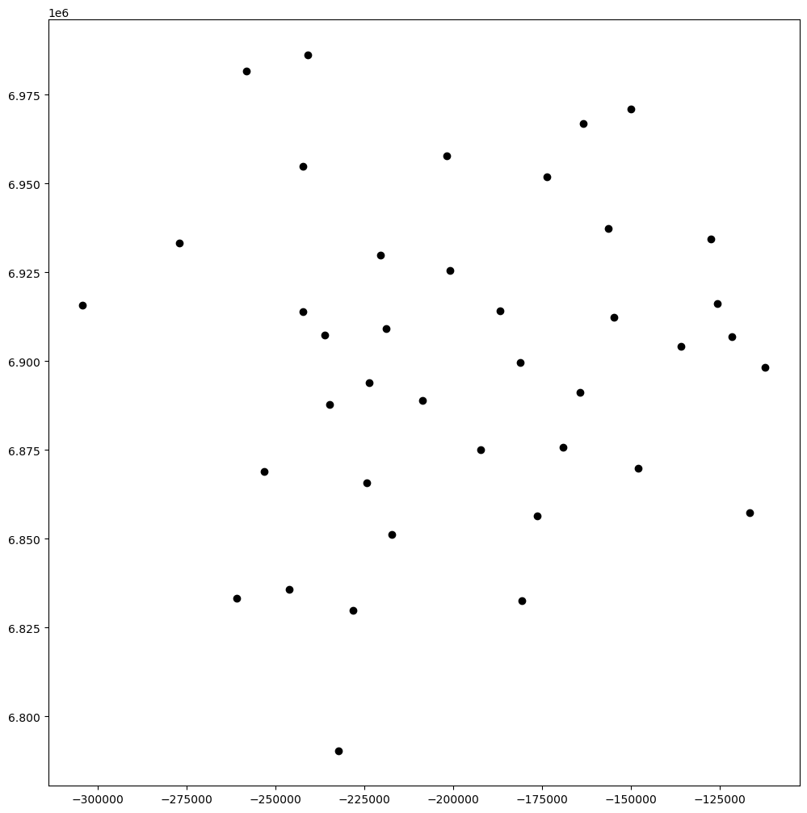

```python
# let's first import the standard python modules
import pandas as pd
import numpy as np
import geopandas as gpd
import matplotlib.pyplot as plt
```


```python
# let's read the UK flows where you have the origin ('residence'), the destination ('workplace') and its attributes.
df=pd.read_csv('datasets/UK_Flows.csv',index_col=0)
df.head(5)
```


<div>
<style scoped>
    .dataframe tbody tr th:only-of-type {
        vertical-align: middle;
    }

    .dataframe tbody tr th {
        vertical-align: top;
    }

    .dataframe thead th {
        text-align: right;
    }
</style>
<table border="1" class="dataframe">
  <thead>
    <tr style="text-align: right;">
      <th></th>
      <th>Residence</th>
      <th>Workplace</th>
      <th>Distance</th>
      <th>Commuters</th>
      <th>O_Pop</th>
      <th>O_Workplace</th>
      <th>D_Pop</th>
      <th>D_Workplace</th>
    </tr>
  </thead>
  <tbody>
    <tr>
      <th>0</th>
      <td>Aberdeenshire</td>
      <td>Aberdeen City</td>
      <td>29282</td>
      <td>41224</td>
      <td>257740</td>
      <td>101816</td>
      <td>227130</td>
      <td>98610</td>
    </tr>
    <tr>
      <th>1</th>
      <td>Adur</td>
      <td>Aberdeen City</td>
      <td>712858</td>
      <td>2</td>
      <td>62505</td>
      <td>23437</td>
      <td>227130</td>
      <td>98610</td>
    </tr>
    <tr>
      <th>2</th>
      <td>Allerdale</td>
      <td>Aberdeen City</td>
      <td>280203</td>
      <td>11</td>
      <td>96208</td>
      <td>37322</td>
      <td>227130</td>
      <td>98610</td>
    </tr>
    <tr>
      <th>3</th>
      <td>Amber Valley</td>
      <td>Aberdeen City</td>
      <td>461424</td>
      <td>0</td>
      <td>123498</td>
      <td>49535</td>
      <td>227130</td>
      <td>98610</td>
    </tr>
    <tr>
      <th>4</th>
      <td>Angus</td>
      <td>Aberdeen City</td>
      <td>66028</td>
      <td>1992</td>
      <td>116240</td>
      <td>42639</td>
      <td>227130</td>
      <td>98610</td>
    </tr>
  </tbody>
</table>
</div>


```python
# let's read in the place location coordinates where we will just take a subset of Local Authorities in Greater Birmingham
df2=pd.read_csv('datasets/UK_Birmingham_pts.csv')
df2=df2[['Name','X','Y']]
df2.head()
#len(df2)
```


<div>
<style scoped>
    .dataframe tbody tr th:only-of-type {
        vertical-align: middle;
    }

    .dataframe tbody tr th {
        vertical-align: top;
    }

    .dataframe thead th {
        text-align: right;
    }
</style>
<table border="1" class="dataframe">
  <thead>
    <tr style="text-align: right;">
      <th></th>
      <th>Name</th>
      <th>X</th>
      <th>Y</th>
    </tr>
  </thead>
  <tbody>
    <tr>
      <th>0</th>
      <td>Tewkesbury</td>
      <td>394086.0613</td>
      <td>227461.1678</td>
    </tr>
    <tr>
      <th>1</th>
      <td>Erewash</td>
      <td>444007.0273</td>
      <td>337765.2693</td>
    </tr>
    <tr>
      <th>2</th>
      <td>Nuneaton and Bedworth</td>
      <td>435676.4351</td>
      <td>289376.2917</td>
    </tr>
    <tr>
      <th>3</th>
      <td>Tamworth</td>
      <td>421903.9782</td>
      <td>303234.2767</td>
    </tr>
    <tr>
      <th>4</th>
      <td>Leicester</td>
      <td>459074.5879</td>
      <td>304818.6533</td>
    </tr>
  </tbody>
</table>
</div>


```python
gpd.GeoDataFrame(df2, geometry=gpd.points_from_xy(df2.X, df2.Y))

```


<div>
<style scoped>
    .dataframe tbody tr th:only-of-type {
        vertical-align: middle;
    }

    .dataframe tbody tr th {
        vertical-align: top;
    }

    .dataframe thead th {
        text-align: right;
    }
</style>
<table border="1" class="dataframe">
  <thead>
    <tr style="text-align: right;">
      <th></th>
      <th>Name</th>
      <th>X</th>
      <th>Y</th>
      <th>geometry</th>
    </tr>
  </thead>
  <tbody>
    <tr>
      <th>0</th>
      <td>Tewkesbury</td>
      <td>394086.0613</td>
      <td>227461.1678</td>
      <td>POINT (394086.061 227461.168)</td>
    </tr>
    <tr>
      <th>1</th>
      <td>Erewash</td>
      <td>444007.0273</td>
      <td>337765.2693</td>
      <td>POINT (444007.027 337765.269)</td>
    </tr>
    <tr>
      <th>2</th>
      <td>Nuneaton and Bedworth</td>
      <td>435676.4351</td>
      <td>289376.2917</td>
      <td>POINT (435676.435 289376.292)</td>
    </tr>
    <tr>
      <th>3</th>
      <td>Tamworth</td>
      <td>421903.9782</td>
      <td>303234.2767</td>
      <td>POINT (421903.978 303234.277)</td>
    </tr>
    <tr>
      <th>4</th>
      <td>Leicester</td>
      <td>459074.5879</td>
      <td>304818.6533</td>
      <td>POINT (459074.588 304818.653)</td>
    </tr>
    <tr>
      <th>5</th>
      <td>North Warwickshire</td>
      <td>425319.3151</td>
      <td>294468.3746</td>
      <td>POINT (425319.315 294468.375)</td>
    </tr>
    <tr>
      <th>6</th>
      <td>Bromsgrove</td>
      <td>399006.3967</td>
      <td>273744.0193</td>
      <td>POINT (399006.397 273744.019)</td>
    </tr>
    <tr>
      <th>7</th>
      <td>Rugby</td>
      <td>445814.9430</td>
      <td>276471.0934</td>
      <td>POINT (445814.943 276471.093)</td>
    </tr>
    <tr>
      <th>8</th>
      <td>Stratford-on-Avon</td>
      <td>425886.6406</td>
      <td>253459.3536</td>
      <td>POINT (425886.641 253459.354)</td>
    </tr>
    <tr>
      <th>9</th>
      <td>Hinckley and Bosworth</td>
      <td>441325.8916</td>
      <td>302252.9667</td>
      <td>POINT (441325.892 302252.967)</td>
    </tr>
    <tr>
      <th>10</th>
      <td>Telford and Wrekin</td>
      <td>367088.9036</td>
      <td>314840.4595</td>
      <td>POINT (367088.904 314840.459)</td>
    </tr>
    <tr>
      <th>11</th>
      <td>South Staffordshire</td>
      <td>388128.5891</td>
      <td>303085.4165</td>
      <td>POINT (388128.589 303085.416)</td>
    </tr>
    <tr>
      <th>12</th>
      <td>Warwick</td>
      <td>428413.2966</td>
      <td>268068.8134</td>
      <td>POINT (428413.297 268068.813)</td>
    </tr>
    <tr>
      <th>13</th>
      <td>Stafford</td>
      <td>388210.5431</td>
      <td>327864.7562</td>
      <td>POINT (388210.543 327864.756)</td>
    </tr>
    <tr>
      <th>14</th>
      <td>Walsall</td>
      <td>402375.5701</td>
      <td>300163.9784</td>
      <td>POINT (402375.570 300163.978)</td>
    </tr>
    <tr>
      <th>15</th>
      <td>Shropshire</td>
      <td>350418.6374</td>
      <td>304381.0877</td>
      <td>POINT (350418.637 304381.088)</td>
    </tr>
    <tr>
      <th>16</th>
      <td>Harborough</td>
      <td>467369.5169</td>
      <td>293956.8063</td>
      <td>POINT (467369.517 293956.806)</td>
    </tr>
    <tr>
      <th>17</th>
      <td>Wolverhampton</td>
      <td>391899.8422</td>
      <td>299050.6823</td>
      <td>POINT (391899.842 299050.682)</td>
    </tr>
    <tr>
      <th>18</th>
      <td>Daventry</td>
      <td>464975.5414</td>
      <td>269079.5732</td>
      <td>POINT (464975.541 269079.573)</td>
    </tr>
    <tr>
      <th>19</th>
      <td>Newcastle-under-Lyme</td>
      <td>378693.4296</td>
      <td>344024.7757</td>
      <td>POINT (378693.430 344024.776)</td>
    </tr>
    <tr>
      <th>20</th>
      <td>Coventry</td>
      <td>432759.0667</td>
      <td>279983.0005</td>
      <td>POINT (432759.067 279983.001)</td>
    </tr>
    <tr>
      <th>21</th>
      <td>Charnwood</td>
      <td>457748.9052</td>
      <td>315827.3534</td>
      <td>POINT (457748.905 315827.353)</td>
    </tr>
    <tr>
      <th>22</th>
      <td>Sandwell</td>
      <td>399486.4660</td>
      <td>290839.0240</td>
      <td>POINT (399486.466 290839.024)</td>
    </tr>
    <tr>
      <th>23</th>
      <td>Blaby</td>
      <td>452827.6533</td>
      <td>297360.7728</td>
      <td>POINT (452827.653 297360.773)</td>
    </tr>
    <tr>
      <th>24</th>
      <td>Worcester</td>
      <td>385652.6308</td>
      <td>255405.3014</td>
      <td>POINT (385652.631 255405.301)</td>
    </tr>
    <tr>
      <th>25</th>
      <td>East Staffordshire</td>
      <td>412744.8054</td>
      <td>329548.3923</td>
      <td>POINT (412744.805 329548.392)</td>
    </tr>
    <tr>
      <th>26</th>
      <td>Stoke-on-Trent</td>
      <td>389059.9595</td>
      <td>346759.3219</td>
      <td>POINT (389059.959 346759.322)</td>
    </tr>
    <tr>
      <th>27</th>
      <td>North West Leicestershire</td>
      <td>440247.9102</td>
      <td>317443.9832</td>
      <td>POINT (440247.910 317443.983)</td>
    </tr>
    <tr>
      <th>28</th>
      <td>Lichfield</td>
      <td>413283.8347</td>
      <td>310071.1585</td>
      <td>POINT (413283.835 310071.159)</td>
    </tr>
    <tr>
      <th>29</th>
      <td>Derby</td>
      <td>435849.8062</td>
      <td>335145.3644</td>
      <td>POINT (435849.806 335145.364)</td>
    </tr>
    <tr>
      <th>30</th>
      <td>Redditch</td>
      <td>403381.0320</td>
      <td>264905.8074</td>
      <td>POINT (403381.032 264905.807)</td>
    </tr>
    <tr>
      <th>31</th>
      <td>Dudley</td>
      <td>392713.4046</td>
      <td>287218.2806</td>
      <td>POINT (392713.405 287218.281)</td>
    </tr>
    <tr>
      <th>32</th>
      <td>Wychavon</td>
      <td>396620.9873</td>
      <td>251769.8821</td>
      <td>POINT (396620.987 251769.882)</td>
    </tr>
    <tr>
      <th>33</th>
      <td>Solihull</td>
      <td>418659.7508</td>
      <td>279492.3303</td>
      <td>POINT (418659.751 279492.330)</td>
    </tr>
    <tr>
      <th>34</th>
      <td>Wyre Forest</td>
      <td>381400.3207</td>
      <td>275762.2966</td>
      <td>POINT (381400.321 275762.297)</td>
    </tr>
    <tr>
      <th>35</th>
      <td>South Derbyshire</td>
      <td>429772.3196</td>
      <td>326031.8441</td>
      <td>POINT (429772.320 326031.844)</td>
    </tr>
    <tr>
      <th>36</th>
      <td>Oadby and Wigston</td>
      <td>461516.9614</td>
      <td>299198.5539</td>
      <td>POINT (461516.961 299198.554)</td>
    </tr>
    <tr>
      <th>37</th>
      <td>Malvern Hills</td>
      <td>376531.2530</td>
      <td>253890.3459</td>
      <td>POINT (376531.253 253890.346)</td>
    </tr>
    <tr>
      <th>38</th>
      <td>Cannock Chase</td>
      <td>401432.6396</td>
      <td>312746.9342</td>
      <td>POINT (401432.640 312746.934)</td>
    </tr>
    <tr>
      <th>39</th>
      <td>Birmingham</td>
      <td>408598.1153</td>
      <td>287856.7593</td>
      <td>POINT (408598.115 287856.759)</td>
    </tr>
  </tbody>
</table>
</div>


```python
#creates a GeoDataFrame from the data frame df2, taking the rows 'X' and 'Y' as the geographical variables
gdf2=gpd.GeoDataFrame(df2, geometry=gpd.points_from_xy(df2.X, df2.Y))
#sets the CRS, which is the coordinate reference system of the map
gdf2=gdf2.set_crs(epsg=27700)
gdf2 = gdf2.to_crs(epsg=3857) # setting crs to 3857
#creates an empty grid to plot the map onto
fig, ax = plt.subplots(figsize=(12,20))
#and fits the points from the gdf2 geodataframe onto this grid
gdf2.plot(ax=ax,figsize=(10,10),color='black')

```


    <Axes: >


    

    


```python

```
